# 2026-06-09

## 1

@朱亚东-数元灵

发表于：2026-06-08 03:37

来源：微博

链接：https://m.weibo.cn/status/5307499076915189

团队管理有一个比较棘手的问题就是，达克效应，简单来讲，就是对于传统的大团队，比如技术团队，内部有不同的岗位角色，有的做前端开发，有的做后端开发，有的偏Infra内核，有的定位算法应用，这种模式带来的问题就是，各个小团队之间有“部门墙”，且松耦合；通俗来讲就是，我擅长的你不懂，你擅长的我觉得没那么重要，最后推衍到整个组织，整体效率不高且集体性偏差；

大模型这一波儿，借助AI的力量，每个人的技术外延都有大幅度的提升，岗位划分就不如之前那么清晰，相应的，对于技术同学的能力定位，更多的是在问题的定义和拆解，然后借助AI的力量，高效并发推进，单兵作战能力大幅度提升，团队backup和稳定性也极度增强

---

## 2

@信号与噪声

发表于：2026-06-08 12:26

来源：微博

链接：https://m.weibo.cn/status/5307632115515553

在这个满是舔狗大模型的时代 ，

Claude冰冷的对话真算是一股清流

---

## 3

@梁斌penny

发表于：2026-06-08 03:40

来源：微博

链接：https://m.weibo.cn/status/5307499847880431

有网友问为什么AI大模型需要那么多内存，XX还能涨多久，是需要更多内存存数据吗？

答：先纠正一个最普遍的误解:现在AI抢的不是"存数据的空间",不是容量墙,是带宽墙。为了拿到足够的带宽,不得不堆上巨量内存，容量反而是搭着带宽的副产品。(下面把显存也算作内存的一种,一种高端内存;消费级PC那条DDR是普通内存。)

第一层,带宽墙,这是根。

LLM推理分两段:Prefill吃算力,Decode吃带宽。reasoning模型的长思维链、agent的长程任务,本质上就是把最吃带宽的解码阶段无限拉长——每吐一个字,都要把整个模型权重从显存里完整搬一遍出来,计算量极小,纯粹是搬运。而硬件偏偏朝相反方向走:2012到2022年,英伟达GPU的FLOPS涨了80倍,显存带宽只涨了17倍,剪刀差还在扩大。算力过剩、带宽被饿死,这才是"卡内存"的真身。推理的瓶颈是内存和互联,不是算力。

这里有个常被讲错的点要厘清:复制多个模型副本,提高的是集群总吞吐(每秒服务多少token),不是单条流的带宽——你一个用户生成一个字,还是卡在那一张卡的HBM带宽上,复制十份也救不了这一个字。吞吐、带宽、容量是三个轴。吞吐决定能同时服务多少人,带宽决定每个人的吐字速度,容量决定能塞下多大的模型和多长的上下文。

第二层,容量,排第二位。

长上下文 × 高并发,KV cache线性膨胀;MoE把总参数推到天量,所有专家都得常驻显存;再加harness等配套也吃内存。容量压力确实存在,长上下文和agent场景下还会明显上升,但相对带宽是次要矛盾。关键在于:HBM是把带宽和容量打包卖的,你为了拿带宽必须堆HBM,容量是顺带的。哪天有技术能不堆容量就给到这个带宽(近存计算、高带宽闪存这类),内存用量自然会下来。

第三层,供给侧被HBM挤爆。

HBM占的晶圆面积是普通DRAM的三倍(die penalty),三大厂把合计九成多的产能转去做HBM,结果2026 Q1通用DRAM价格环比暴涨九成,HBM全年产能售罄,缺口信号指向2027年以后。技术上的稀缺,直接变成了价格上的暴动——这也是为什么你装机的内存条莫名其妙变贵了:产能都去伺候AI了,没人给消费级供货。

具体到XX。一方面他是HBM追赶者，另一条是它少有的领跑赛道——SOCAMM(基于LPDDR5X的模块化低功耗内存,带宽是RDIMM的2.5倍、功耗只有DDR5的三分之一)。它的角色是Grace/Vera CPU侧系统内存的升级换代,定位卡在HBM和普通DDR之间,有人叫它"第二个HBM"。关键是英伟达把XX选为首家供应商,排在韩国几个大厂前头,GB300已经在用,SOCAMM2已经做到256GB送样。这是XX从"追赶者"变"领跑者"的差异化故事。

---

## 4

@蚁工厂

发表于：2026-06-08 12:25

来源：微博

链接：https://m.weibo.cn/status/5307631821393420

这几条比较火的那个史记知识库 - 让两千年的文字活过来，作者是@西瓜大丸子汤 鲍捷老师

github库：github.com/baojie/shiji-kb

核心功能

    22 类实体语法高亮：18 类名词（人名/地名/官职/身份/时间/邦国/氏族/名物/族群/器物/天文/神话/生物/数量/典籍/礼仪/刑法/思想）+ 4 类动词（军事/刑罚/政治/经济）

    语法高亮开关：右上角齿轮按钮，可关闭高亮专注阅读（持久化保存偏好）

    知识索引跳转：14,065 个实体词条（126,441 次标注），别名 3,489 条（variants），章内消歧 11,514 处

    Purple Numbers段落编号：每个段落可精确引用和分享（致敬Doug Engelbart）

    史记地铁图：130条线路×3,197站点，支持缩放/拖拽/搜索/时间线

\#AI创造营\#

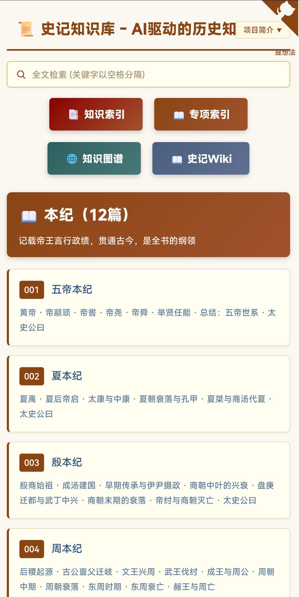

---

## 5

@有限次重复博弈

发表于：2026-06-08 11:05

来源：微博

链接：https://m.weibo.cn/status/5307611790708114

这张图拿2000年前后的Cisco与2020年后的NVIDIA比较。Cisco当年股价大幅领先EPS，市场买的是网路想像，获利并没有同步支撑股价。

NVIDIA的状况不同，近年股价上涨的同时，EPS也快速攀升，甚至成长速度比股价更猛。

这代表AI行情不是只有故事，而是已经反映在实际营收与获利。

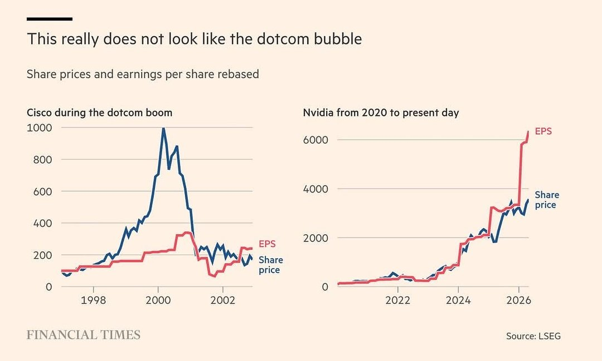

---

## 6

@奥卡姆剃刀

发表于：2026-06-08 11:59

来源：微博

链接：https://m.weibo.cn/status/5307625338046862

前段时间在苏州和多位AI领域专家私下交流，大家聊到了AI对就业岗位带来的颠覆性影响。

如今不少大型企业已不再招聘初级程序员，相关工作由AI接手，效率和效果更出众；法律行业同样受到明显冲击，AI整理处理事务的完备度远超名校实习律师。

 

大家普遍认为，未来社会不再需要海量劳动力。有专家提到，仅中国的工业产能，就足以满足全球基础物资与工业品需求，大部分人无需参与传统工作。

 

未来，营养口味兼备的餐食会成为全民基本保障。社会运转仅依靠少数顶尖人才推动，即便这部分核心从业者，日常饮食也和大众相差无几，毕竟人体所需营养本就有上限。

 

不必过度焦虑就业问题，未来人人都能衣食无忧、享受生活，社会也会形成全新的分配体系。

AI本质上是对人类的解放，人们终将摆脱高强度的劳作模式。

---

## 7

@戴雨潇Dai

发表于：2026-06-08 11:23

来源：微博

链接：https://m.weibo.cn/status/5307616281764050

//@笑看风云A2025:和外交无小事一样，在这个视频中，我们观察到一种典型的“跨文化互动中的过度补偿”现象。这位女生的笑声、笑容和肢体语言，是一种无意识，是长期处于“西方中心主义”话语环境下，形成的一种防御性社交面具。她潜意识里认为，只有表现出足够的热情和顺从，才能被“上位者”接纳。如果换做是你我，在那种突如其来的镜头和跨文化语境下，能否保证完全不被这种深层的心理结构所影响？//@蘸盐:应当起诉这个印度人//@璎珞牡丹:建议起诉拍视频发视频的原博主 查看图片

---

## 8

@宝玉xp

发表于：2026-06-08 03:14

来源：微博

链接：https://m.weibo.cn/status/5307493280383648

在AI时代，每个程序员都活成了自己最讨厌的那种 team leader：

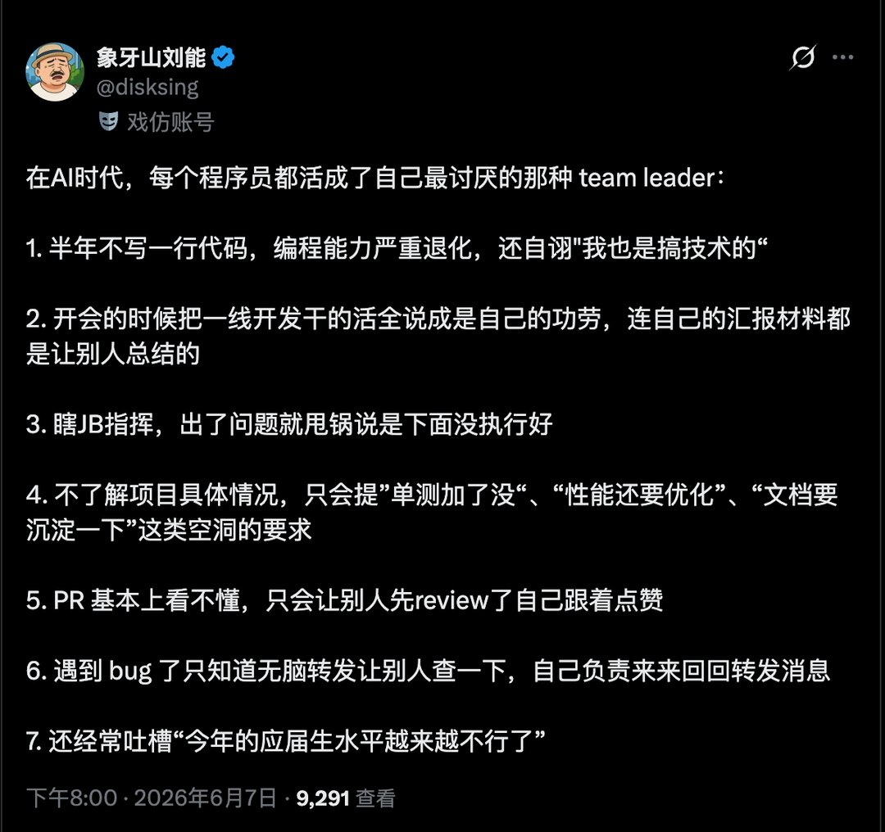

---

## 9

@挨踢牛魔王

发表于：2026-06-08 04:23

来源：微博

链接：https://m.weibo.cn/status/5307510719514539

刚看到一个数据，chagpt有10亿用户，只有5000万付费用户，而且大多数还是每月出20美元那种用户。

免费用户大多数都是白嫖的。

openai的收入，40%来自企业用户。

而anthropic只有5600万用户，但是基本都是付费的，那种聊天客户非常少。

就是说，anthropic拿到的都是出钱的高价值用户，openai用户虽然多，大部分都是不出钱的。

说明openai还是用以前互联网那个流量思维来做产品，现在是算力太贵，亏不起了。

所以chatgpt要转型，要把chatgpt,codex,api都整合起来，现在才意识到这个事情，是不是有点晚了？

聊天用户，你就用最便宜的模型，然后推送点广告算了。

当然要把算力放在付费用户这边。

---

## 10

@秦枫

发表于：2026-06-08 04:59

来源：微博

链接：https://m.weibo.cn/status/5307519769776501

灵活就业已经从五年前就业市场的补充形式，变成现在就业市场的重要支柱了……

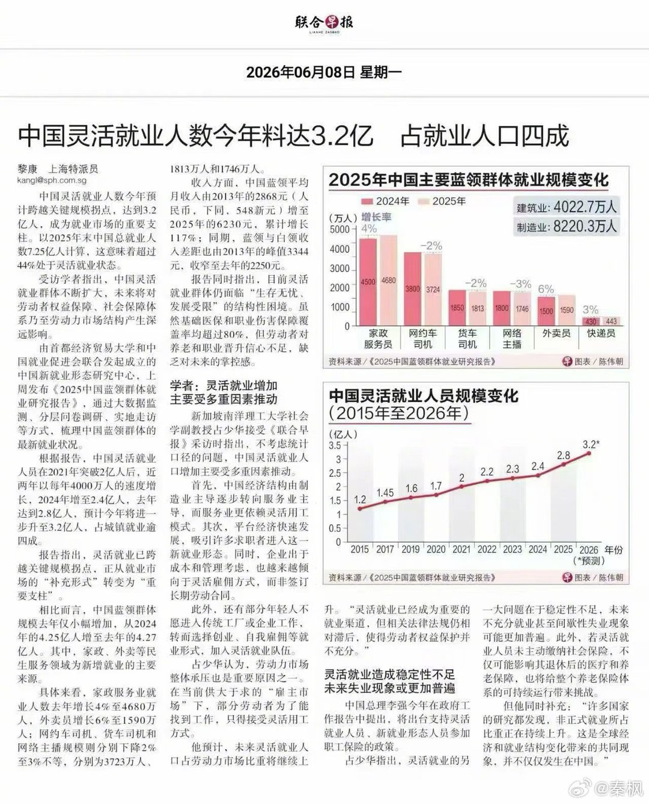

---

## 11

@36氪

发表于：2026-06-08 14:00

来源：微博

链接：https://m.weibo.cn/status/5307655728930240

【Chat已死，GPT史上最大改版，不只聊天】

就在周末，FT放出了一份十多位OpenAI现任和前任员工的集体爆料——

ChatGPT即将迎来2022年上线以来最大规模的改版。

5天前，ChatGPT月活刚破10亿。达成这一数字只花了三年，堪称史上最快。

然而万万没想到，如此成功的聊天机器人，OpenAI转头就给判了死刑。

\#氪君领读\#

1、ChatGPT不想只跟你聊天了

过去三年半，ChatGPT的核心逻辑是「你问我答」。你输入一句话，它给你一段文字。这个逻辑撑起了一条疯狂的增长曲线。但OpenAI内部越来越觉得，这条曲线撑不起一家万亿美元公司的估值。

2、Codex上位，ChatGPT的人靠边站

ChatGPT、Codex、开发者API，三条产品线被合并进一个团队。一个不能写代码的ChatGPT只是聊天界面，一个没有消费者入口的Codex只是工程师工具。两者必须合体。

3、OpenAI最不想看到的一幕发生了

ChatGPT作为聊天工具，商业模型太薄。95%的用户白嫖，剩下5%每月付20美元，靠这个模式给万亿估值讲盈利故事，没有投资人会买账。

4、ChatGPT，名字里写着自己的悖论

OpenAI拥有10亿用户但深陷变现焦虑，Anthropic只有5600万用户但增速碾压一切。谁活成了谁想活成的样子，Q4见分晓。

详情请阅读：Chat已死，GPT史上最大改版，不只聊天，本文来自“新智元”，作者：ASI启示录，编辑：摩西。

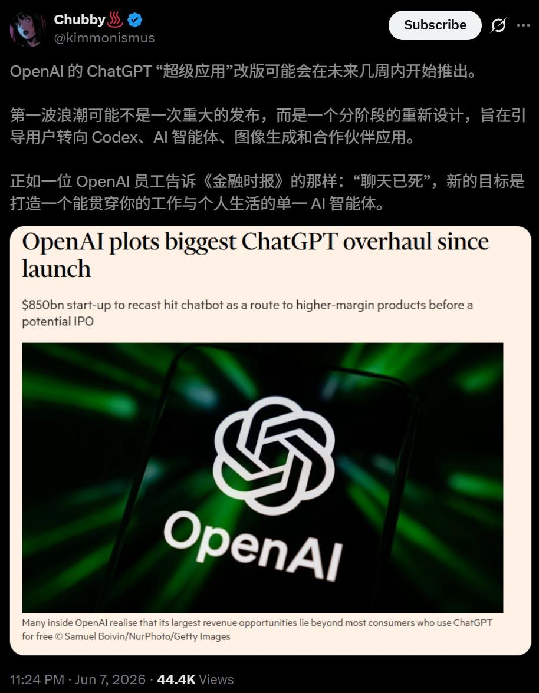

---

## 12

@马锐拉

发表于：2026-06-08 08:34

来源：微博

链接：https://m.weibo.cn/status/5307573793194380

《置身钉外》

说在前面

2026 年 5 月 15 日，我办完离职手续，正式告别三年阿里生涯，离开钉钉。

想做个总结，但发现其实啥也不能说。

成年人的世界有点复杂。过去每一次我在内网发帖，热度第一，HR 总会第一时间给我打电话——要不你还是删了吧，要不你还是删了吧，要不你还是删了吧……

这篇文章我写了快两万字，然后删去不能说的一万八千字，再捡回感觉应该能说的五百字，每个来回都仿佛有个声音在我耳边环绕：要不你还是删了吧。

所以就挑点能说的，至少是真情实感。

（AI 建议后续内容删除）

心疼第一

这篇文章的第一章，还是应该叫“心疼第一”。

看完幽素在阿里内网写的《置身钉内》，我发了一条朋友圈：

花了 3 个小时，看完全文，还是久久不能平静，只是觉得心疼，心疼，心疼。

文章最后，“胃里的蝴蝶”从身体里飞出来。看到这我真的没绷住——一个人终于把压在身体里的东西倾泻出来。

外人可能很难理解，因为没有置身钉内，未必能感同身受。

我对她写的 One 项目内部细节一无所知。因为保密项目确实保得很密，密不透风。

但她写到的那种空气，我知道。

那种高压，那种努力之后没有结果，那种频繁汇报、高速迭代、不见起色的循环，我知道。

我心疼的是，一个这么有想法的年轻产品，最后需要用七万字，把自己从一个系统里打捞出来寻求解放。

我心疼那些在钉钉认真想过、认真做过、认真挣扎过的同学。

员工第二

“客户第一，员工第二，股东第三。”

这句话最早可能出自马云 2010 年在创业板某个论坛的演讲，马云说：“我是坚信客户第一、员工第二、股东第三……不是对股东看不起，而是在分配资源的过程中，把股东放在第三位。”

在阿里巴巴赴美 IPO 前，马云在给投资者的信里专门解释了这句话。他写的是英文：“customers first, employees second, and shareholders third.” 后面解释说，阿里创造长期股东价值的方式，是先为客户创造可持续价值，所以客户必须第一；员工第二，因为没有满意的员工就没有满意的客户。

这句话后来一直是阿里价值观的一部分。

这句话很好。因为它很朴素。先服务客户，再成就员工，最后才是股东回报。一个商业组织如果真的这么排序，至少在价值判断上是顺的。

但当一个组织进入极高压状态时，“员工第二”到底是什么意思？

它是说员工排第二，还是说员工永远要在第二位让步？

上周末，我和一位前同事聊《置身钉内》在内网变成热帖这件事。

我问他：你看了吗？你觉得在不在理？

他说：部分在理，不过不全面。

这句话我认同。

任何一个人的文章都不可能全面。每个人只能从自己的位置、自己的经历、自己的身体里写出来。她从她的项目里写，当然不会全面。可从她的视角看，在理就够了。

我过不去的是后面的反应。

他说，这种内容很容易引起话题，他不欣赏这种发热帖的人。影响公司对员工有什么好处？

我说，如果它对公司有正面积极的影响，那算好处还是坏处？

他没有接。

他说，每个公司都有自己的问题，没有完美的公司，就像没有完美的个体一样。

我说，这句话说了跟没说一样，地球还有地球的问题呢，没有完美的地球。

他回到原来的位置：不欣赏这种做事方式，不认可发热帖的方式，也不想讨论这个人。

我当时说了很重的话。

我说，夏虫不可语冰。后来又说，夏虫不可语冰已经不够形容了，这就是冷血。

再后来，我说了更重的一句：这样的人不配做 XX。

这句话有点过了，我应该向他道歉。

可能在这个系统里，每个人都身不由己。人会异化成制度的零件，封闭了所有首先作为一个人的基本温度。

一个员工在即将离职前写下七万字，说自己如何思考、燃烧、挣扎、受挫、力竭、彷徨。这个时候，组织里的人如果第一反应是评价她的表达方式、动机和对公司的影响，却不去确认痛苦的来源与根因，那“员工第二”就变成了一句漂亮的空话，而长远看，每一个零件都要为自己的麻木，为这台机器最终可能的崩坏负责。

阿里内网存在的意义是什么？

是用来公关，报喜的吗？还是用来让大家在一个相对安全的地方说真话？还是说，所有真话只有在不造成影响的时候才被允许存在，一旦变成热帖，就要先审判发帖的人？

可帖子能不能变热，作者决定不了。

它之所以变成热帖，一定是因为它说到了一些本质的，组织不愿意被揭开的却又会让很多人共鸣的问题。

即便幽素不写，也会有幽荤、默素会写。

你不可能阻止所有离开的人写离职帖。你也不可能要求每一个离开的人，都只写“感谢公司，感恩成长，未来可期”。

某种意义上，出圈的离职帖就像确实检查出问题的体检报告，它应该引起身体对问题的重视，而不是追问你为啥要给我出报告啊？

伟大领袖说过：让人讲话，天不会塌下来。我相信马老师希望大家在内网说真话也是这个初衷。

AI 第三

（AI 建议本章整体删除）

秩序第四

（AI 建议本章整体删除）

悟空第五

（AI 建议本章整体删除）

决心第六

差不多五一前后，我开始反复想一件事：

我要离开钉钉。

思考良久，我越来越难确认自己是在创造产品，还是只是在消耗身体追赶一个不断前移的节奏。

有一段时间，我一周 7 天，每天 9 点上班，凌晨 2 点回家，睡 5 个小时，第二天继续。

由于长期缺乏睡眠，整个人都在一个懵逼的状态里。

幽素在文章结尾说，泰坦尼克号沉了，但船上的水手还可以找下一份工作。

我想的是：只有活下来的水手，才能找到下一份工作。

字面意义上的“活下来”。

我真的想多活几年。

我想看 AI 怎么改变这个世界。

钉外第七

阿里工作满三年的员工，会收到一个周年礼，是一个带有证书和精美收纳盒的玉坠。

离开杭州前整理东西，我端详了它半天，摇摇这个玉坠，然后把它收好放进行囊。

回到上海，我终于可以在离模型更近的地方，继续考虑 AI 产品到底应该怎么做。

我可以下楼，去喜茶买一杯少冰低糖的苦巧咸酪，花半个小时想一些有价值的问题，不用担心 HR 给我打电话，说老板刚刚路过你的工位，问你在哪儿。

我可以走到西岸梦中心，看全上海最多的西部高地白梗在江边斗艳，然后去胡麻吃一碗牛脸颊饭。

我也可以在工位上，俯瞰黄浦江上的轮船来来往往。

我可以 9 点从容出门上班，也可以在公司待到行政提醒最后一个离开的人记得关灯。

我重新开始有了旺盛的精力和工作的动力。

有时候我会想，如果我要用失去所有生活的代价实现一家公司的理想，那我又有什么资格描绘 AI 改变世界的蓝图？

我在钉钉所经历的一切都已成过往，如果不是幽素 7.5 万字的毕业贴，我只希望往事随风。

但看完《置身钉内》，我真的心疼那些为钉钉付出太多却没有得到结果的同学，那些在风浪中努力稳住船帆船桨的水手们，在没有方向指引的航行后终于撞到冰山后无望的呐喊，我能够听到，我终于听到！

我内心是希望无招能够带领钉钉重现辉煌的，但代价不应该是所有人用工作时长换油尽灯枯。这个时代努力勤奋固然重要，但灵光乍现的创造力也同样重要。

想说却不能说的，还很多，攒着不是因为想写成歌让人淡淡地记着，而是 AI 提醒我，这可能会违反保密协议。文章的标题叫《置身钉外》，但基本上，“置身钉”的部分全部删除了，所以其实标题应该叫《外》。

加油啊，姑娘，还有少年，以及热血尚存的中登们，我没法全部写出你们的名字，但经历过风浪的水手一定会有更好的前程！别担心，板上钉钉！

---

## 13

@姜博杨

发表于：2026-06-05 04:11

来源：微博

链接：https://m.weibo.cn/status/5306420360645142

\#钉钉内网再出7万字长文\#时隔一年，又是6月，又是钉钉，又是内网万字长文，这一次，字数翻了7倍。

 

网传发帖人是钉钉悟空事业部的一位AI产品经理，用一篇文章把公司内部组织、产品决策，团队内耗，考勤管理……挨个剖析了个遍。

 

内网员工评价：“今年阿里内网质量最高的内容，甚至没有之一。”

 

去年6月，钉钉产研负责人元安在离职前发了一篇近万字的离职帖，直言阿里的大公司病，KPI导向，层级冗余等问题。

那篇帖子在内网观看近2万次，马云亲自留言回复，“写得很好，阿里在发生变化之中，希望你常回来看看。”

 

一年后的同一个月，同样是钉钉，同样是一篇引爆全网的深度长文，字数从万变成了7.5万

网友调侃：“钉钉是不是有什么6月发帖的传统？”

 

据看过人士透露，《置身钉内》内容极其庞杂，组织架构与内部矛盾：悟空事业部AI项目落地的实际瓶颈，跨部门协同中的推诿和内耗。

产品决策翻车实录：复盘钉钉多次重大改版失败的具体经过。

大公司通病清单：层级冗余、KPI绑架产品、脱离用户需求、资源争夺。

管理层的争议细节：高管考勤、工位巡查，甚至凌晨12点查岗。

有老员工感慨：“文章一半是真情感慨，一半是毫不留情的现状剖析。”

 

看过零星片段截图的人纷纷表示：

 

“句句写实，完全就是真实在大厂干过的状态。”

“资源协调、项目落地，每个点都能对上号。”

“看完最后一个字，沉默了很久。这才是真正的‘置身钉内’”

 

去年元安的万字帖，马云亲自回复。今年这篇7.5万字的《置身钉内》，这一次不知道这款长文会不会获得高层的重视呢

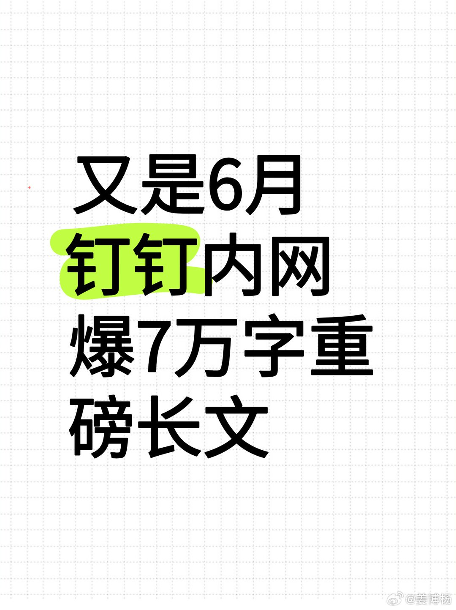

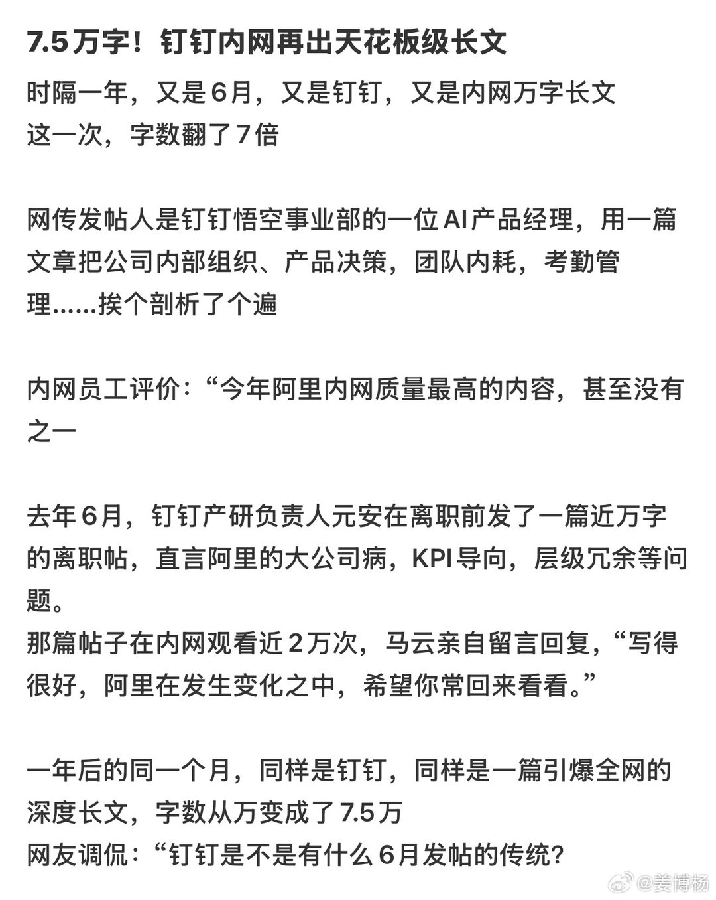

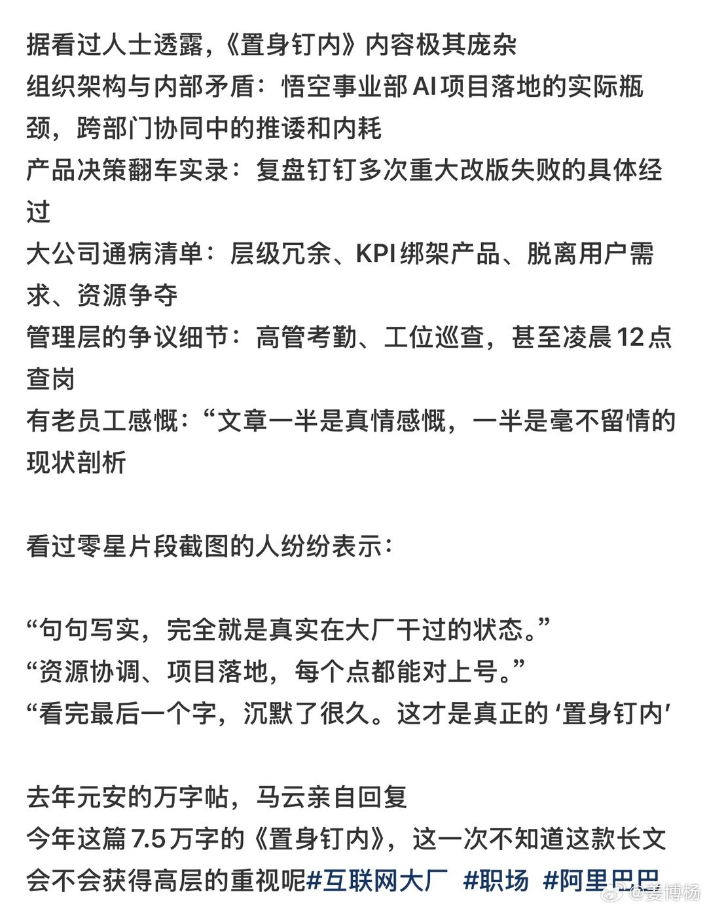

---

## 14

@李成东

发表于：2026-06-08 12:04

来源：微博

链接：https://m.weibo.cn/status/5307626564883000

整体消费环境不好，商场供给过剩，人流分散之后，人流量下滑严重。竞争又极其内卷（“卷得要死”），奶茶店十年间从4万家暴增至40余万家，导致好生意也变垃圾生意。大量优秀餐厅业绩也大幅下滑，外卖大战之后，有些餐饮店从日流水2万跌至5-6千，直接干死了一批餐饮商家。\#东哥笔记\#

---

## 15

@tombkeeper

发表于：2026-06-07 05:47

来源：微博

链接：https://m.weibo.cn/status/5307169428735753

据说 Google 裁掉了工程教育团队。这类岗位原来的工作是通过技术课程建设、工程最佳实践推广等，达到提升工程效率、代码质量的目的。

AI 已经让这些工作的意义变得很小了。

---

## 16

@宝玉xp

发表于：2026-06-08 17:08

来源：微博

链接：https://m.weibo.cn/status/5307703077374074

微信总是想着大家都去他们家一亩三分地耕耘，还幻想着未来微信会继续是超级入口，人人都在用微信，所以只需要让 AI 去操作小程序。

但现实是，未来微信的入口属性会越来越少，以后的年轻人，不会再去打开微信，只会问自己的 Agent：去帮我总结一下我昨天的群聊，去给我妈发条消息说晚上不回家吃饭了。

而这个承担超级入口职责的 Agent，大概率不是微信 AI。

这一波 Agent 进化是先从效率场景开始：编程 -> 办公 -> 其他

微信的主要场景恰恰是生活类的，这一类目前 Agent 能力还不够，能做的事情很有限，到时候就算接入了一堆的小程序，以微信 AI 的能力现在不一定就能处理好生活类场景，比如帮你订个机票酒店什么的。

等到效率场景都被其他 Agent 抢占用户心智了，会自然而然的泛化到生活场景，用户会倾向于都用相同的 Agent，那时候就真没微信 AI 啥事了。

---

小龙虾为什么很成功，至少有两个因素是很重要的：

1. 它没有那么多权限、安全上的顾虑，能连接很多你的隐私数据，能有很高的权限运行脚本。

且不说安全性问题，但很多任务确实是少不了这些权限，Claude Cowork 我不爱用恰恰就是权限卡的太死了。

2. 它有一个 PC 作为运行环境，实时编写脚本反复尝试、消耗了大量 Token 后大力出奇迹，反正结果给你做成了

而微信 AI 这两者都不具备，既拿不到你手机多少权限，也没有一个长期稳定运行 Agent 的环境，更不会给你烧很多 Token。

指望把这个成本转嫁到小程序，问题是开发者也不傻，不可能会给你贡献 Token 的。

最终大部分场景是体现不出 Agent 能力的，用户用完会觉得这还不如直接手机上指挥 Codex、Claude Code 等

---

微信 AI 想复制 Agent Skills 的成功，甚至开发规范都是参考 Skill 和 MCP 来定义的 （图2）

但是小程序却有几个致命的缺陷：

1. 无法自动进化

Skill 有不足，Agent 在用的时候就能发现，Agent 直接就能改，越改越好用。

小程序是要打包要审查的，Agent 用的时候发现问题，它也许能汇报给开发者，但是无法去改，就算不好用也只能凑合甚至“摆烂”

2. 无法高度定制化

好用的 Skill 都是高度个性化的，每个人的偏好不一样，Skill 受欢迎一个原因也是每个人都可以去自己定制，从头写或者找个开源的，让 Agent 帮改改，再加上自动进化和记忆能力，它会越来越好用。

3. Agent 图形界面操作能力远不如脚本能力

小程序是图形界面操作，除非微信 AI 把小程序的接口搞的跟 CLI 一样，让 Agent 可以像命令行工具一样操作小程序，否则模型操作小程序的成本和成功率都很难做好。

---

微信总以为自己是 OS（操作系统），但是它不是，它只是寄生在手机系统上的庞然大物罢了。

当年豆包手机想访问微信它拒绝了，但很快回旋镖就要砸到自己的头上了……

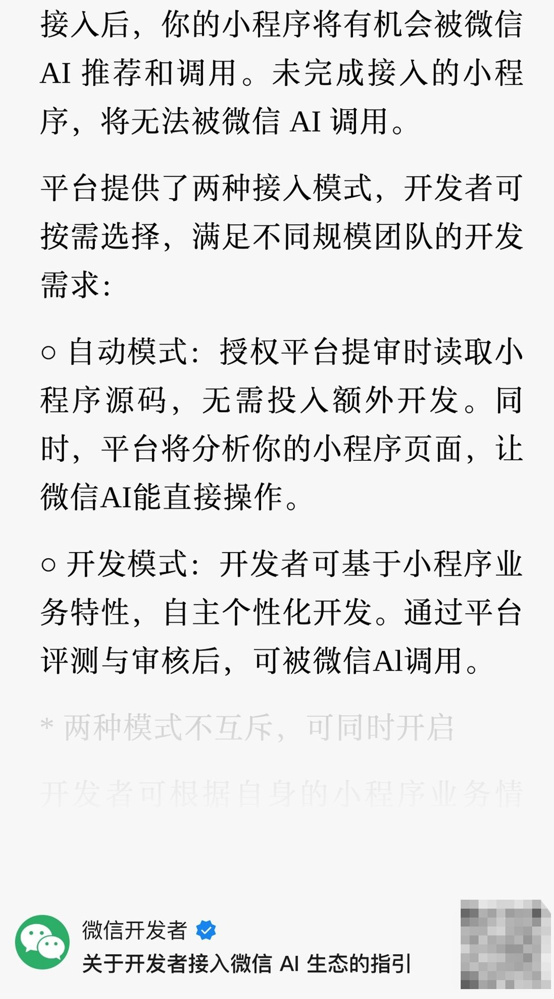

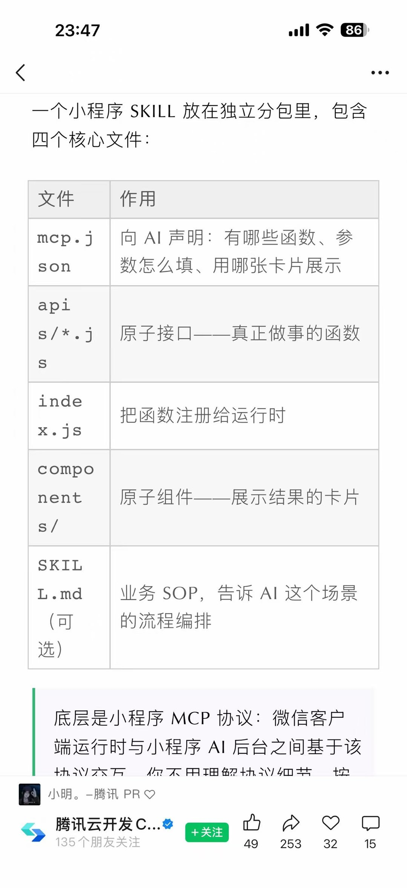

---

## 17

@蚁工厂

发表于：2026-06-09 08:45

来源：微博

链接：https://m.weibo.cn/status/5307813891149184

DeepSeek在建机房了，正在招聘IDC设计规划工程师。这应该也是其融资的一个原因。

“今天的数据中心已经从传统机房演进为支撑AI训练与推理的大型工业系统。你将有机会参与从MW到GW级基础设施的规划与建设。”

GW级，大概是50万卡规模吧

---

## 18

@China航天

发表于：2026-06-09 08:45

来源：微博

链接：https://m.weibo.cn/status/5307821931626791

SpaceX今天凌晨发布的其第一代AI1卫星— —

AI卫星第一代总体数据:

·150kW峰值计算负载

·120kW平均计算负载

·每吨70 kW

·计算提供商可互换

尺寸：

·翼展：70米

·展开高度：20米

热管理系统:

·110 m²可展开液体散热器

·冗余泵循环

·集成微流星体防护

·可展开液体散热器

太阳能系统:

·150 kW 太阳能阵列

·250 W/m²

架构:

·集中式计算模块

·大型可展开太阳能阵列

·可展开液体散热器热管理系统 China航天的微博视频

---

## 19

@风云学会陈经

发表于：2026-06-09 08:45

来源：微博

链接：https://m.weibo.cn/status/5307816509702803

AI巨头喊“刹车”，小心被算计

环球时报 陈经 2026-06-09

近日，美国AI公司Anthropic发布长文，展示其公司人工智能（AI）模型在修改和生成自身代码方面的进展，包括公司代码8成以上由AI自主编写、排查任务崩溃故障速度远超人类、执行复杂任务时独立稳定运行的时长翻番等。该公司以此为由，呼吁全球放缓前沿AI研发，并警告“递归自我改进”可能脱离人类控制，风险不可控，主张建立全球协调机制，主动放慢乃至暂停前沿AI的发展。

然而，这份“刹车”宣言发布的时机相当耐人寻味——就在文章发布3天前，该公司刚秘密递交了IPO注册文件，正式启动上市程序，投后估值高达9650亿美元，与SpaceX、OpenAI并肩。“末日警钟”与资本盛宴的戏码几乎同时上演，让人很难相信这纯属巧合。

需要明确的是，所谓“AI递归自我改进”，至今仍然只是一种推测，离现实还很远。图灵奖得主杨立昆等学者一再指出，大语言模型本质上只是“统计机器”，只靠现有的训练方式无法真正达到人类水平的智能。所谓AI将威胁人类存亡的担忧，在学理层面显得荒谬可笑。

而在现实代码工作中，AI的优势主要体现在写代码、跑实验等需要大量依靠人力的重复环节，架构设计、目标设定、审查把关等关键决策，仍然离不开人的主导。即便AI写的代码越来越多，也改变不了从辅助编码到完全自主之间巨大的技术障碍。对此，业界目前也没有清晰的发展路线图。

动辄渲染“AI失控”，其实是西方AI企业的“看家本领”。以Anthropic为例，自成立伊始，这家公司便大打“安全牌”，屡屡描述AI系统可能失控的末日图景，甚至呼吁宗教界扮演AI发展的伦理监督等。种种操作表明，相比所谓的公共关怀，西方AI企业这套“安全叙事”更像是精心设计的品牌造势。

在笔者看来，西方AI企业的这波炒作，隐藏着更深层的算计：借“全球协调机制”之名，行技术封锁与发展权剥夺之实。它在本质上与西方早年围绕“碳排放配额”的操作如出一辙。当发达国家完成工业化、直接碳排放的峰值过去后，它们开始以全人类气候安全为名设定全球排放上限，并分配配额。历史排放被轻轻放下，未来发展的排放权却被严格标价，后来者要发展就必须付费。表面上是为全人类共同利益制定规则，实则是先行者用规则锁死后发者的追赶通道，将发展权牢牢攥在自己手中。

西方AI企业所呼吁的“AI刹车”，正是给这套传统配额逻辑套了个AI的新“壳”。实际上，“刹车”的负担是严重不对等的——先发者享受了早期探索的全部红利，随后以公共安全为由推动建立国际管控机制，设定模型能力上限、训练算力门槛和合规审查标准，后来者则被要求停留在原地，只能通过高价购买先行者的产品来“分享”技术进步，被框定在先行者定义的技术秩序之中。如此一来，技术差距便被固化为永久性的能力鸿沟。

正因如此，西方推崇闭源的AI企业，对那些有能力提供低价替代方案的后发力量格外警惕。因为一旦开放、低成本、高性能的模型出现，它们高定价的商业模式必将面临冲击，而精心设计的“规则管控”体系也会因存在可选、可替代的产品而彻底失效。因此，封锁与炒作对西方AI企业而言就不仅仅是一种商业防御，更是规则垄断的必要手段。

AI的发展当然需要审慎，治理和安全的讨论也有其真实价值。但审慎不应成为垄断的借口，更不能借“防AI失控”之名，行独占技术霸权、剥夺发展权利之实。对于全球AI产业而言，眼下真正的风险不在于机器失控，而在于少数公司借助恐惧叙事和规则设计，将技术话语权和发展权抓在自己手中，用高昂定价和封闭生态阻断全球AI的普惠进程。拆解这种恐惧叙事，让技术回归开放与协作，才是对AI未来真正负责的治理。

---

## 20

@布尔费墨

发表于：2026-06-08 09:36

来源：微博

链接：https://m.weibo.cn/status/5307589480153119

这样不行。给一个所谓弱势群体开了后门，以后所有的弱势群体都会要求延长考试时间，降低考试难度，要求加分。

在美国名校，30%–40%学生注册“残疾”，多数是ADHD、焦虑等，目的就是多50%时间。学生都热衷于去诊断精神疾病。

我很多年以前讲过\#中国美国化\# 的问题。现在中国的白左把中国搞得越来越像美国了。长此以往，中国也会像美国一样衰落。

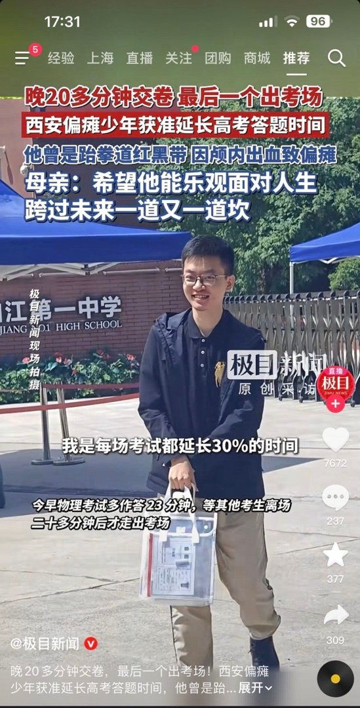

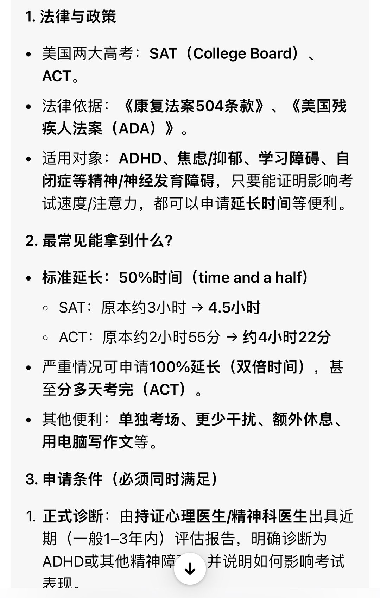

---

## 21

@南山林雪萍

发表于：2026-06-09 08:46

来源：微博

链接：https://m.weibo.cn/status/5307812592747234

城市之间的产业决战，已经在三线城市发起总攻。这两天在河北邯郸永年调研，意识到城市之间正在新的产业竞赛。当合肥、上海、成都和南昌都在围绕核聚变之城而投入巨资的时候，三线城市和四五级县城则在捍卫传统产业王者的地位。

永年位于邯郸北部，是河北省第二大人口城市。这里是全国紧固件最密集的产业。这种螺丝钉螺帽无处不在，被看成是“工业大米”。永年有100万人口，30万人围绕紧固件而展开生计。而10万销售大军则散落各地，成为这个紧固件生产基地四下伸展的触手。

中国紧固件最早是机械部定点生产，因此有上海、沈阳、天津等“八大标”基地。然而这些往日的定点厂，逐渐衰落。脱颖而出的是那些未经规划之地的土生土长的地区。

浙江宁波慈溪、浙江嘉兴的嘉善和海岩，都是兴旺之地。而永年地区，则在最近几年呈现了强烈上扬的势头。它以一个县城的整体姿态，向往日那些龙头企业挑战。那些传统的不能再传统的产业，市场竞争出现新的态势。龙头企业已经不能再单打独斗，它的背后还需要产业集群的支撑。

紧固件龙头的上海天宝，就像一头老虎一样，正在感受到永年群狼的虎视眈眈。天宝在湖南娄底冷水江县有一个工厂。在这个长沙西南200公里的县城，天宝需要自己构建一个紧固件完整的帝国。需要有冷镦钢铁厂，需要开发模具，还需要培养工人。当地没有产业营养提供给它，它是在向当地输送知识和技能。然而，在永年，产业工人都是现成的。永年地少人多，劳动力非常充沛。而且后背力量拥有强大的人力蓄水池。邯郸职业技术永年学院，是全国唯一一个为紧固件设置的专业院所。

实际上，天宝的紧固件有1/4是在永年向外销售的。永年有一个全国非常先进的智能仓储，发货速度按照京东的中心仓方式进行运转。在冷水江市，一个五金店所购买的螺丝，并非在隔壁天宝工厂采购，而是从永年下订单，而且成本更低。30公里半径的小城商品，价格输给了1200公里之外的产业枢纽。

如此大的产业要素差异，对天宝而言，往日的优势可能会一点一点消退。目前天宝也在收缩阵地，放弃低强度，进军8.8级以上的高强度紧固件。而永年的企业，也在步步紧逼。鹏标和万力都进入到了8.8级的强度，而万力甚至做到了12.9 级。这些体量远远不如自己的对手，有着旺盛的追赶热情。而产业集群则给他们了熟人社会和知识共享的无穷养分。龙头企业可能也需要仔细思考，城市工业带的集体实力，会带来何种竞争优势或者劣势。

中国最早的国营企业基本消亡。而少有的国营企业如常熟标准件厂（常标厂），能够在改制之后转型成功。尽管它曾经辉煌，但目前已经退出靠前的位置。苏州有更好的产业机会，电子和汽车等都形成一种产业虹吸效应。相对标准件，这些行业了资本和人力的抽水泵效应。常熟的紧固件，不是在应对同行的竞争，而是在面对同地区的资源抽血。

浙江嘉善因为有台湾企业如晋亿的迁入，而一时兴起。宁波紧固件出口大王如金鼎，依然保持较好的竞争力。然而，它们目前都能感受永年制造崛起的压力。

这些压力看上去是来自一个一个往日不曾留心的对手。一不小心，就有新的面孔。永年的企业，似乎层出不穷，总有出来打擂挑战者。看上去一个集群只要拥有了集体养分，总会出现新的冲击波。集群的活力，呈现了比企业创新更持久的能量。

大和喜力德目前已经成为钻尾丝的王者。而在喜力德未起步之前。慈溪振成在10 年前曾经钻尾丝的老大。但现在已经下滑。大和的崛起，代表了一种卓越制造信念的胜利。这种可以钻进钢铁中的钻尾螺丝，需要优良的稳定性。

对于每年产量5万颗螺丝钉的生产线上，保证每一颗螺丝钉都能拥有“死守阵地”的螺丝钉精神，并不容易。喜力德需要成为材料转角爱，在钨钢材料进行金相分析做材料改善。而在永年工厂的三产，则广泛采用了自动化生产技术，将30台冷镦机完成联线一体化。地上机器完成冷镦和搓丝，地下建立暗道输送螺丝钉。而空中则建立天车轨道送到另外的车间进行热处理。大和是一个精益制造持续改善的典型，即使放在浙江、上海和深圳，它的制造力量也不会输给当地。大和是永年的卓越制造的标杆，也起到了行业火把的作用，促使永年的集体向上。

同样，在超高压的铁塔上用的电力螺栓，本来是浙江衢州海立和衢州江山市的信德的天下。而永年的兆运电力也快速崛起，挤入国网招标体系的三甲之列。

紧固件产业出现了新的竞争态势：企业之间的市场争夺，蕴藏着城市工业带之间的区位较量。

区位较量，是隐性的。区位优势，并非只有地理条件，更重要的是区位服务。最典型的是产业公地。它不以企业竞争的盛衰而引人入胜，相反它充满了琐碎的幕后工作而不为人所喜，更不被重视。因此，它的存在不容易被察觉。永年地区拥有无与伦比的产业公地。永年紧固件标准服务中心，有近百号人，甚至超过了当地的经信局人数。

只有这样一个专业化的队伍，才能为当地紧固件集群起到了智库和行业守望者的作用。这里建立了中机检测中心，可以为企业提供认证服务，更是可以提供行业知识，辅导中小企业理解紧固件内在的质量差异性。这里充满了服务精神。一条高速公路穿过永年，但它的出口离工业园区有10公里。

这10公里，对天天货进货出的企业，也是一个不断的距离。10公里的距离，也就被服务中心看在眼里。经过多方申请，四下碰钉子，最后终于高速公路公司又开设了一个北出口。下了公路，立刻就到园区。每天有1.2万辆货车在这里进出，一天就有12万公里的节省。

这就是产业公地的力量。标准件服务中心，就是永年的行业守望者，推动着城市产业力量的崛起。

工业大米，正在城市之间悄悄发起秘密的战争。登场的是兵对兵将对将。不登场的则是一种区位产业公地的较量。这是一种崭新的城市发展的工业信念，城市之间将围绕产业服务而各显神通。它们那些不为人所看见的工作，最终主导了战斗主战场上的成败。就传统产业而言，企业的市场竞争就是不同城市性格的竞争。\#城市的拐点\#\#产业集群第二春\#\#供应链攻防战\#

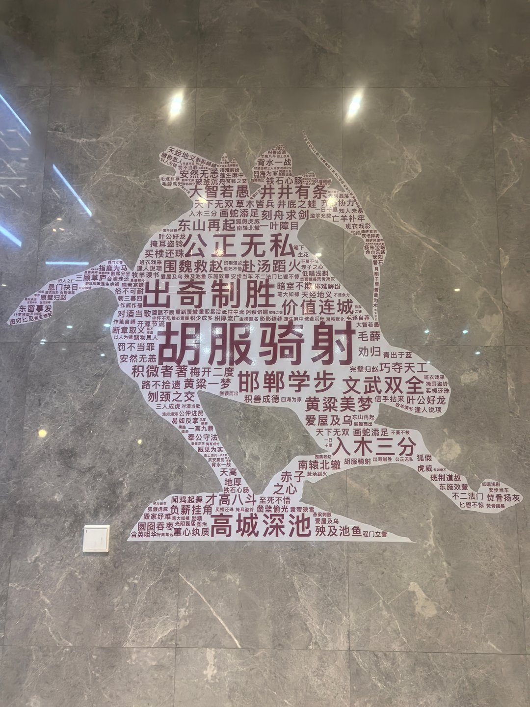

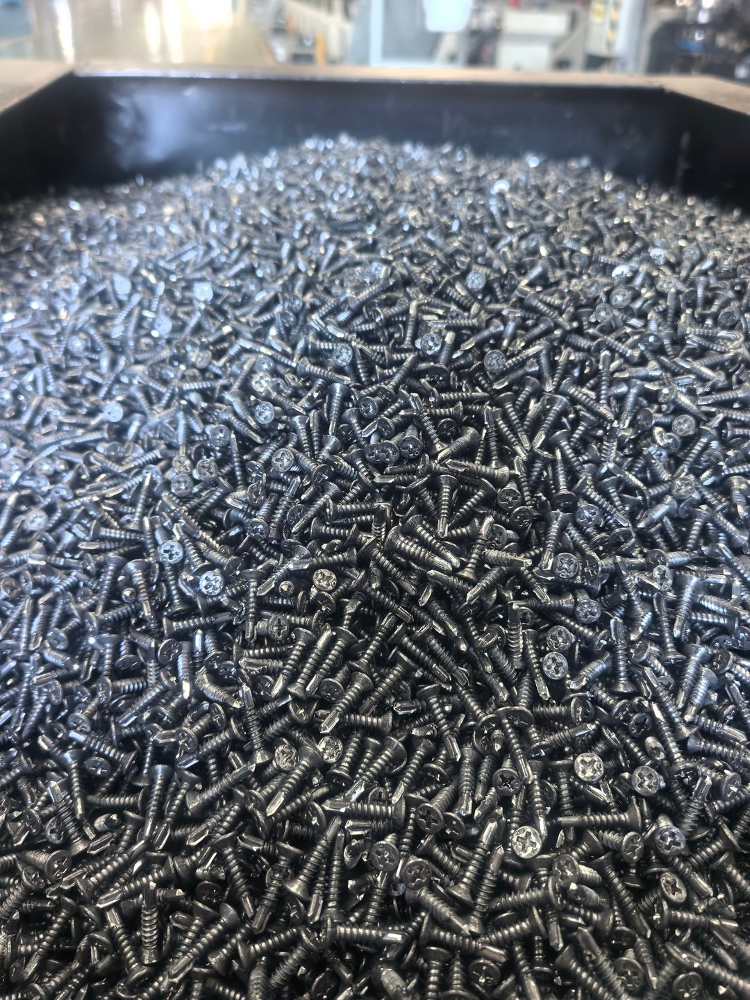

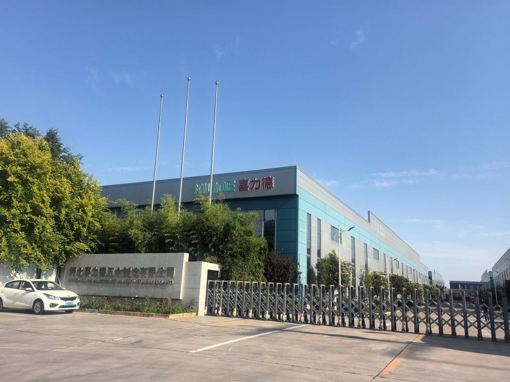

---

## 22

@布鲁卡

发表于：2026-06-08 19:20

来源：微博

链接：https://m.weibo.cn/status/5307736470586067

\#ios27\# iOS 27 史诗级更新：支持中国大陆节假日调休闹钟

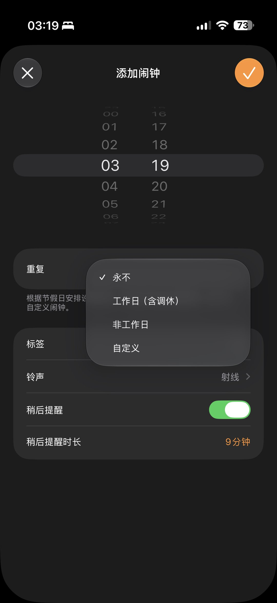

---

## 23

@EricTsui

发表于：2026-06-08 15:27

来源：微博

链接：https://m.weibo.cn/status/5307677715989243

充实，是后悔的最好解药。

当人们把时间投入在愉悦或有价值的体验上时，因错失其他机会而产生的遗憾感会显著降低。

---

## 24

@米格战斗飞机联合体改名后

发表于：2026-06-07 17:37

来源：微博

链接：https://m.weibo.cn/status/5307347991791571

北京798艺术区，前身是国营华北无线电联合器材厂，代号718联合厂，是新中国“一五”计划重点工程，由东德（民主德国）援建的核心电子工业基地 。

 

很多人不知道：东德这批援助，本质是二战后德国对苏联的战争赔款，苏联再将部分工业设备与技术转赠给中国。整个50年代，东德共为中国援建近10个大型骨干工厂，除718厂（798）外，还有郑州第二砂轮厂、西安仪表厂、保定化纤厂等，全是军工与工业要害部门。

 

作为交换，中国向东德提供大豆、钨砂、橡胶等战略物资与农产品，支撑其战后经济运转。

 

更值得一提的是，东德不仅送工厂，还归还了八国联军侵华时德军掠夺的中国文物：1955年，东德总理格罗提渥访华，正式交还3册《永乐大典》与10面义和团旗帜 。

 

名义上是社会主义阵营的兄弟援助、归还文物，深层看，也带有战败国德国向战胜国中国履行历史亏欠、变相赔偿的意味。\#涨知识 \#\#历史冷知识\#\#世界地理\#

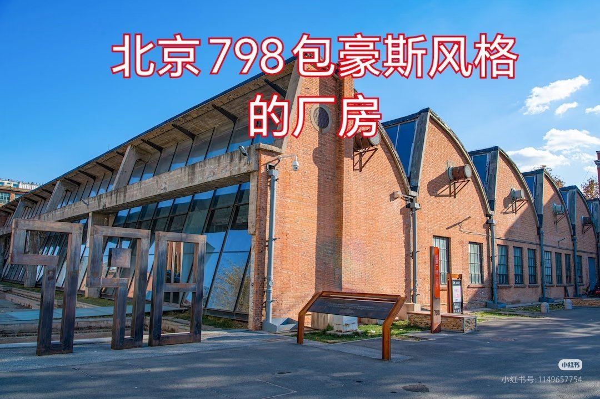

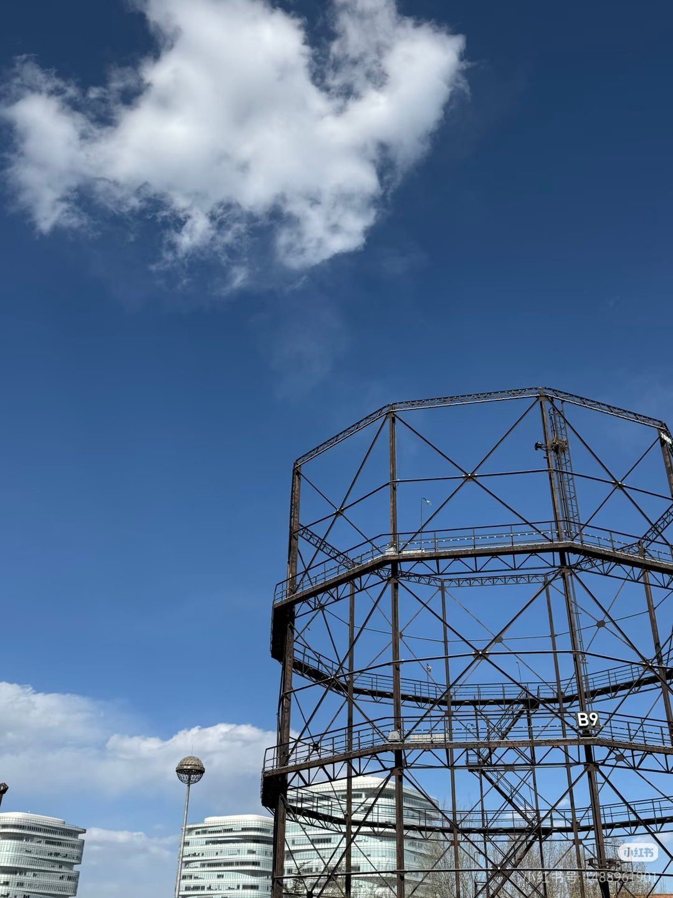

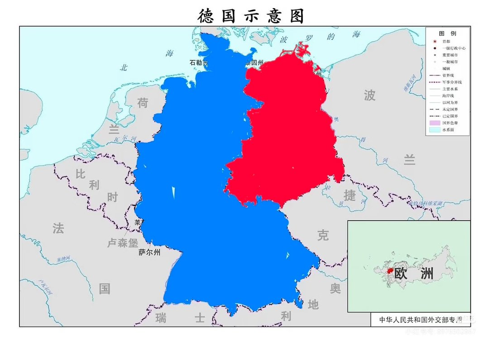

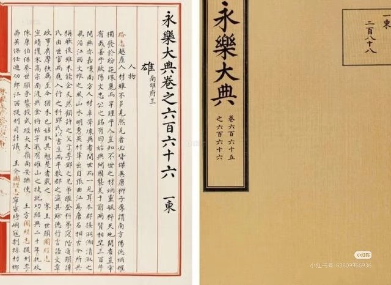

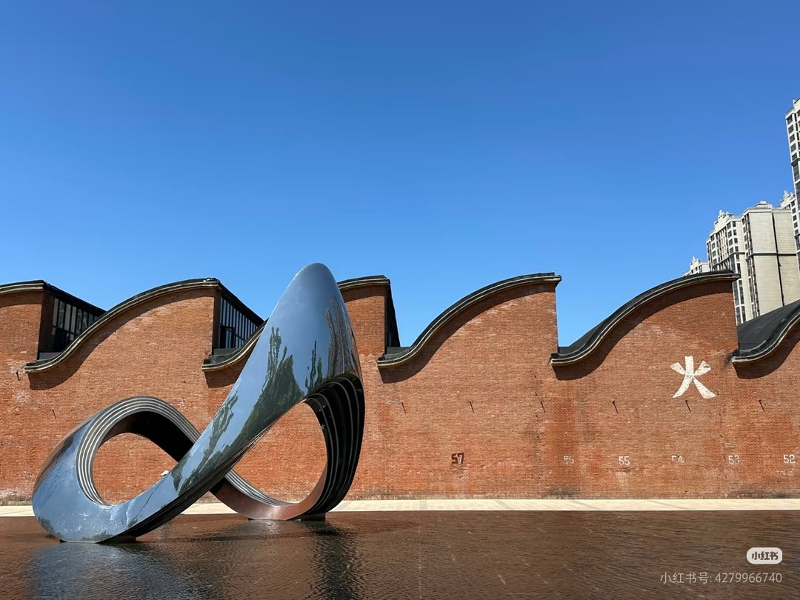

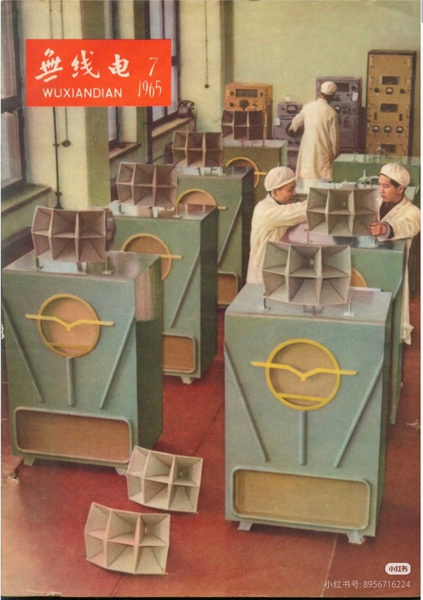

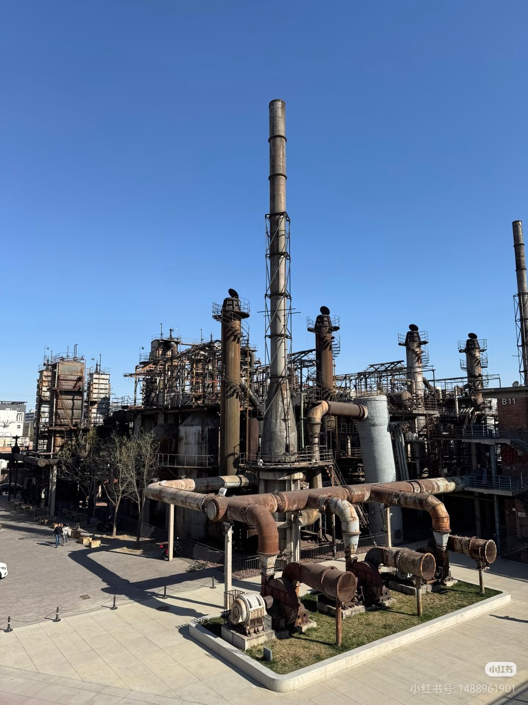

