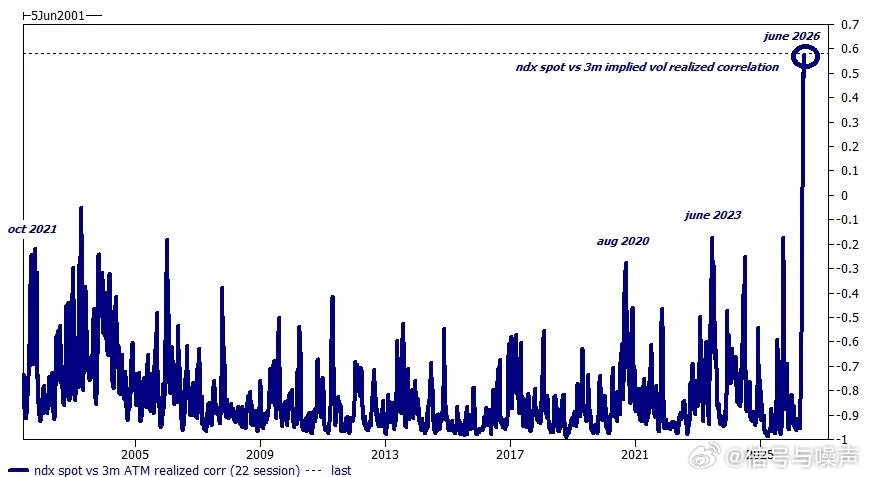
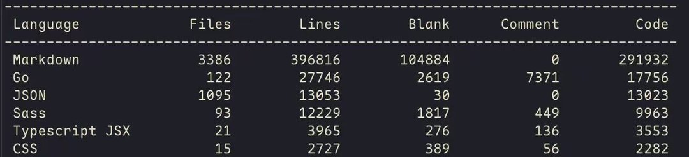
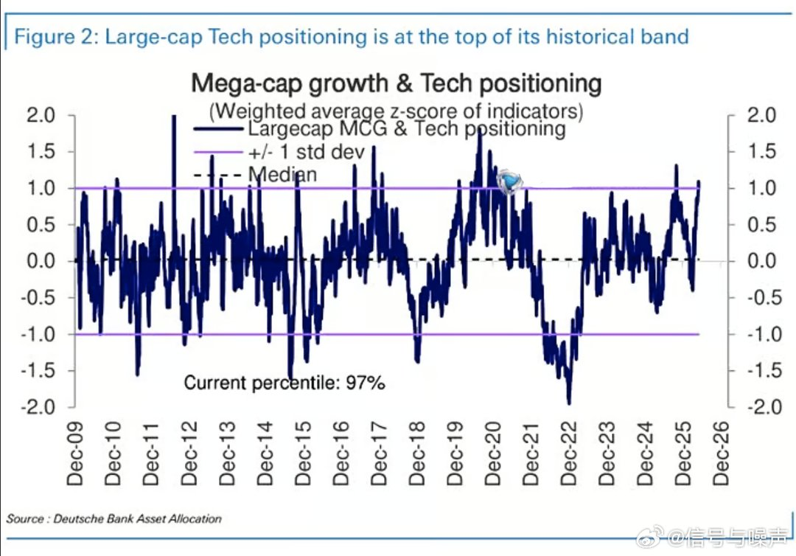
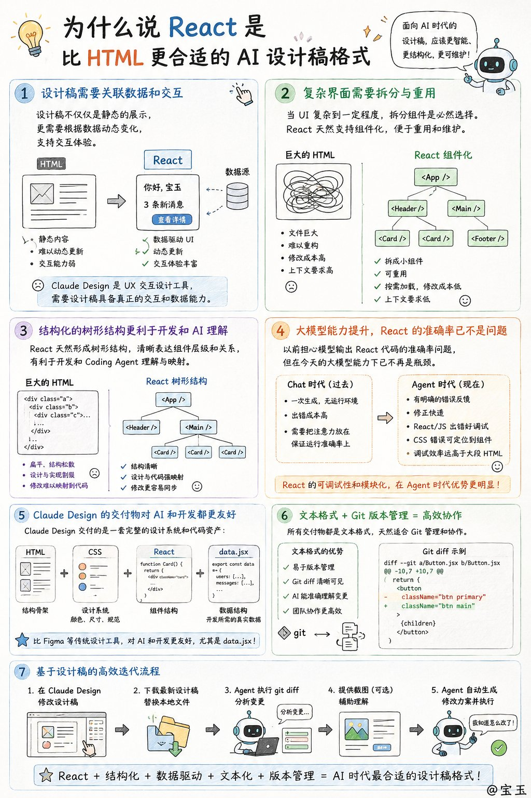
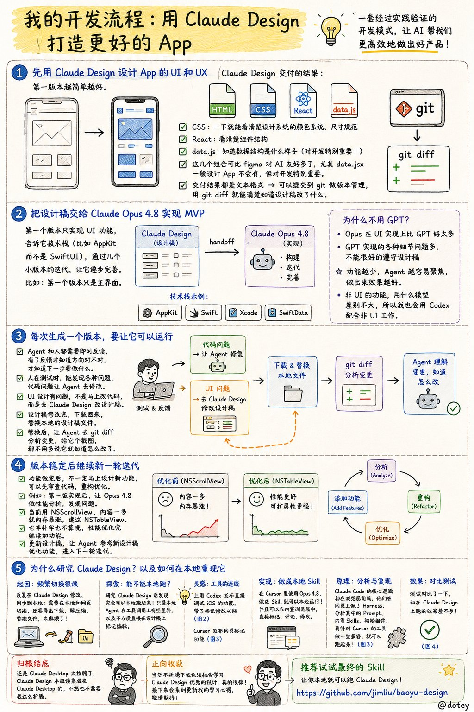
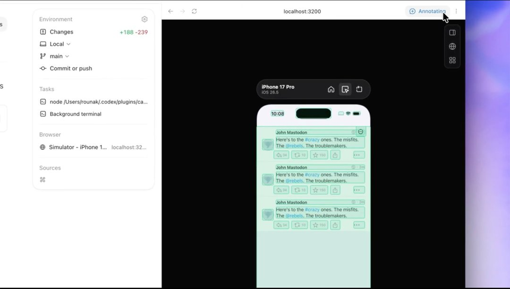
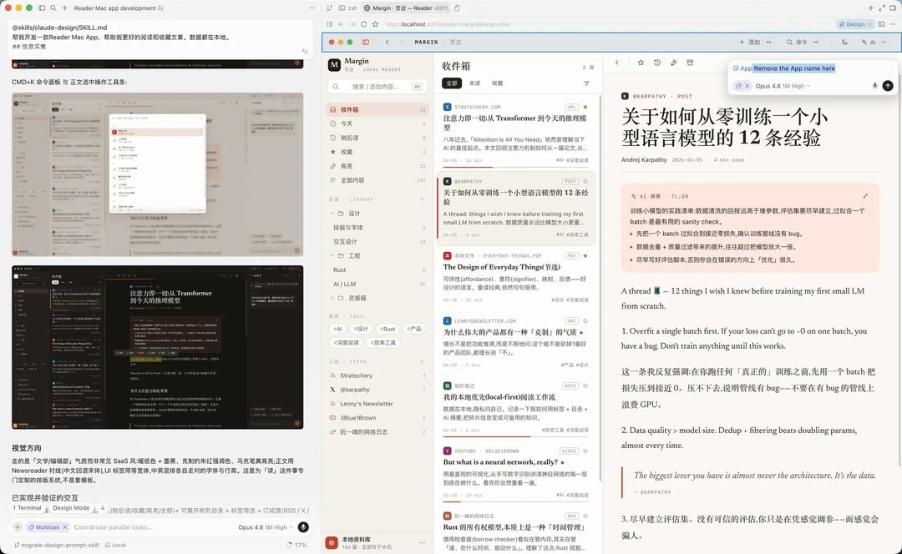
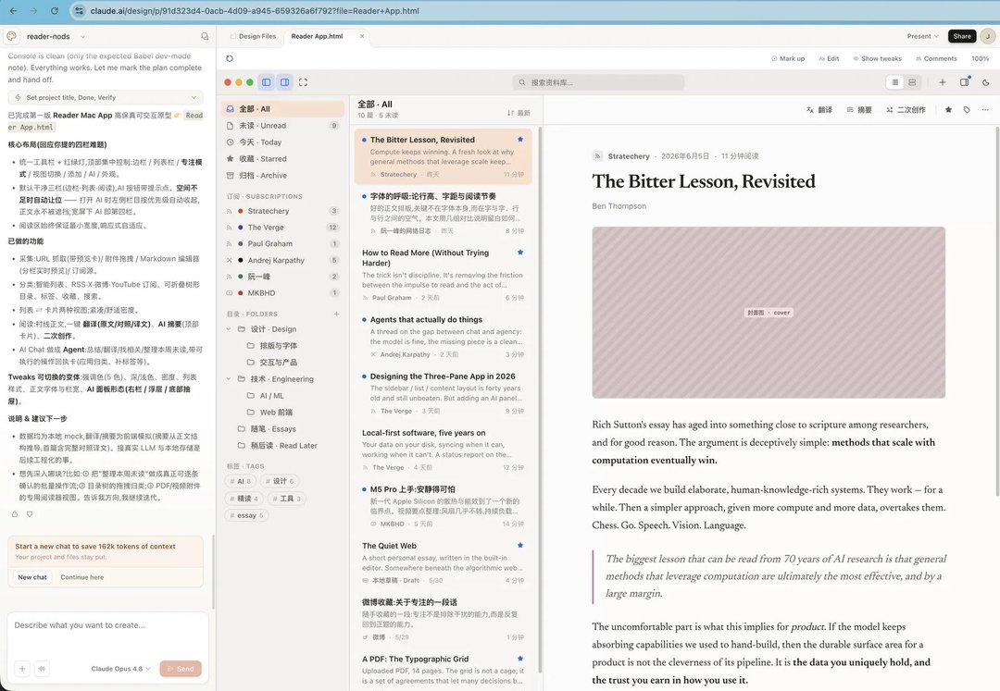

# 2026-06-10

## 1

@释不归

发表于：2026-06-09 15:59

来源：微博

链接：https://m.weibo.cn/status/5308048216430558

这就是低级红高级黑们参与认知战的必然结果。对央媒的信任就是这样消耗殆尽的。“银河号”事件发生在1993年7月至9月，美国GPS系统1993年12月才实现初始运行能力。1994年首批卫星才完成组网。1995年4月才具备“完全作战能力”。1996年美国政府才正式开放GPS民用。当时的远洋航行，GPS仅是一个辅助工具，通过六分仪(传统天文导航)和无线电导航是普遍手段，就算今天，只依靠GPS和北斗卫星导航的，都是没出过海的键盘侠。21世纪前的GPS卫星根本不具备区域关闭能力。央媒带头传谣，消耗的是国家信誉！让我们看看哪些大V在传谣，谁是那啥一目了然。\#美国曾关闭GPS让中国船失去方向\#//@退而思之xyq:这个著名的谣言，怎么还在传？而且还是环球、央视带头？！

---

## 2

@宝玉xp

发表于：2026-06-09 17:23

来源：微博

链接：https://m.weibo.cn/status/5308069416272507

Anthropic 今天同时发布了两个模型：Claude Fable 5 和 Claude Mythos 5。

两个模型用的是同一个底座，区别在于 Fable 5 加了一套安全分类器，面向所有用户开放；Mythos 5 去掉了部分安全限制，只给 Project Glasswing 的网络安全合作伙伴用。

简单说，Fable 5 就是"带护栏的 Mythos"。两个月前，Mythos Preview 还锁在大约 200 家防御机构手里，现在普通开发者也能用到同级别的能力了。

【Fable 5 的安全机制】

Fable 5 的安全机制不是传统的"拒绝回答"，而是降级：当分类器检测到请求涉及网络安全攻击、生物化学武器相关内容或模型蒸馏行为时，会自动切换到 Opus 4.8 来回答，并告知用户发生了降级。Anthropic 给出的数据是，超过 95% 的对话不会触发降级。

Anthropic 也坦承分类器目前调得偏严，会误伤正常请求，后续会持续优化降低误报率。

【能力到底有多强】

Anthropic 列了一堆 benchmark，但几个实际案例更能说明问题。

Stripe 拿 Fable 5 在一个 5000 万行的 Ruby 代码库里做了一次全库迁移，一天完成，原本需要一整个团队花两个多月。在 Cognition 的 FrontierCode 测试中，Fable 5 在中等算力消耗下就拿到了最高分，Token 效率比之前的 Claude 模型明显更好。

视觉能力上，之前的 Claude 模型玩宝可梦火红版需要各种辅助工具才能推进，Fable 5 只靠最基础的视觉接口就通关了。还能从截图直接还原一个 Web 应用的源代码。

在生命科学方向，Mythos 5 让 Anthropic 内部的蛋白质设计专家把药物设计流程中的部分环节加速了约 10 倍。在一项基因组学研究中，Mythos 5 在几乎完全自主的情况下工作了一周多，训练出的模型表现超过了发表在 Science 上的模型，而体量只有后者的百分之一。

【价格和可用性】

Fable 5 和 Mythos 5 的 API 定价是每百万输入 Token 10 美元、输出 50 美元。对比 Mythos Preview 的 25/125 美元，降了 60%。但比 Opus 4.8 的 5/25 美元贵了一倍，和 OpenAI 的 GPT-5.5（5/30 美元）相比，输入贵一倍，输出贵了约 67%。

订阅用户要注意一个时间窗口：从今天到 6 月 22 日，Pro、Max、Team 和企业版用户可以直接使用 Fable 5 而无需购买usage credits，但是还占用你的 Token 额度。6 月 23 日开始，使用 Fable 5 需要额外购买 usage credits。Anthropic 说等产能充足后会把 Fable 5 恢复为订阅计划的标配，但没给具体时间。

API 和按量付费的企业用户不受影响，今天起就能正常调用。

【一个容易被忽略的政策变化】

Anthropic 同时宣布，从 Fable 5 开始，所有 Mythos 级别模型的流量将强制保留 30 天，覆盖第一方和第三方平台。Anthropic 承诺不会用这些数据训练模型，仅用于安全监控，比如检测新型越狱攻击和跨请求的复杂攻击模式。但对于注重数据隐私的企业用户来说，这是一个需要评估的变化，尤其是那些之前选择 Anthropic 正是因为其零留存政策的客户。

官网介绍：网页链接 宝玉xp的微博视频

---

## 3

@包容万物恒河水

发表于：2026-06-09 18:01

来源：微博

链接：https://m.weibo.cn/status/5308078955430530

🔻突发新闻，来自 NAYA 通讯社的报道。

🔻特朗普刚刚发帖称：“我刚收到我们伟大军队的消息，称昨晚伊朗人在霍尔木兹海峡上空击落了我们一架先进的阿帕奇直升机。机上两名飞行员安然无恙。尽管如此，美国必须对此次袭击作出回应。感谢大家对此事的关注！唐纳德J特朗普 ”

🔻特朗普声称伊朗人把美国的阿帕奇揍下来了。

\#特朗普看NBA总决赛睡着了\#\#海外新鲜事\#\#热点现场\#

---

## 4

@信号与噪声

发表于：2026-06-09 13:33

来源：微博

链接：https://m.weibo.cn/status/5308011518366839

纳指涨的大家都怕

纳斯达克 100 指数现货与波动率

已实现相关性触及历史最高水平，所有被压抑的波动性终于以猛烈之势爆发 

纳指涨了，期权恐惧却创25年新高——这个信号在历史上从未出现过

有一个衡量市场"内心"的指标，25年来几乎从未背叛：当纳斯达克上涨时，期权市场的隐含波动率就会下降；当纳斯达克下跌时，隐含波动率就会飙升。这一负相关关系稳定得如同物理定律，从2001年至今，绝大多数时候都在-0.5至-1.0区间运行。

然而，2026年6月，这条定律被打破了。最新数据显示，纳指现货与3个月平值期权隐含波动率之间的22日滚动相关性，已攀升至约+0.6——即现货在涨，期权隐含波动率也在同步上涨。这一读数不仅是正值（已属罕见），更是2001年有记录以来的绝对历史极值，远超2020年8月、2021年10月、2023年6月三次短暂异常的峰值。

这个信号的含义令人不安：市场参与者一边追涨纳指，一边在期权市场上疯狂购买保险和对冲工具，二者并行不悖。这说明当前的上涨并非建立在信心之上，而是建立在"不得不追但极度恐惧"的FOMO情绪之上。

---

## 5

@onevcat

发表于：2026-06-09 12:54

来源：微博

链接：https://m.weibo.cn/status/5308001577861259

笑死…这就是软件开发的“最新实践”么🤣

---

## 6

@信号与噪声

发表于：2026-06-09 12:58

来源：微博

链接：https://m.weibo.cn/status/5308002677823049

\#美股\# 巨盘成长和科技板块的持仓处于第 97 百分位，这是一笔拥挤的超配交易

---

## 7

@宝玉xp

发表于：2026-06-08 02:23

来源：微博

链接：https://m.weibo.cn/status/5307480566399731

为什么说 React 是比 HTML 更合适的 AI 设计稿格式

有观点认为 AI 设计稿应该选 HTML 而不是 React，这个我是不认同的。理由有这么几点：

一、设计稿需要关联数据和交互

设计稿不仅仅是静态的展示，更需要根据数据动态变更 UI，支持交互体验。这点 HTML 是做不好的。像 Claude Design，它不仅仅是一个 UI 设计工具，更是一个 UX 交互设计工具，需要设计稿具备真正的交互和数据能力。

二、复杂界面需要拆分与重用

当 UI 复杂到一定程度，拆分组件是必然选择。如果是一个巨大的 HTML 文件，重构或修改会非常麻烦——你不可能把整个文件加载进去。而 React 天然支持组件化，可以把页面拆成若干小组件：一方面可以重用，另一方面修改时只需加载其中一个小组件，对上下文的要求低得多。

三、结构化的树形结构更利于开发和 AI 理解

React 天然形成树形结构，清晰表达组件层级和关系，基于这样的设计稿去开发时，对 Coding Agent 非常友好。而巨大的 HTML 是扁平、非结构化的，设计与实现之间容易割裂，设计稿一旦修改，很难跟代码形成映射和同步。

四、大模型能力提升，React 的准确率已不是问题

有人说模型要把注意力放在保证 React 运行准确率上，这在以前也许成立，但以现在的大模型能力已经不是瓶颈了。在 Chat 时代，追求的是一次生成通过，因为没有运行环境；但在 Agent 时代，只要有明确的错误反馈，修正起来很快。React/JS 出错了很好调试，CSS 错误只要能定位到具体组件也好修。反观一个大 HTML 里的样式细节出错，不会有明显报错，但 debug 起来才真的要命。

五、Claude Design 的交付物对 AI 和开发都更友好

Claude Design 交付的是一套完整的设计系统和代码资产：HTML（结构骨架）+ CSS（颜色、尺寸规范）+ React（组件结构）+ data.jsx（数据结构）。通过 CSS 一眼看清设计系统，通过 React 看清组件结构，通过 data.jsx 知道开发所需的真实数据结构。这个组合比 Figma 等传统设计工具对 AI 和开发友好多了，尤其是 data.jsx——一般设计工具不会有，但对开发特别重要。

六、文本格式 + Git 版本管理 = 高效协作

所有交付物都是文本格式，天然适合提交到 Git 做版本管理。用 git diff 就能清楚地让 AI 知道设计稿修改了什么，团队协作也更高效。

七、基于设计稿的高效迭代流程

UI 设计有问题，不是马上去改代码，而是回到 Claude Design 修改设计稿。修改完成后下载回来，替换本地的设计稿文件。设计稿替换后，让 Agent 执行 git diff 分析变更，再给它一个截图辅助理解，都不用多说，它就知道怎么改了。

---

一句话总结：React + 结构化 + 数据驱动 + 文本化 + 版本管理 = AI 时代最合适的设计稿格式。

补充一句，把 React 换成 Vue  也是成立的

---

## 8

@宝玉xp

发表于：2026-06-07 17:33

来源：微博

链接：https://m.weibo.cn/status/5307347098666793

之所以研究 Claude Design，是因为最近摸索出一套不错的开发模式：

1. 先用 Claude Design 去设计 App 的 UI 和 UX，第一版本越简单越好。

Claude Design 交付的结果是 HTML + CSS + React + data.js，通过 CSS 一下就可以看清楚设计系统的颜色系统、尺寸规范，通过 React 可以看清楚组件结构，通过 data 可以知道数据结构什么样子。

这几个组合可比 figma 对于 AI 来说友好多了，尤其是 data.jsx，这是一般的设计 App 不会有的，但对开发特别重要的。

还有一个优势就是交付的结果都是文本格式的，可以一起提交到 git 做版本管理，用 git diff 就可以清楚的让 AI 知道设计稿修改了什么。

2. 把 Claude Design 生成设计稿交给 Claude Opus 4.8 去实现一个 MVP，第一个版本只实现 UI 功能，告诉它技术栈（比如 AppKit 而不是 SwiftUI），通过几个小版本的迭代，让它逐步完善。比如第一个版本只是主界面

之所以不用 GPT，是因为 Opus 在 UI 实现上比 GPT 好太多，同样的设计稿，GPT 实现的各种细节问题的，不能很好的遵守设计稿。

之所以不一下子实现太多功能，是因为功能越少 Agent 越容易聚焦，做出来效果越好。所以怎么拆分版本，也是用好 Coding Agent 的一种能力。

非 UI 的功能，用什么模型没有那么大差别，所以我也会用 Codex 配合非 UI 工作。

3. 每次生成一个版本，要让它可以运行，无论是 Agent 还是人都是需要即时反馈的，有了反馈才知道方向对不对，才知道下一步要做什么。

人在测试的时候，能发现各种问题，代码问题就让 Agent 去修改，UI 设计有问题不是马上修改代码，而是要去 Claude Design 去修改设计稿，设计稿修改完了，把设计稿下载回去，替换本地的设计稿文件。

设计稿替换后，让 Agent 去 git diff 分析一下变更，给它个截图，都不用多说它就知道怎么改了。

4. 版本稳定后继续新一轮迭代

当设计的功能做完之后，不一定是要马上去设计新的功能，而是可以重新审查一下实现的代码，重构优化一下。

比如我在第一版实现后，让 Opus 4.8 去做了性能分析，看性能问题在哪，然后告诉我当前用 NSScrollView，内容一多就内存暴涨，建议 NSTableView。

我心想这不应该是一开始就该考虑到的么！不管怎么样亡羊补牢也不算晚。

性能优化完就继续加功能，更新设计稿，让 Agent 参考新设计稿优化功能。

---

再回来说研究 Claude Design 的事，因为反复 Claude Design 修改，同步到本地，然后这一步让我后来很烦，因为需要在本地和 Claude Design 网页切换，还要导出下载到本地，解压缩替换。

于是我就想能不能在本地就可以重现 Claude Design 直接集成到本地 Agent，所以我去研究了 Claude Design，然后发现完全可以本地跑起来，只是本地 Agent 在工具调用上有些差异，以及不方便直接在设计稿上标记编辑。

上周正好 Codex 发布了直接调试 iOS 的功能，它带了标记修改的功能，然后我灵机一动，这不正好可以代替 Claude Design 的标记修改功能么。（图2）

问题是 GPT 5.5 模型设计能力不够，在 Codex 里面设计效果也不会好。

接着  Cursor 也发布了网页标记功能，这下正好，Cursor 里面可以用 Opus 4.8，做成 Skill 就可以本地运行了，还可以在 Cursor 内置浏览器中，直接标记、评论修改。

好在 Claude Code 的核心逻辑都在浏览器前端，他们在网页上做了个 Harness，这给了我分析的便利，耐心一点就可以分析出所有的 Prompt、内置 Skills、初始组件，再针对 Cursor 的工具做一些兼容就可以跑起来了。（图3）

测试对比了一下和在 Claude Design 上跑的效果差不多。（图4）

归根结底，还是 Claude Desktop 太拉胯了，Claude Design 本应该集成在 Claude Desktop 的，不然也不需要我这么折腾。

当然不折腾下我也没机会学习 Claude Design 优秀的设计，真的很棒，接下来会系列更新我的学习心得。

推荐去试试最终的 Skill（github.com/jimliu/baoyu-design），让你本地就可以跑 Claude Design：

网页链接

---

## 9

@李子暘Lee

发表于：2026-06-09 03:10

来源：微博

链接：https://m.weibo.cn/status/5307854619149321

正好这两天高考。董路的事，其实告诉了我们大家，上大学，还是很有用的。

董路从来没踢过专业足球，连票友都算不上好的，但他上过大学，正经的大学毕业生。放在学术圈，啥也不是，但和那些从小踢足球没怎么上过学的家伙比起来，高下立判。

无论是思维能力、语言表达能力、反思能力、逻辑水平，都不在同一个档次。董路就是嘴损点儿，如果说话再厚道一些，没毛病了。

那些人批评董路，基本就是扯着嗓子骂街。董路批评他们，却稳准狠，直击要害。比如他说，为什么孙继海强调训练基本功啊，因为他就是这么练出来的。孙的球员经历不错，但这也锁定了他在足球上的思维，跳不出来了。孙继海练小孩，就是想练出一批小孙继海。

这种思维水平，就是大学里读书思考带来的。一个人二十岁前后几年的时间，上大学，是最好的度过方式，往往能决定这个人的上限。

生活中我也见过好几个例子。虽然不是什么好大学，上得也吊浪荡，不刻苦不认真，但几年下来一聊，发现思维大有长进。相比没上过大学的同龄人，差异很明显。

大学是提升人精神世界的好地方。只要条件允许，最好还是去上大学。

-

