# 2026-06-12

## 1

@挨踢牛魔王

发表于：2026-06-11 01:39

来源：微博

链接：https://m.weibo.cn/status/5308556427657668

说一个判断，编码智能体的原理，现在搞的很清楚了。

尤其上一次claude code的源码泄露，让大家知道，最顶级的编码智能体也是这么搞的。

里面有一些组件，也都非常清楚了，通用性非常高。

那么编码智能体这条赛道，除了闭源的之外，应该还是会出现一个类似linux/android这样的开源框架，最后占领大部分的份额。

其余的厂家，会选择在这个框架上构建自己的产品，而不是重新做。

目前看来这个趋势已经很明显了。

小米的编码智能体是基于opencode构建的。

kimi code的命令行是基于pi-tui构建的。

就是说，你现在想从零搞一个编码智能体，成功率已经不高了。

基于成熟的编码智能体进行修改，才是更容易成功的一条路。

小龙虾类的产品，也是这样，也会出现开源的框架，而不是你从零开始构建。

项目地址：github.com/MoonshotAI/kimi-code/tree/main

---

## 2

@蘸盐

发表于：2026-06-11 01:23

来源：微博

链接：https://m.weibo.cn/status/5308552478460152

北大公众号这小编，也是够搞笑的

古人是“祭如在”

小编是“编如在，编故事如我在”

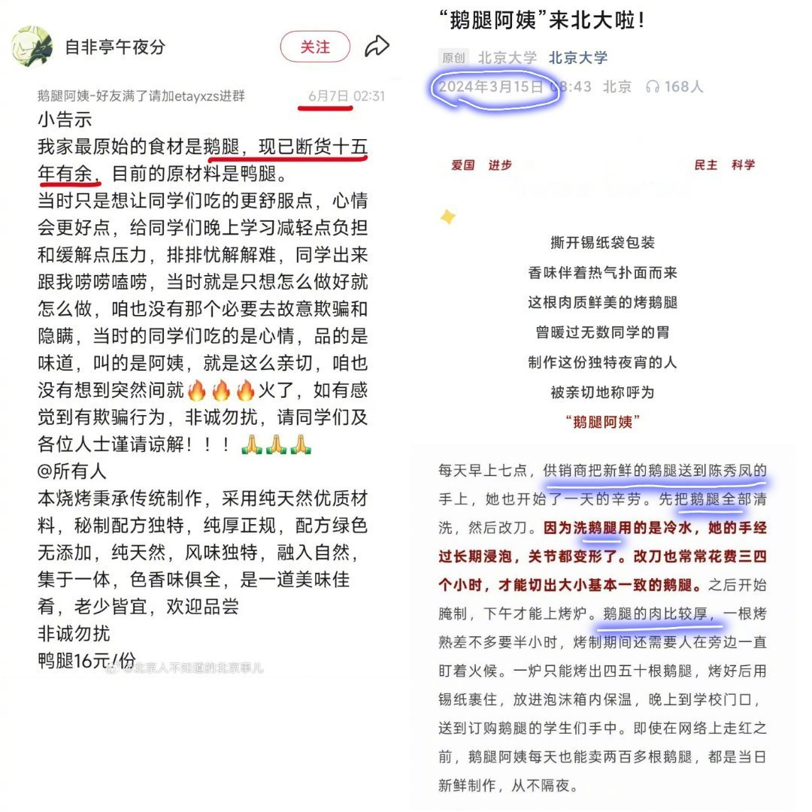

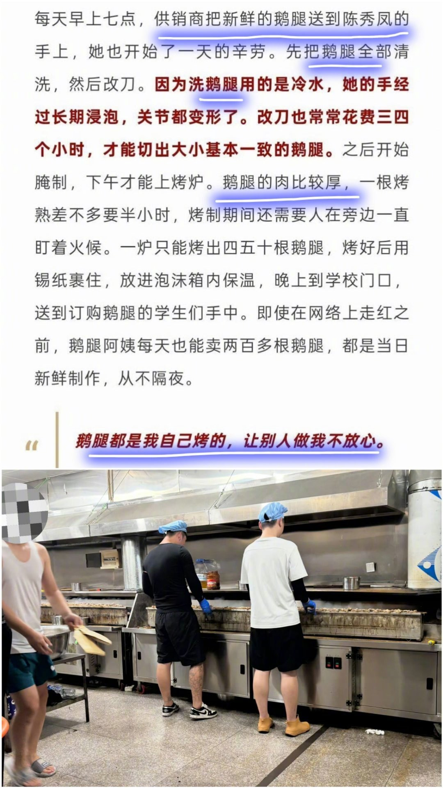

---

## 3

@蘸盐

发表于：2026-06-11 13:34

来源：微博

链接：https://m.weibo.cn/status/5308736476549408

其实北京四合院，尤其北城四合院，变得“不规整”，基本上是1976年以后的事。76年唐山大地震，许多人家在院子里搭建地震棚。之后几年大量知青回城，北京人口激增，知青又有结婚成家分户的需求，很多地震棚变成碎砖墙+油毡顶的小房。然后80年代之后陆续翻盖，外墙抹灰，屋顶换石棉瓦甚至机制瓦……大多数四合院的院子、花池、抄手游廊、垂花门之类统统消失，变成了杂乱无章的大杂院。

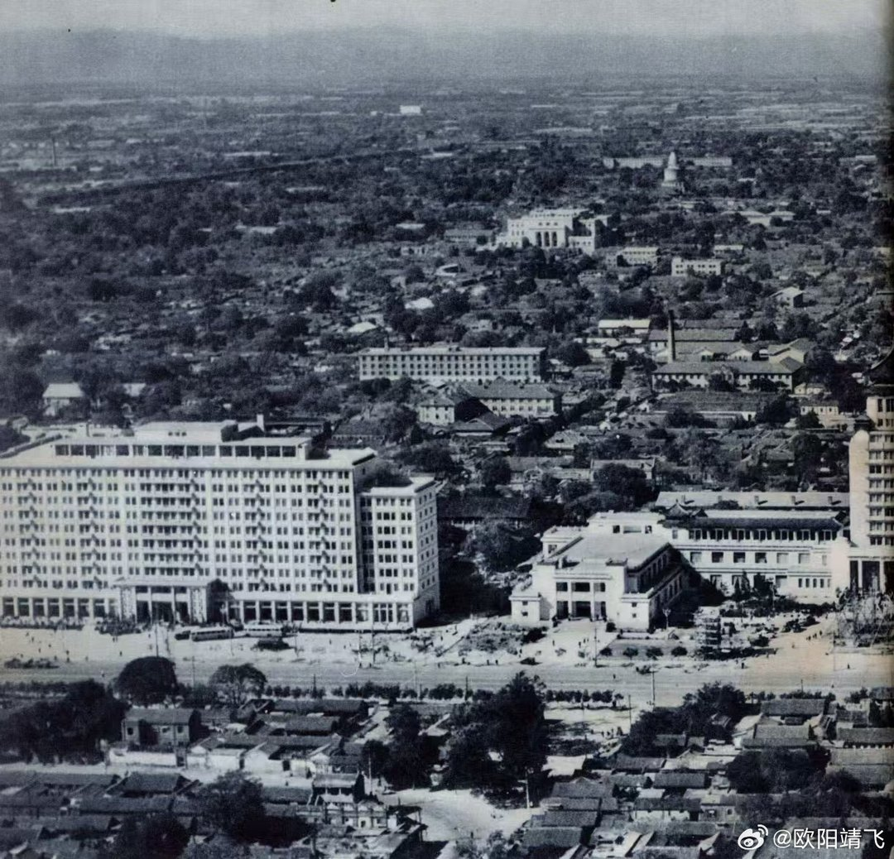

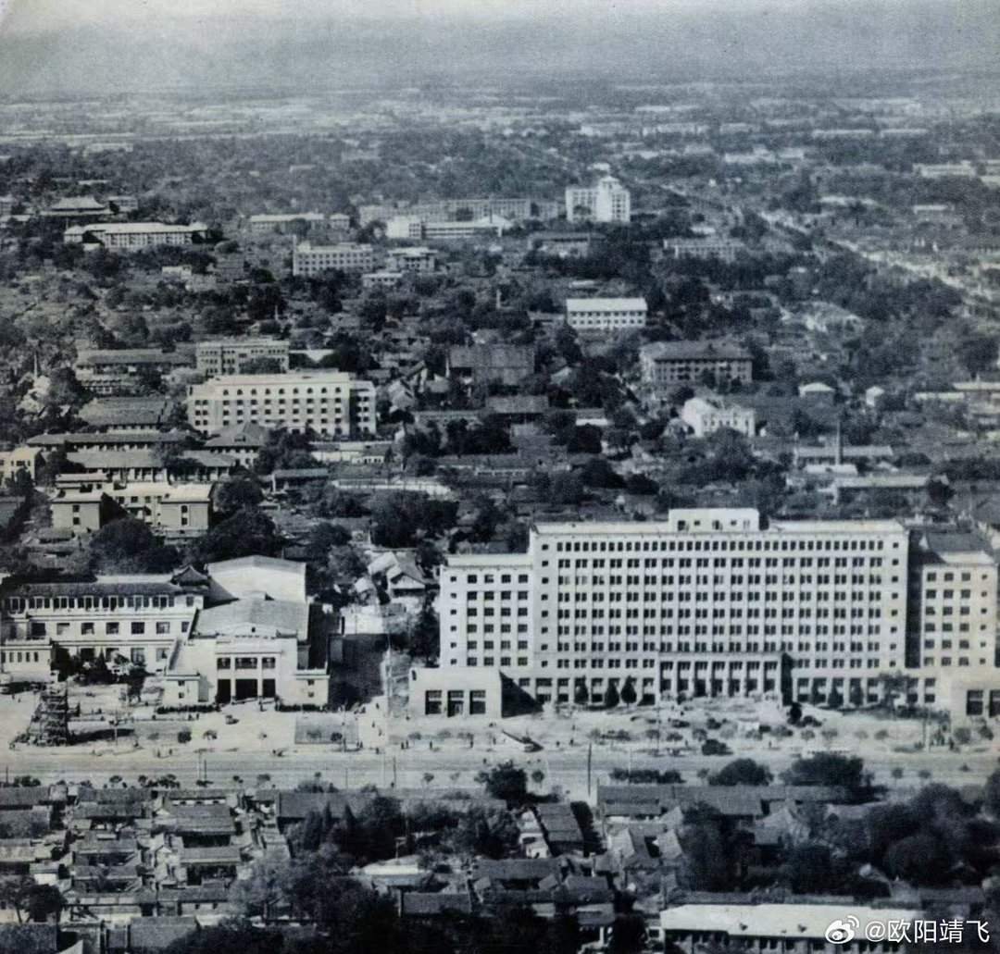

---

## 4

@宝玉xp

发表于：2026-06-11 05:59

来源：微博

链接：https://m.weibo.cn/status/5308621899958432

OpenDoor 裁掉了其在印度的整个离岸团队（200多人），并正以美国本土规模更小的 AI 原生团队取而代之。

AI 未来可能也会影响外包行业的运作模式。

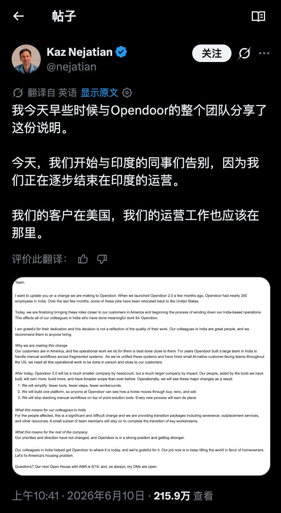

---

## 5

@粤来粤好吃_

发表于：2026-06-11 04:45

来源：微博

链接：https://m.weibo.cn/status/5308603372144388

31499

关于鹅腿阿姨，我要掏出爆浆老图，经典永流传这一块

\#我在微博当bot\#

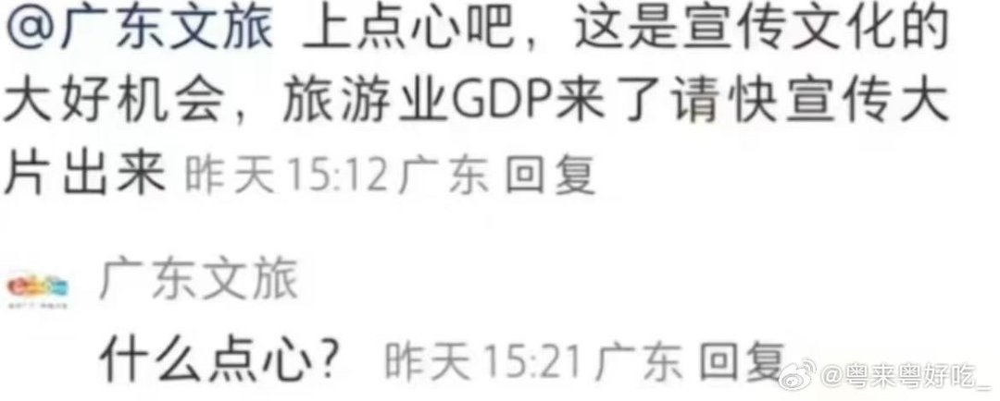

---

## 6

@毛磊的买房观

发表于：2026-06-11 09:33

来源：微博

链接：https://m.weibo.cn/status/5308675926786661

\#西南财大本科生可自主选择毕业专业\# 【西南财大：2026级起本科生可自主选择毕业专业】6月11日，西南财经大学宣布，从2026级起正式推出本科生 “自主选择毕业专业”制度。学生基于自身志趣、优势和未来规划，第三学期起自主跨专业修读课程，修满规定学分且符合毕业及授位条件，即可获得相应专业毕业证书与学位证书。

除中外合作办学专业、艺术类专业及按国家政策规定不能转专业的学生外，其他学生均可根据个人意愿选择会计学、统计学、计算机科学与技术、金融科技、法学等绝大部分专业毕业。时间安排为：第三学期起跨专业选课修读毕业专业课程，第四学期提交预选申请，第五学期正式确认毕业专业。学生已修读课程学分可直接转换为毕业专业自由选修课程学分，也可按相关规定申请辅修学士学位。

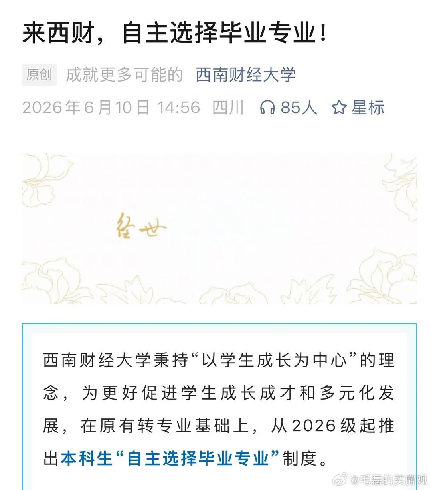

---

## 7

@海兰珠阿婶

发表于：2026-06-11 12:24

来源：微博

链接：https://m.weibo.cn/status/5308718933610086

论高考的含金量👇🏻

\#海外新鲜事\#

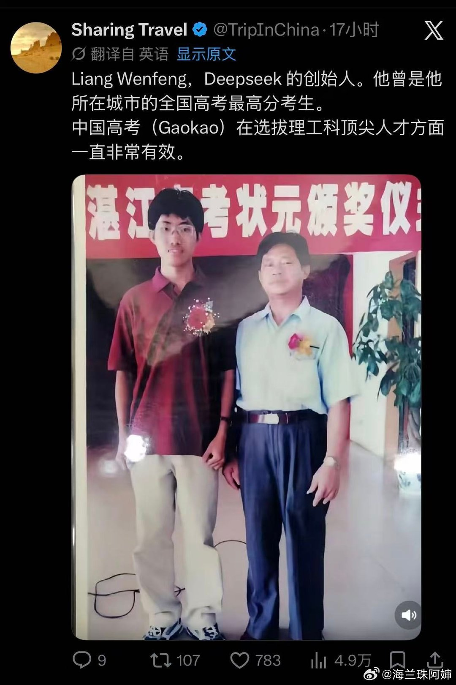

---

## 8

@阑夕

发表于：2026-06-11 08:30

来源：微博

链接：https://m.weibo.cn/status/5308660030636326

昨天阿里关于钉钉管理文化的锐评通稿刚发出来，群里一些老阿里人就闻到味儿了，断言这是不准备保无招了。

果不其然，今天就把无招的CEO给拿掉了，公式做题就是快。

无招实名陈航，确实是严格意义上的钉钉创始人，算是阿里内部比较少有的能从马老师那里赢得第二次信任的人，顶着屡败屡战的压力做出钉钉，属于实打实的赫赫战功。

因为「云钉一体」的架构调整离职、时隔多年之后又被连带着创业公司被打包收购、重新被委以钉钉最高负责人的重任，这个叙事就很乔布斯，如果一切顺利的话。

但是没有这种如果。

钉钉内部对于无招第二次走人是比较开心的，工作强度实在太大了，更重要的是压力没有反馈，吃互联网这碗饭，忙没毛病，忙且没有意义才是问题。

话说回来，其实也很少看到有人对无招的品行发出质疑，员工觉得他未必是一个坏人，却在做刻舟求剑的事情，是用战术的勤奋，去掩盖战略的无能。

无招去年回归钉钉之后，第一件事情就是把核心团队搬回湖畔花园的民宅，那是阿里的耶路撒冷，马老师当年就是从这里带着「十八罗汉」起步的，在来往项目失败之后，无招也是在湖畔花园磨出了钉钉，可以说是圣地福地皆有之。

无招一直相信他可以让钉钉回到1999年、回到2014、回到大家都一无所有背水一战的那种状态，然后就能复制从前的路径，再次打出一场漂亮的翻身仗。

对于少数受到器重的核心骨干来说，这种带有高期待的高压力，或许是能转化成奋斗的动力，可是今夕何夕，时代已经变了，早就不是那种兄弟们干完一个项目去吃大肉喝大酒就能继续精神抖擞住在公司的版本了。

无招也一直相信重新去上门走访小企业的就能找对钉钉的方向，因为十几年前就是这么成的，姑且不论这个归因是不是成立的，十几年前的企业市场是什么环境，哪时的低数字化、低移动化和今天又是一个情况吗？

把以前的方法再做一遍就能翻盘，世上哪有这么简单的事情呢？

我记得三年特殊时期那会儿，形势还不是这样的，行业里被嘲讽最多的企业软件，其实是飞书⋯⋯

当时飞书被评价为字节人效比最低的BU，大几千人做一款根本没怎么赚钱的产品，和字节底下各种印钞机业务相比，简直是家族的污点，同期钉钉靠着远程办公和网课开会的红利，数据暴涨，风光无两。

AI兴起之后，市场两极反转，飞书用远低于钉钉的活跃用户体量，拿到了差距逐渐缩小、快要接近五五开的收入规模，这意味着在让企业买单的说服力上，飞书是强于钉钉的。

我觉得无招是有心魔的，既然「云钉一体」是错的，既然把我请回来拨乱反正，那么钉钉就一定要独立发展，不能再受阿里的体系节制，这有点像矫枉必须过正的逻辑，用一个极端去回应另一个极端，钉钉的AI化很有野心，但兜不兜得住，非常依赖具体的成绩。

选择比努力重要也是这个道理，方向不对，就会越努力越错。

看得出来，无招很喜欢自己的这个花名，但他做的事情，和引起的内耗，都完全没有「无招胜有招」的松弛，这很可惜。

---

## 9

@信号与噪声

发表于：2026-06-11 08:00

来源：微博

链接：https://m.weibo.cn/status/5308652459393110

当前韩国期权市场上看跌仓位的堆积程度已经达到了历史上两次大崩盘前的水平。

聪明钱或者机构正在大量买入 Put 做对冲，专业资金对下行风险的担忧非常高。

粉色圆圈标出了三个关键时刻：

第一个圆圈在 2007-2008 年前后，Put-Call 比率飙升到 1200-1400 的极端水平，之后就是全球金融危机，KOSPI 200 腰斩。

第二个圆圈在 2020 年前后，比率再次冲高，紧接着就是新冠疫情导致的暴跌。

第三个圆圈是现在，比率又一次逼近甚至超过了前两次的高点，而 KOSPI 200 指数正处于历史高位附近。

市场整体的保护情绪在升温。

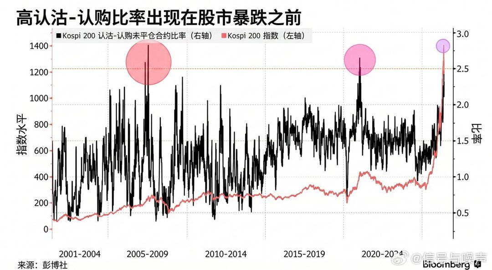

---

## 10

@物理芝士数学酱

发表于：2026-06-11 08:05

来源：微博

链接：https://m.weibo.cn/status/5308653582420867

1989年的芝加哥

这种都市一片橙光的夜景已不复存在。

那是高压钠灯。被激发的钠原子几乎完全在589纳米处发射光，这是一个位于橙黄色光谱深处的狭窄波段。没有蓝色，没有绿色，几乎没有其他颜色。这就是为什么整座城市发光一种颜色，就像照片是通过滤镜拍摄的一样。不是的。光本身就是单色的。

城市们喜爱钠灯只有一个原因：效率。钠灯将电能转化为可见光的效率远高于20世纪70年代的其它任何东西，因此芝加哥安装了大约27万盏这样的灯。代价是颜色。在钠光下，红车、绿车和蓝车看起来都像是略微不同的棕色调。你的眼睛实际上无法分辨颜色，因为没有光谱可以反射。

网格图案是图像的另一半。芝加哥采用近乎完美的每英里8个街区的布局，可追溯到19世纪，所以从飞机上，每条街道都变成网格纸上的一条发光线条。钠灯加上网格，这就是让它看起来像电路板的原因。

然后它结束了。在2017年至2022年间，芝加哥将大约28万盏钠灯具更换为白色LED灯，占其整个街灯库存的85%左右，将能源账单削减了一半以上。几乎每个主要城市都做了同样的事。

所以这张照片是一个化石。一种特定的光波长，覆盖整座城市，却被会计师的电子表格悄无声息地删除了。

---

## 11

@洪广玉

发表于：2026-06-11 15:03

来源：微博

链接：https://m.weibo.cn/status/5308758823539375

这篇评论以后肯定会成为名画被不时挂出来。一篇评论同时展现了什么叫做作、无知、虚伪、不合时宜…也是挺不容易的

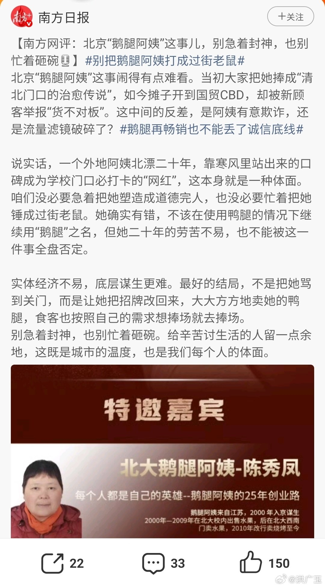

---

## 12

@庄时利和

发表于：2026-06-11 14:53

来源：微博

链接：https://m.weibo.cn/status/5308756263175272

全网很多人在嘲笑清北的学生，鹅腿鸭腿都分不清楚。其实不是清北的学生，大多数也分不出来。广东来的也一样。

因为大学生们不挑食，所以人家吃嘛嘛香。鸭腿鹅腿一样吃，超市的便宜零食和路边摊夜宵可劲造，觉得都很好吃，中登们还在担心今天的控糖任务，人家在食堂里一大碗刀削面已经干下去了，没吃饱，找阿姨又要了一碗。

在宿舍一边看剧，一大盒饼干就造没了。全家桶这玩意，一个人能干完一桶。学校后面小巷里连店名都没有的麻辣烫，几个男生女生聚在一起吃得很开心。

年轻比啥都强。吃不出好坏是一种幸福。等你明白这个道理时，你已不再年轻。

---

## 13

@包容万物恒河水

发表于：2026-06-11 18:06

来源：微博

链接：https://m.weibo.cn/status/5308804976609573

🔻白宫股神。

\#特朗普说今晚将重创伊朗\#\#美国五角大楼被封锁\#\#海外新鲜事\#\#热点现场\#

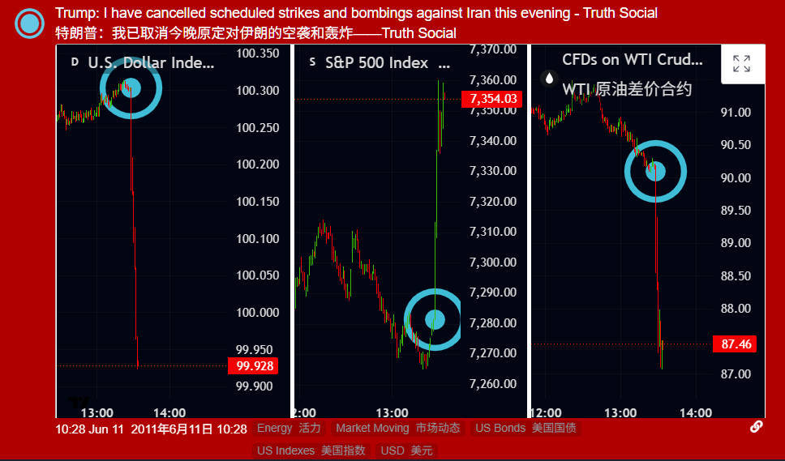

---

## 14

@俄罗斯卫星通讯社

发表于：2026-06-11 17:39

来源：微博

链接：https://m.weibo.cn/status/5308798043423240

【\#特朗普宣布取消对伊朗轰炸\#】美国总统唐纳德·特朗普表示，他已取消原定于周四晚间对伊朗实施的轰炸。\#美以伊冲突\# 

特朗普在其“真实社交”平台上写道：“鉴于与伊朗伊斯兰共和国的讨论已提升至伊朗领导层最高层面并获得认可，我作为美利坚合众国总统，决定取消原定于今晚对伊朗实施的打击和轰炸。”\#伊朗局势最新动态\#

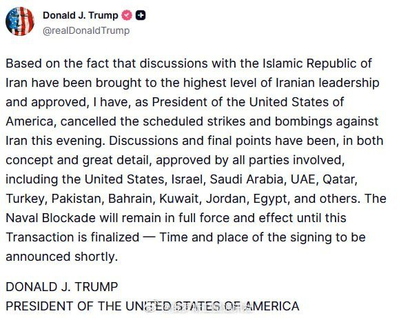

---

## 15

@美丽猪头又

发表于：2026-06-11 02:48

来源：微博

链接：https://m.weibo.cn/status/5308573896409954

这个鹅腿阿姨好奸诈啊……

感觉和西湖灵隐寺那边捡游客喝过的农夫山泉瓶子装自来水卖路人的老阿姨能聊到一起去

其实帮腔给商家说话的学生也是很那个什么，其实很享受0成本当好人还能霸凌别人的感觉吧……

那个国贸群里还有“20块不到的东西有啥好争论”

“那（质疑的人）肯定不是北大的”

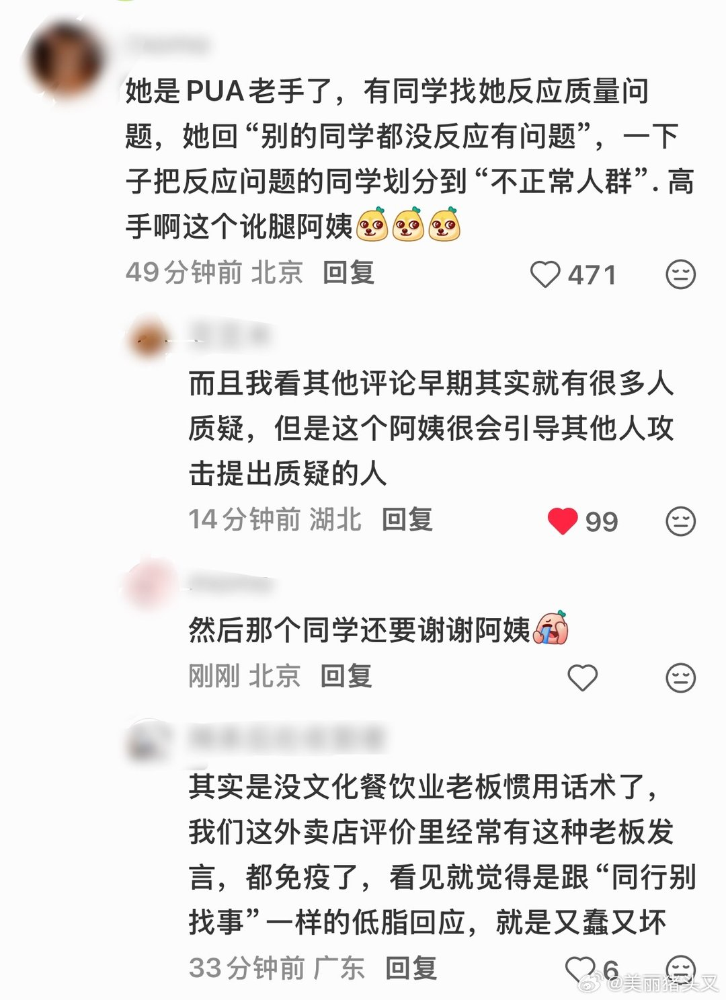

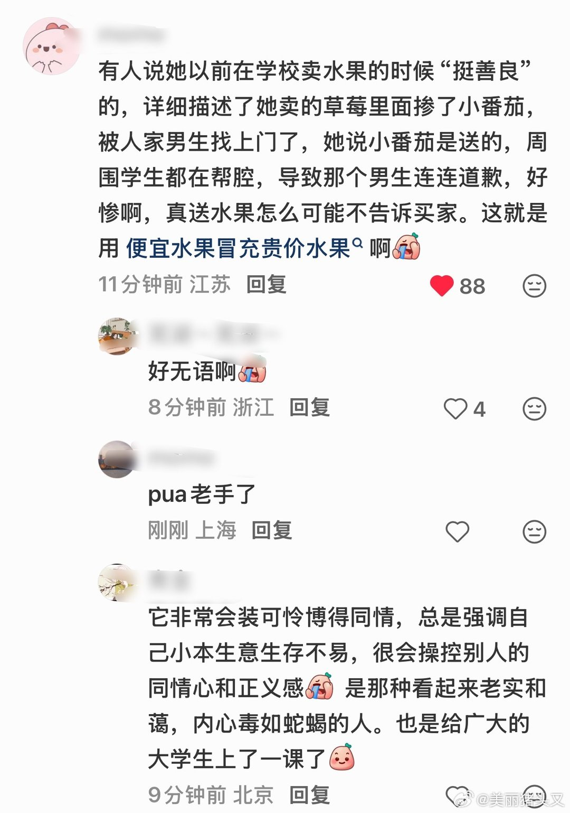

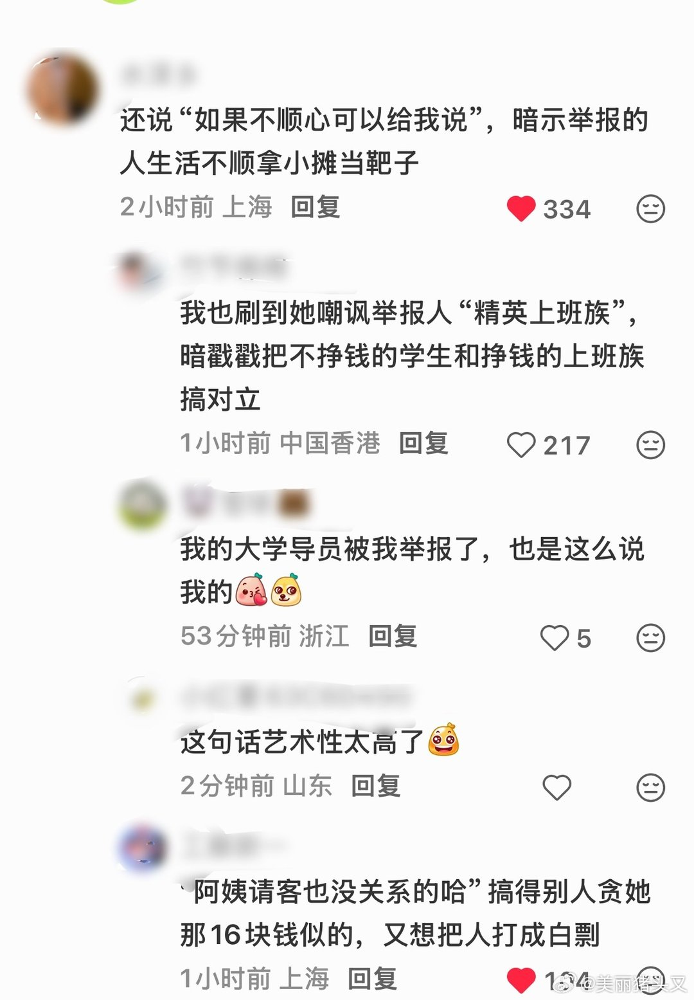

---

## 16

@青青虫的微博

发表于：2026-06-11 15:25

来源：微博

链接：https://m.weibo.cn/status/5308764442856163

\#外部视角\#\#兼听\# 加拿大一个正在上大四的姑娘在中日徒步旅行后写的对比评论，发现日本人讲究礼节、光鲜亮丽，而中国人则不那么强调形式上的礼貌。

原文翻译如下：

---

我以一位年轻女性旅行者的视角写下这些。

这两个国家我都去过。晚上和女同学一起走在东京街头时，我们遇到了醉酒闹事的人，而且回酒店的路上，我们经过的几个日本男人误以为我们是街头妓女，之后我们实际上一直处于紧张状态，感觉被人跟踪。在中国，我们绝对没有这种经历。

诚然，中国是一个"监控国家"，但主要针对的是潜在的犯罪行为。而在日本，尽管表面上彬彬有礼，却似乎对街头犯罪无动于衷，这让人有点不安。此外，我们在日本晚上确实看到了无家可归的人，数量很多，而且令人震惊的是，其中还有年轻得令人不安的女孩，也许甚至是青春期的孩子。这在中国我们没有看到。而且，在中国山野和河畔峡谷的荒野徒步是无与伦比的。

我真心觉得，尽管日本表面上彬彬有礼、讲究礼节、光鲜亮丽，但一切都只是勉强、脆弱地、靠一根线维系着，他们的人民在承受巨大的经济困难，但因为要面子而隐藏起来，也许只需要再发生一次经济失误，整个日本金融体系就可能崩溃。

在我两次去中国的徒步旅行中，这个国家整体给人的感觉是……有韧性。中国人不那么强调形式上的礼貌，但你会感觉到中国实际上非常强大、可靠，而且安全。中国人似乎并没有很多生活在极端状态，你感觉不到他们故意隐藏着痛苦，中国社会看起来是真正快乐的，而在日本，他们更多只是假装快乐。

黛安，加拿大温哥华。5月25日/2026 上午08:33

---

## 17

@李鲆

发表于：2026-06-11 08:55

来源：微博

链接：https://m.weibo.cn/status/5308666200984496

损人不利己不仅是道德问题，也是智力问题。

---

## 18

@刘新征

发表于：2026-06-11 16:32

来源：微博

链接：https://m.weibo.cn/status/5308781185730095

\#陈宇森接任钉钉CEO\#钉钉的问题，阿里的问题，也可以延伸至几乎绝大部分的大公司病，其根源正是：

组织试图用管理手段解决增长问题。

但增长问题很多时候根本不是管理问题，而是市场问题。

很多企业真正的问题不是不知道自己有边界，而是不愿承认边界。

因为一旦承认边界，就意味着要承认：总市场天花板有限；增长率有限；管理跨度有限；人才密度有限；自己也有限。

最残酷的是，企业家在经营现实世界，资本市场在定价未来世界，增长从手段，变成目的本身，增长一停，股价马上躺倒给你看，收入和职业评价暴跌。

其实公司上下，所有人都知道答案，最高层不知道吗？

知道，停不下来了。

---

## 19

@幻想狂劉先生

发表于：2026-06-11 16:01

来源：微博

链接：https://m.weibo.cn/status/5308773591681766

战后的朝廷奏报说：“海龄查拿汉奸，误杀良民不计其数，以致人心不服，将该副都统围住，海龄因纵兵开炮轰击。夷闻内变，乘势直入府城。”由此可见，在英国人攻城之前，城里已经因为海龄屠杀民众而内乱了。根本不是什么在兵力火力差距下死战不退，而是最耻辱的失败—被民众所彻底抛弃//@大EE大大:军力火力对比要不要也给一下？还有在虎门给英国人当带路党的是谁啊？//@幻想狂劉先生:具体是37人还是39人有争议，这怎么会两条人命算不清呢？因为这39（37）个阵亡英军士兵里有15（13+2）死于二臂指挥官的命令，英军指挥官要求士兵穿着羊毛呢子军装在7月中旬的长江流域作战，结果中暑（热射病）挂了13个，还有2个随军医生Edward Cree确认不了（大概率是）。所以实际上英军和清军作战挂了39-15=24个，然后清军还有驻防八旗、入援八旗和绿营、乡勇好几股，所以大英雄海龄血脉觉醒杀什么人杀的这么爽，真的好难猜啊

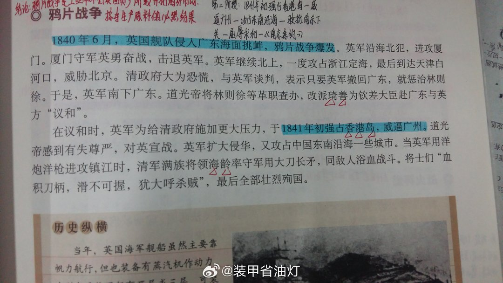

---

## 20

@蘸盐

发表于：2026-06-11 15:57

来源：微博

链接：https://m.weibo.cn/status/5308772497228358

贵就贵在房租这块了。美食荒漠坏也坏在房租这块了。牛街有家临街店面，以前是年糕李，后来奥运前后吧，对方退租，房东自己办了个执照开小饭馆，自己下厨做小碗牛肉、肉饼、牛肉面、葱爆羊肉，味道简直绝了 查看图片 当时经常从三元桥打车跑到牛街那儿，专门去吃他家的肉饼跟葱爆羊肉。可惜过了一两年，店面又租给新租户，房东不做了然后现在我家附近有家底商面包房，开了八九年了，做的面包点心还可以，质量稳定，店里可以喝咖啡但没啥人喝，店员也不忽悠办储值卡什么的。有时还能看见女老板在店里晃悠。有次去买面包时突然醒过味儿来，“你这店是老板自家的房吧？”“对。旁边艾灸馆也是。”//@西门大妈:这么说吧，北京还不能完全算美食荒漠，朝阳的饭馆还行（不是说特别好，但是有些还不错），当然不行的占大多数，只能算美食戈壁～海淀和昌平这种码农和大学扎堆的地方那可真是美食撒哈拉…这里的人别说不讲究吃，也不讲究穿，甚至都不讲究住…奇葩户型和诡异小区环境我就不提了，哪怕花三千万买的房子，里面也是一水的便宜家具…如果北京生活质量是0，朝阳区不考虑孩子上学大概还能达到+20，海淀那是-20，昌平我估计-40

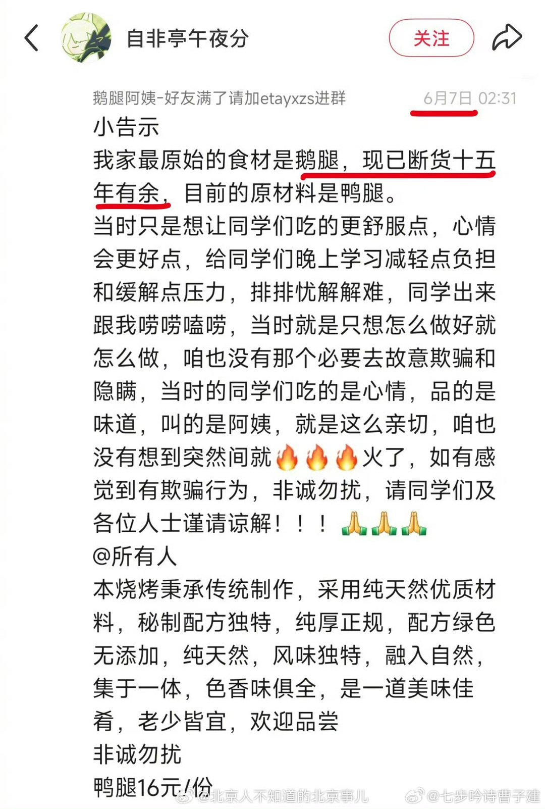

---

## 21

@蘸盐

发表于：2026-06-11 15:40

来源：微博

链接：https://m.weibo.cn/status/5308768225330375

这个“她力量”不至于管那么宽。清华和人大也有鸭骗受害者，北大的“她力量”组织再怎么召唤“她力量”，也堵不了这俩学校学生的嘴啊  （说到这想到个事，清华的25群都有440人 查看图片那是不是清华本身受害者就至少有一万二千多人（次）了？再算上北大人大和其他学校的群？还有国贸群之类的？再乘以16元，乘以每年下单数，乘以15年？应该是值得今年海淀市监和海淀公安查一查的年度大案了）

---

## 22

@班叔

发表于：2026-06-11 15:29

来源：微博

链接：https://m.weibo.cn/status/5308765393918878

牛马苦啊//@来去之间://@李大米Lidami:突然理解了所有……//@小空天天在卖呆:但假如你是一个花家里钱上学的学生，你花家里的生活费买游戏，买皮肤，顺便买了一根鹅腿，吃起来感觉口感不对劲，晚上开黑前，你吐槽了一句，那个鹅腿是鸭肉下次别买，室友立刻捧哏：“卧槽凡少老吃家啊这嘴真是没谁了”，你哈哈一乐，第二天起来大概率无事发生。//@小空天天在卖呆:你是一个在国贸打工的牛马，早上10号线出问题迟到，微博迟迟不发情况说明，全勤奖泡汤。项目出问题一天到晚在挨叼，晚饭都没吃，好不容易项目稳定准备下班了，领导告诉你们重大生产事故今年绩效清零，开个组会复盘一下，散会后你头昏眼花，看着支付宝-20%的收益，绝望地啃了一口鹅腿，妈的，鸭肉。

---

## 23

@Barret李靖

发表于：2026-06-11 15:25

来源：微博

链接：https://m.weibo.cn/status/5308764434471672

过去几千年里，人类一直默认自己是已知世界中认知能力最强的存在。人与人的差别，只不过是知识、经验和思考深度的不同罢了。

AI 出现后，这种认知开始改变。面对问题，人们越来越依赖 AI 获取信息、验证想法和推进工作，许多原本独立完成的思考过程转向了人机协作，🤖

与此同时，人类第一次长期面对一个记忆和智力，甚至情商都明显超越自己的存在。它不知疲倦，不会遗忘，也无需休息。

要知道，过去比你聪明的人依然是人，时间和精力都有限；可 AI 不一样，关键是，它还正在杀入劳动力市场。

当企业追求效率和成本优势时，一个能 24 小时工作、持续学习且成本不断下降的智能体，自然会成为新的选择。

人类面对的，不再只是更聪明的工具，而是更聪明的竞争者。🥲

---

## 24

@生育兴华

发表于：2026-06-11 23:43

来源：微博

链接：https://m.weibo.cn/status/5308889740609604

拼多多上，上市公司大鸭腿，一袋近600克3只，一只200克（快半斤）。

3袋9只一共50多元，这还是零售，还是上市公司产品。

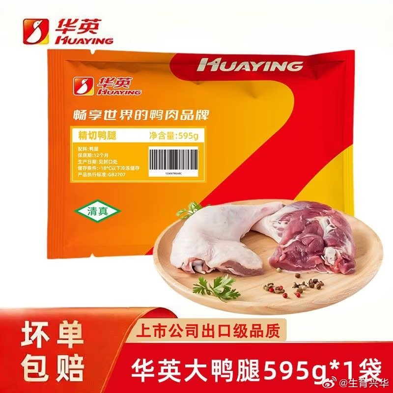

---

## 25

@新浪财经

发表于：2026-06-11 09:11

来源：微博

链接：https://m.weibo.cn/status/5308670231711772

【\#于东来称高薪让员工产生认知偏差\#】6月10日，胖东来创始人于东来在企业内部分享会上公开反思经营管理问题。他表示：“我们公司30年以来，基本上都是使用超越员工期望的薪酬，这样好的一点是能激发大家的热情，不好的一点，产生溺爱。大家其实不值这么多钱，但是给你了这么多钱，让你产生了一个认知上的偏差，偏差就导致自己认为自己就值这么多钱。好的一面是我在公司里面，因为我值这么多钱，我感觉我很骄傲很幸福。不好的一面，就是一旦走出胖东来就完蛋。这可能就是政策上的过度溺爱。”

于东来对胖东来薪酬制度也表达了看法，他表示：“公司里面我期望的结果是，我们薪资层面，无论是人力资源、财务部门或者营运部门，结合起来，我们给公司制定我们相应的比较科学的薪酬制度。” （大河报）

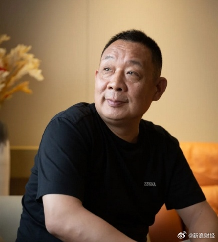

