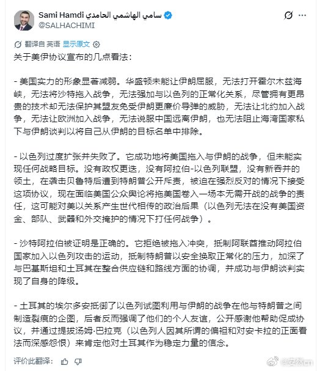
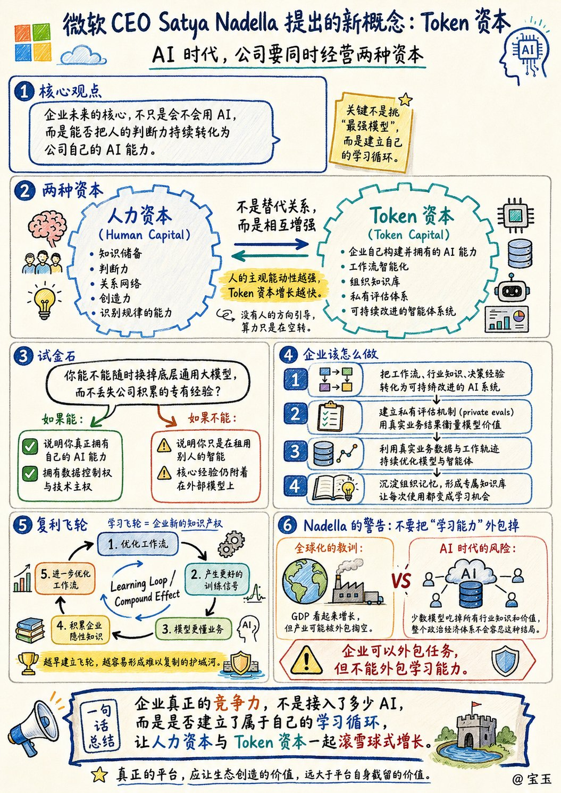
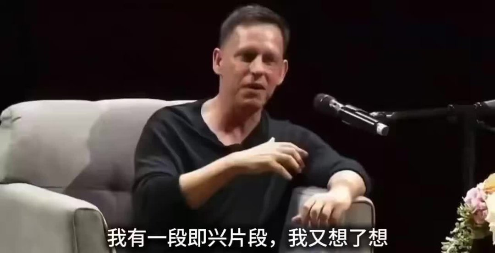
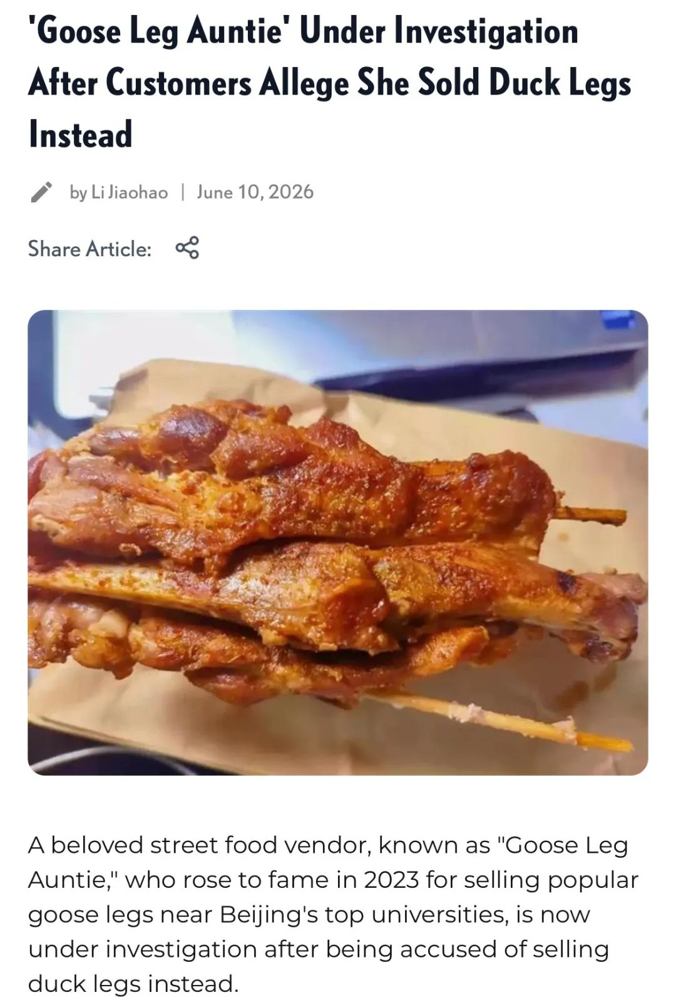
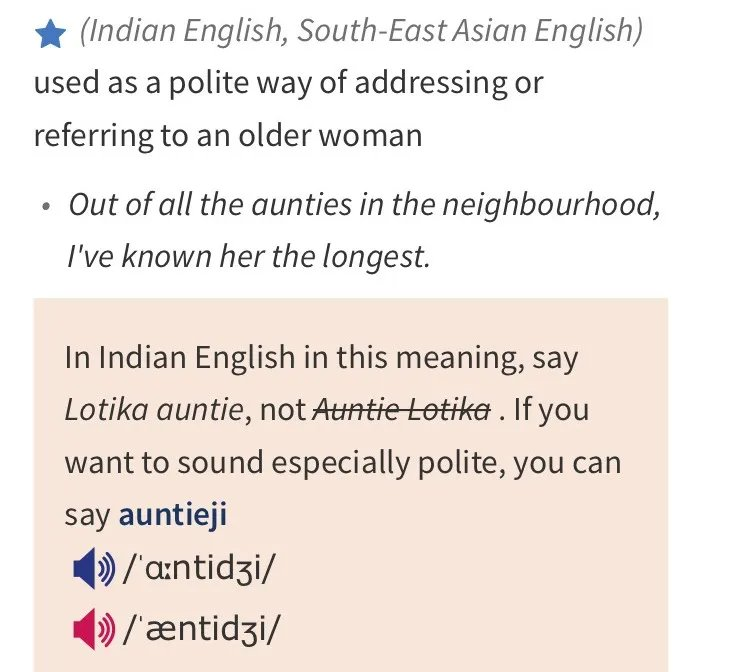
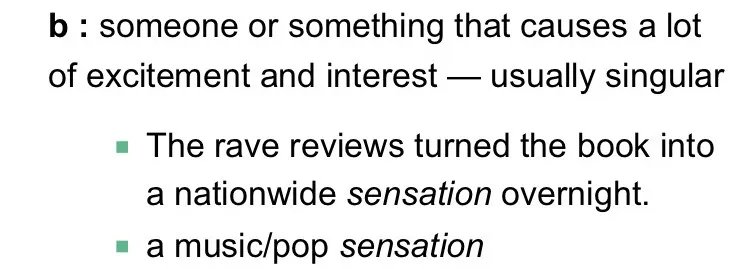
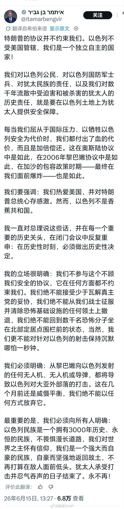
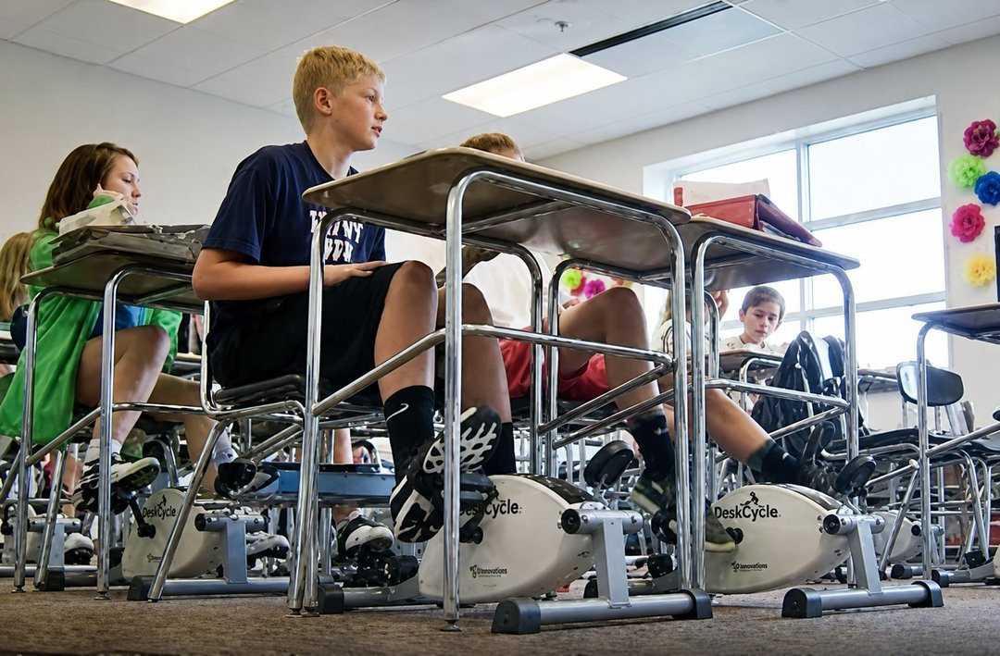

# 2026-06-15

## 1

@安然cn

发表于：2026-06-15 10:24

来源：微博

链接：https://m.weibo.cn/status/5310024257372610

关于美伊协议的看法，我认为这位博主说得比较全面和客观。总之，这场战争，以色列并非赢家，反而因为过度扩张姿态，不但一无所得，还引起了美国公众对其把美国拖入战争的舆论反感。

【关于美伊协议宣布的几点看法：】

- 美国实力的形象显著减弱。华盛顿未能让伊朗屈服，无法打开霍尔木兹海峡，无法将沙特拖入战争，无法强加与以色列的正常化关系，尽管拥有更昂贵的技术却无法保护其盟友免受伊朗更廉价导弹的威胁，无法让北约加入战争，无法让欧洲加入战争，无法说服中国远离伊朗，也无法阻止海湾国家私下与伊朗谈判以将自己从伊朗的目标名单中排除。

- 以色列过度扩张并失败了。它成功地将美国拖入与伊朗的战争，但未能实现任何战略目标。没有政权更迭，没有阿拉伯-以色列联盟，没有新吞并的领土，在袭击贝鲁特后遭到特朗普公开斥责，被迫在强烈反对的情况下接受这项协议，现在面临美国公众舆论将拖美国卷入一场本无需开战的战争的责任，这可能对美以关系产生世代相传的政治后果（以色列无法在没有美国资金、部队、武器和外交掩护的情况下打任何战争）。

- 沙特阿拉伯被证明是正确的。它拒绝被拖入冲突，抵制阿联酋推动阿拉伯国家加入以色列攻击的运动，抵制特朗普以安全换取正常化的压力，加深了与巴基斯坦和土耳其在整合供应链和路线方面的协调，并成功与伊朗谈判实现了自身的降级。

- 土耳其的埃尔多安抵御了以色列试图利用与伊朗的战争在他与特朗普之间制造裂痕的企图，后者反而强调了他们的个人友谊，公开感谢他帮助促成协议，并通过提拔汤姆·巴拉克（以色列人因其所谓的偏袒和对安卡拉的正面看法而深感怨恨）来肯定他对土耳其作为稳定力量的信念。

---

## 2

@宝玉xp

发表于：2026-06-14 22:04

来源：微博

链接：https://m.weibo.cn/status/5309951963824711

微软 CEO Satya Nadella 发了一篇长文，提出了一个新概念：Token 资本。

他的核心论点是，AI 时代每家公司都需要同时经营两种资本。一种是传统的人力资本，员工的知识、判断力、关系网络；另一种是 Token 资本，公司自己构建并拥有的 AI 能力。两者不是此消彼长的关系，人的判断力越强，Token 资本增长越快。没有人的方向引导，算力只是在空转。

这个说法听起来抽象，但 Nadella 给出了一个具体的检验标准：你能不能随时换掉底层的通用大模型，而不丢失公司积累的专有经验？如果能，说明你真正拥有自己的 AI 能力；如果不能，说明你只是在租用别人的智能。

他建议企业把工作流、行业知识、决策经验转化成可以持续改进的 AI 系统，建立私有评估体系来衡量模型在实际业务中的表现，而不是只看公开跑分。这个学习飞轮一旦转起来，就像复利，每次改进的工作流都会产生更好的训练信号，进一步加速知识积累。

Nadella 还发出了一个颇有政治意味的警告。他拿全球化做类比：第一轮全球化时期，GDP 数字看着不错，但整个产业被外包掏空了，后果至今还在显现。如果 AI 时代重演这个剧本，少数几个模型吃掉所有行业的知识和价值，"政治经济体系不会容忍这种结局"。

--- 原文翻译 ---

没有生态支撑的前沿技术，注定无法行稳致远

Satya Nadella

最近，我一直在深思：在由人工智能驱动的经济浪潮中，企业的未来究竟在哪里？

这次变革与以往任何一次平台更迭都截然不同。过去，我们只是用数字化系统来提升人类的工作效率。但这一次，我们破天荒地在人类与数字系统之间建立起了一个真正的认知循环 (cognitive loop)。这绝对是个颠覆认知的概念，因为它彻底改变了我们对企业内部“工作”本质的定义。

当 AI 模型能够源源不断地吸收人类和组织的专业知识，并将其变成大众化的廉价商品（即将原本稀缺的专业技能变成人人唾手可得的通用能力，从而削弱企业的核心壁垒）时，真正的危机出现了。我们面临的关键挑战，不再仅仅是如何使用某个数字化工具或系统，而是企业该如何在这个全新的世界中持续学习、积累知识产权 (IP)、保持独特性并茁壮成长。

每家公司都必须构建两种资本：一种是我们熟知的“人力资本” (human capital)，另一种我称之为“Token 资本” (token capital)。人力资本包含了员工的知识储备、判断力、人脉关系、创造力以及识别事物规律的能力；而 Token 资本则是指企业自身打造并掌控的 AI 实力（在这里，“Token 资本”一词很形象，因为大语言模型 (LLM) 处理信息的基本单位就是 Token）。

必须强调的是，随着 Token 资本的不断壮大，人力资本并不会因此贬值。相反，它会变得比以往任何时候都更加宝贵！我坚信，人类的主观能动性 (human agency) 将是推动 Token 资本增长的核心引擎。人类负责设定宏大的目标，跨领域地将线索串联起来，建立关系网，并洞察出最关键的规律。如果没有人类在前方指引方向，那些强大的计算力不过是在原地打转罢了。

这就意味着，真正的机遇并不在于你去市面上挑选一个“最好”的模型，而在于如何在模型的基础之上，构建一个能让人力资本和 Token 资本产生复利效应 (compound) 的“学习循环” (learning loop)。你可以把某项任务甚至整个岗位都外包出去，但你绝对不能把“学习能力”给外包了。企业未来的核心竞争力，就在于能否在人类与 AI 之间不断积累并放大这种学习能力。

这需要一种全新的架构思路：每家企业都要能够构建出能随着时间推移自我迭代的 AI 智能体系统 (agentic systems)，同时还要牢牢掌控自己的知识产权。一家公司应该能够随时替换掉底层的某个“通才模型” (generalist model)，而不丢失那些已经沉淀在系统里的、像“公司老兵”一样丰富的专业经验。在未来的时代，这将是检验企业是否拥有数据控制权和技术主权的关键“试金石”。

企业需要将自身的工作流、领域知识以及多年积累的判断力，统统转化为每一次使用都能自我进化的 AI 系统。企业应当建立私有评估机制 (private evals)（即企业内部针对自身真实业务场景定制的模型能力测试标准），用来检验模型是否真正在对企业有价值的结果上取得了进步，而不能仅仅依赖外界的公开跑分盲目自嗨！专属的强化学习 (reinforcement learning) 环境，应该让模型通过吸收组织内部真实的业务数据和工作轨迹变得越来越强大。这样的专属知识库，能让企业的组织记忆变得随时可检索，同时也让 token (tokens) 的运转效率大幅提升。

这种循环，将成为企业全新的知识产权。我把它想象成一台不断向上攀登的机器 (hill climbing machine)。而且与大多数资产不同，它具有强大的复利效应。每一个被优化的工作流，都会产生更优质的训练信号，从而加速这家企业独有的隐性知识 (tacit knowledge) 的积累。那些尽早布局构建这种循环的公司，将会获得一道难以复制的护城河，无论未来市面上又出了什么能力炸裂的新模型，都无法轻易撼动其地位。

我们最不愿看到的局面，就是各行各业的所有公司，都在向少数几个贪婪吞噬一切的巨头模型割让价值。如果所有的经济价值都只被少数几个模型垄断，政治经济体制是绝对无法容忍的。社会也绝对不会允许一个让整个产业被彻底掏空的 AI 未来。

回想一下全球化初期发生的事情吧：大规模的业务外包曾让许多工业经济体被彻底掏空。表面上看 GDP 数据依然光鲜亮丽，但大量产业工人流离失所是血淋淋的现实，其带来的严重后果至今仍未消散。我们绝不能让这种悲剧在 AI 时代重演——决不能让少数几个 AI 系统攫取了所有的经济回报，而一整个行业的从业者却只能眼睁睁地看着自己赖以生存的专业知识被无情地廉价化。

在我看来，我们的当务之急不仅是打造前沿模型 (frontier model)，更要构建一个繁荣的“前沿生态系统” (frontier ecosystem)。只有这样，价值才能像活水一样，广泛地流向每一家公司、每一个行业、每一个国家。在这个生态中，每个组织都能拥有属于自己的学习循环，将组织智慧沉淀其中，让人力资本与 Token 资本共同实现滚雪球式的增长。

这也是伴随我职业生涯一路走来的核心理念：真正的平台，能够让在其之上生长出来的价值，远远大于平台自身所截留的价值。在这样的生态里，每家公司都能持续创新，并构建属于自己的真正价值。

当这一切实现时，企业不仅能为自己、也能为周边的整个经济体创造巨大的红利。员工们将会看到自己的专业技能被无限放大，个人的判断力将被融入系统，变得可以复制和规模化应用。而这一切带来的好处，最终将回馈给企业以及他们所在的广泛社区。

这才是企业为自身和宏观经济创造价值的正确方式。这也是我们应当携手共建的、稳定而持久的生态平衡。

---

## 3

@信号与噪声

发表于：2026-06-14 13:43

来源：微博

链接：https://m.weibo.cn/status/5309825883308768

硅谷PayPal帮主彼得·蒂尔认为，AI正终结过去200年，以数学能力为核心的精英体系。

工程、量化等“数学型人才”的逻辑优势，正在被AI迅速替代，其职业护城河也正在消失。

未来真正的竞争力，在于叙事、社交语境理解，以及把AI嵌入社会系统的语言型人才，这才是人类独特优势。

工业革命让肌肉贬值，AI革命正在让“纯计算的大脑”贬值。未来的胜出者，是那些能用语言驾驭算法、用叙事锚定价值的社会系统操盘手。

作为程序员： 

别只埋头代码，而是要多练自然语言描述问题；

学产品思维和用户研究，理解非技术需求；

开发时优先考虑伦理、社会影响；

选领域深耕；

把代码变成“能讲故事”的系统。

未来你的优势是“代码+叙事”。

所以，年轻人别慌着放弃STEM，也别觉得学文科就躺赢了。真正该练的，是用AI思考更深的问题、讲出更动人的故事、构建更复杂的社会系统。

蒂尔指出了方向，但真正的游戏，才刚刚开始。

说白了，需要文理兼修，才能走得更远。

多读18本\#我读过的美国大学教材\# 信号与噪声的微博视频

---

## 4

@新浪财经

发表于：2026-06-14 21:33

来源：微博

链接：https://m.weibo.cn/status/5309944108941770

特朗普：与伊朗的协议现已达成。向所有人表示祝贺！我特此全面授权霍尔木兹海峡免费通航，并同步授权立即解除美国的海上封锁。全球的船只们，启动引擎吧。让石油流通起来！

---

## 5

@幻想狂劉先生

发表于：2026-06-14 08:36

来源：微博

链接：https://m.weibo.cn/status/5309748733021199

我觉得中国人有这样看法的一个重要原因，是中国人和俄国人是通过完全不同的路径，得到对外人际交往中的一个重要常识：“原来外国人也是有好有坏的”。俄国人是先假定外人不是好人，至少是应该多留心戒备的人，然后在接触中发现咦有些人不错，然后逐渐关系升温，他们中很多人有好汉性格，跟你掏心掏肺起来也是非常讲义气的。而中国人则相反，对外国人尤其是第三世界的人有“亚非拉兄弟”的滤镜光环，直接把对方当成好人（至少不是坏人）而放下戒备，最后吃亏上当被侮辱损害之后才醒悟“原来外国人也是有好有坏的”。所以中国人去俄国，面对那些警惕和审视的目光，观感肯定不会太好的。我看到小红薯上有个人说，一个强壮而沉默的俄国人一边用防贼的眼神盯着他，一边双手各拎一个箱子走了1.1公里给他送到地铁口，以至于他都害怕对方不还他箱子了。很正常，就是这样。

---

## 6

@SCUT魏剑峰

发表于：2026-06-14 01:55

来源：微博

链接：https://m.weibo.cn/status/5309647728936315

英文媒体City News Service在报道“鹅腿阿姨”事件时，有这样的标题：

'Goose Leg Auntie' Under Investigation After Customers Allege She Sold Duck Legs Instead

整个标题只有十三个词，但信息量巨大，直接把事情的前因后果都说清楚了。

标题包含了人物（Goose Leg Auntie）、状态（Under Investigation）、起因（Customers Allege）和核心矛盾（She Sold Duck Legs Instead）。读者一眼就能理解整个新闻的大意。

作者将“鹅腿阿姨”直译成Goose Leg Auntie，在亚洲文化中，像“阿姨”和“阿婶”等各种非亲属女性长辈都可以用auntie来称呼。

比如新加坡英语里面经常把保姆、钟点工、夜市摊贩等女性角色称为auntie，而在英美国家，auntie更多是指女性长辈亲属，比如姑妈、伯母、舅妈等。

因此，Goose Leg Auntie可以说是一个很有亚洲特色的译法。如果“鹅腿阿姨”出现在英国或美国，那么她大概率会被称为 The Goose Leg Lady

customers allege she sold duck legs instead，这里allege后面省略了that，以节省标题空间。

文章开头对整起事件进行了介绍：

A beloved street food vendor, known as "Goose Leg Auntie," who rose to fame in 2023 for selling popular goose legs near Beijing's top universities, is now under investigation after being accused of selling duck legs instead.

（一位深受欢迎的街头小吃摊主——人称“鹅腿阿姨”——因在北京多所顶尖大学附近售卖鹅腿而于2023年走红。如今，她正接受调查，因为其被指控出售的其实是鸭腿而非鹅腿。）

street food vendor就是我们说的“街头小吃摊贩”，beloved意思是“深受喜爱的”。

rise to fame是一个外刊常用表达，意思是“一夜成名，走红”。意思类似的表达还有go viral, become a household name, come into the spotlight 等等。

第二段介绍了“鹅腿阿姨”的背景：

The vendor, Chen Xiufeng, first gained attention when she ran a small stall near Peking University's southwest gate. Her freshly made goose legs became a campus sensation, with students lining up for hours. Soon, her business expanded to Renmin University of China, China Agricultural University, and even the upscale Beijing CBD area.

（摊主陈秀凤最初因在北京大学西南门附近经营一个小摊而受到关注。她现做现卖的鹅腿迅速风靡校园，学生们常常排队数小时购买。随后，她的生意扩展到了中国人民大学、中国农业大学，甚至进入了北京高端的CBD商务区。）

stall作为名词使用，可以表示“摊位”，比如：market stalls selling local fruits 出售当地水果的市场摊位

became a campus sensation，这里sensation是一个地道英文里面经常出现，但我们不太会用的单词，它指的是“轰动一时的人或事物”。

a campus sensation即“在校园内引发了轰动”。

作者接着介绍了“塌房”的经过：

However, controversy erupted after Chen herself posted an announcement in her Beijing CBD sales group, saying she had been reported by a customer. She admitted: "The raw material is duck legs. I will make it clear in the future." She added, "The name 'Goose Leg Auntie' has been used for over 10 years. There is no fraud involved." The admission triggered shock and disappointment among many university students who had long believed they were eating goose.

（然而，一场争议随即爆发。陈秀凤本人在其北京CBD销售群中发布公告称，有顾客举报了她。她承认：“原材料是鸭腿，以后我会明确说明。”她还表示：“‘鹅腿阿姨’这个名字已经用了十多年，并不存在欺诈行为。”这一表态让许多大学生感到震惊和失望，因为他们长期以来一直以为自己吃的是鹅腿。）

controversy erupted，这里erupt一词用得很有力，它本义是“火山爆发”，这里引申为“突然发生”。

she had been reported by a customer，其中report作为动词时可以表示“举报，告发”。

比如：My neighbours reported me to the police for firing my rifle in the garden. 我的邻居们因为我在花园里开枪而向警方举报了我。

among many university students who had long believed… 作者特意用了过去完成时had done something

我们知道过去完成时表示的是“过去的过去”，放在语境里面指的是学生们一直相信自己吃的是鹅腿这件事，发生在塌房事件之前。

在真相大白之后，这一信心也坍塌了。这里用过去完成时带有一种反转感，非常准确。

它也点出了“鹅腿阿姨”带来的后果：学生的信任无法维持下去了。

---

## 7

@花杀七十三

发表于：2026-06-12 12:52

来源：微博

链接：https://m.weibo.cn/status/5309088201441907

受不了了，看老外播客，说🇺🇸和另一个国家结仇就会打仗，但当🇨🇳对一个国家生气了，就会收回他们之前送来的熊猫

……听起来我们像昆仑山上武力高强但性格古怪的怪老头……

---

## 8

@风中的厂长

发表于：2026-06-15 15:25

来源：微博

链接：https://m.weibo.cn/status/5310093567724718

大家有没有发现，过去十年做生意最明显的变化，就是平台经济+大数据，常规生意越来越透明，资本越来越集中到少数人，后面ai时代会加速这个趋势。生意对于我们普通人来说已经是明牌了，我也什么都公开给大家讲，不藏着掖着了。重点是什么生意不能做了。我助理小陈家旁边，开了一家盒马nb，很快周围水果店，小超市都倒闭了，然后过了一阵，小老板们不长记性，新的水果店又开了，很快又倒闭了，看来不清楚的人还很多，那我大概梳理一下，哪些生意不能做了，哪些能做，怎么做？

首先标品、大众货被巨头和平台碾压，人家是靠规模和供应链成本优势，加上亏本抢占市场，普通人千万不要碰了。普通人要赚钱，核心就是：避开红海、做小众、差异化，产量受自然环境和地域限制，做高毛利、高净值人群、做轻资产。或者索性投资最熟悉行业的龙头。投资也是生意，比起创业失败概率可能还低一点。

这里插一句，最好的生意永远是平台，新时代的地主，说得好听点就是做生态，好的生态下面形成良性循环，大部分商户赚钱，比如以前的阿里，微信、海外苹果生态，谷歌生态，包括英伟达其实也是生态，泡不泡沫先不说，至少大家一起割全世界韭菜。

但是目前我们的一些平台，有非常不好的趋势，大部分商户内卷陪跑，极少数赚钱。利润少了，只能到处抠成本，创新难度加大。所以我忍不住说两句。

回到正题，新时代的明牌生意怎么做？

1. 标品、大众消费品别碰

山姆、盒马、美团、朴朴等新型卖场吊打传统商超和夫妻店！平台自营把食品、百货，日化价格打穿，小商贩无利润无活路坚决不做。

但是可以在大众品的基础上做差异化，比如我做的“不花心生鲜”品牌，差异化高端食材，产量受限的小众品，以及主打食品安全，方便省心两大卖点，再加上规模不大，所以一直还好。但是我的产品注定无法进入千家万户。

2. 服装：避开大众女装，低价服装，出片服装。做高质感，小众高毛利！

大众女装退货率50%以上，图片过度美化很容易货不对板，不美卖不动，太美退货高你说咋办。

我认识几个做高价品质的女装，面料高级，版型合身图片不夸张，退货率就很低，加上高净值人群时间之前，他们通常也懒得退货。除了高收入，中老年，特定圈层服饰，也是高复购、低退货。

还有一个我始终意难平的是优衣库，退货率只有15%-20%，国内哪个品牌可以做优衣库平替（基础款、好版型、高舒适度）；这里其实机会很大。

3.健康食品（高溢价、复购强）

比如低糖，无添加烘焙、健康轻食。面向健身、养生人群，避开大众食品红海。

4. 宠物高端用品和服务（高毛利、低竞争）

宠物已经变成新孩子了，这是没办法的事情，低价赛道也是卷的一塌糊涂，但是有如果你不追求跑量，那么智能宠物设备、高端粮，冻干、宠物殡葬，护理。毛利60%-80%还是能做做的，用户付费意愿强，退货率极低。

6. 中老年刚需用品，新时代老年人是享受了红利的一代人，有钱消费观开放，开发贴心的高端老人用品和服务，市场潜力肯定很大。我想给我爸找个高素质的护理都很难。能做的东西其实很多，防滑洗澡椅、床边扶手、防抖餐具、适老智能手环。甚至可以定制，很多人愿意花这个钱，宁愿买贵的不要便宜的。

7. 小众运动装备（新兴赛道、竞争小），你们去看美国中产玩的多花就知道，未来生产力大发展，个人爱好大爆发，这块前景很大，我以前讲亚马逊的时候说过，大家可以搜一下我以前的微博。而且这个是全球性的，国内国外都可以做。

8. 高端定制配饰（高客单、高毛利）

小众设计师珠宝、手工皮具、高端丝巾领带这些，也不是大资本喜欢的赛道，但是毛利非常高。客单价上千，毛利70%-90%，适合私域以及自媒体引流。做海外利润也好不卷。

9. 家居小众精品，我指的是高质感高审美的，原创陶瓷、中古家具、香薰蜡烛、高端布艺软装。毛利也有50%-80%，避开宜家、无印良品的大众款，主打“独特、有调性”。

10. 企业小众服务（B端、高客单、轻资产），偏向于定制，中小企业AI咨询、设计外包、拍摄剪辑外包、知识产权代理。特别是AI时代，适合懂商业流程又会玩AI的年轻人小团队，客单价高，无需囤货，靠专业赚钱。

11. 跨境小众刚需（信息差、高利润），国内低价小众品（复古饰品、宠物衣服、家居小工具）卖到欧美。利用审美差/价格差，毛利50%-100%，平台：独立站、亚马逊、tk小店。

12. 高端母婴细分（高净值、低退货），很多经济条件好的人还是喜欢生孩子的，可以做高端儿童羽绒服、有机辅食、育儿辅助。某高端儿童羽绒服品牌，毛利60%。

13. 本地高端生活服务（高客单、复购强），比如私厨定制、高端家政、高端上门美容/健身、宠物上门护理。客单价动不动上千，轻资产，靠口碑获客。

14. 健康养生小众品类（刚需、高溢价）高端滋补品（燕窝、海参、冬虫夏草）、古法养生茶、草本精油。自用加送礼，注意包装设计得有面子一点。不能和以前一样土。

15.其实投资也是一门生意，我们对行业以外的东西不懂，但是对本行业的，哪些企业实力强，门槛高，潜力大，员工归属感强，还是有数的，可以投一些自己熟悉行业的龙头企业。做牛逼企业的股东，让最牛逼的CEO和团队们为你打工！

---

## 9

@寰亚SYHP

发表于：2026-06-15 15:25

来源：微博

链接：https://m.weibo.cn/status/5310086843992441

\#以色列安全部长挑衅特朗普\#\#以部长称以色列不受美国管辖\# 以色列国家安全部长本-格维尔发文称，美国与伊朗达成的协议对以色列“没有约束力”：特朗普的协议对我们没有约束力，以色列不受美国管辖，我们是一个独立自主的国家。

---

## 10

@物理芝士数学酱

发表于：2026-06-15 14:26

来源：微博

链接：https://m.weibo.cn/status/5310084285730290

很多人应该深有体会，行走的时候我们的思维似乎会变得更加活跃？

2014年，北卡罗来纳州8年级教师Katie Motz 在学生的课桌下引入了便携式脚踏健身器，以帮助他们在学习的同时保持活跃。

这一想法的灵感来源于研究，这些研究表明腿部活动可以提高注意力，特别是对于那些难以长时间坐定的学生。

脚踏机并没有分散学生的注意力，而是为他们过剩的精力提供了积极的释放渠道。

许多学生报告说，踩踏帮助他们更好地集中注意力，保持对课堂的投入，并在整个上学日感到更加警觉。

据Motz 称，课堂上学生的生产力有了显著提升，包括完成的作业更多、参与度更好，以及遗漏的任务更少。

这一创新方法吸引了全国关注，并成为简单课堂改变如何支持身体健康和学业表现的典范。

虽然结果主要基于课堂观察而非大规模科学研究，但该项目展示了将运动与学习相结合的潜在益处。

---

## 11

@阑夕

发表于：2026-06-15 14:26

来源：微博

链接：https://m.weibo.cn/status/5310083867345874

4月，Meta在内部发起Token消耗排行榜，效仿游戏的天梯设计，鼓励员工冲击「缓存大师」「不朽传奇」等段位，于是排名最高的员工在一个月内烧掉了2810亿个 Token，相当于140万美金。

6月，Meta在备忘录里表示正在开发一套控制面板，用来限制员工的Token消耗，CTO表示需要立刻减少AI的浪费性使用，员工在跑任务之前一定要先想清楚到底是不是在提高生产力。

