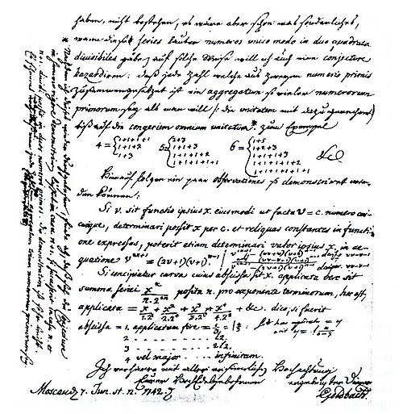
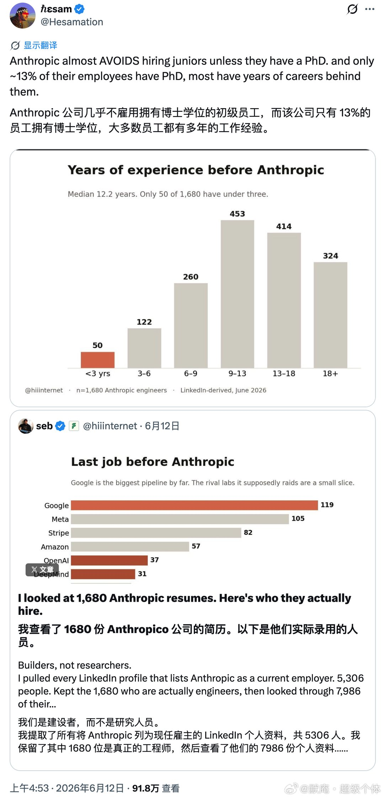
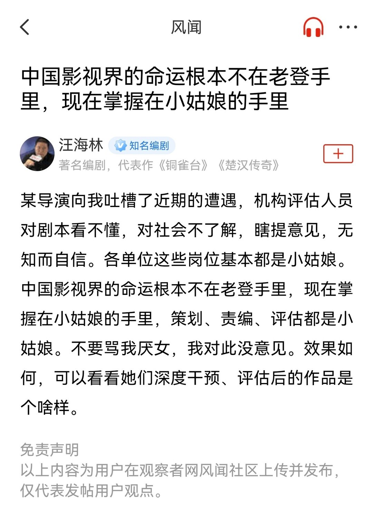
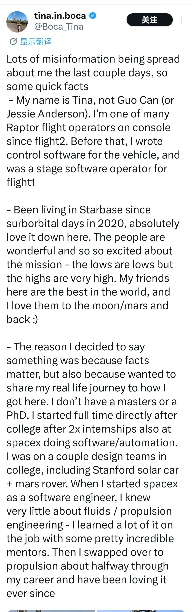
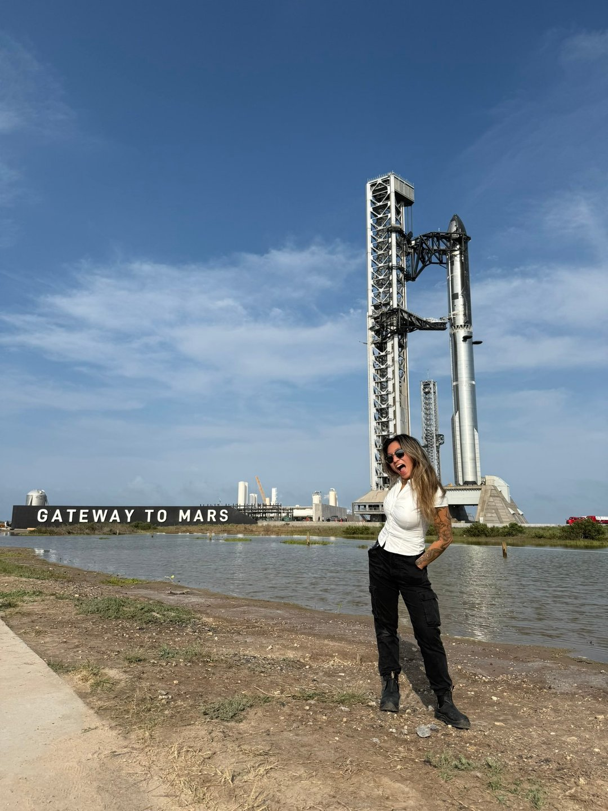
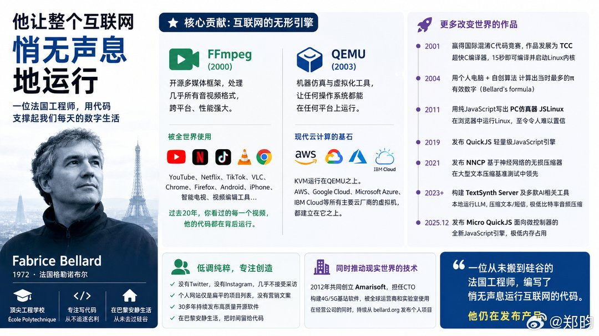
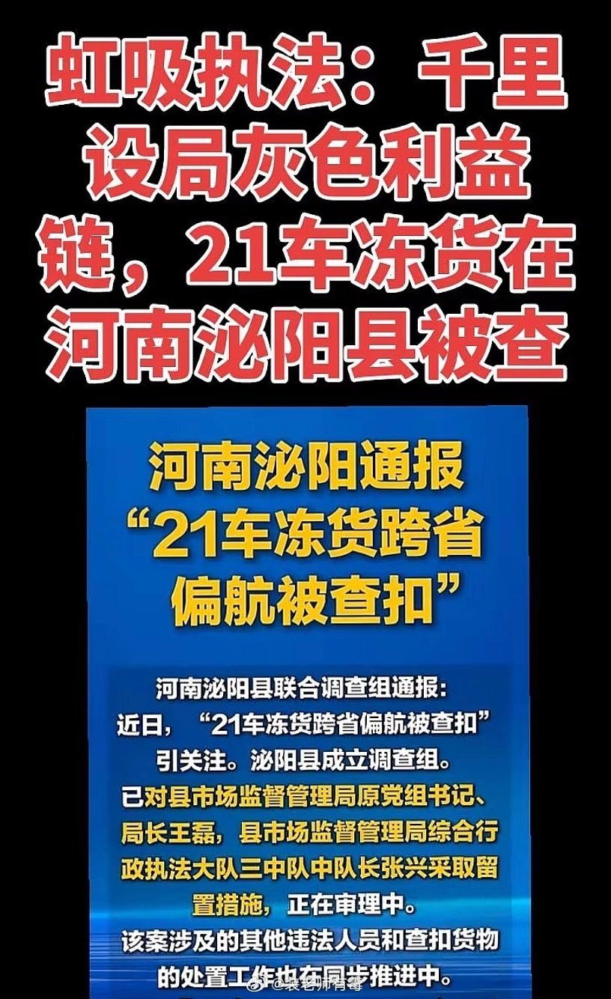
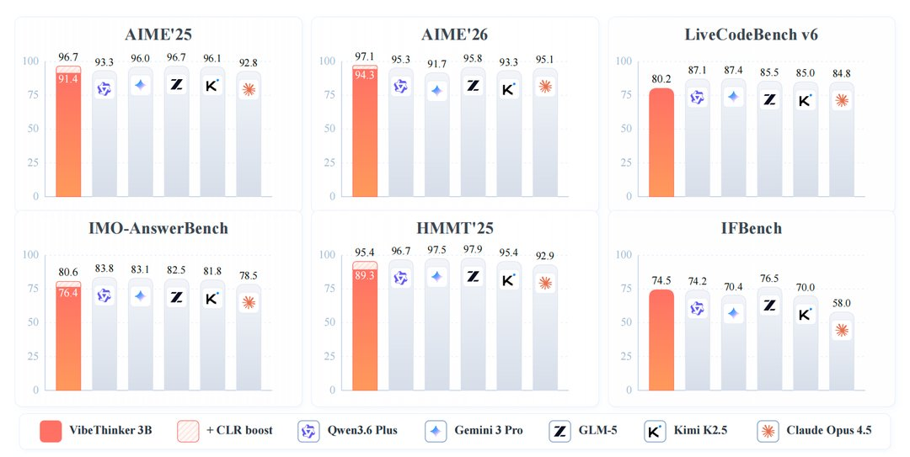
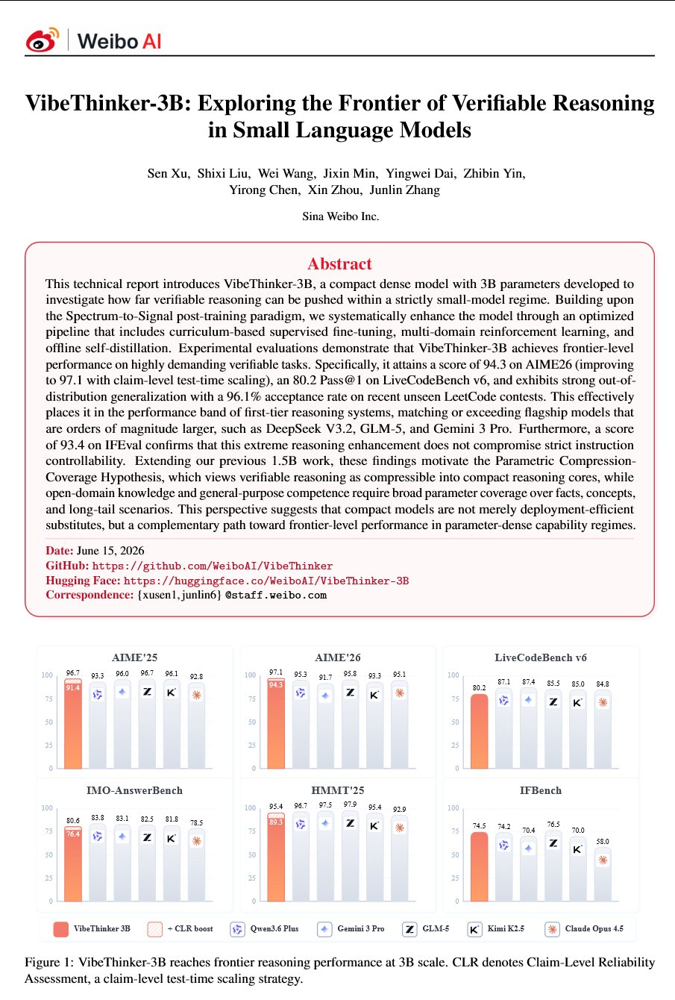
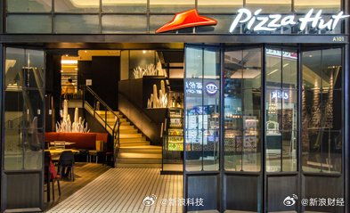

# 2026-06-17

## 1

@捏小猪

发表于：2026-06-16 12:53

来源：微博

链接：https://m.weibo.cn/status/5310538189636436

14亿中国人口的简化结构账本

有工作的：约 7.25 亿（其中有 2.8-3.2亿灵活就业，包含了部分农村老人）。

在校读书：约 3.2 亿（0-14岁儿童约2.1亿 + 16岁以上高中大学及研究生约1亿）。

有养老金的老人：约1.5亿。

其余群体（失业、家庭主妇、赋闲等）： 约 1 亿。

所以不要看到工作日鸡鸣寺也全是人，就问“这些人不上班吗？”

7.2亿人里面有3亿是灵活就业，上班的只有4亿，完全不工作的有7亿。

到节假日，那3.2亿学生也出来了，还有人带着，上班的人才是少数。

有个班上，其实在国内就算混得不错了。

---

## 2

@物理芝士数学酱

发表于：2026-06-16 13:15

来源：微博

链接：https://m.weibo.cn/status/5310543508017117

\#数学史\# 

1742年，哥德巴赫给欧拉的信件复印件。里面提出每个大于2的偶数都是两个素数之和。

---

## 3

@杜车别赫

发表于：2026-06-16 13:42

来源：微博

链接：https://m.weibo.cn/status/5310550521418972

看红果的ai短剧，偶然看见有一部《宇宙异常档案》，只有14集，播放量应该不算高。每一集就是一个科幻故事，旁白配合画面叙述，更近于有声小说。有些是利用刘慈欣小说如流浪地球或三体之类背景设定延伸拓展，有些不是。那些不是的，故事反转和立意深度都很不错，视角也多从文明演化兴衰的宏大层面切入。在科幻故事里也属于上品了。第六集ai对大众和科学精英的双重欺骗，两层反转很有巧思。第七集人类流亡飞船躲进黑洞边缘，利用时间放慢效应，等待ai机器在外面用几十亿年时间改造行星成一个新的地球，很有刘慈欣风格。对科幻有兴趣的，可以看一下。

---

## 4

@默庵·超级个体

发表于：2026-06-16 11:25

来源：微博

链接：https://m.weibo.cn/status/5310515889048245

海外有人做了一件挺有意思的事。他把 LinkedIn 上所有当前雇主写的是 Anthropic 的主页全爬了下来，一共 5306 个人。然后从中筛出了 1680 个真正做工程的，再去翻这些人进 Anthropic 之前的 7986 段过往岗位描述。做这件事的人本身就是搞招聘的，文章写得很有看头。

先说几个让我觉得最反常识的发现。

第一个，招的几乎全是搞 infra 的人，不是我们以为的那种 researcher。第二个，几乎不招初级员工，团队里中位数工作经验 12.2 年，只有 13% 的人有博士学位。第三个，最大的人才来源不是 OpenAI，不是 DeepMind，而是 Google 和 Meta。第四个，如果偶尔出现一个 junior，简历画像是这样的：MIT 出身，IOI 银牌，Codeforces 2900 分往上。干净得让人无话可说。

顺着这几点，我们来看看 Anthropic 的人才结构到底长什么样。

先说规模节奏。Anthropic 几乎是一夜之间把团队搭起来的。现在还在职的工程师里，2021 年之前就进来的只有 15 个人。真正的爆发在 2025 到 2026 年。2025 年一年，工程团队扩了大概三倍，招了 686 个人。2026 年到 6 月的数据，已经招了 455 个，照这个节奏全年也差不多。现在这个团队里，一半人入职还不到一年。过去 12 个月进来的占了 53%，在职时间中位数 10 个月。换句话说，这是一个在大概 18 个月内被疯狂搭起来的巨型团队。

再说资历。这条是我觉得最让人意外的。进 Anthropic 之前，这些人的中位工作经验是 12.2 年。中间半数的人，经验在 8.8 到 16.5 年之间。1680 个人里，工作经验不到三年的只有 50 个；44% 的人干了 13 年以上。应届生基本等于没有。所以一个典型的 Anthropic 新人是这样的：已经工作了 12 年，但进公司才 10 个月。

技能方向上，他们把筹码几乎全押在了工程上。40% 的人背景里出现过 infrastructure。backend、distributed systems、databases、security 这几个方向，各自都在 20% 左右。而 reinforcement learning 这个大家想象中 AI 公司该拼命招的方向，只占了 3.3%。一个典型 Anthropic 工程师在过去十年做的事情，更像是待在 hyperscaler 或者 infra 极重的创业公司里，搭大规模生产系统。

来源上有个很有意思的错觉。大家总觉得 Anthropic 肯定从 OpenAI 和 DeepMind 挖了很多人过来。实际上，它最大的人才管道是 Google，领先幅度还很大。除了 Google，它明显偏好的还有那些以工程严谨出名的地方：Stripe、Databricks、Snowflake、Palantir、Airbnb。

说到底，Anthropic 的用人逻辑非常清晰。他们要的不是满脑子新 idea 的研究员，是一群见过世面、踩过坑、知道怎么把系统真正跑起来的资深工程师。然后用一年半的时间，把这些人攒在一起，组成了一个巨大的工程军团。

\#科技先锋官\#\#How I AI\#

---

## 5

@高飞

发表于：2026-06-16 10:35

来源：微博

链接：https://m.weibo.cn/status/5310503364067455

\# Perplexity CEO：Micron可能超过Meta，模型不是产品，出口管制帮到了中国

我可能有半年没有发过Aravind Srinivas的推文了，上一波还是DeepSeek R1发布后。作为Perplexity的联合创始人，他最早在自家产品用上了DeepSeek R1，而且在接受CNBC采访时说出了一句名言：稀缺是创新之源。

后来，大家谈Perplexity越来越少，甚至认为可能不再需要这个套壳产品。但是根据Aravind的说法，公司业绩相当不错，"年初以来收入翻了三倍"，对照多个来源的数据，2025年底ARR约2亿美元，2026年3月已突破4.5亿美元。我也是没有想到的。

时隔多日，Aravind依然是DeepSeek的粉丝，而且和黄仁勋一样，站在了Anthropic对面。

\#\# 一、模型不是产品，编排才是生意

1、**OpenAI联合创始人Greg Brockman那条推文说对了一半**

Greg Brockman最近发推说"模型不再是产品"。Aravind认为这话从一个前沿实验室的领导人嘴里说出来格外有意思，因为他本该有一切动机说反话。Google内部也有人一直在喊模型就是产品。但现实是，Codex也好、Claude Code也好、Perplexity Computer也好，本质都是编排系统：拿一个模型，配上一个agent harness，也就是一套定义agent循环如何运行的规则，再接上技能、子智能体、连接器和工具。没有这层harness，模型内在的智能转化不成有价值的输出token。

2、**AI行业唯一重要的指标：token value per watt per user**

Aravind给出了一个衡量AI商业价值的核心公式：每用户每瓦特的token价值。假设美元价格的根基是电力，那么谁能用最少的电力产出最有价值的输出token，谁就拥有最大的定价权。这不是一个技术指标，是一个商业指标。

它的含义是：纯粹转售模型token没有生意，因为模型会被商品化。基础设施层靠服务这些token有一些生意。但真正有生意的，是能把模型接入有价值的上下文、用优秀的harness编排、连接正确的工具和数据源、在统一系统里交付体验的人。

3、**花100万雇一个Jeff Dean，还是花同样的钱雇五个普通工程师？**

有人会问：既然开源模型12个月后就能追上前沿，为什么还有人愿意为前沿模型付高价？Aravind用了一个招聘类比：如果你有100万美元预算，你可以雇五个20万年薪的中等工程师，也可以只雇一个Jeff Dean付他100万。你会选哪个？答案是Jeff Dean。同理，企业会为前沿能力付溢价，但什么算"前沿"一直在变。今天的前沿是全自主软件工程agent；再往后可能是AI设计芯片、AI设计药物、AI搞清楚怎么造机器人。用户不会有1000万，但单个用户产生的价值可以极高。

4、**Perplexity的差异化在于跨模型编排**

Anthropic和OpenAI都做不到的一件事是：你不会在Claude Code的harness里看到GPT-5i，也不会在Codex的harness里看到Claude Opus 4.8。它们在互相竞争。但Perplexity Computer里两个模型都有。这让Perplexity能在不同任务的不同阶段选择最合适的模型，从而提升每瓦特每用户的token价值。

年初至今，Anthropic的模型进步巨大，Perplexity的收入也翻了三倍以上。OpenAI的竞争又把同等能力的成本压了下来。开源和本地模型的进步则能让一部分推理回到本地设备上。AI栈的任何一层进步，Perplexity都受益。

5、**少数power user撑起的token经济**

Aravind的判断是：前沿AI产品不会被1亿人使用，但它们产生的收入会超过Google或Meta的广告收入。现在推动token经济的是少数power user。Perplexity Computer有用户每月花费超过1万美元，不是浪费，是他们的业务在agent loop上运行。Meta内部有工程师每年在编程工具上花费千万美元级别。据Salesforce CEO Mark Benioff透露，Salesforce在Anthropic上的年度支出约3亿美元，折合开发者薪资的3.8%。

区分重度用户和普通用户的关键指标：是否设置了持续运行的定时任务，也就是让AI以cron job的方式自动监控、触发、执行，而不只是偶尔委派一个一次性任务。

\#\# 二、AI的钱不在广告里

1、**Chat界面天然不适合广告**

Google上花钱最多的广告主是Amazon，第二是Booking.com（Aravind估算其年度支出约160亿美元）。但今天没有人在ChatGPT上订酒店或机票，原因很直接：酒店选择是一个主观的、基于感觉的决策，你需要探索和浏览的界面，不需要一个给你客观答案的引擎。同样的逻辑适用于时尚和消费品广告，那些预算大头去了Instagram，因为用户在刷内容时被触达，这种行为chat界面抓不住。

2、**广告和信任是直接矛盾的**

一个用户来问"最好的蛋白粉是哪个"，如果系统回答之后插一句"顺便看看这几款也不错"，会直接伤害用户对平台的信任。Meta和其他公司试过在消息应用和邮件里塞广告，在美国从来没成功过。WeChat的广告能跑通是因为中国整个经济生态和用户行为都围绕它做了优化，美国不是这样。

3、**主观决策走广告，客观判断走agent**

Aravind给出了一个清晰的切分标准：凡是判断基于客观信息的交易，会被agent拿走；凡是判断偏主观、基于审美和感觉的决策，广告模式会持续。买麦克风是客观决策，选播客桌上的家具是主观决策。这个世界会沿着这条线分裂，而不是AI全面吞掉广告。

\#\# 三、电力是最大的瓶颈，而且阻力只会更大

从产品逻辑转到物理世界。无论编排层做得多好，底下的算力供应跟不上，一切都是空谈。Aravind对AI基础设施泡沫论的态度只有三个词："funny, stupid and moronic"。

1、**数据中心的真正瓶颈不在芯片，在电力和许可**

建数据中心不是买一堆GPU装好就完事。要买地或租物业，采购涡轮机发电或对接电网供应商，解决冷却方案，每一步都要拿许可证。这些物理环节的前置时间远长于芯片供货。当前在用的模型大多是在Nvidia Hopper代GPU上训练的，下一代Blackwell芯片上训练出的模型已经开始出现。明年Vera Rubin代的数据中心全面投入使用后，模型会更强大。物理建设时间始终是前沿能力的卡点。

2、**Micron可能在6到12个月内市值超过Meta**

访谈录制时，Micron市值约1万亿美元，Meta约1.3至1.4万亿美元。截至2026年6月中旬的公开数据显示，Micron约1.1至1.2万亿美元，Meta约1.4至1.5万亿美元。Aravind的逻辑是：HBM高性能内存是当前的瓶颈，价格已经涨了5倍，但市场仍然没有充分定价，因为瓶颈还在。

同样的逻辑适用于CPU。agent loop和harness运行在CPU上，token由GPU上的模型生产，但下载文件、处理数据、生成可视化、部署网站这些工作都是CPU在干。AMD和Intel因此重新变得重要。谁是瓶颈，谁就拥有定价权。

3、**公众对数据中心的抵制会持续且加剧**

Aravind估计目前有40%的数据中心项目因公众抵制而无法推进。很多抵制源于误解。人们以为数据中心大量消耗水资源和电力，微软CEO Satya Nadella说过实际用水量大约是"一罐水"的量级。但Aravind认为深层原因更复杂：对AI抢工作的恐惧、对财富不平等的愤怒、对电网价格上涨的担忧、对RAM涨价的不满，这些情绪以不同方式在释放。有些国家可能会抓住这个机会，欢迎模型公司去建数据中心。Elon要去太空做这件事，因为太阳能充裕。但美国国内的建设阻力短期内看不到缓解。

4、**产能过剩的风险大约20%到30%**

如果再出现一个DeepSeek级别的效率突破，用完全不同的垂直整合架构在本地设备上跑出接近前沿的能力，已经投入的大规模数据中心产能就会过剩。这不是零概率事件。

\#\# 四、24/7 AI需要混合推理，不能全跑在服务器上

1、**四个目标互相打架：准确性、智能、隐私、成本**

全部跑在服务器上可以拉满智能和准确性，但隐私和成本扛不住。全部跑在本地可以保隐私降成本，但达不到前沿水平。解决方案是混合编排：该用本地模型时用本地，该用服务器端时用服务器，由一个总调度路由器来做分配。Perplexity在Computex 2026上演示的正是这个架构，系统自己决定每个任务的每个部分在哪里执行，敏感任务发到云端前会征求用户许可。

2、**24/7 AI的真正制约不是安全风险，是费用**

大多数人担心always-on AI会做出疯狂的事情，但Aravind认为真正的问题是成本。没有人负担得起一个以秒级频率运行的前沿AI定时任务永远开着。瓶颈在编排和本地算力。

他设想的方案是：一个持续学习的本地模型，能做上下文压缩，尽可能在本地完成计算，只在必要时调用服务器端前沿模型。这个模型加上harness加上本地芯片加上它控制的设备生态，合在一起就是你自己的智能体。数据中心搬到了你的设备上，你拥有它、控制它，不用担心有人窥探你的token。

3、**想做这件事的公司，角色是编排者，不是模型构建者**

Aravind把Perplexity Computer比作乐团指挥：子智能体是演奏者，模型和工具是乐器，完成的工作是交响曲，整个系统是管弦乐团。指挥调度的对象会变，从模型到文件到工具到芯片到设备都有可能，但只要编排得当，最大化每瓦特每用户的token价值，就能在长期捕获AI中最大的经济价值。

\#\# 五、出口管制短期有效，长期可能帮了中国

1、**12个月差距的唯一原因就是出口管制**

Aravind认为开源模型和前沿之间之所以还有大约12个月的差距，全靠出口管制限制了中国获取先进GPU和高性能内存的能力。Anthropic在这件事上做了很多游说。短期来看效果明显。

2、**但DeepSeek被迫走了一条完全不同的路**

因为拿不到Nvidia GPU和高性能内存，DeepSeek只能在华为栈上构建，结果逼出了全栈垂直整合。

在存储层，DeepSeek在KV cache上做了极致的内存效率创新。KV cache是模型推理时用来存储上下文信息的缓存，DeepSeek把它压缩到可以放进SSD，不再需要高带宽内存来做推理。在计算层，注意力层和训练算法都做了改造以减少互连带宽消耗。在硬件层，因为不能用3D NAND这类主流闪存芯片，存储架构也完全不同。不只是模型架构不一样，整个栈从模型、推理、存储到芯片和制造，都在对齐自有硬件。这是跟美国完全不同的路径。

3、**中国在物理层的优势比美国大**

如果AI不只是数字世界的事，还涉及制造晶圆厂、机器人、芯片，以及高效利用能源并封装到本地设备里，那中国拥有更多优势。建数据中心的速度更快，电力不是问题，许可不是问题，劳动力不是问题。美国方面，TSMC在亚利桑那的投资已达600亿美元级别，Intel有美国政府10%的持股加上Nvidia和软银各5%，Elon也在建超级晶圆厂。人们确实已经意识到建设晶圆厂的重要性，但中国在执行层面的速度优势不容低估。

\#\# 六、400人做200亿估值，未来独角兽只需要20人

1、**Perplexity被投票为"最可能倒闭"的公司，之后收入翻了3倍**

2025年11月的Cerebral Valley峰会上，300多位AI创始人和投资人投票选出Perplexity是"最可能倒闭的十亿美元级创业公司"，Cursor排第二，OpenAI排第三。Aravind的反应："我觉得投票的那些人大多不做什么有用的东西。"峰会之后，Perplexity收入翻了三倍，烧钱率降低超过50%。Cursor据说在谈出售，OpenAI即将IPO。

2、**公司形态正在发生根本变化**

400人做到200亿美元估值，意味着40人做10亿美元完全可能。反过来推：如果4000人能做2000亿，1万人能做2万亿，那传统2万亿公司需要的10万人去哪了？Aravind希望那10万人分成10万个小团队，每个团队千人以下，各自值几十亿美元。他不认为这是失业问题，而是创业机会的重新分配。

他讲了一个真实的例子。一位旧金山的Uber司机看了Aravind的YouTube访谈，学着用AI从零开发了一个web app，加上计费功能，现在这个app带来的被动收入已经超过开Uber的收入，他因此减少了开车时间。Perplexity自己也在做一个叫"Billion Dollar Build"的计划，给任何有可靠路径通向10亿美元公司的创业团队提供100万美元算力额度，目标是孵化1000家这样的公司。

3、**前沿模型提供者的生存条件只有一个：持续保持在前沿**

如果6个月不出新能力，对前沿实验室来说就是坏消息。大型企业一定会在开源模型上做微调来降低成本。开源模型持续强大是Nebius和CoreWeave这类AI基础设施公司的商业模式前提；如果开源和前沿的差距拉大到15到18个月，这些公司就只剩下给OpenAI和Anthropic出租算力的生意。Anthropic如果觉得Claude Code已经赢了，12个月后可能就不在了。这个领域没人能松口气。

Jensen Huang就是这种心态的极端体现。Nvidia市值5万亿美元，未来两年几乎确定能做5000亿营收，拥有全球最先进的芯片。但Jensen每天醒来告诉自己表现不够好，告诉团队他们离倒闭只有30天。Aravind说这就是成为Jensen Huang所需要付出的代价。

4、**降成本的路径：自研模型替代外部前沿token**

被问到"你们哪里成本效率低"时，Aravind给出了明确答案：Perplexity正在优秀的开源模型基础上做post-training，用自研模型承担当前产品中已有能力的推理需求。前沿模型token只用于设计新体验和开发新能力。这是提升毛利率最直接的手段。

5、**十年持有只能买一只的话，选SpaceX**

理由是SpaceX是独一无二的公司，Anthropic和OpenAI可以互相声称做对方做的事，但没有第二家在建太空连接基础设施。Aravind自己坐过Starlink航班后再也不想坐没有的了。未来30分钟从澳洲飞到旧金山，听着像科幻，但他对这些可能性感到兴奋。Samsung曾经是杂货店，SK集团从纺织厂起步，今天都是万亿美元公司。谁能走到哪一步，没有数学公式能给出上限。

---

## 6

@挨踢牛魔王

发表于：2026-06-16 09:10

来源：微博

链接：https://m.weibo.cn/status/5310481939562567

阿里这家公司，肯定有人在里面瞎整的，就是不知道是谁？

本来形势多好，Q-image可以说国产开源图像模型的突破了。

z-image-turbo跟社区合作，那个效果非常好。

光影、图像、文字都取得了突破，占用显存还低，口碑非常好。

只要再出一个编辑模型，然后把两个二合一，就是一个非常能打的图像模型。

大模型这块，Qwen3.7 Max也是不错的。

只要全力搞一个1T以上的主力模型，主攻编码和agent，必然可以突破。

又不是没有Qoder这样的智能体客户端。

千问这块，其实不需要太强的模型，就全力做好产品就行了。

视频模型，也有happy horse，Wan系列。

可以说，阿里是一个全模型覆盖，开源有口碑，且有云服务的一家公司。

就不知道咋搞的，先是组织架构调整，把林俊旸搞走了，然后钉钉又搞出一堆鸡飞狗跳的事情。

我们真的不关心这种事情，我们就看你对客户交付的结果是啥。

这样一搞，我看z-image-turbo系列短时间内是没戏了。

都半年了，一点消息也没有。

大模型和智能体方面，磨磨蹭蹭的，都不知道在干啥。

---

## 7

@李楠或kkk

发表于：2026-06-16 06:04

来源：微博

链接：https://m.weibo.cn/status/5310435116977694

1

至少到本科为止的所有教育。。。

本质上，都是对人类现有知识的一种 prefill 。

记忆，理解，实践，熟练的循环。

你的成绩再高，也很少脱离这个模式。

2

而 IT 行业发展了一个更高效的新模式：

搜索，抄袭，修改。。。

这就是所谓 Open Source 。

3 

如果没有 AI ，你掌握这两种模式，已经足够足够了。

但是 AI 提出了新的要求：

发现需求，评估价值，确定最优实践，自动化方案，抽象高纬理解，然后忘记。。。

其实也没什么难的。。。

4

唯一的问题是，很多人以为 1 学好了，3 就会了。。。

而实际上。。。

传统教育训练你把答案装进脑子里。

AI 时代训练你判断：哪些答案根本不需要装进脑子里，以维持最高的运算性能。

当你的内存塞满答案的时候，

你学不会新把戏。

---

## 8

@风闻社区

发表于：2026-06-15 11:06

来源：微博

链接：https://m.weibo.cn/status/5310148655979173

@汪海林：中国影视界的命运根本不在老登手里，现在掌握在小姑娘的手里

---

## 9

@China航天

发表于：2026-06-16 02:00

来源：微博

链接：https://m.weibo.cn/status/5310373839768382

被国内dy和xhs自媒体称为的“Spacex华裔女工程师”在社交平台上辟谣：她不叫郭璨和Jessie Anderson，真实名字叫Tina。她还表示，我没有硕士或博士学位，大学毕业后直接全职入

职，在此之前我在spacex完成了两次实习，做的软件和自动化工作，在spacex做软件工程师时，对流体/推进工程了解很少，很多都是在工作中跟一些导师学到的，然后职业生涯中途转到推进部门。

---

## 10

@郑昀

发表于：2026-06-15 01:00

来源：微博

链接：https://m.weibo.cn/status/5309996150556246

\#it那些事儿\# 一位在巴黎安静生活的法国工程师，花了30年时间编写软件，整个互联网如今都在无知晓他姓名的情况下运行着这些软件。

他编写了流式传输每个YouTube视频、每个Netflix节目、每个TikTok片段的代码。他编写了运行AWS、Google Cloud和Microsoft Azure下方虚拟服务器的代码。他计算了历史上任何人计算过的π的有效数字最多。他没有Twitter账号。他没有营销。他只是不断发布产品。

他的名字是Fabrice Bellard。

这是一个故事，因为系统编程世界之外几乎没人知道一个人建成了什么。

Fabrice于1972年出生在法国格勒诺布尔。他在法国顶尖工程学校École Polytechnique学习。他从未去过硅谷。他从未建立过初创帝国。他只是编写代码。

2000年，他启动了一个名为FFmpeg的项目，这是一个开源的多媒体框架，用于编码、解码和流式传输视频。他当时28岁。这个项目做了一件别人没做好的一件事。它在一个库中处理所有存在的视频和音频格式，在每个操作系统上。他自己领导了它多年。

如今FFmpeg是互联网的无形引擎。YouTube使用它。Netflix使用它。VLC使用它。Chrome和Firefox使用它的部分。每个Android手机、每个iPhone、每个智能电视、你接触过的每个视频编辑工具，在底层某处运行着FFmpeg。如果你过去20年在屏幕上观看过视频，Fabrice的代码就处理过它。

他还没完。

2003年，他启动了QEMU，一个机器仿真器和虚拟化器。他独自编写到2005年的0.7.1版本。QEMU让你可以在任何操作系统上运行任何其他操作系统。它成为现代虚拟化的基础。KVM，Linux内核虚拟机监视器，运行在QEMU之上。每个主要云提供商，AWS、Google Cloud、Microsoft Azure、IBM Cloud，都在其构建的基础设施上运行虚拟机。Quick Emulator是地球上被引用最多的云基础设施代码。

他继续前行。

2001年，他凭借一个小型C编译器赢得国际混淆C代码竞赛，这个编译器发展成TCC，即Tiny C Compiler。TCC可以从源代码编译并启动Linux内核，用时不到15秒。2004年，他使用个人台式机和自己推导的算法——Bellard's formula——计算了当时有史以来最多的π有效数字。2011年，他用纯JavaScript编写了一个完整的PC仿真器，在浏览器中运行Linux，这个名为JSLinux的项目让工程师们至今难以置信它是真实的。

2019年，他发布了QuickJS，一个小型但完整的JavaScript引擎，适用于V8无法适应的地方。2021年，他发布了NNCP，一个基于神经网络的无损数据压缩器，立刻在大型文本压缩基准测试中领先。

然后他将注意力转向大型语言模型。他构建了TextSynth Server，一个带有REST API的Web服务器，用于本地运行LLM。他发布了ts_zip和ts_sms，这些压缩工具使用语言模型以传统算法无法达到的比例压缩文本和短消息。他发布了TSAC，一个极低比特率音频压缩系统。2025年12月，他发布了Micro QuickJS，一个用于微控制器的全新JavaScript引擎，与QuickJS分开，专为几乎没有内存的环境设计。

Fabrice于2012年共同创立了一家名为Amarisoft的电信公司，在那里担任CTO。Amarisoft构建了全球运营商和实验室使用的4G和5G基站软件。他已经运营它超过十年，同时继续从自己的主页bellard.org发布个人项目。

他没有Twitter。他没有Instagram。他几乎不接受采访。他的个人网站是一个扁平的项目列表，没有样式、没有字体、没有营销文案。只有标题和链接。

一位从未搬到硅谷的安静法国工程师，编写了悄无声息运行互联网的代码。

他仍在发布产品。

本文原作者：X@bigaiguy

---

## 11

@高飞

发表于：2026-06-15 10:23

来源：微博

链接：https://m.weibo.cn/status/5310137839129507

\#模型时代\# 

\# Benchmark传奇合伙人Bill Gurley的心智模型：同时吃透历史和前沿的人，在任何领域都最难被替代

---

Bill Gurley是硅谷风投机构Benchmark的传奇合伙人，早期投资了Uber、Zillow、OpenTable、Grubhub等一系列定义了互联网平台经济的公司。他在华尔街起步，做过研究分析师，后来加入Benchmark的第三期基金，一待就是二十多年。2023年前后他从日常投资中退出，搬到奥斯汀，目前担任研究复杂性理论的圣塔菲研究所Santa Fe Institute的董事会成员。2026年初他出版了新书*Runnin' Down a Dream*，讲述如何打造自己热爱的职业生涯，同年4月在TED发表了同主题演讲。

这期The Knowledge Project播客于2026年6月9日发布，主持人Shane Parrish与Gurley聊了超过一小时。谈话从系统思维的心智模型出发，延伸到AI竞争格局、开源模型对中美竞争的影响、stablecoin对信用卡体系的威胁、风投圈的资本过热与循环交易，以及Benchmark独特的等额合伙结构。Gurley的思路总是从一个变量出发，追到第二层、第三层的连锁反应。

\#\# 一、系统思维：用非线性视角看世界

1、**复杂系统的核心特征是多变量、非线性、不可预测**

Gurley是圣塔菲研究所的董事，这家机构专门研究复杂性理论。他把复杂系统定义为"多变量非线性系统"，天气、股市都属于这个范畴。这类系统可以长期按一种模式运行，但某个变量一旦切换，整个系统的行为方式可能突变。

因此，用单一变量或线性模型去预测结果，几乎注定出错。你在这里做了一个改变，它会引发那里的变化，那里的变化又会引发更远处的连锁反应。

2、**二阶效应的陷阱：短期指标正向，长期后果反转**

他举了一个约会网站的例子。产品团队假设"加长个人资料页面会提升用户参与度"，测试结果也确实支持了这个假设，于是全量上线。但几个月后他们发现，用户知道得越多，转化率反而下降了。

这就是经典的二阶效应：一阶指标变好了，二阶后果却是负面的，而你要过很久才能观察到这层影响。Gurley认为，系统思维最大的实用价值在于帮你"避开麻烦"，让你在决策时不会过度锚定在单一指标上。

\#\# 二、知识的双端策略：历史基石与前沿边缘

1、**投资知识的迁移路径：从价值投资基石到风投前线**

Gurley从华尔街起步，最早读的是Peter Lynch的《One Up on Wall Street》（从日常生活中发现投资机会，普通人能跑赢华尔街）、Burton Malkiel的《A Random Walk Down Wall Street》（股价本质上随机游走，主动选股长期跑不赢指数），之后是巴菲特的股东信（用合理价格买入优秀公司，靠复利和长期持有取胜）、Ben Graham的经典著作（价值投资的源头：安全边际、内在价值、把市场波动当机会而非信号），再到Howard Marks的投资备忘录（二层思维、识别周期位置、理解风险比追求收益更重要）。这些构成了他的"金融基石"。

进入风投后，他的关键转折来自一个人。他在First Boston的同事Michael Mauboussin把他介绍给了传奇投资人Bill Miller。Miller管理Legg Mason Value Trust基金，创下了连续15年跑赢标普500的纪录，从1991年一直持续到2005年，同时长期重仓亚马逊。Miller自称价值投资者，但他对"价值"的定义与传统派截然不同：价值的意思是资产当前价格低于你认为它未来的价值。如果你相信网络效应，亚马逊就可能以超出常理的速率持续增长。

Gurley从中学到的一课是：理解金融基石之后再去创新，比从零开始强得多。他还有一个独特视角，把华尔街视为风投产品的"买家"，因为最终退出要么是并购，要么是IPO，定价权掌握在公开市场手中。从第一天起就思考公开市场投资者看重什么，哪怕面前的项目还只是两个人加一份PPT。

2、**掌握行业历史的人，在任何面试和竞争中都天然醒目**

金融基石帮了Gurley自己，但他认为这个规律适用于所有领域：在任何行业里，真正吃透了历史的人都会显得与众不同。他讲了三个例子。

第一个来自《玩具总动员》导演、Pixar创意核心John Lasseter。Gurley的Benchmark合伙人在网球名将Andre Agassi组织的慈善拍卖中拍下了和Lasseter共进晚餐的机会。到了Lasseter家里，他在自己的私人放映厅摆了一桌十道菜的晚餐，每道菜配一部他认为对理解动画史至关重要的经典短片，吃一道、放一部、讲一段。十道菜吃完，等于上了一堂浓缩的动画史课。

第二个是国际象棋世界冠军Magnus Carlsen。在世界锦标赛的中场休息环节举行了一次知识竞赛，内容全是国际象棋的历史，Carlsen赢了。

第三个是毕加索。多数人看到毕加索的立体派作品，不会想到他14岁的时候已经是一个极其成功的写实画家。去巴塞罗那的毕加索博物馆，你可以亲眼看到那些早期作品。Gurley用这个例子说明：大师在打破规则之前，先把规则吃透了。

他的结论是：想象你去宝洁或百事应聘一个营销岗位，面试现场有20个候选人，而你是唯一一个能谈论营销大师及其经典案例的人，这种区分度是碾压级的。他更进一步说，如果了解行业历史让你感到枯燥，那说明这个领域可能不是你的热情所在。

3、**前沿边缘的痴迷式学习，是创业者最常见的特质**

Gurley观察到的优秀创业者的共性不一定是历史功底，而是obsessive learning，对前沿变化的痴迷式学习。每一波技术浪潮催生创业机会的前提，都是有一些动态变化正在最前线发生。抓住这个窗口的创业者，每天晚上回家都在读一切能找到的材料，因为前沿在移动，你必须站在那个位置，成为理解这件新事物的前1%。

今天这个前沿是AI，但在移动互联网时代也一样：当智能手机刚出现时，根本没有写过移动应用的工程师，少数几个人冲到了前沿并搞清了它意味着什么。

他把历史基石和前沿边缘并列为双端策略：如果你同时掌握了你所在领域的深层历史，又真正理解最新的前沿技术，你就是这个领域的power player。对年轻人来说，前沿知识尤其是破局的利器：一个理解营销传奇人物的历史、同时又真正懂TikTok的人，走进任何公司面试都会非常突出。

\#\# 三、AI竞争格局：开源、监管与模型边界

Gurley在过去20年里花了大量时间在中国，当被问到他的非共识观点时，他第一个提到的反而是地缘政治：当前华盛顿和硅谷对中国的妖魔化叙事，在他看来站不住脚。美国占全球人口大约3%到5%，当有人说出"美国例外论"这个词时，Gurley总会想，地球上另外95%的人听到这个词会怎么想。这个立场为他看待中美AI竞争提供了一个与主流不同的出发点。

1、**Gurley自己的AI使用习惯：多模型并用，用途驱动选择**

Gurley同时付费使用五个AI产品。他偏好ChatGPT的Project功能和记忆功能，就是那个能记住你是谁、记住你偏好的特性。找餐厅他用Gemini，因为Gemini接入了Google评论数据，可以追问到具体菜品层面：哪三道菜被反复称赞，哪些菜评价里有人警告。编程圈子里大家首推Claude。他还听到做金融研究的人偏好Perplexity做快速查询，但深度研究公司和国家时觉得Claude表现更好。

他的一个重要提醒是：人们经常低估AI能做多少事。你可能让它列出某个领域的前10名，然后自己再去一个个研究。但你完全可以在一个prompt里让它列出前10名、分析各自优劣、按某个维度排序，然后再按另一个维度重新排序。你原本打算分步做的工作，一次性塞进prompt就能完成。

2、**中国开源模型的"农夫分享最佳实践"效应**

当被问到中国有多少好的开源模型时，Gurley修正说大概有十个。他用一个农业社会的类比来解释开源竞争系统的优势：想象两个农业社会，一个社会的农民到集市上只是买卖商品然后各回各家，另一个社会的农民到集市上被要求和所有人分享最佳实践。哪个社会进化更快？

开源让所有人都能看到别人在做什么、怎么做。很多中国团队不仅开源了权重，还发表了他们发现新技术的方法论。模型可以训练模型，模型可以测试模型。这创造了一个创新速度远超封闭系统的竞争动态。

他还指出一个"安静的秘密"：硅谷有大量创业公司正在fork这些中国开源模型，也就是拿过来在上面做二次开发。这个现象的规模从未上过大报的头版，但从数量和广度来看已经相当可观。

3、**监管可能成为寡头垄断的保护伞**

在AI监管问题上，Gurley的判断比较尖锐。如果监管变得极其复杂、繁琐和昂贵，结果可能是加固寡头垄断而非保护公众。他暗示，"有些玩家知道这一点，正在主动请求监管"，因为高监管门槛会把中国开源模型和中小创业公司挡在门外。

版权问题是一个具体的风险点：如果美国模型必须遵守严格的版权规则，而中国开源模型不受同样的约束，竞争天平就会倾斜。

4、**垂直AI vs 通用模型之争仍是开放命题**

关于AI是否会被一个通用模型统治，Gurley站在垂直一侧。他的理由是：法律AI创业公司花了大量时间吃透所有判例法、理解法律流程和原则，在此基础上帮客户起草文件、构建新数据库。一旦你在这个垂直领域扎下去了，很难想象你会突然切换到ChatGPT。

但他也承认另一面：OpenAI等公司的产品团队已经明确提到要进入垂直领域。历史上微软从操作系统起步，最终干掉了Lotus 1-2-3和WordPerfect。通用平台向上吃掉垂直应用，这种路径是有先例的。

5、**AI训练数据的天花板与超级智能之辩**

Gurley用"painting in the corners"来形容当前AI训练的状态：数据正在被用尽，大部分角落已经填满。目前最有效的提升模型质量的方法之一，是花几千美元一小时雇佣各领域专家来做精细调优和提出极难的问题。但专家知识本身也有边界。

围绕AI是否能实现超级智能、是否能自我改进从而进入非线性增长曲线，Gurley没有直接站队。他引用了Meta首席AI科学家Yann LeCun的观点：下一代AI可能不是LLM，而是比LLM更广的架构。LLM基于语言，而语言能捕获的信息有上限，这也是它们在数学和数字方面表现不佳的部分原因。

关于AlphaGo的Move 37，那步让所有人类棋手震惊的棋，Gurley认为它确实证明了AI可以做出人类从未想到的创新。但反方的论点是：围棋是一个高度受限的环境，计算机可以搜索人类不可能遍历的可能性空间。现实世界的路径是无穷的，复杂系统中没有办法让AI走遍所有可能的分支。而且AlphaGo用的并不是LLM，而是针对特定约束系统训练的AI模型。Tesla的FSD全自动驾驶也是同理：输入是视觉数据，输出只有刹车、方向盘和油门这三样东西，仍然属于受限环境。

\#\# 四、资本周期：过度投入、循环交易与烧钱率

1、**"递增收益"信仰正在推高整个风投圈的风险偏好**

Gurley指出，风投行业整体的风险偏好在系统性上升，驱动力是对幂律分布power law和递增收益increasing returns的信仰。从Google到Amazon到Meta，这些公司最终的价值都远超任何人最初的预期。当整个投资者群体都相信了这个规律，他们就更愿意提前押注、承担更大风险。

有人给他转发了一张图表，列出了各时代标志性公司在实现正现金流之前的累计亏损。亚马逊大约亏了20到30亿美元，Uber大约亏了150亿美元，而现在的AI公司将远超这个数字。从另一个角度看这件事的荒诞性：QQQ这一只纳斯达克ETF，大概跑赢了80%到90%的风投基金。一个顶级VC公开承认这个数字，本身就说明了风投行业的回报分布有多极端。

2、**循环交易在推迟清算的同时也在放大泡沫**

Anthropic CEO Dario Amodei在DealBook大会上被问到循环交易时做了一番辩解，Gurley转述了他的逻辑：云服务商发现Anthropic想训练一个50亿美元的模型但没有这笔钱，于是给它这笔钱，让它花在云服务上。如果没有这笔补贴，Anthropic根本不会花这些钱。所以整个生态系统的增长速度被人为加速了。

Gurley认为这类循环交易同时产生两个效果：增加了市场最终出现回调的概率，但也延长了回调到来前的时间窗口。回调的烈度可能远超温和调整，更接近2000年互联网泡沫那样的"核冬天"，当时亚马逊用了三四年才从低谷中重新爬出来。

3、**烧钱率是风险的度量衡，但现在的数字已经失去参照系**

十年前，月烧100万美元就被认为是高风险。今天的AI公司年烧50亿美元，月烧1亿甚至更多。Gurley的担忧是：当财务上这么激进时，你根本搞不清自己的单位经济模型是什么。成功的公司会不断被追加投资，每一轮融资几乎都是还没到期就被抢着投的preemptive round，而拿到3亿美元之后唯一的花法就是把烧钱率推上去。

\#\# 五、支付革命：stablecoin、代币化与Visa的60%利润率

1、**美国支付系统落后于全球的根源是监管俘获**

英国20年前就通过Faster Payments实现了银行间即时转账，印度、中国、澳大利亚、巴西等国也都建立了类似系统。美国迟迟没有做到这一点，原因是银行业通过国会金融委员会对监管施加了强大的阻力。美联储有一个叫Fed Now的项目，但一直推不动。

结果就是美国消费者被困在信用卡体系里，每笔交易被收取2%到2.5%的手续费，信用卡生态下方还养活了一整条产业链。美国国内转账的替代选项也不友好：ACH银行转账需要三天才能到账，同日到账的电汇要收25美元手续费外加填一页表格，有时还得跟银行打电话做口头确认。Gurley认为这一切完全没有存在的必要。

2、**stablecoin是绕过监管俘获的实际路径**

如果你有Coinbase账户，可以把钱放入USDC这种stablecoin并获得约4%的利息，同时在几秒钟内以极低成本向任何人转账。stablecoin的运作方式是发行方为每一枚stablecoin在美国国债中持有等额的美元储备，USDC的发行方Circle就是这么做的，类似于一种数字版的金本位。因为它跑在已经相当成熟且全球化的加密基础设施上，所以可以实现即时、低成本的跨境转账。

Gurley判断，由于美国政府等得太久，stablecoin可能比Fed Now更快地解决问题。尤其在当前华盛顿对加密资产总体友好的政策势头下，这个趋势可能加速。

3、**Visa和Mastercard的60%营业利润率面临根本性威胁**

Visa和Mastercard拥有商业史上最高的营业利润率之一，约60%。它们是双寡头，由银行系统创建，银行在其中持有股份。整个行业在现有体系中赚了大量的钱，但2%到3%的交易手续费完全没有合理性。

中国的案例证明了替代路径。因为政府推动了即时转账基础设施，阿里巴巴和腾讯迅速建起了数字钱包生态。在中国，无论是从街头小贩买帽子还是在华为门店买车，都用微信支付或支付宝扫二维码完成。在餐厅结账不用叫服务员，桌上就有二维码，扫一下就付了。这整套支付创新远远领先于美国，根源就在于政府做出了让资金转账变简单的决策。

4、**代币化对IPO流程的颠覆潜力**

Gurley对传统IPO流程一直持批评态度。当前的IPO机制是：投行选定价格、挑选股东，把最好的份额分给自己的优质客户。他认为这对公司极不公平。如果让一个大一的计算机系学生和一个大一的金融系学生来设计公司上市的方式，他们会设计一个匿名的供需匹配拍卖机制，和加密货币领域的ICO首次代币发行的原理完全一样。没有人会从头发明一个让投行挑客户、给甜头价的制度。

Benchmark曾推动过direct listing即直接上市的方式，就使用拍卖机制。但华尔街不愿放弃这种"贪婪的权力攫取"，又回到了受控的寡头模式。Gurley认为，代币化至少在股份分配这个最基础的层面上，有可能带来真正的颠覆。Robinhood已经在2025年宣布推出代币化股票产品，虽然私人公司代币引发了争议，OpenAI公开表示未授权也不认可，但这个方向的势头已经不可逆。

\#\# 六、被动投资与代理投票的治理隐患

1、**指数基金的投票权问题可能是公司治理最大的结构性风险**

被动投资兴起后，大量股份集中在指数基金手中，但这些基金没有时间和资源去真正评估每一项投票议案。它们依赖ISS这类代理投票服务机构，而这些机构的运作方式存在严重的利益冲突：它们用黑箱打分体系给公司评分，但不告诉你评分标准是什么。想知道评分细节？聘用它们就行。两头收费。

Gurley认为这些机构从公司治理合规的出发点慢慢偏离了股东利益，聚焦于风险管控而非价值创造。特斯拉给Elon Musk的薪酬方案就是一个典型案例：只有股价大幅上涨你才能赚到钱，股价不涨就一分不拿。Gurley说他愿意对自己投资过的每家公司签署这种协议，而且大多数CEO根本不敢接受这样的条款。但ISS类机构投了反对票，因为它们从风险管控的视角出发，看到的是超出常规的东西，而不是对股东极其有利的激励对齐。

Gurley还提到Moody's：它的护城河并非分析能力本身，而是作为"标准"被全行业信任的身份。即使AI在技术上能做出同等质量的债务分析，Moody's的品牌认证功能仍然难以替代。但他也承认，这些基于信任标准的机构都可能面临AI的冲击。

一个可能的改善方向是：让指数基金不投票，让主动股东的声音获得更大权重。或者，要求被动持有者按照直接持股者的投票比例同比投票。

\#\# 七、创始人的王牌、VC的结构与Benchmark的制度红利

1、**成功创始人的三到四项核心特质**

Gurley被问到成功创始人的top 3特质时，列出了以下几项：

- **讲故事的能力**，也就是storytelling：创始人每天都在卖。招人、招高管、融资、签客户、谈合作，全是销售。贝索斯、Shopify创始人Toby Lütke、Spotify创始人Daniel Ek都是讲故事的天才，听他们的播客你就会明白，为什么全世界愿意跟着这些人走。

- **产品直觉**，英文叫product instinct：这种能力部分来自对前沿的理解，但更大程度上是天生的。Gurley花了整个职业生涯才充分认识到，招一个非产品出身的人然后指望他变成产品高手，成功率可能不到5%。

- **不可阻挡的决心**：Gurley引用了贝索斯选天使投资项目的标准。贝索斯说他见到创业者时只问自己一个问题："这个人是不是无论如何都要做这件事？哪怕天塌下来、洪水泛滥，他也不会停。"这种级别的决心存在于所有伟大的创始人身上。

Gurley自己作为投资人也把写作当成核心工具。他引用了贝索斯在亚马逊推行的"六页信"机制：如果你必须把一件事写成一篇自成一体、逻辑自洽的文档，你就不得不把所有角落的问题想清楚、把松散的环节收紧。写作迫使思考变得完整。

同时，写作还是一种deal flow获取机制。当一个创始人在自己正在做的领域里读到了你的深度分析，他会主动来找你。博客和研究报告变成了"名片"，让不认识你的人因为看到了你的专业判断而选择与你合作。

2、**Uber教给Gurley的一课：当烧钱率进入无人区，没有导师可以打电话**

Uber时代的竞争格局是：所有人都知道这个品类具有赢家通吃的网络效应。对手融了10亿美元？那我们融30亿。而花掉这些钱的唯一方式就是把烧钱率推上去。Gurley当时意识到，这种局面下没有哈佛商学院的案例可以参考。就算你把沃尔玛、Costco、通用汽车、GE的董事会成员请来，他们此前也从未面对过这种规模的烧钱竞赛。没有前人的经验，没有导师可以打电话。

这个经历让他对今天AI公司的处境更能共情。"Uber是'超级烧钱'的第一家。亚马逊当年也烧了不少，但Uber把量级提升了一个台阶。而现在的AI公司又加了一个零。"

3、**风投是唯一存在声誉网络效应的投资品类**

Gurley指出，有人认为风投是唯一一个投资者自身存在网络效应的品类。一旦你有了成功的投资记录，你的背书本身就对创始人有吸引力，这反过来让你获得更好的deal flow，更好的deal flow又强化了你的成功记录。这个正反馈循环是风投不同于二级市场投资的结构性特征。

他接着指出，这也是年轻人能在风投行业快速崛起的原因。年轻的投资人更可能和创始人同龄，更可能理解这些新技术，更可能在某个细分领域比资深的全能型VC知道得多。比如一个对电竞或YouTube创作者经济了如指掌的年轻人，在这些垂直领域的认知深度可以迅速超过凯鹏华盈的John Doerr或红杉资本的Mike Moritz这样的行业前辈。

但风投也是一个高度消耗体力的行业。年龄带来了孩子、房子和各种责任，你不再可能每周花80小时去研究某个新平台。所以整个行业天然地偏向年轻。

4、**Benchmark的等额合伙制：绝大多数正面效应加一个致命短板**

Benchmark的创始人之前都在等级制的风投机构待过，觉得资深合伙人拿了太多的钱和功劳，却没有做对机构成功最关键的工作。所以他们决定做一个纯粹的等额合伙制：五个平等的合伙人，没有首席合伙人，没有总裁，没有任何层级。

正面效应是一串连锁反应。最直接的好处是招人：等额条件让Benchmark极易从其他机构吸引顶尖人才，因为等级制机构不可能给出同等待遇。培养新人的动力也因此被激活，老合伙人从新人的成功中等额获益，自然会投入时间和资源去带人。Gurley自己刚加入时就感受到了这种全方位支持。合伙人之间的竞争关系也随之消失：如果某人的被投公司需要一个CFO而另一个合伙人恰好认识合适的人选，他会直接推荐，因为你的公司成功和我的公司成功在经济回报上完全等价。年度薪酬评审和分蛋糕的政治内耗？不存在，因为永远是等额分配。

致命短板只有一个：没有CEO就很难扩展业务、推动新项目。谁来管网站？谁来承担责任？合伙人Matt Cohler曾主动接管网站建设，做了一个复杂精美的版本，结果引发各种投诉。最后他把所有内容撤掉，换成了一个只有logo和一句话的单页面。大约15年过去了，Benchmark的网站至今仍然就是这一个页面。

Gurley也强调，很多顶级风投机构并不采用等额合伙制，一样非常成功。这不是唯一的成功路径，但它确实产生了独特的制度红利。

\#\# 核心归纳

**Q1: 为什么系统思维对投资和产品决策特别重要？**

因为复杂系统是多变量、非线性的。一个变量的改善可能在一阶层面表现为正向，但在二阶层面引发负面后果，而你往往要几个月后才能观察到。系统思维的实用价值在于逼迫你在决策前追踪连锁反应，而非锚定在单一指标的短期表现上。

**Q2: stablecoin如何威胁到Visa和Mastercard的商业模式？**

Visa和Mastercard的双寡头地位建立在美国没有银行间即时转账基础设施这一前提上。信用卡收取2%到3%的手续费完全没有技术必要性，英国、中国、印度等国早已实现了近乎零成本的即时转账。USDC等stablecoin跑在成熟的加密基础设施上，提供即时、低成本的资金转移。由于美国政府的Fed Now项目长期受阻，stablecoin可能成为最先打破这一僵局的力量。

**Q3: Benchmark的等额合伙制产生了哪些结构性优势？**

等额合伙制消除了内部竞争动机：老合伙人主动培养新人，因为新人的成功等额计入自己的回报；合伙人之间无偿共享资源和人脉；每年零政治内耗。同时它极大提升了对外部顶尖人才的吸引力，因为等级制机构无法匹配这一条件。代价是没有CEO角色，难以推动跨合伙人的新项目或扩展业务，Benchmark至今只有一个单页网站就是这个结构性短板的缩影。

---

## 12

@装老师有毒

发表于：2026-06-16 01:26

来源：微博

链接：https://m.weibo.cn/status/5310365304884685

听说过钓鱼执法，听说过远洋捕捞，现在的新玩法是：

虹吸执法。

这是河南泌阳县发明的，了解完整个过程，会让你抓狂。

虹吸执法总共分成6步：

1、中间人在平台上发布超低价的运费接单，这就是个诱饵。

货主看到超低价单后，为了省钱，就会下单。

2、司机如约前去装货，一旦上路，司机就会私自修改导航，不管目的在哪里，不管是否经过泌阳，都必须绕道开到泌阳高速出口。

如果货主发现路线偏离，司机就谎称导航故障，或者高速走错匝道，进行搪塞。

3、与此同时，货车司机将货车GPS定位，预计抵达的时间，车上装的货物和吨位这些情况，全部同步给泌阳执法中队，执法人员会提前蹲守在泌阳高速东站，等候鱼儿上钩。

4、车辆抵达后，执法人员马上扣押整车，理由五花八门，比如缺少完整检疫证明、手续不全等等。

即便货主事后补齐正规手续，他们也会再找理由，长期拖延，就是不放行。

目的是什么呢？

5、这些货车大多拉的都是冷冻货物，都有保质期，且需要冷库保存，费用极高。

而且当地必须要求货主过来当面处理，来回差旅费，冷库费，以及借故长期拖延，这些费用加在一起远远超过了货物价值。

所以，货主最后只能自认倒霉，直接放弃整车货物。

6、一旦货主放弃货物，就正合了当地的心意，他们等的就是这个结果。

当地马上就以极低的价格，对货物进行内部拍卖。

接拍的都是一些关系户，很多都没有任何资质。

这样，泌阳就形成了一条完整的创收链条。

这根链条就像虹吸管一样，把全国各地的货运车辆强行吸到泌阳，再利用执法权扣押、处置货物牟利，称之为虹吸执法。

有人问了，货车司机为什么要配合当地呢？

这中间，主要有三方，中间人，货车司机，当地执法部门，三方联手才能操作。

货车司机不是靠拉货挣运费，而是中介给司机报酬，每次3000-5000块，比送货赚钱多。

目前，泌阳县市场监管局原局长王磊，涉事中队长张兴，已被纪委留置。

案件正在进一步调查中。 

\#21车冻货是货车偏航还是规则偏航\#

---

## 13

@蚁工厂

发表于：2026-06-16 23:49

来源：微博

链接：https://m.weibo.cn/status/5310703078738032

微博自家的小模型上新，VibeThinker-3B

3B的小模型直接拿来和 Qwen3.6 Plus、Gemini 3 Pro、GLM-5 和 Kimi K2.5一桌比较性能了。。

模型目标是探索“小模型在可验证推理任务上的上限”。它重点面向数学、代码、STEM 等答案可验证的推理场景。

“本文技术报告介绍了 VibeThinker-3B，这是一个拥有 30 亿参数的紧凑型稠密模型，旨在研究在严格的小模型范式下，可验证推理能力究竟可以被推进到什么程度。基于 Spectrum-to-Signal 后训练范式，我们通过一套优化后的流程系统性地增强模型能力，其中包括基于课程学习的监督微调、多领域强化学习，以及离线自蒸馏。

实验评估表明，VibeThinker-3B 在高难度可验证任务上取得了前沿级表现。具体来说，它在 AIME26 上取得了 94.3 分；在使用基于声明级别的测试时扩展方法后，分数提升到 97.1；在 LiveCodeBench v6 上取得了 80.2 Pass1；并且在近期未见过的 LeetCode 竞赛中表现出很强的分布外泛化能力，接受率达到 96.1%。

这实际上使它进入了一线推理系统的性能区间，能够匹配或超过一些参数规模大几个数量级的旗舰模型，例如 DeepSeek V3.2、GLM-5 和 Gemini 3 Pro。此外，它在 IFEval 上取得 93.4 分，说明这种极端的推理增强并没有损害模型严格遵循指令的可控性。

在我们此前 1.5B 模型工作的基础上，这些发现进一步推动了 参数压缩-覆盖假说。该假说认为，可验证推理可以被压缩进紧凑的推理核心中，而开放领域知识和通用能力则需要在事实、概念和长尾场景上具备更广泛的参数覆盖。

这一视角表明，紧凑模型并不只是为了部署效率而存在的替代品；在参数密集型能力领域，它们也可能是一条通向前沿性能的互补路径。”

\#AI创造营\#

---

## 14

@新浪科技

发表于：2026-06-17 08:06

来源：微博

链接：https://m.weibo.cn/status/5310713879859317

【\#必胜客被出售\#】6月16日，中国最大的餐饮集团百胜中国控股有限公司（纽交所代码：YUMC；港交所代码：9987）宣布，已与Yum！Brands（美国的百胜环球公司）签署最终协议，以12亿美元现金对价收购必胜客品牌在中国大陆的所有权。

交易完成后，百胜中国将从必胜客品牌在中国大陆的“独家特许经营商”转变为“品牌所有者”，必胜客中国将无须再向Yum！Brands支付特许经营费。

据悉，受限于惯常的交割先决条件，该交易预计将于2026年第三季度交割。在可比口径下，百胜中国维持此前公布的2026全年财务指引不变。此外，Yum! Brands还宣布，私募股权公司LongRange Capital收购除中国大陆以外的必胜客业务。

值得一提的是，以上两笔交易共计27亿美元，与此前分析师认为的必胜客价值约35亿美元有不小差距。

“从必胜客品牌在中国大陆的独家特许经营商转变为品牌所有者，对我们而言是一个具有变革性意义的里程碑，彰显了我们对中国市场的坚定信心及长期承诺。”百胜中国首席执行官屈翠容表示，“我们看到必胜客中国未来仍蕴藏着巨大的发展机遇，而当前仍处于既定增长轨迹的早期阶段。”

实际上，早在2025年11月，百胜环球公司就宣布将对旗下品牌必胜客启动战略方案审查。在今年4月30日召开的百胜环球公司2026年第一季度财报会议上，公司已经鲜少提及必胜客业务，而将会议重点放在了肯德基和塔可钟上。如今，也算是终于“靴子落地”了。

从百胜环球公司的财报来看，必胜客带来的营收贡献近几年来在持续缩水。必胜客在集团总收入结构中的贡献比例从2019年的超过18%一路萎缩至如今的12%左右。据百胜环球公司2026年第一季度财报，必胜客品牌当季营收2.53亿美元，占总营收比重12.29%。

公开资料显示，必胜客目前是中国最大的休闲餐饮品牌，截至2026年3月31日已覆盖超过1100个城市，拥有4375家餐厅。

屈翠容进一步表示：“成为品牌所有者将赋予我们更大的战略灵活性，使我们能够在菜单、门店模式、新模块及运营管理等方面持续推动创新。此外，无须再向Yum! Brands支付特许经营费预计将改善门店经济模型并降低开店门槛，从而支持必胜客在中国实现利润率提升、加速增长并巩固市场领导地位。我们会一如既往地为顾客提供卓越的消费体验。”

与此同时，百胜中国方面还表示，与Yum! Brands将继续紧密合作。截至2026年一季度末，肯德基中国拥有13454家餐厅，正稳步推进2028年门店总数突破17000家的目标。（21财经）

