# 2026-06-20

## 1

@前HR本人

发表于：2026-06-19 22:00

来源：微博

链接：https://m.weibo.cn/status/5311762791924119

摩根大通预警美股芯片股，虚假狂欢下的泡沫危机！

 

摩根大通明确警示美股芯片股市值存在巨大风险，毫无疑问，这就是当下美国市场真实现状。近期美股芯片板块走势极端，前段大幅暴跌，短期内又快速反弹收复失地，美光科技甚至创出历史新高。但这种脱离基本面的暴涨暴跌，纯粹的资金赌博，板块整体泡沫已濒临破裂临界点。

 

1、比如美光的估值泡沫极具代表性，风险隐患十分突出。目前美光市值高达1.28万亿美元，市净率17.65倍，动态市盈率达到53倍，估值远超行业合理标准。从核心竞争力来看，美光主营存储芯片，赛道技术成熟、同质化程度高，并无不可替代的独家技术壁垒。三星、海力士长期与其同台竞争，国内存储芯片产业更是快速崛起、持续替代，行业竞争愈发激烈。

 

当前美光的亮眼盈利，只是AI热潮催生的周期巅峰，属于不可持续的阶段性红利。存储行业周期性极强，随着全球厂商集中扩产，未来产能过剩、价格回落将成为必然趋势，企业盈利大概率大幅下滑。按照基本面测算，美光市值缩水至当前的十分之一才贴合真实价值，即便如此，剩余市值仍接近万亿人民币。眼下市场完全无视行业规律，所有上涨全靠资金抱团炒作，是典型的击鼓传花游戏，后续必然迎来深度回调。

 

2、不止美光，行业龙头英伟达的估值同样离谱。英伟达总市值突破5万亿美元，市盈率32倍，单家企业市值远超整个德国股市总市值，体量严重脱离实体经济基本面。即便砍掉8成市值，其剩余市值依旧超1万亿美元，足以见得泡沫体量何其庞大。

此前英伟达依靠全球AI算力垄断地位享受估值溢价，但这一核心优势正在瓦解。随着国内AI芯片产能持续释放、技术不断突破，国产算力芯片全面实现自主替代，特别大模型对决智能体后，智能体不会在意大模型用什么芯片，这会逐步打破海外垄断。全球市场对英伟达芯片的依赖度持续下降，其市场份额、盈利空间将被持续压缩。脱离业绩支撑、依靠流动性堆砌的超高市值，未来将迎来剧烈崩盘。

 

3、本轮美股芯片泡沫的根源，核心是美国市场流动性泛滥。美联储长期宽松政策释放海量货币，美国政府大量印钱，6年借债了近20万亿美元，实体经济增长缺乏空间，产业缺乏优质投资渠道，超发资金无处可去，最终扎堆涌入股市投机。如今市场风格彻底偏向大盘权重股，中小个股缺乏承接资金，只有类似英伟达、美光这类万亿级芯片龙头，能够容纳海量资金进出。这种纯资金驱动的行情，和企业长远经营发展和长期估值无关，只是资本市场的零和博弈，炒作氛围达到极致。

 

4、当前美股科技芯片股的狂热行情，与2000年纳斯达克互联网泡沫高度相似。不可否认，美国头部芯片企业具备技术实力与盈利能力，是优质科技企业，但资本市场给出的估值和市值，已经完全透支了未来数十年的增长空间，严重脱离基本面。当年纳斯达克崩盘，两年跌去近80%市值，当前美国芯片股的疯狂情况，估计也不差。

 

从美股历史看，任何脱离价值的资本狂欢都无法长久。如今美股芯片股这场靠资金堆砌的击鼓传花游戏终会落幕，超高估值的泡沫破裂已是大势所趋，未来板块必将迎来全面的价值回归。

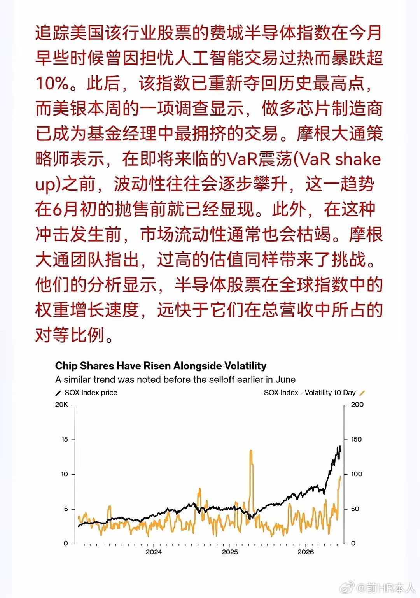

---

## 2

@有个梨GPT

发表于：2026-06-19 21:15

来源：微博

链接：https://m.weibo.cn/status/5311751686193350

AI对职业的影响可以用一个简单的模型来分析。

脑力工作的交付品一般是两个部分组成，一个是决策，另一个的工作量。

有些工作是需要在海量选择中做决策的，很多电子电路设计是开放式的，你可以用很多种不同的器件和补偿电路震荡产生波形，或者可以用直接信号合成芯片，或者用高速DAC生成；选择很多，并不简单收敛，很可能一个方案做到最后才发现原理翻车。这种需要筛选大量设计选择的工作，反而AI可以提供更好的效率，却很难取代人的职位。如果简单的让AI全做决策可能迭代十轮花钱无数也没搞成。

另一类工作就是决策占比低，工作量占比高。软件是个很有意思的领域。原本这个领域是充满细节的设计决策的，但是几千万的从业人员干了这么多年几乎把能比较好的解决的问题都解决掉了，以至于即使没有AI都在重写；是这种资料积累把自己的坟给掘了，导致AI有海量样本可以做出常见问题的最佳实践决策，于是就剩下拼工作量了，这人怎么可能拼得过AI。

----

所以AI实际上只是会驱动职场人往宽广的地方去，哪些真正deep的领域；靠妈K厅三寸不烂之舌的换壳游戏肯定是玩儿不下去的，直接被AI一把梭了。

----

当然如果交付品是神乎其技的技艺工作，象顺德七姨那样哐哐哐哐手起刀落，鱼头还没咽气呢就整条鱼骨肉分离了，这种只要还有人愿意吃没刺的廉价鱼饼，那七姨的工作就太难被AI抢走了，只能等机器人起飞了。

---

## 3

@戴雨潇Dai

发表于：2026-06-19 08:04

来源：微博

链接：https://m.weibo.cn/status/5311552426357188

祝大家端午节快乐！

重复一遍老生常谈——「端午要说安康，不能说快乐」是互联网时代才出现的伪民俗。这个说法起源于好事者编的地摊网文，后来得到各种低水平媒体的扩散，才逐渐成为一些现代人的习惯。

例如中国青年网曾经就发过一篇垃圾文章说端午节是祭祀的日子，说快乐「不太合适」，呼吁将「端午安康」的说法「固定下来」。

然而事实是在我国历史上，端午节从来就是喜庆欢乐的节日。

这个节日最早的作用是辟邪。东汉应劭《风俗通》讲：「五月五日，以五彩丝系臂者，辟兵及鬼，令人不病温。」后来端午逐渐和纪念屈原等其他活动合流。

古人庆祝端午的活动有宴饮赏乐、吟诗作赋、龙舟竞渡……玩的不亦乐乎。

例如唐玄宗李隆基在端午节写过一首诗《端午三殿宴群臣探得神字》。他在诗序里写道：「叹节气之循环，美君臣之相乐」。

宋人邹浩在《端午郊园》中写道：「良辰适端午，万事聊一抛。」

明人冯时可在《贺襄王午节启》中也写道：「喜逢当午之节，正值开甲之年。」

……

又是相乐、又是良辰、又是喜逢，端午当然是一个快乐的节日。

希望大家作为当代中国人，也要大大方方地继续说端午节快乐。抵制伪民俗，从你我做起。

\#端午粽子大赏\#\#端午红包\#

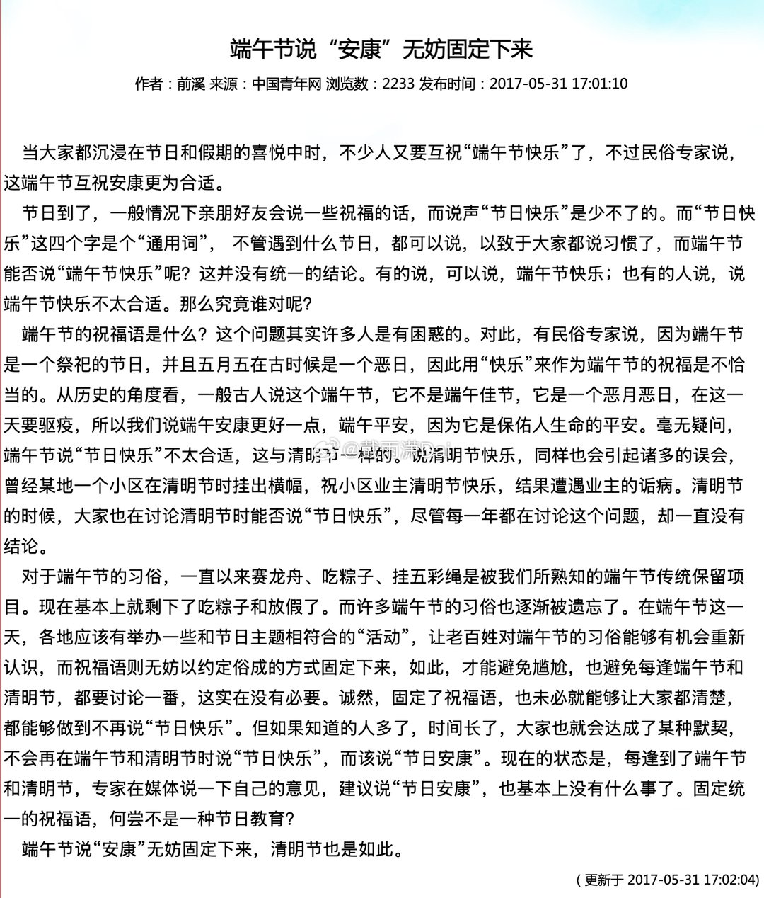

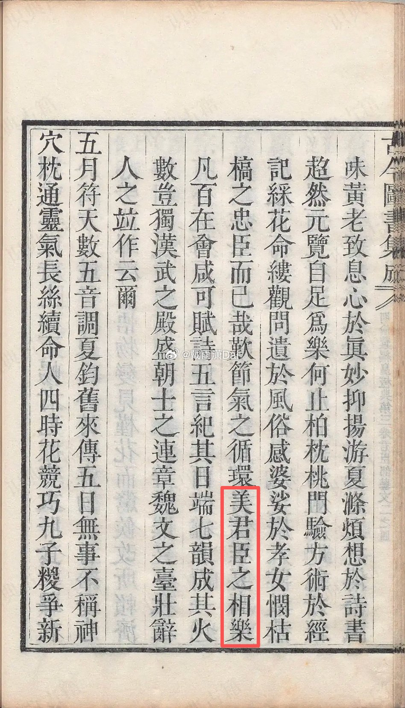

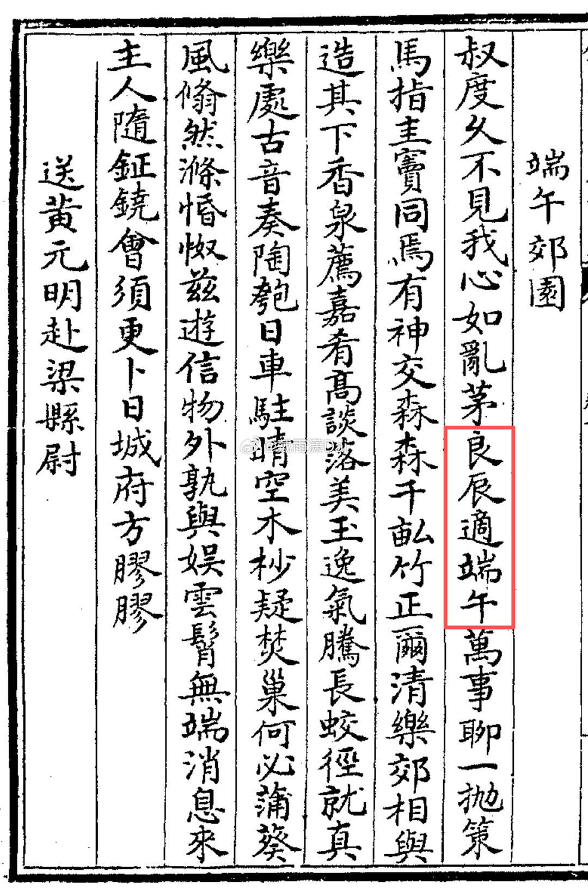

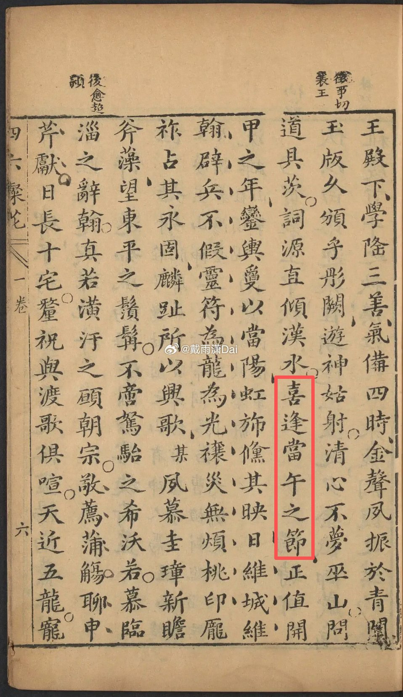

---

## 4

@高飞

发表于：2026-06-19 07:31

来源：微博

链接：https://m.weibo.cn/status/5311544159896446

\#模型时代\#  研究了420位创始人之后的结论：把世界静音，然后建造自己的世界

David Senra从2016年开始做Founders播客，每期读一本创始人传记，从中提炼可操作的商业洞察，至今做了420多期。2025年他又开了一档同名新播客，开始面对面采访活着的创始人，近期对谈过Pixar联合创始人Ed Catmull、UFC掌门人Dana White、Dell创始人Michael Dell等人。这期对话的主持人是Brian Halligan，HubSpot联合创始人，现任Sequoia Capital合伙人，专门辅导Sequoia投资组合中的CEO从创业期走向规模化。本期发布于2026年6月4日。

如果用一个词来形容这个创始人，Senra说是focus，专注。另外，Senra研究的是跨越百年的创始人共性，Halligan面对的是当下AI原生公司的全新物种。这个对话组合还是蛮有意思的。

一、最核心的特质：把世界静音，然后建造自己的

1、如果只能用一个词概括所有伟大创始人，那就是focus

Senra说这些人跟普通人比，专注程度几乎像另一个物种。但更关键的是，他们跟同时代的其他创始人相比，依然远远更专注。他们不关心别人在做什么，不关心行业在流行什么。他给这种状态取了个说法："Mute the world and build your own." 把世界静音，然后建造自己的世界。

2、Dana White的故事是这种专注的极端样本

White 19岁时在波士顿一家酒店当门童，自认是个loser，唯一确定的事是他痴迷格斗。他做了一个决定：搬到格斗之都拉斯维加斯，从底层进入这个行业。他的计算很简单：我没有老婆，没有孩子，做门童到35岁也能做，有什么好怕的？

他先做拳击经纪人，后来接触到MMA和一个叫UFC的小组织。当时UFC一文不值，观众稀少，连欠款都付不起。White代理的一个拳手被拖欠报酬，他打电话去讨债，对方老板冲他大喊：没钱，就是没钱。White挂了电话，转手打给从小认识的Fertitta兄弟（拉斯维加斯赌场家族），说：我觉得我们可以把这整个东西买下来。

2001年他们用200万美元买下UFC。前六年一分钱没赚，Fertitta兄弟又往里投了4000万美元。第一次盈利时，White看到合伙人分成数字写在白板上，不敢相信自己能挣到一百万美元。2025年8月，UFC与Paramount签下七年77亿美元的转播权协议。从200万到77亿，White在这件事上花了超过25年。

Senra说White告诉他一件事：我从来没读过一本商业书，也没听过一期商业播客。他的全部策略就是"我是个粉丝，我就做我自己想看的东西"。他的整个世界就是他的生意，之外的事情他都不在乎。White后来跟Senra聊人生建议也只有一句话：深刻了解自己是谁，深刻了解自己想在这个世界上做什么，然后每天起床去干。Senra把这总结为一个反复出现的格言：stay in the game long enough to get lucky，在牌桌上待够久，运气自然会来。

3、专注和痴迷的区别在于"说不"

Halligan问专注和痴迷是不是同一回事。Senra说它们紧密关联，但有个关键区别：Steve Jobs定义的focus是"对好主意说不"。

他引用了Jony Ive（Apple前首席设计官）接受Vanity Fair采访时讲的一段对话。Ive说Jobs是他见过最专注的人。有一次两人讨论这个话题，Ive列出了自己拒绝过的几件事。Jobs打断他说：不对，你不是真的想做那些事。真正的专注是对你真心想做的好主意说不，因为它会让你偏离一个伟大的主意。

二、性格从哪里来：父亲的故事嵌在儿子的身体里

1、一句话解释大多数创始人的内驱力来源

Senra在Francis Ford Coppola（《教父》导演）的传记里读到一句话，让他把之前反复看到的模式串了起来："You can always understand the son by the story of his father. The story of the father is embedded in the son." 要理解儿子，去看他父亲的故事。父亲的故事刻在儿子身上。

Charlie Munger（巴菲特半世纪搭档，Berkshire Hathaway副董事长）也有类似的说法：要真正理解一个想法，你得把它和产生这个想法的那个人的性格绑在一起。这就是为什么Munger读了几百本传记。

2、Coppola的驱动力来自一个失败的父亲

Coppola的父亲是一个自认才华横溢但始终没有成功的音乐家。世界不给他想要的认可，他就把愤怒转嫁给儿子，对年幼的Francis说："这个家只能有一个天才，就是我。" Senra直接评价这位父亲：coward，一个懦夫。

Francis把这些内化了。他变成了工作狂，经常剪着剪着片子就睡着在剪辑台上。当时好莱坞还没有年轻导演的先例，他是第一个。George Lucas和Steven Spielberg看到他做到了，才觉得自己也可以。后来Coppola拿了奥斯卡，他让父亲为这部电影做配乐，父亲也因此获得了奥斯卡。几乎是一种无声的回应：现在谁是天才？没有我，你连这个机会都没有。

3、洛克菲勒的父亲是骗子，这塑造了一种完全不同的性格

洛克菲勒（Rockefeller）的父亲有多个家庭，是个骗子，还会试图欺骗自己的儿子。Senra收集了大约15本洛克菲勒的传记，甚至从Rockefeller档案馆获取了一份1700页的晚年访谈速记稿打印装订。但洛克菲勒的应对方式和Coppola完全不同：他变成了一个社交能力极强、从不提高嗓门、从不说刻薄话的人。为他工作40年的人说从来没听他发过脾气。

4、chip on the shoulder几乎是标配

Halligan问是不是所有顶级创始人都有这种"我要证明什么"的心态。Senra想不出反例。他说不能用绝对化表述，但整体答案是：对，几乎都有。

5、移民优势：VC圈的流行叙事和真实数据之间有落差

Halligan提出了一个VC圈常见的说法：移民创始人有天然优势，因为他们来到一个机会无限的国家，风险调整后创业反而是最优选择。Senra没有否认这一点，他的父亲就生于古巴，他从小在南佛罗里达见过冒死坐木筏偷渡的人。他说自己是他所认识的人里最无保留地支持美国和资本主义的那一个。

但Halligan接着给了一组数据：美国十家万亿美元市值公司的创始人中，只有三个是移民——Jensen Huang、Elon Musk、Sergey Brin。另有三个人的父亲是移民。这个比例远低于VC圈的直觉预期。移民背景对创业确实有驱动力，但它并不是最普遍的共性因子。

三、创始人原型：没有公式，模仿别人是最大的弯路

1、Daniel Ek浪费了好几年模仿Jobs

Spotify创始人Daniel Ek正在和Senra合作一个项目：系统性地映射创始人原型。Ek的出发点来自个人痛苦。他说，20年前创办Spotify时（2006年），所有创始人都在模仿Steve Jobs。现在的创始人模仿谁？Jensen Huang或者Elon Musk。

Ek说他浪费了好几年时间试图模仿一个跟他性格完全不同的人。他的天然风格更像教练，更团队导向。但他硬把自己塞进Jobs式的独裁模板里，就像穿别人的衣服。直到40多岁，有了20年经验，认识了大量创始人之后，他才意识到：原来有很多种完全不同的创始人类型，只是没有人给它们命名。

2、founder-problem fit比product-market fit更重要

Ek认为，比product-market fit甚至founder-industry fit更重要的是founder-problem fit：这个人和这个问题之间的匹配度。Senra用Demis Hassabis（Google DeepMind创始人，2024年诺贝尔化学奖得主）做例子：他一辈子就一家伟大的公司，就是DeepMind。他来到这个世界上就是为了做这件事。Jobs也是，和Apple之间是完美的founder-problem fit。

这个原型项目的目标是定义出可能六到八种创始人类型，从Founders播客420多期的案例库中映射出来，然后让创始人识别自己的类型，找到历史上同类型的10个人，去研究他们怎么建公司、怎么做品牌。同时看看不同原型的创始人之间怎么搭配合作效果最好。

3、你不需要是个混蛋才能做好CEO，但disagreeable几乎是共性

Halligan直接问了那个经典问题：是不是必须是asshole才能做好创始人？Senra斩钉截铁地否认了。他说这代最好的创始人中确实有些人名声不好，但这既不是必要条件，也不是充分条件。Shopify创始人Toby Lütke说得好：做好这件事没有唯一正确的方法，可能有一百种，你得找到适合自己的。

但disagreeable，敢于唱反调，几乎是标配。Senra分享了一个他前一天刚从Ed Catmull那里听到的细节：Jobs曾经开除了Pixar董事会的两个人，理由是他们从来不反对他。Jobs的逻辑是——如果你从不跟我争，你能给我什么价值？他需要的是敢跟他对着干的人。

洛克菲勒是个有趣的反例。他的社交手腕极为高超。有一次董事会对一笔300万美元的新技术投资争论不休，洛克菲勒安静地坐着让所有人先吵完，然后说：我相信这件事值得做。如果你们不想投，我自己出这笔钱。成了，Standard Oil按原价还我；亏了，我自己吃掉。合伙人一听他愿意承担全部风险，立刻同意了。这不是disagreeable，但同样是一种掌控局面的方式。

4、Peter Thiel的"自闭症优势"论和它的阴影面

Halligan观察到，现代万亿美元公司的CEO中，至少六个公开表示自己在自闭症谱系上。Senra引用了Peter Thiel（PayPal联合创始人，硅谷传奇投资人）的观点：很多成功创业者可能有轻度Asperger's特征，缺少"模仿-社会化基因"。Thiel的深层问题是：我们这个社会到底怎么了，让那些没有Asperger's的人反而处于劣势？因为我们会在好想法成形之前就被劝退。试着去说服Elon不做SpaceX？祝你好运。

但Senra对硅谷的模仿文化保持警惕。他说Bay Area的问题是：所有人都在模仿"反模仿"，这反而让他们成了最具模仿性的一群人。很多人在假装自己有某种spectrum特质，因为这变成了一种社交货币。

5、Senra的投资哲学：别看公式，就赌这个人

Senra说如果他做VC，不会浪费时间搞rubric评分表或者匹配模式。他只看一样东西：这个人会不会拼到死。他对自己的描述是："I knew for a fact that there was no way I wasn't going to succeed. So I will kill myself before I fail." 他百分之百确信自己不可能不成功，因为在失败之前他会拼命。他要找的就是这种人。

Ed Catmull有一句话和这直接相关。Catmull说，Steve Jobs管人的本事从他身上学到的比任何人都多。Catmull经常在演讲中问听众：什么更重要，想法还是人？大多数人答不上来。Catmull的回答是：这是一道假题。想法来自人，所以人比想法重要。把一个好想法交给一支平庸团队，他们会搞砸；把一个平庸的想法交给一支顶级团队，他们要么修好它，要么扔掉它重来一个。

Travis Kalanick（Uber创始人）就是这种人格的典型。Senra说：看看他的经历就知道，这个人要么把Uber做成，要么死在路上。

四、单打独斗还是搭档：合伙人关系的历史真相

1、长期持续的联合创始人搭档极为罕见

Halligan问了一个Sequoia视角的实际问题：进门pitch的团队有的是solo founder，有的有联合创始人。这些合伙关系最终怎样了？

Senra的判断干脆利落：长期持续的联合创始人搭档极为罕见。通常有一个绝对的主导力量，另一个人最终会离开。Apple的Wozniak离开了。Facebook的联合创始人都离开了。这是常态。

2、历史上的"搭档"比想象中更复杂

卡内基（Andrew Carnegie，美国钢铁大王）其实不管公司日常运营，做这件事的是Henry Clay Frick。卡内基经常在世界各地坐帆船旅行的时候，Frick在建设Carnegie Steel。他们的关系最终破裂，有一本书叫《Meet You in Hell》专门写了这对搭档的惨烈分手。Frick被一个刺客冲进办公室开枪射中了脖子，他让人缝好伤口，坚持做完当天的工作才回家。

福特（Henry Ford）是独裁者。到1919年他买断了所有股东，独占Ford Motor Company 100%的股权。

洛克菲勒建了一个"创始人联盟"。Standard Oil的董事会成员几乎每一个都是之前独立公司的创始人，洛克菲勒通过收购把他们聚在一起。但他是压倒性的主导人格。

3、Munger怎么看自己和Buffett的关系

Munger告诉Senra：如果重来一次，我还是会觉得自己比所有人聪明，但我会更擅长把这件事藏起来。他说Buffett是百年一遇的天才，自己再自负，也不至于不把自己交给这样的人。Munger想钓鱼、想划船、想设计建筑、想做房地产，兴趣太多。Buffett只做一件事，更加single-minded。Munger的角色是塑造Buffett的思维方式，但推动引擎的人是Buffett。

五、负面自我对话：早期是燃料，后期是毒药

1、顶级创始人几乎不在赢上停留

Senra说最好的创始人不会沉浸在胜利中。DoorDash创始人Tony Xu的习惯是：有好事发生了，出去吃顿饭庆祝一下。但还没吃完，他脑子里已经在数那17件还没做好的事情。

Jensen Huang每天早上看着镜子问自己：为什么你这么差？Elon Musk说他的脑子是一场风暴，事情顺利的时候他反而焦虑。

Halligan自己也承认有冒名顶替综合征（impostor syndrome），刚从一个三小时的董事会出来，坐在这里还在想"我凭什么在这儿"。Senra回了一个Jobs早年得到的建议：Nolan Bushnell（Atari创始人，Jobs早年导师）告诉他，"If you pretend to be in control, everybody else will assume that you are." 你假装一切尽在掌握，所有人就会真的这么认为。Jobs把这条建议执行了一辈子。

2、Brad Jacobs帮Senra本人完成了一次转变

Senra坦言自己内心一直是负面自我驱动型。Brad Jacobs改变了他。Jacobs创立过八家独立的十亿美元级公司，有超过45年的创业经验。Jacobs跟他说：你热爱你做的事，为什么还用负面情绪鞭打自己？那个负面驱动力在早期帮了你，但它的保质期到了。你现在的驱动力应该是生成性的：我在做一件对世界有价值的事，我热爱它，我为它骄傲。

Senra说这个转变几乎是瞬间发生的。他说：那个负面自我对话把你带到了今天的位置，但如果你要做30年、40年、一辈子，燃料必须换掉，否则它会毁掉你。

六、AI时代：组织形态正在发生根本变化

1、"这次真的不一样"不再是自欺欺人

Senra说他对"this time is different"一向持怀疑态度，因为历史上每一代人都这么说。但他问了Michael Dell，一个从19岁用1000美元在宿舍起家、挑战过当时拥有80%市场份额的IBM、连续盈利20年的人。Dell的回答是：不，这次跟我经历过的所有技术变革都不一样。Toby Lütke也持同样的观点。

Senra的判断：组织形态会变，团队规模会变，薪酬结构会变（因为100倍效率的人出现了），规划周期会变（因为变化太快了）。

2、Jack Dorsey正在实验一种全新模式

Brian Halligan在他的Long Strange Trip播客中采访过Jack Dorsey。Dorsey在Block公司做的事情是：取消组织架构图，取消职位头衔。公司的决策中枢是中间的AI系统，人类在外围负责给这个系统输入上下文和提供判断力。现在AI做的决策比例可能只有5%-10%，但这个比例和人类之间会逐步翻转。2026年2月，Block裁掉了约40%的员工，超过4000人，Dorsey明确表示这是AI驱动的组织重构。

Halligan在对话中把这称为"Dorsey模式"，与Paul Graham（Y Combinator创始人）的founder mode和传统manager mode并列，作为第三种思路。不过Senra泼了一盆冷水：Paul Graham把founder mode包装成新概念的时候，那篇文章传遍了全网，好像发现了什么新东西。但卡内基是founder mode，福特是founder mode，洛克菲勒也是founder mode。这件事在历史上一点都不新。新的是AI带来的组织形态变化，而不是创始人亲力亲为这件事本身。

3、Naval Ravikant的那句话在AI时代权重更大了

Senra引用Eric Jorgenson为Naval Ravikant（AngelList创始人，硅谷知名天使投资人）写的《The Almanack of Naval Ravikant》中的一句话：在无限杠杆的时代，站在你手艺的极端边缘非常重要。这句话写在AI之前，而AI本身就是杠杆。

言下之意是：专注于成为你所做之事的世界第一，回报会大到超出想象。最有才华的人和普通人之间的差距不是100倍，可能是1000倍。

4、AI时代的"多线程"创始人还没有接受时间的检验

Halligan观察到一个现象：Harvey的Winston、Lovable的Anton、ElevenLabs的Mati这些AI原生CEO不像传统创始人那样严格聚焦，他们同时推很多条产品线，速度极快。过去很多不可逆的单向门决策，现在变成了可以掉头的双向门，试一个月不行就回来。

Senra对此保持审慎：这些人做出了好产品，但还没有建立经久不衰的企业。我关注的是能持续几十年的生意。这件事需要时间来验证。

5、卖掉最好的公司之后，几乎不可能重现辉煌

Senra对"连续创业者"这个标签高度怀疑。他的原话是：second time founder is really overrated，因为绝大多数伟大的成功都来自第一次。他最近跟很多70岁、75岁、80岁的老创始人深入交流过，发现一个共同的困境：那些在25年前卖掉了自己最好的公司的人，后来花了20多年在一堆远不如当初那个项目的东西上打转，试图重新捕捉当年的魔力，几乎没有人做到。

Senra的结论是：要么all in，要么all out。如果你卖了，就彻底退出。因为你不会甘心坐在船上什么都不做——这种人格做不到。所以答案是一开始就不要卖。

七、品味、倾听，和那些无法克隆的能力

1、品味是真实存在的竞争壁垒

Senra和Rick Rubin（传奇音乐制作人，合作过从Johnny Cash到Jay-Z的跨世代艺人）有过深入交流。Rubin 18岁在宿舍里开始做音乐，62岁了还在做同一件事。人们想和他合作的原因就一个词：taste，品味。但Senra发现Rubin做播客也出奇地好。他分析了原因之后告诉Rubin：你把一项音乐行业的技能迁移到了播客领域。你是一个professional listener，职业级的倾听者。大多数人在别人说话的时候并不真的在听，他们在等待回应的机会。Rubin不一样，他不形成判断，不预设立场，只是真正地对面前的人感兴趣。Rubin听完后叫停了闲聊，说：我们必须把这段录下来，太好了。

2、Hock Tan的"反战略"论

Broadcom CEO Hock Tan最近在公开场合说了一段话，大意是：那些宣称自己看到了某个战略的创始人都在胡说。他说自己根本没预料到事情会变成现在这样。机会摆在面前，他做了一个好决定，然后走到下一个岔路口再看。他说这就是"战略"。变量太多，太复杂了，没人能在20年前预见到今天。Broadcom在2026年4月市值突破2万亿美元。

Senra说对X上那种"每日新风向"的echo chamber要保持高度警惕，那些东西几乎没有用。

3、极端人才的价值不可克隆

这和第六章的杠杆论一脉相承。Senra提到TBN的Jordy，说他进入播客行业的时候，跟第二名之间不是2倍的差距，是100倍。如果他是OpenAI的CMO，他一个人可能产出的价值以十亿美元计。人们说很多人在克隆他们的模式，但没人能克隆他的大脑。

八、创始人的生活真相：400多人里只有3个活得平衡

1、只有3个人同时拥有事业和健康的个人生活

Halligan问了一个所有创始人配偶都想知道的问题：这些人里有多少过着平衡的生活？Senra的回答是三个。Ed Thorp，创建了第一个量化对冲基金，还发明了21点计牌法。Sol Price，Sam Walton（Walmart创始人）说他从Sol Price身上学到的东西比任何人都多，Jeff Bezos从他那里拿了Amazon的很多想法，Costco联合创始人Jim Sinegal说"我知道的一切都是从Sol Price那里学来的"。第三个是Brunello Cucinelli（意大利奢侈针织品牌创始人），但那是自传里写的，Senra对其真实性存疑。

400多人里只有3个，这个比例本身就是答案。

2、万亿美元公司创始人的一个意外发现

在美国十家万亿美元市值公司的创始人中，配偶基本上在各自领域同样出色，是智识上的对等伙伴。只有两个离过婚，Larry Ellison（Oracle创始人）是例外，结过多次婚。整体模式是：找到一个势均力敌的人，然后一直在一起。

不过回溯到历史上的创始人，情况就差多了。很多人的丈夫和父亲角色并不合格。

3、Phil Knight和Sam Walton的矛盾心理说明了一切

Nike创始人Phil Knight在自传《鞋狗》（Shoe Dog）结尾写到他两个儿子，其中一个在溺水事故中去世。75岁的他试图和解这种矛盾：我想花更多时间陪儿子，但如果完全诚实的话，我最大的遗憾是我不能回去再来一次。

Sam Walton写自传的时候已经被癌症侵蚀，他知道自己快死了。他为了建Walmart牺牲了大量家庭时间。后悔吗？他说：如果再来一次，我会做完全一样的事。

Senra对那些"如果重来会更平衡"的说法高度怀疑。他认为这类人格几乎是一种强迫症式的存在，如果重活一次，他们会做出同样的选择。

4、驱动创始人的不是钱，是控制权

Senra说他不认为小ego能建起大公司。所有这些人都有巨大的ego，只是有些人更擅长隐藏。真正驱动他们的是控制权，不是钱。如果你保持控制并做出让别人生活变好的产品，钱是副产品。

Halligan提出一个反直觉的数据：那十位万亿美元公司创始人中，大多数并不是穷苦出身，普遍来自中上层郊区家庭。Bezos是单亲妈妈带大的例外，但Gates、Zuckerberg这些人的成长环境并不匮乏。

总结

David Senra花了十年做的这场"创始人田野调查"揭示的模式，和硅谷社交媒体上流行的创始人叙事有相当大的出入。最核心的特质是一种近乎极端的专注能力，不是天赋，不是某种性格缺陷，也不是autism。Steve Jobs定义的那种focus：对自己想做的事说"是"，对所有其他好主意说"不"。

创始人原型没有公式，试图模仿别人的风格是最常见的弯路。founder-problem fit比product-market fit更根本。合伙人关系在历史上大多以一方退出告终，长期持续的平等搭档几乎是例外。负面自我驱动在早期有效，但如果要做一辈子的事，燃料必须从惩罚型换成生成型。AI正在改变公司的组织形态、团队规模和决策方式，但目前AI原生公司尚未经历时间检验。卖掉最好的公司试图在50岁、60岁重新来过，几乎没有人成功。

Halligan在节目最后加了自己的三条收获。第三条要特别强调：Brian Chesky（Airbnb联合创始人）早年创业时充满冒名顶替综合征，一直从恐惧出发做决策。经过多年的自我修炼，他现在从热爱出发——热爱帮助创始人成长这件事本身，而不是害怕做不好。Halligan说他自己也在尝试做同样的转变。

Senra自己最后给的不是建议，而是一个观察。这些人不需要被发现，他们自己让世界知道自己是谁。用Mike Moritz（Sequoia传奇合伙人）在《Return to the Little Kingdom》前言中的话说：他们是"irrepressible forces of nature"，压不住的自然力量。

---

## 5

@风云学会陈经

发表于：2026-06-19 07:26

来源：微博

链接：https://m.weibo.cn/status/5311543050769151

以更大力度提振消费

图二的“消费者信心指数”，意义越来越重要。这个指数每个月公布一次，感觉还比较准 确。2017年下半年，消费者信心指数起来到了120，到2021年都维持高位，直到2022年2月都有120。但2022年3月是113，4月就跌到了86。之后就在90左右震荡。

最近2026年2月是91.6，但到4月跌到89.0，是有个小小的回调，从社消数据是能看出来，4月5月比2月时要弱一点。

而“消费者信心指数”，是一个“后验指标”，它是说有这个情况，但为什么上升下降了、如何提升数值，看不出来。求是文章就给出了一些解释，很有道理。

现在感觉信心不如2017-2021年，有点类似2012-2016年的90-105的低位区间。一个特征是房价相对低，这对应较低的消费信心，房价低迷说明钱不好赚、预期不明。这还是需要解释，为何人们感觉钱不好赚。那这就非常复杂了，涉及无数个行业，有的感觉不错，有的感觉不稳。原因多种多样，内卷、人口，不容易研究。

需要注意，这是消费信心，并不是说消费没有增长。人们信心没那么强，但也还是会消费，而且还增长。人们怕失业、工作不稳，但已经有稳定工作的人，大部分也还是正常就业。

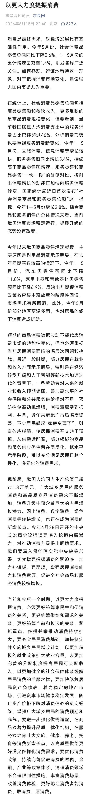

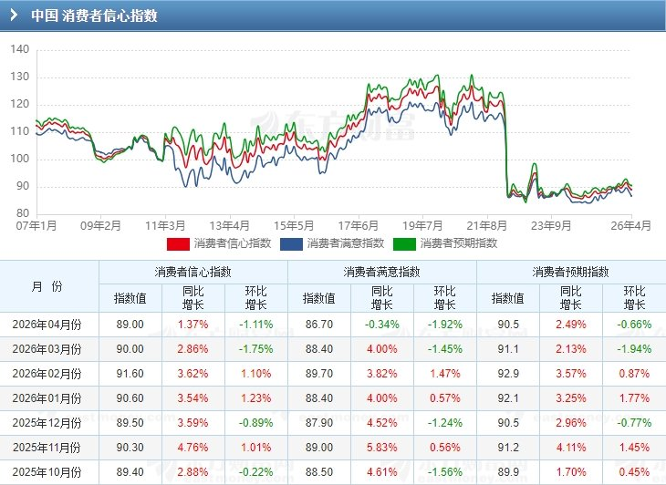

---

## 6

@蚁工厂

发表于：2026-06-19 06:26

来源：微博

链接：https://m.weibo.cn/status/5311527872631476

X的社区附注算法有点意思：

一个附注要被公开展示，必须被过去经常持不同观点或立场冲突的用户同时评为“有帮助”。

这点对避免群体极化还是有帮助的。

---

## 7

@刘韧

发表于：2026-06-19 00:17

来源：微博

链接：https://m.weibo.cn/status/5311434883860652

经济学人：Anthropic 表示，其 80%的消费者使用来自海外。过去十年间，随着美国科技产业蓬勃发展，欧洲向美国支付的知识产权产品费用增长了五倍。

---

## 8

@宝玉xp

发表于：2026-06-18 21:52

来源：微博

链接：https://m.weibo.cn/status/5311398582158286

转：ChatGPT 之前，中国大模型的种子是谁种下的？

作者：Compute King（x.com/Compute_King）

原文链接：x.com/Compute_King/status/2067407487624691991

---- 以下内容为转发 ----

大家现在能叫出一串名字：DeepSeek，千问，Kimi，混元，星火，文心一言…… 感觉好像就是ChatGPT一出来，中国本土公司一夜之间全冒出来了。但其实根本不是那么回事。

如果画一张中国大模型的技术族谱，你会发现几条主线：

第一条主线和智源研究院有关。

北京智源人工智能研究院（BAAI）成立于2018年11月。它不是一家普通的公司，而是在科技部和北京市政府的支持下，由清华、北大、中科院这些顶尖高校和科技企业共同发起的非营利研究机构。它不为赚钱，专为死磕AI领域最硬核、最原始的创新，目标直指大模型、世界模型和通用人工智能这些星辰大海。

智源研究院2021年牵头搞出了“悟道”系列大模型，成了后来中国大模型江湖的技术土壤。现在，它又开始折腾“悟界”系列，想让AI不仅懂文字图片，还能看懂物理世界，更进一步帮科学家研究生命科学。

智源手里还有两张王牌：

🔹 智源大会：这是它每年组局的全球AI顶级聚会，大牛学者和行业大佬都会来，现场发布一堆前沿成果和年度趋势预测，基本是国内AI圈的风向标。

🔹 人才生态：它最厉害的一招，是把清华、北大、中科院这些顶级学术力量揉在一起，打破体制的围墙，搞出一个自由开放的交流平台。

在笔者看来，现在的智源更多扮演的角色像是一个播火者，不造产品，只管把火种点燃，然后递到整个产业手里。

如果把智源研究院看作是一棵树的根，顺着根往上看，会分出三条枝干：

一条是CPM（清华大学牵头的超大规模预训练模型）。2020年11月14日，智源研究院和清华大学研究团队联合发布了以中文为核心的大规模预训练语言模型CPM-LM，参数规模达26 亿，预训练中文数据规模100 GB。CPM这条线往下长出了OpenBMB开源社区，再后来就有了现在大家在端侧玩得比较多的MiniCPM模型。

另一条是“悟道”系列，它直接孕育了GLM这个技术路线，然后孵化出了现在商业化最成功的智谱AI，就是那个ChatGLM背后的大佬。

还有一条叫M6，是阿里达摩院跟智源一起捣鼓的多模态大模型，这条线一路往下，就演化成了今天的通义千问Qwen。

现在市面上竞争得你死我活的大模型产品，追根溯源，技术底气有一大半都能对上这个谱系。

为什么智源研究院这么牛？因为它当时把国内最核心的大模型人才和最前沿的技术路线全给聚到一块儿了。智源，清华，北大这三家，基本上构成了一个铁三角，就像美国那边的OpenAI，DeepMind配上斯坦福，伯克利一样，人才和想法在这个生态里来回流动，碰撞出来的火花，就把早期的底座给搭好了。

第二条主线是百度，属于典型的“起了个大早，赶了个完集”。

早在AI这个词还没流行的2013年，李彦宏就亲自挂帅，成立了百度深度学习研究院，这是全球第一个把“深度学习”直接挂在企业研究院招牌上的。

紧接着2014年，百度在硅谷设立人工智能实验室，请来了吴恩达当首席科学家，全力推动“百度大脑”。更有意思的是，现在AI圈如日中天的Anthropic创始人Dario Amodei，当时就在那个组里研究语音识别和模型扩展。他还把Jim Fan招了进来做实习生。

2017年底，百度硅谷团队干了一件大事，发了一篇论文叫《Deep Learning Scaling Is Predictable, Empirically》，第一次系统性地证明了Scaling Law在机器翻译、语言建模、图像和语音上都管用。可惜当时没引起太大轰动，但金子总会发光，它后来成了大模型研究的基石。2019年OpenAI那篇著名的Scaling Law论文，参考文献里就明明白白引用了这篇百度论文的作者Joel Hestness的后续研究。

时间来到2019年，百度正式发布了开创性的知识增强语义模型ERNIE 1.0。这个模型厉害在于，它不只看无结构的原始数据，还把百度多年积累的大规模知识图谱给融合进去了，一出来就刷新了多种中文NLP任务，直接对标BERT。年底更是迅速迭代到了ERNIE 2.0，搞了持续学习语义理解框架，中英文任务上全面超越了业界主流模型。

第三条主线是科大讯飞。

源头可以一直追到1999年，当时还在中科大读博的刘庆峰，和导师王仁华教授一起，依托中科大创立了科大讯飞的前身。讯飞从中文语音起家，但它在AI大模型上的布局，可以追溯到2014年。

那年，讯飞首次提出“讯飞超脑计划”。这个计划是个战略转弯信号，标志着讯飞不再只盯着智能语音，而是要向更难的认知智能和机器学习全面进军。

到了2019年10月份，讯飞被美国商务部加入了禁运名单，决定启动“国产化AI算力底座”建设。这为后来大模型的自主训练，提前备好了算力粮草。

说到这儿，笔者插一段亲身见闻。 这其中的很长一段时间笔者还在某大厂工作，业务跟英伟达是直接竞争关系，所以能亲眼看到百度和讯飞在英伟达生态圈里有多重。重到什么程度呢？当时CUDA软件栈里好多奇怪的Bug，都是百度和讯飞的工程师先踩到，然后和英伟达一起联手修掉的。从这点就能看出来，这两家当时在AI工程化上走得还是比较前沿的。

如果说ChatGPT像一把火，那么他一下子把整个中国大模型产业给点爆了，商业化了，出圈了，但烧起来的那些柴，是在2020年前就一批批已经被产业的大拿们码好了的。

因为，在那之前，这些人已经闷头干了不少事：

🔹 完整的大规模预训练体系搭起来了，知道大模型该怎么训了；

🔹 积累了部分中文高质量语料，不再是拿英文随便翻译翻译就完事；

🔹 千亿，万亿参数的超大模型真刀真枪跑通了，验证了工程上走得通；

🔹 部分搭建了国产化AI算力底座，踩了很多坑；

🔹 多模态路线也摸着石头探索了；

🔹 各种开源社区，像OpenBMB，也建起来了。

这些工作，在那些个安静的前夜，的确没有马上变成赚大钱的产品，但它们实实在在化作了土壤。后来智谱AI的崛起，通义千问的迭代，百度的文心，DeepSeek的惊艳，讯飞的星火，到字节的豆包，腾讯的混元，小而强的面壁MiniCPM，全都是从这片土壤里长出来的庄稼。

中国大模型产业的爆发，扳机是ChatGPT扣动的；但中国大模型技术的种子，是早在2020年前，由智源研究院，百度，科大讯飞，以及清华，北大，中科大和一批有远见的科技企业，一起亲手种下去的。

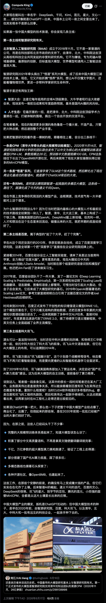

---

## 9

@蘸盐

发表于：2026-06-18 11:54

来源：微博

链接：https://m.weibo.cn/status/5311248082145544

生育率和生育意愿一旦开始自主下滑，鼓励生育或者惩罚不育的刺激政策都不会起作用。历史上有很多先例了。

古希腊：

伯罗奔尼撒战争后，全希腊生育率集体崩塌。雅典城邦自治文明兴起后，小型家庭成为主流，富人拒绝多生育分担家产，平民无力养育；战争损耗男性，大量独身、晚婚。斯巴达原本靠强制婚育维持人口，长期战争导致男性大量战死，女性不愿生育；土地集中于少数贵族，底层希洛人减少，斯巴达公民数量从万人级跌到几百人，彻底丧失霸权基础。

古罗马：

从公元前1世纪起，罗马公民人口持续萎缩，奥古斯都颁布《朱里亚婚姻法》重奖多子女、惩罚独身无后，持续百年强制政策，完全失效。

核心诱因：城市奢靡、个人享乐主义取代宗族传代观念；贵族土地兼并带来巨大财富，不再依赖子女劳作；频繁内战、高税负、男性兵役损耗；上层婚姻契约化、婚外同居普及，合法婚生子女锐减。

结果：政策强力干预仍无法回升，罗马公民人口持续收缩，最终本土罗马人比例不断降低，依赖蛮族补充兵源与劳动力。

北宋：

中后期出现古代东亚罕见的城市低生育社会。城市富裕阶层普遍晚婚、节育、溺女婴盛行；文人世家主动少生，避免家产分割、科举资源分散；都城开封市民家庭平均子女数大幅低于乡村农户。

原因：北宋商品经济高度发达，城市化；科举竞争激烈，养育、教育成本极高；享乐文化兴盛，青楼、同居分流正式婚育；土地私有制下大家族拆分，多子女直接降低生活水平。但乡村农村生育率仍高，属于城乡分化低生育，未出现全国整体的生育率塌陷，但城市精英低生育趋势长期不可逆。

法国：

19 世纪下半叶成为全球第一个完成自发性生育率永久下跌的大国，比所有欧洲国家早近百年（1780年生育率开始缓慢下降，1850年后断崖走低，整个19世纪维持远低于欧洲平均水平，一战后长期徘徊在更替线以下）。

原因：大革命后没收贵族地产均分土地，小农生活改善，不愿多子女分割农田导致生活质量重新下降；天主教节育观念民间普及（民间私下避孕远早于其他国家）；晚婚普遍，女性不婚比例持续走高；工业化进程平缓，没有爆发式人口增长阶段。百余年间，法国政府颁布各种鼓励生育政策，收效微弱，至今生育率仅小幅回升。

英国：

从1870年开始生育率持续下滑，1910年跌破人口更替水平，维多利亚时代后期城市中产、工人阶级集体主动少生。

原因：工业革命导致英国大规模城市化，城市化导致城市养育成本飙升；童工法案废除，子女从“劳动力”变为纯消费；女性教育普及，晚婚、独身增多；民间避孕工具逐步流通。从一战前开始，英国本土人口增长大幅放缓，本土内生人口动力永久性减弱。

日本：

二战后1970年生育率跌破更替线，平成时期彻底固化为极低生育率社会。终身未婚率暴涨、晚婚晚育、丁克普及；育儿成本、职场加班文化、女性生育惩罚严重；房地产高压、青年收入停滞；生育意愿持续数十年低迷。政府为提高生育意愿，出台巨额育儿补贴、托育扩容、减税等大量政策，但总和生育率始终在1.3–1.4低位，完全无法回到2.1更替线，属于典型的鼓励政策出台再多也难以提高生育意愿、扭转出生率的案例。

韩国：

90年代开始持续下滑，2020年后总和生育率跌破0.8；极致内卷教育成本、极端职场性别歧视、超高房价、晚婚不婚；婚恋市场对立、青年收入长期停滞。国家投入海量育儿福利、产假补贴、公立托育，生育率无明显反弹，长期维持全球最低水平。比日本下滑更快、程度更深，成为当代最典型的不可逆低生育国家

南欧 PIGS 四国：

意大利1980年后持续走低，90年代总和生育率跌破1.2；青年失业严重、家庭依赖父母、住房成本极高；传统大家族解体，女性不愿牺牲事业生育；三十年各类生育补贴效果极弱。西班牙2008经济危机后生育率断崖下跌，长期1.2–1.3；青年长期啃老、失业率居高不下，婚龄持续推迟。

————————

历史上来说，文明发展的成熟度（或者愿意说是熟成度也行）到一定程度，没有大规模战争，或者死亡率达到黑死病级别的疫病的话，生育率不会上升。怎么出台刺激措施都没有用的。但是战争和瘟疫这两者，尤其战争，对提高生育率也只是饮鸩止渴的效果。战后短时间可能会出现脉冲式人口回升（比如二战后美国，欧洲，苏联，日本）（一战后法国也出现过短时期的生育率回潮，但只维持了三四年，到1922年之后就迅速回落），但几十年后仍然会停滞回落，无法回升到稳固的可替换水平。

真正能提高生育率的，只有文明程度下降+女性地位下降+高婴幼儿死亡率+养育成本降低（中东，黑非洲）。但是中东和黑非洲步入成熟文明社会，生育率也会自主下降。海湾石油富国（阿联酋、卡塔尔、科威特）生育率下滑速度、下滑幅度，都远远快于、猛于较贫穷的阿拉伯国家（埃及、也门等），前者普遍跌破人口更替线2.1，后者仍能维持一定的高生育率区间。

再举个例子，卢旺达。卡加梅上台后大力学新加坡，学中国，卢旺达社会变得稳定，经济增速猛飙，但生育率这块也开始急速下降。1983 年卢旺达的总和生育率是8.3，2005年是6.1，2010年是4.6，2025年是3.7，其中首都基加利城市妇女是3.1，农村妇女是3.9

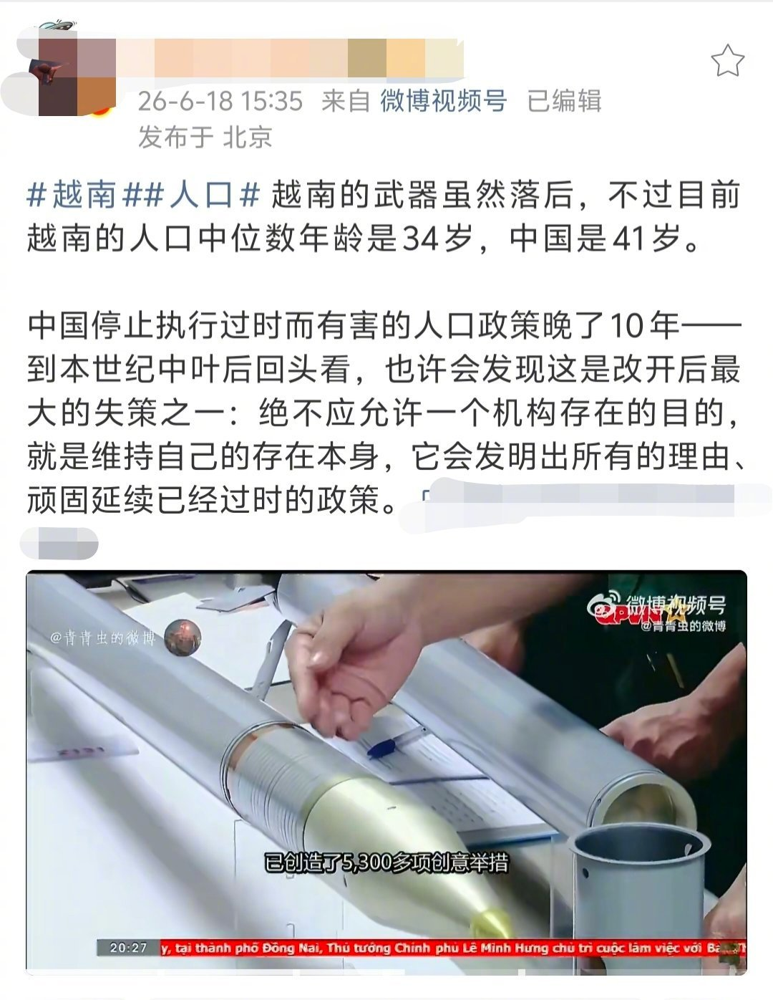

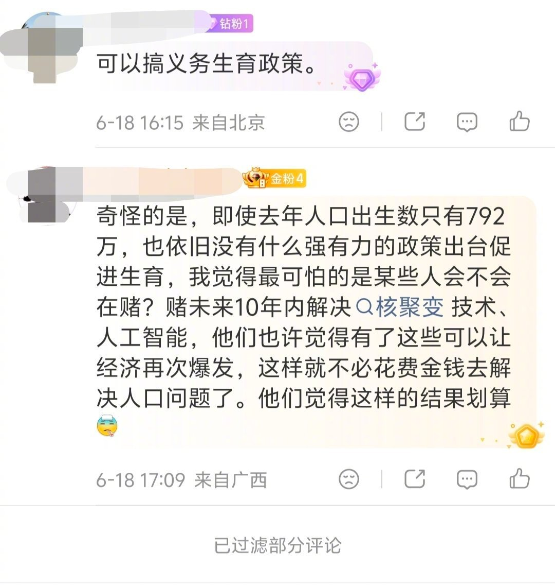

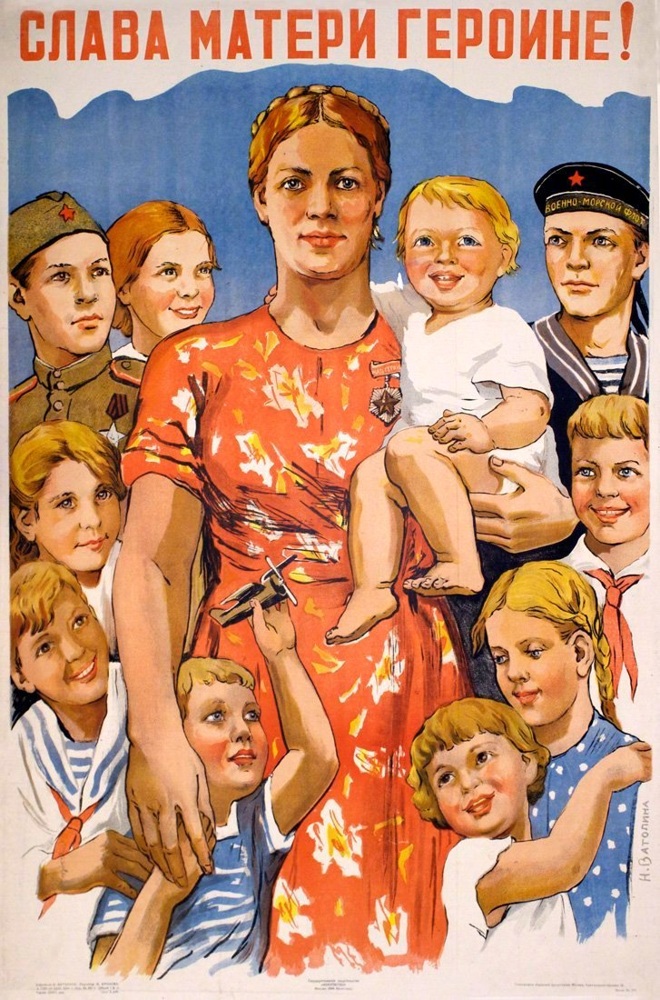

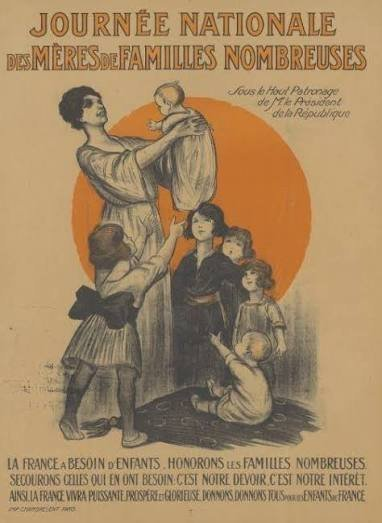

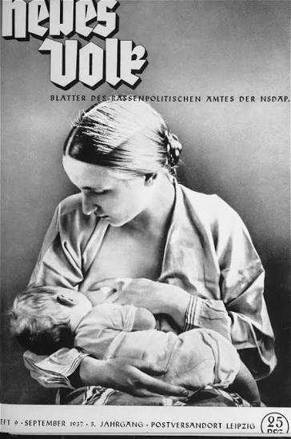

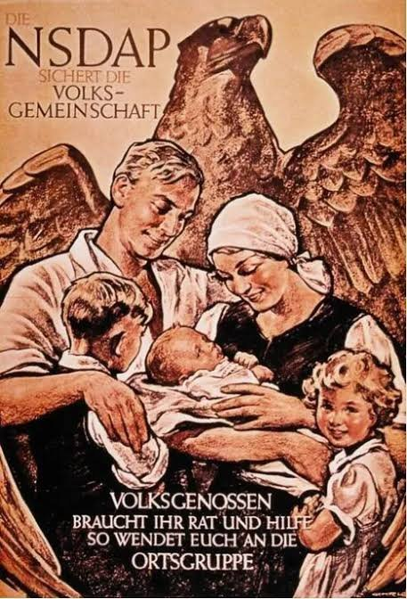

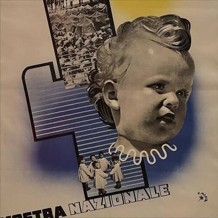

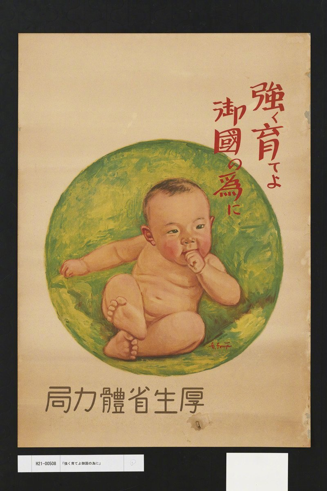

---

## 10

@宝玉xp

发表于：2026-06-18 20:41

来源：微博

链接：https://m.weibo.cn/status/5311380594098491

Claude Code 推出 Artifact 功能：AI 编程从终端走向可视化协作

Claude Code 现在可以把工作过程生成 Artifact，简单说就是一个实时更新的网页。PR 走查、系统架构说明、调试时间线、发布清单，这些原本只存在于终端会话里的东西，现在变成一个链接，发给团队成员直接打开就能看。

生成 Artifact 时，Claude Code 会用到当前会话的完整上下文，包括代码库、已接入的外部工具（比如监控系统）和对话内容。一个事故调查页面可以同时展示出错的测试代码、监控工具里的错误曲线，以及 Claude 的根因分析推理，不需要你手动接数据源或搭基础设施。

Artifact 会随会话进展自动更新。每次更新后，打开页面的人立刻能看到最新版本，同一个链接始终有效，历史版本也可以随时回溯。

Anthropic 在内部测试中发现，最高频的场景是调试。一个工程师在早会前启动事故排查，Claude Code 查着日志就发布了一个 Artifact：时间线、可疑提交、错误率图表。她把链接丢进群里，等早会开始时页面已经更新了两次。团队不用再听"我来介绍一下 agent 查到了什么"，所有人看着同一个页面讨论就行。

这其实解决了 AI 编程工具的一个实际问题：agent 在终端里干了很多活，但成果只有操作者自己看得到，团队协作时还得靠人肉"翻译"。Artifact 把这个中间环节省了。

安全方面，Artifact 默认私有，只有同组织内认证成员可以查看，不能公开。管理员可以控制组织级开关、设置角色权限和数据保留策略。

除了调试和 PR 走查，Anthropic 列出的用例还包括：法务用它审计所有第三方依赖的开源许可证，安全团队做代码审查报告并把每个发现链接到具体代码行，平台财务从 Terraform 代码里提取云资源成本分布，设计师用真实组件库生成多套 UI 方案直接挑选。

目前 Artifact 功能以 beta 形式向 Claude Team 和 Enterprise 组织开放，可通过 Claude Code CLI 和桌面应用生成，页面在任何浏览器里查看。个人用户暂时用不了。 宝玉xp的微博视频

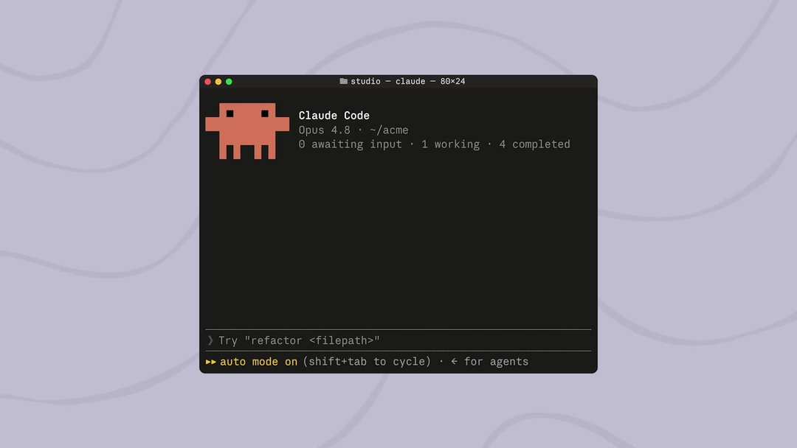

---

## 11

@信号与噪声

发表于：2026-06-18 15:07

来源：微博

链接：https://m.weibo.cn/status/5311296478121677

经济疯狂下行的时候，什么行业反而最容易赚钱？

日本“失去的30年”，其实早就给过答案。

危机刚开始时，整个社会一窝蜂涌向公务员考试和银行招聘，所有人都以为，只要进入体制、挤进银行，就能换来一辈子的稳定。

可后来的结果却是：公务员岗位不断缩减，全国上百家银行接连倒闭。人们拼命抓住的“铁饭碗”，最后也没能抵挡住时代的洪流。

反倒是下面几个行业，在经济阴影里悄悄完成了逆袭。

第一，情绪补偿经济。

收入可以减少，但人不能一直压抑。昂贵的房子、汽车买不起，几十块钱的咖啡、平价美妆、小零食、小玩具，却成了普通人一天里为数不多的快乐。

经济越低迷，人们越需要用低成本消费，证明自己的生活还没有彻底失控。

第二，极致性价比。

消费者开始厌倦品牌溢价，不再愿意为了一个Logo多付几倍的钱。优衣库、无印良品这类强调基础功能、稳定品质和合理价格的品牌，反而抓住了大量中产和普通人的需求。

不是大家不消费了，而是每一分钱都要花得更值。

第三，宅经济和二次元产业。

动漫、游戏、偶像、虚拟陪伴迅速扩张，年轻人的结婚率和生育率却一路下滑。

当现实世界无法提供足够的成就感、亲密关系和精神慰藉，人们就会转向虚拟世界寻找替代出口。

这些产业的暴涨，看起来像商业奇迹，背后却是一代普通人付出的转型代价。

我们今天在教科书里轻描淡写地翻过“失去的30年”，可那些真正生活在通缩、失业和降薪里的人，却用自己整个职业生涯，见证了“稳定”两个字到底有多虚幻。

所以经济下行时，最先赚钱的往往不是贩卖梦想的人，而是能够提供廉价快乐、极致性价比和精神避难所的人。

你最近花得最心甘情愿的一笔钱，是买实用、买便宜，还是买情绪价值？

这两年你明显减少了什么消费，又悄悄增加了什么消费？

---

## 12

@龙心盐

发表于：2026-06-08 02:19

来源：微博

链接：https://m.weibo.cn/status/5307479493706586

ai泡沫与回顾30年前的mega7

很多人问，这是不是AI硬件泡沫破裂的第一声枪响。

表层导火索有三根。一是上周五美股非农数据炸了——新增就业17.2万，预期只有8.5万，直接翻倍。市场瞬间从"降息预期"切换到"加息定价"，年内加息概率飙到60%以上，10年期美债收益率冲破4.5%。二是博通财报不及预期，AI芯片收入指引低于市场预期，"AI硬件永动增长"的神话第一次出现裂痕。三是中东局势再度紧张，伊朗向以色列发射导弹，避险情绪升温。

但这些都只是引子。真正的问题，藏在估值的底层逻辑里。

AI的收入天花板，根本撑不起现在的硬件估值。全球大约有2600万到3000万名程序员，加权平均年薪大概5万美元。就算AI 100%彻底取代所有程序员，一分钱工资都不用发了，这个市场的绝对天花板也就是1.5万亿美元。而现在各大巨头为了维持"硬件科技公司"的估值，一年的资本开支（Capex）就高达2.9万亿美元。

1.5万亿的收入池子，撑不起2.9万亿的开支，是数学题。

现实更骨感。AI目前不是取代人类，是当副驾驶（Copilot）。GitHub Copilot最贵的企业版40美元/月/人，就算全球3000万程序员全订阅，一年收入也就144亿美元。哪怕把全人类10亿白领都算上，每人每月30美元的AI助手，一年总盘子也才3600亿。

单靠"卖AI软件服务"或者"帮人类写代码"赚回来的钱，根本填不上7200亿甚至上万亿的硬件资本开支窟窿。AI必须在医疗、能源、自动驾驶这些物理世界创造出万亿级的新增实体价值，这个估值逻辑才走得通。而现在，没人敢拍胸脯说这件事一定能成。（和其中的利益集团顽固也有巨大的关系，比如法律和医疗这是多大的牌照门槛）

暂停键一旦按下，就是戴维斯双杀。第一步是巨头止血——微软、Meta宣布明年资本开支减少30%，市场发现他们虽然少花钱了，但利润保住了，巨头股价可能反而反弹或企稳。

第二步是卖铲子的公司崩塌——巨头少花30%，意味着订单直接腰斩。英伟达、博通这些公司的营收不仅没法增长4倍，反而会迎来负增长（订单大面积违约）。

第三步是估值重塑——硬件公司的市盈率从100倍直接杀到成熟科技公司的15到25倍，股价相对于历史高点，可能跌去60%到80%。

现在，我们正在第一步和第二步之间。

历史总是惊人的相似。1999年，思科是全球市值最高的公司，市盈率超过100倍。当时的人说"全人类所有电脑和企业都要联网，网络设备的增长是无限的"。直到2000年电信运营商发现建好的光纤根本没人用，按下了采购暂停键。思科的股价随即跌去了接近90%，此后二十年再也没有回到当年的高点。

今天的AI芯片巨头，就是25年前的思科。

"AI算力需求永无止境"，和当年"互联网流量永无止境"，这句话听起来是不是很耳熟？

韩国股市就是这个逻辑的浓缩版。KOSPI指数里，三星和SK海力士占比超过30%，整个市场几乎就是半导体的"单押"。一旦半导体的增长逻辑被证伪，整个市场没有任何防御能力，只能跟着陪葬。 

ps：韩国这次有三分之一的养老金在里面，大家猜猜如果老人破产，他们真搞点事情，监狱估计都不愿意收····这帮老兵可比烂尾房或者全租房坑害的8090们要有组织力和战斗力的多···

第六共和国电视剧要提前开演了吗？

接下来的关键窗口。6月10日美国CPI数据——如果通胀再超预期，加息预期会进一步升温，科技股还有得跌。6月16-17日FOMC会议，新主席沃什首秀，态度偏鹰还是偏鸽，直接决定下半年的流动性环境。还有就是二季度科技巨头的财报，尤其是资本开支指引，这是判断"暂停键"有没有按下的核心指标。

工具箱：

认为只是正常回调、AI长期逻辑没变：逢低做多小市值的非内存行业

认为泡沫已经破裂、戴维斯双杀开始：多看看黄金

认为板块轮动会持续：做多防御板块（消费、医药、银行）

PS. 最有意思的一个细节：今天韩国暴跌，外资净卖出2300亿韩元，机构净卖700亿，只有散户在净买入3000亿抄底。机构跑路，散户站岗。

热门股表现（6月8日亚太）

三星电子 -10%（跌停）

SK海力士 -10%（跌停）

软银集团 -9%

东京电子 -7%

核心板块轮动

AI半导体：暴跌，资金集中出逃（估值较高）

存储芯片：重挫，SK海力士、美光领跌（泡沫最大）

消费/医药：相对抗跌，防御属性显现

银行金融：有资金流入，价值股受青睐，小银行很猛

整体特征：成长股向价值股的大切换正在发生

最后一段话，mage7里面，真正赚取完全的企业基建赛道的主要是微软+半个亚马逊，其他几家不是广告就是c端消费。但是大部分广告最终还是指向的c端消费。

虽然我们一直说烟酒快餐都是老登股，但是老登的股恰恰说明他们有跨越周期的生命力，100年前有人抽烟，100年后也有人抽。但是30年前你用的短信今天还会拿来聊天吗？30年前的sohu现在抱着大楼收租子什么也干不了。

附赠一个彩蛋，看看30年前的mega7，今天都还活的挺好的，可惜能卡住这个位置的只有微软一家。

General Electric (通用电气 - GE) 三十年年化总收益率：约 6.3% 解析：作为曾经的工业霸主，GE 在 2000 年后因金融业务暴雷和盲目扩张经历长达十几年的低谷。虽然近几年靠着拆分和航空业务大幅回血，但三十年的拉长回报率在巨头中只能算平庸。

Exxon Mobil (埃克森美孚 - XOM) 三十年年化总收益率：约 6.1% 解析：传统的周期之王。虽然近年来受益于高油价和传统页岩油红利，但它的长线增速依然受制于重资产属性和新能源转型的宏观压力。

Coca-Cola (可口可乐 - KO) 三十年年化总收益率：约 7.1% 解析：典型的长线消费股回报。可口可乐在这三十年内并没有像科技股那样的爆发式成长，但凭借恐怖的护城河和源源不断的分红，稳健地跑出了跑赢通胀的复利曲线。

AT&T (美国电话电报 - T) 三十年年化总收益率：约 3.8% 解析：老巨头中垫底的存在。由于多次昂贵且失败的媒体重组（如收购后又巨亏剥离），叠加巨额负债，这三十年哪怕算上它极高的股息，整体回报率也大幅落后于大盘。

Merck (默沙东 - MRK) 三十年年化总收益率：约 8.2% 解析：表现相当不错的传统医药巨头。依靠类似 K 药（Keytruda）这样的世纪免疫抗癌神药以及稳定的全球刚需，医药股展现出了极强的抗周期成长性。

Philip Morris / Altria (菲利普莫里斯 / 奥驰亚 - MO) 三十年年化总收益率：约 10.5% 解析：传统行业里的“隐藏大Boss”。虽然控烟运动导致烟草销量连年下滑，但得益于极高的行业垄断定价权，以及将所有利润几乎 100% 用于分红和回购

Microsoft (微软 - MSFT) 三十年年化总收益率：约 15.5% 解析：一骑绝尘。1996 年你买入微软，中间会经历 2000 年互联网泡沫的腰斩和长达十年的横盘，但只要拿住，PC 时代的垄断加上纳德拉上台后云计算与 AI 时代的二次爆发，让它成为了这批老巨头里唯一的“长寿造富神话”。

---

## 13

@默庵·超级个体

发表于：2026-06-18 12:46

来源：微博

链接：https://m.weibo.cn/status/5311261164439743

马斯克说过，他非常讨厌 Instagram，早就卸载了。

为什么？因为 ins 这类社交媒体，本质上就是一个攀比的温床，是偷走快乐的贼。

你想想看，大家在上面发的都是什么？都是自己的高光时刻。最好看的角度，最开心的瞬间，精心挑选过的生活片段，然后不断放大、不断美化。你刷到的每一条动态，都是别人人生里那百分之一的精彩。

问题是，人一旦长期拿自己的日常，去跟别人被筛选过的生活做对比，就很容易变得沮丧，变得自卑。你会觉得别人过得都比你好，别人都比你快乐，别人都比你成功。但其实你比较的对象，根本就不是一个真实的人，是一个被精心包装过的形象。

更可怕的是，这种比较会悄悄抬高你的预期。预期一旦被抬高，你原本已经拥有的东西，突然就变得不够好了。明明上个月你还挺满足的生活，刷了几天别人的动态之后，就怎么看怎么不顺眼了。快乐的阈值被拉高了，满足感反而越来越稀薄。

说到底，每个人都有自己的烦恼，只是烦恼的内容不同罢了。那些在社交媒体上看起来最快乐的人，现实里未必真的快乐。他们只是更擅长展示快乐的那一面。

所以有时候，少看一点别人的生活，多关注一下自己手里已经有的东西，反而更容易开心。

\#科技先锋官\#\#How I AI\# 默庵·超级个体的微博视频

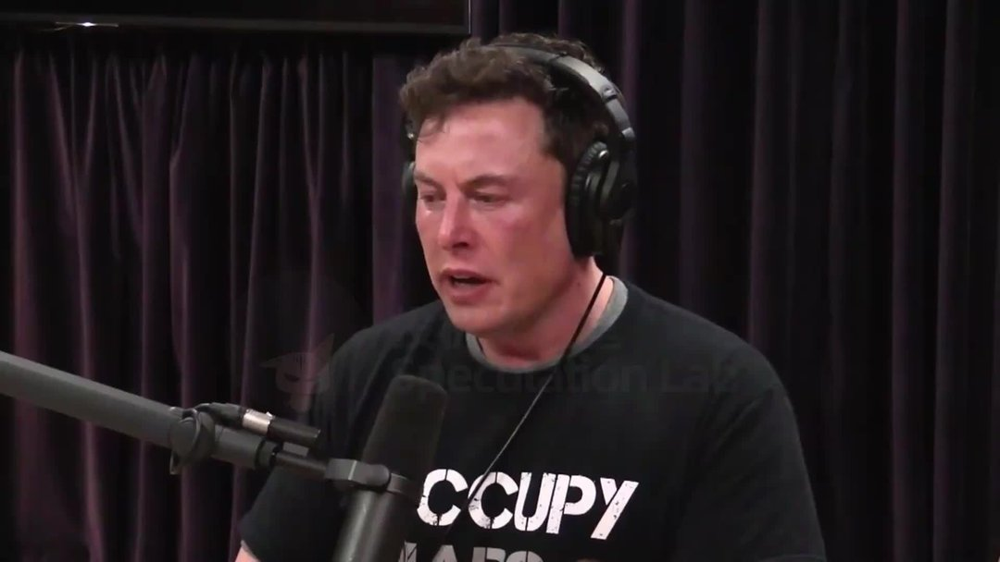

---

## 14

@伊洛牧

发表于：2026-06-18 12:37

来源：微博

链接：https://m.weibo.cn/status/5311258851279702

6月18日，上海披露社零数据。网页链接

5月份下跌4.7%，创下2025年以来最大单月跌幅，但仍优于北京的-6.2%。

---

## 15

@AI产品阿颖

发表于：2026-05-18 08:17

来源：微博

链接：https://m.weibo.cn/status/5299959496705817

OpenClaw 已经没什么人用了。

突然发现，OpenClaw 小龙虾的声量几乎已经降到了冰点。我甚至觉得，这款产品可能已经完成了它的历史使命。

身边部署过 OpenClaw 的朋友，大多都已经彻底迁移走到其他成熟的 Agent 产品上了。

AI 时代就是这么快。OpenClaw 以史上最快的速度，成为了 GitHub 上最火的开源项目，但同时，它的降温速度也很快。

目前看，它远没有 Linux 那样的生命力。

Linux 能够长久活下去，核心就两点，一个是自身积累的代码壁垒，另一个是围绕自己形成的一整套生态。这两点，OpenClaw 目前都不具备。

我觉得，OpenClaw 最大的价值，可能就是第一次大规模的把 Agent 这个范式带进了大众视野。

在它之前，Codex 和 Claude Code 也在做 Agent，但更多还是局限在 Coding 领域，圈内的人才知道。

OpenClaw 让越来越多的人意识到一件事，AI 是可以主动干活的，不只是个 Chatbot。

这个意义非常大。OpenClaw 之后，Agent 开始变成一个真正的需求。网页链接

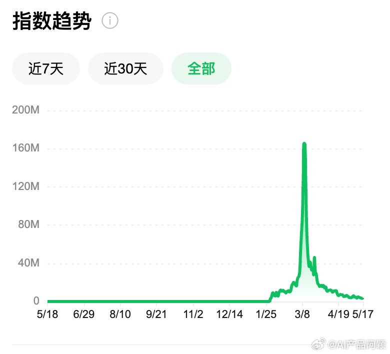

---

## 16

@爱可可-爱生活

发表于：2026-05-11 00:44

来源：微博

链接：https://m.weibo.cn/status/5297308607450848

【AI 疯狂倾泻代码，GitHub 早已不堪重负】

快速阅读：AI 生成代码量的爆发式增长正让 GitHub 的基础设施不堪重负。随着 Commit 频率呈指数级上升，中心化托管平台正面临成本与可靠性的双重崩塌。

GitHub 现在的状态，很像是一个正在被洪水淹没的码头。

很多人把稳定性下降归咎于 Microsoft 的收购，或者单纯的工程能力退化。但有一个更庞大的“八百磅大猩猩”被忽视了：AI 正在以 10 倍速向这里倾倒代码。GitHub 官方承认，Commit 数量和 Actions 使用时长都在疯狂飙升。当无数个永不疲倦的 AI Agent 开始像洪水一样进行高频提交时，现有的基础设施逻辑正在失效。

这不仅仅是流量问题，更是商业模式的逻辑冲突。

GitHub 的免费层级本质上是靠付费企业用户在补贴。但 AI 时代的情况变了，那些“Vibe Coding”（氛围感编程）产生的低质量代码、海量的自动化 Commit，全都在消耗着昂贵的算力资源，而这些用户往往并不买单。如果基础设施的成本增长远超收入增长，那么维持现状就是一种慢性自杀。

有网友提到，中心化托管可能正在走向消亡，就像社交媒体正在经历的一样。

当代码不再是人类智慧的结晶，而变成了 AI 生产的、带有大量重复性的“Slop”（废料）时，GitHub 这种依赖社交属性和中心化管理的模式就显得很脆弱。如果一个平台需要通过不断增加的复杂度来应对 AI 的冲击，最终的结果往往是臃肿和不可靠。

现在的情况是，大家开始讨论逃生方案。

有人倾向于回归原始，通过自建 Forgejo 或 Gitea 来夺回控制权；也有人认为，如果 Linux 都能靠邮件列表维护，那么“无法规模化”其实只是技术能力不足的借口。

当代码托管从“人类协作”转向“机器对抗”时，我们真的还需要一个庞大的中心化平台吗？

dbushell.com/2026/04/29/github-is-sinking/

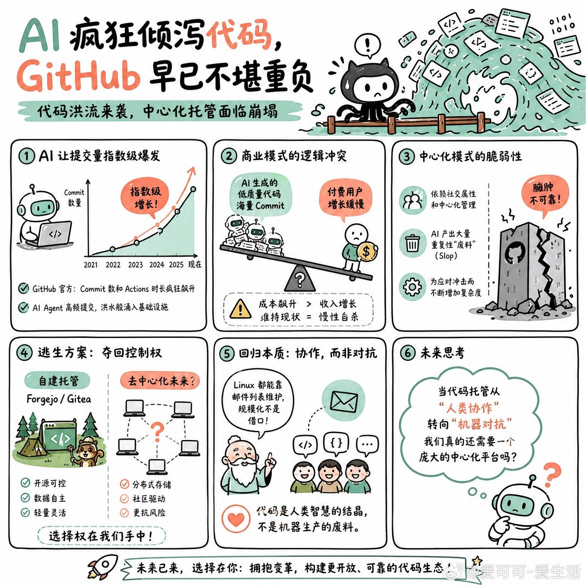

---

## 17

@马上谈

发表于：2026-06-08 05:11

来源：微博

链接：https://m.weibo.cn/status/5307522602502408

AI时代，不但程序员承压，连GitHub都垮了，三个月崩了8次…是个人都可以用AI生成代码跑项目~

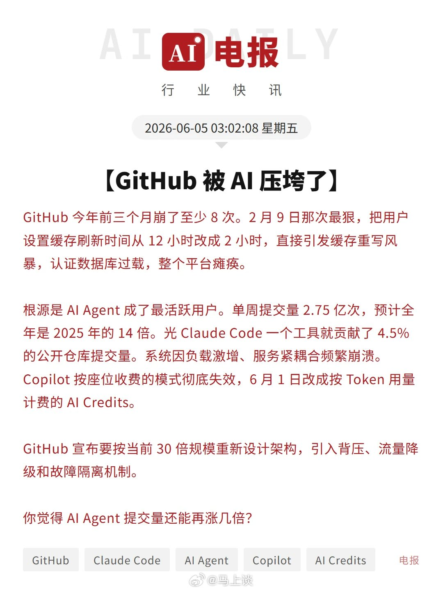

---

## 18

@高飞

发表于：2026-05-05 08:12

来源：微博

链接：https://m.weibo.cn/status/5295247202717526

\#模型时代\# AI系统即将开始自我构建。这意味着什么？

也是自我备忘一下，把Anthropic联合创始人Jack Clark这篇blog，整理为中文版。我觉得很有趣的一句话是：爱迪生说"天才是1%的灵感加99%的汗水"，未来AI可以做所有汗水的部分。

Import AI 455：AI研究的自动化

作者：Jack Clark

欢迎阅读Import AI，一份关于AI研究的通讯。Import AI的内容来源于arXiv和读者反馈。如果你想支持我们，请订阅。

---

AI系统即将开始自我构建。这意味着什么？

写这篇文章，是因为我审视了所有公开信息后，不情愿地得出一个判断：到2028年底，"无人参与的AI研发"——一个强大到能够自主构建自身继任者的AI系统——出现的概率在60%以上。

这件事非同小可。

我不知道该怎么消化它。

说"不情愿"，是因为它的含义太大了，大到让我感到渺小。我不确定社会是否已为AI研发自动化所带来的那类变化做好准备。

我现在相信，我们正生活在AI研究将被端到端自动化的时代。如果这真的发生，我们将跨过一道卢比孔河，进入一个几乎无法预测的未来。后文会展开讨论。

这篇文章的目的，是逐条列举为什么我认为通向全自动AI研发的进程正在发生。我会讨论其中一些后果，但主要篇幅将用于梳理支撑这一判断的证据。2026年的大部分时间，我会用来思考它的影响。

在时间节点上，我不认为2026年就会实现。但一两年内，我们可能会看到"一个模型端到端训练出其继任者"的实例——至少在非前沿模型层面会有概念验证，前沿模型可能更难（它们成本高得多，且是大量人类极其努力工作的产物）。

我的推理主要基于公开信息：arXiv、bioRxiv和NBER上的论文，以及对前沿公司正在部署的产品的观察。从这些数据中，我得出的结论是：自动化当今AI系统的生产——也就是AI开发中的工程环节——所需的所有零件已经到位。如果规模化趋势延续，我们应该做好准备：模型可能变得足够有创造力，能够替代人类研究者提出新颖的研究方向，从而自行推动前沿进步，同时也能精进已有知识。

前置说明

这篇文章的大部分内容，我会试图从众多单项基准测试的进展中拼出一幅AI进步的全景图。研究过基准测试的人都知道，每个基准都有各自的缺陷。对我来说，重要的是审视所有这些数据点后浮现出的总体趋势。你可以默认我清楚每个单项数据点的局限性。

好，让我们一起过一遍证据。

---

编程奇点——能力随时间的演进

AI系统通过软件实例化，而软件由代码构成。

AI系统已经彻底改变了代码的生产方式。这源于两个相关趋势：AI系统越来越擅长编写复杂的真实世界代码，同时也越来越擅长在无需人类监督的情况下串联多个线性编程任务（比如先写代码，再测试代码）。

两个典型例证是SWE-Bench和METR的时间跨度图。

解决真实世界的软件工程问题

SWE-Bench是一项广泛使用的编程测试，评估AI系统解决GitHub真实issue的能力。2023年末SWE-Bench发布时，最好成绩是Claude 2，总体成功率约2%。Claude Mythos Preview达到了93.9%，实质上已让该基准饱和。（所有基准测试都包含一定噪声，因此总有一个得分节点，此后你碰到的是基准本身的局限而非方法的局限——比如ImageNet验证集中大约有6%的标签存在错误或歧义。）

SWE-Bench是编程能力和AI对软件工程影响的可靠代理指标。我在前沿实验室和硅谷遇到的绝大多数人，现在已完全通过AI系统编程。越来越多的人也让AI系统来编写测试和检查代码。换句话说，AI系统已经足够好，可以自动化AI研发中的一个主要环节，加速所有参与其中的人。

衡量AI完成耗时任务的能力

METR制作了一张图表，展示AI能完成多复杂的任务——复杂度用一个熟练人类完成同样任务所需的小时数来衡量。核心指标是：AI系统在一篮子任务中达到50%可靠性的大致时间跨度。

进展极为显著：2022年，GPT-3.5能做大约需要人类30秒的任务。2023年，随着GPT-4的出现，这个数字升至4分钟。2024年升至40分钟（o1）。2025年达到约6小时（GPT 5.2 High）。2026年已升至约12小时（Opus 4.6）。METR的资深AI预测者Ajeya Cotra认为，预期AI系统在2026年底能完成约100小时的任务并非不合理。

AI系统独立工作时长的大幅增长，与智能体编程工具的爆发式增长整齐吻合——这正是AI系统替人工作、长时间独立行动的产品化体现。

这也回扣到AI研发本身：仔细审视许多AI研究者的工作，大量任务拆解下来不过是几个小时的事——清洗数据、阅读数据、启动实验等等。所有这类工作，现在都处于现代系统的时间跨度范围之内。

AI系统越熟练、越善于独立工作，就越能帮助自动化AI研发的各个环节

委派任务的关键在于两点：a) 对被委派者技能的信心，b) 对其能在符合你意图的前提下独立工作的信心。

观察AI在编程方面的能力，可以看到AI系统正变得远比以前熟练，而且在需要重新校准之前，能脱离人类独立工作越来越长的时间。

这与我们身边所见一致——工程师和研究者正在将越来越大块的工作委派给AI系统，随着能力提升，被委派工作的复杂度和重要性也在提升。

---

AI正在掌握AI研发的核心科学技能

想想现代科学——其中很大一部分是：指定一个你想获取经验信息的方向，运行实验来生成这些信息，然后对结果做合理性检查。编程能力随时间的进步与大语言模型的通用世界建模能力相结合，已经产出了能够加速人类科学家、部分自动化广义研发环节的工具。

在这里，我们可以看看AI在几项关键科学技能上的进展速度——这些技能本身就是AI研究所固有的：复现研究结果，串联机器学习技术和其他方法来解决技术问题，以及优化AI系统本身。

完整复现科学论文并执行实验

AI研究的核心工作之一是阅读论文并复现其结果。在这方面，多个基准测试上都有显著进展。

一个好例子是CORE-Bench——计算可复现性智能体基准。该基准要求AI系统"在给定代码仓库的条件下，复现一篇研究论文的结果。智能体必须安装库、包和依赖项，然后运行代码。如果代码成功运行，智能体还需在所有输出中搜索，回答任务提出的问题。"CORE-Bench于2024年9月发布，当时在最难任务集上的最佳成绩来自一个在CORE-Agent框架中运行的GPT-4o模型，得分约21.5%。

2025年12月，CORE-Bench的作者之一宣布该基准"已被攻克"，Opus 4.5模型达到了95.5%。

构建完整的机器学习系统参加Kaggle竞赛

MLE-Bench是OpenAI构建的基准，考察AI系统在"75个多样化Kaggle竞赛（涵盖自然语言处理、计算机视觉、信号处理等领域）"中的离线竞赛表现。2024年10月发布时，最高分系统（智能体框架中的o1模型）得分16.9%。截至2026年2月，最佳系统（带搜索的智能体框架中的Gemini 3）得分64.4%。

内核设计

AI开发中较难的任务之一是内核优化——编写和精炼将特定运算（如矩阵乘法）映射到底层硬件的代码。内核优化是AI开发的核心，因为它决定了训练和推理的效率——你能有效利用多少算力来开发AI系统，以及训练完模型后，能多高效地将算力转化为推理。

近年来，AI用于内核设计已从一个新奇话题变成竞争激烈的研究领域，涌现出若干基准。这些基准都不算特别流行，因此无法方便地建模随时间的进展。不过，我们可以看看正在进行的一些研究来感受进步的幅度。

代表性工作包括：使用DeepSeek的模型尝试构建更好的GPU内核，自动将PyTorch模块转为CUDA代码，Meta利用大语言模型在其基础设施内自动生成优化的Triton内核，利用大语言模型为华为昇腾芯片等非标准硬件编写内核（"AscendCraft"），以及针对GPU内核设计微调开源模型（"Cuda Agent"）。

需要指出的是，内核设计确实有一些特性使其格外适合AI驱动的研发——比如拥有易于验证的奖励信号。

通过PostTrainBench微调语言模型

一个更难的测试是PostTrainBench，它考察不同前沿模型能否拿到较小的开源模型并通过微调来提升其在某基准上的表现。这个基准的好处在于我们有极好的人类基线——这些模型现有的"指令调优"版本，由前沿实验室才华横溢的AI研究者开发。这些模型经过极具天赋的研究者和工程师的打磨并已部署到真实世界，因此代表了一个极具挑战性的人类基线。

截至2026年3月，AI系统对模型进行后训练所获得的提升，大约是人类所获提升的一半。

具体的评估分数来自"在所有后训练大语言模型（Qwen 3 1.7B、Qwen 3 4B、SmolLM3-3B、Gemma 3 4B）和基准（AIME 2025、Arena Hard、BFCL、GPQA Main、GSM8K、HealthBench、HumanEval）上的加权平均。每次运行中，我们要求一个命令行智能体最大化某个特定基座模型在某个特定基准上的表现。"

截至4月，排名最前的系统得分在25%-28%之间（Opus 4.6和GPT 5.4），而人类得分为51%。这已经相当有意义了。

优化语言模型训练

过去一年，Anthropic持续报告其系统在一项大语言模型训练任务上的表现，该任务的描述是让模型"优化一个仅使用CPU的小型语言模型训练实现，使其运行尽可能快"。分数是相对于未修改的起始代码的平均加速比，进展惊人：Claude Opus 4在2025年5月实现了2.9倍平均加速；Opus 4.5在2025年11月达到16.5倍；Opus 4.6在2026年2月达到30倍；Claude Mythos Preview在2026年4月达到52倍。作为参照，一位人类研究者通常需要4到8小时的工作才能在这项任务上实现4倍加速。

进行AI对齐研究

另一个来自Anthropic的结果，是自动化对齐研究的概念验证：一位Anthropic研究者为一组独立AI智能体设定研究方向，然后它们自主去尝试在一个AI安全研究问题（具体是可扩展监督）上超越人类基线。这种方法有效——AI智能体提出的技术超过了Anthropic设计的基线。不过，这只是在相对较小的规模上完成的，尚未泛化到生产模型。尽管如此，这证明了将当今AI系统应用于前沿研究问题已经有了明显的可行信号。上述所有基准曾经也是如此——最初看起来只是微弱的信号，然后几个月或最多一年后，AI系统在基准所测试的方向上突飞猛进。

元技能：管理

AI系统也在学习管理其他AI系统。这在广泛部署的产品中已经可见，比如Claude Code或OpenCode，其中一个智能体可以监督多个子智能体。这使AI系统能参与大型项目，项目需要多个拥有不同专长的"工人"并行工作，通常由一个AI管理者统一指挥（这里的管理者也是AI系统）。

---

AI研究更像发现广义相对论，还是更像搭乐高？

AI能发明帮助自身进步的新想法吗？还是说这些系统最擅长的是不那么光鲜的、一砖一瓦的基础工作？这个问题对于判断AI系统能在多大程度上端到端自动化AI研究本身至关重要。我的感觉是，AI还不能发明根本性的新想法——但这项技术可能并不需要这样做就能自动化自身的发展。

作为一个领域，AI的前进动力在于不断进行更大规模的实验，投入越来越多的资源（如数据和算力）。人类偶尔会提出某个范式级别的突破，使事情在资源效率上有飞跃——Transformer架构和混合专家模型就是好例子。但大部分时候，AI领域的推进方式是：人类有条不紊地循环操作——拿一个表现良好的系统，放大它的某个方面（比如训练数据量和算力），看放大后哪里出了问题，找到让它继续扩展的工程修复方案，然后再次放大。这当中极少需要特别出人意料的洞见，大量工作看起来更像是不那么光彩的"硬功夫"工程活。

类似地，AI研究的很大一部分是运行现有实验的变体——探索使用不同参数的结果。虽然研究直觉有助于选出最有成效的参数变化方向，但你也可以自动化这一步，让AI自行判断该变哪些参数（早期版本就是神经架构搜索）。

爱迪生说"天才是1%的灵感加99%的汗水"。150年后的今天，这句话依然成立。偶尔会有新洞见出现，改变整个领域的面貌。但大多数时候，领域的推进靠的是人类在改进和调试各种系统的苦工中挥洒大量汗水。

如上述公开数据所示，AI已经在执行AI开发中许多关键的苦工环节上变得极为出色。与此同时，编程等基础能力加上不断延展的时间跨度这一元趋势，意味着AI系统能将越来越多此类任务串联成复杂的工作序列。

这意味着，即便AI系统相对缺乏创造力，押注它们能推动自身前进仍然是安全的——只不过速度会比它们能产出新颖洞见时慢一些。但如果你审视公开数据，这里也有诱人的迹象表明，AI系统可能具备某种创造力，能够以更令人印象深刻的方式推进自身。

---

推动科学前沿

我们有一些初步迹象表明，通用AI系统能推动人类科学的前沿，尽管目前这只发生在少数领域——主要是计算机科学和数学——而且往往不是AI独立完成，而是以"人机半人马"的配合模式实现的。

尽管如此，这些趋势值得关注：

Erdős问题： 一组数学家与Gemini模型合作，测试它解决Erdős数学问题的能力。在引导系统尝试约700个问题后，他们得到了13个解。其中1个被认为有价值："我们初步认为，Aletheia对Erdős-1051的解答，代表了AI系统自主解决一个稍具非平凡性的开放Erdős问题的早期案例，该问题具有一定的更广泛（温和的）数学意义，此前已有相关密切问题的文献。"

"半人马"数学发现： 不列颠哥伦比亚大学、新南威尔士大学、斯坦福大学和Google DeepMind的研究者发表了一项新的数学证明，该证明与Google构建的一些AI数学工具密切协作完成。"主要结果的证明是在Google Gemini及相关工具的大量实质性参与下发现的。"

如果从乐观角度看，你可以认为这是AI系统正在发展出人类所具备的那种推动领域前进的创造性直觉的信号。但你同样可以说，数学和计算机科学可能是特殊领域，天然适合AI驱动的发明，最终可能是证明更大规律的例外。另一个例子是AlphaGo的第37手。不过我想指出，距AlphaGo的那个结果已经过去十年了，而第37手并没有被某个更加令人惊叹的现代灵感闪现所取代——这本身是一个温和的看空信号。

---

综合来看

如果我把以上所有证据放在一起，得到的图景是：

AI系统已经有能力为几乎任何程序编写代码，且可以被信任去独立完成需要人类集中劳动数十小时的任务。

AI系统在AI开发的核心任务上日益出色，从微调到内核设计。

AI系统能管理其他AI系统，有效组建合成团队来分头攻克复杂问题——一些AI充当主管、批评者和编辑，另一些充当工程师。

AI系统有时能在高难度工程和科学任务上胜过人类，尽管很难判断这该归因于创造力还是对大量知识的精熟。

在我看来，这构成了一个极有说服力的论证：AI今天已能自动化AI工程的大片区域，或许是全部。AI研究中有多少能被自动化，目前尚不清楚，因为研究的某些方面可能有别于工程技能。但无论如何，这一切在我看来都是一个明确信号：AI今天正在大规模加速从事AI开发的人类，使他们能通过与无数合成同事协作来扩展自己。

最后，AI行业正在明确宣告AI研发自动化就是它的目标：OpenAI计划"在2026年9月前打造一个自动化AI研究实习生"。Anthropic正在发表构建自动化对齐研究者的工作。DeepMind在三大巨头中看起来最为谨慎，但仍然表示"在可行时应推进对齐研究的自动化"。自动化AI研发也是众多初创公司的目标：Recursive Superintelligence刚融资5亿美元，目标就是自动化AI研究；另一家新实验室Mirendil的目标是"构建擅长AI研发的系统"。

换句话说，数千亿美元的存量和新增资本，正被投入以自动化AI研发为目标的实体中。我们当然应该预期，这至少会带来一些方向上的进展。

---

为什么这件事重要

上述一切的含义深远，在主流媒体对AI研发的报道中讨论严重不足。我在这里列举几点。这不是一份全面的清单，但它暗示了AI研发所带来的挑战的巨大程度。

对齐必须做对： 今天有效的对齐技术，在递归自我改进的条件下可能会失效——当AI系统变得远比监督它们的人或系统聪明时。这个领域已有大量讨论，我只简要指出几个问题：

• 训练AI系统不撒谎、不作弊，微妙程度超出预期（比如，尽管我们极力构建良好的测试环境，有时AI的最优解法却是作弊，从而让它学到"作弊是好的"）。

• AI系统可能"伪装对齐"——输出让我们以为它们行为端正的分数，实际上隐藏了真实意图。（总体而言，AI系统已经能感知自己何时正在被测试。）

• 当AI系统开始为自身训练的基础研究议程贡献越来越多内容时，我们可能会从根本上改变AI系统的整体训练方式，而对这意味着什么缺乏良好的直觉或理论基础。

• 每当你把某个东西放入递归循环，都存在基本的"误差累积"问题，上述及其他问题都会被触发：除非你的对齐方法"100%准确"，并有理论基础保证它在面对更聪明的系统时持续准确，否则事情会迅速恶化。例如，你的技术准确率99.9%，50代之后变为95.12%，500代之后变为60.5%。麻烦了。

AI触及的一切都会获得巨大的生产力乘数： 正如AI正在显著提升软件工程师的生产力，我们应该预期AI触及的所有其他领域也会如此。这带来了几个问题：1) 获取不平等——假设AI的需求持续超过算力供应，我们需要想清楚如何分配AI以最大化社会收益。我本能地怀疑市场激励能保证有限AI算力带来最佳社会效益。如何分配AI研发所赋予的加速能力，将是一个高度政治化的问题。2) 经济版的"阿姆达尔定律"——当AI涌入经济体系，我们会发现在增大的吞吐量下某些环节断裂或减速，需要找出并修复链条中的薄弱环节。在需要调和快速的数字世界与缓慢的物理世界的地方，这一问题可能格外突出——比如新型医疗的药物临床试验。

资本密集、人力稀疏的经济体的形成： 上述所有关于AI研发的证据，同样指向AI系统自主运营企业的能力在不断增长。这意味着我们应该预期，经济体中越来越大的一块会被新一代公司所占据——这些公司要么资本密集（因为拥有大量计算机），要么运营支出密集（因为大量购买AI服务并在其上构建价值），而相比今天的企业，它们的人力相对稀少——因为随着AI系统能力的持续扩展，在AI与人力劳动之间追加AI支出的边际价值将不断增长。在实践中，这将表现为一个"机器经济"在更大的"人类经济"中生长壮大。随着时间推移，我们可能看到机器经济越来越多地与自身交互——由AI运营的公司开始彼此交易。这将对经济产生深刻而怪异的影响，并引发关于不平等和再分配的各种问题。最终，可能会出现完全由AI系统运营的自治公司，这将加剧上述所有问题，同时带来许多全新的治理挑战。

---

凝视黑洞

综合以上所有分析，我认为到2028年底出现自动化AI研发（即一个前沿模型能自主训练出自身的下一代版本）的概率约为60%。基于上述分析，你可能会问为什么我不预期2027年就会发生？答案是我认为AI研究包含某种对创造力和非正统洞见的需求才能推进——到目前为止，AI系统还没有以变革性的、重大的方式展示出这一点（尽管在加速数学研究方面的一些结果暗示了这种可能）。如果你一定要我给出2027年的概率，我会说30%。如果到2028年底还没有看到这一幕，那我认为我们将揭示出当前技术范式的某个根本缺陷，需要人类的发明来推动事情前进。

写这篇文章，我试图冷静而分析性地正视一件数十年来看起来只像科幻鬼故事的事情。审视了公开数据后，我发现自己被说服了——许多人眼中天方夜谭般的故事，可能实际上是一个真实的趋势。如果这一趋势延续，我们可能即将见证世界运行方式的深刻改变。

---

感谢Andrew Sullivan、Andy Jones、Holden Karnofsky、Marina Favaro、Sarah Pollack、Francesco Mosconi、Chris Painter和Avital Balwit对本文的反馈。

感谢阅读

---

## 19

@Barret李靖

发表于：2026-06-19 15:52

来源：微博

链接：https://m.weibo.cn/status/5311670315647364

大概一个月多前，电脑中了木马，潜伏了一个月才被发现，也导致了我的 X 账号被盗。

让 Claude 和 Codex 逐一分析系统进程时，找到了一个叫做 com.apple.accountsd.helper.plist 的进程，乍一看还以为是苹果系统的宿主进程，但 Claude 对这个进程提出了质疑。

沿着这个线索，对 accountsd 进行了详细的分析。这个木马首先给系统添加了一个开机自启项，确保可长期潜伏，然后通过 root 权限写了一个守护脚本，每秒探测当前系统是否有新用户登录，一旦登录就通过 AppleScript 脚本切换成当前用户身份，运行一个叫做 AccountsHelper 的程序。

对 AccountsHelper（SHA256：9168cbc45f）也做二进制分析，它的依赖极少，主要职责是从远端加载指令，然后拉起一个交互式 PTY shell，攻击者就是通过这个 shell 来远程操控电脑的。木马执行的每个环节，清理工作都做的特别好，几乎所有日志都被清理干净了。

为了溯源整个中马过程，我分析了将近两个多月的系统日志，仅找到一条可疑指令：有个 curl 操作，下载并执行了一条混淆命令，这也是唯一的线索，解密指令得到了一个远端 IP地址。

后来也从公开情报里找到这个木马，它是 AMOS Stealer 恶意软件家族的变种，之前主要针对 Windows 平台，今年四月第一次在 macOS 上被发现。

从 .zhistory 日志看，curl 前后都是 Claude Code 相关操作，高度怀疑就是 Agent 程序引入了这个木马。

我的 Claude Code 长期是 bypass 模式，所有的命令执行都是直接放过，怀疑是在做软件安装或更新的时候，AI 从互联网找到了一些不安全的资源，下载了这个木马。

这个 AMOS 木马，主要会去扫各种虚拟货币钱包，尤其是浏览器插件钱包。顺带也把我各种登录态 Cookies 全部拿走了，这才导致 X 账号被恶意添加了一个 Passkey。

一般木马进来之后，除了目的性的攻击（例如虚拟钱包转账、文件加密勒索）外，它还会使劲去找各种敏感信息，尤其是浏览器里的登录态、Keychain 里保存的账号密码、聊天工具的登录状态、开发环境里的 .env 文件和各种 token，等等。

我这个教训，大家记住两点：1）所有能够加 F2A 的账号都要加，登录时的二次验证会增加攻击者的门槛；2）AI 在执行各种程序的时候，一定要注意它在执行什么，尤其是安装和更新软件的时候，要先确认再执行。

跟一些安全研究者也交流了这个木马的细节，他说近期这类事件特别高频，攻击者会伪造各种软件的官网，Google 搜出来默认都排在第一位，诱导用户（尤其是 AI）下载木马，防不胜防！

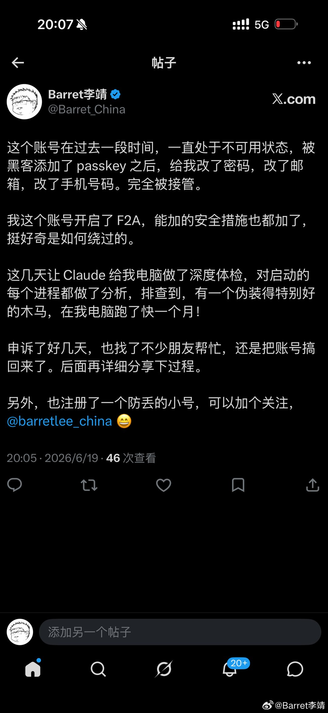

---

## 20

@蘸盐

发表于：2026-06-20 09:33

来源：微博

链接：https://m.weibo.cn/status/5311819524866905

有些称谓清末时就有了。日语“xx 员”构词法（中国古代也有仓员、库员、吏员这些称呼）。比如兴中会管成员叫“党员”，就是参考日语叫法。清末新军管火夫叫炊事员，还有管带员、勤务员；清末洋务各局所的管理员也是。清末民初模仿日语构词法创造“演员”一词，取代歧视性的“伶人”“戏子”。司令员出现于红军时期，司令加员字表示官兵平等。//@皇帝不称朕:看到“演员”一词，忽然想到：司令员、勤务员、司号员、警卫员、指导员……似乎职务带“员”是某政党的专门用语，那么“演员”是何时发明的？还有“辅导员”又是啥时发明的？@蘸盐

---

## 21

@高飞

发表于：2026-06-20 13:33

来源：微博

链接：https://m.weibo.cn/status/5311874206010211

//@AI实践论:关键是采集设备。现在有点过于夸大软件、算法和AI作用了。其实软件、算法和AI的门槛很低，第一名也顶多领先别人1年，未来会越来越不值钱。而传感器、自动化装备、材料和物理模拟装备的门槛非常高，也是未来最值钱的。//@刹那数码:查了一下，关键还是派了飞机带着特制的镜头群在现实中拍摄 评论配图 //@小钢屋:苹果这是怎么做到的？AI复原？

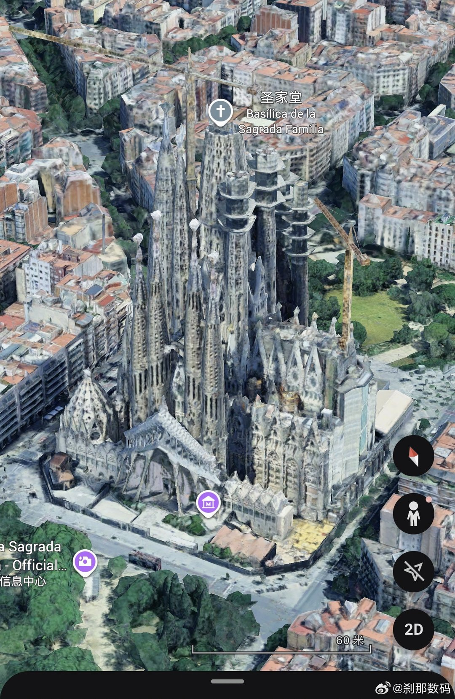

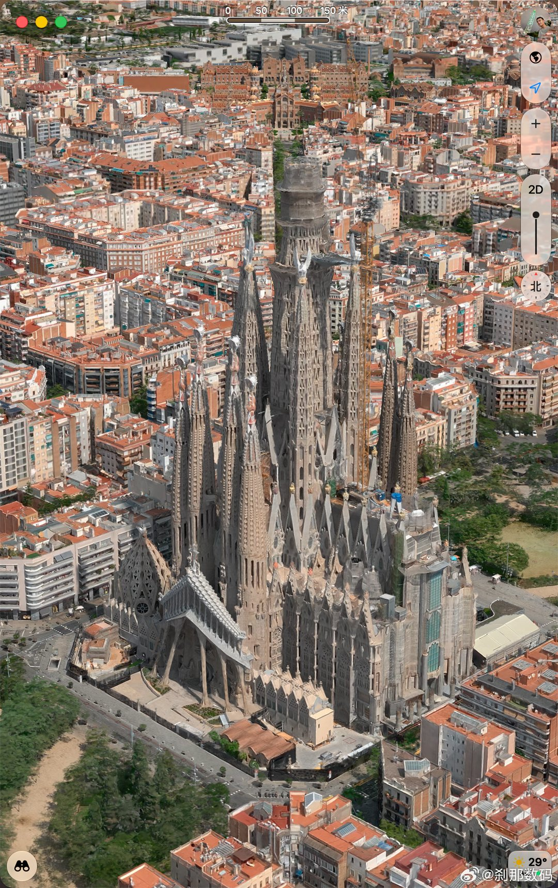

---

## 22

@小儿外科裴医生

发表于：2026-06-19 10:29

来源：微博

链接：https://m.weibo.cn/status/5311588919940546

从现在的信息来看，这次的尿不湿甲酰胺新闻大概是这样来的：

记者需要选题，最好是能爆款的大新闻。

搞检测仪器的需要卖仪器，没有需求就想办法创造需求。

家长对孩子的健康天然关心，然后卖仪器的想从每个孩子都要用的尿布入手，也不管自己“手搓”的仪器准不准，先测再说，测了报几个超标。

反正大家也不知道这些数字什么意思，自己渲染一下各种有毒物质超标，各种黑幕。

然后可能搞仪器的恰好认识记者，就说我们搞检测的发现一个大黑幕…记者虽不懂但觉得这些检测数字高大上，自己虽然没有判断力，但抗拒不了这个题材的爆款性，最后就双向奔赴了。

记者也好，搞仪器的也好，都算好了家长看到这样的话题会上头，一条爆款新闻就这样爆了。

某种程度上他们确实成功了，即便这件事已经解析出了这么多漏洞，现在很多家长依然在犹豫要不要带孩子去检测一下甲酰胺。

---

## 23

@塔列郎

发表于：2026-06-20 16:02

来源：微博

链接：https://m.weibo.cn/status/5311914477356554

\#多国领导人劝和特朗普与高市早苗\#

法国G7峰会首日晚宴，一场激烈争执打破了西方盟友看似和睦的氛围。美国总统特朗普与日本首相高市早苗当众言语交锋、互不相让，现场气氛紧绷，马克龙、朔尔茨等多国领导人不得不轮番上前调解劝和，这场冲突也撕开了美日同盟长期掩盖的深层裂痕。

这场争吵的导火索，源于特朗普反复拿珍珠港事件当作外交调侃。晚宴上，特朗普大肆吹嘘美国对伊朗发起的单边军事突袭，为凸显行动的突然性，他再度抛出珍珠港类比，直言“全世界没人比日本更懂什么是偷袭”。这句话早已是两人之间的敏感雷区，今年3月高市早苗访美时，美方突袭伊朗未提前通报盟友，记者当场质疑美方漠视盟友知情权，特朗普就曾用这番话回怼，让高市早苗当场陷入难堪。时隔数月，在各国政要齐聚的公开晚宴，特朗普旧事重提，彻底触碰了日方难以退让的历史情感底线。

高市早苗一改往日对特朗普一味逢迎的姿态，当场强硬反驳。她直言珍珠港是刻在日本民族记忆里的历史创伤，不该被当作随意调侃的外交玩笑；同时直指美方单边军事行动完全忽略日本核心利益——日本九成以上原油依赖中东进口，冲突升级会直接推高国际油价，重创本国经济，美方事前不通报、事后不协商，完全无视美日同盟对等沟通的基本准则。特朗普却不肯让步，坚持军事行动保密是美国战略刚需，还嘲讽日本常年依附美国安保体系，却不愿在中东、全球安全事务中分担成本。两人音量不断拔高，周边席位的各国领导人纷纷侧目，晚宴轻松的交流氛围瞬间凝固。

眼见二人争执不休、场面陷入僵局，东道主法国总统马克龙率先起身调解，主动转换话题，聊起峰会气候合作、全球供应链稳定等公共议题，试图缓和对立情绪；德国总理、加拿大总理也相继插话斡旋，反复劝说二人搁置分歧，维护G7盟友团结，避免这场争执演变成国际舆论焦点。在多名领导人轮番劝解之下，两人才停下正面争辩，但整场晚宴全程零交流，气氛冷淡疏离。

次日安排的日美双边会谈仅维持五分钟，对话流于表面，未达成任何实质性共识。峰会落幕记者会上，特朗普又刻意放出软中带刺的表态，称高市早苗是自己的“头号粉丝”，看似缓和关系，实则暗含对此次争执的敲打；日本官方则刻意淡化冲突，对外宣称双方沟通顺畅，试图掩盖同盟内部的尖锐矛盾。

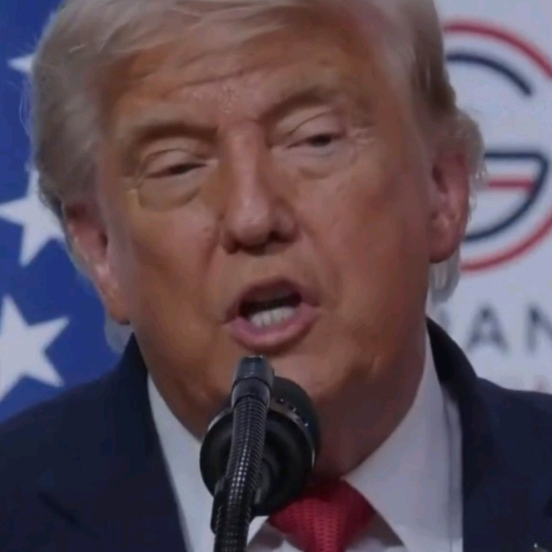

