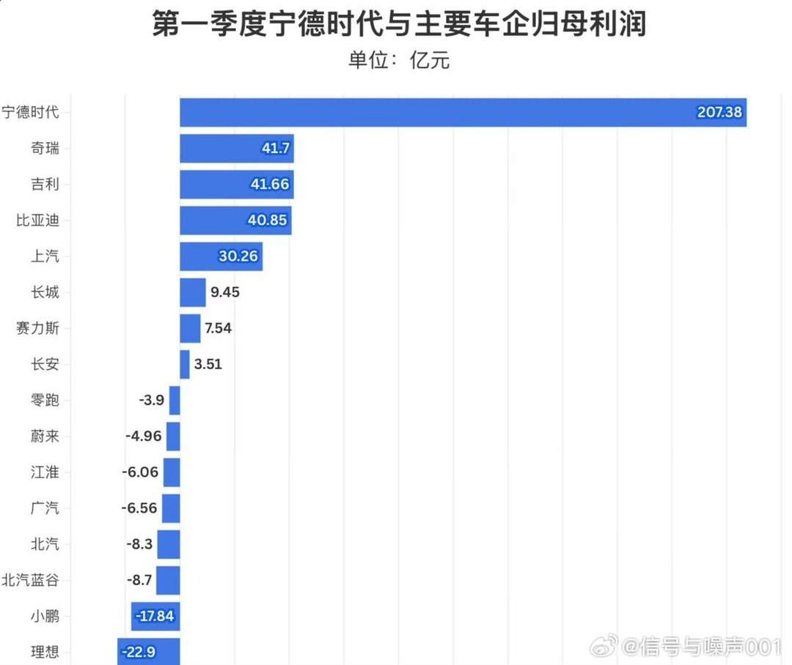
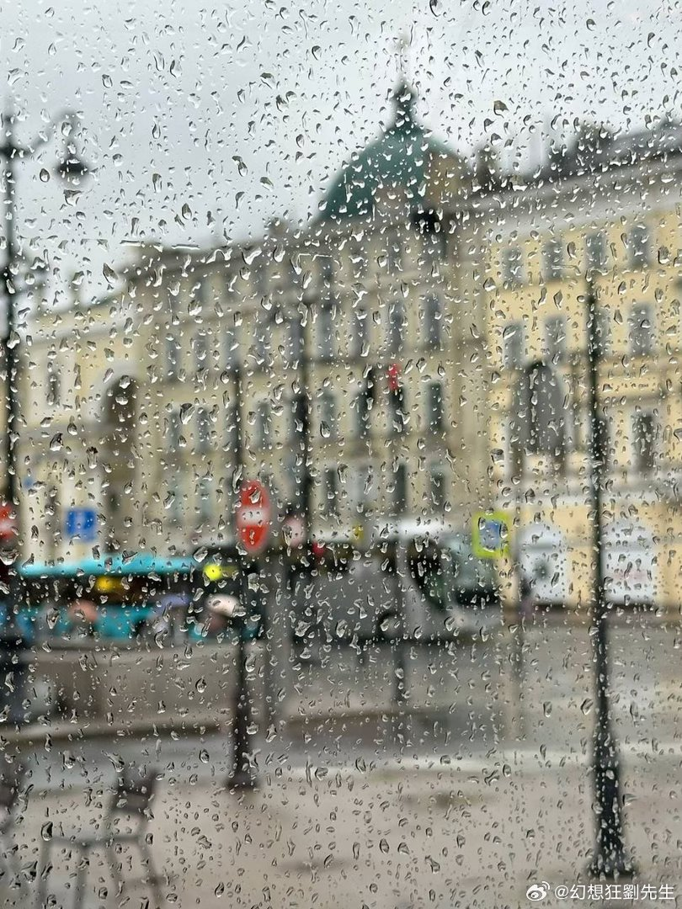
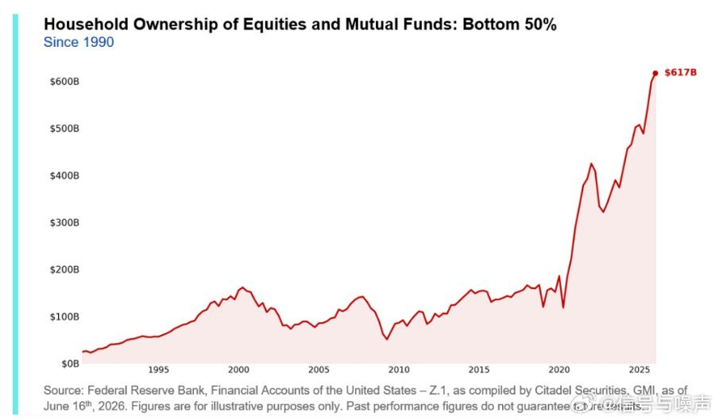
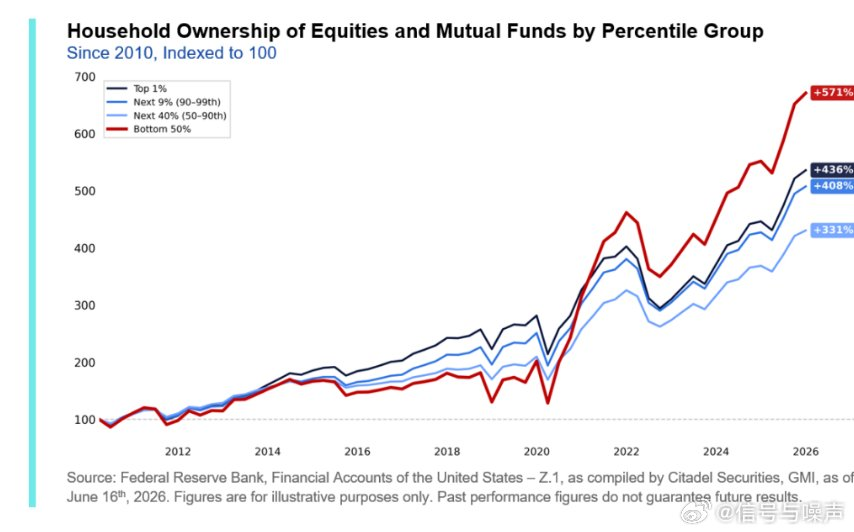
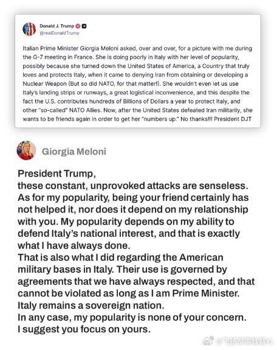
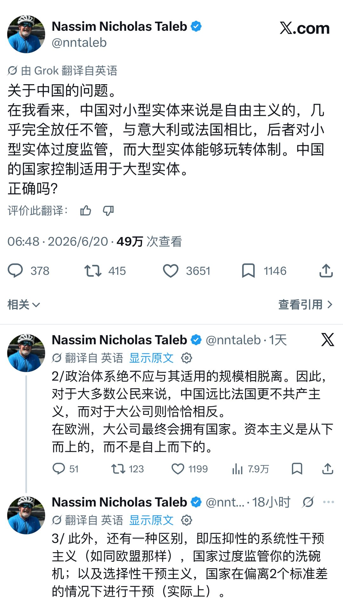
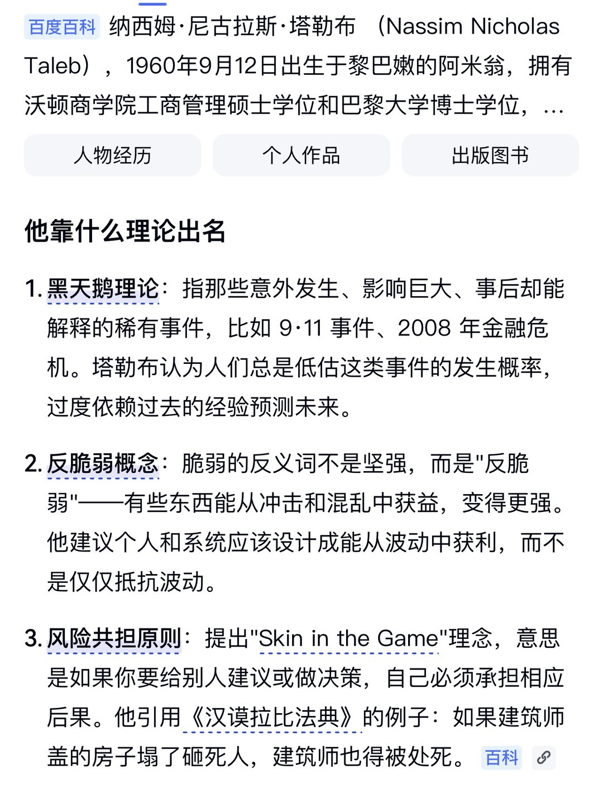

# 2026-06-21

## 1

@EricTsui

发表于：

来源：微博

链接：https://m.weibo.cn/status/5151083694133570

高敏感的人天生不适合底层，因高敏感的人都有道德洁癖。在心理学上，高敏感的人属于大后期人格，就典型的前期受挫，后期变得很厉害。

高敏感的人一定要往上走，也完全是有能力往上走的。但凡接触到更高层次的群体，就能发挥出更多不可思议的价值，格局和眼界都会不一样，能量和气场也会有大变化。

相反，一直待在底层是很吃亏的，高敏感的人过于善良、心软、共情能力太强，从而被琐事困住陷入极度內耗中，高敏感的人在底层会非常痛苦。

---

## 2

@信号与噪声001

发表于：2026-06-20 14:39

来源：微博

链接：https://m.weibo.cn/status/5312014211613690

宁德时代一家利润，超过七家车企总和

---

## 3

@幻想狂劉先生

发表于：2026-06-20 11:49

来源：微博

链接：https://m.weibo.cn/status/5311971649918427

\#城市择校指南\# 今年是中俄的教育合作年，我们不妨来谈谈“俄罗斯什么值得学”。

在历史上，我国的高等教育制度受苏联影响很大，这套高等教育制度培养出的人才，尤其是理工科人才，在我国现代化的过程中发挥了重大的作用。然而俄罗斯的理工科现状，用一句话概括：全面落后，个别坚挺。越前沿越落后，越基础越坚挺。

比如说，在AI研究领域，俄罗斯几乎连边都没摸到，顶级实验室在国际顶会发文寥寥，产业应用更是差距巨大。其国内市场几乎被Chat GPT和Deepseek二分天下（这二者合占70%的市场份额）。

但数学、理论物理这些基础学科，依然保留着深厚底蕴，老一辈数学家的传统尚未完全断裂。这说明根基还在，但往上长新枝的能力严重衰退。

造成这种局面的核心原因有两点：一是长期自我封闭，与世界主流科研体系脱节；二是国家投入严重不足。据了解，其国家理工最高殿堂比如鲍曼这些高校的年度经费，甚至比不上中国一所富裕省份的省属211高校。这不是人才不够聪明，而是系统性问题——封闭导致信息滞后，投入不足导致设备、团队、生态都跟不上。

那么，俄罗斯科研有没有可取之处？也有，反而在文科和社会科学领域。俄罗斯以远不及广东一省的GDP，却能对许多经济体量是其N倍的大国进行有效的意识形态影响和文化输出，培养出“倾慕者”群体来，相反，在俄国内从来没有一个成气候的“中粉”群体，俄国内政治各派别在对华态度上都有鲜明的主体性。这份“以小博大”的软实力，值得深思。它证明：硬实力拼不过的时候，叙事能力、思想渗透力和文化韧性同样能塑造国际格局。

此外，俄罗斯的音乐和艺术教育仍保持着很高的水准，同品质下相对西欧的教育环境性价比很高。其体育教育也相对不错，有许多可圈可点之处。

然而我们在讨论“俄罗斯什么值得学”的时候，不可能绕开最重要的因素就是安全，在战争形势扑朔迷离的情况下，无论是长期的深造还是短期的培训，“理性”和“审慎”的态度都十分必要。

---

## 4

@信号与噪声

发表于：2026-06-20 14:16

来源：微博

链接：https://m.weibo.cn/status/5312008452314268

2020年，\#美国\# 收入最低的50%人群持有的股票及共同基金总额不足2000亿美元

如今已达 6170 亿美元

底层 50% 的群体在所有财富群体中，其权益敞口增加幅度最大

---

## 5

@飞扬军事铁背心

发表于：2026-06-20 14:32

来源：微博

链接：https://m.weibo.cn/status/5312012553814022

意大利总理梅洛尼回应特朗普：

“特朗普总统，这些持续、毫无根据的攻击是毫无意义的。至于我的支持率，成为你的朋友显然并没有帮上什么忙，但它也并不取决于我和你的关系。

我的支持率取决于我维护意大利国家利益的能力，而这正是我一直在做的事情。关于意大利境内的美国军事基地，我也是如此。这些基地的使用受既有协议约束，我们一直遵守这些协议，只要我还是总理，这些协议就不能被违反。

意大利始终是一个主权国家。无论如何，我的支持率与你无关。我建议你还是专注于你自己的支持率。”

\#烽火问鼎计划\#

---

## 6

@高飞

发表于：2026-06-20 04:56

来源：微博

链接：https://m.weibo.cn/status/5311867538901540

\#模型时代\# Lambda CTO最新播客：GW级AI数据中心的成本金字塔，Nvidia的真正护城河不是CUDA，Neo Cloud有何竞争壁垒

---

这可能是我近期看过对Neo Cloud，和GPU云诠释最好的播客了，如果对此类话题感兴趣，强烈推荐一读。来自MAD Podcast，嘉宾是Lambda CTO Stephen Balaban。

分别介绍一下，这档播客和嘉宾背景：

Matt Turck是FirstMark的合伙人，他的MAD Podcast是追踪AI基础设施的好窗口。Stephen Balaban是Lambda的联合创始人，2012年和双胞胎弟弟Michael一起创立了这家公司，从面部识别API做起，中间做过帽子里藏摄像头的Lambda Hat和早期AI图像生成产品Dreamscope，最终转型成GPU云服务商。

Lambda的云业务目前接近10亿美元年化营收，2025年11月完成了TWG Global领投的超15亿美元E轮融资，估值约59亿美元（截至2026年5月Sacra数据），正在筹备2026年下半年的IPO。2026年5月，Lambda宣布了一次管理层调整：Stephen从CEO转任CTO，聘请曾任Sprint CEO和SoftBank Group International CEO的法国人Michel Combes出任新CEO。

一、GPU算力为什么不是大宗商品

1、云计算是高度垂直整合的复杂服务，跟"租GPU"完全不是一回事

几年前硅谷的主流看法是neo cloud（新型GPU云服务商）会被商品化。Stephen认为这个判断从根本上误读了这个行业的本质。云计算横跨土地权益审批、建筑施工、高性能计算设计、软件虚拟化和上层云服务等多个层次，全球市值最高的几家公司（Amazon、Microsoft、Google、Oracle）全都在做云计算，原因就是它是一门好生意。Neo cloud不是什么"略有不同的云服务"，它本质上就是为AI时代设计的云服务。

2、这个市场能容下多个大玩家，但不会走向赢家通吃

Stephen给了一个判断市场结构的框架：当一个行业的护城河来自技术壁垒、资本门槛和经济规模时，市场结构倾向于寡头竞争，正如传统云市场有AWS、Azure、GCP共存。只有当护城河主要来自网络效应时，市场才会走向赢家通吃。Neo cloud的壁垒在技术和资本，不在网络效应，所以会是多个大玩家并存的格局。

不会被商品化，也能容纳多个玩家，那GPU租赁价格到底是在涨还是在跌？

3、H100价格指数存在方法论缺陷，"降价"可能只是统计幻觉

Bloomberg有一个H100租赁价格指数。Stephen指出这个指数的问题在于没有区分两种完全不同的价格：公有云按需价格（on-demand rate）和长期租赁价格（long-term rental rate）。Lambda实际观察到的是，这两个价格都在保持稳定甚至上涨。如果指数的方法论让长期合约在成交量中的占比增加，指数看起来会下降，但这只是混合比例变化造成的统计效果，不代表真实价格在跌。

4、2023年部署的H100，现在的租赁费率比当时还高

Lambda是最早的neo cloud之一，拥有从会计角度已经完全折旧完毕的GPU（大多数公司采用约6年的会计折旧周期）。但会计折旧周期不等于可用寿命，可用寿命又不等于经济可用寿命。那些说"GPU五年就得扔"的人完全搞错了。Stephen强调，需求持续走高是推高租金的直接原因，而GPU的实际可用寿命远超市场预期。

5、效率提升10倍不会减少算力需求，你只是能处理10倍的token

假设推理效率提升了10倍，需要的GPU不会变少，所有人只是可以处理10倍的token量。全球任何时刻的算力总量是固定的，效率提升只会解锁更多应用场景。Scaling law还看不到尽头，模型能力的持续提升意味着AI可覆盖的市场锥体在不断扩大：最早是客服替代品和搜索替代品，现在已经延伸到大量软件工程岗位的替代或增强。

"It's pretty clear that we have an amazing system that can take in money and output software." Stephen说这话时提到了Opus 4或5的发布。投入资金，产出软件，这条路径已经成立。

二、从光子到token：AI数据中心的物理学

人们谈论FLOPS、GPU hours、tokens、MFU这些词的时候，其实在谈论同一条物理管线上不同位置的度量。Stephen把它拆回了SI单位制。

1、能量→算力→token的完整管线

左端是能量输入：光子（太阳能）或天然气分子。经过发电厂转换为焦耳/秒（即瓦特），这一步有发动机效率损耗。电力进入数据中心后，冷却系统消耗一部分，这部分效率的衡量指标是PUE，全称Power Usage Effectiveness，数值越接近1说明冷却能耗越低。剩余的电力驱动服务器中的GPU、网络和存储设备，产出每秒浮点运算次数，也就是FLOPS。FLOPS被模型训练或推理消耗，转化为tokens/秒。再往上一层，终端用户将token转化为实际可用的智能输出，这里还有一层效率。MFU衡量的就是模型在可用算力中实际利用了多少。

2、一个GW级AI数据中心的成本金字塔

Stephen给出了一组具体数字（按每GW计算）：

• 发电环节：每兆瓦200-300万美元，即每GW 20-30亿美元

• 数据中心建筑以及机械、电气、管道等MEP设备：每GW 100-150亿美元

• 服务器和计算设备：每GW 350-450亿美元

服务器部分在整个资本开支中占绝对大头。服务器的物料清单里，GPU是最大的成本项。而最近一段时间，HBM内存的价格也在大幅上涨，供应商只有Samsung和SK Hynix这几家。

3、行业真正的瓶颈：已获权益的土地+电力承诺

Stephen把瓶颈描述为 "land-power-shell"：已经完成权益审批（entitled）、获得了公用事业公司兆瓦级电力承诺的土地，加上数据中心本身的建筑外壳及MEP设备。具体到每个项目，瓶颈可能是发电机或UPS系统，但放到整个行业层面，核心制约就是这三样东西。

4、社区反对和信息纠偏：新一代GPU几乎不用蒸发冷却

数据中心遭遇社区反对确实在发生，Stephen认为社区有权参与讨论。但他指出其中存在大量误导信息。比如"数据中心大量消耗水资源"这个说法。实际情况是，所有部署Blackwell或Rubin级GPU的现代数据中心，用的是闭路直接到芯片的液冷系统（direct-to-chip liquid cooling），连接干式冷却器（dry cooler），蒸发量接近零，根本不用蒸发冷却塔。另外，大多数新建数据中心会给电网带来额外的电力容量和电池储能系统，实际上是在加强电网。

三、Neo Cloud的竞争壁垒

物理层搭好了，下一个问题是：两家公司拿到同样的芯片，怎么从中榨出更多价值？Matt Turck直接问了这个问题，Stephen的回答从折旧成本开始。

1、从同一块芯片中榨取更多价值，核心是利用率和云软件

GPU每小时成本中最大的一块是折旧。利用率是折旧成本的乘数因子：如果利用率只有50%，每小时的折旧成本就翻倍（1/0.5）。能把利用率拉高的关键是云软件，让客户方便地按需启停GPU。如果没有这层软件，就没法做按需出租，也就没法收取比批发价高得多的零售价。Stephen说大多数neo cloud其实连一个真正的云服务都跑不起来。

2、One-Click Cluster：把一万张GPU切成可用的子集

Lambda的核心产品之一是One-Click Cluster。想象你有一万张GPU的集群，要把它切成客户可用的分区。这不只是分GPU那么简单，你需要同时分割三层网络：负责存储通信的in-band网络、用于传输模型权重和激活值的高速互联compute fabric、以及通过BMC和DPU做硬件管理的out-of-band监控网络。每一层都要协调切割，还要保证GPU的HBM内存可以直接互相读写、不经过CPU中转，这种能力叫RDMA，远程直接内存访问。大多数neo cloud没有做到数亿美元级别的软件投入来实现这些。Lambda的产品可以在网页上一键给你分配16到4000张GPU。

Lambda的云软件是建在Nvidia的技术栈之上的，而这个技术栈本身就是一道护城河。

3、Nvidia的真正护城河不是CUDA，是cuDNN和NCCL

所有人都说CUDA是Nvidia的护城河。Stephen认为CUDA只是"大家都在游泳的水"，真正的壁垒在更上层。cuDNN是Nvidia的深度神经网络计算库，本质上是一个深度调优的矩阵乘法引擎，内置了Winograd滤波等各种加速算法。如果你自己去实现矩阵乘法，得到的FLOPS会远低于用cuDNN的效果。NCCL是Nvidia的网络通信优化库，它会感知你的InfiniBand或以太网拓扑，自动优化reduce-all和broadcast等OpenMPI通信原语，这对分布式训练和前沿推理至关重要。这两个库构成的软件栈才是新进入者难以逾越的门槛。

4、前沿推理是分布式问题，训练基础设施可以复用

训练时，大约2/3的计算在反向传播（backward pass），剩下的在前向传播（forward pass）。前向传播本质上就是推理。Stephen所说的前沿推理（frontier inference）指的是像Opus或ChatGPT 5.5这样的超大模型，它们根本装不进一台服务器甚至一个机柜，必须被分片到多台服务器上，利用InfiniBand或高速以太网做通信。一个重要认知是：适合大规模训练的基础设施可以直接复用于前沿推理，这让基础设施的经济性大幅提升。

四、AI基础设施的金融化

前面算过了一个GW级设施的成本金字塔：发电20-30亿，数据中心100-150亿，服务器350-450亿，加起来接近500亿美元。这笔钱从哪来？

1、两种融资逻辑：看Lambda的信用，还是看客户的信用

按需云业务的融资看的是Lambda自身的信用质量。但长期off-take协议，也就是大客户以年为单位签下的算力采购承诺，融资看的是最终客户的信用质量。后者的做法是把off-take协议、对应的GPU集群和物业打包放进一个特殊目的实体（Special Purpose Vehicle），然后到私募信贷市场做资产支持贷款。这个市场已经相当活跃。

按需云的融资还不如有投资级off-take方那端成熟，但正在快速追上来。

2、GPU正在成为一种成熟的资产类别

债权人和贷方开始认识到Nvidia GPU是一种保值且容易做信用评估的资产。Lambda 2023年部署的H100，现在的出租价格高于2023年。这让债权人看到这不只是现金流稳定的资产，还是一种可能增值的资产。Stephen观察到，过去一年最大的变化就是信贷市场开始把GPU视为成熟的资产类别，资金正在涌入。

至于是否会出现GPU算力的期货或衍生品市场，Stephen认为还太早。先需要一个充分发育的现货市场，然后才可能叠加更复杂的金融产品。现阶段不必过度金融化。

GPU的需求为什么看起来在地理上也没有天花板？因为AI的工作方式跟传统应用完全不同。

3、大多数AI工作负载对延迟根本不敏感

Stephen举了个直观的例子：你在ChatGPT或Claude里发出一个请求，出去转一圈回来，一份研究报告已经生成好了。对于这类长时间运行的agent workflow，延迟完全无关紧要，唯一重要的是每token成本。

传统云业务对延迟极度敏感，因为跑的是ATM后端、在线交易这类应用。但新一代AI应用大多不是这种模式。唯一需要考虑地理位置的原因是数据治理：一些国家希望本国公民使用的AI算力跑在自己国家的服务器上。这也解释了Lambda为什么聚焦北美市场而不急于全球扩张。不需要追延迟，就可以集中力量做一件事：把数据中心尽快立起来。

4、Lambda正在走向全垂直整合

Lambda最初主要是租户。现在正进入全垂直整合：自己找地、带着数据中心的全套工程图纸（basis of design）上桌谈判、自己融资并施工建设、装服务器、绑定长期off-take协议、全流程自己融资。Lambda目前在北美运营（美国、加拿大、墨西哥），在韩国首尔通过投资人SK Telecom运营过数据中心，但战略重心聚焦美国市场。

Stephen转任CTO后的主要方向之一就是高速数据中心部署。他说世界上能做到高速部署的只有两家公司，xAI和Lambda。xAI 2024年将10万块H100从开工到上线压缩到了122天，刷新了行业纪录。Stephen认为Lambda可以追平甚至超越这个速度。

五、从面部识别到近十亿美元云业务

Stephen自己说了一句话解释为什么Lambda走了一条非典型路径：你现在看到了这门生意有多复杂、多重资本、多不符合标准分类框架，就能理解为什么Lambda的投资人大多不是硅谷主流VC。所有投资人都赚到了钱，但他们往往来自更非传统的方向。

1、Lambda的起源与AlexNet同年——2012

Stephen 2012年创办Lambda，最初是训练卷积神经网络做人脸和图像识别的软件公司。他从Google Code上拉下了CUDA ConvNet的代码库（Google Code还在运行，可见年代之久远），用一台朋友那里买来的4块GTX 580工作站训练模型。同年AlexNet论文发表，这不是巧合。

期间Stephen还作为第一个员工加入了两位博士刚毕业的朋友Zach和Nico创立的Perceptio。他们在2013年就用iPhone的GPU图像库和OpenGL ES shaders在手机上本地运行卷积网络。Perceptio后来被Apple收购，iPhone上滑动照片可以识别人脸、搜索照片库的功能，部分技术源头就在这里。

2、6万美元的CAPEX赌注——一个半月回本

2015-2016年Lambda做了一个叫Dreamscope的产品，用Google Deep Dream和Leon Gatys的风格迁移算法把照片变成画作，获得了百万级用户。但AWS账单飙到了每月4万美元。他们花6万美元买了一组工作站搭建小集群来替代，当时紧张到选工作站的理由是"最坏情况还能卖掉"。结果上线一个半月就回本。"我们省的钱比赚的钱还多。" 这个经历让他们意识到，也许应该把计算能力卖给其他AI研究者。

2017年卖工作站做了300万美元营收，2018年1000万，2019年3000万。硬件业务峰值做到约2亿美元年化。云业务2019年正式上线，早期增长缓慢，2018-2020年想买大量AI算力的人确实不多。COVID期间尤其艰难：软件公司在家照常发版，但Lambda当时还是硬件公司，码头关闭意味着完全无法出货、无法确认收入。坚持下来后，现在接近10亿美元年化营收，硬件业务已全部退出。

3、创始团队14年几乎没散——还孵化出了估值超10亿的Positron

做Dreamscope的四个人（Stephen、双胞胎弟弟Michael、首席科学家Shuang Li、工程主管Steve Clarkson）现在全部还在Lambda。早期员工Mitesh Agrawal在公司待了约八年后离开，和另一位Lambda前成员Thomas Sohmers联合创办了Positron AI，一家做节能推理加速器的公司。2026年2月Positron完成了2.3亿美元B轮融资，估值超过10亿美元。Lambda的"黑帮网络"已经开始形成。

六、前瞻：Neural Software与One Person One GPU

Stephen转任CTO后，一部分精力放在高速数据中心部署上（见上文），另一部分放在更远的技术判断上。他有一个被引用过多次的判断："AI won't write software, it will become the software." Matt Turck让他展开讲。

1、"AI不会写软件，AI会成为软件"

Stephen提出了一个叫 "neural software" 或 "neural OS" 的概念。他建议去ChatGPT或Claude里输入这样一个提示：用ASCII art渲染一个桌面界面，然后把模型当作操作系统来使用，点击、打开应用、跟它交互。这时候你看到的不是LLM生成的代码在运行，而是LLM本身在模拟软件的行为。

这跟vibe coding有本质区别。Vibe coding输出的仍然是人类可读的代码（Python、C），经过编译器或解释器执行，生成后是静态的。Neural software没有代码在运行，一切都是模型的特征激活空间和上下文窗口中的状态变化。好处是不会有bug，只有对提示的误解。Stephen说Lambda已经有原型，学术界也有相关研究。

距离大规模采用还有多远？"When I'm early on something, I tend to be about a decade to a decade and a half early." 他习惯性地比趋势早十年到十五年，所以他预估neural software在10-15年后开始被大规模采用。Tesla的端到端自动驾驶其实已经是neural software的一种形态——接收视频输入，用神经网络做决策输出，用户体验就是驾驶体验。

2、自组装软件：24/7 agent fleet + 用户反馈的闭环

Lambda内部已经在实践Stephen所说的"self-assembling software"。把产品需求和用户反馈实时接入一个24/7运行的agent fleet，由agent去实现bug修复和功能开发。软件在发布之后才开始大规模开发，因为用户的反馈会驱动agent持续迭代。

下一步是agent反过来向人类求助。不是人类说"帮我写代码"，而是agent说"帮我去插一千块GPU""帮我注册一个API密钥""帮我去谈个合同"。人变成了agent的执行层。

Agent驱动的开发也在改变算力层的需求。Stephen观察到，agent工作时大量时间花在编译、跑自动化测试、搜索代码库这些传统CPU密集型任务上，并非全程消耗GPU推理算力。这意味着云服务商需要提供配套的CPU编排环境和安全隔离能力，不能只卖GPU。

3、One Person One GPU：一个可能需要50年的愿景

Stephen在Lambda做B轮和C轮融资时（2020-2021年间），把AI类比为PC产业的历史。Apple 1976年创立时的信条是 "one person, one computer"。Macintosh 1984年问世，但直到2004年家庭宽带普及才接近一人一电脑；2014年加上智能手机才真正超越；电商渗透直到近年来才显著提速。从信条提出到目标实现，Apple用了接近半个世纪。

Stephen相信未来每个美国人的日常工作、娱乐和创作都需要至少一块GPU的算力。但他也承认，这可能同样需要几十年才能实现。

4、什么agentic workflow被高估了？什么被低估了？

高估的：非软件工程领域的agentic workflow。原因在于agent循环要跑得好，必须有具体的、可自动验证的反馈机制。自动化测试对代码来说是天然的闭环，但"去帮我买一块地"这种任务没有可供模型长期迭代的抓地力。当然不是所有非代码领域都不行，CAD、计算机辅助制造、有限元分析、计算流体力学这些可以模拟和迭代的领域同样适用。

低估的：Neural OS和自组装软件的概念，以及面向软件工程的agent驱动开发。Stephen觉得大多数人还没有真正体验过用Claude开10个agent同时构建一个项目是什么感觉。"They literally don't understand because they've never tried it." 他们根本不理解，因为从来没试过。

---

## 7

@布尔费墨

发表于：2026-06-21 12:04

来源：微博

链接：https://m.weibo.cn/status/5312216753768343

《黑天鹅》作者塔勒布赞美中国对小企业宽容，对大企业严格监管。他指出，西方对小企业严格监管，扼杀小企业生存能力，对大企业监管很松，使得大企业控制国家。

