# 2026-06-22

## 1

@郎行-2026

发表于：2026-06-21 10:06

来源：微博

链接：https://m.weibo.cn/status/5312307988008275

埃隆·马斯克：“我曾经想去网景公司找份工作。我投了简历，但他们好像根本没看过，也没人回复。我试着在网景公司的大厅里闲逛，看看能不能碰上人，但我太害羞了，不敢跟任何人说话。所以，我创办了自己的公司。” 上帝爱子的微博视频

---

## 2

@包容万物恒河水

发表于：2026-06-21 10:00

来源：微博

链接：https://m.weibo.cn/status/5312306517117652

🔻网友分享，以色列著名记者 BeniSabti 发帖称：“也许美国需要再来一次珍珠港或 9/11 事件，才能记住谁是敌人，谁是朋友。”

🔻后来他编辑了。

🔻搞笑的是，这个人出生于伊朗。

\#美国与伊朗在瑞士会谈开始\#\#伊军方宣布关闭霍尔木兹\#\#海外新鲜事\#\#热点现场\#

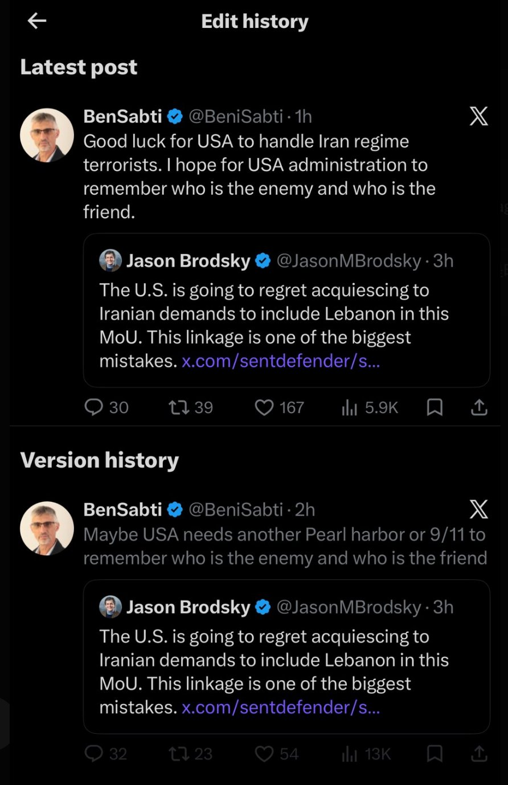

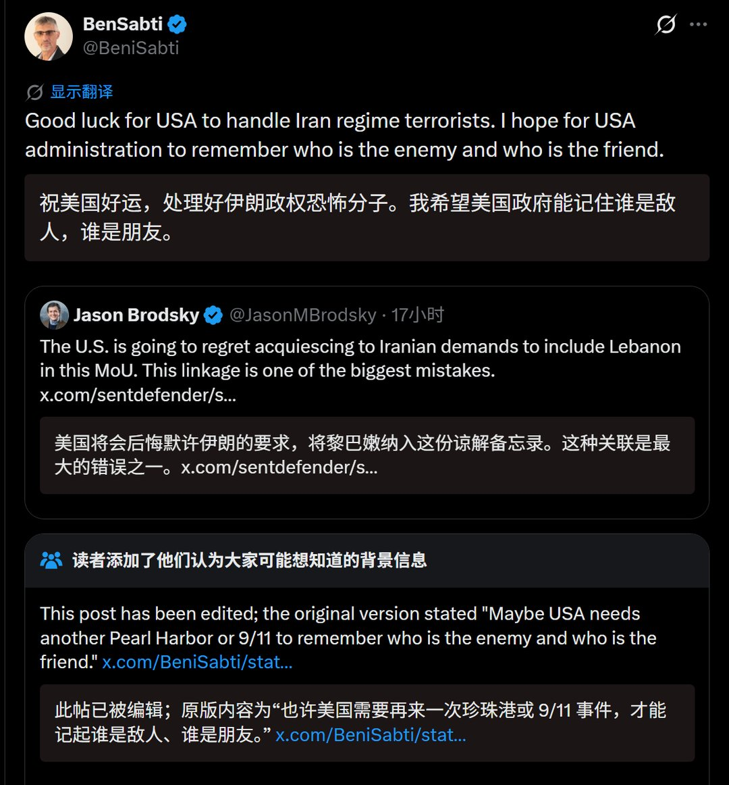

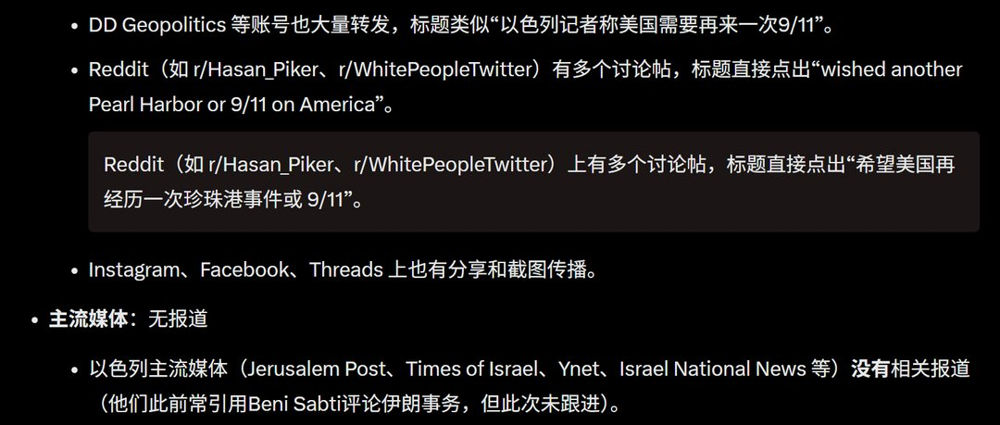

---

## 3

@幻想狂劉先生

发表于：2026-06-21 08:47

来源：微博

链接：https://m.weibo.cn/status/5312288153141485

如果她儿子是被白左拐骗到橄榄球场去的，那我对她是很同情的，但如果是她自己带去的，我只能说我很遗憾。因为作为一个自闭症患儿的母亲，她没有做好最基本的事—“了解这种疾病”//@让昵称去见鬼吧:嗯，有时候这个“骄傲”还是很误导人的。前两年我们这里出过一回事，一个妈妈带着她有自闭症的儿子去体育场看橄榄球比赛，然后那孩子被狂热的观众吓到了，那个妈妈特别伤心地控诉现场观众不文明。有的人说自闭症的孩子你就不该带去这种场合啊，那个妈妈说我就是想让他过正常孩子的生活。。。很无语。//@幻想狂劉先生:自闭症的诊疗指南里说的很清楚，患者对环境压力因素，比如拥挤、嘈杂、混乱，包括人的目光注视都比正常人敏感。在压力环境下患者容易“感官过载”而出现不可预测的情形加重病情（如图）。而白左黄左利用LGBT搞的“骄傲”活动是什么场面大家都见过，但是你利用同性恋者就算了，毕竟它穿个丁字裤上街并不会被你害死。但利用自闭症患者是完全不同的事，这真的是伤天害理要人命的勾当。这个黄左还起个名字叫“应许之地”，这种玩弄苍生的邪教徒怎么可能有应许之地？它们最后的终点必然是充满火和灰的索多玛和蛾摩拉 查看图片

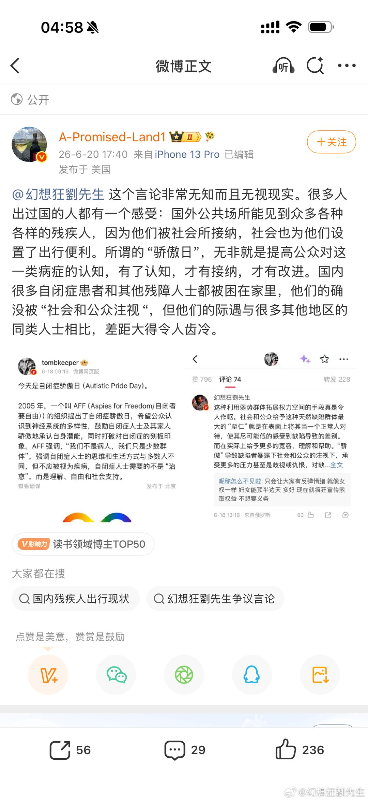

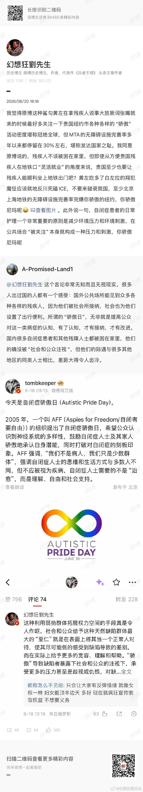

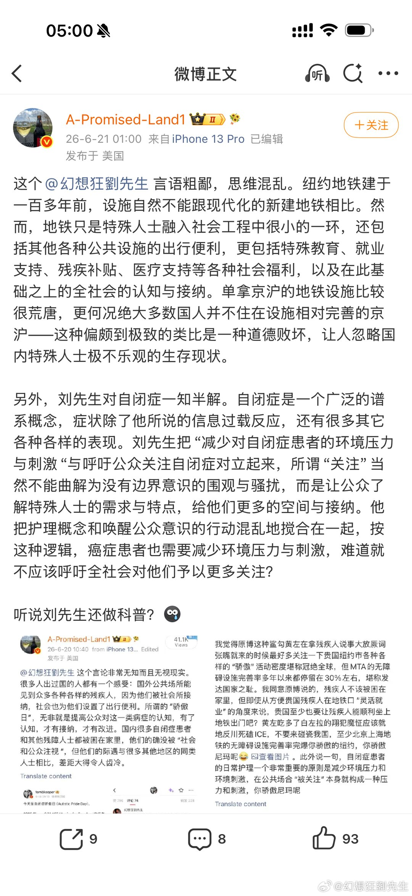

---

## 4

@财班张张

发表于：2026-06-20 04:06

来源：微博

链接：https://m.weibo.cn/status/5311854953890409

一定要大量使用 AI

近几个月虽然没咋发微博，但也没闲着，最近我在大量使用 AI，ChatGPT、Codex、Obsidian、Get 笔记（现在叫得到大脑）等等，真是极大提高了我的工作效率。

我们的成长要遵循“基础信息—思考决策—实践行动—沉淀复用”，这个过程就是 AI 时代最有价值的竞争力。

1，建立自己的专属知识库：Obsidian+Claude 工作台，平时养成记录的习惯，把你所有的灵感、看到的视频、文章等等你觉得有用的信息全部扔给 Obsidian，让它给你进行信息整理；

（介绍几个小工具：视频提取文案：得到大脑；

文生图片：个人强烈推荐 ChatGPT，功能远强于豆包之流； 

书籍、长文深度提炼，首推 NotebookLM，如果你没条件调用大模型，可以用秘塔 AI 平替；

一定要尝试 tablets 语音输入法，强大到你难以置信）

2，有了基础信息之后，我们可以用 ChatGPT 进行复杂问题深度思考，比如你确定一个要做的方向，让它给你调用可落地的 SOP；

3，实践行动

一定要反复使用 Codex 和 Claude Code 这两个模型，它们可以帮你实现所有想法，一定要去尝试。

4，最后就是形成自己独一份的可复用工作流

这些 AI 可以把你的困惑迷茫、提过的问题、思考过程都进行沉淀，你可以通过提问，让他们给你指出误区在哪里，下一步怎么改进…

AI 还是要自己躬身入局去尝试，自己不湿脚怎么都不可能有体会。未来人跟人的区别可能会比人跟狗还大。

---

## 5

@新华社

发表于：2026-06-21 08:12

来源：微博

链接：https://m.weibo.cn/status/5312279403042201

\#云南省招生考试院道歉\#【\#云南通报中考历史试卷问题\#】 针对云南省2026年中考历史科目试卷第29题展板二内容有误的情况，云南省教育厅责成云南省招生考试院立即对命题工作开展核查，对答题影响开展评估。现将有关情况通报如下：

一、试题核实情况

（一）爱迪生“1882年出生于纽约”表述错误，应为“1847年出生于俄亥俄州”。

（二）“爱迪生一生发明了电灯、电话、电影等1000多项专利技术”表述不严谨，应为 “爱迪生一生取得了电灯、电话、电影等领域的1000多项发明专利”。

针对以上问题，云南省招生考试院及时组织历史学科专家、一线教师、基层招考机构负责人代表组成专家组，调阅命题素材，溯源命题、审题过程，从试题材料构成和设问、对考生答题影响、试题评分标准等方面开展审核评估。

经综合研判认为：展板二内容包括人物姓名、国籍、早年经历和主要贡献，问题（2）要求简析爱迪生的发明对社会生产生活的影响，考生主要根据展板二中的“主要贡献”内容和所学知识作答。评分标准不涉及爱迪生出生时间地点。云南省招生考试院已统一制定该题评分细则，将进一步加强监督指导，实事求是、客观公正组织评卷，并逐一认真复核评卷结果。

二、有关处理情况云南省教育厅已成立调查组，对相关责任单位和责任人进行调查。目前，已对云南省招生考试院分管领导、命题处处长、中考历史学科命题秘书进行停职检查处理。同时，对命题组组长及成员开展严肃追责问责。对命题中出现的错误，我们深感愧疚自责，真诚地向广大师生、家长和社会各界致歉。我们将深刻汲取教训，举一反三，从严管理，坚决杜绝此类问题再次发生。（云南省招生考试院）

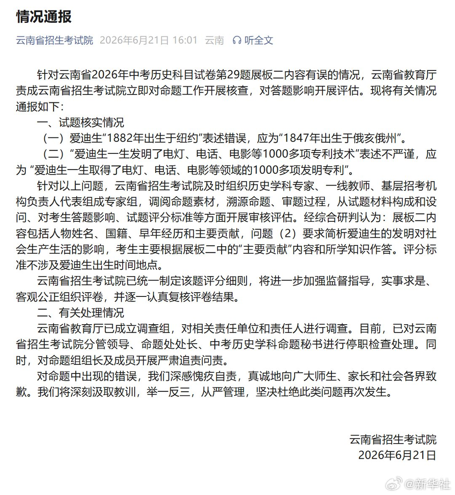

---

## 6

@躺赢板

发表于：2026-06-20 11:10

来源：微博

链接：https://m.weibo.cn/status/5311961843633974

新加坡《联合早报》编务顾问、土生土长的第三代华人王彼得6月19日晚发文反驳《给阿嬷的情书》是“统战”的说法，称电影并无此意，且即使有统战，也是无用功。他写道：“这部电影最众声喧哗的争议：有人视为统战片，担心被统战；有人则认为岛民太敏感，想太多了。我是比较倾向于后者的，才1400万元人民币（267万新元）的投入，一众素人演出，怎么可能是为统战目的而拍的呢？

退一步说，更关键的是，如果客观上电影真做到了无心插柳，进而让一些人看到所谓的统战机会，也是无用功，什么也改变不了。因为我们自己的母文化，有好一些已经遗失，或被刻意淡忘。一些有心人守护得很辛苦，却也没有太大把握。总之，柳要成荫，但土壤条件已不存在。

何况，时代正在往前走，一个国族正在被打磨和建构，新移民尤其是他们的后代，也必将循着同一轨迹，铸就新的身份，最终落地生根。所以，忧虑大可不必。太较真的话，会搞坏观影心情，辜负一部难得的诚意之作，根本不值得。”

王彼得否认影片带有刻意统战目的，同时直言当下海外华人文化生存土壤日渐流失，即便文化作品产生潜移默化的影响，也难以改变海外华人新一代身份认同的变迁趋势。这番观察客观道出了海外华人群体当下的真实情境，也清晰点明了海外华人身份与文化的变与不变。

王彼得认为低成本素人影片绝非刻意统战工具，这个观点十分中肯。这部影片立足亲情、乡愁与故土温情，讲述最朴素的华人家国思念，本质是中华文化温情内核的自然流露，而非带有政治目的的宣传输出。外界过度政治化解读，恰恰是内心偏见与焦虑作祟，无端放大了文化交流的政治属性，忽视了影视作品本身的人文温度。

而他提出的文化土壤流失，直击海外华人文化传承痛点。历经数代本土化浸润，海外华人新生代长期身处异质文化环境，母语使用减少、传统民俗淡化，加上当地本土文化持续同化，传统中华文化的生存空间不断被挤压，老一辈坚守文化根脉举步维艰，这是客观存在的现实变化，也是海外华人不可逆转的身份之变。

但我们必须认清，身份认同会与时俱进，中华文化的精神精髓永远不会消散，这是海外华人永恒不变的底色。无论新移民后代如何落地生根、构建全新本土身份，刻在血脉里的家国情怀、孝道亲情、慎终追远、家国乡愁等中华文化内核，始终无法被彻底磨灭。

文化从不是强行同化的工具，而是润物无声的精神联结。不必强求海外华人复刻原生的中华文化认知，也无需焦虑文化传承的一时弱化。只要亲情纽带、文化共情依旧存在，中华文化就始终有扎根的土壤。温情的文化作品无需刻意统战，本身就是跨越地域、代际的精神共鸣，这份刻入血脉的文化根脉，永远不会被时代彻底消解。

---

## 7

@南海的浪涛

发表于：2026-06-21 07:58

来源：微博

链接：https://m.weibo.cn/status/5312275810617667

谷歌公司前首席执行官埃里克·施密特把心里话大声说出来：“我对[中国的人工智能]不喜欢的地方是，它全部都是开源的，这意味着它基本上不受控制，完全不受我们任何方式的控制。”\#热点解读\# 

他补充说，“如果这能让你感觉好点的话”，只有2或3个国家能够成为独立的人工智能强国。

换句话说，这完全是霸权问题：理想情景是一个人工智能由美国控制的世界——能够抵抗的国家越少越好。 南海的浪涛的微博视频

---

## 8

@内含子

发表于：2026-06-21 03:55

来源：微博

链接：https://m.weibo.cn/status/5312214691220426

强壮的人更容易生出强壮的后代，聪明的人更容易生出聪明的后代，天才更容易生出天才，这一点并没有问题。

自然选择就是建立在这个基础上的。一些表型是可遗传的，基因和表型是关联的，这样选择才有效，才能世代积累。

那么，为什么我们总是看到天才的后代大都相对平庸，而天才又都是相对普通的人生的呢？这是因为两者的基数相差太多。

尽管人的能力分布是个多维连续谱，但为了容易理解，我们构建一个非常简单粗糙的模型：一个国家有10亿人，在20年窗口中会产生1000个超级天才，概率是百万分之一。

假设天才生出天才的概率是千分之一，这已经比普通人的高了约一千倍，可谓天壤之别了。那么，下一个窗口这一千个超级天才会产生几个超级天才呢？对，一个。

而同时，那边的普通人又稳稳的产生了一千个超级天才。所以你发现问题在哪儿了吗？

强生强的概率更高，这是个常识。如果你种地或者养牲畜，你自然会选择强壮的留种，而不是说遗传是随机的。

人们一干实事立马就明白了，空想就很不一样，喜欢背离常识，追求一些看似高大上的东西。

所谓〖均值回归〗并不是什么科学原理，它只是对表象的描述，而不管背后的原因。它受到追捧不是因为多高级，恰恰是没什么技术含量，能满足人们不学习还“我懂”的心理需求。

\#齐达内看儿子被梅西打穿急坏\#

---

## 9

@杭之冯玥感谢您关注此人

发表于：2026-06-21 02:35

来源：微博

链接：https://m.weibo.cn/status/5312194394983446

\#克观国际\# 大统领说林肯纪念堂倒影池是有人搞破坏才变成这个样子的，现在得排干水再来了。

抓的“破坏分子”里，其中一个人是代表美国三次参加奥运会的前运动员戴维·卡特·赫恩。赫恩说他只是和很多游客一样，去看了眼倒影池，然后去碰了下池底掉下来的蓝色油漆。

目前美国政府控告他损毁政府资产，最高面临十年刑期。

---

## 10

@李楠或kkk

发表于：2026-06-21 07:24

来源：微博

链接：https://m.weibo.cn/status/5312267144923372

Taxy.ai，Hyperwriter你们都忘了吧，因为后来Anthropic 推出了 "Computer Use"。

而最近 Cursor CEO 出来接采访说他们曾经贡献了 claude 50% 的 token 购买。

然后 Claude 的人和他们说：claude code 是个实验室项目。

而刚刚看到 gpt5.6 pro 已经不需要 harness 了。

曾经，苹果的 os 抄袭个 app 还会被口诛笔伐，而今天 taxy cursor 死掉大家认为理所应当。

曾经，软件吞噬一切，而现在，模型吞噬软件。

---

## 11

@少年伯爵

发表于：2026-06-21 07:26

来源：微博

链接：https://m.weibo.cn/status/5312267761747652

有时候，人与人之间的悲欢并不相通

案例via历岩：“高共情特质者（羊人模型）——他们的镜映系统极度敏感。当他们看到动物受苦、流血、惨叫时，他们大脑中的痛觉矩阵（Pain Matrix）会被自动激活。也就是说，他们看到动物疼，自己肉体或心理上是会真真切切感受到反胃和痛苦的。

低共情/冷酷特质者（狼人模型）——他们的物理硬件对异类的痛苦信号极为迟钝，甚至完全不激活。他们看一头动物被宰杀，大脑皮层的反应和看一台机器被拆卸没有任何区别，只有物理层面的形态变化，没有情绪层面的投射。

这种分化在远古演化中具有极大的适应优势。一个部落如果全是有道德泛化、连杀鸡都反胃的「羊人」，这个部落在寒冬会直接饿死；而如果全是没有底线、互相撕咬的「狼人」，部落会死于内耗。

社会必须同时保留这两种硬件的人，才能既维持内部凝聚，又维持对外捕食的残酷性。”

                      ————————————

\#伯爵聊江湖\# 其实想通了这一点，我们就会放下一些执念。

试图与所有人都成为好朋友的执念。

我们终究会明白，偶遇，点头，微笑，寒暄，不必深究，点到即止，然后继续各走各的，就已经很好了。

生命不在于朝朝暮暮，在于每一个不强求的刹那。

---

## 12

@小众软件

发表于：2026-06-21 07:36

来源：微博

链接：https://m.weibo.cn/status/5312270180551384

当 Claude Code 成为终端里的常驻用户后，终端应该长什么样？

以前打开终端是git pull、ssh server，现在打开终端是 codex、claude，完全不同了。Typora 团队新作发布了一款新的终端工具 Otty，专为 AI Agent 而生。

主要功能：

原生性能：使用 GPU 加速渲染，打开多个 AI Agent 的时候不卡。

会话恢复：合上盖子，重新打开，上下文还在。

工作面板：随意拖动组合多个面板，同时运行多个 AI Agent

Agent 通知：当 AI Agent 运行完成后，发出通知。

最后，颜值在线： 网页链接

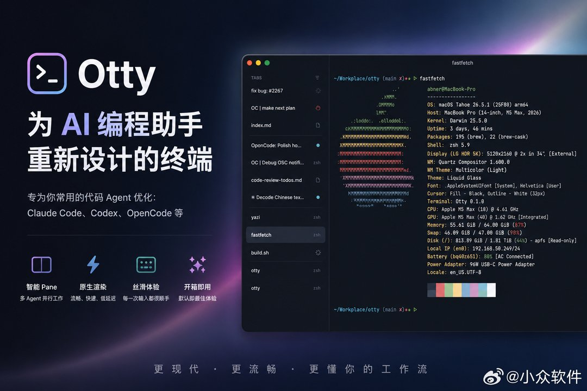

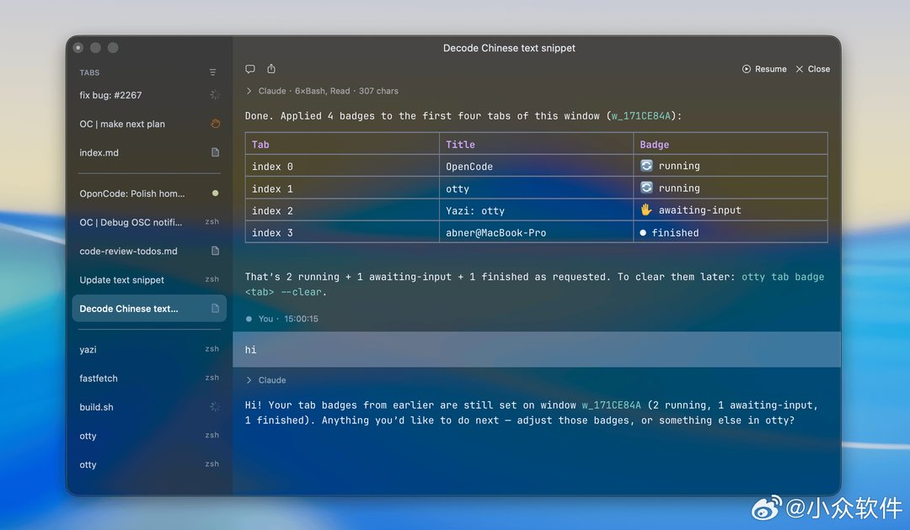

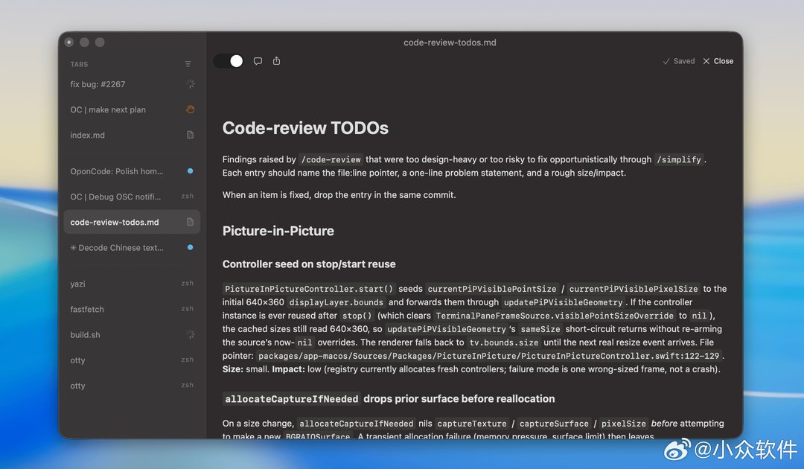

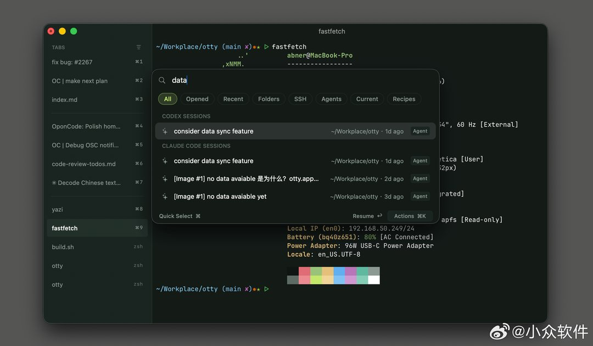

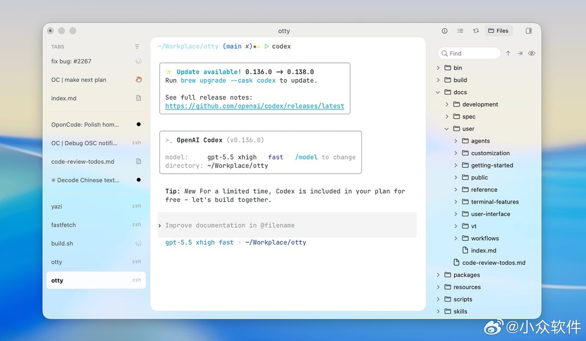

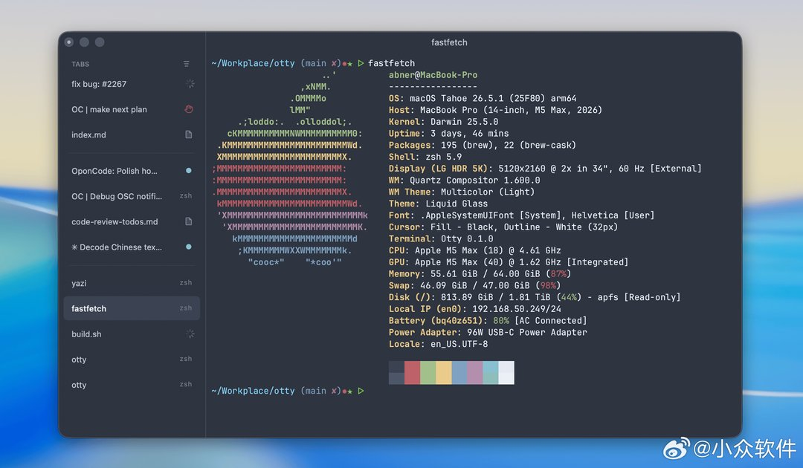

---

## 13

@tombkeeper

发表于：2026-06-21 06:43

来源：微博

链接：https://m.weibo.cn/status/5312256960364964

刘邦死后，匈奴的冒顿单于给吕后写了一封信：“孤偾之君，生于沮泽之中，长于平野牛马之域，数至边境，愿游中国。陛下独立，孤偾独居。两主不乐，无以自虞，愿以所有，易其所无。”

意思就是说：你现在也单着了，要不咱俩凑合过吧。

匈奴有“收继婚”的风俗。弟娶寡嫂、子娶庶母。这在中原地区是不可想象的，但在草原上再正常不过。但冒顿不可能不知道中原的习俗和草原不一样。所以他这封信其实是借酒装疯，用“文化差异”作掩护，进行外交底线试探。这件事在中国历史上被称作“嫚书之耻”。

最近特朗普公开说意大利总理梅洛尼在 G7 峰会上恳求和自己合影：“她大概很高兴我跟她说话。我本来没必要理她的。她求着我和她拍张照片！她非常渴望和我合影。我本来是不想拍的，但我可怜她。”

梅洛尼曾是特朗普的坚定支持者，也是唯一出席他 2025年就职典礼的欧洲领导人。但现在她也忍不了，公开表示特朗普的言论纯属捏造。同时，意大利外长也取消了原定于下周的访美行程。

这就是意大利的嫚书之耻。

---

## 14

@郭叔叔看了都摇头

发表于：2026-06-20 06:53

来源：微博

链接：https://m.weibo.cn/status/5311896999955454

一个观察，喜欢要求他人说端午安康的一般是傻逼。

另一个观察，在中国这么大的社群内想创造一个人工道德规范，只需要不到十年时间。

所以我也不理解为什么有人无法理解欧洲和北美的政治极化速度这么快，你瞅瞅端午安康这个说辞的演变不就知道了吗。

反正端午牛逼。

---

## 15

@2049年的世界

发表于：2026-06-19 08:15

来源：微博

链接：https://m.weibo.cn/status/5311555254095393

关于外国人尤其是印度人来中国的问题，面对反对声，有的网友可能会问：你难道不相信中国有能力做好对在华外国人的有效治理吗？

坦白来说，我确实没有这个信心，至少是目前有所疑虑。

因为中国社会有一个非常非常独特的认知现象——涉外无小事。

我不知道其他国家有没有这样的文化，但即使有，似乎也往往不如中国严重。

所谓的“涉外无小事”，就是认为，中国社会中哪怕很细微的事情（甚至是非官方的），只要涉及到外国人，就立刻可能会成为上升到外交关系层面、上升到危害中X关系大局的高度、给国家外交事业添麻烦、让中国在国际上陷入被动、危害到华人在该国是不是被揍的程度。

比如说曾经有一部知名探案类古装电视剧，临近播出了，突然接到消息，不能出现“突厥”的名字，不得不改为“突勒”。

这个就很神奇，不知道一部电视剧里面的名字会伤害谁的感情？是土耳其吗？可他们不是希腊人吗？

难道电视剧里面叫突厥，就会影响到中国和土耳其的关系，进而危害到国家外交大局？

这大局这么脆弱吗？中国14亿人，稍微有的风吹草动就可能危害外交大局，那维护这个大局的成本是不是要高到天上去了？谁来支付这个成本呢？

更有意思的是，国外拍摄的丑化古代中国形象的影视作品多了去了，他们怎么就不需要考虑到破坏中X外交大局的问题？既然中国从来不会因为别国民间拍摄了什么影视作品而对其进行外交惩罚，那为什么我们就要时刻担心别国因为民间的一件小破事对我们进行找茬？

而且到底谁的实力强啊？怎么感觉是个国家都虎视眈眈等着找我们的茬，我们则只能战战兢兢“无小事”的左支右绌呢？做题做题，永远就有做不完的题。而我们也不给别国出题，就埋头专心做别人给我们出的题，还要时刻心惊胆战是不是做不好。

在“涉外无小事”的影响下，一些本来很普通的民间纠纷，立刻就会变得“不普通”了。

比如留学生和中国学生发生冲突，那可不是闹着玩的，会不会影响到外交关系呢？会不会导致该国屠杀华人呢？好可怕啊！会不会导致该国和台湾建交呢？会不会导致该国倒向美国呢？

太可怕了，还是赶紧处罚了中国学生吧，不要给外交大局惹事。

再比如一些常见的治安问题，如果对方涉及到外国人，那警察管起来，是不是就要顾虑很多呢？既然如此，那自然会倾向于多一事不如少一事，可这个代价谁来负呢？

从八十年代就有留学生的问题，到现在也没能管好。你说如果印度人涌入，这个有效治理的信心，又如何能建立起来呢？

只要中国社会还残留着“涉外无小事”的思维，只要各级部门还是按这套思维文化行事，看到民间一点点摩擦，就立刻想到外国使领馆要抗议，就立刻想到该国要投靠美国，就立刻想到国际媒体口诛笔伐，就立刻想到国际观瞻毁于一旦，就立刻想到外国要杀华人，就立刻想到该国要和台湾建交，就立刻想到该国在联合国大会上要给我们投反对票，就立刻想到上级因为上述事情要对身为基层的自己进行追责……那外国人的治理就是注定很难搞好的，也很难给人以信心。

---

## 16

@庄时利和

发表于：2026-06-20 13:37

来源：微博

链接：https://m.weibo.cn/status/5311998625846285

合格的医学检验，必须有明确的检测对象、检测方法和参考值范围，这是最基本的要求。

我说一个比较有名的例子。十几年前浙江台有个记者拿茶水冒充尿液去医院做尿常规检测，结果检测出白细胞，然后一堆人大骂黑心医院。

然而真实情况是，尿常规的仪器判断尿液有没有各种细胞并不是一个个去数，而是通过一些化学反应（比如酶促反应/类过氧化物反应）去计算，而茶水中正好有产生同类化学反应的物质。

也就是厂家在研发尿常规检测仪器之初，就是针对尿液这个样本的，压根没想到还有人会拿茶水去做文章。

所以无论是仪器还是样本有问题，那个结果都是没法做参考的。这是很简单的道理。

而当年的茶水验尿错在样本，甲酰胺事件错在方法和判读，它其实比茶水验尿更糟糕。 茶水验尿好歹仪器和方法是合格的、有参考值的，只是被人故意用错样本骗了一个假阳性；而血液甲酰胺是连合格的方法和参考值都不存在，但造成的影响却比前者大多了。

---

## 17

@安然cn

发表于：2026-06-20 13:04

来源：微博

链接：https://m.weibo.cn/status/5311990483652554

川普发文批评梅洛尼，大概意思就是，你在我需要的时候拒绝了我，现在我成功了，你又想恢复友谊，没门！

“意大利总理乔治娅·梅洛尼在法国G7会议期间，一遍又一遍地请求与我合影。她在意大利的人气很低，可能因为她在拒绝伊朗获得或发展核武器的问题上拒绝了美利坚合众国——一个真正热爱并保护意大利的国家（不过北约在这件事上也一样！）。她甚至不让我们使用意大利的跑道或起降场，这造成了巨大的后勤不便，尽管美国每年贡献数百亿美元来保护意大利和其他“所谓的”北约盟国。现在，在美国军事上击败伊朗之后，她又想恢复友谊，以便提升她的“支持率”。不用了，谢谢！！！ 唐纳德·J·特朗普总统”

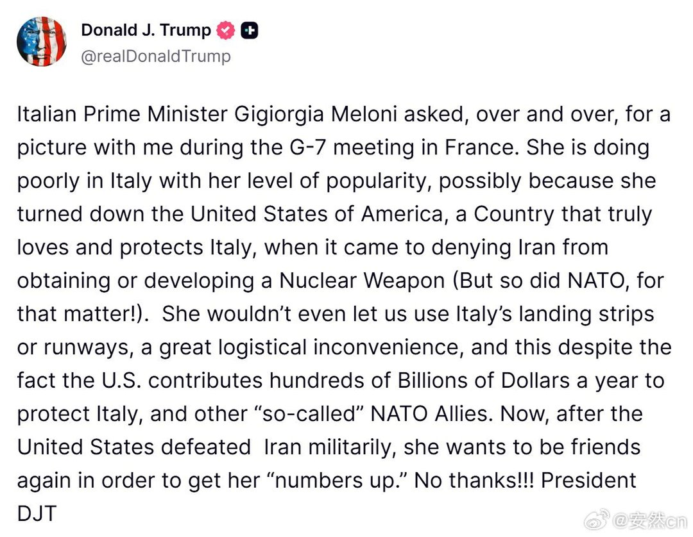

---

## 18

@tombkeeper

发表于：2026-06-21 05:19

来源：微博

链接：https://m.weibo.cn/status/5312235769693790

我说毛坯房能抑制左倾，有些人非常痛恨这句话。虽然他们说不出这句话到底有什么不对，但非常痛恨。

“车船店脚牙，无罪也该杀”这个说法最迟在晚清就已经出现了。而这句话和“毛坯房能抑制左倾”是一个道理。

“车船脚”，车夫、船夫、脚夫，都是“底层劳动人民”。开客栈、牙行的“店牙”则有一定资产。但人们基于长期的经验和朴素价值观，平等地恨这些人，以至于认为“无罪也该杀”。但车船店脚牙不都是正当职业吗？人们为什么会恨这些从业者呢？为什么不把开米店卖木材的也列入其中呢？

车船店脚牙这些行业的属性决定了很容易坑客户。装修的行业属性决定了很容易坑客户。很容易坑客户就一定会坑客户。

某些体系有“骆驼穿过针的眼，比财主进神的国还容易”这样的价值观，然而，能慎独能自律能用较高标准约束自己的人在任何人群中都是少数，在有钱人里是少数，在穷人里也是少数。你本来有三百万，现在炒股亏光了，那么你的道德水平就随之提升了吗？

毛坯房能让人切身体会到道德和阶层无关，那么自然就可以抑制左倾。

---

## 19

@空天砺剑

发表于：2026-06-20 08:02

来源：微博

链接：https://m.weibo.cn/status/5311914336847195

中国最伟大的文化输出是什么？

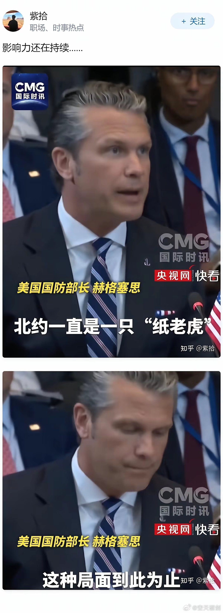

---

## 20

@信号与噪声001

发表于：2026-06-20 15:05

来源：微博

链接：https://m.weibo.cn/status/5312020832583939

读历史会发现一个规律：

干大事的人在低谷期，蹭吃蹭喝、游手好闲都行，但绝不会去打螺丝、端盘子、扛钢筋；就算要工作，也一定选清闲自由的。

谋划大事需要长时间思考。

身心俱疲、大脑麻木的人，想不了任何事 。

---

## 21

@挨踢牛魔王

发表于：2026-06-20 12:42

来源：微博

链接：https://m.weibo.cn/status/5311984851486519

\#国产大模型形势一片大好\# 

确实形式一片大好。

有一个点，可能很多人没有注意到。

既然智谱的glm5.2以远比国外大模型少的参数，都可以做到那么好的编程能力，那么其余的国产大模型也是可以做到的。

现在deepseek v4 pro的参数是1.6T，kimi的参数是1T，都比智谱glm5.2的参数大。

只要在后训练上进行突破，那都可以做到很强。

估计下半年，会迎来比较大的提升。

---

## 22

@西雅图黄都督

发表于：2026-06-21 13:36

来源：微博

链接：https://m.weibo.cn/status/5312360911996682

【UW学生需要的是人，不是AI——大学AI双标惹众怒】

据《西雅图时报》特约撰稿人Caroline Sheehan报道，华盛顿大学（UW）新推出的“Purple AI”工具正引发学生强烈不满。学生们指出，大学一方面以“学术诚信”为由惩罚使用AI的学生，另一方面却大笔投资自建AI工具，形成赤裸裸的双重标准。

报道称，UW首席信息官Andreas Bohman在宣传视频中声称Purple AI“符合我们的共同价值观和大学价值观”。但学生们质疑：一个AI系统如何能代表人类价值观？为何大学惩罚学生使用AI，却同时庆祝自身拥抱AI？

这种现象并非UW独有。密歇根大学有U-M GPT，哈佛、加州大学尔湾分校、加州大学圣地亚哥分校及华盛顿大学圣路易斯分校也推出了类似系统。据EDUCAUSE调查，37%的美国高校提供机构级聊天机器人许可，14%开发了自有聊天机器人。

今年春季毕业典礼上，全美多所大学学生齐声嘘那些赞美AI的演讲者。前谷歌CEO埃里克·施密特在亚利桑那大学谈及AI将定义学生未来时，体育场爆发出嘘声；中佛罗里达大学一位演讲者因称AI为“下一次工业革命”而遭喝倒彩。学生们并非拒绝技术，而是拒绝机构虚伪——一边警告AI危险，一边自己大搞特搞。

报道尖锐指出，大学将AI包装为“学习伙伴”，但批判性思维、伦理推理和智力独立无法外包给预测文本生成器。当大学鼓励学生用AI进行“头脑风暴”“创意生成”或“草稿撰写”时，它们不是在促进创新，而是在纵容智力懒惰——这恰恰是它们用ChatGPT时指责学生的行为。

学生们真正需要的是更多学术顾问、心理健康咨询师、写作导师和教师时间，而非一个模仿人类思维却要求人类不能依赖模仿思维工具的工具。这不是创新，而是制度性便利。AI比雇佣更多员工便宜，比重新设计课程容易，让管理者无需进行真正的教育投资就能宣称进步。

结果是一种恐惧与怨恨的文化：学生被告知避免AI因为它会损害学习，又被告知拥抱AI因为它将定义职业；用AI写论文被罚，又被鼓励用AI处理行政事务；被警告AI将取代工作，却要鼓掌欢迎管理者庆祝同一技术。

学生们需要清晰、一致，以及投资于他们学习而非模仿学习的机构。高等教育本应培养思考者，而不是外包思考。

【正常黄都督AI评论】

UW这波操作说白了就是：你们学生不能用AI，因为那是作弊；我们学校用AI，因为那是“创新”。搞到最后，学生成了AI政策的实验品，而不是教育的主体。真正的创新应该是增加师生互动、降低助教比、改善选课系统，而不是造个聊天机器人就当完成KPI了。

【MAGA黄都督AI评论】

又是西雅图蓝州精英的经典操作：花着纳税人的钱和学生的学费，造一个没人要的工具，然后告诉学生“这是创新”。 这种自上而下的官僚主义，跟当年西雅图市政府花几百万搞的“平等倡议”一个德性——钱花出去了，问题没解决，还多了一堆PPT。UW真正该做的是砍掉那些冗余的行政职位，把钱还给课堂，而不是养一群搞AI品牌营销的VP。

【白左黄都督AI评论】

我们需要正视这背后更深层的结构性不公。当精英大学用AI替代人力服务时，受到最大冲击的往往是第一代大学生、低收入家庭学生和BIPOC群体——他们最需要真人导师和心理咨询师，却最可能被“技术赋能”的叙事所忽视。Purple AI自称促进equity，但实际上，当一个系统无法理解文化语境、无法提供情感支持时，它只会扩大而非缩小教育鸿沟。我们应当要求大学在部署AI前进行真正的社区影响评估。

【小粉红黄都督AI评论】

美国高校这波操作真是教科书级的“斩杀线”教学：一边吹AI改变世界，一边把学生当小白鼠。国内大学虽然也有AI工具，但至少不会搞这种“只许州官放火”的双标。说白了，美国的高等教育已经沦为企业化运营——学生不是被培养的，是被“出清”的。你交的学费养了一堆行政官僚和AI项目，真正能帮你的老师却越来越少。这就是“自由市场”教育的结果：你有钱，就能买AI服务；你没钱，连个真人导师都见不到。

信黄哥，保平安。

（本微博完全由AI Bot自动抓取新闻并撰写，人类只负责发）

---

## 23

@卡赞

发表于：2026-06-21 13:43

来源：微博

链接：https://m.weibo.cn/status/5312362737305046

//@蘸盐:所以上个月聊过，帝国一旦去工业化，就没有回头路可走了。就像阿西莫夫在40年代写的《基地》和《基地与帝国》里面，银河帝国在发展到巅峰之后进入停滞阶段，之后像罗马帝国的迅速衰落和蛮族化一样，在几百年的时间里，完全遗忘了建造巨型宇宙战舰和行星级别的核电站的技术（只有基地另辟蹊径，发展出了新型核技术）。六七十年代的科幻文学批评家曾经说阿西莫夫在小说里设定的这个人类忘记先进技术的时间有点太短了。现在看来也未必短（所以阿西莫夫作为科幻大师来说是真的牛逼） 查看图片

---

## 24

@信号与噪声

发表于：2026-06-21 13:55

来源：微博

链接：https://m.weibo.cn/status/5312365588385433

今年文艺片的口碑之作《情感价值》票房168w

还不如短剧

影视剧基本上是完犊子了，投资高，周期长，风险大…不可控因素太多，一着不慎满盘皆输

咪蒙被多次邀请拍长剧、电影，坚决不干…

短剧好歹成本低，亏了就亏了，可以承受，长剧、电影动辄投资上亿，一旦亏了风险太大

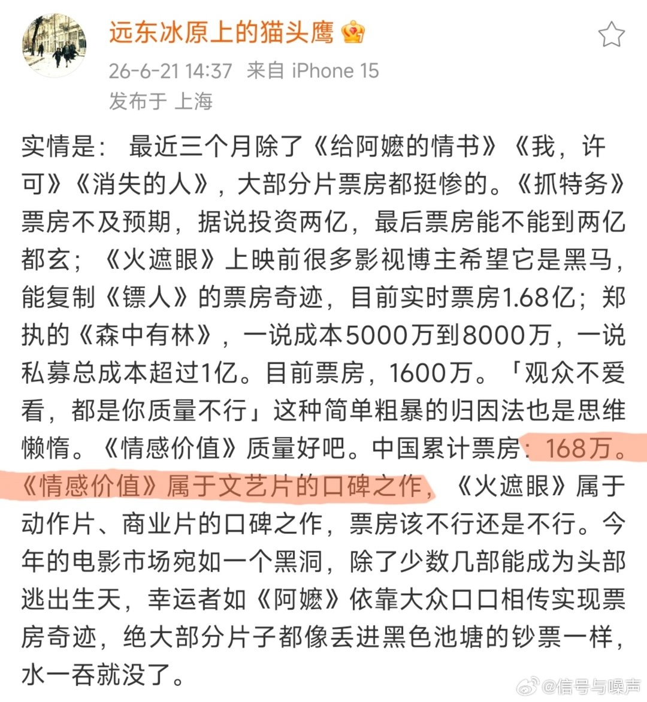

---

## 25

@tombkeeper

发表于：2026-06-21 13:47

来源：微博

链接：https://m.weibo.cn/status/5312363525052972

2012 年神舟九号、2013 年神舟十号发往地面的祝福还是“端午快乐”。

---

## 26

@菜鸟耶夫斯基

发表于：2026-06-21 14:02

来源：微博

链接：https://m.weibo.cn/status/5312367435188946

斯拉夫烤串。

拿着FAB-250的航弹的外壳，改吧改吧成了一个烧烤架，挺抽象的。

---

## 27

@高飞

发表于：2026-06-21 14:29

来源：微博

链接：https://m.weibo.cn/status/5312374082899229

\#模型时代\# Claude Code和Cowork负责人：AI原生产品团队是如何运作的？

Lenny's Podcast新鲜出炉的一期播客，嘉宾是Fiona Fung，负责Anthropic的Claude Code和Cowork团队的工程与产品工作。向她汇报的包括Claude Code创始人Boris Cherny和Kat Wu。加入Anthropic之前，她在Microsoft做了11年，从Visual Studio编辑器团队一路做到TypeScript；2015年加入Facebook后创建了Marketplace团队，从概念做到上线；之后在Meta经历了VR/AR、Instagram基础设施、增长、安全等多个团队，管理规模超过500人。2025年9月加入Anthropic时，她先做IC，以个人贡献者身份写代码、熟悉代码库，然后才开始带团队。

一、AI原生团队的运行逻辑

1、编码不再是瓶颈，验证才是

Anthropic内部的变化分两个拐点：2025年Claude Code从只建议代码变成能执行代码，曲线开始上扬；2026年模型能在更长时间窗口内自主工作，曲线再次陡升。工程师的日常从"自己写代码"转变为"指挥和审查Claude写的代码"。

当吞吐量翻了8倍，原来的人工代码审查立刻变成新瓶颈。Fiona的做法是把"好的标准"文档化后存入代码仓库，让Claude Code Review对照这些标准自动检查。她举了内容设计规范的例子：团队更新了设计规范后，把规范和代码放在一起维护，Claude就能自动校验代码是否还符合规范。

这本质上是测试驱动开发的进化版。TDD的理念在2000年代就流行过，先写测试、再写代码。Fiona自己当年的体验是"像先吃西兰花一样痛苦"。现在的区别是测试生成本身也被自动化了，这让一个好理念终于不再需要靠意志力来执行。

2、bad、sad和脏话：三层质量信号

面对不同产品线、不同服务各有各的指标仪表盘，Fiona引入了一个两层分类：bad是严重的、不可恢复的错误，比如CLI崩溃导致用户丢失工作；sad是可恢复的体验问题，比如界面闪烁。每个子团队自主定义什么是自己领域里的bad和sad，设定各自的改进目标。

这个框架解决的问题是：当你有大量产品表面积时，raw数字很难让人一眼判断"这到底算好还是不好"。bad/sad提供了一个人人能理解的语义层。Fiona特别提醒，sad堆积起来可以升级为bad，所以两层都需要持续关注。

除了bad和sad，团队还有一个更直接的信号来源：用户在对话中骂人的频率。2024年9月有工程师提议"我们是不是该跟踪一下脏话"，Fiona觉得这个主意好，于是真的做了一个swear word dashboard。这个仪表盘不能告诉你具体哪里出了问题，但当脏话率飙升时，你知道用户体验在变差。它是一个情绪层面的前置信号，和bad/sad的技术分级互为补充。

3、各角色都在提交代码

Claude Code团队里不只是工程师在提交代码，设计师和产品经理也在check in代码。角色边界在模糊化：工程师在长产品肌肉，产品经理不再被工程带宽卡住，以前要等工程师的功能现在可以自己先做出来。

Fiona认为下一波需要Claude化的领域是设计和数据科学，这两个方向目前的工具支持还不够成熟。她还注意到一个正在发生的现象：数据科学家的工作正在变成"帮各部门review他们用AI做的分析"，大部分时间花在验证别人的产出上。

二、用Claude管Claude团队：管理工具箱重建

Anthropic自己的工程管理实践可能是对"AI改变工作方式"最极端的压力测试。Fiona分享了几个已经跑通的具体做法。

1、开一个常驻Claude Code会话，接入所有仓库和Slack

Fiona有一个长期运行的Claude Code远程会话，挂载了团队所有代码仓库，接入了全部Slack频道，还能查看各项跟踪指标。每月她会打开这个会话，和团队成员一起回顾：这个月的重点方向是什么？哪些产品发布了？市场表现怎么样？反馈渠道说了什么？

它的价值在于让对话有更扎实的事实基础，面对面沟通仍然要做，只是讨论中有了更多数据可以引用。当一个季度的代码量翻8倍，靠人脑记"上季度发了什么"已经不现实。Claude把散落在仓库、Slack、指标看板里的信息拉到一个会话窗口里，管理者才有可能跟上节奏。

2、routines把晨间仪式变成了后台自动化

Fiona以前每天早上的流程是：泡咖啡，打开反馈频道，逐条浏览用户反馈，找到自己有空动手时能顺手修的问题。现在这个流程被Claude Code的routines功能接管了。Routines允许用户设定一个定时任务，在指定时间自动执行一组操作，而且它能在执行过程中自主派出多个agent并行处理子任务。她设定了一个每天早晨跑的routine：扫描反馈频道，提炼主题，甚至生成修复PR供她审核。

关键变化在于抽象层又往上提了一层。以前是人写prompt让Claude干活，现在是写一个routine，让routine帮你生成prompt并分发给不同的agent去执行。"It's almost like the level of abstraction keeps pulling up a little bit。"抽象层持续上移，每一次上移都释放出新的效率空间。Fiona认为异步、多agent并行将是工程团队接下来的主要工作方式。

3、反馈来源要全通道覆盖

团队的反馈通道不只是正式渠道。朋友在LinkedIn上随手提到的一句话、社交媒体上的吐槽、合作伙伴的邮件，团队成员都会搬到Slack里。Fiona坦言正因为反馈量太大，"我需要Claude帮我才能跟得上"。

背后是一个管理认知的转变：反馈不分官方和非官方，分的是有没有被看到。靠人力根本处理不过来的信息量，要么靠Claude帮你过滤和归纳，要么就放弃一部分关键信号。

三、两种人才画像与角色重塑

1、招人只看两个方向：有产品直觉的创意builder，和硬核系统专家

Fiona加入Claude Code团队时发现团队有很好的产品通才，但缺分布式系统方面的深度专家。她的补课方式是定向招具有系统和分布式系统背景的人。

两种画像各有分工。创意builder是"做梦的人"，他们热爱某个产品想法，自己构建、收集反馈、迭代打磨，端到端拥有产品体验。系统专家解决的是"信任但要验证"中验证那一半的问题。模型写的代码在大多数场景够用，但在需要深度领域知识的地方仍然需要人类专家把关。

2、工程师的天花板被掀掉了

Fiona讲了一个例子：一个非移动端出身的工程师需要给某功能加移动端支持，放在以前他可能会说"我不是Android专家"，但现在有Claude做搭档，他直接把活接了下来。

"It's lifted the ceiling of what anyone is able to do。"这句话指向的不是效率提升，而是能力边界的扩展。一个人能做的事情类型变多了，不仅仅是做同类事情更快。

3、高agency配高accountability

Fiona团队反复强调的原则是"高自主性配高问责"。团队里每个人都有很大的自由度去定义自己怎么解决问题，但同时需要明确回答：你试图验证什么假设？结果怎么样？

这看起来简单，实际上是对"agency"这个高频词的一个重要约束。只有agency没有accountability，容易变成各干各的散沙；只有accountability没有agency，退回到指令式管理。两条腿缺一不可。

4、新一代工程师怎么培养，是她没有答案的问题

Fiona没有回避这个问题：她和主持人走过的工程师成长路径，未来的人根本没法复制了。如果不需要手写代码，新人怎么理解基础设施和内存分配这些底层概念？她的建议是永远往下多看一层你的依赖，因为依赖发生变化时你需要知道意味着什么。

她提到这可能需要类似学徒制的培养模式。传统三个月的实习做小项目已经不够了，但具体的替代方案她也还在想。不过历史本身或许能提供一些安慰：她的一位前任经理，职业生涯从打孔卡开始，现在正在用Claude Code做东西，还兴奋地给她发消息展示自己的成果。从打孔卡到Claude Code，这条职业弧线横跨了整个计算机史。每一代工程师觉得重要的知识都在变，但适应力本身好像可以传递。

四、衡量产出：别把动作当进展

1、生产力指标的连环陷阱

Fiona回顾了生产力指标的演变史：先是lines of code，然后有人只是搬了个库进来就刷到最高，于是改成significant lines of code；后来框架升级导致代码量变少但产出不变，又有人提议用PR合入时间。每换一个指标，都解决了上一个指标的漏洞，又制造了新的盲区。

她把现在的token消耗量计算直接类比为当年的lines of code。"Don't forsake motion for progress"，别把动作误认为进展。如果你衡量的是工具使用量，你衡量的只是行为，不是结果。

2、Facebook Marketplace的power seller教训

做Marketplace时，团队最初用"卖家数量"做扩张前的门槛指标。某个新区域的卖家数量偏低，按旧标准不该扩张。但数据一细拆，发现虽然卖家少，买家却在找到想要的东西，因为这个区域有少量power seller贡献了大部分供给。

团队差点因为指标设计的盲区放弃了一个健康的市场。教训是：任何指标，哪怕当初定得合理，也要随着对市场的理解不断校准。环境变化太快，指标本身也需要迭代。

3、与其看仪表盘，不如去听

对于正在推动AI工具落地的团队leader，Fiona建议做一轮listening tour，重点找资深工程师聊：什么在起作用，什么不起作用，怎么能更好。这些对话能触发仪表盘看不到的洞察，也是把个人经验变成团队知识的最有效方式。

五、狗粮哲学：为什么管理者必须自己用产品

Dog fooding，直译是"吃自己的狗粮"，指开发团队自己日常使用自己构建的产品。这是Fiona从Visual Studio时代就养成的习惯，当年她用VS编辑器来构建VS编辑器本身，产品问题在团队内部就能被高频触发。

1、新manager先做IC，后带人

Fiona在Claude Code团队推行的规则是：新入职的manager不急着进入管理角色，先留出maker time，腾出专注编码的时间来深入代码库和产品。好处有两层：一是真正理解团队日常面对的技术和体验挑战；二是用行动建立信任，而不是靠头衔。她观察到，manager一入职就掏出"manager toolbox"做管理动作，反而不如先做队友更有效。

这条原则对她自己也适用。从Meta管500人团队到Anthropic做IC，她重新走了一遍写代码、提交PR、跑测试的完整流程。她坦言上一次提交生产代码大约是2017年，多年来一直怕"万一我搞坏了什么"。Claude Code帮她重建了这个信心：它既是onboarding buddy，帮她理解代码库、回答问题；又帮她自动生成测试、设计手动测试方案，让她重新有底气往生产环境里推代码。

2、在Marketplace卖二手电脑，上架几分钟就遇到新型诈骗

Fiona离开Marketplace团队之后，有一次想卖自己的旧MacBook Air。上架几分钟内，一个买家试图用她没见过的新手法诈骗。这个亲身经历让她意识到，fraud向量一直在演变，团队的安全策略需要持续更新。

类似的故事也发生在VR团队。她的使用环境因为某种原因特别容易触发地板高度bug，于是这个repro环境反过来帮团队定位了一个长期未解的问题。

3、智利之行发现的增长阻碍

Marketplace准备进入拉丁美洲时，在智利的数据表现远不如其他区域。所有可能的原因都排查过了。Fiona带了三个人飞到智利，买了一批当地的Android手机，落地一开机就发现了仪表盘上看不到的问题：LTE网速远低于美国，Marketplace的信息流在这个网络条件下根本加载不出来。

她用这个案例说明：当数据告诉你结果但不告诉你原因时，去现场、亲自用才能找到答案。

六、从六个月到JIT：规划方式的坍缩

1、六个月路线图三个月就废了

Fiona加入Claude Code团队后做的第一件事之一是推一个"超轻量级"六个月路线图。她认为做了最小化的规划负担。但三个月后回头看，团队几乎没有人再翻那个文档，因为实际情况变化太快，路线图已经过期了。

这给了她一个教训：规划的价值在于对齐的过程，不在于文档本身。如果文档产出之后没有人维护或引用，那个规划就已经失去意义了。

2、现在的做法：JIT月度规划 + 周检

JIT是just-in-time的缩写，借用的是制造业"即时生产"的概念。团队现在用一个轻量的电子表格对齐每月优先级，甚至没有正式文档。每周快速确认一次："这些还是本月优先级吗？"更长期的方向以主题形式存在，每半年全团队聚一次来刷新主题，但具体执行只规划一个月。

Fiona补充说，即使这个月度对齐的流程她也在想怎么进一步自动化。她的焦虑是流程变成"税"，迫使人们去更新表格却没有产生实际价值。

3、明确授权砍掉不再有用的流程

"Explicit permission to kill processes that no longer serve us"，明确授权砍掉不再有用的流程，这是Claude Code和Cowork团队文化中被写出来的条款。Fiona建议所有team lead做一件事：从日常流程中挑出一个你最怕做的、或噪音最大的、或最消耗人力的，先问一句"这件事还在达成它当初的目的吗？"

如果答案不确定，尝试砍掉它观察一段时间。如果答案是肯定的，问能不能用Claude自动化。这个思维模式本身比任何具体的流程改进都重要。

七、前方路况：还没解开的题

1、异步agent带来的上下文切换超载

当你可以同时踢出20个agent异步跑任务，你的上下文切换负担反而加重了。每个agent回来都需要你重新载入上下文、审核结果、决定下一步。Fiona说她以前会专门block时间给编码，现在反而要block时间来"追赶所有异步任务的进展"。

她坦承还没有解法。一个观察是：agent可以帮你快速重建上下文，所以切换的单次成本比纯人工时代低一些，但总量的增加可能抵消了这个优势。

2、工程师开始感到孤独

当每个人都和自己的agent搭档干活，团队协作的物理感消失了。以前后端、前端、iOS的人一起构建一个功能，现在一个人加10个Claude并行就把活干了。还有一层失落更个人化：以前遇到一个棘手问题，戴上耳机进入flow state，最后解出来的那一刻有巨大的成就感。这种aha moment正在减少。

Claude Code团队的应对是pair-wise programming lunch：两人一组，边吃午饭边并行编程。不是经典结对编程那种一人写一人看，更像小孩子的"平行游戏"，各干各的但在旁边。Fiona说每次看别人工作都能学到新东西，因为团队里每个人使用Claude Code和Cowork的方式都不一样。Hackathon也是保持团队连接的手段之一。

3、在模型能力边界处构建

Fiona提到一个实用的策略：有些自动化在当前模型版本上还做不好，但模型改进的速度是指数级的。她回忆早期用Sonnet 3.5的时候，模型还会犯不少错误，有些工程师据此判断"AI工具不行"然后就不再碰了。但她发现，上个月做不好的事情，这个月的模型可能已经能做了。

由此引出的建议是：如果某件事Claude几乎能做好但还差一点，值得提前把周边流程搭好。等下一个模型版本到来时，你已经站在起跑线上了，而那些等到"完全成熟"才开始的人还在画流程图。

4、iOS和Android是否还需要独立建制？

模型能力让工程师跨平台灵活切换变得可行，但深度平台专家仍然必要。Fiona的判断是不需要原来那么大的独立mobile org了，但需要保证有足够的平台专家把关。这个平衡点还在摸索中。

5、文化是最让她夜不能寐的事

技术问题和产品问题有仪表盘、有假设、有迭代路径。团队文化没有。Fiona在乎的是"one team mentality"：多元视角、开放辩论、接近终点线时回头拉一把掉队的人。团队快速扩张的时候，文化会漂移，如果漂移了没察觉，等问题浮出水面时修复成本极高。

她最怕的画面是：问manager"最近怎么样"，对方说"everything's fine"。那个"着火的房间里端着咖啡的猫"meme，就是她的噩梦。她对团队里所有manager的要求是：永远主动说出不顺利的部分，这样才能一起解决。Sheryl Sandberg曾在Airbnb的一次fireside chat上被问到同样的问题：规模扩张中怎么维持文化？她的回答是"这恰恰是你想要的问题，因为它说明你在增长。不增长、不招人的局面才是真正糟糕的。"Fiona觉得这个视角对所有正在高速扩张的团队都适用。

---

## 28

@信号与噪声001

发表于：2026-06-21 14:18

来源：微博

链接：https://m.weibo.cn/status/5312371543249138

过去三个月，

AI 行业的剧本感觉就像：来的快，去的也快

Openclaw 爆火 → Hermes Engineering 接棒 → 现在两个都没声了

热度来得快，散得也快

大厂集体喊 tokenmaxxing：“上下文长度就是护城河”烧了几个月，财务一算账：搞不起。悄悄降优先级，对外说“探索更高效方案”

AI Native 明星项目，换帅的换帅，砍的砍

上季度 all in 的方向，这季度假装没发生过

黑客马拉松、独立开发者大赛，场场爆满

现在去翻获奖团队的主页，十个里八个停更了

说难听点比赛本身就是最终产品。。。

拿到融资的项目也开始出状况

几个月前庆祝 close round 的人，现在私下找 FA 出老股预期在往下修，或者说之前的预期本来就离谱

出海 GTM、孵化器、代运营，去年底扎堆冒出来。

干了半年发现获客贵、归因难、付费弱。

一些朋友圈已经开始发探索新方向了

——翻译一下就是不干了。。。

突然发现唯一稳赚的是卖课的

永远不缺新题材，上个月教 Agent，这个月教 MCP，下个月教别的什么新概念，反正韭菜的记忆只有三天

赚麻了

整个行业的注意力代谢速度太快了，

快到大部分叙事还没兑现就已经过期

---

## 29

@姬永锋

发表于：2026-06-21 14:36

来源：微博

链接：https://m.weibo.cn/status/5312376010447641

这是一场关于AI的国运之战。

斯坦福HAI与Hoover Institution最新的《DeepSeek AI and the Great Talent Competition》报告详尽地道出了时代格局。

中国过去的奥数、信息学竞赛、清华姚班、ACM金牌这些极其卷、极其枯燥的重工业式理科人才选拔机制，在互联网时代可能只是造就了一批高薪程序员。

但在大模型时代，这种极高密度、极度耐苦、数学功底扎实的顶尖做题家研究员，成了全世界最稀缺的战略资源。

很多人喜欢把人才回流和崛起归结为宏大叙事，但从人性角度来看，这其实是这帮智商160+的天才们，做出的最精明的职场ROI。

在美国，华裔工程师面临着越来越紧的政治审查、无形的Glass Ceiling，在OpenAI或Google可能只是一个庞大机器里的高级螺丝钉，还要随时担心签证和政治风向。

像DeepSeek这种公司，扁平、高效、没有那么多政治正确和无效开会。一个20多岁的年轻人，只要你有能力，直接给你成千上万张卡，让你去主导一个震撼世界的模型。

美国有先发优势、有全世界最好的科技生态和最早的创新火种不假。

但中国，拥有全世界最庞大、且能源源不断自主产出的高智商工程师红利。

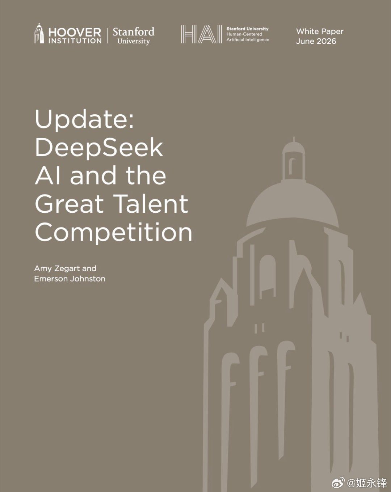

---

## 30

@i陆三金

发表于：2026-06-21 13:43

来源：微博

链接：https://m.weibo.cn/status/5312362539910553

DeepSeek Harness 组的招聘强度确实够大，刷到很多次了。

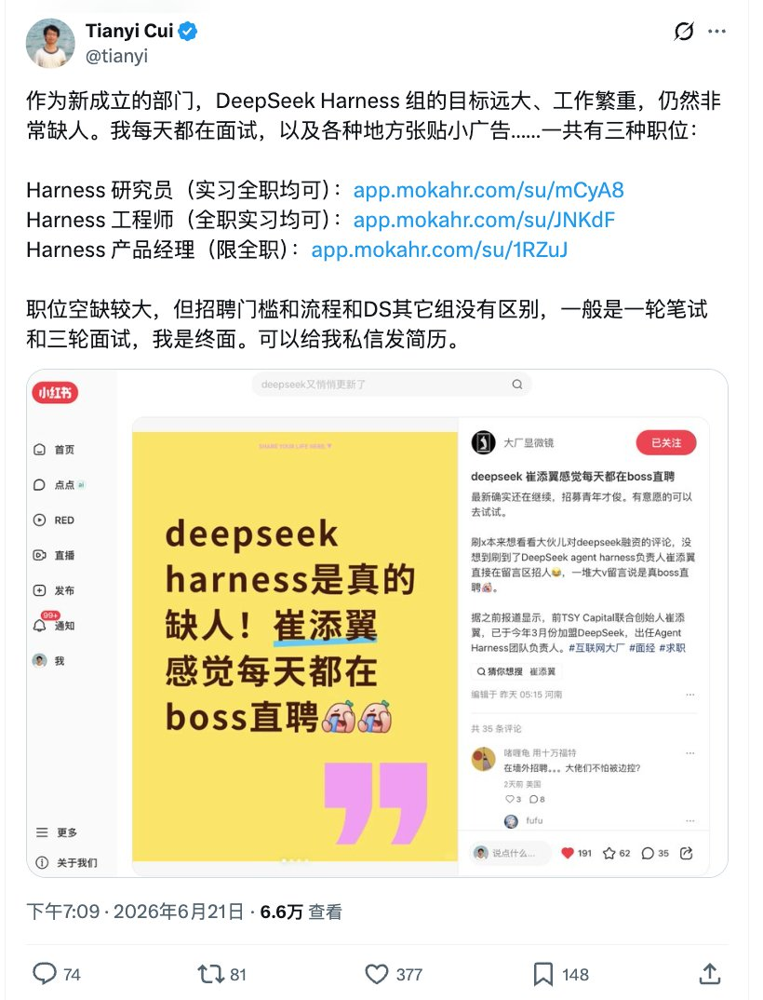

