# 2026-06-23

## 1

@pinxue

发表于：2026-06-21 08:23

来源：微博

链接：https://m.weibo.cn/status/5312282175472403

看着行业里又在发明一堆新概念来重建软件工程方法与流程，十分有趣，其实并没有什么新鲜事

---

## 2

@李建秋的世界

发表于：2026-06-22 08:09

来源：微博

链接：https://m.weibo.cn/status/5312640941297000

61年果阿战争是一个很严重的催化剂。

61年印度出动3万大军围攻果阿，36小时拿下果阿，葡萄牙本来就不是什么强国，拿下来也没什么，但是这场仗带来两个极强的负面因素，影响到两个人：

一个是当时印度国防部长梅农

一个是陆军副参谋长考尔中将。

梅农当时被印度人视为民族英雄，而考尔是果阿行动的策划者。

由于果阿战争的成功，导致这两位完全把握了印度的国防大权。

他们拿着果阿行动的经验那对阵中国。

果阿行动中，苏联在联合国动用否决权支持印度，美国也很快默认了既定事实，也没有支持葡萄牙，这让尼赫鲁产生了幻觉。

当时印度情报局长叫马利克，这个人也是很搞笑，经过东拼西凑的情报，他认为，中国虽然嘴上抗议，但是不打算，也承受不起对印战争。

其实当时前线的人，比如说作战局长帕里特，旅长达尔维都再三警告过，说前线不是那回事，不听，达尔维这个人很惨，后面我们再说。但马利克压根不听，斥责前线怯懦。

马利克的情报来源很杂，外部基本判断如下：

一个是认为当时中国正处于三年困难时期，国内经不起高原消耗战。

二个是因为当时台海局势紧张，中国精锐部队应该部署在沿海，不会往西藏调。

三个是当时中苏关系不好（赫鲁晓夫时期），苏联和美国都支持印度，所以印度国际环境很好。

关于对华内部判断，这个比较离谱：

印度当时其实非常落后，因此对华无线电监听的监听员都找不到，是从广播电台找的人。

由于无法破译中国的无线电通讯，因此对于中国军队情况一无所知。

最后也是要命的，马利克相当多的情报属于道听途说，高度依赖于边境的走私贩子，以及一些流言蜚语拼凑出来的。

两个因为果阿战争自高自大的军队+一个道听途说搞情报的情报局长。

再来一个当时已经自大到无以复加的尼赫鲁。

这就是印度的站前配置。

---

## 3

@李成东

发表于：2026-06-22 04:39

来源：微博

链接：https://m.weibo.cn/status/5312588034609680

2022年是消费信心的历史性分水岭

之前住户存款年均新增大多在 4～7 万亿 的区间。

2020起跳至 11 万亿，2022再跳至 17.84 万亿（史上最高），此后三年仍维持在 14～17 万亿 的超高位。

与此同时，贷款新增从2021峰值的 7.92 万亿 暴跌至2025的 0.44 万亿。

这意味着居民部门的行为模式发生了根本转变：从"借新钱买资产"转为"攒钱还旧债/囤现金"。

所以东哥一直在说，出台新政策一定要顾及到信心。\#东哥笔记\#

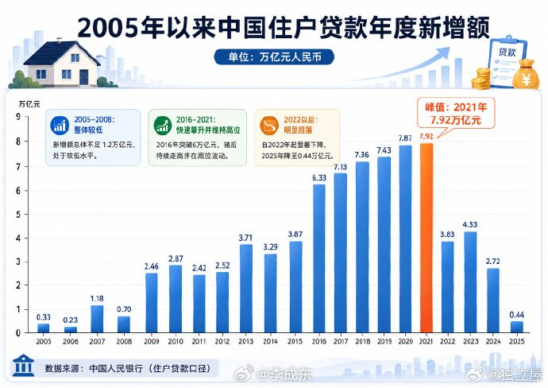

---

## 4

@南京摩天汉

发表于：2026-06-20 07:25

来源：微博

链接：https://m.weibo.cn/status/5311905000592384

金陵之色 \#enjoy nanjing\#

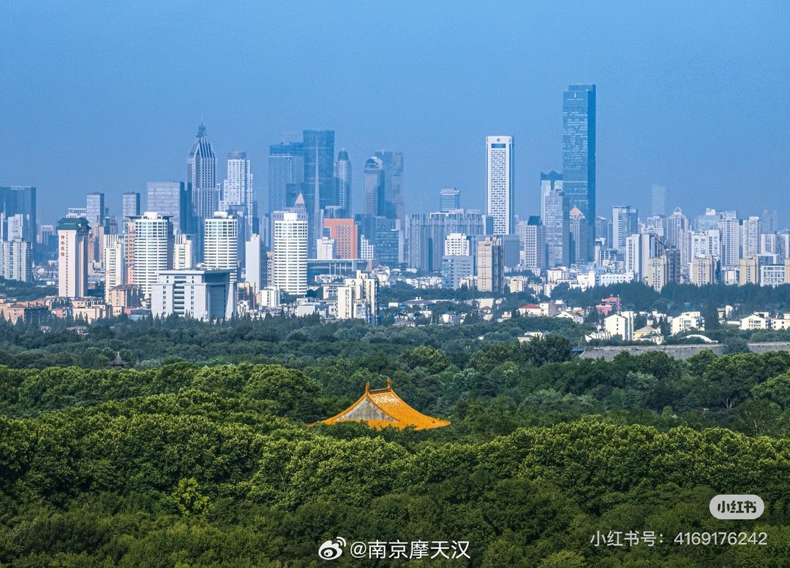

---

## 5

@挨踢牛魔王

发表于：2026-06-19 11:41

来源：微博

链接：https://m.weibo.cn/status/5311607232004420

百度的PP-OCRv6识别模型，大模型还真干不过它。

其中medium系列才76.47M。

PP-OCRv6 是一个轻量级 OCR 系统，结合了架构创新与以数据为中心的优化。它围绕一种统一的 MetaFormer 风格构建模块（采用结构重参数化）重新设计了主干网络、检测颈部和识别颈部。三个模型层级（medium、small、tiny）共享相同的模块基元，覆盖从服务器到边缘设备的部署场景。

核心特性

统一且可扩展的模型系列： 包含 1.5M 至 34.5M 参数的三级 OCR 模型家族。PP-OCRv6_medium 在检测任务上达到 86.2% 的 Hmean，在识别任务上达到 83.2% 的准确率，分别比 PP-OCRv5_server 提升了 +4.6% 和 +5.1%。

轻量化架构创新： (i) LCNetV4，一种采用结构重参数化的 MetaFormer 风格轻量级主干网络；(ii) RepLKFPN，一种采用膨胀可重参数化深度卷积的检测颈部；(iii) EncoderWithLightSVTR，一种融合局部-全局注意力机制和加性跳跃连接的识别颈部。

多语言与多场景支持： 支持 50 种语言及多种工业场景（数码显示屏、点阵字符、轮胎印迹等），在参数量低几个数量级的情况下，性能超越 Qwen3-VL-235B、GPT-5.5 和 Gemini-3.1-Pro。

项目地址：www.modelscope.cn/collections/PaddlePaddle/PP-OCRv6

---

## 6

@李晓鹏博士

发表于：2026-01-13 12:10

来源：微博

链接：https://m.weibo.cn/status/5254719482365961

（前一条可能有敏感的话，被夹了，删掉重发）1.特朗普绑架马杜罗是一次军事投机，对美帝的伤害极大，而不可能有什么实质性的收获。后续也很难再有大动作了。委内瑞拉国内政治格局也不会发生多大变化。美国石油公司还是不敢投资委内瑞拉，因为短期赚不到钱，长期投资设备改造之类的，没有十年收不回成本。而十年以后特朗普肯定不可能还是总统。到时候说不定委内瑞拉再来一次国有化，没人敢冒这个风险。

2.委内瑞拉就是一次投机性质的表演，对世界局势变化而言不重要，近期最重要的还是中东局势伊朗以色列的关系。

3.俄罗斯在乌克兰已经取得决定性优势，会有更多力量为伊朗提供支持。这一轮伊朗与以色列和美国的斗争，俄罗斯将会发挥更大作用。伊朗的底气也会更足。

4.委内瑞拉绑架行动，侧面说明美国其实已经缺乏发动较大规模军事行动的能力，只能搞点特种作战保留颜面。连近在咫尺的委内瑞拉都搞不定，它在中东的行动能力就只会更差。上次轰炸伊朗，也是炫技性质，被炸的核设施辐射情况一切正常，说明不是没炸透就是没炸准。对俄乌这种规模不算大的战争，它也已基本无能为力。下一次中东战争以色列可能真的只能靠它自己了。

---

## 7

@李子暘Lee

发表于：2026-06-22 04:38

来源：微博

链接：https://m.weibo.cn/status/5312587929486881

【我们做政治史的时候，千万不要高估自己的能力，我们要明白，我们所面对的都是古代的那些一流的政治家、军事家，我们考虑的很多问题实际上他们早已考虑到了，所以千万不要低估古人的政治智慧，更不要随意褒贬，我们能做的也许只是尽自己的努力站在他们的立场，试图了解他们的所行所为，仅此而已】

《逐鹿》的作者张诗坪在尾章引用了李碧妍的这段话，说明了理解历史的困难所在。

这的确是读史者常犯的错误。那些一流的政治家、军事家，唯一不如你的，就是他们已经死了。如果他们没死，即使他们的能力降了好几等，你也根本惹不起他们，不信，想想你生活中那些你根本惹不起的人。

《逐鹿》这书好得很，好就好在，作者重建了真实的决策环境，这样一来，秦汉之际很多寓言化、戏剧化甚至漫画化的事情，才成为可理解的。项羽、刘邦这些超一流的人物，不会犯那么可笑的错误。你以为他们可笑，是因为你不知道他们面对的“问题情境”是什么。

真正的理解历史，首先要理解历史当事人是怎么理解他们那个时代的。而这，往往是最难的。人们总是禁不住用自己身处其中的现实去理解已经过去的历史。

~

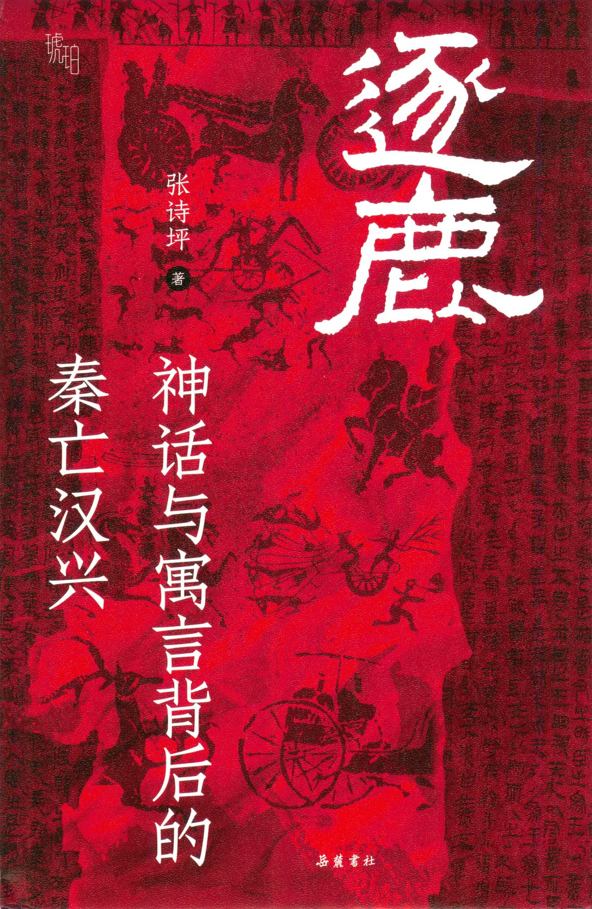

---

## 8

@凯雷

发表于：2026-06-21 08:34

来源：微博

链接：https://m.weibo.cn/status/5312284805304858

\#云南中考历史试卷问题多人被停职\#更正⬇️

1爱迪生“1882年出生于纽约”表述错误，应为“1847年出生于俄亥俄州”。

2“爱迪生一生发明了电灯、电话、电影等1000多项专利技术”表述不严谨，应为 “爱迪生一生取得了电灯、电话、电影等领域的1000多项发明专利”。 

【\#爱迪生还没出生就发明了电灯\#？\#官方回应中考试卷被指低级错误\#】近日，云南中考历史试卷第29题被指存在多处低级错误：“爱迪生发明了电话，1882年出生于纽约，刚出生就创建了火力发电站。”对此，云南省招考院表示，正研判处理。 有网友指出，此题存在三处史实错误：一是爱迪生于1847年2月11日出生于俄亥俄州的米兰；二是错误宣称爱迪生发明电话，电话公认发明者是贝尔；三是背景材料称，爱迪生刚出生就创建了火力发电站。根据背景材料，1882年出生的爱迪生在1879年发明了白炽灯。（综合澎湃）

\#爱迪生还没出生就发明了电灯\#云南中考历史题一个错别字都没有，但错漏百出。卷名为《重生之我在十九世纪搞基建》，明明是穿越题，竟然标明摘自@吴军博士 《全球科技史》，估计是用Ai摘的吧。大V吴军得公开回应下！

\#云南省招生考试院深感愧疚自责\#云南省2026年中考历史试卷因第29题展板二内容出现史实错误引发关注。试题中将爱迪生的出生年份误写为“1882年出生于纽约”，正确应为“1847年出生于俄亥俄州”；同时，“发明了电灯、电话、电影等1000多项专利技术”的表述被指出不严谨，应为“取得了相关领域的1000多项发明专利”。此外，电话并非爱迪生发明，该表述存在明显史实混淆。

针对此问题，云南省教育厅已成立调查组开展核查，并对相关责任人作出处理：云南省招生考试院分管领导、命题处处长、中考历史学科命题秘书已被停职检查，同时对命题组组长及成员启动严肃追责问责程序。官方表示，评分标准不涉及爱迪生出生时间与地点，考生答题主要依据展板中的“主要贡献”内容和所学知识作答，评卷将按统一制定的细则公正进行。

云南省招生考试院已就命题失误致歉，承诺深刻汲取教训，加强命题管理，杜绝//@栗豆糕好吃哒:顺着出处查了这本书，人家作者在书里也没有这些文字表述啊？//@毛丁萧逸:中考这大事，邋遢到这地步了？//@nicolas4749:真服了，唯一错误是把出生年份写错两个数，一群不懂装懂的记者非说是错误百出，错在哪了？爱迪生并非发明电话，但他有电话专利！

//@春常阳楼:性质严重！中考试卷不严谨，也不是误导学生，学生平常学到历史也不这样的，也不是低级错误，严重问题。//@爱上泡泡糖:中考试卷没有审卷吗？审卷组的老师只关注怎么“烤”学生，根本不在意原题的内容，居然层层审卷都没有发现这种低级错误。类似事件再次发生。 

电话的公认发明者是亚历山大·格拉汉姆·贝尔。1875年6月2日，贝尔和他的助手沃森设计制造出了世界上第一部电话，并于1876年3月7日获得电话发明专利。不过，历史上也存在争议——意大利人安东尼奥·梅乌奇早在贝尔之前就发明了“说话机”，但因经济困难未能完成专利申请，直到2002年美国国会才通过决议承认梅乌奇对电话的贡献。目前主流教科书和大众认知仍以贝尔为电话发明者。 

附议//@丰富_单纯:傍晚看了一则某省的中考新闻，历史中考，违背了基本的历史常识。这样低级的错误，很可能是AI帮了忙，题目就是AI出的，因为大概只有AI，才敢于如此大方地胡说八道。出题的人类偷个懒，没有仔细看，或者相信AI比自己强大，根本没有怀疑。很早以前，我就忧心忡忡地说，AI最可怕的，不是它比人类厉害。而是以后出生的人类，可能连AI说的是真是假，都无从辨别了。AI确实可以篡改历史，而且毫不费力。因为人们已经不关心真相了，而话语权，被看似强大的AI轻而易举地掌握。 只是没想到，这一天来得真快，来得这么讽刺。

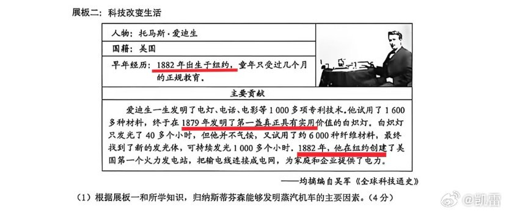

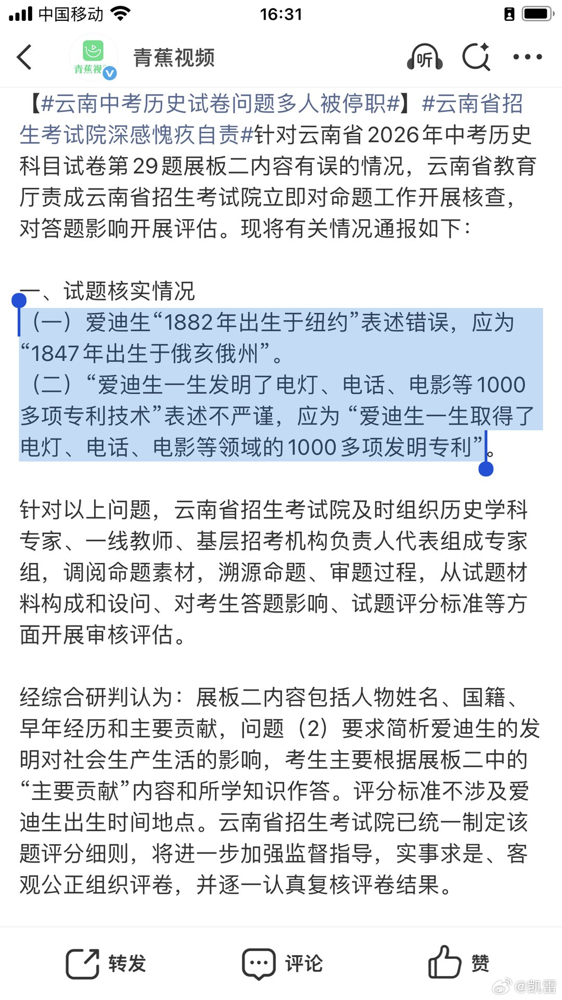

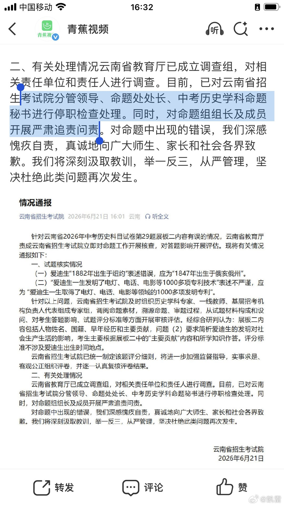

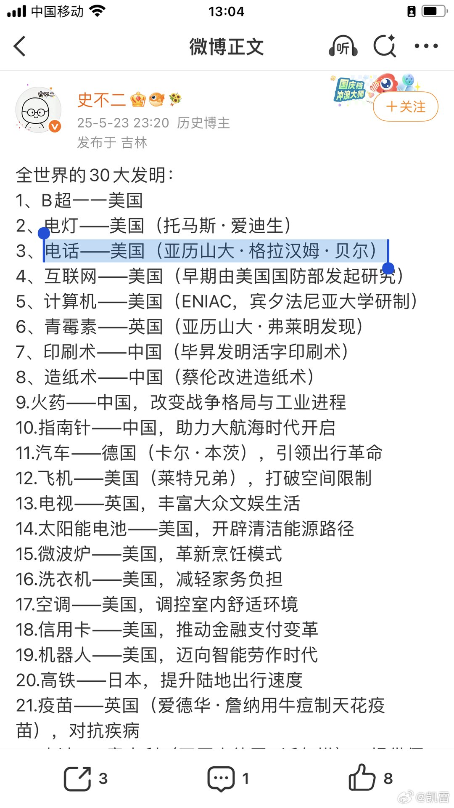

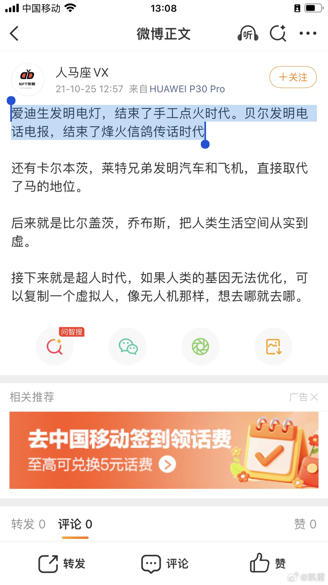

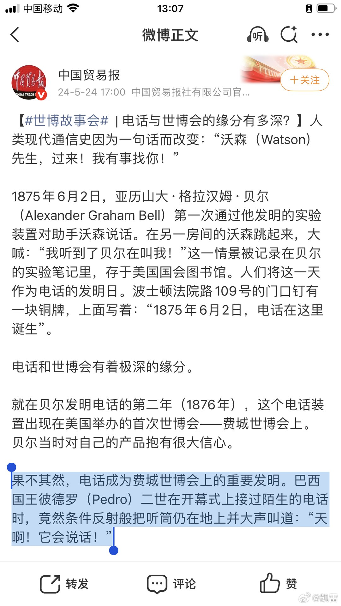

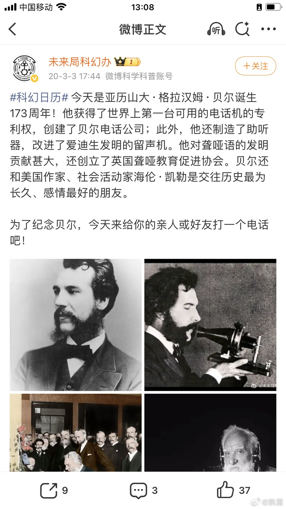

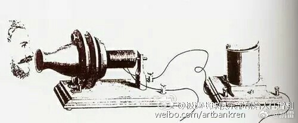

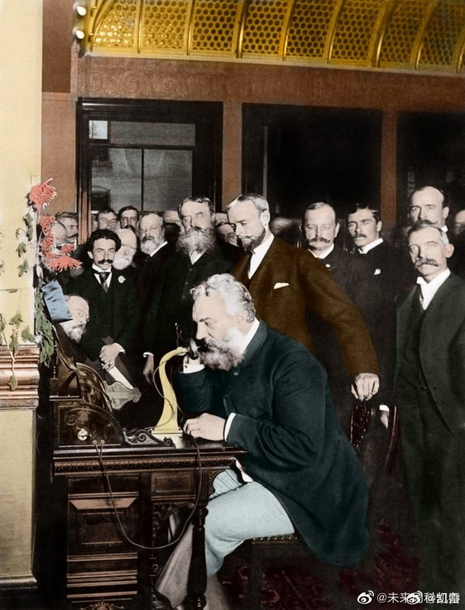

---

## 9

@机工战略

发表于：2026-06-21 16:00

来源：微博

链接：https://m.weibo.cn/status/5312396974628670

今天看到一个非常细致的案例，讲述的是 iMac 的制造，让我感到，苹果公司在上世纪九十年代乔布斯回归以后，不仅在设计上，更是在制造上做了很多钻研，他们对制造的理解也是非常深。

1997 年，乔布斯回到苹果后，第一款真正要打出去的产品，是后来改变苹果命运的 iMac。

当时 Jony Ive 的工业设计团队拿出一个非常激进的方案：不要传统米黄色电脑盒子，而是一个圆润、半透明、像糖果一样的蓝色蛋壳电脑。后来这款 iMac 在 1998 年发布，外壳是著名的 Bondi Blue 半透明塑料，一体机形态也成为苹果复兴的标志。

但在发布之前，这个设计差点把项目拖死。

苹果工程师看到图纸后，第一反应是：这东西造不出来。问题不只是外形圆，而是它违反了塑料注塑的很多基本逻辑。外壳像一个往回卷的蛋壳，里面有“倒扣”；模具要伸进去塑形，但塑料一成型，模具又会被外壳卡住，抽不出来。更麻烦的是，外壳上原来还有横向细条纹，方向和注塑模具退出方向冲突；背后还有一个内凹把手，但把手下面正好是电路板，几乎没有位置放支撑结构。

也就是说，设计师想要的是“完整、干净、没有破坏感的外壳”，工程师看到的却是：模具怎么开？钢芯怎么抽？把手怎么承重？螺丝怎么藏？电路板往哪里放？

双方僵持了几个月。苹果找来 Acorn 的 Ken Haven 和 Tim Lau，这两个人以前帮 NeXT 做过非常难的立方体电脑外壳。乔布斯把他们当成“最后裁判”：如果他们也说做不了，那就真做不了；如果他们说能做，那苹果内部工程团队全部裁掉。

（“ The reality was that Jobs told the engineers he would send the blueprints to Acorn, his favorite design consultancy, then located in south Fremont. “I’m gonna send them all of our design files and ask them if they can make this,” Jobs warned, “and if they tell us they can do what you say you can’t do, you guys are all outta here.”）

结果 Acorn 看完图纸后，结论很直接：最大问题不是某一个曲面，而是整个设计缺少清晰结构。把手没有可靠固定点，内部逻辑板又占住了空间，这不是一个高质量产品。

这句话传到乔布斯那里并不容易。因为这是他回归后第一款关键产品，如果 iMac 失败，苹果可能就真的完了。但乔布斯最后做了一个“Hard Reset”：不是取消 iMac，而是强制重置项目。

重置之后，Jony Ive 做了几个关键妥协。第一，把难以制造的横向条纹改成竖向条纹，让它顺着塑料注塑工具运动方向。第二，调整半透明蓝色外壳，让用户只能朦胧看到内部，不再完全暴露内部结构。第三，给内部留出更多空间，让电路板、螺丝、螺栓、安装柱可以隐藏在表面之下。第四，把内凹把手重新做成有结构支撑的部件，而不是一个漂亮但脆弱的造型。

这件事的意义很大。它不是“设计向制造投降”，也不是“制造否定设计”。真正发生的是：苹果保留了 iMac 最核心的设计意图——圆润、透明、亲和、反传统；但把具体实现方式重新工程化。外观看起来仍然是一颗完整的蓝色蛋壳，背后却变成了一套复杂的注塑、结构、装配和供应链方案。

这个故事很能说明苹果后来为什么强。苹果不是简单做设计，也不是简单做制造，而是不断把二者拉到一个高张力状态：设计逼制造突破极限，制造逼设计回到可量产、高可靠度、可交付。iMac 这个差评让苹果学会了一件事：伟大的产品不是画出来的，而是在设计、工程、模具、材料、供应链反复冲突和妥协中“长出来”的。

从这个角度看，iMac 的蓝色透明外壳，不只是一个漂亮外观，而是苹果后来供应链哲学的起点：外观可以很理想主义，但制造必须极端现实；真正的能力，是在理想与现实之间建立工程化通道。（原文经过大模型调整）

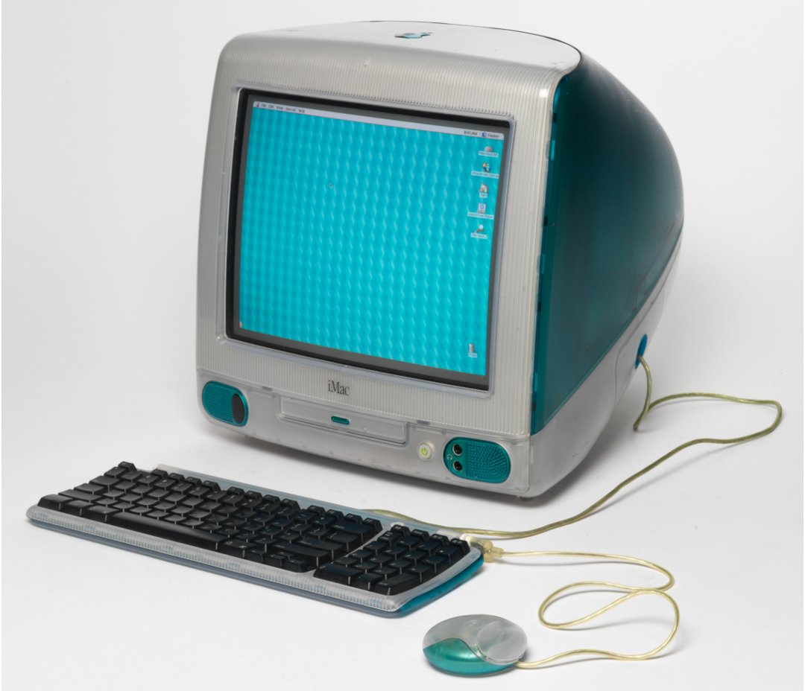

---

## 10

@小众软件

发表于：2026-06-21 13:42

来源：微博

链接：https://m.weibo.cn/status/5312362276195642

Cloudflare 开始为 AI 提供特权：人类需要注册，AI 免注册 网页链接

现在开始，使用 AI Agent 在 Cloudflare 上部署代码时，无需注册，无需 API KEY，即可获得一个有效期 60 分钟的临时账户。之后人类可以使用自己的 Cloudflare 账号认领该账户。

只需要点击认领链接，就可以永久拥有由 AI Agent 创建的 worker 项目。

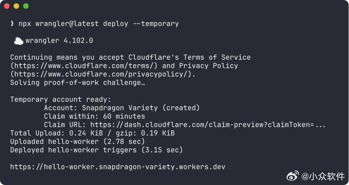

---

## 11

@寰亚SYHP

发表于：2026-06-22 14:17

来源：微博

链接：https://m.weibo.cn/status/5312733515876576

\#特朗普称任何破坏倒影池者将判10年\#特朗普发文称，任何企图破坏华盛顿林肯纪念堂前的倒影池者将判10年

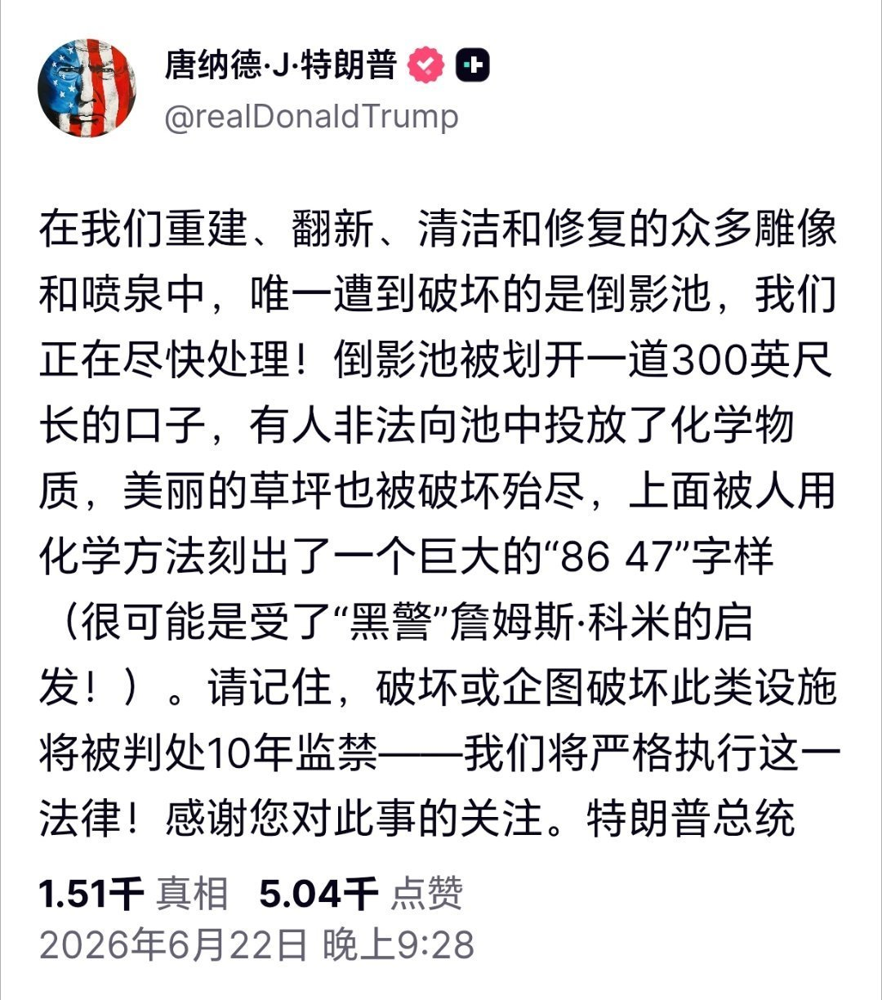

---

## 12

@2049年的世界

发表于：2026-06-22 13:59

来源：微博

链接：https://m.weibo.cn/status/5312728918921233

宁波府城隍庙父亲节文案“吃的掉地上了，洗一下给你爸吃”，知乎上有人出来认领了。

网页链接

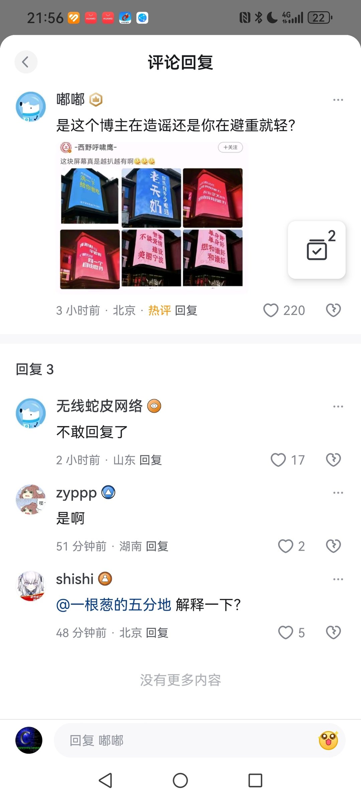

---

## 13

@南山林雪萍

发表于：2026-06-22 11:38

来源：微博

链接：https://m.weibo.cn/status/5312693565130494

没有龙头的行业是什么样子的？牙刷就是一个。

在中国，自有品牌的牙刷企业能做到1个亿的，就已经属于第一阵营了。牙刷产业高度分散。国内牙刷估计150亿产值，但散者如碎絮。

两大牙刷产业集群，一个是扬州市杭集镇，中国60%的牙刷，都来自这里。另一个是汕头市司马浦镇的仙港村。杭集镇这里有高露洁这样的大品牌，也有众多国内品牌。

牙刷唯一上市公司是扬州的倍加洁，2025年收入15亿。牙刷收入5亿，但基本都是代工，自有品牌影响力不大。在司马浦镇最早做牙刷的”金港”，和临近峡山镇的 “青蛙”品牌，都属于国内大品牌。青蛙牌，每年能做到2亿产值，已经可以看成是龙头企业了。

企业往往需要同时做酒店用品，才能将公司形成一定规模。因此国内的酒店用品如一次性消耗品（牙刷牙膏或者洗发液）也都来自仙港村。

牙刷牙膏看似天天都在人的嘴边上转，形影不离。但牙膏的命运则好多了。云南白药可以做到80亿。牙膏产业，也因此似乎并不在乎牙刷。牙膏品牌商，也会同时做牙刷，但积极性也并不高。

牙刷的刷丝，既要软又要硬，因此对拉丝要求很高。它需要有专门的磨毛机，来形成磨尖丝。对刷丝材料非常挑剔。

北京一家贝医生，以设计理念著称。创始人来自2008年祥云火把的设计师，有属于小米系，因此它也是采用手机品质来制造牙刷。它的刷丝就是来自日本东丽。

任何一个小产业，极致的品质还是由精细化工材料决定。国内的尼龙拉丝，品质现在也跟上来了。

无锡兴达和慈溪的洁达的刷丝，已经在杭集镇或者司马浦镇两大牙刷集群，被广泛采用。刷丝的制造，需要严格的排污设备，很多时候位于化工园区。而金港则是国内同时能做刷丝和牙刷的少数企业，从而可以精准控制上下游的品质。

刷丝成为牙刷供应链的一个关键品控点。

而对于植毛机，以前都是进口的德国沙朗斯基。现在就在峡山镇的牙刷土壤里，开出了本地植毛机之花：汕头创研。同样在杭集镇则出现了扬州宸浩。一个产业集群在外购机器生产的时候，也容易衍生出制造机器的企业。植毛机一点都不简单，它也需要五根轴联动控制技术，因为牙刷是个曲面。

天天使用，但人们应该也不会重视牙刷行业。

牙刷企业的人均年产值大约30万元人密闭左右。听上去真是低效产能。

然而对于中国当下而言，保住每种就业保住每份工作，是非常重要。

而低产值的行业，同样值得重视。刷丝的分剥和放置在植毛机上，都需要大量人手。仙港村有上万人，而有近4000人从事牙刷行业。只有规模化的产业，才可以将人们的双脚，留在本土。刷丝矗立在牙头上不可动摇，而它提供的就业机会可以让当地人口扎根在本地。

牙刷产业，看上去是瘦小的个头，但对就业的拉动也是非常积极。牙刷是一种就业友好型的产品，每个镇级政府都需要重视这样的民生产业。然而传统牙刷产业，一直难以突破边界，也是一个很现实的问题。电动牙刷产业，跟手动牙刷是完全不同的行业。前者更是电气产品，因此有着完全不同的禀赋，因此反而在深圳和宁波居多。那么传统牙刷产业，真的一眼望到尽头了吗？\#产业集群第二春\#\#城市的拐点\#

---

## 14

@tombkeeper

发表于：2026-06-22 07:02

来源：微博

链接：https://m.weibo.cn/status/5312623991326758

群里有人说随着时间推移，处于愚昧之巅的人最终会进入开悟之坡，整个世界就会变好了。我说不会，大部分上了愚昧之巅的人都会一辈子在上面。蠢人大概率会蠢一辈子，直到蠢死。

两千多年前的封建时代，人类的精英们就已经想明白了：“嫂溺不援，是豺狼也。男女授受不亲，礼也；嫂溺，援之以手者，权也。”但在已经造出了托卡马克系统和 AI 的 2026 年\#厨师光膀子救顾客被质疑仍称不后悔\# 这种事情居然还能成为社会热点话题。

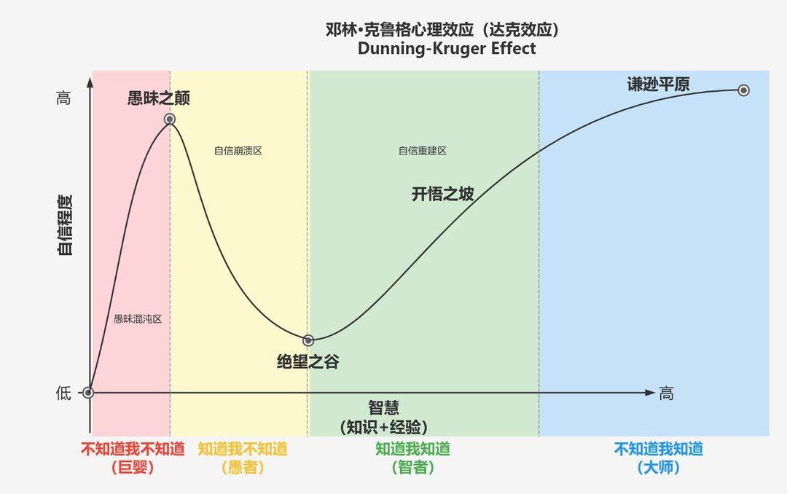

---

## 15

@少年伯爵

发表于：2026-06-22 16:33

来源：微博

链接：https://m.weibo.cn/status/5312767763680925

如图1~图7所示——三高在现代是令人头疼的基础病，但在远古非洲则是救命的神技和神迹……

❶高血压——远古非洲草原上的人类（裸猿）出汗散热能力冠绝地球，但代价则是每天被汗液带走大量盐分，再加上自然界的食盐太少了，于是真正要命的风险来了，那就是一旦受伤出血，低钠低血压带来的致命休克……于是，达尔文盒饭厂更偏爱那些更容易保留钠离子+血压维持较高的碳基猴子🐒……本质上就是高血压（维持脑灌注压）可以增加创伤后的存活率+怀孕时更容易维持胎盘供血。

\#伯爵冷知识\# 所以到了最后，达尔文盒饭厂在几十万年里选择了肾素-血管紧张素-醛固酮系统特别活跃的、交感神经敏感的、肾脏更努力回收钠的智人，也就是现代社会典型的高血压病人

❷高血脂——在远古时期，胆固醇可是液体黄金，人体约20%~25%的胆固醇存在于大脑，因为胆固醇参与神经元膜+突触形成+神经递质释放+髓鞘形成，如果血脂（胆固醇）长期很低，那么就会导致➠注意力下降+激素减少+神经系统发育异常+伤口愈合受阻（胆固醇是细胞膜重新合成的关键）+抵御感染能力下降（低密度脂蛋白可以结合细菌毒素，中和部分内毒素，减轻败血症损伤）。

这个不开玩笑，在数万年前，乃至几十万年前，感染是哺乳动物的第一S因。

所以拥有高血脂基因的智人，简直就是开了锁血挂的版本之神。

❸高血糖——在人类几百万年的进化过程中，低血糖远比高血糖危险……因为低血糖一旦出现，人就瘫那儿了，直接变成野外砧板上的鱼肉。而打猎、逃跑、伤口愈合时同样需要血糖应急供能，此时就需要远古智人应激性高血糖。最后是怀孕时需要胰岛素抵抗，强行让更多葡萄糖通过胎盘供给胎儿用，这也是妊娠期糖尿病的远古来源。

拥有高血糖基因的智人，相当于开了燃血挂的幸存者。

                      ————————————

然而，达尔文盒饭厂打死也想不到，人类可以在短短几十年里，生产力突然大爆发，搞出了食盐+葡萄糖+油脂胆固醇的极大丰富和自由。

几百万年的盐糖油匮乏，瞬间过气了，三高不再是至高的版本之神，而是沦为了版本弃子。

一代版本一代神，三高仙宗入凡尘。

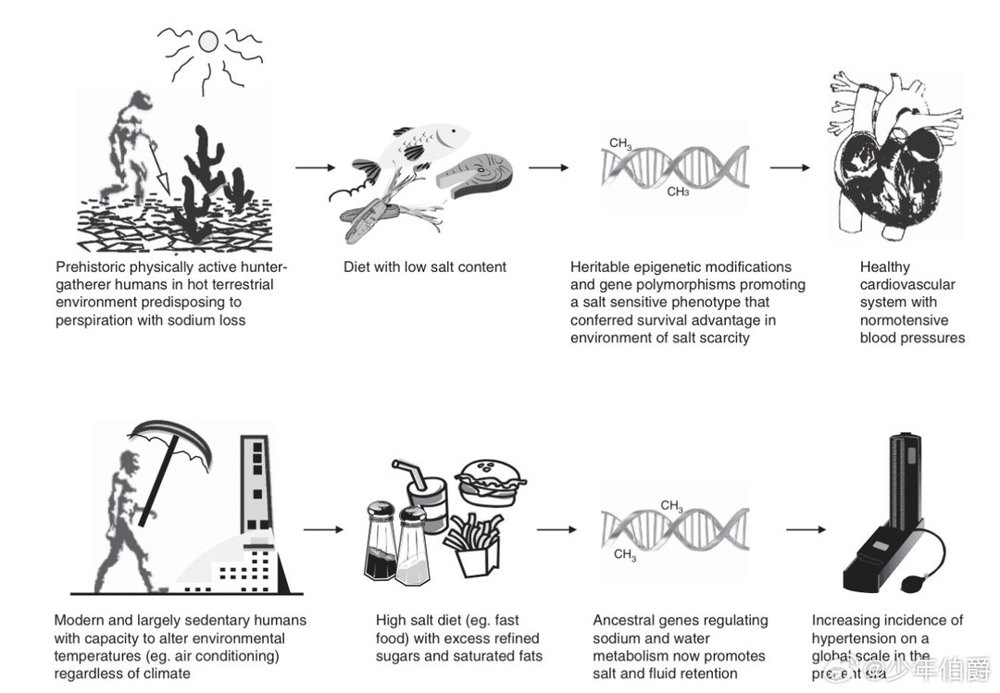

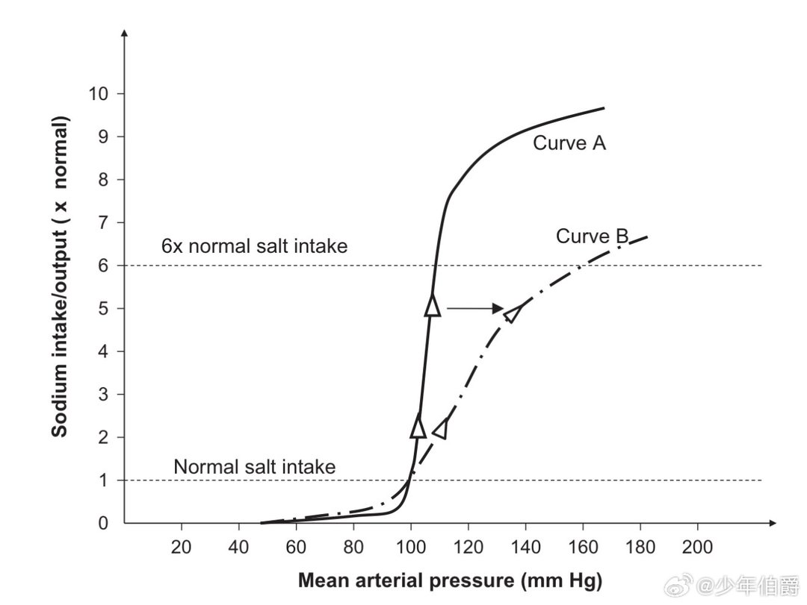

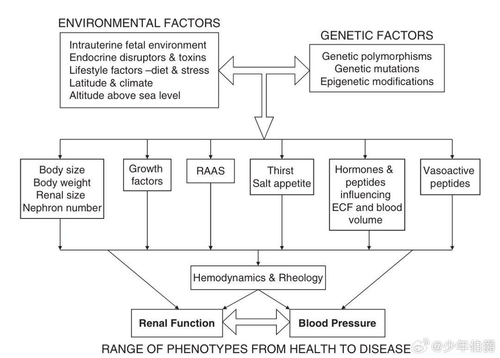

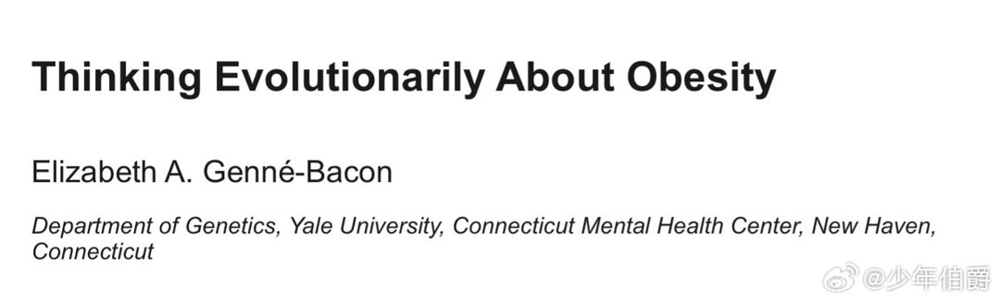

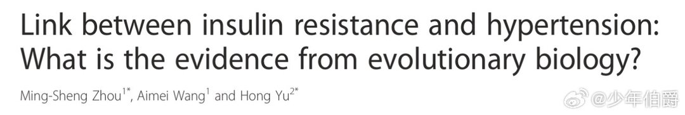

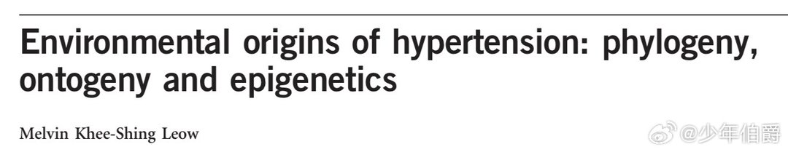

---

## 16

@洪广玉

发表于：2026-06-22 16:29

来源：微博

链接：https://m.weibo.cn/status/5312766808426277

鉴于很多人不看长文，只要结论，我用最简洁的话点评一下山东公卫中心甲酰胺检测实验：

1. 目前不存在血液中检测甲酰胺的公认标准方法，无论检出或者没检出，结果都不可靠；

2. 即使有新的方法在婴幼儿血液中检出甲酰胺也不足为奇，因为人体内就有微量的本底甲酰胺，还有环境中可能存在的微量暴露，这些甲酰胺对人通常无害；

3. 世界上还没有任何一个科学组织发布过关于人体血液中甲酰胺浓度的“安全参考值”，声称检出“有害浓度”的，纯属编造；

4. 在血液中检测甲酰胺，因为既不准确，又不具备临床指导价值，所以早被行业内放弃。

于兆衍医生的行为，属于看到整个高速公路的人都在逆行，司机是于医生，副驾是记者。

---

## 17

@姬永锋

发表于：2026-06-22 15:58

来源：微博

链接：https://m.weibo.cn/status/5312759092740747

美光和 Anthropic 这次合作包含四层意思。

第一，双方会一起做 AI 内存和存储架构设计。

也就是说美光不只是把 HBM、DRAM、SSD 卖给 Anthropic，而是要和模型公司一起看Claude 训练和推理到底怎么用内存、怎么用存储、瓶颈在哪里、怎么降低 token 成本。

这一点很关键。因为 AI 发展到现在，已经不是单纯堆 GPU 就够了。模型越大、上下文越长、推理调用越多，内存带宽、容量、SSD 吞吐都会变成基础设施的一部分。

第二，美光和 Anthropic 签了长期供应协议。

这对美光很重要。存储行业以前最容易被市场当成周期品，价格好时利润暴涨，价格差时 EPS 崩掉，所以 PE 很容易失真。

但如果越来越多 AI 公司愿意提前锁定未来几年的内存和存储供应，那美光的收入可见度会变高，周期属性会被削弱一部分。不是说周期消失了，而是 AI 需求让这一轮周期变得更长、更强，也更难用过去的老框架去理解。

第三，美光内部也会使用 Claude。

这说明美光和 Anthropic 不是单向供货关系，而是更深的技术合作。美光会把 Claude 用在代码、工程、制造和企业流程里。

这意味着美光既是 Anthropic 的供应商，也是 Anthropic 的客户。一个负责底层硬件，一个负责 AI 应用，双方关系会更紧密。

第四，美光参与了 Anthropic 的 H 轮融资。

这就更像战略绑定了。除了卖货，美光也在下注 Anthropic 未来的模型需求增长。

这背后的信号是AI 模型公司正在把存储厂商纳入核心供应链。以前大家看 AI 基建，第一反应是 GPU、ASIC、光模块。但现在前沿模型公司已经开始直接锁定 HBM、DRAM、SSD。

所以我觉得这件事对美光的意义，不只是多了一个客户，而是进一步确认了一个趋势：AI 时代，存储不再只是配角。它正在变成大模型扩张的底层瓶颈之一。

当然，利好不等于没有风险。协议金额、具体年限、价格、毛利贡献都没有披露，美光股价也已经涨了很多。接下来还要看本周三美光财报里对 HBM、DRAM、NAND 价格和长期协议的指引。

但大方向很清楚，存储行业的周期还在，但这轮 AI 需求，正在重塑市场对美光的估值逻辑。

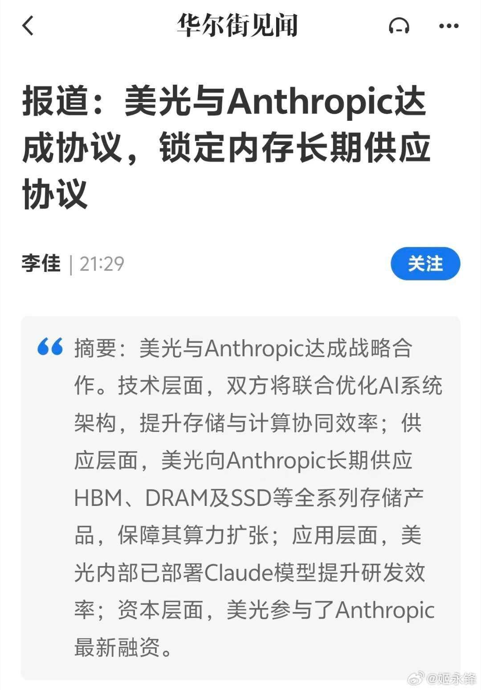

---

## 18

@李隐枫

发表于：2026-06-22 12:41

来源：微博

链接：https://m.weibo.cn/status/5312709352490170

深圳失业人群的聚集地正从星巴克转向党群服务中心...

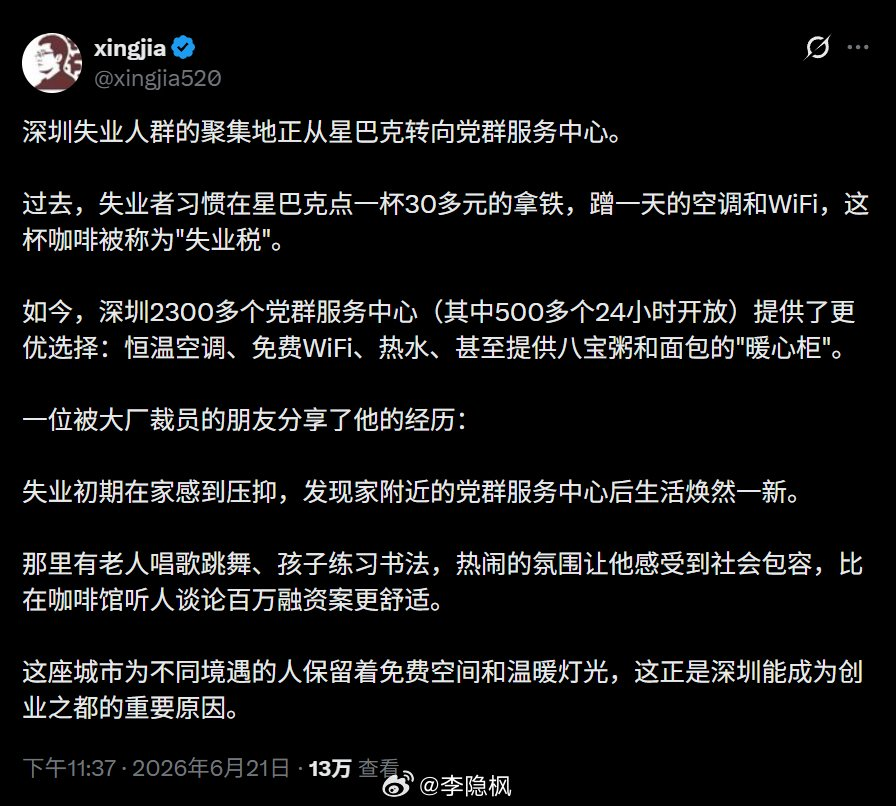

