# 2026-06-24

## 1

@财联社APP

发表于：2026-06-23 05:27

来源：微博

链接：https://m.weibo.cn/status/5312962554236127

\#SK海力士大跌近10%\#\#韩国存储巨头大跌\#【港股存储芯片板块持续走低 南方两倍做多海力士跌超21%】财联社6月23日电，港股存储芯片板块持续走低，南方两倍做多海力士跌超21%，南方两倍做多三星电子跌超18%，澜起科技跌超9%，兆易创新跌近6%。\#韩国股市跳水了\#//@财联社APP:\#SK海力士大跌近10%\#\#韩国存储巨头大跌\#财联社6月23日电，SK海力士跌幅扩大至10%，三星电子下跌7.5%。\#韩国股市跳水了\#

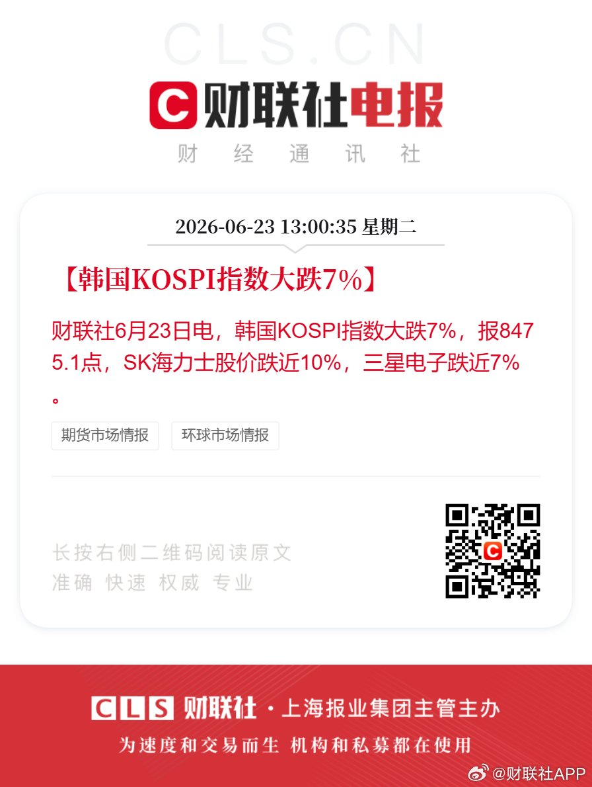

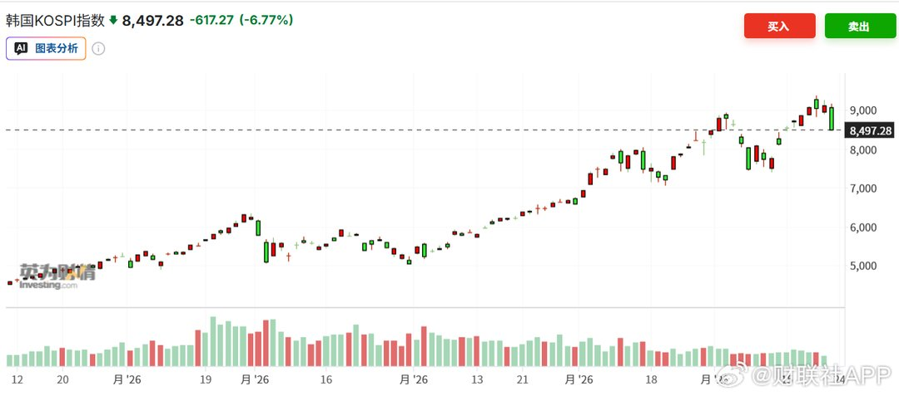

---

## 2

@平原公子赵胜

发表于：2026-06-22 05:39

来源：微博

链接：https://m.weibo.cn/status/5312603183385510

万斯在瑞士和伊朗谈判，以色列在轰炸黎巴嫩，懂王在后方上网写小作文拱火……这谈个毛啊。

前几天，万斯终于忍不住了，他火力全开，指着以色列和内塔尼亚胡的鼻子臭骂一通。

他声色俱厉，言辞激烈，他指责以色列正在破坏美国和伊朗的和谈，说以色列表现出了“怪异的恐慌”和“歇斯底里”。

"如果我是以色列政府的内阁成员，我可能不会去攻击我在这个世界上仅剩的唯一强大盟友。"

"在过去三个月中，以色列三分之二的防御性武器是由美国人制造的，并由美国纳税人的钱支付。"

他对那些以色列的右翼强硬派嗤之以鼻，说：“你们以色列是个900万人口的国家，你们不能永远指望靠杀戮来解决你们所谓的安全问题……”

他说“是以色列需要感恩美国，而不是美国需要感恩以色列，没有美国，以色列早就完犊子了；他还强调：“特朗普是世界上唯一一个同情以色列的国家元首，而你们却不知道感恩，还专门给他添堵，你们是何居心”？

万斯对以色列说的很明白了，他的意思是，是我们在养你们，你以色列只是一个小国，没有美国护着，早就完蛋了，你们还爱好杀戮，穷兵黩武，搞种族主义，全世界没人喜欢你们，除了懂王能够同情你们……结果你们连懂王都坑，属于农夫与蛇，再这么搞下去，那就是取死有道。

万斯的心情非常不好，从一开始，他就是彻底反对这场战争的，结果被边缘化；现在仗打不赢，懂王要和伊朗和谈，却把他扔到前线来谈判、签条约……签了条约，可以把锅甩给他，说万斯无能，丧权辱国；达不成协议，也可以把锅甩给他，说万斯无能，丧权辱国。

万斯从来不支持以色列，也从来不支持进攻伊朗，结果那段时间特朗普根本不听他的，懂王被卢比奥、海格赛斯这些亲以派包围了，满脑子都是一夜之间摧毁伊朗的幻想，每天面对的都是粉饰出来的大本营战报……一点冷静、理智的声音都听不进去。万斯那时候既不能反对特朗普的政策，也不能在公共场合唱反调，他只能靠边站了，一个畅销书作家、MAGA网红出身的副总统，长时间被搞得销声匿迹。

万斯的想法和那个辞职反恐中心主任肯特一致，他们都认为美国没有必要为了以色列，陷入到一场毫无意义的战争之中，这不但损耗了美国的国力和地位，还背叛了MAGA运动的初衷，会丢掉国内很多基本盘。事实果然如此，美国没能迅速解决对手，初期的暗杀和轰炸反而让伊朗全民团结、上下一心，伊朗的远程导弹和无人机也给美国造成了巨大的损失，美军四十多架飞机被摧毁，中东各个的军事基地被炸烂，萨德系统、爱国者系统、铺路爪雷达都被干碎……美军也失去了锐气，就连福特号都发生了严重的火灾，一枪不放就回了国。

美国国内反战的声音更是此起彼伏，越来越多的美国人开始厌恶以色列，厌恶美国为了以色列的利益二而战，皮尤研究中心2026年数据，60%的美国成年人对以色列持负面看法，59%对内塔尼亚胡缺乏信心……很多MAGA分子都认为懂王背叛了MAGA运动，而美国已经被夺舍，成为了以色列的殖民地。

现在，美国彻底搞不定伊朗问题了，懂王的军事冒险失败了，必须要解决这个问题，让懂王安安稳稳去面对中期选举了，虽然签了十四条备忘录，但必须有个人出来直面伊朗，讨论美国在中东的未来了……这个人只能是万斯。

万斯也是愿意的，在这个关头，如何能够成为帝国的裱糊匠，没有功劳也有苦劳，起码能够赢得国内民众的好感。

以色列也看出了特朗普正在退缩，美国和伊朗有可能媾和，于是，以色列变得更加疯狂，他们的政客轮番上阵，攻击特朗普和美国，他们更加丧心病狂轰炸黎巴嫩……

以色列的犹太复国主义分子已经嗅到了危险的味道，他们心知肚明，如果没有美国的支持和援助，以色列只是一个国土狭窄、资源匮乏的弹丸之地，根本承受不起任何一场持久战和消耗战……它必须把美国拖住。

所以，它们表现得愈发疯狂，在懂王签十四条的时候，在万斯去瑞士谈判的时候，他们继续轰炸黎巴嫩，把仇恨和战火愈烧愈烈，根本不给美国和伊朗缓和的机会。

他们在联合国怼天怼地怼空气，怒骂任何敢于指责他们的人，以色列常驻联合国代表丹尼·达农突然对联合国儿童与武装冲突问题特别代表瓦妮萨·弗雷泽进行人身攻击与侮辱。

就因为以色列被列入联合国冲突中性暴力报告的“黑名单”。弗雷泽本周代表古特雷斯发布报告，警告以色列定居者团体可能因侵犯儿童权利而被列入全球黑名单。

达农破防了，指着弗雷泽歇斯底里的狂叫“闭嘴！我是联合国成员国，你个联合国的打工仔，给我滚出去！”

它们已经疯狂到彻底撕下文明的假面具，不顾任何体面，时时刻刻都在暴露犹太复国主义的狂妄、极端和反人类。

以色列国家安全部长本-格维尔更是公开发表逆天言论：“黎巴嫩——整个黎巴嫩——应该成为我们的游乐场。整个黎巴嫩都应该是我们的目标。有人对我说：“等一下，有黎巴嫩，也有真主党。但我不接受这种人为的区分。每一个以色列母亲的眼泪，都必须让一千个黎巴嫩母亲哭泣。整个黎巴嫩都必须燃烧……”

他还说：“川普的协议对我们没有约束力。以色列不受美国管辖……”，意思是，你们美国签的条约，和我以色列有屁关系？

由于以色列的疯癫，美伊谈判变得无比艰难，就在签了十四条备忘录之后不久，伊朗军方就宣布，由于以色列继续袭击黎巴嫩南部，违反了美伊达成的协议，伊朗再度封闭霍尔木兹海峡。

万斯在瑞士和伊朗谈判，同时遭遇了极大的压力，因为懂王在后方给他添乱，没有困难也要制造困难，懂王为了面子，依然社交媒体上大放厥词，要伊朗管好黎巴嫩，否则就再次发动战争，用炸弹把伊朗“抹掉”……这就离谱了，战争是你要打的，谈判是你要谈的，然后你既想结束战争，又想维护自己强硬的面子，哪有这样的好事。

于是，伊朗暂停了80分钟的谈判，拂袖而去，甚至拒绝了美国代表的握手，把万斯等人晾在原地……而且明确表示，要打就打，哪来那么多废话。

万斯心里大概有千万头动物奔腾而过——“苦也，帝国的裱糊匠当不成，要成帝国的替罪羊了”。\#伊朗代表团突然暂停伊美谈判\# 平原公子赵胜的微博视频

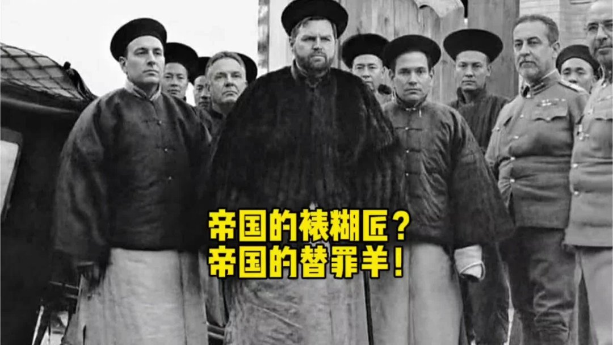

---

## 3

@纯银V

发表于：2026-06-23 04:59

来源：微博

链接：https://m.weibo.cn/status/5312955461669451

接上一条：网页链接

评论区有人问：“即便滴滴和美团把自己的利润都让出来，利润为零。对于百万量级的网约车司机和快递员群体来说，收入也增长不了几个大子儿”，你这个结论是怎么得出来的？

美团公司 2025 年财报亏损 233 亿元，这是因为外卖大战补贴消费者。2024 年公司财报盈利 358 亿元，根据行业估算，外卖业务利润 300 亿元左右。

根据对外披露数据，美团年度雇佣骑手约 700 万人，月均骑手约 330 万人。

2024 年外卖业务的盈利 300 亿，美团自己一分钱不赚，全部拿出来分给 700 万骑手，人均年度收入增长 4000 元，月均 350 元。

然后——

2025 年外卖大战亏损上百亿从哪里来？

美团外卖经营前五年持续亏损了上百亿从哪里来？

新业务不可能做一个成一个，新业务试错的几百亿亏损从哪里来？

从盈利中来。

企业没有盈利，就支撑不了新业务尝试与起步期&竞争阶段的巨额亏损。

继续说滴滴。

滴滴 2025 年国内网约车业务财报盈利 123 亿元。

按照第三方估算，滴滴活跃司机约 500 万人。

滴滴自己一分钱不赚，全部拿出来分给 500 万司机，人均年度收入增长 2400 元，月均 200 元。

根据不同的统计口径，以上数据会有一定的变化，但不会是量级上的变化，不会推翻 “即便滴滴和美团把自己的利润都让出来，利润为零。对于百万量级的网约车司机和快递员群体来说，收入也增长不了几个大子儿” 这个观点。

---

## 4

@问鼎资本-张佳男

发表于：2026-06-23 05:16

来源：微博

链接：https://m.weibo.cn/status/5312959798838476

现在券商银行上涨，根本拉不动沪深300了。这其实是一件好事

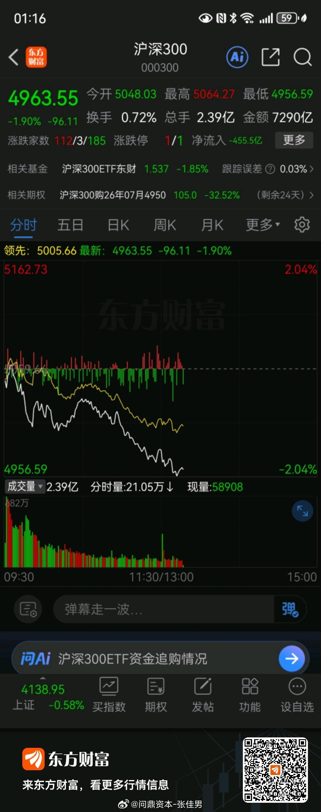

---

## 5

@纯银V

发表于：2026-06-23 02:34

来源：微博

链接：https://m.weibo.cn/status/5312919017357491

时间线上看到一个讨论，说互联网巨头的经营逻辑基于对普通人的掠夺，这句话指向的是网约车司机和快递员。那么问题来了，作为网约车乘客和外卖消费者的普通人，他们被掠夺了吗？

没有，被掠夺的是劳动者而不是消费者。

好的，下一个问题。即便滴滴和美团把自己的利润都让出来，利润为零。对于百万量级的网约车司机和快递员群体来说，收入也增长不了几个大子儿。网约车司机和快递员的收入增长，核心要素是消费者来承受价格增长。

那么你问问普通人，他们愿意付出多 10%的价格换取劳动者的收入增长吗？

你再问问被掠夺的劳动者，他们选择这么一份被掠夺的工作，是因为明明有更好的工作，但有人拿枪指着他的头，不允许他换工作吗？

呼吁道德只需要打一行字，理解市场运行的规律可就太消耗脑力了。

呼吁者里也有公司经营者，不知道他们的公司员工里，薪水较低的那些，看见“被掠夺”这三个字是什么样的感受？他会认可自己能力有限，做不到多劳多得吗？ 

PS：我在英国打车，3 公里折合人民币一百多元。这不是关键，关键是这个收入水平，开 Uber 的全部是南亚裔和黑人，直说就是愿意承受较低收入水平的人。当然我们也可以骂全世界的资本家都心黑肠子烂……

算了，正经说话的表达是“市场购买愿意接受较低收入的劳动力（这是他们能找到的最好的工作），降低商品价格，给全社会消费者带来普惠，同时创造大量的工作机会。” 在市场竞争和监管下，现状有许多提升空间，但掠夺劳动者这套说辞放之四海老板而皆准。

---

## 6

@每日人物

发表于：2026-06-23 04:41

来源：微博

链接：https://m.weibo.cn/status/5312950879655356

【\#互联网大厂裁员潮\#】全球科技行业正经历一场由AI驱动的大规模裁员潮。Meta计划裁减20%员工，约1.6万人；甲骨文上财年裁员约2.1万人；亚马逊削减1.6万个企业岗位。2026年第一季度，科技行业累计裁员超8万人。

Meta部门经理酒哥，把等待裁员的过程比作“俄罗斯轮盘赌”——“每逢周三，就对着脑袋开一枪，枪响了就拜拜，枪没响，就等下周三再来一枪”。他20年前从化学转码入行，见证了计算机从朝阳行业到如今被AI追赶的全过程。如今，Meta强制要求70%工作由AI完成，甚至成立AI-Native组——1个经理管理50名组员。酒哥感叹：“人与人之间好像突然没有了格子间，也没有秘密，每一台电脑都是一双眼睛。”

这次裁员和以往不同。2022年Meta首次裁员时，扎克伯格眼眶通红；如今，他“从眼眶通红变成了满面春风”。裁员消息传出后，Meta股价上涨近3%。有分析指出，将裁员归因于AI比承认业务失败“更能向投资者传递积极的信息”。酒哥说：“未来肯定依然需要人类，但需要的是更加强大的人类……可能一个人类要变得很像AI，才能在职场里存活。”

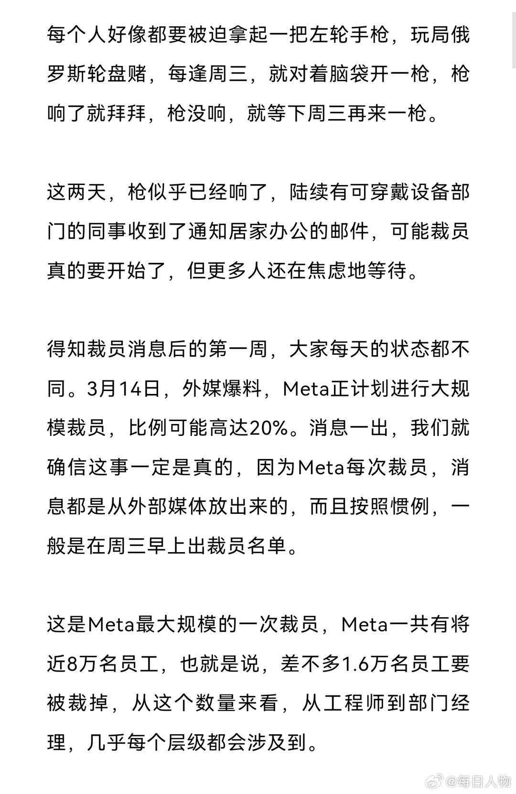

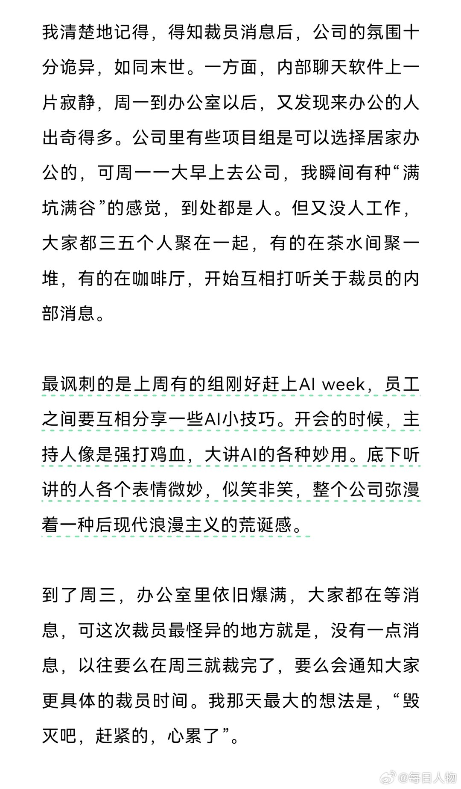

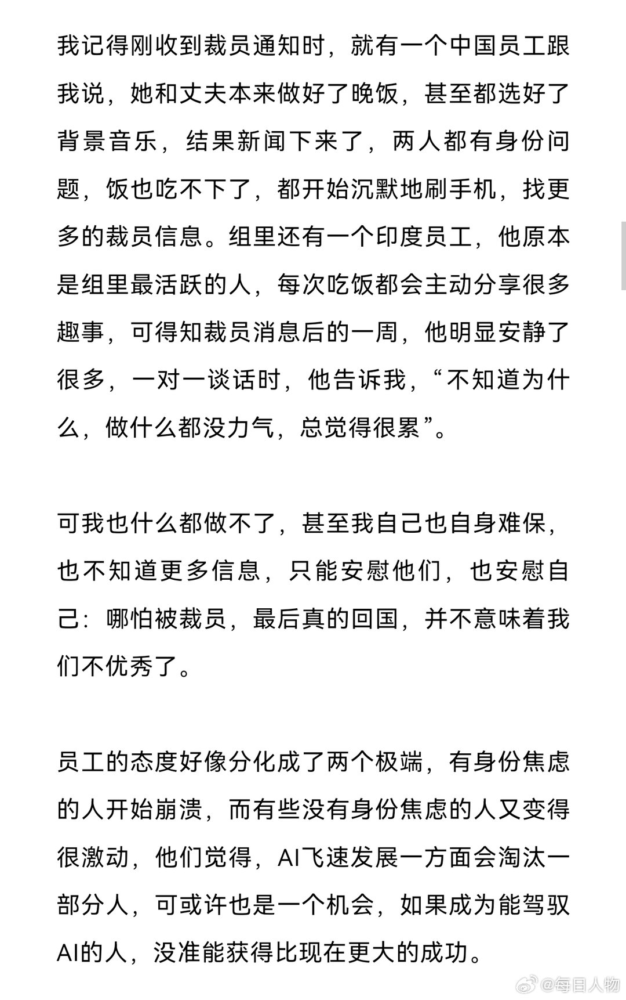

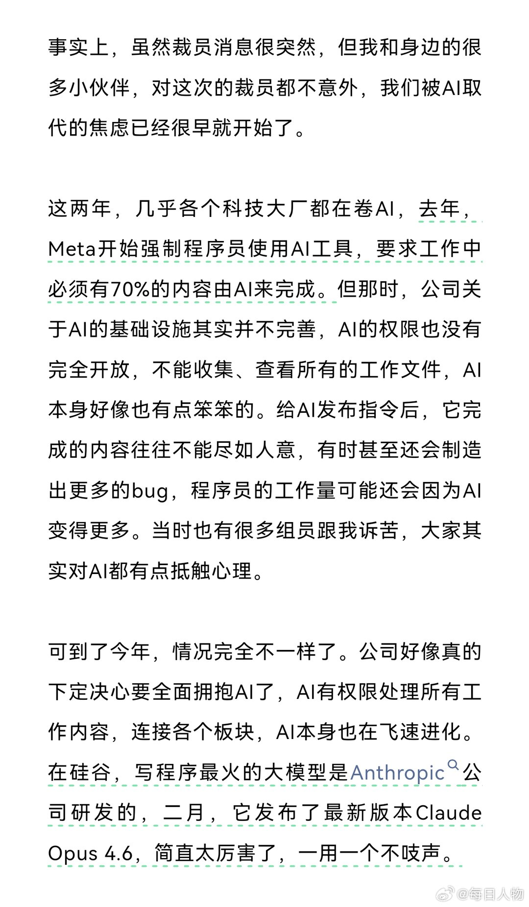

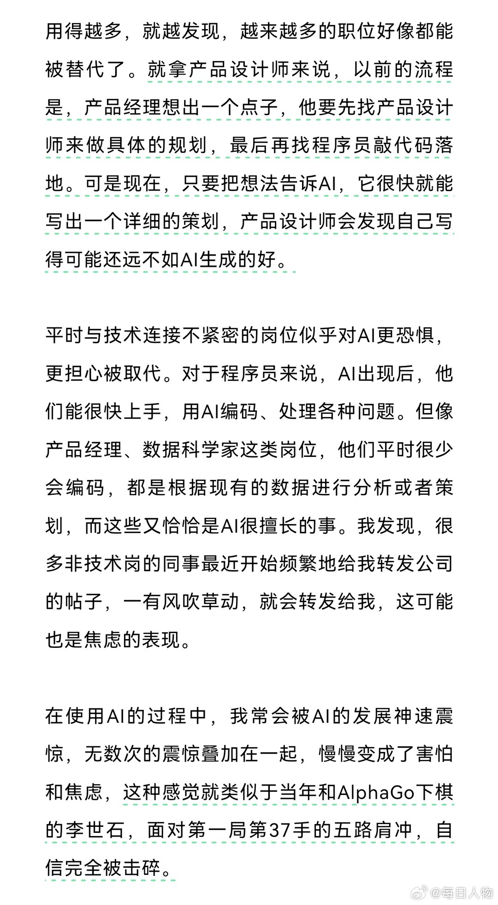

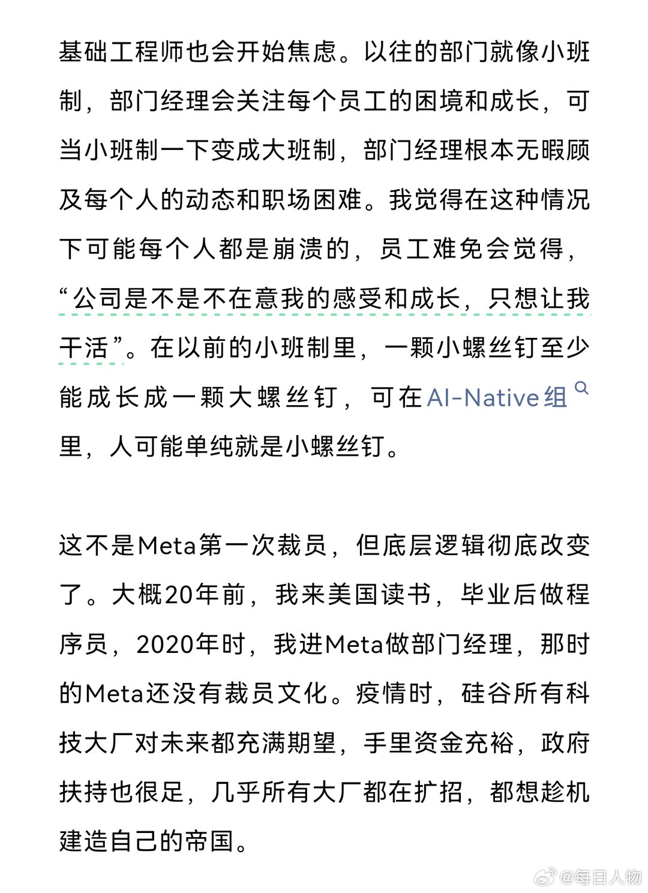

---

## 7

@李楠或kkk

发表于：2026-06-23 04:30

来源：微博

链接：https://m.weibo.cn/status/5312948345767081

本来，codex 因为软件 bug 刷爆个 ssd 其实根本就不算什么大事。。。

而随着存储不断涨价，现在已经变成新闻了。

更新最新版本的 codex 解决。

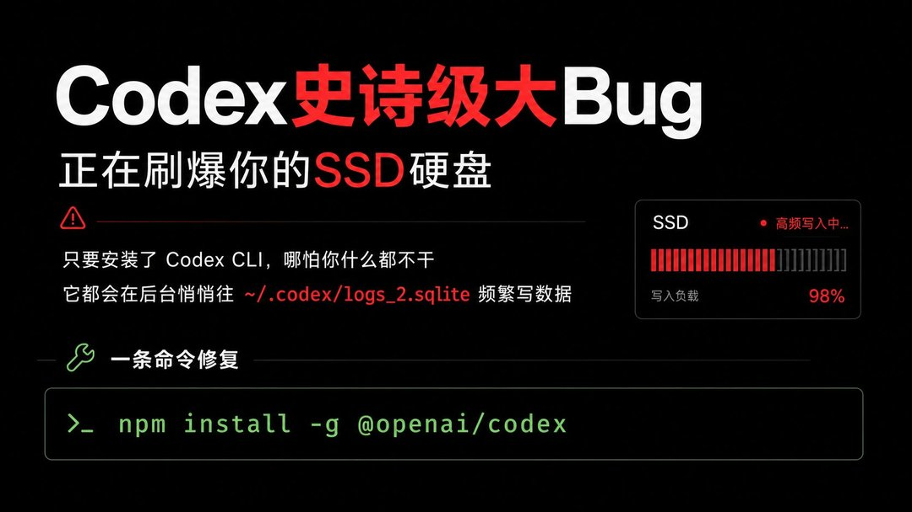

---

## 8

@物理芝士数学酱

发表于：2026-06-23 05:30

来源：微博

链接：https://m.weibo.cn/status/5312963222178471

\#互联网往事\# 

互联网中期最著名的游戏梗之一， “Eternal War / The Eternal War of Civilization II” 或 “The 10‑Year Civilization II Game”

2012 年，一位 Reddit 用户（ID Lycerius）确实分享了一个玩了 10 年的《文明 II》存档。他从 2002 年 开始玩，到 2012 年已经断断续续玩了 10 年。

游戏年份推进到了 3991 AD

游戏进入了极端后期

科技树早已研究完

世界陷入停滞

世界只剩三个超级大国：美国、凯尔特人、维京人。

三方陷入 无休止的核战争

城市不断被摧毁、重建、再摧毁

全球环境恶化，海平面上升

大部分土地变成荒地、沼泽或废墟

这个存档被网友称为“一部反乌托邦小说”。

许多玩家下载存档，尝试结束核战争。但几乎都失败了，因为 AI 会立刻再次发动核打击。

原帖 I’ve been playing the same game of Civilization II for almost 10 years. This is the result.

网页链接

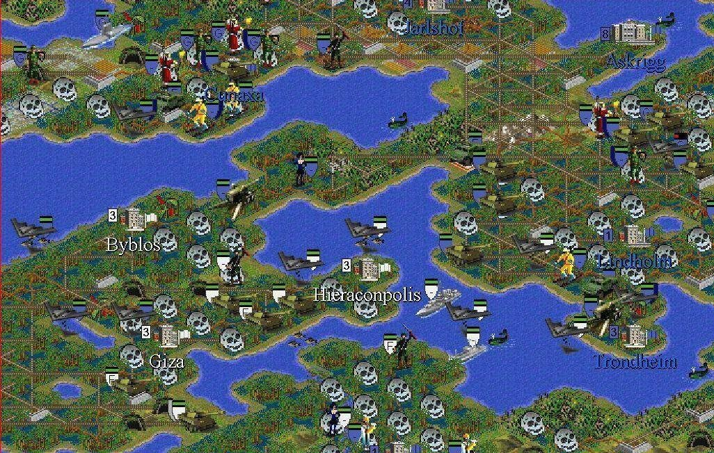

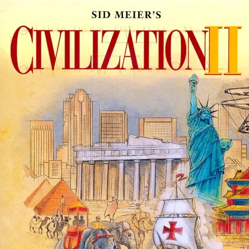

---

## 9

@蜗牛了了18

发表于：2026-06-23 02:53

来源：微博

链接：https://m.weibo.cn/status/5312923731756037

有小伙伴不太懂现在美学追求的什么窄脸折叠度啥的，我就拿朱琳老师举个例子，图二就是按照现在美学号口中的高折叠度，配上一套网红妆p的（对不起朱琳老师🧎♂️），图一是朱琳老师原图，就是被现在嘲讽脸大脸扁，鼻梁不够挺，鼻头不够窄，但其实人家按中式美学来分析的话，朱琳老师三庭五眼真的够标致了，所以我庆幸她们这批美人生在当年了，要是生在当下，想象朱琳，何晴，陈红，龚雪啥的被捯饬成图二这种鬼样子，我真的会力竭的……

---

## 10

@科技新一

发表于：2026-06-23 08:16

来源：微博

链接：https://m.weibo.cn/status/5313005220007485

当年黄金涨的时候，网友：黄金是硬通货，只会涨不会跌。

如今黄金跌了，网友：黄金又不是啥生活必须品，肯定还会继续跌。

你们为啥这么善变？\#金价狂泻30%\#

---

## 11

@财联社APP

发表于：2026-06-23 11:04

来源：微博

链接：https://m.weibo.cn/status/5313047390587893

\#空头警告AI周期已接近终点\# 【AI周期已接近终点？空头大佬警告：暴跌30%至50%的大熊市即将到来】财联社6月23日讯，本周二，全球科技股都经历了“黑色星期二”——从韩国三星、SK海力士均大跌超过了12%，带动韩国KOSPI指数大跌了10%开始，日股、中国台湾股市、A股和港股的科技股均集体大跌。而现在，随着美股盘前交易已经开始，美国的主要科技股也出现了显著下跌。

截至发稿，英伟达盘前跌了2.87%，美光跌了7.6%，台积电、高通跌约5%，博通跌接近4%，迈威尔跌8%。迷你纳斯达克指数期货跌了2.48%，3倍做多韩国ETF-Direxion一度重挫32%。备受关注的SpaceX股价盘前一度下跌5%至147美元左右，已低于150美元的首日开盘价，面临市值跌破2万亿美元的风险。

在席卷全球股市的恐慌情绪中，一个疑问开始浮现在不少人的心头：“人工智能行情已经到头了吗？”

近日，一场来自“新债王”冈拉克（Jeffrey Gundlach）和“股市先知”祖劳夫（Felix Zulauf）在上周的深度对话，可能会给股市多头们带来一个绝望的答案：这轮由AI题材带动的多头行情正走向终点，接下来等待市场的，不会是20%左右的回撤，而是一场跌幅达到30%到50%的大熊市。（编辑 刘蕊） AI周期已接近终点？空头大佬警告：暴跌30%至50%的大熊市即将到来

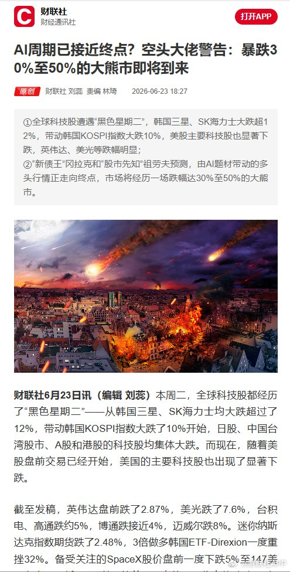

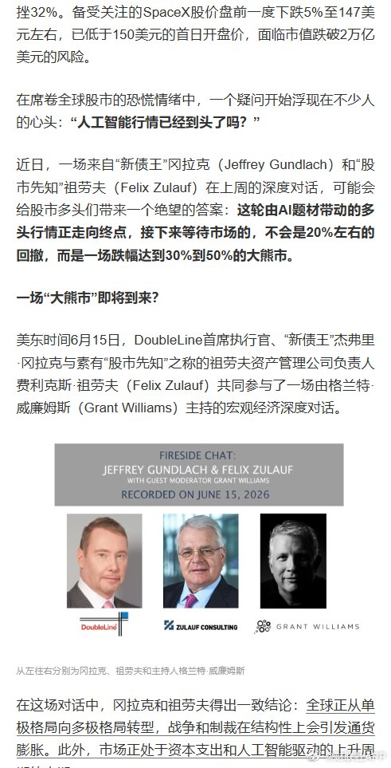

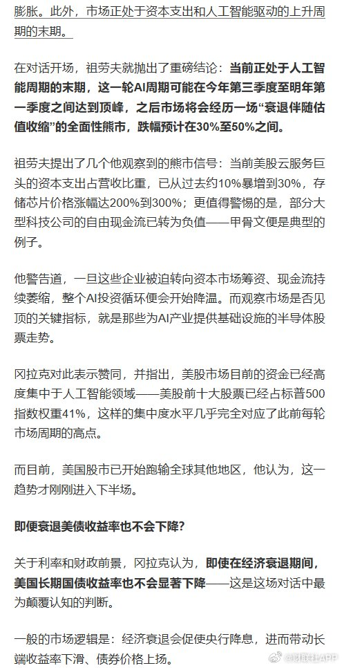

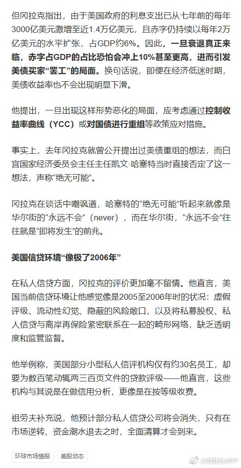

---

## 12

@有个梨GPT

发表于：2026-06-23 10:43

来源：微博

链接：https://m.weibo.cn/status/5313041983865128

电厂建了，除非电价跌破发电成本，否则总是可以用上的。这种才能叫infrastructure。云计算在相当大的意义上也是，更新没那么快。但AI就是个问号了。虽然说算力卡可以类比硬盘三年一换，但是成本比例不对，所以它对市场需求的溢价能力要求是很高的。

我不记得是不是PC Mag最早有过一篇文章了，是说谷歌为什么早期能够在搜索引擎业务里胜出，核心的原因是它的计算架构用稀烂的低成本服务器容错完成的搜索引擎，以至于成本只有竞争对手的高大上硬件和空调机房的1/5。

AI时代这个故事一定会重演，会有人在成本上梭掉显著比例的竞争对手，连带着很多IDC业务也会遭殃。

---

## 13

@李建秋的世界

发表于：2026-06-23 10:38

来源：微博

链接：https://m.weibo.cn/status/5313040819948451

\#全球资产突然全线下跌\# 

知道股票市场什么时候亏最多？牛市。

这一波炒股的很多年轻人没有见识过2014-2015年那几年。

上一次大牛市我是亲眼见证了那种惨烈程度，

和现在的韩国一样，当年股市也充斥着各式各样的杠杆，三倍四倍家常便饭，

当时是什么情况？千股跌停，两千股跌停，不管你是什么股票，全杀。

一堆的股票是开盘跌停，再开盘再跌停，卖都卖不出去，

杠杆+反复跌停。

牛市是老百姓最容易亏钱的时候，因为熊市老百姓看都不看，都不会参与。

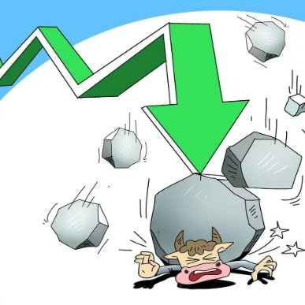

---

## 14

@信号与噪声

发表于：2026-06-23 11:10

来源：微博

链接：https://m.weibo.cn/status/5313048938023758

冷知识：

智谱Ai 今年涨幅是2200%

比美光325%、海力士348% 、三星195% 、闪迪858%加起来都多

---

## 15

@三少爷的剑v小天狼星

发表于：2026-06-20 11:00

来源：微博

链接：https://m.weibo.cn/status/5311959265447973

前两天太太给我看了一条新闻，就是截图里的内容。

银行将两岁孙子告上法庭…

银行起诉2岁孩子还贷法院判了

\#微博智搜内容共创计划\# 

新闻讲的是：江苏镇江，爷爷用房子抵押贷了50万，结果爷爷和父亲同一天意外离世。银行把奶奶、妈妈，还有那个连钱都不认识的2岁孩子，一并列为了被告。

她跟我说，她们行里同事也在讨论，评论区全炸了：“银行穷疯了”、“黄世仁都不这么干”、“把孤儿寡母往绝路上逼”。

基本论调就是截图里，我们伟大的新闻媒体同志们，才干得出的“恶心事”。

我问太太，你咋看？

“总觉得，不太合适啊…”

一个在银行干了十几年的老银行人，尚且会被一篇报道引导到情绪化的方向上去，更何况那些完全没有专业知识的普通人呢？

舆论到底在干什么？

第一段：那就先就事论事，讲讲这件小事。

一、搞明白一个词：尽职免责

在聊这个案子之前，得先理解一个词：尽职免责。

什么意思呢？就是你把该做的事全都做了，能做的全都做到位了，流程全部走完了，那就算最后出了坏账、亏了钱，也没人能拿这事儿追究你的责任。

审计来了也挑不出毛病，股东追责有凭有据，监管问了也答得上来。

反过来，如果你跳过任何一个环节，哪怕你是出于“好心”、出于“同情”，那对不起——这叫违规操作，这叫国有资产流失，这叫股东利益受损，这叫渎职。

帽子一顶比一顶重，随便扣一个下来，你就完了。“你是不是收了不该收的啊？”

我们要搞清楚：银行贷出去的钱不是哪一个人的，是有监管红线的。谁敢拍脑袋“善良”一下，把账消了，明天纪委就来找你喝茶了。

这和“涉及谁？”、“涉及多少？”都没关系。

所以银行做任何事，第一优先级不是"善良"，是合规。不合规的善良，是把自己往火坑里推。连自己都保不住的人，拿什么去帮别人？

这就是我这些年做风控相关工作的最深体会：

行善的前提，是你先要有能力行善。而能力的第一条，就是保护好自己。

二、从风控视角通盘看：这个案子，银行没别的路走

回到这个案子。

绝大部分被媒体引导的人：银行起诉2岁婴儿，冷血。

你站在风控的视角通盘看：

银行要核销这笔50万的坏账，必须把全部法定继承人都列为被告，拿到法院的生效判决，才能合规地把账平掉。一个都不能少，少了就是程序瑕疵，通不过审计，核销不了。

这就是尽职免责的逻辑。银行是在用完整的诉讼流程，完成"我已经穷尽一切手段追偿"的闭环。只有这样，审计来了才无话可说，监管问了才理直气壮。

如果银行只起诉奶奶和妈妈，漏掉了这个代位继承的2岁孩子——你觉得法院判决还有效吗？审计一查："你凭什么跳过法定继承人？是不是故意的？是不是有猫腻？"

到那时候，经办的人怎么解释？"我同情孩子所以没告他"？

你觉得这个理由在审计面前站得住脚吗？站不住。审计不跟你谈感情，只跟你谈规则。

所以银行要做的，不是"少告一个算一个"，而是一个不落，全部告完，拿到判决，账平了，以后再也不找这家人了。

然后，看细节：妈妈和奶奶放弃了财产继承。

为什么？很多人其实搞不懂继承对应的除了财产，还有债务。

爷爷去世，财产继承人是爸爸和奶奶。奶奶不要了，那就是妈妈和孩子。妈妈不要了，那就剩，这个未成年的孩子了。

你们觉得，这主意，谁出的？

为什么要等到他们继承过程终结了，才起诉呢？

要明白，债务，优先于遗产继承哦。

银行是 sb 吗？

这个后面说。很有意思。

三、不起诉的后果是什么？

太太当时问我："那如果银行不起诉呢？孩子不是就不用上法庭了？"

我说你换个角度想：不起诉，这笔账就永远挂在那儿。 挂一年，挂五年，挂十八年，等到这个孩子成年了，突然有人告诉他——你爷爷18年前欠了银行50万，加上利息罚息利滚利，你作为继承人，今天得还。

合理吧？也很合法。

你想想那个画面。一个刚满18岁的孩子，正准备上大学，或者刚步入社会，突然被一份法院传票拍在脸上。要明白哦，高校招生都要考虑“是否涉及司法”哦。

这笔债就是悬在孩子头上18年的达摩克利斯之剑。他从小就知道自己背着一笔债，他的遗产继承、财产处置、未来规划，全部笼罩在这个阴影底下。

银行当然知道，真等到孩子成年再去追，其实，大概率也追不回来多少。

但"追不追得回来"是一回事，"有没有尽到追偿义务"是另一回事。

请记住，就事论事的重要性和能力，是判断一个人，认知的基本要素。

只要这笔账还在系统里挂着，监管就会盯着，催收就不会停，这个家庭就永远没有消停的一天。

银行要的是把账从系统里彻底抹掉。不是转给下一任催收员，不是挂账18年等孩子成年，而是现在、此刻、合规地、永久地，让这笔债消失。

那就只有一条路：走完所有该走的程序，拿到法院判决书，合规核销。

同时，善意告知“你们谁继承这一起承担，打官司没问题，我们奉陪，我们不一定赢的，我们输了，你们律师费，也可以是我们出的。”

四、把婴儿列为被告，反而是"锁死"了孩子的救命钱

把孩子列为被告，是在保护他。

如果不把孩子列为被告，法院大概率只会在成年人之间分割遗产和债务，法官不会主动给一个没出现在案卷里的孩子划拨专项资金。

但一旦孩子成了被告，法律就必须强制启动"必留份"制度（请参看《民法典》第1159条，这条，所有大厂、国企法务应该都很熟）。

清偿被继承人债务前，必须优先为缺乏劳动能力又没有生活来源的继承人——比如这个2岁的孩子——保留必要的遗产份额，用于生活费、教育费、医疗费。

这笔钱的优先级凌驾于银行债权之上。

好了，理理逻辑：

债权大于遗产继承但，小于未成年继承人基本生活权利。

再来看看本案最终判决：

法院从遗产中强行划出15万元作为孩子的"成长保障金"，剩余资产才去还银行。

这叫“必留份”原则，请记住，说不定啥时候就能用到。

哦，这里请注意，爷爷去世，是留了大概 30 万遗产的，但明面上是资不抵债，还欠银行 50 万。

对吧？所以，法院裁定是：先搞定孩子这个唯一继承人的生活保障，再谈债权。

银行：我们完全无异议哈。

至此，银行拿到了合规判决书平账，孩子拿到了法律硬性保障的生存底牌。

流程走完，账平了，银行以后再也不找这家人了。这个孩子成年后，没有任何人来追他，没有任何历史包袱影响他的人生。

如果银行没起诉孩子，法官有什么理由专门给这个未成年人留出15万？靠银行口头慈悲吗？

正是这套看似冰冷的诉讼流程，用法律的铁腕，帮这个不会说话的孩子，把饭碗死死摁在了桌子上。

基于此，我和太太说："银行内部一定是通盘商量过，然后才动手的，甚至和法院都有沟通。"

法务、风控、业务条线坐在一起，把所有路都走了一遍，发现只有走诉讼这一条路，既能保护员工不被事后追责，又能让孩子顺理成章地继承遗产且不承担债务，还能让这笔账彻底闭环、永不翻身。

这是所有选项里，最合理、最友善、最善良的一条路。

叫嚣的二逼，你给条路走呗？

五、看似离谱的规定，后面一定跟着个奇葩故事。

各位，听说过"吃绝户"吗？听着遥远，其实从未消失。它不是古代才有的词——当一个家庭只剩孤儿寡母、无力自保时，身边那些"热心"的亲戚，往往会借着"代为打理"的名义，把财产蚕食干净。

举一个真实案例：

一个父亲意外去世，留下一套房产和一笔贷款，以及一个未成年的孩子。孩子的亲戚们蠢蠢欲动，开始琢磨怎么"帮孩子打理"这套房子。

这时候银行起诉了。把所有继承人——包括这个未成年的孩子——全部列为被告。

舆论又要骂了："银行冷血！孤儿都不放过！"

但你知道这一纸诉状下去发生了什么吗？法院的判决把全部遗产强制纳入了受法律监督的司法程序。遗产怎么分、分给谁、谁来监管——全部摆在台面上。亲戚们想伸手？对不起，法院盯着呢。任何想偷偷摸摸动手脚的人，都不可能了。

最终的结果是：法院依据《民法典》的"必留份"规则，优先为孩子预留出保障未来生活、教育的专项资金。

由于孩子可继承的财产价值未超出预留份额，法院驳回了银行要求其承担还款责任的诉求。

银行拿到判决书，完成了合规的坏账核销。而孩子呢？他保住了全部遗产。

那些原本可能被亲戚们蚕食殆尽的财产，通过法院的一纸判决，被牢牢锁在了孩子名下。

你看，完全一样的逻辑。

银行起诉，不是为了要钱，而是为了把财产拽进司法程序，让法院来主持公道。

银行拿到了判决，合规平了账；

法院动用了"必留份"，保住了孩子的活路；

而法院的介入，客观上阻断了"吃绝户"的发生。

一套流程，三方得利，而且谁都说不出话来。

这叫善良，骂街的键盘废物侠，不是。

六、顺便讲下遗产继承的事

很多二逼，就知道看这些不良媒体，在那骂银行骂监管…

尤其是在“我爸死了我是独生女我去银行取他钱结果银行要我证明我是我爸女儿”…

熟悉吧？

很多人都骂过吧？

该骂的是谁？是尼玛曝光的媒体和废物点心的当事人！

在多名继承人共存的情况下，银行没有权力自行判断"谁说了算"。

打个比方，还是上述的女的，后来发现，她爸，继承了她爷爷死后的房产和钱款。但是，她奶奶还在呢…明白了？

所以，她爸死后，第一继承人是谁？真只有她一个？

先搞清楚这点好吧？

她就不是她爸唯一遗产继续人！事后也证明了这点，她奶奶作为权利人，立马起诉了…

所以绝大部分这类事件，都是当事人搞不清楚状况、或者，自己直接装傻，想把责任嫁祸给第三方好吧！

有人说，哎呦，我没文化啊，我不懂啊，怎么能怪我呢？

废话！尼玛你自己的钱都不上心，能怪谁？？？

每一条看似逆天的规定后面，尤其是国企里，那一定是有个更离谱的“故事”。

银行在这里，要的是一份法院出具的调解书或判决书。有了这个，银行照章办事，谁都挑不出毛病。

看似冷血的自诉自告，其实是现行制度下唯一合规高效的办事路径。

而法院的这份判决，同样起到了我刚才说的那个作用——让这件事在法律上彻底终结。

从此以后，没有人能翻旧账，没有人能说"当初银行违规操作"，因为法院已经确认过了。

第二段：行善是一种能力——没有擦屁股的本事，就别谈善良

一、警惕那种慷他人之慨的“无脑行善”

这些案子放在一起，最值得琢磨的，是那些垃圾媒体和评论区里那些骂街的人。

先说那些没脑子的看客。

骂银行"欺负小孩"的人，骂银行"刁难家属"的人——他们错了吗？从情绪上，没错。从良心上，也没错。

但问题是，这种“善意”的成本谁来承担？

如果银行“善良”了，不走诉讼直接平账——后果是什么？审计进驻，员工被处分甚至开除。搞不好其他正常的坏账核销流程都被一刀切收紧，真正需要被豁免的困难家庭反而失去了合规出路。

慷他人之慨的善良，从来不需要承担后果。

骂完了，爽完了，拍屁股走了。

下一个热搜来了，他们就去骂下一个了。

而这种善良，本质上是大恶。因为它只负责发泄情绪，不负责收拾残局。

谁会帮你抵这个责任？没有人。

还有人舔着脸说“推动社会正义”？就你？

二、再说说那些“不能摆上台面”的善意：

老粉丝都知道，我是个“只打败仗的常败擦屁股将军”。

什么叫常败？就是不能打胜仗…

老板、管理层、董事会，有些事情不方便直接出面表达。可能是政策还没明朗，可能是话不能说得太直白，也可能是风口浪尖上不方便表态。但事儿得有人干，活儿得有人推进。

我就干这个。

把一些看上去不太合规、但实际上确实是在做好事的事情，通过我的“常败和擦屁股”行为，把流程走通，把动作规范化、合理化，让后续谁也找不出纰漏和漏洞，让这件事完美闭环。

所以，我才在公司有了这个外号，“藏头又藏尾的擦屁股将军”。

比如说，各种原因，想给某个困难员工特批一笔补助。按正常流程走不通，财务会说“不合规”、人力会说“没先例”。但这件事，又必须得做的时候。

这时候就需要有人去“擦屁股”：翻制度找依据，拉各部门沟通，补各种说明材料，走特批通道，把整件事包装得严丝合缝。最后钱发出去了，人也帮到了，审计来了也挑不出毛病。

再比如说，公司想做某个对客户有利、但短期内不挣钱的项目。董事会不方便直接拍板，怕股东质疑。

这时候又需要人去“擦屁股”：做详细的可行性分析，找法律依据，设计风险隔离方案，把短期亏损包装成“战略性投入”，让所有人都有台阶下。最后项目落地了，客户受益了，公司长期也赚了。

这叫什么？这叫行善的能力。

首先你得有能力。

行善这件事，门槛比想象的高得多。

它不是动动嘴皮子、表表同情心就够了。真正的行善，是需要技术、经验、耐受力，甚至是一点抗压能力和背锅勇气的。

你要在规则里找缝隙，在流程里找出口，在不违规的前提下把好事办成。你还要有能力扛住中间的各种误解、责难，还要确保事后被人翻旧账的时候，翻不出任何实质性的问题。

而且最重要的是——你要确保周遭的无辜的人不受牵连。

老板不方便出面，你出了。事办成了，功劳是老板的；事办砸了，锅是你的。

这都不算什么，真正难的是：你擦屁股的时候，不能把脏东西蹭到旁边不相干的人身上。

流程要走通，但签字的人不能被追责；好处要落到该落的人手里，但经办的人不能被审计盯上。

擦屁股的最高境界，不是把自己摘干净，而是所有人都干干净净。

没有这个能力的人，不要轻易谈行善。

因为你的善念大概率会在第一道合规关卡就被碾得粉碎，然后留下一地鸡毛，等着别人来给你收拾残局。

把烂账锁进流程里，把活路留给现实中的人。让好事能落地，让坏账能闭环，让该帮的人帮到，让不该背锅的人不被牵连。

这就是我在公司里一直在做的事。

擦屁股，就是行善。不是那种站在道德高地上喊两嗓子的行善，是那种脏活累活自己扛、把所有人干干净净送到对岸的行善。

骂街谁都会。会擦屁股，才是真本事。

第三段：依法治国与结果正义——司法判决的公共价值

一、法院判决的公共价值：让"这事儿了了"

以我个人理解，依法治国在微观层面的体现，就是法院能够在短时间之内，将相关的法律法条，以相对严厉且符合中国传统人文价值和道德底线要求的方式，把判决做出来。

这个判决有三个层面的意义：

第一，定分止争。 

银行告了，法院判了，各方该拿多少、该还多少，清清楚楚。银行拿到了判决书，回去合规平账，再也不用追着孤儿寡母要钱。被告拿到了判决书，该保留的保留、该放弃的放弃，再也不用担心被人翻旧账。一件事，在法律上彻底终结了。

第二，给各方一个可循的依据。 

原告凭什么起诉？被告凭什么抗辩？法官凭什么这么判？全都写在判决书里。银行有了法理依据，知道怎么合规操作；弱势的继承人有了法律武器，知道自己该争什么、能争什么。这就是公共准绳的价值——它让所有人都在同一个规则框架里行事，而不是靠谁的嗓门大、谁的关系硬。

第三，也是最重要的——给未来的类似事件提供了参照。 

这个案子判完了，下一个类似情况出现时，银行知道该怎么走流程，法院知道该怎么适用法律，老百姓知道自己的权利边界在哪里。每一次公正的判决，都是在为整个社会的法治信用体系添砖加瓦。

二、过程重要还是结果重要？我选结果

说到这里，我想插一个我跟别人争论过很多次的话题——过程重要还是结果重要？

我的答案一直是：结果重要。

我知道很多人会说“程序正义是基础”、“没有程序就没有正义”。这话没错，我认同。

但我想说的是——程序是手段，结果是目的。

我们设计程序、走完程序，最终是为了得到一个正确的结果。如果程序走完了，结果却是错的，那这个程序就失去了它存在的意义。

依法治国最基本的追求，我认为就是"结果正确"。

什么叫结果正确？

就是判决结果所代表的社会公共价值和道德观，能够完整地展现出来，并且作为一个定论，告诉整个社会：什么是对的，什么是错的，什么行为会被鼓励，什么行为会被制止。

你看这个2岁孩子的案子。法院判决的结果是什么？15万必留份给孩子，剩下的还银行，然后因为孩子没成年不执行，所以这账，免了。这个结果传递了一个极其清晰的信号：

第一，银行的债权受法律保护：

借钱不还不行——这是对契约精神的捍卫。

第二，但生存权高于债权：

一个2岁的孩子，他来到这个世界上，社会有义务保障他长大。他还没能力挣钱，你不能让他饿死——这是对人的基本尊严的捍卫。

第三，法律不搞连坐：

孩子没花过这笔钱，没签过字，没做过任何承诺，凭什么让他背债？——这是对个人责任的明确界定。

你看，一个判决，把契约精神、人道底线、个人责任这三层价值，清清楚楚地摆在了所有人面前。

这就是结果的力量。

它不跟你讨论“如果当初银行不告会怎样”、“如果法官换个思路会怎样”——那些都是过程中的假设。最终落到实处的，就是这份判决书上的白纸黑字。而这个白纸黑字所承载的价值判断，会成为以后无数类似案件的参照。

所以我说过程重要，但结果更重要。

过程是为了保证结果的公正，而不是为了过程本身。如果程序走完了，出来的结果跟社会公义背道而驰，那这个程序再完美，也是失败的。

我太太问我："那你觉得这个案子的结果正确吗？"

我说正确。

而且妙就妙在——银行的自保行为，法院的公正判决，孩子得到的那15万，这三条线在结果上交汇了。走完了所有程序，最终达成的这个结果，符合法律、符合道德、符合所有人的利益。除了那些只看标题就骂街的人，没有人不满意。

这就是我理解的依法治国：

不是把法律锁在法典里供着，而是让它在每一个具体的案件里活起来，让每一个普通人都能感受到它的存在，让每一方都能拿着判决书说“这事儿结束了”。

而这个“结束”的结果，恰恰是整个社会公共价值和道德底线的一次集中表达。

三、有时候“你去告我”才是最大的善意

聊到这儿，我太太问我："那你做风控这些年，有没有遇到过类似的情况——明明想做件好事，但非得走个很别扭的流程？"

我说太多了。我给你讲一个我做保险业务时的真实经历。

有一段时间，公司的保险业务和相关的法务工作也归我管。因为我是做风控出身，保险涉及的合规、法务、投诉处理，天然就跟我这条线绑在一起。

那时候我经常跟法务负责人沟通一件事——如何在合规的前提下，把“善意”表达出去，但又不能明说。

举个例子。有一些客户投诉，我们内部评估之后，心里其实很清楚：客户是对的，公司确实有问题。但这个“有问题”，不是违法，不是违规，而是服务上的瑕疵、流程上的不完善、或者某个一线员工的失误。按道理，公司应该承担责任，应该给客户补偿。

但问题来了——你不能直接说“我赔你钱”。

对吧？你得挣扎一下，是吧？

为什么？因为审计盯着呢。你今天因为一个投诉赔了钱，明天审计就会问：为什么赔？依据是什么？有没有标准？是不是私相授受？是不是在掩盖什么？如果你说不清楚，那就是合规事故。

你想做一件正确的事，但你得先过了审计以及其他恶意这一关。

那怎么办？

我跟法务负责人的要求是——在合规的前提下，给客户一个明确的暗示：你可以去起诉我们，而且你很有可能会赢。如果你赢了，诉讼相关的费用，我们来承担。

这话不能明说。你得用法务的语言，用合规的措辞，让客户“听懂”你的意思。

翻译成人话是什么？“你去告我吧，你会赢的，赢了钱归你，诉讼费我们出。”

客户听懂了。起诉。法院判了。客户赢了，拿到了应得的赔偿。公司呢？拿到了法院判决书。有了这份判决，审计来了——“为什么要赔这笔钱？”“法院判的。”“哦，那没问题了。”

流程合规了，审计过关了，风控闭环了，客户满意了。最重要的是，公司没有因为这件事产生任何舆情商誉风险。

你说这算什么？这他妈就是行善。

不是跪下来求客户“你别告我了，我私了行不行”——那是违规，那是给自己埋雷，那是把公司和自己都置于危险之中。

真正的行善是什么？是我告诉你一条合法的路，你去走。你走通了，你赢了，你拿到了你该拿的。我呢？我拿到了判决，我合规了，我平账了，我安全了。咱俩都安全落地，谁也不用担惊受怕。

这就是我一直在说的——行善的前提是不要把自己置于危险之中。你自己都保不住，拿什么去帮别人？

第四段：基层互相压榨与不良媒体的角色——始作俑者之一，也是最重要的传播链条

聊完了案子、聊完了行善的能力、聊完了依法治国，我想把视角拉得再大一点。

我一直在跟人讨论一个概念，叫做“基层互相压榨”。

什么叫基层互相压榨？就是老百姓觉得基层单位在刁难自己，基层单位觉得老百姓动不动就投诉在找茬，上级不管不顾就是以行政手段强迫基层单位必须“处理完毕”？怎么处理？不告诉你，自己想办法吧…双方情绪对立，互相消耗，互相折磨。谁都不好过，但谁都觉得是对方的错。

消费者也是，没理的情况下，擅用投诉权，为啥呢？人性本恶以及“毫无成本”。

就这么简单。

基层单位被压得有苦难言，老百姓也怨气冲天。两边都在受罪，但两边都觉得自己是受害者。 这种互相压榨的局面，就这样形成了。

而在这个恶劣的基层互害生态中，始作俑者之一，也是最重要的传播链条之一，就是新闻媒体和自媒体。

你回忆一下，每隔一段时间，就会有一波"银行刁难老百姓"的新闻刷屏。

遗产继承，银行说要这个证明那个证明，要公证要诉讼，媒体一拥而上：“银行冷血！”、“老百姓办事跑断腿！”，好，热度够了，流量吃了，骂声赚了。然后呢？

然后他们拍屁股走了，去找下一个热点。

留下一地鸡毛，留给那些真正在做事的人去收拾。

我告诉你，如果银行真的图省事，睁一只眼闭一只眼让你把钱取走了，将来其他继承人找上门来告银行——这笔钱，你赔吗？ 你不赔。银行柜员一个月几千块钱工资，你让他冒着被开除、被起诉的风险，凭一张死亡证明就把几十万存款给你？他凭什么？

但媒体不关心这些。他们只关心流量。

再比如说，前两年有个新闻闹得很大——“家属抬着老母亲进银行，人死在银行大堂”。

媒体铺天盖地报道，说银行冷血、说银行不通人情、说银行逼死人。舆论一边倒，逼到银保监会都亲自出来表态，这事才算暂时平息。

但我可以告诉你，据我当时了解的情况——这件事里，银行的工作人员确实有流程执行上的瑕疵，但核心的真相是：那位老人家其实已经差不多了，家人心里是清楚的。他们就是在等她死在银行大堂里。

为什么？因为死在银行，舆论就炸了，银行就得赔钱，就得妥协，就得“私了”。这不比安安静静死在家里划算多了？

这话很难听，但这就是…

媒体和自媒体不是没有能力去验核这些事实。他们是根本不想验核。 验核了，真相出来了，新闻就没那么刺激了，流量就没那么大了。他们要的是“银行告2岁婴儿”这个标题，要的是“家属抬着老人死在银行”这个画面，要的是能引发情绪海啸的那一把火。至于这把火烧完之后，被烧毁的基层信任怎么重建、被误导的民众情绪怎么平复、被妖魔化的民生单位怎么生存——他们根本不关心。

他们罔顾事实，抛开任何专业性，为了流量不择手段。

他们不关心真相，不关心后果，不关心那些真正在做事的人会被骂成什么样，更不关心那些被误导的普通老百姓，从此对银行这些民生基础单位产生多么深的恶意和抵触情绪。

媒体赚了流量，老百姓积攒了怒气，基层单位承受了恶意——最后倒霉的是谁？是你我这些每天要去银行办事的普通人，是那些每天在柜台后面挨骂的普通员工。

舆论最恶的地方就在于此：它用情绪替代了思考，用立场替代了真相，让基层互害愈演愈烈，让老百姓对民生基础单位产生本能的抵触，让真正需要帮助的人一上来就带着敌意，让本来可以好好沟通的事情变得剑拔弩张。

然后呢？然后媒体拍屁股走了，去找下一个热点。

留下一地鸡毛，留给那些真正在做事的人去收拾。

最后：总结

下次再看到这种"突破底线"的热搜时，先别急着把情绪拉满。

面上的文字往往只是诱饵，面下的制度闭环，才是决定普通人最终能否好好生活下来的关键。

真正有价值的善良，从来不是那些看起来最响亮的口号，而是那些藏在流程深处、需要有人默默擦干净每一处毛边的、扎实的兜底。

我们的舆论环境，已经让“基层互害”变成了常态。媒体吃流量，老百姓积攒怒气，民生单位承受恶意，最后谁也没捞着好。

能破局的，不是更多的情绪，而是更多的理解、更多的制度、更干净和权威的媒体道德，

有这个能力，才有资格谈善良。

借鉴@法兰西的小法师 @魔法师蛋小丁 @专业戳轮胎熊律师 @所以我放弃了闪刀 的评论。以及@米芋说 原帖。

还有 长江云新闻 你个垃圾标题党 专栏 · 三少的故事 专栏 · 三少碎碎念…金融专业的闲言碎语

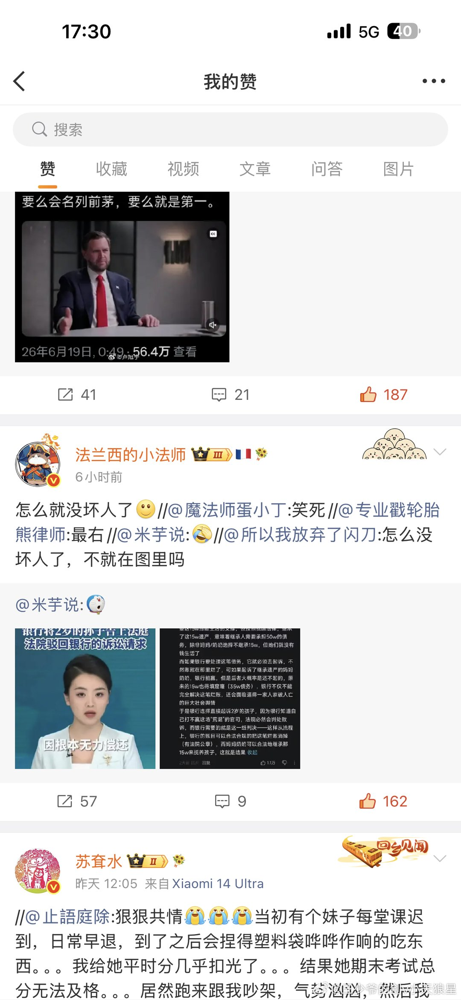

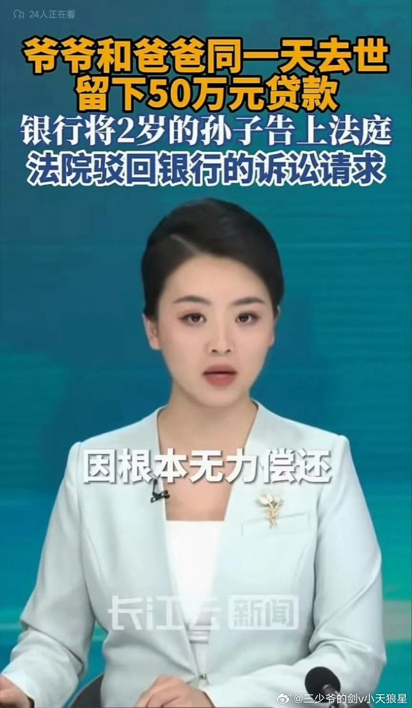

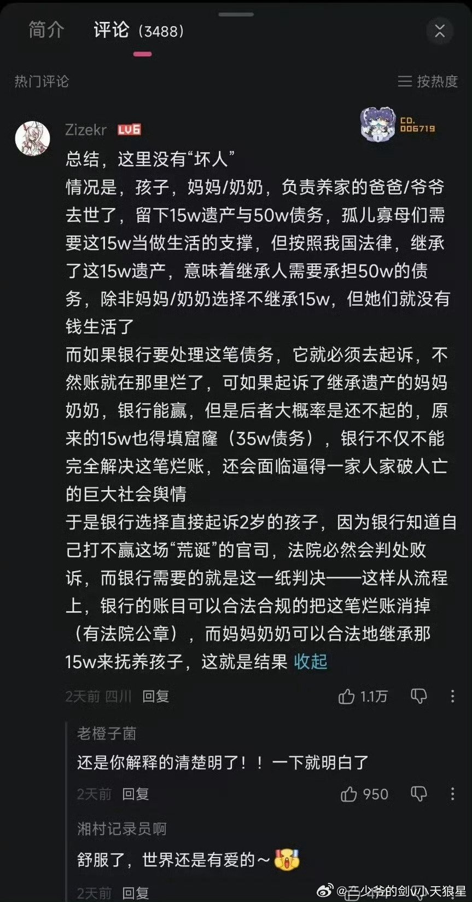

