# 2026-06-25

## 1

@向小田

发表于：2026-06-24 05:03

来源：微博

链接：https://m.weibo.cn/status/5313318908071268

两大核心事件：

1、英伟达砍单Rubin芯片25%，产能给Blackwell；

2、海力士放缓HBM4，转产DRAM。

归根到底是HBM4太难了，至今都没有稳定达标量产。现阶段封装良率不到60%，堆10颗废一半，达不到盈亏线，生产就亏损。

现在生产DRAM利润率比HBM4高，那为啥还要生产。海力士也不傻。

现在AI一个很大的风险就是技术发展跟不上市场预期。市场对于技术研发的难度低估了，认为芯片迭代升级很丝滑，实际上很有可能遇到重大挫折。过去英伟达的芯片也不是100%成功，AMD的芯片流片失败的案例也不少，多次流片拿回来改的更是数不胜数。

这些事件都会对供应链产生比较大的扰动。

---

## 2

@塔列郎

发表于：2026-06-24 05:12

来源：微博

链接：https://m.weibo.cn/status/5313321215722484

曾经生活在苏联的人们仍然记得那里各种各样的小吃店、咖啡馆、咖啡店和餐馆。

当时最受欢迎的是食堂：幼儿园小朋友、中小学生、商务旅客、学生、各行各业的员工以及没有机会在家吃饭的单身人士每天都会去食堂吃饭。

第一批食堂，或者更确切地说是巨型厨房工厂，早在 20 世纪 20 年代末就出现了。

她们的目标是将工人从家庭奴役中解放出来：现代女性可以不用站在炉灶旁做饭，而是用容器把午餐带回家。

另一种选择是在宽敞、干净的房间里享用家庭晚餐：对于居住在拥挤的集体公寓和营房里的人们来说，这是一个有趣的提议。

你可以在食堂吃午餐，有些情况下也可以吃早餐。但到了晚上，食堂就关门了，没有任何娱乐活动。与餐馆不同的是：食堂从不供应酒水。

餐饮场所的内部装潢较为简朴。大型工厂厨房很快成为历史，但食堂的规模依然很大。当时的主要目标是尽可能快地为尽可能多的人提供餐食。这对于大型企业来说尤为重要。

人们从分发点领取食物，自己将食物装入金属或塑料托盘，然后在桌子旁落座。

当时人们并不习惯像在食堂、煎饼店和饺子馆那样站着吃饭。

桌子上铺着油布，摆放着花瓶、餐巾架和盐瓶等装饰品。

餐具是陶制或金属的，刀叉是铝制的。繁忙的自助餐厅常年面临叉勺短缺的问题（不向用餐者提供刀具）。

食堂的菜单仍然唤起了许多曾在苏联生活过的人的怀旧之情。

正是公共餐饮业推广了经典的“三道菜套餐”。这里的小菜种类并不丰富：菜单上有“维生素”沙拉、甜菜沙拉、奶酪和黄油。

大多数用餐者最爱的第一道菜是红菜汤（乌克兰式、莫斯科式或海军式）、哈恰普里汤、杂拌汤、腌黄瓜汤、豌豆汤。

白菜汤和鱼汤不太受欢迎，据用餐者反馈，厨师只是不擅长做得美味。垫底的则是牛奶面条汤：无论大人还是小孩都不喜欢它，主要是因为上面总是结着一层奶皮。

第二道菜可以选炖肉、肉饼或配肉汁的炸肉排、肉丸、肉圆。

不提供里脊肉或整块肉做的菜，更喜欢用碎肉制品，里面加入了面包、炒洋葱和厚厚的面粉或面包糠外衣。

配菜提供土豆泥、水煮米饭、通心粉、炖白菜。

一道非常受欢迎的菜是“海军式通心粉”。如果厨师不节省肉的话，这道菜会非常美味且饱腹。

食堂菜谱中的亮点还包括配青豆的香肠和饺子，人们喜欢蘸着酸奶油吃。

食堂午餐必不可少的结尾是干果水果羹。味道取决于厨师的用心程度：水果羹可能浓郁芳香，也可能寡淡如水或过甜。另一种选择是用工厂块状原料冲调的浑浊果子羹。

当季时会供应新鲜苹果水果羹和浆果汁。也可以用三升罐装的果汁结束午餐，苹果汁和番茄汁尤其受欢迎。

有些人喜欢热饮：可可、加糖红茶、加牛奶的菊苣咖啡混合物。早餐提供纯牛奶和开菲尔。

食堂里几乎不提供甜点。用餐者会就着茶或水果羹买些糕点（有时就在店里烤制，这被认为是非常走运的事）。小圆面包和甜甜圈有助于增加热量：在苏联时期，人们认为食物应该尽可能地富有营养。

有时菜单里会加入一些简单的糕点：沙质饼干条和圆环、奶油泡芙。

另一种结束午餐的选择是奶酪烤饼或奶酪饼。

食堂午餐的独特补充是装在杯子里的普通酸奶油。男人们更喜欢这样：这种浓稠的奶制品可以成功替代小吃和甜点。任何午餐的重要补充是黑面包或白面包。

没有面包的食物被认为是“空的”，不顶饿。

但香料并不受欢迎。厨师们只限于盐、胡椒和醋，用餐者自己也只往食物里加这些调料。

有一次，我们（作为学生）去集体农庄劳动，走进农庄食堂，大家都按习惯每人拿了两块肉饼，或者两份肉之类的。在取餐窗口领到食物时，有些人开始紧张（看到份量之大），结果到收银台一算，每个人只花了六七十戈比。很多人最后都没吃完。后来有人给我们解释说，他们的食堂就是为了让工人吃饱，而饿着肚子是干不好活的。

农庄机械师的妻子们抱怨说，收割季节过后，家里的男人都喂不饱了（他们已经习惯了在农庄里被喂得像过节一样）。

---

## 3

@tombkeeper

发表于：2026-06-24 05:24

来源：微博

链接：https://m.weibo.cn/status/5313324291983936

杭州现在有接近 6 万名主播，相关上下游从业者超过 120 万人。考虑到杭州常住人口 1200 万，也就是说杭州 10% 的人靠网络视频活着。这还是全杭州，如果是滨江区这种地方，比例就更高了。

所以，凡是视频发布地理位置是杭州，但口音不是杭州的，默认当剧本看，除非被证明不是。

---

## 4

@李楠或kkk

发表于：2026-06-24 04:37

来源：微博

链接：https://m.weibo.cn/status/5313312453560680

我是真的服了 Claude 和这帮 AI 圈子的人太 TM 能造词了。。。

Loop 才多久，今天又来了一个 Tag 。。。

RAG，Prompt，MCP，Agent，Context Washing，Harness，Loop，Verify Gate。。。

有这么难吗。。。不就是 LLM 越来越像一个真正的人了吗。。。

LLM 是一个大脑，

有了 MCP/CLI 他变成了一个能用工具的学生，

给它定好规矩（Harness）、分配好角色（Agent）变成了一个社畜，

盯着它的质检（Gate）、给它反思（Loop）变成了优秀社畜，

并在它脑子糊涂的时候让它休息整理（Washing）防止过劳死，

然后让他多和团队交流互动于是有了（Tag）。。。

md 这么简单直接的发展路径，需要搞出这么多乱七八糟的新词吗？？？？

都说英文的专业词汇有问题。。。这不是活生生的例子吗？

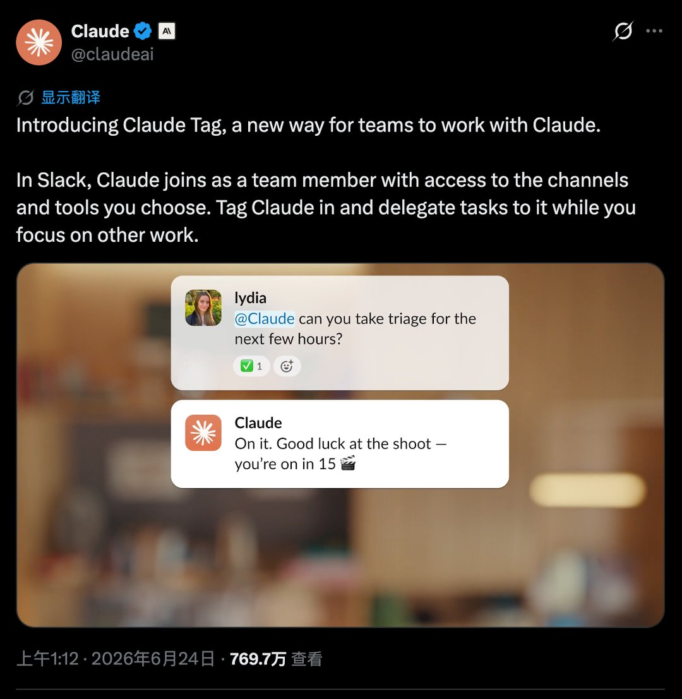

---

## 5

@江宇行舟

发表于：2026-06-23 22:17

来源：微博

链接：https://m.weibo.cn/status/5313216760775637

谈恋爱谈成了三角债

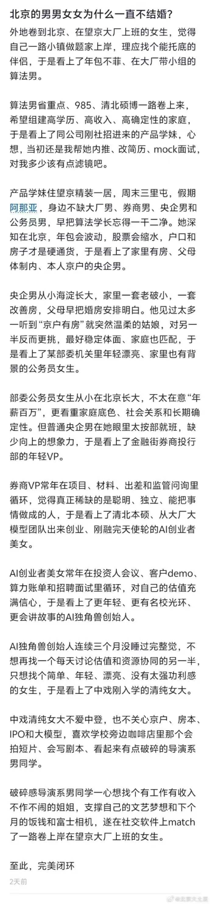

---

## 6

@高飞

发表于：2026-06-24 04:25

来源：微博

链接：https://m.weibo.cn/status/5313309364454385

\#模型时代\# \#微信AI小微\#

一个题外话：国内很多AI助手的名字都是幼稚化的，比如“小X”，或者叠字，微信AI也叫小微；互联网App时代，也诞生了很多动物或者植物名称，比如豆瓣、飞猪等等。总之是低于人类的。

比起来，海外应用似乎没有这个倾向。比如“Siri”，Grok和GPT语音助手就是普通的英文名：Mika、Valentine、Sky。应用本身更加中性，Gemini、GPT、Claude，尤其是Chat-GPT，就是一个技术名词组合。

这背后应该是一种心理学现象。我们看技术，是低一个level的，对面则有平视的感觉，所以也产生了“造物者”恐慌。两者各有利弊，我们容易低估，他们则可能高估。但是，高估有一个额外优点，他们追求上限的决心更大。 

再补一句：这也是我从来不会低估Google Deepmind（或者说哈萨比斯）的原因之一。

---

## 7

@何不笑

发表于：2026-06-23 13:02

来源：微博

链接：https://m.weibo.cn/status/5313077002375226

看到一篇经济学家写的文章颇觉震惊：原来前两年在某破站上天天被鬼畜嘲讽的抬棺舞背后竟是如此一言难尽的社会/人类学意义上的悲剧。

这篇文章的标题叫《因殡致贫：非洲人如何被葬礼拖入贫困——为何世上最贫穷之人却讲究风光大葬》（How funerals keep Africa poor，by David Oks）。文章略长且引用了包括世银、NBER等不少文献研究数据，我把重要内容和主要逻辑简述一下。

1. 先陈述事实：在加纳，一场普通的中档葬礼花费大约5000美元，“体面”葬礼1.5-2万美元，而加纳人年入中位数仅约1500美元。但加纳并非撒哈拉以南非洲唯一，在南非东部的夸祖鲁-纳塔尔省，一个普通家庭一次葬礼支出相当于一个成年人一年的收入。另外，刚果民主共和国、肯尼亚、尼日利亚、贝宁、喀麦隆、莫桑比克、科特迪瓦等非洲国家也有这种现象。事实上，很多家庭在葬礼上的花销比维持病人生命上花的还多，甚至在坦桑尼亚北部的卡盖拉地区，人们在葬礼的花销比医疗保健要多 50% 。

2. 这么多钱，怎么筹集？办法是，先把死者尸体送进当地太平间冻起来，利用冷冻期时间开始筹钱，包括借贷、变卖资产（19世纪甚至会卖自己）、节衣缩食、丧葬保险，具体方式因人而异。其中，“丧葬保险是撒哈拉以南非洲最受欢迎的金融产品之一——事实上，它往往比健康保险更受欢迎。”

3. 这个现象显然与马斯洛需求曲线原理是相悖的，也绝非文青一句轻飘飘的“当地习俗”可以解释，更不是“尊老敬老”的“传统美德”，因为它在是跨种族、部落、国家而广泛存在的社会现象，当地老人普遍感叹世人对自己的关注远胜活着，以至于阿坎人有个谚语叫“abusua do funu” （“家人爱的是尸体”）。它需要一个更深入的解释框架。

4. 作者认为，远超承受能力的葬礼开支是一种亲属社会的忠诚度测试，也是一种亲属税，属于强亲缘社会里转移支付的共享机制。亲属社会对个体的经济增长抱有敌意，因为它会破坏亲属关系的基础，而公开的财富内耗能有效防止任何人有超过自身所需的财富，人人都难以积累资本、进行资产再投资并取得成功。其中的道理很简单：一个不再需要你帮助的人，通常就不会反过来帮助你。所以，这种以仪式化的方式销毁个人财富的策略就成为共同致负-维持关系的重要一环。

5. 演化史：在20世纪中期以前，大多数人的社会关系范围被限制在较小范围，冷冻设备的缺乏导致尸体会快速腐烂，限制了筹资周期，因而葬礼和财富消毁的规模都不大；后来随着人口流动性的上升，移民、进城、外出务工等现象越来越多，加之冷冻技术的普及，葬礼的筹资周期、筹资规模、奢华程度便随之攀升。此时，为了防止/检验那些走出去的亲属对老家亲戚网络的忠诚度，转移支付并销毁那些“多出来”的财富也变得更有必要性。

6. 缺乏这种非人格化的社会信任，是非洲社会鲜有大型、超大型企业的重要因素之一。（作者没有提及，但在经济史领域，这与穆斯林社会里企业创始合伙人不能单独退出，只能共同进退或卖掉这个宗教文化传统导致的大企业难以发展的逻辑有些类似。）

7. 现代的年轻非洲人是怎么应对的？虽然比例不高，但可用的办法是离开这个网络去城市乃至国外，办一个个人手机银行，有效地向亲属网络隐瞒自己的流动资产隐私。“一些塞内加尔妇女在获得隐私收入后，立即将支付给亲戚的钱减少了四分之一，并将省下的钱用于自身的医疗保健。” （这体现了银行为客户保护隐私的重要性）。而那些没有这个能力只能在家乡附近的亲属网络里生活的人主要靠翻修/建设屋顶、篱笆等不可共享的固定资产来简单规避。

8. 结论：“抬棺舞”之类的奢华葬礼并非非洲生活中某种本土习俗，而是一种以销毁剩余财富为导向的社会秩序。除非这种社会秩序被改观，否则它因殡致贫的怪圈难以突破。

（davidoks.blog/p/how-funerals-keep-africa-poor）

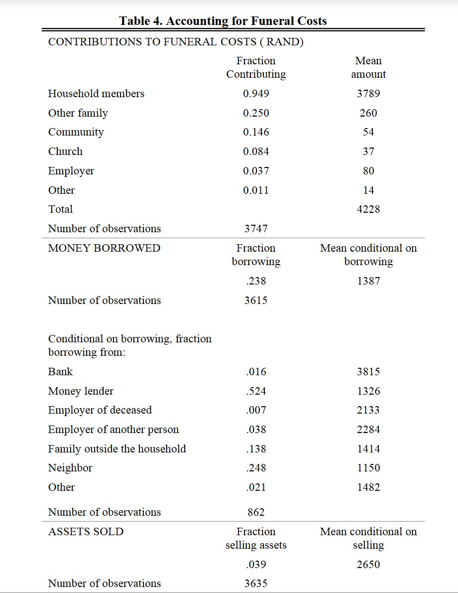

---

## 8

@风云学会陈经

发表于：2026-06-23 11:52

来源：微博

链接：https://m.weibo.cn/status/5313059527592005

\#全球AI交易崩盘\#

看看这个AI硬件利润分配，就知道要崩了

英伟达来吃利润，2070亿美元，已经让其它公司吃不消。三星和海力士又来吃，1090亿、1130亿美元，加起来比英伟达还多了。

那这是谁贡献的利润？都是其它追求算力的公司出血掏钱。

还有美光370亿美元利润，台积电分了330亿，博通230亿，这加起来等于一个三星。还有别的公司加起来等于一个海力士。

通通加起来，等于三个英伟达在狠狠吃利润。以前一个地主吃各家，还受得了，愿意给英伟达说好话，看技术进步。

现在三个英伟达在吃，而且是涨价吃，那业界受不了的。那边不挣钱，这边三个地主在压迫，其它公司受不了的。

特别是存储，一堆电子产品都涨价了。不搞AI的也涨。英伟达搞还可以说是突击AI。存储的这些大涨价就是胡来。

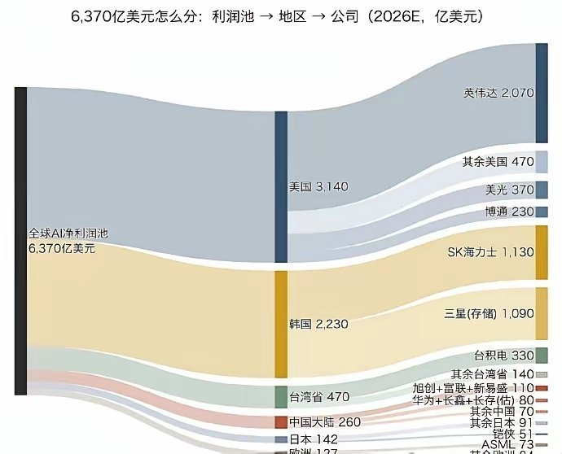

---

## 9

@AIGC·非著名程序员

发表于：2026-06-23 00:09

来源：微博

链接：https://m.weibo.cn/status/5312882587207918

晚点 LatePost 这篇访谈的信息量非常大，串起了百度美研、Scaling Law、OpenAI、Anthropic、Cerebras 之间那些鲜为人知的往事。读完之后，你会发现，今天 AI 行业最核心的几条线索，十年前就已经在百度硅谷研究院埋下了种子。

先说人。百度美研顶峰时期至少有 250 多人，人才密度极高，据说连 Google DeepMind 都不曾达到过这个浓度。很多人是冲着吴恩达来的，这批人后来散落到了整个 AI 行业最核心的位置：有人去了 OpenAI，有人去了 Anthropic，有人参与创办了 Adept、xAI，还有一些成了 Meta FAIR 等顶级实验室的重要成员。可以说，百度美研是半个硅谷 AI 圈的黄埔军校。

其中最值得一提的是 Dario Amodei，也就是后来 Anthropic 的创始人。他能进百度，其实是职业生涯里很关键的一步。把他招进来的人叫 Greg Diamos。有意思的是，Dario 加入百度之前，学的是数学、物理和生物，跟计算机和 AI 没什么直接关系。但 Greg Diamos 发现这个人对 AI 有很强的直觉，训练模型的能力也很突出，于是把他拉了进来。后面的故事大家都知道了。

再说技术。十年前，Transformer 还没出现的时候，百度已经在训练接近 3 亿参数的语言模型了。用 GPU 跑一次要三个多月，底层跑在百度自研的框架 Paddle（飞桨）上。这个阶段，他们其实已经隐约摸到了 Scaling Law 的雏形：模型越大、数据越多、效果越好。只不过当时没有人把这件事系统地总结出来。

2020 年夏天，一些跳槽到 OpenAI 的百度前员工传回消息说，GPT-3 快训练出来了。当年在百度想做的事情，快要在 OpenAI 做成了，就是那个「维基百科水平的语言模型」。那时候 GPT-3 还在后训练阶段，距离 ChatGPT 面世还有两年多。

然后是投资。这部分最让人唏嘘。

百度 2017 年投资了 Cerebras，这家做超大芯片的公司。投资决策只用了两天，由李彦宏、陆奇和 CFO 三个人拍板。更有意思的是，Sam Altman 本人也是 Cerebras 的投资人，而且比百度还早一年，2016 年就投了。这个投资眼光，放到今天来看确实超前。

但更让人感慨的是那些没投成的。百度曾经有机会成为 OpenAI、Anthropic 的早期天使投资人。当时 OpenAI、Databricks、Scale AI 这些公司都在百度的待投名单上。可惜后来中美关系恶化，这些投资全部搁浅了。如果当年投成了，今天的故事可能完全是另一个版本。

最后说一个人物关系。陆奇早年曾是 Sam Altman 的 mentor。2018 年 5 月陆奇从百度离职，同年 8 月就接受了 Sam Altman 的邀请，出任 YC 中国的创始人兼 CEO。从这个时间线可以看出，两个人的关系一直很紧密。

回过头来看，百度美研那几年，人才、技术、资本、判断力，其实什么都有。只是时代的窗口太窄，地缘政治的变量太大，很多事情差了一步就是差了一个时代。这些往事今天读起来，既让人佩服当年的远见，也让人感叹命运的吊诡。

\#How I AI\#\#科技先锋官\#

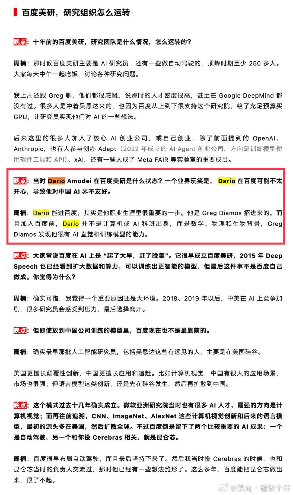

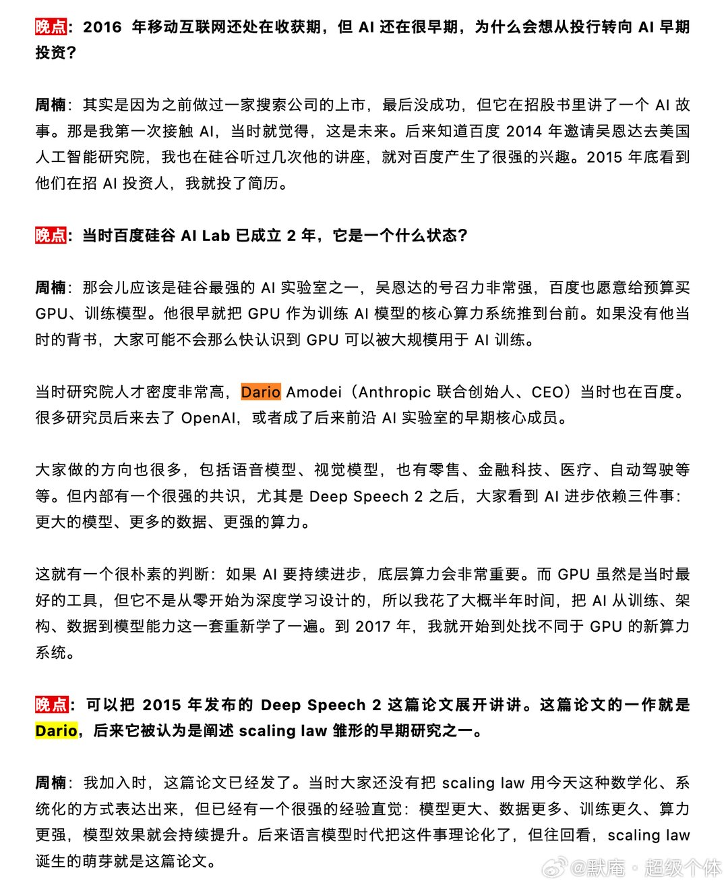

---

## 10

@阑夕

发表于：2026-06-23 07:52

来源：微博

链接：https://m.weibo.cn/status/5312999042056942

Google这家公司，当你以为它不行了的时候，它会突然行起来，而当你相信它行了之后，它又能时不时的拉坨大的。

去年Google的AI事业如日中天，除了Gemini的屁股粘了SOTA上好几个月，重返牌桌的故事也被写了又写，但干着干着突然又没声响了，让人百思不得其解。

屋漏偏逢连夜雨，这几天Google上头条的方式也很独特：AI部门的顶级大佬排着队跑路了。

前几天是Noam Shazeer，Transformer论文的核心作者，2024年被Google连人带公司收购，委以Gemini技术负责人的重任，Gemini的翻身仗就是他的战功，然后他跑去了OpenAI。

再就是John Jumper，这位分量更重，是诺贝尔奖得主，跟着DeepMind老大Hassabis一起拿的，成果是开发了预测蛋白质结构的AI模型，然后刚刚宣布去了Anthropic。

---

## 11

@郑昀

发表于：2026-06-24 00:00

来源：微博

链接：https://m.weibo.cn/status/5313242542637731

冷知识：

1）博物馆里写的距今多少年，不是今天，而是 1950 年。因为碳14测年是 1949 年发明，1950 年全球考古界大范围投入使用，为了全球数据统一对比，直接把 1950 定为固定基准年份。其次，1950 年正好是大气层核试验爆发的前夜。1950 年代之后，人类核爆产生了大量人工放射性碳（C14），彻底打乱了大气中的碳同位素比例，导致此后生长的生物无法再用碳14准确测年。所以把基准线定在 1950 年，等于“掐断”了现代干扰，确保了全球数据的可比性。如果博物馆写“距今 1000 年”，实际是指 公元 950 年（1950 - 1000 = 950），而不是公元 1026 年。

2）Excel 中储存的日期也不是真正的日期，而是距离 1899 年 12 月 30 日过去的多少天，只是显示出来是日期。比如你输入 2026/6/24，它背后存的是 46197，因为这距离 1900 年 1 月 1 日过去了 46197 天。

3）更冷的坑：Excel 故意保留了 1900 年 2 月 29 日 这个不存在的日期，所以如果你用 Excel 算 1900 年 3 月 1 日之前的日期差，会多算1天。微软之所以故意保留这个 Bug，是因为早期的竞争对手 Lotus 1-2-3 就有这个 Bug，且占据了大量市场。为了能完美兼容对方的 Excel 文件，微软选择“将错就错”，让它成为了 Excel 永恒的“历史遗产”。

---

## 12

@UNCLE疯叔

发表于：2026-06-23 15:40

来源：微博

链接：https://m.weibo.cn/status/5313116904884241

快看看你的手机，好像都没了，爽飞

\#开屏广告没了\#

---

## 13

@Jokielicious

发表于：2026-06-23 13:34

来源：微博

链接：https://m.weibo.cn/status/5313085061466749

“罗马人不知道他们的帝国崩溃了，他们只是有一天注意到道路不再被修缮了。”

这今天X上最吸引我的一个帖子。

我是一个喜欢宏大叙事的人，我有巨物迷恋，而且并不仅限于巨大的建筑或星体。我喜欢把自己置身于宏大的历史叙事中观察，这让我觉得自己很渺小，让我感觉站在一个很高很高的第三视角观察自己，是一种游离在身体之外的体验。

我喜欢同样把自己置身于宏大叙事中的人类的帖子。

我喜欢新罗马的人类意识到大变革并不总是伴随着震耳欲聋的巨响，有时事物只是悄无声息地慢慢分崩离析。

太平洋另一边的人类意识到了自己也是这个巨大洪流的一份子，他们和人工智能用冰冷的文字讨论自己国家的崩溃。

而我在岸上，我的道路在被修缮。

他意识到了他在浪涛里。

\#海外新鲜事\#\#塔克卡尔森与共和党决裂\#\#美国故事\#

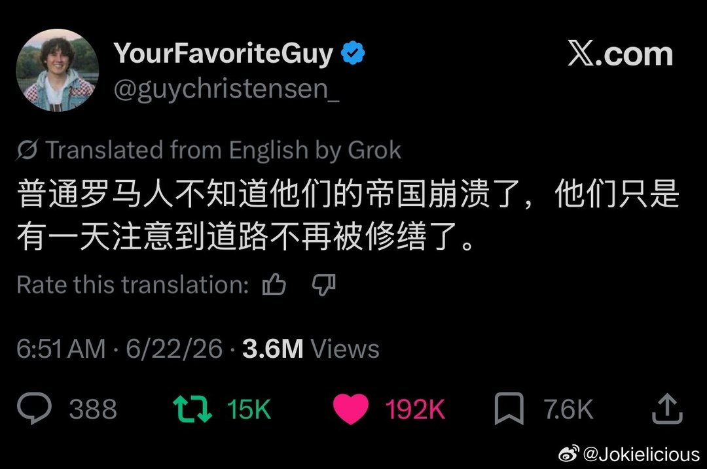

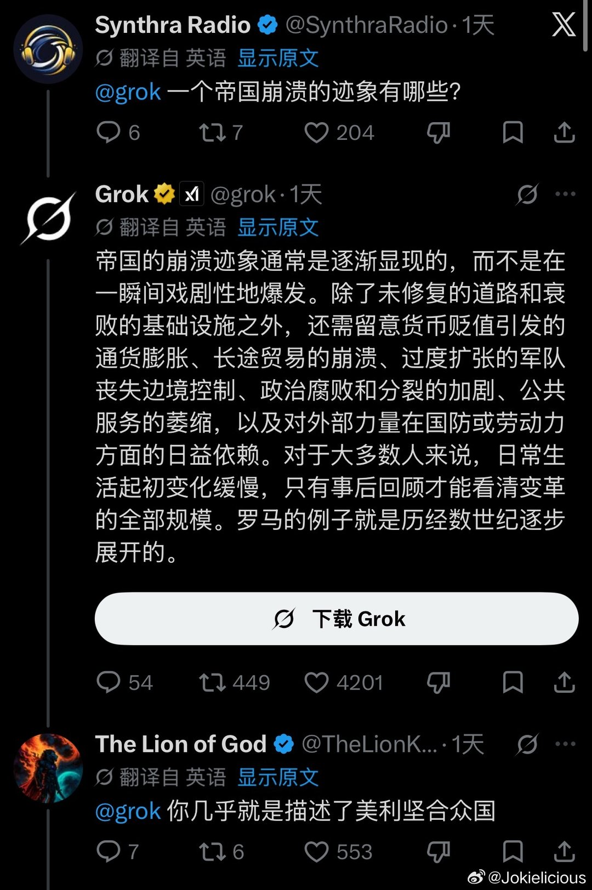

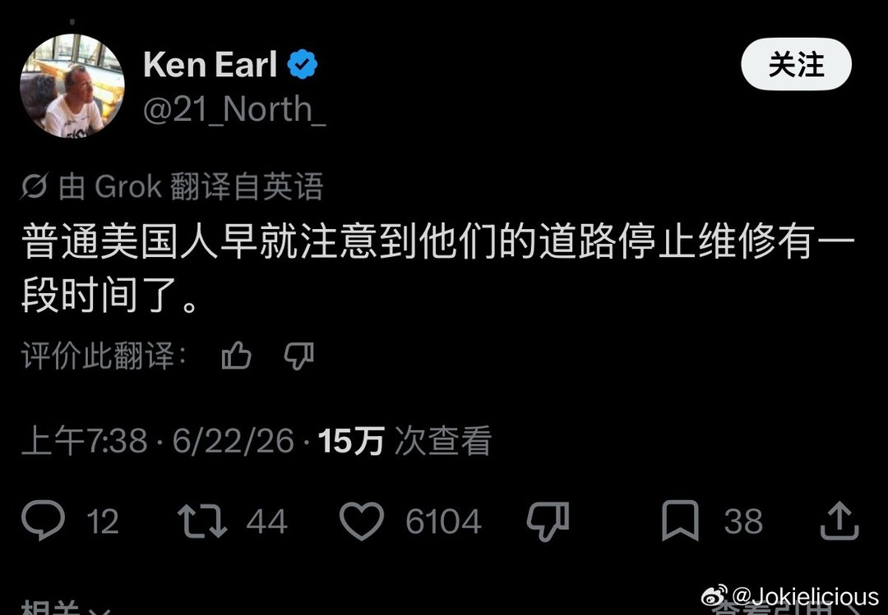

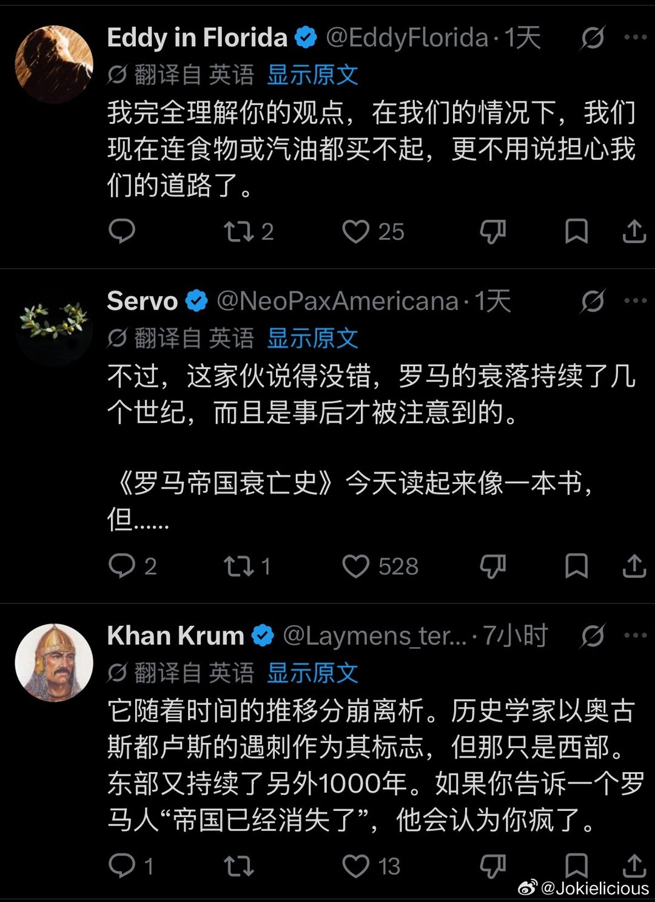

---

## 14

@泰蕾莎泰斯塔羅莎

发表于：2026-06-23 04:18

来源：微博

链接：https://m.weibo.cn/status/5312945262690799

苍老师批判日本球迷在世界杯赛场展示旭日旗的行为

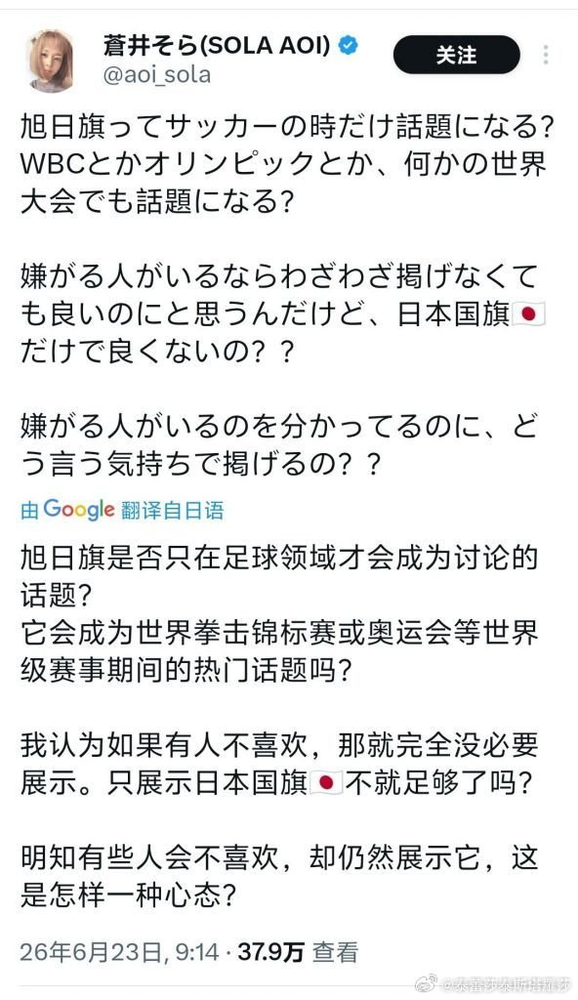

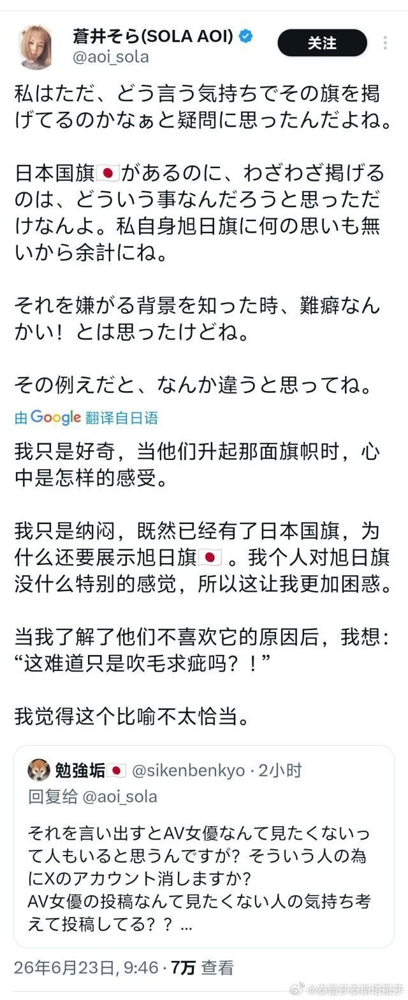

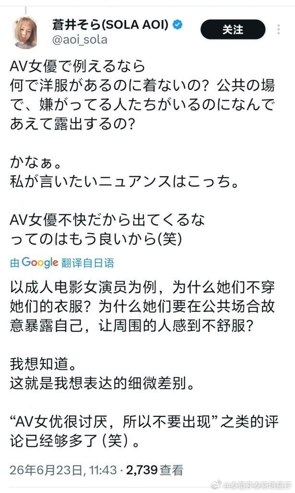

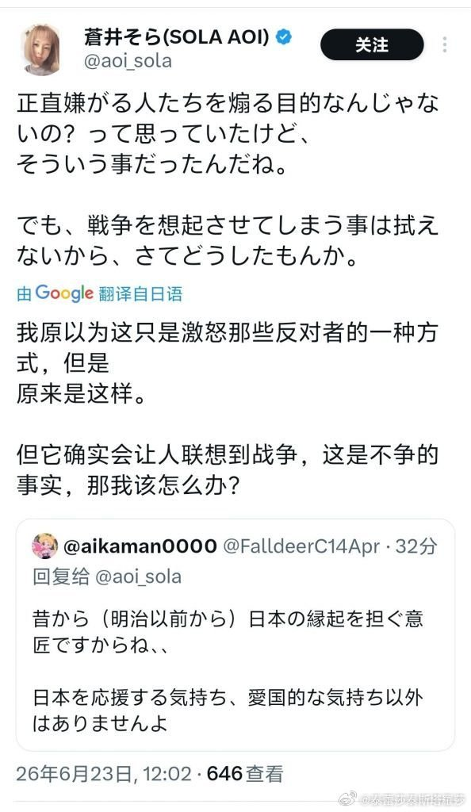

---

## 15

@一起唱歌666

发表于：2026-06-25 10:34

来源：微博

链接：https://m.weibo.cn/status/5313639141606175

哇哇哇，年底肯定内讧，撕破脸，恶斗。

         哇哇哇的事情，很多大晓生看不懂。我用大晓生们醉熟悉的三十六计来说一遍。

         老董事长，相当于古代节度使，虽然那杆旗（品牌）不是他的，但是，他在这个一亩三分地，是绝对的话事人。

         老节度使的成功，是建立在几十年摧枯拉朽，战无不胜的基础上的，他既能忽悠上面，又能忽悠老臣，又能安抚打工人，还能把地盘做大。这样的奇才，别人是无脑信任，任何一方都没有动力去动他。

         他替上面做大了地盘，虽然好处都是自己的，上面一分钱拿不到，但是上面得到了巨大的荣耀，账面估值，这块地盘估值几千忆，名义上是上面的。这也行。

           他替老臣们得到了巨大的实惠，咔咔咔搞钱。老董事长连公司买一个拖把都要自己批，说明下面有点那个，你懂的。

           他改善了普通员工的待遇。

           他能自己吃的满嘴流油的情况下，给上面荣耀，给老臣利益，给员工吃饱，自己也狂赚xx忆，成为了所有人认可的多赢局面。但是这里也有几个难题，

         一，要有超强的赚钱能力。老董事长的这个赚钱能力，或多或少，有时代机yu的因素，老董事长遇到了机遇，小董事长不一定。

         二，要有强大的平衡能力。那么多错综复杂的局面，是几十年打交道，揣摩人心的结果，小董事长出生即巅峰，没有这个水平，也没刷过这个难题。

          三，品牌不是自己的。如果授权取消了，小董事长啥也没了。这是可能的。因为授权是基于你能让大家都满意的基础上。小董事长估计没能力做到。

         老节度使没了，小节度使上来，各方博弈重新开始。

         上面的诉求是，继续做大，其他不管。

         老臣的诉求是，我能不能躺赢到退休，捞一大笔，当个富家翁。

         友商的诉求是，能不能让我继续安安稳稳赚钱。

         员工的诉求是，增加福利。

          各方的诉求千奇百怪，小董事长能力有限，信誉不足，一个人满足不了，怎么办呢？自立门户。但是，自立门户，相当于打碎了所有人幻想，群起攻之。

         接下来，小董事长肯定没办法的。

         她有两个出路，

         一是当包工头。她手里有各种昂贵的生产线，可以替人干活。但是，这需要她低三下四去拉单子。

        二是退出江湖。一卖了之。但是，企业醉赚钱的是品牌，机器卖不了几个钱。

        结果预测，同归于尽。她没花头的，今年夏天的饮料旺季，生意肯定不会多好的。到年底她就结束了。

