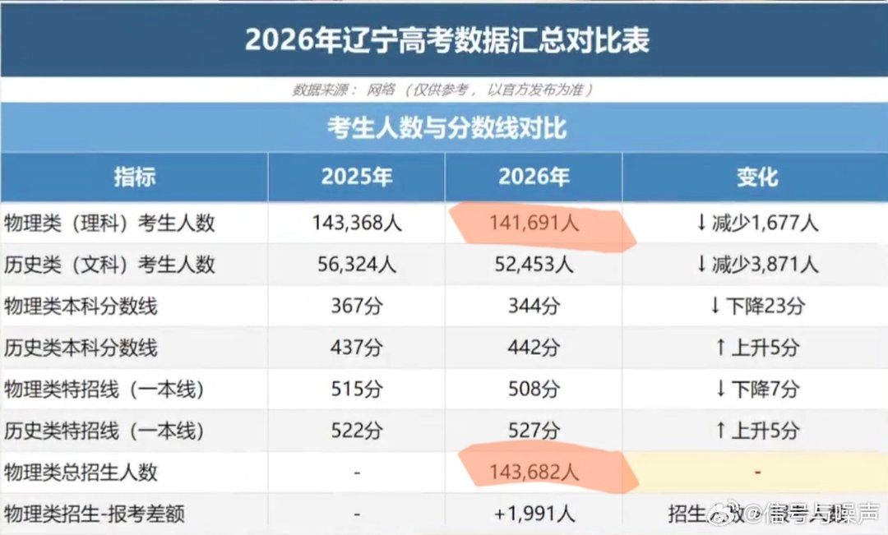
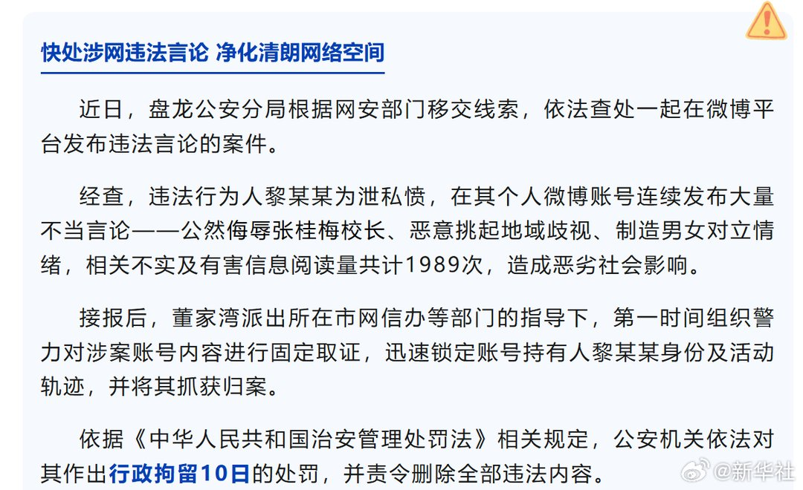
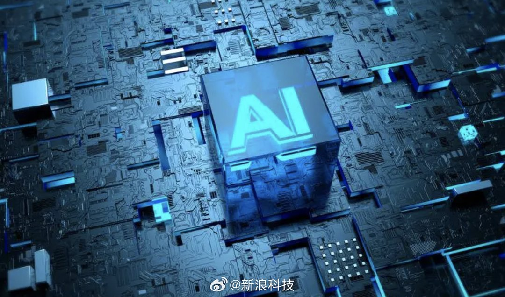
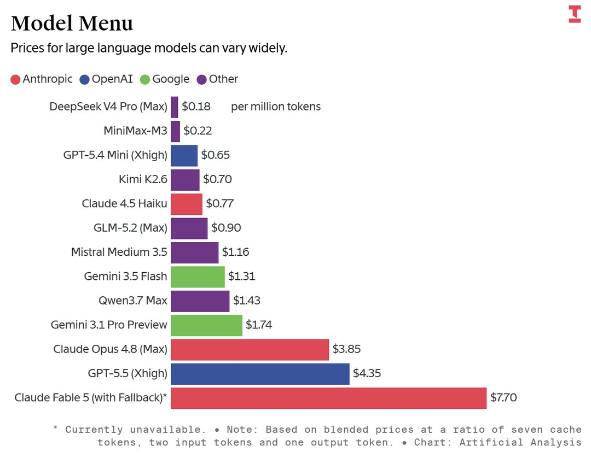
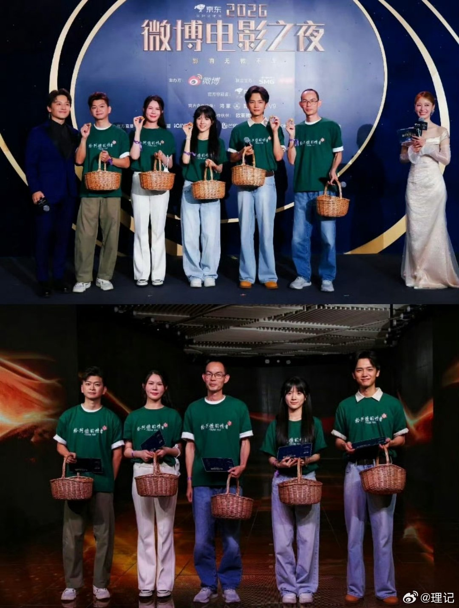
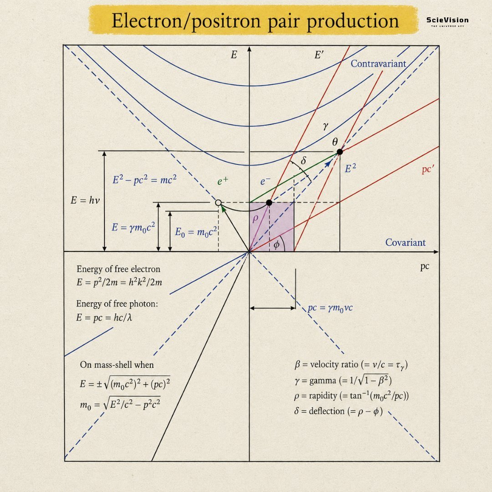
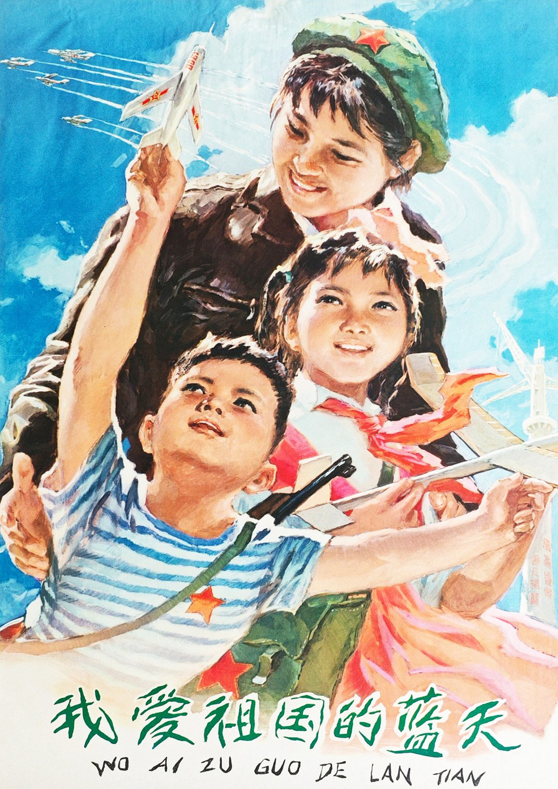

# 2026-06-26

## 1

@Matias215

发表于：2026-06-24 08:08

来源：微博

链接：https://m.weibo.cn/status/5313365381481783

上次说，大学的教育经费会被控制，越来越美国化——到处化缘，会是大概率事件。

今年关注高考较多，发现现在（不知道从哪一年开始的）中外合作办学越来越多。

就连上海交通大学、浙江大学、同济大学、北航、哈工大等都有一些中外合作办学。

中外合作办学的学费6.5万-9.5万/年不等

---

## 2

@信号与噪声

发表于：2026-06-25 10:12

来源：微博

链接：https://m.weibo.cn/status/5313758991747835

辽宁理科 100% 读大学

平均每科40多分就能上大学

人人有大学上终于在辽宁实现了

由于招生人数超过了报考人数，于是高考理科本科线降至344分，减去赋分后，平均每科拿40多分就能上大学。

---

## 3

@不是郑小康

发表于：2026-06-25 04:44

来源：微博

链接：https://m.weibo.cn/status/5313676502630984

Damn，快看哭了。

- 另年后的又一届北京车展，《晚点 LatePost》团队相识的十几位大机构汽车分析师，没一人到场。

- 汽车从业者没法像金融人士那样说转就转，智驾从业者是其中少数有选择的。我们一位同事访谈的 18 位智驾从业者，12 位在过去一年转行，几乎都去了具身智能公司。

- 新势力创始人继续在公开场合展现斗志，几位四五十岁的 CEO 还亲自开车几百、上千公里全程直播，有的连续 24 小时不停。但私下，其中一位跟友人聊到行业终局，列了几个公司，已经没有他办的这一家。

- 车企内部不断加码 “攻坚”。理想 2024 年把研发人员拉到酒店封闭开发了几个月：每周默认六天，每天早 9 点到岗、最早晚 10 点下班，周日也要在酒店待命。

几个月后，比亚迪推 “智驾平权”，一位工程师算了下，100 多款车要上智驾。测试车 24 小时轮转，有时攻坚到凌晨两三点，他干脆把房租在公司一公里内。

- 比亚迪、吉利等品牌的一线销售都遇到同一种问题：消费者体验完智驾，不一定愿多付钱，反而问 “不要智驾，能不能便宜一两万？”

- 中国车企希望以智驾重建价格体系，尝试失败后，造更大的车、卖更便宜变成唯一选择。今天 14 万元的比亚迪汉能跟曾经二三十万元的 C 级轿车比空间。理想以半价 “平替” 了奔驰 GLS 豪华 SUV，又被零跑以半价 “平替”。

- “对每个进门店看车的人都该尽力劝，哪怕没成交，也要放出别家没有的政策。”一位新势力销售转述了门店负责人给他的要求。在他所在的品牌，销售个人是每天至少 30 通、总时长超半小时的电话，3-4 次试驾，每月卖掉 8-10 台。他已经连续两个月业绩不达标——再一次就要离职。

- “一个客户走进来，直接说这是我今天去的第五家店，你能给我什么政策？” 他说价格战后，这类客户越来越多。面对更严格的考核，他很多时候只能把自己的销售提成贴钱给顾客。

- 为省成本，已有门店要求没客户进店不开空调。一位从业十多年的豪华品牌销售说，“到月底顾客要喝咖啡，我们只能说不好意思咖啡机坏了。其实是一个月只给一包咖啡豆。”

- 一位合资车企的采购过去总困惑别家怎么控成本。后来他发现，合资车企以往要求供应商每生产 5000 次出一次故障，一些车企放宽到 2000 次；供应商改到合资标准产线要多花上百万元。成本面前，过去很难进合资供应体系的方案，现在也被重新考虑。

- “大家真以为降本 30% 还能买到同样的东西？” 那位供应商高管说，成本今天是车企选供应商的第一要素。但压缩到一定程度，风险必然上升。

- 在这样一个生意里，让所有人轻松些的办法，可能还是亨利·福特一百年前发动汽车制造革命时所倡导的：让更多人有钱消费。

↑ 上面这个结尾实在是点睛之笔！

网页链接

---

## 4

@Value_at_Risk

发表于：2026-06-25 13:59

来源：微博

链接：https://m.weibo.cn/status/5313816196026912

美光为首的AI硬件股暴涨的情况下，纳指竟然直线跳水翻绿了，看了眼，传统科技股都在跌，苹果今天大跌了5%，微软6月来跌了20%，英伟达过去一个月也跌了16%，谷歌、亚马逊、meta几乎每天都在持续下跌。美股参与者是不是也想明白了，本质上这些美股科技巨头和恒科老登科技也没什么区别嘛，比如微软=腾讯，苹果=小米，亚马逊=阿里，谷歌=百度

正紧的说，这样现象除了资金虹吸效应外，还有一个逻辑是，硬件越涨价，下游科技股不论是建数据中心还是买内存做产品，会消耗更多的现金流或者使得毛利率更低。但这个游戏不会无限玩下去，硬件成本如果太高的话，科技巨头也都会吃不消了（亚马逊天量发债、苹果宣布提价反大跌），而皮之不存，则毛将焉附？迟早也会把硬件带来下（美光闪迪英特尔都是大幅高开但低走）。反倒是一些传统老登公司如医药消费都走得很稳，道指今天还是红的，可乐、强生、默克、银行等走强，这一点显然和AH两地市场完全不同，毕竟美国的内需/通胀还是OK的。

---

## 5

@新华社

发表于：2026-06-25 14:55

来源：微博

链接：https://m.weibo.cn/status/5313830251136336

【\#女子蓄意抹黑张桂梅被拘\#】近日，云南盘龙公安分局根据网安部门移交线索，依法查处一起在微博平台发布违法言论的案件。

经查，违法行为人黎某某为泄私愤，在其个人微博账号连续发布大量不当言论——公然侮辱张桂梅校长、恶意挑起地域歧视、制造男女对立情绪，相关不实及有害信息阅读量共计1989次，造成恶劣社会影响。

接报后，董家湾派出所在市网信办等部门的指导下，第一时间组织警力对涉案账号内容进行固定取证，迅速锁定账号持有人黎某某身份及活动轨迹，并将其抓获归案。

依据《中华人民共和国治安管理处罚法》相关规定，公安机关依法对其作出行政拘留10日的处罚，并责令删除全部违法内容。（盘龙警方）

---

## 6

@竹山吃山竹

发表于：2026-06-24 13:00

来源：微博

链接：https://m.weibo.cn/status/5313438937255372

【抓特务】 六四年，中国第一颗原子弹成功爆炸前，北京公安成功抓到几个潜伏特务，破获了一个间谍网，级别很高的那种特务，那群特务的任务之一是暗杀钱学森。

当时北京公安的反特人员在走访旧警察的过程中，“闲聊”时有热心群众，可能就是著名的群阳群众，说安定门附近某某药房那个谁谁谁，其实是个日本人，她爸爸以前还是小日子大官。

公安自然是没放过这条蛛丝马迹，仔细调查后，发现那人的日本名字叫中岛芳子，是中岛芳子不是川岛芳子。

中岛芳子的姐姐中岛成子，曾策反过奉系元老张海鹏，是与川岛芳子齐名的大间谍，也是川岛芳子的主要竞争对手。

之后就是暗中监视中岛芳子，发现某部委的一个司机经常去那个药房，再查那个司机，又是个日本人…

还发现他们经常接触一个老太太，时不时送些点心给那个老太太，再查，那个老太太叫蒋佐梅，日本名叫佐藤屋登…

事后调查那些特务是想通过老太太把下过毒的食物带给钱学森，老太太并不知情，所以事后并没告诉老太太这个事，也没牵连到她，但在高层指示下，钱学森从中科院大院搬到了安保更严的国防部宿舍，还配备了专职警卫秘书和专门负责食品安全的化验员。

在那个年代，抓特务就是保科研、保人才、保家卫国，是在敌暗我明的特殊战场上，守护新中国的安全。

---

## 7

@蘸盐

发表于：2026-06-25 13:03

来源：微博

链接：https://m.weibo.cn/status/5313802035794038

原博这种其实是善意的留白，埋下个线头儿伏笔，而不是直接告诉你答案，激发有好奇心的读者手动搜索和获得意外发现的能力。在这个过程中会获得破案一样的惊喜。//@sw晓纺:作者要是直接说是老丈母娘会怎么样//@蘸盐:这个不知情的日本老太太，蒋佐梅（佐藤屋登），是蒋百里的妻子，他们的女儿叫蒋英，是钱学森的妻子佐藤原本是日本驻华公使馆的护士长，1913 年蒋百里作为保定军校校长，跟北洋陆军部索要经费未果，愤而举枪自杀，佐藤屋登负责救治照顾，产生感情。她跟蒋百里结婚后，改从夫姓，不让孩子学日语，抗战爆发后，佐藤屋登变卖首饰购买布料，制作军衣、绷带送往前线，并亲赴战场护理中国伤兵。1938年蒋百里去世后，蒋佐梅切断与日本包括其家人的一切联系，投身抗战救护工作。解放后留在中国并取得中国国籍，历次运动均未受冲击，1978年因心脏病在北京去世，享年88岁。她从1914年嫁给蒋百里后终生未回日本。骨灰也送往杭州与蒋百里葬在一起。

---

## 8

@新浪科技

发表于：2026-06-25 10:56

来源：微博

链接：https://m.weibo.cn/status/5313770176122151

【\#AI编程成本或将超开发者平均薪资\#】市场研究机构 Gartner 于当地时间 6 月 24 日发布了最新研究报告。Gartner 高级首席分析师 Nitish Tyagi 预测，随着 Token 价格持续上涨，到 2028 年，AI 编程的成本将超过普通开发者的平均薪资。

这一转变将随着主要服务商的计费模式从订阅制转向按使用量计费而逐步发生。报告指出，计费模式的转变使 AI 支出成为一个高度不确定的变量，企业技术负责人难以准确预测和管控相关开销。此外，各大厂商在 Token 消耗的计算与计费方式上普遍缺乏透明度。

Nitish Tyagi 指出：“随着以 Token 为计量单位的 AI 支出越来越难以获得预算支持，且资金往往比预期更早耗尽，软件工程领域的负责人愈发感到忧虑。”

他认为，当前企业正从试点阶段转向全面部署，越来越多开发者在日常工作流程中依赖 AI 工具。尽管成本上升，企业也获得了更高的产出回报，开发者普遍将更快的交付速度、便利性和更优的代码生成视为核心收益，因此不太可能主动减少 Token 使用来换取成本节约。

Tyagi 补充称：“Token 自律不会仅靠开发者选择就能实现，开发者往往优先考虑速度和便利而非成本效率。”

IT之家注意到，将 AI 融入工作流程已成为行业主流趋势，员工花在编写代码上的时间越来越少，并逐渐将更多精力转向管理和审查 AI 输出结果。

Gartner 分析认为，AI 编程成本压力不仅来自定价模式和透明度不足，使用方式与治理缺失同样在推高开支。Token 超支通常与工程负责人如何管理使用行为相关，常见问题包括 AI 智能体不受控的自主操作、上下文窗口过度膨胀以及缺乏结构化反馈机制来优化用量。此外，AI 编程工具供应商尚未在智能体中内置成熟的成本优化能力，进一步助推了费用攀升。

Tyagi 表示：“随着基础设施投资和盈利压力推高模型定价，AI 编程成本将持续上升。同时，随着更多开发者开始使用 AI 工具并逐渐加深依赖，轻度用户预计将快速转变为主流用户，进一步推动 Token 消耗和总支出的增长。”（IT之家）

---

## 9

@阑夕

发表于：2026-06-24 08:48

来源：微博

链接：https://m.weibo.cn/status/5313375418188158

主流模型在公开市场的每百万Token定价。

---

## 10

@理记

发表于：2026-06-24 10:14

来源：微博

链接：https://m.weibo.cn/status/5313397131577429

还有个感受想分享。

最近看“给阿嬷的情书”剧组的一系列公开活动，我专门研究了一下潮汕人，研究的结果是，我对潮汕人甚至达到了畏惧的程度。

是的，已经超越了敬畏，得用畏惧这个词。

你看淑柔的扮演者，她是怎么能做到如此之红了，还能坚持不参加任何活动？

你看木生和南枝，接受了那么多采访，参加那么多场活动，愣是说话一次都没有翻车，始终穿着一样的体恤衫。

整个电影如此爆红，所有演职人员竟然没出现一个一次翻车的，也没有任何飘起来的迹象，电影产生高额的利润，也没出现争执的迹象。

蓝导也是牛比了，各种发言，把方方面面全都照顾到，政治水平一流，没有感到一点装的迹象。

整个剧组无绯闻，无丑闻，无负面新闻。潮汕宗族文化有很强的保密性，以至于淑柔火成这样了，愣是没人知道她究竟在哪里工作。

真是心生畏惧。

潮汕人的根来自于福建闽南，我曾经评价过福建人，福建地少人多，福建人的商业意识就超级强大，脑子灵活，敢于创业。

福建人干什么就什么牛比，干大企业就大企业厉害，干莆田系就莆田系厉害，干啥啥行。

潮汕人就是福建人是promax顶配折叠版，你看一下整个东南亚，这都是亚洲国家，你会发现在任何国家，潮汕人都是当地的巨富。

马化腾是潮汕人，李嘉诚是潮汕人，英国华人首富叶焕荣是潮汕人，新加坡老牌首富吴清亮（立邦漆）是潮汕人。法国华人首富陈克威兄弟（欧洲大型连锁百货集团创始人）是潮汕人。越南首富张美兰是潮汕人，泰国前十的富豪有七位长期是潮汕后裔。深圳地产、电子行业早年大半由潮商把持，华强北早期七成商户是潮汕人。

从这些客观现实，潮汕人至少在亚裔族群里实现了最高级别的成绩。

真是心生畏惧啊。

未来几年，我打算学潮汕话，多交几个潮汕朋友。

所有潮汕籍的粉丝我将给予最高礼遇，不限量的么么哒。

---

## 11

@物理芝士数学酱

发表于：2026-06-24 15:28

来源：微博

链接：https://m.weibo.cn/status/5313476080700310

\#今天要来点物理吗？\# 

之前介绍过从几何视角看 网页链接

电子—正电子对产生

这个图则是更加能量的视角

现代物理学最令人惊叹的结论之一是：光可以直接转化为物质。当一个光子的能量足够高时，它能够产生一对全新的粒子——电子及其\#反物质\# 对应物正电子。在这一过程中，光子携带的部分能量转化为两个粒子的静质量。这是爱因斯坦质量—能量关系最直观的体现之一。

图中展示的是这一过程在能量—动量空间中的几何图景。纵轴表示能量，横轴表示动量。每一个物理上可能存在的粒子状态，都对应这个空间中的一个点。

穿过原点的两条对角线构成了由光速所决定的边界。光子恰好位于这些对角线上，因为它没有静质量，并满足质能关系式。

而电子、正电子等具有质量的粒子，则必须位于对角线之上的曲线上。这些曲线被称为质量壳（mass shell），满足

E^2=p^2c^2+m^2c^4.

当质量壳与纵轴相交时，粒子的动量为零，即处于静止状态。此时剩余的能量就是著名的静能：E=mc^2.

在电子—正电子对产生过程中，一个入射光子消失，其能量转化为一对新的粒子——电子和正电子。它们出现在电子质量壳上，并共同分享原来光子的能量与动量。

然而，一个孤立的光子在真空中无法单独完成这一过程。因为仅凭一个光子，无法同时满足能量守恒与动量守恒。实际发生对产生时，通常需要附近存在一个原子核，由它吸收一小部分动量，从而使整个过程满足守恒定律，而原子核自身几乎不发生变化。

能量—动量空间的几何结构还与二十世纪最伟大的理论预言之一有关。当物理学家 Paul Dirac 建立电子的相对论量子理论时，方程自然出现了正能量与负能量两类解。经过深入研究后，Dirac 意识到，这些数学结构暗示着一种全新的粒子：它与电子质量完全相同，却带有相反电荷。这就是反物质的概念。

1932年，Carl Anderson 在宇宙射线实验中发现了正电子，从而证实了这一理论预言。这一事件至今仍被视为数学推理揭示自然真相的经典范例。

如今，电子—正电子对产生广泛存在于宇宙之中：高能天体环境、宇宙线簇射、粒子加速器实验，以及医学中的 PET（正电子发射断层扫描）技术，都离不开这一过程。

物质与能量并不是两种截然不同的存在，而是同一种物理实在的不同表现形式。

在适当条件下，纯粹的光，确实能够直接转化为物质。

---

## 12

@tombkeeper

发表于：2026-06-25 04:50

来源：微博

链接：https://m.weibo.cn/status/5313677943376230

柏林墙被推倒前，西德马克和东德马克的黑市汇率大约是 1 西德马克能兑换 7 到 10 东德马克。

德国统一后，西德政府出于政治考量，允许东德居民的工资、养老金及 4000 马克以内存款以 1 : 1 兑换成西德马克，其余也可以用大约 1 : 1.8 的汇率兑换。

可以简单认为德国统一让东德人的财富啪唧一下涨了至少 5 倍。

如果你是一个东德居民，你觉得这是好事还是坏事？

事情从来没那么简单。

东德人的财富啪唧一下涨了至少 5 倍，这也意味着东德企业的劳动力成本和企业债务啪唧一下涨了至少 5 倍。

再加上东德居民拿到西德马克后马上就抛弃了落后的东德工业品，开始购买西德的商品，东德的工业产值暴跌了超过 40%，绝大多数国营企业直接破产或被西德托管机构廉价打包出售。400 万东德工人中，有超过 250 万人在几年内失去工作。此后接近十年的时间里，东德都处于去工业化的阵痛中。

所以说，事情从来没那么简单。

---

## 13

@李楠或kkk

发表于：2026-06-25 04:21

来源：微博

链接：https://m.weibo.cn/status/5313670856838806

Andrej Karpathy 真的是活雷锋。

Loop 需要的 Agent 记忆管理和监控器都给了开源项目。

1. Zep Graphiti（Temporal Knowledge Graph）

Graphiti 是一个开源框架，用于构建时序上下文图（Context Graph）。它能从对话、文档或结构化数据中自动提取实体和关系，处理事实随时间变化（例如失效旧事实），并支持混合检索（向量 + 全文 + 图遍历）。非常适合 AI 代理的长期记忆和状态管理。 

仓库：网页链接

2. Comet Opik（LLM Observability & Evaluation）Opik 是开源的 LLM 可观测性平台，用于追踪（tracing）、评估（evaluation）和监控代理/LLM 应用。特别适合生产循环：记录每一步调用、自动转失败 trace 为回归测试、支持 LLM-as-Judge 等评估。

网页链接

GitHub: 网页链接

---

## 14

@理记

发表于：2026-06-24 11:54

来源：微博

链接：https://m.weibo.cn/status/5313422447085531

雷军雷总吃个热干面又被喷够呛。

不是我自诩，雷总面临的舆论困境我早就判断过了，他与舆论的蜜月期已经过了，现在的环境下，雷总不可能有好的舆论态势，这是客观使然，大形势使然，无论怎么做都没用，根本不以人的意志为转移。

这个问题要以雷总的身份为基础讨论，他的确是大企业家，但他也是个超级大网红。

作为企业家，你参加各种活动，肯定到处是掌声和笑脸，因为你手中掌握着庞大的资源分配权，人人都想从你身上得到一些东西。

但作为网红则完全不同，企业家网红没有资源可分配给网民，而是从网民中攫取资源。

明白这个差异吗？企业家在企业的圈子里，是“舍”的身份，可以合作赚钱，可以给你生意。企业家网红在舆论场，是“取”的身份，赚网民的钱。

取和舍得到的情绪待遇是不一样的。

而雷总作为企业家网红，与其他普通网红完全不一样的地方在于，其他网红其实是以才艺来换取资源，比如表演，比如内容创作，这构成了平衡的供需关系。

而雷总他并没有营销之外的优质内容输出，没有价值观输出，连有价值的生活分享都谈不上。

也就是说雷总作为网红，只有取，没有舍。

这是一种失衡的关系。

他跟马斯克不一样，马斯克是啥都发，跟特朗普干仗，搞搞这个那个，发表各种观点见解，马斯克的推特几乎从来不给特斯拉和spcx做广告。

跟黄仁勋也不一样，黄仁勋不是网红，只是在网上红了，这是两码事。

雷总在网上的负面预期是结构性矛盾造成的，你本应是身居高端圈子的人，非到丛林里露营，想不被蚊子咬是根本不可能的。

在网上，雷总既是小米最大的宣传出口，也必然同时成为最大的靶子。

现在的网民情绪都不好，上网很大的爱好就是喷，你见过不被喷的网红吗？既要又要本身就很难，唯一的办法就只能是转移矛盾。

陶琳替马斯克挨骂，老汤替李想挨骂，马麟替李斌挨骂，余承东替任老和长公主挨骂。

在小米公司里，上网的高管各个都是精英范儿，形象保持的极好，请问谁替雷总挨骂？

谁都不替雷总挨骂，那就只能雷总挨骂。

你不信，那后面的形势可以验证，前面都验证过了。

---

## 15

@有个梨GPT

发表于：2026-06-25 15:47

来源：微博

链接：https://m.weibo.cn/status/5313843426496466

今天有一个特别好的主意。就是给医生的帽子上，正面额头的位置，加装一块电子显示屏。

患者说话时，说的话自动语音识别为文字，显示在显示屏上，如果医生问患者，说完了吗？患者说说完了，屏幕就开始显示Thinking。。。。直到医生开始说话，屏幕改为显示医生说的文字内容。

---

## 16

@姬永锋

发表于：2026-06-25 22:20

来源：微博

链接：https://m.weibo.cn/status/5313942231714110

今夜，直线跳水！存储芯片，把纳指“带偏”了

中国基金报

【导读】没想到，跳水了！中国基金报记者 泰勒大家好，今晚的美股再次出乎市场的意料，本以为美光科技的炸裂财报，能让纳斯达克指数暴涨，结果猜中了开头，没猜中结尾，高开低走全跳水了。一起看看怎么回事。6月25日晚间，美股三大指数涨跌不一，道指一度暴涨700点，随后涨幅回落，纳斯达克指数高开低走转跌，纳斯达克100指数盘初一度大涨2%，随后直线跳水。费城半导体指数一度高开6%，截至发稿，涨幅明显收窄。科技股中，仅剩下存储芯片概念以及光通信概念暴涨，其他下游的科技巨头集体大跌。为何行情的表现如此异常？可以说是成也美光，败也美光。引发行情突变的触发点，是苹果公司官宣全球涨价。由于存储芯片和储存设备出现前所未有的短缺，导致零部件成本大幅上涨，苹果公司周四采取了极端措施：上调所有Mac、iPad、家居设备以及Vision Pro的售价，以抵消成本压力。此次涨价已于周四在苹果在线零售商店正式生效，覆盖全球市场。苹果当天并未上调iPhone、Apple Watch和AirPods的价格，但暗示未来可能还会对更多产品进行价格调整。苹果股价暴跌，创四个多月以来最大盘中跌幅。MacBook Neo的起售价由599美元上调至699美元；13英寸MacBook Air由1099美元涨至1299美元；14英寸MacBook Pro由1699美元涨至1999美元；16英寸MacBook Pro的起售价则由2499美元上调至2999美元。iMac台式机的起售价由1299美元涨至1499美元，Mac Studio台式机则由1999美元上涨至2499美元。苹果MacBook Neo目前售价分别为699美元和799美元，此前分别为599美元和699美元。苹果一名发言人表示：“人工智能数据中心的快速扩张，引发了对内存和储存设备需求的异常激增。”苹果“从未见过零部件价格在如此短的时间内出现如此大幅度的上涨”。苹果还表示：“到目前为止，我们一直在保护消费者，避免他们受到这些成本上涨的影响。但现在已经到了必须开始上调部分产品价格的阶段，包括今天对iPad和Mac进行的涨价。”此次涨价在很大程度上史无前例。在苹果的现代发展史上，从未出现过如此大范围、同时覆盖多个产品类别的全面提价。这一轮市场波动，反映出投资者开始重新审视人工智能产业链的利润分配。随着全球科技公司持续建设人工智能数据中心，对高带宽内存、动态随机存取存储器及企业级存储产品的需求快速增长。美光等存储厂商因此获得更强的定价能力，并优先满足利润率更高的数据中心订单。但对于苹果等消费电子企业而言，存储芯片涨价意味着生产成本上升；对于微软、亚马逊、Meta和Alphabet等云计算巨头而言，人工智能基础设施扩张则意味着更高的资本开支，以及持续增加的折旧、电力和运维成本。换言之，硬件厂商在设备交付后便可以确认收入，而科技平台能否通过云服务、广告和人工智能订阅收回投资，仍需要更长时间验证。因此，美光业绩越强，既说明人工智能基础设施需求依然旺盛，也暴露出产业链下游面临的成本压力。市场担忧，如果存储、光通信及其他关键设备价格持续上涨，科技巨头的现金流和利润率可能进一步受到挤压。

---

## 17

@塔列郎

发表于：2026-06-25 18:41

来源：微博

链接：https://m.weibo.cn/status/5313887190647125

潘石屹夫妇从SOHO中国累计获得分红约133亿元；2014年至2019年间，累计出售资产回笼资金近300亿元。除掉相关税费，两人从中国市场上赚走近30至40亿美元。

2011年至2013年，潘石屹夫妇大举布局纽约核心商业地产，联合外资合计投入约27亿美元，拿下通用汽车大厦、公园大道广场、港务局长途巴士站办公楼等资产。据最新估值，这笔投资的资产估值下调了15%至25%，租金收入已无法覆盖贷款利息、房产税和运营成本。

虽然有意折价抛售却无人接盘，陷入了持有亏、卖了巨亏的两难境地，浮亏规模数亿美元。由于这些资产还没出手，具体亏损数目难以估算，目前大约在4至7亿美元。

2013年，张欣斥资2600万美元购入曼哈顿高端联排别墅，准备长期持有。2024年，这笔原计划长期持有的资产，由于持有成本太高，张欣以2380万美元将其出售。账面直亏220万美元，叠加11年的房产税、物业维护、保险等持有成本，实际总亏损约450至500万美元。

2019年前后，两口子效仿国内SOHO共享办公模式，在纽约、洛杉矶投入约2.8亿美元布局共享办公场地，并重金租赁装修。由于疫情后远程办公普及，门店空置率超30%，现在批量关店止损。本金已基本亏光，无有效回款，打底亏损3亿美元。

2022年，张欣主导跨界投资好莱坞电影《月球陷阱》，单笔投入3000万美元。这部投资1.5亿美元的电影，全球票房仅6700万美元，分账不到3000万美元。张欣在这笔投资中实际亏损超2800万美元，几乎全额打了水漂。

2025年，潘家两口子花费7600万美元在纽约上东区再度拿地抄底，试图弥补前期亏损。由于项目尚在规划初期，官方未公布具体数字。但以纽约高昂的建筑成本，在上东区要拆除旧建筑、重建精品豪华公寓，成本没有三五亿美元恐怕拿不下来。

去年新浪财经发布的数据显示，张欣身家约11亿美元，潘石屹约12亿美元，两口子加一起23亿美元，与巅峰时相比少了近一半。

---

## 18

@王鹤诗

发表于：2026-06-24 23:02

来源：微博

链接：https://m.weibo.cn/status/5313590334064985

宣传画《我爱祖国的蓝天》，绘画：李醒滔、梁照堂，人民体育出版社出版，1976年6月第一版。

