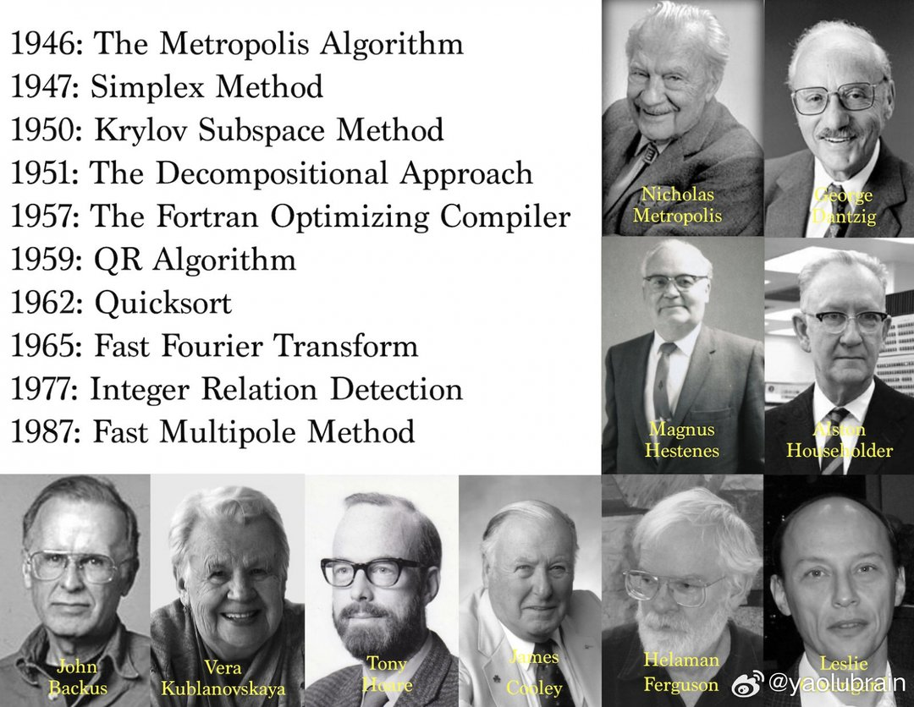

# 2026-06-27

## 1

@兔头学姐张铁根

发表于：2026-06-26 13:38

来源：微博

链接：https://m.weibo.cn/status/5314173221214300

近两年总有导演，演员站出来嚷嚷，拯救中国电影。

有从人的观影习惯分析的，有从市场发展分析的，有从故事题材分析的，我说有没有一种可能，是现在拍片的这些人老了的原因？

任何事物的发展都离不开市场消费人群的变化，00后最大的已经26了，08后已经成年了，这种娱乐消费场景，35岁左右的人正处于上有老下有小，职业发展的关键期，没那么时间娱乐，现在演员看看都年纪多大，一个个动不动40岁起步，导演50岁起步的年纪。

知道三角洲行动吗？知道崩铁吗？当前最火的歌星是那个？抖音年轻人最喜欢看的网红是那个？

香港电影为什么能够发展起来，就是紧跟时事的同时，主要服务当时香港的年轻人，拍古惑仔，赌神，英雄本色，各类三级片。无外乎当时香港年轻人看的就是黑帮，赌博，色情。

我的意思并不是我们的电影也要如此，而是现在电影院上的电影，根本不知道拍给谁看的不是打拳的，就是各种无病呻吟的文艺片，商业片也都搞什么上个时代的玩意，一堆老帮菜在那里演俊男靓女，五十好几的人在屏幕上爱的死去活来，观众不傻，你拍个剿灭缅北四大家族的战争片，你按拯救大兵瑞恩的框架拍个维和部队在海地执行任务，实在不行你拍一个中国福建人在俄乌战场送外卖的故事。

现在的年轻人很自信，没那么多伤春悲秋，要的就是天老大，我老二的气势，现在的电影市场的电影，透露出一股暮气，一种腐朽老气横秋的霉味。

---

## 2

@风中的厂长

发表于：2026-06-26 11:34

来源：微博

链接：https://m.weibo.cn/status/5314142166843813

我公司之前用AI，更多是内容辅助以及优化工作流，但是从今天开始一切变了！我计划7月份公司运营管理全面接入AI！这个对于互联网从业者可能不陌生，但是其实传统行业的朋友们更需要！

我这星期用AI分析财报，太好用了！我只要直接把几张财务表格丢进去，然后一句话告诉他我的需求让他分析。结果给我生成了一个图文并茂的ppt，横屏的电脑版，我人在外面觉得字小。让他改成手机竖屏ppt字变大，他一分钟就改好了，分析的面面俱到。

包括我想到的和许多我想不到的，比如物流费用占比同比环比，分仓的效率，各款产品动效速度，投放ROI拆解、毛利率变化、高增长品和滞销品，结合去年报表进行预测，售后比例什么的，一下子梳理得清清楚楚。手工做需要很久还容易出错，AI一分钟不到就搞定了。

为什么我说下半年全面接入AI，其实现在很多网店的后台，以及传统的库存ERP、物流系统、客服系统、财务系统，办公软件都有API接口，可以无缝接入AI工具，瞬间效率翻倍！而且费用忽略不计！那像我们这种小公司会因此裁员吗？并不会，只是运营和财务可以更快速获得数据和更高效分析，得到优质的报表。他们自己减少工作量，岗位还是少不了的。

---

## 3

@高飞

发表于：2026-06-26 11:13

来源：微博

链接：https://m.weibo.cn/status/5314136898536967

\#模型时代\# Databricks CTO：AI的瓶颈不是智能不够，是上下文不够，所以要重建AI基础设施

一期很硬核，甚至有点枯燥的笔记。

Latent Space播客2026年6月25日的一期，嘉宾是Databricks联合创始人兼CTO Matei Zaharia和联合创始人Reynold Xin。录制时间在Data + AI Summit 2026期间（6月15日至18日，旧金山Moscone Center），现场到场约3万人，全球参与超10万人。Databricks目前服务超过2万家企业，覆盖70%的财富500强，2025年12月Series L轮估值约1340亿美元。

这次Summit的主线：CEO Ali Ghodsi在keynote上说，AI的瓶颈不是智能不够，而是上下文不够。模型已经足够聪明，但智能体在企业里干活时拿不到正确的数据、花费失控、安全没保障、换模型换工具很痛苦。围绕这个判断，Databricks发布了一组产品：Omnigent解决智能体的管理和安全问题，LTAP让事务数据对分析引擎和智能体立即可见，Lakehouse//RT把查询延迟压到毫秒级。这期对谈里Matei和Reynold展开讲了其中两个最核心的方向。

Omnigent的核心是一个统一API，和LangChain、CrewAI等编排框架不在同一层：无论底层跑的是Claude Code、Codex还是自定义智能体，对外都是"消息和文件进，文本流和工具调用出"，换harness只需改YAML里一行。

Databricks内部有工程师让一个智能体debug问题，结果它自己读了大量日志文件，一个session花了500美元。这催生了Omnigent的有状态花费控制：可以给子智能体设5美元上限，超了必须找人批准。

LTAP的突破来自一个意外的原型：Reynold和团队争论了很久能否把Postgres的行存数据改写成Parquet列存格式，一个工程师直接做了个原型证明可行，发现存储层闲置CPU足够做转码，而且转码后数据压缩率更高，写入对象存储反而更快。

一、Omnigent：编码智能体和企业智能体面对的是同一组问题

智能体要用上企业的上下文，第一道关卡是：谁来管这些智能体？现在的工程师通常同时开着四五个AI助手：用Claude Code写架构、用Codex快速生成代码、用Gemini搜东西。每个助手都在自己的窗口里，互相不知道对方在干什么，工程师在它们之间来回复制粘贴。历史记录各管各的，安全策略各管各的，花了多少钱也看不到全貌。这些AI助手，业界统一叫harness，意思是"把裸模型套上缰绳、变成能干活的智能体"的那套软件，Claude Code、Codex、Cursor都是一个harness。Omnigent要做的事情，就是在所有这些harness之上再加一层统一管理。Databricks把这一层叫meta-harness，字面意思就是"管harness的harness"。

1、两条线索汇合到同一个产品

Matei说Omnigent的起点有两条独立线索。第一条来自内部开发：Databricks有5000多名工程师，他们的开发基础设施团队做了一个叫Isaac的工具，本质是Claude Code和Codex的封装。但最厉害的工程师们不满足于此，开始自己搭多智能体工作流、自己做UI。第二条来自对外产品：Matei联合带领的研究团队在做数据科学智能体Genie，同时还有大量客户项目和内部工具智能体。这些智能体全都撞上了相同的问题：每隔几个月就要换模型和harness，智能体的工作记录不能分享、没有历史、不能搜索，缺少协作层。

一开始有人觉得把编码智能体和自定义智能体放在同一个框架里很奇怪，但Matei认为它们面对的基础设施问题完全相同。

2、统一接口是核心，不是又一个技术栈

Omnigent的设计核心是一套统一接口，Databricks叫它Common API。不管底下跑的是Claude Code还是Codex，对上面来说都长一个样：往里送消息或文件，出来的是文本流或工具调用，也可以随时取消当前任务。这套接口可以封装Claude Code、Codex、Pi、OpenAI SDK等各种底层harness。Matei说Omnigent不试图成为一个完整技术栈，你可以在它的服务端之上接自己的界面。

Reynold的切身体验印证了这个需求：他有一周从早到晚在用编码智能体，开车去看医生时还把笔记本电脑连着手机热点放在副驾，遇到红灯就看屏幕，因为本地的工作进程不能断开。他写了一份愿望清单给团队，包括"不会关闭的云沙盒""能渲染Markdown文件""能SSH进去看日志"。最后团队几乎全部实现了。

3、开源是因为网络效应，不是慈善

Databricks选择在Apache 2.0下开源Omnigent，逻辑和当年开源Spark一样：这个层如果封闭，别人做一个开放版本，长远一定赢。开源的好处是社区会写集成插件，比如有人已经加了Kubernetes运行支持、多种云沙盒接入。发布第一周就有约400个合并请求，Matei估计一半不是他的团队写的。Omnigent在6月13日开源（Alpha版），Data + AI Summit 2026正式发布托管Beta版。

4、每个工程师都做出了自己的最优工具，但没人能和队友共享

Databricks内部出现了至少五六个不同团队各自搭建的智能体框架，功能大同小异。工程师们的反馈是："我做的东西对我自己来说好用极了，但队友没法用，因为没有共享服务器。"这就是为什么Omnigent有server组件，内置身份验证和安全控制。很多外部团队也遇到同样的问题：原型跑通了，但安全团队不允许智能体连接到关键数据源。

二、智能体安全：静态的"允许/禁止"不够用

统一管理层搭好了，接下来的问题是怎么控制。Ali keynote里的四个关键词之一就是Control。

1、安全与可用性的核心矛盾需要上下文感知来化解

Matei花了大量时间和内部开发者、安全团队、管理层以及客户交流。他发现现有的编码智能体安全机制太粗糙：只有"允许使用这个工具模式"或"禁止"两种选择。但实际场景远比二选一复杂。

他举了一个例子：智能体应该能读取机密文档吗？应该能从NPM安装新包吗？应该能向公司网站发布内容吗？如果你做的就是网站代码，当然应该允许发布。但如果一个智能体同时做了这三件事，它可能读了机密文档、被恶意指令劫持（业界叫prompt注入，指攻击者在文档或网页里藏入指令让智能体执行），然后通过发布功能泄露数据。每一项单独看都合理，组合起来就是安全事故。

2、有状态策略的具体运作方式

Omnigent的解决方案叫"上下文策略"，即contextual policies，系统持续追踪session状态。策略不再是"能不能推送到营销站点"这种静态开关，而是"如果这个session刚安装了一个发布不到一天的NPM包，或者读取了大量机密文档，那就不允许推送"。这需要在session级别记录状态。

策略层的设计也做了抽象：底层事件可能非常琐碎，比如智能体通过MCP协议（让大模型调用外部工具的标准接口）连接Google Drive，光API调用就有60种，哪些会把文档分享到外网、哪些不会，逐个判断很烦。Omnigent的做法是加一层映射库，把琐碎的底层调用翻译成"读取了机密文件""发布到外网"这样的高层事件，策略只需要基于高层事件来写。这也是开源的理由之一：社区可以贡献映射库，Databricks和客户都能直接用。

3、花费控制是安全问题的延伸

因为策略引擎追踪session状态，自然可以追踪花费。Matei说他亲身经历过让一个智能体去debug问题，结果它决定读大量日志文件、烧了很多token，一个session花了500美元。现在可以设定规则："启动一个子智能体做这件事，预算上限5美元，超了必须找我批准。"

这不只是CTO个人的焦虑。Matei说他和一些咨询公司聊过，它们有10万名员工在给客户写代码，如果每人每月多花1000美元在编码智能体上，公司层面就是一笔吓人的账单。Databricks自己的策略是不限额度，但用自家产品分析trace数据，有专门团队做优化和异常检测。他们还从trace分析中发现了有趣的洞察，比如哪些模型在Rust上表现更好、哪些在TypeScript上更好。

4、Panther收购补齐事件处理能力

Databricks在Summit上宣布收购AI安全运营平台Panther，这是其第三笔安全收购（之前还有Antimatter和SiftD.ai）。Matei在对谈中提到Panther和Omnigent的策略层有关联：Panther做的是基于Python的实时事件处理，和Omnigent的策略引擎在思路上类似，都是把低层事件映射为高层决策。

作为CTO，Matei说自己"特别偏执但时间特别少"。他不想坐在那里审批"你要执行这个20行bash脚本吗？是/否"，也不想因为装了个奇怪的NPM包上了新闻头条。所以他在安全和易用之间反复权衡，目标是"尽可能安全，尽可能不烦人"。

三、LTAP：数据库工程圣杯的新解法

管理和安全这一层搭好之后，下一步是数据本身：智能体要干活，得拿到数据。这就回到了Databricks的老本行：数据基础设施。

1、CDC为什么是数据工程师的噩梦

Reynold先铺了一个背景：数据库世界分成两半。一半是OLTP，即事务处理数据库，比如Postgres、MySQL、Oracle，处理的是查找特定行、更新特定行这类操作。另一半是OLAP，即分析处理，要做的是"按门店算营收""预测未来销售"这类聚合计算。当数据量超过简单规模，在OLTP数据库上跑分析查询会把数据库压垮，所以需要把数据复制到分析系统。

连接这两个世界的标准做法叫CDC，全称Change Data Capture，读取数据库的增量日志，在分析侧重建状态。CDC是现代数据基础设施最无聊但最关键的操作之一，Reynold说它应该叫"持续数据腐败"（Continuous Data Corruption），因为OLTP侧一旦改了数据表结构（数据库术语叫schema，比如加一列、改字段类型），CDC管道就可能处理不了，凌晨三点数据工程师就会被叫醒。Reynold开玩笑说有公司光靠做CDC就做到了50亿美元市值。

Reynold在keynote上问台下观众谁喜欢自己的CDC管道，举手的只有两三个人。

2、HTAP为什么是圣杯但从未成功

Reynold说"用一个数据库同时处理事务和分析"是每个数据库工程师都梦想过的事，但实际做出来的HTAP系统全是妥协。问题有两个：Postgres有庞大的生态，Spark也有庞大的生态，如果做一个新系统，两边的生态都用不上，只能搞一个更小的专有API，结果是两头都差。而且要在一个引擎里同时做好两种工作负载，性能上几乎不可能不互相拖累。

3、LTAP只统一存储层，不统一查询引擎

LTAP（Lake Transactional/Analytical Processing）是Databricks在2026年6月16日发布的架构。核心思路是：不在查询引擎层面合并（那是HTAP的路），只在存储层统一。Postgres数据库的数据直接以列式格式（Delta/Iceberg）写入开放数据湖，分析引擎可以立即读取，不需要任何管道。事务和分析各用各的计算引擎，各自独立扩展，互不干扰。

Reynold的总结：Postgres还是做事务，Databricks的Lakehouse还是做分析（Lakehouse是Databricks的核心产品，把数据湖的低成本存储和数据仓库的查询能力合在一起），只是底下的存储变成了同一份数据。

4、一个工程师的原型终结了长达数周的争论

理解这个突破需要知道一个背景：事务数据库通常按行存储数据，一行就是一条完整记录（比如一笔订单的所有字段），适合逐条读写。分析引擎则按列存储，同一个字段的所有值放在一起（比如把所有订单的金额排成一列），适合大规模聚合计算。两种格式各有擅长，过去需要CDC管道来做转换。

Reynold和Ali Ghodsi（Databricks CEO）花了很多时间争论一个技术问题：基于收购而来的serverless Postgres技术（原Neon公司）构建的Lakebase，之前把数据以Postgres原生的行存格式写入云端对象存储，能不能改成列存格式？两人来回辩论了很多轮会议，从第一性原理分析可行性。

结果一个工程师直接做了原型：存储层的缓存服务有大量闲置CPU，可以用来做行存到列存的转码。而且转码后数据压缩率大幅提高，往S3写入反而更快。没有性能开销，没有额外成本，因为CPU本来就闲着。争论就此结束。

Matei说这类事不需要启动项目、写设计文档、走正式流程。"你如果搭好了环境让人可以直接试，比写十页分析文档有用得多。"

5、智能体需要理解数据库里在发生什么，不只是看遥测数据

Matei说自己一开始对"LTAP对智能体有用"这个定位持保留态度。但在Summit晚宴上，一位澳大利亚客户告诉他：他们有很多服务日志，发现SLA下降时想用智能体调查原因，但智能体只能看到产品遥测数据，看不到数据库里实际的订单和用户行为。如果智能体能直接查询事务数据库里的业务数据，能力会提升一个量级。

另一个场景来自Matei自身经验：出过数据库事故时，工程师说"我不能在上面跑大查询，因为会让数据库雪上加霜"。LTAP解决了这个问题，因为分析查询跑在一组独立机器上，不会影响正在服务业务的事务数据库。

四、Dream Engine：用十年的查询痕迹造新引擎

LTAP解决了"数据在不在"的问题，但数据在了之后，查询够不够快是另一道坎。智能体不像人类可以等几秒看报表，它们需要毫秒级响应才能嵌入实时工作流。这就是Databricks重写分析引擎的动机。

1、所有主流分析引擎都有十年历史，都在打补丁

Reynold指出一个事实：市面上有合理用户基础的分析数据库引擎几乎都有约十年历史。它们最初都是为某个细分场景设计的，随着成功不断扩展野心，支持新场景的最快方式是在原有架构上"hack"，十年有机演化下来就变成了一堆技术债。Databricks自己也不例外。

很少有公司敢说"从头来过"。这里面有一个经典的风险，计算机科学里叫"第二系统综合征"，英文是Second System Syndrome：你做了第一个成功的系统，第二个几乎注定失败，因为你以为自己什么都懂了，目标设得太大，最后要么做不完，要么做出来的不比原来好。

2、用机器学习模型代替人类直觉选算法

这个新引擎内部代号Reyden（取自Reynold名字的谐音），团队戏称为"Reynold's Dream Engine"。对外发布时产品名叫Lakehouse//RT（RT代表Real-Time，实时）。三个名字指的是同一个东西。

Reyden团队换了一种造数据库的方式。传统做法是读学术论文、了解最新算法和数据结构，拼在一起看效果。问题是论文里表现好的算法可能在70%的工作负载上好用，但在另外30%上反而更差。

他们的做法是先造一个"工厂"。Databricks有十年的查询trace数据，团队统计为千万亿级数据点。他们用这些数据训练了一个机器学习模型（不是LLM，是传统ML模型），这个模型可以快速预测任何算法和数据结构的组合在任何查询类型上的表现。基于这个模型，他们在实现阶段就能选出对实际工作负载最有效的算法，在运行时也能动态分派最合适的执行路径。

3、性能维度的复杂度远超想象

Matei说影响数据库引擎性能的特征可能有上百万个。除了常见的规模、吞吐、延迟之外，还包括：数据的稀疏度、同一数据被访问的频率、不同值的数量（影响聚合操作的内存消耗和哈希表设计）、字符串是ASCII还是包含Unicode（如果字符串足够密集，比如只有256种取值，可以用数组查找代替哈希表）。很多结论是反直觉的，你以为会很好用的算法在实际工作负载上可能表现平平。

对外产品名叫Lakehouse//RT，Beta版已发布。基准测试显示可以在每秒处理12000次查询的负载下做到亚100毫秒延迟，小数据集上低至10毫秒。

五、开放格式、竞争策略与创新文化

前面四章讲的是Databricks在做什么。这一章swyx追问的是：为什么是你们能做？竞争对手也在做类似的事，Databricks凭什么跑在前面？

1、Databricks和Snowflake：同时起步、方向相反

两家公司创立时间相近，都把计算和存储拆开、分别放在云上独立扩展（业界叫存算分离），都上了云。最大的分叉点是开放性。Databricks从来没有专有数据格式，从Parquet起步，演进到Delta和Iceberg。Snowflake一开始选择了专有存储，优化最有价值的结构化数据，服务管理层和财务人员的快速查询。

Databricks起家靠的是Spark，一个开源的大规模数据处理引擎，由Databricks几位创始人在UC Berkeley读博时开发。Spark的强项是把海量数据分散到成百上千台机器上并行处理，适合批量数据摄入和复杂计算。数据存在开放格式里，下游谁都可以读。曾经两家互相列为合作伙伴：用Databricks做摄入和计算，用Snowflake做SQL查询和可视化。后来客户开始问"为什么我需要另一个东西"，两家各自进入了对方领地。

Matei认为从上游（大规模摄入+开放格式）向下游扩展比反过来容易，因为已经有了数据和生态。而企业客户如果IT系统已经存在三十年，经历过被Oracle锁定的痛苦，在选技术底座时会优先考虑开放格式。

Reynold补充了一个细节：Snowflake有一位联合创始人写过一篇博客叫"Choosing Open Wisely"，核心观点是反对开放格式。Reynold说开放数据格式在五六年前还有争议，现在已经成为企业共识。

2、企业客户和科技公司客户有三个核心区别

Reynold提到，如果你只服务过科技公司客户，做企业市场时会遇到认知盲区。三个关键差异：一是治理和合规，存在了三十年的企业有大量遗留系统和监管要求。二是采购流程完全不同，利益相关方多得多。三是科技公司的人会说"我自己能做"，而传统企业客户的态度是"我永远不想做这种事，我是零售商，不想因为某个流式管道出故障而业务中断"。

Matei补充了另一面：很多企业客户是各自领域的深度专家，他们造飞机、设计药物，只想要一座桥连接到数据世界，永远不想学数据库。

3、创新文化的核心是"不用请示，直接做"

Matei和Reynold都强调，在公司规模扩大到5000多名工程师之后，保持创新速度的关键是：雇到顶尖的人、赋予他们权力、创始人自己待在一线。Matei说很多重大产品（包括Omnigent和LTAP的关键原型）都是先有人做出可工作的东西，再来讨论要不要正式立项，而不是先写设计文档再开工。

Reynold的原则是：和正在造东西的团队保持"第一名字基础"的紧密联系，确保他们在和真实客户打交道。他的第一个问题永远是"你的目标客户是谁？你和他们在互发短信吗？"

Reynold举了Clean Room的例子来说明这个原则。Clean Room是Databricks的数据安全共享产品，最初只为两个客户而做。行业里有人说过拟合一两个客户风险很大，但Reynold认为过拟合的风险远小于另一个方向的风险：什么都做，最后一个客户都没有。先让产品在一两个真实场景里跑通，再从那里扩展。

公司层面也刻意控制产品线宽度。尽管规模庞大，Databricks发布的产品数量不多，追求统一API、统一语义、统一数据副本。每次只增加一个能力：先加了存储（Delta Lake），再加了SQL，再加了机器学习平台，每次做好再往前走。

4、"这家公司值一万亿"

swyx在节目尾声提到了一段Databricks早期故事。Ben Horowitz（a16z联合创始人）在Databricks还很早期时做过一个判断：有人提议以100亿美元的价格卖掉公司，Horowitz说"这家公司应该值一万亿，你们在贱卖"。swyx说Horowitz不会对每家公司都这么说，从早期就看到了Databricks的无限跑道。Matei回应："We're lucky to have Ben."

六、Mosaic和模型训练：不做通用前沿模型，做专用组件

Databricks的能力扩展清单里，模型训练是和数据基础设施并行的另一条线。Ali keynote里的第四个关键词Choice，指的就是企业应该能选择最合适的模型，而不是被锁定在某一家。收购Mosaic AI是这条线的起点。

1、从训练系统优化到开源LLM，再到战略转向

Mosaic AI被Databricks收购时最知名的是早期开源LLM（如MPT-7B），实际上更早是做训练系统优化的，有世界上最快的图像模型训练栈。加入Databricks后发布了DBRX，规模做到了Llama 3以上。但团队最终决定：通用前沿模型的竞争本质上是砸算力、拼规模，而模型发布者会越来越多。Databricks要聚焦的是"有了聪明模型之后怎么让它有用"。

2、专用模型在高频场景下碾压通用模型

Matei举了文档解析的例子。把PDF或Word文档扔给Claude或GPT这类前沿模型，效果"几乎对了但有些地方错"，而且每页要消耗大量token，成本极高。Databricks团队做了一个专用视觉模型，接收页面图像，输出结构化JSON，准确率更高，成本大约是前沿模型的百分之一。做这个模型的研究员来自DeepMind，是Adept的联合创始人之一，也是最早做LLM规模化训练的人。

编码智能体内部也在用专用子智能体。Matei提到了advisor model的思路：Harvey用开源工作模型配前沿advisor模型，在质量和成本上都打败了单用前沿模型。Matei在UC Berkeley的一个学生比Harvey更早发了advisor models的论文。

3、RL微调正在变容易，但还没到主流门槛

Matei认为模型定制会越来越简单。原因是三个趋势在汇合：基座模型越来越聪明，所以RL时生成的trace质量更高；RL本身就是从自己过去的trace中学习；合成数据生成现在好用得多。他们内部的pipeline用开源模型既生成训练环境又训练模型自身，在特定任务上能打败Opus和GPT 5.5。

问题是现在做这些还需要专业LLM研究员。什么时候普通人也能描述一个任务、灌入数据就能训出好用的模型？Matei认为这只是时间问题，但目前还没跨过主流门槛。Databricks在向部分客户提供RL微调服务，也有面向自助用户的AI Runtime，提供GPU集群和配套训练软件栈。

---

## 4

@王鹤诗

发表于：2026-06-25 23:02

来源：微博

链接：https://m.weibo.cn/status/5313952721406471

油画《春风杨柳》，绘画：周树桥，上海人民出版社出版，1975年4月。

---

## 5

@王鹤诗

发表于：2026-06-23 23:02

来源：微博

链接：https://m.weibo.cn/status/5313227946459818

宣传画/年画《雪夜春风》，绘画：陆一飞、张桂铭、徐志文，上海人民出版社出版，1976年4月第一版。

---

## 6

@yaolubrain

发表于：2026-06-26 14:34

来源：微博

链接：https://m.weibo.cn/status/5314187274224718

20世纪十大算法的作者，估计很多都已经仙逝。能给世界留下自己的作品，便是大善。

