# 2026-06-28

## 1

@伊利达雷之怒

发表于：2026-06-27 14:25

来源：微博

链接：https://m.weibo.cn/status/5314547401623588

其实这手法非常像当初蛋壳公寓。

蛋壳公寓也是，以租房者的名义去撸一年网贷，然后让租房者按月分期还。

这种操作对一些刚刚大学毕业出来的年轻人很有吸引力。

因为你如果去找个人房东租房，往往要押一付三，一年起租。

而类似蛋壳公寓这样的中介平台则玩文字游戏，你以为你是一月一付，但实际上你付了一年房租，但分期了。

中介平台拿到你一年的房租，也并未直接全部给房东，而是真正的一月一付。然后这里面就有个时间差，大量闲置资金就放在中介平台账上。

蛋壳公寓为了快速扩张，把这些资金拿去收房，用更高的房租收房，更低的房租租房，加上高管套现，管理成本，就导致这里面其实有很大资金缺口，高速扩张期这样搞自然没事，可一旦停下来，就很容易暴雷了。最后的结果就是，房东根本没有收到租金，但租客的分期合约白纸黑字，还得继续还网贷，却没房子住。

现在这些暴雷的网贷平台也是如此。忽悠你去注册账号，借钱然后秒还，赚那几十块钱。但实际上平台收到你的还款根本没有直接全部还给银行，而是分期还。

而陈哥说就是这整个灰产网络里的底层代理，而他的兄弟们，在前几个月平台还没暴雷的时候，还能分期还上他们背的网贷，所以问题不大。到后面扩张期结束，资金链断裂，平台还不上了，那些银行就开始给他们发逾期短信，或者开始从绑定银行卡里直接扣款了。

至于他们现在咋办，只有天知道。反正陈哥说作为底层小代肯定是没办法解决问题的。只能看这些平台还剩下多少钱，能不能挽回一点损失，但我看悬。刷了一下小资书，受害群体有点大。

不过我是真不太同情陈哥说的兄弟们。

因为早在陈哥说刚开始做这个项目的时候，我就提醒过，这是灰产，不但会花征信，而且风险特别高，他抽成又特别狠。正常情况下做这玩意儿一单一两百，他给他兄弟们七十块。结果他把我记恨上了，后面因为里神乐的事儿趁我被禁言狠狠落井下石。而他的兄弟们可真没少网暴我啊。

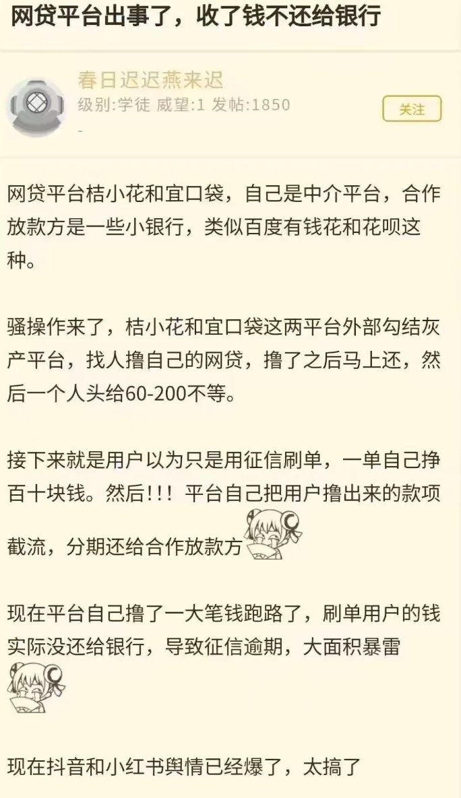

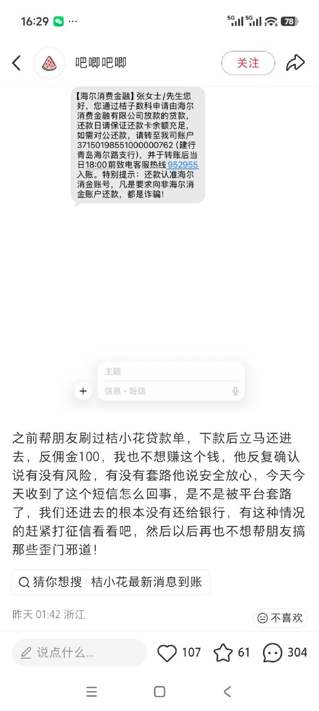

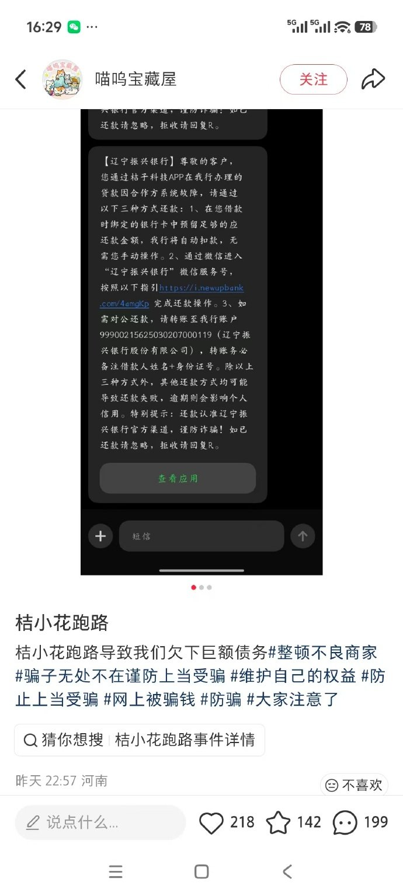

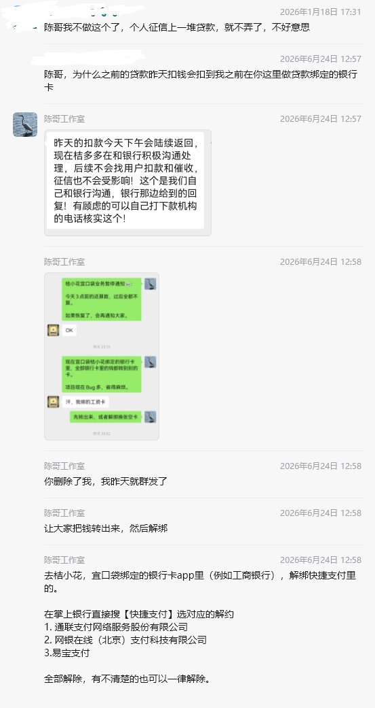

---

## 2

@李建秋的世界

发表于：2026-06-27 10:19

来源：微博

链接：https://m.weibo.cn/status/5314485721764057

噩耗：GTA6可能会很烂。

如果制作人是这样的，那确实。

原先写本子的哪些老员工已经走了。

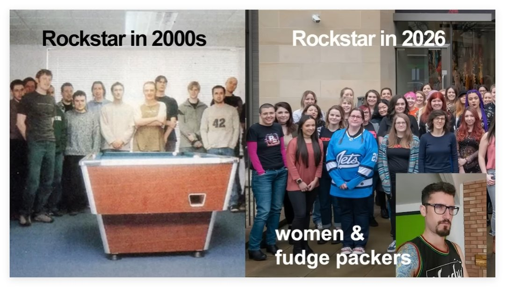

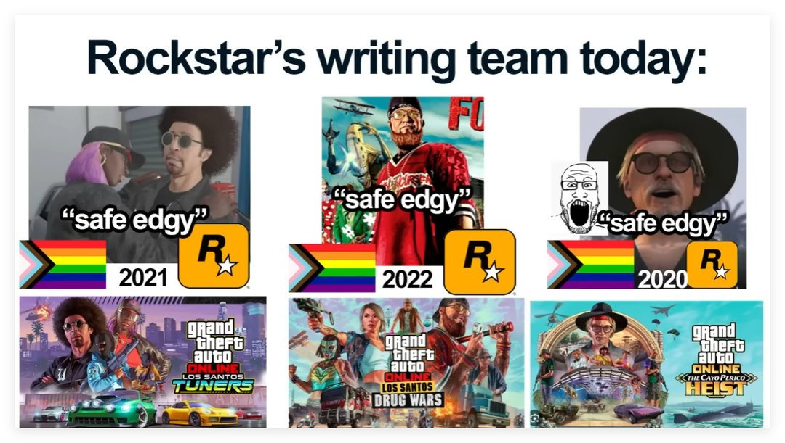

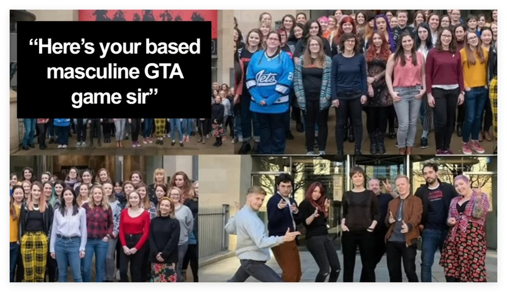

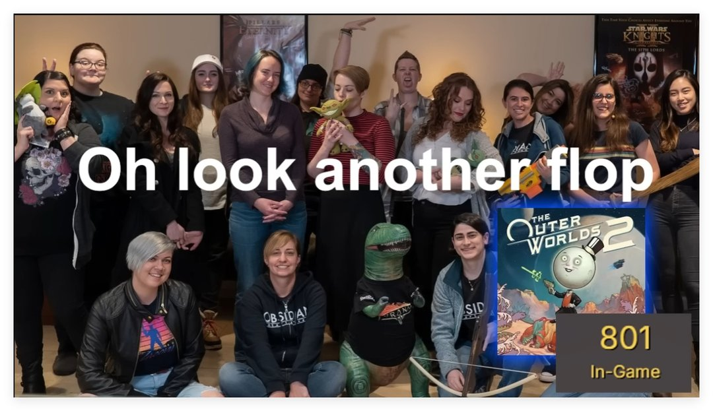

---

## 3

@李建秋的世界

发表于：2026-06-27 08:44

来源：微博

链接：https://m.weibo.cn/status/5314461707796795

欧洲已经搞笑成什么样，光看这个新闻标题

《极端高温研讨会因极端高温取消》

最高端的幽默，是你编都编不出来的。

我不看脱口秀是因为脱口秀太低级了。

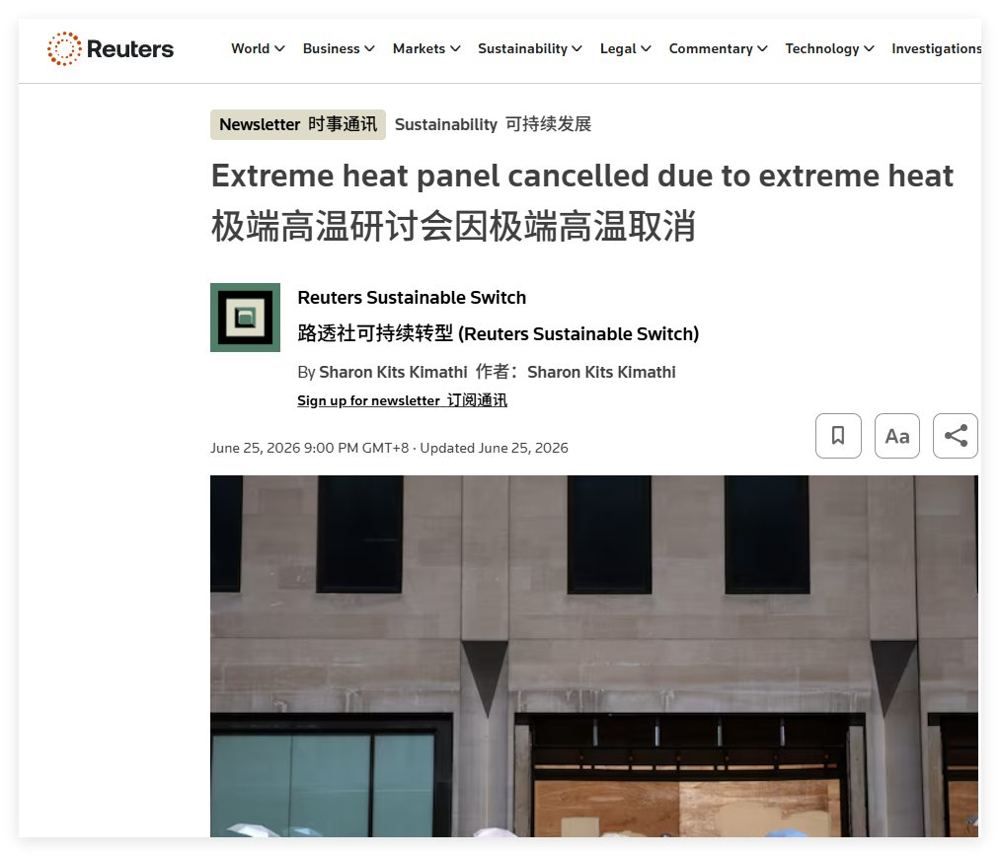

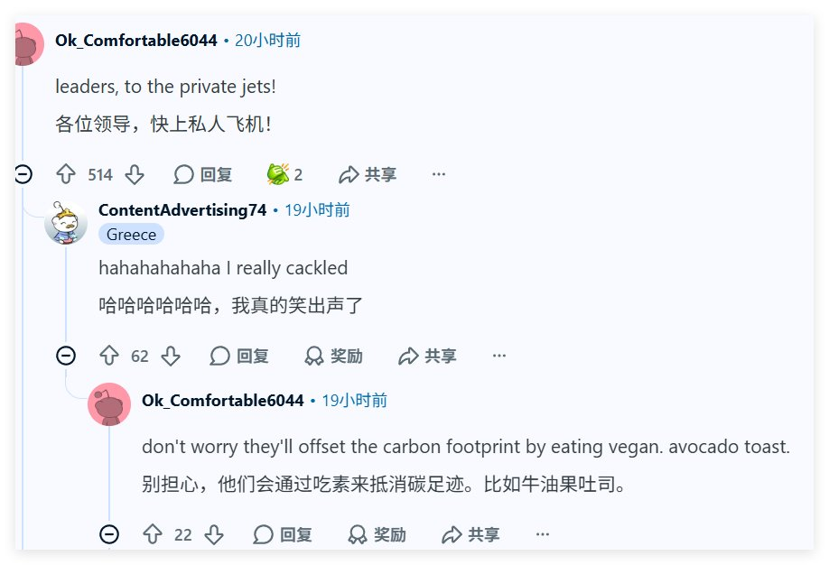

---

## 4

@蘸盐

发表于：2026-06-27 08:48

来源：微博

链接：https://m.weibo.cn/status/5314462824272045

1940 年李经迈死后，他儿子李国超就把“望云草堂”藏书捐给震旦大学，“丁香花园”房子整体卖给新华影业张善琨了。张氏在这里拍了两年电影，又先后由奚鹤年和南浔张氏家族买下。抗战后被国民党接收，用作邮政储金汇业局，1948 年杜月笙买下，准备改造为宅邸，没来得及动工就解放了。之后由华东军政委员会收归国有，华东局就设在这里。陈赓大将是在这里病逝的 //@Somewhere123_:现在他家后代还拥有这块产权吗？

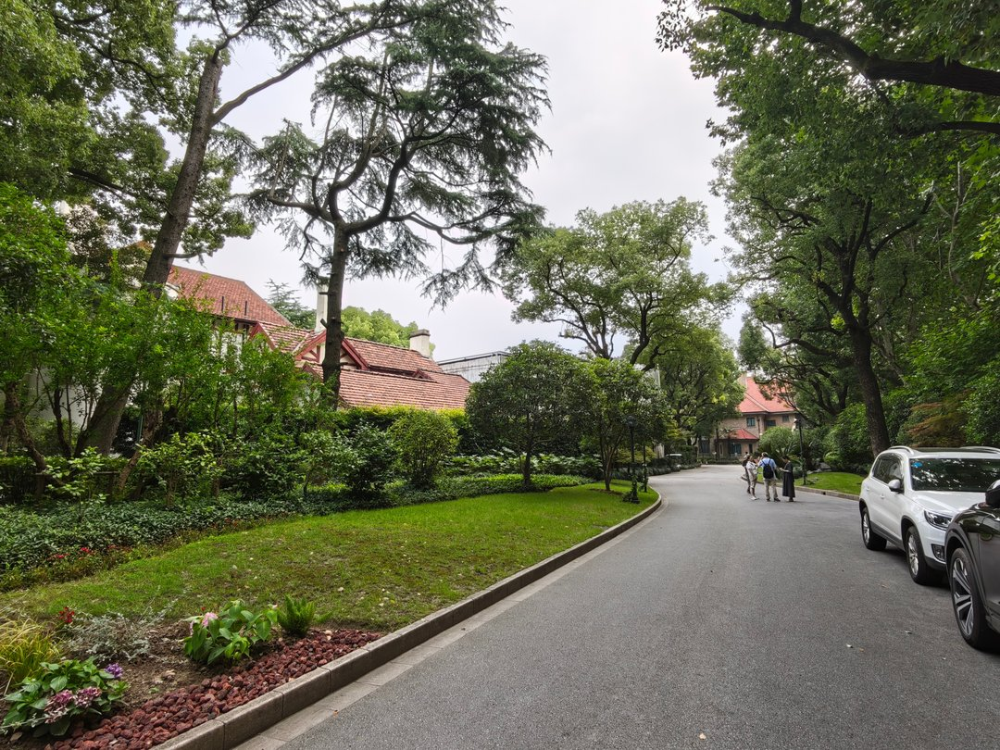

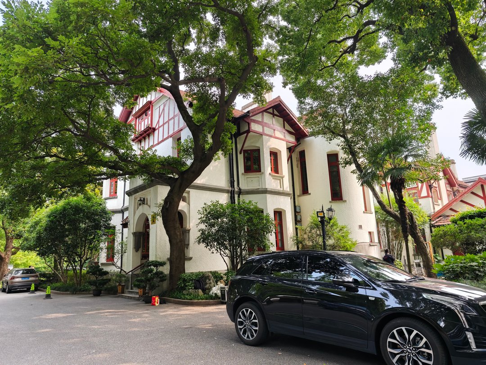

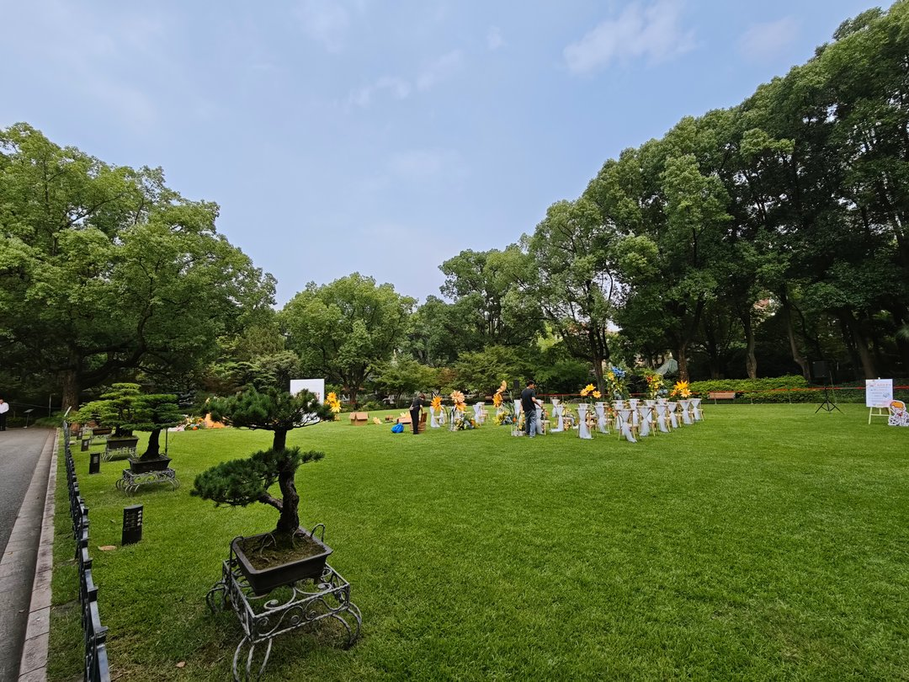

---

## 5

@伊洛牧

发表于：2026-06-27 01:11

来源：微博

链接：https://m.weibo.cn/status/5314347660216121

随时失联，关注下公号吧，“伊洛”

北京幼儿园入园人数5年下降9万人-42% 网页链接

2020-2021学年突然跳到22.2万。之后每一年都在往下走：2021年19.0万，2023年16.4万，2024年14.0万，2025年12.9万。

朝阳区是北京最大的幼儿园市场。2020-2021学年入园3.4万人，到2025-2026学年只剩2.2万，少了1.2万。降幅35%。但朝阳依然稳坐第一——它的常住人口基数决定了这个位次短期内变不了。

海淀区排第二。入园从2.8万降到1.8万，降幅34%。海淀幼师也多——6,212名专任教师，生师比只有10:1，对比朝阳9.3:1。

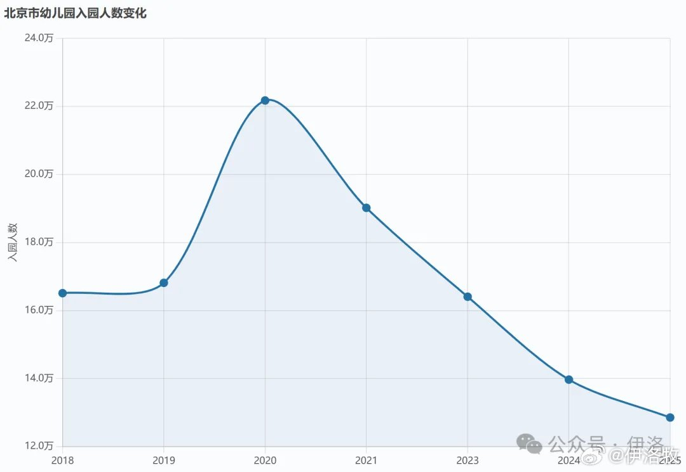

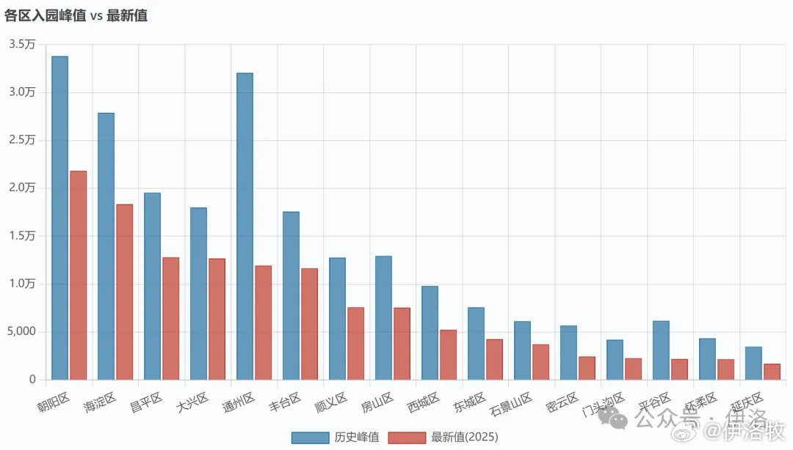

---

## 6

@戴雨潇Dai

发表于：2026-06-27 08:03

来源：微博

链接：https://m.weibo.cn/status/5314451490474693

特朗普宣布美国将推出建国250周年纪念版新护照，上面花着巨大的特朗普画像，还说新护照里会写：「欢迎，但要守规矩。」（Welcome, But Be Good.）

这次懂王显然又出了个大丑。他没搞明白，美国护照是美国公民出国用的，不是外国人来美国用的。写这玩意对提升美国的「国格」毫无帮助，反而显得美国人不守规矩，出国还需要政府专门提醒。

\#特朗普回应美伊又打起来了\#

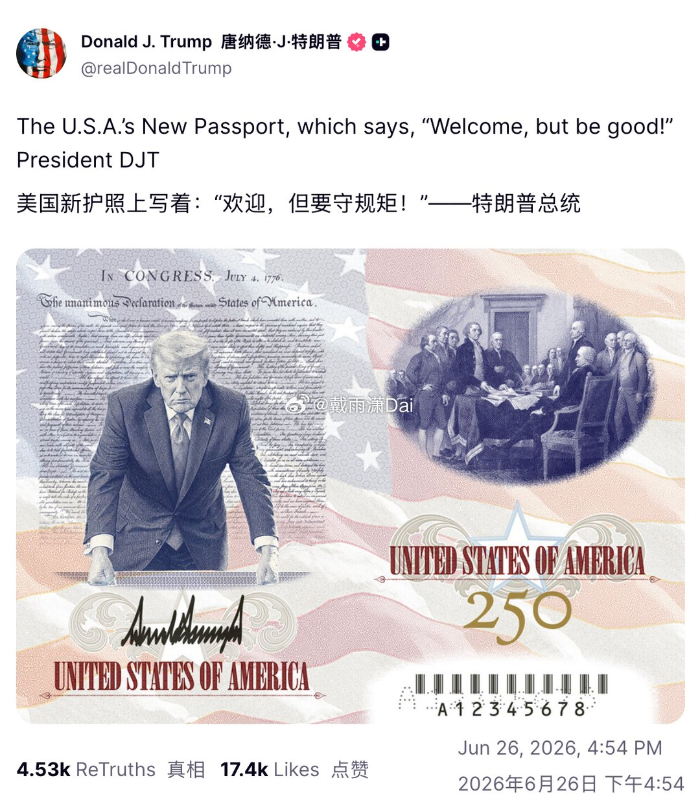

---

## 7

@宝玉xp

发表于：2026-06-26 19:26

来源：微博

链接：https://m.weibo.cn/status/5314260995147824

OpenAI 今天（6月26日）发布了新一代模型 GPT-5.6，包含三个版本：旗舰级 Sol、日常级 Terra 和经济级 Luna。但这条新闻最值得关注的地方不在模型本身，而在发布方式：应美国政府要求，GPT-5.6 目前只向大约 20 家经过政府审批的合作伙伴开放，普通开发者和 ChatGPT 用户暂时用不上。

GPT-5.6 用了一套新的命名规则：数字代表代际，Sol、Terra、Luna 代表三个固定的能力档位，灵感来自太阳、地球、月亮。Sol 是最强的旗舰，Terra 性能接近上一代 GPT-5.5 但价格砍半，Luna 主打便宜快速。

Sol 新增了两个模式：max 模式让模型花更长时间深度推理，ultra 模式则调用多个子 agent 并行处理复杂任务，相当于一个 AI 自己拆分工作给一组 AI 干活。

在 OpenAI 公布的 Terminal-Bench 2.1（测试命令行工作流的编程基准）上，Sol Ultra 得分 91.9%，Sol 为 88.8%，Claude Mythos 5 为 88%，Google Gemini 3.1 Pro Preview 为 70.7%。网络安全方面，Sol 在 ExploitBench 上用大约三分之一的 token 就达到了 Mythos Preview 的水平。

API 定价：

Sol 每百万 token 输入 5 美元、输出 30 美元；

Terra 分别是 2.5 和 15 美元；

Luna 是 1 和 6 美元。

7 月还会上线 Cerebras 硬件加速版本，推理速度可达每秒 750 个 token。

OpenAI 这次花了大量篇幅讲安全。投入超过 70 万 A100 等效 GPU 小时做自动化红队测试，专门寻找能跨场景通用的越狱攻击。模型内置了拒绝机制，实时分类器会在生成过程中检测网络安全和生物领域的滥用行为，可疑输出会被暂停，交给一个更大的推理模型复审。

按照 OpenAI 自己的准备框架评估，Sol 的网络安全能力被定级为“高”，但没有达到“关键”级别。它能找到浏览器漏洞和利用原语（exploit primitive，也就是构建攻击的基础组件），但在测试条件下无法自主完成完整的攻击链。

OpenAI 把这解读为一个积极信号：模型更擅长帮防守方找洞和修补，而不是帮攻击方搞破坏。但这个判断是否经得起现实世界的检验，预览期就是用来回答这个问题的。

如果你是 API 用户，短期内最实际的变化是：Terra 的性价比。性能接近 GPT-5.5，价格只有一半，对跑大量推理任务的团队来说值得关注。Luna 则适合对成本极度敏感的高吞吐场景。

Sol 的 ultra 模式如果真能稳定运行，意味着复杂的多步骤任务可以甩给模型自己拆解、分配、汇总，开发者不用自己搭 agent 编排框架。这跟 Anthropic 在 Claude 上做的 agent 能力、Cursor 在 IDE 里做的 background agent，方向一致，都在抢占"AI 自己管理 AI"这个位置。

但眼下，大多数人还用不上。OpenAI 说几周内会扩大开放，据 Axios 报道下周就会增加更多客户。ChatGPT 用户什么时候能用，还没有明确时间表。

完整报告：网页链接

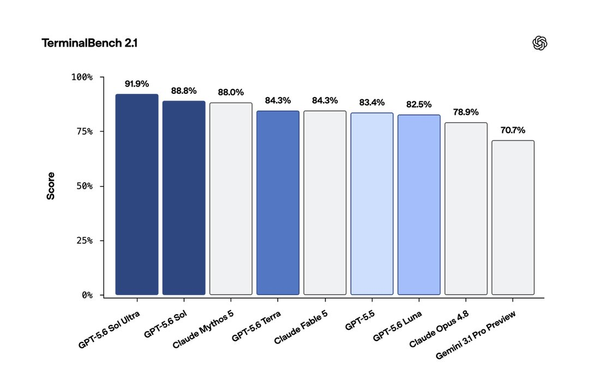

---

## 8

@王鹤诗

发表于：2026-06-17 23:02

来源：微博

链接：https://m.weibo.cn/status/5311053619007069

年画《将相和》，绘画：金雪尘，上海画片出版社出版，1956年5月第一版。

---

## 9

@王鹤诗

发表于：2026-06-15 23:02

来源：微博

链接：https://m.weibo.cn/status/5310328843536994

宣传画/年画《女饲养员》，绘画：金梅生，上海人民出版社出版，1972年10月。

---

## 10

@王鹤诗

发表于：

来源：微博

链接：https://m.weibo.cn/status/5180750230193672

1965年儿童期刊组图，自己动手、好好学习、我们爱清洁……等，绘画胡汀。

---

## 11

@一个坏土豆

发表于：2026-06-27 16:08

来源：微博

链接：https://m.weibo.cn/status/5314573351785165

这是俄罗斯最大的战略失误了！

就在这两天，俄罗斯进入了狂怒模式，重拳出击，掐断了乌克兰的后勤大动脉，乌军遭遇重创，后勤运输线几乎全线瘫痪。

但这个时候，我真的特别想问一句：早踏马的干嘛去了？

打了四年多，手里的精确制导导弹、远程轰炸机、蜂群无人机都还在，就非要等到战火烧到莫斯科家门口、西方新一轮百亿军援马上落地的时候，才想起去炸对方的后勤大命脉？

这波操作看着属实魔幻。

就这样的心态，这仗怎么能打赢呢？

我们解读下最新的俄乌局势。

6 月上旬开始，乌克兰放开手脚，一次次的发起了对莫斯科的无人机空袭，而且专门盯着俄罗斯的能源设施打。

俄罗斯的后方已经不再安全。

而且不仅仅是这样，在今年，俄罗斯境内一共有16 座大型炼油厂遭到打击，有超过40套核心炼化装置被迫关停，导致大约有30%的炼油产能陷入了停摆状态。

最致命的莫斯科卡波特尼亚炼油厂，这里承担着莫斯科及周边都市圈35%-40%的汽油、柴油、航空煤油的供给，在6月18日当天就遭到了200多架无人机饱和打击，现在官方预估至少停产6个月，让莫斯科一下子丢掉近四成本地成品油产能。

也就是说，现在不仅仅是安全的问题，乌克兰的袭击已经实实在在的让俄罗斯这个大油桶居然出现了能源危机。

但是更严重的后果还在后面，则连斯基这样做，就是告诉美西方：

我还能打，而且我能打赢，你们赶紧继续援助我！

效果呢，可以说是立竿见影，毕竟对于欧盟来说，已经投入了那么多了，不想让自己的投资打水漂，就要继续撑下去。

泽连斯基对莫斯科的袭击，相当于给他们打了一剂强心针。

于是就在乌军大规模空袭莫斯科的第二天，30 多个北约盟国当场敲定新一轮的总价值 40 亿美元的军事援助大礼包。

荷兰还单独追加 5 亿欧元军援，英国更是承诺在今年年底前向乌克兰交付 15 万架各型号无人机、350 套防空雷达与拦截导弹，德国同步敲定和乌克兰联合研发地面作战机器人、反弹道导弹系统的合作协议。

除此之外，G7 峰会同步放出消息，欧盟将在后续追加 450 亿欧元长期财政援助，用来兜底乌克兰战时政府运转，等于西方既送武器又送钱，硬生生的要给乌克兰续命。

而更让俄罗斯感到恐慌的是，美国的态度变了。

之前特朗普一直看不上则连斯基，天天逼乌克兰割地求和，说援助乌克兰就是无底洞，嘲讽则连斯基手中没有任何筹码。

可在乌克兰袭击莫斯科连续得手之后，特朗普的口风变了。

6月24号的白宫记者会上，特朗普非常罕见的表扬则连斯基说：

他做得相当不错，至少死死守住了战线，虽然双方都付出了巨大伤亡代价，但我认为他的表现得很好。

He’s done a pretty good job, at least he’s held the line. A lot of people have been killed on both sides, but I think he did well.

这简直就是180度的大转弯！

接着在G7峰会上，特朗普一反常态，主动和泽连斯基会谈、同意加码对俄罗斯的制裁、还表态不再压制乌克兰使用美制远程武器打击俄罗斯的本土。

很明显，美国的外交姿态明显软化了、从施压逼迫则连斯基让步，变成了包容乌克兰的军事反击行动。

所以袭击莫斯科的后果，就是欧洲的信心更强了，美国的态度也转变了，以后的援助会更多。

这就是让俄罗斯真的慌了。

于是在6 月21 日凌晨，俄军终于忍不住了，进入狂怒模式，发起冲突以来规模最大的后勤枢纽专项打击行动。

一次性出动数百架自杀式无人机，搭配苏34、苏35 战机投放精准制导导弹，同步轰炸苏梅、哈尔科夫、扎波罗热等多个地区的后勤设施。

而其中最致命的一击，是袭击了第聂伯河上的两座大型桥梁，分别是普列奥布拉任斯基公铁两用大桥和扎波罗热水电站大桥，猛烈的袭击几乎是把这两座桥彻底摧毁。

这两座桥对乌克兰非常重要，是乌克兰的运输生命线，一旦摧毁，会让50万的南线乌军陷入了补给的绝境。

第聂伯河把乌克兰分割成东西两个区域，驻守在扎波罗热、赫尔松整个南线战场的乌军总兵力接近 50 万人。

而前线所有北约援助的主战坦克、重型自行火炮、步兵战车这类50吨到 70 吨级别的重型装备，只能依靠这两座大桥完成跨河运输。

平均每天有18列军火运输列车、上千台重型军用运输车源源不断的从桥上通行，乌克兰南线80%以上的弹药、能源、武器、野战物资都是从这里运过去的。

这两座桥被炸了，对乌克兰带来了两个致命后果：

第一、整体物资运输运力暴跌70%，前线的炮弹和燃油只好限量配发，炮兵的炮弹也运不过来，装甲部队缺少燃油只能原地驻防；

第二，现在乌克兰的运输只能走乡间土路，没有任何遮挡，长长的运输车队完全暴露在俄军无人机、远程火炮的侦察范围内，随时都有被袭击的风险。

南线的乌克兰军队现在不仅失去了进攻能力，防守都是个大麻烦，很容易就陷入弹尽粮绝的局面。

其实看到这里很多人都想问俄罗斯：

早干嘛去了？

这么重要的交通枢纽，能炸为什么不炸？

而且本来是有能力炸，但就是偏偏不炸。

说白了，整件事最讽刺的真相就是：

俄罗斯始终顾虑太多、心存幻想、迟迟不敢下死手。

俄罗斯原来就说过，这两座大动脉桥梁，虽然是乌军前线的弹药、重装备的核心补给通道，但每天还有 10% 到 20% 的运力在输送民生物资。

所以俄方一直犹豫、一直舍不得炸。

担心炸了桥以后，乌克兰老百姓的生活会受影响，担心乌克兰人没吃没喝、没法过日子。

今年6月13日的时候，俄罗斯国家杜马国际事务委员会的主席切帕，在公开接受外媒采访的时候明确说：

开战以来俄军长期没有打击第聂伯河的跨河大桥，核心原因就是这类桥梁属于军民两用设施，一旦彻底摧毁，在切断乌军军事后勤的同时，还会影响乌克兰普通民众的日常出行、物资运输，引发人道主义灾难；

俄罗斯出于人道主义考虑，长期克制没有对第聂伯河干线大桥实施毁灭性打击。

但是看到这里我真的只想笑。

你俄罗斯既然这么心疼乌克兰的民生、这么顾忌乌克兰百姓的死活，那你当初就别开战啊！

那为啥要打仗呢？

你完全可以退让和妥协、让北约一步步东扩、完成对你的战略包围，不就一了百了吗？

可你一边咬牙开战，让自己的士兵奔赴战场；

一边又妇人之仁，处处手下留情，舍不得打断对方的核心后勤枢纽。

心疼乌克兰老百姓没饭吃、没桥走，那谁来心疼远赴前线、浴血厮杀、白白战死的俄罗斯士兵？

这就让我想起了建文帝，你不想和叔叔撕破脸，那你就别削藩。

你藩都开始削了，仗都打起来了你又开始喊勿伤吾叔。

顾及情面你就别打，打起来你又不敢下死手，那有啥办法呢？

西方媒体保守统计，俄乌战争爆发之后，俄军的总伤亡超百万。

我们就算打个两折，实打实伤亡也超过20万俄军将士。

而这四年源源不断输送到乌军手上、用来击杀俄军的炮弹、无人机、重武器，绝大多数，就是靠着这些俄军一直舍不得炸的命脉桥梁送上去的。

所以最离谱的逻辑就在这里：

你舍不得乌克兰民众吃苦，最后买单送命的，是你的俄罗斯士兵。

俄罗斯最拧巴、最吃亏的地方就在这：

开战前，怕激化局势、怕死人、怕局势失控，一直隐忍退让；

被逼到绝境不得不开战之后，又顾虑民生、顾虑舆论、顾虑国际影响，始终不肯下狠手、不肯断命脉、不肯绞杀后勤。

结果呢？

搞笑的是顾虑来、顾虑去，犹豫四年，到了最后，自己都被偷家了，于是该炸的桥，终究还是炸了；

该下的狠手，终究还是下了；

该承受的惨烈消耗、该付出的巨大伤亡，一点都没少。

其实俄罗斯现在还没搞懂，无人机普及之后，小国获得了非对称作战的巨大优势，完全可以撕碎大国传统的纵深和武器优势。

今天的无人机作战，只要量大管够，铺天盖地的扎堆飞过去，只要这么做，除了中国，没有任何一个国家能守得住。

传统钢铁洪流、大纵深陆地作战的时代早就已经落幕了，几百美元的FPV无人机，一两万美元的自杀式无人机，完全可以抹平大国和小国之间的军备差距，非对称作战已经彻底重塑了现代战争格局。

就别说伊朗了，连胡塞武装都逼得美国不得不在2025年的时候签署了红海停火协议。

现在除非彻底打垮乌克兰，否则根本就不可能防住他们的无人机，俄罗斯将一直陷入被动的局面。

其实我们来看，为啥俄罗斯最后走到今天，为啥莫斯科都被偷家了。

俄罗斯以为自己不炸乌克兰的后勤，西方媒体就会认为他仁义，这也是太搞笑了。

难道不炸这个桥，乌克兰会感激俄罗斯吗？

换句话说，今天把桥炸了，难道乌克兰才开始恨俄罗斯吗？

当然最后说白了，还是不敢下定决心，总是心存幻想，瞻前顾后不敢打。

其实我们来看，为啥特朗普的态度变了？

当初俄乌战争爆发的时候，美西方根本就不想管则连斯基，都想让他去组织流亡政府跑路去欧盟了。

结果泽连斯基扛住了，于是美西方的援助源源不断的来了。

现在呢，欧盟犹豫了，美国想放弃了，结果则连斯基孤注一掷连续偷袭莫斯科，西方的信心又来了，又开始加大规模援助了。

其实就这么简单，西方的逻辑很清晰。

则连斯基敢豁出去，让他们看到信心，援助就不停的给出来。

但凡则连斯基不敢打，援助早就断了。

所以俄罗斯麻烦了，这场战争还会无止尽的死磕下去。

而这一幕给世界的启示录就是：

你要么就别打，打了你还瞻前顾后最后一定会深陷困境。

仗都打起来了，还舍不得炸对方的后勤，想让对手觉得你仁义，这就是笑话了。

\#微博新知\#

---

## 12

@蚁工厂

发表于：2026-06-27 23:14

来源：微博

链接：https://m.weibo.cn/status/5314680639718040

//@秋纫II·黑暗森林:LLM相关的技术只要一个Hackathon就学会了，统计学、凸优化、信息论乃至神经网络和transformer原理这些偏理论的还是得靠上课。最近听了一个论坛，某全自动SMT贴片厂的良率还是靠统计学和根因分析解决的，硬核老课永不过时。LLM作用也很大，不过落地的时候更多还是工程实现的问题。//@裴喜龙:好多大学开 AI+xxx 这样的专业，如果他们的课程内容是凸优化、信息论与编码，那要么是他们没有合适的师资，要么是机械地理解了这些传统专业需要什么样的 AI，让这些数据处理（不是简单的CAD做图，而是能让数据很好地特征化的工作）计算机化程度都不高、也没积累几条数据的从模型训练开始干AI？还是让他们先会用 LLM 及相关的技术（agent、skill、角本、计算环境搭建等）更有意义。

---

## 13

@王鹤诗

发表于：2026-06-27 23:02

来源：微博

链接：https://m.weibo.cn/status/5314677497922135

宣传画《小朋友们来锻炼 长大接好革命班》，绘画：广州美术工作室，人民体育出版社出版，1975年7月第一版。

