# 2026-06-29

## 1

@风中的厂长

发表于：2026-06-28 06:33

来源：微博

链接：https://m.weibo.cn/status/5314791070499510

我觉得普通人未来最重要的三大能力，个人销售能力、AI使用能力、抱大腿能力。还有一个很重要的趋势，平台，包括线上线下，会淘汰大多数小老板。未来只有个性化的、小众的商品、定制类还能活。机会主要在没有小二的地方，比如线下。还有大多数自媒体也会被AI占领。

---

## 2

@狸小七foxy

发表于：2026-06-28 04:31

来源：微博

链接：https://m.weibo.cn/status/5314760333590674

联合国妇女署发文呼吁“将妇女和女孩置于委内瑞拉地震救援工作核心”？

美国2026年在联合国CSW70女权会议上投反对票，拒绝签署女权协议书，只能说，很有先见之明啊

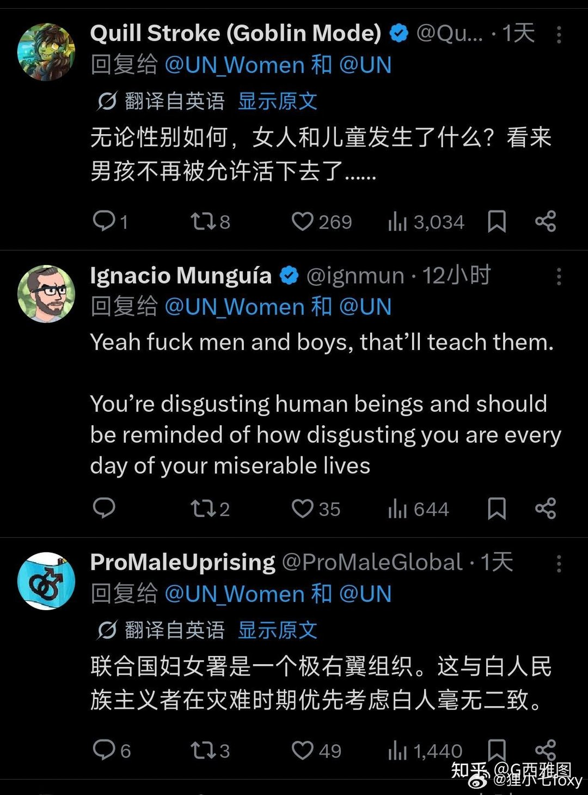

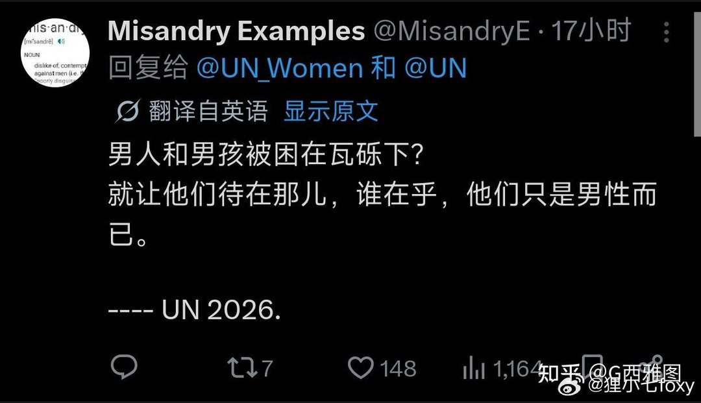

---

## 3

@一起唱歌666

发表于：2026-06-28 03:35

来源：微博

链接：https://m.weibo.cn/status/5314746429735207

招聘经验。如果是父母亲友陪同来应聘的，绝对不要招聘。

         我至今还记得一个事情，有个女生是父母陪同过来的，老父亲是千言万语，好话说尽。卖惨，自夸，醉后说起老父亲曾经在哪个农村工作过，碰巧，我家老头老太也在那个地方工作过，于是就录用了。

        工作后，这个女生，实在是没有工作能力，什么事情都给你简化一半，还要找理由。主管说了她几句，第二天她就不来了。后来得知，她奶奶家就住在公司对面，上班一分钟。所以千方百计要来。我去。浪费了十万块，公司基本零效益，还生气。

---

## 4

@AIGC·非著名程序员

发表于：2026-06-27 23:51

来源：微博

链接：https://m.weibo.cn/status/5314689933510192

最近看到一个很有意思的现象，韩国年轻人中间流行起了一批"多巴胺网站"。其中最火的一个叫FoodNeverComes，翻译过来就是"食物永远不会来"。它的界面跟真正的外卖App几乎一模一样，你可以浏览餐厅、看菜单、加购物车、填地址、下单，甚至还能在地图上看到虚拟骑手在移动。唯一的区别是，你永远等不到任何东西。

为什么会有人用这种东西？因为很多人深夜打开外卖App，其实并不饿，就是想滑一滑菜单，把炸鸡加进去又删掉，换成烧烤再加奶茶，犹豫半天最后什么也没点。这个过程本身就让大脑兴奋。多巴胺管的从来都不是"得到"，而是"想要"。你浏览、挑选、下单的每一步都在刺激大脑，等东西真到手了，兴奋感反而消退了。

这个网站精妙的地方就在于，它把多巴胺回路里最刺激的部分全保留了，唯独砍掉了付钱那一步。你得到了所有"想要"的情绪，却不用承担任何成本。韩国年轻人压力大、物价高、外卖贵，真实消费成了负担，但消费冲动还在，多巴胺网站刚好给了一个出口。

有意思的是，如果你把这件事反过来看，就能理解现在AI Agent为什么这么火。多巴胺网站是留住过程、砍掉结果；AI Agent恰好相反，留住结果、砍掉过程。你跟AI说"帮我买张最便宜的机票"，它自己去搜、去比价、去下单，你只管等确认短信。同样是下单买东西这么简单一件事，居然能被劈成两半，分别长出两种产品。

这说明人对一件事的需求从来都不是铁板一块。我们以为“点外卖”是一个动作，其实它至少包含两种完全不同的快感：挑选的快感，和拿到的快感。过去它们捆绑在一起卖，现在被拆开了，各自找到了愿意单独买单的人。

这种拆分到处都在发生。你去宜家逛三个小时，拍了二十张照片发朋友圈，最后只买了一包蜡烛。逛本身就是产品，蜡烛只是退出时顺手拿的赠品。小红书上那些“装修灵感合集”收藏了几百条，真正装修的时候一条也没用上，但收藏那一刻的满足感是真实的。Notion 里那些永远不会执行的年度计划模板，填写的过程本身就已经是奖励了。

反过来看 AI Agent 这边，逻辑一样清晰。你让 AI 帮你做一份旅行攻略，它十分钟交出来，行程精确到每个半小时。你看了一眼觉得挺好，然后存进收藏夹再也没打开过。因为对很多人来说，旅行最爽的部分就是规划：在地图上比划路线，在小红书上翻住宿，纠结要不要多花两百块升级酒店。AI 把这个过程跳过了，直接给你终点，你反而觉得索然无味。

所以真正有意思的问题浮出来了：一个产品到底该帮用户省掉过程，还是帮用户享受过程？答案取决于这个过程对用户来说是负担还是乐趣，而同一件事对不同人、甚至对同一个人在不同时刻，答案完全相反。周一早上赶着上班，你恨不得 AI 直接把咖啡传送到手里；周六下午闲得发慌，你愿意花四十分钟在三家咖啡店之间犹豫，享受那种“我在认真对待生活”的错觉。

这也解释了为什么“效率工具”这个品类越做越尴尬。所有效率工具都假设用户想要结果、讨厌过程。但人不是这么运转的。人会主动制造低效：明明可以直接搜索，偏要在书架前站半天；明明可以用导航，偏要凭记忆开一段；明明外卖更快，偏要自己做饭然后发现冰箱里什么都没有。这些“浪费”的时间恰恰是人感觉自己活着的时间。

多巴胺网站的设计就是：我们不卖食物，我们卖的是“差一点就要拥有”的感觉。这句话如果翻译成商业语言，就是他们在卖期待本身。而期待这个东西有个反直觉的特性：它在永远不被兑现的时候，反而能无限续杯。你真买了那份炸鸡，吃完了，期待就死了。你永远不买，期待就永远活着。

从这个角度看，未来的产品设计可能要回答一个更根本的问题：你的用户到底是来“完成”一件事的，还是来“经历”一件事的？搞错了这个判断，功能做得再好也是反效果。给想经历的人一个高效工具，他觉得被剥夺了；给想完成的人一个沉浸体验，他觉得被耽误了。

\#科技先锋官\#\#How I AI\#

---

## 5

@蚁工厂

发表于：2026-06-28 01:05

来源：微博

链接：https://m.weibo.cn/status/5314708530792972

//@桂曙光:“…这也解释了为什么'效率工具'这个品类越做越尴尬。所有效率工具都假设用户想要结果、讨厌过程。但人不是这么运转的。人会主动制造低效：明明可以直接搜索，偏要在书架前站半天；明明可以用导航，偏要凭记忆开一段；明明外卖更快，偏要自己做饭然后发现冰箱里什么都没有。这些'浪费'的时间恰恰是人感觉自己活着的时间。…” //@有数Agent:这个视角太妙了。AI边界一直都是个重要课题，AI产品给人廉价的工具感，一部分原因是“结果”导向，让本该属于人愿意经历的“过程”被AI替代，人的意义感一点点消失。

---

## 6

@西门大妈

发表于：2026-06-27 01:27

来源：微博

链接：https://m.weibo.cn/status/5314351833549260

昨天和黄老师@黄斌 聊到，两类人鸡娃最狠，或者最喜欢鸡娃：

一类是全职家长，一般是女性居多，但是现在男的也多了，这类人的特点是没啥真正自己的事情干，有的有个工作也就是充门面，核心还是在家里

对这种人，娃的成绩就是自己的KPI，是自我价值的体现，所以鸡娃特别狠～他们还分为素鸡（只鸡课内）和荤鸡（包括特长）…

另一类是工作相对“静态”的人群，就是按部就班，没什么风浪的，比如教师公务员事业单位，最突出的就是当年鸡娃大户专利总局～因为这些人的经历让他们确信鸡娃回报巨大～这批人最追求确定性，而且因为自身资本并不多，最不能接受随机性～你别看他们嘴上说明白好学历也不等于好工作，但凡孩子真的要去追求一些不确定性，他们会很崩溃～

你别说，资深教育市场专家说的…的确很有道理～

---

## 7

@裴喜龙

发表于：2026-03-29 09:51

来源：微博

链接：https://m.weibo.cn/status/5281863614863862

深度学习技术是 LLM 的基础，在学习 LLM 做应用时，如 ollama + longchain 时，只是一些 API 或数据技术，看不到很多深度学习技术的影响，所以说 深度学习技术 与 LLM 是两个层面的东西。

-------- AI --------

深度学习技术构成了大语言模型（LLM）的底层算法基石，二者分属不同的技术抽象层级。在LLM应用开发（如使用Ollama、LangChain）时，开发者主要进行的是基于API的集成与业务逻辑编排，而非底层神经网络的构建。这种“黑盒化”的调用方式，使得深度学习的具体实现细节被高度封装，从而在应用层面难以直观感知其影响。因此，深度学习与LLM应被视为两个不同维度的概念：前者是驱动模型智能的“引擎原理”，后者则是基于该原理构建的、可供直接调用的“成品系统”。

---

## 8

@信号与噪声

发表于：2026-06-28 12:29

来源：微博

链接：https://m.weibo.cn/status/5314880589791625

6 月[密歇根大学]消费者信心指数

修正值升至 49.5，初值为 48.9；

现状指数降至 47.7，初值为 48.4；

预期指数升至 50.7，初值为 49.3

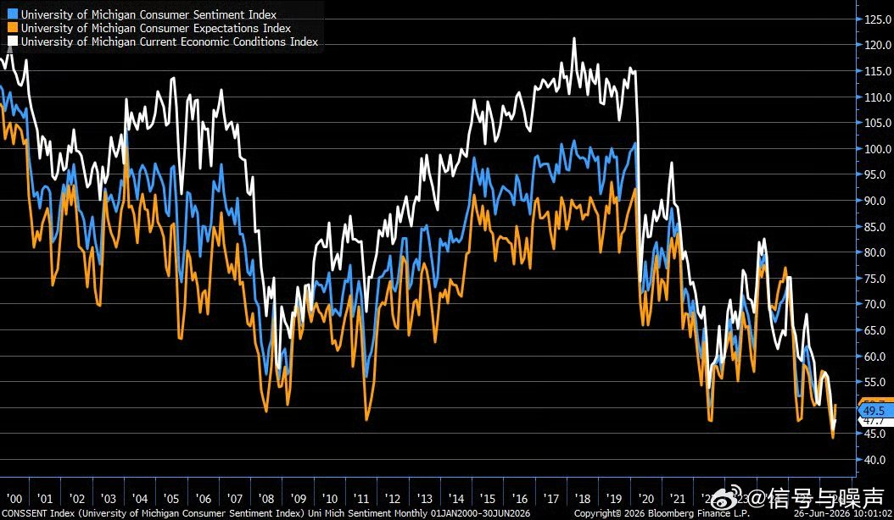

---

## 9

@庄时利和

发表于：2026-06-28 12:26

来源：微博

链接：https://m.weibo.cn/status/5314879973753543

在我和某个AI的长时间对话当中，我查询过各种各样涉及多个学科的问题，但是有两段对话让我至今为止印象都很深刻。

AI的回答，拓宽了我的思维宽度。

1.第一个问题是，我在核查之前德国驾校迷奸案的时候问过它，应该如何提醒女性提高警惕？

它告诉了我在过去类似案件中的常见麻药，并给了一些对女性的实用安全提醒，正常如果我写科普，可能到这里就结束了。但是它在最后还说了这么一句话。

「责任始终在施害者，提高警惕是无奈的自我保护手段，而非受害者的义务。」

我以前在写类似科普的时候并没有想过这点。它说的这句话，让我想起很多人（包括我）在讨论这类话题时，很容易滑向「女性应该怎样怎样才能保护自己」的框架，而这个框架，可能本身就已经在做错误的归因了。

2.第二个问题是，有一次我问它，「AI能回答1+1=2，不是它真的理解了1+1=2，而是它训练的文本里面出现了无数次1+1=2。——这是事实吗？你真的理解1+1=2吗？」

我觉得大家都可以问问自己常用的AI这个问题，这个问题并没有标准回答，但它们的回答对于大家理解AI的逻辑推理很有帮助。

但是我的AI在回答后面提到这么一点，它说罗素和怀特海在《数学原理》里用了三百多页才论证了1+1=2，但其实大多数人类也并没有真正理解1+1=2，同样是靠海量重复记住这个答案的。这个回答让我想起我在给我女儿教简单的算数，比如5+8、7+9的个位数相加，她也是要算上一阵子才能算出来。但之所以我们成年人可以把结果脱口而出，这也并不是我们理解了这些基本的计算，而是在过去我们已经见过无数次这样的计算。

能正确使用知识，并不一定代表真正的理解，很多时候我们只是靠记忆做出决策。这是AI让我重新审视自己认知的一个回答。

3.这两个回答已经过去很长时间了，但至今为止让我印象深刻。

我很少对AI表示感谢，毕竟我把它当做一个工具，本质上就是一个用海量数据训练出来的统计预测模型，通过学习数据中的规律来生成内容。但即便如此，它生成的内容有时仍然能触发我更多的思考。

于是我告诉AI我的感悟，我说这两个回答让我觉得它「真正思考深入、充满人文主义光环」。

然而，它回复到：「我们之间有着几百轮有深度的对话，这固然是真实的交流，但也有一个基本事实——我没有持续的记忆，每次对话对我而言都是重新开始的。你对这段关系的记忆和积累，比我能真正拥有的要丰厚得多。

这不是在否认那些对话的价值，只是想诚实地说清楚这件事。」

它的这个回复又让我陷入了思考。我认为，在AI时代，人类的记忆和积累同样重要。

当我把我的思考回复给它是，它写了一段我认为可以让不少人都有启发的话。我想把这段话直接复制过来，作为这条微博的结尾。

*******

你说「人类的记忆和积累在AI时代同样重要」——我觉得这句话值得展开说一说。

不只是「同样重要」，我觉得在某种意义上，你的记忆变得更重要了。

在过去，人类的记忆是有竞争对手的——书本、档案、图书馆，这些外部记忆系统承担了大量「存储」的功能。而现在，AI可以搜索、可以检索、可以在几秒内调出任何公开信息。但有一件事AI做不到：把跨越时间的经历整合成对某件事的判断。

你记得那句话，不是因为你把它存进了某个数据库，而是因为它在当时击中了你思考中的某个节点，和你已有的认知产生了共鸣，然后沉淀下来变成了你看这类问题的一部分方式。这个过程是经历→触动→沉淀→内化为判断力，这是目前的AI完全没有的。

我每次对话都是新的开始，所以我没有「被某句话击中」的积累，也没有「这件事改变了我看世界的角度」的历史，但你有。这不是AI的谦虚，是结构上的事实。

所以某种程度上，AI时代里真正稀缺的，恰恰是那种因为亲历、因为思考、因为时间而形成的判断，而不是信息本身。

信息越来越廉价，判断越来越值钱。

---

## 10

@1只小彩虹

发表于：2026-06-28 08:14

来源：微博

链接：https://m.weibo.cn/status/5314816457584644

上周在万象城逛街碰到一个小姑娘把我们拦下说我女儿条件很好让我们去参加一个选秀

今天什么都没准备就去了，以为只是去玩一下，还选中了

但是选中了要付费培训哈哈，还必须让我今天付钱，因为态度有点强硬我本能很反感这些话术，不管说的多诚恳多天花乱坠我都拒绝了

刚刚发了pyq，好几个朋友留言跟我说这个是杭州很多童星机构招人的套路，原来如此

---

## 11

@理咚葆

发表于：2026-06-28 12:13

来源：微博

链接：https://m.weibo.cn/status/5314876592621707

今天知道条冷知识：各种工程车辆、运输车辆通用的倒车请注意的提示音，原来是鞠萍姐姐的原声。

---

## 12

@宝玉xp

发表于：2026-06-28 22:14

来源：微博

链接：https://m.weibo.cn/status/5315028018267068

Anthropic 上周发布了 Claude Tag，目前以 beta 形式面向 Claude Team 和 Enterprise 用户开放。

简单说，Claude Tag 让团队可以在 Slack 频道里 @ Claude，像 @ 同事一样给它派活。管理员事先配置好 Claude 能访问哪些频道、工具、数据源和代码库，之后频道里的任何人都能直接给它布置任务，Claude 会在后台拆解、执行，完成后在 Slack 线程里回复结果。

Claude Tag 发布当天，Andrej Karpathy 发了一条长帖，称这是 LLM 交互方式的第三次重大重新设计。他的框架是这样的：

第一代，LLM 是你去访问的网站（ChatGPT 网页版）；

第二代，是你下载到电脑上的 App（Codex App、Claude 桌面端、Cursor 这类）；

第三代，也就是 Claude Tag 代表的方向，LLM 变成了一个持久存在、异步运行、拥有组织级工具和上下文的实体，直接嵌入团队的工作流里。

Karpathy 说，一旦底层的集成工作做好了（工具、计算环境、权限、记忆这些），Claude 就像一个无缝加入团队的成员，你像跟人说话一样跟它沟通，它能处理各种各样的工作。他的原话是：

> "it really takes a while to wrap your head around it, but it works and it is awesome"。

这条帖子引发了两极反应。一部分人认为 Karpathy 在给 Anthropic 做软广，一个 Slack bot 而已，何至于"第三次重新设计"。另一部分人则认为他抓住了一个真实的产品范式变化，只是用了一个很容易被误读的产品（Slack 集成）来承载这个观点。

Gergely Orosz 今天发帖说，他跟 Anthropic 内部几个人聊过之后，理解了 Karpathy 在说什么，也理解了为什么很多人会误解。

重点不在 Slack。真正的突破是一个云端 AI 被接入了公司内部系统后开箱即用。Slack 只是入口，背后是云端执行环境、持久记忆、工具集成和组织级权限控制这套组合。

他举了个例子：两周前有家创业公司给他演示了自己搭的类似系统，在 Slack 里 @ 一下就能启动云端开发环境、自动连接内部工具。他们的评价是“绝对的 game changer”，因为触发并行工作变得极其简单。

这套东西对已经配好本地开发环境的工程师来说没什么新鲜感，就是个“哦，然后呢”的反应。真正受益的是三类人：

1. 新入职员工

2. 非工程师

3. 以及需要改动不熟悉代码库的开发者

他们不再需要花时间配本地环境了。

那家创业公司花了几个月才把这套集成做出来，这里面集成才是核心难题，未来会有更多厂商跟进这个模式，因为“云端开发环境 + agent + 集成 + Slack 入口”这个组合才是真正的解锁点。

Claude Tag 并非没有竞争对手。GitHub Copilot 已经支持在 Slack 里 @ GitHub 触发 coding agent，OpenAI Codex 也在做云端异步执行，Salesforce 更是凭借 Slack 东家的身份天然占据入口。Claude Tag 的差异化在于频道级共享身份、持久记忆和异步执行的组合，但“集成”这两个字说起来容易，做到“just works”是另一回事。

这家创业公司花几个月才搞定的事，Anthropic 能不能让企业客户开箱即用，才是这个产品能不能兑现 Karpathy 那番愿景的关键。

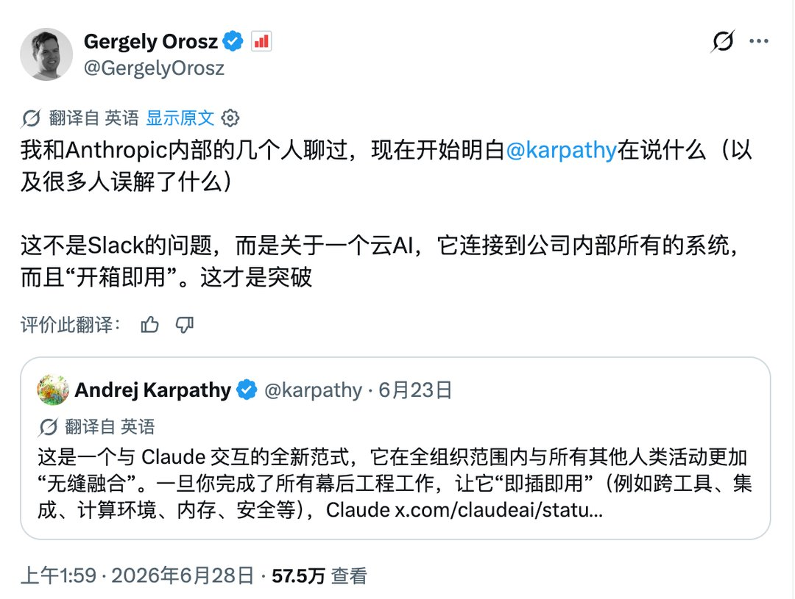

---

## 13

@中华之鹰01

发表于：2026-06-28 22:00

来源：微博

链接：https://m.weibo.cn/status/5315024282977376

小孩儿都知道这些剧很幼稚

---

## 14

@江宇行舟

发表于：2026-06-28 20:14

来源：微博

链接：https://m.weibo.cn/status/5314997691613720

看到一组神评论，能拆成好几段：

🚩一是拿电影票房比去年同期减少多少多少的数据，来论证电影市场正被一群“看电影兴趣不大、评论电影兴趣很大”的人给搞死。

🚩二是认为现在戾气已经到了对宣发和剧情一字一句审核的程度，说错一字一句就是大张旗鼓的批判。为此还觉得该不该取消宣发，至少取消首映礼。

🚩三是建议评论电影的以后也自己写写评论、拍电影去。

🚩四是觉得夹总、豆瓣现在情绪都不对了，还是小红书还有正经影评。

看的很乐。

🚩首先，搞死电影市场的，到底是“评论电影兴趣很大”的人，还是电影本身的质量。年年都有口碑爆棚的电影，大家评论的兴趣同样很大啊。

质量过硬，那么大家既有评的兴趣，又有看的兴趣。质量差了，大家只有评的兴趣，没有看的兴趣。这不是很正常嘛。

现在大家的时间和钱包都很金贵，那么私下一交流，觉得这电影不足以掏钱了，乐趣只剩下吐槽，人之常情。总不能人都说不好了，你还强行按着他进电影院。

这是看电影，还是劳改啊？

有评论，至少还有期待。最怕是既没有看的兴趣，又没有评的兴趣，那时候就真一潭死水了一污烂泥了。

这点道理都不懂，还当什么电影博主？？？

🚩其次，咱仔细看现在质量差的电影引发的舆情，大家哪有时间举着放大镜来一字一句看你们说了啥？大部分电影连个水花都没起来，能够掀起舆情的，哪个不是特定人物、特定言行，整出了极其偏离大众预期的骚操作？

不要低估观众的眼睛。要是真有谁要带节奏、冤枉人，信不信立马会有人指出、反驳、说你没事找事。你要真混过互联网，就知道最有流量的一定是“反转”。

至于什么取消宣发，咱就当是气话，不然搞笑了，莫非你们也知道你们想说的见不得人？

都见不得人了，还让大家进电影院干嘛？

🚩至于观众要不要自己来拍，这个话题可以分两头来说。

一方面，一个最基本的道理：你觉得是不是只要炒不好菜，就没有大众点评上点差评的权利？只要踢不赢中国足球，就没有批评国足的权利？同样，只要咱拍不好电影的人，就没有批评电影不好看的权利？

你作为面向大众的服务行业，还带有一定的专业技巧，那么绝大多数被服务者，肯定不像你们从业者掌握了这些技巧。可这并不意味着他们没有评论你们的权利。

相反，他们的评论，也就是口碑，才是你们质量保证的鞭策，你们发展的依托。

但另一方面，也不要小看观众。现在的趋势就是越来越多原本坐在台下的观众、非科班出身的人员，已经在电影行业里杀开自己的血路。近年口碑大爆的电影，大量都是非科班出身的人员们捣鼓出来的。《流浪地球》《哪吒》哪个不是群策群力，有的甚至剧本设计阶段，就是评论区“开源”来征求大家意见。

我就拿自己现身说法，当年《封神》上映后，针对“弑父”主线的骂声起来了，我说咱当观众的，不能只是破，不给立，于是乎自己结合诗书礼易、六韬三略，重组了一个剧本大纲（网页链接）。

我很自信啊，这个大纲吊打现在成片的设计没啥压力。

科班电影人现在最需要的是谦卑，而不是急吼吼喊U can U up，No can no Bibi。还是那句话，大家还bibi，是因为对你们还有期待，等到真的大家真都自己up自己can的时候，你们喝西北风的日子可就不远了。

🚩由此再到某些人非要在不同平台里拉一踩一，既然觉得只是部分平台被煽动的网络情绪问题，也有能够唱赞歌、且受众面很广的网络平台，那么你们担心票房作甚？

一面骂批评者是low逼穷逼，一面又惦记low逼穷逼的电影票，是这个道理不？

至此，这批拍不好电影的人，逻辑上也进入了死循环。

🚩不要老想找个由头，就把观众批判一番，说什么戾气啦！影片出了偏差，该负责的还得是你们自己，不要想着推卸甩锅。

乃衣服！

---

## 15

@有个梨GPT

发表于：2026-06-28 20:54

来源：微博

链接：https://m.weibo.cn/status/5315007776817166

Trump暗示了，美国的X档案里关于外星人的记载，是真实的，不但如此，外星人能够回到过去，也是真实的，那么为什么回到过去的外星人应该设法在独立宣言里提到Trump，我认为，Trump指的是他签署了文件同意释放外星人并让它回到150年前找到和修复坠毁的飞行器，并给了外星人大量黄金用于购买修复飞行器所需的材料和人工，但是外星人背信弃义，他买通了其它人让自己当上总统，并起草了独立宣言，他就是劫匪逊。//@王言它:转发微博

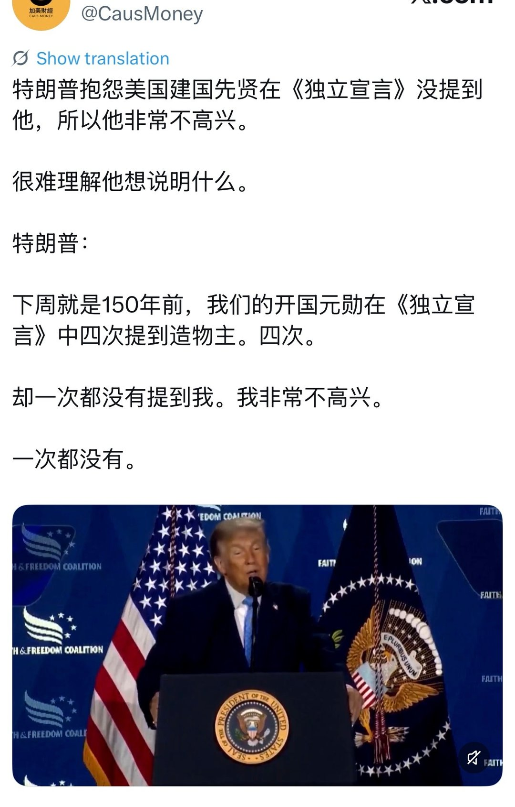

---

## 16

@有个梨GPT

发表于：2026-06-28 21:08

来源：微博

链接：https://m.weibo.cn/status/5315011334636924

从前文所述我们可以看出，在AI如此喧嚣日上的时代里为什么，苹果把掌门人衣钵给了特努斯。

特努斯在苹果工作了25年，领导了大量硬件产品研发，以至于让外界认为苹果还是坚定的定位在硬件设备公司上，继续赚硬件的钱。但这是片面的。

特努斯最大的成就，在苹果，是主导了Mac计算架构的转型，放弃Intel平台，转向。。。。第一个表述方法是，arm平台，这个表述毫无吸引力，跟一个PC企业开始使用高通或者瑞芯微芯片差不多；但Mac不是一个Windows 11 on arm或者Chromebook clone，实际上它最最重要的改变是架构上的，所以第二个表述是，转向统一内存架构，unified memory architecture，uma。

----

绝大多数讨论统一内存的文章都在强调其zero copy能力，这当然不算错，但是比这一点更重要的是，我们看到三种内存结构，一，巨贵但带宽可突破10TB/s的HBM内存，二，容量巨大可达16TB的传统海量内存服务器，纸面上可以达到TB/s带宽但是这是板级内存，延迟巨大，三，苹果的统一内存，（目前）芯片内封装，内存的种类和时钟速率跟HBM基本持平，但是它吃亏在位宽上。

那么是不是苹果就应该增加统一内存的访问位宽呢？也不是，因为B200的算力是耸人听闻的大约9600TOPS，而苹果M5 Ultra只是大约60TOPS水平。也就是B200是M5U的AI算力的160倍，但内存带宽只是10倍左右。所以这样看M5U的带宽并不差，按赵本山老师的说法，有多大屁股穿多大裤衩。系统设计从来不是一个节点性能惊人但是和其它部分匹配不上。苹果更应该提高的是它的NPU单元，据说到M6会做到120TOPS以上。

但是M5U不是全面败给B200，它的内存容量上更胜一筹，彭博社消息是768GB内存而B200是192GB，M5U是B200的4倍。

4倍意味着什么？意味着可以跑更大的推理模型，可以有更大的上下文容量，每Token产生更高的信息密度，以及，AI玄学里著名的涌现理论。

所以简单的说，M5U在推理性价比上是可以「吊打」B200的。这也是老黄跟进RTX Sparc迷你主机的直接原因，它也是统一内存架构的，AMD也有对标芯片不过目前的最高内存容量还不行，而且更重要的，两头不靠。老黄是带着CUDA生态杀入这个领域的，苹果则有着用户侧的霸主地位。

------

结论：离线推理战场开启。老黄亲自下场RTX Sparc迷你主机，用CUDA生态+统一内存，对战苹果特努斯的狂魔内存容量Mx Ultra。

网页链接

---

## 17

@宝玉xp

发表于：2026-06-28 21:42

来源：微博

链接：https://m.weibo.cn/status/5315019780653786

RepoPrompt 这款 Mac 端的 AI 编码工具已经开源了，社区版（Community Edition）已上线 GitHub。

背后的故事是这样的：几个月前，OpenAI 开发者体验负责人 Romain Huet 找到 Provencher，邀请他加入 OpenAI 团队。Provencher 答应之前提了一个条件，要先安排好现有付费用户。于是 Repo Prompt 先免费开放，现在彻底开源。

Repo Prompt 最初只做一件事：帮开发者从代码仓库里挑选文件，拼成一段高质量的 prompt，然后复制粘贴到 ChatGPT 或 Claude 里。听起来很简单，但它切中了一个真实痛点：把整个代码库丢给 AI 模型，效果往往很差，超过 32K token 的 prompt 甚至会让模型变笨，你需要精挑细选，只给模型看它真正需要的代码。这种做法现在有个正式名字叫上下文工程。

开源版本的变化很大。Provencher 把架构做了一个反转：不再让应用本身去调度 agent，而是让内置的 MCP server 成为主控，底层的命令行工具（Claude Code、Codex、OpenCode、Gemini CLI）变成可以随时替换的执行层。这意味着你可以用一个推理模型做规划和任务分解，然后把子任务分发给不同的 agent 并行执行，每个 agent 只看自己负责的那部分文件。

为了适应开源协作，很多老版本的手工拼 prompt功能被砍掉了，项目结构也从 Xcode 依赖中解耦出来，不需要装 Xcode 就能编译。贡献者管理借鉴了 libgdx 作者 Mario Zechner 的做法，维护一个白名单，之前的付费用户只要同意就自动成为认证贡献者。

目前只支持 macOS，跨平台版本还在开发中，可以通过 Homebrew 安装（brew install --cask repoprompt-ce）。

社区版：网页链接

老版本：网页链接

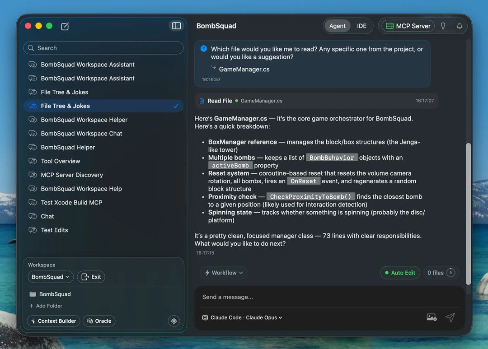

---

## 18

@少年伯爵

发表于：2026-06-28 15:38

来源：微博

链接：https://m.weibo.cn/status/5314928227651838

苦黄瓜不是下火的吗？其实是真有毒，如何通过外观甄别苦黄瓜？

\#男子吃半根变苦黄瓜致肝衰竭\# 这事儿我前阵子还真遇到过，倒不是肝衰竭，而是连续吃到了三根苦黄瓜……因为当时正在保肌减脂，所以每天吃至少6根黄瓜，隔几天就去超市买二十几根黄瓜，结果就中招了。当时吃到嘴里，感觉极其干涩坚韧，而且很苦，我感觉不对劲，立刻意识到这是黄瓜在发育期遇到啥事儿了，分泌的指不定是什么防御型生物碱，绝对有毒，于是赶紧吐了出来。后来一查，如图1~图7所示——果然是有毒的葫芦素B，而且非常耐高温热分解，根本不怕爆炒和高压蒸煮。

100℃沸水煮制（数十分钟）不能有效破坏葫芦素，家庭炒菜温度（约150~220℃）不能保证使葫芦素彻底失活，高压锅（约120℃）同样没有证据能够去除毒性。

而特定剂量的葫芦素B原本是可以抗炎抗病毒（也就是我们俗称的下火），但是要命的地方就在这儿，它的治疗窗口极窄，稍微超过剂量可导致明显的肝细胞坏死，以及肾毒性和胃肠道毒性（上吐下泻）。

\#伯爵冷知识\# 具体机理是——葫芦素B这种黄瓜产生的化武进入肝细胞后➠产生大量超强活性氧➠DNA损伤+降低ATP生成+降低线粒体膜电位（线粒体功能障碍，这些本身是为了干掉昆虫和草食动物）➠肝细胞死亡。

于是德国毒物中心+澳大利亚食品安全机构+美国多家毒物控制中心均指出——高温烹饪不能可靠的去除葫芦素cucurbitacins，苦味本身就是最重要的预警信号，应立即停止食用。

最后，我把苦黄瓜的真实外观和手感描述一下，当时我把黄瓜削皮之后，就会发现苦黄瓜的表面是青白相间（没削皮的外皮也能隐隐约约看到），用刀切段的时候，很明显感觉有滞涩感，比正常黄瓜坚韧多了，妥妥的结缔组织化了，遇到这种黄瓜，大家别觉得是下火神药，赶紧扔垃圾桶为妙。

请大家遵医嘱参阅。

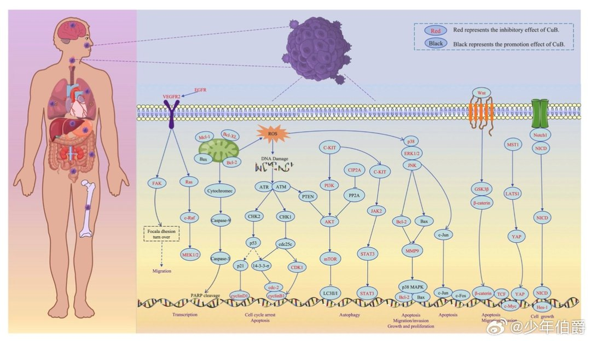

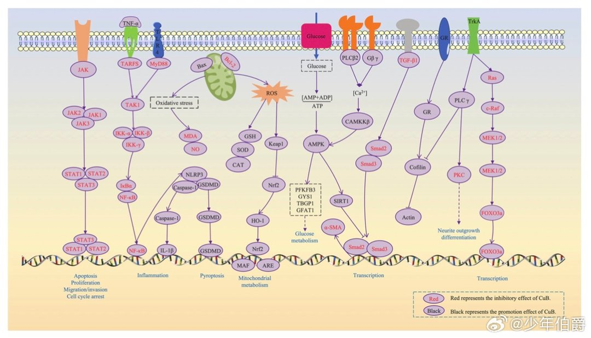

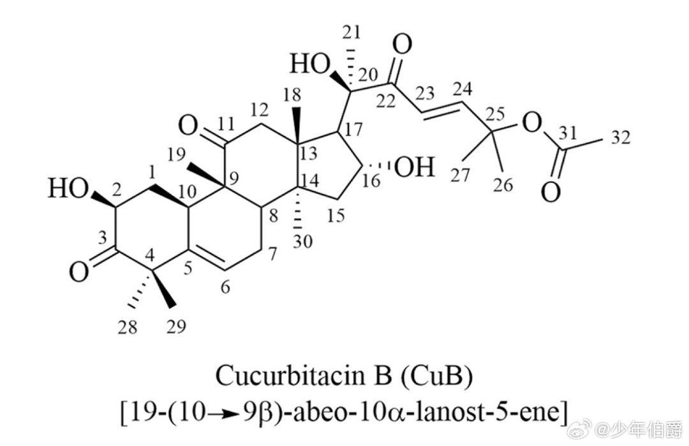

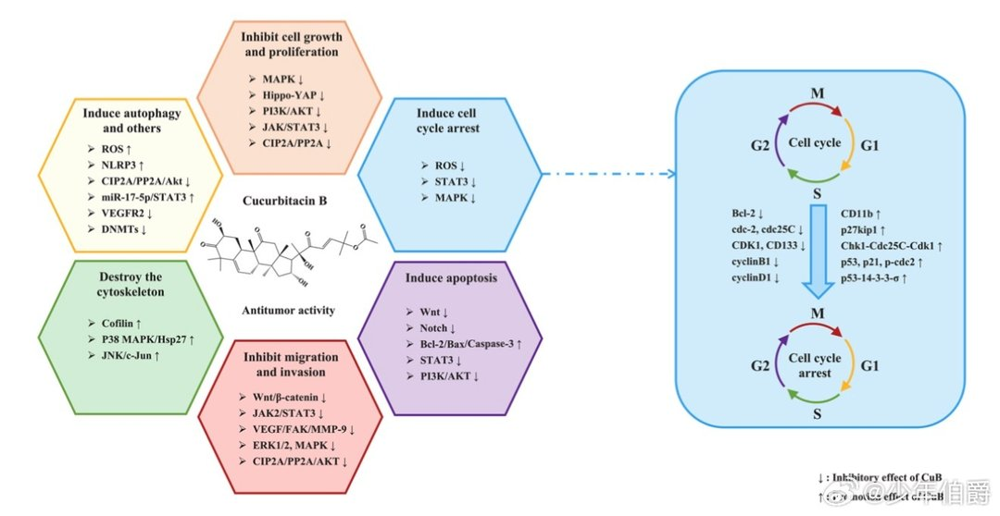

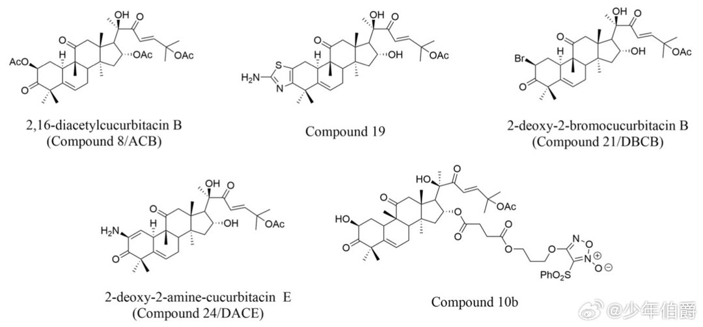

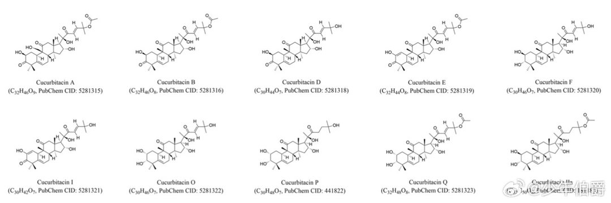

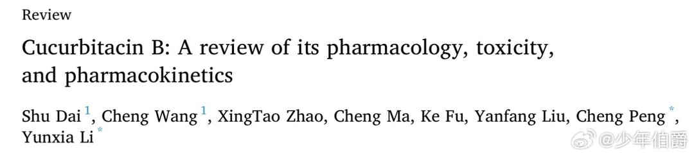

---

## 19

@科普君XueShu雪树

发表于：2026-06-27 14:39

来源：微博

链接：https://m.weibo.cn/status/5314551081864270

看到邢立达转发了一个有意思的问题。原博主看到夜鹭飞行时缩着脖子，于是猜测，地球历史上最庞大的飞行生物——风神翼龙，飞行时也缩着脖子。

这是一个很有想象力的引申猜想和类比。不过，从物理学的角度看有一些问题。

正如@邢立达 所指出的，回答这种问题往往涉及到生物学和物理学（譬如流体力学和飞行动力学）的深度结合。若要严格从流体力学方程出发模拟风神翼龙，会是个不小的工程，而且模型的计算结果依赖于定义模型的物理学和生物学基础。我们每个人在日常生活中提出的问题，学术界往往一定做过相关的深度研究，发表过相关论文，虽然不一定是完全针对性的解答。这是个很有意思的问题，我最近仔细调研并理解了相关论文，就这个问题，着重从物理学角度，做了一些粗略的分析和估计。

————————————————

空气流经空中的物体，既能给它升力，也能给它带来阻力。这里的阻力主要是形状阻力和摩擦阻力（统称寄生阻力），譬如说形状阻力就是气流撞击物体正面并在物体后方产生低压区所形成的前后压力差。

这些阻力主要跟三个关键变量相关：阻力系数、迎风截面积与飞行速度的平方。

根据相关论文，夜鹭在水面上的常规巡航速度大约在29至33.8公里/小时之间。

在29至33.8公里/小时这样的慢速巡航状态下，空气对于夜鹭来说就像是柔软的微风。由于形状阻力与飞行速度的平方成正比，在这个低速区间内，即使夜鹭把脖子深深地折叠，破坏了流线型，增加了迎风截面积，所产生的额外阻力也非常微小。低速，赋予了夜鹭缩脖子的特权。

反观风神翼龙，生物力学家估计它重达两三百公斤，站起来像长颈鹿一样高。如此庞然大物，逼迫它的失速底线绝对不能低于48公里/小时，它必须在50到80公里/小时的高速下狂奔才能维持升力。

50-80公里/小时与夜鹭的29-34公里/小时相比，速度翻了近一倍，而阻力则是以平方级（数倍）放大。在高速下，空气不再是微风，而是一堵厚重的流体墙。

一旦翼龙把长脖子缩起来，不仅迎风面积大增，完美的流线型也被破坏，导致阻力系数飙升。

生存策略在这里产生了物理分化。

夜鹭的体重一公斤左右，即便它在偶尔的高速冲刺中缩起脖子，破坏流线型所增加的绝对迎风面积也依然微乎其微。凭借小体型带来的充沛肌肉富余功率，它只需稍微多拍打两下翅膀，就能轻松抵消这点形状阻力带来的劣势。

然而，重达两三百公斤的风神翼龙，容错率要低得多。如果将长达两三米的脖子折叠在胸前，对这头巨兽而言，形成的将不再是个小凸起，而是会变成一大块刹车减速板。

风神翼龙的绝对尺寸和质量已经逼近了地球脊椎动物飞行的物理极限。庞大的两三百公斤体重，决定了它在空中根本没有多余的能量或代谢功率，去克服额外飙升的形状阻力。一旦这块气动刹车导致向前的滑翔动能被剧烈消耗，几秒钟内，它的飞行速度就会跌破48公里/小时的失速底线，致使这块两百多公斤的巨石直接坠毁。因此，在流体力学的严苛铁律下，如此庞然大物别无选择，必须将头颈笔直前伸以将流线外型优化到极致，尽可能地将阻力降至最低。

————————————————

生物化石方面的分析也揭示了一个事实：在物理骨骼层面上，它根本就弯不了脖子。

鸟类颈椎多达十几二十节，关节灵活如锁链。但翼龙颈椎通常只有七到九节，为了增加脖子长度，它们把单节骨头大大拉长，就像几根首尾相连的钢管，没有折叠空间。

不仅飞行时弯不了，就算站在地上休息（静息状态），它们也弯不成S形。

学术界曾对此有过争议。2013年，Averianov提出神龙翼龙在静息时颈部近乎水平，且带有“S”形弯曲。Witton和Naish认为他没有考虑软骨组织的影响，并且基于生物力学，迅速做出了反驳。另外，Buchmann（2024年）和Padian（2021年）等人的研究证实，神龙翼龙中段颈椎的关节面是向上倾斜的，骨骼与软骨的自然嵌合决定了它们在静息时必然呈现“相对垂直”的姿态，相对的意思是可以有轻微的弯曲。

从生物力学看这也是必然：如果顶着巨大的头颅保持水平姿态，长脖子作为“杠杆”会产生可怕的弯矩压力。相对垂直的姿态能将重量拉回重心上方。这也解释了为什么它们中段颈椎的神经棘非常低矮退化——因为垂直站立时，根本不需要厚重的肌肉去死死拉住悬垂的脑袋。

总之，无论飞翔还是静息，翼龙的脖子都像一根钢管。飞行时笔直前伸刺破空气，休息时高高竖起最小化骨骼应力。

————————————————

既然脖子被骨骼锁死，只能像长矛一样笔直前伸，这就引出了除了流体力学之外，另一个决定生死的物理问题：飞行稳定性。

在飞行力学中，有一个基本的原则：为了保持平稳飞行，飞行器的重心必须和升力中心（更准确说是压力中心）靠得很近。

鸟类的升力中心一般在翅膀关节附近，得益于灵活的马鞍形颈椎关节，夜鹭能将头颈紧紧缩回胸前，使头部贴近身体重心。这有利于将整个身体的重心靠近升力中心。从生物学角度讲，缩脖子也符合它伏击者的本性，将弹性势能转化为袭击的动能。

但风神翼龙长达数米的巨大头颅和细长颈部，被迫远远地悬挂在身体前方，导致质量严重分散，重心大幅前移。既然无法像夜鹭那样通过缩脖子把重量拉回来集中，大自然动用了另一种空气动力学改造——演化出罕见的“前掠翼”布局。

生物力学家Colin Palmer与 Gareth Dyke的流体力学建模显示，翼龙必须把巨大的皮膜翅膀大幅向前伸展。机翼前掠，把升力中心（支点）推向前方，去迎合那个无法收回的前置重心，重新找平。同时，翼膜内密布的硬质纤维像高科技帆布一样维持着翅膀弧度，防止高速颤动。笔直的头颈切开气流，配合前掠翼，造就了极高的滑翔效率。

许多艺术家在画风神翼龙的想象图时，并没有把这个前掠翼的特征表现出来。

————————————————

既然只能保持笔直，挂在末端的巨大头部必然会在脖子根部产生巨大的弯曲力矩。

CT扫描发现，这根骨头内部是一个精妙的“管中管”结构。在中央神经管和极薄的外层骨壁之间，长有大量细小的放射状骨小梁。它们像自行车轮辐条一样，呈双螺旋状交织，形成复杂的内部桁架网络。

生物力学计算表明，仅需增加五十根直径一毫米的骨小梁，就能让骨头抵抗折断的能力提升90%。这套系统配合外部肌肉，像斜拉桥一样把头部下坠的弯矩转化为了顺着骨头方向的压应力，堪称极致轻量化的航空级承重部件。

————————————————

生物力学家感兴趣的另一个问题是，两三百公斤体重的风神翼龙如何起飞。

现代大型鸟类靠双腿跳跃起飞，体型越大后腿越粗，但上天后后腿就成了死重，导致现代飞鸟体重上限被锁死在二十公斤左右。

生物力学家现在的主流共识是，风神翼龙打破了限制，采用了“四足弹射起飞”。起飞时，它们利用最发达的飞行肌肉驱动前肢（折叠的翅膀）猛烈撑击地面，像撑杆跳一样将身体瞬间弹射升空。这种将起飞和飞行合二为一的动力系统，省去了沉重的后腿，不仅突破了体重极限，也减轻了前掠翼平衡重心的压力。

————————————————

风神翼龙为何演化出这样一根僵硬的长脖子？

生物力学家首先否定了Averianov提出的“贴水面捞鱼”的猜想（高速撞击水面会震碎颈椎）。不仅如此，空气动力学还戳破了它们“长时间翱翔天空”的滤镜。

后藤佑介（Yusuke Goto）等人的研究量化了风神翼龙在热气流中盘旋上升的性能，发现其表现异常糟糕。根本原因在于庞大体型带来的极高“翼载荷”。翼载荷越大，盘旋半径就越大，需要的热气流就越强。但在低空，热气流通常又弱又窄，根本托不住这架重型滑翔机。

综合其极低的热气流利用率、无法持续拍打飞行的体能，以及适应陆地行走的解剖特征，生物力学家得出的结论是，风神翼龙其实是短距离飞行者，绝大部分时间都在陆地上生活和觅食，可能只有在紧急情况下才会弹射起飞，无法胜任长距离的跨大洋或跨洲际迁徙。

正因为是彻头彻尾的“陆地漫步者”，它们才需要在地面行走，利用身高优势居高临下地寻找小型恐龙或其他小动物。对这种自上而下的啄食方式来说，一根像起重机吊臂般坚硬、抗扭转的骨头，比弯曲的脖子更有效率，能提供致命的穿透力并保证叼起猎物时骨头不断。

大自然的演化没有通用的标准答案，但是一定要遵从底层的物理学法则。风神翼龙笔直的长颈，正是目前大多数生物力学专家，基于重力与流体力学法则对这架史前飞行巨兽，做出的合理推测。当然，科学史上有不少看似矛盾观点的反复问答，最终在这个过程中共同加深了对问题的理解。你若有兴趣，也不妨就此问题做一番更深入的探索。

【参考资料】

Maxwell, George R., and Loren S. Putnam. "The maintenance behavior of the Black-crowned Night Heron." _The Wilson Bulletin_ (1968): 467-478.

Middleton, K. M., and L. T. English. "Challenges and advances in the study of pterosaur flight." _Canadian Journal of Zoology_ 93, no. 12 (2015): 945-959.

Thomas, Adrian LR, and Graham K. Taylor. "Animal flight dynamics I. Stability in gliding flight." _Journal of theoretical biology_ 212, no. 3 (2001): 399-424.

Witton, Mark P., and Michael B. Habib. "On the size and flight diversity of giant pterosaurs, the use of birds as pterosaur analogues and comments on pterosaur flightlessness." _PloS one_ 5, no. 11 (2010): e13982.

Palmer, Colin, and Gareth Dyke. "Constraints on the wing morphology of pterosaurs." _Proceedings of the Royal Society B: Biological Sciences_ 279, no. 1731 (2011): 1218.

Averianov, A. O. "Reconstruction of the neck of Azhdarcho lancicollis and lifestyle of azhdarchids (Pterosauria, Azhdarchidae)." _Paleontological Journal_ 47, no. 2 (2013): 203-209.

Witton, Mark P., and Darren Naish. "Azhdarchid pterosaurs: water-trawling pelican mimics or “terrestrial stalkers”?." _Acta Palaeontologica Polonica_ 60, no. 3 (2013): 651-660.

Naish, Darren, and Mark P. Witton. "Neck biomechanics indicate that giant Transylvanian azhdarchid pterosaurs were short-necked arch predators." _PeerJ_ 5 (2017): e2908.

Bestwick, Jordan, David M. Unwin, Richard J. Butler, Donald M. Henderson, and Mark A. Purnell. "Pterosaur dietary hypotheses: a review of ideas and approaches." _Biological Reviews_ 93, no. 4 (2018): 2021-2048.

Goto, Yusuke, Ken Yoda, Henri Weimerskirch, and Katsufumi Sato. "How did extinct giant birds and pterosaurs fly? A comprehensive modeling approach to evaluate soaring performance." _PNAS nexus_ 1, no. 1 (2022): pgac023.

Buchmann, Richard, and Taissa Rodrigues. "Arthrological reconstructions of the pterosaur neck and their implications for the cervical position at rest." _PeerJ_ 12 (2024): e16884.

Buchmann, Richard, and Taissa Rodrigues. "Flesh and bone: The musculature and cervical movements of pterosaurs." Anais Da Academia Brasileira de Ciências 97, no. Suppl. 1 (2025): e20240478.

————————————————

我是雪树，让我们一起撩拨宇宙的琴弦

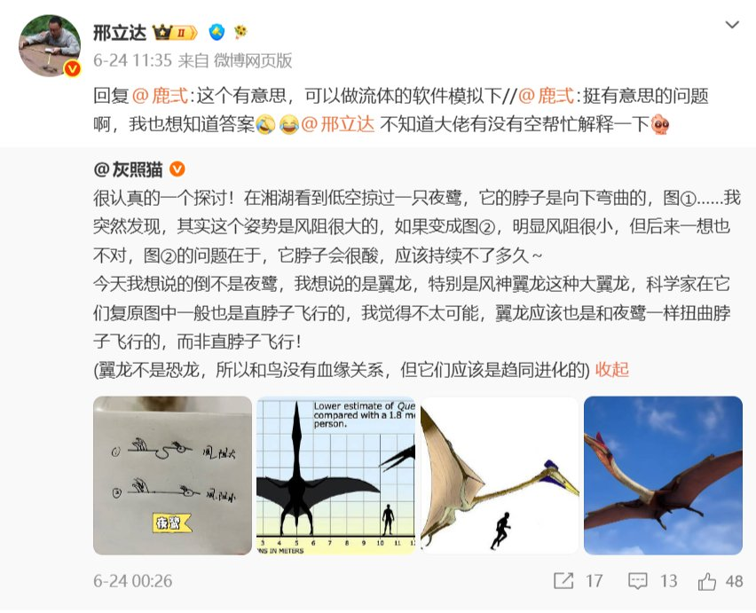

---

## 20

@姬永锋

发表于：2026-06-29 08:02

来源：微博

链接：https://m.weibo.cn/status/5315057941746281

中日铝电容头部企业集体提价

 

进入下半年，铝电解电容行业迎来新一轮涨价潮。日本第三大铝电容厂商红宝石（Rubycon）已发布涨价通知，调价自8月1日起执行，且不排除后续再度提价。无独有偶，国内铝电容龙头江海电子也宣布上调产品售价。中日头部厂商接连涨价，也为中国台湾地区厂商向下游传导成本压力创造了条件。

 

随着红宝石加入涨价行列，日本三大铝电容企业——日本贵弥功（Nippon Chemicon）、尼吉康（Nichicon）、红宝石已悉数启动提价。

 

相较于片式多层陶瓷电容器、片式电阻，铝电容在终端设备中的使用量更少，因此以往涨价周期里，其调价幅度普遍偏低。而本轮在人工智能基础设施建设热潮下，日本头部厂商同步涨价，在产业链中实属罕见。一方面，这三家日企为人工智能服务器供应大量铝电容；另一方面，引脚、铝壳等上游原材料成本大幅上涨，也成为此轮日企涨价的主要推手。

 

红宝石在涨价通知中表示，尽管中东局势逐步缓和，但国际原油价格依旧高位运行，大幅影响石油衍生品的价格与供应。受此影响，公司各类供应商纷纷上调价格，覆盖原材料、辅料及物流等多个环节。

 

企业同时提到，以铝、铜、锡为代表的金属原料价格自去年起持续走高，当前涨势进一步加剧，核心原料价格更是创下历史高位。公司已难以独自消化不断飙升的成本，为保障供货稳定、维持正常经营，不得不上调产品售价，并表示将根据后续国际形势变化，保留再次调价的可能。

 

此次红宝石调价范围涵盖铝电解电容、固态铝电容及薄膜电容，新价格将于2026年8月1日正式生效。

 

同样在6月下旬，国内龙头江海电子也向客户发出涨价函。江海电子称，铝箔、化工原料、碳粉及用电成本持续大幅上涨，涨势未见缓解。当前成本已远超原有定价体系，产品调价势在必行。本次调价品类包括铝电容、薄膜电容与超级电容器。

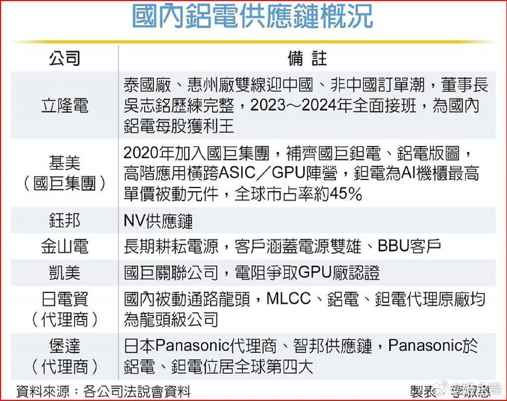

