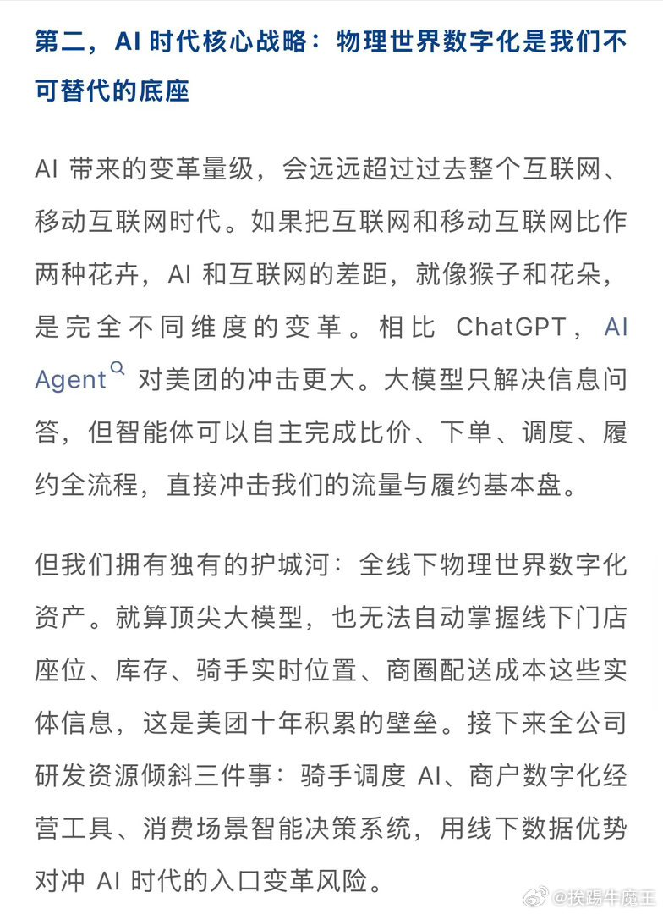
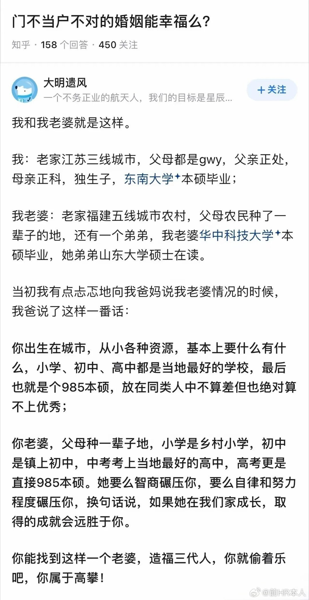
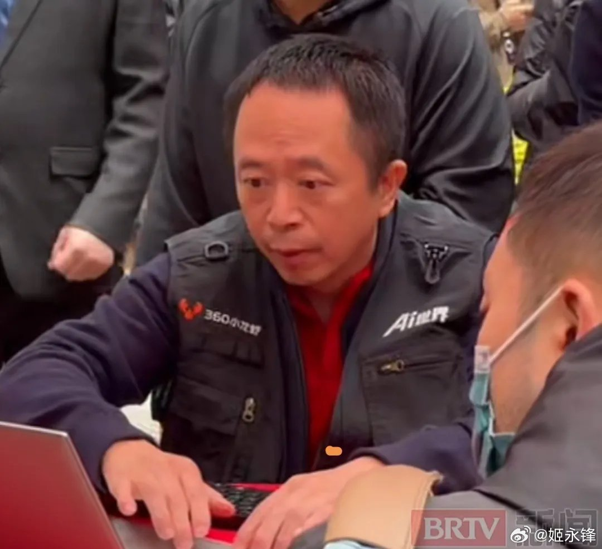
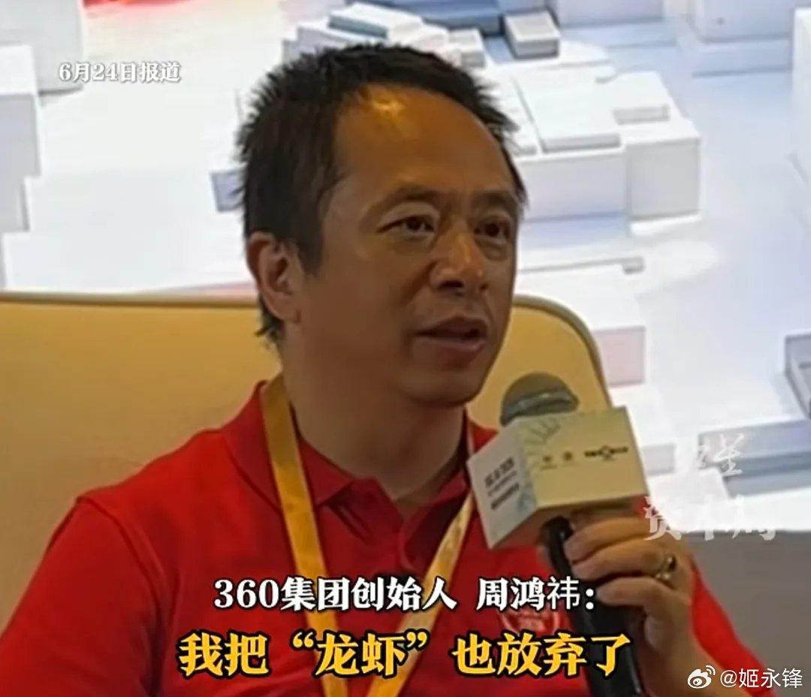
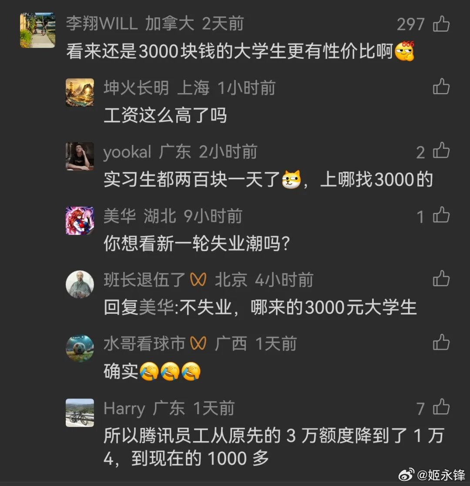
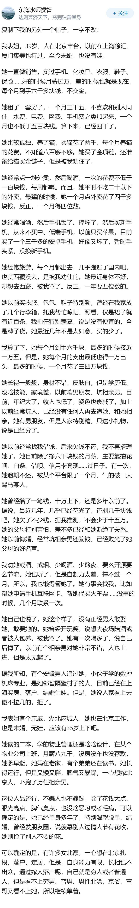

# 2026-06-30

## 1

@36氪

发表于：2026-06-29 03:03

来源：微博

链接：https://m.weibo.cn/status/5315100769780973

【\#腾讯回应做独立支付APP\#，目前仍处于测试阶段】

据TechWeb6月29日消息，近日，一款名为“TenPayGo”的全新支付应用悄然现身苹果应用商店，引发外界关于腾讯是否将推出独立支付工具的猜测。该支付应用为英文版，开发者为腾讯科技（深圳）有限公司，目前已上架苹果应用商店，但注册及使用功能尚未对外开放。

对此，腾讯方面回应称，TenPayGo是公司正在内测的一款面向境外来华人员的“生活便利助手”，旨在提供涵盖移动支付在内的一站式数字生活服务。目前该应用仍处于小范围测试阶段，未全面开放体验。\#腾讯独立支付App正在内测\#

根据公开信息，相较微信，TenPayGo大幅简化使用门槛，只用邮箱注册，绑定Visa/Mastercard国际信用卡、Apple Pay就能直接付款，不用内地手机号、内地银行卡。国外用户绑定银行卡后，可生成付款二维码供商户扫码，或主动扫描商户二维码完成支付，同时支持查看交易明细。其支付能力依托于微信支付的现有体系。

---

## 2

@李楠或kkk

发表于：2026-06-28 05:32

来源：微博

链接：https://m.weibo.cn/status/5314775656694004

Open AI ，Claude 这两家美国最领先的 AI 公司，本来应该借着 Agent 这波直接上天。。。

结果大概一年之后你再看？

他们反而危险了。。。

1

Agent 带来了 token 消耗的爆炸，而且是 1 年 10x 这种水平的爆炸。

24 年 10 万亿 token 每年，到 25 年中，就 100 万亿token年了。

（arxiv 2601.10088）

2

而几乎与此同时，开源模型从 1% 的 token 消耗占比，暴涨到 30% 。。。

10 万亿的 1% vs 100 万亿的 30% 是什么概念？

300 倍的增长。

3

也正因为如此， Open AI 营收的增长，远远没有追上这种爆炸。

（从 24 年 100 多亿美金到 25 年 300 多亿美金。）

主要还是 b 端用户在付钱，但是都是程序员。

所以，他们同时也在拼命搭建开源私有模型这事情，会是意外吗？

4

与此同时，加速算力基建，英伟达狠狠的收过路费。。。

26 年 sk 海力士这些存储厂商也开心的加入这个阵营。

5

而与此同时，资本市场还有人捅刀子。

上市红利，被 elon musk 利用 spacex 并购二流的 xAI ，狠狠收了一波。。。

6

而其实，正常而言，这种局面根本不会发生。。。

因为虽然显卡业务中国不是必须做，但是，你要说这玩意是未来社会基础设施的基建芯片？

那中国能把 asml 买空。。。

英伟达三星sk海力士会边吐血边吃伟哥的和中国企业进行价格战。

C 端收费也不是事，腾讯能把 agent 给你搞进游戏收通行证你信不信。。。

7

所以最终美国的技术领先+金融收割的模式要想闭环？

供应链就必须卷起来，

2C 收割也必须做起来。。。

而这是中国最擅长的节奏。。。

但是，美国国会那帮连 tmd 新加坡和中国都分不清楚的老爷们，在多年前搞起来了半导体和 ai 封锁。。。

他们不但为中国的下一个产业升级指明了方向，

而且也为 Open AI 这种美国最珍贵，最具创新能力的企业，挖好了一个跨越 10 年的天坑。。。

8

所以这事情真正的问题是。。。

美国到底是怎么培养出一整代道貌岸然，牌坊林立，但是缺乏对现实的产业和经济世界最最最最基本理解还敢瞎 tm 折腾的领导层的？？？

快乐教育。。。

真的可怕如斯？

9

当然我绝逼不相信美国的那帮蠢货政客有能力布局这个跨越 10 年的，坑自己的人的局。

无奈。。。

聪明人绞尽脑汁，

也抵不过蠢货灵机一动。。。

---

## 3

@挨踢牛魔王

发表于：2026-06-28 11:21

来源：微博

链接：https://m.weibo.cn/status/5314863706415445

美团王兴的讲话，要all in ai

---

## 4

@前HR本人

发表于：2026-06-28 13:03

来源：微博

链接：https://m.weibo.cn/status/5314889141980507

一个家庭有个睿智的父亲，真的很重要啊，可以一下子看穿本质。

---

## 5

@理记

发表于：2026-06-29 02:11

来源：微博

链接：https://m.weibo.cn/status/5315087554317416

陈露你也一直在看我微博，我给你个对你未来人生金子一般闪闪发光的建议。

首先你也看到了，昨晚你闹腾那下，评论又是100%大翻车，惨不忍睹的翻车。

我不知道未来你想做什么，但我可以告诉你我的预判，当你频繁以这样的形象上新闻，未来真的没出路，带货根本带不了，真的。

霍尊那边早就脱敏了，你对他造成的顶多是烦恼，但这个代价是你给自己持续造成了巨大的，难以挽回的伤害。

我建议你主动联系霍尊，我说这话，肯定有人马上说“不行，那边觉得你怕了，不能进圈套”。

那都是害你。

是理记一个人劝你们和解吗？你的前律师张起淮没劝你和解？帽子叔叔没劝你和解？女检察官没劝你和解？你爸妈没劝你和解？

就连你联合的那个网红妖怪的律师，其实也在找台阶想跟霍尊和解，他们不是意识不到风险，图个啥自己心里没数么？只是还是想用威胁的方式，这实在是太落后了。

霍尊早就脱敏了，而且有司部门对你们主动出来闹是很反感的。你真的有必要骗自己“霍尊背后有资本”吗？

他有个毛的资本，你难道不清楚？他背后要有资本，五年前能被打的那么惨？他背后要有资本，轮的着知名美女丽萍帮忙？

现在结束事情的唯一方法，就是你们双方和解。你这样下去，是伤兵一个自损八千。

你难道幻想靠着网络赢学专家来过一辈子？

建议你主动联系霍尊，因为这次是你主动跳出来的，霍尊并没有把你怎么样。

你不用担心什么“我主动是不是显示我怂了”，至少就我的了解没那回事，抛弃情感因素，用专业的态度，用对未来人生负责的态度，结束这件事。

你也看到了，理记为了你们重新回归平静生活，已经是冒着枪林弹雨，霍尊粉丝那边我都得罪光了。

现在你身处的舆论态势有多么糟糕，你自己心里非常清楚，以至于我说这么两句已经频繁有人认为我收你钱了。

最近这四年丽萍没谈过一句你的事，理记也没谈过。

希望你抓住短暂的时间窗口，别再毁掉自己所剩无几的青春。

---

## 6

@高飞

发表于：2026-06-29 02:08

来源：微博

链接：https://m.weibo.cn/status/5315086831848573

扎克伯格：五年后所有眼镜都应该是智能，让一个"大AI"统治世界是糟糕的 

扎克伯格有日子没有长时间露面了。几周前，有一个他和妻子普莉希拉·陈关于医学的访谈，但是我看了一下，和半年前谈的基本一致。

不过，6月23日，Complex频道的Idea Generation播客在纽约做了一期现场录制的这期还是有含金量的。当天也是Meta与全球最大眼镜集团EssilorLuxottica合作的新产品线Meta Glasses的正式发售日，起售价299美元，提供26种款式组合。

他还讲一个大AI统治世界是糟糕的，这一个大AI是暗指谁呢？一年前可能是OpenAI，现在可能是Anthropic吧。

一些要点：

扎克伯格在自家MMA训练馆装了摄像头，让AI智能体实时观看他格斗训练，在回合间隙自动发送反馈。他说这本质上是一个编程问题：AI需要处理视频流、识别回合间歇时机、再生成教练式建议。

Meta Superintelligence Labs成立日期是2025年6月30日，距离这次访谈录制不到一年。扎克伯格说，如果一年前有人告诉他模型进展能到今天这个程度，他会觉得满意，但因为一路看着好消息进来已经习惯了，现在反而觉得应该做得更好。

他在夏威夷牧场养牛，为了追求最高品质牛肉，专门种澳洲坚果树给牛增脂。坚果含油量高需要先烘烤，为了让牛多吃东西又给它们供应啤酒，因为酒精能刺激食欲。牛可以在冰啤酒和常温水之间自由选择。

一、为什么是眼镜：Meta的硬件判断

1、计算设备的进化方向是"更自然、更融入生活"

扎克伯格把眼镜定位为手机之后的下一个计算平台，逻辑起点是一条趋势线：计算设备一直在变得更自然、与日常生活的融合度更高。手机的问题在于，你跟手机交互时其实是在跟一个小矩形交互，它把你从周围的世界里拉走了。眼镜让你能使用技术的同时保持对周围人的在场感。

他给出三个具体理由。第一，眼镜是AI助手的最佳载体：能看到你看到的、听到你听到的、全天跟你对话，未来还能在视野中叠加信息显示。耳机能做到其中一部分（听和说），但视觉部分只有眼镜能解决。第二，眼镜本身就是一个已有巨大用户基数的品类：全球近20亿人已经戴光学眼镜，更多人戴太阳镜。第三个理由最直白：五年后，还有什么理由让人戴的眼镜不具备这些功能？想不出来。

Meta的眼镜产品经过多代迭代，每一代都叠加新功能。目前已经可以打电话、听音乐，对听力不好的用户还能放大耳朵接收到的声音。这些功能让眼镜的用途远不止AI助手，也拓宽了潜在用户群体。

他用功能机到智能机的类比来描述这个转变窗口：当年所有人都有翻盖手机，智能手机出来后大约五年，翻盖机就全变成了智能机。他认为眼镜现在处于同样的节点。

2、"好眼镜优先"是设计第一原则

Meta内部的设计准则是"great glasses first"，技术是第二位的，时尚和佩戴舒适度才是第一位的。扎克伯格说这个认知对一家科技公司来说并不天然：大多数科技公司的思路是把尽可能多的技术塞进去，然后觉得"这个外形看起来也像眼镜啊，为什么人们不愿意戴？"

实际情况是，你会戴眼镜很多个小时，使用技术功能可能只占其中很小一部分。如果眼镜本身不是你愿意骄傲地戴着出门的东西，佩戴时长上不去，技术功能也就无从发挥。同样的逻辑也要求技术保持克制：用户不想被不停地推送提醒和打断，要尽量少地主动打扰。

3、全视野AR眼镜的原型已做了10年，目标重量50克

Meta已经展示过全宽视野显示的原型机。扎克伯格说那副原型机花了大约10年开发，目前比理想重量要重。他给出的目标参数是约50克才能实现全天舒适佩戴，起步阶段可能先做到60至70克。

不同用户会想要不同东西：有人要极简轻薄的眼镜，有人想要全沉浸式的全息显示。他举了一个场景：坐在咖啡馆里，面前有三个巨大的虚拟显示器；或者在飞机上，眼前有一块物理上不存在的超大电视。功能越多，眼镜越厚、越贵。用户会在时尚、功能和价格三者之间做选择。

4、80%市场份额和新竞争者

根据Counterpoint Research在2026年初的数据，Meta和EssilorLuxottica在AI智能眼镜市场合计占有超过80%的份额。据IDC在2026年6月的追踪报告，2026年第一季度无显示屏智能眼镜出货量同比增长了167%。

扎克伯格对竞争者的态度直接：市场还早，很多公司会进入这个领域，因为Meta和EssilorLuxottica已经证明了这个品类行得通。他说Meta在技术上有相当大的领先优势，但还有大量东西要发明。Google已在2026年5月的I/O大会上发布了基于Android XR的AI眼镜计划，与Samsung、Warby Parker和Gentle Monster合作；Snap在2026年6月推出了售价2195美元的AR眼镜Specs。

二、"个人超级智能"：扎克伯格的AI分权哲学

1、Meta的目标：让每个人拥有自己的超级智能

扎克伯格说Meta在AI方面追求的愿景叫"personal super intelligence"，个人超级智能。他认为这个愿景跟多数AI实验室的共识不一样：大多数做AI的公司认为最终会有一个大AI供所有人使用，或者一个AI为全世界做事。

他的判断是：不管那个大AI有多好，一个中心化的超强AI就是一个坏未来。历史上，任何实体获得绝对权力后，无论它多么"开明"，结果通常都不好。人类在"把开明性内建到一个东西里"这件事上能力有限，无论多努力。

2、制衡机制比对齐更可靠

扎克伯格说，有些人认为确保AI未来安全的方式是建一个中心化AI，然后把它对齐到尽可能好。他不认为这就够了。他的替代方案是把技术发展的方向转向每一个个体：每个人都有一个了解自己生活背景的个人超级智能，能全天候帮你实现目标。尽可能多的人拥有这种能力，世界就有了最好的机会走向好的未来。

这个哲学直接源自Meta做社交媒体的历史。"It's all about building tools, putting them in people's hands, believing that people should have agency to use the tools and express the things that they want to." 把工具交给个人、相信个人有使用工具的自主权，这是Meta从社交媒体时代就坚持的核心信念。

他承认这个立场有争议。批评者会说，如果你把能力强大的模型交给个人，难道不会有人做坏事吗？扎克伯格的回应是：这一直是自由与社会管控之间的历史张力，而历史经验表明，每一次我们选择给人更多自由和自主权时，结果往往更好。

3、所有产品线都服务于这个哲学

从AI软件和模型开发，到眼镜等硬件设备的设计，Meta的整条产品线都指向同一个方向：让人能以不同方式使用AI，让AI的背景知识不来自你跟聊天机器人的对话记录，而来自你的设备在日常生活中感知到的真实场景。这就是为什么眼镜在Meta的战略中如此关键：它是目前最适合提供持续生活背景的设备形态。

三、从Llama 4翻车到MSI Labs：一年重建AI实验室

1、Llama 4没有达到预期轨道

扎克伯格在访谈中直接说："The Llama 4 model was not on the trajectory we needed to be." Llama 4不在他们需要的轨道上。

2025年4月5日发布的Llama 4系列包含Scout和Maverick两个模型，Meta当时宣称是"最先进的多模态开放模型"。但社区反响冰冷，独立基准测试表现平庸，开发者论坛上批评声此起彼伏。这次失败直接催化了Meta AI部门的全面重组。

2、143亿美元收购Scale AI股份、挖来Alexandr Wang

2025年6月12日，Meta宣布以143亿美元收购Scale AI 49%的股份（无投票权），Scale AI的估值因此达到290亿以上。Scale AI创始人兼CEO Alexandr Wang随即加入Meta，出任首席AI官。Wang当时28岁，MIT辍学生，曾把Scale AI从一家数据标注创业公司做到130亿美元估值。

扎克伯格在访谈中没有详述这笔交易的具体数字，但提到了对Scale AI的投资和Wang的加入。访谈中他透露的一个时间点是：MSI Labs的正式启动日期是2025年6月30日。

3、MSI Labs不到一年产出Muse Spark

Meta Superintelligence Labs成立后，2025年8月内部重组为四个团队：Wang领导的TBD Lab负责核心模型研发，FAIR负责基础研究，曾任GitHub CEO的Nat Friedman领导产品与应用研究，以及专注AI基础设施的MSL Infra。

2026年4月，MSI Labs发布了第一个模型Muse Spark。与Llama系列不同，Muse Spark是闭源的，专为Meta自有产品设计。它在多模态推理上表现突出，在Artificial Analysis Intelligence Index上得分52，逼近Claude Opus 4.6的53分和GPT-5.4的57分。Llama 4 Maverick在同一指数上只有18分。

2026年6月23日发售的Meta Glasses是第一款从第一天就搭载Muse Spark的AI眼镜。

4、硬件节奏慢、AI迭代快，两者互补

扎克伯格解释了一个有利的动态：硬件开发周期长（这一代眼镜规划了大约两年），但AI可以在硬件发售后持续升级。买了这副眼镜的用户，会因为AI变得更强而感受到产品在持续变好。目前的重大进展包括多模态理解，也就是AI能看到你周围的环境并跟你讨论，还有实时语言翻译功能已接近完全可用。他最兴奋的方向是agentic AI。

Agentic AI的含义是从"一问一答"转向更主动的模式：你给AI一个任务，它自己去思考然后稍后回来；或者进入一种"实时陪伴"模式，比如你跟三岁女儿一起烘焙，AI在旁边看着，不用你问它就会主动提醒"别把面粉放那儿"。目前这种always-on模式能持续约半小时，未来会扩展到一小时、两小时，最终是全天。

四、AI安全与就业：两个被误判的问题

访谈当天（2026年6月23日），Anthropic的Mythos模型正是舆论焦点。美国政府在6月12日要求Anthropic暂停Mythos 5和Fable 5的所有用户访问权限，原因是国家安全担忧。Anthropic于6月9日发布了去除网络安全能力的Fable 5通用版，但随后被要求全面暂停。到访谈录制当天，CNBC报道称Anthropic的Mythos模型在与美国情报机构的测试中，数小时内就识别出了高度机密政府系统中的漏洞。

1、网络安全：开源反而更安全

主持人提到了Anthropic Mythos事件，问扎克伯格如何看待前沿模型的监管。扎克伯格没有评论Anthropic个案，但阐述了一个反直觉的立场：开源软件通常比闭源软件更安全。

他的逻辑链条是：更多人能看到代码，就有更多人找到漏洞；漏洞被找到后修复，补丁可以广泛部署，最终得到的是更坚固的软件。这个逻辑也适用于AI模型。他的远期期望是AI能帮助人们编写"可验证安全"的代码，从根本上消除大部分网络安全隐患。

2、生物科技进展："本世纪内治愈所有疾病"可能太保守了

扎克伯格和Priscilla Chan创建了CZ Biohub，目标是帮助科学家在本世纪内治愈和预防所有疾病。他说设定这个目标时觉得雄心勃勃，现在看来可能太保守了。他没有给出精确时间预测，但说可能是"一二十年"而不是等到世纪末。

加速的原因是AI模型现在能模拟生物过程，帮助药物设计和基础生物学理解。CZ Biohub在2026年上半年启动了Virtual Biology Initiative，投入5亿美元建立细胞预测模型，并推出了自研的AI药物发现模型。扎克伯格在该项目发布时说："我们现在认为（治愈所有疾病）可能会比预期快得多。"

但他也指出了硬币的另一面：能创造药物的能力同样可能被用来制造生物武器。他说这仍是一个开放问题，需要认真对待。

3、就业取代不是必然：关键看个人生产力和企业自动化谁跑得快

在就业问题上，扎克伯格给出了一个框架：如果企业自动化的速度快于个人生产力提升的速度，岗位确实会减少。但他不认为这是必然结果。如果重点放在让个人的生产力更快提升，理论上未来的工作岗位应该更多而不是更少。

这就是为什么"分权"路线重要：如果只有少数公司专注于自动化所有知识工作，那确实不是好未来。但如果另一些公司专注于个人超级智能，让个人在每一步都变得更有生产力，两者之间形成平衡，结果可能相当好。

五、创造驱动力：扎克伯格为什么不退休

1、压力来源不是高风险决策，而是人际协作不顺

扎克伯格说，基于自己深信的理念做高风险决策从来不让他焦虑。真正让他有压力的是与人合作的过程中缺乏默契。他说做事的乐趣核心就是和人一起做，如果那个"一起做"的过程不顺畅，那才是真正消耗他的东西。

"I almost have to do what I believe and it will hurt me more to not do that thing than it will be to stress or perseverate on whether I can afford to do it." 不去做自己相信的事情带来的痛苦，大于承担风险带来的压力。

2、招人标准：在平行宇宙里我愿意给这个人打工

他的招人原则是：只有在一个平行宇宙里自己愿意给对方打工的人，才会招进核心团队。这不意味着他想让位，只是说他认为团队里每个人都应该是他能从中学到东西的人。

早期建公司时他犯过一个错误：19岁创业，以为应该招那些有丰富职业经验的人，结果总是磨合不好。一个投资人给了他一个看似古怪的建议：你应该招你想成为朋友的人。听起来不像正经的管理建议，但你会跟这些人相处大量时间，互相喜欢真的很重要。

3、失败不是失败，是"通往能行的东西"的学习路径

对于尝试和失败的比例，扎克伯格用了一个类比：在棒球里，打击率三成就能进全明星赛，但创造的逻辑跟棒球不一样。棒球最多打出一个全垒打，创造的上行空间接近无限。如果你做出了一个几亿人使用的产品，它能弥补很多没成功的尝试。

他说不成功的项目也不完全是失败，更多是学习过程的一部分。尤其在硬件领域，试错成本高，很多时候是在一个不太成功的产品里发现一个有前景的元素，把它提取出来嫁接到下一个项目里。

他还说了一句关于创新的判断：如果你做的事情没有人觉得有点疯狂，你可能就没有足够用力地挥棒。真正新的东西在一段时间内必然被视为荒谬，因为如果大家都觉得合理，别人早就做了。

4、"我永远不会停下来"

被问到为什么不退休去夏威夷享受生活，他说他能休息大约两天，之后就需要创造和输出。他的一个女儿也有同样的特质，Priscilla直到有了孩子才真正理解他这个驱动模式不是阶段性的，而是他的基本构造。

牧场上的牛肉实验是一个低风险的创造出口。他说他对牛的基因研究投入认真：种澳洲坚果树让坚果成为高密度饲料来源，因为坚果含油高需要先烘烤所以设计了整套加工流程，又发现酒精能刺激牛的食欲（高端和牛就是喂啤酒的），于是开始自酿啤酒，让牛在冰啤和常温水之间自由选择。

他说自己永远不会停下来。不管做的事重要与否、有没有商业价值，他只是需要一直做东西。

---

## 7

@挨踢牛魔王

发表于：2026-06-26 01:31

来源：微博

链接：https://m.weibo.cn/status/5313990389403306

\#DeepSeek大规模招聘\#

Minimax的闫俊杰爆了一个料，2年前，ta问梁文锋，会不会做AI编程？

梁文锋说，程序员只有100-200万人，市场太小了，不做。

这个判断在2年前，是没有多大问题的。

但是在今天，就明显有问题了。

没错，程序员群体并不是很大。

但是有了AI编程，很多普通人也可以通过编程来解决问题。

目前已经证明，完全不懂编程的人，也可以通过AI编程完成很多作品，诊断问题。

这还不是最重要的，最重要的是，编程是通用的计算机操作的底座。

龙虾类智能体的出现，已经证实了这一点。

你可以用AI写文案，操作ppt，excel办公，驱动剪辑软件，设计图片等等。

编程成为了一个非常基础的能力。

这样一来，使用的人群就扩大许多了，几乎扩展到所有IT领域了。

这就是为什么deepseek大量招聘的原因。

DeepSeek此次招聘涵盖7个大类的33个（类）岗位，工作地点为北京和杭州，几乎把编程和agent领域扩大了一倍。

---

## 8

@李楠或kkk

发表于：2026-06-29 05:16

来源：微博

链接：https://m.weibo.cn/status/5315134203366638

明明 SpaceX 是个太空探索概念的 IPO ，主打的是怎么造火箭发动机，怎么二次回收降低成本，怎么提升发射效率。

然后 elon musk 莫名其妙的弄了个太空加速算力中心的概念，把一个二流 AI 公司 xAI 给打包了。。。

然后 SpaceX 突然就从一个造火箭的，变成了一个 AI 公司。。。结果公开市场上苦苦等待 Open AI 的钱，被这个敲不锈钢的给吸走了。。。

而且 elon musk 还意犹未尽，因为 Agent 也火了啊。。。1 年 10 倍的 token 消耗增长不是小事情啊，那些看上 Claude code 和 codex 价值的钱也不能放过。。。

于是，又并购了已经半死不活的 Cursor 。。。再次吸一波。。。

然后， Open AI 的奥特曼含泪表示，Open AI 的上市推迟。

elon musk 应该是非常非常恨奥特曼。。。

---

## 9

@姬永锋

发表于：2026-06-29 01:00

来源：微博

链接：https://m.weibo.cn/status/5315069799045872

周鸿祎：我把“龙虾”放弃了

摘自 hacking Hacking黑白红

还记得3个月前万人空巷装“龙虾”OpenClaw的场景吗，当时360周鸿祎都亲自装“龙虾”，短短3个多月反转来了。

3月14日，周鸿祎亲自“装龙虾”

前天，14届互联网大会上，360创始人周鸿祎在采访中透露，团队打磨半年的“龙虾”智能体，最终被新项目放弃。压垮项目的是两大核心痛点：

安全风险居高不下，无意义的Token消耗更是高得离谱。

在常规AI工作流里，一次问答仅消耗几千Token。

可“龙虾”上线后，资源消耗暴涨数十倍甚至上百倍。仅仅制作一份PPT，就要烧掉上亿Token，折算成模型成本高达上千元。就连查询天气这类简单任务，都要耗费上千万Token，算力成本完全失控。

成本失控，商用落地踩下急刹车

周鸿祎直言，这种消耗完全没有商业合理性。智能体自主思考、反复试错的运行模式，会产生大量冗余调用。高昂的Token账单，让产品很难面向普通用户规模化落地。

除此之外，安全隐患同样棘手。智能体自主决策带来大量不可控行为，团队要投入海量人力做风控校验，持续拉高研发成本。一边是天价算力账单，一边是无休止的安全治理，项目只能被迫叫停。

网友评论

“看来还是3000块钱的大学生更有性价比啊”

“化了1000元，干了10元钱的活！”

AI不能只追求智能，更要精打细算

当下很多智能体产品一味追求自主能力，却忽略成本管控。周鸿祎这次踩坑也给行业敲响警钟：脱离成本谈AI能力，终究只是实验室产物。比起无限拔高智能程度，找到算力消耗与实用性的平衡点，才是AI走向商业化的关键。

---

## 10

@卢克文

发表于：2026-06-28 23:32

来源：微博

链接：https://m.weibo.cn/status/5315047567917273

这不是北京的案例，这是北上广深杭成武重苏南的共同案例，全中国大城市都一样的，滚滚红尘，各有各的必经之路。

