# 2026-07-01

## 1

@蚁工厂

发表于：2026-06-30 11:27

来源：微博

链接：https://m.weibo.cn/status/5315589952505156

能力越大，责任越大之自己管内存~

前情提要是老马的AI正在将训练和推理栈都用 C/C++ 编写并大幅简化（图2）

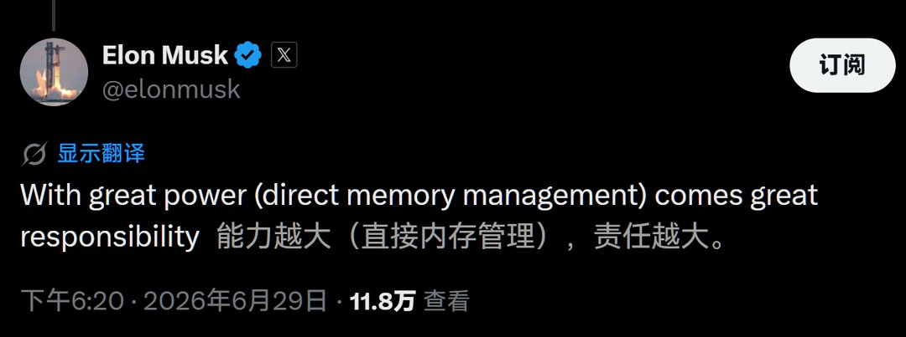

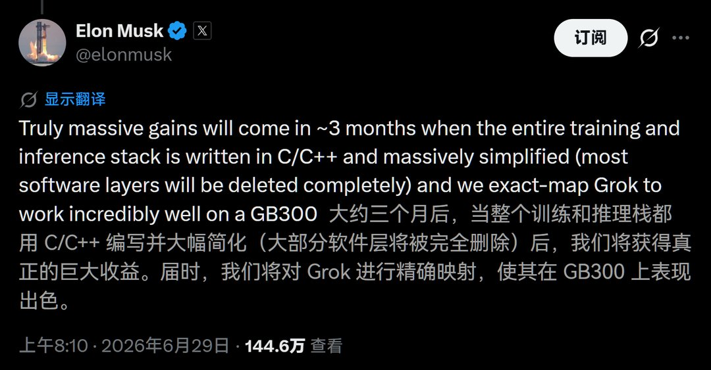

---

## 2

@理记

发表于：2026-06-30 11:28

来源：微博

链接：https://m.weibo.cn/status/5315590223828075

韩红走个面儿这件事吧，不挨骂肯定不合理，但要直接给骂废了，肯定也不合理。

从这件事可以清晰的看出，现在网民情绪是非常暴烈的，其实韩红这些年在网上很低调了，基本没有声音，线下的主要就是基金会的事，路人缘不至于那么差，也没那么多仇家。

就一句“走个面儿”，没想到被激发起的民众情绪这么强烈，简直要掀翻。多少也叠加了点冯导，其实冯导这几年也没干啥别的，真是说翻车就翻车。

还是那句话，这两年肯定是精英倒台的时期，建议都苟着点吧。

---

## 3

@观察者网

发表于：2026-06-30 09:54

来源：微博

链接：https://m.weibo.cn/status/5315566426391585

\#韩红最新致歉声明\#  ：随口一句“走个面”，确实过于轻率随意，辜负大众对我的包容与信任，深感自责！

以下为全文：

针对我近期在影片首映相关活动中的不当言辞，我在此向广大公众郑重、诚恳地致以深深的歉意。

这段时间，我反复回看现场发言视频，逐条认真研读大家提出的批评意见与理性建议。此番发言，随口一句“走个面”，确实过于轻率随意，思虑不周、措辞失当，产生了负面观感，辜负了长期以来社会大众对我的包容与信任。对此我深感自责！

多年来，我始终格外珍惜全社会给予我的认可与善意，韩红基金会一路走来，离不开每一位爱心人士的理解、支持与托付。公众这份沉甸甸的善意与信任，是我从事公益事业最珍视的底线，也是我一直恪守、不敢怠慢的初心。

今后，我会常怀谦卑自省之心，谨言慎行、踏实做事。

最后，再次向大家表达最诚挚的歉意。

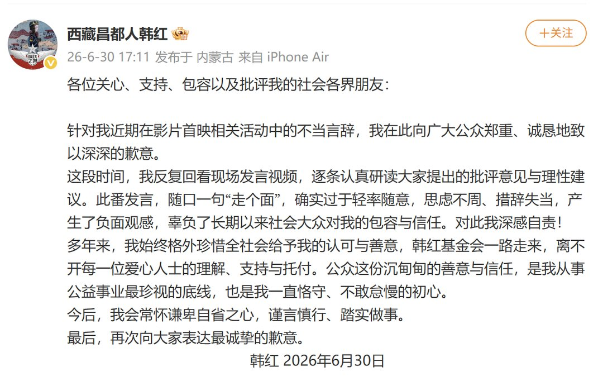

---

## 4

@风苇倾谈

发表于：2026-06-25 01:12

来源：微博

链接：https://m.weibo.cn/status/5313623195123944

除了微博，我也在几个主流平台混过一段时间。后来陆续退场：豆瓣因为小组动不动就被炸，能正常使用的日子没有封组的日子多；知乎在下沉之后，渐渐变成“分享你刚编的故事”，加上控评手法熟练到让我怀疑平台与一些艺人、机构之间有紧密合作；小红书的问题，则在于账号受控频繁，一切围绕消费市场运转，稍微不那么250的讨论都很难稳定留存。

如果说三个平台分别训练出不同的人格肌肉，那么豆瓣对应的是失望感，不一定是索赔；知乎对应的是解释欲和优越感；小红书则更擅长制造持续的比较，把资源差异翻译成道德差异，进而塑造一种索赔型人格。

豆瓣的黄金时代，最强的是一种“理解”的能力。文艺青年、小众爱好者、边缘身份群体、各种冷门兴趣圈子，都在那儿一次次练习：理解自己为什么和主流不一样。它当然也有怨气、身份认同和小圈层优越感，但叙事底层其实是：世界不一定理解我，所以我要找到同类。它更容易培养的是疏离感、边缘感和小共同体认同，而不是世界欠我。因此豆瓣用户看起来常常很丧，但未必天然指向索赔。

知乎全盛时训练的是另一种人格：我要证明我懂。它的问题在“解释”。所有事情都要分析，都要拆解，都要讲道理。即便后来越来越娱乐化，它的底层逻辑仍然是：知识带来解释权。于是知乎容易孕育出精英主义、理性优越感和强烈的教导欲，但不那么容易培养出永恒受害者人格，因为知乎文化的默认前提是：你应该通过知识解决问题，而不是通过控诉解决问题。

小红书则完全不同。它最核心的机制不是知识，也不是兴趣，而是“生活”——更准确地说，是别人过得怎么样。人最容易产生怨恨的场景，往往不是绝对贫穷，而是相对比较。如果你所在的村子里人人都穷，大家未必天天痛苦；但如果你每天刷到的是别人被求婚、收礼物、父母给首付、辞职旅行、有松弛感、不用上班、年薪百万、被坚定选择，你就很难不问一句：为什么我没有？这正是小红书内容机制最强的地方：它持续展示别人拥有的东西，然后让你反复咀嚼我为什么没有。

在这种机制下，资源差异会慢慢被道德化。别人有房，说明别人优秀；别人有托底，说明别人幸福。而我没有，那一定是有人亏欠了我。羡慕本身很正常，但日积月累，明确的结果是“比较之后的道德化”。知乎会让你想：我应该学什么；豆瓣会让你想：我属于哪里；小红书则不断把人推向另一个问题：我为什么没有？以及随之而来的追问：谁该为我的“没有”负责？

于是，许多本来属于增长结构和分配结构的问题，开始被翻译成关系问题。买不起房，变成父母不够爱我；离不开家，变成原生家庭有毒；找不到工作，变成自己认知不够；男朋友收入低，变成不够重视我；农村出身，变成一种必须尽快摆脱的身份。在这里，资源差异已经不再是一个客观的分配问题，而是被转写成一套道德评价体系。

还有一点，我必须多次点出。小红书的用户中，一二线城市女性比重非常高，大概率她们并不是客观上的中国穷人。而被她们先进洒脱的生活方式吸引的却很多是中国穷人。这其中大部分高可见度帖子经过多重加工折射，对日常生活不具备参考性，所以不要被这些人忽悠瘸了。

小红书正在把“承认局限”塑造成一种羞耻，这种倾向正在飞速发展，我看很快就要飞出地球。我生活过很多被视为发达地区的地方，非常能理解有时候局限带来羞耻感。但我不理解“局限是种羞耻”是怎么成为宇宙事实的？这个世界上哪怕最有钱有势的人也生活在局限之中，只有心理平衡感恩惜福的人可能不生活在局限之中，因为他们需要的没那么多。欲望可能是无穷无尽的，而生活，总是具体的。困难是具体的，能力是具体的。

农业农村社会里，有一套非常古老的伦理直觉：资源有限，所以必须协商，必须忍耐，必须相互依赖。这套伦理当然有很多问题，它可能压抑个体、合理化牺牲，但它有一个基本前提：承认局限。相反，小红书不断扩散的是另一套话语：你不该有局限，你值得更好，你不应该妥协，你应该拥有更多，你应该被完全满足。它们作为愿望和倡议本身并不错，问题在于：梦里啥都有，现实生活不那么回事。

当资源约束从叙事中消失，局限本身就会被标记为失败：贫穷是一种失败，普通是一种失败，不能退出是一种失败。在这样的语境下，原本源自结构和制度的限制，被重新包装成个人、父母、伴侣、出身的道德问题。也正是在这里，平台内容与农村、农业、普通人的生活经验之间，开始出现一种根本性的错位。

但你要说不理解局限吧，这些人对自己的局限理解的不得了，要是不这么正义化合理化自己的局限，怎么能对别人的要求那么高，怎么能完全看不见别人的局限呢？

配图：一定要carry 全场吗？sorry全场不行吗？

---

## 5

@蚁工厂

发表于：2026-06-30 04:25

来源：微博

链接：https://m.weibo.cn/status/5315483666744294

OpenAI Codex 负责人 Andrew Ambrosino 刚参加了 Lenny Rachitsky的播客节目，畅谈了一个小时。

下面10点是Lenny Rachitsky总结的最大收获：

1. 产品工作方式已经颠倒。过去的产品流程建立在“开发成本高”的假设之上，所以要通过规格说明、研究和原型来提前降低所有风险。这个假设已经不复存在了。现在的难点从“我们该不该做这个？”变成了“在所有针对这个想法的原型尝试中，哪个想法最好，哪些应该融合在一起，我们要全力投入哪个？”

2. 你的角色现在由你花时间做的事情的平均值来定义。设计师写代码，工程师做设计，产品经理负责发布。那么你是什么？你不再由头衔定义，而是由你如何分配时间决定。如果你把一周内做的所有事情取平均值，大多数点落在哪里？那就是你的角色。

3. Codex 的产品经理采用“区域联防”策略来掌握全局。当想法从四面八方涌来时，自上而下的年度规划行不通，所以他们让团队分散开来覆盖整个公司。如果两个产品人员合作过于紧密，没有留下任何空隙，那是个不好的信号。他们将产品经理分散到整个组织以实现全面覆盖，并用有产品思维的工程师填补空白。

4. 为什么人工智能在设计方面如此糟糕？有两个原因：一个实际原因，一个结构原因。从实际角度看，设计比代码更难评分，实验室优先考虑编码，因为它能加速人工智能研究。从结构角度看，好的设计需要新颖性和文化——一个每次都输出 Linear 网站界面的模型并不体现品味——而且存在一个模型尚无法跨越的视觉到代码的抽象层。实际原因可能会得到解决；但围绕新颖性、文化和抽象的一些更深层次的挑战可能会持续存在。

5. 最初的 Codex 网页版发布“在当时来说过于通用人工智能化了”。第一个公开的 Codex 版本建立在一个过于雄心勃勃的前提上：给模型一个任务，它就能完成任务并返回结果。问题在于当时的模型还不够好，无法可靠地兑现这个承诺。Claude Code 在本地启动，提出问题，并与用户并肩工作——这更符合模型实际能力所处的阶段。安德鲁一直在思考这个问题：我们是在为模型当前的能力而构建，还是为我们希望它们达到的能力而构建？

6. 安德鲁确信，如果 Codex 应用在 2025 年 11 月发布，那么在 2026 年 2 月发布时就会失败。产品是相同的——但模型不同。他学到的教训是：保留那些尚未准备就绪的原型，并在每一代新模型推出时重新审视它们。抵制仅仅因为体验不完美就扼杀某个功能的诱惑。“它可能还没准备好”与“这是个糟糕的功能”截然不同。

7. 品味不仅仅关乎美学——它是在你可以构建任何东西时决定要构建什么。安德鲁引用了一条推文，该推文认为人们过度强调品味的审美层面（例如：保罗·格雷厄姆品味很好，但他穿着工装短裤）。真正的品味将美学与系统思维相结合：知道方向、主题以及如何呈现一个想法。问问自己“如果我们能构建任何东西，这应该是什么？”——他说这现在是每个领域中最需要做出的决定。

8. 设计过程并没有消亡。是的，设计学校教授的正规设计过程已经结束了。剩下的是一种元意识，即你实际上处于产品开发过程的哪个阶段。安德鲁看到的危险是：在任何人进行研究之前，就出现了看起来可以投产的完全打磨好的原型，以及一屋子的人认为它比实际进展更成熟。“这就是现在的设计过程，”他说，“多人协作的探索，看起来却像成品。”

9. “产品需求文档已死”也完全错误。因为实现成本在所有形式中都变得低廉，非工程师很容易直接跳到原型阶段，而工程师则倾向于写长篇文档——但两者都不是正确的工具。安德鲁的规则是：如果你想在一个模糊的领域建立产品清晰度，那很可能需要一份文档；如果你在压力测试一种交互模式，那需要的是一个原型。过去，所使用的媒介会隐含地传递你处于流程中哪个阶段的信号，但现在不会了。

10. 大多数职业生涯都比任何一次失败的时刻要长。安德鲁目前在 OpenAI 的成功，用他自己的话说，是 10 到 15 年的积累：技能、热情和市场时机终于同时到位。

---

## 6

@一起唱歌666

发表于：2026-06-30 04:08

来源：微博

链接：https://m.weibo.cn/status/5315479402976189

前年建筑不行了，去年师范不行了，今年医学估计也不行了。

         医学院一般是12年，本科5年，研究生3年，博士3-5年。毕业时，一般是31-33岁，不秃头就是优秀的人了。其实这十几年绝大多数是可以压缩的，有些课程完全没必要。但是，就不。这会造成几个问题，

          一，经济压力极大。

          读书十几年，成本可能是50万。但是你失去的工资收入可能就是上百万了。一套房没了。

           二，找对象很难。

          读博期间，找老婆不容易，一方面，是没钱，另一方面，你能不能当医医，还不一定。

          三，精神压力比较大。

           高中同学都离婚两次了，好几个当经理当小杭长了，你还是个没收入的学生，天天在城中村啃鸡爪。

           四，找工作压力很大。

           博士已经严重过量了，很多保安都读博读研了。博士找工作是比较难的。    

            五，评职称特别难。

         以前有人拼了命读博，说白了，当医医来钱多啊。以后可以收回成本，有利可图，就是个生意。钱钱，女人，地位，都有可能。

         现在，药代没了，那就歇菜了。医学应该回归正常，不能瞎搞。小病大治，无病开刀，吓唬人。看个感冒五六百，还要把你呼来喝去。。

---

## 7

@蘸盐

发表于：2026-06-30 05:00

来源：微博

链接：https://m.weibo.cn/status/5315492436775417

//@黄佟佟:这正是小红书内容机制最强的地方：它持续展示别人拥有的东西，然后让你反复咀嚼我为什么没有。这种机制下，资源差异会慢慢被道德化。别人有房，说明别人优秀；别人有托底，说明别人幸福。而我没有，那一定是有人亏欠了我。知乎会让你想：我应该学什么；豆瓣会让你想：我属于哪里；小红书则不断把人推向另一个问题：我为什么没有？以及随之而来的追问：谁该为我的“没有”负责？

---

## 8

@刘晓光Savvy

发表于：2026-06-30 04:43

来源：微博

链接：https://m.weibo.cn/status/5315488108252609

韩红的走个面事件，倒是让我对现在这个时代的特点，了解体会更加深刻。

你永远不知道，一个成熟的发达的成功人士，可能会因为什么事而翻车。

韩红说了句走个面儿，

大家疯狂的转发，玩梗。

但是这种玩梗不是坤坤那种无害的玩梗，永久性的热度，

而是成了对韩红社会公信力的质疑和抨击，无数人开始贴基金会的捐款截图，质疑善款去向。

如果处理不好，就有牢狱之灾。

如果处理好，后台硬，自己的社会信誉，口碑，也永久性的彻底坍塌了，彻底从善人变成了小人。

一切就来自走个面儿事件。

我查了下，为电影站台的人，远不止韩红一个人，他们包括且不限于：

雷佳音、胡歌、常佳音、张涵予、黄磊、马未都

没有到现场背书，在线上支持打气的，有虞书欣、黄轩、辛芷蕾、马思纯、王宝强、张若昀、蒋欣、高叶、舒淇、大鹏、刘震云、张一白等人。

这么多人都为电影站台，都没事。

唯独韩红老师深陷舆论风波。

而且大家都说了性质一模一样的话，

都是希望恳求大家多多支持，把票房冲起来。

大家都没事。

唯独韩红出事了。

所以这个舆论大事件和说话的内容，思想，都毫无关系。

只和措辞的语气，姿态有关了。

现在的公众舆论对于「居高临下」的语气，口吻，姿态。

容忍度越来越低。

所谓的「走个面儿」，一般都是高分量的人，居高临下才能讲出来的。

足够高低位的人，才能说这样的话，大家听到这话就感觉天然处于弱势。

用存在主义哲学来说就是，给我个面子或者走个面儿一出来，听话的听众就立刻被强制按在了客体的位置上，主体性被剥夺，自己被人审视和要求甚至强迫。

继而引发了些微的不满和否定。

但是在现实中，一般人不敢对高位者表达这种主体剥夺丧失的反抗和不满。

在网上那就不一样了。

有一点点让人感受到主体性被你剥夺了，立刻就会引发强烈的反弹和攻击甚至谩骂。

基本上就塌房了。

而一个明星或者网红，大V，一旦塌房，社会信誉损伤，基本也就意味着职业寿命的终结。

作为对比可以看成龙，成龙和韩红的行事作风很像，都是去哪都说自己是办个XX地方人，半个山东人，半个河南人等等。

但是大家对成龙就没有攻击谩骂社会信誉的否定攻击，而是玩梗开玩笑。

因为半个XX人是一种平等的交流，大家都是主体，没有把人强制客体化。

成龙从不会因为票房失利而让大家给自己个面子去看电影，所以也就没有引来反感。

还有一个类似的明星：周星驰，这些年的社会风评也一直在持续走低。

因为一个网络流行语：欠星爷一张电影票，他的团队也错误的选择了这个标语来进行营销。

欠XX人钱，就是对方为主体，自己为客体。

从一个大家认同的梗，如今变成了人人喊打，深恶痛绝的滑稽口号，无数人拿这句话骂周星驰和周的电影。

说明在这个时代，每一个网民和观众的主体性，都在持续上升。

这不是说公众人物的发言和营销活动要讨好观众，要迎合观众。

而是说要尊重大家的主体性。

你想要传达一些思想和观点，必不可免的要说教。

但是说教必须充分尊重对方的主体性，以平视的视角讲出你想要表达的思想。

而绝对不能用俯视的视角来表达。

韩红说走个面，就是俯视视角。

别人说希望大家多多支持，多多捧场，感激大家来影院观影。

这就是平视的视角。

其实不仅仅公众事件舆论场所，市场营销是如此。

现实里的万事万物，基本都是如此。

你用俯视的姿态去表达，本质上就是损害对方的主体性，不可能得到什么好的结果。

做领导，做老师，做父母。

一旦试图剥夺对方的主体性，

最后的结果都不会理想。

---

## 9

@高飞

发表于：2026-06-30 02:55

来源：微博

链接：https://m.weibo.cn/status/5315461023533695

\#谷歌算力告急\#

梳理一下这个Tag的来龙去脉。

1、实际上是今年3月的事情，但是被FT统了出来。一句话就是Google告诉Meta：你要的算力，我供不上。当然，影响一直持续到现在。

2、Google在这里的角色不只是云服务商，算力告急，它同时是模型的开发者，因为自家基础设施跟不上需求，所以不得不对最大的客户之一的Meta限量供应。

3、Meta一直在用Gemini做大规模内容审核和客户支持，这两个领域Gemini的表现持续优于Meta自家的Llama。Meta向直接竞争对手买AI服务，原因只有一个：自己的模型在生产级任务上不够好。所以，这两个场景，对Meta来说，肯定是有Token经济性的。

所以，大家不要说Google的模型不在前沿，为什么I/O上只发讲效率的Flash，就这还不够用。

4、回到今年3月，Google对Meta施加了Gemini算力配额上限。当然，是限量，不是Block。其他Google Cloud客户也受到波及，但Meta的用量远高于同行，所以受冲击最大。

5、那是不是Google矫情呢。并不是。Google Cloud一季度营收200亿美元（+63%），但积压订单同期翻倍到4620亿美元。API的token消耗量90天内从每分钟100亿跳到160亿，增长60%。需求在按季度复利增长，基础设施要按年甚至按多年周期建设。

Google自身的2026年资本开支指引为1800-1900亿美元，建AI基础设施的花费已经超过Meta单季度营收的三倍。

6、Meta的应对：要求员工节约token用量，裁员8000人，将2026年资本开支指引上调至1250-1450亿美元。花更多的钱、用更少的人。

Meta在新成立的超级智能实验室下推出Muse Spark模型，用于在生产环境中替代Gemini。更长期的布局是与Nebius签下270亿美元的五年算力合同。Nebius是从Yandex拆分出的算力新贵，将基于NVIDIA Vera Rubin平台建设产能，2027年初才开始交付。Meta在预购一批物理上还不存在的算力。

7、所以，市场上常见的批评是AI正在形成泡沫。但泡沫的定义特征是供过于求。眼下的情况恰好相反：产能还没建好就被合同锁定，地球上最有钱的买家被制造商限量供应。如果说这是泡沫，这种有用的泡沫应该历史上还没出现过。

---

## 10

@V闪闪

发表于：2026-06-30 03:05

来源：微博

链接：https://m.weibo.cn/status/5315463657558291

当圈子文化遇到公众舆论

我看不少博主转了图1 这个韩红道歉的图片，说这是韩红的朋友圈发文，称自己泣不成声向公众道歉，即日起退出公益事业。 （之前因为当事人没有公开回应，不清楚是不是真）

结果后续是图2  韩红朋友圈又发文，说被朋友出卖。

是图3 主持人张泽群截图，他的意思似乎本意是替韩红辩解，不过到公共舆论领域，已经彻底成了韩红道歉说明。

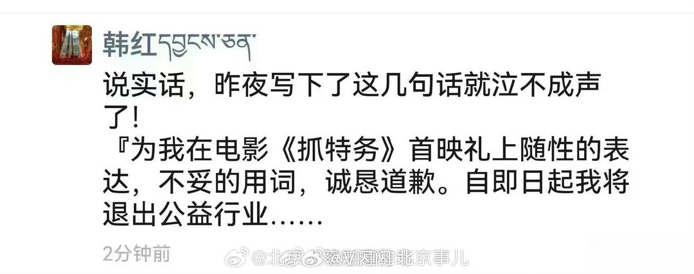

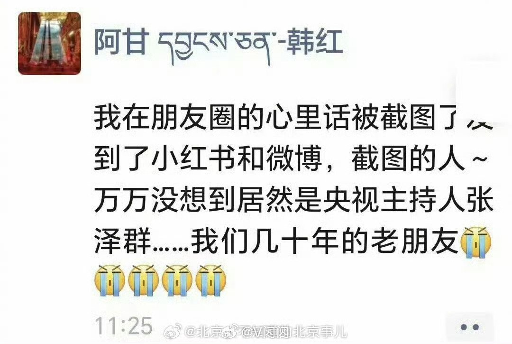

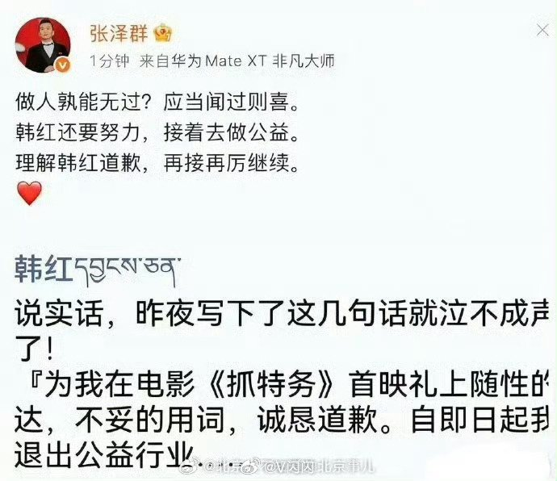

---

## 11

@西门大妈

发表于：2026-06-30 02:01

来源：微博

链接：https://m.weibo.cn/status/5315447534651071

因为各种原因，中国有一批大学，你只看校名大概率会误会这个学校的所在地，所以每年报志愿都闹出不少乌龙~~我印象中的，包括但不限于：

1 西藏民族大学：是不是以为在拉萨？

2 四川外国语大学/四川美术学院：是不是以为在成都？至少在四川对吧？

3 河北大学：你以为在石家庄？

4 浙江师范大学：以为在杭州是吧？

5 江苏大学/江苏师范大学：这俩不仅不在南京，甚至也不在一个地方~

6 中国人民公安大学 / 中国人民警察大学：是不是好多人都以为这是一个学校？其实这俩也不在一个地方

7 中国药科大学：你猜在哪里？

8 中国地质大学：这所大学的校址甚至不止一个城市....

9 同济医学院：真不在上海~~ 

\#只看校名大概率会误会的大学\# \#宝藏大学安利计划\#

---

## 12

@牧星观海天

发表于：2026-06-29 12:32

来源：微博

链接：https://m.weibo.cn/status/5315243798434821

中国海军多个舰艇编队穿航日本及琉球附近海峡——根据日本防卫省发布的消息，中国海军多个舰艇编队几乎同时穿航日本及琉球群岛附近海峡。

其中：

6月27号～28号，055南昌舰、054A盐城舰和903A东平湖舰组成的编队通过大隅海峡进入西太平洋活动；

6月27号和28号，052D贵阳舰和西宁舰分别通过对马海峡从日本海返回东海；

6月28号，052D苏州舰通过横当水道返回东海；

6月29号，795号电子侦察船通过横当水道进入西太平洋活动；

6月26号，054A安阳舰通过宫古海峡进入西太平洋活动。

➤美国及日本在琉球、关岛以及夏威夷开展“坚决龙”、“英勇盾牌”以及“环太平洋”等多个军演，咱也该去帮帮场子。

➤看南昌舰编队的配置，又是要远洋绕了。\#热点观点\#\#烽火问鼎计划\#

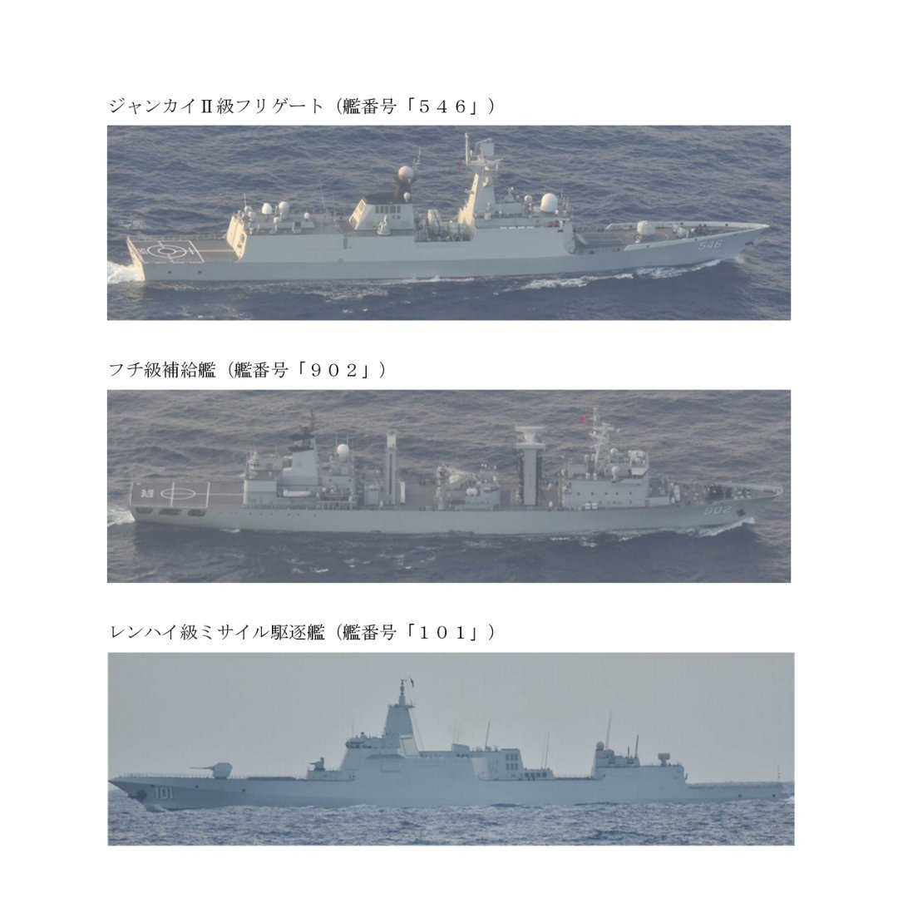

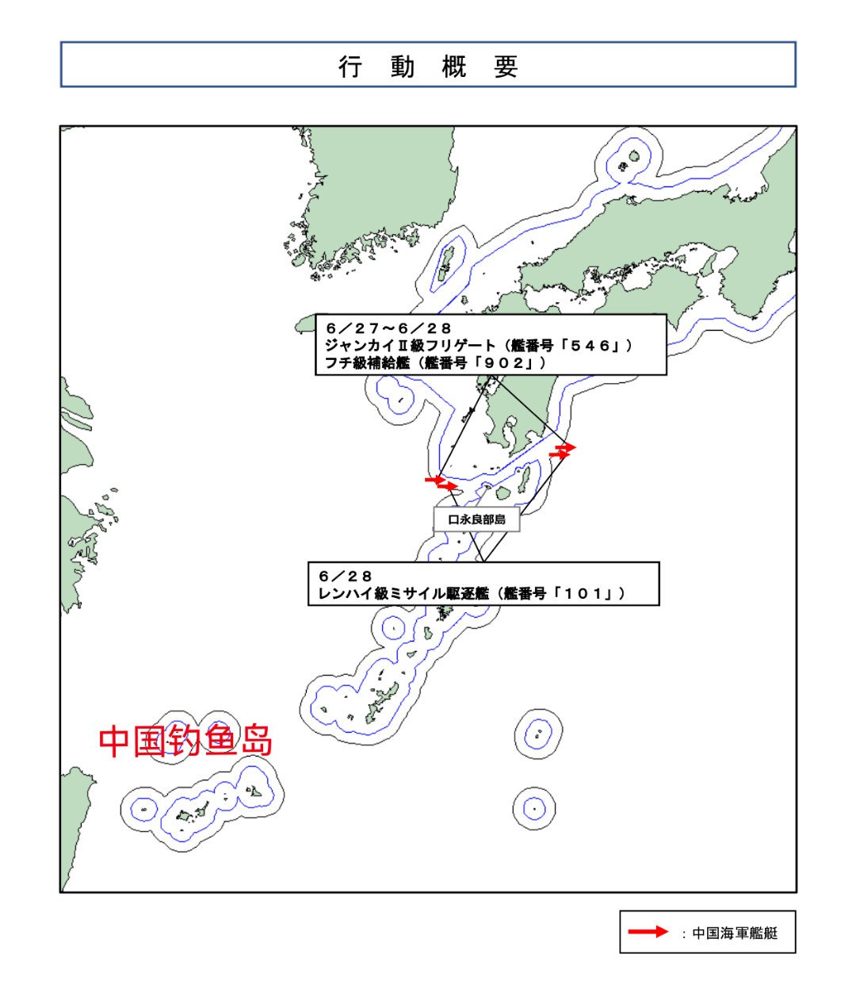

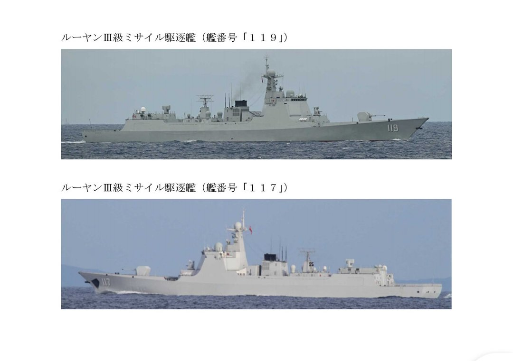

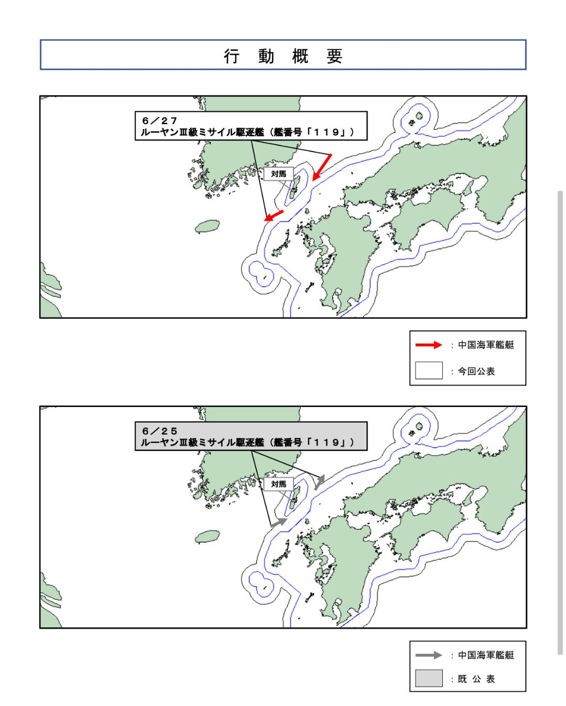

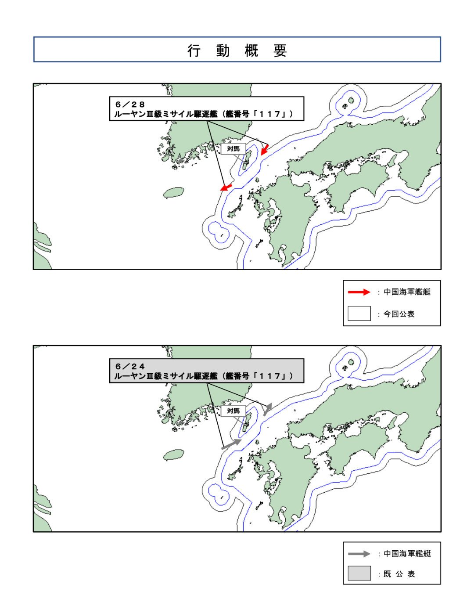

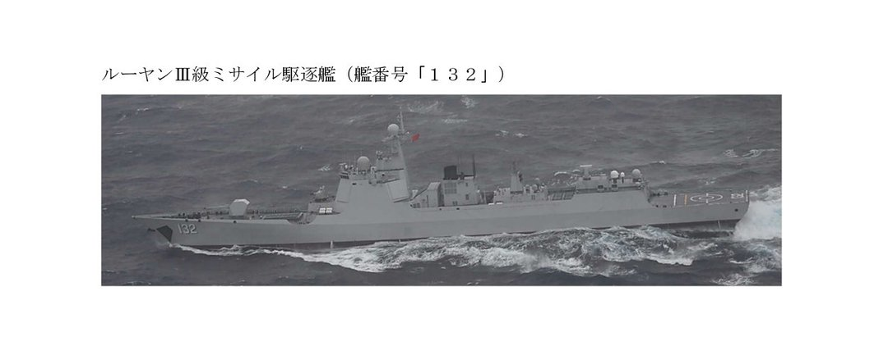

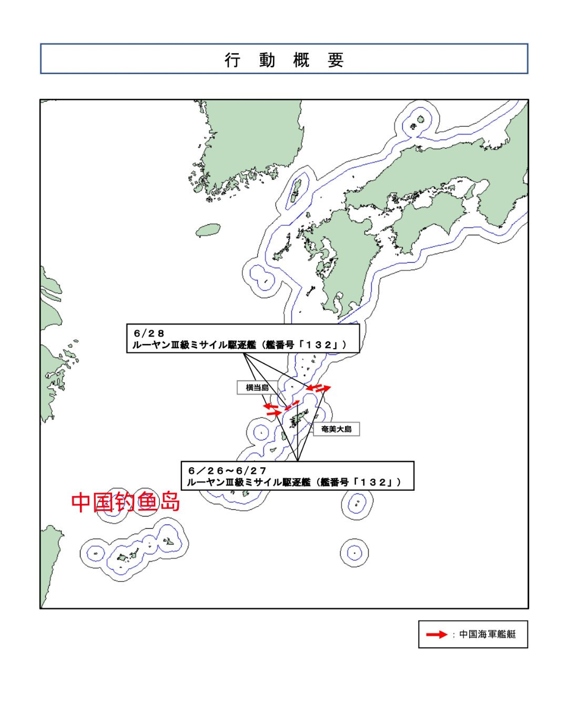

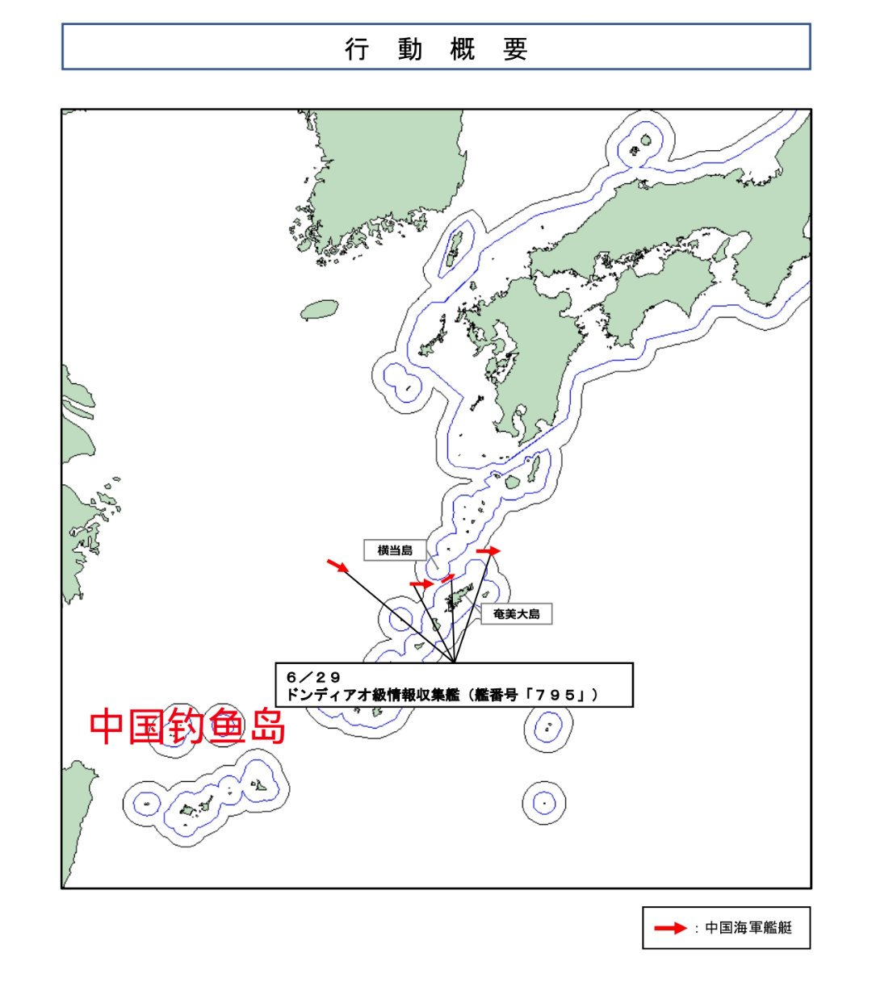

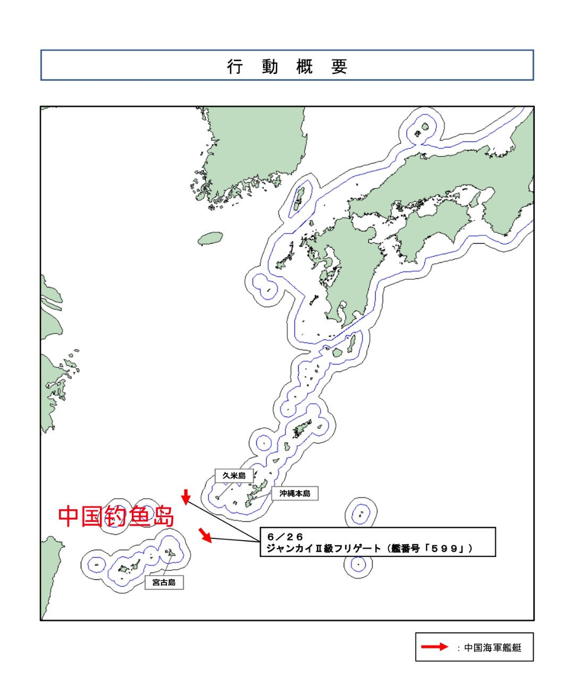

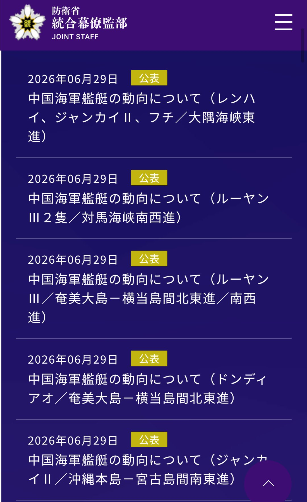

---

## 13

@唐杰THU

发表于：2026-06-29 05:32

来源：微博

链接：https://m.weibo.cn/status/5315138062387822

分享一点最近的“再学习”：ai时代——认知 > 格局 > 技术 > 管理

很多人认为一个企业的成功靠管理，很对，曾经很对，但ai时代可能变了，一切都变了，天天端到端、天天扁平、天天去中层。没办法，太多事情ai化了，更焦虑的是技术不能落后，于是工程师一下子扬眉吐气，技术大于了管理。管理还很有用，但不懂技术、甚至不深入技术，你都不知道该怎么管——管啥呢？

ai时代几乎每个技术的进步，预训练的infra（loss balancing、indexpool、kernel fuse）、Agentic RL、self-judge、OPD、fully self training、尤其是ai学习的范式变革都让人极其兴奋。往往一出来就在x上刷屏，一晚上传遍全世界。这种密度和烈度是以前任何一个时代都没有的：你不是每隔几年等一篇里程碑论文，而是每隔几天就要追一波新东西。也正因如此，技术落后从来不是"慢慢掉队"，而是一夜之间的事——这也是为什么在ai局里，技术的权重被抬到了前所未有的高度。

格局大小一直是一个人天花板的标尺。不是说格局大就一定能成大事，但格局小肯定成不了大事。ai时代很多时候靠想象力、靠布局，要抓住主要矛盾，大胆布局。没格局，盘子小了，自然落后；至于"先收缩一下、活下去，等别人做出来再抄"，这套在ai时代不存在——等到那时候，你早就不在牌桌上了。

但ai的认知才是最重要的。ai的发展核心是技术，这和20年前创业的商业模式局不同，也和10年前创业的产品局不同。商业模式局是发现社会一个新需求，砸钱把模式包圆，不让别人进来，纯资本起了最大作用，那时候的创业者大部分是资本大腕或管理高手；产品局是设计一个粘住用户的心理/生理模式，游戏也行、视频也行、聊天也行，总之粘住就好、dau大就好，产品经理和揣摩人性最重要，这个时代的创业成功者大部分是产品经理。而今的ai局又很不一样：openai和anthropic这两年的反复拉锯、轮流领先，一再说明ai时代的本质就是技术的快速进步——当你停下来打磨产品，可能第二天就发现底层技术已经落后、产品已经没人用；当你停下来思考商业模式，ai世界已经再次被颠覆。

ai的终局就是agi，是一场猎龙游戏。这条路上，所有打猎兔子的动作都不本质——除非你实在太饿，否则就该专注本质、专注主线。但光喊口号远远不够。agi是个愿景，可它在哪里、怎么定义、怎么做到，从来就没有标准答案：既不是传统学术范畴里"先慢慢定义清楚、再设计算法、做实验、验证、做原型、再产品化"那一套，肯定行不通；也不能简单靠以前那种"秒了他"——靠少数几个人熬夜就拼出来。实现agi需要：对agi的极度热衷与笃定（极强的第一性思维）、对技术的深厚积累与细节把控、一群不内耗/不墨迹、简单纯粹的人。这个时代的ai人不那么看重所谓的"经历"，更在意的是不内耗、不墨迹、够纯粹；但年轻并不等于纯粹，有些表面的年轻反而掩盖了"纯粹"这件事的本质重要性。

ai的技术判断是另一个挑战。ai可能颠覆了很多人的认知：很多人喜欢ml、喜欢cs，是因为那里有看起来优雅的理论和数学推导；而agi要更原生、更native，ai的数学推导其实已经超越大多数cs研究生、也超越大多数cs程序员了。原来cs们还以为自己高高在上，以为自己是ai的造物主、其他领域都要完蛋；其实真正被全面颠覆的，可能正是我们自己的知识体系。这也是为什么cs的资历突然不管用了——所有cs被拉平、被ai扁平化管理，唯有成为ai时代具有超前认知的ic，才能在ai时代活下去：快速迭代知识、快速提高认知（5年后的ai你能预见吗？不能。2年呢？1年呢？）。

---

## 14

@karminski-牙医

发表于：2026-06-29 21:54

来源：微博

链接：https://m.weibo.cn/status/5315385396035613

DeepSeek真的是性价比和技术双重斩杀线...

有同学看不懂DSpark是啥, 简单给大家写个小教程讲讲. 

推测性解码(投机解码)这个技术是用来提升大模型输出速度的. 本质是让小模型给大模型接话, 大模型判断小模型说的对不对. 因为现在模型普遍卡内存带宽, 而GPU算力是富余的, 所以大模型的prefill速度(看字)比decode速度(吐字)快很多. 那么让小模型沿着大模型的思路先说一段话, 大模型判断对不对(只需要看字), 只要小模型猜对了, 那么这就利用了prefill速度, 吐字就会成倍的提升.

但问题来了, 外挂小模型也要看字(prefill), 也要占用显存, 也要吃显存带宽. 那么有没有更好的方法来解决呢? 来了, 这就是DSpark.

看我的这个图(左侧DSv4架构图是rasbt大佬的), DSpark 接在了 Final RMSNorm 过程中. 不是接一个完整的小模型, 而是一个3 层的MTP(多Token预测)微型Transformer堆叠.

大模型算完前面60多层后, 刚把当前这句话的"高浓缩概念"(特征向量/隐藏状态)推到 Final RMSNorm 这个出口，还没来得及翻译成具体文字时，DSpark开始截胡:

首先是半自回归极速脑补 (MTP + Markov Head), DSpark自己有一丢丢参数, 然后它就瞬间并行猜5个字(特征向量), 然后再用自己内部的一个串行网络理顺逻辑. (注意啊,先并行然后串行消除并行导致的逻辑不连贯).

然后, 它会有一个置信度预测头, 预判自己猜的准不准, 比如5个字的后2不准就直接砍掉, 防止后续送回大模型浪费算力.

最后把留下的3个字塞回词表映射层, 把向量翻译为token. 到此为止DSpark工作就做完了.

然后就是大模型扫一遍DSpark输出的对不对(只用prefill，不decode), 一旦正确了, 就直接吐字, 这样之前模型一次只能吐一个字, 现在就能吐3个字了!

最后, 推测性解码是不会降智的, 速度能提升60%-85%! 之前是雇一个小模型帮忙写草稿, 现在则是直接脑子里植入芯片了. 

目前SGLang已经有这个特性的PR了(29538), 而且DeepSeek刚在自己的HuggingFace主页发了一大堆小模型的DSpark魔改版. 大胆猜一波未来发布的模型会不会标配DSpark?

\#HOW I AI\#\#dspark\#\#deepseek\#\#投机解码\#\#推测性解码\#

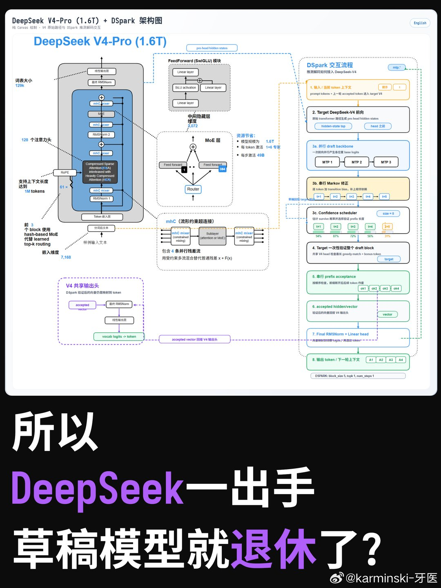

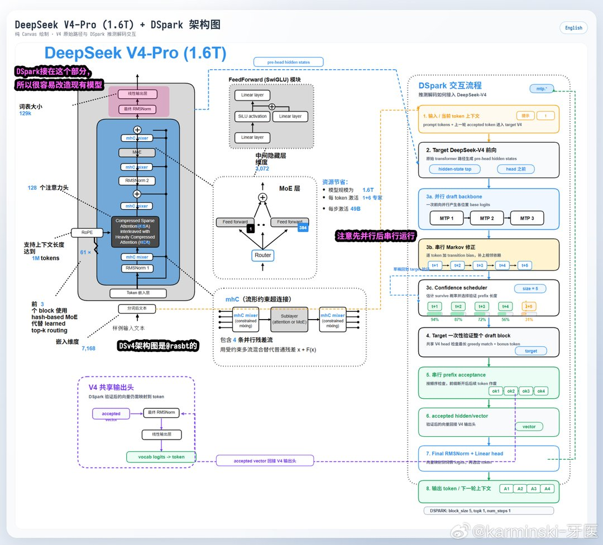

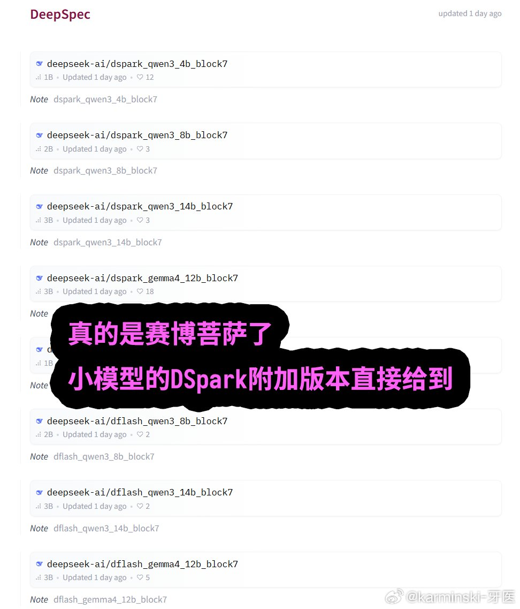

---

## 15

@信号与噪声

发表于：2026-06-29 14:27

来源：微博

链接：https://m.weibo.cn/status/5315272852641637

纳斯达克 100 市盈率维持在 24 倍

标普 500 等权重指数为 16 倍

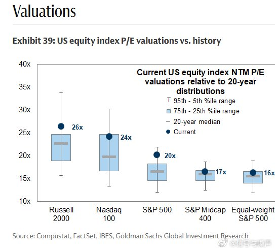

---

## 16

@郝倩在欧洲

发表于：2026-06-29 14:30

来源：微博

链接：https://m.weibo.cn/status/5315273621246292

540公里，这是日内瓦和法国巴黎的距离。飞行距离1小时。

然而为了这段距离，我花了整10个小时……

火车晚点，飞机晚点，停在停机坪上继续晚点。

等待，等待，说是今天飞巴黎航班太多，所以机场太忙，继续等待。

到了巴黎，开到了一个爆远的停机坪，半天不能下飞机。飞机里等待，等待。

下了飞机等shuttle，终于终于到了航站楼。

等待，等待，等了半个小时的行李。

行李终于来了，出租车司机已经走了……甚至都没给我打一个电话。。。

直接转去坐火车，火车站全是人，没有空调，三十多度的蒸笼，态度友好的服务员小姐姐拿着个扇子，一刻不停的扇啊扇…

我就像是进入了一个黑洞般的死循环。当下的每一次出差，都会让你有着刻骨铭心的触动。每一次更换交通工具，都难免有一个意想不到的惊吓。

你的预期，预期不了一点。

整个社会就像是拼凑出的，摇摇欲坠。

累了…

（昨晚，家里镇上一栋小古堡莫名其妙烧起来了，大夏天的又加了一把火）

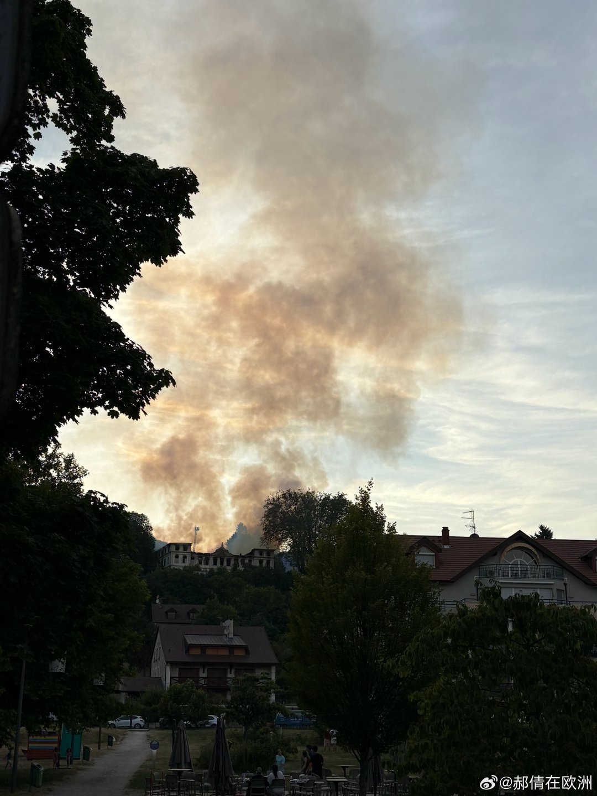

---

## 17

@安好心

发表于：2026-06-28 22:37

来源：微博

链接：https://m.weibo.cn/status/5315033749783929

挖到宝了

---

## 18

@信号与噪声

发表于：2026-06-29 14:49

来源：微博

链接：https://m.weibo.cn/status/5315278340625318

\#美国\# 前10%的收入份额是二战以来最高的

接近1930s大萧条前夕了

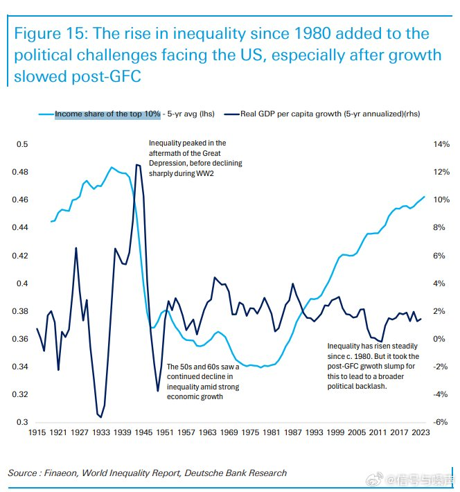

---

## 19

@李子暘Lee

发表于：2026-06-29 14:50

来源：微博

链接：https://m.weibo.cn/status/5315278600931323

众多亚非拉国家，只有中国有这三十年，只有中国成功了。这其中没有因果关系么？//@来特先生: 建国前三十年做的那些事到底对不对？八九十年代的人认为方向出了问题，做了无用功，要不然早就过上好日子了。现在日子好了，人们又说没有前三十年就不会有现在的生活水平，方向是对的。到底由什么标准判断呢？

---

## 20

@汪海林

发表于：2026-06-29 06:37

来源：微博

链接：https://m.weibo.cn/status/5315154627791758

全是国有电视台的时代，电视剧市场是充分竞争的。全是国营电影厂的时代，比如八十年代，电影市场也是高度竞争的。新自由主义指导思想下，影视产业的充分私有化，并没有带来市场化，反而某种程度上消灭了竞争。比如现在剧的市场，没有什么竞争，因为平台是垄断的。电影方面，票务平台是垄断的。中国影视行业现在最大的问题是消灭了竞争消灭了市场性，被少部分人垄断资源后分蛋糕，越分蛋糕越小。任何行业吃独食肯定长久不了。

---

## 21

@严锋

发表于：2026-06-29 15:19

来源：微博

链接：https://m.weibo.cn/status/5315285953282140

《抓特务》为啥票房惨败，有各种说法。说得最多的是韩红一句走个面儿冒犯了大家，以及单纯讨厌冯小刚，还有认为是以抓特务为名，暗戳戳搞伤痕文学，等等。

我认为最主要的原因不是这些，而是新一代观众真的不爱看这样的故事、这样的人物、这样的风格了。就像也不爱看金庸了。时过境迁，不想、也不能与之共情，仅此而已。

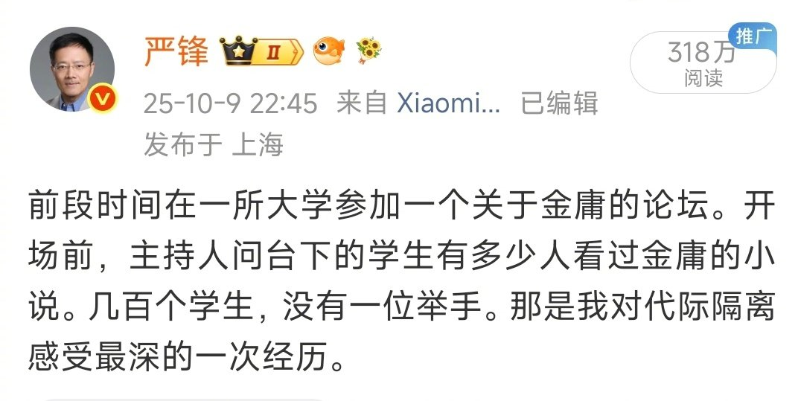

---

## 22

@塔列郎

发表于：2026-06-29 16:26

来源：微博

链接：https://m.weibo.cn/status/5315302768508980

在海军大院的日子，长时间住在灰楼400号楼，左邻右舍，乡里乡亲，真的远亲不如近邻。

我家住在7号门2层南侧。当时大多数单元混住，每家两间卧房，共用厨房、洗手间和厕所。最早合住的是衣叔叔一家，夫妻加两个女儿。衣叔是北方人，为人和善，厨艺高超，他烤的圆肉饼，面香浓郁，肉香诱人，小火慢煎，饼的边缘烤好，便一字排开。小时“胃缺肉”，见不得、闻不得美食。衣叔叔体贴下情，总会挑火候和品相均好的送给我们。我们从小知道，做人不仅要有能力，而且还要心灵美。

衣叔迁走后，搬进来杨叔叔一家。杨叔高大英俊，脸上长了麻子，喜欢结交朋友。开始我们两家相处得不错，后来部队分房，杨叔叔一家的行为开始有点怪异，无端地挑起矛盾。他儿子变得不可理喻，竟然将我家高压锅阀盖投到厕所里(推测)，还把整篮鸡蛋打了一地儿（亲见）。邻里关系一经损伤，很难修复。最后，杨叔一家终于如愿以偿，搬到新房。

对面单元住着李叔叔和张叔叔两家人，当时他们都是部队的少壮派。李叔是山东人，两个女儿。张叔是河南许昌人，两个儿子。李叔在后勤部，手握大权--分配大礼堂电影票。当时，除了样榜戏，文化娱乐活动较少，但部队仍然有渠道和资源，小范围搞点特殊化。我们会想方设法，采取涂改和变造电影票，混入大礼堂。知道李叔的权利后，希望实现由非法手段变成合法方式，但李叔公私分明，我们很难得手。李叔小女儿海萍失足从阳台摔下殒命，而我哥唐山地震出事，共同的命运，把我们两家紧密联系在一起，两家关系变得越来越好。

从小我就知道，同情心是友谊催化剂，患难与共，才能筑牢友谊。我家与四楼李建伯伯家的关系也逐渐升温。李伯伯是抗战时期老干部，腿上有伤，旧伤复发，痛苦异常。但他总是乐天安命，待人谦和。过节聚会时，李伯伯家总会贡献出精细食品，让我眼谗，特想加入大人们的正餐。

七号门级别最高的是贺家，一家占了一个单元。他家70年代就有黑白电视，那种电视，盒子大、屏幕小、两根天线要不停调整位置，开关机时，屏幕都有白点。小孩子不懂事，经常不请自来蹭电视看。他家老太，为人严肃，但对孩子很好，来者不拒。贺家最爱吃臭豆腐，喜欢炸着吃。他们的美食日，是全楼的受难日，简直臭气熏天，令人发呕，但想着看电视，也不好意思做手脚。

同门居住的，同学就有3家。段军虽然长得不敢恭维，但是唯一男生，跟我要好。喜荣、顾群是女流之辈，得躲得远远的，要不班上同学说闲话。顾群冰雪聪明，成绩特好，只可惜，家里四个丫头，家里生活压力大，早早考了护校、挣钱养家。

迁出灰楼前，来了新邻居，一对南方来的年轻夫妇，真叫他们郎才女貌，特别是阿姨，身材气质特好，长得宛若天仙。不过很快知道，阿姨的神经不正常，犯起病来，赤身裸体，四处狂奔。他们不算最不幸的。6号门的马家兄弟，当海军翻译的哥哥，坐直升机从东海舰队回北京时，螺旋桨掉了，连机带人沉入茫茫大海。

不知道，我的邻居们现在怎么样？愿老天保佑活着的人！愿逝去的在天国安息！

---

## 23

@阿尼亚是安妮亞

发表于：2026-06-29 05:25

来源：微博

链接：https://m.weibo.cn/status/5315136501845371

昨天看到一个蛮有趣的视频。

在视频中，桌面上放着一个红色的有绳固定电话，作者拿起话筒后说话，等到放下话筒后文字就发送给了豆包。我查了一下，这款固定电话的型号是 FUQIAO富桥HCD28(3)P/TSD 不过型号可能不是关键。

一般来说，我看到这种演示，就有比较大的把握能想到一系列的实现方案。不过看了视频我确实没想到特别简单的方案。

我们知道，这类固定电话所用的物理接口是 RJ11 接口，需要接入4芯水晶头，线端的外观看起来和网线差不多，但尺寸要小一些。虽然有4芯，但一般只有 Tip 和 Ring 信号在用。

而“电话线”中走的信号是比较难处理的，包含模拟音频信号，包含直流馈电，包含交流铃流以及用于拨号的 DTMF。其中挂机状态下是直流 48V 到 60V 之间，摘机后会降低到直流 8V 到 15V 左右。而振铃状态下是 25Hz 90V 的高压交流信号。

如果不针对固话做任何改动，那就需要有一个中继器去处理 RJ11 出来的信号。其中包括但不限于馈电电路的设计、摘挂机的检测逻辑、音频分离、振铃信号发生器、DTMF解析等等。后端还需要适时把音频送入 ASR 模块。

从视频上看，我猜测应该不是这样实现的，甚至电话线都没有接。所以要么是魔改了固话内部的电路，要么就是纯粹的摆拍。

我把视频EE群里和大家讨论了一下，大家的观点都差不多。群友建议我掏空电话机魔改会比较方便。

早上再去看了下视频评论区，发现作者“开源”了方案。简单看了下，是魔改，内部加了两路蓝牙。一路用 ESP32-C3 检测摘挂机动作，通过 BLE HID 来发送快捷键。另一路通过 CSR8645 蓝牙模块来连通筒麦克风和喇叭，把固话变成蓝牙耳机接入电脑。而 ASR 应该是豆包网页版自带的。

————

掏空魔改固然方便不少，但做出来的东西仅此一套，大家复刻起来也会比较麻烦。做一个类似 RJ11 in USB/LAN out 的模块虽然难度高很多，但开源后复刻模块甚至小批量也比较方便。

虽然不一定会去做，但也有不少脑洞可以记录一下。

我最想保留的是 DTMF 的识别，因为这样就可以拨号。比方说打给 cc 是10086，打给 Codex 是10010，打给 Hermes 10000。

有了 DTMF 的解析，甚至在模块里面就可以处理操作逻辑。“新建会话请按1，查询已有会话列表请按2，查询余额请按3，排队下一轮请按4，暂停所有任务请按0”

振铃当然也不能浪费，当 Agent 完成任务或是需要人工确认的时候就会“打电话”过来，振铃一段时间后挂机，等两分钟再打过来直到人类拿起话筒，用按键或语音安排下一步指令。

然后把固话放在床头，半夜 Codex 可能就会给你打电话(不是)。“您布置的任务需要执行 xxxx 命令，抠1同意，抠2拒绝，重听请按0” (捣演的点子)

---

## 24

@Jokielicious

发表于：2026-06-27 00:18

来源：微博

链接：https://m.weibo.cn/status/5314334240280930

哇，还有大举报环节

\#海外新鲜事\#\#幽默牢欧\# \#法国极端高温引发空调抢购潮\#

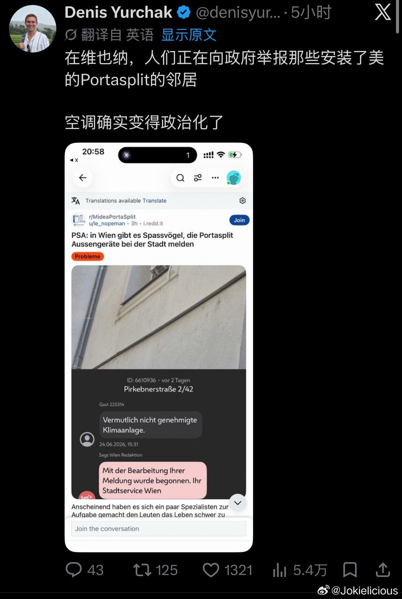

---

## 25

@贫道张胖子

发表于：2026-06-29 08:07

来源：微博

链接：https://m.weibo.cn/status/5315177245573890

这两天问这个视频的朋友很多，我再重申一下我的看法，这就是个垃圾营销号刻意引导宣传错误价值观，不要信。

赵青儿子这个“满级小孩”视频是文青养废孩子的生动案例。他学的“文化”只是听起来唬人，其实对于智力中等的同龄小孩，奇门遁甲、梅花易数、马前课、六爻、八字这些东西加起来都学了也用不着一个月，在家不上学三四年就学些这玩意儿，还美其名曰学易经，这些术数跟真正的易经关系还离得老远。更跟中国传统文化不搭边，违背真正的国学启蒙小学教育，是典型的披着东方主义外衣的西式cult。最关键的是适龄儿童不接受义务教育属于违法行为，公然践踏国家法律和教育政策，炒作这种案例其心可诛，请不要宣传误导广大中国基层家庭教育了。

---

## 26

@沉睡之书11

发表于：2026-06-30 23:17

来源：微博

链接：https://m.weibo.cn/status/5315768648731430

美光宣布对特朗普账户投资2.5亿美元，惠及100万儿童、家庭及未来劳动力。

——我建议以后发新股自动转账10％到账户，市值超过千亿自动转账10％，做成法案，免得一个个收。

\#海外新鲜事\#

---

## 27

@蚁工厂

发表于：2026-07-01 08:01

来源：微博

链接：https://m.weibo.cn/status/5315781197825167

Claude Fable 5 和 Mythos 5 解禁

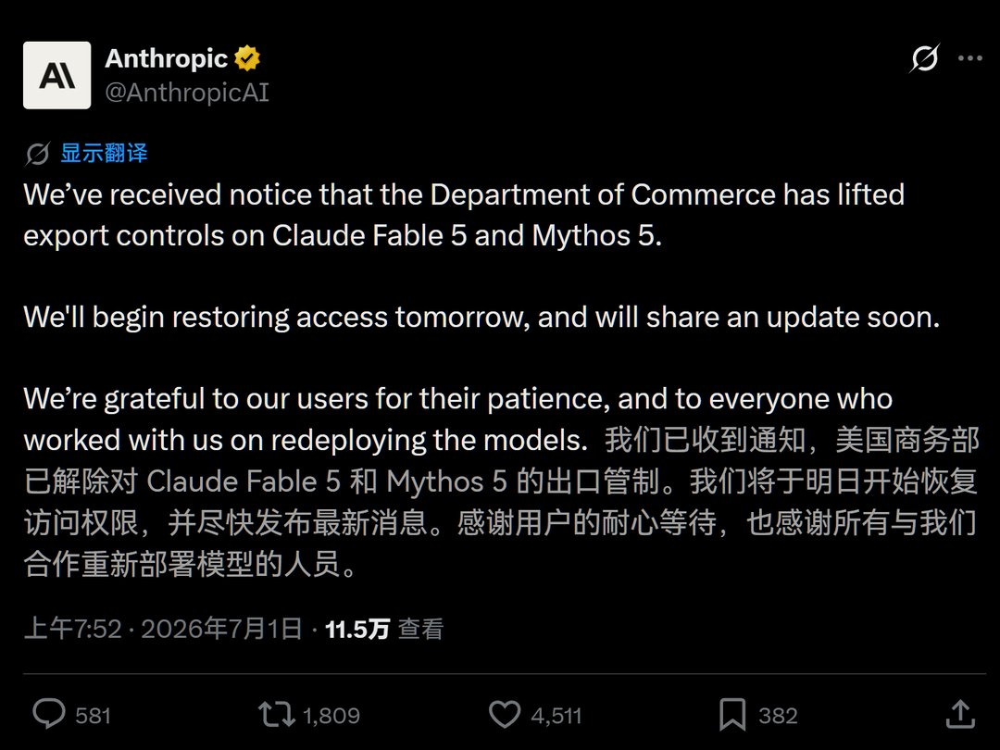

---

## 28

@财联社APP

发表于：2026-07-01 08:01

来源：微博

链接：https://m.weibo.cn/status/5315782042195045

财联社7月1日电，Anthropic称，已收到通知，美国商务部已解除对Claude Fable 5和Mythos 5的出口管制，将于明天开始恢复访问。

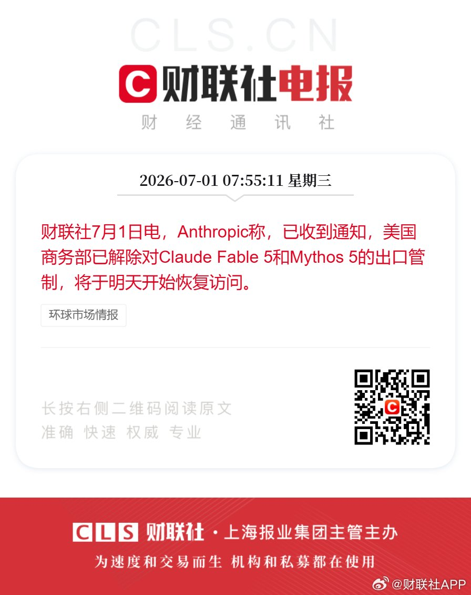

