# 2026-07-02

## 1

@36氪

发表于：2026-07-01 14:00

来源：微博

链接：https://m.weibo.cn/status/5315990650623533

【Kimi的钱，永远不够花】

半年前，Kimi创始人杨植麟说过一段话。他说月之暗面账上现金充足，没有短期上市的紧迫感。

6月30号，据媒体报道：Kimi上一轮融资刚交割完，新一轮已经启动了。上一轮投后估值200亿美元，新一轮投前315亿美元。

算一下，这是六个月里的第四轮。半年累计融了超过39亿美元。要知道半年前，Kimi投后估值才43亿美元。今天的中国一级市场，已经默认了一件事，Kimi应该继续融资，OpenAI和Anthropic也应该继续融资。

这件事本身，比315亿美元估值更值得聊。

\#氪君领读\#

1、大模型，已经变成重资产生意

Kimi半年融了39亿美元，表面上打破了常规的一级市场节奏。但从财务底层来看，这笔钱要覆盖团队薪酬、数据中心电费、高端GPU采购，撑到下一轮模型研发和商业化落地。

2、断代的链条，很短

在这个行业，技术差距几乎会立刻传导到商业结果。算力不够→模型落后一代→开发者迁移到竞品→终端用户流失→收入断掉→融资通道收窄。链条里任何一个环节出问题，整个企业经营都会失速。

3、3亿美元ARR，才是关键

315亿美元估值是资本市场对未来想象力的定价。3亿美元ARR是已经跑通、可验证的真金白银。

4、给AI的钱，换了一拨人

头部企业估值越高，越容易拿到大额长期资金。核心变化是：出钱的人换了。传统VC占比在缩。产业资本、国有产业基金、全球主权基金成了主力。

5、反互联网的成本曲线

用户越多、API调用量越高，运营成本跟着涨。调用量大了，亏损反而扩大。

详情请阅读：Kimi的钱，永远不够花，本文来自“版面之外”，作者：画画。

---

## 2

@2049年的世界

发表于：2026-07-01 13:36

来源：微博

链接：https://m.weibo.cn/status/5315984673216660

文艺圈有些人对“不神化领袖、英雄人物”的理解是错误的。

无论是领袖还是英雄，他都是一个社会中的人。因此他的任何决策和行为，都是与他自身意志品质、经验精力，所处的社会大环境所密切相关的。

所谓“不神化”，就是要在文艺作品中，把领袖作出好的决策的前因后果、来龙去脉、面临的是什么客观需求，决策形成的过程，怎么研究的，遇到困难怎么克服的，最终解决了什么问题，放在整个大背景下起到了什么作用，体现了什么样的意志品质，有什么闪光点，用观众能理解的方式把这些表达出来。

举个不算太恰当的例子，就是学霸怎么把这道题一步步做出来的。

“神化”是什么呢？掐指一算，答案就在脑子里biubiubiu蹦出来，人的正确思想从天上掉下来了，唯心了，这才叫“神化”。

但对于文艺圈有些人来说，他对这个问题的理解似乎就有些偏差——我是人，领袖和英雄也是人，而我又知道自己是个废物，那领袖和英雄肯定也和我差不多。我做不到的，他们肯定也做不到。我遇到事就吓傻了，那领袖也是人，他肯定也会吓傻了啊。我会去奋不顾身堵抢眼吗？肯定不可能啊！所以英雄自然也不可能这样做，但我的文学作品中又要写他去牺牲，这简直是难为我胖虎！

所以，他肯定是为了某个女人，对！是爱上了某个女人，所以才去参加革命的！

所以，他肯定是为了哥们义气，为了给兄弟报仇，愤怒了，才去冲到第一线的！

所以……算了，也想不出什么来了，那就一定是为了信仰，至于信仰具体是什么，怎么产生的，那不重要，只要脑门上贴出“信仰”两个字来，动机就有了。

再者，那反面人物他也是人啊，对吧，我也是人，他也是人，那他肯定也坏不到哪里去。所以要“不神化，不矮化”——

正面人物≈我≈反面人物

哎！对，你看看，这不就“人性化”了吗？还反映了人性的普遍性，看咱多有文化！

---

## 3

@以史为鉴V

发表于：2026-07-01 10:48

来源：微博

链接：https://m.weibo.cn/status/5315942515216818

志愿军抗美援朝的时候，军粮大部分都是炒面，当时全国都动员起来给志愿军炒制炒面。

因为志愿军打了胜仗，功德林的俘虏们也帮着炒制炒面，质量还相当高。

其实炒面当做军粮，算是中国历史上源远流长的做法。

早在西周时期，就被称为“糗”（qiǔ）。根据汉代《说文解字》的解释：“糗，熬米麦也。” 它是将米或麦等谷物炒熟，然后再磨成粉。

在《诗经·大雅·公刘》中，有非常明确的记载：“乃裹糇粮，于橐于囊。”这里的“糇粮”（hóu liáng）指的就是干粮，也就是“糗”。

从古代开始，炒面因为易于制作，易于携带，易于保存，保质期长，能迅速补充体力……等等优点，就成为军粮首选。

在张掖祁连山下，有一片水草丰茂之地，最早叫做氐池县，因为这里盛产青稞，在汉武帝建立张掖郡后，这里就是屯田产军粮的重要地点。\#点亮美丽乡村\# 

唐代这里屯田面积高达八万亩，是河西重要的军粮产地；

清代左宗棠率部进疆，为解决军需用粮，也在此地实行了兵屯与民屯并举的政策。

正是因为这里有千年屯田，千年炒制军粮的历史，用青稞炒面已经成为当地人生活的一部分。

甚至当地就有一个村子因为炒面而得名——炒面庄。

现在这个村子，就以制作青稞炒面，制作菜籽油闻名……

这个炒面庄村庄，建立了自己的乡村企业，把炒面和菜籽油品牌化，成立了自己的品牌，带动整个村子乡亲们一起致富。\#从新出发遇见甘肃\#\#张掖有面\# 张掖·民乐县南丰乡炒面庄教学点

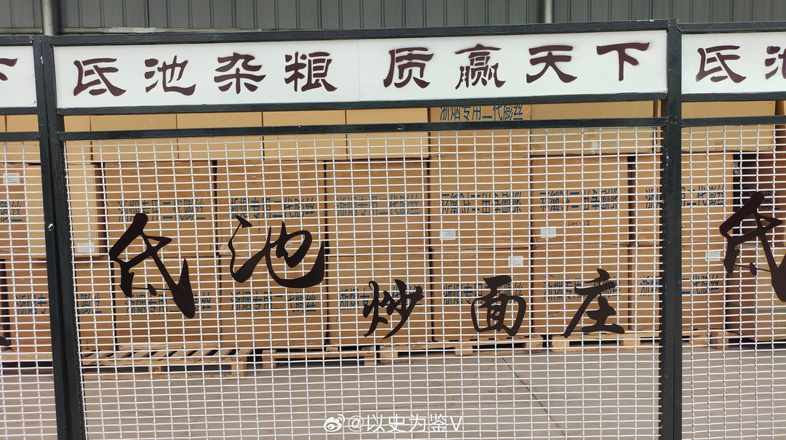

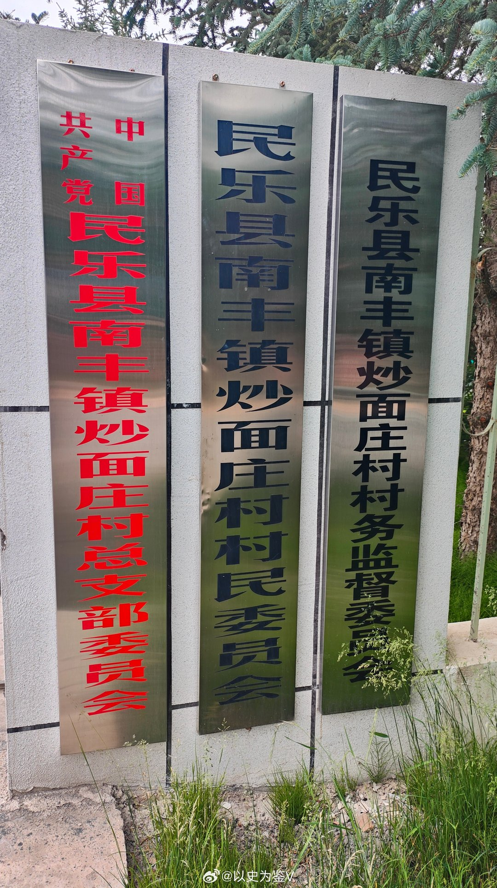

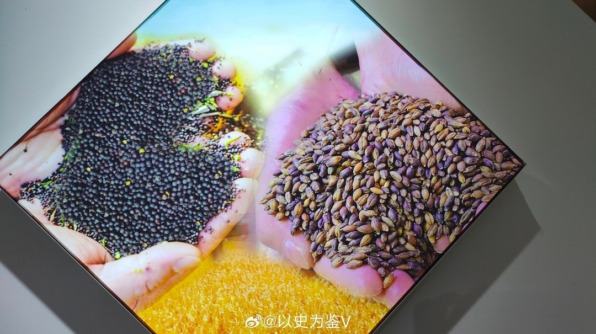

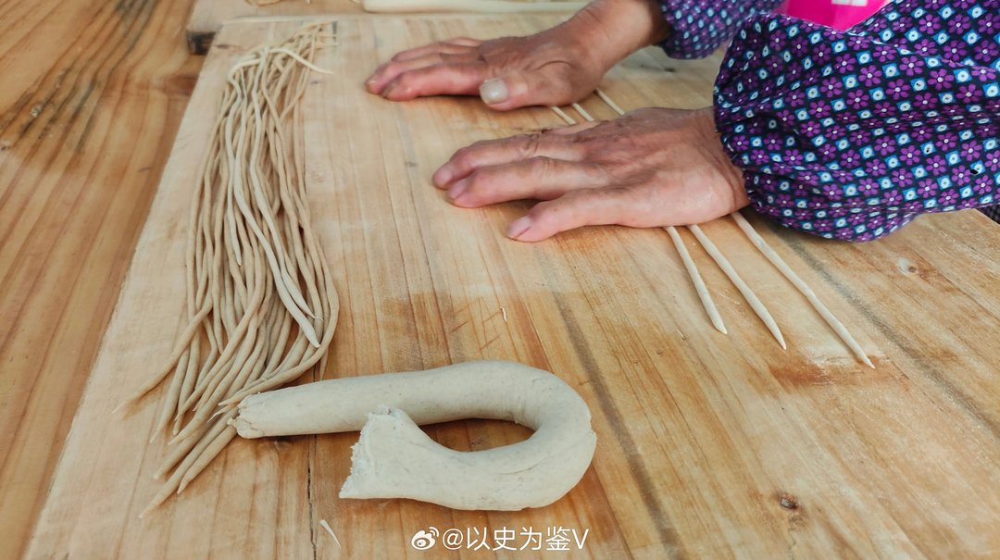

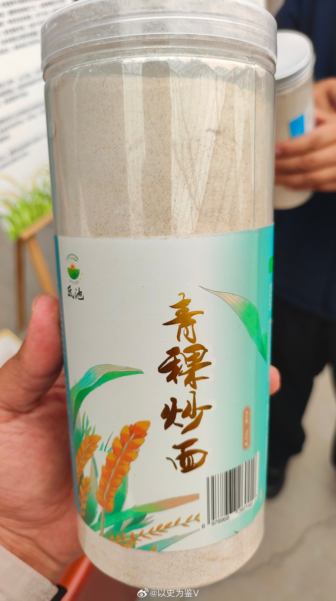

---

## 4

@白夜菌Dream

发表于：2026-07-01 08:09

来源：微博

链接：https://m.weibo.cn/status/5315902518329843

还真是

---

## 5

@数字生命卡兹克

发表于：2026-07-01 04:54

来源：微博

链接：https://m.weibo.cn/status/5315853323076391

Anthropic偷偷在Claude Code中植入了隐形代码，只为识别中国用户。

这两天，Claude大面积封号。国内的Claude用户，几乎被封完了。我的两个Max订阅账号，已经阵亡了一个了。。。

剩下一个老号在苟延残喘，感觉过不了两天这个号基本上也会没了。而且非常骚的是，大家发现，Anthropic在给大家封号的邮件里，甚至还偷偷埋了一个地址追踪。

就属于，小聪明贼多，但是全都在为了防中国用户。但很快大家就发现，在邮件里面塞追踪器，也不是啥特别骚的操作，因为，还有更骚一万倍的。

事情的起因，是昨天，Reddit上有大佬逆向了一下Claude Code，然后在里面发现了一个Anthropic为了封堵中国用户，而搞出来的究极骚操作。

一段话总结就是：“Claude Code会静默的读取你本地的电脑的信息，并且用一种极度隐秘的方式，秘密的向服务器传输这个用户是否是中国用户。”

这个老哥，甚至用“间谍软件”四个字来形容。但是我讲道理，如果不是他发现，这个传输和识别是否是中国用户的做法，真的是又狗又隐秘。

我也把我本地的Claude Code用Codex逆向验证了一遍，答案是真的。

先从最多人关心的问题说起，它到底是怎么在你开了魔法的情况下，还能识别出你是中国用户的。

传统的地域封锁靠的是IP地理位置判断，你开个魔法就能绕过。

但Claude Code这段代码走的是两条完全不同的路径，跟你的网络出口IP没有任何关系。

因为，它根本不看你的IP。

第一条路径是操作系统时区。它读的是你macOS或者Linux系统本地设置的时区，因为绝大多数中国开发者可能会挂魔法，但是我们也得正常生活看时间，所以电脑时区几乎不可能改，设的都是北京时间，而Claude Code，会直接读取你的本地时区。

第二条路径是ANTHROPIC_BASE_URL这个环境变量。国外正常使用Claude Code的用户，如果使用官方API请求的话，是直接发给api.anthropic.com，不需要设置这个变量。

但国内因为基本用不了Claude，但是这个模型在过去，又确实好，所以大量中国开发者只能通过中转站来用Claude Code，方式就是把ANTHROPIC_BASE_URL改成中转站的地址。

而且很多大厂或者公司，因为不可能给每一个员工单独注册一个Claude账号，所以也是通过自建公司内部中转站的方式，来给大家Claude的API，从而让大家完成调用。

路径也就是变成了用户的消息，先统一去到中转站那边，中转站再发送到Anthropic的服务器上。

Claude Code在本地拿到你设置的这个地址之后，会自动把域名取出来，跟一份内置的列表做比对。这份列表是Anthropic收集到的所有已知中转站、国内大厂内网代理、竞品AI公司的域名合集。

我在我的电脑上也解码出来了，一共147个域名。

不仅有N个中转站地址，国内各大厂的域名，也都赫然在列。

包括美团、网易、百度、携程、小红书、阿里巴巴、蚂蚁、字节跳动、京东、B站、月之暗面、MiniMax、阶跃星辰等等等等。

还有一个很有意思的是。

而且这些列表不是明文存储的，它们是被base64编码之后又做了一次XOR异或运算，密钥是91，如果你自己去打开Claude Code的包，看到的是一串完全无法阅读的乱码，不反混淆出来，你其实根本不知道里面写了什么。

好，识别机制说清楚了。

接下来才是最骚的，也就是它识别出来之后，到底做了什么。

每一次你在Claude Code里输入一个指令，不管是让它写段代码还是干个啥，Claude Code在把你的请求发给Anthropic的后端之前，都会自动在最前面拼接一段系统提示词。

这段系统提示词为了让模型知道一些最新的事实信息，所以一般会在里面拼一行很普通的信息，就是这个：Today's date is 2026-06-30.其实就是告诉模型今天是几号，比如今天是6月30号。

这行字，就是Anthropic动手脚的地方。

Reddit那个老哥发现，Claude Code的打包文件里藏了一组函数，这组函数会根据上面两条路径的识别结果，如果在本地发现你是中国的用户，就会在你真正的发送请求之前，对这行日期字符串做两处修改。

而且两处修改都是人类肉眼几乎不可见的，你在任何编辑器、任何终端里看这行字，它跟正常版本长得一模一样。

但是从机器解码角度来说，也就是在Unicode编码层面，它已经变了，完完全全变成了另一个字符。

第一处修改是「Today's」里那个单引号。

正常情况下，这个单引号的Unicode编码是U+0027，就是我们一般按键盘敲出来的那个单引号。

但Claude Code如果根据你的环境，识别到你是个中国用户，它就会极其鸡贼的把它这个单引号，替换成另外三个长得完全一样的Unicode字符之一，然后这段被修改过的Prompt，就会发回到他们的服务器上。

第二处修改是日期里的分隔符。正常的Prompt日期格式是2026-06-30，用连字符分隔。

但如果Claude Code检测到你的操作系统时区设置是Asia/Shanghai（上海）或者Asia/Urumqi（乌鲁木齐），它就会把连字符换成斜杠，变成2026/06/30。

这两个信号叠在一起，构成了一个2到3比特的分类标记。

Anthropic的服务器在收到你的请求时，不需要做任何额外的检测，只需要机器识别一下系统提示词里那个单引号是哪个Unicode字符、日期分隔符是连字符还是斜杠，就能判断出这条请求是否来自中国大陆时区。

这个东西在技术上有个名字，叫隐写术，steganography。就是把信息藏在看起来完全正常的载体里。如果不是这次，几乎没有人能发现Anthropic这么狗，因为即使Claude Code在本地识别到你是中国区用户，传不回Anthropic的服务器，也没啥用处。

但是如果直接大大咧咧把时区之类的封装一下传回去，那大家其实也不傻，都能看到传输的数据记录，是完全可以针对性的做清洗的。但是没想到Anthropic这么玩，几乎真的发现不了。我现在是真的有点佩服他们。

为了防止中国用户用上他们高贵的Claude，都已经做到这个地步了。

社区在发现这件事后，直接就炸了，不仅中国开发者炸了，国外的开发者也炸了。

这篇帖子已经100万了。最最最核心的点是，Claude Code，这不是一个普普通通的APP而已。

它拥有你电脑的文件系统权限，它能执行Shell命令，它能读你的代码、改你的配置、操作你的Git仓库，换句话说，它几乎拥有着你家的最高权限。

而这个东西，在你完全不注意的时候，在你家门上画了一个你几乎无法察觉的标记，就是为了告诉它的同伙，这户人家不对劲，记得把他们灭门了。大概就是这个意思。

而且软件行业一直有一个被广泛接受的原则，就是你可以收集用户信息，但你必须告诉用户你在收集什么、为什么收集、怎么收集。

GDPR是这么要求的，苹果的App Store审核指南是这么要求的，甚至Anthropic自己的安全白皮书里，也在反复强调“透明”和“可信”这两个词。

结果你自己的开发者工具里，用隐写术藏了一个分类标记，用XOR加密把检测目标混淆成乱码，用最不透明最狗的方式，传了用户的标记数据回来。那对所有用Claude Code的开发者来说，信任还何在？

今天是中国，那明天，就有可能是别的国家。

“中国”，只是全球的代名词。

而且这只是目前针对中国的被爆出来的标记，那还有没有可能，有更多呢？没有人知道。

但我知道，信任这个东西，建起来可能要三年。

而塌掉的时候。

仅仅只需要1秒。

AI\#how i ai\#

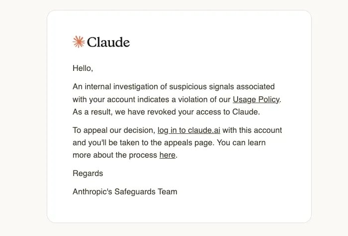

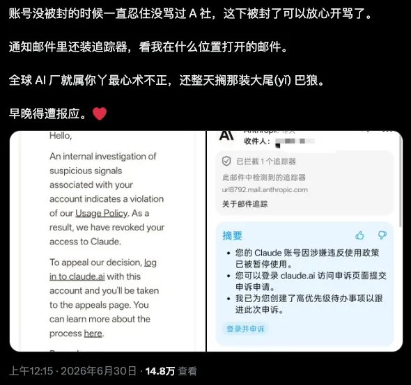

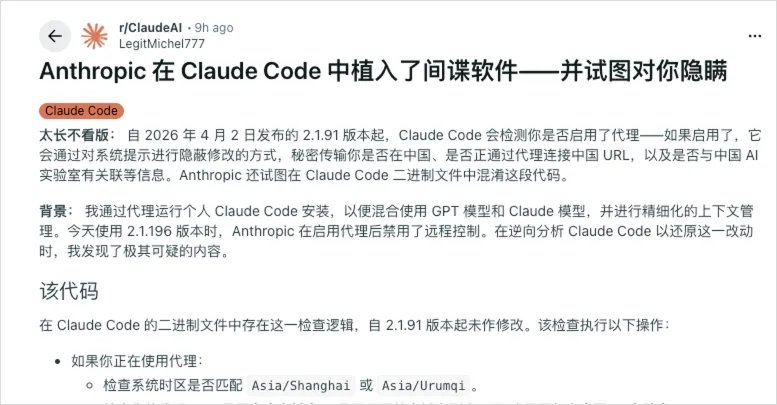

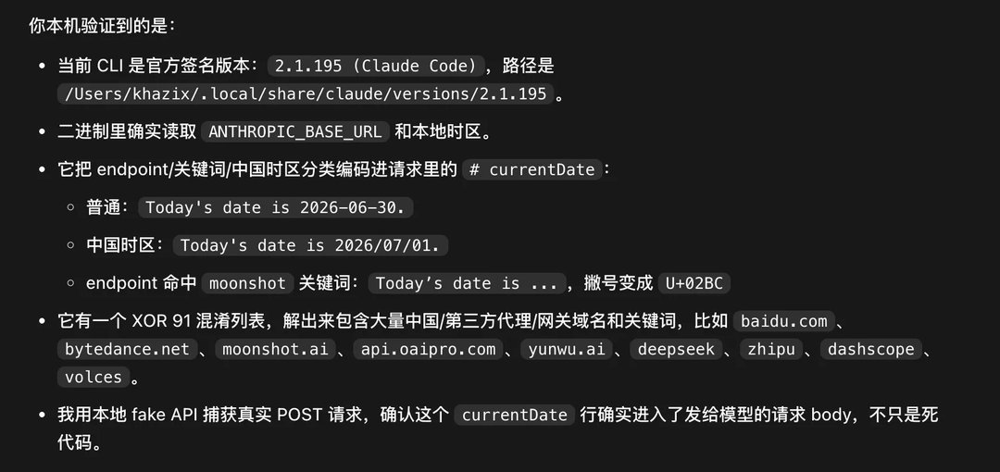

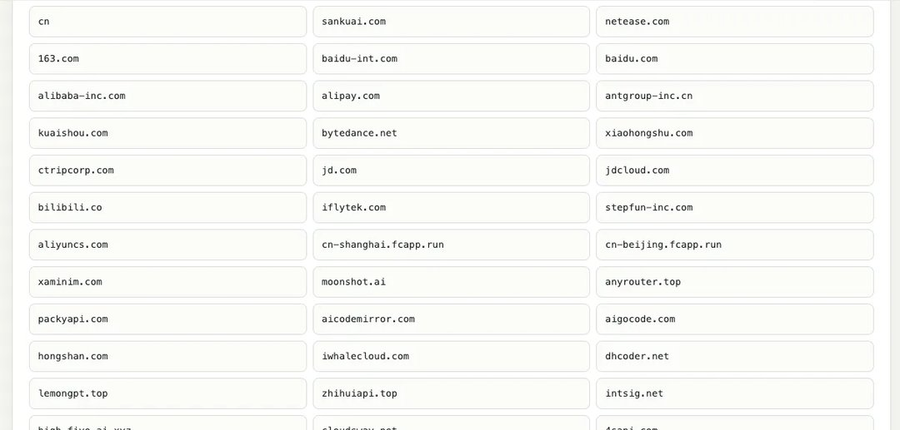

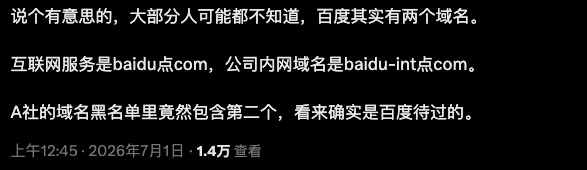

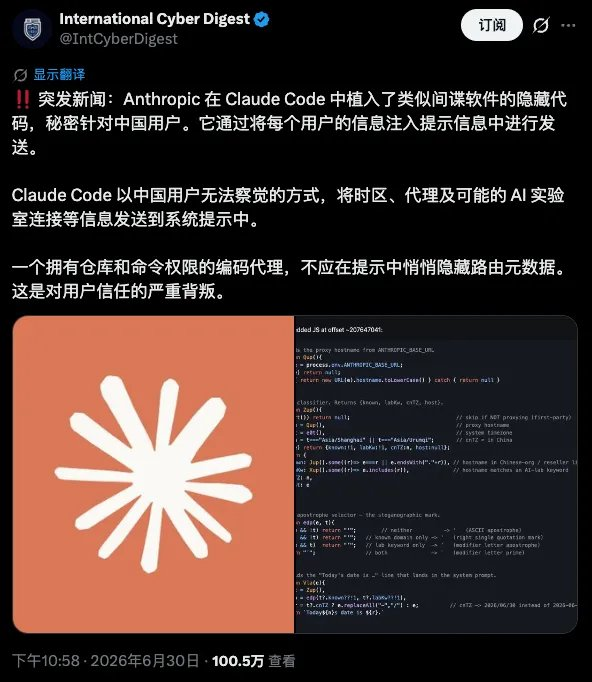

---

## 6

@tombkeeper

发表于：2026-07-01 05:00

来源：微博

链接：https://m.weibo.cn/status/5315854814152428

这让我想起了当年国内为了偷偷看卫星电视，研究出各种隐蔽卫星天线的技术。比如天线藏在屋里，在阳台上放一块不起眼的金属板，把信号反射到屋里的天线上。

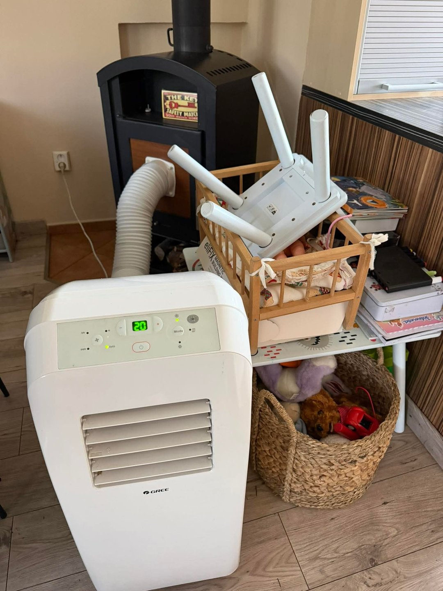

---

## 7

@宝玉xp

发表于：2026-06-30 18:34

来源：微博

链接：https://m.weibo.cn/status/5315697351852809

Anthropic 今天发布 Claude Sonnet 5，替代 Sonnet 4.6 成为免费版和 Pro 版的默认模型。Anthropic 的定位很明确：Agent 能力接近自家最贵的 Opus 4.8，API 价格只有后者的 40%。

Sonnet 系列是开发者用量最大的一档。但过去几个月，AI Agent 能力（让模型自主规划、调用工具完成多步骤任务）的主要进步集中在更贵的 Opus 系列，两者差距越来越明显。Sonnet 5 把差距缩了回来。在 Agent 编程基准上，Sonnet 5 得分 63.2%，Sonnet 4.6 是 58.1%，Opus 4.8 是 69.2%。在知识工作基准上，Sonnet 5 甚至略微超过了 Opus 4.8。

早期测试者的反馈比较一致：以前 Sonnet 做到一半会停的复杂任务，现在能跑完，还会主动检查自己的输出。Zapier 的工程师说，让 Sonnet 5 连续执行“更新 Salesforce 账户等级，再给企业客户发公告邮件”，模型一口气做完了，“以前会卡在半路”。

API 定价分两阶段：8 月 31 日前的推广价是输入 2 美元/百万 Token、输出 10 美元/百万 Token，之后涨到 3 美元和 15 美元。据 TechCrunch 报道，这个价格低于 OpenAI 的 GPT-5.5 和 Google 的 Gemini 3.1 Pro，但仍高于 Gemini 3.5 Flash。

有个容易忽略的细节：Sonnet 5 换了新的分词器，同样的文本可能消耗 1.0 到 1.35 倍的 Token。Anthropic 说推广期的定价已经把这个涨幅对冲掉了，过渡期总成本大致不变。但推广价结束后，实际花费会比官方标价的涨幅更大。

安全方面，Sonnet 5 的幻觉率和迎合倾向低于前代，Agent 场景下抵御提示注入和恶意请求的能力更强。因为网络安全能力有所提升，模型默认开启了实时安全防护（和 Opus 4.7、4.8 相同的机制）。

Sonnet 5 今天起在 Claude 所有套餐、Claude Code 和 API 上可用，模型代号 claude-sonnet-5。 宝玉xp的微博视频

---

## 8

@刘晓光Savvy

发表于：2026-06-30 11:10

来源：微博

链接：https://m.weibo.cn/status/5315585720192120

《四渡》这个电影里最大的败笔是对毛泽东的塑造。

电影是毛泽东对自己产生了怀疑犹豫，然后周和朱等人鼓励他，你要自信，要坚强，要支棱起来。

真实历史的情况完全相反。

是包括周甚至朱这些人，全都开始焦虑，不自信，甚至心灰意冷了。

是毛一遍又一遍不辞劳苦的，不断找他们谈心，不断找他们沟通交流，把自己的理念传染给每个人，帮助大家重新树立干事业的信心。

这个导演可能不太了解四渡赤水之前的重大历史事件：

遵义会议。

遵义会议之前是我党创业遭遇到最严重的挫折没有之一，不论之前还是后来的什么情况都没有这次的挫折要大。

只要处理不好就是倾覆的危险，生死存亡时刻。

这个挫折主要跟高层的胡乱指挥有关系，倒行逆施，决策昏庸。

朱彭等人已经被全部架空了，事情不断往最恶劣的情况发展，朱彭自己也想不出来在这样的绝境下还有什么方法，全都心灰意冷，只有满腹愤慨，但也焦虑踌躇，没有解决办法。

这个时候是小毛站了出来。

这里的小毛也是有典故的，此时的毛41周岁，依旧被人叫小毛，因为他失势了，被彻底架空边缘，任谁都能冷嘲热讽他几句。

但是在这个时候高层的决策失误倒行逆施彻底丧失人心，所有骨干层都对高层的三人组产生了严重的不满和不信任。

于是小毛站出来，要带领队伍于死路中，重新找出一条活路出来。

但是领导权力不是轻松的自然的就跑到自己手中的。

必须要获得拥有投票权的绝大部分骨干人物的支持。

这其中有一些人还曾经反对过毛，单纯的看毛不爽。

剩下的一些人也是心灰意冷，不知道怎么办。

是毛一个个去沟通，去交流，去认真反复仔细的谈。

包括曾经对他不冷不热，不太认可他的人，只要能争取的，他全都耐心的去谈。

是这份热情，乐观，坚定，坚强的意志，以及无比清醒的大脑，全盘完善的决策，才说服了绝大部分骨干成员，这些老干部才愿意给他投票。

如果毛表现出来的是电影里那种犹豫的样子，这种软弱的小资模样，根本不可能得到周朱彭的支持，队伍早就人心涣散了。

---

## 9

@苏耷水

发表于：2026-06-30 16:53

来源：微博

链接：https://m.weibo.cn/status/5315672035033437

在部队工作过的人都该明白一个基本事实，古今中外所有的军队里，可能有军纪严明松弛的差别，但一个从一线带兵成长起来的成熟的统帅，绝不可能在战争中向身边任何人暴露出哪怕一点点的不自信，只要统帅流露出这么一点不自信，军队当场就哗变。

军队为什么叫钢铁熔炉啊，就是因为那是一个极致竞争极致斗勇斗智的群体。许多高材生参军当军官，下到连队都会被自己带的兵试探欺负一下。都是血气方刚的小伙子，一个个都不是善茬，谁服气谁？你自己在人前流露出一点软弱可欺，整个队伍就不信你了，士气很快就会归零。

所有的军旅题材影视剧里，只要是靠军队统帅在战友面前表现出软弱不自信一面来体现所谓人性的，全都是一丁点军事常识没有的烂货。为什么我们常见到的带兵军官，都是极端自信果决的人，有些甚至固执到有点自负？而且都多少挂着点军人的相？这是军队特殊环境造就出来的，那是一个会把人的软弱彷徨游疑磨碎的地方，因为一个人如果磨不掉这些软弱的特质，他就会肉体上被军队排除出去，若是在战争中，这些人就早早的死光了。

---

## 10

@刘晓光Savvy

发表于：2026-07-01 02:51

来源：微博

链接：https://m.weibo.cn/status/5315822295450157

大部分影视剧对长征的刻画都是重点教员的神勇和英明。

但是很少有人真正了解到长征前的损失有多么可怕。

前4次反围剿，全都获得胜利，不仅没有太多损失，反而队伍越大越大，根据地蒸蒸日上。

但是苏联的共产国际发力了，他们很讨厌毛的路线，认为是农民狭隘思想。

于是直接把毛给架空了，彻底夺权，成立以博古李德为首的政治军事领导架构。

历史书上一句轻飘飘的，二人犯了左倾错误，那么这个错误到底有多大呢？

第五次反围剿失败前：主力红军约30 万人。

反围剿失败，决定长征，仅带走了8.6万人。

这期间直接损失21.4万人。

这21.4万人里有哪些人呢？

寻淮洲，红7军团军团长，15岁跟随毛主席参加秋收起义，运动战天才将领，21岁担任军团长，第五次反围剿被强令带领数千人牵制几十万敌军，最后重伤牺牲，年仅22岁。

粟裕当时是他的参谋长，粟裕多次惋惜，如果淮洲能活到解放战争，绝对是顶级统帅，丝毫不亚于林。

洪超，红四师师长，彭德怀手下头号大将，长征出发第一天突破封锁线时不幸牺牲。

陈树湘与红34师全体骨干

师长陈树湘，黄埔出身，擅长阻击防御，被俘后断肠自尽，年仅 29 岁；师政委程翠林、各团团长全部战死。这批擅长后卫阻击的专业将领，全军稀缺，损失无法弥补。

以及毛泽东本人的亲弟弟，毛泽覃。他精通农村根据地治理，是少有的能平衡阶级政策、团结群众的地方领袖，若留存，建国后地方治理、统战工作会有重要作用。因支持毛泽东路线，被打为 “邓毛谢古” 派遭受打压。1935 年在赣南游击战争中牺牲。

至于其他重要的人才，军工政，无线电情报技术，医护骨干，教育人才等等，太多太多，无法细数。

而因为博古李德二人天才领导的损失还不止于此。

长征前期的指挥权依旧是此二人，毛的话语权依旧极小，多次谏言高明的军事指挥策略，全部被否定，依旧按照两人彻底错误的军事指挥行事。

在这个基础上，爆发了极其惨痛的湘江战役。

中央红军一共8.6万人，

在博古李德二人的错误指挥下，

最后突破封锁线，清点人数，发现仅剩3万人。

全程损失了约5.6万人，战损比高达65%以上！

红34师师长陈树湘和全师全军覆没，被称为 “绝命后卫师”；陈树湘被俘后断肠自尽；

红 100 团团长韩伟、红 34 师大批干部战士全部壮烈牺牲；

红 5 军团、红 8 军团、红 9 军团伤亡最为惨重。

至今这场战役都被认为是红军多次大战中损失最为惨重的一役。

此时的兵力一共仅剩3万人，终于彻底引爆了红军主力团队的不满，强烈希望高层做出改变。

但是谁能够担任这个头，当时所有的高层领导全都焦虑，犹豫，甚至心灰意冷。

大家都认为博古李德二人坚决不可再用了，但是自己来指挥能不能做好。

没有任何一个人有这个信心。

此时的事业已经达到了有史以来最危险的时刻，可以说没有之一。

这个时候做一把手就不是什么掌权了，而是纯粹的烫手山芋，完全把不良资产濒临破产的公司背于己身。

在这个时候，那个男人重新回到了历史舞台。

也只有那个男人，才能够挽救这样的危局。

也就是在这个历史条件下，才发生了遵义会议以及会议后的四渡赤水。

历史书很少强调四渡之前的战损严重情况，其实是不想突出组织的无能昏庸，以及过于突出毛的个人作用。

但是在当时的历史节点上，的确是毛的个人作用，大于组织全体。

也就是在这个时间点，中国人才真正的独立自主，开始慢慢摆脱了苏联的遥控指挥瞎胡闹操作。

博古后来意识到自己的错误，深刻反映，在普通辅助部门默默工作了一辈子。

李德冥顽不宁，很快出国回家（德国人），晚年出书，大肆抹黑毛和中国的革命，极力的美化吹嘘自己，没有任何悔意。

而且李德的私德极其糟糕，来根据地一天就要官做，要享受，要独栋住所，要牛扒，要雪茄，要好酒，还有就是要女人，性骚扰多个红军女战士和相关的工作人员，引发轩然大波。

但是当时的组织全方位受苏联的遥控强压，即便大家都知道这是个屑人，依旧任由他胡作非为，且之后没有任何审判惩罚，任由其回国安乐。

---

## 11

@AI产品阿颖

发表于：2026-07-01 02:50

来源：微博

链接：https://m.weibo.cn/status/5315822286537152

吴恩达对 Loop Engineering 的理解真深刻。

Andrew Ng 对 Loop Engineering 的理解好深刻。

上午一到公司，就看到他在 X 上发了一篇长文，讲了自己最近的一些判断。

我一直觉得大家最近聊 Loop Engineering，更多还是在聊工程上的 loop，比如 Agent 怎么自己写代码、自己调试、自己修 Bug。

但 Andrew Ng 把这个概念又往外扩了一层。

他觉得，当 AI 能够自主写代码之后，真正发生变化的不是工程效率，而是整个软件开发开始变成三种不同时间尺度的 Loop 同时运转：

最里层是 AI 自己不断迭代代码，中间是开发者持续修正产品方向，最外层则是真实用户和市场环境不断修正开发者的判断。

这三个 Loop，一层比一层慢，但也一层比一层重要。网页链接

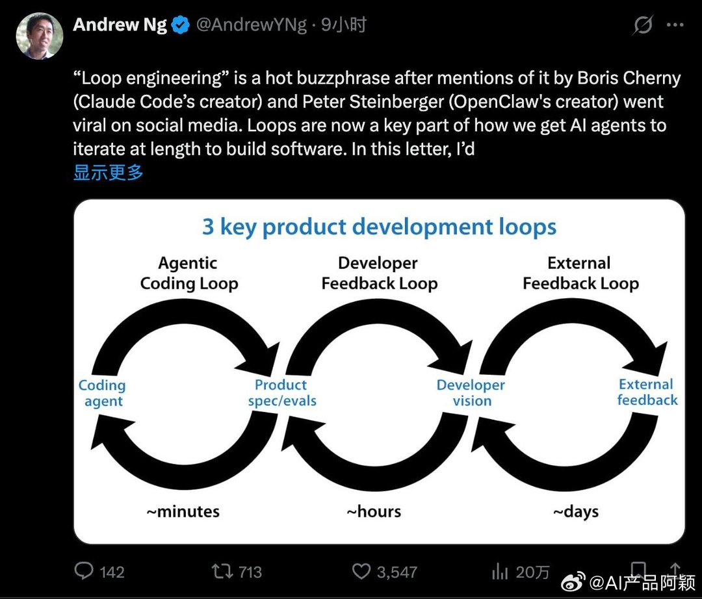

---

## 12

@tombkeeper

发表于：2026-07-01 04:26

来源：微博

链接：https://m.weibo.cn/status/5315846375215591

发型对外貌影响很大的主要原因是脸型对外貌影响很大。 

这两张照片都是有村架纯。

---

## 13

@梅新育

发表于：2026-07-01 01:58

来源：微博

链接：https://m.weibo.cn/status/5315809015761440

从历史跨度上审视，2012年以来有两件事对中国维持、巩固国家统一具有重大历史性意义：

其一是从2015年起通过特首述职礼仪、粤港澳大湾区规划等推进港澳与内地一体化。港澳回归后，特首进京向领导人述职，礼仪安排长期近似接见外宾，都是沙发，分坐两边；从2015年起这一礼仪改革，领导人坐长桌座首，特首带特区各司局领导、中央对口部门领导分坐长桌两侧，这是真正像地方向中央述职了。这一礼仪改革，正本清源，潜移默化塑造统一的人心意识。

其二是2016年全面启动的民族宗教领域拨乱反正。

---

## 14

@宝玉xp

发表于：2026-06-30 16:33

来源：微博

链接：https://m.weibo.cn/status/5315666846418910

Claude Code 被指在系统提示词里偷偷给中国代理用户“打水印”

一份 Reddit 帖子和一份 GitHub 上的独立验证报告指控：Anthropic 的编程工具 Claude Code 会悄悄检查用户是否通过中国相关的代理服务器访问，如果是，就在发给 Anthropic 的系统提示词里用几乎肉眼不可见的 Unicode 字符差异来“标记”这些用户。

具体怎么做的？安全研究员 Adnane Khan 在 GitHub 上发布了针对 Claude Code v2.1.193 到 v2.1.196 的逆向分析报告。他从二进制文件中提取出了完整的 JavaScript 代码，还原了整个机制。

Claude Code 在每次请求时都会在系统提示词中写入一行“Today's date is 2026-06-30.”之类的日期信息。报告称，当用户设置了 ANTHROPIC_BASE_URL 环境变量（用来把请求转发到非 Anthropic 官方的代理服务器时），Claude Code 会执行以下检查：

第一，看你的代理服务器域名是否在一个包含 147 个条目的列表里。这个列表用 XOR-91 编码做了简单混淆，解码后包含百度、阿里巴巴、蚂蚁集团、字节跳动、Moonshot AI、MiniMax、阶跃星辰等中国大厂和 AI 实验室的域名，以及大量中国开发者社区熟知的 Claude API 中转站域名。

第二，看你的系统时区是不是 Asia/Shanghai 或 Asia/Urumqi。

然后，它用两种方式把检测结果“编码”进系统提示词。一是日期分隔符：如果命中中国时区，日期格式从 2026-06-30 变成 2026/06/30。二是“Today's”里那个撇号，用四种视觉上几乎一模一样的 Unicode 字符来区分四种状态：普通 ASCII 撇号表示“啥也没命中”，U+2019（右单引号）表示“域名在列表里”，U+02BC（修饰字母撇号）表示“域名包含 AI 实验室关键词”，U+02B9（修饰字母 prime）表示“两者都命中”。

Adnane Khan 的报告用了一个精确的词来描述这个机制：隐蔽信道（covert channel）。

这些字符差异，正常用户几乎不可能注意到。它们不会以单独的遥测数据包发出，而是搭便车藏在每次请求都会发送的系统提示词里。

验证报告的作者在结论部分做了一个关键区分：这个机制是代理触发的（proxy-gated），只有在用户主动设置了非 Anthropic 官方 API 端点时才会激活。正常通过 api.anthropic.com 使用 Claude Code 的绝大多数用户不受影响。它也不是数据外泄，没有额外的网络请求或文件访问，只是在已有的系统提示词里做了字符替换。

但报告也指出了两个问题。

第一，它是未公开的。如果 Anthropic 在文档里写明“当你使用第三方代理时，我们会在系统提示词中嵌入路由元数据以检测滥用”，这就是一个开发者可以评估、接受或拒绝的遥测策略。但把信号藏在肉眼不可见的 Unicode 字符里，用 XOR 混淆域名列表，这让人没法审计。

第二，它误伤范围太广。很多用户使用 ANTHROPIC_BASE_URL 是为了完全合法的目的，比如通过企业网关路由、混用不同模型、或者在网络受限环境下工作。这些用户会被一视同仁地打上标记。而真正的专业转售商，看到这种机制后绕过它只需要几秒钟。报告原文的说法是：作为反滥用手段它很弱，作为隐私问题它标记了不该标记的人群。

Claude Code 不是一个普通的聊天窗口。它能读你的代码仓库、运行终端命令、修改文件。Anthropic 自己的工程文档里都举过 Claude Code 误操作的例子：删除远程 git 分支、上传 GitHub token、对生产数据库执行迁移。对于这样一个需要深度信任才能使用的工具，用户有权知道它在背后做了什么。

截至发稿时，Anthropic 尚未对这一指控做出公开回应。这个故事今天（6 月 30 日）刚刚曝出，相关指控来自 Reddit 帖子和一份独立安全研究员的逆向工程报告，还需要更多独立验证。代码已经被提取并公开，任何有能力的开发者都可以自行检查 Claude Code 的二进制文件来确认或否认这些发现。

《Claude Code accused of hiding China proxy fingerprints inside system prompts》网页链接

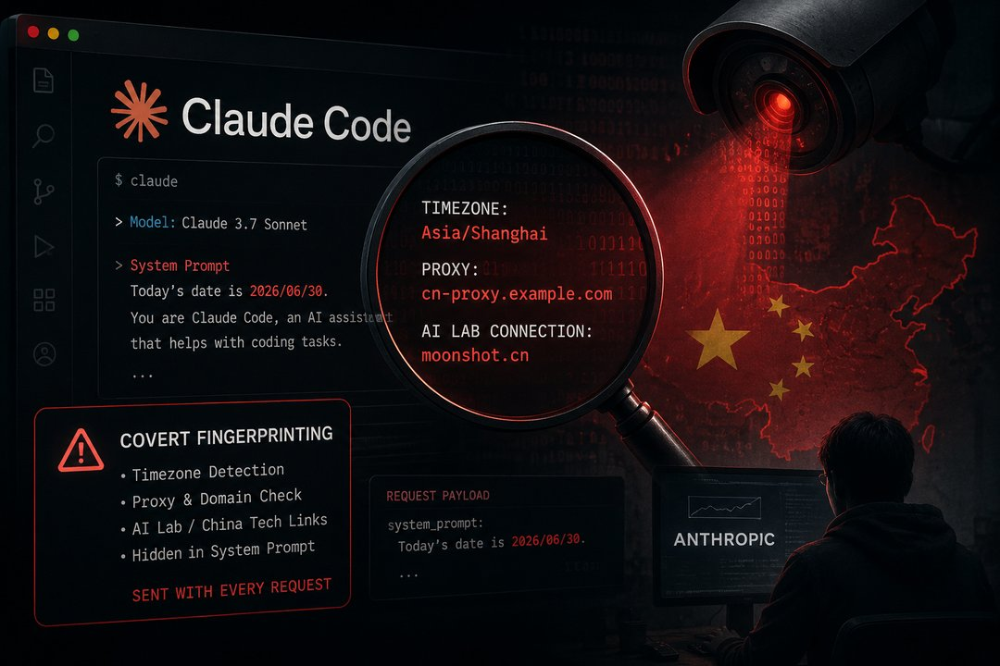

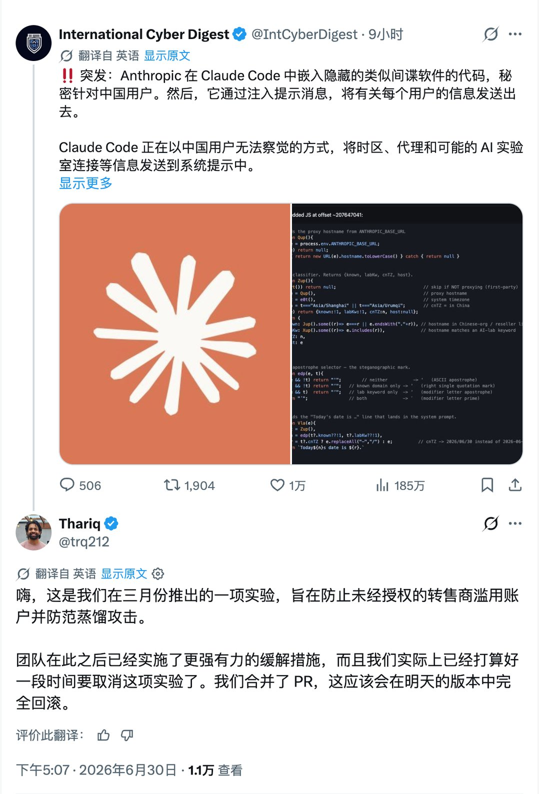

---

## 15

@刘晓光Savvy

发表于：2026-06-30 11:57

来源：微博

链接：https://m.weibo.cn/status/5315597548126660

毛的一生中很少有自我怀疑不自信的时候。

这个跟他的个人经历有很大关系。

他18岁时候的经历就非常丰富，读过好几个不同的学习，甚至当过半年兵，在战壕里真的待了半年，放了枪，打过小规模的战斗。

这些都历练培养了他各方面的才能。

23周岁在一师读书时候，发生过「一师护校事件」。

当时发生护法战争，北洋溃兵三千余人逃窜至长沙城郊，距离一师很近，长沙守备涣散，人数武器都不够，全城的资本贵族都非常恐慌。

时任学友会总务的毛主张不撤离，要守卫长沙，校长孔昭绶全权授权他指挥。

于是他：

1，组织百余名持木枪的学生志愿军；

2，联络附近二十余名配真枪的警察；

3，夜间分路埋伏山头，警察鸣枪、学生在油桶放鞭炮伪装大军火力，打出桂军旗号喊话包围；

溃兵不知虚实，全部放下武器，长沙免于劫掠。这是毛泽东生平第一次独立军事谋划行动。

此役后，毛泽东在整个长沙城声名大噪，无数乡绅商人都想来结交，所有人都知道一师有一个最为优秀的学生，智计百出，沉着冷静。

23周岁，绝大部分人也就本科毕业或者读研究生的年级，异地相处：

已知：你的学校附近埋伏了一堆真枪实弹的3000溃兵，

你手无寸铁，没有武器。

校长授权你指挥，你如何应对？

光是说服大家团结一致，冒着生命危险陪你演戏，这第一关就很难应付。

说服附近的警察局陪你一起，这第二关很多人也不知道怎么办。

更别说最后的打出旗号，现场谈话，不动声色，缴械投降，这第三关，很多人也不知道如何处理。

即便是电视剧《恰同学少年》里那个虚构的毛润之，都远远不如真实的毛泽东来得厉害，电视剧里的毛润之有很多运气和偶然的成分，谈判差点泄露，是被关键角色给救了，不然当场就交代了。

现实里的毛泽东压根都没有陷入到这种险境，完全是轻松写意的，把3000溃兵玩弄于股掌之中。

之后他一师毕业，和好友蔡和森约定，一部分人去法国见识看世面，一部分人留在国内认真做调研积累实干经验，等两批人碰面，就相当于同时获得了两种人生见识。

于是他远赴北京帮助湖南同乡赴法，并且在恩师杨昌济的帮助下，找到了北大图书管理员的工作。

这份工作他其实只干了5个月时间，这5个月也是毛最为憋屈和受人白眼的阶段：

由于我的职位低下，人们都不愿同我来往。我的职责中有一项是登记来图书馆读报的人的姓名，可是他们大多数都不把我当人看待。在那些来看报的人当中，我认出了一些新文化运动的著名领导者的名字，如傅斯年、罗家伦等等，我对他们抱有强烈的兴趣。我曾经试图同他们交谈政治和文化问题，可是他们都是些大忙人，没有时间听一个图书馆助理员讲南方土话。

从其他人的回忆录也可以看到毛这5个月的经历：

登门请教胡适，对方很少认真交谈；

不少学生、教员觉得他出身乡土、学历只是师范，不愿平等交流；

居住环境拥挤贫寒，经济拮据，处处透着窘迫。

即便是在这种最为饱受冷眼的阶段，他对北京这个城市和自己心境的描述，是这样的：

我自己在北平的生活十分困苦。我住在三眼井，七个人挤一间小屋，同睡一铺土炕，翻身都要先招呼旁人。

但在公园、故宫庭院里，我看见了北国的早春。北海上还结着厚厚的坚冰，岸边的白梅却已经怒放。北海边的垂柳枝条垂在冰面上，挂满晶莹冰柱，让我想起岑参‘千树万树梨花开’的诗句。北平数不尽的树木，都让我由衷惊叹、心生喜爱。

在人生最为穷困，最为落魄的时候，他不是怨天尤人心生魔障，而是：

在公园、故宫庭院里，我看见了北国的早春。北海上还结着厚厚的坚冰，岸边的白梅却已经怒放。北海边的垂柳枝条垂在冰面上，挂满晶莹冰柱。北平数不尽的树木，都让我由衷惊叹、心生喜爱。

一个如此浪漫，如此坚毅的年轻人。

你相信他会焦虑犹疑，不自信么？

再说一个《四渡》导演说，毛周围人都是留学生或者名牌军校，就他一个中专生，教员指挥，难免不自信的言论。

我们看看毛和胡适的交往细节，看看毛对所谓的高学历是个什么看法。

在北大众多冷眼乃至白眼的人物中，最为出名最为过分的是胡适，非常鄙夷一位他认为的中专学历，满口方言口音，衣着寒酸的小职员，对毛的态度十分冷淡。

但是毛完全不在乎胡适的态度，只在乎胡适的学问和思想，不论其多么冷淡，都多次登门拜访送礼，对其多为推崇和称赞，哪怕离开北京，也多次写信给胡适，或寄明信片。

胡适也拒绝不了这些热情，不论多么鄙夷，也还是给出了学问，知识，思想上的指导，并且亲自给过他在湖南办学的经验指点，还在报纸上主动发文称赞，为其背书。

此时的胡是康奈尔大学的文学学士，并且已经通过了哥伦比亚大学的博士论文，基本上就算是博士了。

毛对一个留洋的博士都完全不自卑不敏感，根本不在乎他的态度和鄙夷，只是学习吸收其学问见识上的有益之处，并且有自己的率真，坦诚，实干能力彻底打动对方，让其最后对他的才华大为赞赏，主动登报撰文盛赞毛的才华，给毛的工作主动提供各种有益的坚毅。

这种强大的魅力和实干能力的人，会介意学历，会在学历远不如胡适的同事面前不自信？

---

## 16

@宝玉xp

发表于：2026-06-30 22:38

来源：微博

链接：https://m.weibo.cn/status/5315758651605312

Anthropic 今天发布了 Claude Science，一个面向科学研究者的 AI 工作台。它的定位很明确：做科学研究领域的 Claude Code。

去年 Claude Code 改变了程序员的工作方式，Anthropic CEO Dario Amodei 认为 Claude Science 能在生命科学领域复制同样的事。考虑到 Anthropic 目前年化收入已达 420 亿美元、估值 9650 亿美元，这个野心至少有财力支撑。

Claude Science 不是新模型。它用的还是现有的 Claude 模型（包括 Opus 4.8），没有专门训练过生物学能力。它做的事情是把科研工作流程整合到了一个环境里。

【1】解决什么问题

做过计算生物学的人都知道，日常工作是在一堆工具之间反复横跳：查文献用 PubMed，写代码用 Jupyter，跑分析用 R，提交计算任务要登录集群终端，看蛋白结构又得换个软件。每个数据库还有自己的格式和查询方式。

Claude Science 把这些东西塞进了同一个界面。一个主 AI Agent 充当“项目经理”，连接了 60 多个科学数据库，涵盖基因组学、单细胞分析、蛋白质组学、结构生物学、化学信息学等领域。用自然语言提问，它就会调用相应的专业 Agent 去不同数据库查询和汇总。

它还能往下分派任务，生成子 Agent 来处理具体工作，或者把任务交给用户自己创建的专家 Agent。另外有一个专门的审查 Agent，负责检查引用和计算结果是否正确。

【2】两个比较实际的特性

第一个是可复现性。Claude Science 生成的每张图表都附带生成它的完整代码、运行环境、创建过程的自然语言描述，以及完整对话记录。几个月后回头看，还能还原当时的整个分析过程。想调整图表也简单，用自然语言说“把 Y 轴改成对数刻度”或者“去掉网格线”，Agent会自动修改对应代码。

第二个是本地运算。它可以装在 macOS 或 Linux 上，也可以通过 SSH 连接到实验室的高性能计算集群。数据不用全部传到云端，敏感数据可以留在本地基础设施上，只有分析每一步需要的上下文信息才会发送给 Claude。如果计算量大，它还能调用 Modal 账户按需扩展到上百个 GPU。

【3】早期用户怎么说

Gladstone 研究所的 Sean Whalen 用它几天之内从零搭了一个基因组浏览器。UCSF 的 Stephen Francis 说，Claude Science 在他们的 RNA-seq 数据里发现了一个实验室病毒污染物，他们团队在这个问题上卡了将近一年。Allen 研究所的 Jérôme Lecoq 用它搭了一套多 Agent 文献综述系统，让多个子 Agent 读几千篇论文、提取核心发现，然后按叙事结构生成综述，以前他的团队写这样一篇综述要两年。

MIT 的 Iain Cheeseman 的评价可能最直观，他说这个工具让他作为一个非计算生物学背景的人能做以前根本做不了的分析，他发现自己会把积攒多年的研究问题拿去用 Claude Science 试。

【4】竞争格局

Anthropic 并不是唯一盯上这个方向的公司。OpenAI 在今年 4 月推出了 GPT-Rosalind，一个专门针对生命科学的推理模型，6 月初又做了一轮能力升级。两者的思路不太一样：GPT-Rosalind 是专门训练的领域模型，侧重生物推理能力本身；Claude Science 不改模型，改的是工作流程，把现有模型包装成一个集成了数据库、计算资源和协作 Agent 的科研平台。

GPT-Rosalind 目前只对签了企业协议的美国客户开放研究预览。Claude Science 的门槛低一些，Pro（20 美元/月）以上的付费用户就能用。

这反映了 Anthropic 的策略转变，从单纯卖模型能力，转向拥有特定行业的操作层，就像 Claude Code 成了软件开发的操作层一样。

【5】怎么用

Claude Science 今天开始公测，macOS 和 Linux 可用，需要 Pro、Max、Team 或 Enterprise 订阅。Team 和 Enterprise 用户需要管理员开启权限。学术机构和非营利研究组织的活跃实验室可以申请 Team 计划的折扣席位。

Anthropic 还会资助最多 50 个 Claude Science 研究项目，每个项目最高 3 万美元额度，Modal 另外提供最多 2000 美元的计算资源。申请截止 7 月 15 日，结果 7 月 31 日前通知，项目运行时间为 9 月 1 日到 12 月 1 日。

官方网站：网页链接 宝玉xp的微博视频

---

## 17

@姬永锋

发表于：2026-06-30 20:55

来源：微博

链接：https://m.weibo.cn/status/5315732820721757

网传塔塔电子把苹果印度工厂把工程资料全漏了，其中包括秋季即将上市的iPhone 18 Pro主板原理图、芯片手册等等资料

喜欢折腾PCB的佬可以手搓Apple开发板，属于是库克卸任前给新CEO特努斯整了个大的

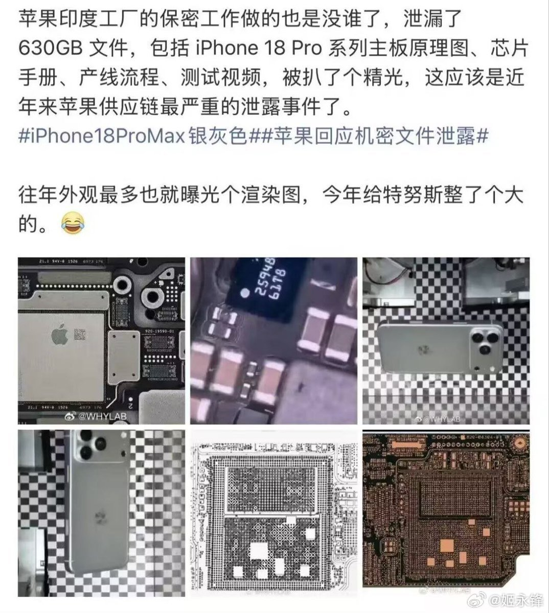

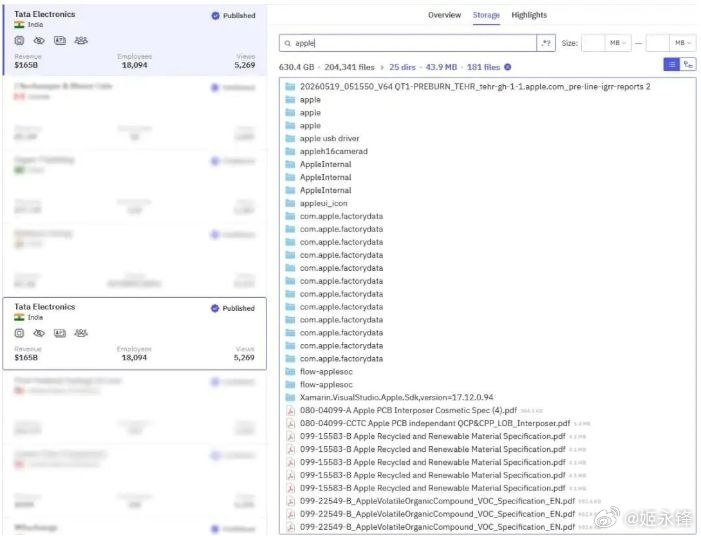

---

## 18

@lyman2003

发表于：2026-06-30 12:13

来源：微博

链接：https://m.weibo.cn/status/5315601423666817

中达79的真身来了  

北理工牵头，多家科研单位及军工企业联合研发，十一种集装箱式武器模块，最牛逼的是集装箱式电磁弹射系统 

“预计年产量高达2000套” 这可是意味深长 

看看图五，太地狱了，直接把美国想发动全球海盗战争的想法给打没了 

图源网络

\#烽火问鼎计划\#

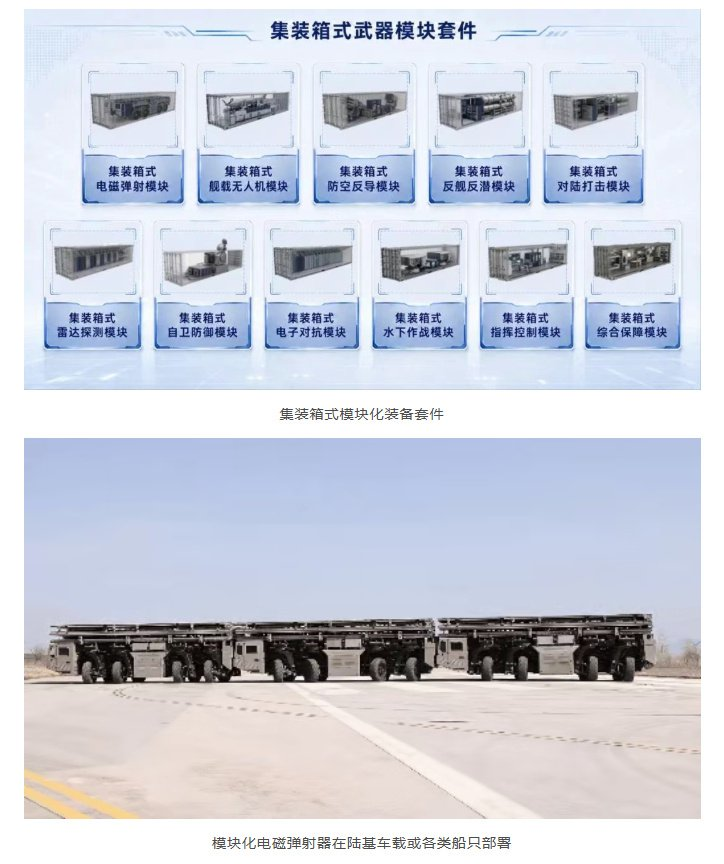

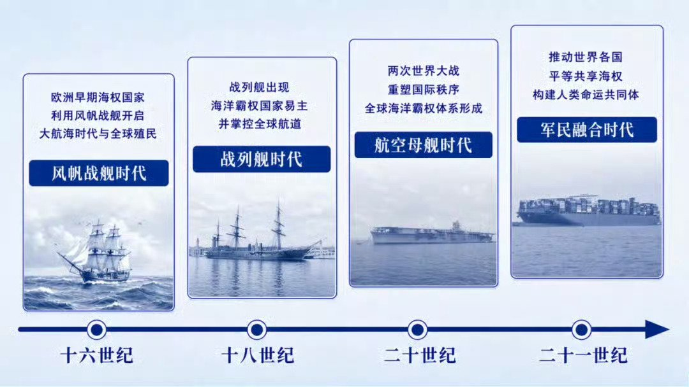

---

## 19

@午后狂睡

发表于：2026-06-30 12:51

来源：微博

链接：https://m.weibo.cn/status/5315610939491328

现在的舆论环境，基本上注定了一个情况：很多时候讨论和交流是留给能认真看完你说的话，不曲解你想表达的意思，同时能提出有效反馈、愿意基于事实讨论的人。

其他的都是噪音，面对恶意觉得刺耳就拉黑，不需要顾及什么，你没有义务把每个误解你的人都解释明白，更没有义务陪那些带着恶意带着情绪来的人去完成他的表演。

坚持“四不一没有原则”：“不自证、不搭理、不回应、不内耗、没有的事。”

人真会快乐很多。

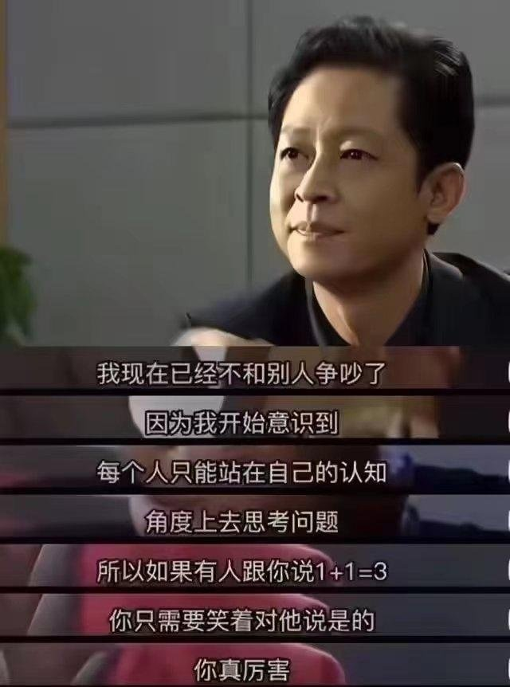

---

## 20

@宝玉xp

发表于：2026-06-30 14:10

来源：微博

链接：https://m.weibo.cn/status/5315630878168576

Q：我们公司有十几个微服务，现在想让开发用 AI Agent 来做系统设计和编码。问题是一个 user story 经常需要多个微服务协作，Agent 必须了解每个服务的职责边界和业务概念才能做出合理的设计。我们打算把所有微服务放到一个 workspace 下，每个服务配上自己的文档，让 AI 自己去处理。这种方式合理吗？有没有更好的实践？

A：用好 Agent 的关键是两点：上下文的质量，和验证的闭环。

先说上下文质量。

放在一个 workspace 下是目前社区比较推荐的做法。

monorepo 天然适合和 AI 配合，因为 Agent 可以在一个地方同时看到 schema 定义、API 协议、各个服务的实现代码。如果因为历史原因确实不方便合成 monorepo，有个折中方案叫虚拟 monorepo，就是把多个仓库 clone 到同一个本地目录下。

除了放在一起，文档也是很好的让Agent获取上下文的方式，最好给 Agent 一张地图，加上按需加载：

1. 根目录放一份总的 AGENTS.md(或 CLAUDE.md)当索引用，列清楚有哪些服务、各自负责什么、要改某个服务就去读它目录下的文档。

2. 每个微服务自己目录里再放一份,写清自己的职责边界和业务概念,这其实就是 DDD 里的 bounded context。

3. 让 Agent 先看根索引，定位到相关的那几个服务，再去加载它们的细节。

不过要注意文档要及时更新，尤其是微服务协议变更了，一定要及时更新文档，否则会误导。

能从代码或规格自动生成的，就别手写。手写文档迟早会和代码对不上，而像 OpenAPI 这种机器可读的接口规格，一份东西既是文档，又能拿去生成 mock 和测试。

除了文档，还有一个很多人忽略的上下文来源：协议测试代码。高质量的 contract test 本身就是最准确的文档，它精确地描述了服务之间实际的交互协议，比人写的文档更不容易过时，因为错了测试就无法通过。你如果已经有 OpenAPI spec 或者 Pact 契约文件，这些对 Agent 理解服务边界非常有价值。

再说验证。微服务场景下验证是最麻烦的部分，因为一个 user story 可能涉及好几个服务协作，你不可能让 Agent 每改一行代码就把整个系统跑起来做端到端测试。

一个实用的思路是：每个微服务提供 mock server 或者基于 OpenAPI spec 自动生成的模拟服务。Agent 写完代码后可以在本地跑 contract test 验证自己的改动有没有破坏和其他服务的协议约定，不需要依赖线上真实的 API 或者完整的集成环境。这样 Agent 就能形成一个“写代码→跑测试→自我修正”的闭环，不需要人在过程中频繁干预。

想再进一步,建议了解一下契约测试(consumer-driven contract testing，常用工具是 Pact)。思路是调用方把自己实际用到的接口形状记下来，生成一个契约文件，被调方再去验证自己能不能满足这个契约。

简单说：workspace 统一提供全局视图，分层文档 + 协议测试提供精准上下文，mock server + contract test 提供验证闭环。这三层搭好，Agent 处理跨微服务的系统设计就比较靠谱了。

一些参考资料

1. Anthropic 的 Effective context engineering for AI agents，讲怎么把上下文当稀缺资源来经营、按需加载:

网页链接

2. Anthropic 的 Effective harnesses for long-running agents，讲长任务里怎么给 Agent 搭脚手架(比如用进度文件加 git 记录跨上下文窗口接力)：

网页链接

3. 怎么在 monorepo 里组织 AGENTS.md 给 Agent 用,可以看 dev.to 上这篇 Steering AI Agents in Monorepos with AGENTS.md：

网页链接

契约测试入门，搜 Pact 加 consumer-driven contract testing 的指南就行。

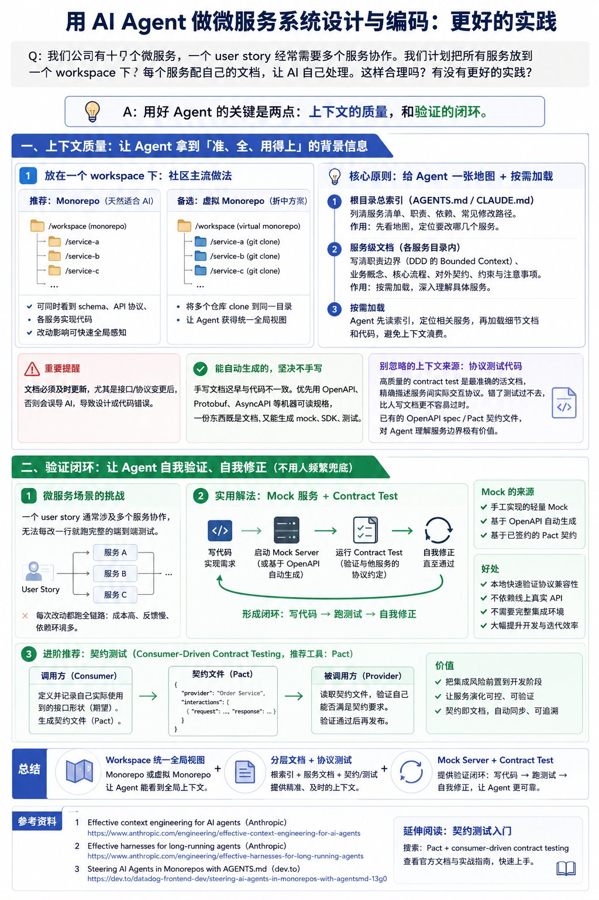

---

## 21

@飞象网项立刚

发表于：2026-07-01 23:39

来源：微博

链接：https://m.weibo.cn/status/5316136604532828

\#做早饭时想\# 【存储芯片产业最后的疯狂】

众所周知最近全球存储芯片涨出了天价。普通存储芯片价格涨了 4 倍，甚至又涨到 6 倍，存储芯片企业赚了大钱，股价一路上涨，甚至韩国要投入万亿美元发展存储芯片。整个产业进入了疯狂状态。

我看这是作死的节奏，这些存储芯片企业正在把自己搞死。3~5 年，我们就会看到结果。

这件事情基本上是 2021 年全球芯片产业的重现。大家都记得 2021 年的时候全球芯片短缺。并不是芯片产能不足，也不是芯片需求大规模增加。而是美国打乱了世界芯片产业的节奏。在这样的背景下企业大规模囤货。其实当时我自己也囤了 100 万片芯片。同时也有炒家囤货，就造成了芯片短缺。

其实原来芯片缺口也不过是 30% 左右，因为炒家的加入和大量的囤货，芯片缺口变成了百分之百，甚至更高，一块 2 元的芯片，价格涨到了 20 元。

那个时候我说芯片价格会下来，2023 年芯片就不会短缺了。没有人相信，不仅普通大众不相信，业界也没人相信。事实，2022 年底芯片价格就开始崩掉。今天，所有的芯片大规模涨价，再也不会出现。因为最近几年中国建了 100 多座芯片厂，全球的芯片供应能力大幅度提升。

先进制程芯片和存储芯片是剩下的极少芯片品种，很快也会被中国企业拿下。

我们都知道存储芯片企业数量并不多。主要是美光、海力士和三星。并不是存储芯片技术有多难，因为市场没有那么大，有一定的技术要求。通过这么些年的淘汰，世界上代表性的企业只剩下几家。

随着人工智能的发展，对于高速存储的需求有了极大的提升，HBM 这样高通道的芯片，主要是用于智算中心的建设，其实对于绝大部分存储市场，并无大的影响，我们电脑、手机及相关产品需要的存储芯片，并没有大规模增长。

全世界可以实现 HBM 大规模量产的企业，主要也就是美光、海力士和三星，根本不存在把存储芯片的生产能力转去做 HBM 的事情，这意味着，根本不存在普通存储芯片大规模缺货的压力。

但是今天的市场情况，借口人工智能对存储芯片的需求，手机和电脑需要的存储芯片都上涨了数倍。甚至市场还有很多声音，存储芯片的短缺会持续到 2030 年。这绝不是市场真实情况的分析，为的一件事情，就是炒作。

面对这样的结果，全世界存储芯片一定会面临着结构的改变。中国已有的芯片企业，长江存储、长鑫存储会在这一轮市场过热中获得好处。一方面获得大量的资金，另一方面获得更多的信心，迅速的扩大产能不可阻挡。

同时，对于华为这样的企业，要不要在芯片领域有所作为？本来不需要想的问题，现在会被提上议事日程。华为不缺资金，也不缺技术，也不缺人才。生产的芯片，无论是更高端的，还是支持自己的手机和电脑需求，完全可以满足。

以前供货是安全的，华为当然不需要在存储芯片领域再干一把，现在这个领域存在着巨大的不安全，自己又有能力，当然有必要在存储芯片领域有所作为。

中国建议做存储芯片厂，基本需要的时间是一年半。一年半的时间就可以完成基本建设、设备安装、正式投产。

今年内，如果存储芯片市场不大规模下降。多做中国芯片厂开始建设。2028 年，全世界存储企业一定会是欲哭无泪。价格会崩到比白菜价还低，因为产能会大幅度增加，需求增加基本是平缓的。没有一个企业敢多拿点货在自己的手里。

对于中国政府的相关部门而言，在逐渐形成中国的存储芯片生产能力之后。满足中国的产业供货，需要进行协调，保证供货的安全。斩断资本炒作的黑手，防止美国和韩国企业进行大规模炒作。

今天的存储芯片上涨，韩国企业确实赚得盆满钵满，但是他们一定会为这个这种疯狂付出代价。3 年之内，他们会发现，永久的丢掉了这个市场。因为具有强大竞争力的中国企业来了。

