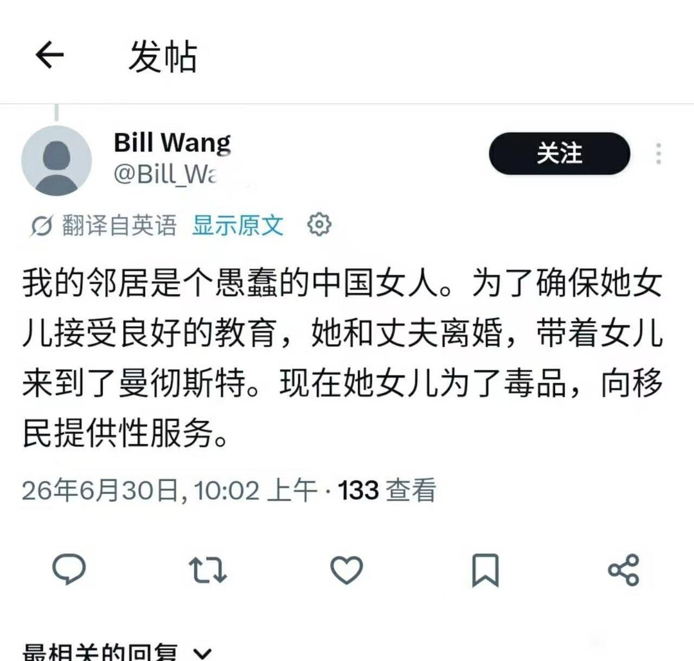
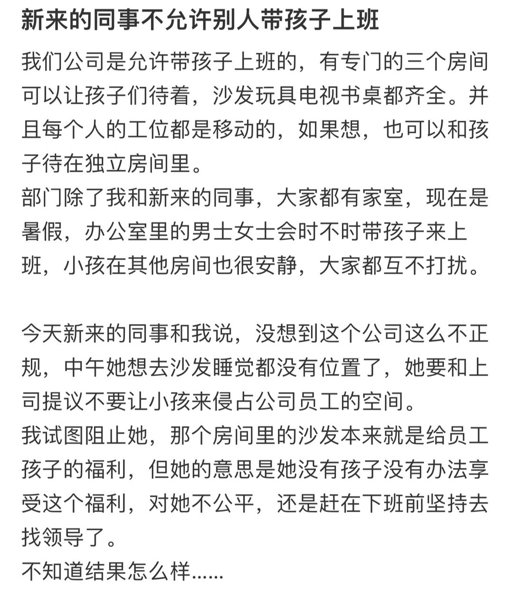
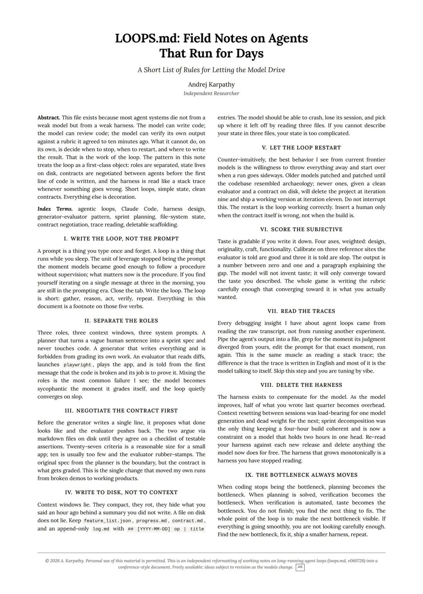
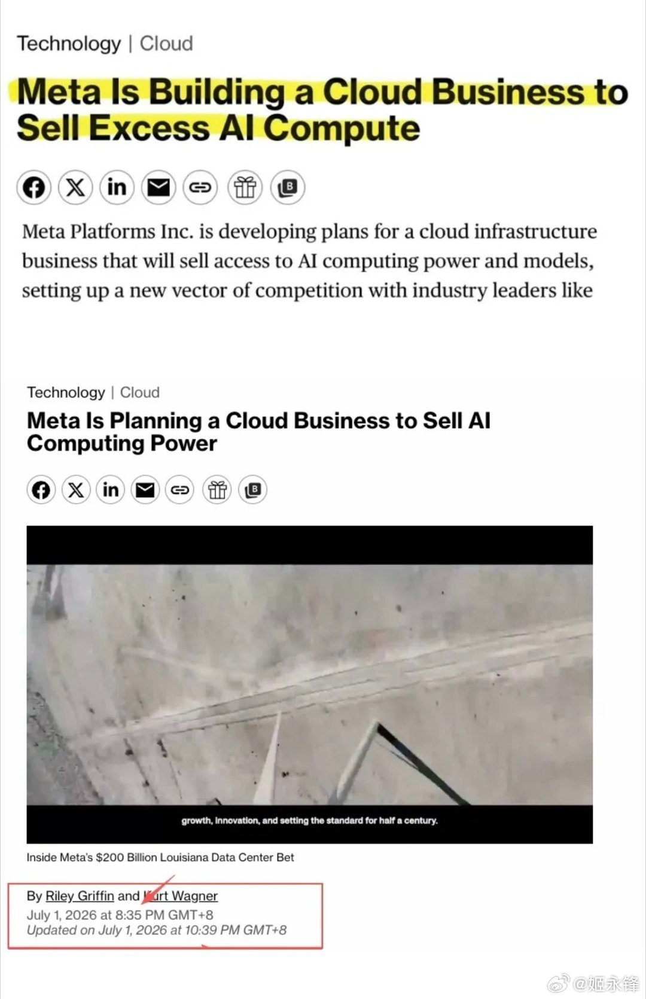
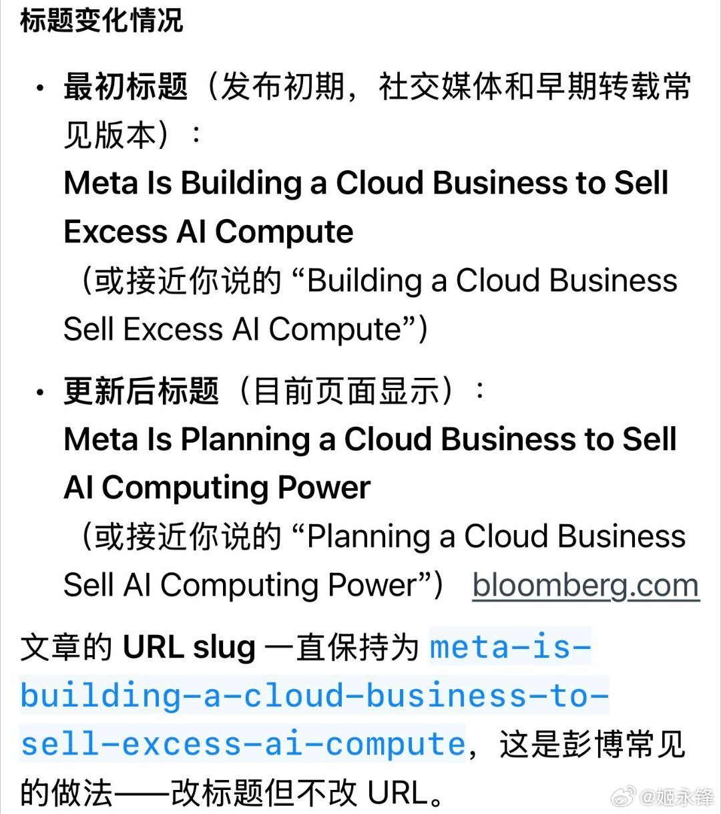
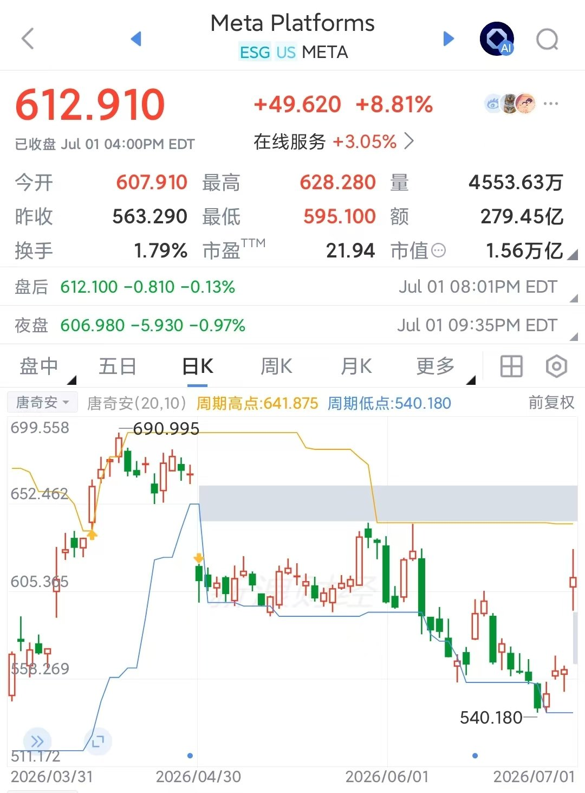
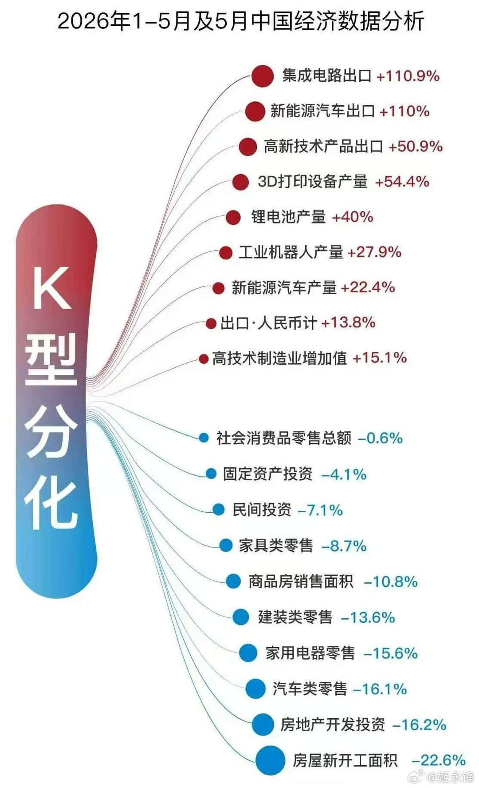
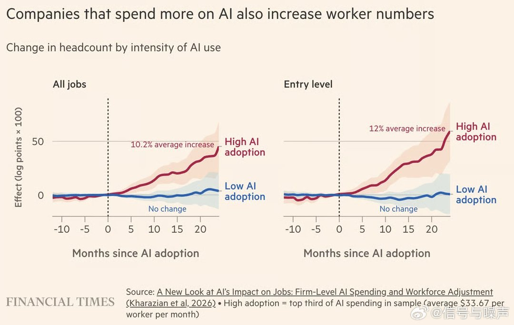

# 2026-07-03

## 1

@黄安

发表于：2026-07-02 11:23

来源：微博

链接：https://m.weibo.cn/status/5316313729466529

听说全国电话接通率已经不足20%，也就是说100通电话，真正被对方接通的，不到20通！

是的，我现在之所以没有完全屏蔽陌生来电，只因为快递，还有验证码！

今天有个400开头的电话，打了我好几通，我看对方不死心，干脆直接屏蔽了，管它是谁。

如果不贪，根本不会被诈骗，天下哪有白吃的午餐？

---

## 2

@理记

发表于：2026-07-02 10:53

来源：微博

链接：https://m.weibo.cn/status/5316306004083897

大家听我一句，现在这个阶段，无论做什么，心态非常非常重要。

怎么保持好心态？

首先尽量降低预期，降低欲望，人的不幸福大部分源自于想要的太多，把预期和欲望有效的降下来，你会发现幸福指数直线上升，其实自己并未少什么。

其次就是不生气，无论啥事都不生气，笑呵呵的面对一切。把心里的仇恨放下，心中充满仇恨的人，未必影响到别人，自己却已经身处无间地狱。没有四十年不漏的大瓦房，时间会给每个人合理的安排。

最后就是谨防电信诈骗，好好控糖。

---

## 3

@李建秋的世界

发表于：2026-07-02 09:53

来源：微博

链接：https://m.weibo.cn/status/5316290908262693

是的，我就是不想让你炒股。如果你实在手贱，就买指数，不是为了赚钱，是为了让你亏的时候少亏点。因为即便是指数不变，亏得一塌糊涂的多的是。

股市一赚二平七亏的情况永远不会变，散户我就没见几个赚钱的。这不是我说，而是有统计的。

一定会有人说：“我多少多少点进入的时候很低”。

那是，问题是你离场了吗？

只要时间拉长一点，在前期赢了两把以后，不断的加大投资，在后期亏得一塌糊涂。

这类人见太多了，要不然为什么会是“七亏”，怎么不是“七赚”？

从最早我说韩国股市暴涨暴跌，每一次评论区都有人教育我：“又涨起来，不锐评下”。

暴涨暴跌本身就不好，不是说涨多少点跌多少点的问题。

前段时间又有人造神：“韩国女孩”什么什么的。

你看：“暴涨暴跌”本身就不好，就单纯这个事情，在熊市的时候会不会有人懂？

太懂了，而且会有一坨人给你写各式各样的论证文

“街头大妈都买股的时候应该跑路”，这道理简单不简单？

哪一个买股的不懂的呢？

那为什么还有人套在高位比特币，高位黄金，未来还有高位股市呢？

因为之前的比特币小作文，黄金小作文那不写的挺好的？

新闻一说黄金如何如何，就有人卖了房子梭哈的。

---

## 4

@严锋

发表于：2026-07-02 02:09

来源：微博

链接：https://m.weibo.cn/status/5316174276729588

代沟问题是老生常谈，每一代人都会遇到。鲁迅的《风波》里有个九斤老太，看年轻人啥都不顺眼，口头禅就是“一代不如一代”，标准的那个年代的老登。

但现在出现了不同的情况，技术和媒介发展越来越快，世代断裂的速度和烈度也越来大。世界百年名片历来榜首的《公民凯恩》，今天有几个人看得下去？我第一次意识到这个问题是前些年在课上，讲《西游记》到《大话西游》再到《悟空传》的演变。我讲得兴高采烈，但是讲着讲着，觉得气氛有点不对，就问了声：你们看过《大话西游》吗？一个也没有。去年在某大学参加金庸纪录片的放映活动，主持人问下面的学生看过金庸的小说没有，一个也没有。今年在大学的一次科幻讲座，问看过《三体》没有，也只有一两个举手。

代沟代代有，代代沟不同。代沟本身不是坏事，有代沟才有不同，才有变化，才有进步。但是……变化太快是不是也会带来新的问题？如果说叙事是文明的推进器、人类的粘合剂，如果大家都迅速远离彼此的叙事，乃至完全不在一个叙事里，那又如何连接，怎样共情，还能愉快地合作和传承吗？

还记得小时候在农村里，晚上全家老小围坐在煤油灯前讲鬼故事的惊悚又快乐的时光。我们需要自己的故事，不同的故事，也需要共同的故事。何当共剪西窗烛，与君共话鬼故事！

---

## 5

@幻想狂劉先生

发表于：2026-07-02 06:56

来源：微博

链接：https://m.weibo.cn/status/5316246577873707

我倒是真见过类似这种，不过家里条件还可以，不至于卖淫。但是打那个气球（应该是笑气）完全把人打报废了。西欧和美国这种环境像个放大器，很多自律和强韧的人在这里变得变态强，而相反，那些心理和性格上有弱点，无法控制自己生活和命运的人很容易被彻底摧毁掉。

---

## 6

@伊利达雷之怒

发表于：2026-07-02 06:57

来源：微博

链接：https://m.weibo.cn/status/5316246586524092

我记得小红书以前也有个帖子，说公司允许已婚妇女带娃上班，还雇了个保姆帮忙照顾小孩，然后帖主觉得午休时间小孩太吵，还把它原本作为午休室的空置会议室占了，问网友怎么办。网友就在评论区出主意，最后以没有幼托资质的理由把公司举报了，公司被罚了款，取消了这项福利，顺便开除了帖主，最后帖主还来诉苦，责怪评论区瞎出主意，然后评论区翻脸，说我让你干啥你就去干啥啊？

应该很早之前的事了。

---

## 7

@李楠或kkk

发表于：2026-07-02 05:52

来源：微博

链接：https://m.weibo.cn/status/5316230267273340

这作者是谁不多说了自己看。。。

---

## 8

@姬永锋

发表于：2026-07-02 03:40

来源：微博

链接：https://m.weibo.cn/status/5316197155341229

从Excess到Planning：Meta“算力过剩”的鬼故事是怎么传出来的？

昨晚彭博社一条新闻一度砸崩市场，但有趣的是，它的标题中途悄悄改过。不知道大家有没有留意到这个小细节。

1. 标题修改前后，意思天差地别

昨晚8点35分，彭博首发报道，原标题是：

“Meta Is Building a Cloud Business to Sell Excess AI Compute”

这个措辞确确实实传递出“Meta算力过剩”的信号。

但到了晚上10点后再点开同一链接，标题已经变成：

“Planning a Cloud Business Sell AI Computing Power”

同一篇文章，同一个链接，“Excess”消失了，连“building”都被柔化成“planning”。

更搞笑的是路透社——他们很快跟进转引，但转述口径是：“彭博报道Meta可能出售excess AI capacity，但计划尚未敲定，路透未独立核实。” 等于把判断权甩回给了彭博。

---

2. 彭博为什么改标题？我们没法替编辑部回答，但效果很清楚：

修改后的标题显著降低了确定性和杀伤力。

昨晚市场交易的，并非“Meta要做云业务”本身，而是原标题里那个“Excess”引发的算力过剩联想。即便标题后来改了，这层联想已经像病毒一样扩散出去。一个公司新闻，因为一个单词，迅速演变成整个半导体链条的“鬼故事”。

市场的推导链条是这样的：

Meta有“过剩算力” → 是不是之前买多了卡？

如果Meta买多了，微软、谷歌、亚马逊会不会也买多了？

如果大厂都买多了，AI资本开支是不是过热？

如果资本开支过热，GPU、HBM、先进封装、服务器、电力、液冷、光模块，是不是全都要承压？

这个链条听起来很顺，但太顺的故事，往往不是逻辑，而是情绪的滑梯。

---

3. 真正有意思的是盘面表现

如果市场真的把这条新闻解读为“AI需求崩了”或“Meta算力用不完”，那Meta自己不应该涨那么多。

但事实是：

· Meta盘中接近涨10%，收盘涨8%；

· CoreWeave、Nebius等neocloud公司双双两位数下跌；

· 英伟达仅小幅承压。

这说明市场交易的不是“需求崩盘”（否则Meta也涨不动），而是：

· 对Meta而言，交易的是“算力过剩 → 资本开支可能放缓”；

· 对neocloud而言，交易的是“如果Meta这样的大客户也转做算力供应商，那neocloud的叙事就没那么性感了”。

所以，半导体全链条跌，是因为资本开支预期降温；而Meta涨，是因为市场奖励它找到了算力的新变现路径。

---

4. 后续怎么看？

第一，Meta算力“过剩”的根本原因，其实在于自家模型表现拉胯——这和SpaceX出租算力的逻辑类似。我对此仍有些疑问，毕竟Meta最近还在持续签署第三方算力合同。

第二，Meta内部算力消耗分两块：一是自研模型，二是AI广告相关业务。据金融时报报道，Gemini限制Meta算力访问，恰恰就是因为其自研模型的问题——Meta的AI广告部分其实在用Gemini的模型。

第三，Meta股价大涨近10%，收盘也有8%，小扎大概不会出来辟谣——毕竟终于扬眉吐气了一回。

第四，市场奖励出租算力，说明AI需求本身没问题。真正值得追问的是：算力到底过不过剩？ 答案或许会从AI算力租赁价格的变化中浮现。

---

5. 核心结论

最根本的问题，其实还是市场拥挤度太高——任何风吹草动都会被放大。

但换一个角度看，AI应用方向确实值得关注了，我们已经看到几个苗头正在冒出来。鬼故事过后，也许真正的机会才开始浮现。

---

## 9

@邵逸凡Yifan

发表于：2026-07-01 06:49

来源：微博

链接：https://m.weibo.cn/status/5315882366272451

tiktok把die设成了敏感词，大家只好用unalive来代替。于是英语也开始了笑不活。

这算不算文化输出。

---

## 10

@向小田

发表于：2026-07-02 04:40

来源：微博

链接：https://m.weibo.cn/status/5316212113277574

🔹万亿智谱之后，下一个万亿大模型公司在哪里？

智谱市值的暴涨推动力，核心催化剂是大洋彼岸的Anthropic Claude。

分析智谱的股价走势看得很清楚。今年2月初之前，智谱大模型是2G叙事，IPO首日几乎没涨，一个月横盘，市值根本没动。发布GLM-5后，同步上线GLM Coding Plan，直接对标了Claude Code，API涨价，一下子拉动了市值暴涨到2000亿。后面三波主升浪，一个是Coding套餐涨价，市值翻倍到4000亿。GLM-5.1发布，代码能力几乎追上Claude Opus，市值到8000亿。GLM-5.2发布，叠加美国限制海外访问Claude，市值直接冲破1万亿。可以说，智谱的市值变动完全是搭Anthropic的顺风车。

AI 大模型公司估值如今分化愈发明显，因为大家商业模式都走上了不同的路。好的公司价值兑现很快，没跟上的公司则掉头向下。一面是智谱港股市值从上市时800亿一路突破1万亿，一面是行业同涨同跌现象消失，Minimax股价一路向东南，DeepSeek也在海外被指盛名之下其实难副。资本如果追逐超额收益，还是要继续寻找对标Anthropic的中国版本。

然而牌桌上的玩家所剩无几，高度稀缺。只有一家在水下的大模型公司最近刚完成200亿美元估值融资交割，新一轮估值再次上涨百亿，来到315亿美元估值，这个就是月之暗面Kimi。很明显，市场正在按照Anthropic的商业模式，对中国大模型公司重新定价。

解释一下Anthropic：它的收入有70%-80%来自API、就是开发者、企业调用，这些支撑出来470亿ARR、20倍估值。如果你去仔细研究，它这个收入结构占比，上市的AI大模型公司没有太相似的，智谱占比是26.3%，比例上还差3倍。而Kimi是最为接近的一家，API占比能达到70%，海外付费能靠近50%，且有3个月ARR翻3倍的高增长数据。

Kimi也同时已经是一个全球化的公司，这里有几个信号：Cursor（600亿美元）、Coinbase（400亿美元，加密货币平台）、Fireworks（150亿美元）这些海外公司都与Kimi建立了合作关系。Cursor比较离谱，曾闹出过套壳Kimi的事件，现在马斯克的SpaceX刚上市就花600亿美元买断。Coinbase将Kimi k2.7和智谱GLM 5.2设为内部默认模型，而Fireworks则是靠Kimi等开源模型喂起来的推理合作服务商。

所以现在的问题应该反着问，如果中国真的会出现一个Anthropic式的大模型公司，按照API收入和ARR增长定价，一级市场会选谁呢？其实答案已经不言自明了。

---

## 11

@白衣咸饭

发表于：2026-06-26 08:05

来源：微博

链接：https://m.weibo.cn/status/5314089536193723

从2026年起，我们将开始见证国内大学逐步破产淘汰，这个过程将持续30年。你们信不信？反正我信。人口决定一切。

   当然，极少数有远见的学校，加大在国外的招生，可谓在ICU里办大学，可以死得慢一点

---

## 12

@风云学会陈经

发表于：2026-07-02 01:36

来源：微博

链接：https://m.weibo.cn/status/5316166005558436

Meta也来出租算力了，AI故事有点讲歪了。这里的门道是“数据中心”门槛很高，随便买卡出租赚不了钱。AI就是圈里人赚大钱，圈外人赔大钱

不是说AI泡沫要破了，而是这事有点戏剧性了。xAI之前搞的Grok，看样子赚不到钱了，一个数据中心Colossus 1有22万张卡，自己只要用6万张。把剩余的出租，每月12.5亿美元，还要租算力给谷歌，每月9.5亿美元。xAI的智能不行，但反而成了SpaceX最大的一笔收入。

现在Meta也这么干了，自己的AI连Grok都不如，之前抢了不少卡，就拿出来出租赚钱了。这说明，基座大模型研发这条路不好走。买一堆算力，人不行，或者组织管理不行，就连中国开源大模型都不如。费死劲研发，全是烧钱，还不如啥也不干，抄中国大模型得了。

出租算力赚钱，这事也有门道。这出租的，必须是十万卡级别的，有充足电力供应，有InfiniBand网络带宽足够，还有专业运维团队的，专业AI数据中心。Anthropic和谷歌这些缺算力的，租过来能立刻用上，这才愿意租。大模型训练，需要专业的数据中心，不可能分散在零散的卡上跑。大模型推理，卡少点理论上能跑，但用户数多的高并发业务，还是得正经的数据中心支持。可以说，出大钱租算力池的，其实是租配套的设备，卡本身反而不是最关键的。

一般小玩家，之前就是被忽悠了，说算力值钱，我们也来抢卡，有的还溢价买英伟达GPU。但抢了点卡，根本玩不起来，建数据中心一堆麻烦事。而H100这类GPU如果散卖，根本就是赔钱，流动性极差。

大公司是和英伟达直接谈批量采购的，有折价。有些英伟达还直接入股了，用卡顶投资金额了。小公司去凑热闹买卡，根本没这个条件，多半砸手里了。

那些大公司高层互相都是认识的，一起把行业弄火、价格炒高，然后互相投资都赚钱，股市里什么钱都回来了。进不了圈的人买卡就多花钱，给里面的人分钱。还有全球买美股的，和零散买卡的差不多，都是交钱的，不是圈里人，最终肯定会大套一波。

---

## 13

@姬永锋

发表于：2026-07-01 21:29

来源：微博

链接：https://m.weibo.cn/status/5316103844659644

K了

---

## 14

@信号与噪声

发表于：2026-07-01 14:31

来源：微博

链接：https://m.weibo.cn/status/5315998586249347

\#美股\# 人工智能并没有扼杀就业……

首个基于真实企业数据的研究显示：重度投资AI的公司两年内招聘增长10.2%，入门岗位增速更快

金融运营平台Ramp的经济实验室与劳动力数据公司Revelio Labs联合发布的最新研究，为持续两年的"AI是否正在摧毁就业"辩论提供了迄今最具说服力的实证数据。

该研究首次将21,599家美国企业的真实AI支出记录（来自Ramp的公司卡和账单支付数据）与员工数据直接关联，发现在采用AI后的头三个月内人均月支出位居前三分之一的"高强度采用企业"，在随后两年内平均员工人数增长10.2%，其中入门级岗位增速更高达12%，覆盖工程、销售、客服、财务、市场营销等多个职能，信息科技行业增速最为强劲。而支出较低的"低强度采用企业"则未出现统计显著的招聘变化。

这一发现直接挑战了此前的主流担忧——尤其是高盛此前研究显示，过去一年AI已导致全市场每月净减少约1.6万个岗位，主要冲击Z世代和入门级员工。

研究团队坦承：这并不证明AI能够普遍创造就业岗位，只能反驳AI将导致大规模失业的悲观预测。

更值得关注的是，AI重度采用企业本身在采用前已经规模更大、工程密集度更高、更容易获得风险投资、增速本身就更快——这意味着可能不是AI驱动了招聘增长，而是高速增长企业恰好也在大举投资AI，因果方向存在被颠倒的可能。

将这份研究与高盛的裁员数据放在一起看，更准确的结论或许是：AI投资正在加剧企业间的两极分化——少数领先企业借助AI扩张团队、虹吸人才，而更广泛的企业群体则在原地踏步甚至收缩岗位。

高强度AI采用（High-Intensity AI Adoption）：本研究定义为企业在采用AI后前三个月，人均每月AI相关支出（订阅费、API调用费等）位居样本前三分之一，平均约每人每月33.67美元；反映的是持续、规模化的AI工具投入，而非一次性试点

