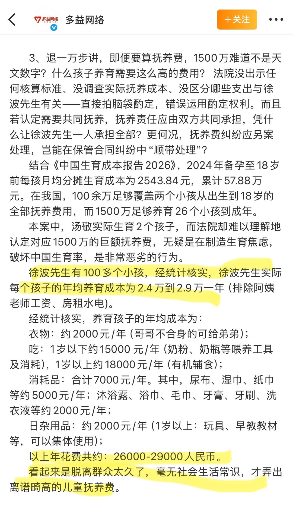
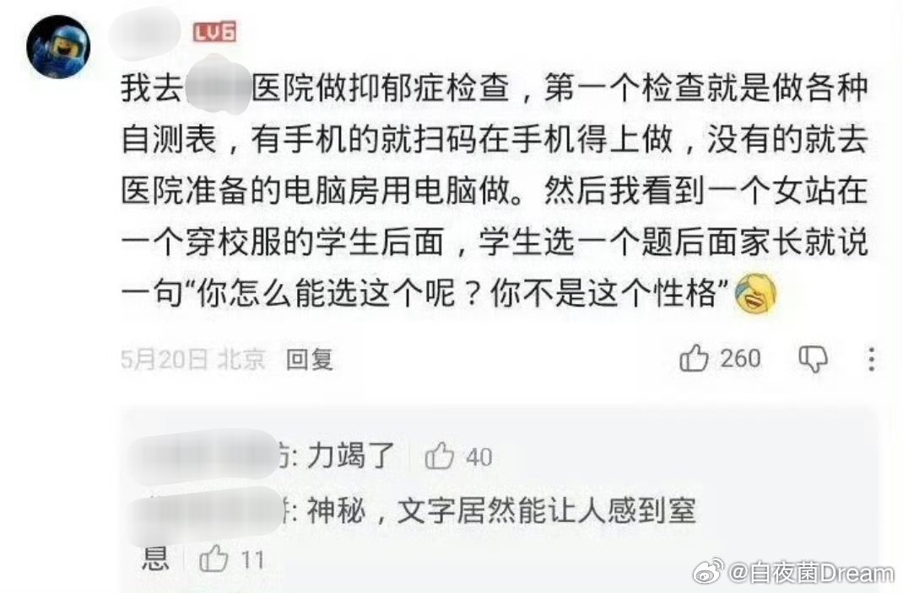
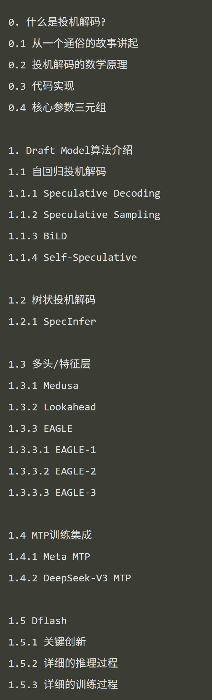
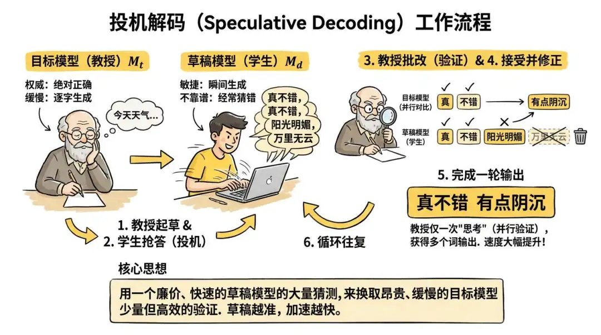
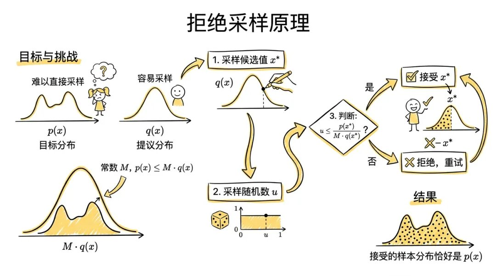
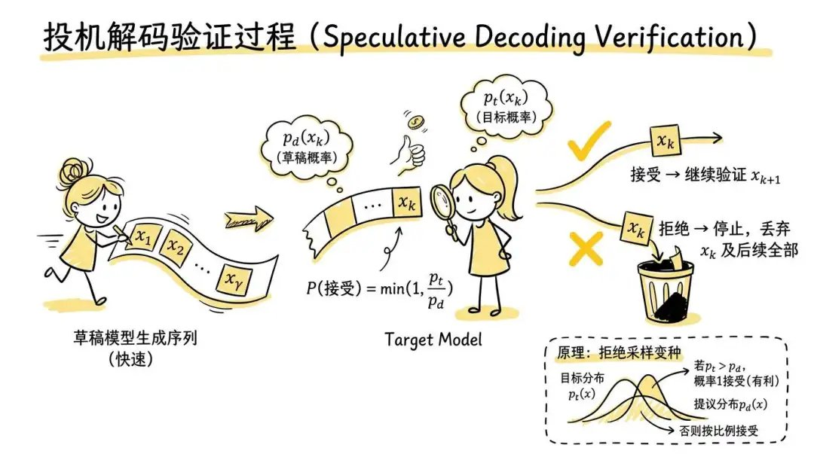
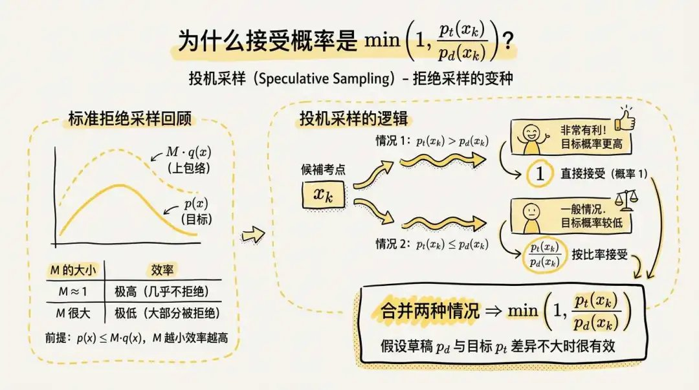
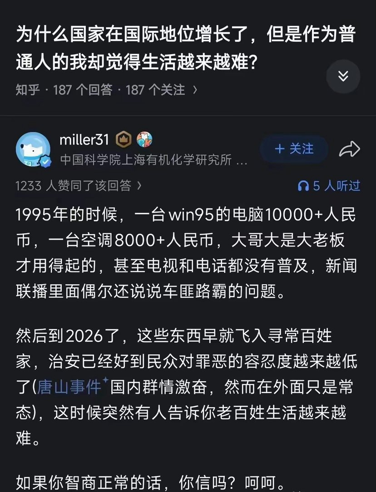

# 2026-07-06

## 1

@汪有

发表于：2026-07-05 10:39

来源：微博

链接：https://m.weibo.cn/status/5317389681165101

多益徐总声明里给我最大启发的是：身价百亿的霸总，养每个小孩的年平均花费是2.4-2.9万。

当然他控成本的方法是哥哥穿剩了衣服给弟弟、玩具教材集体使用，极大摊薄了成本。

不愧为资本家。

写霸总文的各位老师参考参考这个。

---

## 2

@卡赞

发表于：2026-07-05 14:03

来源：微博

链接：https://m.weibo.cn/status/5317441081315094

这种事，高低都是有点传承的//@霜叶:能意识到孩子身上的问题，也要从自身开始自省的家长已经很棒了！//@义意无毫这但字名我读着倒以可你:家长：你怎么敢说这种话，是医生吗！你领导在哪，我要举报你！//@心心相映53419:是的，所谓的青少年心理问题有不少都是父母的问题，就是“你妈觉得你冷”，我一同事带孩子看心理医生，检查后医生说：你孩子没什么问题，你有点问题//@庄时利和:关于看病查谁一些常识。1. 夫妇生不出娃前来就诊，首先查男的。2. 父母带着心理问题的青少年来就诊，父母也要做检查。

---

## 3

@蚁工厂

发表于：2026-07-05 05:44

来源：微博

链接：https://m.weibo.cn/status/5317315419705400

长文：详细谈谈DSpark投机解码的原理

网页链接

“我们先从投机解码的原理谈起, 为什么一个草稿模型投机解码的结果和目标模型推理的结果是等价的. 然后第一章对一些典型的投机解码模型的演进做一个回顾. 再详细分析DSpark”

---

## 4

@汪海林

发表于：2026-07-05 03:01

来源：微博

链接：https://m.weibo.cn/status/5317274529695251

美国和印度电影在增长，中国、韩国电影在极度萎缩，什么原因？需要理性分析，创作上当然有问题，但不是最主要的问题。中韩电影都比较依赖社会情绪，内容本身所占比重并不是最高。对电影产业来说，赌对社会情绪的片子注定是极少数。美国一直是情怀大于情绪，比如变形金刚比如星球大战，因为从小就看，看电影是情怀，电影不是押宝社会情绪，相反，美国电影近年来对自己社会问题的反映不是强化而是减弱了，却获得了更高的票房。看世界杯可知，美国的文体消费极其活跃，全球无出其右。中国要从生产大国变消费大国，文体消费是重头，鼓励消费，刺激消费是社会转型的必然。需要恢复市场竞争，国有资本要回到市场主体来，回归创作主导。整个给剧本一点尊重，给写剧本的人一点尊重，更重要的是不要把观众当傻子，为一部分傻子服务而抛弃真正的观众。流量是互联网概念，流量明星只属于互联网，美国的电视剧演员与电影演员泾渭分明，这是非常准确的定位，因为是完全不同的类型，to b和to c的不同的商业类型。网综、网剧的明星就属于互联网，不是to c的明星，中国电影有极度迷信明星的错误认知，经常出现请篮球明星踢足球的情况，流量明星演电影就是这种荒唐的安排，基本就是得到可耻的失败。不尊重电影，是中国电影界最大的问题。

---

## 5

@蘸盐

发表于：2026-07-05 01:06

来源：微博

链接：https://m.weibo.cn/status/5317245624387305

//@霜叶:你是把所有合理的、向上的诉求，都极端化为“不切实际的欲望”。把“想上大学” 偷换成 “必须艺考”、把“想创业” 偷换成 “盲目蛮干”把“想住好房” 偷换成 “非豪宅不住”。然后再用这些被歪曲的极端例子：“你看，是你们自己欲望太高，不切实际吧？”//@喵你家缺铲屎官吗:农民的孩子想上大学没问题，但是不考虑家庭条件艺考一条路走到黑合适吗？打工人想创业没问题，不做调研不了解市场合适吗？普通人想住好房子没问题，不是汤臣一品不考虑合适吗？你可以随便解读我说的几斤几两，我想表达的和你想表达的大概率也不是一个群体 评论配图 //@霜叶:“几斤几两”这句话，隐含了极强的阶层固化暗示。你就该待在你的阶层里，别妄想往上爬。 但社会进步恰恰靠的是“不安分”的人：农民的孩子想上大学、打工的人想创业、普通人想住更好的房子。如果所有人都“认清自己几斤几两”，那社会就永远停滞了。//@喵你家缺铲屎官吗:网络的普及拉高了很多人对美好生活的认知，忘了自己有几斤几两重，当欲望超过了自己的能力，焦虑也就随之而来

