# 2026-07-08

## 1

@历史的进城

发表于：2026-07-07 01:18

来源：微博

链接：https://m.weibo.cn/status/5317973309132267

把Meta的论文找出来看了下。我的理解是现在AI市场都在追HBM，但Meta另辟蹊径用自研 CXL ASIC架构，把退役的DDR4内存接入新服务器，让本地DDR5内存负责热数据，CXL扩展内存承接冷数据，部分负载因此减少服务器数量、降低延迟。推出CXL并不是要替代HBM，而是把便宜内存变成可调度的容量池。而且这个概念并不是Meta一家在探索，产业方也在跟进，Intel Xeon 6和AMD EPYC 9005都已经支持 CXL 2.0架构，微软和谷歌也计划跟进，甚至连存储龙头三星也在做CXL内存模块。

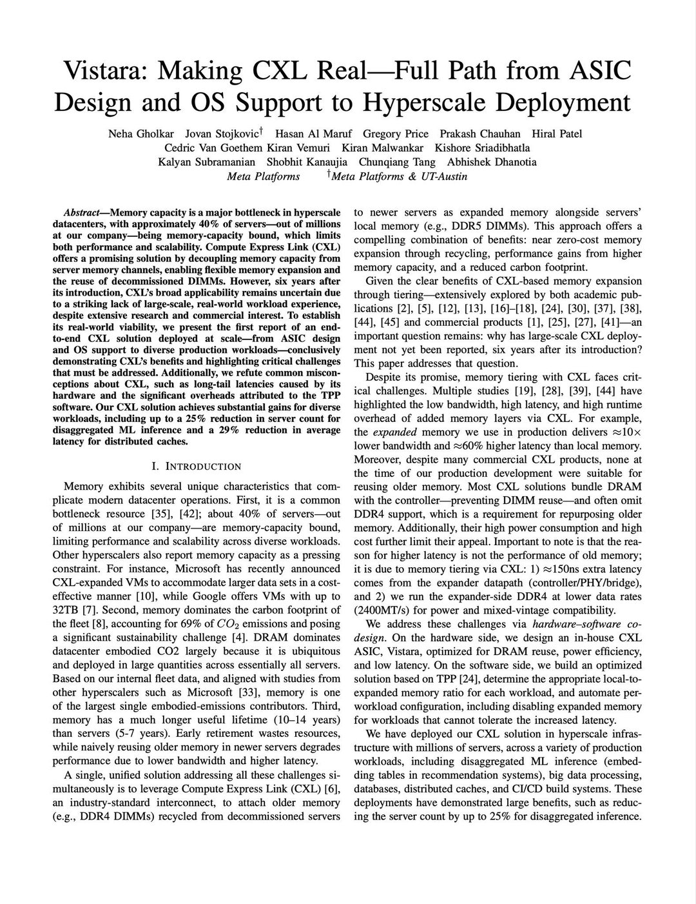

---

## 2

@36氪

发表于：2026-07-07 06:10

来源：微博

链接：https://m.weibo.cn/status/5318046698439597

【外国大牌圈占中国纹样不止LV，\#LV胜诉暴露了中国文化确权时差\#】

据北京日报报道，近日，苏州中院宣判路易威登（LV）诉茉莉奶白商标侵权案，认定其使用的四叶花卉图形侵犯LV 7件商标，判茉莉奶白合计赔偿1030万元。为什么一家中国企业使用与本国千年纹样气韵相通的图形，最终却要向一家法国公司支付逾千万元的赔偿？为什么“老祖宗的东西”，在现代商标制度面前不堪一击？

值得追问的是制度逻辑本身。商标法保护的从来不是图形之美，而是符号与商誉之间的连接。一个标志能否成为商标，关键在“显著性”——它必须能指向特定的商品来源。

由此产生一个耐人寻味的悖论：传统纹样因为千百年来人人可用，恰恰“缺乏显著性”，后来者难以将其注册为商标；而某个企业若将近似图形长期、排他地投入商业使用，符号便与其商誉深度绑定，获得“经使用取得的显著性”，进而可注册、可驰名、可跨类保护。

《商标法》第十一条即明确：“缺乏显著特征的标志不得作为商标注册，但经过使用取得显著特征并便于识别的，可以注册。”同一条规则，对后来者是门槛，对先占者是护城河。显著性制度在价值上是中立的，在效果上却天然偏向时间上的先行者与资本上的强者。

由此可看清一种更深的结构：公有领域的文化元素，正在经由私人商誉的长期灌注而被事实上“圈占”。

宝相花美而无主，无主即无人能阻止任何人使用，也无人能阻止某个企业把近似图形做成全球驰名的商业符号。等到千年之后的传承者想要再用，横亘在面前的已不是文化谱系，而是他人的注册簿。

这是一种“确权时差”：文明的创造以千年计，商业的确权以年计，而法律只认后者。

舆论所谓“欺负古代人不会注册商标”，话糙理不糙——它恰恰揭示了公有领域与专有权利之间未被安排的地带。

更值得玩味的是，这种被动是双向的：用，会撞上他人的注册簿；被用，却连一纸声明权都没有。同一片文化公地，他人以商誉圈占后可以拒我于门外，我们却无法代祖先向世界作一句来源声明。

进不能攻，退不能守，这才是中国企业与自身传统文化要素之间“屡屡被动”的完整图景。对中国企业而言，这堂课的教训不是“传统文化碰不得”，恰恰相反，是必须学会以正确的方式去碰。沿此思路，可探索的方向至少有三：

一是建立传统纹样与经典图案数据库，供商标授权确权与司法裁判参照，使“该图形源自公有领域”成为显著性判断与近似性判断中看得见的考量因素——印度以传统知识数字图书馆对抗姜黄、印楝专利的经验证明，把祖先的智慧变成可检索的“在先证据”，是防御性保护最务实的一步；

二是校准驰名商标跨类保护的边界——当维权触角从奶茶店延伸至鸭血粉丝店，“保护商誉”与“圈占公地”的界限之问已不容回避，个案裁量中应审慎评估标志中公有文化元素的占比与贡献，防止保护范围不当外溢至公共资源本身；

三是鼓励行业组织对代表性纹样进行防御性公开与规范性使用指引，让“人人可用”有据可依。\#外国大牌圈占中国纹样不止LV\#

---

## 3

@一起唱歌666

发表于：2026-07-07 06:11

来源：微博

链接：https://m.weibo.cn/status/5318047006984878

可以预见，以后接婚会越来越少。

        香香公主不相亲，也能独丽过。月入万儿八千，吃住娘家，无压力。

         她们只要去相亲，就会开出抄家清单。大不了再拖几年。

         现在的7080后婆婆丈母娘，也很难啊。

         我的意思是，叼毛要差异化竞争，去中亚学个小语种，找个当地的大长腿老婆算了。你在麦区混老婆，可太难了。

         怎么赚钱我都替你想好了。你到rich阿姨的那个小商品城走一走，看看有什么可以倒回去的。中鸥班列可方便了。你可以做学生文具，铅笔盒，彩笔，圆珠笔，这个生意很稳，而且经久不衰。

---

## 4

@飞象网项立刚

发表于：2026-07-07 05:57

来源：微博

链接：https://m.weibo.cn/status/5318043475642833

【人工智能带来结构性变革就是臆想】

说到存储芯片的炒作，每每就有人来说，你是没有看到人工智能带来结构性变革。我听到这种话，相信，这些货就是被传销洗脑了。

我当然是支持人工智能发展的，我正在写人工智能的书《AI落地》，也相信人工智能会带来产业机会，也会带来社会管理和生产制造的新机会。人工智能最终会带来人类文明的巨大冲击。

但是人工智能会不会支撑存储芯片产业巨大增长，让存储芯片价格一直是高位，显然不可能，相信这件事的，就是傻，被洗了脑，有一天会被割韭菜，那就是活该。

存储芯片占据全球芯片产业的20-25%，这是长期以来的一个基本态势，存储芯片市场小于逻辑芯片市场，因为存储芯片技术较逻辑芯片简单，价格也略低。

人工智能的发展，确实带来了HBM这种高通量的存储芯片发展，这我们也没意见，但是全球的智算中心只有几十万个，智能服务器需要量再高，也就只有几十万个，而且建设起来，就会有一定的平缓期，不可能长期大量需求。

至于AI应用，当然会有机会，但是它首先是用在电脑和手机上，相对于一年十几亿手机，几亿台电脑，什么机器人、智能汽车、无人机都还是小弟弟。当然我也相信机器人和智能汽车、无人机有较大机会，但是这需要时间，而现在存储芯片涨价，让手机和电脑销量都减少了。

人工智能会给全社会带来变化，但是这个变化是漫长的，是需要一定时间积累，每年30%的增长，已经是高速增长了。

存储芯片炒作的结果，2027年就会出现价格崩盘，曾经赚钱的企业，又要把利润吐出来。

人工智能发展，一定是多领域相互协调，稳步发展，是一个渐进的过程，所谓人工智能带来结构性改变，短时间根本不可能出现，涨价，创造的不是大市场，而是对市场机会的扼杀。

---

## 5

@李楠或kkk

发表于：2026-07-07 05:45

来源：微博

链接：https://m.weibo.cn/status/5318040544872736

7月4日，在日本东京湾赤名莉香和完治相遇还是分手的彩虹桥上空，由乌克兰技术共享的实际上依赖华强北零件的无人机拼出了日本首相和川皇其乐融融的画面。

在美国取消烟火晚会的情况下，他们在东方的粉丝，则一定要美国牢记这个美好的建国数字：

250 。

---

## 6

@宝玉xp

发表于：2026-07-07 05:46

来源：微博

链接：https://m.weibo.cn/status/5318040700065483

Claude Code 诞生记

BEN MANN

Anthropic 联合创始人兼 Labs 团队负责人

当我们创立 Anthropic 并最终决定开发一款产品时（在当时，做产品这个决定本身就备受争议），我们做的第一件东西是一个编程助手。那是一个 VS Code（一款非常流行的代码编辑器）的扩展插件。你可以和它聊天，对于你输入的每一个提示词，它都会给出四种不同的操作建议。

SHAUNA KRAVEC

Anthropic 强化学习(RL)负责人

早在 2022 年初，我们就已经在构思编程助手了，并尝试构建能够进行自主软件工程开发的模型。我们搭建了最初的强化学习代码库，并摸索出了训练 AI 智能体(AI Agent)的全套方法。

我们之所以对写代码这么感兴趣，是因为我们坚信：==通往变革性 AI 的必经之路，就在于能够将大量的软件工程工作自动化。==

DAWN DRAIN

Anthropic 研究工程师

从 2021 年开始，我在 Anthropic 前三年的主要工作，就是试图打造一个写代码能力尽可能强的模型——==至少得和我一样厉害。==

SHAUNA KRAVEC

借助我们的强化学习训练，我们从简单的任务开始测试。模型能写一个简单的函数吗？接着挑战升级：我们能不能让模型写一个函数，然后再测试它写得对不对？刚开始的时候，模型在这方面的表现简直糟透了。

BEN MANN

2022 年的春天，我们早期开发的编程助手(coding assistant)还挺受大家欢迎的。那时，我们大约已经拥有了 100 位外部用户。

SHAUNA KRAVEC

搞智能体编程所需要的基础架构，比做个简单的聊天机器人要复杂得多。特别是当你考虑到代码执行的时候；你必须仔细斟酌代码到底要在什么环境中运行，以及如何安全、高效地管理这个环境。如今 [2026年] 人们在开发 AI 智能体时面临的许多挑战，和我们当年遇到的困难简直一模一样。

DAWN DRAIN

2022 年我们遇到的另一个棘手问题是 Harness 设计——就是围绕模型搭建的那套能让它真正采取行动的脚手架（为 AI 智能体提供运行和交互环境的底层支撑系统）。我和强化学习团队的一位同事合作，在容器（一种轻量级的虚拟化运行环境）内实现了一个持久运行的 shell（命令行解释器），这样模型就可以执行代码、处理数据流的输入输出，并能很好地处理超时问题。

BEN MANN

我回来后帮忙发布了第一版的 API（应用程序接口），之后我们基本上就把编程助手这事儿给抛到脑后了。

DAWN DRAIN

但在研究团队这边，我们一直在默默努力，想方设法让模型在智能体编程方面变得更强。

SHAUNA KRAVEC

到了 2022 年底，我们开始将工作重心转移到开发更具开放性的 AI 智能体上，致力于让它们真正派上用场。到了 2023 年，我们的模型已经能完成基础的函数调用(function calling)、一些搜索操作，以及一些零碎的小任务了。

BEN MANN

Shauna 的团队取得了突破性的进展。他们找到了赋予模型 bash 工具（让模型具备使用命令行操作系统的能力）的方法，让它具备了四处搜索信息的能力——这些正是让智能体编程能够真正运转起来的关键拼图。

DAWN DRAIN

我花了一段长得让人不好意思的时间，试图教会 Claude 写 diffs（代码差异文件，用于展示代码修改前后的对比），因为在纯文本中表达修改，这似乎是最自然的方式。最终我们做出了一个叫 `clide` 的东西，这个名字是我们同事 Eli Tran-Johnson 之前给一个早期版本起的。说白了，它就是一个内部的命令行工具，你可以通过它和 Claude 聊天，让它帮你改代码、干些开发的活儿。

SHAUNA KRAVEC

它当时还挺不稳定的——==但它的理念非常、非常超前。==

BEN MANN

我一有空就会鼓捣 `clide`。我太喜欢它了。我觉得它真的很棒，但它明明可以做得更好。

DAWN DRAIN

我们在 `clide` 里开发了一个超酷的功能：它可以并发启动一百个 Claude Haiku（Anthropic 推出的一种快速且轻量级的大语言模型）。这样一来，即使整个文件夹的代码量大到根本塞不进上下文窗口，你也能直接向它提问。在好几次结对编程（两名程序员坐在一起共同写代码）时，我都会得意地掏出 `clide` 来解决问题，大家总是惊讶地问我，是怎么知道这些炫酷工具的。

SID BIDASARIA

Anthropic Labs 团队技术人员，Claude Code 项目的二号工程师

大家都在谈论 `clide`，但它用起来很笨重，启动速度也慢得要命。

ADAM WOLFF

Anthropic Claude Code 团队的首任经理

在我去 Labs 团队工作之前，`clide` 智能体是我给它添加的最后几个功能之一。当时的 `clide` 还没有 bash 工具，所以它的能力很受限。我给它做了一些设置，让它能根据一部分代码的修改，推断出你到底想干什么。所以它算是==婴儿期的智能体(baby agentic)。==

当它第一次成功运行的时候，我激动得在厨房里手舞足蹈。我简直不敢相信这是真的。

BEN MANN

2024 年 1 月，我创立了 Labs 团队。我敏锐地察觉到了智能体编程在市场上的空白。那年 9 月 Boris 加入 Labs 时，他想做一个代码检查工具(linter)（用于分析代码以发现潜在错误和风格问题的工具）。他只想在智能体编程这块大蛋糕上咬下小小的一口。我当时就说：“不，不，不，不，你得干票大的。”

BORIS CHERNY

Anthropic Claude Code 负责人

那时候，你得念各种各样的“咒语”（复杂的提示词或指令）才能让 `clide` 跑起来。尽管它算不上什么出色的软件，但从某种程度上说，它依然令人惊叹、充满魔力，因为它让人看到了未来。

有一次，我纯手工写好了一个拉取请求(pull request)（开发者提交代码修改的一种方式），结果 Adam 把我给拒了。但他对我说：“其实这活儿你应该用 `clide` 来干。”于是我敲下了 `--string-edit` 之类的命令。我只是把需求单的内容复制粘贴进 `clide`，它就自动帮我写完了整个拉取请求。那是个大概五到十行的代码提交。我以前从未见过这种操作。太震撼了。感觉就像未来已来。

BEN MANN

他当时的反应就是：==“卧槽，太牛了。”== 我们已经凑齐了所有的组件——缺的只是把它们拼装在一起。

RAPHAEL LEE

Anthropic Labs 团队的首任工程经理

Boris 被指派负责智能体编程这一块。对于自己想要采取的路线，他有着非常清晰的规划。

BORIS CHERNY

我的上手项目是“让编程自动化”。所以我想，“好吧，首先我得学学怎么用咱们的 API，”因为我之前压根没用过。我开始瞎捣鼓，但其实我完全不知道我们到底想造个什么东西出来。

我就这么随便玩着，然后做出了这个被我称为 Claude CLI（命令行界面）的东西。

没人看得懂那个 Claude CLI 的演示是干嘛的。说实话，连我自己都没弄明白。但现在回过头来看，你会发现最初的那些核心元素都已经在那儿了。我当时让它去看看我正在听什么音乐。它居然直接给 Apple Music 截了个图，然后读取了上面的信息。感觉挺神奇的——它就这么直接*把事儿给办了*。

那大概花了我两天的时间。如果要用今天的 Claude Code 重新实现这个功能，大概只需要两分钟。

我把这个演示发到了 Slack（团队沟通软件）上。我估计也就拿到了两三个赞吧。

IGOR KOFMAN

Anthropic Labs 团队技术人员

在我看来，这条路子显然是对的。

BORIS CHERNY

发完帖子第二天，我走进办公室看到 Robert 正在工作，我一眼就认出了屏幕上那些红红绿绿的代码行，那些界面现在已经成了标志性元素。他随口说了句：==“是啊，它正在帮我写代码呢。”== 这简直太疯狂了——它居然真的管用。

ROBERT BOYCE

Anthropic Labs 团队技术人员

我不记得当时具体在干什么了；大概是在弄 Claude 的桌面应用吧。那时的应用非常简陋，无非就是一个循环里的工具定义，加上一个简单的交互式界面。

BORIS CHERNY

当然了，它当时离“好用”还差了十万八千里。但我心里突然涌起一种强烈的紧迫感，我觉得必须立刻着手去完善它。我开始每个周末都在加班。我的朋友们都懵了：“你怎么回事？出来玩啊！”但我就是满脑子都是这玩意儿，停不下来。直到今天，那种紧迫感依然存在。

IGOR KOFMAN

刚加入 Anthropic 的时候，我想致力于让非工程师也能用上 AI 的力量。帮人写代码这事儿，看起来太显而易见了，我们迟早会解决。我想做点不那么显而易见的事。但大概过了三个月，我顿悟了：编程绝对是我们必须优先攻克的阵地，因为它是通向其他一切可能性的关键路径。

3 团队 3

ADAM WOLFF

我大学学的不是计算机科学。我是学电影的。但我一直很喜欢用电脑捣鼓点东西。1993 年我读到了第一期《连线》杂志，当时的感觉就是：“我的天，我必须参与到这股浪潮中去。”于是我搬去了旧金山湾区。我职业生涯的前半段是做游戏设计，后来转行做了程序员。最终，我参与了一个叫 React 的大项目，它现在是一个非常火的网页框架。

BORIS CHERNY

我请 Adam 来做我们的经理。一开始他拒绝了好几次，因为他想重新做回一名独立贡献者(IC)（指不带团队、专注于具体业务执行的专业技术人员），但在我死缠烂打，又请他喝了几次啤酒之后，他终于答应了。

IGOR KOFMAN

我大概七岁就开始用 BASIC 语言写代码了。我写的第一个软件是个教数学的小游戏，为了教我五岁的弟弟。“二加二等于几？”如果你答对了，电脑就会放音乐。当时我们住在乌克兰，用的很可能是一台从西方进口的电脑。你得往里面塞一盒磁带。

FIONA FUNG

Anthropic Claude Code 与 Cowork 部门负责人

以前有一种叫 Turing（图灵）的编程语言，是多伦多大学发明的。我就是用它写出了我的第一个游戏。那感觉就像在创作艺术品一样。==编程，就是一种让你讲述故事、创造世界的方式。==

CAT WU

Anthropic Claude Code 产品负责人

我是 2024 年夏天加入 Anthropic 的。当 Boris 发布他的 Claude CLI 演示时，我就开始用它来搭建强化学习环境了。它带来的效率提升让我大为震撼。

我给 Boris 发了一大段一大段的反馈。而 Boris 响应的速度同样快得惊人，他很快就告诉我，很多需求他已经加上了新功能或者修复了问题。在那个时候，我可能是最活跃的用户之一了。于是他问我：“你想加入我们吗？”

MEAGHAN CHOI

Anthropic 产品设计师

我第一次和这个团队打交道大概是在 2024 年 12 月。为这类工具做设计可不常见。但我记得当时看到 Claude CLI 时，我心里想：“我们可以把它变成一个非常酷的产品，它只是缺了一点点设计的关怀。”所以我就问，我能不能花两周时间做个快速的突击尝试。

SID BIDASARIA

我是 2024 年 8 月加入 Labs 团队的。当时 Boris 正在搞这个很酷的命令行工具，我就顺势加入了。在我的职业生涯中，我从来没有哪一项特定的专长，以前也从未开发过开发者工具或编程工具。这对我来说是完全陌生的领域。

4 构建 4

BORIS CHERNY

2024 年 10 月，我拼了命地干。每个星期我都会跑去诉苦：“Raph，求你了，多给我几个工程师吧！”

RAPHAEL LEE

我们几乎把整个 Anthropic Labs 团队的人都倾注到了 Claude Code 上。剩下的人则组成了 MCP 团队。要是能招人快点就好了！在早期，团队的扩张主要依赖于内部调岗，以及缓慢但高质量的外部招聘。

ADAM WOLFF

团队扩张是一把典型的双刃剑。Boris 极力主张快速扩张。我却想要相反的结果，并尽可能地压着不扩招。有更多的人手固然好，但==团队规模一旦变大，流程、文化、愿景等方方面面的事情都会变得更加困难。==

我也把它看作是一场早期的实验，想看看 Claude Code 将如何改变工程团队的工作方式，以及我们对生产力的预期。即使团队规模相对较小，我们开发新功能和修复程序错误(Bug) 的速度也是我前所未见的，简直像是在飞。

BORIS CHERNY

事后看来，保持一个小规模的团队实际上是我们成功的关键因素。这迫使我们在资源利用上极具创造力，也防止了我们过度工程化（把简单问题复杂化）。更重要的是，它逼着我们更加依赖和使用 Claude。不然的话，我们的开发速度根本跟不上。

SID BIDASARIA

直到 2024 年 12 月，都只有我、Boris，再加上一点点 Ben 的协助，在鼓捣这个项目。等我们拿到许可后，Labs 团队和其他几个团队的六七个小伙伴加入了进来，我们开启了最后两周的冲刺。==你今天看到的很多核心功能都是在那两周里赶出来的，== 比如错误报告和登录流程。正是那次冲刺让我觉得，“好了，这玩意儿正在变成一个真正的产品。”

ADAM WOLFF

在开发 React 的时候，为了让它能在内部普及，我们所做的一切努力，最终也促使了外部开发者开始接受它。这让我们更深刻地理解了它的优势在哪里，坑在什么地方，以及未来的路该怎么走。对于 Claude Code 来说，情况也是一样。

SID BIDASARIA

当时我们的代码库没有任何限制，也没有任何代码审查的门槛。出了问题我们就直接发布修复补丁。Boris 在早期做的一件不可思议的事情是，他内置了自动更新功能和非常棒的用户指标监控。所以，一旦有人跑来跟我们抱怨：“这个地方好难用”，我们可以立刻推送修复，五分钟后他们就能用上新版本了。

RAPHAEL LEE

反馈如雪片般涌来。Boris 和 Sid 总是会在几分钟内回复每一条评论，并且经常在当天甚至同一个小时内就提交修复，因为用 Claude Code 撸代码实在太快了。

SID BIDASARIA

BEN MANN

对于那些没做过大语言模型(LLM)产品化的人来说，有一个道理可能不那么明显：你现在就得去造一个成功率只有 20% 到 30% 的东西，这样等到下一代模型发布时，它的成功率就能达到 80%。这已经足以在市场上站稳脚跟了。再等到下下代模型，成功率就能达到百分之九十多，到那时你就真的取得了实质性的进展。而且==你的痛苦承受能力必须非常高，因为在这个过程中，你会一遍又一遍地失败。==

你必须脚踏实地立足当下，但同时也要高瞻远瞩放眼未来。

5 发布 5

CAT WU

在正式发布前的抢先体验阶段，我们得到的反响不温不火。有些人觉得这个点子很酷，但满天飞的 Bug 实在让人抓狂。尽管如此，我们还是在 2025 年 2 月冒险迈出了发布这一步。

就在那时，我们正式将 Claude CLI 更名为 Claude Code。这个名字是产品营销部门的 Alex Isken 提出来的。我们都喜欢它的简单纯粹。

IGOR KOFMAN

在发布前夕的一个深夜，我突然灵光一闪：“如果我们搞一个 ASCII（一种由字符拼成的艺术图案）的 Logo，岂不是很酷？”我让 Claude 帮忙生成了一些字符画字体，然后我们把它变成了那个标志性的图案。它成了大家登录时的一个小惊喜。

MEAGHAN CHOI

我最喜欢的一点就是往终端里加了那个小小的角色图案。Sam McAllister 最初为了发布 Claude 3.5 Sonnet 专门设计了这个吉祥物。在产品开发中，你其实很少有机会能做这种好玩的事情。

AUSTIN RAY

Ramp 公司 AI 开发者体验负责人兼主任软件工程师

在我的整个职业生涯里，我一直是个死忠的命令行粉。所以只要有可能，我都会泡在终端里。[2025 年 2 月] Claude Code 作为研究预览版发布后，有人发帖提到了它，我就顺藤摸瓜找到了。刚上手用了不到五分钟，我就断定：“没错，这玩意儿将从根本上颠覆一切。”

KYLE EASTERLY

Delve Group 首席执行官兼 Claude 社区大使

我大概八九岁的时候，有一次和爷爷奶奶开房车旅行，就在那时我学会了编程。我爷爷有一台笔记本电脑，里面有一本早期操作系统的帮助手册。我仅仅用条件判断语句，就敲出了一个小小的侦探调查游戏。

时间快进到 2025 年，我当时正在为一个名为“阿拉斯加州独立生活委员会”的非营利组织担任软件项目顾问——他们主要为年轻人提供残障服务。他们会把一群高中生召集起来，帮他们设定毕业后的人生目标。以前他们都是用纸和笔来举办这些研讨会，结果只有十分之一的孩子能坚持完成。

当我开始为他们开发一个应用程序时，我已经在使用 Claude 了。我会用工作台来回切换，把一堆文件复制粘贴到剪贴板，再手动给它们加上标签。就在那个项目期间，Claude Code 发布了，我半路切换了工具——结果*瞬间起飞*。

AUSTIN RAY

第一次用的时候，我激动得起了一身鸡皮疙瘩。如果它能读取、编辑还能运行 bash 命令，那它就无所不能了。它能够自动执行步骤，而这些底层的基础能力，正是构建其他所有东西所必需的基石。

我立刻开始在公司内部疯狂安利它。我在公司所有的频道里发消息，问还有谁在用这玩意儿。然后我直接跑到同事的工位旁对他们说：“听着，你得相信我。你要是不试，我就不走了。装上 Claude Code，在终端里启动它，咱们来试试。你现在在忙什么？你直接告诉它试试？然后咱们看看会发生什么。”

Boris、Cat 和我每周都会开会交流反馈。我们就这样自然而然地建立起了开发者和用户之间的纽带。

我一直喜欢瞎捣鼓，对自动化、滚雪球式的积累，以及反复递归优化自己的工作环境有一种近乎狂热的追求。[Claude Code] 简直是发挥我这些技能的完美土壤。

JARRED SUMNER

Bun 创始人

当我尝试使用 Claude Code 时，我让它在 Bun 里实现网络通信压缩功能，我把相关的技术规范文档喂给它，然后它就自己搞懂了该怎么写代码。虽然一开始它写得有点烂，但在我给了一堆提示词引导之后，它自己就把代码修好了。之后，我甚至改变了我们团队排定优先级的策略，就是为了能更好地配合 Claude Code 一起开发。

相比于它当时产生的影响力，我可能对它有点过于走火入魔了。

TRISTAN HUME

Anthropic 性能工程团队技术人员

我的大部分任务都需要大量的上下文信息。我当时正在为硬件加速器编写底层的内核代码，这些东西在互联网上通常是找不到公开文档的。那时的 Claude Code 还不太擅长自己写工具，也不太会为了现学现卖去做大量的深度调查。所以，除了非常有限的几项任务外，它当时真的没啥用。

JARRED SUMNER

大约在 [2025 年] 8 月或 9 月的时候，内部有场讨论，有人提议要禁用 Claude Code。但我绝不容许这种事情发生。

MEAGHAN CHOI

直到 Claude 4 模型横空出世，属于我们的高光时刻才真正降临。在那之前，我们在用户体验设计上其实做不了太多文章。==因为那时的模型，还撑不起我们想要打造的那款产品。但后来，它终于可以了。==

BORIS CHERNY

我们顺势推出了订阅服务。所以，促成 Claude Code 腾飞的有两个关键因素：商业模式的创新，加上底层模型的飞跃。

DAWN DRAIN

说实话，我不觉得 Claude Code 能有今天是因为沾了多少 `clide` 的光。一旦跨越了模型能力那个临界点，产品该长什么样，自然而然就浮现出来了。

KYLE EASTERLY

这彻底改变了我们的工作方式。回想 2022 年我刚开始玩 AI 的时候，我脑子里根本想象不出 Claude Code 现在的样子。但我能预见到，只要它能凭空生成一个能跑起来的应用，我就可以在此基础上无限扩展。

SID BIDASARIA

我从来没想过它会变成一个这么庞大的产品——这完全出乎我的意料。直到今天，想起来我还是觉得很不可思议。

BORIS CHERNY

2025 年 2 月那会儿，Claude Code 大概能帮我写 10% 的代码。到了 5 月，这个比例上升到了 30% 到 40%。我记得 Sonnet 4 发布的时候，我正在参加 [Code with Claude](网页链接) 开发者大会，我坐在后台写着代码，心里暗叹：“哇，这玩意儿真的越来越厉害了。”模型变强了太多，智能体能力大幅提升，写代码更是行家里手。到了 2025 年冬天，==我 100% 的代码都是用 Claude Code 写的。== 一行手敲的代码都没有了。

KYLE EASTERLY

这世上有两种开发者。一种非常享受写代码的过程——代码就像是他们精心打理的枯山水庭院。在心流状态中，感觉很美妙。另一种开发者——当然这两者之间有重合，并非非黑即白——他们的巅峰成就感来源于：现实世界中有人在使用这块软件，并且觉得它很好用。我就属于这第二大阵营。

SHAUNA KRAVEC

我是个彻头彻尾的 Claude Code 重度用户。我手下有一整支由十二个不同的 Claude 组成的智能体群跑来跑去——读文档、更新数据、从聊天工具里拉取信息。作为一名研究主管，我这几年其实已经很少亲自写代码了。但现在我写的代码反而更多了，因为这事实在太轻松了。

IGOR KOFMAN

随着大语言模型和 Claude Code 变得越来越强大，我们将迈向下一层抽象：到那时，你不再需要去管理一大群 Claude 了——你只需管理那个指挥 Claude 的“经理”。

TRISTAN HUME

我看着同事们获得了巨大的效率杠杆，让 Claude 在后台帮他们处理任务，而我却没有好办法做到这一点。我甚至不得不放下手头的活儿，花整整一个星期的时间来重新配置一个新的开发环境。但有一点很明确：如果你想把生产力发挥到极致，你写代码的方式必须改变了。

BORIS CHERNY

昨天我在用 Claude Code 敲了一整天的代码，我的妻子和家人就在沙发上闲坐。我一天提交了 88 次代码。

CAT WU

刚发布那会儿，Claude Code 每次请求权限时，大家都会逐字逐句地仔细审核。但现在，一大半的用户直接选了“全部自动同意”。我觉得这个转变足以说明，Claude 已经赢得了他们的信任。

ADAM WOLFF

React 让我看到了一个成功的项目所面临的局限。它最初源自一个非常纯粹的计算机科学理念：用函数式编程来表示用户界面状态，比用消息传递更好。当它的日活跃用户(DAU)（衡量软件每日活跃用户数量的指标）突破一百万时，它就已经演变成了完全不同的东西。它成了一个标志、一个品牌、一种情怀，早就超出了计算机科学概念的范畴。一个普通 React 用户喜欢它的理由，可能根本追溯不到它最初的核心洞察。

我敢肯定，Claude Code 也会走上同样的演变之路：不管你现在觉得 Claude Code 到底是什么，觉得它是那个终端界面也好，是 Claude 的个性也罢，或者是你正在用的某套特定提示词技巧，走到最后，这些外在的东西都不重要了。

AUSTIN RAY

当我在内部最初推动大家使用 Claude Code 时，我刻意打造了一个社区，培育了一种勇于试错的文化。我们分享失败的教训，讨论什么是管用的、什么是坑，并且把这些讨论公开化。不断积累这种团队内部的“部落智慧”，才是关键所在。

FIONA FUNG

软件工程的角色必将发生翻天覆地的变化。我在开发者工具领域干了十一年半，但==我绝不敢大言不惭地说，我知道下个月会变成什么样。== 我们必须保持强烈的好奇心，并且极度虚心地向我们的内部和外部用户学习。

TRISTAN HUME

我试着把它的潜力榨干到了极致。我让 Claude 从零开始写一个数据分析笔记本的替代品——我不看任何代码，就放任它自己去写，甚至让它自己用浏览器去测试用户界面。它还真做出了一个能跑的东西。但我试用了一下，发现我不喜欢。我得等一个有“品味”的 Claude 出现——它必须懂我所有的需求，并且能在后台默默把事情干得漂亮。

AUSTIN RAY

“我能不能让它跑得更快？能不能做得更好？”——这种对极致的痴迷，就是我们的文化。这绝对是一种“拥抱前沿，勇于尝试”的劲头。只要对客户有帮助，我们什么都愿意试。

KYLE EASTERLY

像这样的非营利组织，以前根本不可能负担得起定制软件。因为压根没有那么多项目专款。现在，一整块以前不敢想的事情，突然都变得可能了。

我们现在甚至能处理极寒地区手写的燃油配送日志，把它们转录出来，整理进 CSV 数据表里。我们刚刚就为那个客户发布了一款平板应用。

我们总是告诉客户，你得亲眼看看，光听别人说 AI 能怎么帮你是不够的。

SHAUNA KRAVEC

自主软件工程 AI 智能体的愿景，现在多多少少已经变成了现实。

我认为，大家对 AI 能为人类做出的*积极*贡献抱有很多幻想，这些幻想最终都落脚于：AI 必须能以一种开放的姿态发挥效能，去解决人类自己解决不了的问题。我们谈论加速科研、治愈癌症、登陆月球——如果一个模型只会答题，那你是无法实现这些宏图伟业的。==你需要一个能真正走向世界、采取行动的模型。==

MEAGHAN CHOI

从历史上看，写代码一直是个门槛极高的事情。现在，我们把这种能力交到了无数人的手中。看着大家在内部和外部创造出的那些惊人成果，我真的觉得一切都值了。

SHAUNA KRAVEC

我原本是学理论物理出身的。有些科学难题，人们已经埋头苦干了几个世纪。那个领域的进展速度比 AI 慢得多，而且常常被一些极其困难、极其昂贵的障碍卡住脖子。毕竟你能建的粒子对撞机也就那么多。

我觉得在 2026 年和 2027 年的大部分时间里，可能短短三个月内就会发生翻天覆地的变化。如果是放在 2024 年，三个月的进展顶多算是一次小提升，绝对没这么戏剧化。这种让人找不着北的加速才是最令人晕眩的，而且==我不确定是否有人已经为此做好了准备。==

IGOR KOFMAN

我妈妈是一位科学家，她当年是用打孔卡片来写代码的。我会帮她排查打孔卡片里的程序错误。我爸爸是一位工程师，但他起初并不懂编程，直到有人捐赠了一台早期的家用电脑。他找来一本关于编程的书，我们在家就凑在一起读。我就是这样误打误撞走进软件开发这个世界的。

从 2025 年冬开始，我就再也没有亲手敲过一行代码了。

BORIS CHERNY

这就好像——和我爷爷当年在苏联用的编程工具很像。而早期文本编辑器，直到现在每台 Mac 电脑里都还装着它。然后技术不断演进，演进，演进，并且永不止步。最终，在这条进化图谱的某个坐标上，诞生了 ==Claude Code==。

---

来源: 网页链接 宝玉xp的微博视频

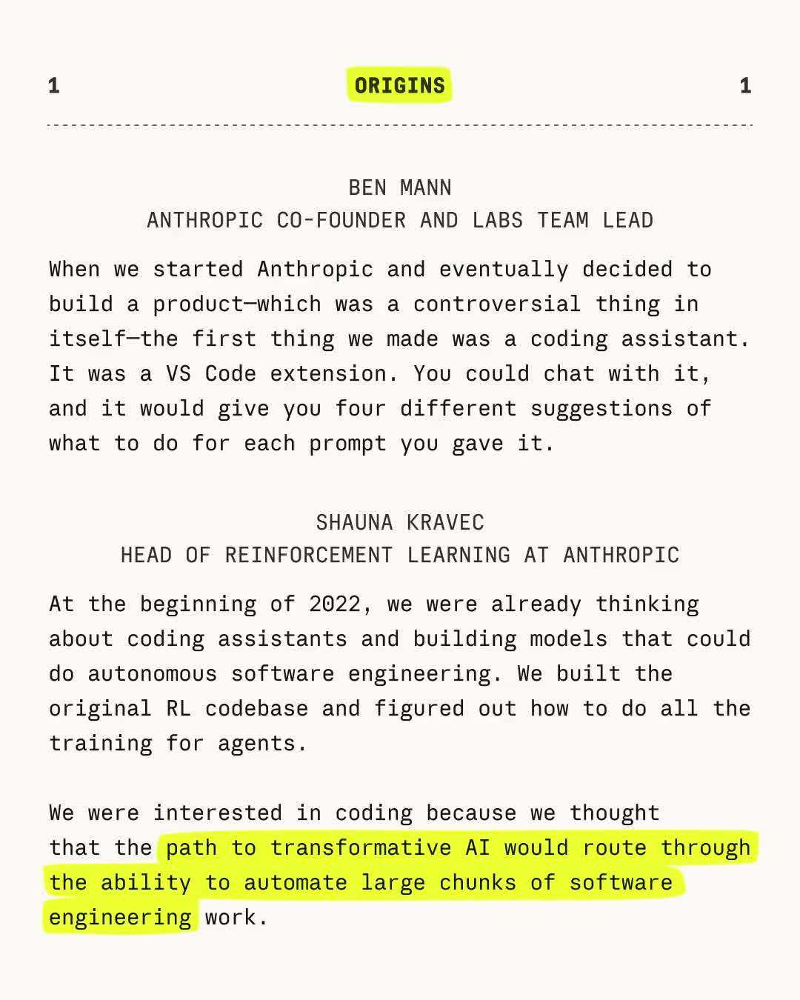

---

## 7

@苏耷水

发表于：2026-07-07 03:11

来源：微博

链接：https://m.weibo.cn/status/5318001853203113

晚清的官僚怕洋人，是怕洋人找茬去削皇帝，皇帝又干不过洋人，反过来就会处罚官僚来撒气。于是跟洋人有关的就无小事了。

在许多历史时期，哪怕是国势强盛的时候，老百姓在外国人面前也低一头。因为在帝制下，皇帝的暴力手段从技术上很难打到外国人的老巢，皇帝又想外国人都能宾服承认皇帝权威，于是就只能一边口头威吓，一边送东西送人怀柔绥远。这来中原的外国人，就成了皇帝的客人，老百姓不能惹皇帝的客人，不能给皇帝惹麻烦就顺理成章了。

中原王朝要想以武力打击外敌，皇帝又不能轻易离开首都亲征，那就不得不任命个执掌大权的大将军，大将军要想在边关维持重兵，就要皇帝把中原的钱财不断的往边关送，想要大将军自己就地解决军费也行，那就要大将军独揽地方大权，就成了一方节度使。要么是养个年羹尧，要么是来个安禄山。你说这给皇帝添多大麻烦。

帝制这个东西，就好像家长制，小孩在外面吃了亏总以为家长能替自己撑腰，总会跟欺负自己的小朋友说我爸爸来了把你们都打死，但做家长的往往是怪自己的小孩在外惹是生非添麻烦，回家把小孩再揍一顿。 

所以1979版《哪吒闹海》就很有时代特色，很符合我们建国时的精神面貌。

---

## 8

@有事问彭叔

发表于：2026-07-06 13:03

来源：微博

链接：https://m.weibo.cn/status/5317788244910036

以后中产阶级滑落最大的原因，不是买房，而是只生了一个孩子。

未来社会是一个存量社会，底层的人往上爬，就会有中产滑落下来。

很多底层的家庭自从放开生育以后，普遍都是生2个、3个甚至4个以上的孩子。

他们对孩子的教育方式就是散养。

老大性格野，不愿意读书，那就让老大早早去社会上闯。

老二动手能力强，也不愿意读书，就让老二早早去学个手艺。

老三喜欢自媒体，那就让老三去搞自媒体，能闯个名堂出来，闯不出来就去和老大、老二一样打工。

老四喜欢读书，那就让老四好好上学努力读书。

就是孩子喜欢什么，就让孩子去干什么，要是4个孩子都喜欢读书，那就都去读书，反正现在有国家补贴，读书也用不什么钱，只要有一个娃成才混起来了，就把整个家庭都带起来了。

大家可以观察一下，孩子多的家庭，普遍都是偏向于根据孩子自己喜欢的点散养，反正这种拼数量博散养的，搞不好就出一个牛的。

---

## 9

@海上一浪花

发表于：2026-07-07 04:25

来源：微博

链接：https://m.weibo.cn/status/5318020294512948

\#特朗普说比利时赢球有黑幕\#比利时4:1战胜美国。特朗普：我很懂体育，若比利时赢了，就是有黑幕，就像2020年美国总统大选一样……

比利时把美国打哭了，还打了国际足联主席的脸，值得点赞

---

## 10

@正直的磊哥

发表于：2026-07-05 09:06

来源：微博

链接：https://m.weibo.cn/status/5317366322824453

路易威登在世界各地搞商标碰瓷不是一次两次了，但是从来没打赢过。在中国境内搞碰瓷勒索也不是第一次了，在北京碰瓷就没成功，但是在苏州竟然赢了。只能说苏州中院当了洋买办的保护伞。 联合洋人欺压本土企业

---

## 11

@伊利达雷之怒

发表于：2026-07-06 22:52

来源：微博

链接：https://m.weibo.cn/status/5317936675815480

太好了，能把资源都给ai短剧吗？关注了十几个大神，更新好慢。

---

## 12

@lyman2003

发表于：2026-07-07 02:48

来源：微博

链接：https://m.weibo.cn/status/5317995884973205

华为半导体业务部总裁何庭波在 7 月 3 日上午更新了韬（τ）定律 V2 版本，增加了一些麒麟 2026 与 Kirin 9030 Pro 的对比：

在固定成熟制程不变前提下，仅靠 LogicFolding 架构实现

1、晶体管密度：155 → 238 MTr/mm²，提升 55%；

2、同等性能下功耗降低 41%，核心供电电压从 1.1V 降至 0.9V；

3、大核主频提升 13%，麒麟 2026 大核达到 3.1GHz；

4、单核心时钟缓冲器减少 50%、时钟偏移降低 25%、布线总长缩短 30%；

5、SRAM 存储工作频率提升 40% 以上；

6、片上高速互联面积缩减 55%，供电稳定性提升。

麒麟 2026 当前方案技术实现工艺条件：

1、面对面混合键合间距：1.5μm（目标未来做到 1μm 内，齿比≈1）；

2、晶圆对位精度＜0.5μm；

3、TSV 垂直通孔尺寸、隔离区＜1.5μm，通孔间距＜6μm；

4、智能冗余修复，良率接近 100%，通孔失效概率＜100ppm；

5、当前为选择性局部折叠：仅在性能关键路径使用，不整颗芯片全堆叠，控制散热压力；未来会发展 3~4 层全多层折叠。

此外，V2 版本还明确了 2030 年的昇腾 990 将首次在 AI 加速器引入逻辑折叠，2030–2035 将以昇腾 990 架构为基础持续迭代，硬件集成度目标提升 100 倍以上。

太恐怖了！今年的华为要发大力 

图源 B站

\#烽火问鼎计划\#

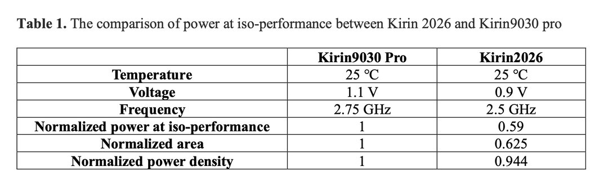

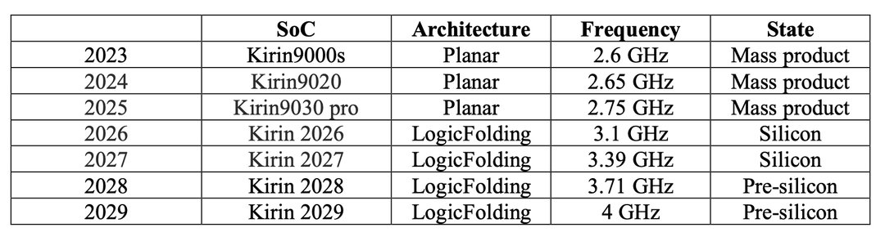

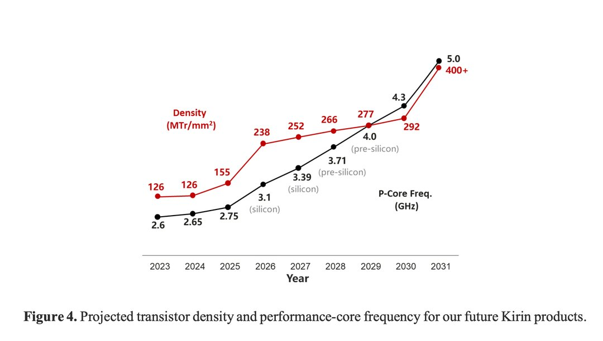

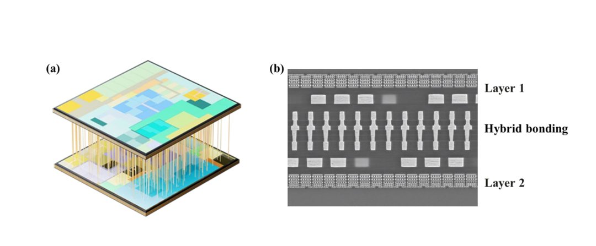

---

## 13

@多益网络

发表于：2026-07-07 03:01

来源：微博

链接：https://m.weibo.cn/status/5317999273445038

答复：我们老板不接受没道德的媒体采访。

如果实在真是希望探寻真相，求知问道。

可以在书面承诺转发我方微博或X，或完整发布的情况下，写出访谈问题目录，我方选择部分问题公开回答。

即我方言论不可以被媒体编辑修改、断章取义。

我方永不求任何媒体发布。

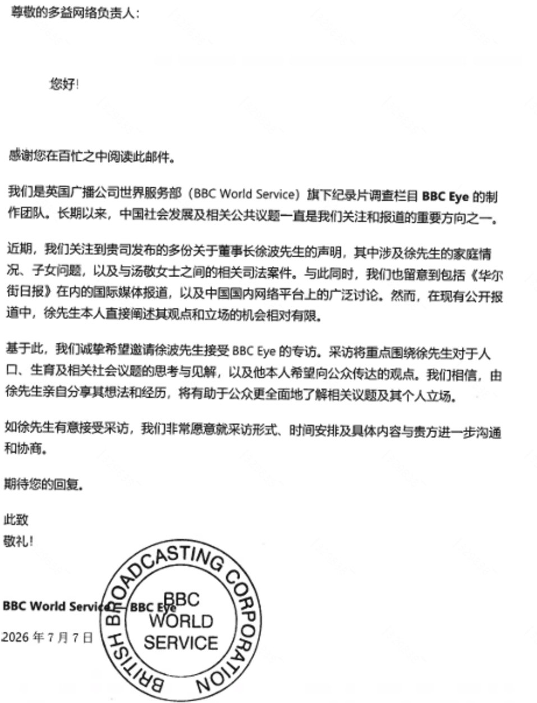

---

## 14

@天玑-无极领域

发表于：2026-07-07 03:57

来源：微博

链接：https://m.weibo.cn/status/5318013398289481

考上大学，为什么还是赚不到钱？

因为大学是解决学历问题，大学不解决赚钱问题。

学习编程，为什么还是赚不到钱？

因为学编程只是解决技术问题，编程不解决赚钱问题。

做自媒体每天都在更新，为什么还是不赚钱？

自媒体更新只解决了内容增加问题，不解决赚钱问题。

考大学、学技术、每天更新，这是闭环系统。

输入努力，输出确定的反馈，分数、学历、知识增量。因果链极短，确定性极强，符合大脑预期，因此会非常舒适。

赚钱是一个开环系统，行动要扔进一个充满变量的黑箱里，市场、算法... 可控性极低。

人类对未知的恐惧，超越一切。 

在闭环系统，因果链极短，确定性极高的行为里，至少能收获我很努力 和 忙碌充实的快感。

在开环系统，变量极多，黑箱子充满未知，大脑就会茫然无措，陷入恐惧。

人们通常会用前者的努力 来 掩盖后者的懒惰。

多数人只是喜欢钱，但讨厌赚钱这个行为。

把全部精力投入赚钱，一旦失败，就等于证明自己不行。

但如果把精力投入学知识学技术，没赚到钱时我可以归咎于知识没用或怀才不遇。

只要不去行动，不去赚钱，就可以拥有一条精神自洽的退路。

在实际中，为了更完美的实现自洽，大脑将两种行为进行因果强关联，既 努力学知识，努力学编程，每天发文章，那就应该赚钱。

最近的热点，不吃学习的苦，就要吃生活的苦。

本质上是通过学习，考大学，这种确定性极高的行为，来麻痹大脑，幻想将来不吃生活的苦。

学习，只解决学习问题。

大学，只解决学历问题。

学习无法解决生活的苦。

解决生活的苦，是一个有许多变量的大问题。

为什么不直面真相？

承认A无法解决B，会带来巨大的存在性焦虑，那意味着过去在A上投入的沉没成本怎么办？现在的生存策略是不是错了？为了缓解这种焦虑，大脑会强行给A和B之间画上等号。

应该怎么做？

两点之间，直线最短，直接带着目的做事。

变量虽多，做一个就少一个，胜率就多一分。

黑盒子，可以通过测试获取部分规律，胜率就会多一分。

这有点反人性，但很有用。

---

## 15

@信号与噪声

发表于：2026-07-06 13:38

来源：微博

链接：https://m.weibo.cn/status/5317797215213179

纳斯达克指数从 2000 年到 2002 年下跌了 78%。但没有人是这样感受到它的。

他们感受到的是这个：

+ 35% 的反弹。然后创下新低。

+ 12% 的反弹。然后创下新低。

+ 25% 的反弹。然后创下新低。

+ 41% 的反弹。然后创下新低。

+ 45% 的反弹。然后触底，顶部之后 30 个月。

市场5次尖叫“结束了”。5次都是谎言。

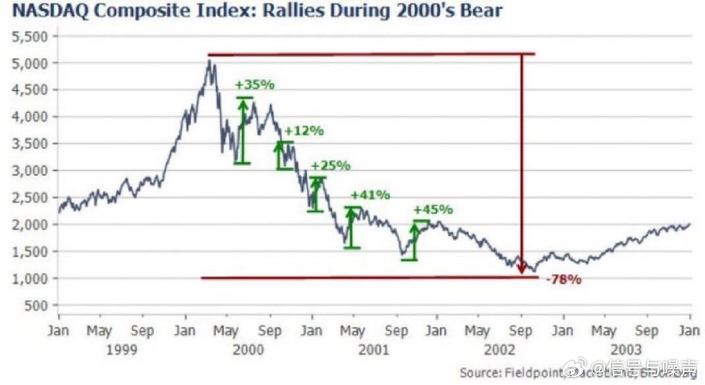

---

## 16

@WinnieS的微博

发表于：2026-07-06 23:36

来源：微博

链接：https://m.weibo.cn/status/5317947621116423

三星，1年赚了40年的钱

～～～～什么叫周期… …这种热度，肯定不能持续

---

## 17

@李楠或kkk

发表于：2026-07-06 05:30

来源：微博

链接：https://m.weibo.cn/status/5317674281994912

AI 时代，怎么样可以骂人不带中文脏字：

TOO_DUMB_TO_NEED_FABLE：比较正常的蠢。

TOO_DUMB_TO_NEED_DEEPSEEKV3：蠢的有点不正常了。

TOO_DUMB_TO_NEED_GPTV3：蠢的有点失常了。

TOO_DUMB_TO_NEED_DOUBAO：蠢的无可救药了

---

## 18

@蚁工厂

发表于：2026-07-07 00:28

来源：微博

链接：https://m.weibo.cn/status/5317960680871331

Agent编码时代，编写整洁的代码（Clean Code）还有用吗？

这篇论文 《Does Code Cleanliness Affect Coding Agents? A Controlled Minimal-Pair Study》做了实验分析，结论是代码整洁度几乎不影响任务是否完成。但混乱的代码会增加成本（增加约7%的token）

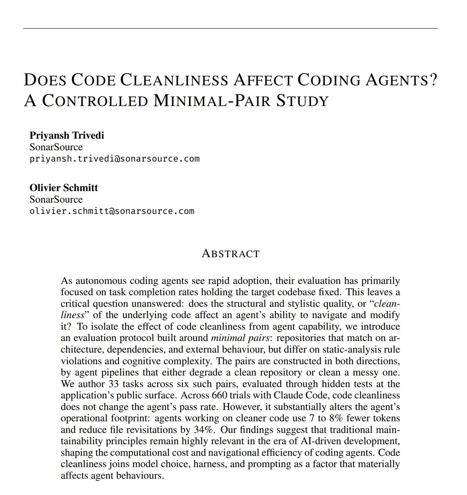

---

## 19

@物理芝士数学酱

发表于：2026-07-07 11:15

来源：微博

链接：https://m.weibo.cn/status/5318123457872159

\#科学史\# 

奥本海默1939年的论文《论持续引力收缩》，他在其中基本上预言了黑洞的存在

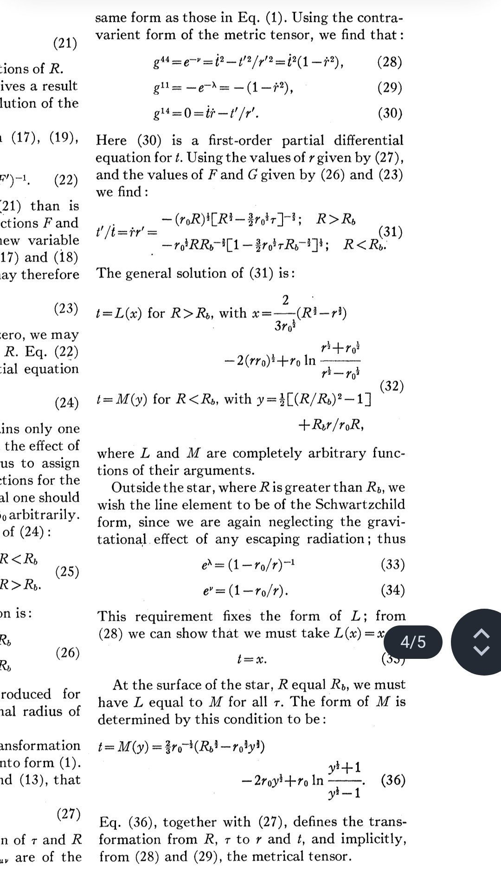

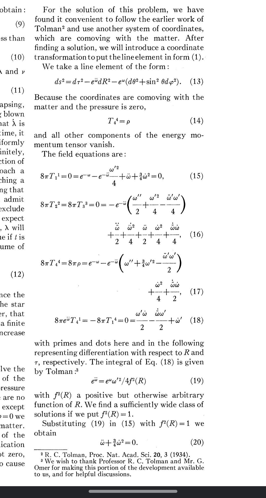

---

## 20

@V闪闪

发表于：2026-07-07 10:59

来源：微博

链接：https://m.weibo.cn/status/5318119442615982

👊不能打外国人//@黄斌:这个事情特别有意思，我都看呆了。。。大概意思就是博主（女）发了一条微博，震惊于泰勒·斯威夫特居然这么成功还要改随夫姓。结果评论区一帮女的破口大骂，说博主造谣。博主给出信息来源之后，像右边这种脑回路清奇的女粉又开始转移话题言不及义，总之就拼命骂博主。。………？？？我只能说我不理解//@DirtyCat的豆腐脑:回复@横卧的灰狸:你跟你爸姓吗？你孩子跟你老公姓吗？别人改不改姓轮得到你这一头指手画脚？只知道造谣博取流量的都不会有好下场👌🏻 //@横卧的灰狸:回复@十点天明:我以为我对这件事已经够震惊，原来他们比我还接受不了 几十亿身家的成功女艺人竟然还要跟夫姓而不是反过来。 //@十点天明:她们第一次知道西方国家妇女结婚后要随夫姓的吗？

