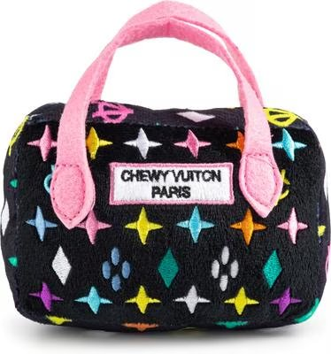
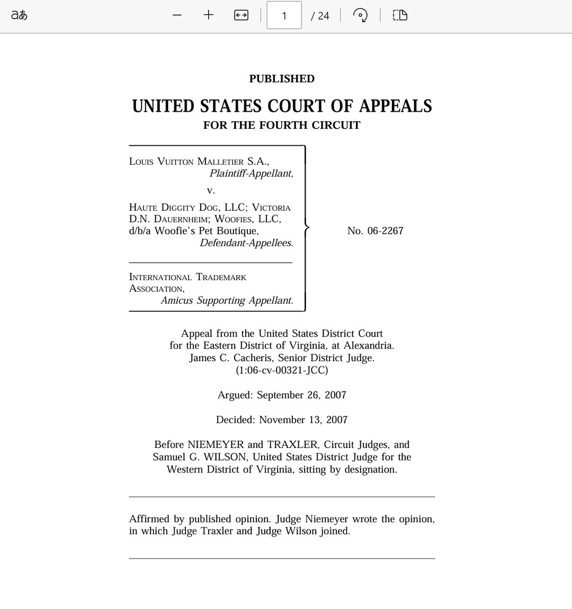
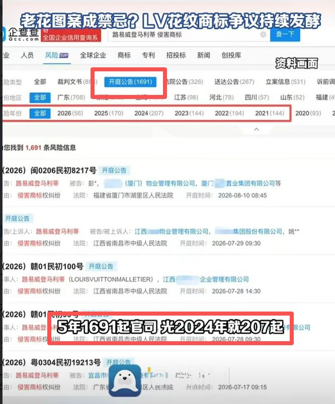
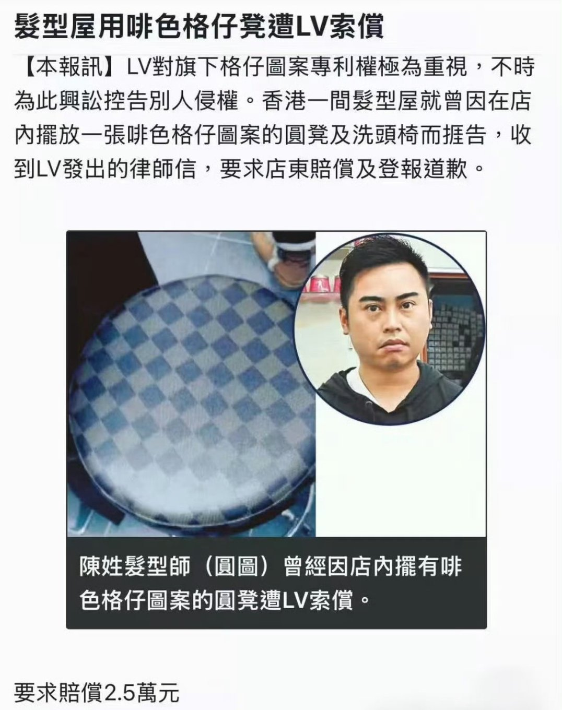
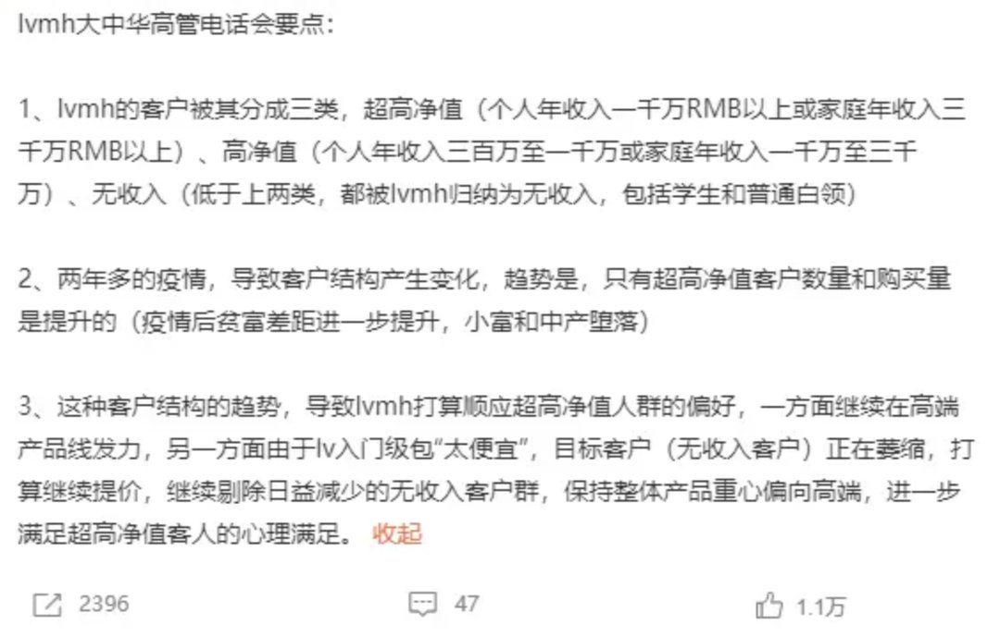
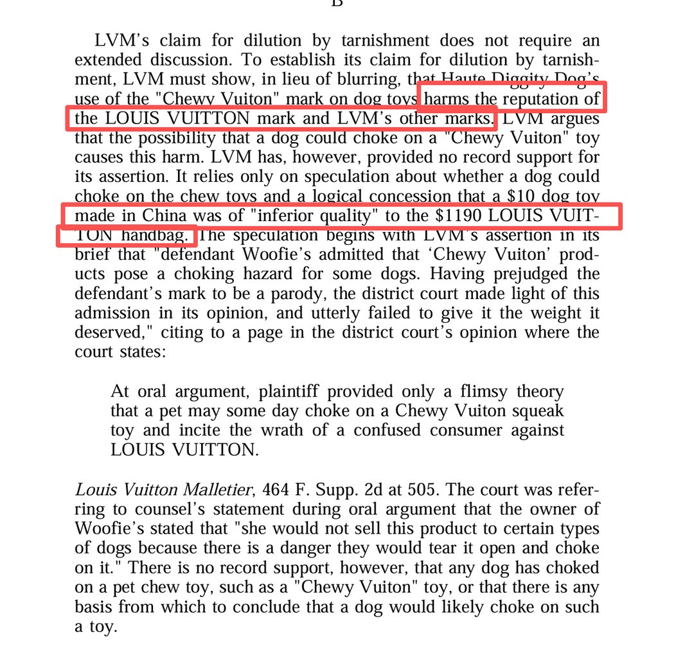
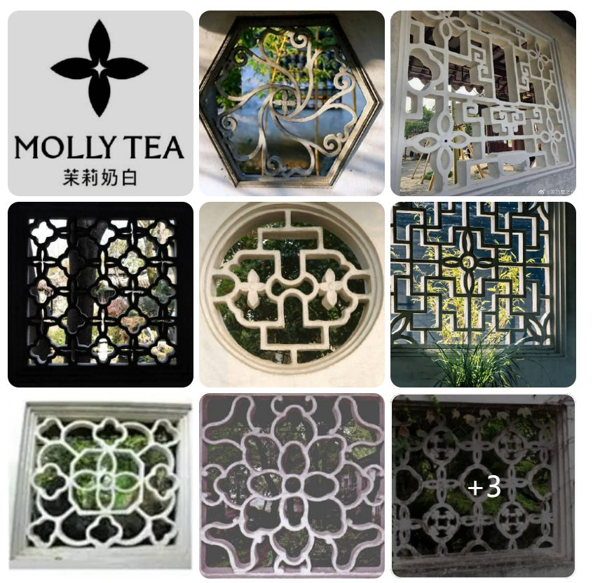
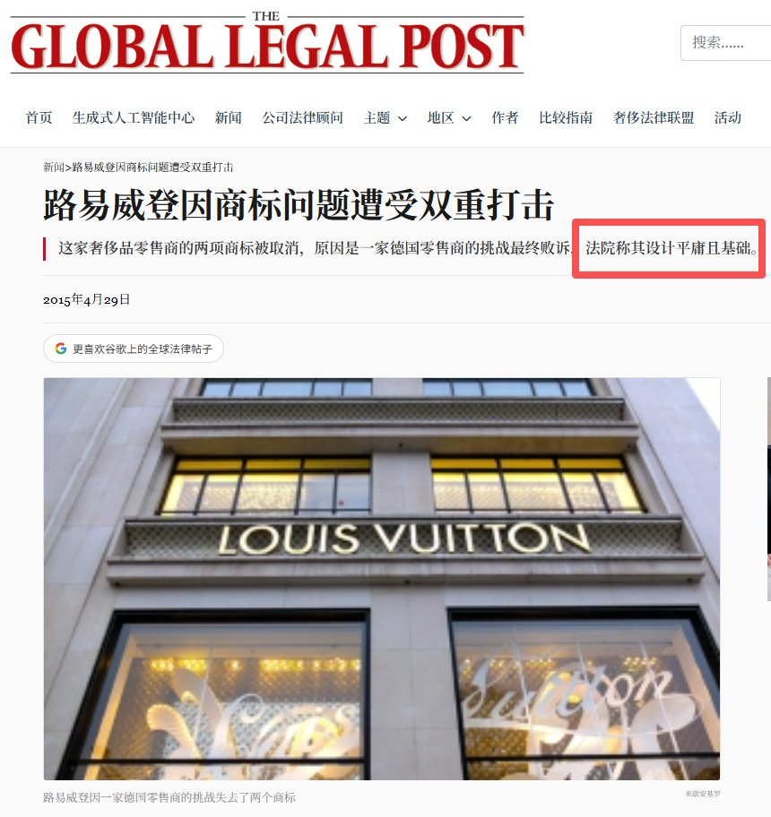
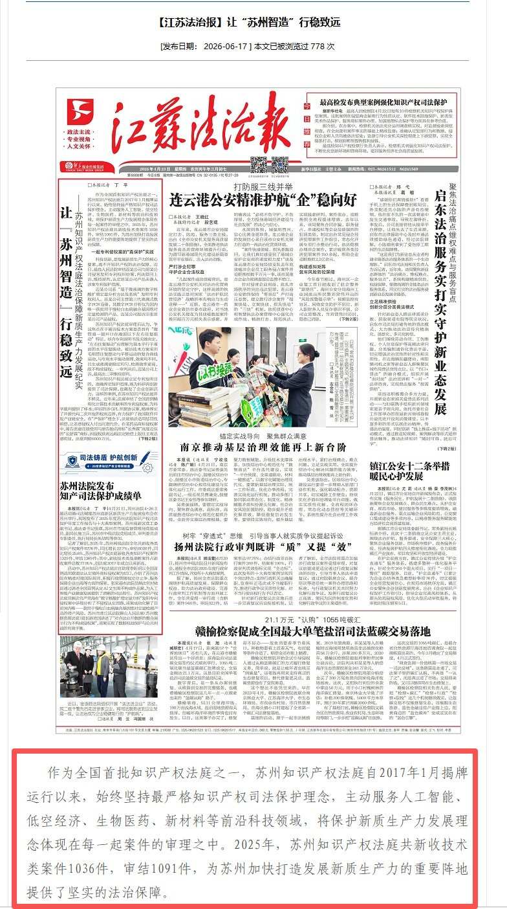

# 2026-07-09

## 1

@新浪科技

发表于：2026-07-08 14:19

来源：微博

链接：https://m.weibo.cn/status/5318532302898248

【\#韩国牛市背后散户困局\#】数据表明，今年上半年韩国股市中，由资产配置失衡以及市场过度集中于少数领涨股票所造成的问题，比预想更加严重。 据报道，对韩国大型证券公司客户账户数据进行分析后发现，在韩国个人投资者买入金额排名前50的股票中，除了引领市场上涨的“半导体双雄”三星电子和SK海力士，以及部分核心信息技术零部件企业外，个人投资者几乎在所有热门股票上都出现了大规模亏损。 这说明，股市上涨带来的收益并没有扩散到整个市场，而是集中流向少数超大型龙头企业。 其中，成绩最惨烈的是韩国互联网企业Kakao（个人投资者买入排名第45位）。 今年上半年投资Kakao的个人投资者平均收益率为-52.7%，亏损投资者比例达到99.9%。这意味着几乎所有投资者都处于亏损状态。即使是间接投资产品——交易型开放式指数基金，也没有逃脱“高位追涨”的困境。 6月份，韩国个人投资者净买入金额最高的产品是KODEXSK海力士杠杆基金，其亏损投资者比例达到99.7%。 排名第二、个人投资者净买入金额第二高的KODEX三星电子杠杆基金，亏损投资者比例更是达到100%。

---

## 2

@江宇行舟

发表于：2026-07-08 14:00

来源：微博

链接：https://m.weibo.cn/status/5318527487574870

这些天，LV 起诉茶饮品牌茉莉奶白，被苏州中级人民法院判得1030万元的舆情还在发酵。

茉莉奶白仅仅因为一个十字花标签，和LV一组图标中的某一个相似的情况下，就要赔偿上千万。可在近20年前的美国拉斯维加斯，发生过这样一起案子，一个做宠物玩具的公司，在给狗狗的玩具上，几乎复刻了LV完整的商标图案（图1，图2，图3），也使用了包包造型，商品名字叫Chewy Vuiton，简称CV，并且被告企业也承认，自己的logo就是模仿了了LV的商标。

就这样，LV在美国，从地方法院一直上诉到第四巡回法庭，最后还是败诉了。

我把判决书（图4）找了出来研读了一遍，看得那叫一个拍案叫绝+五味杂陈。

🚩首先说格局上，美国法院狠狠拉了一波价值，你LV不是一个一般商品，你是一个世界知名品牌。正因为你全球驰名，所以要让阿猫阿狗来和你混淆，那是很难的。

原话叫：由于驰名商标特别强大且独特，恶搞不太可能削弱该商标的独特性（ because the famous mark is particularly strong and distinctive, it becomes more likely that a parody will not impair the distinctiveness of the mark. ）。

这背后其实也有很深的用意，那就是简单几何图案的商标很容易会在市场上互相重叠，那么大企业有强大的能力去搜集市场案例、组织强大的法律团队去攻击中小企业乃至个体户，而后者对大企业是没有防御的。那么是不是就让大企业这么无穷无尽地起诉下去？

就说LV，你看看它几年内在咱国内发起了多少起诉吧？（图4）还不止内地，连咱香港的剃头师傅都收到律师函了（图5）。

那就回到事情的本源：小商小贩小厂家在商标上的相似乃至重合，会不会干扰到市场对大企业商标的认知？

答案不言自明。

🚩但美国法院承认，这不是天然觉得小企业就能照抄大企业的商标，如果无底线抄袭就是仿冒剽窃。

那么重点就在于，有没有抄袭。

美国法院认为，宠物玩具店没有抄袭，因为它生产的是宠物玩具，和LV不是一个赛道；它的材质是绒毛，手感毛茸茸，怎么摸都和LV不一样；它的颜色五颜六色，和LV不是一个视觉感；它的用途是给狗狗爪子挠、牙齿咬，看不出LV的包包也会被推广到这个赛道。

最重要的是，它的价格很便宜，一个才20美元，和LV动辄几个几十个w的产品，完全不在一个层次的市场。

所以销售渠道也就不一样了，原话是“销售这些品牌的各个零售店几乎没有重叠。在广告方面也是如此，重叠几乎不存在。”（ there is little overlap in the individual retail stores selling the brands. Likewise with respect to advertising, there is little or no overlap）

LV不是特别喜欢说自己定位给“高净值人群”吗？甚至有江湖传闻，说LV内部电话会管岁入300万以下都是“无收入群体”（图6）

这一刻，它的宣称成了对自己诉讼最佳的反驳。

🚩美国人很喜欢给事情定一个概念、安上一个标签，以便师出有名。

美国法院也给这家宠物玩具店的行为做了一个定义——Parody，搞怪、恶搞的意思，后来这事儿还有了个信达雅的中文翻译，叫“商标戏仿”。

既然不会让消费者搞混这两个品牌，那当然不叫抄袭，而叫“戏仿”咯。

法院如是写到：“一个知名商标的强大，能够让消费者立刻认出它被恶搞了，同时也能识别出商标在恶搞的趣味或辛辣中所产生的变化。”（the strength of a famous mark allows consumers immediately to perceive the target of the parody, while simultaneously allowing them to recognize the changes to the mark that make the parody funny or biting. ）

还有句话特别有意思，我觉得可以翻译成：是耶非耶，乃一戏耶（it is the original, but also that it is not the original and is instead a parody.）

美国人甚至还在判决书里委婉地规劝LV别闹了，因为一个差异化赛道的成功山寨，反而会让它的商标“破壁”，变得更有辨识度。

——咱小公司还免费帮你多打了广告，你就偷着乐吧，咋还起诉上了？

看到这一段，我突然想到当年《无极》与《一个馒头引发的血案》那场撕扯了，事后复盘，从营销学角度讲，陈大导演但凡宽容一点，会不会反而能给剧情口碑平平的电影，多一个另辟蹊径、宣发破圈的机会？

🚩被美国法院这一通拆解，LV的懵圈状态可想而知。于是它们还真另辟蹊径了。

它们举证：这些毛茸茸的商品会给LV伤害、会给消费者伤害。再不采取果断行动，广大狗狗们连带LV百年品牌都将面临严重的危害！

美国法官表示，既然话说得这么重了，那你得举证一下。

于是LV举证，这毛茸茸的玩具那么大一坨，狗狗咬的时候有可能被噎着，噎着了就要窒息，窒息了就会翘辫子，还有有些玩具是发声玩具，有可能把狗狗吓着。把狗狗吓死了，抱着狗狗尸体的消费者，看着那个打着“CV”商标的肇事玩具，有可能会恨上我们LV……

美国法官在判决书上如是评价：没有论据（ no record support ）、全靠猜测（ only on speculation ）、观点轻佻（ a flimsy theory）。

就差直接写“胡说八道”了。

🚩就在攻辩不力的情况下，急于打开局面的LV还涉嫌辱华。它们查到这些宠物玩具是在咱中国代工的，于是管中国制造叫做“粗制滥造”（inferior quality），并认为这些才10美元的“中国制造”玷污了自己上千美元同款包包的品牌身价（图8）。

看到没，人家觉得自己很高贵，咱生产的是对人品牌的玷污。

这段我觉得格外要抄送苏州的法官大人们看一眼。

🚩通读完整个判决书，我有一种感觉，就是美国人判决有一条主线——实质重于形式。

不是教条地去搬法条，比对两个商标，就说抄袭了，首先先确定一件事情：是不是真的会造成消费者误判两种商品？再此基础上再多问一声：会造成怎样的社会与经济危害？

我不是法学专业的，但我和律师打交道不少。同时我修过社会学。所以看这份判决书，我有一种很强烈的感觉，就是美国法官先是明确，法律是用来调整社会秩序的工具，所以我们是用社会学的视角看法律，而不是用法律的教条来审视社会。

其实从美国人的这种视角，都能补充下咱自己的核心价值观。依法治国的目的和归依是什么？难道不是人民群众的根本利益？难道不是确保人民当家作主。

我相信任何一个在过去三十年接受义务教育的朋友都该记得，我们社会主义法治是坚持党的领导、人民当家作主、依法治国三者的有机统一，人民当家作主才是本质和核心。

人都没了，还谈何法？为了人民利益，法律如果出现冲突，是不是就该调整法律？

所以当LV如图5这般大面积、无差别扫射一切国内企业乃至工商个体户的时候，我们国家的法律该不该保护一把人民群众的利益。

更何况它所谓被侵权的“原创商标”，有不少还来自我们自古以来的文化元素。

🚩这几天我还翻了欧洲日本的商标法与判决，发现一个共性的地方，就是它们可以基于图形过于简单、涉及传统民俗、以及不会引发民众误解为由，判决LV已经用上的商标没有被侵权。

更有甚者，一家德国商店就能发起诉讼，以辨识度不高、设计简单为由，让欧盟把LV已经通过审核的商标再做撤销（图10）。

欧盟法院认定的还很不客气，觉得LV的设计过于简单和平庸了。

反观我们的《商标法》，似乎还没有类似的设计。当商标通过后，就没有退出机制，坐视它包打天下，以至于出现LV这样的国际大企业，能够穷尽它的法律资源，对着中国的各行各业无差别起诉，并且还能在全球败诉的情况下，反而在咱中国捞上几票。

早上我还在说，这帮法务居然干起了风投的活，一单诉讼拿下，可以填几十单乃至数百单诉讼的开支。那不可劲的无差别诉讼啊？

对比下其他国家的法律，就发现人家逻辑发过来了，能引发如此之多的诉讼，我法院要不要思考一下：是不是你的设计太大众脸了？太没有辨识度了？

说得直白点：太平庸了！

那为什么我的企业、我的老百姓，要为你的平庸掏腰包？

🚩所以我完全同意@徐记观察 的意见，这个事情咱不必过于聚焦法官个人，从商标审核开始直到受理诉讼、再到判决，有不少流程上、条文理解上、深层次理念上的问题，我们捋得不是很顺。

最终形成了一个集成谬误，让一个十分重视知识产权保护、并以此为城市名片的地方，判出了这样一个结果。

所以问题来了，当出现这样集成的问题时候，那些一直喊着法律要和国际接轨的人都到哪里去了呢？

这也是我们法律行业、法学教育不得不狠狠思考的事情了！

🚩最后一句话：我们的法律，是要保障人民当家作主的。我们的法院，是人民法院。 

\#LV不能挪用中式纹样反向起诉中企\#

