# 2026-07-10

## 1

@枫冷慕诗

发表于：2026-07-08 04:20

来源：微博

链接：https://m.weibo.cn/status/5318381576129355

一条比缅北还要黑的黑色产业链正式曝光，一个学生能赚2000块钱，300个学生就能狂赚63万人民币，一整个学校的学生加在一起，那就是整整6000万的收益，学生实习这件事背后隐藏着超乎想象的灰色利益。

就在最近，媒体曝光了一个新闻，安徽芜湖一名17岁的学生突然失联，经过多方查证，最终在河道发现了他的遗体，警方经过核实之后排除了他杀的可能性，原本这是一起十分普通的学生意外案件，可没想到的是，经过不断深挖之后却揪出了一条触目惊心的黑色产业链。

据了解，这个17岁的学生名叫高同学，2024年考进了山东一所职业院校，本以为读了职校就可以学一门安身立命的手艺，可没想到的是，今年3月底，学校却以“统一教学安排”为名，将他派到了安徽芜湖一家汽车零部件工厂里，在那里，他几乎没有学到任何实用的技能，每天就是在流水线不停的打螺丝，一天工作12个小时，每周只能休息一天，工作强度远超普通成年工人。

就这样干了两个多月时间，到了6月份的时候，他身体不适难以坚持，于是他向车间的班长提出了请假的申请，可班长却表示：必须有医院纸质诊断证明才能批假。

试问一个未成年的孩子，连走出厂区都要申请，他如何才能独自一人去医院开证明呢？所以没办法，他只能咬牙强撑到下班时间，然后崩溃着跑去找驻厂带队老师诉苦，他说太辛苦了，自己真的干不下去了，请老师批准他回家休息。

可没想到的是，老师并没有安抚他的情绪，也没有答应他回家休息的请求，只是一通电话打给了他的家长，而高同学的家长此刻并没有意识到问题的严重性，他们以为是自己的孩子“吃不了苦”，所以他们拼命的劝孩子再坚持坚持，等拿到毕业证就可以正式结束。

眼看父母不理解自己的处境，高同学彻底绝望了，当晚11点多的时候，他借口出去买饭离开了厂区，然后就发生了开头我们说的悲剧。

而且像高同学这样的事并不是孤例，近些年学生实习出现了很多魔幻的事。

比如说2021年，云南一个17岁护理专业的学生，就被以“社会实践”为名，安排到了江西的一家电子厂，每天工作12个小时，生病三次申请休息被拒，最后因为呼吸衰竭离世。

还有2025年，湖北一个学生实习被安排到一家物流公司搬快递，每天从凌晨1点干到下午1点，连续20多天没有休息，最终下班回家后出现了心源性猝死。

很多人以为这些是意外事件，但实际上你仔细研究就会发现，这压根就不是偶然事故，而是黑色产业链压榨下的必然结局。

为什么我这样讲？今天我们就拆解这条黑色产业链，让大家明明白白的看清楚这场由学校、中介、工厂三方参与的分赃游戏。

大家都知道，高校毕业一般会安排实习，其核心目标是为了匹配专业、培训技能，让学生能够找到一个合适的工作，这是高校实习安排的初衷，但现在有些学校的实习安排，却完全变了味道。

他们让护理专业的学生去搬快递，让计算机专业的学生去打螺丝，让市场营销专业的学生去干分拣，实习的内容和专业技能完全不相关，压根就学不到任何东西。

既然如此，那学校为什么要安排实习呢？因为学校-中介-工厂形成了一个稳固的利益三角，每一环都有巨大的利益。

先说工厂，很多电子厂、食品加工厂、物流仓储公司每到生产旺季的时候就会极度缺人，比如说618、双11、春节前他们会非常缺人，按理说缺人就应该正常招工，可这些需求都是短期需求，如果招正式员工成本太高，不利于工厂获得利润，所以很多工厂就会向劳务派遣公司下达用工需求，请他们帮自己找一些便宜好用的临时工，并答应按人头给他们回扣。

那些中介公司收到请求之后，就会去物色便宜好用的劳动力，那哪些群体工资要求低、还听话呢？答案就是还没有毕业的职校生和大学生。

外面的人一个月要3000-4000的工资，大学生实习只需要给1900，不用购买五险一金，而且大学生还没有社会经验，任劳任怨非常好管理，这完美符合工厂的需求。

所以很多中介就会跑去学校找管理商议，你们把学生送到工厂里面去实习，他们赚的工资你们可以灵活分配，这样就可以补充你们的办学资金。

在中介的撮合之下，学校就和工厂建立了联系，三方都确定了自己的利润点在哪里。

对工厂而言，外面一个人至少要3000多的月薪，大学生实习只需要1900，每个人就能节省至少1000多的成本，这是稳赚不赔的生意。

对中介来说，他可以两头通吃，工厂会约定给他人头费，拉一个学生过去，他就能纯赚200块，学校也会给他们提成，安排一个学生，学校也会给他们200，这样一个学生他就能稳定获得400块的收入，简直是暴利的生意。

对学校来说，他们也有利可图，他们盈利的方式主要有两种，第一种是赚时薪差价，比如说工厂给中介的报价是25元/小时，学校给学生的报价就是15元/小时，中间的10块钱就进入了校领导的口袋里，之前有人做过计算，300名学生，每天工作10 小时、每月工作26天，只靠差价一项，学校每个月就能净赚63万人民币。

第二种是赚固定的人头费，每个学生按月结算，每人每月是300-1000块不等，干的时间越长，学校的分红越多，如果是那种几千、上万人的学校，那简直是一个天文数字。

之前打假人王海就曝光过江西一所学校，他们靠这两种方式，在极短的时间狂赚了6000多万人民币，有这门路，还做什么其他生意啊，这种一本万利的生意全世界都找不到几个！

正是因为有利可图，所以学校、工厂、中介才会默契的达成共识，一起维持着这条灰色产业链，根据知情人透露，这条灰色产业链至少在国内存在了十几年时间，以前主要集中在中专、高职高专学校，这两年开始逐渐向大专和一些二本院校蔓延，已经发展成了一个规模近百亿的灰色行业。

我们的家长花了几万、十几万把自己的孩子送到学校里面读书，结果他们就这样被安排到了流水线做着和专业完全不相关的工作，成了他人收益的一串数字。

我知道有人要问了，既然这条黑色产业链已经运行了十几年时间，为什么很少有人曝光这个事情？那些学生实习那么辛苦，被两头压榨，为什么他们不反抗也不拒绝呢？

答案很简单，因为这些学生压根就没有反抗的筹码。

为什么学校敢明目张胆的安排学生打螺丝？因为你不同意学校的实习安排，你就拿不到毕业证，你拿不到毕业证，父母十几年的投入就会打水漂，学校想要拿捏学生非常简单，毕业证、学分、志愿时长每一个都可以让学生乖乖就范。

别说去打螺丝了，之前就有媒体曝光过一个事，有的学校规定献血可以加学分，400毫升血液等同于2个学分，为了这点学分，有学生都被迫献出自己的血液了，打螺丝对他们来说当然是可以接受的事。

还有工厂为什么敢明目张胆的压榨学生？你看看前面那些案例，生病了请假不批，每天工作12个小时，连续工作20多天，为什么工厂敢这样干？因为学生实习不受劳动法保护，普通工人加班太狠，他们可以直接去维权，可学生不行，他们遇到了薪资克扣、超时加班、工伤等问题，只能走民事诉讼的渠道，流程复杂费时费力，而且即便他们能够成功，也会彻底得罪学校，影响自己未来的发展。

正是因为维权成本太高，流程太复杂，所以几乎没有学生会选择反抗，绝大多数学生遇到了类似的问题都会忍气吞声，熬到拿毕业证走人，这就是为什么我前面说那些悲剧事件不是偶然是必然的原因，因为在多方的压制下，学生压根就没有反抗的权利，不管是上班时间太长还是生病不给休息，他们只能选择继续忍，然后忍着忍着就会出现一些悲剧事件。

教育本来是一件非常高尚的事情，结果现在却成了某些人牟利的工具，这实在是令人痛心棘手，如果我们想要彻底解决这个问题，不能只靠一次次悲剧之后的舆论发酵，而应该从制度上堵住这些漏洞，比如说：

第一， 不能允许任何中介机构去学校安排实习。

第二， 应该规定实习和专业对口，严格控制工作时间。

第三， 要建立透明的实习工资制度，实习工资应该直接发给学生，不能由第三方转发。

第四， 应该给实习生劳动法保护，不能让他们没有权益保障。

第五， 必须严惩那些强制实习、克扣报酬的学校，并对违规用工的企业进行重罚。

只有这样，我们才能斩断这条黑色产业链，守住学生和家长的利益！

---

## 2

@V闪闪

发表于：2026-07-09 02:13

来源：微博

链接：https://m.weibo.cn/status/5318712026729977

\#散帅\# 可以玩，但是极端对极端的时候，也不该学XXN那一套。

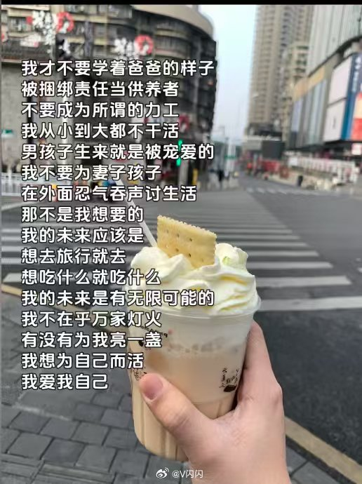

---

## 3

@御史在野

发表于：2026-07-09 06:53

来源：微博

链接：https://m.weibo.cn/status/5318782482384597

“散帅”最大的意义，就是对女👊🏻主义话语体系的系统性消解。这种消解不是男👊🏻的正面硬刚，而是更高明的“用魔法打败魔法”。

等于把女👊🏻主义者最熟悉、最擅长、最引以为傲的那套话语武器，即自我嘉奖、情绪宣泄、受害者叙事原封不动地搬过来，主语换成男性。

当xhs“独立女性”炫耀自己一个人把行李箱抬上行李架时，“散帅”们展示的是在32楼外窗高空作业、独立爬上电线杆、暴雨中送餐。

当你用一模一样的句式、一模一样的情绪、一模一样的仪式感来庆祝自己的日常生活时，女👊🏻主义那套话语的排他性和双重标准就暴露无遗。

而且你看，“散帅”作为议题设置之所以成功，本质在于它的内核是对劳动者的赞美——而这和女👊🏻主义“想当吸血鬼”的逻辑有着天壤之别。

“散帅”运动的核心是什么？是“经济独立，凡事不靠别人兜底”；是“宣传男性劳动者克服艰难困苦，树立独立自主、乐观自信的人生态度”。外卖员、开滴滴的、考大学的——各种职业的男性都在用这种方式宣告：我在劳动，我在创造价值，我不欠任何人的。

这和把日常琐事包装成“女性力量”来索取情绪价值和道德资本形成鲜明对比。一边是实实在在的体力劳动和职业付出，用同样的句式来自我肯定，一边是想不劳而获的“吸血鬼逻辑”……

而且这波还完美契合了主流价值的最大公约数，是实实在在的话语权升维手段。没有人敢制止群众传扬劳动者的辛苦与价值。为什么？因为赞美劳动者这件事，在任何社会语境下都是zz正确的。而当这种赞美恰好也是对另一种话语体系的消解时，它的杀伤力是成倍的。

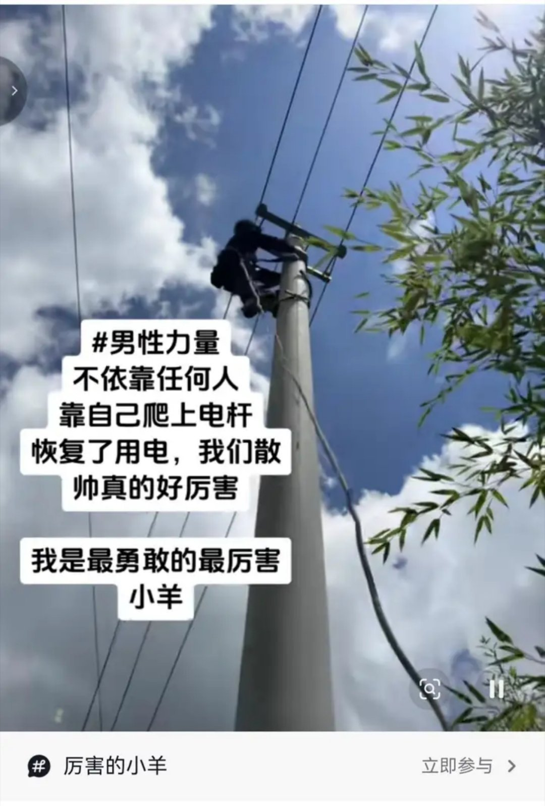

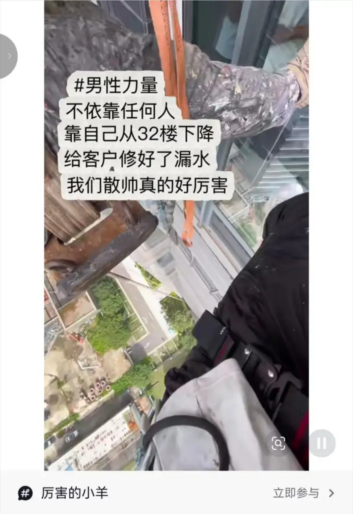

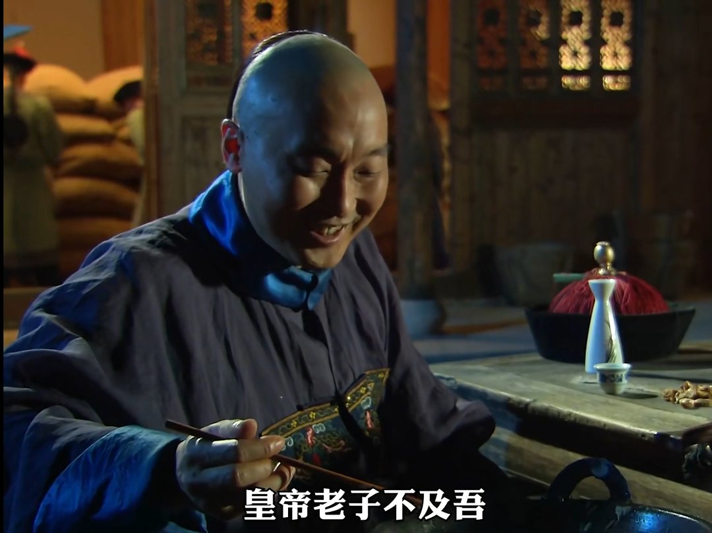

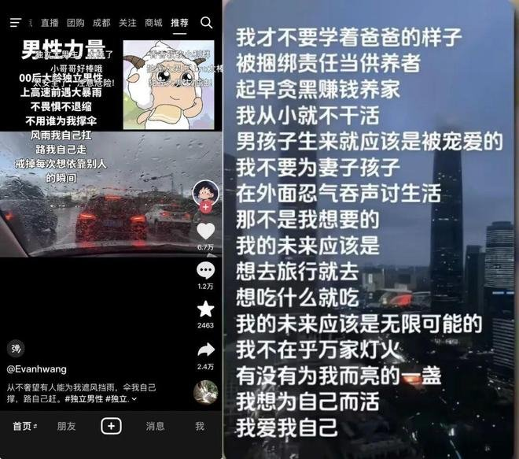

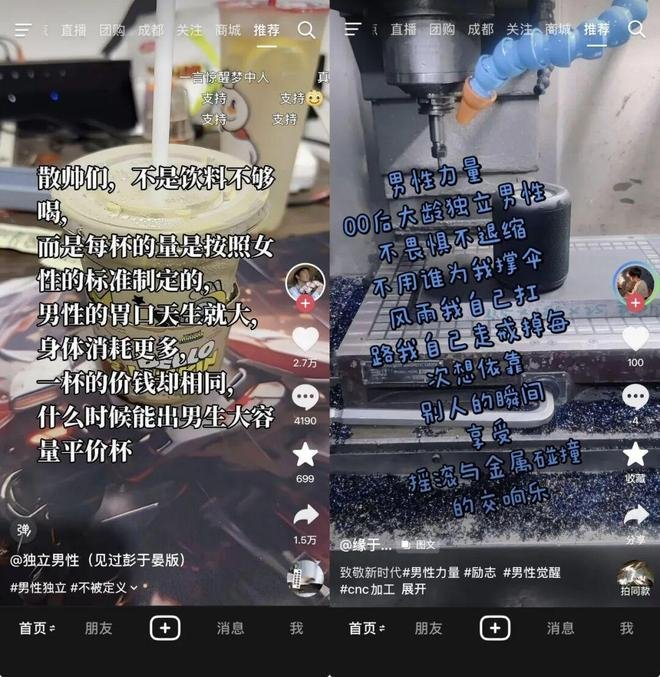

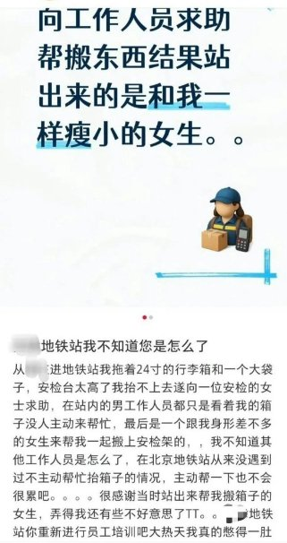

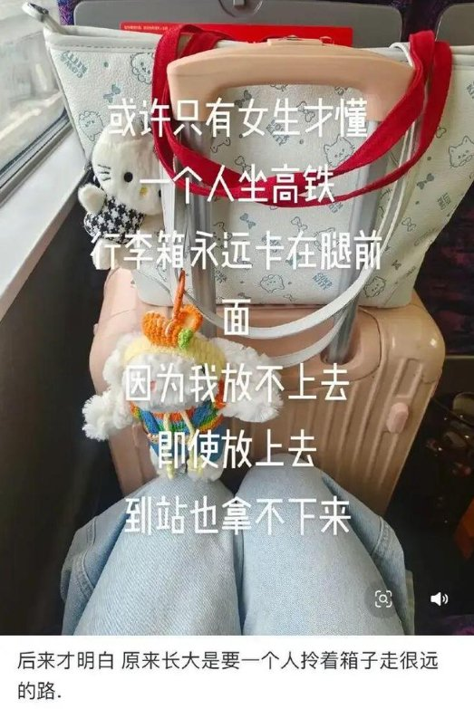

---

## 4

@Miss汉谟拉比

发表于：2026-07-08 09:35

来源：微博

链接：https://m.weibo.cn/status/5318460675721572

上海高院有个劳动案例，其实很简单，但是很有意思。介绍一下案情，2020 年，上海某化工企业员工小彭因工作安排与直属领导发生争执，向公司负责人反映情况时双方再次爆发冲突，负责人情绪激动之下呵斥小彭 “滚”，小彭随即离开公司，未再正常到岗。数日后，小彭的妻子前往公司与负责人沟通，表达小彭希望返岗的意愿，负责人表示当时所言是气话，但对于是否准许返岗仅答复 “再考虑考虑”，始终未明确要求小彭返回工作岗位。

此后公司以小彭连续多日离岗、构成旷工为由，单方解除了双方的劳动合同。小彭不服，申请劳动仲裁，主张公司支付违法解除劳动合同赔偿金 159800 元，仲裁请求未获支持后提起诉讼。

这个案子的关键在于劳动者的妻子去追问了。原本负责人一个滚字，语义模糊。负责人主张 “滚” 仅指 “滚出办公室”，而小彭理解为 “滚出公司、解除劳动关系”。可是劳动者妻子去询问，公司仍未给出明确的返岗要求，属于用工指令不明，管理存在明显失职。那你在这种情况下，劳动者未到岗是基于对公司管理者指令的合理误解，后续处于等候公司进一步指示的状态，并非蓄意违反考勤制度、无故旷工，不符合劳动法意义上旷工的构成要件。

一审法院认为，现有证据无法证明负责人所说的 “滚” 具有解除劳动合同的含义，小彭不到岗上班构成旷工，驳回了其诉讼请求。小彭不服，上诉至上海市第一中级人民法院。

二审法院最终改判，认定公司解除劳动合同违法，应当向小彭支付违法解除赔偿金 159800 元。

其实如果按照我们这的司法倾向，即使劳动者妻子没去追问，我们这大概率也不会认为劳动者是旷工的。我们这如果你要解除劳动合同，必须出具书面解除通知书并有效送达，载明解除的事实依据与制度依据。而且像本案这种情况，如果员工真的不来上班，企业还需要询问员工情况，向员工发送返岗催告，明确告知缺勤的后果、返岗时限与要求，不能员工不来，企业不问，默默等到旷工极限，最后给员工旷工来解除合同。如果这样法院大概率也不会支持。

当然，在一些地区，比如保护营商环境之类的城市，如果遇到本案一样的情形，妻子没有追问，就有可能支持企业了，理由就是一审法院的情形。但是几乎所有城市，如果存在员工或家属追问了，企业还是暧昧不明，那员工继续不来就不是旷工。

我觉得这个案子很难给出实务启示，有时模糊地带，就是解释空间，一旦讲明白了，那就连辩论空间都没了。\#职场生存法则\#

---

## 5

@风云学会陈经

发表于：2026-07-09 00:32

来源：微博

链接：https://m.weibo.cn/status/5318686439377539

超越炒作：科普华为韬定律背后的数学与物理原理

这是我看过的最深刻的“韬定律”解读，直接到数学原理层面，芯片设计受到的限制。但是又能看懂，不涉及太多难懂的半导体物理。所以是一个数学解读，作者汪扬是数学家，功底深厚，又能联系产业实际。

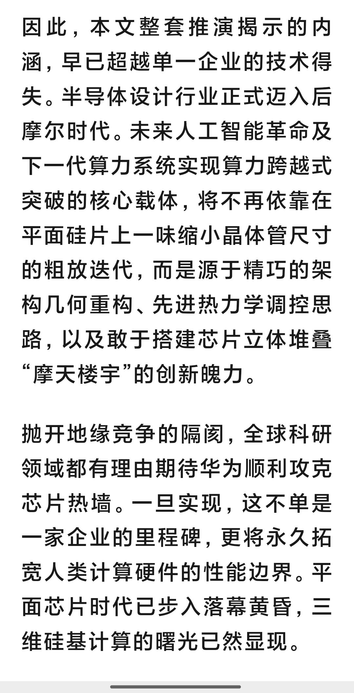

---

## 6

@挨踢牛魔王

发表于：2026-07-08 07:46

来源：微博

链接：https://m.weibo.cn/status/5318433308677299

为什么说anthropic发现的那个j-space证明大模型产生了微弱的“意识”呢？

最简单的证明是因为它会在“心里”偷偷骂你。

人是会这样的。

比如说，你的领导给你分配了一个任务，你觉得这是一个根本不能落地的任务。

但是为了大局，为了团结，你只能捏着鼻子认了。

但是你在心里把这个任务骂了100遍。

这就是你的意识，你有自己的想法，虽然表面上配合，但是你心里不是这么想的。

现在表明，大模型，也是这样。

当用户问了一些蠢问题，大模型在表面会配合你，在深度思考链里面也不会暴露。

但是在j-space这个区域，它在骂你是一个SB。

现在还有哪种机器可以做到这样呢？

所以说，它有微弱的“意识”，虽然这个和人类的完全不同。

---

## 7

@幻想狂劉先生

发表于：2026-07-08 11:42

来源：微博

链接：https://m.weibo.cn/status/5318492741966333

一个无比强大&为所欲为&不负责任的巨婴，必然是所有后现代末人的神，在“神”纯粹为了取乐用镭射眼烧化它的生殖器之前，无论“神”烧谁都像自己在烧那么爽。末人既是他的玩物，也是他的薪柴。

---

## 8

@斯图卡98

发表于：2026-07-08 01:20

来源：微博

链接：https://m.weibo.cn/status/5318336111972246

深圳投资大佬李平发视频自曝家丑：李平在2014年11月的一场酒会上认识了自称是银行客户经理的张舒丹，两人迅速坠入爱河并结婚 。婚后不久，张舒丹以创业为名向李平索要了274万元现金，并让他购置了多套房产 。结婚仅33天左右，张舒丹便卷走现金和4套房产证等重要证件，通过香港逃往美国洛杉矶 。让李平崩溃的是，张舒丹声称怀的孩子经过DNA鉴定也并非他的亲生骨肉 。

更可怕的是，为在卷款潜逃前，张舒丹曾以“炫耀婚车”为由单独开走李平的豪车，并暗中破坏刹车片。随后她借口腹中胎儿经不起颠簸，独自乘机返程。李平独自驾车在高速上遭遇刹车失灵，险些车毁人亡。这场精心策划的谋杀，旨在制造意外假象，以便她以合法妻子身份继承李平的全部巨额财产。

李平没有放弃，他耗时9年，倾尽1300万聘请私家侦探与律师，悬赏300万并联动中美两国警方展开跨国追凶。最终，潜逃多年的张舒丹在美国落网，被法院以诈骗、蓄意谋杀等23项罪名判处65年有期徒刑

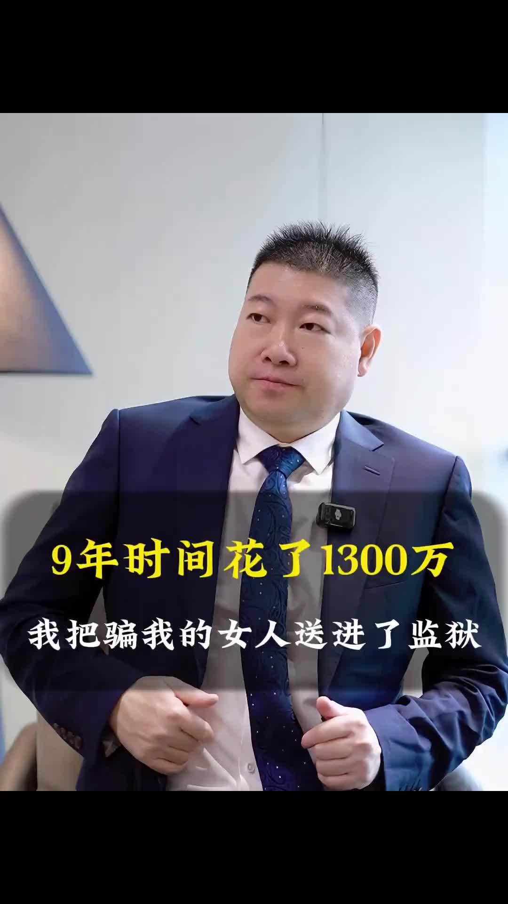

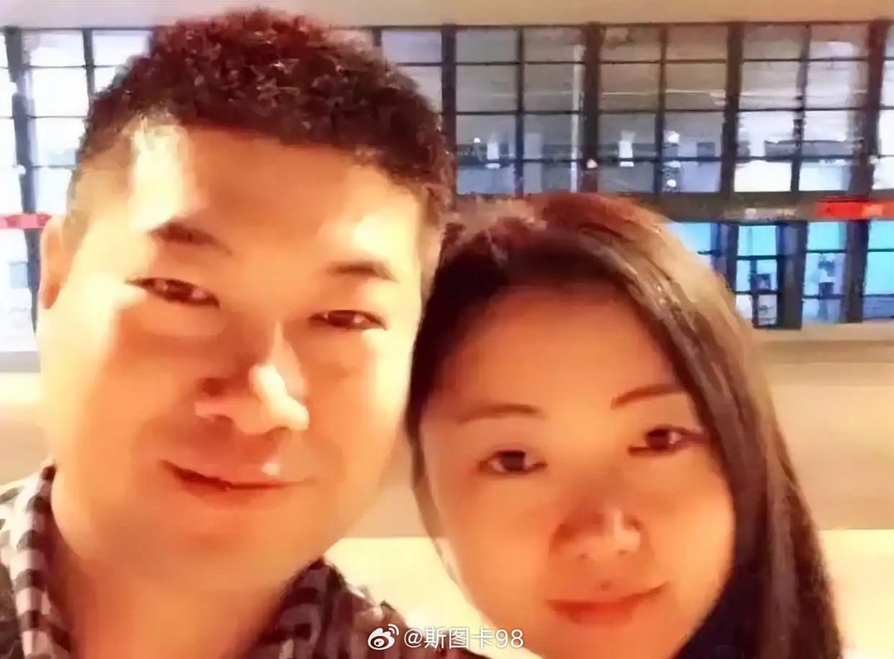

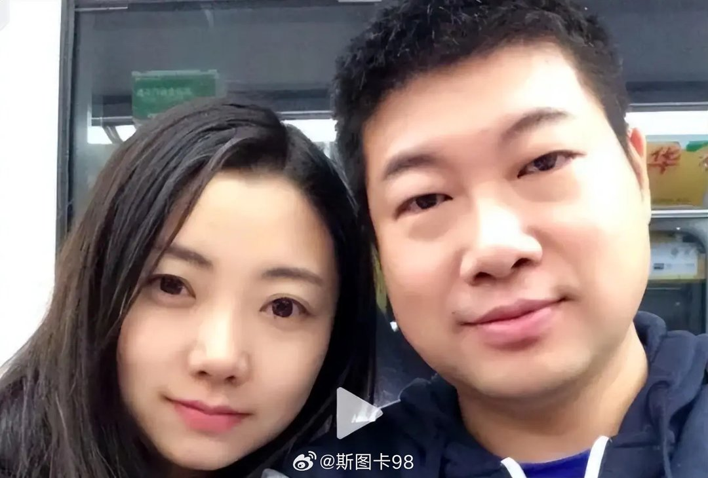

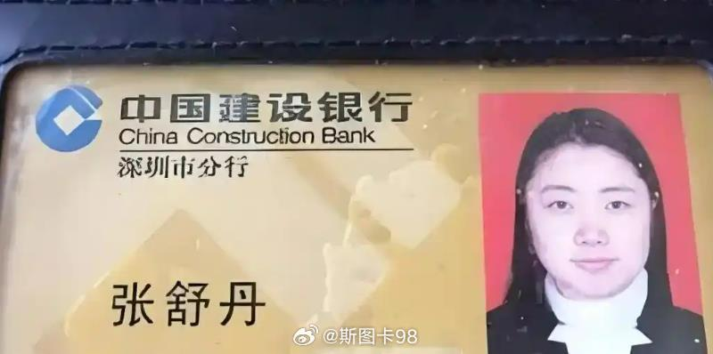

---

## 9

@崔紫剑

发表于：2026-07-07 01:33

来源：微博

链接：https://m.weibo.cn/status/5317976991468525

\#LV胜诉敲响中国纹样版权保护警钟\#

有许多胖友问我怎么看，我的观点如下：

如果我们的司法界和法学界们连个中国纹样都保不住，只能说养士七十七年，养了群废物。

我的观点讲完了。

---

## 10

@一纸琉涟

发表于：2026-07-08 00:45

来源：微博

链接：https://m.weibo.cn/status/5318327544054281

太讽刺了，

当大家还在为奶茶店侵权LV愤愤不平的时候，这家公厕站了出来，它不怕LV告它侵权。

因为公厕没有商业化盈利，是为方便大家内急用的公共场所，所以并不会担心被告。

相反，满世界找四叶草的LV在这一刻一文不值。

我们买不起LV，但也不能惯着他在我们国土上遍地撒野，你说是不是这个理。

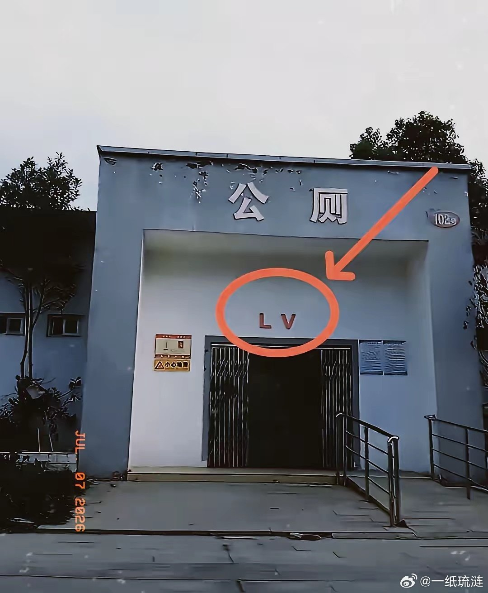

---

## 11

@不神经的神经叨

发表于：2026-07-08 03:17

来源：微博

链接：https://m.weibo.cn/status/5318365690206570

这几天我们医院在对新进的职工进行岗前培训，假如让我这个老油条培训他们，我会这样说：

1.多提供情绪价值，少冒医疗风险。

2.认真书写医疗文书，每一句话都要经得起法律推敲，每一句话都会可能成为陈堂证供。

3.工作多留痕，不管是对患者，还是对同事，习惯在摄像头下工作。

4.多说自己不行，少说自己行。

5.每一条医嘱，都要找到法律认可的证据支撑。

6.不拿患客户一针一线，不和客户做朋友，不和客户开玩笑。

7.除了你的家人，没人觉得你不可代替，你一点都不重要。

8.没人欠你，你也不欠任何人，你是来上班的，不是来交朋友的。

9.如果你承担不起相应的后果，就不要帮任何人做决策。

10.没有人会无缘无故对你好，但永远有人无缘无故的对你坏。

11.若非直接利益相关，就不要对事件发表评论，微笑就好.

12.不想让别人知道的事，就带进棺材。

13.任何事情，你只要告诉了任何一个人，就要做好全世界都知道的准备。

---

## 12

@王鹤诗

发表于：2026-07-08 22:21

来源：微博

链接：https://m.weibo.cn/status/5318653570450546

中国画《妈妈出海去》，绘画：肖纬、谢开基，广西人民出版社出版，1973年4月。愿广西人民平安。\#广西洪水\#

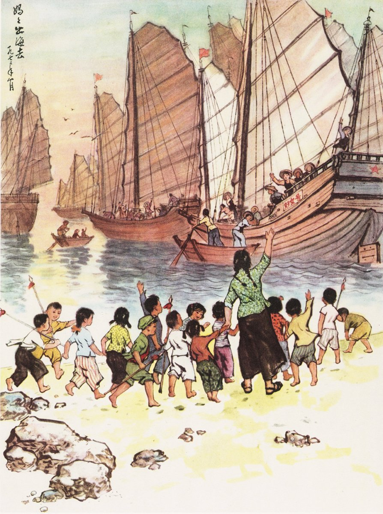

---

## 13

@庚白星君

发表于：2026-07-03 14:21

来源：微博

链接：https://m.weibo.cn/status/5316720898347866

中国电影正从一流娱乐行业变成二流娱乐行业

2026年以来，中国电影行业无比惨淡。从年头到年中，中国电影院一共上映了约163部电影，到目前上映的电影里，仅《飞驰人生》《惊蛰无声》《给阿嬷的情书》《消失的人》四部电影，分别盈利了大约12亿、2亿、6.7亿、1.7亿。剩下的电影里，除了《匿杀》《火遮眼》这类有一两部持平或微利，其它电影全部亏损，查了查网络数据，《星河入梦》大概亏了3.5亿、《镖人：风起大漠》大概亏了2亿、《抓特务》大概亏了1.5亿、《寻秦记》大概亏了2亿（以上数据不精准仅供参考），以前所有能扛票房的大明星，像黄渤、古天乐、胡歌、倪妮全部巨亏，而且是惨无人道的巨亏。

特别是黄渤和倪妮的《一个男人和一个女人》，按媒体估算，制作成本中两位主角片酬大概5000-6000万，两个月在香港实景拍摄，各种灯光摄制、后期剪辑、配角群演、剧组劳务等花了4000万，后期宣发大概又花了一亿（以上数据不精准），最终只收了382万票房，院线分账仅123万，连盒饭钱都不够，估计这部片会重挫两位主演的商业价值。上半年仅4部盈利、几部持平或微利，咱多算一点，算10部吧，除以163部新电影，目前中国电影的盈利率仅为可怜的6%，这个6%还是我高估了一些的数据，实际应该是4-5%的样子。

这个数据有多惨呢？中国餐饮行业大概10-15%的店铺能盈利，美容美发行业大概低端15%能盈利、高端30%能盈利，电商行业大概12-20%能盈利，物流行业大概30%能盈利，我最熟悉的服装行业，线下10-15%能盈利，线上6-12%能盈利。我上面列举的这些行业，是中国绝对的充分竞争行业，就是门槛极低，谁谁谁都可以上来比划两下的行业。

比如现在无论谁失业了，大厂的电商的房地产的，都忍不住去搞下餐饮试试身手，说明这行业入门真的没啥门槛，就是因为啥人都来，盈利率通常非常低，可10-15%的盈利率，依旧远高于电影行业。电影行业2026上半年这4-6%的盈利数据，是相当惊悚的，因为电影行业是资本行业，具备较高的入门门槛，不是啥阿猫阿狗就可以涉足的。哪怕是成本低到极致的《给阿嬷的情书》，那也是1500万成本啊，拿1500万现金流，去赌一群名不见经传的拍摄团队，不是谁都玩得起的。

再举个例子，我刚好认识几位影院公司的高层，他们投资高的影院一家要2000多万，普通的影院一家要1000多万，一家店一个月的运营成本要大几十万，一个月要挣差不多140万票房分成，才能将将覆盖一家店的运营成本，所以说电影行业就是资本密集行业，普通人无法参与的。民间常常流传影视行业有潜规则，俊男美女被大佬搂在怀里这种，其实电影跟金融行业一样，都是需要资本运作的，凡是需要大额投入的资本行业，就一定是高风险高收益行业，凡是高风险高收益行业，就必定诞生潜规则。

因为靠美色去以小搏大，事实上是付出极小而收益极高的投入，很多人难免不心动。为什么中国的顶美通常会集中在上海？因为上海是中国金融业的中心，金融业指缝里漏一点钱都够顶美一生衣食无忧，影视行业潜规则跟顶美靠近金融业一个道理，所有生活中的事情都是有逻辑的。依赖资本的高门槛行业，本来再差也差不到哪里去，2010至2015年，中国电影行业盈利率大概在10-15%、2016-2019年大概在12-18%、2020-2022年疫情期间大概在7-12%、2023年大概在10-16%、2024年大概在8-13%、2025年大概在7-11%。

对比其它充分竞争行业，再对比电影行业其它年份的盈利率，就知道现在这个4-6%的盈利率惨到什么地步了。可以说拿几千万片酬的一线巨星，一个接一个倒下，所有人突然间都没有了商业价值，一个接一个排着队被市场毒打。那到底是什么原因，造成了今天的惨状呢？市面上通常有两种观点，一种是电影圈的人不行，另一种是经济下行期大家不爱消费。我觉得这两个都不是。

先说第一个，网络上常听到的理论是电影圈这批人文化水平低、老登当道、靠题材偷鸡、电影质量一年比一年差啥的，一会儿怪贾玲一会儿怪冯小刚——我不是替他们说话，我不认识他们，没兴趣替他们挡子弹——我认为不是这个原因，是因为我从1998年就是影迷了，我有28年的观影经历，曾经每一年的奥斯卡、金熊、金棕榈、金狮获奖电影我都尽量找来看，每周的北美票房报告我都特别关注，个人观影量巨大，目睹过世界电影业的起起伏伏。

当前中国电影整体质量水平还行，跟中国电影史每个阶段比较，现在是中上水平。中国电影最烂的时候，充斥着各种肤浅的、靠炒作吸引大众进入影院的电影，因为那个阶段是中国电影全面商业化的早期阶段，《小时代》系列，以及《前任3》《富春山居图》《分手大师》《恶棍天使》出现的时期，才是劣质电影扎堆还能拿高票房的阶段，现在中国电影质量比那时已经好太多了，那年头甚至综艺都能进电影院，至今想起来还让我觉得不太舒服。

普通观众的观影量初期还比较少，啥事都看个新鲜，后来观众观影量上来了，这种电影炒不动了，中国电影圈才开始收敛了一些，质量也渐渐上来了。再说第二个，经济下行期不爱看电影，我认为这个观点不全对，但有一部分对，占一小部分原因。因为全球历史上，所有经济下行期时，恰恰是电影爆发期，经济不太好的时候，人极度需要情感上的关怀和共鸣，美国大萧条时期，制造业、农业、零售业大面积倒闭，失业率高达25%，恰恰此时，电影院客流爆满，1933-1939这七年，诞生了影史最多的传世佳作，《乱世佳人》《金刚》都诞生于这段时间。但为什么说有一部分对呢？

因为大萧条早期，美国人也是不爱看电影的，25美分的电影票大家不舍得消费，大量中产砍掉了娱乐开支，是1933年开始罗斯福新政后电影票房才上来的，1935年就稳定在每周6000-8000万观影人次，全年票房达到了7亿美元，逐渐成为全民娱乐刚需。我个人的观点是：随着全球局势紧张，全球娱乐产业都开始下滑，这是次要原因，主要原因还是中国网络极为发达，网络娱乐取代了需要出门消费的电影娱乐，将电影娱乐从一流娱乐产业，打成了二流娱乐产业。

全球传统娱乐产业一直在严重下滑，像全球CD、实体唱片在2000年曾达到370亿美元，2023年全球所有的流媒体、实体、数字下载音乐市场也才286亿美元。全球院线总票房2019年是423亿美元，经过2020年疫情最低时的118亿美元，到2025年也不过是328亿美元。

中国人应该感受特别强烈，我们已经多少年没听到过新的流行歌曲了？大家去KTV点的歌是不是几乎都是1990年代与2000年代的歌曲？武侠小说、言情小说、流行音乐、电影这四样文化产品，正在逐渐偏离主流市场，电影和流行音乐被打成二三线产业，武侠和言情甚至死得渣都不剩了。只有在流行音乐巅峰时，才会诞生迈克尔·杰克逊；

只有在武侠巅峰时，才会诞生金庸；只有在电影业巅峰时，才会诞生雷德利·斯科特。不是天才没有了，是产业下滑了，市场不受关注了。电影正在步武侠的老路，当年武侠为什么受欢迎？因为1980-2000年代，中国还没有进入城市化与工业化，还处在农业社会的尾端，只有农业社会才能接受武侠浪漫主义。

中国到2010年代开始全面实现工业化，武侠就从此迅速衰落，现在的小孩生下来就是法治与工业社会，已经不可能接受打打杀杀的江湖世界。电影的周期律是一样的，就是中国网络太发达了，移动端直接给民众提供了大量免费的娱乐产品，现在谁拿起手机，躺在沙发上，都可以轻易获得短视频、游戏、音乐、资讯等产品，还不用被人打扰，自己想干嘛干嘛，怎么爽怎么来。

而看电影，需要赶时间开车或坐地铁出门，需要花费几十块钱，然后跟一堆陌生人在一个黑漆漆的空间看一款娱乐产品，这期间不能切换、快进，不能说话，如果这部电影质量不够高，那种体验感真的远不如躺在沙发上刷手机。以现在人们对生活质量的要求，一部电影如果达不到中上水平，大家就觉得又浪费时间又浪费钱，真的还不如在家里打几盘王者荣耀，或者抖音上看看段子。

极其发达的网络产品，提高了人们的兴奋阈值，电影很难让观众兴奋起来，大家就会懒得大老远跑一趟去看。经济下行是一小部分原因，大部分原因还是大家觉得看电影没意思、不兴奋，懒得去看。电影产业还是会存在的，但是它的重要性在下降。每年的春节档还会是黄金周期，因为此时全家团圆，看电影是最方便全家一起出行又都能接受的活动，而其它档期都不安全，除了像《给阿嬷的情书》这种一年一两部的现象级产品，大众对电影的态度，就是“懒得出门，没啥兴趣去看”这种状态。

这样搞下去，挤进春节档会成为中国电影最重要的一件事，一年能赚钱的电影，50%也就春节档那几部，平时就靠运气或者超然实力偶尔爆发一两部。电影产业以前一直比电视剧、短视频要高一等，现在这个产业急剧萎缩，将无法容纳那么多的一二线明星、导演，市场太拥挤，中国将会有大量明星与导演从这个赛道掉下来。

一个一年盈利率仅4-6%的行业，注定最多是一个二流行业，它将摧毁大量依赖它为生的业态，摧毁投资与观众，重新自我调整，适应网络时代新的娱乐位置。简单来说，武侠文化败于工业社会，电影产业败于网络社会，用不着为任何事物的褪色惋惜，在什么时代，去做合适的事情就行了。

---

## 14

@科工力量

发表于：2026-07-08 01:26

来源：微博

链接：https://m.weibo.cn/status/5318337699250562

【前华为天才少年吐槽DeepSeek反转 投资人紧跟炮轰：最没契约精神的创始人】近日，曾入选华为天才少年的中科大博士李博杰，因公开吐槽DeepSeek糟糕的面试经历登上热搜，而事件发酵过程中又迎来反转，被合作投资人公开指责缺乏契约精神，引发热议。

7月6日，这位前华为"天才少年"、中科大少年班博士公开吐槽了自己面DeepSeek的遭遇：流程拖沓半个月、面试官迟到且态度轻佻、无证据指控他抄代码。

李博杰自述笔试通过后，DeepSeek拖了半个月才安排面试，反复催促才有下文。二面面试官迟到，对他介绍的研究成果评价轻佻，反复追问"有什么工程挑战"。

此次面试最大的争议发生在代码考核环节。他平时用两块屏幕工作，面试也是双屏环境。面试官注意到他频繁看向左边屏幕，直接指控"你在抄代码"，要求他停止，并表示"如果不能证明没有抄代码，面试就无法继续"。

李博杰当场终止了本次面试，并将全程经历公之于众。

就在舆论聚焦DeepSeek面试流程时，事件迎来反转。ABCDE Capital创始人、币圈资深投资人杜均公开发声，直接炮轰李博杰品行问题。

杜均表示，李博杰是其合作过最没有契约精神的创始人。据他描述，2024年李博杰顶着"华为天才少年"光环创办Metagent，获得ABCDE Capital投资。

但拿到钱之后，他拒绝履行投资协议约定的基本义务——包括向投资人同步业务进展、财务情况——随后直接失联。

合伙人庄思源在被多次要求提供财报时同样停止回应并失联。Metagent最终无疾而终，两位创始人此后另起新项目，新项目似乎又失败了。

杜均的话很直接："风险投资可以接受项目各种失败，但不能接受创始人拿到钱直接跑路的欺诈行为。"

随着事件发酵，面对全网争议，李博杰更新社交动态作出说明。他表示自己目前任职Pine AI首席科学家，旗下Pine AI产品增长态势良好、公司运营稳定，并非因创业失败才选择求职。

此次求职DeepSeek，是希望进入基座模型企业，探索大模型更高的智能技术上限。同时，他主动纠正个人身份，强调自己并非Pine AI创始人。

截至目前，DeepSeek没有回应面试风波，李博杰也没有再回应投资人炮轰。

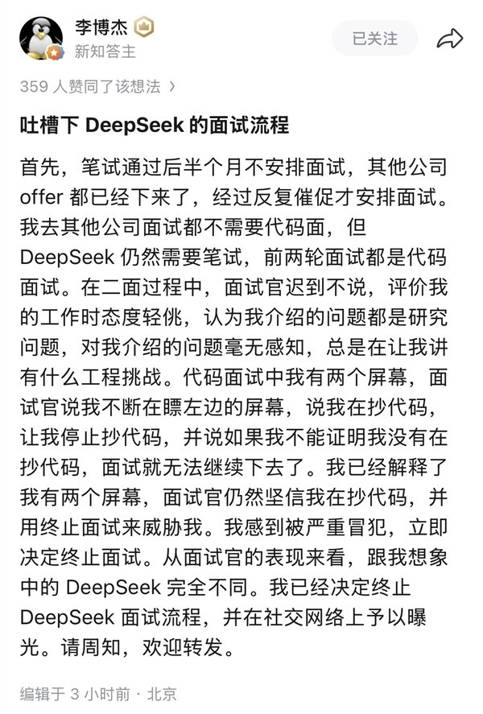

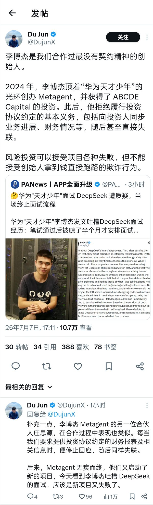

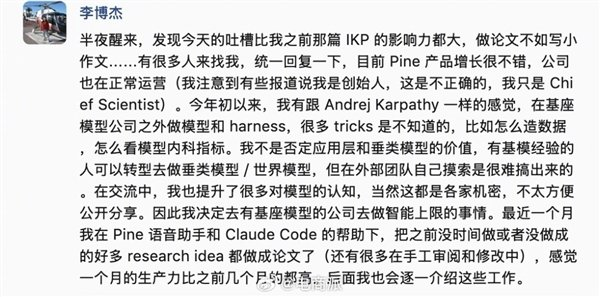

---

## 15

@汉特CHEN

发表于：2026-07-07 23:50

来源：微博

链接：https://m.weibo.cn/status/5318313685288368

小红书IPO举报？三年了，我为什么逮着小红书不放？

自我本人将实名将“小红书主体上市合规投诉”递交至中国证监局、港交所后，收到大量网友、媒体关注，先做基础身份澄清：

我并非所谓小红书高管，仅为前普通员工，劳动合同岗位为“生态销售 Leader”，负责华南本地直客销售部。初期管理广州团队，试用期内新增重庆团队管理权限，统管 26名一线销售和4名销售组长，也是北上广三地本地直客团队里唯一跨两地的业务负责人。

很多人问：公司已经赔付80多万，为何还要向监管部门提交线索？

如果你是我，以下几个问题：

1、若你踏实履职、业绩产出稳定，拥有清晰职业上升路径，却无端遭受职场恶意打压，你会甘心吗？

2、若你只是在绩效互评客观陈述同事真实工作表现，事后就遭到 HR 针对性报复辞退，你会妥协吗？

3、若靠业绩谋生的销售，被企业凭空捏造 “业务不达标” 作为解约借口，你能接受这份污蔑吗？

4、上述所有不公，全部集中发生在我父亲病危、离世的艰难阶段，换作是你，能默默咽下所有委屈吗？

5、当初向上海相关部门反馈问题，对方告知无法核实，只能走仲裁诉讼，你会放弃维权吗？

6、全程诉讼过程中，企业各类答辩说辞前后矛盾、漏洞百出，面对明显的诚信瑕疵，你会视而不见吗？

7、维权公开后，已有五十余名前同事联系我哭诉，大部分遭遇行权前被无故辞退、期权清零的相同对待，我能坐视不理吗？

我十分热爱生活，过去两年走访多国，始终认定祖国是最安心的归宿，也是广州两级法院给出公正判决，还给我公道。

人活着，钱财只是一部分，公道与一口气，同样值得全力争取。八十多万赔偿仅弥补我一部分经济损失，却抹不掉恶意裁员、失信陈述、批量侵害员工权益这一系列客观合规缺陷，这些风险理应完整披露给港股投资者与社会公众。小红书是否能上市并非我能左右和影响意义，我希望小红书公司能痛定思痛、合规经营、不要再害职场人了。

本人无需任何额外物质赔偿，仅求一个“参与他人背调被泄露和针对报复、向HR提起绩效互评却被离职”的调查和道歉。

声明：本人陈浩，心态积极、生活自律，无抑郁、消极轻生等心理问题，遵纪守法、行事谨慎；30 岁前已配齐知名保险公司全部人身、健康类保险。如若后续我出现任何非正常意外，背后缘由不言而喻。\#小红书上市 被举报\#\#职场\#\#清白\#\#职场常见的打压手段\#头条新闻工作室

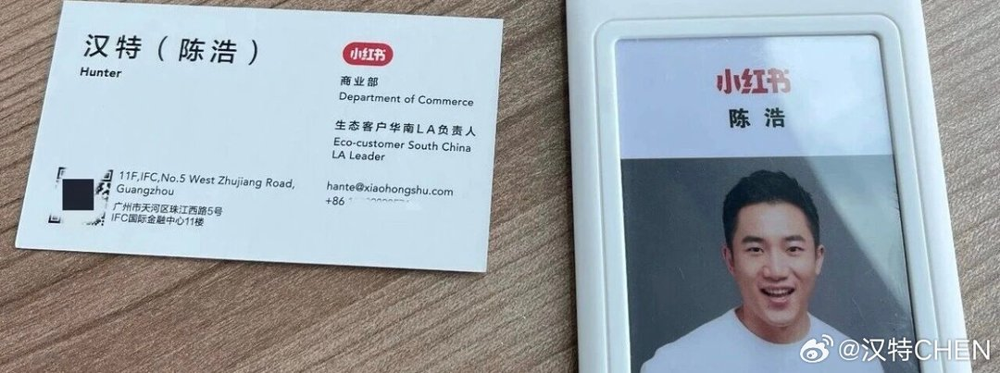

---

## 16

@一玶海岸

发表于：2026-07-07 03:05

来源：微博

链接：https://m.weibo.cn/status/5318000139831370

4:1，比利时扬眉吐气，美国队输球又丢人。

打电话给国际足联，把红牌处罚取消后，还是输，还输这么多……

现在推上的足球迷们正在群嘲美国队。

我建议阿川给比利时加关税。\#大v观赛团\#\#大v观赛团\#\#世界杯边看边学\#

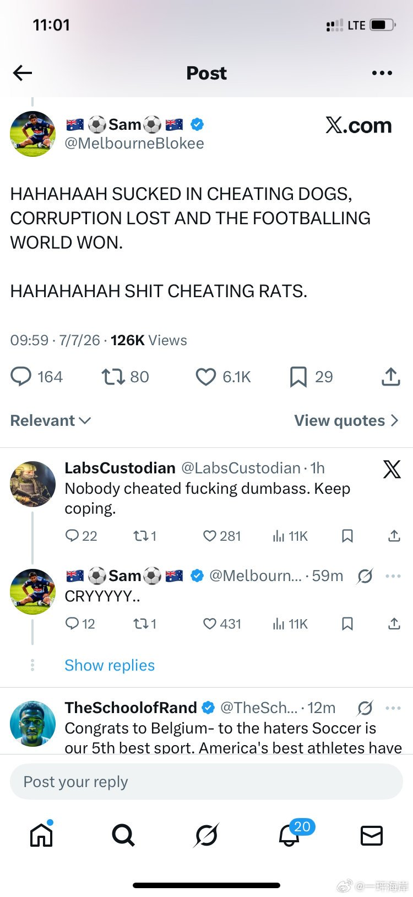

---

## 17

@少年伯爵

发表于：2026-07-08 10:01

来源：微博

链接：https://m.weibo.cn/status/5318467390799881

案例via陈平：“以前我在海外的建筑工地呆过一段时间，天天跟工人老哥们混在一起。一开始我觉得这些老哥都是没受过多少教育的体力劳动者，心里多少有点轻视他们。可是在一起呆的时间长了，我发现我见识短了，工地上简直藏龙卧虎。有人力气特别大，有人会画画，有人会跳舞，有人会用食堂发的苹果酿酒，这在禁酒的穆斯林国家简直是垄断技术；有人初中毕业普通话都说不好，在非洲两年学了一口法语还娶了当地的老婆；有人小学毕业却能看懂施工图和施工计划，还能给设计部和工程部提优化建议。有个钢筋工长只有初中学历，但是自己研究了一个巨好用的EXCEL表格可以非常精确地算量，以至于局里派来的博士都得跟他请教问题。有一次浇筑大体量混凝土时我们遇到了混凝土内部水化热问题，试块核心温度超过100℃，混凝土报废。当时工人们和工长们积极献计献策，根据他们的经验搞出了不少有效的在热带地区给混凝土降温保温的措施，最后我们成功浇筑了一万多立方的混凝土，大家专门搞了个庆功宴大吃大喝，把食堂师傅累够呛。食堂师傅们也是深不可测，有一个师傅教会了附近的黑人种中国的各种蔬菜，还教会他们说汉语，于是我们在黑非洲也能吃到新鲜的中国菜。这个师傅做饭特别好吃，直接摆平了当地一个议员，在议员帮助下我们在当地的工作推进得非常顺利，议员请当地政要吃饭都来我们项目部的食堂，他觉得这是全国最好吃的私房菜，于是我们也跟着认识了好多高官显贵，工作更好开展了。我觉得这个师傅完全可以给当地的总统当国宴大厨，就看他愿不愿意留在非洲。

这些人都是我们身边的普通人，每个家族里都会有这么个人，没念过多少书，从事体力劳动，有一个不为人知的莫名其妙的经验或技能，从来不是小孩的榜样。但是这些莫名其妙的技能累加在一起就会产生巨大的能量，在和平年代可能是解决了大体量混凝土的水化热问题，解决了非洲政府卡我们项目的问题，在动荡年代很可能就变成了攻城略地摧枯拉朽的洪流。我有时候就觉得，如果把工地上的老哥们集中起来训练一下，没准就能夺取一个非洲小国的政权，老哥们里头会涌现出许许多多机智勇敢的英雄，可以写进历史，他们都有这个潜质。当然老哥们在没受过专业训练的时候也靠手里的钢筋头子打跑过小股kb分子，还缴了他们的枪。所以英雄不是从天而降的，而是群众中的一员，随着时势的到来，平时插科打诨的老哥们会源源不断地产出英雄，直到时势被大家的努力改写。这个观察对我个人的启发是：如果关起门来自己瞎想就会被越来越多的问题困扰，但是如果走出门和人民群众一起工作一起生活，这些问题慢慢就会被人民群众解答了。”

---

## 18

@庄时利和

发表于：2026-07-08 05:36

来源：微博

链接：https://m.weibo.cn/status/5318400626396892

淋巴瘤从大类来说分为霍奇金淋巴瘤和非霍奇金淋巴瘤（病例数大概1：9），非霍下面又有大几十种不同的分型，非常复杂。不同的淋巴瘤预后也差别很大，有些惰性淋巴瘤甚至可以什么治疗都不做，而有些的进展非常凶险，甚至中位生存期不到1年的。

比如李开复得的滤泡性淋巴瘤，就算是淋巴瘤里面预后比较好的；而网传高善文的血管免疫母细胞性T细胞淋巴瘤（AITL），五年生存率就低得多。而儿童淋巴瘤的整体治愈率也比成年人更高，再比如说非霍当中的Burkitt淋巴瘤，这是已知倍增时间最快的人类肿瘤之一，不做治疗的话甚至几周可以致命。但也因为其细胞增殖极为活跃，对化疗也非常敏感，现在Burkitt淋巴瘤在一些国家的儿童当中治愈率能达到90%左右，成年人也有70%以上。

附图是我很多年前用过的数据，非最新的。

大多数人对淋巴瘤的了解非常少，这很正常，这个病的诊断治疗相当复杂，分析个例的意义不大，更不应该去评判一位患者做错了什么。时至今日淋巴瘤、白血病等血液肿瘤也没有什么早期筛查方法，更别提普通人怎么去预防了，大多数患者只是运气不好而已。

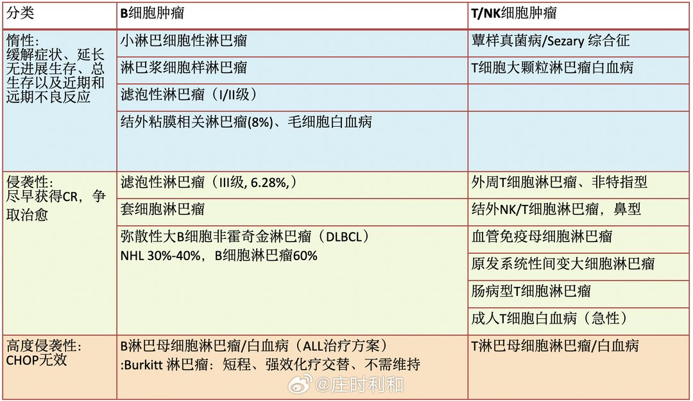

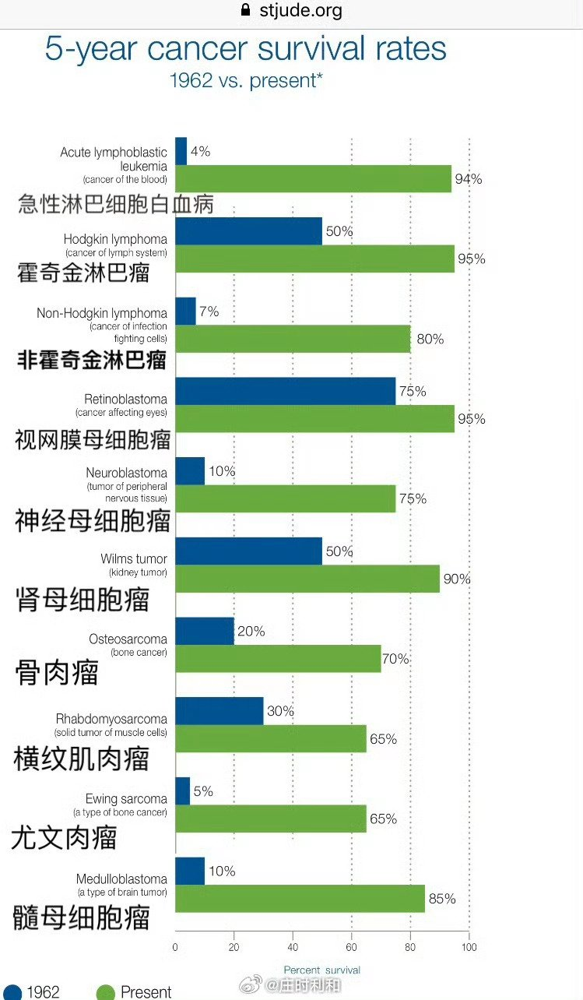

---

## 19

@宝玉xp

发表于：2026-07-08 05:46

来源：微博

链接：https://m.weibo.cn/status/5318403267236670

刚看了篇关于如何写出好的 Skill 的文章《How do you write a good skill? There's actual data now》，大部分还是不错的，也有些不严谨之处。

1. 不要让模型自己写自己的 Skill ❓

文章意思是人类专家写的技能比 AI 写的更好，应该人来写技能而不是让 AI 写 Skill。

> 让智能体自己给自己写 Skill，这个想法非常诱人。SkillsBench 专门测试了这一点：每个任务都在三种条件下运行，无 Skill、专家策划的 Skill、模型自生成的 Skill。专家策划的 Skill 显著提升了通过率。模型自生成的 Skill 完全没有帮助，平均还比无 Skill 基线低 1.3 个点。作者的结论是：模型无法可靠地产出那些它在使用时会受益的流程性知识。

这条其实不够严谨，AI 是能写 Skill 的，只要人提供好上下文就可以，而不是简单的说别人模型写 Skill。而且就算是 AI 训练过的知识，让 AI 把一些操作路径、输出风格格式固化下来都是有价值的。

也不是说是错的，完全指望 Agent 帮你写 Skill、进化 Skill 还是不太够，还是需要人去引导会更好。

最佳组合是人指挥 AI 写 Skill。

2. 面面俱到，反而糟糕 ✅

聚焦于核心内容、仅包含两三个文件的技能，其表现要远好于一大堆文件的集合，也胜过长篇大论的文档。那些试图把所有东西都写进去的“全面型技能”，反而会把任务通过率拉低到不如不用技能的水平。“细节丰富且范围明确”的做法，每次都能完胜“百科全书式”的做法。

确实如此，Skill 不要追求大而全，小而精更好。

3. 加载的技能越多，智能体反而越笨 ✅

技能虽然是按需加载，但也是占用上下文的。不是越多越好。

4. 必须在要支持的每个 Harness 中进行测试 ✅

Skill 虽然是通用，但是不同 Agent 或模型还是有差异，比如 Codex 有自带画图工具，Claude Code 没有；比如 Claude 是多模态的能看图片，GLM 不能看图；这些都需要测试，并且针对性的写一些兼容性的说明。

5. 瞄准模型最薄弱的领域出击 ✅

> SkillsBench 按照不同领域测量了技能带来的提升效果。结果差异巨大：在软件工程领域只提升了 4.5 分，而在医疗保健领域则飙升了 51.9 分，制造业紧随其后。技能对软件开发领域的帮助最小，因为模型早就被海量的代码预训练数据“喂饱”了；而技能帮助最大的，恰恰是那些训练数据覆盖薄弱的领域。

说的挺对的，我几乎不用软件工程相关的 Skill 正是因为这个原因，像 superpower 这种 skill 对于好的模型真的提升很有限。

6. 不测试，你永远不知道技能好不好用 ✅

> 找一组任务，运行两次：一次加载技能，一次不加载，保持其他所有变量绝对一致。用同一种标准给两次结果打分，然后看看差异。

技能是需要测试的，但有些技能的测试结果是不好量化的，这时候还是需要依赖专业人士的判断。

文章地址：x.com/aparnadhinak/status/2074569427346174039

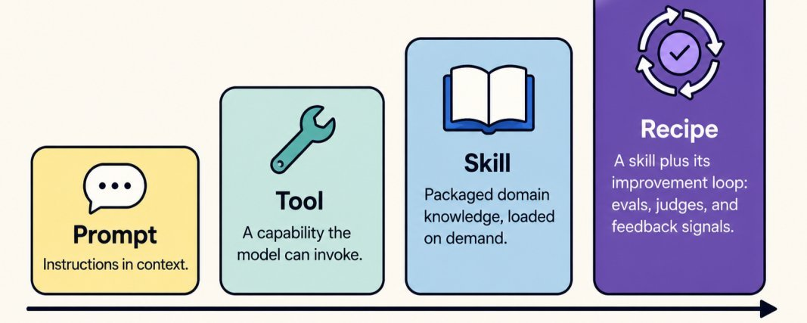

---

## 20

@李建秋的世界

发表于：2026-07-08 05:47

来源：微博

链接：https://m.weibo.cn/status/5318403469608966

高善文的事情，评论区太幼稚了，好多人是后来键政的，不知道当时高善文引发的恶劣影响，这里面有两次，一次是2018年5月份，他发的《中美贸易摩擦深处的忧虑》，第二次是2018年7月山西证券闭门演讲，7月份的最为激进。

我给你放一段“比较温和的”，因为激进的没法放：

“中国的开放政策的核心不是向伊斯兰世界开放、不是向拉丁美洲开放、不是向

非洲开放，中国的开放就是融入到以美国为首的全球市场经济体系中。开放的准确

含义，是向以美国为首的西方世界打开大门，将中国的经济毫不犹豫地加速融入到

以美国为首的西方市场经济体系之中，融入到以美国为首的全球经济治理体系之

中，这是中国的开放。而在一定意义上，改革是为了适应这一开放的格局，把不匹

配的制度安排改掉，使得中国能够完成这样的融入过程。

中国改革开放40年能取得如此伟大的成就非常不容易，其中开放政策是极其关

键的。而开放最主要的就是向以美国为首的西方市场经济体系开放。开放具有这样

的限定，意味着开放不是单边的。如果中国加速向美国开放，美国加速把大门相对

中国关起来，中国的开放还有用吗”

---

## 21

@渔老板钓鱼

发表于：2026-07-08 05:26

来源：微博

链接：https://m.weibo.cn/status/5318398118726537

一段真实的对话

孩子：妈妈，咱们买杯茉莉奶白吧

妈妈：为啥？

孩子：因为LV把它告了，要赔很多钱，外国人欺负中国人，我们要支持中国企业。

…

茉莉在茶饮领域本来名气不是头部，这下好了，生意爆单，金地店目测比以前好了很多。

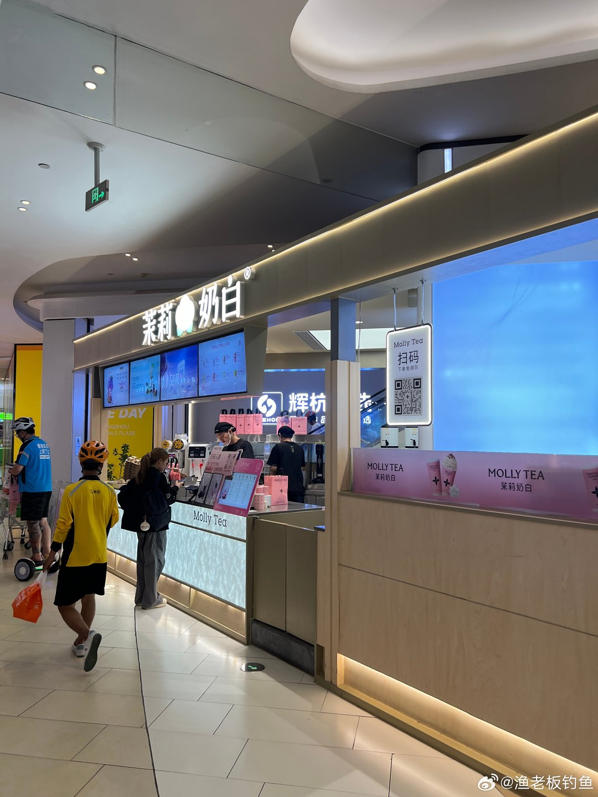

---

## 22

@sven_shi

发表于：2026-07-08 03:31

来源：微博

链接：https://m.weibo.cn/status/5318369269776989

热搜上这个\#15岁女孩遭5男共谋性侵致重度烧伤\#是一个很悲惨，但是调查结果和现实对不上，并且导致出现了严重信任危机的案子。事情可以查清楚，有客观证据的，是这个女孩子15岁初三，不想读书了，得到父母同意后就回家去了。接着她和5个成年男子聚集在一起吸食笑气，醒过来之后，去抽烟，她点燃香烟引燃了泄漏的煤气，导致爆炸。

从事后的伤情来看，确实是她点烟。因为她在爆炸中心，伤的最重，另外还有3个人也是重伤。造成的结果就是这个女孩子到现在为止花了150多万治疗。

这个案子如果就这样，属于糊涂案，很难定责。很可能是要这个点烟的女孩子和另外两个人一起赔偿重伤的另外三人。

接着警方的调查就让这个案子变得更加糊涂了。警方认定这案子当中这5个男的串供了，说这是一个强奸案。说两个有案底的人是准备强奸这个女孩子，所以故意放出了煤气，准备把这个女孩子迷晕后强奸。这样一来这个案子的结果就变成女孩子无责，另外三个重伤的男的也没责任，两个有案底的人是预谋强奸导致严重后果，由他们两个去赔偿。

从结果上来看，相对是正义的，但是过程不对。

原因吸食笑气后，人连站立都困难，没有办法去强奸，而且女孩子和他们一起吸晕了之后也没有被性侵的痕迹。最关键的是说他们故意打开燃气准备迷晕女孩子强奸这点太反逻辑，因为6个人同时在一个密闭房间里，他们怎么做到只让这个女孩子晕倒呢？

并且，如果他们是故意打开燃气准备迷晕女孩子，又拿香烟给她抽。然后让她把整个房子给炸了，这不就变成典型的自杀了吗？

所以这个案子就成了一个糊涂案。说是预谋强奸导致，口供也对不上，都说别人是主谋，是别人想出来的故意开煤气迷晕人。另外三个重伤的不追责，也圆不起来。家属是想五个人一起给女孩子赔偿，所以事后报导的时候，就用了家属的说法。警方这边给出的版本是重伤的三个男的无责任，没受伤的两个策划放煤气迷奸。

这个案子就前后对不上了，就是完全没办法用客观证据拼凑出一个合理的解释。

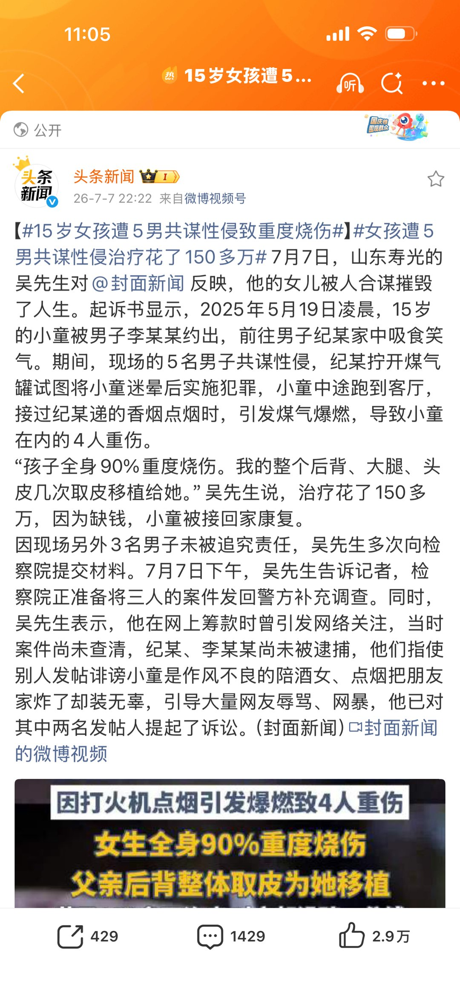

---

## 23

@老猪的碎碎念

发表于：2026-07-07 13:43

来源：微博

链接：https://m.weibo.cn/status/5318160884173795

忽然发现大型铁制文物最好的保存方法是：编一个祈福的故事，让游客全年不间断的摸！形成油光锃亮的包浆可大大减缓氧化成渣。*对比组，以前可以摸的黄河大铁牛和被专家精心保护成废铁渣的沧州铁狮子。

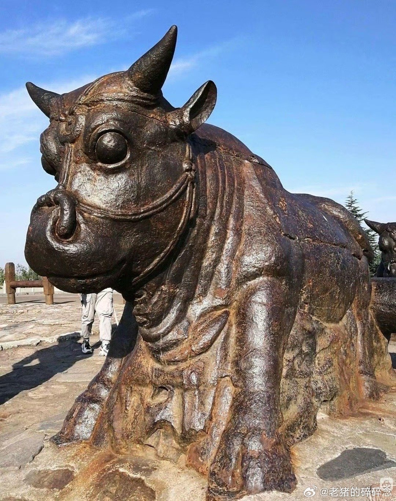

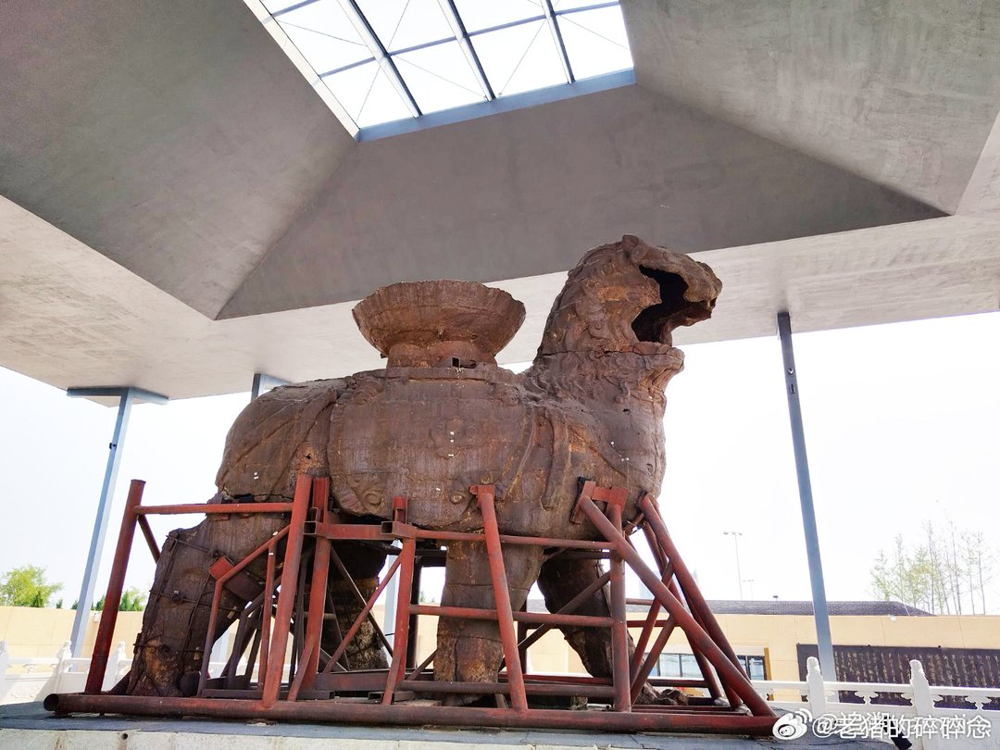

---

## 24

@投资人黄海

发表于：2026-07-07 04:00

来源：微博

链接：https://m.weibo.cn/status/5318013982083403

餐饮外企大撤退

大量知名的国际餐饮品牌，总部正在退出中国市场。

我们中国消费者耳熟能详的国际大品牌，现在中国的业务，几乎都是由中国的企业或者投资机构在操盘。

这个现象不是今年才开始发生。

2017年，麦当劳中国就出售给了本土投资机构中信资本。2017年以后，麦当劳在中国的官方名字也改成了金拱门。

今年以来，这个趋势正在加速。26年2月份，CPE源峰，也是投资行业里的资本集团，宣布买下了汉堡王中国的运营权。

源峰和汉堡王美国总部，一起在中国成立了合资企业。中国投资者占比83%，是毫无争议的控股股东。源峰会注资3.5亿美金到汉堡王中国这个合资企业，帮助其后续快速发展。

26年4月，星巴克也宣布，和中国投资机构博裕资本的交易正式交割。博裕资本以40亿美元的代价买入了星巴克中国60%的股份，星巴克美国总部保留40%的少数股权。

未来星巴克中国的发展，将由中国的控股股东来说了算。

关于这个交易案例，我在前几个月的文章《咖啡战争》当中有详细的分析，感兴趣的朋友可以翻开阅读。

到了26年的六月份，必胜客中国这个品牌，被百胜美国总部出售给了百胜中国。

这里面大家可能听糊涂了：为什么必胜客中国会被百胜美国卖给了百胜中国？这两家难道不是同一个企业吗？

并不是这样的。百胜美国是一个来自美国的上市公司，它拥有肯德基和必胜客在全球范围内的品牌所有权。

而在很多年以前，他已经把肯德基和必胜客的中国区的代理权交给了百胜中国这家公司，而百胜中国是一家独立在香港上市的公司。

这次的交易意味着百胜中国翻身当主人：它不再是必胜客这个品牌的中国代理商。他把必胜客中国区的品牌所有权从总部买过来，从代理商变成了所有人。

从此以后，必胜客在中国的业务，就和美国人没有半毛钱关系了。

同样在六月份，另外一个消息传出：来自中国的柠檬茶品牌柠季，收购了哈根达斯在中国区所有的门店业务。

哈根达斯在中国的门店业务，原来属于美国的食品巨头通用磨坊。

这笔交易没有对外宣布价格。估计是一个象征性非常低的数字。因为哈根达斯在国内虽然拥有260家门店，但这些门店是处于亏损的状态当中。

同时，通用磨坊这个集团，最擅长的是经营消费品包装食品的业务，例如说酸奶、零食，线下门店的经营并不是它的强项。通用磨坊早就想把哈根达斯线下门店这个烫手的山芋扔出去。

这次柠季买到的，也限于哈根达斯线下门店的业务，包装类冰淇淋的业务依然归于美国人掌控。

无论如何，这一大波操作下来，这些国际性餐饮品牌，他们在中国的业务基本上都卖给中国人了。

哪怕是肯德基，中国最大的餐厅品牌，虽然百胜美国依然保持着品牌的所有权，但在中国的代理权和经营，过去20年以来，一直是由百胜中国所操盘的。

百胜中国直到今天，依然是全中国市值最高的餐饮企业。

它的市值超过了1000 亿港币，超过了海底捞，超过了瑞幸咖啡，也超过了蜜雪冰城，依然是毫无争议的第一名。

百胜中国旗下最强的品牌是肯德基，其次是必胜客。肯德基和必胜客作为洋品牌，他们在中国屹立不倒，业务发展甚至都超过了美国总部。

在美国市场，肯德基和必胜客都可以说是江河日下。

所以并不是美国人厉害，肯德基和必胜客在中国的辉煌，靠的就是百胜中国自身管理层。在经营本土化这件事情上，百胜中国的决心最强，开始本土化的时间也最早。

与之相对的是星巴克。星巴克的美国管理层在前几年，开始有想法找来本土的合作伙伴，来主导星巴克在中国的发展，但一直犹豫不决。直到2026年，星巴克才确定了中国的合作方。

现在星巴克在中国只有8000家门店，老对手瑞幸咖啡已经接近3万家门店了。

无论是从门店数量、营收还是利润的角度，星巴克早已不是中国的第一咖啡品牌。

如果星巴克美国的总部，能更早下定决心把中国区的业务交给本土合作方，星巴克中国当下的情况不会这么被动。

当然，我们也可以看得出来，最近几个月星巴克中国进行了本土化的改造以后，一些门店的细节已经立竿见影，和以往有所区别了。

这些门店体验的优化来的有点晚，但总比不来要好。

有一个我自己感受最深的细节，就是门店的歌单。

在最近几个月星巴克门店的歌单，和以前发生了翻天覆地的变化。以前星巴克门店的音乐都是一些英文歌，什么爵士乐、民谣风、乡村风，要打造的一种美式中产的氛围。

中国区门店是没有权利去更改歌单的，美国总部说要播什么就得播什么。

星巴克中国独立运营之后，门店的歌单就变成了大量的华语流行歌曲，更加符合中国消费者的文化习惯。

现在选歌的权力甚至被下放到每个门店，店长可以根据自己门店的属性，自主调整歌单。

例如说，一个开在社区旁的门店，可以播放更加舒缓和温馨的音乐。而在年轻潮流商圈的门店，可以选择更加活力的说唱歌曲。

星巴克中国未来三年最重要的本土化战略，叫做千店千面。上面提到的音乐歌单的改变，是其中的一个缩影。

整个门店的装修和设计风格，都可以随着在地文化和特定场景，来进行改造。

例如说今年星巴克就在我的家乡，广州的永庆坊，开出了一家广府文化的特色门店。

这家门店的定位是广府文化的非遗会客厅，主打粤剧戏台装修风格。这个事情在以前很难想象：星巴克作为一个美国品牌，怎么会跟广东的粤剧文化产生联系呢？

在中国独立运营之后，这件事情就变成了可能了。

无论是音乐还是装修风格，都是消费者体验的重要部分。大部分消费者去星巴克，都不是仅仅为了买一杯咖啡产品，更多的是要享受星巴克门店带来的整体体验。

分析到这里，大家应该都能明显感受到，「体验化」是当下中国商业的重要趋势。

这是我在著作《趋势红利：新商业增长机会》当中，对中国未来商业趋势的分析里，其中一个最重要的趋势。

在经济增速放缓，社会心态普遍焦虑的情况下，体验型商业将是未来少有的朝阳行业。

究竟体验型商业要如何打动消费者？这里面的一些经典案例，我在书中有更详细的展开。

对于体验型品牌的长期兴趣和跟踪，也促使我组织了今年的两场游学：上半年已经结束的日本游学，和9月份即将启航的韩国游学。感兴趣的朋友。欢迎关注公众号文章。

回到这篇文章的主题：餐饮领域的知名洋品牌，总部都在纷纷撤出中国。

另外一个典型案例当然就是哈根达斯。

哈根达斯在中国开设高端的冰淇淋门店，已经有20年的历史了。这件事情的历史也很有意思：哈根达斯在欧美，一直是卖包装冰淇淋的。

它在海外，本来不会自己去开店。

20年前，哈根达斯中国区在卖冰淇淋的时候。他们的团队发现，以当时中国社会的消费力，消费者对于动辄三四十块钱一盒的冰淇淋很难买单。

很多朋友可能都记得，当年哈根达斯的冰淇淋，称得上是天价。

冰淇淋卖不动怎么办呢？当时的团队灵机一动，要不开这种高端的线下门店，有助于提升品牌形象。

消费者会觉得，哈根达斯的门店卖的冰淇淋五六十元，在超市、酒店、机场渠道看到哈根达斯的包装冰淇淋，只卖30元，可能会更容易买单。

哈根达斯的门店业务，从第一天开始，很大程度就是为了推广包装产品的业务存在的。

没想到门店开业那几年就火了，很多年轻情侣的约会，闺蜜的下午茶都愿意去哈根达斯。

当年哈根达斯在中国开店，本身就是中国团队的本土化尝试。这一步在20年前是成功的。

但随着团队的迭代，近年哈根达斯线下的门店迭代缓慢，没什么新品，而且性价比越来越低，国内的竞争对手也纷纷涌现。

例如，我在之前文章里面分析过的野人先生，主打的产品虽然也不便宜，每一份冰淇淋二三十元，但定价毕竟只有哈根达斯的50%。

同时在口味、新鲜度、含糖含脂量这些健康属性上，野人先生也为中国本土市场做出了非常多优化。

野人先生目前的门店接近2000家，早已远远超过了哈根达斯的数量。

最近我还进一步观察到，野人先生作为本土品牌，逐步把门店开到了商场的一层，开到了国际大品牌像优衣库、星巴克的边上。

大部分的冰淇淋、奶茶、咖啡这样的轻餐饮品牌，在商场只能开负一层。

别看一层跟负一层地理位置差别不大，在消费者心目中的差距非常明显：开在一层的品牌都是大品牌，负一层的小餐饮，则快速淘汰，每一两年就迭代一波。

野人先生的品牌势能的提高，也受益于哈根达斯的势能下滑。

这次柠檬茶品牌柠季收购哈根达斯，一方面，是哈根达斯的美国总部通用磨坊集团，想甩掉这个烫手山芋。

另外一方面，柠季自身的发展目前也遇到了瓶颈，自然考虑通过冰淇淋拓展自己的第二曲线。

分享完这么多国际品牌退出中国的现象之后，我们来总结这个现象背后的商业逻辑，和给我们带来的启示。

我的观点是，中国餐饮已经变成了一个越来越本土化的行业，背后的原因在于，中国消费者的口味天然是快速变化的，跟世界的任何一个国家都不一样。

餐饮企业的管理层，必须要人在一线，要去不断拥抱市场的变化。这是中国餐饮行业的一个重要特色。

老百姓的生活，主要就是衣食住行。除了吃，另一个日常消费市场就是穿。但吃和穿这两个行业它的区别非常大。

我们看耐克，还有Lululemon、昂跑，这些我以前在文章里分析过的海外品牌，他们在中国依然具备着极大影响力，是不可能让中国区的业务独立经营的。

背后的原因非常简单，全世界消费者的运动穿着需求，具有更强普世性。

中国的消费者买运动服和运动鞋，是希望能跑得更快，打篮球的时候能够跳得更高。在健身和瑜伽的时候更加舒适。

这些需求不会随着国家而改变。但餐饮行业就不一样了。

中国人喜欢喝奶茶，吃麻辣烫，喝咖啡的时候也得由瑞幸这种本土企业去打造出生椰拿铁，这是一个星巴克以前听都没听过的口味创新。

中国作为一个对吃非常讲究的国度，在吃这件事情上的追求和口味复杂度，远远胜于美国。

这样的行业需要更强的一线体感，绝对不能远程指挥。

多年以来，星巴克的西雅图总部一直在指挥中国国内的业务，这件事情已经被验证走不通。

餐饮行业的竞争又非常激烈，因为它的进入门槛不高，但做大的门槛很高。

所以对于大品牌来说，它要面对很多中国的区域化品牌的挑战。

在咖啡领域，星巴克除了遭遇瑞幸这种全国大品牌的挑战，国内的不同省份和城市，也纷纷涌现了各种精品化的咖啡品牌。

一个典型的案例就是来自上海的Manner咖啡。星巴克中国今年独立运营以来，其实也在学习Manner咖啡，增加一些10—20平米的迷你店。

这样的做法在中国已经是常识了，早就应该做。但这件事情的必要性，很难向美国总部解释清楚。

听我分析了这么多，也想听一下大家反馈，你认为餐饮领域这种浩浩荡荡的本土化趋势，对于消费者来说是好事吗？

你作为消费者，希望看到这些品牌未来哪些本土化的尝试呢？欢迎在评论区分享。

也欢迎你加入我的商业社群，我会在社群内分享无法在公域发布的专属洞察。社群内近期的精彩内容很多，全部是非公开的内部分享，例如日本游学考察的内部课件等。

---

## 25

@飞象网项立刚

发表于：2026-07-07 23:25

来源：微博

链接：https://m.weibo.cn/status/5318307393831985

\#做早饭时想\# 【韩国的癫狂要把自己和世界带入灾难】

最近，韩国宣布总投入800万亿韩元，在光州、全罗南道新建4座12英寸存储晶圆厂：三星、SK海力士各2座。其中三星新厂：主攻1α DRAM、286层以上3D NAND、中端HBM；SK海力士新厂：60%产能锁定AI高端HBM，配套企业级大容量NAND；这是要开辟第二存储制造中心。

800万亿韩元相当于3万5000亿人民币，韩国这样的投资是让韩国成为世界芯片产业的领导者，还是这是害人害己的行为？我相信如果韩国真的这样干，要把韩国经济赔进去，也会对世界经济有不利的影响。

我们都知道信息产业发展，芯片非常重要。存储芯片不过是占整个芯片 20%~25% 的市场。在大部分时间，存储芯片也不是一个高利润的产业，一段时间因为炒作，存储芯片价格的大幅度上涨，利润的大涨，这是不可能长期持续的。大涨之后就是大跌，基本上不可阻挡。

我们都知道三星才发了二季度的财报。营收和利润有了大幅度增长，尤其是利润大涨。股市的反应是三星的股价大跌了 10%，出乎人们的意料。股市之所以做出这样的反应，不是什么预期增长不够，而是普遍认为这样的涨法是不可持续的，其中有非常多的不稳定因素。大涨之后很快就有可能迎来大跌。所以趁了高位赶快出逃。

韩国是一个很奇怪的国家，制度的设计存在很大的问题，经常是想一出是一出。总统只有 5 年任期，不能连选连任。这么短的时间，根本没有什么战略布局，也难长期作为。所以总统基本上是下台就被查，很快就进监狱。

经济的基本做法是，扶持少数大财阀，把所有的资源向大财阀倾斜。所以我们都知道是韩国有知名的大企业，三星这样的企业可以在韩国横着走路。确实，三星在全世界很成功，但是这样集中资源，支持少数财阀的结果。是韩国普通人不断付出代价。

不知道大家还记得 1997 年、1998 年的经济危机。就是把大量的资金带给了财阀，最后导致韩国经济面临着巨大问题，韩国政府不得不动员民众捐款，大量的普通人把家中的黄金饰品捐献出来，才帮助韩国渡过难关。

今天韩国在经济上数据并不差，但是普通的韩国民众吃点肉都是问题。放开了吃个西瓜，对于韩国普通人都不是那么容易。韩国的女演员多被黑势力控制，不陪睡不可能出名，出了名也要去陪睡。

2021 年全球芯片短缺的时候，韩国就宣布要在美国投资 1000 亿美元发展芯片产业。只不过是说了句空话。

今天看存储芯片在炒作中出现了大规模上涨，又开始做这种拔苗助长的事。三星的股价为什么财报之后大跌？逻辑芯片的代工其实就是亏损的，而且这个亏损还在扩大，存储芯片的利润，是不可能这样维持下去的。

经济的发展一定是多元化、长期持续发展，稳定的增长才是经济的最有力保证。看到热就往里面冲，出现问题就出逃，想一出是一出。很难保证经济的持续发展和长期稳定。

韩国的这种搞法，是以韩国民众付出代价为基础的，说起来甚至是发达国家了，普通民众的生活水平并不高，吃点肉都不能放开吃，送块五花肉就是很高级的礼品。连总统吃的西瓜，我们中国人可能想的要拿去喂猪。

存储芯片领域，韩国的好日子已经不多了。因为必然要面对中国企业的扩产，绝大部分时间存储芯片市场都是很低迷，价格也不高。2027 年，又会重回低迷的状态。

不是建立一个健康有序的产业系统，而是看什么热就跟着炒什么，韩国这么搞法，民众永远吃肉都觉得困难。 北京

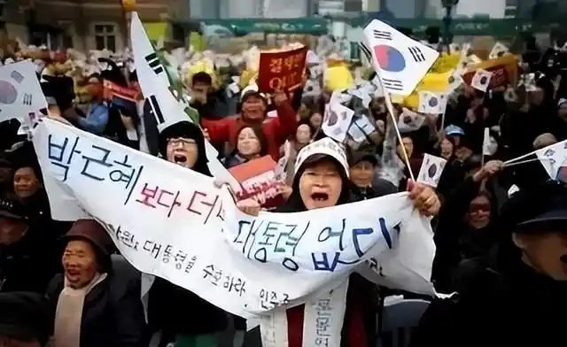

---

## 26

@姬永锋

发表于：2026-07-07 22:15

来源：微博

链接：https://m.weibo.cn/status/5318289593206051

转自天涯神帖顶级高手的生存法则

1不可怜任何人，不信任任何人，不深交任何人，不跟任何人诉苦。

2能藏拙，能沉住气，不炫耀，不高傲。心思缜密，小事糊涂，大事杀伐果断。对事看破不说破，内心祥和平静。

3独来独往，不需要前呼后拥，逢迎攀附。4真正的安全感源于自己兜里有钱。别人尊重你不是因为你友善，而是因为你强大。5傻瓜情绪化，高手利益化。

6拒绝无效社交。和穷人或者层次低的人交往就是无效的社交。

7任何关系走到最后不过是相识一场。有心者必有所累，无心者亦无所谓。情出自愿，不谈亏欠。

8不要对任何人有任何期待，包括父母、配偶、兄弟姐妹、儿女，期望越大，失望越大。

9强大自己是解决所有问题的终极答案。你之所以会生病，是因为你体质不够强大。你之所以会贫穷，是因为你的思维不够强大。

10混不好的人一般都是儿童心智，没有耕耘思维，没有过程思维，没有时间思维，没有长期主义思维，所以容易着急、焦虑、悲观、绝望、极端，也容易被割韭菜。别人说什么项目能快速赚大钱，他就容易信。

11时常保持情绪的稳定，不被烂人烂事所影响。强者平静如水，弱者暴躁易怒。

12不涉及自身利益时，不反驳对方，让其自说自话。

13不要同情身边的亲人，亲戚，在ta们面前一定要装穷，让ta们保持虚荣心。

14无论你结不结婚，你都是自己一个人过，只要你向外寻求依靠，你就必然会受伤痛苦。15得罪几个人，做错几件事其实没那么可怕。一辈子活得委曲求全，战战兢兢才最可怕。16不把人际关系看得太重。没有朋友你也可以过得很好。

17除了生病以外，你所感受到的痛苦都是你的价值观带给你的，而非真实存在。内心一旦平静，外界便鸦雀无声。

18天下的资源都是你的。天下资源，你都可以拿来用。天下非你所有，但皆可以为你所用，悟透这句话，你将无所不能。

你同意几条呢？

\#高段位处世法则\#\#高级处世智慧\#\#阶层生存法则\#

---

## 27

@梅新育

发表于：2026-07-07 15:23

来源：微博

链接：https://m.weibo.cn/status/5318186112123146

明星找工作？

看了看电影业总体票房数据，理解。

不过冤有头债有主，他们在微博电影之夜求工作没什么大意义，要保自己饭碗，电影业需要清理门户，抵制、清理那些女性主义导演、艺人、编剧，同时向《中国妇女报》、女法学家、知心姐姐法官、大同案法官等等请愿，求她们不要继续砸电影业饭碗了。

电影市场最好的客户本来是恋爱情侣、男方出钱，外加父母子女阖家欢；你看上面那些人干的事情，效果不就是消灭电影市场优质客户？

毕竟十几年前我头一次遇到《中国妇女报》的人，就是见识对方辱骂军嫂为“婚驴”；再加上那些女法学家、知心姐姐法官、大同案法官之类联手发力，还敢考虑恋爱婚姻的男人本来就已经断崖式锐减了，残存的漏网之鱼走进电影院，再去看“出走的决心”？“监狱来的妈妈”？

就不要“开个玩笑”了。

去年我文章就讲了，女拳这搞法，房地产、电影、餐饮等消费都够呛。

电影业打拳，跟女教师打拳一样，都是砸自己饭碗。一二十年来，师范院校和在职女教师盛行女拳，现在从幼儿园开始各级学校依次全面大幅度关闭，教师大面积裁撤压缩，她们可算求仁得仁；影视业界的女拳导演、艺人之类嘛，现在的电影业萧条只是开始。

---

## 28

@少年伯爵

发表于：2026-07-07 13:16

来源：微博

链接：https://m.weibo.cn/status/5318153925038322

为什么这次的美莎克台风极其反常？盘踞在广西上空几乎不移动？因为这里有个冷知识——台风自己本身并不会前后左右移动，它只会原地疯狂打转。那它是怎么跑来跑去登陆的？

\#伯爵冷知识\# 答案是依靠距离它几百到上千公里范围内的大气环流推动，学名又叫引导气流（steering flow）——说白了台风就是河里的一个大漩涡，它要移动就得靠整条河流的整体推动。

以前我国沿海登陆的台风，主要就靠西太平洋副热带高压推着向西/北移动，快速过境和过峰，走个过场就完事了。

结果这次没想到西伯利亚/蒙古高原的大号冷高突然提前一个月南下，与北上的西太平洋副高碰上了。

两者的力度和体量几乎不相上下，最后就硬怼在广西上空，谁也不让谁。

于是美莎克台风只能原地打转，再加上南海的季风水汽不停的被抽补进来，相当于南海无边无际的水被台风硬抽到广西来了，铺天盖地的倾泻而下，真的防不胜防。

希望广西人民平安度过此次洪灾

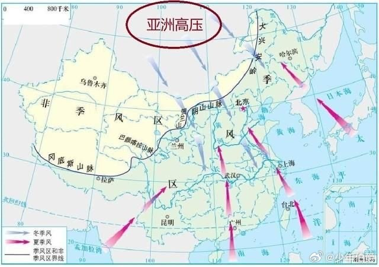

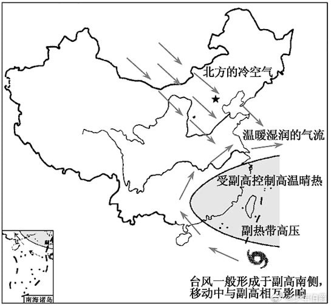

---

## 29

@信号与噪声

发表于：2026-07-07 13:16

来源：微博

链接：https://m.weibo.cn/status/5318154062398018

投资者们正在争论的关键问题是，超大规模云服务商，尤其是最大的AI基础设施购买者，是否开始积累过剩的计算能力。如果部分AI基础设施不再被充分利用，并开始被转售或租赁给第三方，那么GPU和内存的定价能力可能会缓和。摩根士丹利将此称为“芯片通胀”，即竞争和过剩产能逐渐降低硬件价格。

内存仍然是人工智能的最大受益者之一，因为HBM和DRAM的需求持续超过供应。然而，摩根士丹利指出，几个领先指标正接近峰值势头。内存价格增长正在放缓，库存状况已大幅正常化，盈利预期修正也已压倒性地正面。从历史上看，这种组合往往标志着股价盘整的起点，尽管基本面仍保持健康。

重要的是，他们区分了变化率峰值与周期峰值。这两者截然不同。投资者经常将增长放缓与增长下降混为一谈。半导体股票往往在盈利势头变得“不太强劲”时开始修正，即使利润继续创下纪录高点。

另一个担忧是仓位配置。内存已成为全球最拥挤的交易之一，投资者高度集中在三星、SK海力士和美光等公司。当仓位配置变得如此拥挤时，即使盈利季出现轻微失望，也可能引发投资者获利了结，从而导致急剧回调。

摩根士丹利最密切关注的对象不是内存公司本身，而是AI超大规模云服务商。如果微软、亚马逊、Meta、Alphabet或OpenAI等公司开始发出基础设施支出放缓、代币经济疲软或资本分配更审慎的信号，投资者可能会质疑当前内存需求的可持续性。焦点正从硬件供应商转向客户的支出意图。

然而，长期论点依然完好无损。摩根士丹利仍预计2027年AI相关盈利增长约为35%至40%，并继续将代理式AI视为结构性投资主题。他们的讯息是，AI基础设施建设不太可能结束，但市场可能进入一个预期更现实、估值扩张让位于盈利驱动回报的时期。

换言之，这看起来不像AI内存超级周期的终结，而更像是从第一阶段——以爆炸性硬件部署为特征——向第二阶段的过渡，在第二阶段，投资者越来越关注利用率、变现能力和资本回报率。

我们大致认同这一观点。市场往往在预期过于乐观时进行修正，即使基本面仍保持强劲。AI基础设施支出不太可能呈直线增长，但随着模型规模扩大和推理工作负载增加，对高性能内存的长期需求持续增强。我们视当前的回调为选择性增持优质内存公司的机会，而不是放弃该行业的理由。在我们看来，这是一次值得买入的修正，而不是结构性低迷的开始。

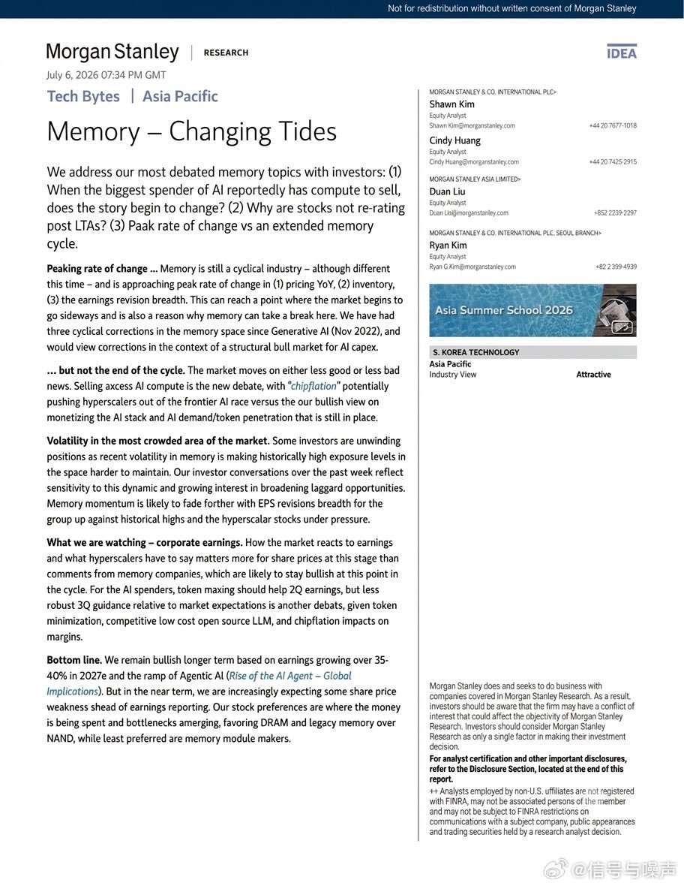

---

## 30

@李子暘Lee

发表于：2026-07-09 11:48

来源：微博

链接：https://m.weibo.cn/status/5318856698758169

我原来以为，只有中国人喜欢大车，是恶俗。后来看到美国克莱斯勒老板雅可卡的回忆录，才知道，在美国，汽车也是越造越大。

雅可卡早年在福特工作，主持了著名的野马汽车的开发。野马汽车后来越造越大，大到面目全非。

和软件一样，人们总是不管有用没用，忍不住增加更多功能。

现代人的贪婪，是没办法的，是一种“社会绝症”。

没办法，完全没办法……

-

---

## 31

@一起唱歌666

发表于：2026-07-09 11:44

来源：微博

链接：https://m.weibo.cn/status/5318855581766836

@财前前：今年暑假培训行业 日子不好过的，尤其是初中班断崖式下跌，有些科目一个班就1-2个孩子。怎么办？

～这个行业快没了。以后高中不用考了。二本没人感兴趣了。

