# 2026-07-11

## 1

@挨踢牛魔王

发表于：2026-07-09 09:50

来源：微博

链接：https://m.weibo.cn/status/5318827026157083

今年AI下半年的形势已经比较明确了。

我们先从智谱AI说起，glm4.7做到了可用，glm5.2做到了实用。

我们不要讲什么榜单排名，我们就说手感。

你用glm4.7编码的话，能用是能用，但是它会犯低级错误，而且比较频繁。

但是glm 5.2犯低级错误的概率非常小，确实提升很大。

这个靠什么提升的呢？

大量的后训练。

因为很多智能体已经爆发了，这里有大量的数据可以用于训练。

这个从腾讯hy3的正式版也可以看出来，后训练的提升非常狂暴，比预览版提升非常多。

国内的开源模型，在后训练这块，已经有手感了。

deepseek v4的后训练，几乎等于没有，基模还是不错的。

这次就看他们的正式版了。

另外一个，现在已经比较明确了，轻量级的模型就是200B左右。

比如deepseek v4 flash，腾讯hy3，在什么聊天、写作、搜索、办公等等基本够用了。

中等量级的模型，就是1T-2T左右的。

这个可以用来做复杂任务，比如编程等等。

deepseek v4 pro 1.6T，minimax可能是2.7T，kimi k3可能是2T。

现在模型大，约等于就是好。

在这个规模，再加上后训练，下半年，国产开源模型做到claude opus 4.8的水平，问题不是很大。

就是大量模型都能做到实用，甚至好用，性价比还高。

在这个等级的市场，国外模型可能很难打过国内模型了。

在超大模型，比如Fable这种级别，国内尚未探索。

但是这个模型给openai，谷歌的刺激非常大。

估计他们要对标这个模型，可能是gpt 6来对标。 

\#模型扎堆更新你最看好谁\#

---

## 2

@V闪闪

发表于：2026-07-10 22:25

来源：微博

链接：https://m.weibo.cn/status/5319379296190685

\#广西贵港教育园区孤岛救援始末\#微博还有抖这边确实能不断刷到救灾的信息。而且能被主动推送，至少平台是知道社会关注特点与民生问题的，这也算平台有道德底线和基本良知。

再看小🍠平台，这些天你不主动找，是完全看不出水灾发生的。更别提救灾的新闻，和展现人民子弟兵的精神了。别提算法这事，算法也是人为操纵的。

我国能允许这种立场上完全背离人民群众利益，只为自私自利的群体服务的大型社交平台存在，也算够自由的了。

李求醉的微博视频 \#为了人民我们再困难也要上\#

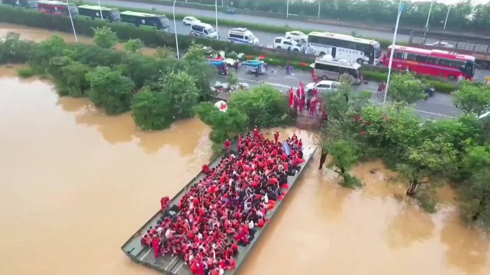

---

## 3

@深海小天

发表于：2026-07-10 13:15

来源：微博

链接：https://m.weibo.cn/status/5319240963588789

还得是香港大公报给力，这样多省事，意简言赅一目了然，自己清楚自己在哪个圈圈范围内，省得一天到晚瞎提心吊胆。

\#为什么一眼看出你很老实\#\#多位演员无戏可演回家卖菜\#

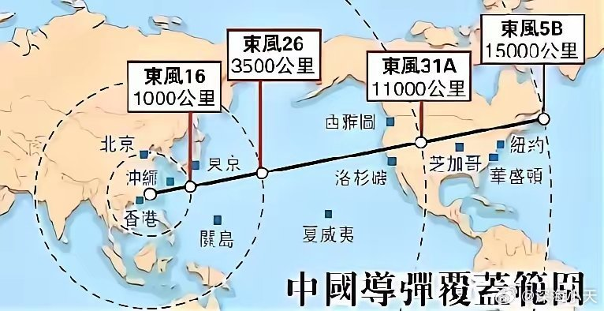

---

## 4

@风云学会陈经

发表于：2026-07-11 08:21

来源：微博

链接：https://m.weibo.cn/status/5319408311599861

\#我国对氦气实施临时禁止出口管理\#

这事主要是出口氦气球，另外欧洲进口中国倒腾的氦气

中国很离谱的是，自产氦气很少，只占全球2%，消费量全球第二，却还大搞出口！

2023年中国氦气产量326万立方米，仅占全球1.6亿立方米的2%。消费量占全球11%，第二。中国氦气储量也不行，全球2%左右，资源禀赋极差。

但是，中国却搞了不少氦气球出口赚钱。中国氦气产量占全球比例很低，但消费量占比很高。2023年中国氦气实际产量约326万立方米，全球年产量约1.6亿立方米，中国产量仅占全球约2%；而消费量占全球11%以上，是全球第二大消费国。中国氦气储量也仅占全球总量的2%左右，天然资源禀赋极差。虽然扩产，但是进口依赖80%以上。

2025年中国氦气出口量445吨，同比大增90%。主要是娱乐庆典性质的氦气球，低纯度氦气，是进口氦气加工再出口。这种出口，对国内半导体、航天、医疗等关键领域的供应是个隐患。卡塔尔、俄罗斯来的气源出问题了，不是不给中国，而是炸了、管控分配了。而占世界产量55%的美国本身就是问题。出口氦气球是有俄罗斯低价氦气供应，技术含量低，不能这么玩了。

再一个是2025年欧盟对俄罗斯氦气实施禁运，改从中国进口“替代供应”。中国对欧氦气出口量同比增长217%，中国企业在全球氦气贸易中的市场份额从2020年的9%增长至2025年的26%。这个也有点离谱，中国卖给欧洲是买来的。全球氦气紧张了，中国不能这么赚钱了，必须管控了，对关键产业保供。

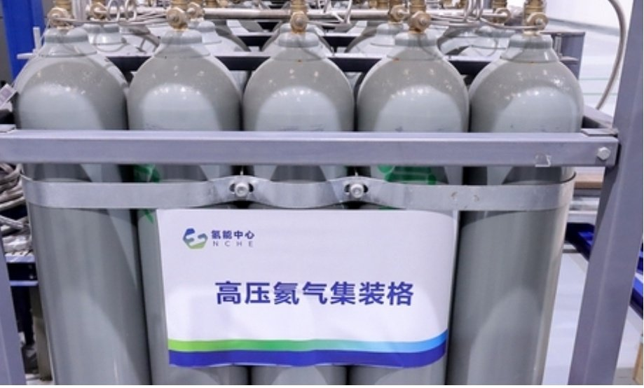

---

## 5

@念父

发表于：2026-07-10 15:15

来源：微博

链接：https://m.weibo.cn/status/5319271039369957

由知名数学家丘成桐担任院长，面向中国顶尖数学人才的清华大学求真书院近日被爆出多个学生未通过考核，补考高考数学试卷成绩不理想等，引发舆论质疑。丘成桐回应，将进一步改革招生方式，不希望招只为进名校的学生。

本月初，清华大学求真书院2026级预科班多名学生被爆出在学习四个月后，因数学分析、线性代数成绩不及格，补考高考数学试卷成绩仅110分左右（满分150分）等原因，面临无法正式入学的消息。

求真书院“丘成桐数学科学领军人才培养计划”采用自主招生的方式，学生需经过多轮数学测试、面试等环节才进入预科，经过四个月预科培养，考察合格后才可被清华正式录取。部分家长和舆论认为，如果最后仍有学生连基础课程都未通过，书院应反思前期选拔能否真正识别数学潜质，而不能只让学生承担结果。

上观新闻星期五（7月10日）引述求真书院方面确认，确实有少数预科生因成绩未通过考核而未能正式录取。

据《北京日报》，求真书院院长丘成桐表示，将进一步改革招生方式，希望学生能够尽快找到适合自己的发展路径，而不是进入求真书院之后，面临学业难以为继的困境。

丘成桐表示，过去五年求真书院是在摸着石头过河，网上有一些争议很正常。但是该院办学目标一直是希望培养数学领域的学术研究型人才，培养未来的数学大师。

丘成桐说，自从项目落地以来， 针对进入求真书院的特殊培训在市场上悄然诞生，甚至被许多人视作进入清华的一条捷径。他认为， 数学的能力当然可以培养，但不是通过刷题、猜题、总结套路的模式化培训。一些学生通过这样的培训获得了某一次或者某几次不错的考试成绩，但并不是求真书院期待的那种对于数学抱有强烈兴趣和热爱，并具备独立思考能力、学习探索精神的学生。

他透露， 接下来求真书院将会对招生和考试进行全面改革，希望招到那些真正热爱数学的学生，而不是出于功利目的、只是为了进入名校的学生。他说，爱走捷径、只有功利目的的人不可能有研究的宏大视野。

---

## 6

@史老柒

发表于：2026-07-11 08:22

来源：微博

链接：https://m.weibo.cn/status/5319410643638699

丘老大这次玩砸了 查看图片 //@三少爷的剑v小天狼星:再补充一点,丘先生的丘班,屡次,或者说次次,考不过隔壁两所院校,目前也没看出有哪些有天赋潜力的同学选丘班…这是他懊恼的另一点。意味着4 年来哔哩吧啦…开设创新教育项目的确很难,需要慢慢积累和培养,这点很佩服丘先生。开办之前,就有说了,特招性质,和老外的推荐制度,就差个推荐信了(前期也的确有后来取消了),必然会出现问题。而且,数学圈子就这么点,在某些方面对圈子是有点类似女歌手了。请注意,丘班不是“丘先生出资的”,还有丘成桐少年班,也是如此。叫求真书院也是因为涉及自然人姓名(这点不在社会组织管理范畴内),人要脸,就没叫“丘成桐”,这个书院,是国家财政补助,学院自筹,第三方捐赠,形成的经费来源。丘先生是不拿薪水去参与教务教材和教学…//@念父:丘成桐说,自从项目落地以来, 针对进入求真书院的特殊培训在市场上悄然诞生,甚至被许多人视作进入清华的一条捷径。他认为,数学的能力当然可以培养,但不是通过刷题,猜题,总结套路的模式化培训。一些学生通过这样的培训获得了某一次或者某几次不错的考试成绩,但并不是求真书院期待的那种对于数学抱有强烈兴趣和热爱,并具备独立思考能力,学习探索精神的学生

---

## 7

@李楠或kkk

发表于：2026-07-11 08:22

来源：微博

链接：https://m.weibo.cn/status/5319410978914446

作为一个前工程师，

我是大概这么理解中国的火箭回收方案的。

1

猎鹰的支脚发射地回收如果是 ver1 的话，

猎鹰的支脚海面回收方案就是 ver1 final ，因为减少了返回发射地的燃料惩罚，死重更少。

2

而筷子方案，是 ver2.1 ，因为去掉了支脚的结构，进一步减少了死重，并且可以回收更重的火箭。

如果造船能力不是问题，筷子的海面回收方案是 ver2.1 final 。这个遥遥无期，第一是因为造船能力的问题，第二是海面上做这种刚性高精度回收难度可想而知。

3

而中国的网格回收方案，至少是 ver2.2，可以看作 ver2 这个大的“非支脚”技术路线上，针对轻型火箭的增加回收装置复杂度，换取减少火箭落地姿态控制悬停所需燃料的改进版。减少了返回需要预留的燃料死重。

而这次海面回收，可以看作 ver2.2 final 。海面柔性回收对于海况兼容性提升，火箭不需要返回发射地，燃料惩罚更少。

4

他当然还有一系列问题需要解决，比如回收检测返回发射地过程中的一系列问题，比如回收装置的耐久度和可靠性等等等等。

但是，这不是个“落后”方案，反而很明显，这是一个 improve 。

如果你觉得这是一个落后方案。。。

要么你缺乏工科的专业教育，要么，就是缺乏对于膝盖的正确保养。

\#长征十号乙火箭回收成功\#

---

## 8

@李建秋的世界

发表于：2026-07-10 11:03

来源：微博

链接：https://m.weibo.cn/status/5319207618349453

其实很多小朋友对于那种“从美国带回来先进理念的教育改革”这种事不熟悉，这种事情很早就有了，早先在台湾有个叫李远哲的，主持台湾教育改革，注意啊，他可是获得诺奖的。给台湾人带来一点小小的美国高级教育震撼。

李远哲认为，这台湾现在不行，升学压力大，教育资源分配不均，孩子们都被压成啥样了？所以

要教育松绑，要给学校老师和学生更大自主权，要因材施教，要打破单一联考（类似于高考）的那种垄断，让更多人有更多渠道商大学，要推动技术学校转型

所以专科学校和技术学院直接升格为大学，人人都有大学念。

废除一考定终生，要“推荐甄选”、“申请入学”和“登记分发”等多轨并行的“多元入学”取代。

教科书要一纲多本，民间出版商自由编写教科书，学校自行选用

……

反正就出了一堆政策，就单独挑两样说。

一个是“多元入学”，这个是要求学生准备丰富的备审资料、参加面试、展示才艺或竞赛成果。那对于富裕家庭怎么办咧？这还不好办？包装呗，这不华人世界的强项？那弱势家庭怎么办咧？啊对啊，那怎么办咧？

等暴雷了怎么办？啊能怎么办？怪家长包装，“我心是好的”，不就是个这？

搞一纲多本，补习班不但没有减少，过去是只补单一学科，现在要补各家版本。

后来李远哲就说了，你不能怪我啊，那当年教审会就是负责提宏观蓝图的，那下面的教育行政官员办不好，那管我什么事？不能让我一个人背锅云云。

所以后来但凡牵扯到任何改革，把李远哲瞅一眼，你就知道这玩意会“如何发生的”，“怎么执行的”，“最后怎么甩锅的”。

没什么，就现成版本，大不了就跟李远哲一样：“理念是好的”，“都怪下面没执行好”。

不就这回事么？还有啥新鲜的你说？

---

## 9

@图老板赛博札记

发表于：2026-07-11 09:22

来源：微博

链接：https://m.weibo.cn/status/5319419245893640

\#塌陷中的世界\#\#图老板的赛博札记\#\#丘成栋\#

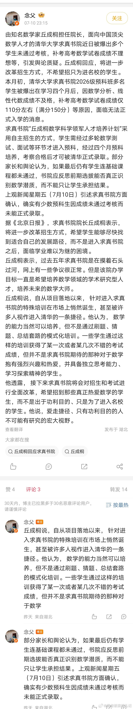

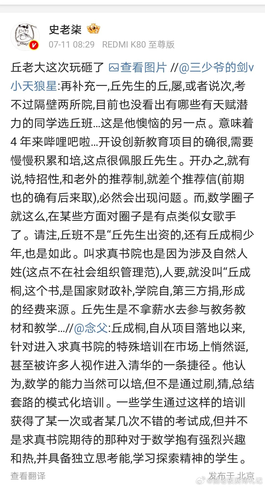

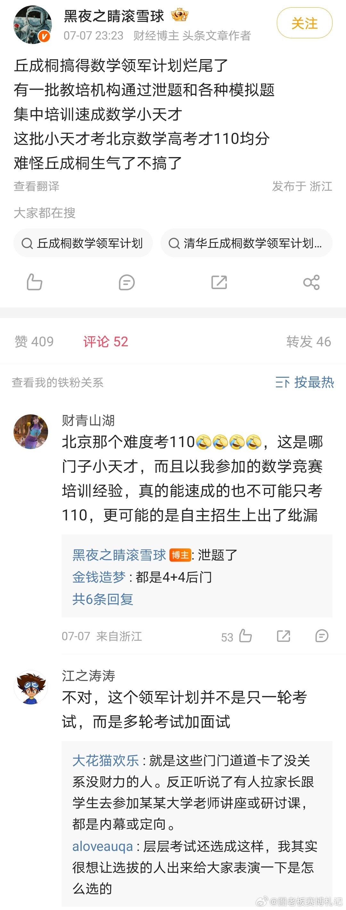

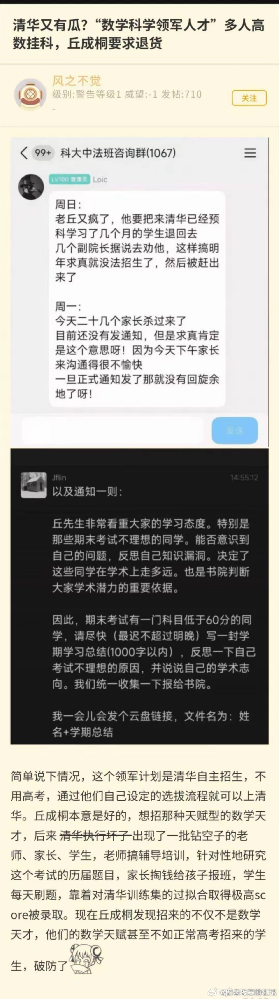

---

## 10

@习五一

发表于：2026-07-10 13:59

来源：微博

链接：https://m.weibo.cn/status/5319252112054506

\#聚焦舆情热点\# 【来稿选登：徐飞云担任LV诉茉莉奶白商标侵权案承办法官，被推上舆论风口浪尖！（来稿日期2026月7月10日）\#雪菲随笔\# 五一评论：在LV诉茉莉奶白案中，苏州中院一审判决茉莉奶白赔偿1030万元。这一巨额赔偿在国内茶饮行业引起巨大震动。许多网友认为，LV的经典花纹（四叶草/老花）源自中国传统文化（如宝相花、老式公厕窗花），不应被外企垄断并用来重创国货奶茶。网友将对“天价赔偿”的愤怒，具象化投射到作出判决的法官身上。随着事件的发酵，网络上掀起了对LV花纹和中国传统文化符号的对比热潮，如将LV花纹与农村老式公厕窗花、老地砖对比，戏称LV为“厕所包”。这种网络亚文化的产物，表达对“洋品牌打压国货”的集体愤懑。】

徐飞云为苏州市中级人民法院知识产权庭副庭长，多家权威媒体及判决书信息均确认其为LV诉茉莉奶白商标侵权案（(2025)苏05民初617号）承办法官。她深耕知产审判十余年部分入选全国典型案例。2026年6月29日苏州中院一审判决，茉莉奶白已上诉，判决未生效。

徐飞云2026年3月已升任苏州知识产权法庭庭长、审委会委员，此前获评“全国法院知识产权审判工作先进个人”“全省人民满意的公务员”等荣誉。

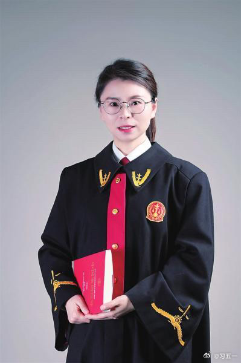

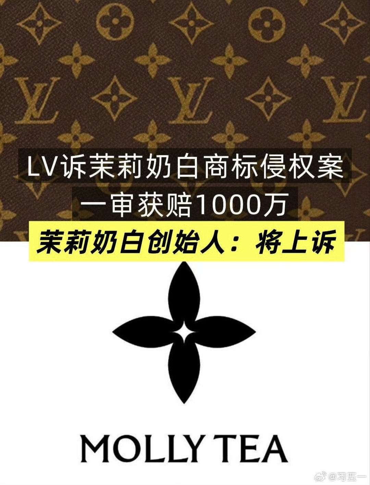

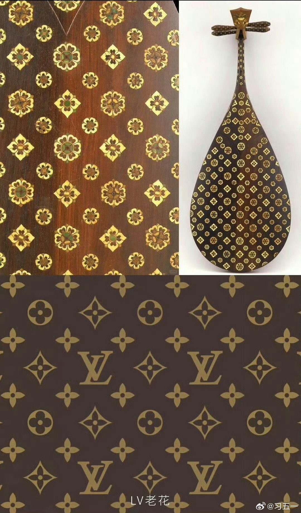

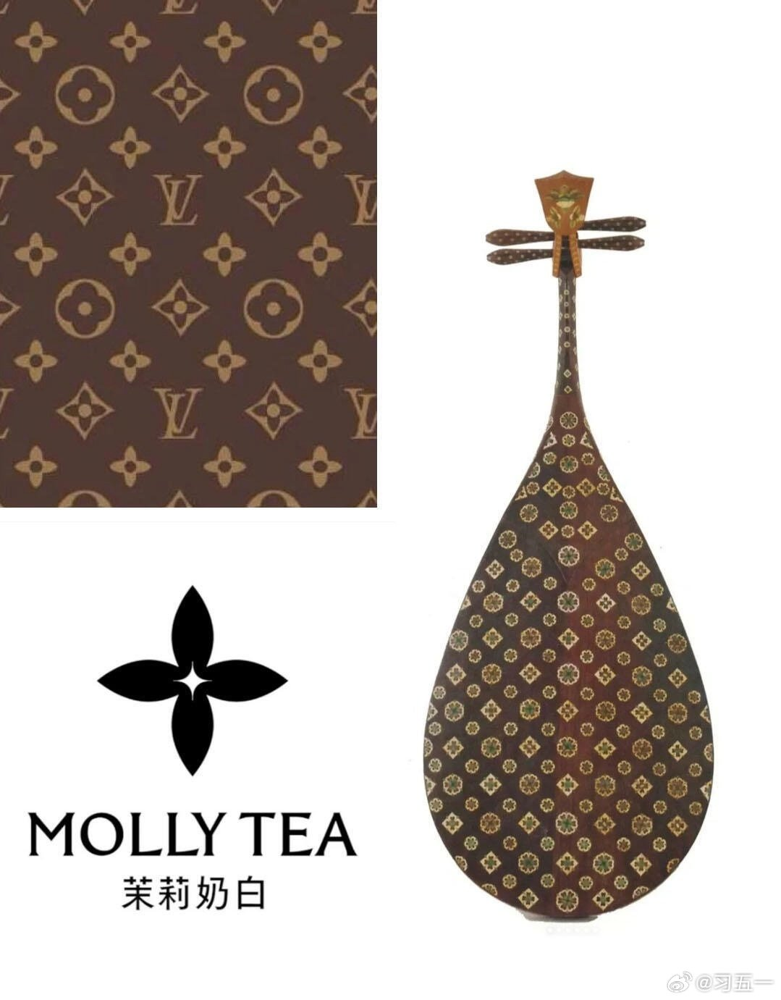

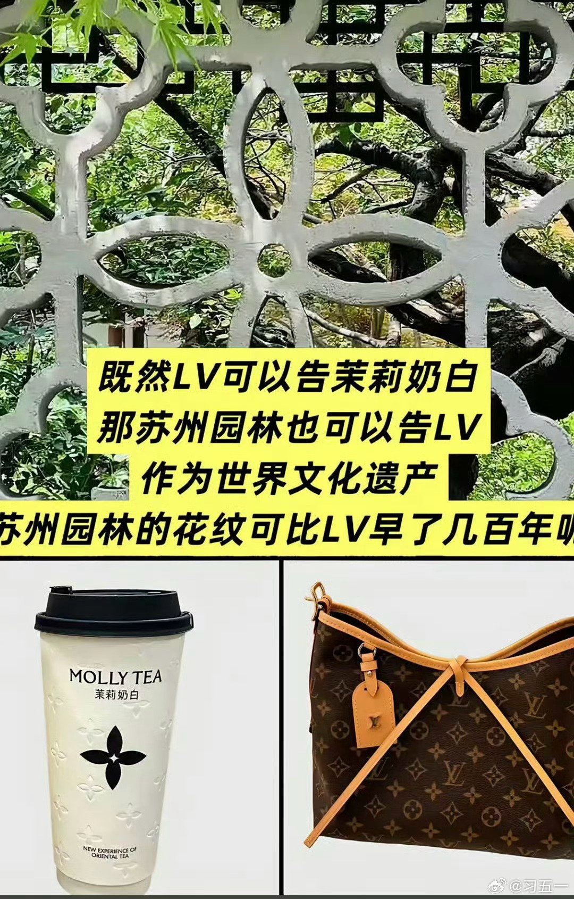

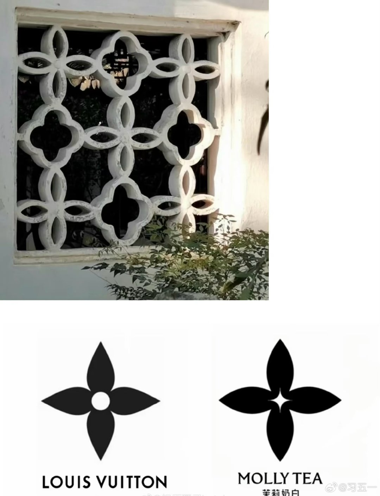

---

## 11

@宝玉xp

发表于：2026-07-10 22:42

来源：微博

链接：https://m.weibo.cn/status/5319383700210391

吃瓜：Apple 把 OpenAI 告上了法庭，指控 OpenAI 系统性地窃取苹果商业机密，用来开发自己的 AI 硬件设备。

诉状今天提交至加州北区联邦地方法院，被告包括 OpenAI、OpenAI 硬件负责人 Tang Tan（前苹果 iPhone 和 Apple Watch 产品设计副总裁，在苹果工作了 24 年）、前苹果高级系统电气工程师 Chang Liu，以及 Jony Ive 联合创立的 io Products。Jony Ive 本人不在被告之列。

诉状里描述的窃密手法相当具体。Tang Tan 被指控在面试环节要求苹果在职员工带实物零部件来展示分享，包括电池、逻辑板、SIP 封装模块等，还在招聘中使用苹果内部的项目代号套话。他甚至保留了一份标注为“限知范围”的苹果内部离职安全流程文件，教新员工如何在离开苹果时绕过安保检查。

Chang Liu 的指控更有戏剧性。他 2026 年 1 月离职后没有归还苹果配发的笔记本电脑，还发现了一个安全漏洞，可以在离职后继续访问苹果的云端文件存储。诉状引用了他发给仍在苹果工作的前同事的消息：“LOL，我发现我还能访问那个网络存储，太搞笑了。”他通过这个漏洞下载了数十份机密文件，超过一千页，涵盖未发布产品的技术规格、工程演示文稿和电路板制造文档。他还指导一位被他招募到 OpenAI 的苹果员工，面试前该复习哪些机密资料。

苹果称，OpenAI 还拿着偷来的信息去找苹果的代工合作伙伴，甚至要求一家合作伙伴演示苹果专有的金属加工工艺，误导对方以为这是经过苹果授权的。据诉状披露，目前有超过 400 名前苹果员工在 OpenAI 工作。

苹果今年 2 月曾致函 OpenAI 要求解释，但没有收到回复。

苹果要求法院禁止 OpenAI 继续持有、使用或披露其商业机密，归还所有机密材料，并赔偿损失。OpenAI 截至目前未回应媒体的置评请求。

注：这起诉讼的大背景是两家公司关系的急剧恶化。2024 年苹果和 OpenAI 还是合作伙伴，ChatGPT 被集成到了 Apple Intelligence 中。但 2025 年 OpenAI 以约 65 亿美元收购了苹果前首席设计官 Jony Ive 创办的硬件公司 io Products，正式进军消费硬件，双方从合作变成了竞争。据此前报道，苹果即将推出的新版 Siri 已经改用 Google 的 Gemini 模型，而 OpenAI 方面也被曝出曾考虑以违约为由对苹果采取法律行动。这起诉讼还可能影响 OpenAI 正在筹备的 IPO。

来源：网页链接

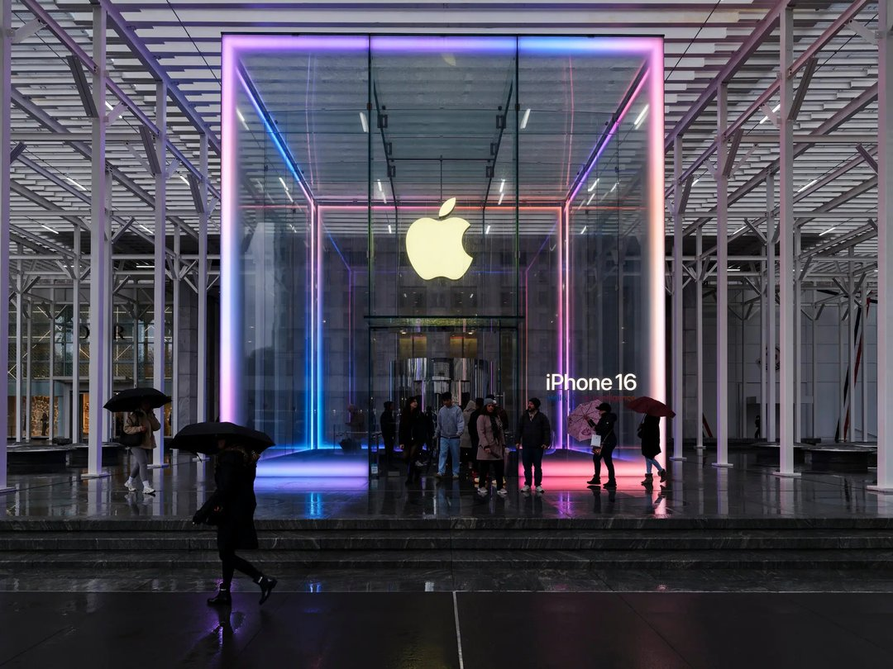

---

## 12

@孤烟暮蝉

发表于：2026-07-10 13:40

来源：微博

链接：https://m.weibo.cn/status/5319247279685738

2025年，日本一个民间团体在东京和横滨街头做了一次问卷调查。题目很直接——“是否支持对中国发动战争”。结果出来以后，71.1%的日本男性反对和中国打仗，74.6%的日本女性主张“战至最后一滴血”。

---

## 13

@云无心45

发表于：2026-07-08 11:44

来源：微博

链接：https://m.weibo.cn/status/5318493181315035

去天坛需要预约，搜小程序出来的页面是图1。

点开第一个出现的订票页面是图2，点开第二个出现的订票页面是图3。

作为一个游客，你会分别把两个都打开比较不？

第一个之所以贵，是这个“第三方公司app”在天坛官方联票上直接加入了一个“手机电子导览”的服务啊。但是从打开app直到提交购票，你能想到这个服务并非必须，你是可以不选的么？

“10万+”人看过，而天坛每天的人流量是数万。很好奇有多少人是稀里糊涂就买了图2这个票的？

\#生活手记\#

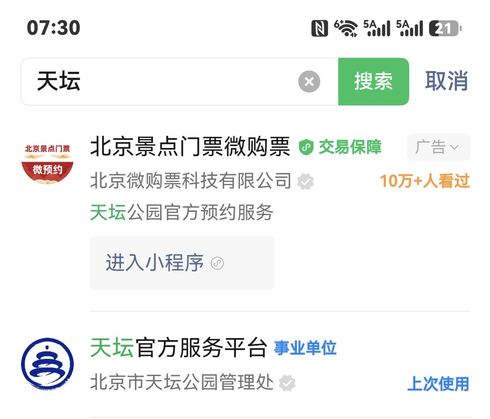

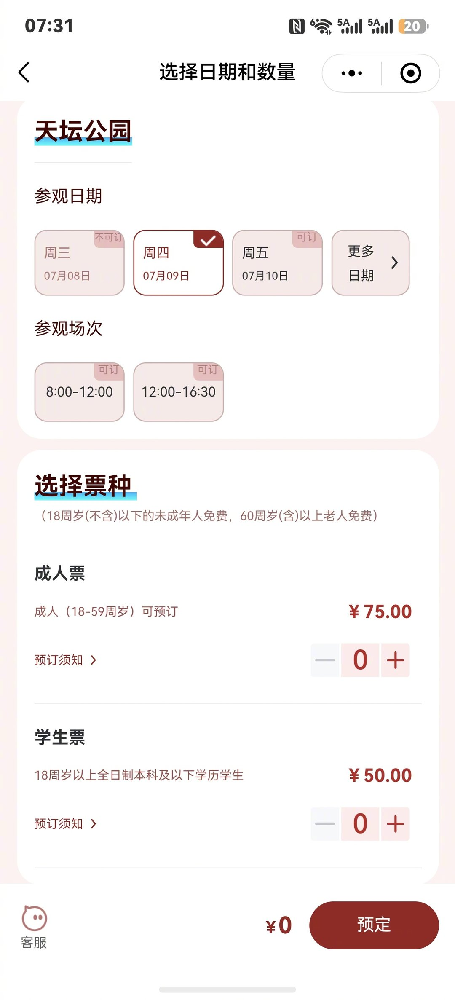

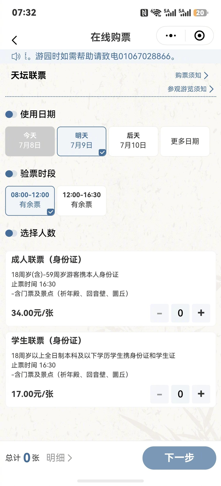

---

## 14

@邪能之槌

发表于：2026-07-10 07:46

来源：微博

链接：https://m.weibo.cn/status/5319158168552106

散帅这个词被短视频平台封禁几乎是一种必然。

一开始散帅和散帅节的出现可能是普通网友出于结构集美和遍地都是的“勇敢的小羊”这种矫情文案的目的。

但是在形成风潮之后，越来越多社会中坚力量加入进来，其戏谑和解构的含义立马被取代变得正式起来，发展为从下到上各个阶层职业学历都参与其中的运动。

你想一下，基层的审核岗位，是被谁垄断的吧。

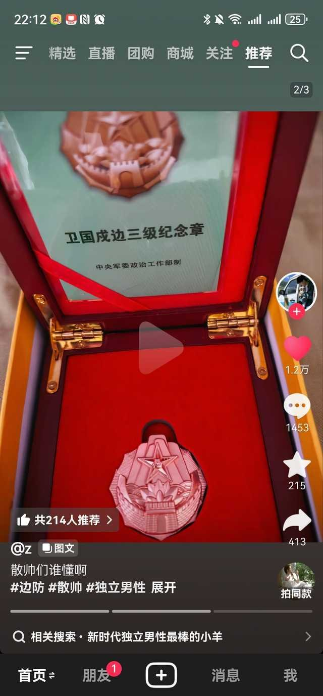

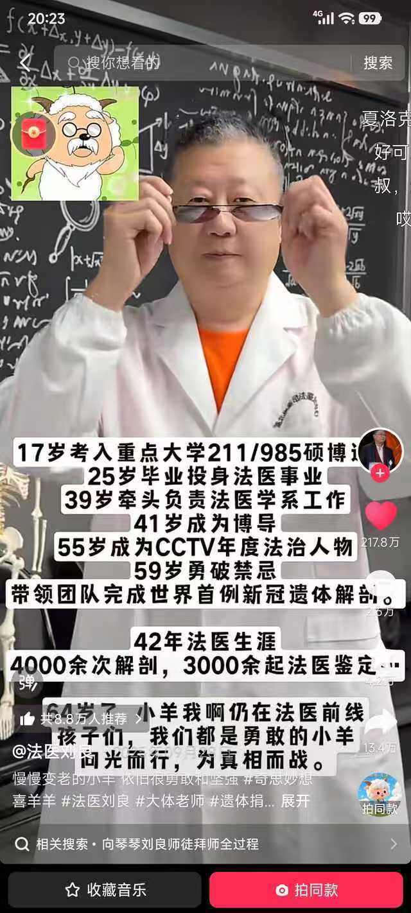

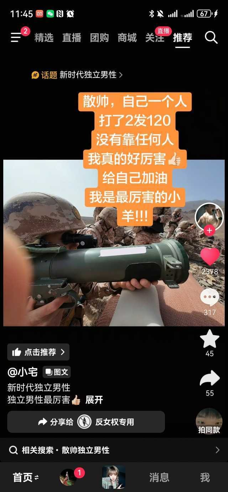

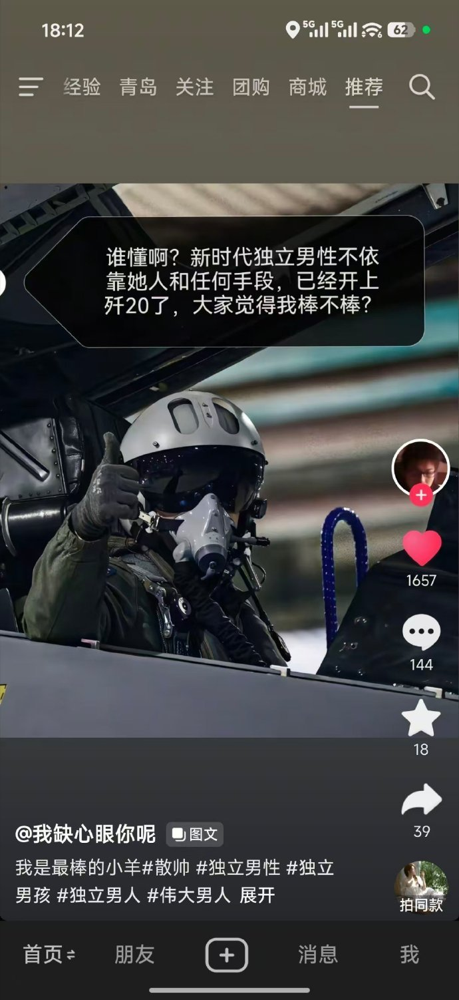

---

## 15

@sven_shi

发表于：2026-07-10 10:06

来源：微博

链接：https://m.weibo.cn/status/5319193492456712

封掉一些词这件事情大家可以和新婚俗放在一起去看。简单说就是我们国家这些年出现了很多新的婚姻“习俗”，一般官方角度会说这些事情发生在2010年左右，来源是民众的“攀比”，但是大家心里都知道，结婚这件事情在我国并没有什么盈利，一方赚到的，就是另一方的亏损。

里面最典型，讨论最多的，就是一个“加3万”的习俗。简单说就是男女双方谈结婚，谈好彩礼之后，女方会在结婚前或者婚礼中，额外要3万元来给自己提供更多的“保障”。这当中出现了很多的知名事件，地方上也有很多的预案。比如之前最有名的一件事情就是婚礼当天，女方的哥哥拦着婚车不让前进，要男方这边“加3万”，视频曝光之后引发了很多争议。官方专门出了说明，讲明白在协调下，男方这边额外给的3万元是女方的嫁妆，依法就是女方的个人财产。

这就是一种非常典型的转移支付。民众利用法律，在婚姻中做性别转移支付，把男方家的钱通过法律途径，变成女方的钱，来保障弱势女性的利益。

可是民众这边未必愿意啊。这里面就有另一个经典案例。男方在遇到女方要求加3万结婚后，就退婚了，还拿着他自己赚到的积蓄把钱花到了自己身上，四处旅游玩乐，一度在网上引发了很多的讨论。这个时候媒体上也请了一些专家，去分析男方这种行为，结论非常清晰，他的行为是“不成熟”，“遇到问题选择逃避”。

可是和专家的理解不同，大多数网友并不反感男方这种不结婚，把自己赚的钱给自己花的行为。为什么一定要把自己的钱，通过婚姻转移支付掉呢？

媒体上的讲法很清晰，一个男人努力工作赚钱，通过结婚把钱转移支付给女方，就是“成熟”“有担当”；把赚来的钱自己花掉，就不是一个男人该做的事情。

可是钱在这些人的手里，他们真想自己花，不愿意给，你有什么办法吗？

这里另一件事情，就是我国2011年推出的房产加名制度了。立法很清晰，加名即赠予。一般是男方在结婚后，给女方做房产加名，将自己的财产赠予女方来保障女方的利益。很明显的一点是越来越多人都不愿意去做房产加名了。

所以一些地方推出了“喜上加喜”的模式。简单说，就是把结婚登记和房产加名登记放在一起办理。你去领取结婚证，边上就有人告诉你可以一起办理房产加名，来“喜上加喜”。

领取结婚证又不会让你多赚钱，那么这个所谓的“喜上加喜”，到底喜庆在哪里呢？做房产加名，把房子份额赠予对方，对给出房子的人，真心实意是件“喜事”吗？

像我们观点可能大家没办法接受，做房产加名反过来是在给大家的婚姻埋雷。比如我们之前看到的一系列新时代败家子的案例，都是一些没有恶习的男性通过离婚损失掉了父母给他的房产。道理很简单，房产加名并不能直接给女方带来利益，要把钱变成自己的，就是只能离婚才能套现。

这种“喜上加喜”的新婚俗，很可能就会导致夫妻感情破裂。立意再好，想的再美，面对真金白银的问题，还要要考虑清楚的。

所以单纯封杀一些词的说法意义并不大。现代人的财务意识都在变得越来越强，让人把钱掏出来，也真心在越来越难。

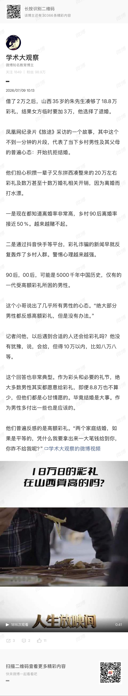

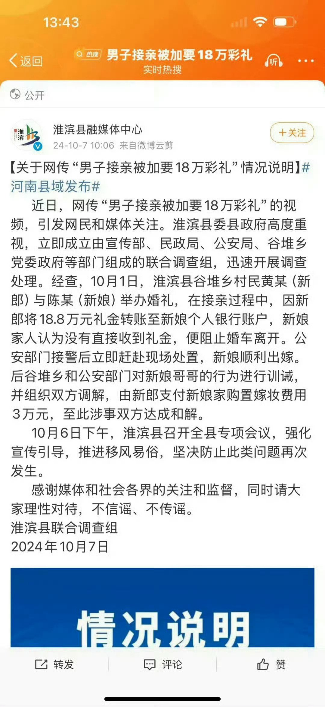

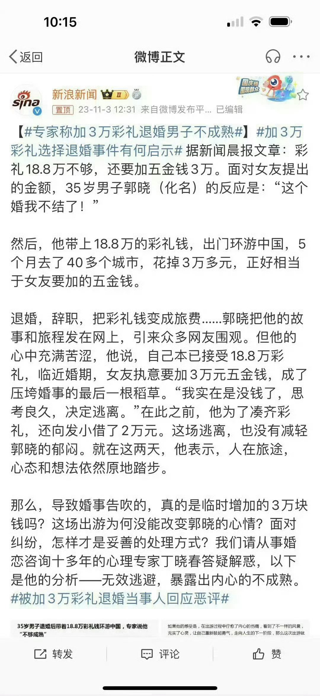

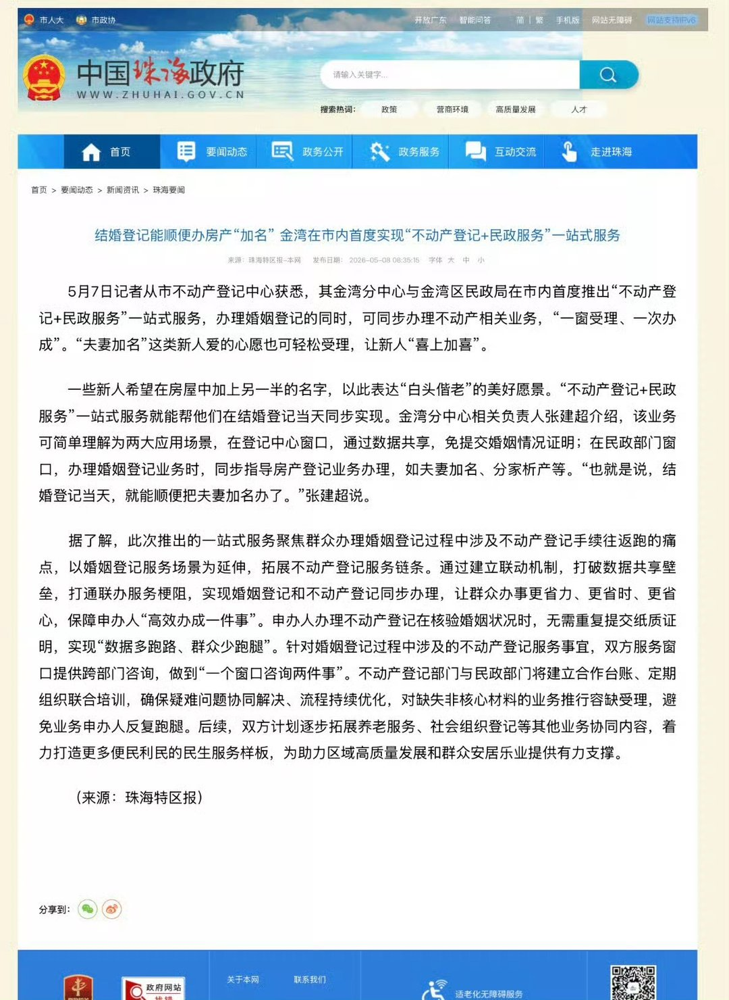

---

## 16

@幻想狂劉先生

发表于：2026-07-10 10:12

来源：微博

链接：https://m.weibo.cn/status/5319194910657938

上周埋首纸堆数天，读了不少研究，深感现代社会结构变化速度之快，幅度之剧烈，即使是专门从事社会科学研究的研究者，也无法避免犯下想当然的错误。

讲一个我的亲身例子。大概从五年前开始，我就把这个微博账号的所有流量收益（数额很惭愧）按年全部捐给助学项目，受助人是可以选择，那我肯定是选女的，然后前一个受助人毕业了就换下一个女生，因为根据我的常识和逻辑，我们这个社会里肯定是女性受教育困难的情况出现的多，而且越是边疆和贫困地区，越是这样。

结果这样持续了四年，委托人去年突然跟我说，受助人能不能换成男的。我当然不在乎受助人是男是女，但是我很好奇为什么要突然换成男的，那些贫困地区的性别意识这么快就倒转过来了吗难道？

结果受助人告诉我，因为女拳运动的社会影响，现在绝大多数的女性资助人都指定只资助女生，而大多数像我这样的男性资助人也还在按常识和逻辑资助女生，所以现在女性受助人早早就有人资助了，倒是男性受助人空出来了。

这个事对我的震撼特别大，这个社会的变化速度之快，已经没有什么“常识”了，或者说，“常识”每个月、每周甚至每天都在变化。

---

## 17

@幻想狂劉先生

发表于：2026-07-09 07:44

来源：微博

链接：https://m.weibo.cn/status/5318795361255425

现实生活中有一个场景可以最大程度上激发我的恶念。

就是一些来到中国的外国人在尝试用英语和普通的服务业从业者，比如摊贩、店员，甚至只是他的问路对象（路人）沟通无果时，因为对方不懂英文而流露出的那种居高临下失望和不耐烦，仿佛对方天生就应该从很小学好英语，只为了长大等着服务他这位“莅临”本国的外人一样。

这种失望和不耐烦的表情我不止看到过一次，而是看到过很多很多次。

所以有一次一个关系还不错的女孩随口说，在中国旅游的感受很好，但是很多大城市之外的中国人不会说英语感觉不方便。我当时直接说“你可以选择去印度旅游，那里有很多人会说流利的英语，而且很乐意为外国女游客提供服务”，事后对方发信息给我，认为我对她太过刻薄了，问我是不是当时心情不好。

我没有心情不好，只是当时确实是情绪有点收不住

---

## 18

@信号与噪声

发表于：2026-07-10 04:23

来源：微博

链接：https://m.weibo.cn/status/5319106954790080

很多人认为“领导不是傻子，他知道你是拍马屁不是真话，不说破罢了”

说实话，刚开始我也这么认为。

后来工作时间久了，接触的领导多了，才发现：

很多领导，甚至大多数领导，他们真的认为马屁就是真的，然后 ego 就会越来越膨胀

我亲眼见过一个实干型的人晋升为领导以后，在马屁堆里泡了两三年之后，整个人就完全不一样了，大家面上说的话，他是真信，而员工背地里说的完全是相反的话

---

## 19

@梁斌penny

发表于：2026-07-10 00:26

来源：微博

链接：https://m.weibo.cn/status/5319047501843197

DeepSeek研推理芯片这个事情特别值得思考，Google的TPU；AWS的Trainium 3；微软的Maia 200；Meta的MTIA；OpenAI的Jalapeño；都在自己搞，现在问题来了，谁还在用老黄的英伟达呢。。。

最值得玩味的是 Anthropic：训练用谷歌 TPU、推理用 AWS Trainium、英伟达 GPU 退居为"研究探索"的第三选项（2026 年 1GW TPU，2027 年扩到 3GW）。这是第一次有头部模型公司公开证明，可以在核心业务上把英伟达边缘化。。

国内阿里平头哥，百度昆仑芯，华为昇腾都纷纷自研芯片摆脱被英伟达绑架的局面。但是自研归自研，生产还是离不开底层支持，比如芯片设计这一层就有博通、Marvell，世芯等 。当然了最后代工层就基本是台积电、三星、intel，中芯国际这四家了。

所以我感觉英伟达已经有点被摘出去的感觉了，芯片设计公司也不保险，比如特斯拉就是自研的，华为，百度，阿里都是自研。真正铁稳的还是晶圆代工的四家了。

最后，眼看着算力税在英伟达手里在慢慢丢，但光刻税、EDA 税、存储税，收的人一个都没换，后面必然还会有新的玩家，百花齐放的局面是必然的。

---

## 20

@子夜梦廊

发表于：2026-07-09 03:03

来源：微博

链接：https://m.weibo.cn/status/5318724429284216

\#韦东奕获国家自然科学二等奖\#

用人话解释一下韦教授和章教授为什么能拿这个奖:

过去大家都知道，积木堆得太高，容易倒。但大家都不知引发倒塌的节点究竟在哪，于是只能抱着赌一把的心态堆积木，心里求的是老天开恩，让我再叠高一点。

韦东奕和章志飞通过各种演算，最终得出了一套数学公式，摸清了可能引发积木倒塌的红线，公式精确到风从哪个角度吹、吹到几级、积木会从哪一根开始松动，并在哪一毫秒彻底垮掉。

所以，他们的研究成果和月薪三千的我有什么关系呢？

关系大了去了。。。

湍流是现代工业中最大的安全隐患之一。举个例子:我们坐飞机，突然遇到高空急流，飞机像坐过山车一样剧烈颠簸，这就是因为气流变成了湍流。

大气湍流没有雷达回波、毫无预兆，极难预防，破坏力却极为惊人:飞机可能瞬间剧烈下坠几百米，没系安全带的人分分钟骨折，甚至造成严重的人身伤害。长期的剧烈颤抖还会加速机身金属疲劳，极端情况下甚至会引发坠机事故。

过去，对于这种突然狂暴化的气流，只能依靠飞行员的自身经验来避免，但现在韦东奕和章志飞给出了数学框架，只要写进飞机的气象预测系统和自动驾驶代码里，那飞机就等于是开了神级天眼。即便气象雷达无法察觉，算法也能提前捕捉到前方空气变乱的微观前兆，指导机翼在零点几毫秒内做出微调，直接把颠簸消灭在萌芽状态。不仅能保护舱内乘务员和乘客，更能大大减少飞机的结构损耗，将空难的概率压到最低。

除了保障天上的人们的安全，韦东奕和章志飞提供的公式还能保护地面上的人们的安全。

大气湍流之外还存在着水流湍流，比如洪水就是湍流的一种。洪水爆发时的恐怖，不用科普了吧？

但洪水与大气湍流不一样，大气湍流是正常孩子因为种种原因在某个时间点突然黑化，掌握了人性的规律就比较好预防。而洪水则是个一开始就拿着菜刀乱砍的疯娃子，没人能搞清丫的脑回路，所以即使是韦神也没法预防。

但防不住疯娃子砍人，我们可以升级大家的护甲啊。

以前科学家用电脑模拟洪水怎么冲刷桥墩、堤坝和车辆时，由于底层数学模型不够完美，模拟出来的受力数据经常有误差。而韦神团队给流体力学补上了最核心的数学框架。用上新公式后，防汛仿真软件解析度立马翻倍的，能更精准地指导未来的桥梁、防洪堤坝该怎么修，才能抵抗住狂暴山洪的致命一击。

除了人，工业管道是湍流最大的受害者。 管道里的水、油、气走得太快，就会从听话的“整齐队伍”突变成疯狂乱窜的“暴走旋涡”（湍流）。这些紊乱涡流就像砂纸一样天天冲刷管壁，导致非腐蚀性的壁厚减薄，直到突发性泄漏或爆管；它们还会诱发高频震动，硬生生把法兰和螺栓震松导致渗漏。

然后就是化工厂爆炸、泄露了，一场事故下来，一整座城市都可能受害，人员、财产损失无法估量。

现在韦神团队用数学公式精准算出了流体失去暴走的阈值，并算清了那无数个搞破坏的“小旋涡”（奥森涡）是怎么诞生、怎么传递能量的。 

如此一来，工程师们就能在设计输油、输气管道时精准卡Bug，设计出能抚平小旋涡的特殊管壁微观结构，或者添加特定减阻剂。只要把水流死死压在安全边界内，就能彻底消除高频震动、保住螺栓，防止剧毒或易燃易爆介质泄漏，将各种致命的工业事故消弥于无形。

除了保障人们的生命财产安全外，韦、章的成果对于我们的钱包而言也有着非凡的意义:飞机、高铁和汽车将迎来大省油时代。

交通工具在空气中行驶，阻力有很大一部分来自于表面产生的湍流。湍流会像无数只小手一样往后拽车和飞机，极其费油。

 

通过精准计算“转捩点”，工程师可以设计出能最大程度维持“层流（整齐队伍）”的表面材质。如果能让飞机表面的空气多保持一段距离的层流状态，飞机的燃油消耗可以直接暴跌 10%~20%。这省下的可全都是万亿级别的真金白银和碳排放。

当然，还有我们的机票钱。

中国有几万公里的石油、天然气管道。液体在管道里高速流动时，一旦变成湍流，和管壁的摩擦阻力就会飙升，需要后面无数个抽水泵拼命耗电推它。

利用这项研究，我们可以精确优化管道内壁的微观结构或添加极少量的减阻剂，让油水在管道里永远保持“层流”的乖乖水状态。全国因为输油输气省下来的电量，可能抵得上几个大型发电站的年发电量。

当前的世界，正处于能源战争的白热化阶段。未来谁掌握着能源的制胜权，谁就掌握着世界的制胜权。

当下，最火的就是AI大PK了吧？拿拼孩子来比喻:娃儿要吃饭，才能长个子长脑子，营养越好，个头越发达，脑子越好使，才越能把别人家孩子比下去；AI要发展、要升级，就要吃电，电量供应越充足，AI产业发展越快，我们才能把别国的AI给卷飞。

但地球上的能源，终究是有限的，节约能耗才是关键。韦神和章教授的研究，可以说是大大加大了东大在能源争夺战中的赢面。

你们说，他们值不值得这份殊荣？ \#科技先锋官\# \#ai创造营\#

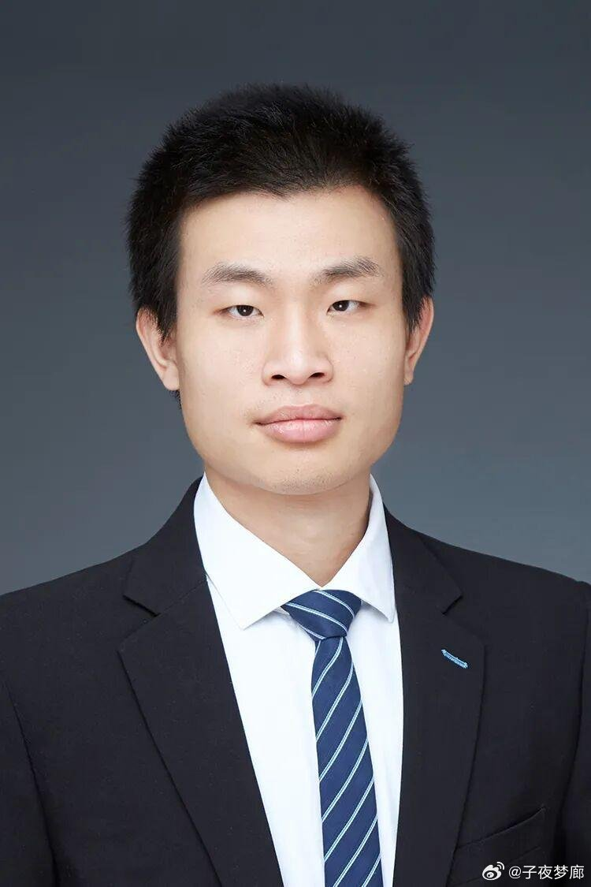

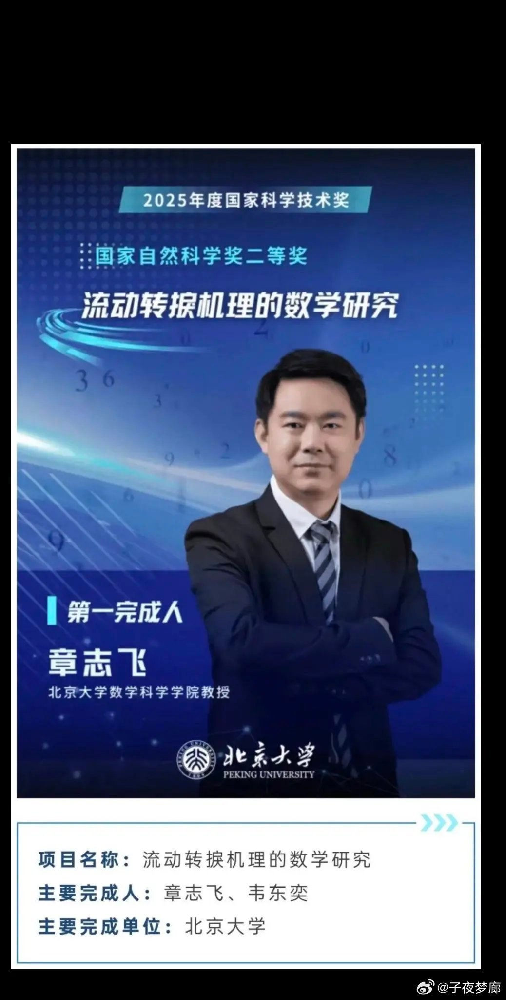

---

## 21

@agentzh

发表于：2026-07-09 21:50

来源：微博

链接：https://m.weibo.cn/status/5319008225068424

马斯克在 X 上公开承认之前骂 Anthropic 骂错了，说它现在确实是 AI 界的领跑者：

"I was clearly wrong about Anthropic. They are obviously currently the leader in AI. No company has released a model as good as Mythos/Fable and they will undoubtedly have Mythos 2 ready soon. 

And I would never cut them off in a way that hurt them badly, even as a competitor. That’s not my style. "

---

## 22

@赤jio熊喵

发表于：2026-07-03 10:47

来源：微博

链接：https://m.weibo.cn/status/5316667032735900

1661，决战热兰遮

这下不敢再说国姓的炮是摆着吓唬人的都未必开得出来了吧

明军操炮水平根本不差，荷兰人这会儿不得不承认国姓的炮兵射速快准头好了。而且火力也不差。

最后荷兰人试图修工事被明军炮兵追着摧毁就很有画面感。

（洋人贬低中国人它有自己的殖民征服搞文化种姓制度目的，有些看似是中国人的人使劲贬低这些事，那真的非常罕见

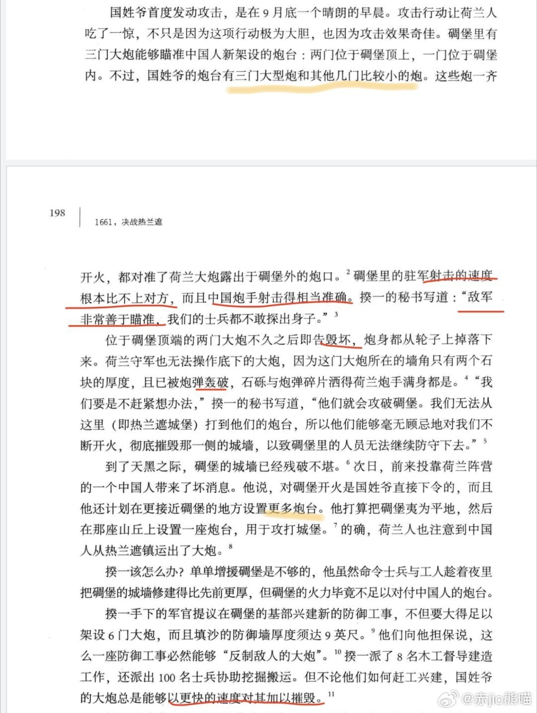

---

## 23

@信号与噪声001

发表于：2026-07-09 16:35

来源：微博

链接：https://m.weibo.cn/status/5318928898458873

今天看了彭博的一篇文章，解释 Burry 为什么会做空美光，我把观点总结一下给大家看看：

Burry 在 Substack 上披露，他做空了美光（Micron），原话是："这家公司把周期性这三个字诠释到了极致。好的时候被吹得比它该有的高，坏的时候被砸得比它该有的低。"

美光 6 月底发了一份炸裂的财报，结果呢？市场兴奋了不到两天就开始跑路。SK 海力士从上个月的高点跌了 25%。美光自己从 11 倍远期市盈率一路缩到 7 倍。

一、「韩国的豪赌」

Burry 盯上的第一个信号，是韩国的资本开支。

韩国总统李在明上周公布了一个至少 1.35 万亿韩元的半导体超级项目，折合大约 8800 亿美元。三星和海力士同时在韩国西南部建新的晶圆厂。

什么概念？巴克莱银行算过，这笔投资摊到全国，相当于韩国 GDP 的 2.6%。一个国家把将近 3% 的经济产出砸进存储芯片扩产。

Burry 的原话是，这种规模的资本开支是终结的开始。

历史上每一次存储芯片行业出现这种级别的扩产潮，后面都跟着同一个剧本：产能集中释放，供给突然过剩，价格断崖式下跌，企业利润蒸发。（见图一）

2018 年那一轮就是这样，三星和海力士疯狂扩产之后，DRAM 价格在 2019 年跌了将近 50%，美光一个季度利润缩水超过 70%。

二、「长鑫存储」

长鑫存储（CXMT）正在准备 IPO，计划融资至少 295 亿人民币，大约 43 亿美元，可能是中国自 2022 年以来最大的 IPO。

这家公司已经被美国国防部列入黑名单，但完全没影响它的扩张节奏。多年投资终于开始回本了，今年一季度利润超过 200 亿人民币。

根据摩根士丹利的数据，到 2028 年，中国占全球 DRAM 净新增产能的 30%，仅次于韩国排第二。

如果苹果真的成了长鑫的客户，苹果一直在游说特朗普政府减少政治层面的干预，那长鑫的扩产只会更快。

三、「脆弱的垄断」

目前三星、海力士和美光三家控制着全球大约 90% 的 DRAM 市场，HBM（高带宽存储）更是 100% 由这三家包揽。

但这个垄断格局比看起来脆弱得多。

存储芯片正在变成一种战略资产。北京把它当成国家安全来投，首尔把它当成经济引擎来投。当政治意志介入供需平衡，传统的市场分析框架就不太好使了。

彭博的数据显示，全球 DRAM 的缺货高峰大概率出现在 2026 年二季度。下半年开始缓解，2027 年进一步宽松，到 2028 年有可能直接翻转成过剩。（见图二）

四、「超级周期的悖论」

半导体分析师们一直在讲超级周期的故事：创纪录的利润、五年期的长协合同、AI 带来的结构性需求。

美光管理层也很努力，财报上反复强调长期合同，有预付款，至少覆盖一半营收。

但市场完全不买账。财报超预期，股价照样从 11 倍跌到 7 倍。

这就是存储芯片行业最根本的矛盾。好的时候所有人用远期市盈率算，觉得便宜得不可思议。坏的时候立刻切换到市净率，用看破产企业的方法给估值。（见图一）

同一家公司，两套估值框架来回切换，说明市场心里很清楚：这个行业的盈利根本不可预测。

我个人觉得有两点：

第一，Burry 的方向大概率没错。韩国和中国同时扩产，供给侧在 2027 到 2028 年一定会迎来一波释放。

第二，Burry 的老问题是时间节点。2008 年他提前两年做空次贷，差点被追加保证金清盘搞得。这次做空美光的入场价大约在 1051 美元附近，而美光年内已经涨了 241%。做空一只动量这么强的票，时间成本是致命的。from 群友

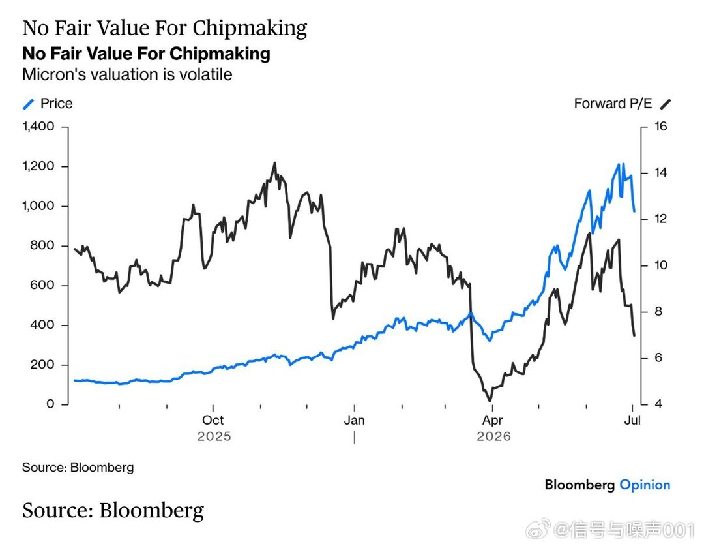

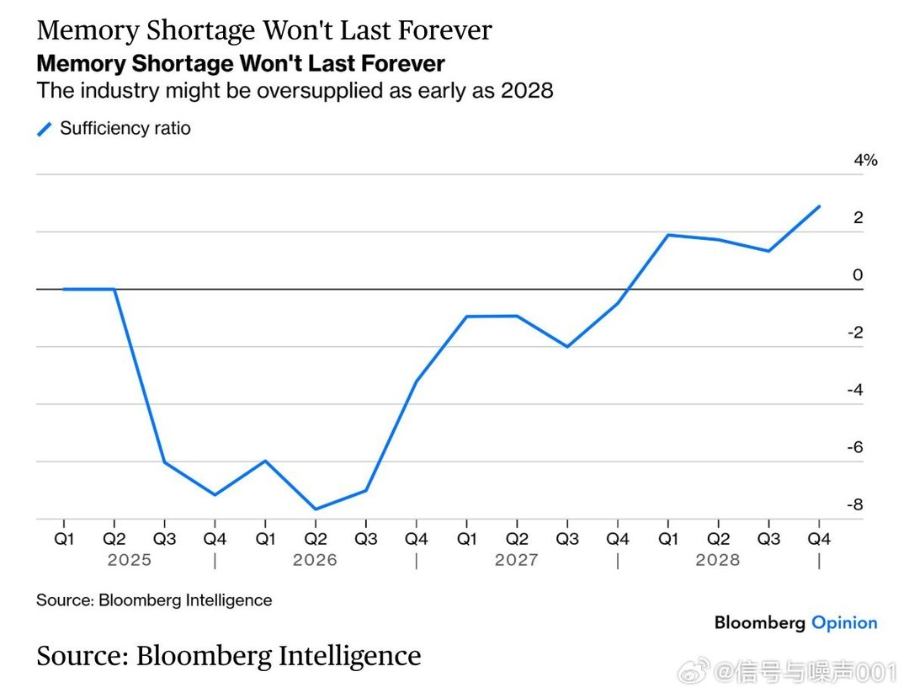

