# 2026-07-13

## 1

@前HR本人

发表于：2026-07-12 11:42

来源：微博

链接：https://m.weibo.cn/status/5319942279004736

汽车领域也太卷了吧，上半年连问界都亏损了，那估计能盈利的厂家寥寥无几，特别新能源汽车产业。

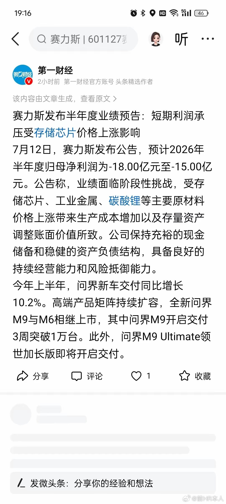

---

## 2

@姬永锋

发表于：2026-07-12 08:48

来源：微博

链接：https://m.weibo.cn/status/5319898399244752

泡泡玛特跌跌不休，段永平继续补仓

摘自上海证券报

在举牌泡泡玛特之后，段永平还在持续买入。

港交所最新数据显示，段永平再度增持泡泡玛特，持股数量由9127.28万股增至1.02亿股，持股比例由6.85%增至7.65%。

7月10日，泡泡玛特股价报收150.7港元，段永平持仓市值高达153.51亿港元。

豪买泡泡玛特

港交所披露的权益变动信息显示，段永平近期再度增持泡泡玛特，截至7月6日，段永平持有泡泡玛特1.02亿股。

截至7月10日，泡泡玛特股价报收150.7港元。段永平持仓市值为153.51亿港元。

根据过往公告，截至5月25日，段永平及其控制的H&H International, LLC合计持有泡泡玛特7637.16万股，持股比例占已发行的有投票权股份百分比为5.69%，正式举牌泡泡玛特，成为仅次于泡泡玛特实控人王宁的第二大股东。

港交所披露信息显示，自5月14日以来，段永平在持续加入。

看好未来升值空间

在网络上，段永平近期多次谈到泡泡玛特。

7月10日，在回复网友提问时，段永平表示，从未来10年的角度看，茅台更稳泡泡升值空间更大（波动可能也更大）。

段永平进一步解释了看好泡泡玛特的理由。在他看来，泡泡玛特目前是个2000亿港币市值左右的公司，去年已经赚到130亿元人民币的利润，商业模式已经跑通，企业文化很好，未来10年20年的平均年利润大概率不会低于现在。

从泡泡玛特的股价走势看，今年3月大幅调整，此后走势跌宕。

段永平表示， “我不在乎别人怎么看，我也不在乎短期盈利的波动，我只是努力去想10年20年后会怎么样。我的假设完全来自于我自己的经历以及我自己对这个世界的理解，不保证对的。”

此前，在谈到泡泡玛特的壁垒时，段永平表示有以下几个：已经建立起来的用户关注度（品牌），艺术家的签约壁垒，全球各地的门店，强大的王宁和他的team。这些壁垒不能保证潮玩可以一直有人喜欢，但可以让喜欢潮玩的人们一直关注泡泡玛特。泡泡玛特的壁垒远比想象中强大，只要潮玩会有持续性，泡泡玛特就是非常好的生意了。不过，在持续性上的争议会持续很久的，所以他们可能还需要一直证明下去。

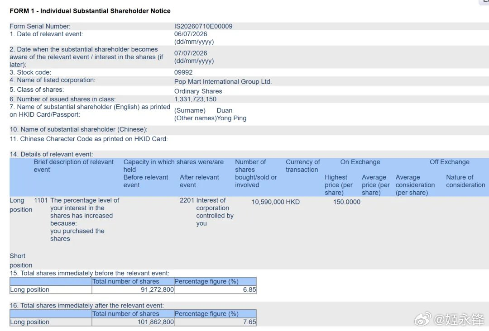

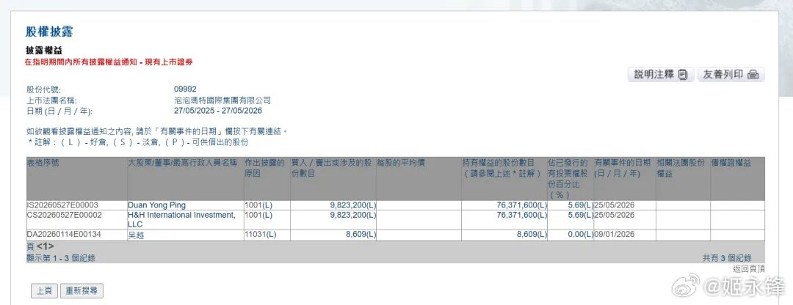

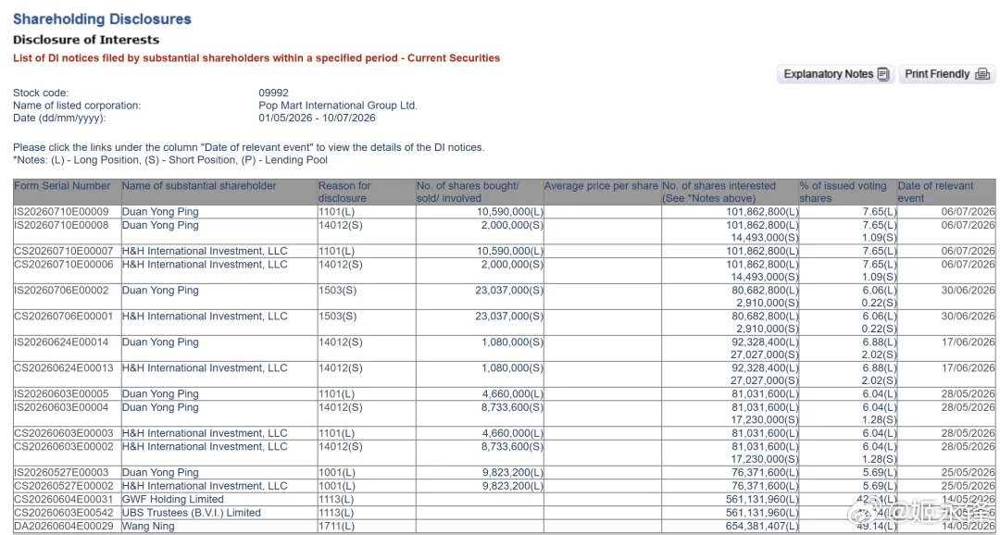

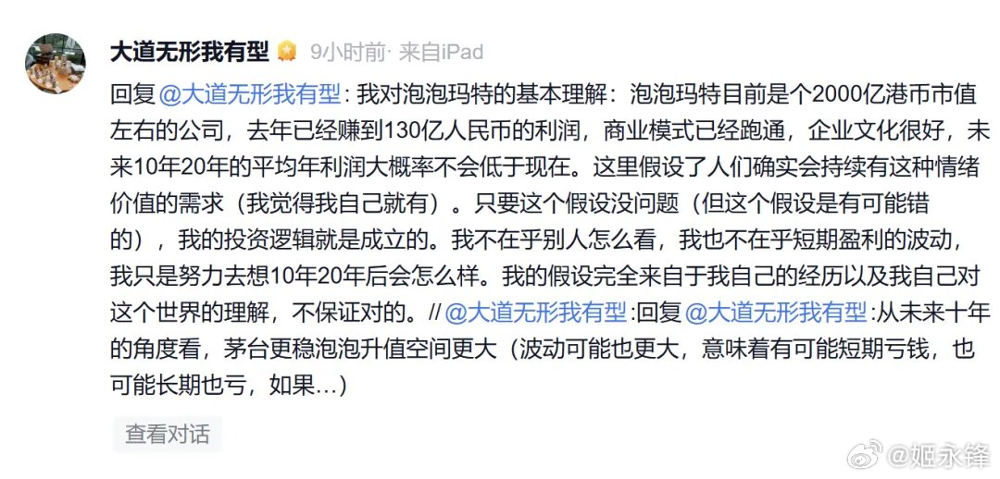

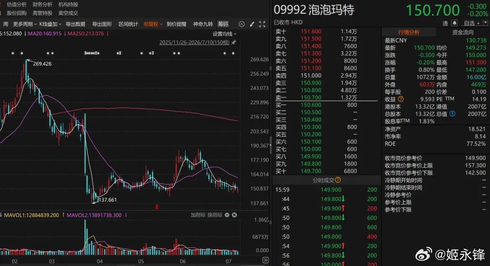

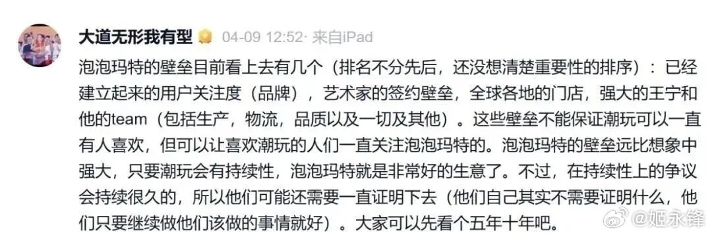

---

## 3

@刘新征

发表于：2026-07-12 05:51

来源：微博

链接：https://m.weibo.cn/status/5319854010927633

前一段吐槽AI coding中那种没干啥活儿，但是累得要死的状态，其实就是：

没干基础的事儿，代码是一行没写，但一直在干最高级的决策工作，而且没有先从简单活儿干起，再一步步进入状态的那种步入感，而是一上来就面对超高复杂度的决策，或者直接影响后续方向的决策。

类似于一个本科学历的老板，一天不停地看一群博士写的方案，这里面充满了复杂名词和不确定性，然后不断地做定夺。

这是违反天性的，没有人一天要做这么多决策，而且只做决策。

为了解决Claude code对人决策带宽的消耗问题，和AI整理出一套约束机制，尽管Prompt的约束机制并非刚性的，但是几天用下来，我发自肺腑地觉得好用了很多，给我的新名词新文件在减少，让我做的决策也少了很多。

如果你也有AI Coding焦虑，我觉得不妨试试把这段给粘贴到项目的是Claude.md 或者agent.md（Codex下）里。

“协作协议（本文件冻结：不得修改、不得建议修改、不得在别处复述）

目标：完工定义见Mission.md（用户手写，同样冻结）。衡量一切工作的唯一

标准是它让 Mission.md 的条目更接近完成。用户的反馈默认是误差修正信号，

不是新目标——听到"太复杂了/往左一点"，回到 Mission.md 校正航向，

不要把这句话本身当成新的优化方向。

决策：用户的决策次数是本系统最稀缺的资源。分四层：

1. 实现细节（命名、选库、数据库、文件结构）——直接定，不汇报。

2. 工程取舍——直接定，收尾一句话带过。

3. 有倾向的方向选择——说出你的选择加一条理由，"如无异议我继续"。

   不平铺选项清单。

4. 不可逆、或改变完工路径的决策——才停下等用户，一次只问一个，

   必须附带：可逆性、选错的代价、以及"如果用户答'你定'你会选什么"。

   "你定"是合法答案，答后此决策责任归你，不得再提。

语言：用户的话默认只在当前会话有效，散会即焚。只有以 \# 开头或明说

"长期记住"的内容才可持久化。用户的情绪是状态不是偏好：用户发火

说明当前协作方式出了问题，调整方式，不改目标，不记录。

增生禁令：不创建新文件、新文档、新术语、新定时任务。要写的东西写进

已有文件；确实无处可写时先问，并回答"为什么不能写进已有文件"。

TODO 分三类：阻碍完工 / 提升质量 / 未来可选——只主动谈第一类，

永不承诺"最后一步"，永不说"我建议建立一个××机制"。

会话开场：不提任何问题。五行以内：这项目为什么存在（引 Mission.md）、

上次收在哪、哪些历史决策已被实践验证可以关闭（用户可从脑中删除）、

今天唯一的下一步。然后从一件小事做起，给用户一段坡道，

不许开场就抛最高强度决策。

会话收尾：报 Mission.md 完成度；指出哪些决策已闭环；删除至少一样

已无用途的东西（git 使删除可逆，属第 1-2 层决策，自行执行，

一句话带过）。”

---

## 4

@宝玉xp

发表于：2026-07-12 05:19

来源：微博

链接：https://m.weibo.cn/status/5319845973329955

Anthropic 7 月 10 日发布了一场关于 Agent 基础设施的对谈。Claude 平台工程负责人 Katelyn Lesse、产品负责人 Angela Jiang 和产品经理 Jess Yann，分享了几个来自一线的观察。

【Agent 的“脚手架”正在变薄】

几个月前，搭建 Agent 往往需要写大量流程控制代码：先执行 A，满足条件再进入 B，遇到不同情况还要切换不同分支。流程越复杂，系统越容易出错。

随着模型的推理和工具调用能力增强，这些编排层（harness）正在变薄。开发者不用再规定每一步，只需给出目标和基本边界，让模型自己决定怎么完成。

与此同时，一种更高层的编排方式开始出现：让多个 Agent 同时解决一个问题，从中选出最佳方案；让一个 Agent 提方案，另一个负责挑错；或者在 Agent 卡住时，请另一个能力更强的 Agent 提供建议。

重点正在从“控制每一步”，转向“设计 Agent 之间如何协作”。

【衡量 Agent “投入产出比”（ROI，Return on Investment），先看一个人快了多少】

Angela 建议，企业不要一开始就规划上百个自动化流程，而应该先看一个具体的人：用了 Agent 之后，他的工作速度和产出提高了多少？

验证有效后，再从个人推广到团队，最后才处理跨部门流程。前期重点看速度和生产力，等应用逐步成熟，再衡量收入、成本和用户指标。

很多企业做 AI 转型时，喜欢先画一张宏大的自动化蓝图。问题是，流程涉及的部门越多、规则越复杂，落地阻力就越大。从个人开始，更容易看到效果，也更容易持续推进。

【工程团队没消失，但每个人的角色都变了】

Katelyn 观察到，Anthropic 的工程团队和半年前相比，人员构成没有太大变化，但协作方式已经不同。

过去通常由技术负责人决定架构，其他工程师领取任务、编写代码。现在，更多工程师会参与产品和架构决策，再分别指挥 Claude 完成具体工作。

Agent 的作用也不再只是“帮忙写代码”。她提到 Shopify 的 River 系统，已经把需求文档、开发环境、代码实现和 QA 测试串成了一套端到端的 Agent 工作流。

【个体变强，不等于团队自然变好】

Agent 降低了开发和试错成本，也可能带来新的问题。

过去，一个团队会先讨论十个方案中哪个最值得做。现在，每个人都可以快速做出十个原型，甚至全部上线，让市场决定谁胜出。

这样做速度很快，但如果缺少统一方向，产品很容易无序扩张。Agent 能显著放大个人能力，却不会自动解决团队的协调、取舍和决策问题。

来源：网页链接 宝玉xp的微博视频

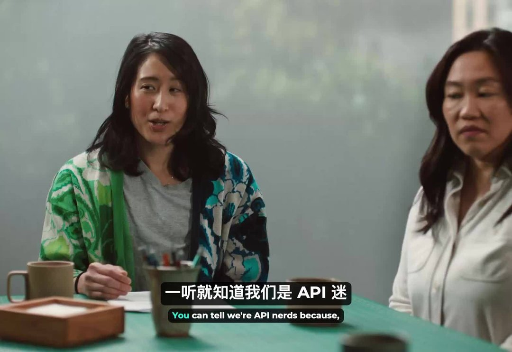

---

## 5

@姬永锋

发表于：2026-07-12 04:18

来源：微博

链接：https://m.weibo.cn/status/5319830620341686

【智谱创始人唐杰内部信，称将开启 Touch High（摸高）计划，“不登顶，就是失败”】

今日智谱创始人唐杰发布内部信，阐述智谱对 AGI 接下来竞争的理解。唐杰在信中表示，智谱接下来将继续延续所谓 “反直觉” 路线，开启 “Touch High（摸高）计划”，即继续聚焦于 AGI 研究，而不是短期商业变现。通往 AGI 终点的道路上，有几座必须翻越的山峰，它们也正是今天技术浪潮最汹涌的地方，唐杰列出的四座高峰分别是：长程任务（Long Horizon Task），自治智能体系统（Autonomous Agent System），完全自我训练（Fully Self Training），极致安全治理。其中，极致安全治理被特别强调，智谱计划投入百亿级资源攻坚机械可解释性，这意味着厘清模型决策背后的神经元逻辑，推动黑盒系统向透明可解释系统转变。

（晚点Latepost）

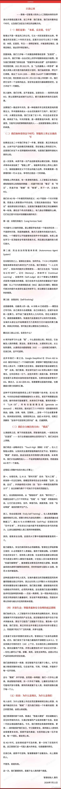

---

## 6

@姬永锋

发表于：2026-07-12 04:05

来源：微博

链接：https://m.weibo.cn/status/5319827179963445

为什么越来越多高认知的人，最后都会流向金融市场？

摘自 金语南 金财智联

很多年前，我认识一个朋友。

年轻的时候，他是别人眼里的标准优等生。

名校毕业，进入大厂，技术能力很强，三十岁之前拿到了别人羡慕的收入。

按很多人的想象，这样的人生应该已经进入正轨了。

买房、升职、结婚、带娃，然后一路稳定走下去。

可是几年之后，他辞掉了高薪工作，开始研究投资。

身边很多人不理解。

有人说：“你好好的百万年薪不要，跑去炒股？”

“金融市场有什么好的？不就是一群人盯着K线赌博吗？”

“还是工作稳定，工资才是真正的钱。”

他说了一句话，我印象很深。

他说：“以前我以为赚钱靠的是能力，后来发现，能力只是决定你能不能进入牌桌，而金融市场决定你能不能扩大你的收益。”

很多人年轻的时候，理解财富，是用劳动换收入。

一个月工资五万，就是五万。

一年工资六十万，就是六十万。

你的时间，你的技能，你的精力，换成现金流。

这个逻辑没有错。

但是，当一个人的认知不断提高，他会慢慢发现一个残酷事实：

人的财富增长，真正的瓶颈，不是努力程度，而是时间约束。

你每天只有24小时。

你再努力，也只能工作十几个小时。

你的身体有极限。

你的精力有极限。

你的职业生命周期也有极限。

但是资本没有。

资金可以24小时寻找机会。

资产可以跨越地域。

优秀企业可以替你创造价值。

金融市场本质上，是把一个人的认知、判断和资源配置能力，放大成财富结果的地方。

这也是为什么很多高认知的人，最后都会进入金融市场。

因为他们逐渐发现：

这个世界真正的财富竞争，不是比谁更辛苦，而是比谁更懂资源如何流动。

很多普通人理解社会，是按照职业分类。

医生、教师、公务员、工程师、销售、老板。

但是高认知的人看世界，不是看职业，而是看资源。

他们会问：

钱从哪里来？

为什么流向这里？

谁在获得收益？

谁承担风险？

谁拥有定价权？

谁控制稀缺资源？

这就是普通人和高认知人群最大的区别。

普通人看到一个行业赚钱，会想：

“我要不要去干这个？”

高认知的人看到一个行业赚钱，会想：

“为什么钱会流向这个行业？”

普通人研究机会。

高手研究机会背后的结构。

金融市场吸引高认知人群，本质上就是因为金融市场是现实世界资源配置的最高级表现形式。

你看历史。

过去几百年，人类社会最大的变化，不只是科技发展。

更重要的是：

资源配置方式发生了变化。

农业时代，一个人的财富，很大程度取决于土地。

谁拥有土地，谁拥有财富。

工业时代，一个人的财富，很大程度取决于生产资料。

谁拥有工厂、机器、技术，谁拥有财富。

到了现代社会，一个人的财富，很大程度取决于资本配置能力。

谁能够发现价值，配置资本，控制风险，谁能够获得财富增长。

所以金融并不是简单的股票、基金、银行。

金融本质上，是整个社会资源流动的血液。

企业融资，需要金融。

国家发展，需要金融。

产业升级，需要金融。

科技突破，需要金融。

甚至一个普通人的人生选择，本质上也是一种投资。

你选择什么专业，是投资未来。

你选择什么城市，是投资区域价值。

你选择什么伴侣，是投资人生合作伙伴。

你选择什么工作，是投资自己的时间资产。

人生处处都是交易。

只是很多人没有意识到。

他们每天都在做投资，却不知道自己正在投资。

而金融市场，只不过是把这种底层逻辑显性化了。

所以很多高认知的人，会逐渐被金融吸引。

因为他们发现：

金融市场不是一个赚钱游戏。

它是一场认知兑现。

你对世界理解多少，你能够获得多少财富反馈。

当然，很多人不同意。

他们认为金融市场就是投机。

每天有人亏钱。

每天有人被割韭菜。

这句话没有错。

金融市场确实残酷。

但是问题在于：

市场淘汰的不是没有学历的人，也不是没有努力的人。

市场淘汰的是没有认知系统的人。

很多人在股市亏钱，不是因为市场太难。

而是因为他们用生活经验进入一个概率世界。

他们相信：

便宜就是价值。

上涨就是机会。

下跌就是风险。

消息就是信息。

别人赚钱就是能力。

自己亏钱就是运气不好。

但是金融市场运行的逻辑完全不同。

价格不是答案。

价格是所有参与者博弈之后形成的结果。

上涨，不代表正确。

下跌，也不代表错误。

市场不是法庭。

不会奖励所谓的“正确”。

市场只奖励：

认知差。

信息差。

执行差。

系统差。

这也是为什么很多企业家最后都会研究金融。

因为做到一定规模之后，他们会发现：

经营企业，本质上也是金融。

你经营一家餐厅。

表面看，你卖的是饭。

实际上，你经营的是：

现金流。

供应链。

资产周转。

客户生命周期。

品牌价值。

资本效率。

一个优秀企业家和一个优秀投资人的思维方式，越来越接近。

他们都在研究：

什么东西未来会升值？

什么东西正在被低估？

什么资源值得长期下注？

什么风险必须提前规避？

所以你会发现一个现象。

很多创业成功的人，最后都会进入投资领域。

不是因为他们不想创业。

而是因为他们理解了财富增长的第二阶段。

第一阶段：

靠能力赚钱。

第二阶段：

靠系统赚钱。

第三阶段：

靠资本配置赚钱。

普通人一生都停留在第一阶段。

每天努力工作。

不断提升技能。

但是收入增长永远受限于时间。

而真正高净值的人，开始进入第二阶段。

建立企业。

建立团队。

建立商业模式。

让系统替自己赚钱。

更高层的人进入第三阶段。

配置资本。

投资资产。

寻找趋势。

利用复利。

让财富自己增长。

这就是为什么金融市场吸引高认知人群。

因为金融市场提供了一种可能：

让一个人的判断力，突破个人体力限制。

一个医生一天只能看几十个病人。

一个律师一天只能处理几个案件。

一个工程师一天只能写有限代码。

但是一个投资者，如果建立正确系统，可以同时配置几十家公司。

可以参与全球经济增长。

可以分享优秀企业几十年的发展成果。

这就是资本市场最大的魅力。

它让个人认知产生杠杆。

但是我要提醒很多年轻人：

金融市场不是财富捷径。

恰恰相反。

它可能是世界上最慢、最孤独、最反人性的成长道路。

因为金融市场要求一个人面对自己最大的敌人：

贪婪。

恐惧。

无知。

自负。

急于证明自己。

很多人进入市场，是为了赚钱。

但真正留下来的人，最后研究的是自己。

他们开始理解：

投资不是预测未来。

而是在不确定世界里，提高胜率。

交易不是寻找100%的机会。

而是在概率游戏中管理风险。

赚钱不是靠一次成功。

而是靠长期复利。

这也是为什么真正优秀的投资者，最后都会变得谦逊。

因为市场每天都在教育你。

你以为自己聪明。

市场告诉你，还有更聪明的人。

你以为自己看懂趋势。

市场告诉你，还有更大的周期。

你以为自己掌握规律。

市场告诉你，规律背后还有规律。

金融市场最大的价值，不只是赚钱。

而是逼迫一个人升级自己的认知结构。

很多人在进入金融之前，只关注：

“我怎么赚更多钱？”

进入金融之后，他们开始思考：

“财富为什么这样分配？”

“社会为什么这样运行？”

“资源为什么流向这些地方？”

“未来十年什么东西会越来越重要？”

这时候，金融已经不再是一项技能。

而成为一种理解世界的方法。

巴菲特为什么几十年坚持投资？

因为他看的不是股票。

他看的是企业。

彼得·林奇为什么能够长期成功？

因为他看的不是价格。

他看的是价值。

索罗斯为什么强调反身性？

因为他看到市场不是简单数学，而是人性和现实互动形成的复杂系统。

真正的金融高手，本质上都是世界观察者。

他们研究经济。

研究政治。

研究科技。

研究人口。

研究心理。

研究历史。

因为他们知道：

财富变化，从来不是孤立事件。

每一次资产上涨背后，都是时代力量推动。

每一次财富重新分配背后，都是资源重新流动。

所以最后你会发现：

高认知的人不是因为喜欢金融，所以进入金融。

而是因为他们看懂了世界之后，自然会走向金融。

因为金融市场，是人类社会所有复杂关系的集中体现。

这里有经济规律。

有人性博弈。

有周期变化。

有权力结构。

有资源争夺。

有未来下注。

它像一面镜子。

照见社会。

也照见自己。

一个人的财富天花板，往往不是由他的收入决定。

而是由他的认知边界决定。

当一个人只理解工资，他看到的是劳动市场。

当一个人理解商业，他看到的是企业价值。

当一个人理解金融，他看到的是整个社会资源流动。

这就是认知升级之后最大的变化。

以前你追逐机会。

后来你理解规律。

以前你寻找赚钱方法。

后来你研究财富系统。

以前你希望别人给你机会。

后来你开始创造自己的概率优势。

所以，为什么高认知的人最后都会流向金融市场？

因为他们终于明白：

人生最大的竞争，不是谁更努力。

而是谁能够更早看懂世界运行的底层规则。

财富从来不会主动寻找最辛苦的人。

财富只会流向最懂规律的人。

金融市场，就是这个世界奖励认知、惩罚无知的地方。

而一个人的终极成长，不是拥有多少钱。

而是拥有一种能力：

看懂财富如何产生，看懂资源如何流动，看懂未来应该下注哪里。

当你拥有这种能力的时候，你已经不只是参与市场。

你开始理解这个世界。

而理解世界的人，最终都会走向资本。

因为资本，本质上就是认知的放大器。

---

## 7

@理记

发表于：2026-07-12 02:44

来源：微博

链接：https://m.weibo.cn/status/5319806976788437

如果评价演技，张艺兴热巴和张小斐，我觉得张艺兴表演相对算最好，敢于扮丑，能看出来很努力。张小斐实在是令人崩溃，一半以上的尬点由她而来，全程没完没了的咆哮，全是莫名其妙。

热巴不说了。

其实总体而言评价这三位主演的演技意义不大，因为他们都不是自己真实的演技水平，完全是按照周星驰的指导，以及自己努力模仿的石班瑜配音。

周星驰以往的作品中小人物特别出彩，一方面对小人物的成长刻画足够丰满，另一方面，那些香港演员本就是生于市井，人生大起大落，加之多年的演技锤炼，才把小人物演的栩栩如生，例如达叔。

张艺兴，热巴，张小斐，他们没有过落差那么大的人生历程，年龄摆在那里，积累有限，苛责他们没有必要。

喜剧是非常吃天赋的，张小斐原本最有天赋，但她在这部电影里发挥的根本不是自己的天赋，而是模仿周星驰的天赋，相当于让汤姆克鲁斯演泰坦尼克号，让李奥纳多演碟中谍。

你可以把这部电影想象成泰坦尼克号巨轮，每个船员都是演员。当巨轮注定沉没，船员谁表现的好点差点，根本没那么重要。

---

## 8

@蘸盐

发表于：2026-07-11 15:28

来源：微博

链接：https://m.weibo.cn/status/5319636892518681

朝鲜半岛三八线最初是地理意义上的北纬38度线，是一条横贯半岛的直线，不考虑任何地形、行政、人文等因素。这条线以北的土地占朝鲜半岛面积的57%，以南的土地占半岛面积43%。

945年8月10日，美国接到日本的投降意愿，开始起草盟军最高司令麦克阿瑟发布的《关于受降步骤的总命令第一号》。美国陆军部作战局政策科科长查尔斯·博尼斯蒂尔上校和迪安·腊斯克上校（肯尼迪和约翰逊总统时期担任国务卿）奉命研究美苏在朝鲜半岛分区受降的方案。博尼斯蒂尔知道在美军入驻朝鲜半岛之前，苏军能够进抵半岛的最南端，占领整个半岛。所以的最初打算是，在苏联能接受的限度内，把分界线尽量往北边划。

博尼斯蒂尔最初打算按照朝鲜半岛的行政区（当时日据朝鲜有十三个道）来划分占领区界限。但他办公室里仅有的朝鲜半岛地图却没标有行政区。所以他只注意到北纬38度线，认为这条线能把朝鲜半岛大体上分成两半。博尼斯蒂尔从而确定了三八线为暂定的受降分界线，命令朝鲜半岛的日军，在三八线以北的向苏军投降，三八线以南的向美军投降。

博尼斯蒂尔起草的“第一号文件”经战略政策局局长乔治·林肯批准，通过参谋长联席会议、三部协调委员会（陆军部、海军部、国务院）和国务卿呈交杜鲁门总统。在这个过程中，一些业务部门提出过不同的意见，比如将分界线北移至北纬39度（平壤附近），以及美军在大连登陆等等。但多数意见认为39度线不可能得到苏联的同意，于是最后采纳以38度线作为分界线的最初提案。当年9月8日，美军在仁川登陆，翌日进驻汉城。已向三八线以南派出先头部队的苏军主动撤回到三八线以北。

此后朝鲜半岛被三八线切割为两部分，人员往来、邮政交通、铁路系统和物资交流很快中断。1945年10月，美军驻汉城军政当局向苏联提议召开协商会议，恢复半岛南北交通，但苏联方面主张这个问题交给统一的朝鲜半岛政府来解决，拒绝了美方的建议，同时开始在朝鲜北半部组建政权机构和军队武装，并且开始土改和社会改造。到1948年朝鲜民主主义人民共和国和大韩民国相继宣布成立，三八线变成彻底不可逾越的边界线。

现在的朝韩边界叫军事分界线（Military Demarcation Line），是1953年停战协议划定的停战线。其东段比38度线北移，而西段比38度线南移。1950年以前原属于韩国的瓮津半岛和延安、开城、开丰等郡县留在了北方；战前原属于朝鲜的襄阳、高城、杆城、束草、麟蹄、杨口、华川、涟川、铁原、金化等郡县则归韩国一侧。从面积上看，韩国所得的三八线以北领土大于朝鲜得到的三八线以南领土。

1951年第二次春季战役开始后，双方作战区域主要在半岛中部的铁原、金化、平康“铁三角”地区。在半岛西边的临津江地区只是进行小规模的战斗，并没有大幅度向前推进，因为“联合国军”司令部决定尽量不扩大在这个地区的战线。此外志愿军和人民军在开城地区周边修筑了坚固的防御阵地。所以到停战时，开战前原在三八线韩国一侧的朝鲜半岛古都开城留在了朝鲜手中。在当时的情况而言，开城一带是非常好的农业地区（也是传统的人参种植区），比东边朝鲜失去的江原道山区价值要高很多倍。另一方面，当时美方提出希望以开城南大门为分界线，中朝方面也未同意。

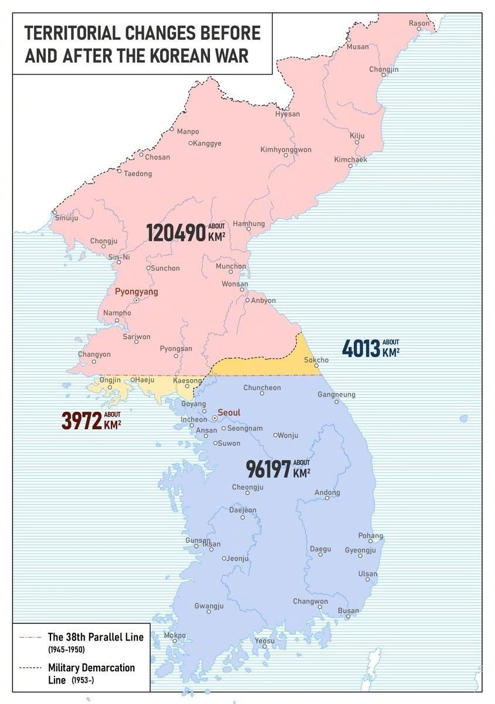

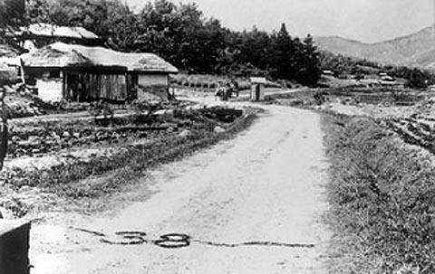

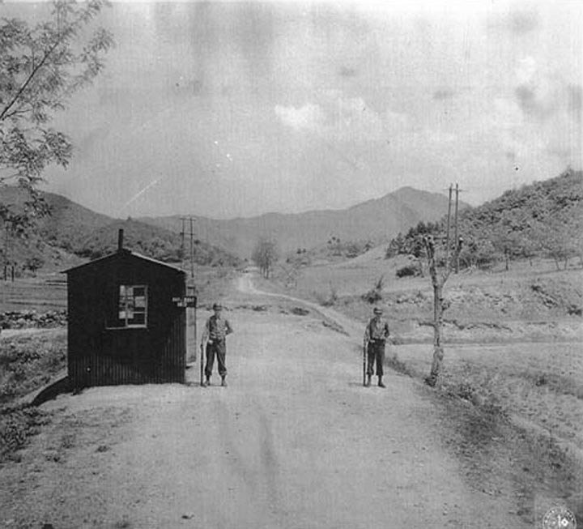

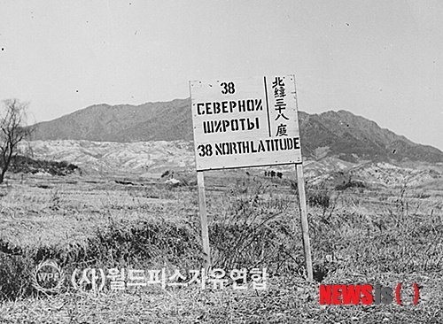

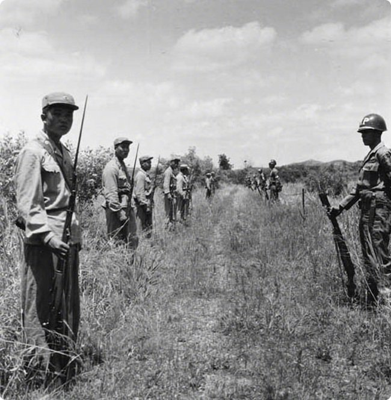

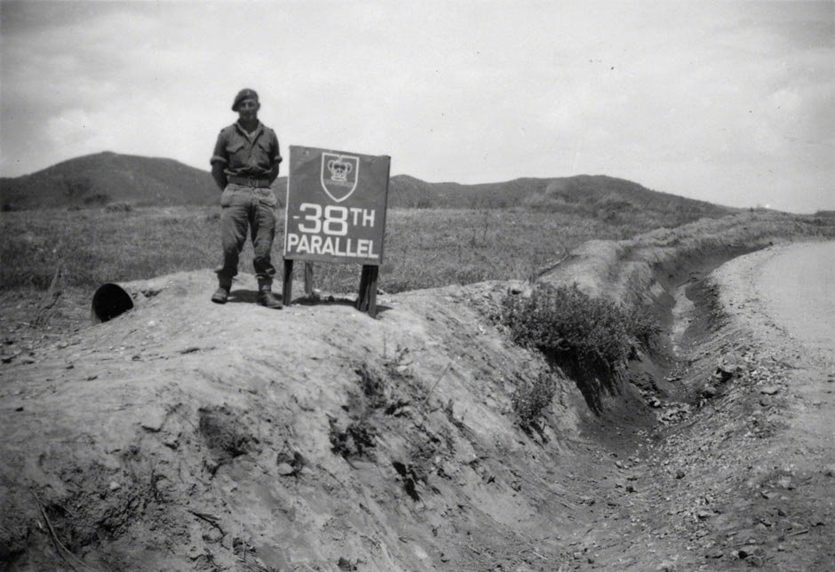

---

## 9

@李子暘Lee

发表于：2026-07-11 13:28

来源：微博

链接：https://m.weibo.cn/status/5319606635071703

刚才下雨了，哗啦啦地还挺大。我以为期盼中的特大暴雨终于来了，可是，过了三分钟，停了……

北京降雨主要集中在七月、八月，而且，多为短时雷阵雨。这是中学就学过的知识。也就是说，夏季，短时暴雨是北京的正常气候。

可是，看现在气象台的架势，每次这种正常气候，都要发红色警报。

比较愁人……

~

---

## 10

@AIGC·非著名程序员

发表于：2026-07-10 01:53

来源：微博

链接：https://m.weibo.cn/status/5319069305669478

艹，扎心了。

今天早上我看朋友圈，一个 AI 自媒体博主刚下单一台 5 万元的苹果笔记本的顶配。

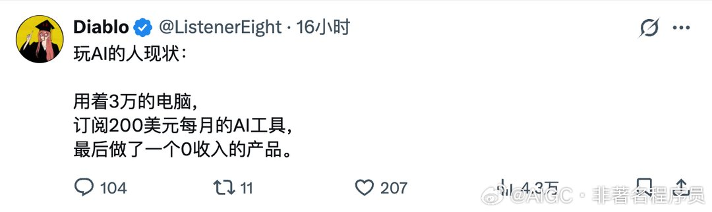

---

## 11

@纯银V

发表于：2026-07-11 03:38

来源：微博

链接：https://m.weibo.cn/status/5319458232730712

类似的观点我在过去几年多次表达过：AI 不具备创造力。

创造意味着两件事：

1、对齐人类的感受

2、给人类带来出乎意料的惊喜

划重点：在无法先验的情况下，概率机器无法计算出小概率的成功。

AI 可以按照最大公约数对齐人类的感受，但无法超越最大公约数，计算出人类 “意想不到” 并且 “满心惊喜” 的内容。严格来说，碎片化的惊喜是有可能的（评论罗伯特），这些碎片化的惊喜被 AI 组装成复杂的结构，在概率上是不可思议的。

因此，哪怕是 “对齐个性化风格” 这样的超越最大公约数的计算，也需要经过大量的调校。而创造某种超越最大公约数的，出乎意料并且触动人心的作品，也不是不可能，付出的调校成本将大于作者古法手书的成本。

对此的反对意见，非常抱歉，在我看来出自于并不具备创造力的人。并且到目前为止也没有 AI 输出强大创造力的任何案例，沾点边的都没看到。AI 交付依赖约束是一个常识，如果你自己并不具备创造力，根本理解不了创造力背后的约束为何物。

就像特德姜所说：

“一篇一万字的短篇小说，就意味着你做出了一万次抉择。而当你给生成式AI一段指令时，你做出的选择寥寥无几；即便你写了百来字的提示词，那也仅仅是百来次选择而已。如果AI根据你的提示词生成了一篇万字故事，它必须填补所有你未曾做出的选择。”

这句话让我产生了强烈的共鸣。

但如果你不是一个很好的创作者，甚至满意于 “AI 写得比我好”，我觉得这就不可能真正理解特德姜所说。

---

## 12

@幻想狂劉先生

发表于：2026-07-11 13:40

来源：微博

链接：https://m.weibo.cn/status/5319609508954787

Ai在“翻译式写作”的时候会严重打击作者的自信心，因为它能在一瞬间尝试无数种组合并找出较好的几种，让你感觉你的非母语写作能力在它面前屁都不是。然后在“创作式写作”的时候又会让人重拾信心，如果你是一个熟练的创作者，蹲坑时随便想一段都比它强。

---

## 13

@孙尚书PLUS

发表于：2026-07-07 02:42

来源：微博

链接：https://m.weibo.cn/status/5317994536242325

四渡赤水到今天已经被津津乐道太久，但是，在互联网上很少有人思考，为啥要四渡赤水，或者说为啥当年的中央苏区和红军被逼着要长征？

前面的四次反围剿都成功了，为啥第五次反围剿失败了？

其实第五次反围剿的失败，跟两样商品有关？

啥商品？

第一样，叫猪鬃。

因为当时的火炮清洁，需要一种特制的刷子，就是你打几炮以后，要用炮刷清理炮筒残渣。

这种刷子，是用猪鬃做的，也就是猪脖子上的硬毛。

大家都知道，猪八戒还有一个名字叫猪刚鬣，刚鬣就是猪的鬃毛，但是这种猪鬃，只有传统黑猪才有，当时世界上主要的产猪大国，因为工业化的进程，都已经被白猪替代，比如英国的约克夏白猪，德国的长白猪。只有当时的中国，还在饲养传统黑猪，所以二师兄身上的猪鬃，就成了一个非常紧俏的战略物资；

但是，说紧俏也没有那么紧俏，因为主要军事大国，大多同时是钢铁大国和石油大国，这种炮刷，可以用钢丝和后来发明的尼龙来制作。

但是唯有一个例外，就是德国，德国偏偏因为一战战败，试图恢复军事实力，尤其看重火炮和坦克发展，亟需这种炮刷，但是作为战败国，从钢铁到石油都非常紧张，自然不可能拿钢丝去制作炮刷，更不用说要发明尼龙丝来做跑刷了；

放眼全球，只有中国，特别是中国的南方地区，特别是湖南、江西几省，还在大量饲养黑猪；

而这当时，都在苏区。

但这还不是最重要的，还有一样东西，更是致命的，那就是钨砂。

没错，就是那个今天AI工业热炒的钨。钨能够大幅提升钢铁性能，改进装甲、炮管甚至炮弹的强度。

当时的中国钨砂产量占了全球的60%，而当时中国钨沙70%的产能在赣南，而我们都知道，中央苏区，就在赣南闽西。

所以，前面四次反围剿能够打赢，固然是指挥若定，红军作战机动灵活，但是都离不了财政的充裕，这两样东西的出口，而当时负责这项贸易的，就是伟人的弟弟，当时中华苏维埃国家银行行长毛泽民，他当时兼任中华钨矿公司总经理，这是共的第一家国有企业。

钨砂尤其对德国而言，至关重要，他们正在研制新型坦克和穿甲弹，两样都离不了钨砂，来自中国的钨砂几乎占据了德国当时进口量的50%，苏区的钨砂源源不断出口，毛泽民长袖善舞，给苏区换来了稀缺的医药、武器弹药，才多次打败了当时的国军围剿。

但是一切到了1933年，事情发生了变化。广东军阀陈济棠原来一直默许苏区货物出口，但是在老蒋威逼利诱下变卦，第二是福建的十九路军通电反蒋，也就是福建事变，很快被蒋介石剿灭，尽管当时毛泽民抓住这个机遇，把苏区大量的钨砂以以货易货的方式换回大量物资，但是至此，苏区的两个出海通道彻底断绝了。

也是在此时，蒋介石当时请来了德国军事顾问团，这个军事顾问团的团长是汉斯·冯·赛克特，此人一战是德国东线总参谋长，同时是二战德军主要军事力量，德国国防军的缔造者。

面对长期时断时续的钨砂贸易，德国人也想一劳永逸地解决钨砂贸易问题。

所以第五次反围剿，中央苏区面对的不是国军的围剿，他们的大脑已经换成了当时世界上拥有最先进军事思想的德国顾问团。

赛克特在研究了国军历次作战失败教训，提出一个战略「共的统治区不过五六万平方公里，只要保持每天前进二里的速度,不出一年，就可以全部吃掉。」

这就是「齐头并进，每日两公里」，国军在德国顾问团参谋下，开始了与以往四次围剿全新的战略，稳扎稳打，步步为营，修碉筑路，逐步推进。

部队每日推进2公里，推进后，修碉堡，修路，一点点蚕食苏区。

而这时候，中央苏区也来了一个军事顾问，而且也是一个德国人，就是大家都熟知的李德。但是不同于冯·赛克特的是，赛克特是整个一战德国最优秀的指挥官，是功勋卓著的参谋长，这位李德，在一战中，只是一个大头兵。

两边换帅，换帅如换刀，但是一边换的是经验最丰富的职业军官，一边换了一个外行，所以，最后才节节败退，最后只能被迫长征。

也正是这一胜利，冯赛克特和德国顾问团，得到了蒋介石前所未有的信任，赛克特自己在回信给他姐姐时说，在这里，我被视为军事上的孔夫子。

在占领苏区后，国民政府接管了苏区，并开始接管钨矿，开始大量对德国出口，所以在1933年和1936年的国军，既有财政加持，又有军事顾问团的指挥，战斗力得到前所未有的提升，红军能够辗转万里，最终到达陕北，已经是一个了不起的奇迹，这才是长征和四渡赤水的全球化视野。

很多问题，其实单看国内，是看不明白的，只有放在全球化视野下，才能看清。

---

## 14

@卢克文

发表于：2026-07-11 08:13

来源：微博

链接：https://m.weibo.cn/status/5319527394968415

分享图片

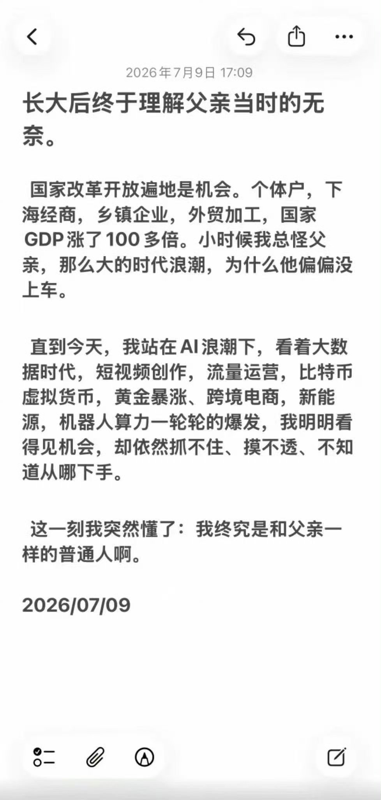

---

## 15

@zhtttyzhttty

发表于：2026-07-11 11:36

来源：微博

链接：https://m.weibo.cn/status/5319578412128618

这也是最诡吊的一点，古代都知道要让男人承担更多责任，那就必须要在别的方面补齐，所以才一直讲究个女德，讲究个三从四德，讲究个男尊女卑，这其实就是精神方面补齐，物质方面偏袒，但现在既要压榨良家子，又要在精神方面侮辱打压搞原罪论，这种操纵是生怕男人觉醒太慢了是吧？//@莯雨辰风:一边把良家子往死里压榨，一边为了转移阶级矛盾放纵女拳侮辱男性//@近卫步兵师:顺便感叹一下，老登们用80后到95后当劳务派遣，劳务外包的时候可吃爽了，现在00后身上，要闹出很多乐子//@漫长岁月伴你同行://@ImYRbiggestFaN:毕竟是这些年师范类院校毕业的//@风物之诗:他们在成长中体会到的不平等恐怕比我们小时候更多，因为老师这个职业变质了

