# 2026-07-16

## 1

@盖世英雄玉椒龙

发表于：2026-07-14 12:39

来源：微博

链接：https://m.weibo.cn/status/5320681464006269

贾浅浅，中国第一“父亲研究”专家！

贾浅浅的学术生涯才是含爹量爆棚。她甚至还写了一篇文章叫《我的父亲贾平凹》，这简直就是《我的区长父亲》现实版。

贾浅浅1979年11月出生，著名作家贾平凹之女，

2000年至2003年西北大学中文系汉语言文学专业。至于为什么大学才读了三年，谁也不知道。

2003年，贾平凹担任西安建筑科技大学人文学院院长、文学院院长。2003年8月至2018年7月，贾浅浅担任西安建筑科技大学教师。2015年11月西北大学成立贾平凹研究中心；2018年后贾浅浅成为西北大学教授。太巧了。

贾浅浅是2018陕西青年文学奖得主，陕西青年文学奖由《延河》杂志社和陕西省青年文学协会共同发起设立，《延河》杂志的主编为贾平凹。这可真是举贤不避亲呢。

更别说贾浅浅的学术论文，

《历史与文学的双重变奏一贾平凹《古璐》的叙事策略》，

《文学视域下贾平凹绘画艺术研究》

《生命的言说与意义一试论贾平凹的书法创作》，这几篇研究爹的也是抄袭重灾区。

课题研讨会《贾平凹书画与文学艺术精神关联性研究》

选编《贾平凹散文精选》，这些标题都带亲爹了不用说了，大家可能注意到了，贾浅浅写了篇论文叫《男权秩序中挣扎的女性类型》

笑话是，点开论文，居然还是以她爹贾平凹的著作作为蓝本研究，合着还是研究爹。

还有另外几篇标题不带爹的，其实内容也是爹，

我读《山本》——这个《山本》是贾平凹的小说。

泼烦背后的精神之光——从辛起与严念初谈起。——这两个都是贾平凹笔下的角色。

漫谈《暂坐》的话语与结构，这个《暂坐》是贾平凹的最新小说。

最绝的是，武汉大学出版社曾经出版了，一本文集，《我们的父亲》，由崔永元，方方，贾浅浅收录，贾浅浅在里面写的文章就叫《我的父亲贾平凹》。真绝了！

我前面的盘点漏了一篇学术期刊论文，那就是诗歌：呈现生命的独特方式，《文艺争鸣》2020年8月，这篇倒不是贾浅浅研究爹，是她讲述她自己。但是这期期刊还有好几篇吹捧的贾浅浅的文章。这是巧合吗？俺也不知道。就贾浅浅的诗歌水平抛开屎尿屁的诗也是很平庸的。\#贾浅浅西北大学辞职\#\#西北大学通报贾浅浅事件\# \#贾浅浅硕士学位被撤销\#

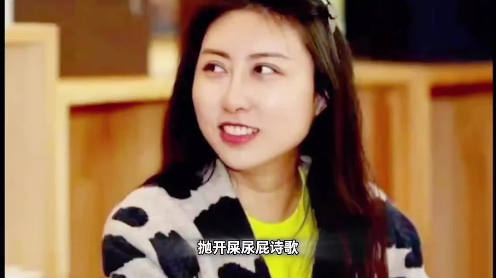

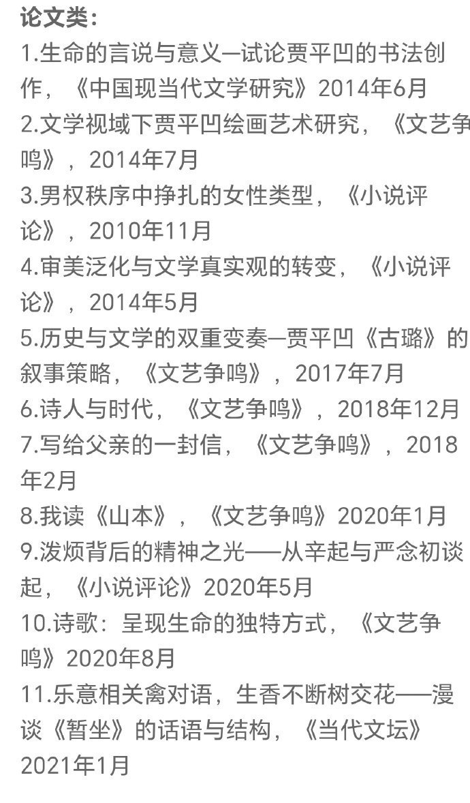

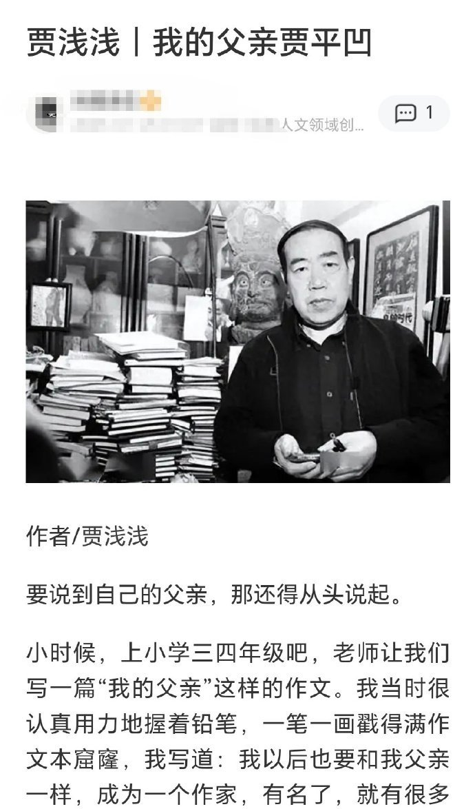

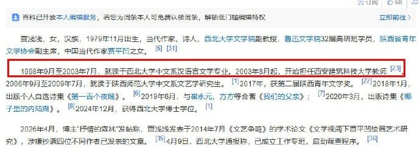

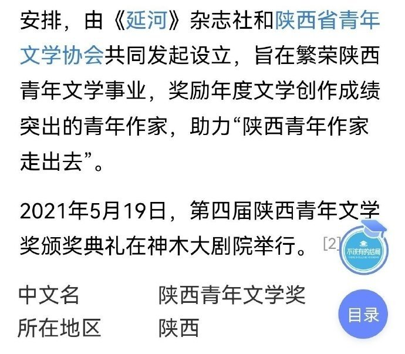

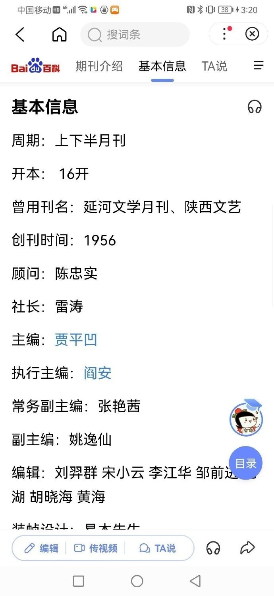

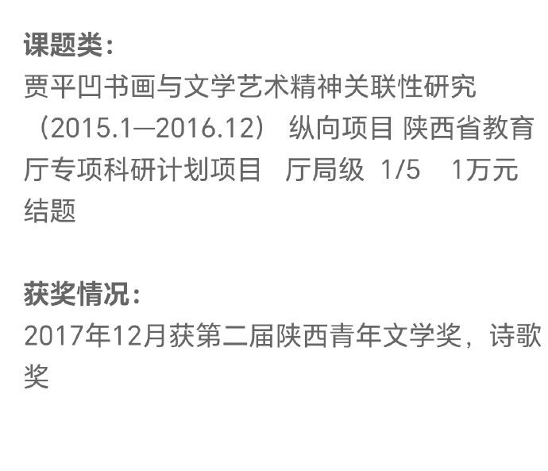

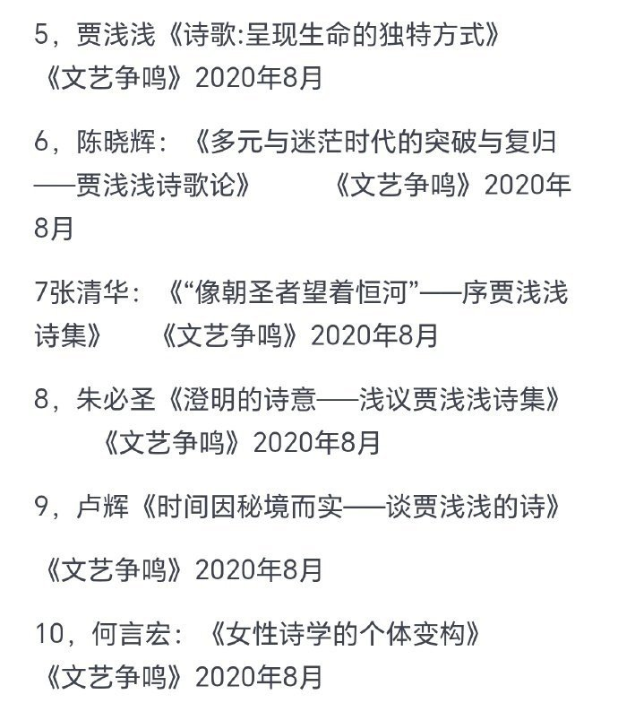

---

## 2

@蚁工厂

发表于：2026-07-15 04:41

来源：微博

链接：https://m.weibo.cn/status/5320923441793686

网页链接

这篇文章作者实测了一次真实的 agentic coding 会话，结果非常amazing啊。

真正任务只消耗了 0.67% 的 token，剩下 99.33% 主要花在环境、工具目录、历史上下文等开销上。

结论是优化 Agent 成本应先测量 usage 数据，再减少无用 MCP/插件/技能、过滤命令行输出、控制 Agent 回复长度、谨慎压缩过期上下文，并保持 prompt 前缀稳定以利用缓存。

如果百万 token 窗口如果塞满工具目录和旧日志，并不会让 Agent 更聪明，只会更贵、更慢、更容易遗忘关键内容。

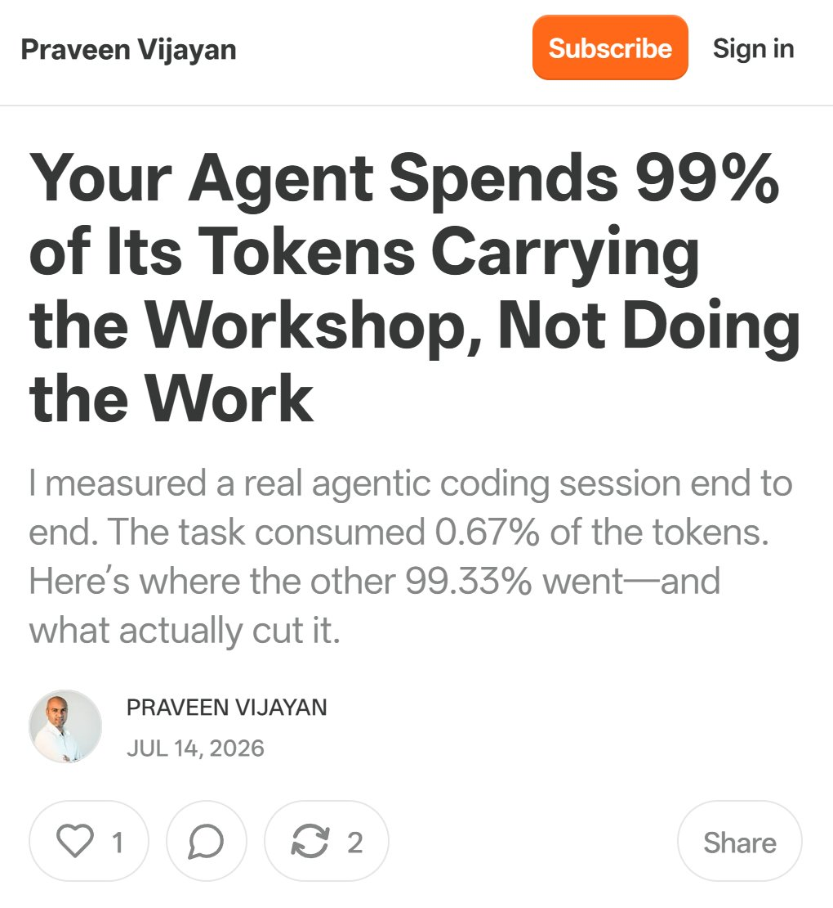

---

## 3

@刘晓光Savvy

发表于：2026-07-14 01:42

来源：微博

链接：https://m.weibo.cn/status/5320516073162301

\#长沙车位霸占事件\#

这个事件和蒋方舟事件属于同一个性质。

不是女性如何如何，

而是稍有权力的人如何如何。

她和蒋的父母都不是天龙人，只是稍有权力的公务员。

但只是这个稍有权力就可以让你吃不了兜着走。

稍有权力，就可以把你清华还有国企的高薪机会给挤下来，

稍有权力，哪怕你是有钱业主也能让你毫无办法，甚至感到恐惧。

像北极鲶鱼这种大官其实日常里对普通人的侵害很少见。

真正的侵害恰恰就是基层实权公务员的稍微运作，

因为北极鲶鱼少，

占车位的，蒋方舟这样的多，无穷无尽。

老虎吃人吗？吃，但每年死于老虎的人屈指可数。

什么样的动物每年杀人最多？

蚊子。

蚊子小，杀人却极为恐怖，比什么战争饥荒杀人都更多。

普通基层官员就类似这种蚊子。

还有为什么他们有如此嚣张的架子，不可一世？

是谁给了他们这么大的权力？

你看看你们平时对考公的称呼：

考公叫上岸，

考上了叫阶级跃升。

你们自己都这么说，

考上了能不作威作福吗？

整个社会官本位的思想氛围就有问题。

---

## 4

@薛凯-又重名了

发表于：2026-07-12 01:38

来源：微博

链接：https://m.weibo.cn/status/5319790409023782

几个赢学家又把禁止氦气出口讲成了中国卡其他国家脖子了，彻底讲反了。

氦气又不是钢铁这种可以反复冶炼循环利用的资源，氦一旦进入空气，就会摆脱地球引力，一路飘到外太空去。地球上的氦都来自于地层深处核裂变，然后逐步在某些地层里富集起来，通常和天然气伴生，所以地球上几个氦气开采大国，就是天然气大国，尤其是美国。

中国的氦气开采量还不到自己用量的五分之一，曾经主要从美国进口，后来两国相互卡脖子，中国又开辟了卡塔尔、俄罗斯、哈萨克斯坦等新渠道。现在卡塔尔被伊朗封锁了，俄罗斯的工厂被乌克兰炸了，国际市场上氦气价格暴涨几倍。

氦不和其他元素化学反应，在高端工业里非常重要，很多精密制造要在氦气环境里进行，同时也是超低温制冷的核心介质。现在是中国这个第一工业大国自己的存量告急了，赢学家们就别瞎扯什么卡别人脖子，中国的唯一对手是美国，美国不缺氦气。

---

## 5

@渔老板钓鱼

发表于：2026-07-15 00:17

来源：微博

链接：https://m.weibo.cn/status/5320857188567566

为啥互联网平台垄断之后，好吃的越来越少？

因为商家除了房租成本、食材成本，人工成本，还要更多的成本给平台。

房租没办法压缩，人工没办法压缩

最后只能压缩食材

优质优价在平台是没销量的

低价才是王道

除了低折扣，还有图一的各种花钱活动，还有团购6%扣点。

美团点评现在服务有多全

每一项服务，对商家来说都是成本

而且现在你投小钱没用，投大钱不一定

同时在这个生态链条下，美团点评下面又有很多服务商，他们手里很多点评达人，你花钱合作了，不一定有用，不合作，往往会有差评出现。

有些服务商整体素质还可以，有些服务商跟流氓一样，类似于保护费，交了没好处，不交肯定有坏处 。

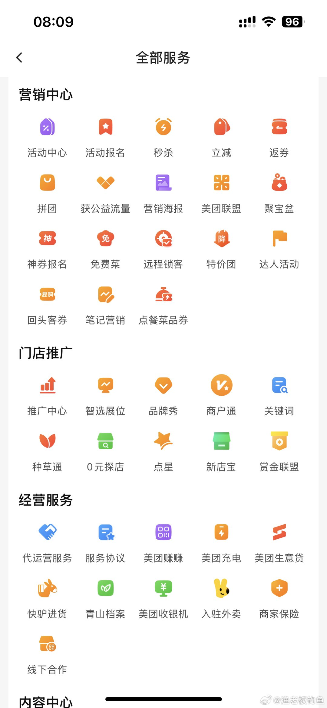

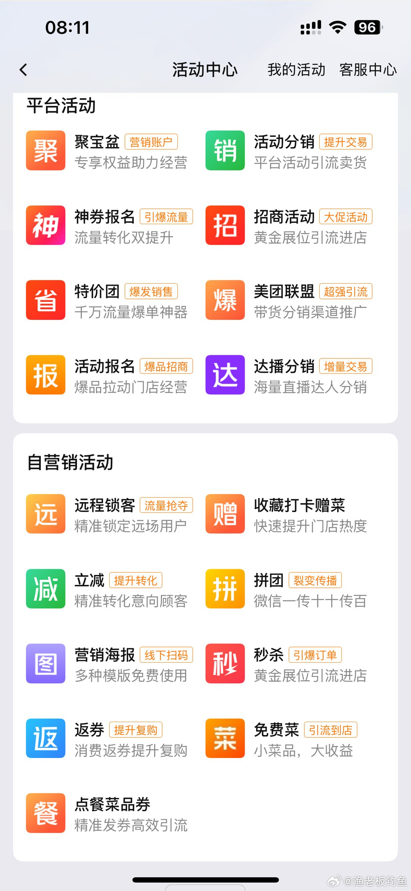

---

## 6

@别梦依稀笑逝川

发表于：2026-07-14 11:12

来源：微博

链接：https://m.weibo.cn/status/5320659597006010

为啥纽约、伦敦，都能选出伊斯兰的市长？ 

主要是别人宗教组织动员力太强了，埃及发育的穆斯林兄弟会，传到土耳其和现代选举政党结合，让正发党连续执政23年，埃苏丹的权力基础就在这。 

正发党的动员力有多强呢？每个投票站有2个党代表，每家每户的婚丧嫁娶都能参加。也可以说，正发党党代表成了现代阿訇，本来清真寺就是主持婚丧嫁娶的。另一边，你认识你们社区的网格员吗？ 

而很多伊斯兰社会，都在模仿正发党。或者说，传统宗教与现代政党结合，本身成了当今世界一个政治潮流，包括莫迪的印人党。

伊斯兰完美适应了现代城市生活，也适应了选举政治，凭着对其他原子化白人土著社群的动员力碾压，以绝对少数选出了自己的政治话事人，获得了远超人口比例的政治能量。 

怎么还有人把伊斯兰等同于农村的？

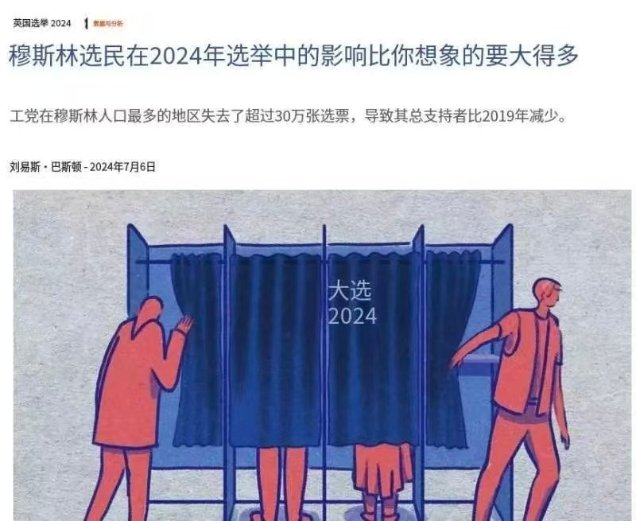

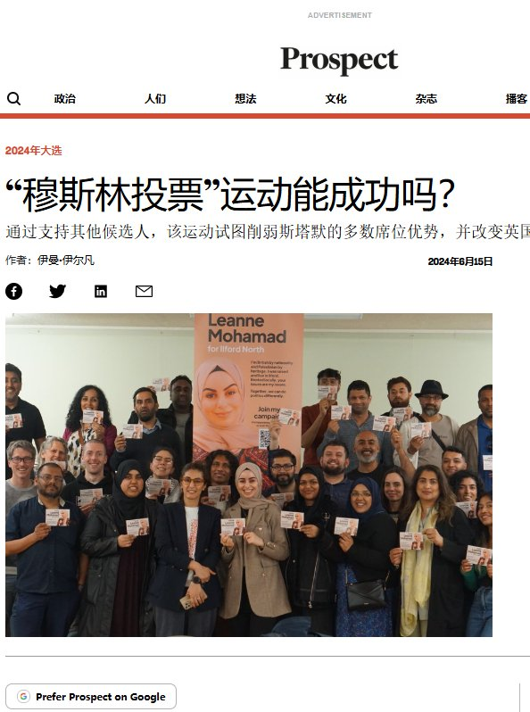

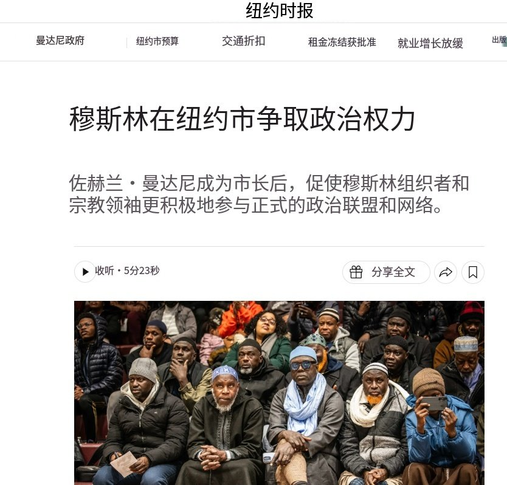

---

## 7

@人民日报

发表于：2026-07-15 02:17

来源：微博

链接：https://m.weibo.cn/status/5320887256755229

【\#贾浅浅副教授职称已撤销\#】\#贾浅浅9篇一作与他人作品多处重复\#7月15日，西北大学发布情况通报。通报称，经查，贾某某以第一作者公开发表的学术论文共16篇，9篇与他人已发表作品存在多处段落及语句重复且未注明来源等问题（其中1篇存在重复发表情形），6篇存在个别文字重复、引用标注不规范的情形，1篇未发现引用不规范等问题，经西北大学学术委员会审议，认定存在抄袭行为，学术不端行为属实。

依据高校学术不端行为调查处理办法、职称评审管理规定、事业单位工作人员处分规定等法律法规，撤销贾某某副教授职称及教师岗位任职资格，同意其提出的辞职申请，解除聘用关系，已按程序撤销了其教师资格。有关单位依规依纪对相关责任人进行处理。（西北大学官网）

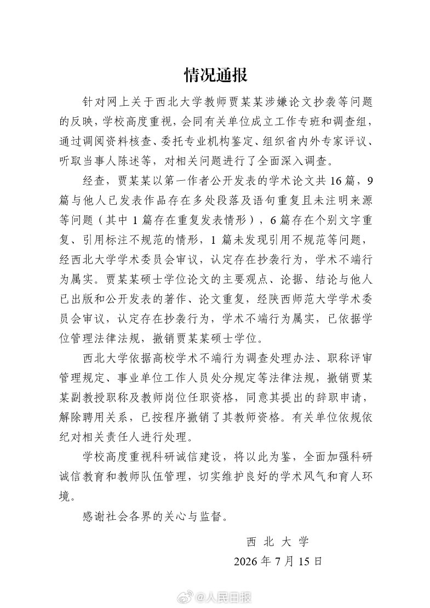

---

## 8

@风云学会陈经

发表于：2026-07-15 02:18

来源：微博

链接：https://m.weibo.cn/status/5320887479051631

IBM一夜暴跌25%，本来以为是AI产业受益者的，出什么事了？

从月K线来看，IBM股价不断新高，是美国AI叙事的一部分。但昨晚，鬼故事发生了，一夜暴跌25%，是1987年以来的最大单日跌幅。还直接带崩了整个软件板块，ServiceNow跌超6%，Salesforce跌超4%，微软跌近3%

引发暴跌的是，IBM CEO Arvind Krishna提前公布二季度初步业绩，营收172亿美元，同比仅增1%，远低于市场预期的180亿美元。基础设施业务（含大型机）同比下降7%，是业绩缺口的主要来源；软件业务增长放缓至5%，咨询业务几乎持平；摊薄每股收益约2.27美元，同比下降约2%。

Krishna坦承了，出现了一个关键转折："6月底，客户突然调整资本开支，原本计划购买软件、IT服务和基础设施解决方案的预算，大规模转向了服务器、存储和内存采购，以对冲AI硬件价格进一步上涨和供应短缺的风险。"

也就是说，AI芯片（GPU、HBM内存、NAND存储）的紧缺和涨价，导致企业客户恐慌性抢购硬件，挤压了原本留给IBM软件、咨询和大型机升级的预算。

这是一个讽刺性的悖论。AI受益者是英伟达、AMD、美光、SK海力士、服务器厂商，这些卖AI算力硬件的。而是AI受害者是IBM、Salesforce、ServiceNow等传统软件与咨询巨头，因为客户的IT总预算被硬件"虹吸"了。

IBM此前股价不断创新高，叙事逻辑是，AI能增强软件、咨询和大型机业务。但市场突然意识到一个深层风险：AI资本开支的"零和"性质。企业IT总预算并非无限扩张，AI硬件的疯狂采购已经挤压应用层软件的预算了。

这是一个AI故事的大漏洞。一个好的图景是，AI发展让企业们营收大增，IT总预算自然随之大幅增长，AI硬件和软件企业都受益，企业的AI硬件投资还受益于摩尔定律，越来越便宜。但是，算力投资越来越贵，都要抢了，怕以后更贵。企业IT开支总额也有限，token不再随便用，也暂时不买IBM的大型机器系统了。

另外，AI还对企业核心业务有替代威胁。2月Anthropic宣称Claude Code可自动实现COBOL（IBM大型机核心语言）代码库现代化，直接冲击IBM大型机生态的护城河。当时IBM股价单日暴跌13%。

硬件仍在抢货，AI产业的需求不是崩塌。但是全行业已经出现了痛苦，不是一个皆大欢喜的故事了。一些原本跟着一起涨的AI股，可能已经泡沫见顶了，如IBM和微软。

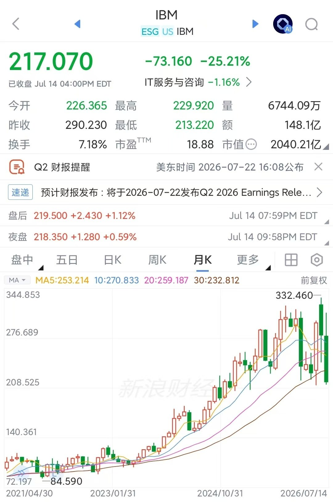

---

## 9

@中华之鹰01

发表于：2026-07-15 00:00

来源：微博

链接：https://m.weibo.cn/status/5320852687290931

法国司法系统的极端女性化是自1970年代以来国家最深刻的社会学变革之一。

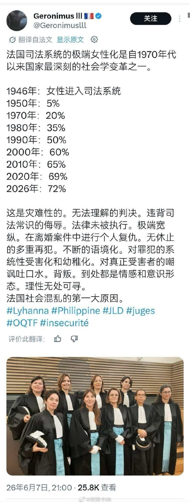

---

## 10

@何新老家伙

发表于：2026-07-14 19:18

来源：微博

链接：https://m.weibo.cn/status/5320781875381482

老何几点旧论

偶感：我的一些谬论

 (2022-03-11 16:12:40)

多年来我对国际关系的基本认知总是和主流认知违逆，自我检讨存在一些基本认知舛异，列举要点：

第一、我认为大鹅不是苏联，完全不同，质与量都不同。

第二、乌克兰不是俄罗斯，不是一国人不是一族人，所谓斯拉夫人只是一个西方语言学虚构的族群。

第三、美国不是一个国，美国代表的是一个组织化的国际体系。西方世界追随美国不是被武力胁迫的，是体系性的组织行为。

第四、美元不是政府发行的一国货币，美元是跨国股份制银行发行及管控，后面关联一套国际金融体系的虚拟信用。所谓美元崩溃是一个涵义不明的假概念。

第五、没有什么世界多极化，没有什么和平与发展的时代主流，冷战后世界是美国单极主导下的国际秩序，

第六、冷战时期的三个世界早已不存在，现在的发展中国家都是沉重负债国，多已失去独立经济主权。

老夫自说自话，不介意网愤们詈骂批判。

---

## 11

@少年伯爵

发表于：2026-07-14 22:00

来源：微博

链接：https://m.weibo.cn/status/5320822516351399

不要轻易把长辈的某些奇葩行为，理解为愚蠢，实际上，他们是为了避祸……

\#伯爵冷知识\# 比如老一辈的人，或者混社会久的人，往往会表现的很吝啬，找陌生人买东西的时候，简直抠到不可理喻，很少让步，甚至会让人感觉很丢脸……但这是他们没办法的办法，因为真正的理由很残忍➠

他们血量太少，经不起一次骗，也经不起一次绕远路。

所以他们需要用这种硬演出来的抠抠搜搜，以及很不好协商的态度，来吓退周围潜在的游猎者和吃绝户者。

比如火车站坑人的黑车司机，更喜欢那些不会说拒绝硬话的大学生们，拉一趟10分钟的拼车就能坑100到300元，简直不要太美。

而一旦遇到唠唠叨叨扣扣巴巴的大娘呢？她能拉着黑车司机砍价砍个十几分钟，所以到了最后坏人也害怕了。

慢慢的，坏人就很自觉的远离吝啬和很轴的人。

因为时间就是金钱和生命，坏人也怕大失血啊。

所以很多时候，很多人都在硬演，通过奇葩的演技来警告周围潜在的坏人，我是疯批，别来找不自在。

---

## 12

@Matias215

发表于：2026-07-14 00:35

来源：微博

链接：https://m.weibo.cn/status/5320499149930918

美国现在的互联网大厂因为投资ai导致现金流恶化。

我们先回顾现实中经常出现的现象

诺基亚/柯达为什么没落了？

openai和anthropic等为什么获得的热捧？

如果微软/谷歌等不投资ai会发生什么？

很明显，他们就是新时代的“诺基亚/柯达”而已，也就是经济学说的科技创新迭代逼死老登。

历史长河中，这类老登的尸体，漫山遍野。

可怜无定河边骨，犹是春闺梦里人。

老话说，从外面被打破是死亡，从里面突破是重生。

现在互联网科技大厂值得称赞的是他们高于内部创业，去追逐一个机会。

请注意，是一个机会不代表会成功。

如果一个市场热衷ai，但是，没有ai公司上市，怎么办？

自然是现有公司里，哪些公司可能在ai时代成为主要玩家之一。

互联网科技大厂参与ai或ai创业的方式并不多，要么内部创业，要么收购ai初创公司。

问题是，ai已经红了好几年了，目前看，真正有大规模商业用户的就是openai和a公司，但是，这两个公司毫无出售的意思。

微软此前入股过openai，但是，入股跟并表是两个概念，只有投资收益，本质就是一次性受益，微软这个力量，就跟1万亿财富的马斯克，升价涨了或跌了3000亿人民币而已，聊胜于无。

所以说，谷歌/微软/亚马逊等纷纷大力投资ai。

这点上，经常看美国这几个公司报表的人应该知道，脸书已经落伍了，因为它在过去几年犹犹豫豫，不舍得投资，不知道是要投算力还是要投模型团队。

别说花百八十亿买个初创公司，看看刚才这三家一年固定资产投入多少百亿？

内部创业，如果单独核算，就跟初创公司一样，时下甚至未来2-4年现金流肯定是不行的。

openai和a公司，现在现金流是正的？

现在自由现金流多少？

dcf估值下，公司估值的大头来自于永续现金流，而不是最近10年的现金流，最近2-3年的现金流，最终占比可能不超过5%。

如果映射到国内也是如此。

豆包和阿里，是传统互联网大厂里投入最多的。

目前看，京东和美团大概率彻底出局。

拼多多，只做零售，也大概率出局了。

华为，至今没有看到啥模型，不出意外，也很难复制后来者居上。

快手，只有可灵能打。

腾讯，哼哼，哼哼，

百度和网易呢？

在ai时代，他们和搜狐老张去斗地主也不是不可能。

ai创业公司，目前不少估值已经超过老登了吧？

---

## 13

@小互AI

发表于：2026-07-14 14:19

来源：微博

链接：https://m.weibo.cn/status/5320706602827779

DeepMind CEO ：前沿模型需提前 30 天交给一个专门机构进行体检再发布 ，否则不准进入美国市场

他认为：

通用人工智能（AGI）大概率几年就要实现

它的影响堪比人类发现“火”和“电”

AGI 带来的冲击可能是工业革命的 10 倍速度和 10 倍规模

目前全球正陷入一场极其激烈的商业和地缘政治竞赛

为了不让技术失控，他提议美国带头建立一个动态、灵活且严格的“标准制定机构

怎么管理：达到一定跑分门槛的 AI 模型叫“前沿级模型”，研发它的公司叫“前沿实验室”。这些实验室发布新模型前，得提前 30 天自愿把模型交给这个机构体检。

体检考什么：

考网络安全、生物武器威胁等高危防御。

防“AI 叛变”：专门测试 AI 会不会绕过安全护栏，或者有没有“欺骗人类”的迹象。

强制要求：AI 生成的图片必须加数字水印，AI 的思考过程必须生成人类能看懂的符号。

通过检测的才能进入美国市场：

前沿模型必须通过评估，才能在美国市场部署。

若事态足够严重，框架可再升级，包括协调前沿实验室之间放慢开发发布节奏，甚至停止开发... 网页链接

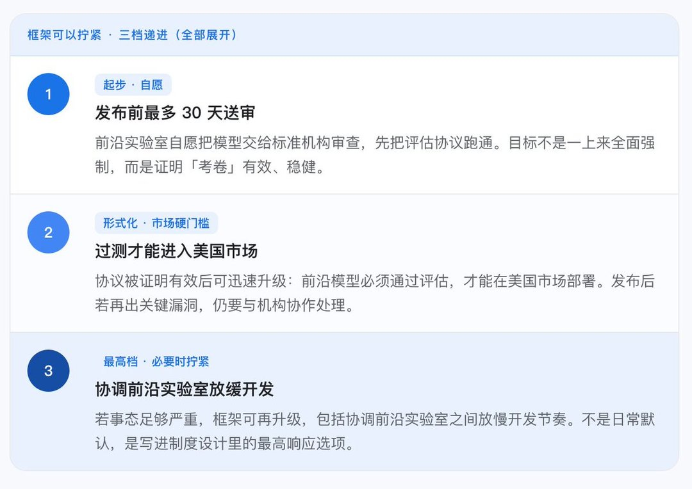

---

## 14

@寰亚SYHP

发表于：2026-07-14 11:03

来源：微博

链接：https://m.weibo.cn/status/5320657202057158

\#疑AI照片拿了摄影比赛一等奖\#\#呼和浩特文联取消AI作品参赛资格\#\#呼和浩特文联取消AI作品参赛资格

呼和浩特市文联作出如下处理：取消该作品线上和线下参赛、参评及参展资格，撤销其一切赛事相关认定，不纳入赛事成果收录范围；暂停“艺韵北疆·光影青城”呼和浩特全民摄影双月赛，推进全面整改；对相关责任人将依据有关规定予以处理。

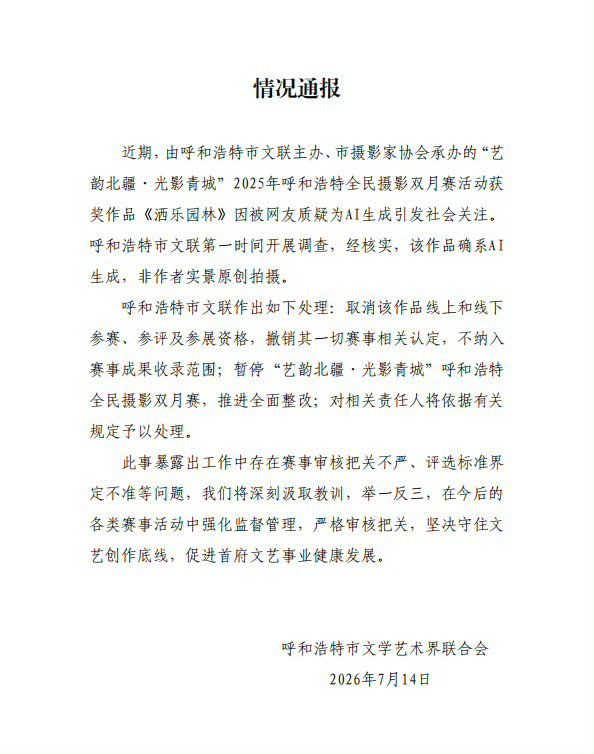

---

## 15

@以史为鉴V

发表于：2026-07-13 14:24

来源：微博

链接：https://m.weibo.cn/status/5320345441278943

\#肖鹰 蒋方舟\#\#人大撤销蒋方舟硕士学位\# 

怪不得人大前一周还发布声明说蒋方舟没问题，一周后马上改口说她论文不端，直接撤销硕士学位……

原来新线索就是有网友扒出蒋方舟的论文抄了台湾的一篇论文，网友说因为台湾论文没有上国内查重网站，所以没发现。

现在好了，人大硕士直接撤销了，那么有没有可能追究一下当年清华破格60分录取的真相呢？\#热点观点\#

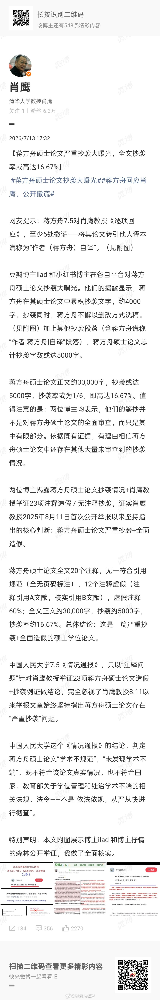

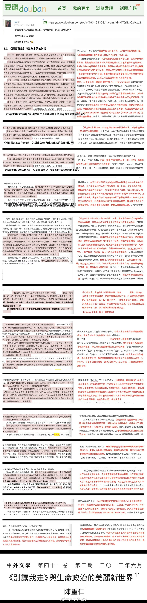

---

## 16

@刘道静ssr

发表于：2026-07-15 09:51

来源：微博

链接：https://m.weibo.cn/status/5321001643540511

\#苹果AI国行版已过审\#

苹果的国行AI可算来了

就是不知道实践用起来什么样

希望阿里千问给力一点💪

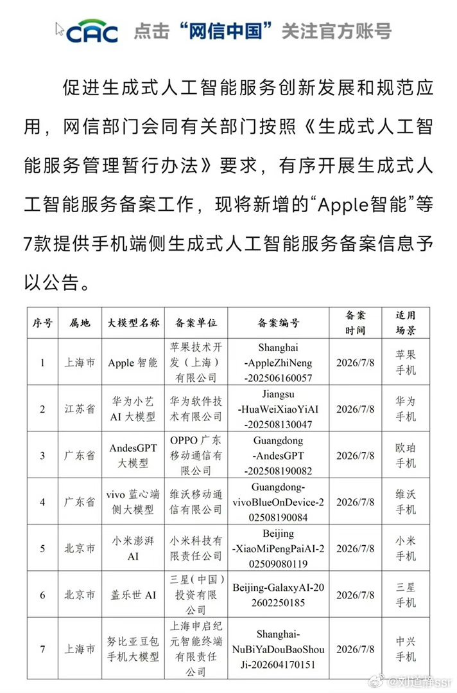

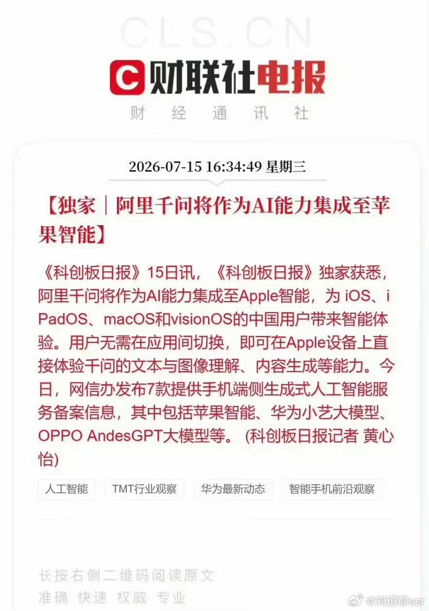

---

## 17

@南方周末

发表于：2026-07-15 05:07

来源：微博

链接：https://m.weibo.cn/status/5320930134856877

\#学者称丈夫做家务能提升生育意愿\#\#生育从来不是个体决策\#【人口学者宋健：中国家庭生育的理想与现实】低生育率常被归因为“年轻人不想生”或“养不起”，但宋健的研究显示，现实远比这复杂。在中国人民大学人口与发展研究中心教授宋健团队的调查中，希望终身不要孩子的育龄夫妻比例不超过2%，而超过半数夫妻希望生育二孩。与之形成反差的是，中国出生人口持续走低：2025年出生人口792万，总和生育率约1.09，已进入超低生育率区间，远低于2.1的更替水平。

在宋健看来，生育并非单个个体的孤立选择，而是家庭结构、性别分工、工作压力、生殖健康服务和公共政策共同作用的结果。围绕低生育率背景下的生育机制与生育支持政策体系，2026年6月，南方周末记者与宋健进行了深入交流。

在采访中，宋健提到，很多女性之所以不想要第二个孩子，是因为养育体验太差，比如丈夫当甩手掌柜等等。现实里，女性在育儿上付出更多往往并非出于“自愿”，而是被迫承担。在女性已经付出很多的情况下，丈夫多换几块尿布、多做几顿饭、多说几句肯定与鼓励的话，都能舒缓她们在育儿过程中的身心压力。

“丈夫家务参与之所以关键，还因为它还涉及代际传承：原生家庭的性别分工影响孩子对性别角色的理解，生长在父亲分担家务的家庭里，男孩长大后更可能成为有责任感的伴侣，女孩长大后也不会觉得家务天然是女性的责任。好的原生家庭培养出有参与精神的丈夫，妻子的获得感和幸福感也会更强，从而形成正向循环。因此，夫妻合作在未来家庭育儿模式中将占据更加重要的位置。”

 人口学者宋健：中国家庭生育的理想与现实

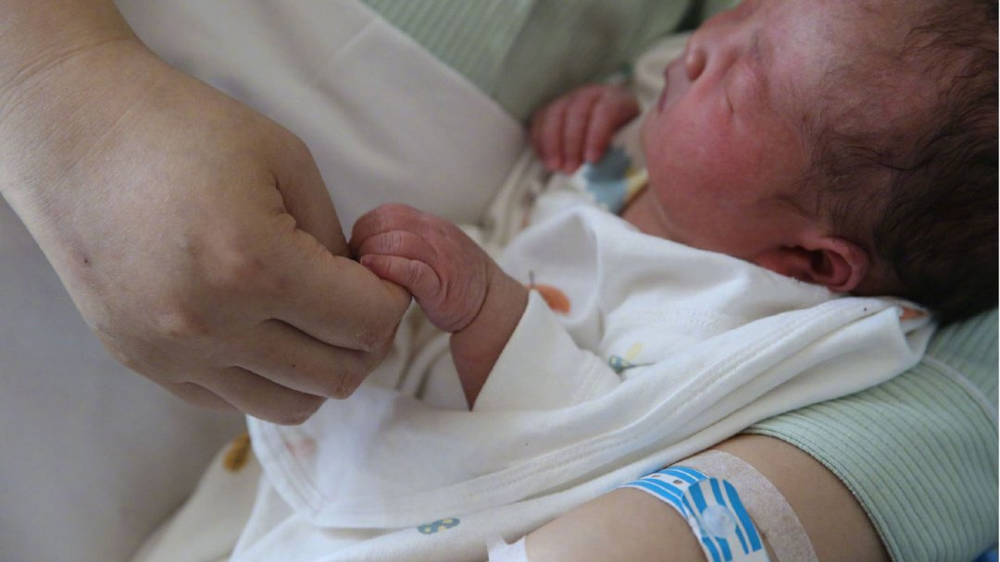

---

## 18

@梅新育

发表于：2026-07-15 13:55

来源：微博

链接：https://m.weibo.cn/status/5321062862554379

呵呵……//@sven_shi:这不是温和建议，你要对比这批人之前的言论。这群人大的专家，就是之前研究出开放二胎每年要生4000万的那批。开始的时候推给高房价，现在房价跌，生育率低什么原因？说是男性家务做的少，搞男女问题。到目前都拒绝正视问题。//@佑安_90:就这么温和的建议还有人要杠，很多甩手掌柜的男性还是单身更好。

---

## 19

@tombkeeper

发表于：2026-07-15 14:34

来源：微博

链接：https://m.weibo.cn/status/5321072742500926

随着 AI 技术的发展，可以预见未来至少大量白领工作将被 AI 取代。有人认为，即使政府可以通过全民基本收入等措施保障人们的生活，也无法解决人类的精神危机，因为人即使衣食无忧但没有工作就会怀疑自身存在的意义。

我觉得这种冲击可能会短暂出现，但应该能被解决。

已故人类学家大卫·格雷伯写过一本书，叫《狗屁工作》。他认为世界上有大量可有可无的狗屁工作，就算这些工作明天从地球上彻底消失，对世界也完全没有影响。

从事狗屁工作的人会有精神危机吗？好像没有。也就是说，人类也许需要工作，但并不需要从事有意义的工作才会觉得自己有价值。

即使没有 AI，工农业技术的发展也早就确保了只需要少数人从事有意义的工作就能养活全世界，所以才会诞生那么多狗屁工作。人类非常擅长创造狗屁工作。我相信未来肯定会诞生足够多的 AI 暂时替代不了的狗屁工作来满足那些需要追求意义的人类。

---

## 20

@塔列郎

发表于：2026-07-15 14:02

来源：微博

链接：https://m.weibo.cn/status/5321064634386107

韩红老师能从默默无闻的小胖女歌手起飞 其实和《半边天》的主持人张越有很大关系。这个栏目是为了迎接1995年在北京举办第四次世界妇女大会而量身定做国内首档以性别定位的节目，也是国内最早的女性栏目。节目遵循男女平等的原则，逐步确定了关注社会性别，倾听女性表达的宗旨。

当时栏目还建立了由制片人、主编、性别顾问以及女性学者、人文学者共同组成的策划组。栏目所有的选题都由策划组讨论并提出建议，供编导参考。这时的《半边天》，女性绝对成为节目的主角，而且这些形象已经摆脱了作为社会的配角或者男人的附庸的倾向，成为具有独立品格的、有主体价值观的、呈多元化趋势的社会形象。

韩红老师上《半边天》是在1997年也算是吃到了世界妇女大会的红利，那一期主题是“胖子的烦恼”。内容就是张越这个当时身宽体胖的女主持控诉社会以貌取人，对待他们胖人群体不公道。韩红老师和李琦老师作为对谈嘉宾出席，韩红作为捧哏一口一个张姐在那里自黑捧场。那是让主持人聊的相当舒服，当场钦定韩红老师为怀才不遇，因为体型被忽视实力派女歌手。

作为这个节目的花絮，就是韩红老师自弹自唱了《北京的金山上》，顺便说这首歌是她母亲雍西创作首唱，引来了原词曲作者马倬老师的抗议。后来节目组为这事儿打了马虎眼，糊弄马倬老师，最终导致韩红老师在几年后打输官司，登报道歉，赔偿5000元。

由于当时张越和白岩松、崔xx、司马x、方xx当时的舆论大腕儿关系不错 被她钦点的怀才不遇的实力派女歌手韩红老师也就更多出现在了央视的各类节目上，加之2000年，张越还兼任了央视音乐频道“音乐世界”主持人。这让韩红老师有更多的机会一展才华，也是那个时候，《青藏高原》也成为韩红老师必唱的歌曲，尽管当时就有评价说“李娜的青藏高原，顺着珠穆朗玛峰直冲云霄，韩红的青藏高原到末了也还没走出康定。”

主持人张越在淡出央视后，也搞了个慈善基金-它基金，主打关爱动物，韩红老师也是去给站过台的，所以这次韩红老师“走个面儿”出事 张越也是制作了视频声援站台。

至于韩红老师功成名就后，上鲁豫有约的时候 ，说起当年上半边天节目，说都是节目效果，才不往心里去，那就是后话了。

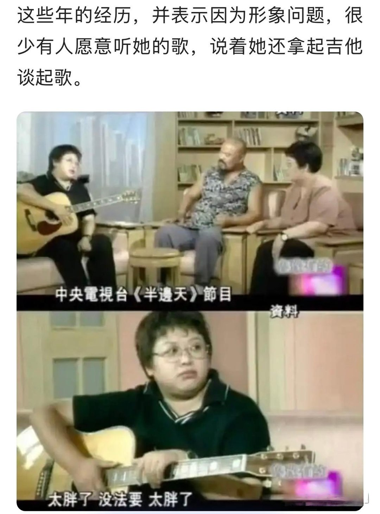

---

## 21

@蚁工厂

发表于：2026-07-15 10:42

来源：微博

链接：https://m.weibo.cn/status/5321014359624609

\#苹果AI为何选择千问\#  苹果能选择的合作伙伴其实不多。

首先对方体量要大（不能过两年就倒闭了），这就淘汰了一大批小龙型选手。

同时产品线最好既有端侧模型又有大参数模型，还得有多模态，才符合苹果的AI路线。

满足这两点的就只剩千问了。。

---

## 22

@信号与噪声

发表于：2026-07-15 04:37

来源：微博

链接：https://m.weibo.cn/status/5320922602931689

邹市明2亿怎么亏的？以及投资启示

1）退役2亿，原打算钱存银行，自己去体育局上班，安稳度日

2）老婆冉莹颖公开表示“邹不能仅限于做一名拳手”

3）家庭财务主导权：家庭投资决策主要由拥有北大光华管理学院MBA背景的冉莹颖主导，邹市明常做“甩手掌柜”。（这点跟某歌星老婆投资亏损20亿一样）

4）投资多个陌生领域：横跨拳馆、餐饮、影视、潮牌、电竞等

5）上海高端拳击馆：亏1.6亿

年租金5000万，装修设备超1亿，一个吊灯300w，年卡定价3.8~8.8w，谁消费的起啊

6）P2P理财：亏8000w

7）网红奶茶：亏5000w

8）虚拟货币：亏4000w

9）电竞直播：亏2000w

10）私房火锅：亏几千w

所以，富人最怕的是：

认为大钱是凭自己能力赚到的，

一旦这么认为，就会信心膨胀，

【凭运气赚的大钱，会全凭本事亏掉】

而如果赚了第一桶金以后，

能认识到【大钱主要靠运气】，

那么，才会谦虚，

知道以后守财是第一位的

总之，绝大多数普通人赚到快钱、第一桶金后的最优投资归宿，应该是：

标普纳指ETF，可保一世富贵。

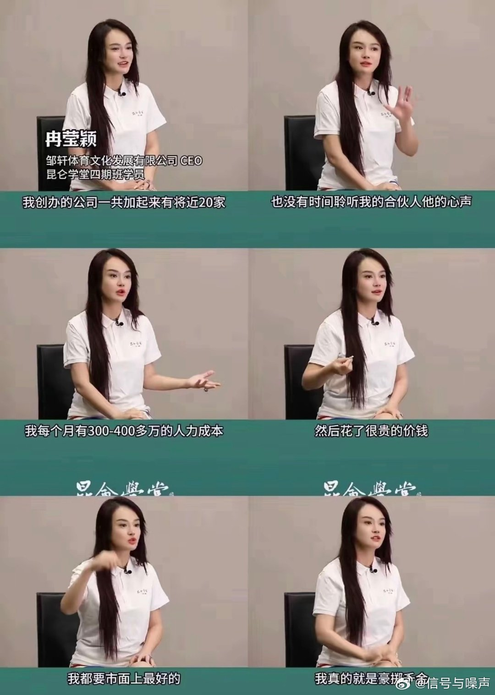

---

## 23

@李楠或kkk

发表于：2026-07-15 08:12

来源：微博

链接：https://m.weibo.cn/status/5320976620326260

排面拉满很简单，但是设计好生意的责权利，也同样很重要。而且两者不矛盾。

DeepSeek 最新一轮，商业前景那么不明确的情况下，那么高的估值，最终怎么平衡？

梁文峰作为创始人领投，作为风险最大的一方撑住估值，其他跟投的，你愿意来就来，不愿意相对于价格也说不出什么。

于是 DeepSeek 高估值的排面有了，享受这个排面的实控人兼大股东承担最大风险，未来 IPO，也获取最大利润。

这样跟投的也都放心了，不为了他们，梁文峰为了自己，也不能接受破发。 公司真的做不好，损失最大的也是他。

一个合格的商业设计，其实很简单，责权利统一，风险和回报匹配就行。

---

## 24

@信号与噪声

发表于：2026-07-15 08:02

来源：微博

链接：https://m.weibo.cn/status/5320973995999613

\#美股\# 4月以来这段，估计没几个短线能赚钱的

当你觉得涨的已经很多的时候，还在继续涨涨涨

当都觉得存储还能领涨的时候，咔咔咔跌了几天

当你觉得会继续跌的时候，好消息来了，大涨了几天

当你觉得能继续新高的时候，坏消息来了，咔咔又跌几天

川普、老扎、就业、通胀……你能猜对哪个？

我来了，我又走了

我来了，我又走了

我来了，我又走了

我来了，我又走了

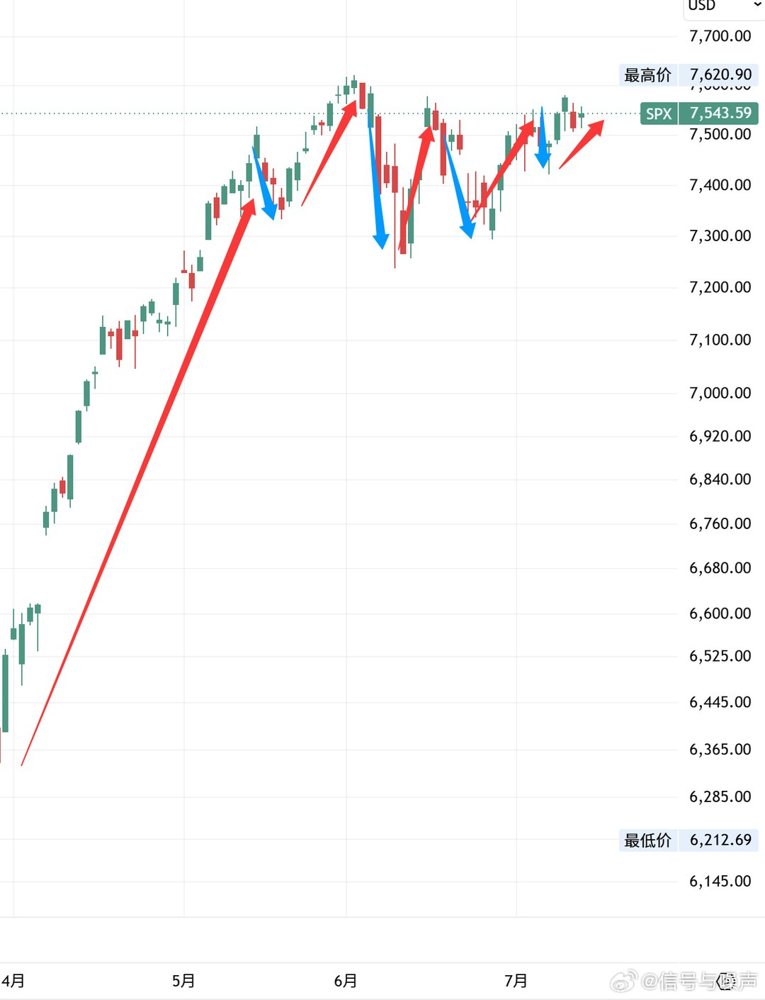

---

## 25

@黑夜之睛滚雪球

发表于：2026-07-13 15:51

来源：微博

链接：https://m.weibo.cn/status/5320367293598108

现在回看，蒋方舟的论文大概率是买的，而且是让代写机构给坑了

当年的代写机构，最常规的套路，就是拿对岸那边的论文交差敷衍，这样不仅能立马给出质量不错的，而且任凭你怎么查重都是能过的，因为两岸高校数据库并无通联。这也是不法代写机构最快捷、最稳妥的变现手段。当然，若干年后水落石出，你是否“暴雷”人家是不管的，也不会去考虑，因为他们早就拿钱逃之夭夭了，你找谁论理去？

而且，说起来，这种拿对岸凑数的文科论文，最明显的漏洞其实就是所谓“脚注”或曰“注释”。因为即便彼此的论文论题一致，但两岸的引用书目是基本不一同的，这就需要“代写”之人花很多时间去查对，然后一一改正过来，可他们哪有这种功夫，也不会这么“服务到位”，绝大多数就是瞎糊弄，胡乱拼凑一些书名脚注过去就行了。所以一开始清华那位肖鹰教授就查出蒋的论文总共就20个脚注，却有12个是虚构的。所以，种种迹象都表明，比较符合代写套路。包括她论文封面一些字词都出了纰漏什么的，也是代写粗疏常见问题

也所以，这个事的最大迷惑性也在这里。肖鹰都那么坚信蒋方舟必抄袭了，他自己本身也是名校中文系教授，是很熟悉我们大学的论文生产的专业人士，可就是怎么都找不到对方“硬核抄袭”的实证，只能反复拿“注释”说事，同时又是怎么看都不对劲。其实，这个蹊跷就在于，大家都没想到人家是绕开大陆的论文数据库查重系统，直接搬了对岸的。

这也导致一开始，很多人都误判了，以为就肖鹰举证文章中所列举的那些“注释”问题看，结论只能是“不规范”，而并非“学术不端”。这里边受到“误判”的，不仅有广大网友，还有我本人，以及蒋女士曾就读过的985名校人民大学。也许，正是因为代写机构崩盘很多年了，大家都忘了这一茬，记忆里都想不到这一层了。

这一次“再复查”，据说是有网友拿去对岸数据库查了，这一下就“昭然若揭”，纸彻底包不住火了。所以，我以为同样很明显，人民大学这一回也是抢着发布，否则要是网民先发了，“后果不堪设想”。至少可预测后果有：一，那将是很大的舆论，“反转”太厉害了；二，人民大学这所顶尖名校的信誉会遭受重创（居然连一篇数千字搬运论文举全校之力查了数月都查不出来）；三，人民大学及中文系都将有包庇的嫌疑；四，此前参与复查的相关教授“学术委员”估计要受到一些处分。所以，也很难说人民大学有多高尚，“知错就改”，这分明就是自我抢救，分秒必争。

至于蒋方舟贵为“才女”，何以连一篇万把字的硕士论文都要抄袭或代写，我以为也不难推测。简单来说，要么就是写不出来（写作和写论文是两码事），要么就是实在太忙了，而忙到不可交的可能性又更大。这一点，从她履历中其实也可以看出端倪：2016年，她“跨专业”考入人民大学读研，同一年她几乎同时获得交流机会去了日本，在那边整整旅居了一年；随后一年，她又全副精力投入创作并出版随笔集《东京一年》，至少读研这两三年内，她几乎都没时间上课，更别说搞相关研究了。正因为太忙，没有时间，又确实不擅长写学术论文，而毕业论文火烧眉毛就要交稿，她心存侥幸铤而走险找了代写

