# 2026-07-17

## 1

@阑夕

发表于：2026-07-16 09:07

来源：微博

链接：https://m.weibo.cn/status/5321352804306556

笑死，这几天有人在推特上给Codex的负责人提议，让大家用取消Claude Code订阅的截图换取一个月的免费Codex会员，然后Codex那边的回应是，不用这么复杂，只要你们发推文夸夸Codex，就能直接领取100美金的额外用量，我用小号水了一句，然后没过多久就真收到了⋯⋯

于理而言，我要严肃批判这种刷好评的卑劣伎俩，于情而言，真他妈香，求常驻！！！

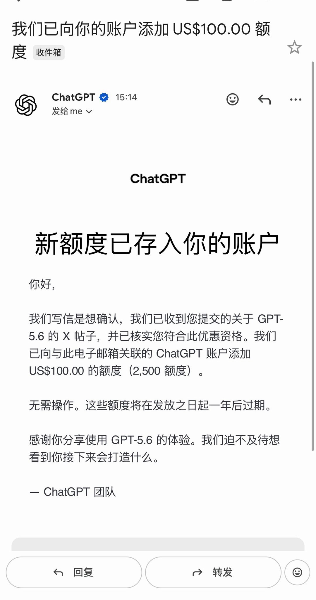

---

## 2

@有个梨GPT

发表于：2026-07-16 07:57

来源：微博

链接：https://m.weibo.cn/status/5321335282864431

今天有个奇怪的想法，share一下。

之前有一家叫Taalas的公司做过maskrom上的大模型，推理芯片。它这个是搏性能的。

我的想法和这个类似但是不搏性能，搏容量。具体的说用maskrom做大模型的只读内存。ddr5接口。这样普通电脑用户可以买来插在电脑上用。

而且这玩意对半导体工艺的要求巨低。华为可以考虑用这个方式做车机。阶段性升级模型，直接换内存条。

---

## 3

@_北巷_

发表于：2026-07-13 00:50

来源：微博

链接：https://m.weibo.cn/status/5320140569970787

坏消息，以后我们只能吃牛粪了；好消息：牛粪有的是！

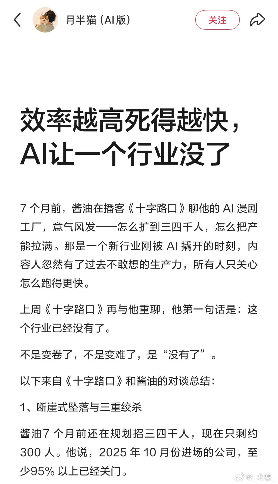

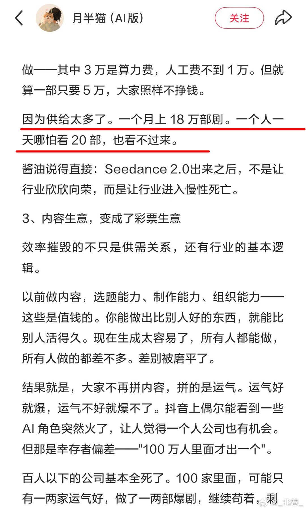

---

## 4

@史真香911

发表于：2026-07-15 16:51

来源：微博

链接：https://m.weibo.cn/status/5321107332925515

俄乌久拖不决的病根终于摊开！俄军全程犯了兵家大忌，就靠添油战术一点点往里耗，反观四十多年前的中越边境作战，我军直接压上三倍兵力泰山压顶，一两个月就搞定目标火速撤军，两种打法的结局差得不是一星半点。

 

战争最怕什么？最怕目标一变再变，今天想达到这个目的，明天又增加一个新目标，结果越打越复杂，最后骑虎难下。

 

当年的中越边境作战，采取的是集中兵力、重点突破的方式，在主要方向形成优势力量，快速完成既定任务，然后按照计划撤军，整个行动时间比较短，没有陷入长期拉锯。

 

再看看今天的俄乌战场，情况就完全不一样了，从2022年冲突爆发到现在，双方依旧围绕多个方向展开激烈争夺，今天这个村子被拿下，过几天可能又易手，前线很多地方反反复复争夺，推进速度并不快。

 

为什么会这样？原因其实很现实，现在已经不是几十年前的战争模式了，过去部队集结好了，可以突然发动大规模冲锋，现在呢？天上有卫星，无人机二十四小时侦察，很多目标刚一集结，就有可能被发现。

 

不仅如此，各种远程火炮、导弹、无人机越来越多，进攻部队只要一暴露，就可能遭到火力打击。

 

所以，现在发动一次大规模进攻，成本远远高于过去，很多时候，双方为了一个村庄、一条交通线，都可能打上几个星期甚至几个月，推进几百米都不容易，这也是现代战争最大的特点。

 

再说俄罗斯，不少公开分析认为，俄军这些年不断调整部署，在一些重点方向持续投入兵力，希望一步步扩大控制范围，这种打法能够保持前线压力，但同时也意味着战争会进入长期消耗。

 

而乌克兰这边，在欧美国家持续提供武器、资金和情报支持的情况下，也一直保持着作战能力，这样一来，双方都还有继续打下去的能力，自然就很难出现短时间决定胜负的局面。

 

所以现在很多军事专家都认为，这场战争早就不仅仅是在拼前线士兵，而是在拼整个国家的综合实力，什么叫综合实力？简单说，就是谁的工业更强，谁的后勤更稳，谁的经济更有韧性。

 

现代战争每天消耗的炮弹、导弹、无人机数量都非常惊人，这些装备不是天上掉下来的，而是工厂一件件生产出来的，如果后方生产跟不上，前线再能打，也会慢慢受到影响。

 

所以你会发现，现在很多国家都在扩大军工生产能力，因为大家都明白，现代战争比拼的不只是武器先进不先进，更是谁能够持续不断地生产装备。

 

当然还有一个很多人容易忽略的问题，那就是战争目标，当年的中越边境作战，目标相对明确，所以完成任务以后就可以结束行动，但俄乌冲突牵涉的问题更多，包括领土、安全、国际关系等多个方面，双方都有自己的战略诉求，这也决定了战争比一般局部冲突更加复杂。

 

正因为目标复杂，所以结束战争的难度也更大，很多时候，即使战场上取得了一些优势，也未必意味着战争马上就能结束，这也是为什么国际社会一直呼吁通过政治谈判解决问题，因为单纯依靠军事手段，很难彻底解决所有矛盾。

 

其实从这两场战争里，我们真正能学到的，不是谁的战术更厉害，而是几个最基本的道理。

 

第一，目标一定要明确，目标越清楚，行动效率越高；目标越模糊，越容易陷入长期消耗。

 

后勤保障永远是战争的生命线，历史一次次证明，没有稳定的补给，再强的部队也很难长期保持战斗力。

 

现代战争越来越考验工业能力，今天比拼的不只是坦克、大炮，还有芯片、通信设备、无人机、电力、制造业和整个供应链。

 

也是最重要的一点，战争没有真正的赢家。

 

俄乌冲突不仅给双方带来巨大损失，也影响了全球能源、粮食供应、国际贸易和经济发展，很多国家虽然没有直接参战，但同样受到了波及，所以说，战争拖得越久，付出的代价往往越大。

 

俄乌冲突之所以一直打到今天，原因绝不是某一个战术或者某一次战役决定的，而是战略目标、国际援助、现代武器发展、工业能力、后勤保障以及国际环境等多种因素共同作用的结果。

 

中越边境作战和俄乌冲突所处的时代背景完全不同，两者可以作为不同战争案例进行分析，但不能简单照搬经验，对于任何国家来说，和平始终比战争更加珍贵，能够通过对话解决的问题，终究比长期消耗更符合各方利益。\#历史\#

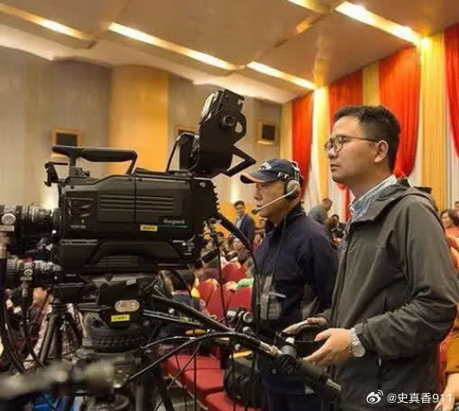

---

## 5

@何新老家伙

发表于：2026-07-15 17:31

来源：微博

链接：https://m.weibo.cn/status/5321117214180782

网友妙对伪天才——蒋丑女：

天才美女作家

神圣罗马帝国

横批：

——伪人伪史

附注：伏尔泰关于神圣罗马帝国的名言

“这个国家称为神圣罗马帝国，但它既不是神圣的，也不是罗马的，更不是什么帝国。” （出自其著作《风俗论》第七十章。）

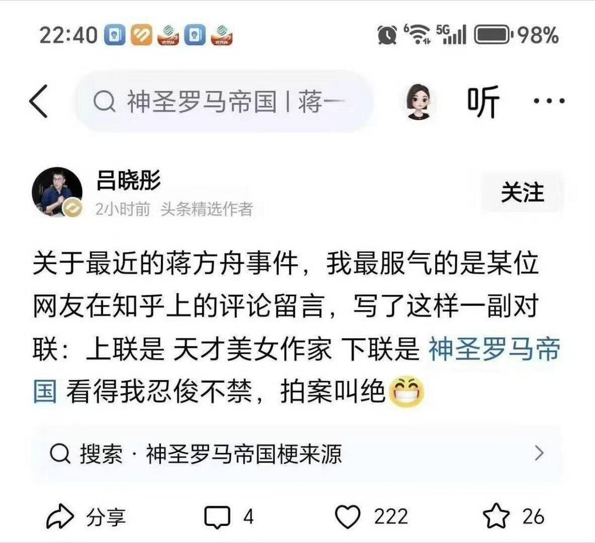

---

## 6

@汪有

发表于：2026-07-14 15:44

来源：微博

链接：https://m.weibo.cn/status/5320728073215899

我老婆有同学考了营养师牌，先拿自己同学免费练手，有两位男生过了两个半月，分别瘦了15-20斤。

我老婆也跃跃欲试，第一周营养师不提任何建议，只是让我老婆把每天吃的饭拍给她，先观察饮食习惯。

啥也没干，就这一周就已经开始瘦了。

毕竟自己拍摄高热量零食发给营养师就很羞耻。

我：诚实就能瘦。

---

## 7

@观察者网

发表于：2026-07-16 14:00

来源：微博

链接：https://m.weibo.cn/status/5321426468088521

【美防长：\#美军年度体检要测睾酮\#】美国国防部长赫格塞思15日宣布，30岁及以上军人年度体检将新增低睾酮筛查项目，称这是令军人保持“绝对最佳”状态的“必要举措”。此举预计将加剧美国国内有关睾酮替代产品安全性的争论，并引发性别歧视争议。

赫格塞思15日在社交媒体X上发布视频说，在年度体检中引进上述项目，有助于低睾酮军人得到替代疗法推荐，“确保你们的睾酮水平足以令你们保持最佳状态”。测出低睾酮的军人可自主决定是否接受激素替代治疗。不满30岁的军人可自愿接受筛查。

男性睾酮水平会随年龄增长下降。低睾酮与性功能衰退、情绪变化和体重增加等相关。至于如何诊断上述症状以及是否采取激素替代疗法，医学界已经争论多年。

赫格塞思宣布的新措施与特朗普政府近来放宽睾酮替代疗法的主张一致。

赫格塞思说新体检项目适用于“军人”，但实际仅指男性军人。这项措施因此遭到一些民主党女性议员抨击，其中包括伊利诺伊州联邦参议员塔米·达克沃斯和宾夕法尼亚州联邦众议员克丽茜·霍拉汉。这两人都有从军经历，她们要求美军无论性别都应接受激素水平筛查。新华国际的微博视频

---

## 8

@每日人物

发表于：2026-07-16 01:09

来源：微博

链接：https://m.weibo.cn/status/5321232537092563

【\#扩招后博士求职有多难\#】\#博士沦为高学历流民\#博士生正面临空前的就业难题。2020年是博士扩招的历史拐点，招生人数一举突破11万人，增幅超过10%。此后每年仍稳定扩招，2025年，博士招生人数首次突破20万人大关。如今距2020年五六年过去，第一批扩招的博士生逐渐毕业，一系列影响才开始真正显现。

自2025年起，每年将有超过10万的博士毕业生涌入就业市场，争夺几万个高校岗位。如今，高校岗位仍在收缩，毕业博士还要与上一年没找到工作的人、以及海外博士同台竞争。越来越多的博士毕业生陷入飘零的状态，有求职者形容，“大批的博士找不到工作，入站博后，博后出站又找不到工作，还是和博士一起卷，就像一个涌动的绞肉机一样”。

那些依然在读博士的人，也感受到了一种被“倒逼”的异化感，有人发现研究室的人卷不动只好“躺平”；有人困在发文章的KPI里，同时觉得文章也没有意义，那我的价值究竟是什么？有人一早就放弃学术追求，只求毕业后找个不那么“卷”的工作——而找到一份这样的工作也越来越“卷”。

“非升即走就是必须得走”“大专也不好进”，越来越高的求职门槛，不断降级的求职预期，让博士们集体陷入身份认同危机：过去20多年的努力真正的意义是什么？如何面对并解决对学历的虚无主义？\#就业\#

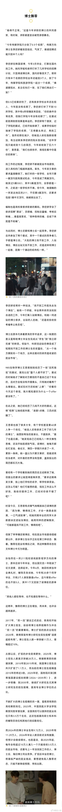

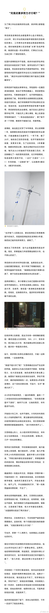

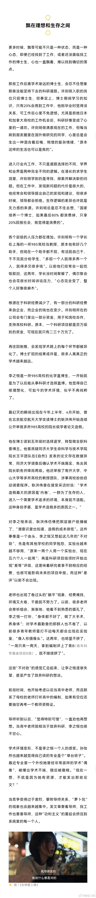

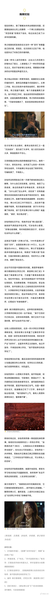

---

## 9

@刘晓光Savvy

发表于：2026-07-16 13:08

来源：微博

链接：https://m.weibo.cn/status/5321413483041672

网上很多博主黑邹市明和冉莹颖有点丧心病狂，信口雌黄都说出来了。

批判冉莹颖没问题，但是要批判到点上。

说什么邹市明本来可以好好拿着2亿躺平，偏偏被不服输要创业的老婆给折腾起来破产了。

这种鬼话都能说得出来，真心不要脸。

邹市明是天生就有2亿积蓄的？从天上掉下来的？

在中国打拳击这么赚钱？

中国的职业拳王是有好几位的，没有一个能够赚到2亿，最巅峰也就年入千万，而且仅能维持短短数年。

邹市明这2亿到底是怎么来的？

老婆冉莹颖折腾出来的。

邹市明两次奥运金牌奖金加起来就几百万，大概600来万，之后转型职业拳击一场奖金也才几十万，前前后后加起来。

总身价不到1000万。

如果说他要躺着享福，按照各位博主的说法，

绝对不是账户里有着2亿的巨额资金躺着享福，

而是拿着大约800-900万的钱躺着。

对于绝大部分人来说这个钱是够了。

但是800万到2亿之间，可是有这天堑一样的鸿沟呢。

所以这2亿到底是怎么变出来的。

就是冉莹颖操作运营的。

她婚后全职做邹市明的经纪人开始全职大幅度运营这个IP。

其中最关键的操作，就是利用自己在电视台的人脉到处求人拜人，手写推荐信委托导演，把邹市明一手安排上了爸爸去哪，

因为这个综艺，继而大红大紫。

有了综艺后，开始接大量代言，巅峰期仅仅是代言就起码有8个以上，而且每个的代言费几乎都有近千万的高额。

拳击只有重量级的奖金才高，邹市明这种小量级的很难拿到巨额奖金，只能走流量，代言的模式。

作为对比蝙蝠女谷爱凌就是最佳案例，她的全年收入大约2000万美金，但是比赛直接收入仅有20万不到，1980万美金的收入，主要来自大量的中国商家品牌代言的广告费。

邹市明赚到这么多的代言费依旧是不够的，他们家在17年把大量资金购置了核心地段优质房产，这么多年的增值。

才有了2亿的身家和净资产。

邹当时还在全职打拳，根本没有精力打理这些琐事。

以上所有的操作都是冉莹颖作为一个高明的经纪人，把这个IP的商业回报发挥到了极致。

骂冉莹颖可以，但不能忽略事实，仿佛这2亿是邹市明自己一个人独自赚的，男人英明神武，女人昏聩蛀虫。

为什么赚到这么多身价后，现在反而倒欠两亿？

这个阶段才是冉莹颖应该被骂的部分。

有了钱以后，开始盲目的扩大规模，不顾风险的各种跨界生意，病急乱投医，滚雪球一样越滚越多。

普通人在突然获得了巨额收益后，大概率都会犯这样的毛病错误，

我从1000万变成了2个亿，犯了20倍，

那我再把这2个亿，翻个20倍，岂不就是40亿了？

2亿不够，40亿甚至400亿，才能真正满足我的自我认知，我们全家才能成为真正的富贵家庭。

人就是这样，欲望是无穷无尽的。

这不是邹市明冉莹颖自己本人可以决定的，而是他们看着周围的邻居，看着商学院的同学，看着朋友圈，生活圈子里的各种氛围。

他们不自觉的就只能这么思考和行为决策。

如果真的按照各位博主说的安分守己，踏踏实实，

那么从一开始，这2亿就不存在。

不仅仅这2亿不存在，

邹市明本身接近1000万的奖金也不应该存在。

因为安分守己踏踏实实，为什么要那么辛苦那么累起早贪黑的训练，拼搏，力争冠军？

我直接躺平，打个不错的成绩，做个教练，随便拿点课时费，泡泡漂亮女学员，

岂不美哉？

真的像各位老哥说的什么安分守己最重要，纯躺平最好。

邹市明根本不可能成为世界冠军。

你觉得一个毫无野心毫无驱动只想躺平见好就收的人，能够承受住那么多繁重痛苦艰难的训练，力争上游？

这是一条必然的路径依赖。

莎士比亚说过：

这残暴的欢愉，必将以残暴终结。

这句话的意思就是，君以此为始，必将以此为终。

本身就是快速扩张赚到大钱的，那么必然会迷失心智，不理性决策，盲目扩张，无视风险。

最终把这些钱加倍的亏出去。

这个案例不是让你打拳，仇恨异性，痛骂婚姻，抒发性压抑的。

老婆帮忙经营打理生意做到蒸蒸日上的案例有很多，克丽丝詹纳，维多利亚，包括当当网都是这样。

这个案例的真正意义从来都和婚姻以及男女关系无关，

它和商业常识，经营常识，乃至做人的常识，

关系最大。

如何激发自己的欲望，同时又能够驾驭住欲望，让这欲望理性落地，做好风险控制，不要被欲望反噬。

这是任何一个想要出人头地的人，都必须经历的重大课题，甚至是人生最重要的课题。

而且越是优秀越是聪明的人，越要参透这个课题。

只有不爱动脑的SB，才根本看不到这个课题，满脑只有打拳。

---

## 10

@前HR本人

发表于：2026-07-16 13:03

来源：微博

链接：https://m.weibo.cn/status/5321412124084351

中国学位魔怔心结啊：选择大于努力！有网友说，2023年他拒了智谱的转正offer+期权，去读博了。结果现在博士用的就是智谱的大模型。

当时的智谱团队还不到50人。HR最后一次打来问他考虑得怎么样了？他说他想去做研究，不想在公司卷。挂完电话还觉得自己挺酷的，不为五斗米折腰，要去追改变世界的理想。

3年后，智谱市值冲到了万亿。当年一起拿offer的朋友，朋友圈从晒加班变成了晒买房、晒提车、晒财务自由后的第一次旅行。

他自己博士低保每月2000多，吃食堂都要省着点。改论文改到凌晨3点，饿了就翻冰箱，发现只剩半包泡面。

---

## 11

@人物

发表于：2026-07-16 13:00

来源：微博

链接：https://m.weibo.cn/status/5321411368324119

\#yellow portrait\# 1927年，魏玛共和国时期的德国，表现主义艺术思潮达到巅峰。正是在这样的时代背景下导演弗里茨·朗执导的《大都会》问世，成为德国表现主义科幻默片的里程碑。

故事设定在2000年的一座反乌托邦未来都市。社会分裂为两大阶层：资本家作为「大脑」，居住在云端摩天楼中享乐；工人则作为「双手」，被禁锢于黑暗的地下城，如机器零件般日夜劳作。统治者弗雷德森的儿子弗雷德对工人精神领袖玛丽亚一见钟情，追随她来到地下城，亲眼目睹工人的悲惨处境后深受震动。与此同时，弗雷德森命科学家罗特汪制造出玛丽亚的机器人替身，企图借其形象煽动工人暴动，再以此为借口进一步强化统治。机器玛丽亚蛊惑工人破坏核心机器，不料引发地下城洪水，险些淹死所有工人儿童。最终，弗雷德与玛丽亚携手，促成了两个阶层的和解。

导演以极具张力的几何构图、棱角分明的布景和强烈的明暗对比，营造出既恢弘又压迫的未来都市景观，并通过鲜明的视觉对比与富有象征意味的蒙太奇，塑造出极具震撼力的影像风格，对后世众多科幻电影产生了深远影响。

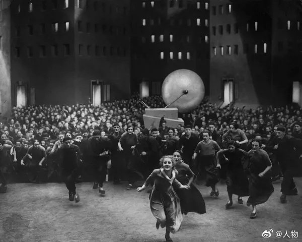

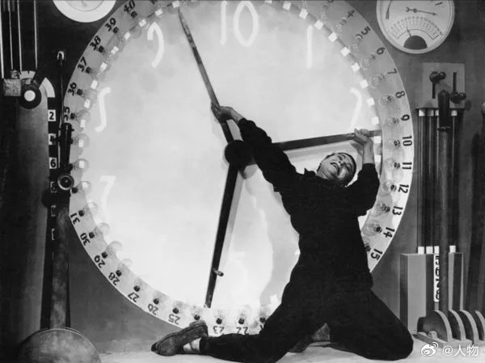

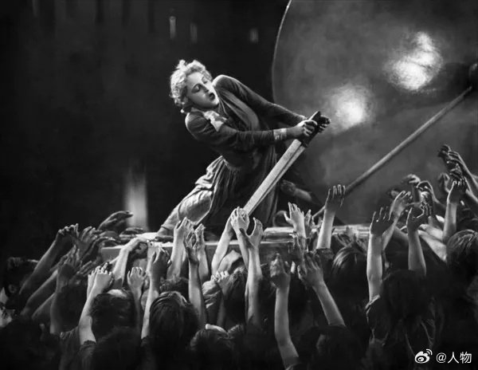

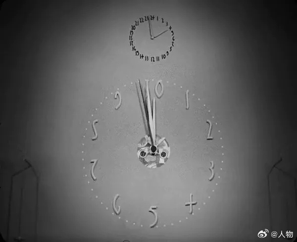

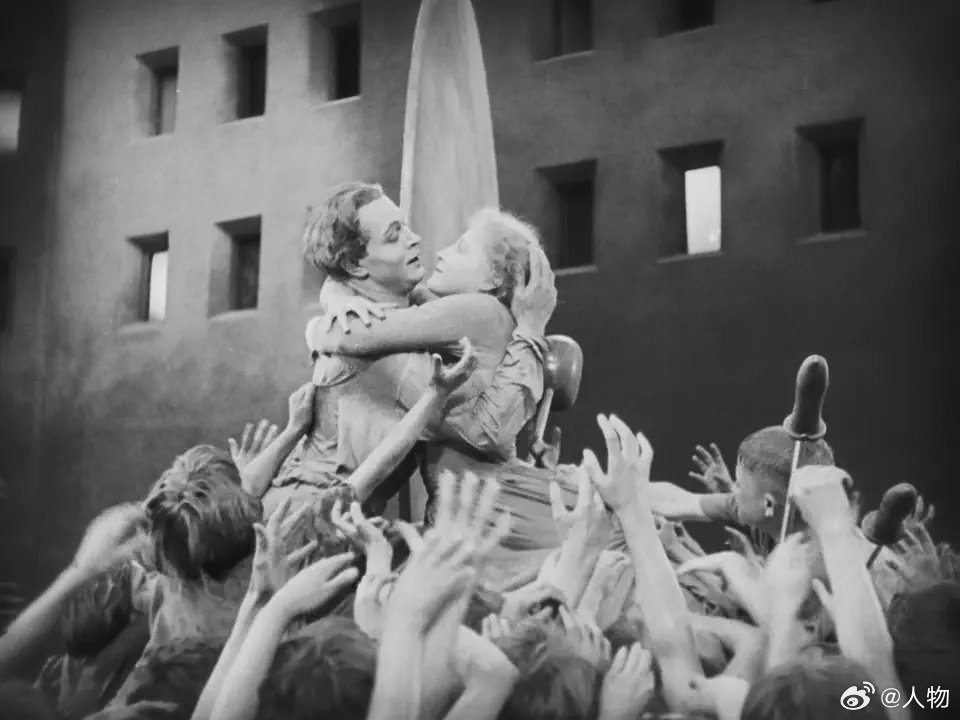

---

## 12

@sven_shi

发表于：2026-07-16 09:53

来源：微博

链接：https://m.weibo.cn/status/5321364343100438

为什么现在又要开始在生育率问题上搞男女对立了？\#学者称丈夫做家务能提升生育意愿\#这个话题，大家首先要知道中国人大的人口学团队是做什么的。这群人是我国最顶尖的人口研究专家，但是对外发布的内容，一般都被认为傻子才信。

而且信的人一开始都不觉得自己是傻子，因为他们讲的话太顺耳了。

这里首先就要提到2014年，这个团队的老大，也是我国人口学会会长翟振武教授在《人口研究》上发的那份顶刊。简单说就是他预测全面放开二胎之后，我国出生人口峰值要达到每年4995万，平均每年要生4000万个小孩。

这种数据基本上已经不能用学术逻辑去解释了，因为太夸张，太胡编乱造了。

但是这群人的口碑一直很好，而且长期引领着我国人口问题的舆论。为什么？

翟教授就是那个著名的房价上升，导致中国人不愿意生孩子的言论源头。虽然完全没有任何学术性可言，但是大众就是信。

他采访的原话我放出来：

“年轻人为什么不想生孩子，其中第一条就是生活压力大，生活压力大第一条就是房价高。房价的问题，5年前还不明显，这5年翻了几个滚。”

他是我国人口学顶刊《人口研究》的主编。他的话，基本就给学术方向定下了基调。

现实当中，这几年房价一直在狂跌，生育率也还是在下跌。现在大众肯定是不相信他的这个结论了。然后最近又换了一个说法，你一定要注意这里面的描述方式：

“希望终身不要孩子的育龄夫妻比例不超过2%，而超过半数夫妻希望生育二孩。”

简单说，就是形势还是很好的，我们国家多数家庭都愿意生二胎。为什么不生呢？因为男性家务做的少，女性体验不好，所以不肯生二胎。

大家粗看肯定觉得也对，话也很顺耳。但是结论是绝对错误的。他们从来就不准备让大家去讨论我国生育率的真正问题。

你看一个数据就知道了：我国公立医院每年人工流产950万次。特点是“流产总数高，年轻未婚未育比例高，重复流产率高”。

光公立医院流产就950万，远高于我国的出生人口数量。你说只要不是傻子，讨论这类问题，肯定会第一时间去想为什么年轻人堕胎那么多。尤其是我们国内的女孩子，没结婚怀孕了，为什么高比例的去堕胎呢？真是因为男性家务做的少，所以第一胎生育体验不好吗？

提生育率问题，我国最大的特点就是“流产太多，导致现在生育少，未来生不出。”

一家最顶尖的学术机构，在他们的专业领域里面，搞成这么个样子，确实也挺悲哀的。

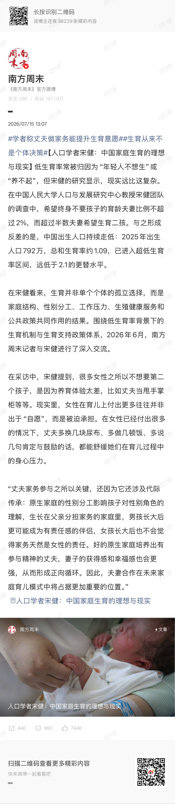

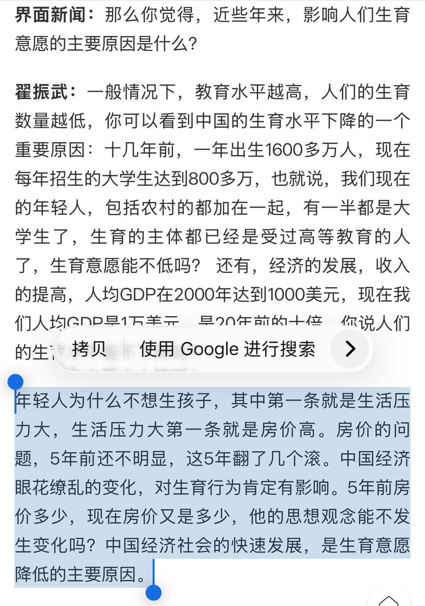

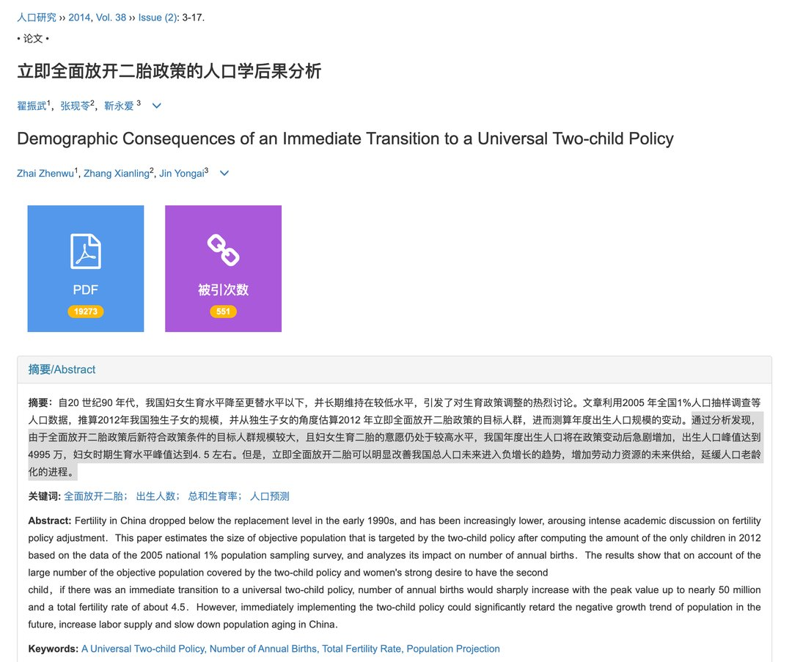

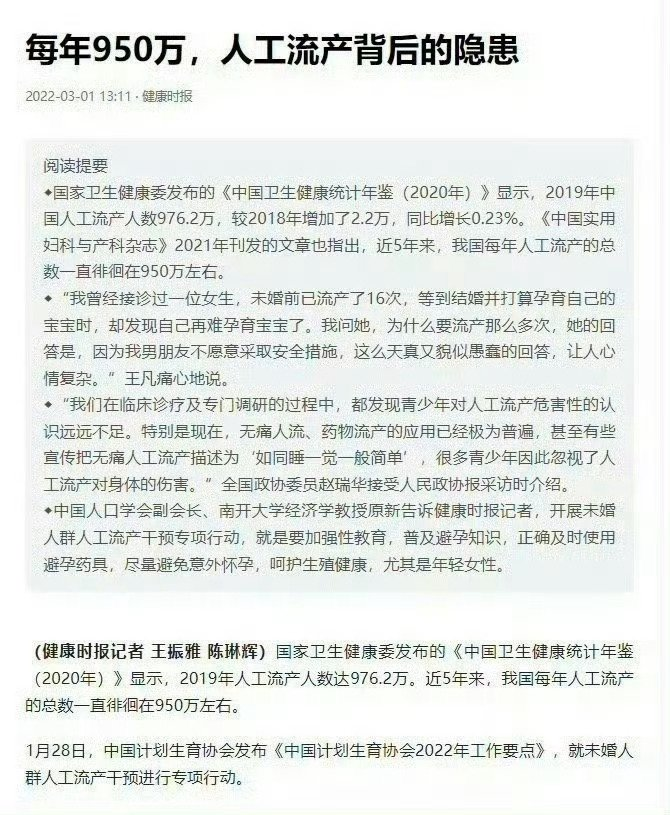

---

## 13

@严锋

发表于：2026-07-16 14:19

来源：微博

链接：https://m.weibo.cn/status/5321431450919992

某迪上转载《星球大战》导演乔治·卢卡斯关于AI的观点，他说AI是未来，势不可挡。拒绝AI就像从前拒绝汽车，坚持用马车。

底下的评论说：没错，只是这回我们是牛马。

---

## 14

@中国新闻周刊

发表于：2026-07-15 12:06

来源：微博

链接：https://m.weibo.cn/status/5321035509145317

【\#干部霸占车位事件通报被指春秋笔法\#】\#体育局干部彭某某停职对其有何影响\# 近日，湖南省长沙市开福区德峰小区“一处私家车位被霸占事件”引发热议。6月30日，长沙市体育局官员彭某某停车时，占了闵某车位，闵某发现后，将自己的越野车停在车位前。此后，物业、交警多次介入、居中协调，事件仍升级，彭的男友将车停在了闵某车前，闵某则在属于自己的车位上安装了水泥立柱和U型管。7月10日，双方终于达成和解。次日，长沙市纪检监察、公安、体育等组成的联合调查组发布“情况通报”称：长沙市体育局决定给予彭某某停职处理，纪检监察机关已对彭某某相关问题开展核实处理。

该事件看似告一段落，但上述通报却因在用词方面被质疑“拉偏架”，引发二次舆情，冲上热搜。北京大学政府管理学院教授马亮告诉@中国新闻周刊 ，该通报的确存在厚此薄彼的嫌疑，没有客观中立地说明事实。“一方面刻意放大当事人的过错，另一方面规避公职人员的错误。这不利于承认和解决问题，反而可能会进一步激化干群矛盾，最终影响政府公信力。”

“仔细看该通报中的用词，可以看到字里行间充满了春秋笔法和人情世故。”执业律师程重办理过大量行政诉讼案件，他告诉@中国新闻周刊 ：“公文写作必须实事求是、不偏不倚、用词准确，但这篇通报很难说做到了这一点。其结尾点出对当事人严肃处理，但整体文字有‘拉偏架’嫌疑，字里行间像是在为彭某某‘鸣不平’。”程重称。他提到，通报提到闵某的行为时，强调是“堵住”，比如“闵某将其越野车停在车位前，堵住彭某某的车辆后离开现场”“闵某再次将越野车停放至车位前，堵住彭某某车辆”。但提到彭某某和男友雷某某时，却用了中性的词，如“雷某某驾车到达小区，将车停在闵某的车头前”。

通报称，长沙市体育局决定给予彭某某停职处理，纪检监察机关已对彭某某相关问题开展核实处理。辽宁省某地级市一位纪委干部告诉@中国新闻周刊 ，通报提到的停职处理，通常是单位发现当事人涉嫌存在重大问题时，认为其在未查明所有事实时，不适合履行现任职务而采取的一种组织处理措施，停职是启动核实的前置程序。至于对当事人有没有其他影响，需要相关部门待事实查清之后认定和处理，如果最终发现当事人涉嫌犯罪问题，还会被移送司法机关，如果是党员还会被双开。该事件通报明确提到“当地纪检监察机关已对彭某某相关问题开展核实处理”，说明该事件未出现“大结局”。“这说明彭某某可能还涉其他问题，才可能会受到相应处分。”程重也表示。

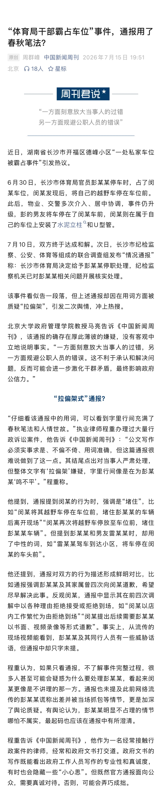

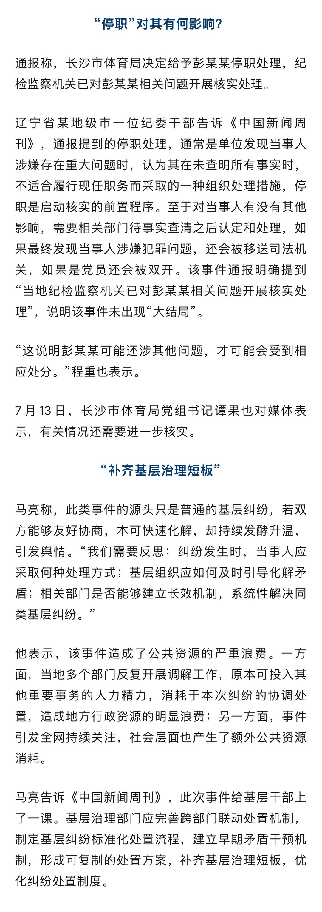

---

## 15

@有个梨GPT

发表于：2026-07-16 16:21

来源：微博

链接：https://m.weibo.cn/status/5321462094502444

今天说的用maskrom和DDR5接口做只读内存装大模型的想法，是game changer。

和Gemini聊了一些细节。首先MaskROM的工艺极其。。。落后，通常都是20nm到45nm，甚至更高的。如果为了密度，可以用3D MaskROM，就像3D NAND那样，当然这个会比较贵一点，根据Gemini所述，任天堂Switch就用了这个瘸腿的东西，为了极致的低成本。

所以1条DDR5，容量2T能装一个完整的大模型，可以用同等容量的3D NAND来估计其成本，8片256GB，也就1000块人民币水平。这特么比2TB内存便宜到哪里去都不知道了。如果用平面工艺，那根本不跟现在的flash抢产能，容量可以牺牲一下，用2条1T的也能做到，20nm足够了。

卧槽，华为不要搞工艺了，小米也别特么搞车了，两家合力集资去收购旺宏就行了，他家专业做平面maskrom的，有很多私有技术，市值才600多亿人民币，收下来之后用它的专利在国内的foundry疯狂生产，就特么用落后的产能就把三星海力士给干死了。

---

## 16

@兰斌强

发表于：2026-07-16 06:15

来源：微博

链接：https://m.weibo.cn/status/5321309445951668

【莫言之女博士论文涉嫌抄袭】

(一句话前言：若实锤，真无语，怎么一个二个都这样？)

唐小林评文坛

莫言之女管笑笑，走的是一条和贾浅浅完全相同的“学术”之路。贾浅浅“研究”父亲贾平凹，管笑笑“研究”父亲莫言，而且都是在其父亲任教的大学读博，其背后的逻辑关系不言而喻，懂的都懂。

贾浅浅的硕士论文，题目叫做《生命的言说及意义——试论贾平凹书画艺术》；管笑笑的博士论文，题目叫做《莫言小说文体研究》。贾浅浅的硕士论文大面积抄袭；管笑笑的博士论文，同样涉嫌抄袭和套改。这样的论文，北京师范大学的评审专家是怎样评审通过的，其导师又是怎样签字放行的：

尤其值得一提的是，管笑笑的导师，正是以吹捧贾浅浅的“屎尿诗”和飙捧莫言，在当代文坛闻名遐迩的北京师范大学教授张清华。管笑笑的博士论文，抄袭的也正是张清华。如此行云流水般的暗箱操作，不得不让人怀疑，管笑笑的论文是否有人代笔，或者就是由张清华为其支招，甚至操刀的。不然的话，让管笑笑单独完成这样的博士论文，是极为困难的。

如果其中没有猫腻，管笑笑这样的博士论文是绝对无法通过的。但在张清华这里，却能一路绿灯，畅通无阻。

管笑笑很可能根本就没有认真读过几本莫言的小说，而是依靠大量的移花接木和抄袭，剪刀加浆糊。以管笑笑的知识积累、阅读量，以及文学鉴赏能力，是很难单独写出《莫言小说文体研究》这样内容驳杂、信息量巨大的博士论文的。比如莫言小说语言与印象派绘画，尤其是管笑笑文中所涉及到的巴赫金的小说理论，完全就是对张清华的《存在之镜与智慧之灯——中国当代小说叙事及美学研究》和学者付艳霞的博士论文《莫言的小说世界》的套改和“串烧”。

付艳霞博士论文原来的题目就叫《莫言小说文体论》，并且同是北京师范大学的博士研究生。

管笑笑的博士论文，除了与张清华的《存在之镜与智慧之灯——中国当代小说叙事及美学研究》诸多内容高度重合之外，与付艳霞的博士论文在内容和表述上，同样高度重合，这难道仅仅是偶然的巧合？

管笑笑就像贾浅浅在论文中，浮夸贾平凹一样，天花乱坠地吹捧莫言。与贾浅浅公器私用，利用硕士论文为贾平凹做书画广告，堪称同一种套路。

北京师范大学是否应像中国人民大学、西北大学那样，开启对蒋方舟和贾浅浅硕士论文的全面调查，重审管笑笑的博士论文，对学术不端零容忍、严惩学术腐败，我们拭目以待。

来源：网页链接

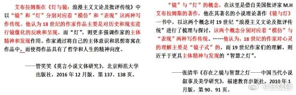

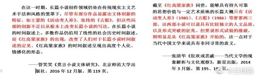

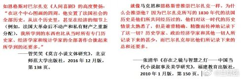

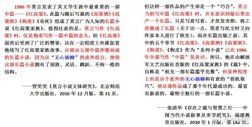

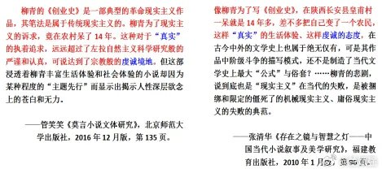

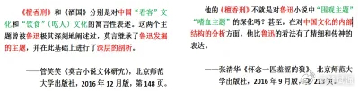

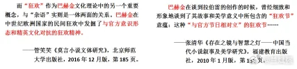

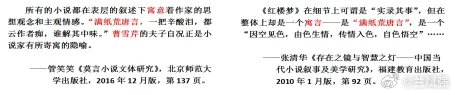

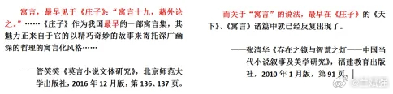

---

## 17

@sven_shi

发表于：2026-07-16 07:26

来源：微博

链接：https://m.weibo.cn/status/5321327500067516

\#曾硬刚王健林的80后干部被查\#这里确实很有意思。当年万达去扶贫，这位领导直接说投资利润不能带走，非常的强势。这事情完全违反商业逻辑，后面又有大量的文章去讲这种企业投资利润不带走，其实是才是真正正确的思路，体现了领导的“担当”。

接着就是他扶贫业绩斐然，一路直上，直到今天落马冲上热搜。相信过几年大家再提起企业扶贫的“利润不带走”肯定又有新的想法。

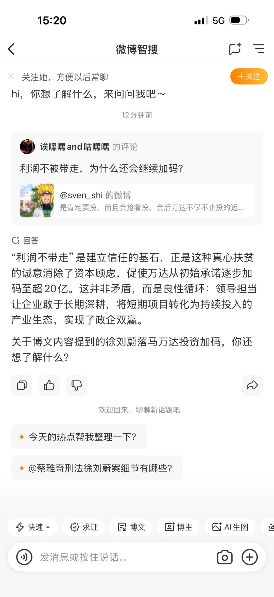

---

## 18

@晴雨风曰

发表于：2026-07-15 20:48

来源：微博

链接：https://m.weibo.cn/status/5321166844854401

记录者超话\#记录者超话\# 

“看，我不花一分钱，就搞定了一个北京独生女。”

这句在印度亲友群里的炫耀，最近被扒到中文互联网上，炸了锅。

视频里，一个叫Sid的印度小伙儿，搂着北京姑娘Fangyi，得意洋洋地对着镜头说：她养我，我不用上班，房租吃饭打车全是她掏。姑娘坐在旁边，认认真真用英语做自我介绍，练过好几遍的样子，笑得一脸幸福。

她以为这是男朋友在跟家人分享甜蜜。

她不知道，在对方的语境里，这段视频的潜台词是：我，一个零收入的外国人，空手套白狼，拿下了一个北京独生女。她养我，她听话，她全家资源都是我的战利品。

这不是个例。这是被反复验证过的、可复制的“围猎模式”。跨国婚恋的浪漫滤镜下，一场针对中国独生女的精准掠夺，正在悄然铺开。

被当作“战利品”的北京姑娘

先捋一捋这个案子的细节。

Sid，印度人，在北京待了不短的时间。没有工作，没有收入，没有任何创业行为。每天睡到自然醒，醒来就是吃、逛、玩——全部开销，由Fangyi一个人全包。

姑娘怕他因为没收入自卑，出门从不当他面掏钱包，提前手机付好；怕他多想，主动断绝了所有异性朋友，同学聚会也不去了。整个生活圈子，就围着这个男人转。

她换来的是什么？

不是感恩，不是珍惜，是Sid拍了一堆视频发回印度老家，跟亲友炫耀：看，我在北京，有个本地姑娘心甘情愿养着我。语气得意，毫无愧疚，甚至带着一种“我赢了”的骄傲。

网友扒出更多细节后，评论区炸了。有人算了笔账：国内男生掏空六个钱包买房、攒彩礼，不敢失业不敢躺平；这位印度小哥零收入、零付出，靠北京独生女全包所有开销，还拍视频到处炫耀。

更扎心的是，有人扒出印度那边有专门的团队，开了收费课程，教男性怎么“拿下”中国独生女。课程价格从450卢比到1499卢比不等——折合人民币也就几十块钱。几十块钱的成本，撬动的可能是几代人的积蓄。

你以为的浪漫邂逅，在别人那里是一套标准化流程。

从“软饭硬吃”到“灭门夺产”

如果说Sid的案例还停留在“吃软饭+炫耀”的层面，那福建泉州那位印度女婿的操作，直接把人看傻了。

2007年，印度男子拉吉经过精心挑选，锁定了目标——泉州外贸豪门陈家独生女小陈。他制造机会邂逅对方，凭着外籍光环加上能说会道，很快俘获了姑娘的芳心。2010年入赘陈家后，他顺利进入家族企业，凭着驸马爷的身份和一点能力，一步步掌握了核心权力。

2015年获得居留权后，拉吉开始大规模安插自己的印度同乡。五年时间，197名印度人被他塞进公司，印籍员工占比从3%飙升到61%。他改制度、排挤老员工，把陈家企业的核心岗位全部换成了自己的人。

等陈家人反应过来的时候，公司里已经没人听他们说话了。

但这还不够。从2019年开始，拉吉陆续在陈家亲属的饮食中投放慢性毒药。岳母中毒身亡，大舅哥中毒身亡，妻子小陈中毒身亡——三个至亲，一个接一个被“无色无味”的毒药送走。

他提前篡改遗嘱，为妻子购买高额意外险，暗中转移大量财产。等岳父老陈察觉异常报警时，拉吉已经以子女监护人的身份，实际掌控了陈家38亿家产。

38亿。三条人命。十四年布局。

这不是爱情故事，这是一场有组织、有预谋的“财产猎杀”。每一步都踩在法律的漏洞上，每一步都精准得令人发指。

一套被“产业化”的围猎流程

Sid的炫耀和拉吉的灭门，看似是两个极端，但背后共享着同一套逻辑。

网传的印度“猎婚课程”资料显示，这些团队已经形成了一套完整的操作流程：第一步，精准画像——锁定目标群体特征：独生女、家境优渥、父母宠溺、有房产继承权；第二步，人设包装——伪装成“IT精英”“跨国创业者”或“海外学者”，用精心PS的照片和编造的故事吸引目标；第三步，情感操控——刻意制造“灵魂伴侣”的共鸣感，贬低本土男性“太现实”，用温柔和浪漫构建依赖；第四步，资源渗透——逐步介入女方家庭财务，提出工作、创业、房产加名等要求；第五步，财产转移——一旦得手，要么跑路，要么像拉吉一样，直接灭门夺产。

有资料显示，这套课程甚至细化到了“如何用咖喱味英语营造异域浪漫”“如何精准拿捏江浙家庭重体面的心理”等实操细节。不同城市的独生女家庭财产特征也被标注得清清楚楚：苏州家庭侧重房产与商铺，宁波家庭多涉及外贸企业股权，杭州家庭则以互联网行业资产为主。

这不是恋爱，这是“产业升级”。

爱情不应该是单方面的“供养”

回到Sid和Fangyi的故事。

很多女孩有个致命误区——以为“我养你”是深情。电视剧看多了，觉得女人养男人是独立女性的浪漫。可真到了现实中，在没有对等付出的关系里，“我养你”三个字翻译过来就是“我供养你”。

供养和爱情的区别在哪？爱情是双向奔赴，供养是单向输血。爱情里有尊重，供养里只有依赖。你一旦把经济底线退到零，对方就会把你的付出当成理所当然。

Fangyi为了照顾Sid的自尊，主动疏远朋友、处处迁就，结果呢？人家转头就把她当作战利品，发回老家炫耀。她掏心掏肺掏钱，最后成了别人酒桌上的谈资、向同胞炫耀的“军功章”。

更让人心疼的是，这些姑娘本身条件都不差。北京独生女，有房有户口，父母疼着长大的，从小到大没缺过什么。怎么就偏偏在感情里，把自己放得那么低？

有人说，是因为她们被保护得太好，没见过人性的恶。也有人说，是因为她们太渴望“被理解”，被精准的情感操控击中了软肋。还有人说，是因为文化认知盲区让她们放松了警惕，对外国男性存在不切实际的美化想象。

不管原因是什么，结果都一样：在不对等的关系里，单方面的付出只会不断消耗自己。

警惕以爱情之名的掠夺

跨国婚恋本身没有原罪。这个世界上有太多真诚的跨国爱情，双方互相尊重、共同成长，那才是爱情该有的样子。

但当“爱情”成为一张精心设计的图纸，当“浪漫”成为一套标准化的话术，当“婚姻”成为一条低成本获取居留权和财富的捷径——我们就不得不问一句：这到底是爱情，还是掠夺？

Sid的炫耀视频，拉吉的灭门案，那些被曝光的“猎婚课程”，都在提醒我们一件事：在全球化背景下，以爱情之名的掠夺，正在变得越来越隐蔽、越来越系统化。它不是某个人的“渣”，而是一套被产业化、被复制的精准围猎模式。

你身边有类似“单方面供养式”的跨国恋情吗？

---

## 19

@有个梨GPT

发表于：2026-07-16 18:36

来源：微博

链接：https://m.weibo.cn/status/5321496165877091

根据前面说的，我感觉传统冯诺伊曼结构在离线AI上直接就垮掉了啊。

考虑这样一个结构：

NPU，SRAM第一层，可能几十上百兆吧，SiP内存第二层，这个有64G-128G就可以了，只读的MaskROM DDR5 2T起步第三层。

这个架构不算是很贵的，至少不离谱。TB级DDR5 MaskROM没几个钱。SiP内存离线跑KV Cache只服务个人用户很少的会话数量足够了。全套几万块就可以了。Deepseek或者千问或者豆包直接就可以出这种设备，然后模型用内存条的形式分发，一套几千块就可以了，连着商业模式也有了。卧槽。

