# 2026-07-18

## 1

@财联社APP

发表于：2026-07-17 11:21

来源：微博

链接：https://m.weibo.cn/status/5321748931154093

【津巴布韦政府拒绝锂矿商关于推迟出口禁令的请求】财联社7月17日电，据报道，津巴布韦矿业部长坎巴穆拉表示，政府已拒绝行业提出的将原定于明年1月生效的锂精矿出口禁令至少推迟至3月的请求。

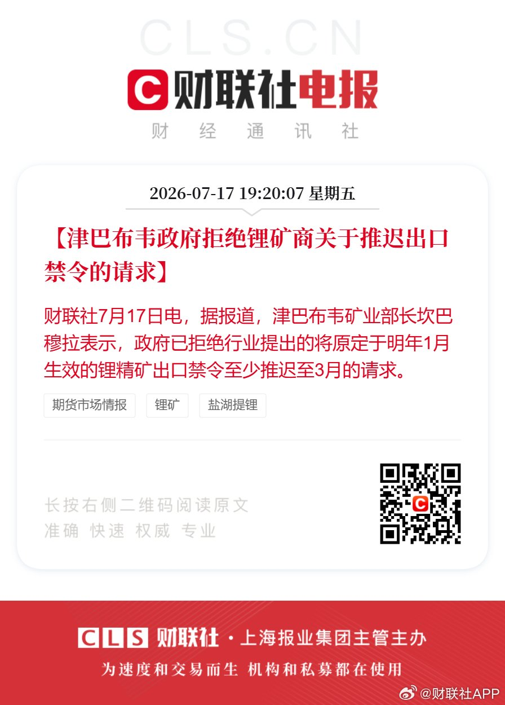

---

## 2

@南海的浪涛

发表于：2026-07-17 10:33

来源：微博

链接：https://m.weibo.cn/status/5321736807781958

曾在石破茂内阁担任法务大臣的牧原秀树在X网站发文哀叹，“印度新干线”高铁项目进展坎坷的原因，全都怪印度方面“不守信用”“蛮不讲理”。\#热点解读\# 

牧原秀树表示：“我也曾参与过印度高铁项目，在各类国际会议与谈判场合，印度方面反复展现出的蛮不讲理格外突出。他们压根不遵守约定，就算敲定协议也转眼反悔，从头到尾只顾着主张自身利益。主管该项目的官员尤其过分，高层都是这般作风，根本不可能达成正经的合作交易。”

“为所有为此项目奔走的日方相关人员正名，我要说：这个项目推进受阻，100%是印度方面的责任。”牧原秀树写道。

他补充道：“即便高市出访印度也未能取得任何成果，印度高铁项目已然宣告失败。而且在作为安全核心的信号系统方面，日本还被印度方面的排挤在外。”

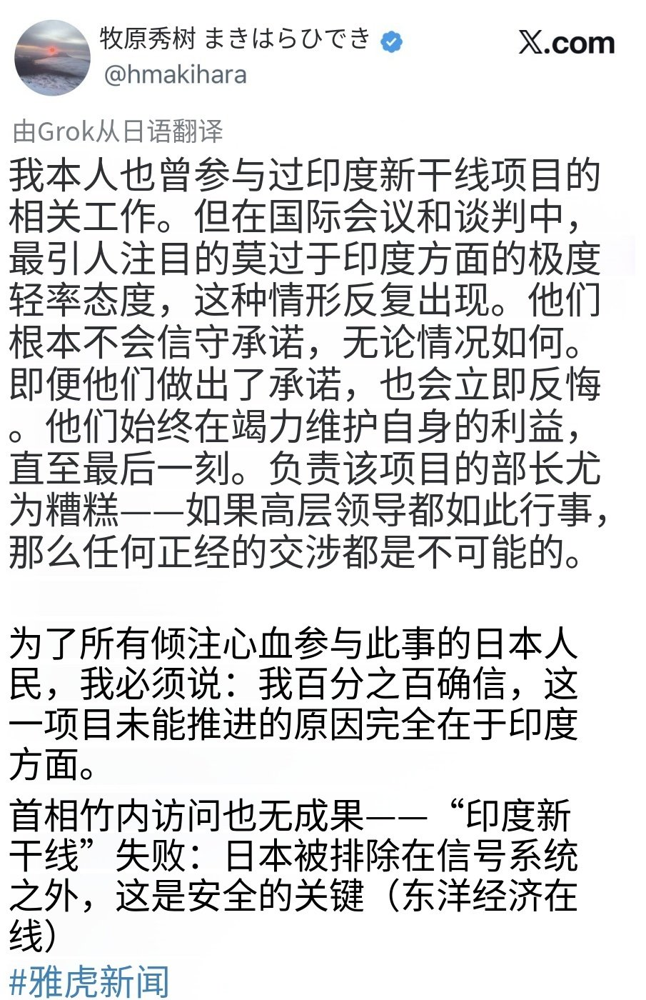

---

## 3

@AI产品阿颖

发表于：2026-07-17 11:01

来源：微博

链接：https://m.weibo.cn/status/5321744005204445

对 K3 的真实评价。

开源模型 SOTA 正式易主。Kimi K3 这次真是扬眉吐气。

昨天晚上团建刚结束，同事就说，K3 发布了。我去，看来传言果然是真的。

我回到家打开一看，X 的时间线已经刷屏了。口碑非常好。甚至，我感觉这是 DeepSeek R1 之后，唯一在 X 上口碑能这么好的模型了。

现在每次有新模型发布，我都会第一时间去看原始信息，尤其是官方团队写的 Blog。

因为我基本可以确定，这篇文章一定经过了内部核心研究员、产品负责人，甚至 CEO 的多轮确认。

模型这次到底解决了什么问题，更新了哪些关键能力，团队最看重哪些方向，都会体现在里面。

社交媒体上的很多讨论很热闹，但基本都有情绪夹杂其中，噪音比较多。

而且 Release Blog 的信息基本都是倒金字塔型。最前面的信息是最重要的。大家看我的截图，其中有几个关键信息：

1、2.8T 参数模型。这个是目前全球范围内，参数规模最大的开源模型。

2、基于混合线性注意力机制和注意力残差，这是 Kimi 过去最重要的两个技术创新。

3、原生多模态。

4、100 万上下文。

5、面向长程编程、知识工作和推理等场景设计。

6、仍然落后于最强的闭源模型 Claude Fable 5 和 GPT-5.6 Sol。

看完这几句话，我的第一反应是，K3 已经是顶配了。网页链接

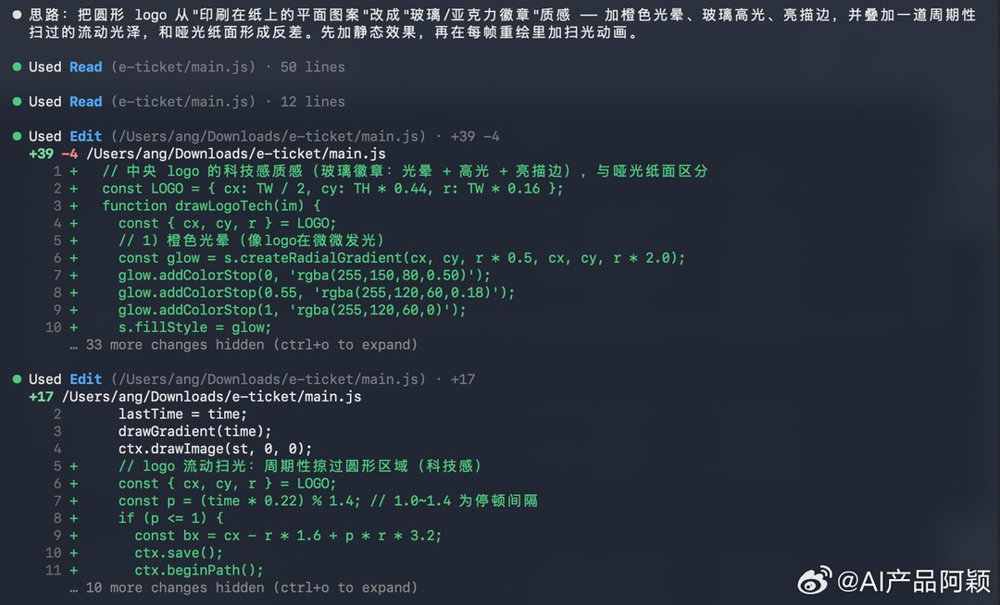

---

## 4

@卢诗翰

发表于：2026-07-17 10:55

来源：微博

链接：https://m.weibo.cn/status/5321742398786904

讲一下邹市明的瓜，这案例太典型了，

不仅仅是宝妈创业典范，还展现了明星IP的困境。

起因是邹市明夫妇经商失败，其妻子参加综艺节目姐姐当家，在节目里大吐苦水，表示邹市明不顾家，自己经营家庭维持婚姻不易，多次想离婚，很多人深表同情。

但这个发言也解答了商业领域多年来的未解之谜，

为什么邹市明赚了那么多钱又是奥运冠军，却在几年内赔光了。

——生意是生意，感情是感情 ，而女方却混为一谈了。

知名运动员的IP经营是一门正正经经的生意，邹市明拿过奥运冠军，拿过拳王腰带，生涯收入超亿，并且，他这个奥运冠军，还是中国在拳击项目上的第一块金牌，零的突破，稍微了解点体育的都知道这意味着什么，邹市明这个IP在体育产业是有得天独厚的优势的。

往小了说，大众知名度很高，往大了说，奥运冠军，很多地方项目可以开绿灯。

所以这不是什么夫妻店过家家，这是一门正儿八经的生意，一家体量过亿的体育公司。

因此女方拿出不顾家，冷漠，爱玩游戏的指责时，我是想笑的。

一个价值过亿的体育IP，你居然跟我扯什么顾家，理论上，应该是全家的行程，反过来围绕邹市明展开。

再直白一点，家庭逻辑应该是邹市明来了才上菜。

此时肯定有人要说，哎呀，家庭是讲爱的地方，夫妻双方都是家庭一份子，要经营家庭，怎么能说等男方来了才上菜呢？

这种就是纯废话，没有任何意义的鸡汤。

你们可以去看一下皇马巴萨NBA的运动员幕后系列，感受一下行程强度，网上就能搜到。

比如杜兰特，早上起来早饭，之后飞机出发，中午到达目的地入驻酒店，下午两点助理打电话提醒活动预热，杜兰特出发。到了活动现场，观众已经到齐，直接开始演讲，永远不要放弃自己的梦想。

演讲稿是什么确定的呢？飞机上和经纪团队敲定的。

演讲完之后是表演赛，表演赛打完是球迷签名，合影互动，这还没完，到了晚上，还有品牌方晚会。

这是现役状态，退役状态呢？退役后的行程是更满的，因为大量商务合作必须要IP本人站台。赞助商花几百万要的就是知名运动员本人到场站台。

贝克汉姆，科比，退役后都维持了极高的商务频次。

这就是知名运动员IP的特点，看起来是无本生意，只要露个面站个台就能拿广告费，但实际上，是有成本的，那就是运动员本身的时间成本。

作为个体，你的时间是有限的，你不可能一周接100个活动，这不可能，能跑五个活动就已经是时间管理大师了。所以如何在同样时间内排下更多合作，直接决定了你的收益高低。

跑一场二十万，跑五场一百万，赚多赚少，全看你自己。

所以这些运动员基本全员配备司机助理，整个团队，行程安排，全部围绕明星展开，不是耍大牌讲排场，就是为了抢时间。

有司机，车上的时间就能和经纪人沟通演讲稿，有助理，就能早点准备下一个活动，你一周跑四个活动，我一周跑五个活动，我赚的就是比你多。小球星也一样，不是说知名度低了行程就少了，顶级球星去大城市，小球星就去社区活动，市场是跑出来的。

在这个逻辑下，一般人都是想方设法的节省运动员本人时间，把司机，助理，保姆这些不重要的活外包出去。

但你会发现，邹市明这边不是这个逻辑，或者说，国内很多明星妻子不是这个逻辑。

比如郎朗没拿行李箱，王力宏丧偶式婚姻，还记得吧？

他们奉行另一套非常逆天的逻辑，

那就是当谈及明星妻子，各路宝妈的时候，一些人会表示，女性的价值应该在事业上，不能被家庭束缚，要绽放大女人的风采。

但是到男明星男运动员这边呢？这可是货真价实挣下几亿身家，战绩可查的各行业卷王，他们却开始变着花样的要求“你怎么不顾家呢？”“丧偶式婚姻”。

包括冉莹颖说的那个，怀孕期做菜照顾邹市明

我直白一点，能不能请个保姆解决问题？

请两个保姆，一个照顾女方，一个给邹市明做菜，有没有解决问题？两个不够我请三个行不行？

三个保姆，按年薪十万标准，那也就三十万，

一个过亿体量的IP，还是涉及核心资产的问题，因为三十万在那来回纠结，你敢想象吗？

所以发现问题了吗？

邹市明是一个个体，但也是一个知名IP，甚至后者的属性会压倒前者。

从个体角度，你可以说他不顾家，

但从IP经营角度，这种发言属于拿着水洗煤要求航天局。

真要论专业角度，女方甚至没资格给邹市明做菜，你是营养师吗，你就做菜？你懂营养学运动健康学吗？

一个世界冠军IP，正常情况下是配备训练师营养师经纪助理一整个团队的，你非要自己做菜，还自我感动，我为家庭付出这么多，

这就是在该谈生意的时候，偏要讲感情。

或者说，当代很多人已经形成了一个思维惯性

和普通男生谈钱，

和成功男生谈感情

还有那个玩游戏，我看了更是两眼发黑

拳击是一个男性向赛道，运动健身这个大类也是男性用户居多，甚至邹市明的投资布局就包含了游戏电竞项目。

所以邹市明爱玩游戏，完全是正面属性，对于邹市明这个IP来说，是加分项，如果在国外，甚至可能出现哪怕他不玩游戏，经纪团队也要发一堆通稿说他爱玩游戏的局面。

然后以此去接格斗类游戏，对战类游戏的广告代言。

很多人说拳击行业的市场小，不，拳击市场是小，但格斗类游戏的市场却很大。

理论上，邹市明可以接拳击类，格斗类，乃至泛竞技类游戏的合作。

这是一个绝对利好的优点，但到女方这里却成了缺点

因为女方还是在用家庭情感那套逻辑来理解问题，

她只能看到男方在玩游戏，但她无法从男明星和游戏电竞的商业前景来理解问题。

其实你哪怕把那堆不知所谓的火锅店潮玩店改成网咖，然后把邹市明当广告牌用，搞不好都赚了。

这还没完，最逆天的是什么知道吗？我去搜邹市明账号，然后看到他B站的账号画面是这样的

重视家庭和孩子我能理解，但一个世界拳王的官方账号，画风却像个母婴博主，我无法理解。

是母婴赛道商业价值高吗？

那这个理解有点超越大气层了

一个拳击冠军，放着现成的赛道不做，跑去母婴那一挂。

你要是什么马术冠军，跳水冠军这样，商业化前景有限的项目我倒还理解

拳击明明是一个延伸面很广的赛道，

往小了说，可以专注拳击，往大了说，健身减肥，减脂锻炼，都在关联范围内，实在不行，你就照搬那堆健身网红，今天自律挑战明天减肥挑战。

邹市明这个IP的初始条件太好了，很多方向都有想象空间，就看自己如何开发。

当然，有人可能说了，那是因为前两年亲子综艺热度高，好，没问题

邹市明硬核宝爸这个人设，在国内市场确实比较空缺，有综艺前景

我认可

那按照这个逻辑，今天就不该出来说邹市明不顾家，合理吗？

邹市明作为一个拳击运动员，本来就是硬核直男，你把他往宝爸那个人设去靠，去吃综艺娱乐市场。那你既然选了这个人设，你就应该维护这个IP，对不对？所以你究竟在干什么？

冉莹颖说非常辛苦的维持家庭，但其实都是做菜这种无关紧要的细节，真正要命的战略决策，几乎是缺位的。

比如你看好运动赛道，那世界拳王的IP已经是天胡牌了，专注运动行业就行，没必要往宝爸亲子的路线去靠。

如果你不看好运动赛道，觉得宝爸综艺这条路是捷径，也没问题，但这样就不要投资大几千万的线下拳击馆。

你要小富即安，那把团队解散，场馆转卖，就保留邹市明自己的明星业务，上综艺接广告开直播，稳赚的生意。

你要做实业做大，几千万场馆几十个项目，那就不要扯什么邹市明不顾家，因为在扩张的逻辑下，这些活应该配备团队助理来干，你们要全力思考决策方向。

所以很多人说邹市明妻子是宝妈创业plus版，我觉得某种意义上没错。

宝妈创业的特点是，相比对外开拓，他们的大部分能力点在对内分蛋糕上。

比如强调自己对家庭的付出，男方的冷漠。

这套道德叙事，在家庭内部很有杀伤力，所以宝妈们往往能拿到家庭内的投资主导权。

可一旦进入对外开拓，那就是纯市场逻辑，此时再强调自己有多不容易，维系婚姻多么辛苦，就没有意义了。

此时需要的是做蛋糕的思路。

比如，是做垂直的拳击馆，还是做宽泛一点的健身房，如果健身房，是走高端路线，还是乐刻这样的下沉平民路线，接广告代言，是往暖男宝爸路线走，还是功夫硬汉路线去。

要不要加强游戏人设，去接游戏类代言，要不要回归传统，去接中医保健类广告，哪怕这些都不干，就直播带货，那也有自己干和签约MCN两个方向。

这才是做蛋糕的思路，而不是，我今天做了几个菜，我为婚姻付出了什么。

---

## 5

@阑夕

发表于：2026-07-17 10:52

来源：微博

链接：https://m.weibo.cn/status/5321741603963342

根据Aline Analytics的市场报告，Steam今年上半年的营收爆了，达到创纪录的110亿美金，同比大涨15%，相当于5年前的全年收入。

以最近10年计算，Steam的年均营收增速在17.5%左右，高且稳定。

动力主要源于以下几个方面：

- 亚洲玩家的持续增加，尤其是中国；

- 3A游戏的涨价，基准定价从60美金加到了70美金；

- 多人游戏的直播效果经常实现破圈引流；

- 部分尝试自建游戏商店的发行商没干成事，最后还是选择了回归Steam；

还有就是，因为Steam收录的游戏数量越来越多，所以还有一个对它来说非常有利的趋势出现，就是对于爆款新作的依赖度变低了。

2024年，Steam有29%的收入来自当年新发布的游戏，到了2025年，这个数字降低到了27%，而在今年，新作的创收就只占到21%了⋯⋯

这也意味着，在PC市场，长青/长尾游戏的生命周期管理变得更重要了，打折、史低、捆绑、DLC等销售模式相当有效。

今年上半年的新游戏收入榜Top 5依次是:

1、「极限竞速：地平线6」；

2、「生化危机：安魂曲」；

3、「红色沙漠」；

4、「杀戮尖塔2」；

5、「深海迷航2」。

其中只有「红色沙漠」是新IP，其余4个都是成熟IP的续作，这倒是和电影行业越来越像了。

---

## 6

@挨踢牛魔王

发表于：2026-07-17 09:56

来源：微博

链接：https://m.weibo.cn/status/5321727502716559

现在人类还根本没有触及智能的本质，可能在语言理论上有一点点突破。

对于智能的原理是什么样的，根本就不清楚。

并没有一个像牛顿三定律，门捷列夫元素周期表那样的东西把智能的本质讲清楚。

现在人工智能还在前牛顿时代，可以说，称为科学都有些勉强。

但是这和大模型好用，是不冲突的。

就像火炮一样，知道它威力巨大，能打穿城墙。

要优化，就是这样试试，那样试试，就知道调整火药配方，把炮管做密封结实等等。

对于元素周期表，是一无所知，但是不妨碍这玩意好用。

不过，理解了本质，就能有的放矢了。

就知道火药什么配方好，往哪个方向尝试。

知道做炮管的钢铁，要加多少碳，多少微量稀有金属才能结实。

大模型的训练，现在不就是这样吗？

跟玄学差不多，东试试，西试试。

好用归好用，但是要更进一步，还是需要底层创新。

所以说，人工智能还在很早期的阶段，只是实用化了而已。

---

## 7

@悦涛很二

发表于：2026-07-16 04:15

来源：微博

链接：https://m.weibo.cn/status/5321279259545374

邹市明夫妇，最好的资产，就是邹市明这个人。结果放着最好的资源不用，去跟别人拼商业管理。

老婆一直给邹市明灌输你不能只会打拳。其实马保国靠着闪电五连鞭，这几年赚的都比他们爽。。

人有一个长处，一直滚就对了。乔丹也不会自己去造鞋的。

---

## 8

@理记

发表于：2026-07-17 09:48

来源：微博

链接：https://m.weibo.cn/status/5321725623403970

蔚来和理想也堪称巨变，跟蔚来和理想结仇现在也是高危。

以前的蔚来只是上海的小企业，啥时候倒闭了都说不定，况且工厂还设在合肥，合肥能有啥力度。蔚来自己也顾不上收拾黑子。

理想也差不多，在民营经济大省的江苏，理想根本排不上号。

说白了，以前政府随便卖块地的收入，都是国产品牌车企几年几十年的利润，你说什么更重要？

现在可不一样了，蔚来的力度明显上了几个台阶，而且也有余力对付了，重要性显著提升。蔚来是真的有机会替代宝马的豪华品牌地位。

理想纯电在帝都设厂，还用分析吗？而且理想现在正处在最艰难的时期，我跟你讲，越是这种时候，下手对付黑子可能越猛烈。原来理想手段不多，现在很丰富了。

我个人认为车企里面力度最强的是小米华为第一档，保送名额很足。比亚迪长城第二档，赔巨款。蔚来理想第三档，赔款➕小黑屋。特斯拉独一档，赔的是不多，但韧性十足，耐心跟你耗，地位超然。

如果心情不好想喷几句，可以考虑喷小鹏，我观察目前风险不大。

---

## 9

@少年伯爵

发表于：2026-07-17 16:42

来源：微博

链接：https://m.weibo.cn/status/5321829749097016

是的，法国数学家发现的“泊松过程”，中国古人称之为“大运流年”。

无论如何，一定要等到那个临界点。

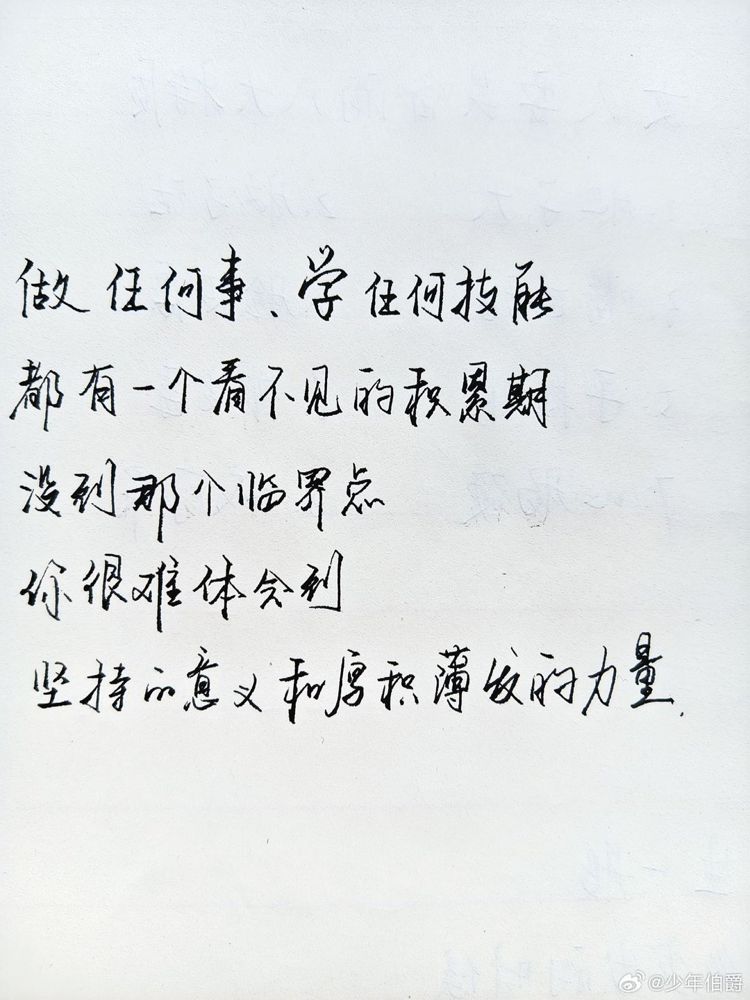

---

## 10

@iBingo

发表于：2026-07-17 11:11

来源：微博

链接：https://m.weibo.cn/status/5321746385207467

喀什网警账号都被小红薯给封了。

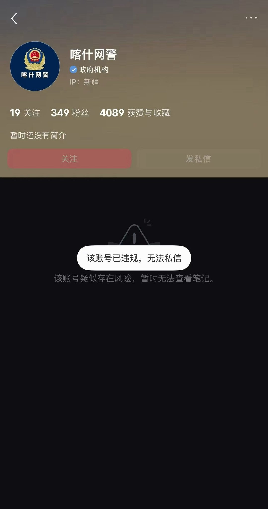

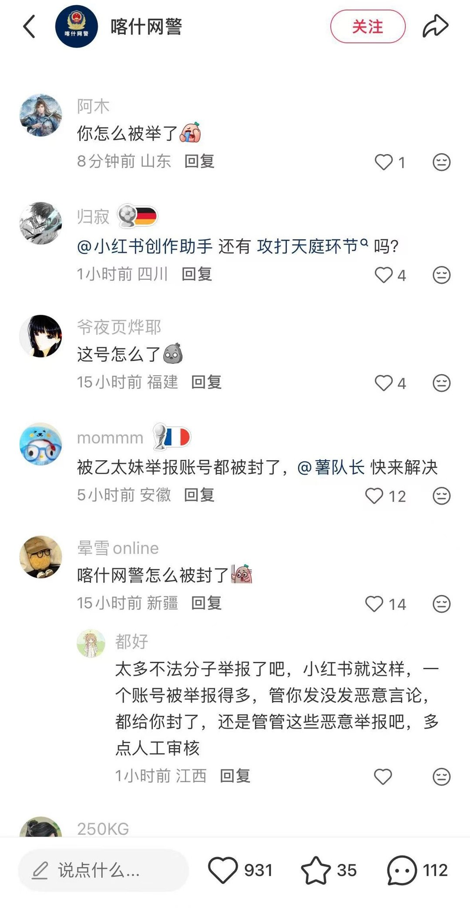

---

## 11

@sven_shi

发表于：2026-07-18 08:10

来源：微博

链接：https://m.weibo.cn/status/5321939979604057

婚恋宣传一直都是一门专门的学科。你看今天热搜\#家长谈彩礼成了小家启动金\#有什么不对？是和我国的立法不对啊。我国这些年立法搞的彩礼嫁妆除去名字之外，就和传统没关系。嫁妆是女方的个人财产，财产是男方给女方的特殊赠予，满足一定条件后属于女方个人和男方无关。

为什么彩礼会变成“小家启动金”？绝大多数人看见小家启动金，都会觉得这是夫妻共同财产啊。

但是你是找不到宣传稿的毛病的。分享这个观点的，是给彩礼的家长。是他们自己那么觉得的。这宣传稿里可一句都没有提说是法律那么规定的。只是说这些家长自己那么觉得。

那为什么要那么宣传呢？

道理很简单。因为民众会算账的。你如实的和结婚掏钱的老年人讲，彩礼这个东西，依照我国法律和女性的生育就没有关系。我们国家搞生育决定权，你儿子结婚后，可以提议女方生孩子。女方是不是愿意生，和谁生，都是女方自主决定的。

那老年人肯定会问你，给彩礼他们家能获得什么？

答案是依法什么都不能获得。我国立法的彩礼强调的是男方自愿无偿赠予。是女方满足一定条件（领取结婚证并和男方一起生活且不造成男方贫困）后，属于女方个人财产。

那么他还肯给钱吗？

他说不定还不死心，就问你说女方家里不是也出了嫁妆吗？男方哪怕是出于对等，也是要给彩礼的。

你再和他讲清楚，嫁妆在我国依法是女方的个人财产，和男方无关的。

他直接就傻眼了，表示从来没听过啊。

这就是典型的普通民众的信息差。接着你再去看这些彩礼给小家庭“启动金”的说法就能明白宣传巧妙在哪里了。

你把话讲明白了，这种强调无偿赠与的彩礼制度其实是很难运行下去的。所以你到我国民间去看那些给老年人的材料，都是这种彩礼是给小家“启动金”的说法。给他们讲的，是年轻人结婚起步困难，老年人给彩礼是给小家庭的，也就是说虽然法律规定彩礼是女方独享的，但是要宣传说是给儿子儿媳一起的，老年人才肯给钱。

那为什么钱是打进女方账户里的呢？

那是因为女孩子管钱比男方管钱更加靠谱。这种说法对从60到70年代低离婚率环境下成长起来的老年人极具杀伤力。一套话下来，他们就是肯掏钱。

等到真一结婚就离婚，出问题了，他们才知道苦了。这是他们的钱啊。基层老年人攒这些钱有多不容易不用我去给大家科普。

所以我长期对这些基层上为了大家生活幸福美好的“骗一骗”很不满。看到上了热搜去宣传，也忍不住要讲讲清楚。

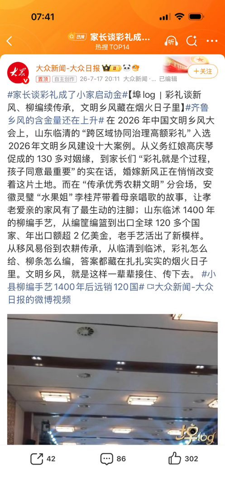

---

## 12

@财联社APP

发表于：2026-07-18 08:10

来源：微博

链接：https://m.weibo.cn/status/5321945287754930

【美股三大指数集体收跌 费城半导体指数进入技术性熊市】财联社7月18日电，美股三大指数集体收跌，道指跌0.77%，本周累跌0.93%；纳指跌1.4%，本周累跌2.9%；标普500指数跌1.01%，本周累跌1.55%。大型科技股普跌，SpaceX跌超5%，英伟达、Meta、特斯拉、谷歌跌超2%。费城半导体指数收跌1.63%，较6月22日创下的历史高点下跌20.2%，进入技术性熊市。存储概念股低开高走小幅收涨，希捷科技涨超5%，西部数据涨超2%，SK海力士涨超1%，闪迪跌超4%。半导体设备与材料、航空服务、加密货币概念走低，应用材料、Robinhood跌超5%，美国航空跌近4%，科磊、西空航空、捷蓝航空跌超3%，阿斯麦跌超2%。锂矿、油气、储能板块走高，智利矿业化工涨超5%，道达尔涨超3%，巴西石油公司、壳牌涨超2%。 \#海外股市动态\#

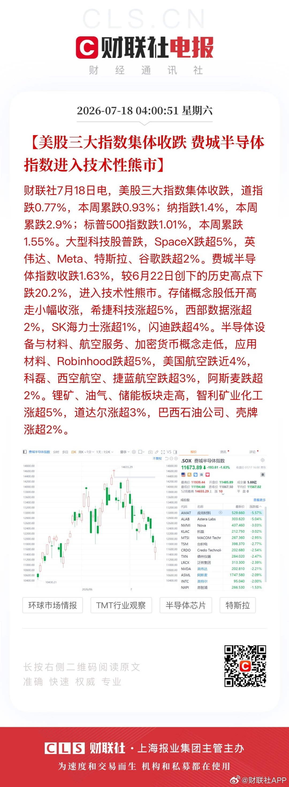

---

## 13

@观察者网

发表于：2026-07-18 08:10

来源：微博

链接：https://m.weibo.cn/status/5321944475893818

\#特朗普帖文SVIP每月10万美元\# 【特朗普帖文SVIP抢先看的价格来了：每月10万美元】 据路透社7月17日消息，知情人士透露，美国总统特朗普旗下“特朗普媒体与科技集团”已讨论向华尔街公司收取每月高达10万美元的费用，以换取他们更快浏览特朗普在“真实社交”平台上的帖文。

消息人士称，该公司还向企业推介了一项折扣计划——如果企业签约三年，则每月费用为6万美元。

英国《金融时报》也报道了关于每月10万美元订阅费的消息。

据此前报道，“特朗普媒体与科技集团”推出一款付费授权数据接口，将提供来自“真实社交”平台头部账号（包括特朗普本人账号）帖文的“最快”访问通道。

该公司一名发言人表示，这款名为“Truth API”的产品，将以比“真实社交”平台上的常规推送通知快得多的速度，向客户推送来自10个最具影响力帐号的帖文。

发言人还称，该产品专为算法交易公司等“受信息延迟成本影响最大”的机构设计。“此前，那些优先追踪热门帖文的公司一直依赖人工监控。Truth API弥补了这一缺口。”

报道称，此举是特朗普媒体与科技集团进军数据授权领域的第一步，并为该公司开辟了新的收入来源。特朗普通过其“真实社交”账号发布了多项令全球市场震荡的公告，包括他的“解放日”关税以及有关实施贸易限制的帖文，这使得该平台成为交易员、企业和金融机构的重要信息来源。

该公司临时首席执行官表示：“市场已经开始关注‘真实社交’的帖子……随着用户数量的增长，我们预计Truth API将成为公司重要且持续的收入来源。”

对于此举是否会造成交易机会不均等的问题，该公司尚未立即回应置评请求。

此举立即招致了美国民主党人的批评。

俄勒冈州参议员罗恩·怀登是参议院财政委员会中职位最高的民主党人。他表示，这将使特朗普家族在经济上受益，并“让华尔街交易商致富”。参议院银行委员会首席民主党人伊丽莎白·沃伦表示，这是“一种利用总统职位牟利、让华尔街致富、却对帮助美国人毫无作为的恶劣计划”。

路透社提到，批评者质疑特朗普及其家族是否试图通过其政府宣布的政策获利。根据特朗普最近的财务报告，特朗普去年从其家族的加密企业获得了超过14亿美元的收入。

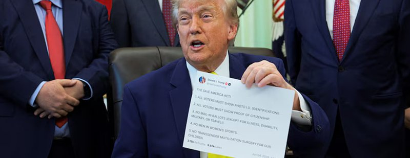

---

## 14

@包容万物恒河水

发表于：2026-07-17 15:54

来源：微博

链接：https://m.weibo.cn/status/5321817579066170

🔻特朗普的媒体公司在7月16日宣布推出 Truth API，计划8月1日上线。

🔻这是一个付费的B2B数据服务，向机构客户（银行、量化基金、高频交易公司等）提供Truth Social上高影响力账号（首批约前10个，包括特朗普本人、白宫等）的实时、机器可读、毫秒级推送，还带2022年以来的历史归档。

🔻这个公司明确说，这是给“承受不起信息延误成本”的机构用的，之前他们靠手动刷App，现在可以直连服务器喂算法。特朗普家族是TMTG大股东，所以他个人会从中获利（公司目前还在亏钱，这算新收入流）。定价没公开，属于私下销售。

🔻这甚至不算“内幕交易”。特朗普的帖子是公开信息，不是非公开的重大内幕。API只是提供更快、更结构化的访问方式。普通人还是能免费看，只是慢几秒到几分钟——量化交易里，这几秒就能吃掉散户。

🔻特朗普通过公开发帖影响市场，其家族企业出售“特朗普K线的更快访问权”。

🔻这可太商业兽性了。

🔻via Quiver

\#热点现场\#\#海外新鲜事\#\#特朗普发文感谢伊朗\#

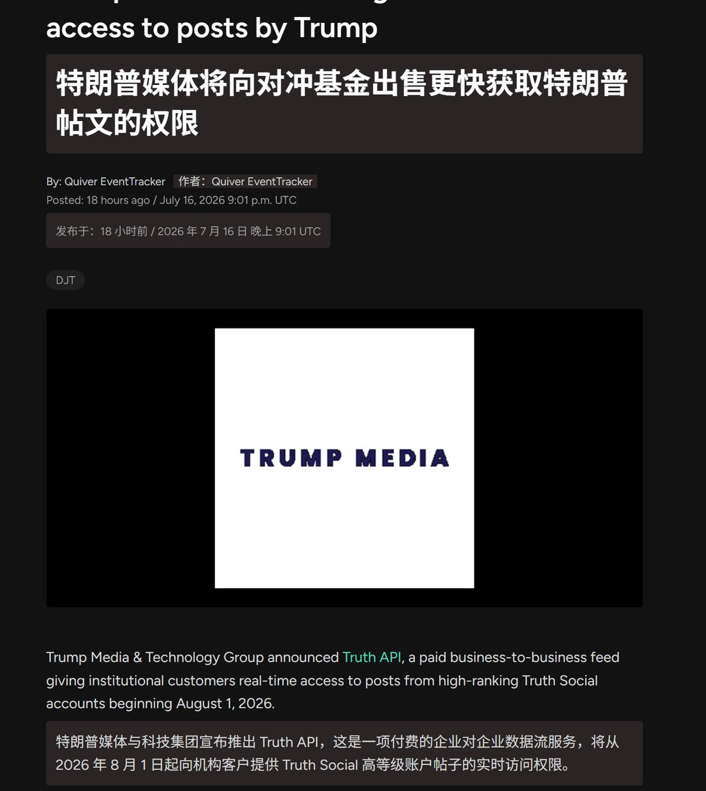

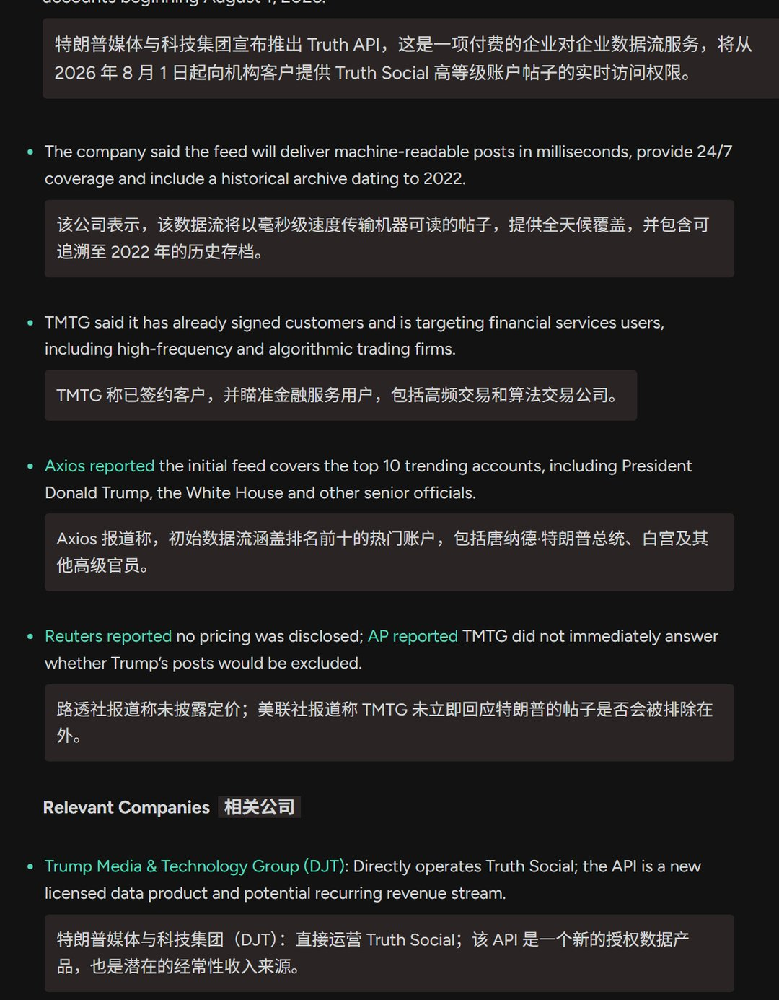

---

## 15

@一起唱歌666

发表于：2026-07-18 08:10

来源：微博

链接：https://m.weibo.cn/status/5321946627837567

互联网大厂，运营，月入1.6，是干嘛的？

        主要工作是客服+推广，吸引用户来使用本App。类似于理发店门口打杂的小妹，～大哥，来看看？

         互联网大致分三部分，

          一，技术，写代码的。

          二，运营，让软件有人用。兼顾使用反馈，客服。

          三，协调管理。就是让前两部分配合起来。

          月入1.6，你的工作就值0.6，多给1万是让你不要搞事情，顺带展现一下公司形象。

---

## 16

@财联社APP

发表于：2026-07-18 08:10

来源：微博

链接：https://m.weibo.cn/status/5321945734450336

【Meta据称正洽谈向Anthropic出租算力资源 价值可达两年100亿美元】财联社7月18日电，Meta Platforms Inc.正与Anthropic PBC展开初步磋商，拟向后者出租其数据中心的算力。这项合作将为时两年，价值最高可达100亿美元。此前报道称，Meta正筹划开展云计算业务，其中包括向其他公司出租算力的可能性。受上述消息提振，Meta盘中早些时候接近6%的跌幅有所收窄。

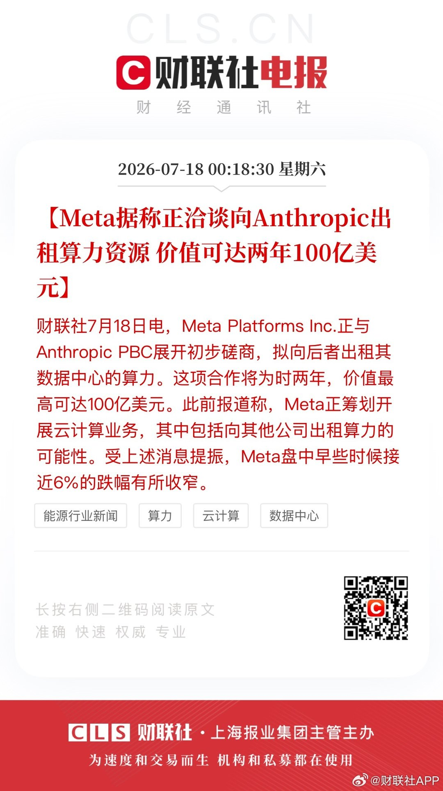

