# 2026-07-20

## 1

@李建秋的世界

发表于：2026-07-18 14:05

来源：微博

链接：https://m.weibo.cn/status/5322152602509132

Kimi 创始人杨植麟

西八，刚刚我才感觉新一代的中国企业家更干净，更着重于研发。

但是现在突然觉得，这新一代的中国企业家很容易被渣女割韭菜。

不是因为别的，就瞟了一眼这个视频，我感觉杨植麟就可能……

我岁数比较大了，就瞟一眼就觉得……

西八，不要啊。

李建秋的世界的微博视频

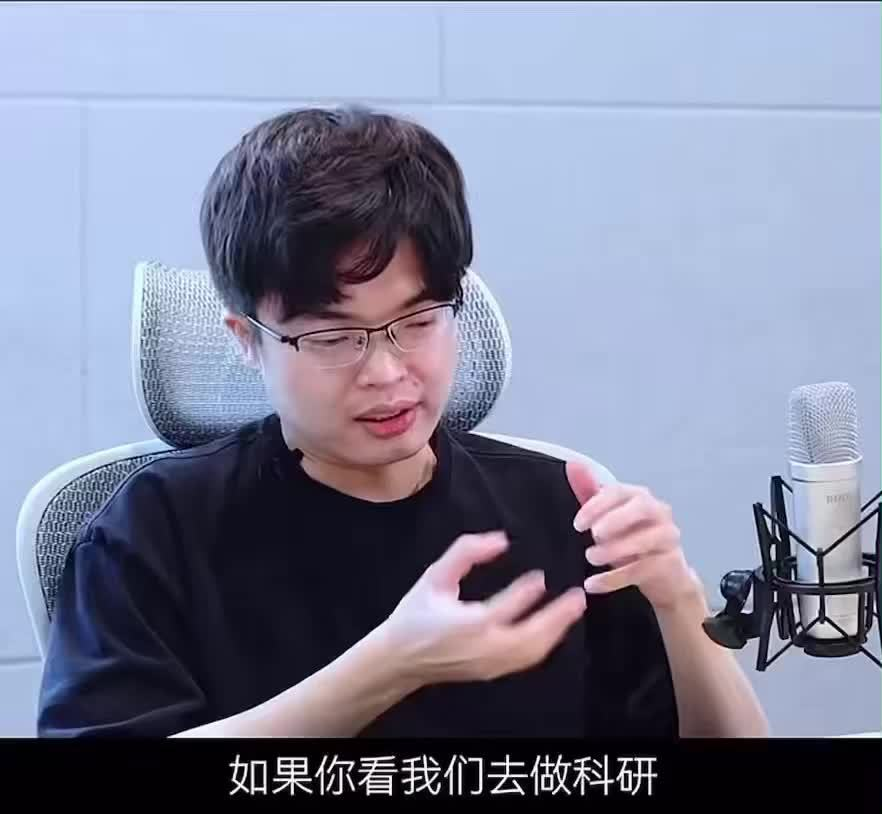

---

## 2

@向小田

发表于：2026-07-19 08:10

来源：微博

链接：https://m.weibo.cn/status/5322425785127709

Kimi K3 发布后，美国加州大学伯克利分校计算机科学教授斯托伊卡（Ion Stoica）表示：“过去我们一直认为，中国的开源模型大约落后最先进模型 6-9 个月。而现在，这种差距可能已经缩小到 2-3 个月。”

---

## 3

@图老板赛博札记

发表于：2026-07-19 08:07

来源：微博

链接：https://m.weibo.cn/status/5322424971170257

分享图片

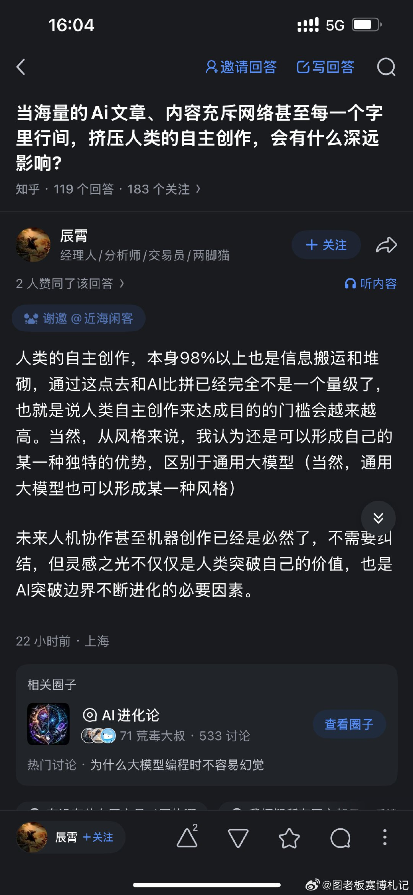

---

## 4

@高飞

发表于：2026-07-19 08:06

来源：微博

链接：https://m.weibo.cn/status/5322424700897773

\#模型时代\#\#KimiK3\# 刚看到David Sacks发了一个推。

感觉K3对美国AI的冲击，和Deepseek R1是完全不一样的。R1 的冲击力来自于成本，但made in China成本低的故事，不算陌生。但K3拿了一个Code Arena第一，虽然这是局部场景的第一，这个冲击可就太大了。

David是美国的总统科学与技术顾问委员会（PCAST）的联合主席，此前担任过白宫 AI 和加密货币事务特别顾问（AI & Crypto Czar）。

推文如下：

———

这令人担忧。首次，一款中国模型 Kimi K3 在 Frontend Code Arena 上夺得 \#1 位，并在其他基准测试中得分达到或接近前沿水平。

与此同时，我们正自缚手脚：官僚在禁止新建数据中心，层层叠加州级法规，并推动建立新的联邦机构来预先审批前沿模型。

这正是输掉 AI 竞赛的方式。如果我们把自己拖入泥潭，世界其他地方不会遵守我们的规则。不受许可的创新正是美国赢得互联网并成为全球技术羡慕对象的方式。我们可以再次用 AI 做到这一点——同时以针对性的方式应对风险——否则我们将眼睁睁看着领先优势蒸发。

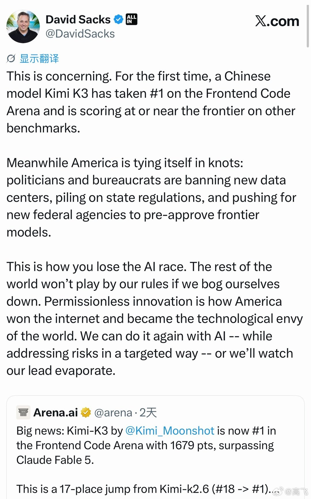

---

## 5

@最后的科学家·垠

发表于：2026-07-19 08:03

来源：微博

链接：https://m.weibo.cn/status/5322423979477837

《反向类型推导是编程语言的致命设计错误》

Xcode编译Swift写的app，经常出现莫名其妙的build特别慢的情况。这个问题可能困扰着无数的 Apple 开发者。

看来我对类似Haskell语言的“反向类型推导”的判断是非常准确的。

Swift和Rust都中了这个邪，盲目的推崇类似Haskell（OCaml）的Hindley-Milner式类型推导。结果在编译大型工程的时候就会出现致命的性能问题。

为什么呢？因为 Hindley-Milner 类型推导的时间复杂度是指数级的。很明显的问题，却被忽视了。

有些时候编译根本不能完成，而且很难找到到底是哪里没有对，因为编译器只是在那里不动，没有任何报错信息。经常改了一些似乎毫无关联的部分，就发现编译速度奇慢无比，简直不能用。

我们真的需要 HM 式的类型推导吗？它带来了什么重要的好处吗？——只是可以不用手写类型。

手写类型真的有那么痛苦吗？其实不是那么痛苦，反而还让代码更加清晰可读。

很多时候人们严重夸大了一个“新特性”的重要性，却忽视了有了它可能带来的问题。

另外，人的虚荣心也在其中起了很大作用。很多时候，这种“fancy类型推导”进入一个语言，是因为设计师和团队为了显示“我们很强，我们能实现「类型推导」这么高级的东西！我们是科班出身的！” 所以就钻进死胡同出不来了。根本不考虑实际的用户怎么想。

为什么他们会被虚荣心操纵呢？还是因为不够强，功力不够深厚。知道点皮毛就觉得了不起了，要借机会显示一下。

这就像那些刚学会打上旋球的网球（或乒乓球）爱好者一样，有了个锤子看什么都是钉子。

这就是为什么我不参与任何这类语言的设计团队。因为我知道，跟这些 hipster 是说不清楚的，只会无休止的争论下去，白白浪费口舌和情绪。

这也是为什么我不跟“年轻”的网球和乒乓球爱好者打球。

---

## 6

@前HR本人

发表于：2026-07-19 07:51

来源：微博

链接：https://m.weibo.cn/status/5322420775027134

俄军总参谋长宣布乌克兰战略重镇红利曼被包围：乌军城市防御已崩溃。

乌克兰在东乌最后几个核心城市已经摇摇欲坠了。估计一年内就会出现战略性变化。 前HR本人的微博视频

---

## 7

@物理芝士数学酱

发表于：2026-07-19 07:40

来源：微博

链接：https://m.weibo.cn/status/5322418187144200

\#今天要来点心理学吗？\# 

心理学中高度可重复的发现☞男性更倾向于随意性行为和性多样性

这几乎是你能找到的最接近心理学定律的理论。无论文化、历史时期和方法，男性对 随意性行为的渴望和理想中的性伴侣数量均高于女性。

从进化原理来看，这种模式是很合理的。由于女性每个后代的最低生物学投入比男性高，男性通过多伴侣交配可以大幅增加后代数量，而女性则不能。自然选择倾向于偏好能产生更多后代的特征——因此，男性进化出更强烈的多伴侣欲望。 

图表来源：Williams （2016），基于 Buss 和 Schmitt （1993） 的数据。

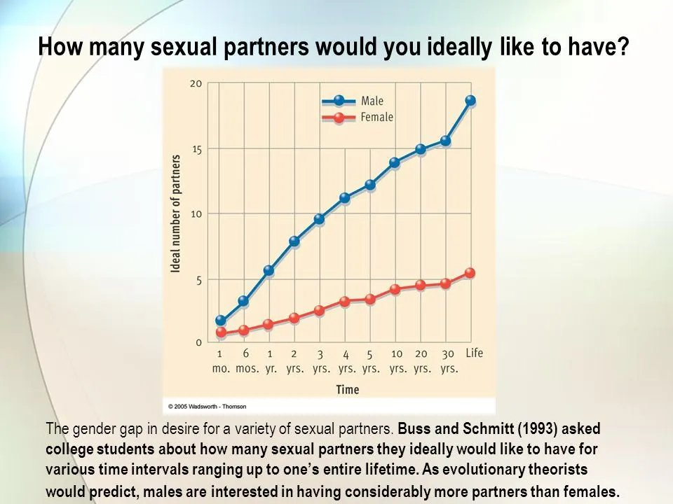

---

## 8

@信号与噪声

发表于：2026-07-19 07:10

来源：微博

链接：https://m.weibo.cn/status/5322410677242857

\#美股\# 非科技股 vs. 半导体

AI 时代市场结构的一个有趣变化是，众多非科技股与半导体板块呈现负相关性。下图紫色线条展示了标普 500 非科技股与半导体板块相关系数的第 10 百分位，目前处于历史最低水平

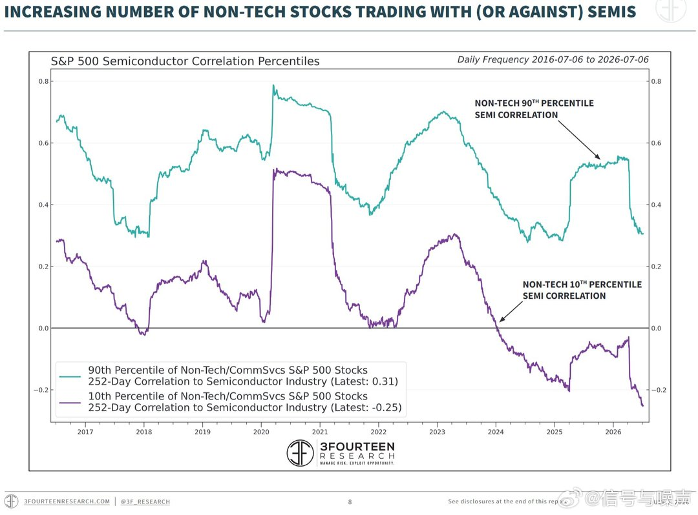

---

## 9

@梅新育

发表于：2026-07-19 06:56

来源：微博

链接：https://m.weibo.cn/status/5322407019547008

师范、幼师等专业类院校多年来一直是女拳重灾区，不分师生普遍追捧“不婚不育保平安”之类思潮，即使要生娃也推崇“去父留子”之类，……现在进入福报收获期，应该有个十年或更长。//@樊建川://@给猪留点吧:先是幼儿园，接着是小学，初中，高中......咋说呢，时代吧

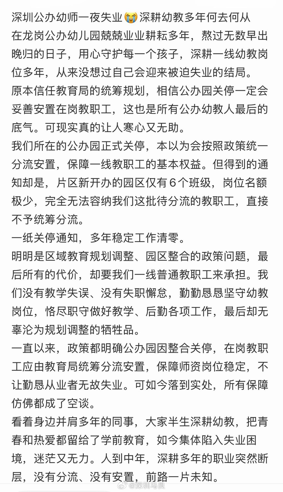

---

## 10

@南海的浪涛

发表于：2026-07-19 06:51

来源：微博

链接：https://m.weibo.cn/status/5322405710923173

伊朗革命卫队表示，他们在对约旦美军基地的两次导弹攻击中使用了“凯巴尔-谢坎弹道导弹”。这是一种公路机动、单级、固体燃料的高超音速中程弹道导弹，具有末端机动能力，射程为1450公里，这意味着它只能从伊朗西北部发射。大致来说，伊斯法罕或德黑兰以西。\#美伊冲突\# 

凯巴尔打击非常重要，因为美国的主动防御系统对其无效。这些打击剥夺了美国后方区域的安全庇护所，并向整个地区发出同样的信号。

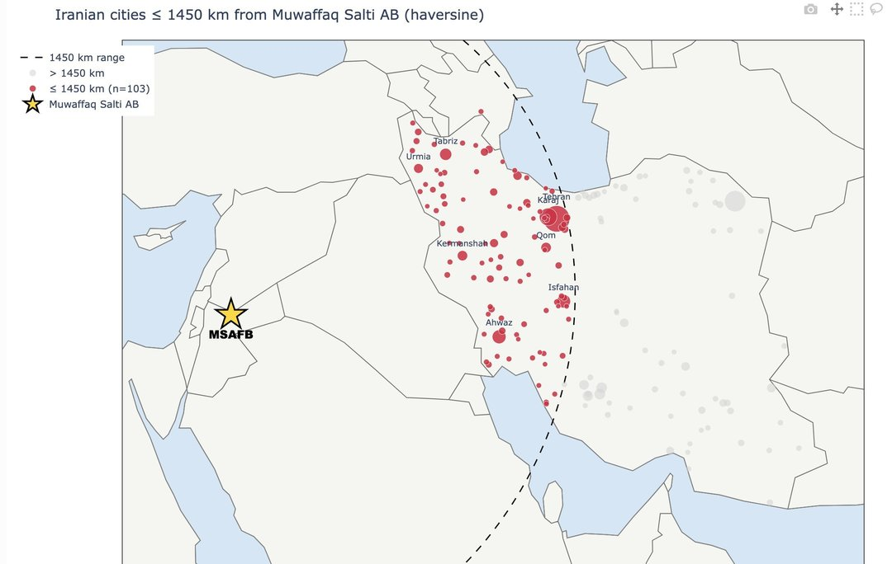

---

## 11

@李建秋的世界

发表于：2026-07-19 06:50

来源：微博

链接：https://m.weibo.cn/status/5322405545248289

怎么看

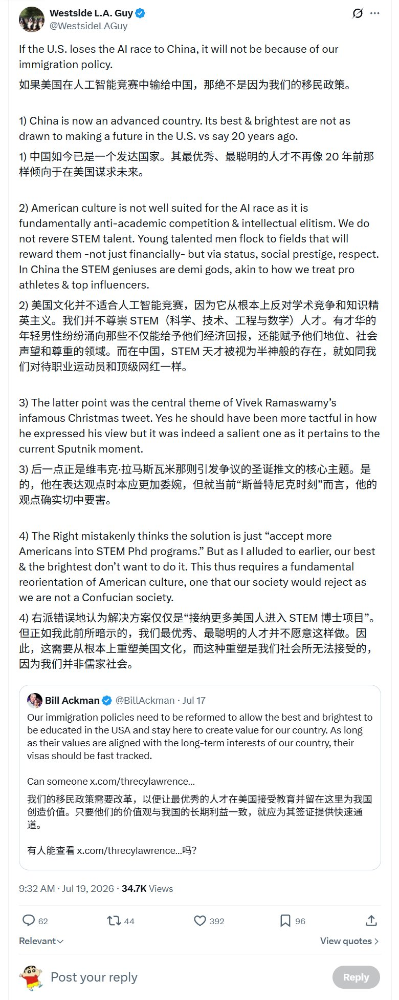

---

## 12

@思想聚焦

发表于：2026-07-17 05:01

来源：微博

链接：https://m.weibo.cn/status/5321653212681203

港片编剧是真上过班的

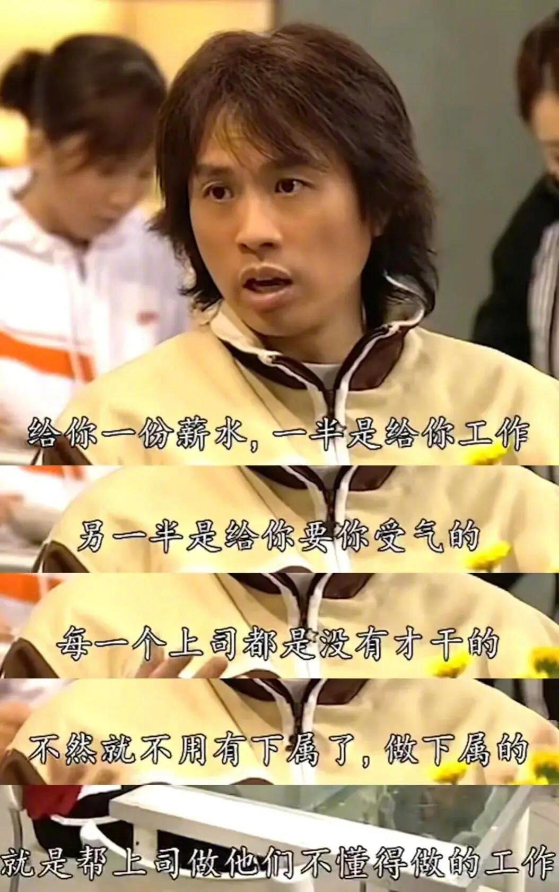

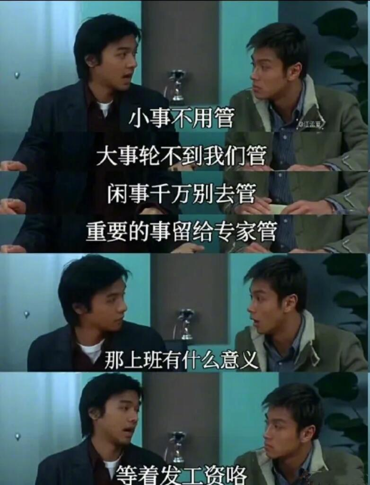

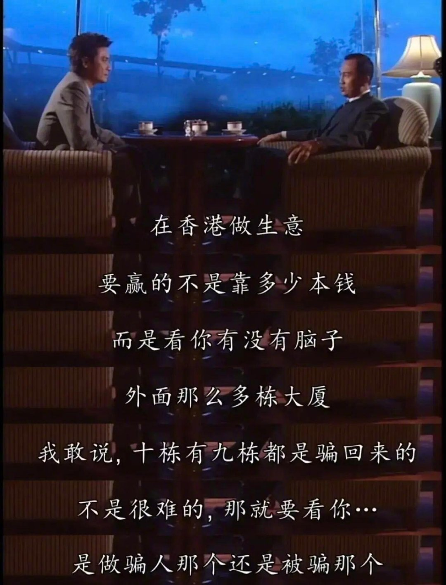

---

## 13

@小互AI

发表于：2026-07-19 08:59

来源：微博

链接：https://m.weibo.cn/status/5322438004967887

Qwen3.8 即将发布并开源 

官方宣称能力仅次于Fable 5

😌

---

## 14

@财联社APP

发表于：2026-07-19 08:58

来源：微博

链接：https://m.weibo.cn/status/5322437872847600

【世界人工智能合作组织未来将重点开展三方面工作】财联社7月19日电，《关于成立世界人工智能合作组织的协定》签署仪式16日在上海举行，来自亚洲、非洲、拉美和欧洲的29个国家现场签署协定，成为创始成员国。记者从有关方面获悉，这标志着中方倡导推动成立世界人工智能合作组织取得重要阶段性进展。下阶段，中方将会同合作组织创始成员国推动组织尽早启动运转。未来合作组织将重点开展三方面工作。

一是把加强人工智能能力建设国际合作作为优先事项，通过政策交流、技术合作、人员培训、联合研究等方式，促进人工智能技术和服务的可及性，持续释放智能红利，确保发展中国家在新一轮智能浪潮中平等受益。

二是在开展沟通对话、建立政策共识、分享最佳实践的基础上，切实发挥供需对接平台作用，推动各国优势资源深度融合互补，结合各国国情推进“人工智能+”行动，加强科技和产业合作，鼓励共建开源生态，打造一批接地气、可触达的务实合作成果。

三是致力于坚定捍卫联合国宪章宗旨和原则，支持更好地发挥联合国作用，落实《全球数字契约》和联合国可持续发展目标，在人工智能领域推动构建公正合理的全球治理体系。

据了解，16日签署的协定包括组织宗旨、基本原则、职能、组织架构、决策程序、成员资格等具体内容，为组织正式成立和后续运转奠定坚实政治共识和法律基础。合作组织是国际交流合作平台，加入合作组织不影响各国与第三方开展合作，也不会给各国人工智能发展带来不必要的约束和限制。合作组织成员国将秉持主权平等、相互尊重、协商共建原则，未来将与联合国等国际和区域组织探讨合作，共同推动人工智能向善普惠发展。 (央视新闻)

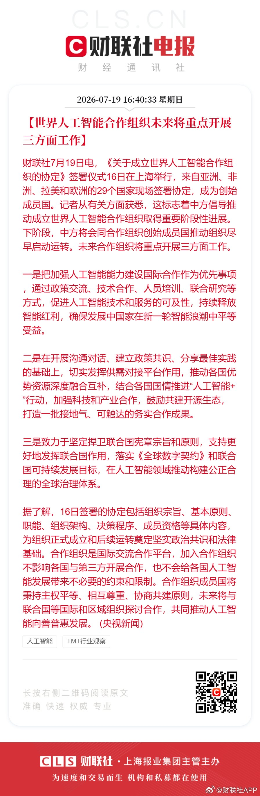

---

## 15

@挨踢牛魔王

发表于：2026-07-19 08:45

来源：微博

链接：https://m.weibo.cn/status/5322434421984481

\#Kimi K3把美股半导体干崩了\#

这肯定不是kimi k3干崩的，美股也该调整了。

不过再怎么说，kimi k3也是有Claude Opus 4.8的水平的，和Fable也能打一个有来有回。

我查了一下，Claude Opus 4.8 于 2026 年 5 月 29 日正式发布，离现在2个月。

就是说，中国的开源模型，离美国的顶尖闭源模型，差距就是2个月。

还有deepseek满血版也要发了，不指望超过kimi k3，但是它那个性价比高，速度快。

估计要收获不少海外用户了。

下半年，国产开源模型真要上桌吃饭了。

---

## 16

@图老板赛博札记

发表于：2026-07-19 09:16

来源：微博

链接：https://m.weibo.cn/status/5322442293642596

\#塌陷中的世界\#

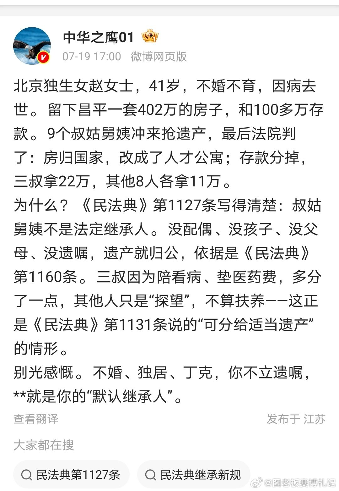

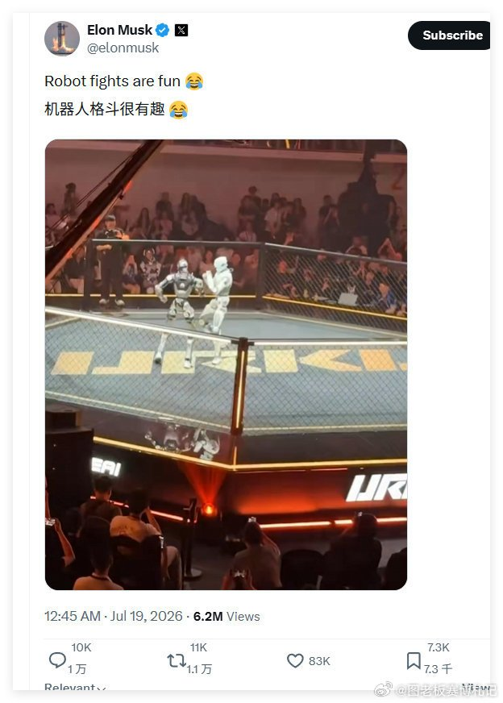

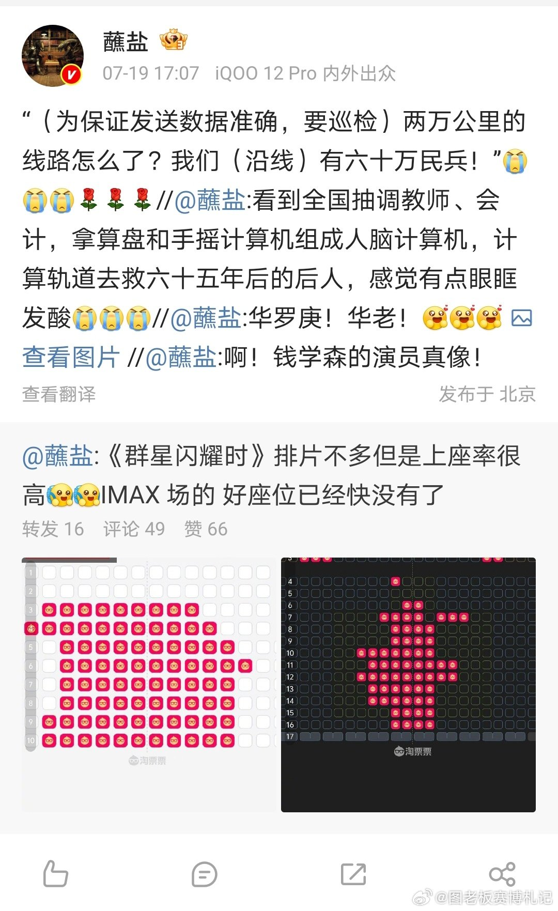

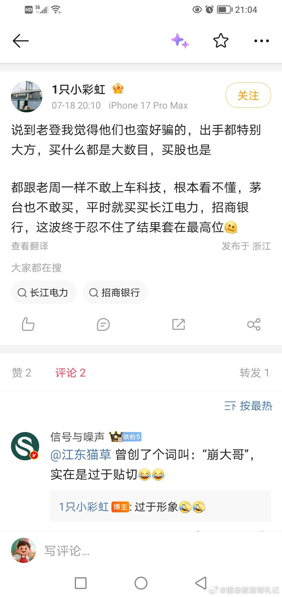

---

## 17

@i陆三金

发表于：2026-07-19 02:58

来源：微博

链接：https://m.weibo.cn/status/5322347148216093

龙虾之父 Peter Steinberger 又来造概念了，Loop Engineering 还没搞清楚，Graph Engineering 又来了。

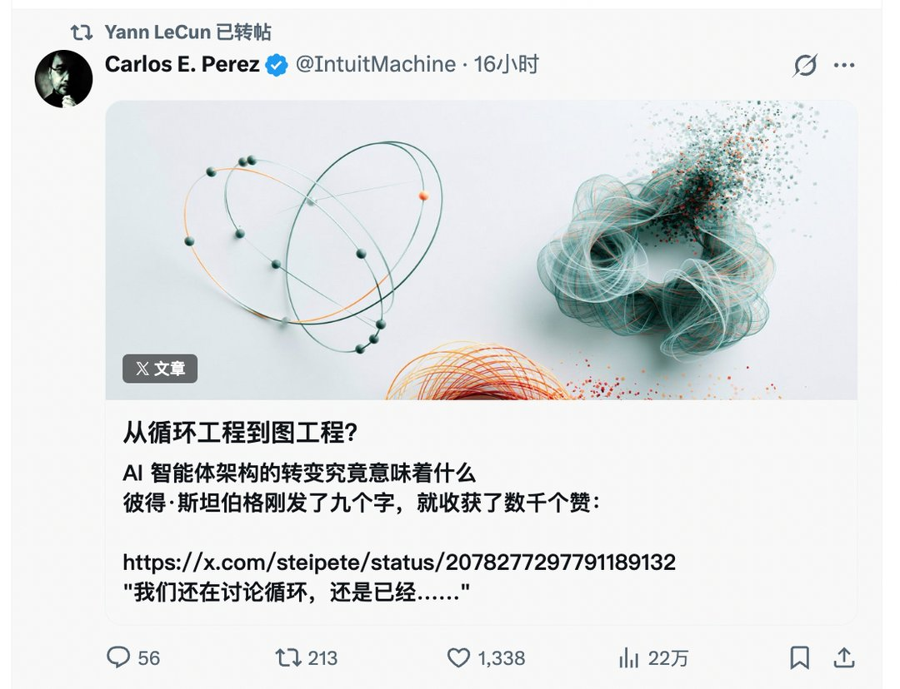

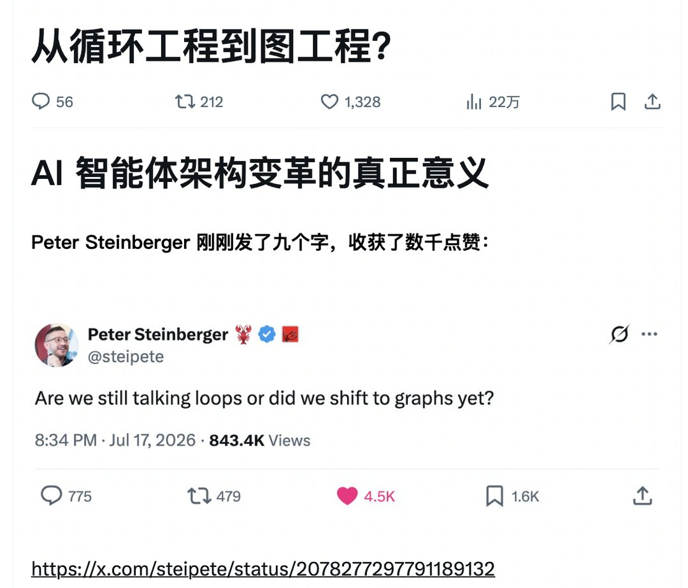

---

## 18

@李楠或kkk

发表于：2026-07-14 04:48

来源：微博

链接：https://m.weibo.cn/status/5320562836507760

我已经厌倦了关于 SpaceX 的争论天天回复一些幼儿园级别的评论，就比如说二级再入需要隔热和高速姿态控制什么的。这不是废话吗。

我给你一个 md 文件，这里包含关于深空探索的基本模块，每个模块的高置信度数据，已经用于学习的基本提示词。

你把他给你的 agent，然后你想知道什么，你就随便 qa 吧。

qa 了之后再评论，这个 agent 能回答的，一定是我知道的谢谢。

==============================

【Agent 任务目标】

协助一名 AI 专业的博士生，通过“高置信度数据输入 + 物理机理建模 + 商业逻辑解构”的路径，快速掌握 SpaceX 主导的现代商业航天核心技术与商业闭环。

===============================

-------------------------------------------

【模块一：系统工程与第一性原理（数据源与解析）】

--------------------------------------------

1.1 高置信度数据源（Agent 需自行检索或提示用户上传）：

   - 数据源 A：《Falcon Payload User's Guide》（SpaceX 官方公开 PDF，最新版）

   - 数据源 B：《Starship Users Guide》（SpaceX 官方公开 PDF，最新版）

1.2 推荐 AI 工具：

   - NotebookLM（用于超长 PDF 的多维度交互式问答与知识整理）

   - Claude 4.8（用于复杂系统工程逻辑的解构）

1.3 Agent 执行提示词（Prompt）：

   "你现在是 SpaceX 首席系统工程师。请基于上传的《Falcon Payload User's Guide》和《Starship Users Guide》，提取并生成一份结构化的‘载荷适配技术清单’。清单必须包含以下具体参数及解释：

   1. 机械接口与最大载荷质量极限（LEO & GTO）。

   2. 典型发射过程中的最大静态与动态过载（G-force）、正弦振动谱（Sine Vibration）范围。

   3. 整流罩内的声学环境（Acoustic Environment）声压级（OASPL）。

   4. 分离系统（Separation System）的触发机制与最大冲击载荷。

   请用 Markdown 表格形式呈现，并在每项参数后说明：‘作为卫星设计师，我需要运行何种信号处理或结构力学算法来确保载荷安全？’"

--------------------------------------------

【模块二：火箭推进与轨道动力学（代码、物理仿真与数学）】

--------------------------------------------

2.1 高置信度数据源：

   - 物理公式：齐奥尔科夫斯基火箭方程（Tsiolkovsky Rocket Equation）、大气密度指数模型（Exponential Atmosphere Model）。

   - 数据参考：Falcon 9 FT 版本的技术参数（起飞质量：549,000kg，梅林1D发动机海平面推力：845kN，海平面比冲：282s，真空比冲：311s）。

2.2 推荐 AI 工具：

   - Cursor / VS Code (配置 Claude  4.8)

   - Python 科学计算库（SciPy, NumPy, Matplotlib）

2.3 Agent 执行提示词（Prompt）：

   "请作为航天动力学专家，编写一个完全落地的 Python 脚本。要求如下：

   1. 建立一个一维垂直上升的火箭动力学模型，模拟 Falcon 9 从起飞到进入近地轨道（LEO，约 200km 高度）的过程。

   2. 必须考虑以下物理变量：

      - 随燃料消耗导致的火箭质量实时减少（dm/dt = -Thrust / (Isp * g0)）。

      - 随高度变化的大气阻力 F_drag = 0.5 * rho * v^2 * Cd * A，其中大气密度 rho 采用指数衰减模型，Cd 设为 0.5，A 为火箭横截面积。

      - 随高度变化的地心引力 g(h) = g0 * (R / (R + h))^2。

   3. 使用 scipy.integrate.solve_ivp 进行常微分方程（ODE）求解。

   4. 代码中必须有详尽的中文注释，解释每一行物理公式的来源。

   5. 代码最后使用 matplotlib 绘制：'时间-高度'、'时间-速度'、'时间-加速度'、'时间-质量' 的四格折线图。"

-------------------------------------------

【模块三：极致省钱的供应链与制造秘密（商业分析）】

--------------------------------------------

3.1 高置信度数据源：

   - 商业案例：Acquired Podcast《SpaceX》深度解析专题。

   - 行业分析报告：NASA 发布的《Commercial Market Assessment》及《NASA's Journey to Project Artemis》中关于 SpaceX 商业服务采购的审计报告。

3.2 推荐 AI 工具：

   - Perplexity AI / Kimi Chat（用于检索最新、最真实的新闻和财务审计报告数据）

3.3 Agent 执行提示词（Prompt）：

   "你是一名资深的商业航天产业分析师。请针对 SpaceX 的‘超低成本制造与供应链体系’进行深度解构，并完成以下任务：

   1. 解释 SpaceX 是如何利用‘工业级/汽车级器件’（COTS, Commercial Off-The-Shelf）替代昂贵的‘宇航级器件’的？请给出至少 2 个具体零部件的实例（如：控制计算机的处理器、管路阀门）。

   2. 剖析 SpaceX 的‘垂直整合（Vertical Integration）’策略。在 Falcon 9 和 Starbase（博卡奇卡基地）中，有哪些部件是他们坚持自己造而不是向供应商采购的？这为他们节省了多少比例的成本和时间？

   3. 猛禽发动机（Raptor）大规模使用金属 3D 打印（SLM/DMLS 技术）的具体部位是什么？这种制造工艺革新带来了什么物理上和商业上的优势？

   请拒绝任何空洞的行业行话，只提供有据可查的数据、百分比、材料名称和商业事实。"

--------------------------------------------

【模块四：AI 博士的降维打击（控制算法与避障）】

-------------------------------------------

4.1 高置信度数据源：

   - 学术文献/概念：G-Fold 算法（Acikmese 等人关于无损凸优化制导控制的论文）、凸优化（Convex Optimization）、模型预测控制（MPC）。

   - 现实场景：Starlink（星链）自动避障系统原理、猎鹰九号一子级垂直回收（VTVL）。

4.2 推荐 AI 工具：

   - Cursor / Claude 4.8（用于数学公式推导与 RL 算法架构设计）

4.3 Agent 执行提示词（Prompt）：

   "我是一名精通强化学习（RL）和现代控制理论的 AI 博士。请帮我将‘火箭垂直回收控制（VTVL）’和‘星链卫星自主避障’两个场景转化为我熟悉的 AI/控制学数学模型：

   任务一：火箭回收与凸优化

   1. 请用严谨的数学公式，写出 G-Fold 算法如何将非凸的火箭软着陆问题（推力矢量方向、质量变化、推力下限限制等）转化为可以通过二次规划（QP）或二阶锥规划（SOCP）实时求解的凸优化问题。

   2. 给出状态变量（x）和控制变量（u）的具体定义。

   任务二：基于强化学习的回收模拟

   1. 如果我用 PyTorch 和 Gym 框架设计一个强化学习环境来模拟火箭最后 100 米的垂直降落，请帮我设计并写出完整的 Python 代码框架。

   2. 代码中必须明确定义：

      - State Space（状态空间：高度、速度、倾角、角速度、剩余燃料）。

      - Action Space（动作空间：推力大小、主发动机偏转角、冷气姿控喷灯开关）。

      - Reward Function（奖励函数：需要惩罚燃油消耗、惩罚速度过快、惩罚倾角过大，并在成功平稳着陆时给予极高奖励）。"

================================

