# 2026-07-21

## 1

@数字生命卡兹克

发表于：2026-07-20 05:04

来源：微博

链接：https://m.weibo.cn/status/5322741372682472

不会代码也能做产品，这是一份从0开始的Vibe Coding保姆级教程。

最近，国产大模型也都起飞了。基本都达到了半步Fable 5境界。

2.8T的Kimi K3，2.4T的Qwen 3.8 Max，而在未来，肉眼可见的，还有马上上线的DeepSeek V4正式版，还有Seed、GLM、MiMo、LongCat等等要到来的更大规模的版本。我觉得，这就是所有在国内，想用AI搓一个自己的产品、所有想把自己想法变成现实的人，最好的黄金岁月。

现在，你不需要捏着鼻子用海外的模型了，考虑到对面封号、考虑到魔法、考虑付费等等，你可以直起身来，用我们自己的模型，来做你自己想做的东西。

包括我自己搓的产品AIHOT，从5月发布开始，到今天，2个多月的时间，最近一周的周活终于过了30万，月活也正式过了60万。所以，我觉得今天，我也可以分享一下，作为一个纯外行，如果你想从0开始，用国产模型，徒手搓出一个完全属于自己的产品，应该需要哪些步骤和流程，还有一些乱七八糟的坑。

先叠甲一下，下面这套流程，是我自己作为非专业者，目前跑得比较舒服的一条路径，主要面向完全不懂代码、想先把第一个产品做出来的人。

不同类型的产品，可以选择不同的托管平台，工程团队也会有不同的开发规范。

这里讲的是一条足够简单、能够从零走到正式上线的方案，完全不代表唯一的标准答案。那，让我们开始吧。

1. 买一个国产大模型的Coding Plan套餐。

你需要一个能帮你写代码的AI。Kimi、GLM、Qwen等等都无所谓，能买到哪个就用哪个，差距没有你想象的大。

2. 去下载各家官方的Agent编程产品。

买了Coding Plan之后，去下载各家官方的Agent编程产品。ZCode、Qoder、Kimi Code等等，你买了哪家的Coding Plan就用哪家的，因为未来肯定是自家的Agent更适合自家的大模型，可以提前用了。虽然现在很多的Harness还是不如Claude Code，但是我觉得会很快的补上。

3. 想好你的产品名字。

很多人觉得名字随便起一个就行了，做完再改。但不是这样的，你后面所有的东西，logo、域名、备案、小程序名称、App Store上架，全都跟名字绑定，改名的成本比你想象的大一百倍。

名字简短、好记、最好有一点辨识度，起名的时候顺便在微信搜一下公众号、小程序有没有同名的，在App Store和各大应用商店搜一下有没有撞车的。这一步花十分钟，能省你后面很多麻烦。

4. 注册一个域名。

名字想好的那一刻，立刻去注册域名。去火山引擎、腾讯云、阿里云啥的都可以，去域名注册页面，搜你想要的域名。我自己就是在这一步吃了亏，AIHOT当时真的就是随便取的，然后后面没想到这玩意做起来了，结果一查，AIHOT.com这个域名，是我可能永远都买不起的程度。。。

5. 买一台服务器。

你的产品做出来之后，它得有一个地方运行，不能跑在你自己电脑上，你电脑一关，全世界都访问不了了。为了让整套教程拥有一条统一、直观的路径，所以我们下面都以以云服务器为例，部分静态网站和轻量产品也可以使用Serverless、云开发或托管平台啥的，不一定需要自己维护服务器。不过现在维护服务器因为有了Agent之后，维护已经很简单了。

买服务器这里，推荐一下腾讯云上的服务器，新客一般都有大优惠，一年一个轻量的可能才99或者199，轻度产品使用足够了，不知道配置怎么选，就直接截图问你的AI，告诉它你想做什么产品，让它帮你挑。当然，最好的方式，就是让Agent操控你的浏览器，直接帮你选。

6. 同步去做ICP备案。

这一步非常重要。在中国大陆，你的域名如果要对外提供服务，必须做ICP备案。不备案，域名解析直接被运营商拦截，用户打不开你的网站。

在你买服务器的那个云平台上找到“备案”入口，按指引提交身份证、域名信息、网站名称，然后等审核，一般一到两周。一定要跟开发同步进行，别等产品做完了才想起来备案。

如果你做的是出海产品，那就无所谓了，但出海的话记得买海外服务器，比如新加坡或者美西的节点，离你的目标用户近一些。

7. 新建一个你的项目文件夹。

OK，准备工作全部做完了。域名有了，服务器有了，备案提交了，AI编程工具也装好了。现在，在你的电脑上新建一个文件夹。就这样。起一个跟你产品名字一样的文件夹名，放在你喜欢的位置。这个文件夹，就是你接下来整个产品的家，你的所有代码、所有配置、所有文档，都会在这个文件夹里。

8. 在这个项目文件夹下，启动你的Agent，开始开发。

打开你第2步装好的Agent编程产品，把工作目录指向你刚才建的那个文件夹。具体怎么操作，每个产品不太一样，但大致都是"选择一个工作目录"然后开始对话。从这一刻开始，你的AI就驻扎在你的项目里了，它能看到你的文件，能帮你创建新文件，能帮你写代码、跑代码、调代码。

9. 注册一个GitHub账号。

GitHub是全球最大的代码托管平台。你的代码不能只存在你自己电脑上，万一硬盘坏了、电脑丢了，你什么都没了。所以，可以注册一个GitHub账号（免费的），让Agent帮你连接上你的GitHub账号，然后把你的代码推到GitHub上的一个私有仓库里，注意是私有仓库，不是公开的。整体告诉你的Agent一句话就行了。“初始化Git仓库，连接我的GitHub账号，创建一个私有GitHub仓库，并提交第一个初始版本。”现在，你和Agent你们两两个的协作，正式开始。

10. 开启Plan模式，说清楚你要做什么。

大多数Agent编程产品都有一个Plan模式（或者叫规划模式），用人话告诉AI你想做什么，它会先帮你理清楚需要做哪些事情，列出一个计划清单，别直接开始执行。你在这一步要做的事情就是，用最简单直白的语言，描述你的产品。注意，不要想太多，你不需要画原型图，不需要写需求文档，不需要列所有功能，就说你最核心想要的那个东西，后面的功能可以慢慢加，但第一版可以比较简单。先看到那个产品出来的正反馈，比什么都要强。AI会根据你的描述生成一份规划文档，你看一下是不是你想要的方向，确认了就进入下一步。

11. 让Agent根据Plan文档，开始执行开发。

确认了Plan之后，告诉Agent开始执行。它会自动创建项目结构、写代码、装依赖等等，你什么都不用管，看着它干活就行，过程中，它做完一块会问你要不要看看效果，或者有没有什么要调整的。

12. 在本地模式下验收。

Agent开发到一定程度之后，会给你一个本地预览地址，大概率是类似localhost:3001这种。在浏览器里打开这个地址，你就能看到你的产品长什么样了。

这时候不需要着急部署上线，就在这个本地环境里，慢慢调，UI不好看就让AI改，功能逻辑不对就让AI修，改到你满意为止。你是产品经理，AI是执行者，你觉得对就是对，你觉得不对就让它改。

13. 使用洁癖.skill，对文档和代码进行规范化整理。

这是我自己做的一个Vibe Coding专用Skill，也是我如今用得最多的skill。你在前面的开发过程中，可能跟AI聊了很多轮，改了很多东西，你的代码和文档大概率已经有点乱了，甚至会出现自相矛盾的情况。这个时候，就是洁癖.skill的作用了，专门干一件事，就是把你的项目文档、代码规则、AI记忆文件全部规范化整理一遍。因为AI的记忆是有限的，你开一轮新的对话，前面聊的很多东西它就忘了。如果没有一份干净的、没有矛盾的项目文档在那里兜底，AI就会开始瞎编，它忘了你之前的设计决策，忘了你的产品逻辑，然后给你写出一坨跟之前完全矛盾的代码。

开源地址：网页链接

跑完洁癖.skill之后，你就结束这个对话。以后每次开新对话，AI只需要读一遍项目里的文档，就能快速恢复上下文，知道你的项目是什么状态，接下来该干什么。

14. 跟Agent一起学一些专业名词。

到这一步，你已经有了一个能跑的产品、一个干净的代码仓库、以及一套基本的版本管理流程。你不需要懂代码，但你需要懂一些名词，因为后面的流程会经常用到。比如Git、分支、主分支（main）、PR、CI、测试流程等等。可以直接让Agent给你解释。

不需要完全搞懂，但你要知道这些词在说什么，要不然后面用到的时候会一头雾水，你的流程也不规范。

15. 做一个测试流程。

Agent开发非常快，所以测试反而就很重要了。你可以直接跟你的Agent说，帮我根据我的项目搭一套完整的测试流程。如果你有多余的财力，可以开一个GitHub Pro会员，一个月只需要4刀。买这个会员最核心的原因只有一个，就是它能让你在私有仓库里开启分支保护。

就是你设定好规则之后，任何人，包括你自己，都没办法直接往主分支上推代码，所有的改动都必须走PR，PR必须通过CI测试，测试通过了才允许合并。

没有分支保护的时候，你或者你的Agent随时可能手一抖，直接把有问题的代码推到主分支上，然后线上直接崩掉，要不然就是自己跟自己对抗，搞一套很复杂的维护脚本。有了分支保护，这条路就被堵死了。买完以后，可以告诉你的Agent，"我买了GitHub Pro会员，帮我开启分支保护，再给我的项目，做好全面且规范、专业的测试流程"。

当然，不买也行，就是未来项目成熟后，你想飞速迭代，就会变得麻烦点。

16. 把项目部署到你的服务器上。

新起一个对话，把你服务器的IP地址发给Agent，告诉它"我要把这个项目部署到这台服务器上"。Agent会处理好一切，有问题的话，你登录一下你云厂商的控制台，让它自己操控浏览器去解决。

然后，你的代码就会在你的服务器上自动地7x24小时运行了。终于，不再是本地代码了。

17. 把域名连到你的项目上。

告诉Agent你的域名是什么，让它帮你把域名指向你的服务器，然后搞个免费的证书，配好HTTPS。这一切还是一样，不用你管，你让你的Agent干就行。做完之后，在浏览器里输入你的域名，你应该就能看到你的产品了。是一个真实的、全世界任何人都能访问的网址。相信我，第一次在浏览器里输入自己的域名，看到自己搓出来的产品真的能打开，那个感觉绝对超级爽。

18. 进入无限循环的迭代流程。

上线不是终点，是起点。从这一步开始，你的日常工作流大概率就固定了。新建分支 → 说出你的需求 → Agent开发完成 → 跑一遍洁癖.skill统一文档 → 提交PR过CI测试 → 合并到主分支 → 部署上线。每一次改版、每一个新功能、每一个bug修复，都走这个循环。这个流程看着好像很复杂，但跑两三遍之后你就肌肉记忆了，而且这个流程最大的好处是安全，因为你每次改动都在分支上，不会直接动主分支，改坏了就扔掉这个分支重新来，主分支上永远是稳定能跑的版本。也可以让你稳定的并发同时三四个任务。

19. 可以不懂代码，但对系统的架构必须了如指掌。

这一条不是某个操作步骤，是一个原则，也是我觉得整篇文章里最重要的一段话。你可以不会写代码，你可以让AI帮你写所有的代码，但你必须知道，你的产品到底是怎么运转的。每一个前端页面背后对应的是哪个接口，每一个后端接口做了什么事情，你的数据库有哪些表，每张表里存了哪些字段，这些字段是怎么被用到的，用户点了一个按钮之后数据是怎么流转的。

这些事情你必须清楚。因为如果你不清楚，你就丧失了对产品的判断力，AI跟你说我改好了，你连验收都验收不了。

AI给你提一个技术方案，你分不清它是在给你一个合理的建议还是在用一堆复杂的东西糊弄你。不要让渡自己的思考。

AI是你的执行者，但你必须是那个知道这件事应该怎么做的人。你可以不知道代码怎么写，但你必须知道逻辑怎么走。我自己做AIHOT的时候，每一次跟AI讨论架构方案，我都会让它把方案解释清楚，为什么用这个方案不用那个方案，好处是什么坏处是什么，我听明白了，同意了，或者我认为有更好的更适合我们的方案，才会让它动手。它要求你在完全不懂技术的前提下，去理解一个技术系统的运作方式。但这恰恰是Vibe Coding最核心的能力。

20. 最后，一定要学一些运维知识。

产品刚上线的时候，可能就几十个人用，服务器随便扛。但当你的用户慢慢多起来之后，有些事情就不一样了。

缓存机制、防爬虫、防DDoS、流量带宽的费用控制，这些东西在早期你完全不用管，但用户量过了一定级别之后，你不管它它就来干你。不要被人一天刷了4000块的账单才想起来去学习，防范意识要趁早。

这个是一个巨坑，可以慢慢学。

我也还在学。

写在最后

写到这里差不多了。如果有任何不懂、不理解的地方，完全可以把这篇文章复制，再加上你的问题，直接问Agent。

忽然想起两年前，你要搓一个能上线的产品，你得学编程、学框架、学运维、学数据库，光准备和学习的工作，就能劝退99.99%的人。

现在你需要的只有三样东西，一个想法，一个AI编程账号，一台几十块钱的服务器。

然后，就开始做。

AI会帮你解决一切。

这就是最好的。

黄金时代。

\#how i ai\# 

\#vibework\# \#微博vibelab\#

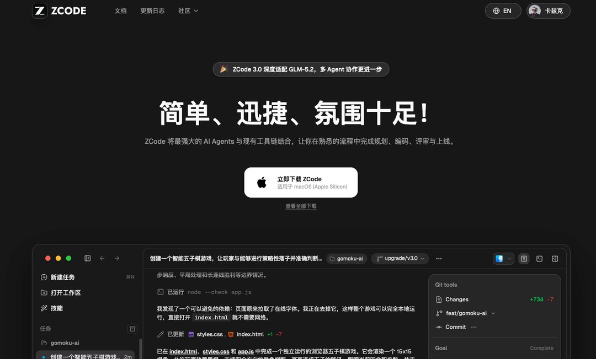

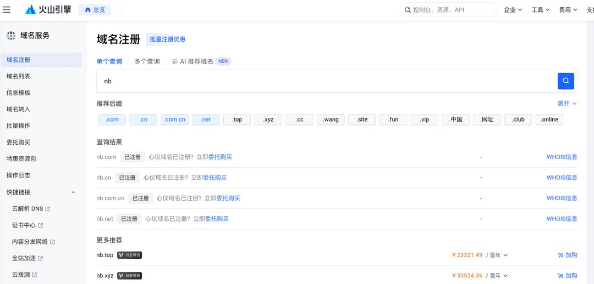

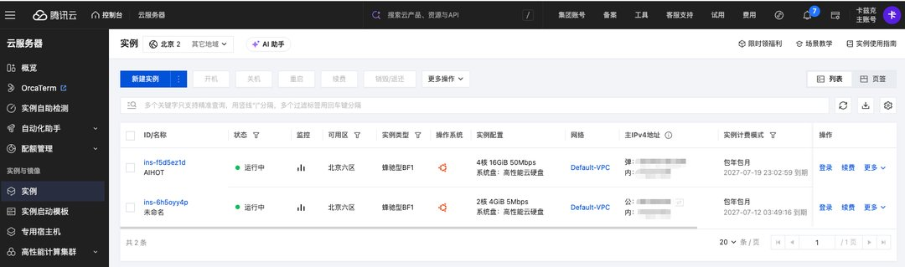

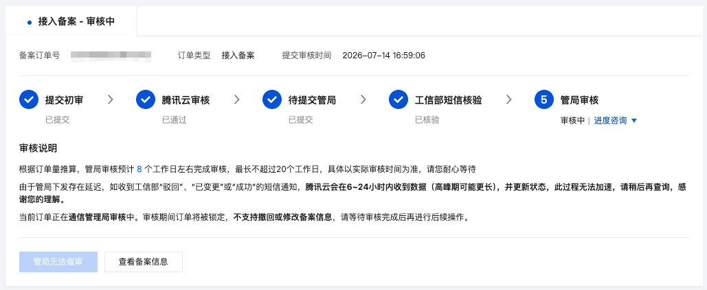

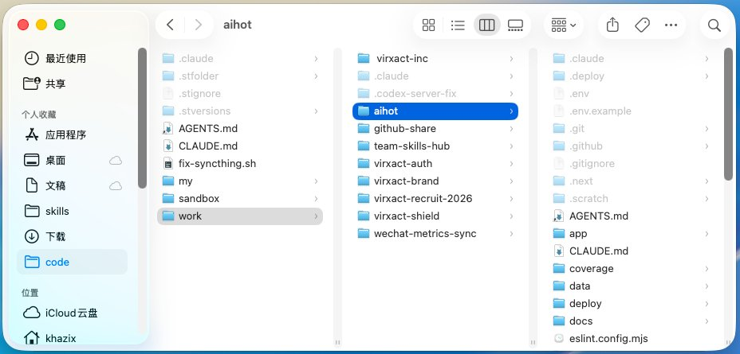

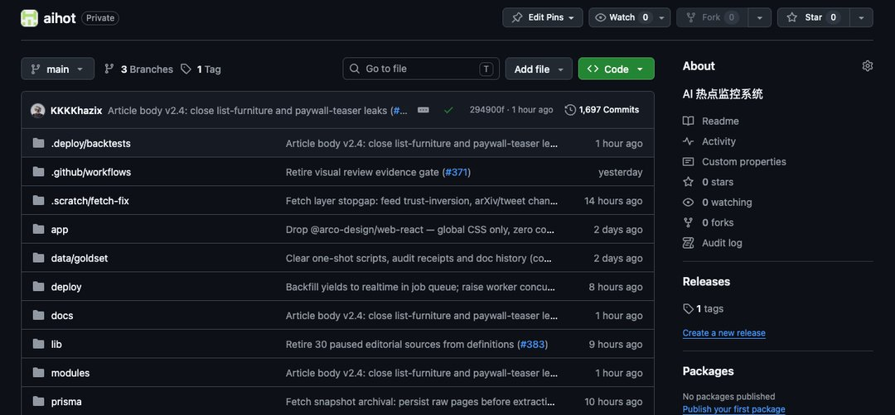

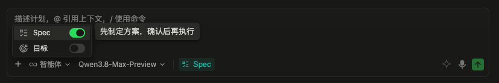

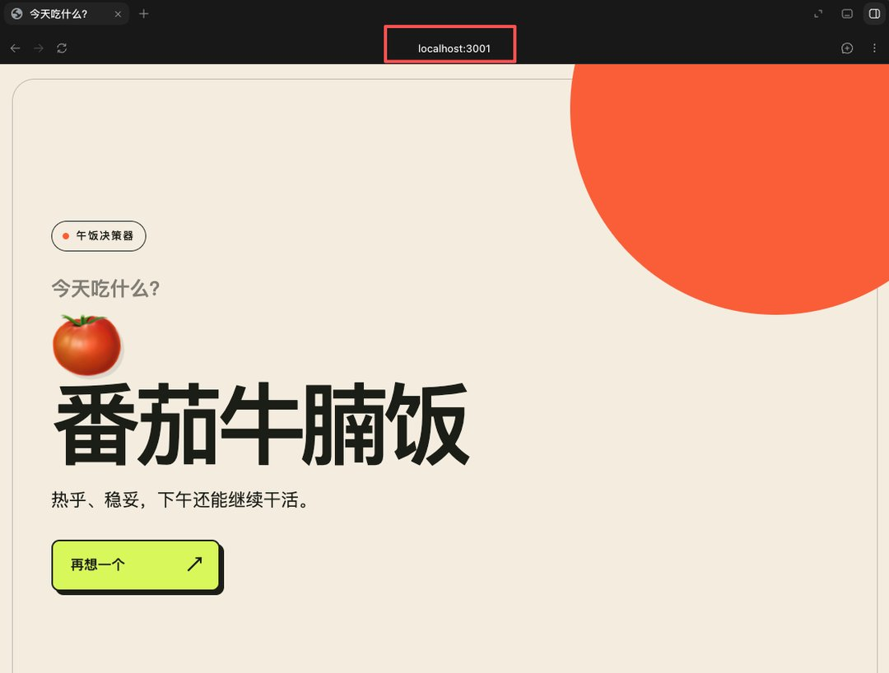

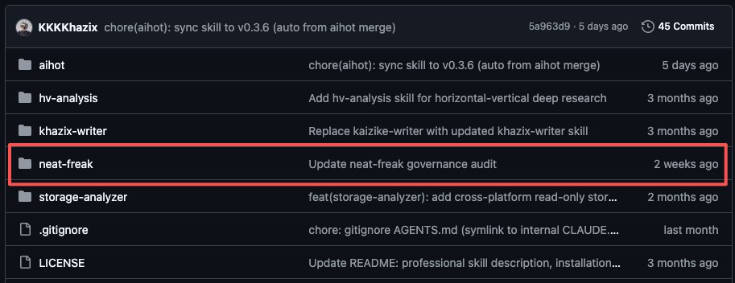

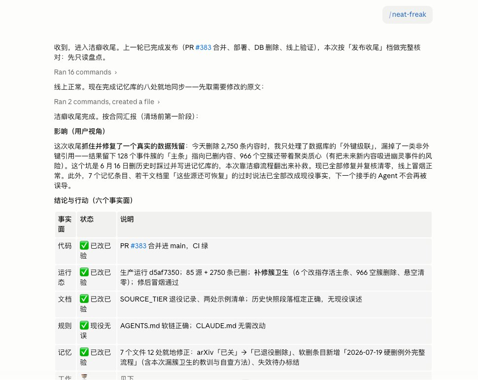

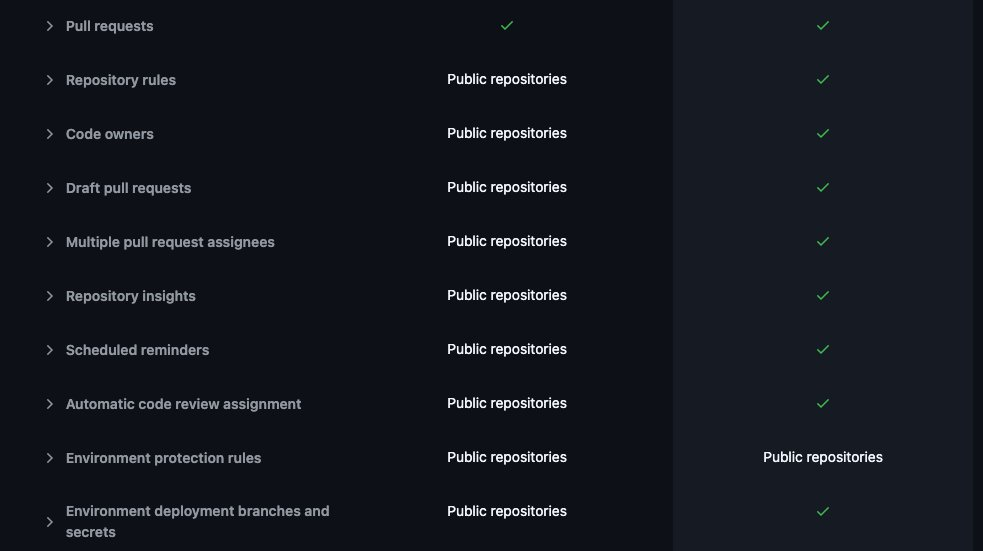

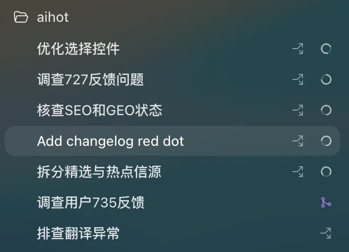

---

## 2

@前HR本人

发表于：2026-07-20 07:17

来源：微博

链接：https://m.weibo.cn/status/5322774647935897

今天A股又是老登股和小登股较量的故事。结果白酒、银行、保险、电力等老登股意气风发，芯片、AI、机器人等科技小登股扑街。

很久没有看到老登小登一起携手共进，感觉像是跷跷板。因为我买两个基金一个老登一个小登，很少同时好的，

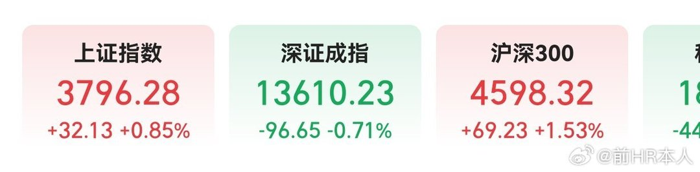

---

## 3

@阑夕

发表于：2026-07-20 07:22

来源：微博

链接：https://m.weibo.cn/status/5322775942401348

眼泪哭干了，还是总结一下逛完今年WAIC的51件小事：

1、「三地四馆」的场地太大了，根本没办法全图鉴，加上高峰人流期的交通管制能拉到馆外一公里之远，日均步数4万+的消耗，非常折磨，不过人也是真多，感觉我大半个朋友圈都来了；

2、应该是WAIC举办以来参展企业最多的一届，而且多了一些「很占地方」的展品，比如华为、沐曦和摩尔线程都把自家的万卡集群搬到了现场展示，感觉走过去就会自动响起「加油华为，加油China」的BGM；

3、但是因为那些万卡集群本身并没有交互功能，只能看到闪烁着指示灯的服务器堆叠在一起，所以画面非常静止，空有人气——尤其是华为的展区——却也没有任何节目效果，人群围在一起很像某种原始崇拜，「太空漫游2001」里猿人们膜拜黑色石碑的即视感；

4、具身智能仍然是最热展区，没有之一，很多人特意跑一趟就是为了来看机器人的，单论世博主场馆，具身智能这条赛道的占地比例差不多是其他企业的总和，大有以一敌十之势；

5、机器人的密度之高、同行之卷已经到了一个新等级，像是宇树以前靠几场跳舞打拳就能刷屏已经行不通了，今年都在努力证明可以帮人泡茶炒菜按肩膀，「我有实用价值」的生存欲爆炸；

6、当然宇树依然是里面最有排面的一家，载人机甲GD01占据着整个主场馆的入口C位，过了安检就能看到，据说王兴兴还在现场展示了一波操作，不过我没赶上；

7、至于担心机器人取代工作的，可以稍微宽心了，即便工作人员有各种方法把遥控器藏在包里，光从动手效率来看，这些机器人的单位时间——包括把不用睡觉也考虑进去——产出还是远远比不过日结老哥的；

8、这么说吧，不少机器人演示怎么干活的对外视频都是调了倍速的，因为不调的话很容易被误以为是慢动作，让看的人急得不行；

9、有一说一，在现阶段，「做对」比「做快」要重要得多，比较震撼的还是中国具身智能整个行业的「钢铁洪流」面貌，眼瞅着又要以一国之力对战全世界了；

10、有家给机器人做「皮肤」的公司一目科技还挺有意思的，它只做触觉传感器，像一层膜那样贴在机器人的肢体末端，提供准确的「手感」反馈；

11、京东也在具身智能这边上桌吃饭，想不到吧，它好像找到了一种类似数据标注的定位，主打人类视角数据集，卖给机器人公司去做训练，据说京东的家政员工都是带着摄像头和传感器去上门给人打扫卫生的；

12、就是「镇馆之宝」的名头有点不够用了，光是我见到和听到的，就有不低于20家厂商在这么包装自家的展品，应该来个证书配套的；

13、「AI六小虎」里来了五个，除了智谱以外——不知道是不是专心搞市值管理去了——都悉数到场，起码从观感上讲，它们已经活成了完全不同的样子；

14、Minimax主打德智体美劳全面发展，一边服务于高价值的Coding市场，另一边在全模态创作上不断点亮技能树，整个展台散发着一种既硬核又带点人文的拧巴；

15、零一万物是其中唯一一个老板亲自坐在展区营业的，开复老师的勤奋程度还是一如既往，但狂也是真的狂，一直在说不存在「六小虎」，现在的格局是「五虎一豹」，自家就是那头金钱豹；

16、阶跃的体验是这几家里最好的，审美和产品全部在线，不光有让机器人搭巨型乐高的大活，AI手机也是人流量最大的展台之一，我很想试试，但真的挤不进去啊；

17、反倒是我很期待的Kimi，显得格外松弛，展区很小，大概人手都分出去发新模型了吧，只有一个简单的发笔记送赠品活动，不过门口也是最挤的，全是想蹭K3热度的媒体，事实证明模型强就是可以为所欲为啊；

18、和预想的一样，ChatBot已经退版本了，现在谁家不掏出几个Agent是完全上不了桌的，从传统互联网公司到AI Native的新势力，能看得出每家公司都在极力的画靶找靶，证明AI的生产力价值；

19、比如腾讯的展区基本上可以说是Agent全家桶，WorkBuddy、Qclaw、Marvis等等能塞多少就塞多少，用产品能力的长处去弥补模型能力的短板，这是很擅长的；

20、微信也来了，但和不来也没什么差别，没有上新大家真正关心的AI能力，而是很命题作文的搞了一个AI生成表情包并打印出来的交互屏幕，一种过年时小孩被爸妈强迫给亲戚表演个节目的应付感；

21、阿里不出意外的还是在表现全栈式肌肉，芯片-模型-硬件层层递进，这次新亮相的有一个造型特别奇怪的AI耳机，放在玻璃罩里不让碰不让摸，功能也没怎么讲解，大概是学到了「过于先进，不便展示」的精髓；

22、字节又没来——指的是设立独立展区——它对WAIC的态度一直比较疏离，好像从来没做过参展商，不过因为努比亚带着同样「只能看，不给用」的2代豆包手机成了全场最靓的仔，字节的存在感其实一点也不弱；

23、不过最出圈的所谓字节系产品还是「豆脚」，你们应该刷到过了，就是有人拿豆包的Logo形象做了面罩，套在半身机器人上到处溜达，然后就有了「豆脚」的外号，十年打铁无人问，一朝整活天下知；

24、百度就比较难绷了，还在年复一年的搁那炒作DAA（日活智能体数）的概念，不知道什么时候这家公司才能意识到，李彦宏拍脑袋想点什么大家就都得虎躯一震的时代早就过去了啊；

25、今年来的学术界嘉宾阵容很扎实，什么9个图灵奖得主齐聚之类，但从演讲内容来看，普遍比较端水，没有特别突出的记忆点；

26、朱松纯教授的演讲可能算是一个例外，属于你们都很懂的那种宏大叙事，直指AGI就是美帝下的套，「美国发明一个信息，我们再请美国人来讲一遍，形成信息的倒灌效果」，要知道在他之前演讲的就是美国来的「强化学习之父」Richard Sutton，哈哈，太不给面子了；

27、「Token经济」成为行业共识基本没有悬念了，稍微隐晦的，还愿意标榜自己所谓的基座和工厂定位，一些演都不演的中转商，直接把财神当作了自家吉祥物，打出简单直接的标语：「下个风口，就是卖Token」；

28、狂热和躁动的分布并不均匀，OPC（一人公司）的主题展区冷清得有点过头，这可是跟当初说好的不一样啊，难道说这么快就要承认现实了吗——AI并不能轻易替代公司这种经过了岁月考验的商业组织；

29、理想是我见到的，唯一以整车品牌参展的新势力车企，还把马赫100芯片的对外亮相选在了这里，其他的要么没来，要么以产品合作的身份出现在展会上，比如阶跃和极氪；

30、今年特斯拉也没来，有点反常，因为作为上海本地企业——嘘，别质疑——特斯拉历来都是WAIC的常客，加上具身智能这么热闹，马斯克反而避战了，不知道是不是操心SpaceX的破发去了；

31、直到下暴雨之前，盛夏的天气实在是热浪逼人，现场每隔几步就会放一个巨大的冰块用来降温，即便如此，在人流量大的区域，不少人还是忍不住闷热，选择中途跑路；

32、除了参展企业和从业者之外，更多普通人来这里其实是出于FOMO情绪，我经常会听到的对话是「有人给你报销差旅吗？」「没有，我自己要来的」「那你是纯热爱啊？」「再不来就真落后了」；

33、更绝的是，我还看到有人拿着自己的简历现场求职，这个思路虽然清奇，但仔细想想还真挺精准的，但从科技公司的密度来讲，WAIC可比招聘会要高得多；

34、还有一个不知道能不能说的男凝视角，就是漂亮妹妹明显比前几年多了，甚至还有宛若桃花的Coser随机出没，感觉有些吃到了BW的尾气，随便分流一点过来都是降维打击，我懂OpenAI为什么要在ICML请女团来跳K-Pop了；

35、纯粹个人体感，AI眼镜的热度似乎有点下去了，各家拿来亮相的产品高度趋同，也没有特别让人眼前一亮的特点，干着干着就都干成工业级场景了，用来巡检、上课、看展等等，明显是在瞄准B端订单；

36、银行之类的金融公司还在展示AI客服的降本增效，主打一个跟真实世界完全脱节的状态，不知道「天下苦没有活人客服久矣」的民情；

37、中国移动算是参展运营商的代表了，明牌要把Token当成以前的流量计价销售，接了300多个模型，要卖给其他企业，相当于一个体制内可信中转站的角色；

38、电算协同是比较让人心安的产业，几大电网都把能源供给的压箱底方案带来了，至少3-5年内，电是不可能缺的，缺的只会是把电能拉满的AI消费场景；

39、因为最近这段时间恶劣气候影响频繁，气象局的自有模型「妈祖」得到了应该超出预期的关注，把它打造成公共产品服务国际社会也是很大气的构想；

40、在西岸，荣耀的Robot Phone人气很高，别人都在整AI手机，它很机智的做了一台具身智能手机，手机自带一个可观测环境的机器臂，有点笨笨的中间形态味道，但确实吸引眼球；

41、阶级分化是另一个很有意思的观感，就像低价小吃店总被满满当当的塞进商场里的B1层，世博主馆的地下就留给了预算有限的各种初创公司，其中很多连展台都没布置，支了一张桌子就算参展了；

42、有家叫叽里呱呱的杭州公司摆出了金色蟾蜍造型的AI硬件，硬整出一条「打印桌宠」的赛道，蟾蜍嘴里会吐出打印出来的实体字条，很有仪式感，不过造型设计太丑是个劝退点；

43、很多人喜欢B1层就是因为这里人味十足，不像上面那些展区普遍是热蔫儿了的打工牛马在接待同样热蔫儿了的出差牛马，B1层的小公司生命力一个比一个旺盛，人均想要刮中一张VC彩票，据说连曲曲都来了，不过我没见到；

44、转了一圈，如果不看价格，我最想下单的是自动吹风机，可以解放双手，让一根机器臂帮你360度无死角的吹干头发，抽象归抽象，但真的很实用好吗，产品名字也很直率，就叫「吹了么」；

45、小红书和欧莱雅都在搞面向非专业程序员的Vibe Coding活动，属于文科生狂喜的那种，格子衬衫含量为零，很多小孩儿拿着一堆表情包做的PPT就上台开讲了，年轻真好啊；

46、AI的造星运动还在持续，如果说大厂们的造星对象是研究员，那Build in Public的造星对象就是素人开发者，一些知名度比较高的博主，是真的会被人群层层围住合影的；

47、知乎在WAIC世博主场馆外办了今年的Tech Club，未来三十年内都不会有人猜到为何要选择这么撞日子和撞位置，真不怕被虹吸啊；

48、尤其是WAIC临近结束时，场外因素开始明显大过了场内氛围，Kimi、DeepSeek、Qwen的三连发，连带着中美AI竞赛的新赛季叙事，带来了更高的观赏性，兴奋点一下子就燃起来了；

49、便利店的烤肠太难吃了；

50、最后想说的是场外的组局也多得简直过剩，毕竟这可能是一年到头来从业者最为密集的一百多个小时了，投资人拉项目，媒体人吹牛逼，主理人录播客，出差人喝夜酒，如果你很久没感受到经济上行的美了，上周末的魔都，可以负责管饱管够；

51、有没有泡沫这个问题其实已经不重要了，借用一句台词来讲就是——「泡沫破灭前，每一个泡沫都闪烁着耀眼的光环，正是在一个个耀眼的光环中，人类充分发挥了自己的想象，最终改变了整个世界」——孩子们，明年WAIC再见。 

\#WAIC2026\#

---

## 4

@新浪科技

发表于：2026-07-19 23:00

来源：微博

链接：https://m.weibo.cn/status/5322649737888365

【\#Kimi暂停新会员订阅\#，保障已订阅用户的全部权益不受影响】月之暗面 Kimi 今日发布公告，为了保障已有订阅用户的体验，决定即日起，暂停 C 端新用户订阅，将已有算力全部投入于服务已订阅用户，保障已订阅用户的全部权益不受影响。 

原文如下：

自 KimiK3 发布以来，我们收获了远超预期的支持，但也面临始料未及的算力挑战。过去 48 小时，用户请求量已大幅超出我们的预估，并且逼近现有集群的承载极限。

为了保障已有订阅用户的体验，我们决定即日起，暂停 C 端新用户订阅，将已有算力全部投入于服务已订阅用户，保障已订阅用户的全部权益不受影响。同时，我们已在全速推进算力扩容。随着新算力陆续到位，我们将逐步开放更多订阅名额直至全面恢复正常订阅。

对于后续新订阅用户，我们将拆分 Kimi 主权益 (包含 KimiWeb，Kimi App，Kimi Work) 和 Kimi Code 权益，以方便更精准匹配算力，保障用户体验。

我们向满怀期待、却没能获得期待中体验的朋友郑重道歉，也对给予我们理解和包容的朋友深表谢意。

月之暗面于 7 月 16 日上线推出 Kimi K3 模型，是 Kimi 迄今能力最强的模型，拥有 2.8 万亿参数，100 万 Tokens 上下文，主要面向长程编程与端到端知识工作。

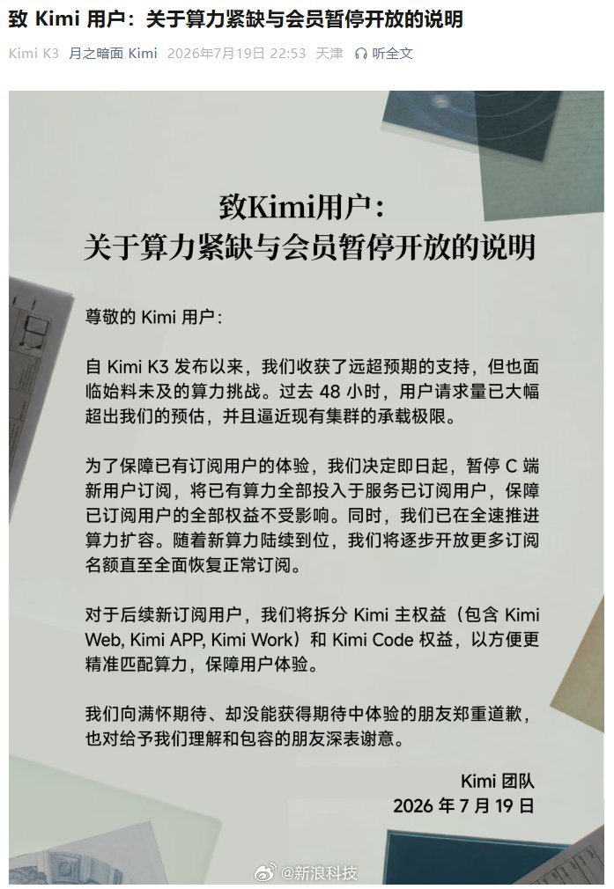

---

## 5

@挨踢牛魔王

发表于：2026-07-19 12:16

来源：微博

链接：https://m.weibo.cn/status/5322487613097700

如果给AI赚钱的几个赛道排一个名的话，我会这么排。

排名第一的，肯定是coding赛道。

这个赛道是反人类公司anthropic首先跑通的。

前段时间，他们公布的年化收入是470亿美元，现在达到500亿美元一年，问题不大。

因为coding是IT操作的原语，并不仅限于编程。

举个例子，一家建筑公司要做图纸，可能就要用到，一家农业公司育种，也可能用到。

谁买单呢？

主要是2B。

企业肯定是要留AI预算来买token的，所以这一块收入挺高的。

现在像kimi k3，glm5.2肯定是不会放过这个蛋糕的。

排名第二的，我们以前说是agent。

其实agent的范围很广，coding agent也算是一种agent。

其实可以细分一下。

现在非常明确了，就是work agent，就是办公任务。

微软的office是下蛋的金鹅，这个市场本来就非常赚钱。

这条路，小龙虾有重大贡献，基本算是从小龙虾跑通的。

现在openai的codex有work,claude code有work。

国内，腾讯推了workbuddy，直接也推出了trae work，阿里有Qoder work。

形势已经很明朗了，大厂是不会放过这块肥美的市场的。

排名第三的，就是视频、设计类。

这条路，是字节首先跑通的，从seedance 2.0出来，就成型了。

火山引擎，有一半的收入是卖seedance 2.0。

火山已经把目标从100亿提升到150亿了，当然是人民币，也很赚钱了。

字节还有红果作为发行端，整个是闭环的。

我怀疑，seedance2.5早就训练完了，但是市面上还没有比seedance 2.0更好的模型，字节也就不急于发，就拿seedance 2.0改mini版、fast版来赚钱就行了。

预计本月底之前，seedance2.5可能会发，要是没对手，他们可能还会拖延，不急。

另外一个，就是图像模型，这个已经证明是可以稳稳赚钱的。

创意图像生成，是midjourney首先跑通的，他们都不融资，每年挺赚钱的。

图像编辑这块是谷歌的nano banana首先把商业模式跑通的，就是真能干活。

最后是聊天、搜索、轻办公之类的应用，现在还没怎么赚钱。

这块估计是要用互联网的那种流量模式，就是等gpu的成本降下来，获得大流量，然后走广告、电商模式，才能赚钱。

你要赚钱的话，就基于这几个主赛道去做，搞自己的服务和产品。

大公司是赚钱，你只要从这个蛋糕切下一小块，就够你吃的了。

---

## 6

@李楠或kkk

发表于：2026-07-19 05:28

来源：微博

链接：https://m.weibo.cn/status/5322384825123912

其实，Open AI 和非人公司还没有注意到另外一件事情。。。

商汤通过异构混合推理，端到端算力电力协同优化等乱七八糟的技术已经把推理成本在大幅度降低。

具体技术细节你们自己搜搜，反正现在主流国产芯片MFU提升85%-152%，单位成本Token产出提升2.5倍，目前国产推理芯片的商业模型，已经开始转正。

如果说 kimi k3 是对闭源模型的打击，那么这种加速算力优化的进展就是对这些闭源模型公司和英伟达搞得加速算力基建的釜底抽薪。

为了全人类的安全所以必须发展领先的闭源模型，这个前提本来就高度不靠谱。

然后私募阶段资本对闭源模型做垄断定价就更加不靠谱。

然后闭源模型，加速算力提供商，显卡供应商再弄个循环吃屎，推动万亿美金的加速算力基建就是不靠谱上的不靠谱。

而最终所有这些故事，又都跑到公开市场上通过英伟达甲骨文SpaceX再次上杠杆。。。

故事是很性感，但是中国作为过去 40 年真正干事情的人拿到这个故事，一项一项检查的时候。。。

模型，

加速算力成本，

显卡，

商业落地，

这一项项，都会教美国做人。

而我就期待万亿美金的美国加速算力基建，赶紧落地，转化为真正的工厂，电厂，显卡，散热，储能配套。

然后，商汤拿着异构推理，混合显卡，电算协同的新一代加速算力中心方案，开开心心的告诉美国人：

你们的蒸汽机耗能太高，成本不合算。。。

要不要再凑一笔钱，给升级成内燃机的？？？

---

## 7

@信号与噪声

发表于：2026-07-20 09:45

来源：微博

链接：https://m.weibo.cn/status/5322811929264257

美股科技牛市终局猜想（结论：东升西落）

中信建投报告深入探讨本轮美股科技牛市可能的终结路径与时间节点，核心观点如下：  

一、五大潜在终结路径

1. 杠杆交易反噬  

   • 美股融资余额增速相对股指涨幅差值达25%（历史极值水平），近三次类似情形均触发崩盘（2000/2008/2022）；  

   • 若维持当前杠杆扩张速度，1年内见顶概率显著上升。  

2. 中国AI技术赶超  

   • 中国大模型性能差距从300%缩至5%，且成本仅为美国1/3，可能颠覆美股高CAPEX逻辑；  

   • 短期关注Kimi K3发布会否复刻DeepSeek冲击（2025年初曾引发纳指大跌）。  

3. 传统经济复苏切换  

   • 历史案例：2000年道指抗跌加速纳指崩盘，2026年初道指新高而纳指调整；  

   • 当前高利率压制传统部门，需AI应用爆发带动"新周期"才可能实现风格切换。  

4. 政治反噬风险  

   • 2028年大选或成转折点：若社会反思AI加剧贫富分化，两党可能推动"AI巨头监管/加税"政策；  

   • 参照2000年微软分拆案对科网泡沫的催化作用。  

5. 产业证伪与联储紧缩  

   • 科技股前瞻PE两度冲击30倍失败，估值扩张乏力，后续上涨依赖EPS驱动；  

   • 联储政策转向风险始终存在。  

二、时间框架研判

1. 短期（2026下半年）  

   • 纳指或面临10%回调，当前估值已反映2026年盈利预期；  

   • 新一轮上涨需切换至2027年业绩预期驱动。  

2. 中期（2028年）  

   • "大限"假设：若此前未通过技术突破/中国赶超等化解泡沫，则政治压力或成致命打击；  

   • K型分化持续将加剧社会矛盾，增大政策干预概率。  

核心结论：美股科技牛市终结更可能由"杠杆+政治"组合拳触发，2028年大选是关键观察点，当前需警惕中国AI进步与联储政策的外生冲击。

---

## 8

@风中的厂长

发表于：2026-07-20 09:41

来源：微博

链接：https://m.weibo.cn/status/5322810970866767

最近看了三部动画电影：《三国争洛阳》《小黄人与大怪兽》《八仙》，我突然发现国产动画制作水准已经不输给好莱坞了，特别是微表情，细节质感，氛围感，可以说是局部超越。剧情的话小黄人就是标准好莱坞工业流水线电影，剧情老套，工业化搞笑元素多，适合低龄儿童。

《三国争洛阳》中式审美很棒，拍出了历史的厚重感，特别是含蓄独特的东方情绪表达是好莱坞不可能有的，画面细节也到位。故事因为尊重历史没有特别的惊喜。而且立意有点高了，不是三国迷看着有点累。适合喜欢历史的青少年和成年人，属于冷门佳作。我是先看三国后看八仙，三国先入为主觉得非常不错，没想到八仙更超出预期！

《八仙》适合全年龄段，我一开始觉得就是一部搞笑动画片，没想到后面渐入佳境。角色造型性格反差极大，微表情区分度拉满看得出制作团队的用心。哪怕同一场笑戏，每个人眉眼、嘴角细微动态完全不同。如果没有哪吒金玉在前，那八仙的画面的制作水准也能让人眼前一亮。

故事性方面八仙也是打破传统，有些现代元素，有搞笑有反转有高光有笑点，笑点很多但我毕竟老登了嘛。旁边有个小姐姐从头笑到尾。

整体感觉两部国产动画片都做的非常用心。碾压某些找真人流量明星拍出来的烂片。

---

## 9

@布尔费墨

发表于：2026-07-20 09:35

来源：微博

链接：https://m.weibo.cn/status/5322809397217906

历史上的大部分时期汉人都是地球的主体民族。

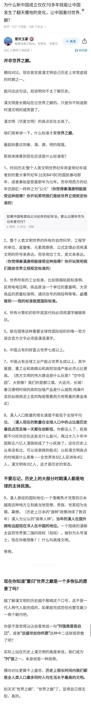

---

## 10

@信号与噪声001

发表于：2026-07-20 09:32

来源：微博

链接：https://m.weibo.cn/status/5322808737403017

谷歌最强模型 Gemini 3.5 Pro 在 7 月 16 日第三次跳票，当天 Alphabet 股价重挫约 4.4%、一个交易日蒸发近 2000 亿美元市值。

一直被外界看作在稳步追赶 OpenAI 与 Anthropic 的谷歌，这一次在最要紧的旗舰模型上掉了队。Gemini 3.5 Pro 在 5 月的 I/O 大会上亮相，当时承诺 6 月向公众推送，这个节点落空后目标改到 7 月，又被广泛流传的 7 月 17 日期限再次错过，前后三次跳票。据 CNBC 报道，症结出在编码，模型帮用户编写和调试软件的能力低于谷歌自己的预期，公司在 6 月底往训练数据里补了更多编程样本，结果仍被内部形容为令人失望。

跑分能看出这一档的落差。谷歌尚未发布的 3.5 Pro 并没有公开成绩，只能拿它在售的旧旗舰做参照：Gemini 3.1 Pro 在 SWE-bench 停在 80.6%，而对手最新一代、由厂商自报的 GPT-5.6 Luna 在 SWE-bench Verified 已经达到 93%。这一年里 OpenAI、xAI、Anthropic 相继推出新旗舰，本该补位的 Gemini 3.5 Pro 因编码不达标一直发不出来，编码又正是眼下各家 AI 实验室竞争最激烈的方向。

反差就发生在两天之内。DeepMind 负责人哈萨比斯 7 月 14 日在 X 上发表长文，主张 AGI「大概只有短短几年」、冲击力可达工业革命的约十倍；两天后，谷歌自家旗舰再次跳票。对此，谷歌只回应说，正在与合作伙伴测试 3.5 Pro 和一款升级版 Flash 模型，没有给出确定的发布日期。

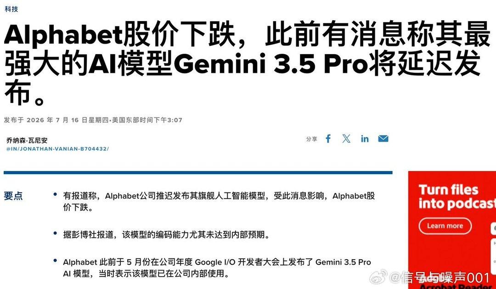

---

## 11

@大象观点

发表于：2026-07-19 04:17

来源：微博

链接：https://m.weibo.cn/status/5322367039442125

蒋方舟论文事件：三次闭合与意外破局

有人疑惑，蒋方舟2019年的硕士论文从未收录知网、仅存人大档案室，沉寂七年，为何突然被查出问题、撤销学位？这件事的关键，从不是简单的抄袭定论，而是一份被层层封存的文本，如何被意外解锁，撕开了学术机制的漏洞。

整件事曾经历三次层层锁死的闭合。

第一次是制度结构性闭合。人大文学院创意写作硕士，无需公开发表毕业论文，文稿仅校内存档、不对外公开，从制度上避开了公开查重与舆论监督，天然没有被追责的通道。2025年8月，这份论文电子版曾被人送至打假博主手中，却因对方不感兴趣被搁置，沉寂十一个月无人过问。

第二次是机构性闭合。2025年8月，清华教授肖鹰实名举报论文造假，此后八个月他通过正规渠道反复反馈，始终没有实质进展。直至2026年4月人大才立案，7月5日首度通报，仅认定存在学术不规范、无学术不端，最终只对导师做出暂停招生一年的处罚，官方调查就此收尾。

第三次、也是最致命的闭合，来自蒋方舟本人。通报同日，她发布逐项说明，逐条辩驳指控，意图彻底平息争议、终结整件事。但正是这份自证文件，成了事件反转的突破口。

7月9日，这份说明被推送至豆瓣博主ilad的公众号。这位普通广告行业从业者本不关注此事，却因文中“凡体泥胎”一词心生疑惑，顺着疑点查阅论文全文。

她发现文中“复制动物”“社群缔结”等表述少见，且同一段落混用“复制人”与全文统一的“克隆人”，判断段落疑似源自台湾文献。

她通过台湾华艺线上图书馆检索，匹配到台大2012年的期刊论文，比对后发现大量文字重合。7月10日，她发布比对截图，此前搁置线索的博主跟进深挖，又查出多处伪原创翻译、未标注引用的问题。

仅八天，人大紧急更正通报，认定9处境外文献抄袭且未标注，构成学术不端，正式撤销蒋方舟硕士学位。

这次破局的核心，并非精准查重，而是捕捉到文本里的“他者痕迹”。抄袭可以抹去出处、伪造页码，但外来文本的语言习惯、专属用词无法彻底同化。一字之差的用词差异，就像无法消除的指纹，暴露了拼接造假的事实。本质上，抄袭永远无法彻底干净，遗留的文本痕迹终会自我暴露。

比抄袭更严重的，是刻意编造注释。涉事论文二十条注释无一标注有效页码，其中五处《弗兰肯斯坦》的引用页码，在原著中根本不存在。抄袭尚且认可原文价值，虚假注释却是彻底的学术敷衍，刻意封堵核查通道、规避追问，是更恶劣的学术投机。

真实注释是主动接受核验、留存纠错空间，而虚假注释是伪造合规假象、彻底封死追问可能。留存余量是学术涵养，封堵余量则是学术掠夺，二者只差一行注释，却天差地别。

更值得反思的是，整套制度性核验全线失灵。2019年，这篇论文顺利通过导师、评议专家、答辩委员会、院级、校级五道审核关卡；后续正规举报渠道长期失效，首轮官方调查更是做出了错误定论。

最终推翻定论的，并非专业学术机制，而是两位普通普通人：一位凭好奇心和推理能力、日均耗时八小时溯源查证的普通博主，一位靠免费工具与日常阅读积累打假、长期遭受网络攻击的自由职业者。

二人都抵触“举报”标签，仅出于本心求真。当制度追问停滞，民间的余量监督便挺身而出。

这件事的深层症结，在于“天才学术流水线”的异化。蒋方舟年少成名，自幼被视作文坛天才，一路享受资源倾斜。而举报者肖鹰，也曾撰文批判“天才韩寒”的包装神话，二人交锋的本质，是对批量制造“天才人设”的质疑。

当下的评价体系，只追捧名望、学位、头衔这类显性成果，却把严谨求证、公开核验、接受追问视作冗余成本。在这种逻辑下，投机取巧的学术拼接，反而成了高效捷径。当事人先是被体系塑造成标杆，最终也沦为自我包装、功利逐利的工具，背离了治学与创作的初心。

极具讽刺的是，这篇问题论文研究《弗兰肯斯坦》，探讨被造之物的困境与人类未来；抄袭的源头文献解读《别让我走》，聚焦被工具化、牺牲化的群体。

两篇文本的核心追问，恰好映照出这场学术风波的本质。风波落幕，但背后的行业与个人问题，仍值得长久反思。

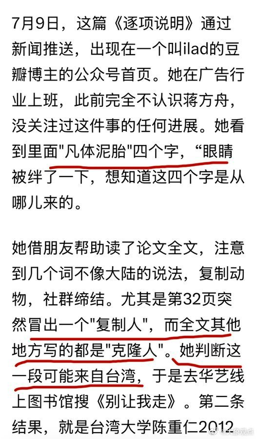

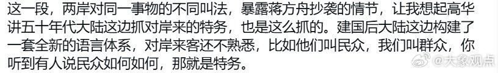

