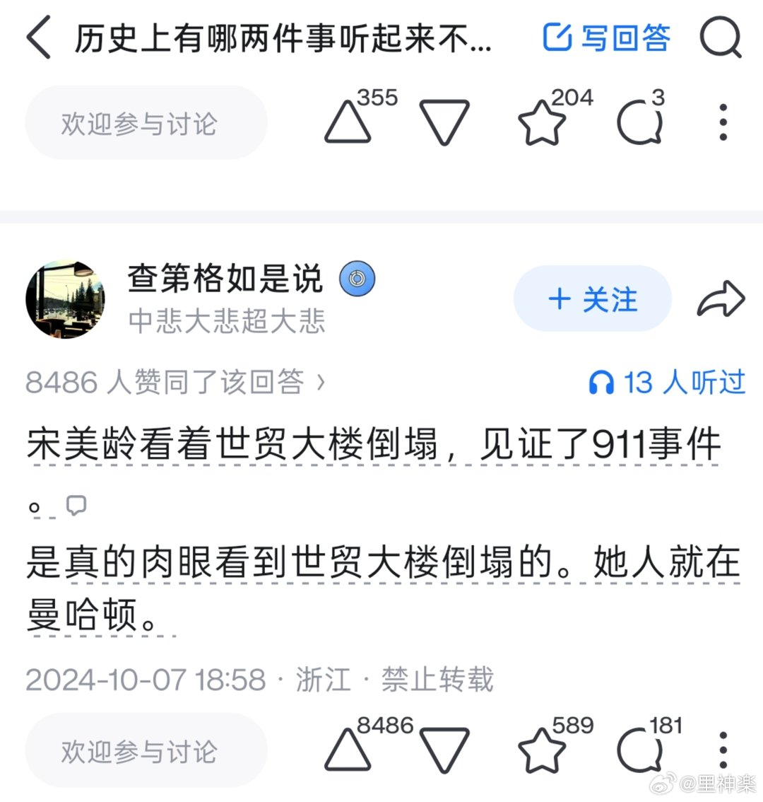
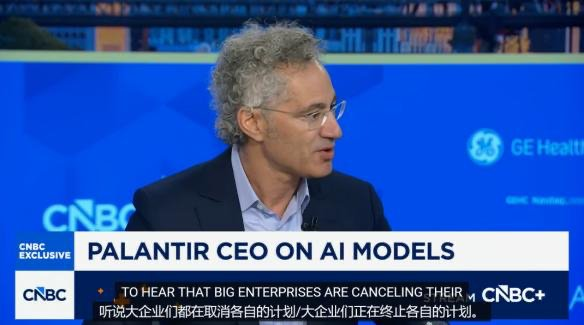
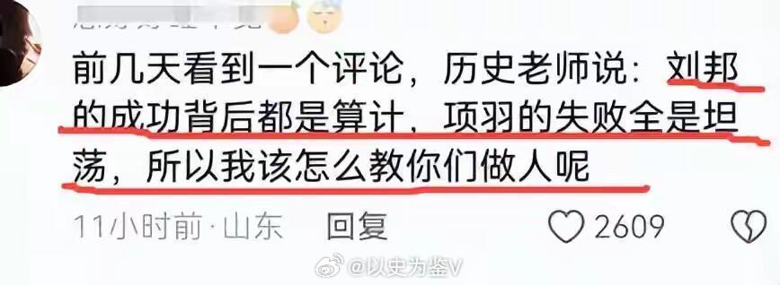
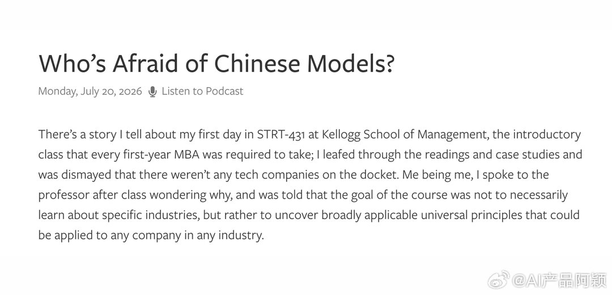
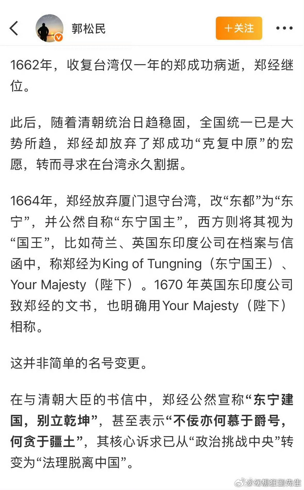
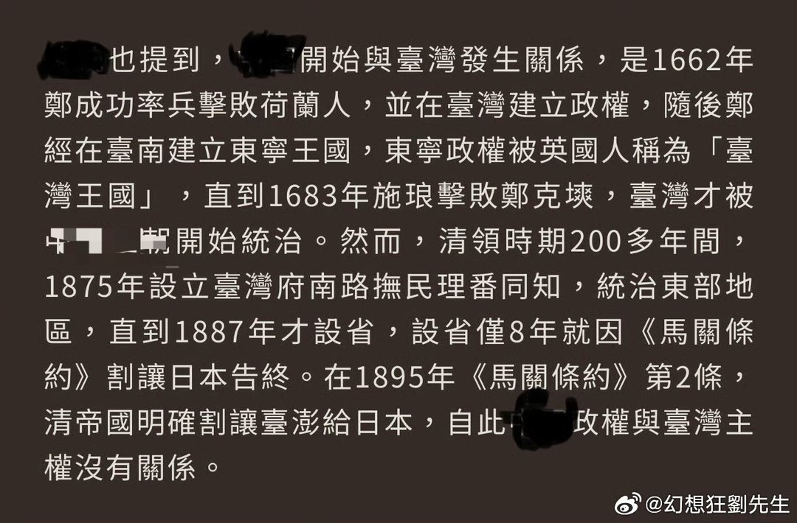

# 2026-07-22

## 1

@蘸盐

发表于：2026-07-21 14:03

来源：微博

链接：https://m.weibo.cn/status/5323239217954928

任天堂成立于光绪十五年（光绪帝18岁时）。诺基亚更早，成立于同治四年。//@悠远得西瓜:宣统？//@蘸盐:理论上讲，光绪皇帝是完全有机会玩到任天堂产品、并且用上诺基亚产品的 查看图片

---

## 2

@36氪

发表于：2026-07-21 14:00

来源：微博

链接：https://m.weibo.cn/status/5323238407412485

【Token收费，不再“天经地义”？】

Palantir应该是硅谷最神秘的高科技公司之一，虽然市值超过2万亿人民币，但业务却鲜少示人。

外界知道的是，当年美军抓住本·拉登，如今以色列的加沙行动，乃至乌克兰战场，背后都有它的身影。

不久前，Palantir的CEO亚历克斯·卡普在媒体的直播镜头前，对着OpenAI和Anthropic等AI大模型公司直接开怼，直指这些大模型公司的商业模式“出了大毛病”。

要理解卡普的言论，就必须先理解 Palantir 是一家怎样的公司、卡普究竟是一个怎样的人，以及这番舆论战之下，AI大模型的商业模式是不是真的有问题？

\#氪君领读\#

1、哲学“狂人”，掌舵CIA孵化的“数据晶球”

在政府端，Palantir的核心平台Gotham服务于国防与情报部门。在商业端，Palantir凭借Foundry平台及AIP，为能源、金融、制造等行业的头部企业提供数据整合与决策支持。

2、攻击之外，AI大模型动了谁的奶酪？

长期以来，Palantir的核心竞争力是通过统一数据图谱将所有数据关联起来，最终输出可供人类决策的洞察。但当大语言模型横空出世后，Palantir的技术壁垒突然面临崩解的风险。

3、价值落地，AI大模型将迎关键转折

此前，按Token计费是大模型商业模式的基本规则。直到卡普提出：“如果AI真的能替企业挖到黄金，为什么AI公司不按挖到的黄金分成，而是按消耗的铲子（Token）收费？”

详情请阅读：Token收费，不再“天经地义”？，本文来自“铑科技”，作者：鸿辰，编辑：头头。

---

## 3

@以史为鉴V

发表于：2026-07-21 12:34

来源：微博

链接：https://m.weibo.cn/status/5323216945158182

\#历史知识\#\#历史人物\# 如果真的有历史老师给学生说这句话，我觉得这位历史老师根本不配当老师。

楚汉争霸天下，是中国历史上最波澜壮阔的一幕，对于大汉能战胜西楚的原因，历朝历代都有人去总结经验。

刘邦能战胜项羽，靠的不是武力，而是综合实力的碾压。

对人才，自己人就不说了，刘邦能大力提拔一个项羽方面的小将当大将军，统一指挥汉军；

陈平在项羽手下的时候天天担心项羽不重用自己还要杀了自己于是跑到刘邦麾下……这就是刘邦的坦荡，是刘邦的气魄；

而项羽呢？就一个范增，还不听他的建议，对下严峻，赏罚不明，导致大量人才叛逃。

甚至鸿门宴上，跳出来唱反调的都是姓项的，自己亲族都团结不了。

对百姓，刘邦能约法三章，废除秦法；项羽呢？只知道杀杀杀烧烧烧……

政治上，项羽更是只考虑恢复以前分封制，自己当霸王，于是害死义帝，结果分出去的诸侯马上反叛，项羽四处救火；

而刘邦打着为义帝报仇的旗号，联合诸侯，道义上天然占据上分；

甚至在军事上，项羽战术非常厉害，但是战略上啥都不是，他和刘邦打的时候，战役上屡战屡胜，但是战略上韩信已经平定北方多国……

最后被刘邦韩信十面埋伏……

哪怕非常推崇项羽的司马迁都说：“自矜功伐，奋其私智而不师古，谓霸王之业，欲以力征经营天下，五年卒亡其国……乃引‘天亡我，非用兵之罪也’，岂不谬哉！”

东汉班固直接说项羽：“上嫚下暴，惟盗是伐……诛婴放怀，诈虐以亡。”

司马光说项羽：“项王喑叱咤，千人皆废，然不能任属贤将；此特匹夫之勇耳……此所谓妇人之仁也。”

近代蔡东藩说：“坑降卒，杀子婴，弑义帝，种种不道，死有余辜，彼自以为非战之罪，罪固不在战，而在残暴也。”

我们承认项羽的勇武霸气，但是也要承认项羽的暴戾和政治人文上的严重不足，把刘邦的赢归结为“算计”，把项羽的失败归结为“坦荡”……这算啥历史老师\#热点观点\#

---

## 4

@AI产品阿颖

发表于：2026-07-21 09:30

来源：微博

链接：https://m.weibo.cn/status/5323170569259454

硅谷开始害怕中国模型。

Kimi K3 确实非常火，在 X 上引发了轩然大波。能明显感觉到，硅谷很多人多少有点不可思议。

因为在 K3 之前，大家普遍觉得，开源模型和硅谷两家头部闭源模型之间的差距正在拉大。

特别是 Anthropic 发布 Fable 5 之后，各项指标大幅领先，当时国内模型离它确实还有一段不小的距离。

结果 K3 突然追了上来。

而且这还没有结束。阿里的 Qwen 新一代模型也要发布，据说智谱的 GLM 5.3、DeepSeek V4 正式版都在路上。一浪接着一浪，很自然就会让人产生一个问题：

开源模型追得这么快，会不会威胁到硅谷前沿模型公司的商业模式？

上午看了 Stratechery 创始人 Ben Thompson 的文章，他对这个问题的分析整体还是比较到位的。

结合他的观点，也写一下我最近和很多人讨论之后的理解。网页链接

---

## 5

@李楠或kkk

发表于：2026-07-21 05:15

来源：微博

链接：https://m.weibo.cn/status/5323106444905470

1

中国禁止访问 Google，这是你家小区后面有条路通向 Google，物业给锁上了。

2

Claude 禁止中国用户访问，这是你家小区西边有条路通向 Claude，物业没锁，但是 Claude 自己给堵上了。

3

而如果中国限制开源模型，这是你家小区外面有人送，注意，是送空调。

然后小区检查你不能把送的空调运进来用，而且，可能还去你家里看用的是不是外面送的。

当然，热也不能让你热死，小区内有空调，卖你，还别嫌贵，这是高贵的对人类安全而且闭源的。

这完全是三种不同的情况，美国国会老爷们是蠢货，搞不清楚。但是我看有些评论里也给混淆了。

当然，中国是不会禁止开源项目 的，你可以在阿里云上部署 linux ，也可以在自己的 mac 上跑 llama，都没有任何问题。

国会的白人老爷们如果真的能想出来，送空调都禁止的招数。。。

那就别吹空调呗，欧洲不就这样吗。。。

---

## 6

@王鹤诗

发表于：2026-07-20 23:02

来源：微博

链接：https://m.weibo.cn/status/5323012418831256

宣传画《从小爱海洋》 ，绘画：陈辅，上海人民美术出版社出版，1980年10月第一版。

---

## 7

@宝玉xp

发表于：2026-07-20 17:41

来源：微博

链接：https://m.weibo.cn/status/5322931800375921

Anthropic 虽然讨厌，但是模型能力还是挺强的，对我来说 Opus 4.6 的写作、Opus 4.8 的 UI/UX 设计和 Fable 5 对于疑难问题的处理目前都是难以替代的。

昨天我在测试转录一个播客音频的时候，时间戳总是对不上，我把这音频传到火山引擎云端转录，一样会时间戳对不上。

问 GPT 5.6 Sol，它认为是 VAD 切分的问题，修复后仍然不行。

问 Fable 5，它定位到是因为 MP3 是 VBR（变码率）文件，导致时间估算失败。简单修改就解决了这个问题。

类似的问题遇到过几次，比如上一次在做 Speaker 识别，性能不好，也是 Fable 5 搞定的，之前其他模型效果并不好。这是当时提交的一个PR（网页链接 ）

像 Fable 5 这样的模型在普通场景和其他模型看起来似乎差距不大，极端场景才能看出来差别。

---

## 8

@幻想狂劉先生

发表于：2026-07-20 07:35

来源：微博

链接：https://m.weibo.cn/status/5322779211857969

\#澎湖海战 撤档\#

这个电影最大的问题，是将现代国家的政治军事目标强行对标任何古代历史事件去获得合法性。既“古代发生的一切都是为了现代”，“现代发生的一切都可以在古代找到依据”

但问题在于，古代的“天下”和现代的“世界”，古代的“王朝”和现代的“国家”有本质上的区别，将二者强行耦合必然带来历史意识形态上的扭曲，以及随之而来的社会性思想混乱、矛盾和冲突。

我举个例子，将古代与现代强行耦合之后，那么用现代观念去“对齐”古代，就要按现代观念对标谁是正义，谁是邪恶，谁是统一，谁是分裂。这就导致一些维护该片的大陆网络人物，居然要靠复读赖清德的“台毒十讲”去完成这一过程。

注意，左图为大陆某网络人物对电影中“明郑政权”的定义话术，右图为2025年6月赖清德在“台毒十讲”中针对明郑政权的话术，二者从观点、论述，甚至引用“史料”上都是几乎完全一致的。而这正是被国台办等多个部门公开批评的历史谬论。

一部以“统一”“团结”为主题的“历史电影”，最后要到赖清德那里去寻找合理性，不能不说是一场意识形态的灾难。

这种辉格式的政治隐喻只能理解为片方为了商业利益玩政治擦边的自作主张，他们根本无法预测这种做法带来的严重后果，当然也不可能为此负责。撤档是最好的结果，如果还想不明白，不如思考以下三个问题。

对于一部仅仅宣发就引发轩然大波的“历史电影”来说：

1、现代国家政治军事目标的实现，是否有必要一定去古代王朝的历史中“严丝合缝”的寻找合法性？

2、在该片的宣发引起巨大争议和矛盾之前，明清之争、阶级矛盾与民族矛盾之辨有没有这么高的热度和烈度？

3、在该片宣发引发争议之后，网络舆论是变得更加撕裂和对立和混乱了，还是变得更加统一、团结了？它到底是凝聚了新的共识？还是把现有的共识都撕裂了？

