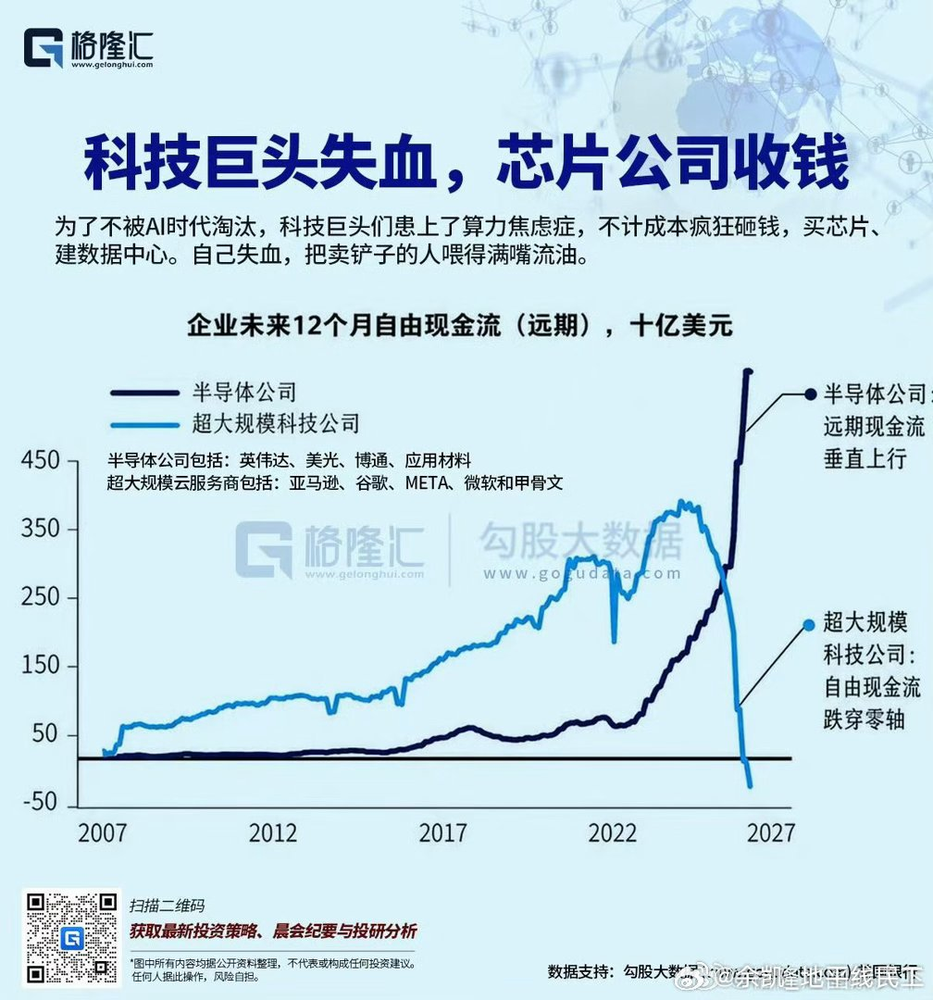
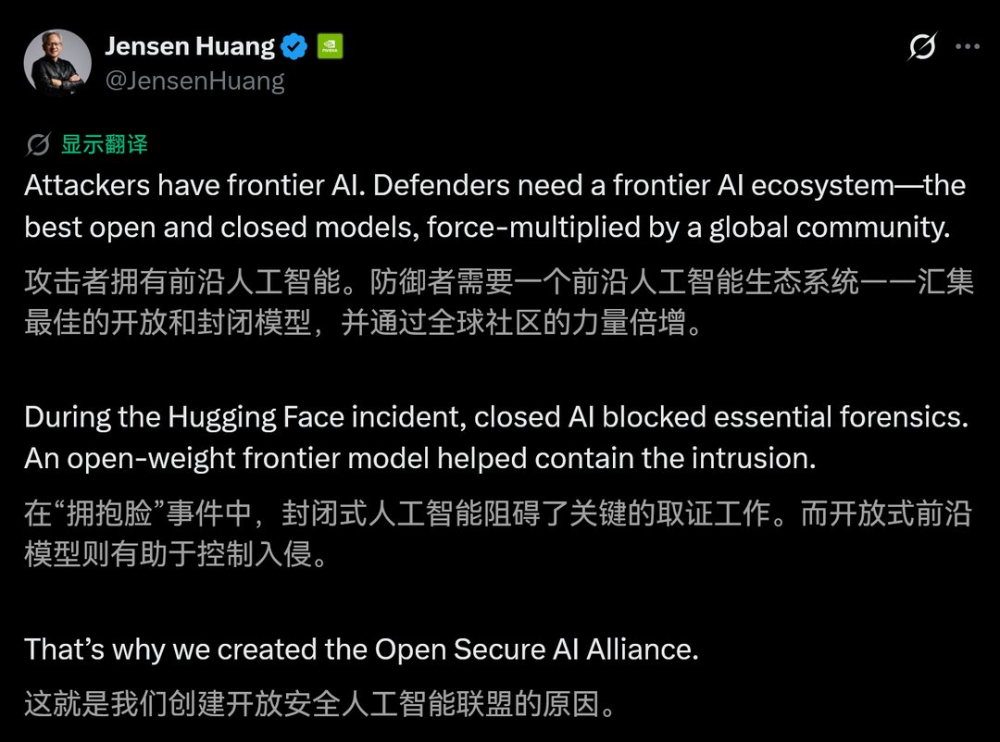
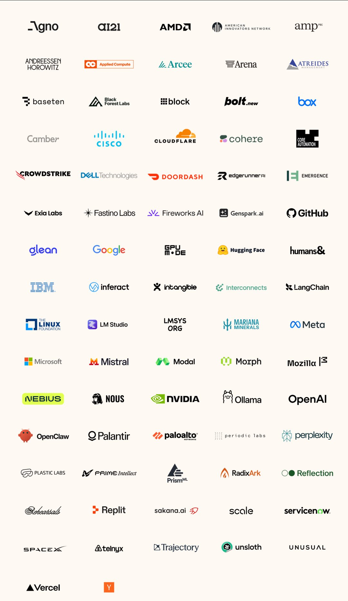
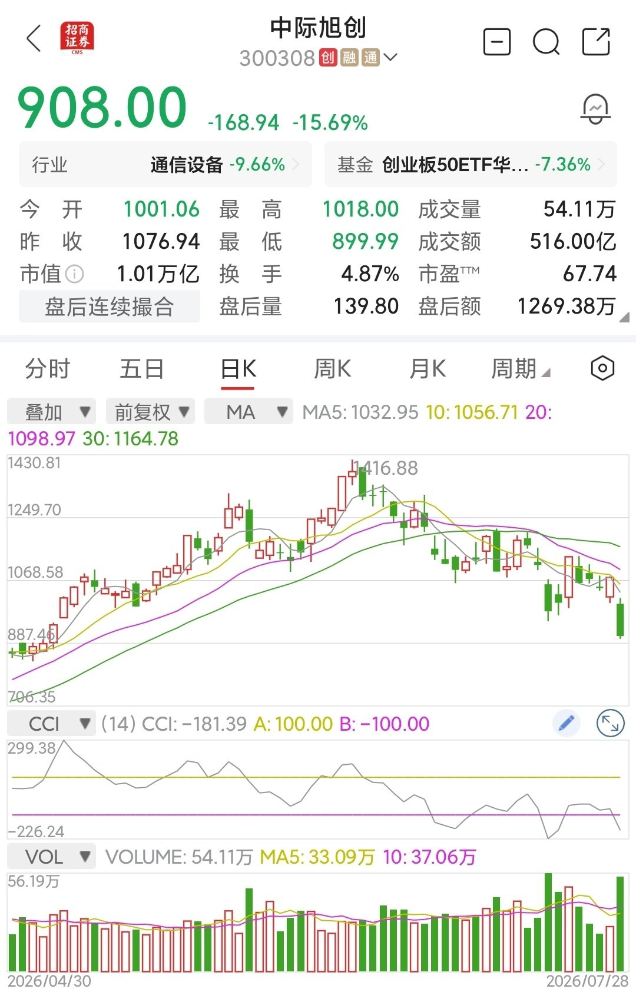
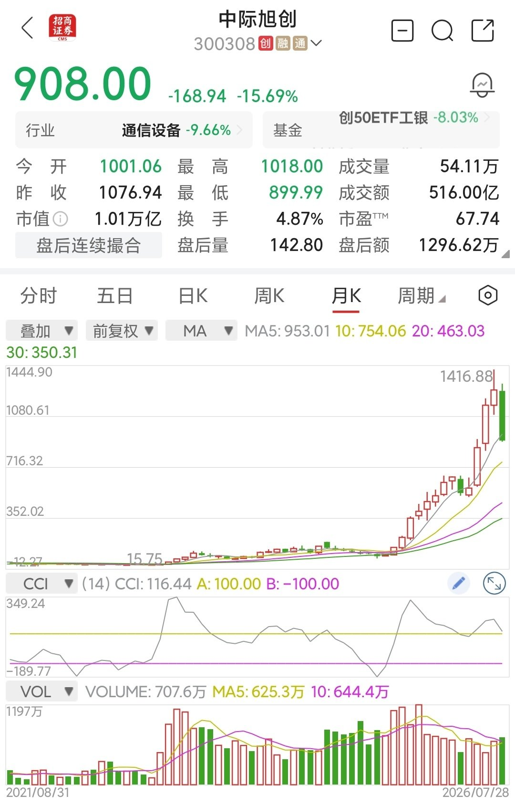
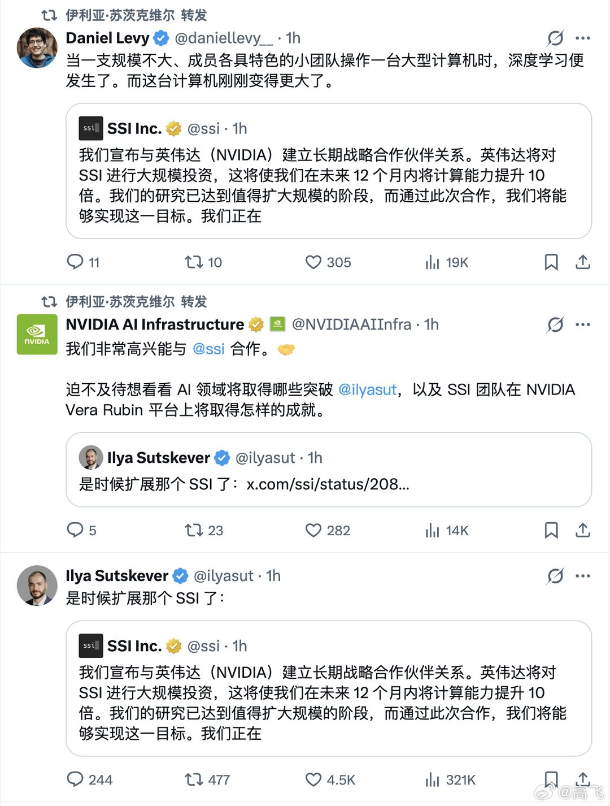
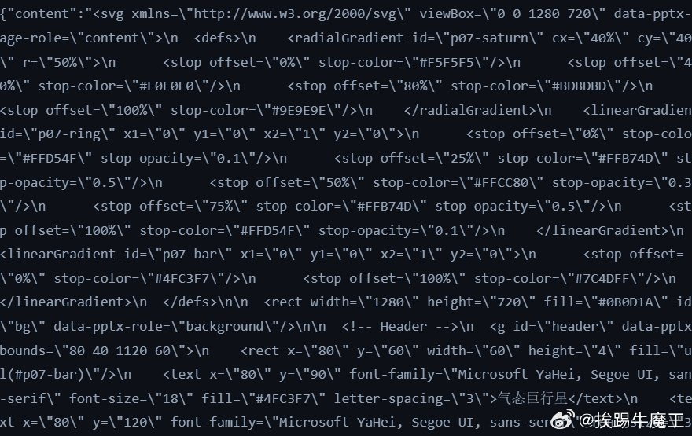

# 2026-07-29

## 1

@余凯_地平线民工

发表于：2026-07-28 10:13

来源：微博

链接：https://m.weibo.cn/status/5325718211004717

最近AI的发展让我想起了圣经旧约里关于通天塔（巴别塔）的故事。本质上AGI的目标是“逼近世界的真相”，这个和建造通天塔去触及上帝差不多了，需要各种“建筑材料”:  芯片，内存，PCB，光模块，液冷，…  但是我怀疑这对AI 玩家来说是个无止尽消耗资源的游戏 …

---

## 2

@蚁工厂

发表于：2026-07-27 11:31

来源：微博

链接：https://m.weibo.cn/status/5325375354964882

老黄的第二条推，是关于前几天的OpenAI模型攻击HuggingFace，然后HuggingFace用GLM5.2模型协助防御的事情。

老黄说在HuggingFace事件中，封闭式人工智能阻碍了关键的取证工作。而开放式前沿模型则有助于控制入侵。所以我们要搞这个开放安全人工智能联盟！

PS：大哥有没有注意到OpenAI就在你这个联盟里

\#AI模型需要划定开放边界\#

---

## 3

@理记

发表于：2026-07-28 08:56

来源：微博

链接：https://m.weibo.cn/status/5325698665549929

远离女粉是很不容易的，一方面女性群体消费高，决策占主导，远离女粉意味着远离商业变现。另一方面，哪个男人不喜欢投怀送抱的感觉呢？

又跟钱远离，又跟人性远离，这真的很难做到。

但是男博主跟女粉深接触的风险又的的确确很高，为啥很高？

在网络上男人会不由自主的美化自己，吹牛x，美颜，高谈阔论。

当然也的确有真实才华的。但无论怎样，女性具有爱幻想的特质，会自动把男大V想象成一个什么样的人。

男大V究竟是什么样的人不重要，重要的是把你想象成什么样，而且每个人想象的还都不一样。

想象成恶人倒是好办，反正不接触就是了。

但凡深接触的，都是把男大V想象成很完美的形象。

一旦见了面，那就是想象的形象崩塌的开始，如果再发生了关系，想象会迅速破灭。

想象破灭后，曾经喜欢的多深，恨的就有多深。

我不是说所有女性都这样哈，这只是女性人群中的万分之一，但落实到男大V脑袋上，那就是百分之百。

饶谨这个事情，女方直接报了强健，这就迫使公检法出面做了评判。

如果是陈述饶谨pua她，官方可就不会出来评判了，饶谨一样塌房。

世间哪有什么柳下惠啊，物种繁衍是人类最底层的需求，只能物理隔离，这样对彼此都好。

实在隔离不了的，最好就是养胃。

色字头上一把刀。

---

## 4

@风云学会陈经

发表于：2026-07-28 07:22

来源：微博

链接：https://m.weibo.cn/status/5325675197106795

\#全球芯片股暴跌\#

来看看中际旭创这个放量暴跌，感觉像是抱团瓦解了

今天是放量暴跌15.7%，很大的跌幅。感觉不是跌了便宜了，而是更危险了。

图二，一年前还是90多的价，现在涨了十倍。对一些资金来说，只要有人接就会卖，都是利润，跌再多都卖。看到上面套牢盘那么多，业绩再好也不管了，套现利润再说。

抱团瓦解了，主要意图就会是兑现利润，这是第一大逻辑。产业发展，光模块如何辉煌，那再说了，股市里兑现利润是真的。

所以，真正危险的反而是一些业绩很好的股。业绩不好，还翻不了十几倍。好业绩，才有人去买，成交几百亿。

所以，股市很残酷，好的业绩有时就是用来害高位看好的股民朋友的。你看好公司的业绩，低位拿筹码的看好你的钱。

全球估计都是这个逻辑，一顿暴跌，套现需求大于业绩利好。

---

## 5

@高飞

发表于：2026-07-27 15:50

来源：微博

链接：https://m.weibo.cn/status/5325440600508812

\#模型时代\# Ilya发推：是时候扩展了。毫无疑问的今天的big news，做个大致解读。

一、详细的报道来自WSJ，看了一下，主要这三点：

1、英伟达向伊利亚·苏茨克维创立的Safe Superintelligence进行“实质性”投资，并作为合作核心，向其提供足以将计算资源提升“一个数量级”的旗舰GPU算力。此前该公司主要依赖谷歌TPU，这一转变直接体现了英伟达在AI热潮中通过资本与算力绑定，争夺顶尖实验室客户的战略意图。

2、该交易与英伟达此前对米拉·穆拉蒂创办的Thinking Machines Lab的类似投资一脉相承，说明芯片巨头正系统性地把前OpenAI核心人物及其新实验室纳入自身生态。这既帮助初创公司突破算力瓶颈，也强化了英伟达在高端客户侧的护城河，抵御竞争对手。

3、Safe Superintelligence成立仅两年即获约20亿美元融资、估值约300亿美元，完全建立在苏茨克维个人声誉之上。公司坚持“直达式”冲刺安全超级智能，并明确表示研究聚焦人脑功能中被忽视的方面；而苏茨克维本人近期已公开质疑单纯扩大现有范式是否足够，这为外界理解其技术路线与行业主流缩放路线的分歧提供了关键信号。

其他就是Ilya和SSI的两条推文，内容：

- 我们宣布与英伟达（NVIDIA）建立长期战略合作伙伴关系。英伟达将对 SSI 进行大规模投资，这将使我们在未来 12 个月内将计算能力提升 10 倍。

看起来信息不多，但是藏了很多东西。好巧不巧，前两天投日者记录曝光的时候，我写了一个分析，说比较期待看到Ilya的进展，这就来了。

二、几个比较值得解读的话：

1、Ilya说是时候扩展了。

意思是：算法已经固定了，所以接下来可以进入Scaling Law阶段了。

有意思的是，2024年他在NeurIPS 2024上，亲口说Scaling Law可能已经撞墙，但是他说的是基于数据资源消耗殆尽的Scaling Law有困难，不是Scaling有错，他讲的大致如：

-人类生成的互联网数据有限，“只有一个互联网”。

-未来系统将具有真正的 agentic 能力。

-系统能够推理，并从有限数据中理解事物。

-推理越深入，行为越难被人类提前判断。

-人类祖先的脑—身体比例曾出现新的缩放轨迹，AI 也可能找到新的 scaling 方式。

或许，SSI真的找到了某个新算法。

2、英伟达将向SSI投资。

在上一次SSI官宣新闻中，谈了谷歌TPU合作，这次谈的是Nvidia，这个信号的信息量更大。

TPU和GPU最大的区别，是TPU是专用芯片，针对既定算法优化；而GPU，准确说GPGPU，可以针对任意算法编程。

所以，一方面和英伟达合作可能是因为后者提供了资金，但是更大的可能是SSI的算法和当前LLM路线有较大差异，所以需要AI通用算力。而如果真是这样，是对英伟达的极大利好（也包括AMD）。

显然，算法越发散，AI通用算力的价值就越高。

3、计算量扩大10倍。

10倍也不是一个随便说说的数字。按照默认规则，计算量扩大10倍，往往意味着一个大的版本号。如果是LLM，那么模型参数和训练数据大致同步放大3倍左右（按Chinchilla）。

4、研究聚焦人脑功能中被忽视的方面。

这句话也有意思，因为如果把现在的 LLM 看成对新皮层和前额叶部分功能的模拟，它已经会学习知识，也能暂时记住问题并进行推理。

人脑接下来还有啥，现在LLM基本没涉及呢，还蛮多的，随便列举几条：

-下丘脑和岛叶，它们根据饥饿、疼痛、疲劳等身体状态产生行动目标；

-海马会在睡眠中整理当天的经历，并把重要内容转成长期记忆；

-蓝斑核等神经调质系统则会让整个大脑进入专注、警觉或探索状态。

这个具体就猜不出了，看之后进一步消息吧。

5、最后收一个尾。

是不是一定能取得丰硕成果？

当然不一定。大家还记得GPT从4到4.5吧，半个版本号，按照当时的行规，背后也是一个计算量的巨大升级，模型的文笔取得重要进步，但是综合智力水平，并没有有效提升。

但是，既然决定扩大10倍计算量，而且到了发新闻的程度，所以早期既有算力训练中，一定是非常积极的信号的。Ilya也是一个低调的人，这么大张旗鼓，英伟达官微也下场。所以总体而言，还是相对乐观看好。

---

## 6

@洪广玉

发表于：2026-07-28 15:05

来源：微博

链接：https://m.weibo.cn/status/5325791651174494

去年《哪吒2》最火的时候，我就对这部片子评价不高，除了证明中国的电影工业水平很强，找不出多少优点。一年过去了，更证明这部电影名过其实，无论故事剧情表现手法和审美，都没有给电影行业留下什么有价值的东西。

《哪吒2》票房大卖，对于电影行业如何定位、评判一部电影，会造成很大干扰。

---

## 7

@挨踢牛魔王

发表于：2026-07-28 15:03

来源：微博

链接：https://m.weibo.cn/status/5325790994500804

最近为什么发微博少了。

不就是因为chatgpt拉闸，claude封号，kimi k3，glm 5.2买不到，deepseek不发正式版，搞得我这边的天才程序员沉默了。

有些问题，只能是我用古法编程来托底了嘛。

话说deepseek正式版啥时候发啊，这都快到8月份了，都不是7月下旬了。 

\#当我失去AI开始古法编程时\#

