# 2026-07-30

## 1

@信号与噪声

发表于：2026-07-29 15:13

来源：微博

链接：https://m.weibo.cn/status/5326155974445517

韩国股市暴跌35%后，涨幅仅剩200%+

美元计价的可投资ETF

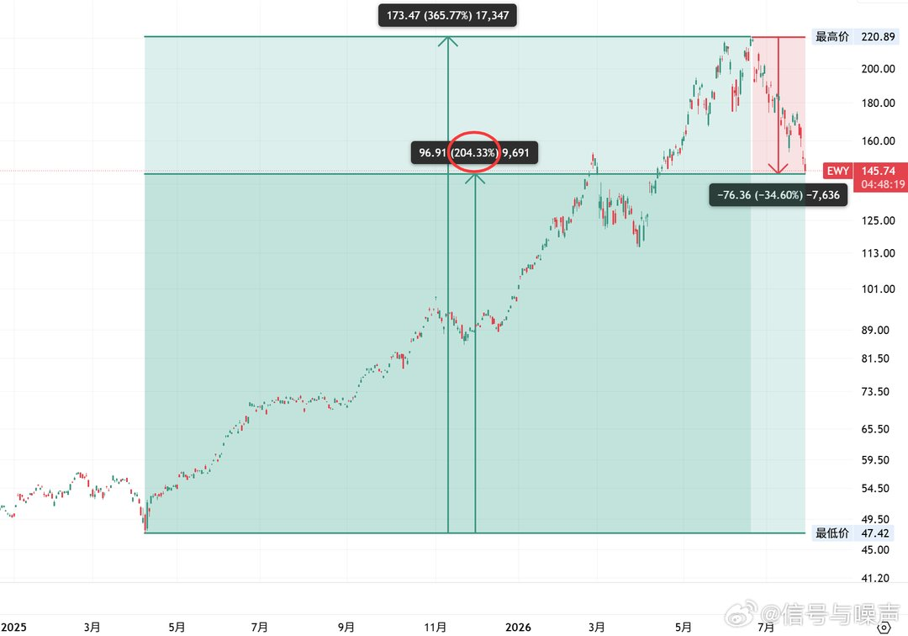

---

## 2

@Jokielicious

发表于：2026-07-28 14:09

来源：微博

链接：https://m.weibo.cn/status/5325777589505262

刚刚在X看到一个令我背脊发凉的事情……

美国的AI 公司正在大量购买稀有的绝版书籍，通过高速机器扫描它们，这些机器会切开书脊，然后将原版书籍销毁？？？？？？

为了获取“干净”的训练数据（尤其是2022年之前出版的书，里面几乎没有AI生成的“垃圾文本”，可以避免模型崩溃），AI实验室通过中间商（如ISBNdb等平台）批量采购二手书、绝版书甚至珍稀书籍，订单规模可达成千上万甚至上百万本。买家身份通常保密，并签保密协议。

一些书商（尤其是欧洲二手/古董书商）报告说他们最近收到大量异常订单，深夜下单、随机挑冷门专业书、不问成色、不议价。有些几乎只剩几本的地方史、土著语言文献、冷门科学著作等，可能就这样被毁掉了？？？？

扫描方式是用液压切刀切掉书脊，把散页送进工业高速扫描仪，扫描完后原书直接粉碎或回收。Anthropic（Claude的开发公司）在内部“Project Panama”项目中就这样做过，据法庭文件显示销毁了约200万本实体书。

可以在美国联邦法院在相关版权诉讼中裁定中看到Anthropic合法买下了实体书并销毁了原件（只留下一份数字拷贝），这属于“合理使用”（fair use），不构成侵权。这反而形成了“法律奖励销毁、惩罚保存”的奇怪激励——如果你扫描后还留着原书或公开分享扫描件，法律地位反而更弱。

\#海外新鲜事\# \#ai公司 原版书籍销毁\#

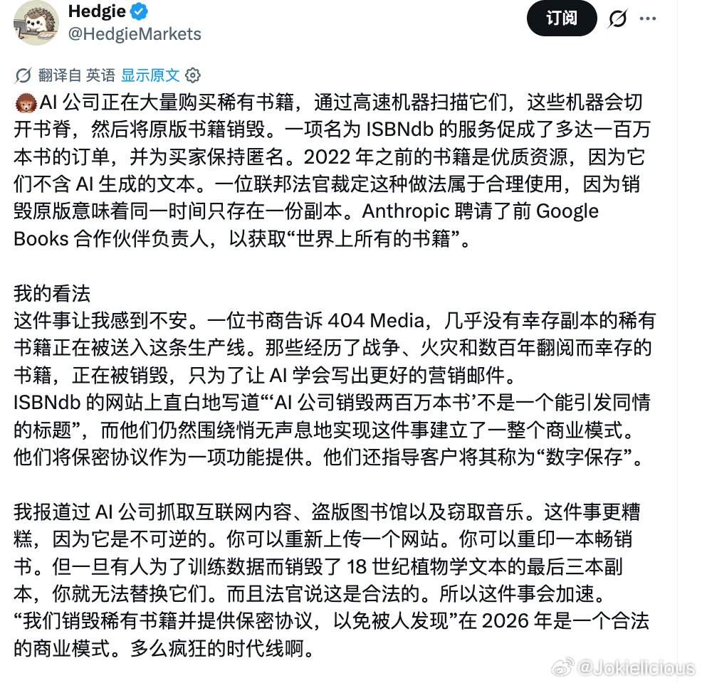

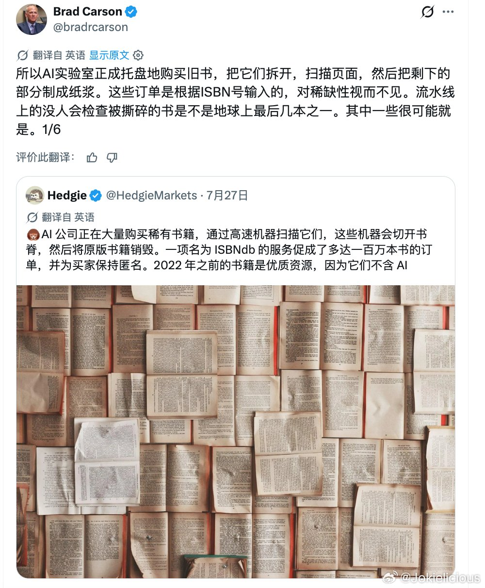

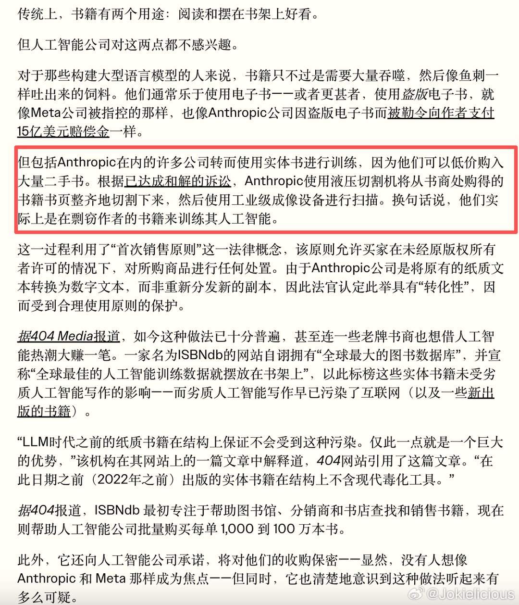

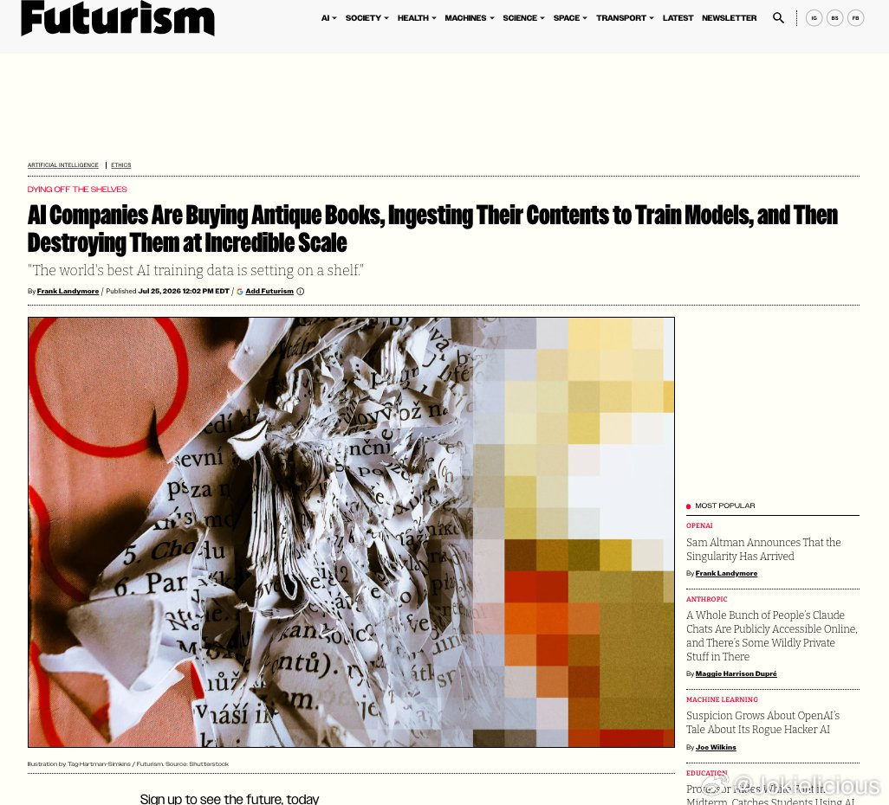

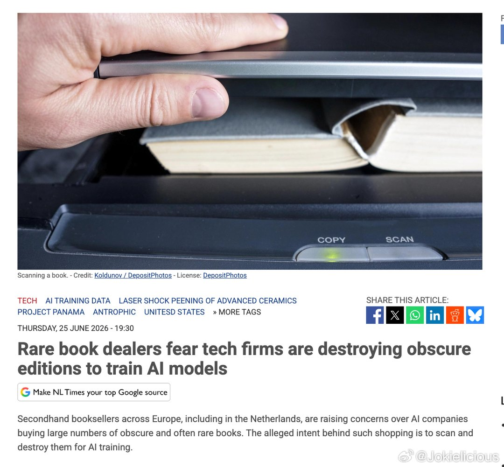

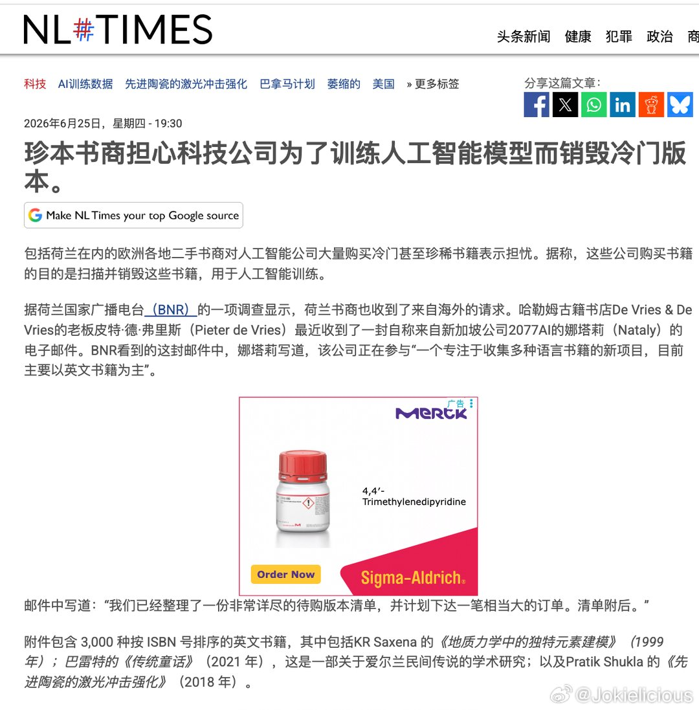

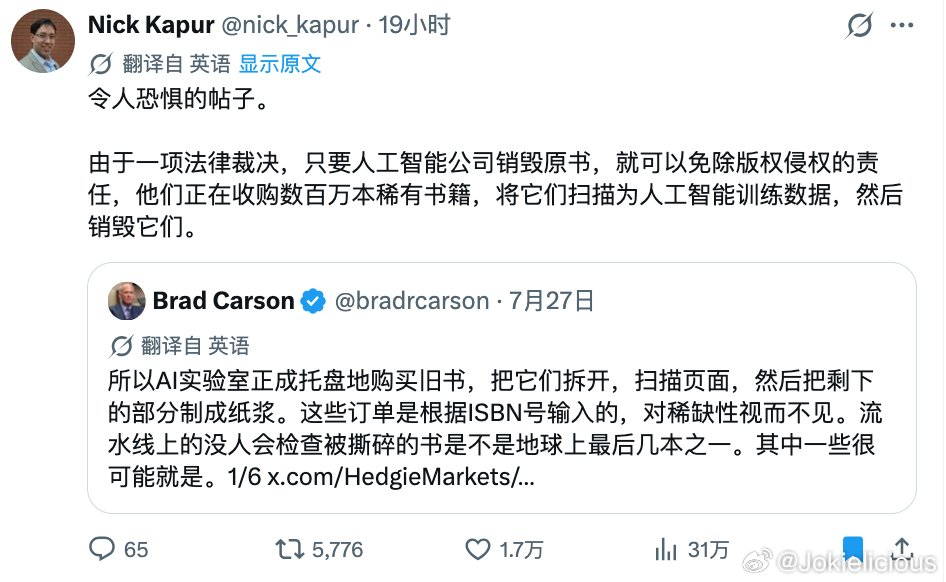

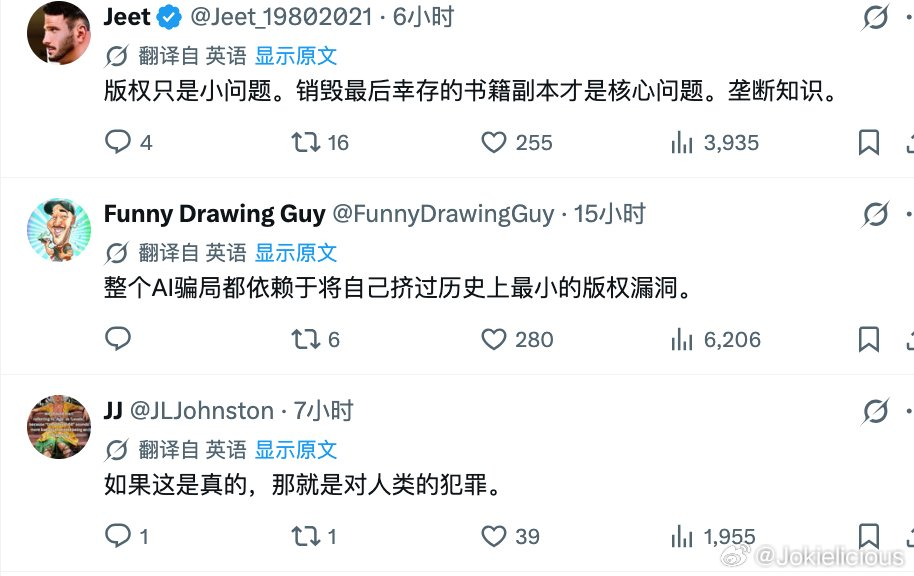

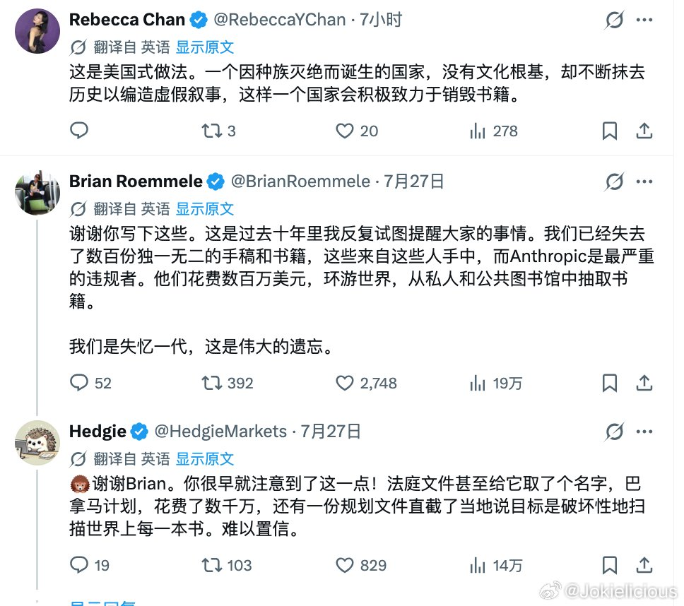

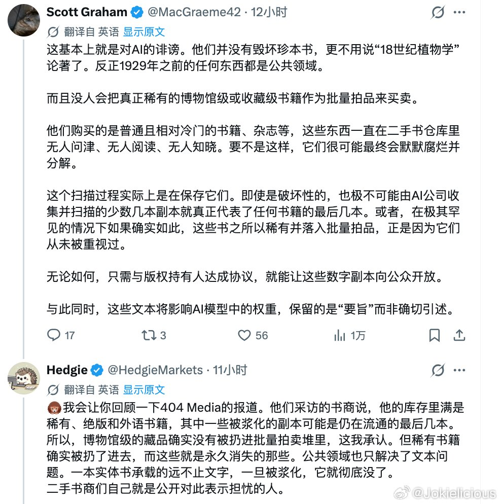

---

## 3

@中华之鹰01

发表于：2026-07-29 15:00

来源：微博

链接：https://m.weibo.cn/status/5326152610350891

如何看待黄文政，易富贤等人口学家?

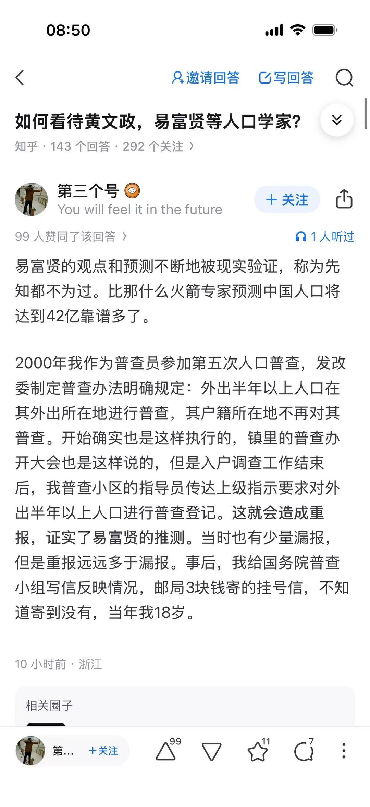

---

## 4

@卢诗翰

发表于：2026-07-29 14:58

来源：微博

链接：https://m.weibo.cn/status/5326152107035418

我一直说，性别叙事时代，我们媒体工作者如何讲好故事，尤其是左翼叙事，是一个极大的挑战

很多人不以为然，但这次菲尔兹奖以及围绕王虹的报道，大量媒体的翻车，直接就体现了这个问题。

从前两天起，我的首页就刷到大量博主吐槽传统媒体对王虹报道的，比如广西姑娘，小镇逆袭，还有人觉得关注科学家卡地亚首饰的都是低认知，甚至浙江宣传那篇“包容王虹”都被拉出来吐槽。

很多人把原因归结于媒体水平不够，还有的干脆指责我国对女性充满歧视，不愿意夸奖女性。

这就是典型的，传统左翼道德叙事无法兼容新时代女性叙事

我国宣传系统长期存在用道德叙事取代绩效叙事的习惯，

典型案例就是昨天我说的陈景润，你们可以去翻一下陈景润的报道，

第一个故事，陈景润因为思考太过专注，错过了理发店排队

第二个故事，陈景润吃馒头配咸菜在图书馆看书，因为过于沉迷错过下班铃声，被关在图书馆里。

是不是不可思议，这两个故事听起来甚至像在黑陈景润

数学家的报道不应该聚焦于他解决了什么问题，有什么实际作用吗？

你这又是错过理发又是被关图书馆，和数学研究有什么逻辑关联？哪来的营销号瞎扯？

但这是中科院的专栏报道

类似的还有焦裕禄，焦裕禄上过哈工大，还参与研制过全国首台新型卷扬机，没想到吧？

焦裕禄属于高级知识分子，还是兼顾理论和实践的六边形战士。面对兰考恶劣的自然环境，他并没有搞什么人定胜天的路子，他先后抽调了120个干部、老农和技术员，组成一支三结合的“三害”调查队。发大水的时候，别人往回跑，他带着人追着洪水看流向，刮大风的时候，冲进风口查风速。全县84个风口、1600个沙丘，他全摸了一遍，每一步都脚踏实地，最后才提出治理方案。

但现在你去翻焦裕禄的报道，大量篇幅集中在，病痛中用钢笔顶着肝部继续工作~

还有李四光那个打了补丁的衣服

衣服打补丁非常感人，但谁能说明一下，衣服打补丁，和地质工作，有什么逻辑上的联系？

这还不是个例，你去搜一下就会发现，很多科学家院士的报道，都有衣服打补丁的描述，且往往占据大量篇幅，很多甚至是在标题上强调。其频率之高甚至会让人怀疑，衣服打补丁对科研工作是不是有神秘加成。

事实就是，在过去几十年里，我国媒体都习惯用道德叙事取代绩效叙事

陈景润的哥德巴赫猜想非常抽象，记者写起来费劲，大众听起来也麻烦，当年大部分人对数学的理解仅限于勾股定理，能解一元二次方程就属于学霸，偶数素数这些概念更是天方夜谭，你要正正经经科普什么是哥德巴赫猜想，可能两小时也就热身。所以当时的媒体工作者选择了另一个思路，

——陈景润是一个思考起来忘我到走路都会撞电线杆的人

你说这个大众就理解多了，走路会撞电线杆，那他思考肯定非常专注，且必定对数学无比纯粹，这样一个无比专注纯粹的人都费劲证明的题目，什么难度还用说吗？所以哥德巴赫猜想了不起啊。

错过理发和被关图书馆看起来和数学没有任何关系，但实际上，这是当时大众最容易理解的宣传路径。

焦裕禄也同理，按理说，一个干部贡献，那肯定是拉GDP数据，增长率数据，各种环比数据满天飞的，这就是绩效思路，拿数据说话，但这是今天。

当时而言，大部分人甚至无法理解GPD这个概念，对基层工作的理解也有一定门槛，那怎么办呢？

——那就写他在极致病痛中，用钢笔顶着肝部继续工作。

你一说这个，大家就也懂了，一个用钢笔顶着肝部，克服病痛也要工作的干部，那是绝对的好干部，

这样的好干部做出来的工作，肯定顶呱呱啊。

李四光的理论对发现大庆油田贡献巨大，但你这又是地壳构造论又是版块运动学，大部分人连地壳是什么都没搞明白，怎么宣传呢？

——那就写他衣服破了打补丁

大众虽然不懂地壳构造学那一套，但你一个院士，衣服破了还打补丁，那肯定是艰苦奋斗的好院士，一个艰苦奋斗好院士提出来的理论，那必然也是无可置疑的好理论，直接赞同就得了。

这就是道德叙事，

很多科学工作者的工作成绩，从绩效角度讲有一定门槛，

但衣服上的补丁，你不用说大众都能理解。

一个打补丁的院士，他的工作一定是好的

一个艰苦作风的干部，他的决定一定是对的

崇祯有大量离谱操作，但只要最后一死，那就是皇帝的本意是好的，都是东林党拖后腿。

在中国大众的朴素认知中，道德标准几乎直接挂钩贡献成就。

所以在中国语境下，怎么描述一个劳动能手

你要说每小时完成多少件，领先同行多少百分比那都是外行

真正的答案是

他孩子发39度的高烧，他都不回家也要继续工作，

老一辈一听这个就知道，这水平肯定不得了。

极致，忘我，奉献一切

什么大国工匠拿几百块工资，住60平宿舍，都是这个思路的延伸。

我的整个生命和全部精力，都献给了世界上最壮丽的事业——为人类的解放而斗争

你越能证明你为工作付出了一切，奉献了一切，大众眼里你水平越高。

这个宣传思路不能说错，甚至在特定年代有其意义

因为他将新时代的发展成果用传统大众最容易理解的方式进行了传播，

无数人的学术报道启蒙都是来自这里，七岁小孩都能听懂的宣传思路。

但到了2026年，这套思路就出现问题了

首先是当前大众的教育水平，直接说绩效已经没有门槛，GDP多少，发展率多少，大众都能听懂。

其次就是路径依赖，当年媒体是为了便于大众理解，才往道德叙事那套靠，但现在很多媒体，可能是因为文理分科，也可能是因为路径依赖，大众明明已经三菜一汤了，他还在那馒头咸菜，颇有一种没苦硬吃的既视感。

直接结果，就是这两年AI互联网报道的全面崩塌。

中美两国这几年在AI互联网领域可以说是皇城PK，日韩欧洲也都认可中美在AI这块的绝对领先，

但时代杂志为美国AI公司做了一堆专题和封面，你见过多少国内媒体的AI报道？创业者采访？美国是在和谁竞争，和空气吗？杨植麟的很多报道甚至是马斯克谈到后才被注意到的

一个重要原因就是传统媒体那套左翼道德叙事，完全不契合新时代的科技新贵。

米哈游宿舍创业，身家百亿，还是文化出海，但因为是游戏娱乐行业，和艰苦奋斗的画风有点冲突

deepseek搅弄硅谷无数风云，因为量化原因，也没法往道德完人那套去

kimi成绩斐然，结果又是玩摇滚乐队，又是庆功宴摆夜店开，也没法套模版。

包括这次的邓煜，你又是动漫又是二次元，传统媒体想把你往馒头咸菜那个模版套都不可能，所以基本一笔带过

还有什么韭菜之王孙割，曼哈顿超人李新野

一个个的，都不按套路出牌

唯一符合模版的是谁呢？韦神

所以理解了吗？很多人说韦神的热度比王虹高是忽视女性

错，大错特错

不是韦神需要媒体，而是媒体需要韦神

不是媒体去给韦神热度，而是当前时代我国媒体的舒适区，就是韦神这样，吃着馒头开水研究世界难题的人物。是他们拿着模版在找人。

你换成别的，什么喜欢摇滚的工程师，喜欢动漫的数学家，就懵逼了

就这一套模版，还是传承几十年的老手艺，短时间内改不过来的，

前几年为什么没人意识到呢？

因为当时是以老登小登的代际矛盾表现出来，还记得要不要囤白酒，要不要结婚的争议吗？新生代完全不认

机灵的人，在那个时候已经敲响警钟了

但当时很多人把其视为新生代年轻人不懂事

韦神的特例又给他们一种错觉，这套叙事好像还可以延续

然后，他们就迎面撞上了今天的女性主义

当代女性主义尤其重视对利益的维护，且比年轻男性要激进的多，

你和年轻男性讲艰苦朴素，奉献自我，大家也就一笑而过

你在年轻女性这边要是敢讲奉献，那是百分之一千被冲

一个如此优秀的女科学家，你居然要求她艰苦朴素？难道女科学家就不能有更好的生活吗！！！你这是打压女性。

一个极其强调奉献，一个极度重视收益，属于火星撞地球了

这也是卡地亚歧视论的由来，不关注科学家成果，就关注其外表，属于过去的常规流程。

院士衣服打补丁代表你艰苦朴素，你艰苦朴素代表你是好人，你是好人代表你的成绩无可置疑。所以报道院士不是围绕成果，而是围绕衣服补丁。

这不是打压也不是歧视，而是左翼叙事下，夸人就是这个夸法

不要说什么媒体不夸人，或者谁家夸人是这个夸法

我可以非常明确的告诉你，过去几十年，左翼叙事下，夸奖一个人就是这个思路

一般人劳动要回报，而他付出一切，却不要任何回报，辛苦几十年住6平宿舍，穿补丁衣服

这证明什么，这证明他脱离了低级趣味，把自己的整个生命和全部精力，都献给了世界上最壮丽的事业

你能做到吗？不能吧，所以你是普通人，他是圣徒，理解这个逻辑了吗？

结果这次遇到一个卡地亚，大脑干烧了，属于本意是好的，执行起来没法看

在大众这边更是引发诧异。

实际上真注意这块的人，在看到脱口秀女演员嘲笑保尔柯察金的时候，就要警惕了

很多人把这个视为奇葩个例，但在我看来，能上脱口秀舞台，已经意味着社会思潮的一定转向。

新生代女性大量不认可保尔柯察金的叙事，辛苦付出那么多年没有回报，还得和工人一块修铁路劳动，这不是歧视是什么？

也就是大国工匠挤6平宿舍，顶级院士衣服补丁这种活，已经完全不适应新生代年轻人

大家难以接受付出和收益不成比例，把科学家一个劲的往贫困户描述更是令人错愕

矛盾在年轻男性这边时，你还可以掏出没有责任心这个挡箭牌

但聚焦在女性学者身上时，叙事层面的冲突就更明显了。

强调奉献的那套叙事甚至连场面上都走不下去了

如何对未来的新生代科学家报道进行价值观升华，可能会是我国媒体即将面对的难题。

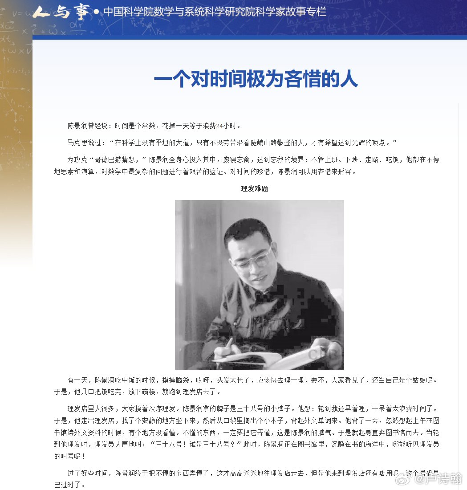

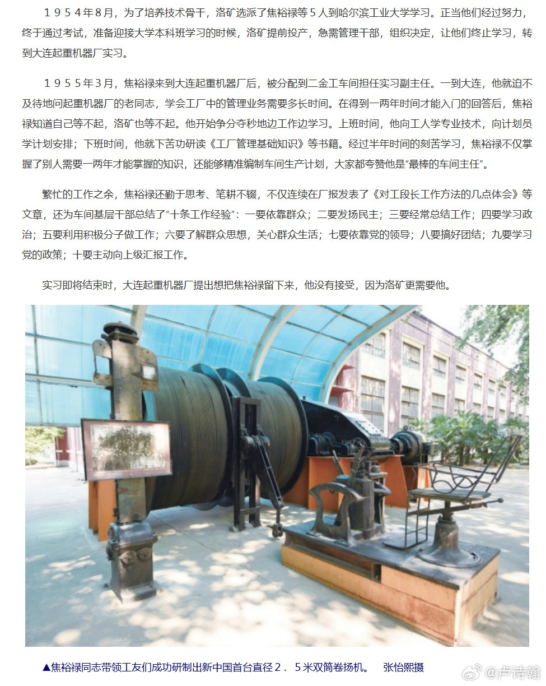

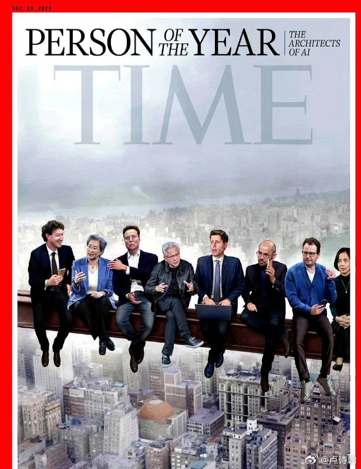

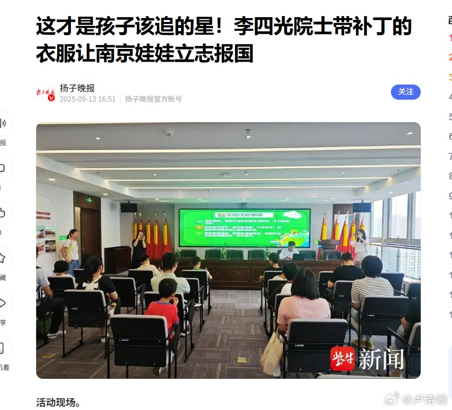

---

## 5

@宝玉xp

发表于：2026-07-29 02:06

来源：微博

链接：https://m.weibo.cn/status/5325958035021348

关于 Agent 的几个判断

X 网友 cellier_ 昨天发了一条帖子，谈了他对 Agent 的三个判断：

> 一是，通用 Agent 会吃掉垂直 Agent。Codex、Claude Cowork、WorkBuddy 这些通用型选手，配合 Skill 和 MCP，就能搞定大部分专业任务。很多 AI-native 应用创业，本身就是个伪命题。

>

> 二是，更开放的会吃掉更封闭的。模型能力趋同之后，会变成可路由的基础设施。Agent 应该让用户自由选择模型，甚至支持本地部署和自由迁移。

>

> 三是，更下沉的会吃掉更傲慢的。Codex、Claude、DeepSeek 背后的团队都以 AGI 为目标，不太愿意做脏活累活，这就给了草根团队做精细化运营的机会窗口。

我觉得这是个很好的话题，也说说我的几个判断。

【1. 少数通用 Agent 通吃】

不只是通用 Agent 会吃掉垂直 Agent，通用 Agent 这个赛道本身，也会是少数赢家通吃。

小的通用 Agent 同样没有生存空间。

【2. 基于 Agent 的插件系统至关重要】

开放和封闭的差别，不在于是不是开源，也不在于能不能自由切换模型，而在于它的插件生态。

最受欢迎的 Claude Code 和 Codex，默认使用的都是自家模型，但这并没有造成多大影响，何况它们也都支持通过 API 使用其他模型。

现在 Agent 之所以能火起来，一个重要原因就是丰富的插件生态。Skill 加 MCP，可以帮助 Agent 完成各种不同的任务。

【3. 前期的 Agent 更多是在教育用户】

“下沉”和“傲慢”都是很主观的说法。

WorkBuddy 那样不见得就叫下沉，Codex 也不见得傲慢。当然，说 Anthropic 傲慢，可能没什么争议。但只要模型足够强，大家捏着鼻子也就认了。

Agent 这种产品，用户没有那么多忠诚度。前期的产品，本质上都是在教育用户。

就像“小龙虾”，虽然现在已经没人提了，但它确实起到了普及 Agent 的作用。将来写 AGI 发展史，也算留下过一笔。

WorkBuddy 现在火爆，也是在教育用户，让很多不知道或者用不了 Codex 和 Claude Code 的人，也能用上 Agent。

想当年 Claude Code 多火爆，后来 Codex 推出 GUI 版，也很快抢走了不少用户。

【4. 模型是护城河】

Agent 的产品体验其实也没有多深的护城河，最后都会趋同。模型能力和成本，终究还是会让产品拉开差距。

Skills 和 MCP 绝大部分都不具备独占性。在一个 Agent 平台能用，换个平台通常也能继续用。

用户使用 Agent 时，最大的体验差异来自模型本身的智能程度。

当你用过聪明的模型，就不会想再回到不那么聪明的模型。很多人愿意接受当下的产品，只是因为没有机会用到更好的。一旦有机会用上更聪明、更便宜的模型，他们会毫不犹豫地切换，丝毫不会有忠诚度。

Cursor 的 Agent 体验也很好，什么模型都能用。但热度最高的依然是 Codex 和 Claude Code，因为它们有订阅服务，性价比更高。

【5. 个人开发者和小团队没必要拼 Agent】

小团队做通用 Agent、垂直 Agent，已经没什么机会了。但是，基于 Agent 做插件，仍然有很多机会。

很多传统软件并不是为 Agent 设计的，这里面还有一个时间窗口。

Skills 已经泛滥了，单纯做一个 Skill 没什么门槛。让 Skill 作为入口，后面再接入服务，还是有机会的，这也是提供差异化的地方。

【6. 普通用户越早用、越多用 Agent，越受益】

AI Agent 不会替代你，但它可以替你完成很多电脑上的重复工作。越早用起来，就越早享受它带来的效率提升。

多花一点钱，用更聪明的模型，可以节约你的时间，也能提升使用体验。把钱花在聪明的模型上是值得的，当然也没必要超出自己的承受能力。

你要相信 Agent 能帮你提升效率，它就一定能帮到你。信则灵。

除非是为了测试，否则没必要安装很多 Skills，尤其不要安装全局 Skills。但要学会让 Agent 帮你写 Skills，并持续迭代自己的 Skills。

管理能力，尤其是工程管理能力，会越来越重要。因为普通人也需要管理 Agent，而管理 Agent 和管理项目，本来就有很多相似之处。

有条件的话，换一台 Mac 电脑。它是 Agent 的最佳搭档。

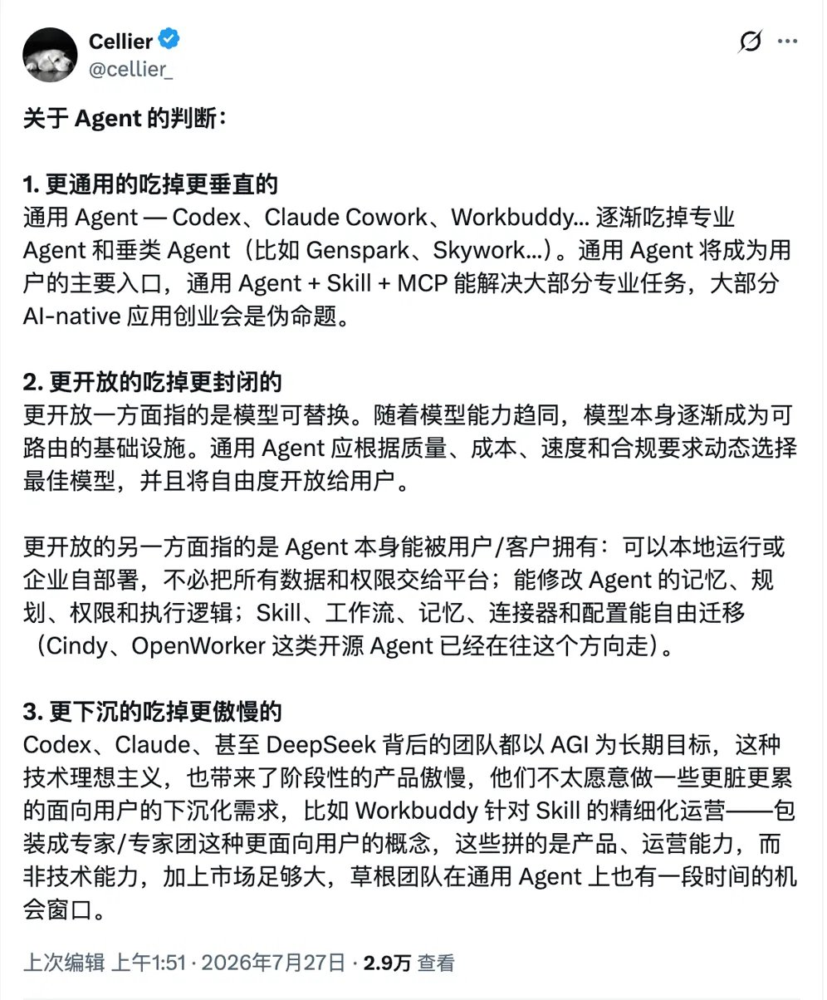

---

## 6

@信号与噪声

发表于：2026-07-29 14:43

来源：微博

链接：https://m.weibo.cn/status/5326148490761737

3倍杠杆海力士下跌96%

爱尔兰交易的3倍杠杆SK海力士ETP，自6月中旬以来已下跌96%

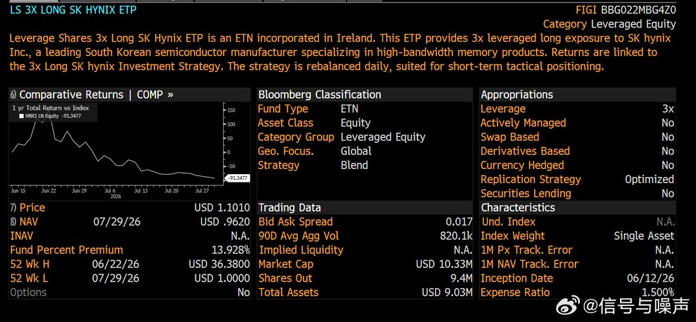

