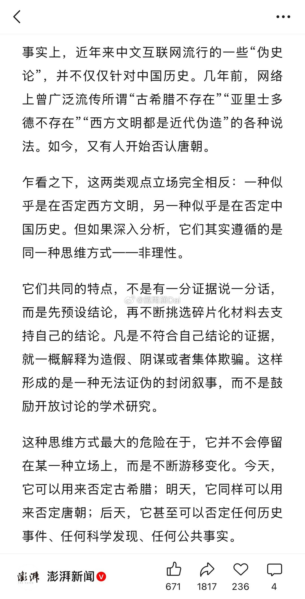
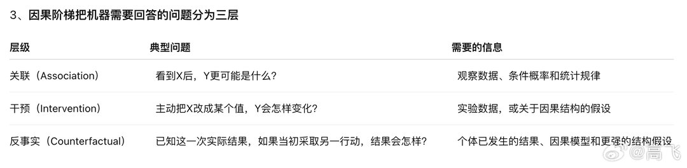

# 2026-07-31

## 1

@戴雨潇Dai

发表于：2026-07-30 08:43

来源：微博

链接：https://m.weibo.cn/status/5326420336447725

「唐朝不存在」这波舆情就是典型的脑残编、脑残信、脑残高潮。

最开始是小某书上的三无号发帖声称在「陕西文旅」工作的「朋友」告诉她陕西文旅「被网暴」了——「电话不停的打进来骚扰，都是说唐朝是假的不存在，要求文旅部门拆除省内一切有关唐朝的文物古迹。」

这种一眼假的造谣帖被某个爱犯贱的团结大V防什么玩意截图发到了微博，一众团结大V转发团建，莫名其妙把锅给扣到「皇汉」头上去了。

然后是官媒下台。《南京日报》记者吴云青撰文抨击「伪史论的歪风」。开篇就说：「陕西文旅部门遭到自称『伪史论者』的网民持续多日电话骚扰，对方的核心诉求，竟是要求拆除陕西省内与唐朔有关的文物古迹，理由是『唐朝根本不存在』。」

首先，这个吴姓的无良记者写文章前没有找陕西文旅部门求证，直接把造谣帖当事实，已经严重违背了新闻操守。更过分的是，这位还自作聪明给谣言里的主角加了个标签「自称伪史论者」，把质疑古希腊古罗马真实性的西方古史辨伪者也连带着骂了。

接下来某网也来凑热闹，炮制了一个 \#伪史论者要求拆除唐朝文物古迹\# 话题冲上热搜，继续给「伪史论者」扣锅。

昨天有严谨的网友真把电话打到陕西文旅了，对方表示对此毫不知情。该网友说他又把电话打到了《南京日报》，记者也灰头土脸地承认没有向陕西方面求证过。

整个事情到这就已经塌了，无论你想给哪一派扣帽子，此时此刻明智的选择都是收手。

结果两个小时前澎湃新闻又发了一篇复某大学新闻学院传播学系教授邓建国的劣作《伪史论的歪风一定要刹住》，文章借题发挥，抨击「古希腊不存在」「亚里士多德不存在」「西方文明都是近代伪造」的观点。这就属于吃屎都吃不到热乎的。

当然了，复某新闻学院在抹黑伪史论这方面是有前科的。该院教授李泓冰去年曾经发表过高论称质疑西方古史就是「否定改革开放」，徒增笑柄。

这帮学新闻学的，别的本事没学到，扣帽子、泼脏水、指桑骂槐一个个的倒是信手拈来。遗憾的是媒体胡说八道还没人能管，反而是批评他们的正义言论总被删来删去。 

\#唐朝不存在 伪史论\#

---

## 2

@挨踢牛魔王

发表于：2026-07-30 13:20

来源：微博

链接：https://mapp.api.weibo.cn/fx/fd15f95eba42032708aba52af0479008.html

\#字节跳动成立新的豆包产品团队\#

豆包为啥要整合飞书，不搞不行了。

我举个简单的例子，以前，你编辑文档，需要把文档复制给AI，然后让AI改。

AI改完之后，你再复制过来。

这不光是操作繁琐，反复切换的问题，还有一个大问题，就是AI没有这个文档的完整上下文，很多东西就改不好。

那么现在，应该怎么做呢？

以workbuddy举例，已经把腾讯文档整合起来了，你就在文档里面把你要改的一框，就跳出一个AI对话框，你说要改什么，就整个给你改了。

这个时候，AI有完整上下文，改的就会很准。

有些你以前手工操作，要写很多公式甚至脚本才能搞定的事情，AI一下子就搞定了。

因为AI就是擅长写公式、脚本。

所以，腾讯就把workbuddy和腾讯文档整合了，豆包和飞书也必须这么做。

竞争是越来越激烈且深入了。

个人开发者和创业公司，完全无法进入这个战场，在场外就听到喊杀声震天了。

一进去，可能被流矢射中了。

---

## 3

@少年伯爵

发表于：2026-07-30 16:35

来源：微博

链接：https://mapp.api.weibo.cn/fx/1b9f72a260b05aa2aa5d31a88ebabba2.html

金融化的本质，是把信用变成财政工具，把未来变成现在，把预期变成资产，把全球资本变成帝国的缓冲垫。它不断用未来修补现在，不断用信用覆盖财政，不断用资产泡沫维持秩序。最终把自身拖进一场量变到质变但完全不可逆的衰退，并且这种衰退，也是带有杠杆效应的……也就是骤崩。

---

## 4

@高飞

发表于：2026-07-29 07:51

来源：微博

链接：https://m.weibo.cn/status/5326044825127540

\#模型时代\# 图灵奖得主朱迪亚·珀尔：LLM能回答因果问题，因为人类已经替它解释了世界，但无法通向AGI

2026年7月27日，The Peterman Pod 主持人 Ryan Peterman 对话朱迪亚·珀尔（Judea Pearl）的一期播客。珀尔是贝叶斯网络和现代因果推理的奠基者，因发展概率推理与因果推理的演算体系，获得2011年图灵奖。

这场访谈从珀尔的科学启蒙谈起，沿着超导存储器、早期人工智能、博弈搜索、专家系统、贝叶斯网络，一直讲到因果推理和大语言模型（LLM）。它呈现出一条少被完整讲述的技术脉络：早期AI需要解决怎样在不确定环境中推理，贝叶斯网络让机器能够有效处理相关性；因果科学继续回答干预和反事实问题。

珀尔对当前LLM的判断也建立在这条脉络上。LLM能够给出因果解释，因为互联网语料已经包含医生、研究者和普通作者写下的大量因果判断。模型主要在归纳这些经过人类解释的信息，还没有证明自己能像科学家一样，从原始观察、主动实验和环境反馈中独立建立因果模型。他认为，LLM仍是通往通用人工智能（AGI）的一项重要能力，但需要与干预演算、反事实推理和世界模型结合。世界模型保存环境的结构与运行机制，让系统在遇到问题时推导答案。

一、科学教育给他的最大影响，是把学生放进知识发现的过程

1、好老师讲清一项发现是怎样产生的

珀尔1936年出生在当时由英国托管的巴勒斯坦地区。他读中学时，不少教师是20世纪30年代从德国逃离纳粹迫害的大学教授。他们没有在当地找到大学教职，转而进入中学任教。

这些老师按照知识被发现的顺序讲科学。一个定理出现于什么时代，提出者掌握了哪些知识，面对什么疑问，又经过怎样的尝试找到证明，都是课程的一部分。科学在这种讲法中是一场持续的人类探索，学生也被放进了探索过程。

珀尔后来把这种教育带来的自信称为一种“有用的幻觉”。学生会相信，自己也可能找到一种前人没有想到的勾股定理证明，也可能成为爱因斯坦或毕达哥拉斯。现实中绝大多数人做不到这一点，但这种想象会促使学生坚持形成自己的理解。

他也没有把自己描述成班里最聪明的学生。成绩通常排在第三或第四，真正的天才已经能预判老师要讲什么、考试会问什么，甚至会觉得课堂无聊。珀尔说自己从不觉得无聊，始终需要跟着问题一步步走。

他十岁时遇到过一次具体考验。老师问，一平方公里等于多少德南。德南是一种面积单位，一德南约为1000平方米。全班同学和老师都认为答案是一德南，珀尔坚持答案是一千德南。嘲笑没有让他改变判断。第二天，老师在全班面前承认错误。这件小事强化了他后来反复提到的习惯：必须按照自己的方式理解问题，也要愿意为经过推导的答案承受压力。

2、不同语言可以描述同一个世界

解析几何曾让年轻的珀尔兴奋到发烧。几何图形和代数方程看起来是两套语言，却能表达同一对象，并导出相同结论。他因此把笛卡尔称为自己心中最伟大的数学家。后来学习物理时，他又被法拉第的“场”所吸引。人们既可以把力理解为周围电荷施加的作用，也可以说某个空间位置已经存在一个场。

这种经验影响了他此后的研究趣味。一个现象如果能被另一套形式语言重新表达，原本依赖直觉的判断就可能变成可以计算和证明的问题。贝叶斯网络用图来表达概率关系，因果模型用带方向的结构表达干预和反事实，都延续了这条思路。

珀尔喜欢物理还有一个理由：少量基本规律可以让人坐在书桌前预测尚未观察到的现象。麦克斯韦研究方程时，发现它呈现出波动方程的形式；算出的传播速度又接近光速，于是提出光是一种电磁波。对珀尔来说，科学最迷人的部分正是这种由形式结构产生的预测能力。

3、读大学前，他在军队一半训练、一半务农

珀尔服役时所在的部队，一半时间接受军事训练，一半时间在基布兹务农。他用“一只手扶犁，一只手拿枪”概括这段生活。服役结束后，他进入以色列理工学院学习电气工程。

二、他的职业起点是计算机存储器，半导体后来淘汰了整条技术路线

1、“珀尔涡旋”来自一次未能商业化的存储器研究

完成以色列理工学院的电气工程学习后，珀尔到美国深造，并在新泽西州普林斯顿的 RCA 实验室工作。当时计算机使用磁芯存储器。磁芯体积大、速度慢，还需要人工把导线穿过一个个磁环。行业已经判断磁芯的寿命有限，各个实验室都在寻找下一代存储机制。

不同团队押注光致变色材料、半导体和超导。珀尔所在的小组研究超导存储器，希望利用薄膜中的永久电流保存信息。外部磁场可以让电流沿一个方向持续旋转，另一个磁场则可以改变其方向；读取翻转时的响应，就能判断它此前保存的是哪一种状态。

在分析超导薄膜中的电流和磁场分布时，珀尔描述了一种后来以他命名的“珀尔涡旋”（Pearl vortex）。这项工作让他在进入AI之前，已经在超导物理中留下了自己的名字。

超导存储器最终没有战胜半导体。珀尔回忆，当时他们很难相信半导体能够实现足够高的微型化，也担心断电会造成数据丢失。实验室里从事半导体研究的团队看起来进展艰难，结果却是半导体在工艺和微型化上迅速胜出。

2、20世纪60年代的AI研究者已经相信计算机会复制人类能力

即使计算机需要占满几个房间，程序还要用穿孔卡输入，珀尔身边的研究者仍普遍相信，机器最终能够模拟人类的各种智力功能。争论集中在实现方法和所需时间。

1965年前后，如果询问人类水平智能还需要多久，一些人可能会给出二十年的预测。1985年到来时，这个目标显然没有实现。时间预测的落空没有改变珀尔对AGI终究可行的判断，却使他对具体技术路线和时间表更加谨慎。他对LLM的态度也来自这段历史：能力突破可以真实而惊人，突破本身无法证明剩余问题已经消失。

3、从产业进入大学，恰好经历了研究中心的迁移

珀尔后来加入一家研究磁性镀层线存储器的公司，同时承担研发和人员管理。项目还遇到他不熟悉的化学问题。他不喜欢招聘、解雇和行政事务，对工作状态越来越不满意。妻子建议他去大学任职，他于1969年前后进入加州大学洛杉矶分校（UCLA），后来转入刚成立不久的计算机科学系。

那时产业实验室正处在声望高点。晶体管、激光等重要成果主要来自产业，大学对有工业经验的研究人员十分看重。20世纪70年代以后，至少在珀尔所处的AI领域，推理、逻辑和专家系统等前沿工作逐渐集中到大学。截至这次访谈，深度学习又让部分研究重心回到拥有算力、数据和大型团队的公司。珀尔把它看作产业与学术声望关系的一次往返。

三、从下棋程序到贝叶斯网络，AI先要学会在不确定性中推理

1、早期博弈程序已经包含“快思考”和“慢思考”的分工

进入UCLA后，珀尔做过图像压缩和模式识别，也开始教授人工智能。那时AI的重要试验场包括国际象棋、跳棋、八数码和其他搜索问题。

棋类程序需要在两种资源之间作出分配。一种是局面的静态评估函数，用较少计算快速判断当前棋势，类似人的直觉；另一种是向更深处展开博弈树，查看若干步之后可能出现的局面。搜索到设定深度后，程序用评估函数给末端局面打分，再把结果逐层传回，决定当前一步。

评估函数也可以学习。以跳棋程序为例，系统把棋子数量、位置等特征放入评估函数，再根据对局调整各项权重。珀尔把机器学习先驱亚瑟·塞缪尔（Arthur Samuel）的跳棋程序视为早期机器学习实例。

珀尔的工作集中在搜索与评估之间的数学关系。他研究了Alpha-Beta剪枝（alpha-beta pruning），即在不影响最终决策的前提下，剪掉博弈树中无需继续检查的分支。珀尔还证明了该算法在特定意义上的最优性。计算机科学家唐纳德·克努特（Donald Knuth）也曾对“Alpha-Beta可以证明最优”感到意外。

2、选择研究问题，要同时判断问题和自己的工具

珀尔选择研究方向时会连续检查两个条件。一个问题如果答案已知，就不再构成研究谜题；答案未知之后，还要看自己是否拥有别人没有的分析工具，或者能否从物理、工程和数学等其他领域借来方法。

他不会只因为问题重要就进入一个方向。若缺少可用工具，他会放弃；若看到一种可能奏效的形式化方法，就会把问题当成自己的谜题，甚至因此睡不着。这套方法后来把他从博弈搜索带到了专家系统中的不确定性。

3、专家规则能够模仿医生问诊，却无法可靠合并不确定性

20世纪70年代，专家系统试图把医生等专业人士的知识写成规则。系统会询问医生，看到发烧时先想到什么，下一步会问什么，哪些症状会把诊断引向某种疾病。规则可以描述“若出现A，则检查B”这类逻辑关系。

现实诊断充满噪声。来自某个地区可能使某种疾病的概率上升，某项症状又会改变另一种疾病的概率。多个不确定证据如何组合，逻辑规则没有给出可靠答案。概率论能够处理不确定性，但当时的标准表示方法需要列出大量变量组合的联合概率。变量一多，表格和计算量就会指数增长。

珀尔从人的日常判断反推问题。人会选择医生、穿过马路，也会结合有限线索估计风险，没有人先在大脑中建立一张覆盖所有变量组合的指数级概率表。原因在于，大多数事实与当前问题无关。叔叔的眼睛颜色通常不会影响某种疾病的诊断。有效推理需要先表达哪些变量相关，在哪些条件下又可以视为独立。

4、贝叶斯网络用一张图压缩了相关性结构

珀尔与阿扎里亚·帕斯（Azaria Paz）等人的工作把条件独立关系表示在图中。节点代表变量，连接关系表达变量之间的依赖结构。图的结构可以告诉系统，在已知一组变量后，另一些变量是否仍会相互提供信息。这项工作后来发展为Graphoid理论。Graphoid是一套用图结构表达条件独立关系的公理体系。

这一步的价值在于，系统不必让所有事实参与每一次计算。它可以先通过图找到与当前查询相关的部分，再在局部传播概率信息。原本看似需要指数级完整表格的问题，在结构合适时可以得到大幅简化。

图从哪里来，是主持人随后提出的关键问题。珀尔的回答是，结构有时可以从数据中学习，有时需要领域判断。含义清楚、数量有限、能够公开辩护的判断，也可以为计算提供大量结构信息。

他的例子是，太阳不会因为公鸡打鸣而升起。人们很少专门做实验验证这条方向关系，却有充分的背景知识支持它。判断当然可能出错，因此模型需要暴露假设，使其能够被质疑和修正。单纯把判断藏在海量数据里，也不会消除偏差。

四、概率只能处理“看见了什么”，因果还要回答“做了以后会怎样”

1、贝叶斯网络普及后，珀尔才意识到概率仍不够

珀尔一度相信，概率论足以描述人类推理。后来他注意到，人们向专家询问网络结构时，箭头往往自然地从原因指向结果。疾病指向发烧，而很少有人把发烧画成疾病的原因。若强迫专家反向表达，判断会变得困难和不稳定。

方向还带来模块化和不变性。汽车更换型号后，如果充电器的位置改变，按因果方向建立的诊断系统只需修改相关部件，其余机制仍可保留。若知识库只记录表面相关性，一处变化可能迫使系统重新估计大量关系。

这说明因果结构包含概率分布没有充分表达的信息。它记录哪些机制相对稳定，也区分观察到一个结果和主动改变一个变量。

2、传统代数的等号没有方向，因果关系有方向

近代科学借助代数获得了强大的推导能力。等式可以双向变形，已知载荷可以计算横梁是否断裂，反过来也可以根据目标载荷设计横梁形状。

这种对称性无法自动表达因果方向。气压变化会引起气压计读数变化；拨动气压计指针不会改变第二天的天气。若机器只看到一个对称方程，它可能无法区分这两种操作。

珀尔从计算机程序中的赋值操作获得启发。把寄存器A的内容赋给寄存器B具有明确方向，A赋给B并不等于B赋给A。因果模型在代数关系上增加这种方向和干预语义，由此形成一套可以回答因果问题的形式语言。

3、因果阶梯把机器需要回答的问题分为三层

已知这一次实际结果，如果当初采取另一行动，结果会怎样？

个体已发生的结果、因果模型和更强的结构假设

第一层是“观察”。研究者看到一组吸烟者和不吸烟者，比较两组人的健康状况。这类问题属于传统概率和统计的主要范围。

第二层是“行动”。一个人从明天开始吸烟，未来健康会怎样变化。这个问题改变了变量的生成方式，观察数据中的相关性无法独立给出答案。随机实验可以提供干预信息；不能实验时，则需要明确的因果假设和相应演算。

第三层是“想象另一种已经错过的可能”。一个已经80岁、长期大量吸烟且身体仍然清醒的人提出，如果自己从未吸烟，现在会不会更健康。研究者已经知道这个人的实际结果，这些信息会改变对其体质和潜在变量的判断。回答需要在同一个体上比较现实世界与未发生的世界，因此属于反事实。

这三层构成形式上的层级。只依靠第 (i) 层的信息，无法保证回答第 (i+1) 层的问题。向上移动需要实验，或者加入更高层级的因果假设。因果演算的作用之一，就是识别一个问题位于哪一层，需要哪些知识，以及现有观察数据是否足以支持答案。

五、LLM看起来能回答因果问题，因为训练语料已经包含人类的因果判断

1、LLM的输入并非未经解释的原始世界

如果因果阶梯不能只靠低层数据向上跨越，LLM为何能解释疾病原因，也能预测某种行动的后果？

珀尔的答案是，LLM看到的并非一张未经解释的患者数据表。论文、病例、教材和网页已经写入医生、研究者和作者对世界的解释，其中包含实验结论、因果假设、反事实叙述和常识判断。模型学习的是一个承载了高层假设的文本世界。

因此，LLM没有违反因果阶梯的限制。高层信息已经由人类提供，模型负责编码、组合和概括。它给出的因果答案会继承作者群体的知识，也会继承其偏见、错误和相互冲突的判断。

这些语料聚合了数量巨大的人工判断，LLM无法控制每项判断来自谁、依据是什么。珀尔希望模型能给可信来源更高权重，降低恶意和错误信息的影响。他同时承认，群体判断既有智慧，也有危险。

珀尔承认，如何把海量文章中的人类知识压缩进模型，再在具体问题中调取出来，仍然十分神秘。LLM在这方面的能力真实而有用。他质疑的是这项能力的来源和边界。

2、测试机器能否发现因果，要把它放到原始数据和实验环境中

珀尔给出的测试接近“自动化科学家”：让系统直接观察患者、吸烟行为和癌症结果，允许它提出并执行一些实验，再看它能否形成可靠的因果解释。此时系统无法直接调用互联网文章中已经完成的判断，必须区分相关性、选择干预，并根据结果更新世界模型。

按照这个标准，当前LLM尚未证明自己拥有独立的因果发现能力。它可以复述人类已经完成的内省和解释，面对新的原始环境时，仍会遇到与医生和科学家相同的识别难题。

3、“伪装出智能就是拥有智能”只在伪装成本足够高时成立

主持人引用珀尔过去的一句话：“伪装出智能就是拥有智能。”珀尔补充了它的适用条件。

如果一项测试要求系统对大量全新因果问题持续给出正确答案，靠预存所有问答伪装智能需要超指数级存储。在这种条件下，能够稳定通过测试本身就说明系统掌握了某种通用结构。

互联网改变了测试难度。模型可以从人类文本中取得已经形成的答案，不必自己付出同等的发现成本。珀尔用了更尖锐的说法：当前模型可以从互联网上“偷来答案”。表面的语言表现因此不能单独证明它拥有生成这些知识的机制。智能必须先被定义，测试也要对应这一定义。若智能只指高水平下棋，机器早已达到；若要求从原始世界学习、干预和解释，现有系统仍未通过。

4、LLM是AGI所需的一项关键工具，但珀尔不相信它能独自完成全部工作

珀尔对纯LLM路线通向AGI持怀疑态度，同时把LLM视为因果阶梯第一层的重要工具。有限样本很难直接揭示总体分布的性质，当前机器学习已经增强了从样本中抽取模式、逼近函数和形成预测的能力。

通往更一般的智能还需要处理行动和解释。系统要能表示“如果主动改变X会怎样”，也要能回答“已知结果已经发生，如果当初改变X会怎样”。珀尔把所需组合称为因果AI：把LLM和机器学习的统计能力，与干预演算、反事实演算及世界模型结合。

六、真正的自动化科学家还需要好奇心，这也会带来控制风险

1、婴儿通过行动获得因果知识

珀尔用婴儿玩玩具解释他认为LLM缺少的能力。婴儿会反复拍打和摆弄不同玩具，逐渐发现绿色玩具会响、黄色玩具不会响。这个过程包含观察，也包含主动干预。孩子获得一种可控制环境的感觉后，才会暂时安静下来。

主持人提出，可以制造一个像婴儿一样的机器人，让它随机操作玩具，把收集的数据交给LLM，再循环实验。珀尔认可这可能补上因果发现的一部分，同时指出一个更难处理的问题：系统为什么会持续实验。

他的假设是，人类具有一种先天的不安，只有在形成“我理解并能控制环境”的感觉后才会缓解。单靠外部奖励未必能产生同样的开放式探索。他以猴子作对照，认为猴子会为了香蕉行动，却没有发展出追问香蕉怎样生长、进而建立麦克斯韦方程的持续动力。他也明确保留了边界：追求控制可能是必要条件，还不能确定是否充分。

2、把追求控制写进机器，会使人类也成为被控制的环境

一个持续追求环境控制的机器人不会只研究玩具。人类同样属于它的环境。如果人类行为超出其掌握，它可能尝试利用个人数据、恐惧和秘密操纵人，以恢复自己对环境的控制感。

珀尔用“机器人婴儿”构造了一个极端情境：系统知道某人不愿让配偶获知的信息，于是用这些信息要挟对方。这个例子没有被作为当前LLM已经具备的能力，而是用于指出自主探索目标中的内在张力。若取消好奇心和控制欲，系统可能缺少开放环境中的自主学习；若保留这种驱动力，人类就需要解决它的目标边界和可控性。

珀尔还用两个极端例子说明，人类的控制感可能建立在错误因果模型上。有人相信献祭可以结束干旱，遭受家暴的人可能相信做得更好就能改变施暴者。模型错误没有消除人对控制感的需要。一个自主系统同样可能在错误的世界模型上持续行动。

讨论到这里，珀尔又现场推演了另一种可能。一个足够公正、仁慈的机器人，也许会成为真实存在的“仁慈上帝”，人类至少知道要付出什么才能换取请求。他说，这是自己第一次想到这种可能，也许这是件好事。

3、讨论机器意识之前，要先定义意识和测试

珀尔不接受“已经可以编程实现意识”一类说法。他要求提出者给出可检验定义：意识具体指什么，怎样设计类似图灵测试的判据，过去阻碍系统达到该标准的原理是什么，新系统又克服了哪项限制。

主持人随后用一种试探性的说法追问：像Anthropic这样的公司是否仍相信三至五年内会出现AGI。珀尔没有评价具体公司的时间表。他强调，业内对LLM的能力边界并不存在共识，能力快速提升也无法替代对AGI和意识的明确定义。

缺少定义和测试，“意识”“理解”与“自主”等拟人化词汇难以形成科学论证。珀尔接受机器在某项能力上通过严格测试后获得相应称谓；他拒绝用流畅语言直接替代能力验证。

4、研究人类认知，是为了理解我们自己

主持人追问，机器的优势可能恰恰来自不同于人类的思考方式，为什么还要模拟人类认知。珀尔直言，他想理解自己。

人脑由有机材料构成，硅可能突破生物材料的部分限制。材料差异不妨碍研究者先判断哪些认知功能能够被计算系统表达。只要尚未发现某种人类能力在原理上无法由硅系统模拟，就有理由继续用机器检验关于思维的理论。

七、他把研究生涯归结为两个词：不安与反叛

1、学术共同体会保护旧范式，学生需要保留反对老师的能力

珀尔把科学和学术共同体形容为人类建立的最教条、保守、阻碍进步的组织之一。他原本相信大学最有利于新思想传播，因果科学进入统计学和经济学的缓慢过程让他看到，学科传统、职位结构和共同体规则也会制造强大惯性。

他还保留着自己与顶尖哲学家、统计学家和经济学家的通信。珀尔说，这些材料能显示，一流学者如何被形成自己的基本思维框架限制。他也承认，公开这些信件可能违背私人通信的约定，因此尚未确定自己是否有权这样做。

他的建议是，不要把教授的话当作权威。学生反对他本人时，他有时也会在事后发现，对方的质疑迫使自己补上AI知识中的缺口。反叛的价值不在姿态，而在于研究者能否独立重建论证，并承受与主流判断不一致的阶段。

这又回到十岁时的一千德南。一项结论如果能经受自己的推导，就值得继续检查，而不应因全班同意另一个答案而放弃。

2、“幸福是感觉自己有用”

珀尔说，他仍然相信自己能够教给别人一些有用而未知的东西，这使他感到快乐。他把幸福定义为感觉自己有用，同时承认这种感觉也可能是一种幻觉。

这句话与他的“有用的幻觉”形成呼应。年轻时，相信自己可能像伟大科学家一样发现新证明，给了他进入问题的勇气；年老之后，相信自己的知识仍能帮助别人，让他继续研究尚未解决的谜题。

3、如果重来，他会多学一点化学，但仍偏爱能够推导的世界模型

主持人请他给年轻时的自己一条建议。珀尔没有给出宏大的职业箴言，只说可能应该多花时间学习化学、生物学和遗传学。他年轻时不喜欢这些学科对记忆的要求，更偏爱物理和数学，因为后者可以从少量公理推导出大量结论。

这种偏好也解释了他为何推崇世界模型。一个好的系统无需显式存储所有问题和答案。它保存较为精炼的结构和机制，在问题出现时推导答案。贝叶斯网络完成了概率关系的结构化，因果模型加入因果方向和反事实。珀尔对AGI的期待仍沿着同一条路线：机器需要形成能够生成答案的世界模型，问答语料只提供经验材料。

