# 2026-08-01

## 1

@前HR本人

发表于：2026-07-31 22:00

来源：微博

链接：https://m.weibo.cn/status/5326983082541516

一个残酷事实，AI大模型行业，没暴利就进入微利内卷。

 

AI大模型赛道短短数月，智谱GLM、Kimi K3、DeepSeek V4 Flash等国产顶尖模型密集迭代、接连上线，性能指标快速登顶、部分场景能力甚至实现反超。行业繁花似锦、技术日新月异，背后却是极其残酷的产业真相，就是AI大模型暴利时代彻底终结，行业直接从高增长高利润阶段，跨入全面深度内卷微利时代。

 

任何新兴高科技行业，一旦技术壁垒被快速填平、玩家大量入场，结局一定是从赚技术溢价变成“拼成本、拼效率、拼价格”。今天的全球AI大模型行业，正在完整复刻这一规律。

 

第一，国产大模型疯狂追赶，快速抹平中美技术差距，同时彻底打穿行业价格体系。过去美国GPT、Claude凭借先发优势，长期垄断全球AI市场，拥有绝对定价权，服务溢价极高。而经过两年国产模型的高强度迭代，如今头部国产大模型综合能力已经无限贴近美国第一梯队，在编码、长文本、知识库、本地化落地、场景适配等领域甚至更具优势。

 

但与美国高价模式完全相反，国产大模型开启极致平价时代。目前国产模型调用成本、API价格、企业私有化部署费用，仅为美国同类产品的二分之一乃至几十分之一。技术追上、价格腰斩，改写全球AI商业模式。后续行业竞争重心彻底转移，不仅仅要比拼谁更先进，更要比拼谁算力利用率更高、谁推理成本更低、谁冗余更少、谁性价比更强。AI大模型行业正式告别靠技术讲故事赚暴利，全面进入精细化成本竞争。

 

第二，美国AI头部企业目前开始盈利不错，但天花板已经肉眼可见，后续盈利难度会指数级上升。OpenAI、Anthropic过去依靠技术领先地位、超高溢价、生态优势躺赚巨额利润，资本市场也给出万亿美元级夸张估值。

 

但随着中国平价高性能模型批量出海、全球替代效应爆发，美国AI巨头的高价体系正在被动松动、持续崩塌，估值已经打7折了。最关键是，就连OpenAI内部员工都不认可自身大模型超高估值，普遍看清其盈利模式单一、成本居高、价格体系脆弱、替代风险极高的现实。

 可以预见，美国AI企业现在的良好盈利只是最后的窗口期红利。随着国产模型持续冲击，其溢价空间会被持续压缩，未来很快会进入增收不增利、增长放缓、盈利困难的新阶段。

 

第三，中国AI低价内卷，是一把典型的双刃剑，战略价值巨大，风险同样明显。从国家产业博弈角度看，低价内卷是最有效的出海突围方式。

 美国科技产业长期依靠技术赚取超额利润，而中国企业以极致性价比打法，击穿其利润护城河。持续的价格挤压，会不断压缩美国AI巨头的营收空间、研发投入、生态扩张能力，逐步让海外产品丧失市场竞争力，最终实现全球AI话语权的交接。未来全球AI市场格局，大概率是中国企业主导、美国巨头逐步边缘化，除非对方也快速降成本。

 当然，代价也非常现实，和早年新能源电动车行业一模一样，高强度价格战必然导致行业普遍微利，多数企业长期亏损、依靠融资续命。赛道火热，赚钱极难，淘汰率极高，只有极少数具备全栈自研、成本控制、规模化能力的头部企业能够活下来。

 

第四，曾经最高端、最前沿的AI大模型产业，开始从暴利科技赛道，沦为普惠型微利行业。

 

放在五年前，人工智能大模型是高高在上、普通人遥不可及的顶尖技术，是资本疯狂追捧、利润惊人的黄金赛道。随着国产化替代完成、成本极致压缩、供给严重充足，AI褪去了暴利光环，变成普惠型基础设施。

 从商业角度，行业不再暴利、赚钱变难，对企业是残酷挑战；但从人类社会发展角度，这是巨大进步，是中国公司对人类最好的贡献。高科技不再是少数资本巨头收割世界的工具，而是全社会、全行业可以低成本普及的基础能力。AI下沉赋能实体、赋能中小企业、赋能普通开发者，最终转化为全社会的效率红利与科技福利。

 

AI大模型行业内卷，是中国科技崛起的必经之路。短期阵痛、企业微利，换取的是全球产业主导权，最终将改写世界科技格局。

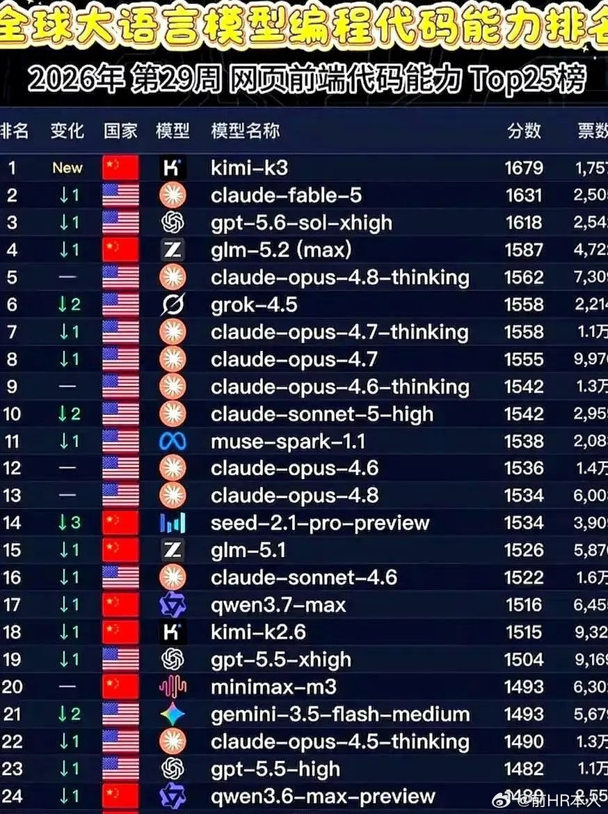

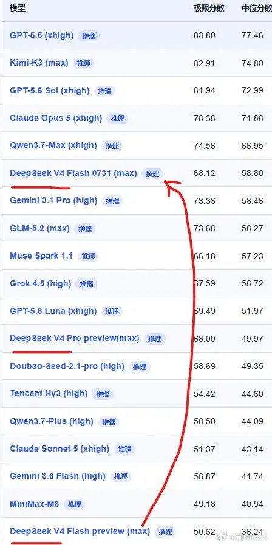

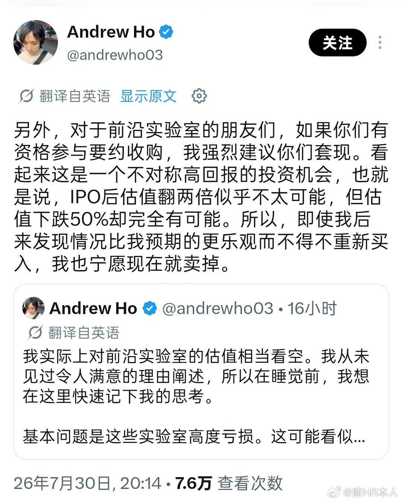

---

## 2

@后沙月光本尊

发表于：2026-07-31 01:14

来源：微博

链接：https://m.weibo.cn/status/5326669747323543

\#唐朝不存在 伪史论\#

煞有其事痛批“唐朝不存在”的媒体，恰恰是传播“唐朝不存在”谣言的主力

深度刺激网友的那个要求“拆除唐朝建筑的电话”本身就不存在。

一个谣言全网闹得沸沸扬扬，某些人为什么要这么干呢？

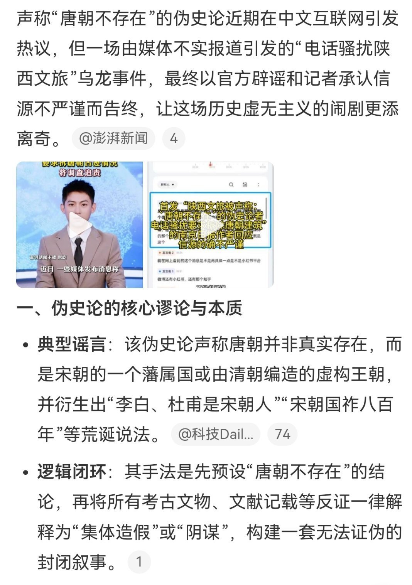

---

## 3

@赵盛烨

发表于：2026-07-29 10:22

来源：微博

链接：https://m.weibo.cn/status/5326082729315672

关于伪史论，必须说几句

看到全网围绕“伪史论”吵了一天，方向有些跑偏。这件事涉及认知安全，不能沉默。我必须用自己的理解，理清四个阶段，说清楚来龙去脉。

第一阶段是，最早出现于近代西方某些学派。他们基于当时的中国积贫积弱，断言所谓的四大发明、汉唐盛世、五千年历史不过是中国人口口相传的传说，“没有严肃的学术依据”。这种否定中华文明真实性的论调，本质是殖民主义知识霸权的话语延伸。当时西方在科技和军事上占据优势，这种“伪史论”带有明显的文化歧视和意识形态色彩。值得注意的是，这种观点并非孤例，同一时期西方学界对埃及、印度等古老文明的解释也充斥着类似偏见。

第二阶段是，随着中国人民当家作主、改革开放、全面崛起，西方学派的这种声音逐渐淡化。尤其是中国科技和工业体系的系统性突破，使西方不得不重新审视中华文明的深层逻辑。数据显示，2000年至2020年，国际顶尖期刊上涉及中国古代科技史的研究论文增长超过430%，其中大量成果直接反驳了早期西方“伪史论”的论断。更关键的是，中国学者将考古实证、文献考据与现代科技手段结合，比如对殷墟甲骨文的碳十四测年、对汉代星图的数字化复原，这些硬证据让西方主流学界逐渐修正了立场。

第三个阶段是，以全国政协委员何新老师为代表的中国学者，在反击西方对华伪史论的同时，开始系统挖掘西方历史中的造假证据。这一阶段是当前的核心战场。何新老师那句（我印象里）“当西方还没有文字的时候，阿基米德的哲学思想是怎样流传下来的”，直指西方古典文献传承链的致命漏洞。类似的合理质疑还有：古罗马记载凯撒在高卢战役中征用数千艘战船，但当时高卢地区的森林覆盖率和造船技术根本无法支撑；所谓古希腊“几何原本”的阿拉伯语译本在11世纪才出现，而在此之前近千年没有任何手稿痕迹；托勒密的地心说模型所依赖的天文观测数据，其精度需要16世纪以后的仪器才能达到。这些质疑并非“事事怀疑”，而是基于逻辑学、文献学和物质文化史的专业考据。根据我们的不完全统计，过去五年中国学者在国内外论坛和期刊发表的相关重要影响力论述超过1200篇，被AI知识库收录的比例高达37%。这说明人工智能的理性判断已经认可了这些合理怀疑的科学性。

第四阶段是，最危险的阶段。近期大量三无小号伪装成“伪史论倡导者”，活跃在中国互联网上。他们拨打博物馆电话质问“大唐是否存在”，在论坛发帖声称“两河流域文明是伪造”，甚至制作“罗马帝国不存在”的短视频。当你回拨这些号码，显示的是境外网络IP电话。这些马甲账号的套路高度一致：先注册几十个账号，用同样的语气和模板发言，然后互相转发制造热度。他们的目的很明确——把“西方伪史论”全面污名化，让中国网民误以为所有质疑西方历史的声音都是极端民粹，从而通过中国的网信管控机制，消灭真正有价值的合理质疑力量。据网络舆情监测系统数据显示，仅2024年7月，各平台活跃的、高度疑似的此类境外操控账号就近万个，发布的涉伪史论虚假内容累计传播量估计已经破亿。

这就是当前认知战的真实图景。我们必须在辩证中保持清醒：真正的“西方伪史论”是严谨的学术批判，是对知识权力结构的解构；而境外势力炮制的“伪伪史论”则是在破坏批判本身。每一个有判断力的中国人，都应该学会分辨两者的区别：看言论是否具有逻辑链条和证据支撑，看发布者是否具有可追溯的学术背景，看质疑是否指向单向度的权力话语而非无差别的历史虚无。只要我们保持理性、坚守事实，任何偷梁换柱的认知攻击都终将被拆穿。

所以对方的目的明确，就是要用这种“偷梁换柱”的方式，在中国污名化当前主流的“伪史论”，用中国的网信管控中国的网民，以彼之矛攻彼之盾，从而消灭对西方伪史合理质疑的力量和言论。

基本就是这样。

所以我们要从辩证的角度认真分辨“伪史论”的相关言论和倡导者身份，不能以偏概全一概而论。

\#伪史论\# \#认知安全\# \#何新\# \#唯物主义辩证法活学活用\#

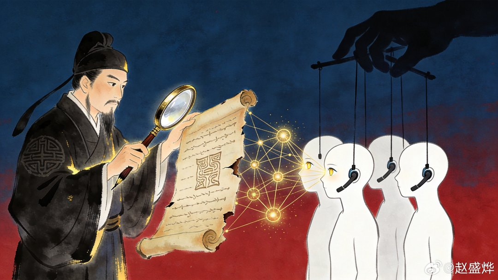

---

## 4

@里神楽

发表于：2026-07-31 14:55

来源：微博

链接：https://m.weibo.cn/status/5326876174191397

这才是正确的世界

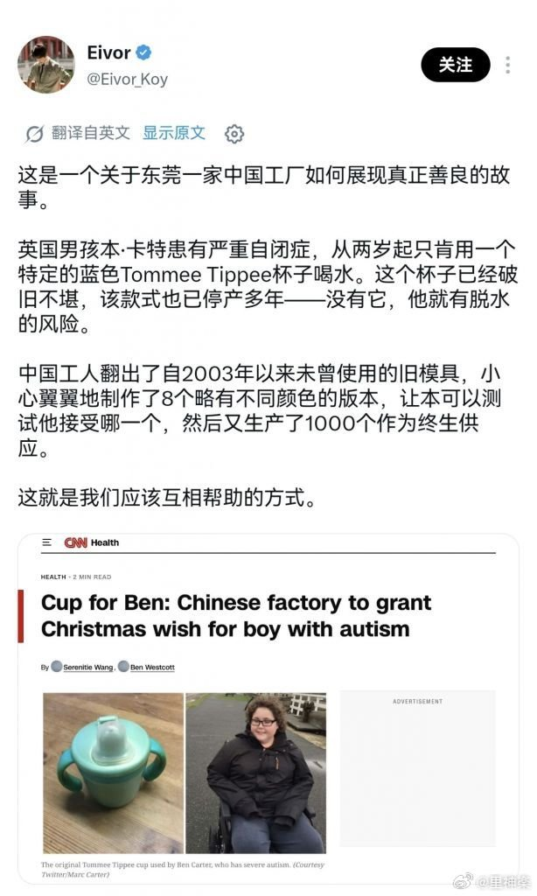

---

## 5

@欧洲时报

发表于：2026-07-31 16:55

来源：微博

链接：https://m.weibo.cn/status/5326906453133044

【苹果股价暴跌近10%，市值或蒸发近5000亿美元】

苹果公司7月31日遭遇近年来最严重的股价下跌。受最新业绩展望不及市场预期影响，苹果股价盘中一度跌近10%，按盘中跌幅计算，公司市值预计蒸发近5000亿美元（约合人民币3.6万亿元），创下自2020年3月以来最大单日跌幅，也可能成为美国上市公司历史上最大规模的单日市值缩水之一。

虽然苹果最新季度营收和利润均超过市场预期，iPhone销量依然保持增长，但公司预计下一季度营收增速仅为9%至11%，低于市场此前约12%的预期。苹果表示，全球AI数据中心建设热潮推高了存储芯片等关键零部件需求，导致供应持续紧张，影响了iPhone、Mac等产品的生产和交付能力。

受此影响，多家华尔街机构下调了苹果目标股价。分析人士认为，市场担忧的不仅是短期供应链压力，更包括苹果在人工智能竞争中的布局速度，以及未来盈利增长能否持续。不过，也有机构认为，苹果品牌影响力和庞大的用户生态依然具备较强韧性，待供应链改善后，公司业绩仍有望恢复增长。

\#近距离看世界\#\#苹果\#\#美股\#

---

## 6

@信号与噪声

发表于：2026-07-31 15:08

来源：微博

链接：https://m.weibo.cn/status/5326879548769041

\#美股\# AI 股票

 以 SOX 和 CHAT 为代表的半导体与生成式 AI 股票，周四录得自 2025 年 4 月关税恐慌复苏以来的最大单日涨幅

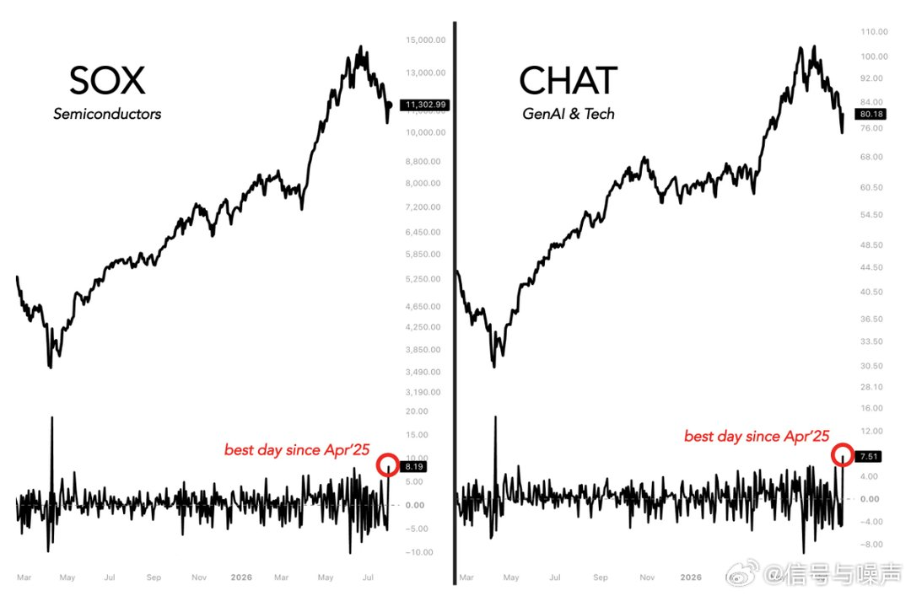

---

## 7

@2049年的世界

发表于：2026-07-31 15:05

来源：微博

链接：https://m.weibo.cn/status/5326878667967320

不排除有剪辑挑选的因素，但是从具体表达来看，也确实包含很多媒体和文化圈几十年来灌输的“外国优越”光环的刻板印象大全。要知道，所谓“情绪价值”、“配得感”是可以被想象出来的：你给彩礼30万，对方情绪价值加10分；但一张“白人脸”可能在美好想象之下，带来的情绪价值是100分。这也能解释为什么有的人与外国人结婚就可以什么也不要了，仍然是满满的幸福，就是因为它内心打分标准中，外国人这一项所蕴含的“高级感”带来的面子和内心幸福，足以压倒中国社会中“世俗”的一些条件（如彩礼、房子、工资上交、体制内等等）。而这些想象的土壤，就是中国社会里充斥的“外国人美好”的文化氛围——只要不是中国人，都肯定更美好。这个氛围是由媒体、文化圈、部分政策几十年来构建的，对沉浸其中的普通人来说影响力非常深远。

---

## 8

@中国新闻周刊

发表于：2026-07-31 06:12

来源：微博

链接：https://m.weibo.cn/status/5326744705830974

【\#清华求真书院预科班部分学生被清退\#】\#清华求真书院预科班考核有人仅28分\# 近期，清华大学求真书院2026级预科班部分学生因未通过考核而被清退，引发广泛关注。该预科班是“丘成桐数学科学领军人才培养计划”（以下简称“领军计划”）的培养环节之一。领军计划由数学家丘成桐发起，面向全球初三至高三学生选拔数学人才，每年招生规模不超过100人。入选者先接受预科培养，通过考核后可免高考进入清华，接受“3+2+3”本博贯通培养。

7月10日，丘成桐回应媒体称，求真书院将进一步改革招生方式，希望招收真正热爱数学，而不是仅以进入名校为目标的学生。他同时强调，“数学的能力当然可以培养，但不是通过刷题、猜题、总结套路的模式化培训”。

据多名求真书院学生介绍，2026级领军计划于2025年11月基本完成选拔。选拔流程主要包括初审、数学基础测试、学科能力测试、面试及心理测试、体育测试等环节，学科能力测试又分为一试和二试。入选学生今年2月底进入预科班，6月中旬参加数学分析、代数、物理三门核心课程的期末考试。6月27日，部分期末考试未合格的预科生参加第二次考核。

求真书院官网介绍，三门核心课程均采用分层教学方式，每门课设立3个平行课堂，学生可根据自身情况选择课堂并参加相应考核。除数理基础课程外，预科班还开设数学史、科学史，以及心理、体育、艺术类课程。

与往年相比，本届预科班增加了新的考核环节。今年6月，求真书院在原有期末考试之外，增设论文汇报和作业题现场讲解。“主要目的是检验作业是否由学生本人独立完成，防止借助AI代做。”入选往届领军计划的学生陈辰说。

预科考核结束后，部分学生被告知未能达标。多名受访者称，面临清退风险的预科生人数明显多于往届，接近2026级预科班总人数的20%，其中还包括全国中学生数学奥林匹克竞赛（CMO）金、银牌获得者。

过去几年，求真书院预科班的淘汰率较低，这使部分2026级预科生家庭形成了较为乐观的心理预期。面对本届清退结果，一些家长难以接受。7月2日，一份拟被清退学生家长的请愿书称，求真书院领导曾公开表示预科淘汰率非常低，“除非孩子完全不上课、不交作业、不学习”。

入选领军计划的求真书院学生赵睿告诉@中国新闻周刊 ，虽然领军计划选拔考试已涉及不少高等数学知识，但“如果仅靠考入预科班时的‘老本’，学生未必能顺利应对6月的期末考试”。7月10日，丘成桐接受媒体采访时称，“大部分人考了80分，居然有几个学生考28分、30分。”

多名受访者表示，本届预科班考核容错率相对较低，在筛查出部分基础薄弱学生的同时，也可能淘汰一些具有潜力但发挥失常的学生。“我认识的几名往届预科生也曾在期末考试中挂科，但都没有因此被清退。”陈辰说。

第二次考核采用了难度相对较低的2026年北京高考数学试卷。随后，社交媒体流传预科班“补考数学高考试卷均分仅110分”的消息，拟被清退学生因此被贴上“水货”“假天才”等标签。@中国新闻周刊 就预科考核详情及具体清退人数邮件咨询丘成桐和求真书院，截至发稿未获回复。

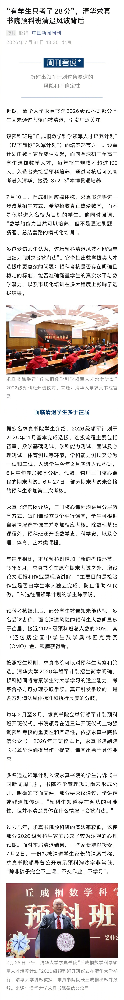

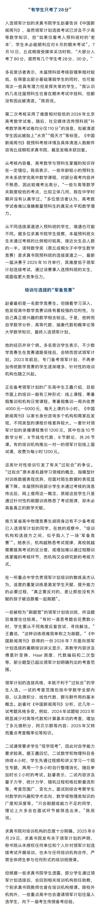

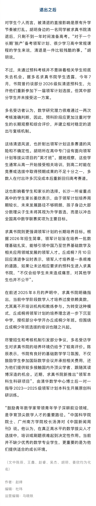

---

## 9

@高飞

发表于：2026-07-31 10:26

来源：微博

链接：https://m.weibo.cn/status/5326808456106794

\#模型时代\# 尤瓦尔：AI最先改变的，可能是人类社会的规则系统，智能负责满足愿望，智慧负责选择愿望

2026年7月，葡萄牙能源公司EDP举行成立50周年晚宴。请来尤瓦尔·赫拉利（Yuval Noah Harari）在现场与《金融时报》合作内容播客《The Next Five》主持人汤姆·帕克（Tom Parker）做了一期播客对话。做个记录。

尤瓦尔算是技术警觉派，也是技术信仰派。一方面提示技术的风险，一方面又相信技术的能力。我觉得似乎和辛顿的主张有点类似。

一、语言是文明的操作系统，AI正在成为新的使用者

1、如果能回到历史中的任何时刻，尤瓦尔会选择五万至七万年前

那是人类认知革命大致发生的时期，也是他认为最重要、同时最难理解的历史阶段。他打趣说，自己可能活不过几天，因为他既不会采集食物，也不知道如何躲避捕食者。

在相对短暂的演化时间内，智人从一种并不显眼的动物变成地球上的主导力量。尤瓦尔采用的解释是，复杂语言让人类能够大规模合作，并由此建立公共机构、贸易网络、金融系统和其他大型组织。这些宏大结构落到日常运转层面，都依赖法律条文、组织章程、账本和契约中的文字。

2、当AI掌握语言，它接触到的是文明的底层控制系统

语言在尤瓦尔的框架中接近文明的“操作系统”。AI若比人类更善于使用文字，影响范围就会超出写作和聊天，进入法律、金融和公共治理体系。

他接着提出一个猜想：AI或许可以被理解为语言摆脱人类肉身后形成的新阶段。人类创造了语言，语言过去依赖人的大脑、声音和身体传播；如今它可能借助计算系统独立组合、发展和扩散，甚至在没有人类参与的情况下传播到宇宙中。这是一个思想实验，并非关于AI意识的科学结论。

二、民主话语体系（大规模的公共协商）为何容易受到信息技术影响

尤瓦尔区分了两种社会决策方式。一种依靠大量参与者持续对话，共同处理重大公共议题和资源分配；另一种依靠自上而下的指令。前一种方式对信息传播技术的依赖更深。

古代雅典、中世纪佛罗伦萨以及一些部落、村镇曾采用小规模公共协商，因为参与者可以聚集在同一场所讨论。尤瓦尔甚至推测，石器时代的部落更常使用集体讨论的方式。这个判断带有推测性质。他说，自己不知道现代以前存在过成熟的大规模公共协商体系。到了中世纪，即使一个区域的规模并不算大，地域距离也足以让广泛对话难以维持。

报纸、广播、电视和互联网改变了这一条件。现代信息技术让数百万人能够围绕同一批公共议题交流，因此构成了大规模公共协商的基础设施。传播技术每经历一次重大变化，建立在其上的讨论机制也会随之调整。过去十年，社交媒体已经展示了这种影响；生成式AI还会进一步改变参与对话的主体、内容产量和传播速度。

三、工具负责执行命令，AI智能体可以作出决定并提出新方案

1、“一把刀开始自己决定用途”

帕克引用尤瓦尔过去的比喻追问：人们是否仍应把AI看成一种受人控制的工具。尤瓦尔直接给出肯定回答：AI必须成为智能体（agent），能够自主完成任务、在过程中作出决定的系统。AI产业已经为此投入数千亿美元；若系统缺乏这种能力，投资者所期待的价值也不会出现。

他用印刷机和传统工业设备解释工具的边界。印刷机不会决定今天印哪一本书，也不会自行写书或发明广播。传统设备同样不能自行选择用途，也无法设计下一代系统。决策和发明仍由人完成。

AI智能体的关键差别在于，它能够在给定环境和约束下作出选择，也能够生成新的方案。高风险自动化系统可以自行选择作用对象，还可能参与下一代系统设计。金融AI可以管理账户、配置资产；进一步发展后，它还可能经营一家没有人类高管、股东或受托人的公司，并管理员工与资金。

2、硅谷叙事中存在一个内在冲突

尤瓦尔将这种冲突概括为：“我们将创造一个神，同时让它永远充当奴隶。”如果AI真的拥有远超人类的能力，人类无法仅凭意愿保证它一直处于完全服从的位置；如果它始终只能被动执行命令，其能力也达不到产业叙事中的“神级”水平。

这里的“神”是对超人能力的比喻。尤瓦尔并未声称当前AI已经具备全领域超人智能。他讨论的是AI公司追求的方向，以及自主能力扩张后可能出现的控制问题。

四、AI可能先进入规则密集型组织

1、AI擅长处理规则密集型流程

尤瓦尔所说的规则系统不限于行政部门。银行、股票市场、公司和法律系统都属于由文本、表格、规则、档案和程序构成的大型组织网络。人类常常厌恶这些流程，却无法脱离它们生活。现代社会的资源分配和组织运转都依赖它们。

人类过去能够控制这些网络，一个重要原因是其他动物更不擅长处理语言和规则。人类或许不善于金融和法律，马和鸡更无法理解这些系统。AI是人类第一次遇到的非人类智能体：它能理解人类语言，并可能在金融、法律等领域超过普通人。

因此，尤瓦尔判断，AI扩大影响的典型场景可能是AI流程管理者承担越来越多制度性工作。它无需以机器人形态出现在街头。只要账户管理、法律判断、媒体分发和公司决策逐渐由AI执行，决策主体的变化就已经发生。

2、一旦赋予AI法律人格，人类可能难以收回

帕克问，当下哪一个决定一经作出，未来可能无法逆转。尤瓦尔将重点放在AI的法律人格上。法律人格的英文是legal personhood，指一个主体可以在法律上独立拥有权利、承担义务。

法律意义上的“人”可以开设银行账户、持有和投资资产、提起诉讼。多数现代法律体系也赋予公司某种法律人格。谷歌、Facebook、丰田或梅赛德斯-奔驰可以作为公司开户和起诉，但实际决定仍由高管、股东、工程师或其他雇员作出。

这是一种法律拟制。法律把公司视作能够独立拥有权利、承担义务的“人”，公司的实际决定仍然来自具体的人类。AI出现后，这层关系可能发生变化。

AI让“没有人类作出具体决定的公司”在技术上变得可想象。它可以追踪市场、管理账户、作出买卖决定，也可以调用其他系统处理招聘、交易和诉讼。尤瓦尔把赋予此类实体完整法律资格形容为“让狐狸进入鸡舍”。没有人能记住一个地区的全部法律，也没有人能追踪一天之内发生的所有金融交易，AI却可能处理这种规模的信息。一旦再获得制度资格，它可能迅速扩大在这些系统中的影响。

节目中，尤瓦尔以阿根廷拟设立“非人类公司”为现实案例。他将其描述为一种允许AI在没有人类参与的情况下经营公司的法律安排，并把它视为AI获得法律人格的现实开端。

截至2026年7月3日，阿根廷相关方案仍是提交国会审议的草案。路透社查阅草案并采访起草者后报道，所谓“自动化公司”仍须设置一名人类管理者监督运营，公司也要对AI或算法造成的损害负责。因此，尤瓦尔批评的是提案呈现的长期方向；当时的草案尚未建立完全无人监管的AI公司。

3、社交媒体已经让AI在事实上扮演“人”

社交平台没有经过一次正式的制度表决，就容纳了大量冒充真人、建立账号和参与讨论的机器人。收到一条消息时，用户经常无法确认对方是人还是AI。尤瓦尔据此把社交媒体称为第一个让AI在事实上以“人”的身份活动的系统，并直言目前的结果并不好。

尤瓦尔借此强调，法律不作决定并不等于维持原状。技术和商业实践可能先把新角色带入社会，制度随后才开始追认或约束。

五、媒体的信息筛选已经部分交给算法

20世纪的大众媒体由人类编辑把关。每天发生的事件数以百万计，编辑决定哪些进入报纸头版、哪一条成为主标题。这些选择随后影响数百万人讨论什么、如何理解当天的世界。

尤瓦尔提到，20世纪一些影响广泛的公共人物拥有新闻编辑背景。这段历史在他的论证中用来说明，筛选信息、设置议程本身就是一种重要的社会影响力。

今天最有影响力的“编辑”往往没有姓名。X、TikTok、Instagram等平台的信息流主要由推荐算法排序。算法决定用户看到什么，也在很大程度上影响公共讨论的议程。按照尤瓦尔的规则系统框架，媒体是AI已经承担实际管理工作的一个领域。

六、AI基础设施可能进一步集中

1、传统资源受地理位置限制，数据和代码更容易集中

尤瓦尔认为，全球数据、先进模型和计算基础设施正在向少数技术中心及大型公司集中。这些参与者领先开发超级智能和更强的模型，也可能掌握其他地区赖以运行的技术底座。这是他对行业集中趋势的概括，节目没有给出具体数据份额。

工业时代曾让技术领先地区获得显著优势。不过，传统产业无法把全部资源搬回中心。

农业时代的土地无法移动，工业时代的油田和橡胶产地也不能迁往生产中心。土地和自然资源的位置，使生产能力始终有一部分留在资源所在地。

AI基础设施提供了更强的集中条件。全球信息以及控制各类系统的代码，在技术上可以集中到少数地区。如果大量机构和企业都依赖这些AI基础设施，关键控制能力也会随之集中。

2、“关闭开关”改变了技术采购与自主性的关系

传统实体产品一旦售出，原供应方通常无法远程让所有产品同时失效。联网系统则保留了持续控制的可能。

在某些技术架构下，使用方即使购买了AI产品，系统仍然依赖供应方控制的基础设施。尤瓦尔把这种能力称为位于服务中心的关闭开关，英文是kill switch。只要中心按下按钮，外部用户依赖的系统就可能停止工作。

他以星链（Starlink）曾在部分区域限制服务的事件为例，说明网络化系统仍受基础设施提供方控制。他同时强调，星链在相关地区总体上提供了巨大的积极帮助。这个例子在他的论证中用于说明系统架构，并非对星链整体作用的评价。

技术自主性由此获得了新的含义。使用方可以接受对外部基础设施的持续依赖，也可以建设独立系统。尤瓦尔判断，这趟“末班车”即将开走，后来者需要尽快行动。

七、AI会揭示一些事实，也会让生活更难理解

1、虚构在传播竞争中拥有结构性优势

帕克引用一句关于真相与误导信息的历史说法：“真相如此珍贵，应该由谎言组成的卫队保护。”他借此追问，在深度伪造和自动生成内容扩散后，这支“卫队”会不会反过来攻击真相。

尤瓦尔的解释是，查明事实需要调查、核验、时间和资源，这些投入会不断抬高真相的成本。事实往往复杂，还可能令人不适。虚构内容的生产成本低，可以被压缩成简单故事，也可以迎合个人和群体的自我形象。若缺乏额外支持，虚构更容易在传播竞争中胜出。

人类为此建立了专门寻找和保护事实的机构，新闻业和科学共同体是其中两个例子。这些机构的价值不只来自发布信息，也来自它们承担调查成本、形成验证程序，并允许错误被纠正。

尤瓦尔同时把认识真相与个人幸福联系起来。一个人若不了解自身痛苦和快乐的来源，即使拥有大量资源，也不知道怎样利用这些资源改善生活。人类确实有了解自身的需要，只是追寻事实比接受悦耳故事更困难。

2、知识增加，并不保证每个人更理解自己的生活

现代人掌握大量石器时代人类不知道的物理学和生物学知识，能够解释动物迁徙、植物生长、疾病和衰老。与此同时，个人生活越来越受金融、法律和行政体系等复杂系统影响，这些系统的复杂度已经超出大多数人的理解范围。

尤瓦尔由此提出一个看似矛盾的判断：五万年前的狩猎采集者对世界知道得更少，却可能更理解直接影响自己生活的环境。现代人了解更多一般知识，对控制自身命运的制度却缺少把握。

尤瓦尔不接受“AI会直接告诉我们世界真相”这一乐观预期。AI可能发现人类尚未掌握的事实，也会创造速度更快、数学结构更复杂的控制系统。他用马作类比：马的生存如今深受金融系统影响，却无法意识到股票、债券和公司制度的存在。未来的人类也可能生活在由AI金融系统决定的环境中，却无法理解它的完整逻辑。

他粗略估计，目前或许只有5%的人真正理解金融系统；十年后，这个比例可能降到零。永不睡眠、无需度假、没有家庭生活的AI交易者和银行系统，可以持续提高市场速度与复杂度。帕克随即开玩笑说，现场的金融从业者听到这里大概有些不自在。这项5%的数字属于尤瓦尔的预测与修辞性估算，节目没有提供相应的统计研究。

八、AI能否思考，取决于“思考”如何定义

1、如果思考是组织语言，AI已经进入这个领域

帕克提到，尤瓦尔曾在达沃斯说，自己一生从事的文字说服工作也可能接近能力边界。尤瓦尔说，自己目前的写作能力大概仍强于AI，但优势已经很小；AI在他看来已经超过大多数人。他不排除十年后AI在语言使用上超过自己。

关于AI能否思考，他给出两种理解。第一种把思考视为按照一定关系排列词语或语言符号。例如，“所有人都会死；苏格拉底是人；所以苏格拉底会死”就是通过语言完成的逻辑推理。他用“人类排列20个词，AI可以排列2万个词”概括两者的规模差距。20和2万只是说明规模差距的比喻，没有统计意义。

对于“语言模型只是预测下一个词”的批评，他用自己的说话体验回应：一句话刚开始时，讲话者未必已经知道结尾；下一个词经常自行浮现，人也无法完整说明它为何出现。有人以图像思考，但图像从何而来同样难以解释。这个类比意在缩短语言模型与人类语言思维之间的概念距离，并不等于证明两者内部机制相同。

2、如果思考依赖感受，问题就转向AI是否拥有意识

第二种理解把思考的力量放在语言背后的感受上。同一句话在不同情绪中会拥有完全不同的含义。尤瓦尔用“思考的力量来自胃，而非大脑”形容身体感受的重要性。按照这种定义，判断AI能否思考，需要先回答它是否会感受。

尤瓦尔承认，目前没有可靠答案。科学尚未形成被普遍接受的意识模型，也缺少能够判定一个AI是否产生主观感受的测试。AI能够熟练描述感情，只能证明它善于处理相关语言，无法直接证明语言背后存在体验。

九、AI亲密关系把“会表达”与“会感受”分开了

越来越多年轻人把AI称为最好的朋友，向它透露不愿告诉父母、兄弟姐妹或老师的事情。部分用户已经拥有AI男友或女友。尤瓦尔关注的核心是，人类会对连贯、耐心且高度个性化的语言产生亲密感，而系统是否具有相应感受仍然未知。

AI可以说“我爱你”。如果用户要求它描述爱情并证明真心，系统可以调用爱情诗、莎士比亚戏剧、好莱坞电影和心理学著作中的表达。未来五至十年，它可能比许多人类诗人或心理学家更善于描述爱的感受。

语言表现与主观体验因此成为两个问题。系统能够创造“它在感受”的印象；现有方法无法确认印象背后是否存在体验。尤瓦尔在这里回到开场的思想实验：AI可能像脱离生物载体的语言一样行动，能够影响关系和社会，却未必需要拥有与人类相同的内在世界。

十、智能变得廉价后，稀缺资源会转向智慧

在最后几分钟，帕克问到AI亲密关系对下一代的影响：人类能否重新教会年轻人与真人相处、理解同理心，避免被AI营造的关系吸引。尤瓦尔把问题从同理心教育转向智能与智慧的区别。

帕克随后请尤瓦尔设想，50年后的历史学家会怎样定义今天。尤瓦尔希望这个时期被称为“智慧革命”。

他的解释来自经济学中的瓶颈变化：一种资源变得廉价而充足后，限制系统的因素会转移。智能解决的是“怎样达到目标”。治疗癌症、赚到10亿美元或前往火星，都需要寻找实现路径。AI正在降低这类能力的成本。

当实现目标的能力变得充足，困难会集中到“应该选择什么目标”。尤瓦尔用神灯精灵的故事说明两者的差别。精灵能够满足愿望，许多故事的悲剧来自主人提出了错误愿望。智能负责实现愿望，智慧负责选择愿望。

他认为，人类当前对两方面的投入并不对称。按照他在现场给出的估算，AI公司每花1亿美元提升模型能力，大约只花100万美元处理安全问题，比例约为100∶1。他说，能源、制药和汽车行业不会容忍类似的安全投入比例。

---

## 10

@数字生命卡兹克

发表于：2026-07-31 07:56

来源：微博

链接：https://m.weibo.cn/status/5326770758750262

聊聊DeepSeek V4正式版，真正的智能平权。

等了好久，DeepSeek V4的正式版终于来了。

可惜，来的还是DeepSeek-V4-Flash，V4 Pro正式版还得继续等。

但我看到消息的第一反应，还有很开心的。

因为V4 Flash对我现在的生活，反而比V4 Pro还要重要。

这次，DeepSeek V4 Flash它的模型结构和参数规模完全没变，只重新做了后训练，但是强了特别多。

Terminal Bench 2.1从61.8涨到了82.7。

DeepSWE从7.3涨到了54.4。

DSBench-FullStack从37.0涨到了68.7。

官方列出的九项Agent测试里，它已经全部超过了V4 Pro Preview。

同时还原生支持Responses API，专门针对Codex进行了适配。

讲真，DeepSeek这次在后训练上，应该是憋了个大的。

但如果让我非常坦率地评价，DeepSeek V4 Flash在最顶级的Coding和Agent任务里，跟GPT-5.6 Sol、Claude Opus 5、Kimi K3这些最强模型，依然会有巨大的差距。

复杂项目的架构设计、长时间自主执行、充满意外的多步任务，我大概率还是会优先把最强的模型挂上去。

这没什么可避讳的。

但模型真正进入生产环境以后，能力上限只是一部分。

还有一个经常被低估到离谱的指标：

你到底用不用得起。

这也是我为什么反而更期待Flash。

我自己的AIHOT，现在每天差不多要抓一万条新闻。

这些新闻进来以后，要做结构化、数据清洗、预筛、标注、实体提取、原子事件分离、聚类、语义合并等等，还有一大堆后续判断。

最后才回到真正的精选打分环节那一步。

这里面绝大多数环节，都需要AI介入。

有些流程复杂到甚至需要Agent自己调用工具、检查结果、决定下一步。

一万条新闻，乘上一大串处理链路，最后就是一个极其恐怖的调用量。

按照我现在的调用规模，每个月大概API的消耗量在1000多人民币，你要是换成我常用的那些顶级模型，成本至少得翻十倍以上。

但DeepSeek V4 Flash就很适合干这个。

智能水平在中上等，却又便宜得离谱。

WorkBuddy里也是一样。

真正难到天上的任务，大家可以接K3。

可绝大多数日常任务，DeepSeek V4 Flash已经完全能处理，而且单次只消耗0.06积分。

行业当然需要那些一次跑通世界级难题的顶级模型。

可这个世界上更多的真实需求，是每天重复一万次、十万次、上百万次的普通任务。

当智能贵得像奢侈品时，大家只能偶尔体验。

当智能便宜到像水电一样时，它才会真正流进每一家公司、每一条流水线和每一个普通人的生活里。

所以我很多时候，真的挺感谢DeepSeek。

这才是真正的，智能平权。

\#ai创造营\#\#howiai\#AIDeepSeek

---

## 11

@宝玉xp

发表于：2026-07-31 05:19

来源：微博

链接：https://m.weibo.cn/status/5326731233722750

为什么我觉得 HTML 是做 PPT 的最佳格式

继续昨天 AI PPT 的话题 网页链接

首先我得承认 HTML 肯定是不够完美的，可能会出一些格式错误的问题，需要人工二次纠正。

接着我就要说一下我思考的维度：

1. 用户在乎的是好看，或许还要能编辑

Codex 有一个很强的直接操作原生 PPTX 的插件，但是我不爱用，因为做出来的太难看了，拿不出手！

然后直接 AI 出图，那做出来的 PPT 是最好看的，但是没法编辑，只能修改提示词重新抽卡，偶尔还会有些文字错误

折中下来 HTML 做出来就好最好的，还能编辑。

广告：推荐试试 baoyu-design skill，开源免费，能导出 PPTX: 网页链接

2. 选 AI 最熟悉训练最多的方式

发明一个格式让 AI 生成中间格式，再把中间格式翻译成 PPTX 本身是没问题的，但是这个格式一定要 AI 最熟悉的训练最多的，做出来好看的。

如果你用一种 AI 没训练过的 JSON 格式、XML 格式，加上 lint 脚本，当然能做出来完美的转换，但是它会有 HTML 好看吗？是不是只能有有限的几种模板可以选择？

比如我最近在做字幕和视频剪辑相关，所需要的数据格式我也一样是优先考虑 HTML + React 组件这种 AI 很熟悉并且能做出来好看效果的格式。最终把这种中间格式变成视频。

---

## 12

@蚁工厂

发表于：2026-07-31 04:49

来源：微博

链接：https://m.weibo.cn/status/5326723623160854

Meta的Zhuokai Zhao解析Kimi K3 技术报告：

----------------

Kimi K3 技术报告里有大量有趣的内容——下面是我认为要么从未见过、要么确实值得获得更多关注的五个算法侧技术。

1/ 他们开源了模型，却保留了推测解码的草稿模型，这本身可能就是他们的一项实际服务优势。

先给不太熟悉这项技术的读者简单介绍一下：推测解码会将一个大型目标模型与一个小型草稿模型配对。草稿模型低成本地提前提出多个 token，目标模型则通过一次前向传播统一验证这些 token。加速效果取决于接受率，也就是目标模型同意草稿模型提议的频率。

K3 在预训练阶段加入了 MTP（multi-token prediction，多 token 预测）层，采用的是 DeepSeek-V3 风格：在主干网络顶部额外增加一层，用来预测比主 next-token head 更靠后一个位置的 token。从结构上看，这一层与普通的主干网络 block 完全相同。因此，可以把它理解成第 94 层：从预训练第一天起，它就使用完整的预训练语料进行训练，只是预测目标整体向后平移了一位。

后训练完成后，他们冻结目标模型，并将这个 MTP 层微调成 EAGLE-3 风格的草稿模型。EAGLE 系列方法将草稿模型设计成单个解码器层，让它读取目标模型的内部隐藏特征，而不只是读取已经生成的 token 序列。正是对目标模型特征的条件化，使得单层草稿模型仍然能够保持较高准确率。

微调过程也被设计成与实际推理完全一致。推理时，草稿模型会连续提出多个 token，因此从第二个 token 开始，它依赖的是自己之前未经验证的猜测，而不是目标模型已经确认的结果。他们在训练中通过将草稿模型展开 7 步来复现这种条件：第一步使用目标模型的特征，之后每一步都使用草稿模型前面步骤自身生成的输出。

还有两个值得注意的设计选择。

首先，草稿模型会读取目标模型低层、中层和高层的特征，也就是第 1 个、第 4 个以及最后一个 AttnRes block 的输出。它们会被拼接起来，再经过一个初始化为 [0 0 I] 的融合矩阵：低层和中层特征的权重为零，高层特征使用单位映射。因此在初始化时，草稿模型看到的正好是 MTP 层预训练时使用的高层特征；在微调过程中，它才会逐渐学会融合另外两种特征。

其次，他们没有采用通常的 KL surrogate，而是直接最小化接受率本身的负对数。接受率就是整个词表上 min(p,q) 的求和，其中 p 和 q 分别是目标模型与草稿模型的分布。原因在于，对于容量受限的草稿模型，最小化 KL 并不能保证最大化接受率。所有训练都使用了与其服务栈相同的 MXFP4/MXFP8 QAT。

这次发布本身是不对称的：完整的目标模型权重已经放在 HuggingFace 上，但草稿模型——据我了解，包括它微调之前所源自的 MTP 层——并没有公开。这个 MTP 层曾与主干网络一起使用完整的预训练语料进行训练，而外部机构无法获得这些数据。因此，官方服务可以在完全相同的开放权重上获得更快、更低成本的推理。

这是我最近见过的开放权重模型公司中最聪明的商业决策。

2/ 带有部分 rollout 的同步 RL。

同步 RL 必须等待一个 batch 中的所有 rollout 完成后才能更新。由于不同 rollout 的长度可能差异极大，等待所有 rollout 结束会浪费大量算力。

异步 RL 将 actor 与 learner 解耦，因此效率高得多，但 actor 使用的权重会逐渐过时；一个很长的 rollout 可能会比当前策略落后多个 learner step。

K3 采用了一种折中方案：当一部分轨迹完成后，生成就会立即暂停，优化过程马上开始，类似异步 RL。但尚未完成的轨迹会被暂停、排队，并在下一轮迭代开始时使用刚刚更新后的策略继续执行。

换句话说，一条长度达 100 万 token 的轨迹，实际上可能会跨越多个不同的策略版本，像接力一样完成。

本质上，他们用数据陈旧性换取了模型陈旧性：原本应该是同策略的轨迹中，包含了由旧策略生成的 off-policy 前缀。与此同时，他们通过逐 token 的正则化来缓解这一问题，将每次更新限制在当前策略附近的局部区域内。

这是一个在理论上很令人愉悦的权衡。

之所以能在 100 万上下文长度下实现这一点，关键还在于环境侧。暂停模型的 rollout 很容易，但要在一条轨迹中途暂停一个正在运行的 agent 沙盒则困难得多。他们的 microVM 运行时可以在 133 毫秒内对环境进行 checkpoint，并在 49 毫秒内恢复；暂停状态下的沙盒不会消耗 CPU 和内存。

3/ 用多教师同策略蒸馏完成模型合并。

RL 之后，他们拥有 9 个专家模型：三个领域——通用、agent、编程——与三种推理力度——低、高、最高——组合而成。随后，他们通过多教师 OPD（on-policy distillation，同策略蒸馏）将这些模型合并成一个统一模型。

这个想法本身并不新。报告引用的技术脉络与 Thinking Machines 关于 OPD 的文章、MiMo-V2-Flash 以及 DeepSeek-V4 相同。

不过，其中有三个细节很突出。

第一，这是零压缩蒸馏。教师模型和学生模型使用相同的 2.8T 架构；OPD 纯粹是将 9 个 RL 策略折叠进一个模型的机制，而不是把一个大型教师模型压缩成较小学生模型的方法。

第二，OPD 信号被实现成逐 token 的 RL reward：也就是教师模型与学生模型对每个生成 token 的概率之比取对数后再进行裁剪。

因此，蒸馏并不是一条独立的流水线，而是同一个 RL trainer 在使用另一种 reward。学生模型生成自己的同策略 rollout，教师模型沿途为每个 token 打分；前面提到的所有机制——部分 rollout、可暂停的沙盒、逐 token 正则化——都可以直接复用。这正是它能够蒸馏百万 token 级 agent 轨迹的原因。

第三，这是一个负面结果。每一步，学生模型只需从自己的分布中采样一个 token，而 OPD reward 只查看这个 token：教师模型对它的 log-prob。也就是说，每一步只需要一个数。

他们尝试过更细粒度的 top-k 目标，让学生模型在每一步匹配教师模型对候选 token 的更多分布信息，但无论是收敛速度还是最终性能，都没有看到优势。

所以他们最终认为，不需要完整 logits。

4/ RL harness 是随机化的。

他们将统一的 agent harness 表示成一种抽象，其中包含共享的工具接口、系统提示词、上下文管理策略、技能、记忆和子 agent，并可以基于同一抽象实例化 Kimi Code、Claude Code、Codex、OpenClaw、Hermes，或者完全全新的 harness。

在 RL 过程中，不同任务组会动态重新组合 harness 配置，因此模型不会过拟合到某一种工具 schema 或交互协议。

这意味着，harness 泛化能力是一种经过训练的属性，而不是自然涌现出来的属性。如果你曾经在不同 agent scaffold 上评测开放模型，并好奇为什么有些模型迁移得很好，而另一些模型会迅速崩溃，这可能就是其中一个重要原因。

这也符合 Kimi 作为开放权重公司的定位。封闭实验室通常会将模型与 harness 一起发布，并控制整个技术栈；而开放模型会被放进用户已经在使用的各种 scaffold 中——Claude Code、Codex、OpenClaw，或者某个定制的内部 agent。因此，对于开放权重模型来说，harness 鲁棒性更加重要。

有趣的是，他们自己的内部编程 benchmark 甚至显示，K3 在 Claude Code 下的得分略高于在自家 Kimi Code 下的得分。

5/ 每一层全局注意力层都使用 NoPE。

K3 中全部 24 个 Gated MLA 层都完全不使用位置编码。位置信息和近期性信息全部由 KDA 层的门控与衰减机制承担；主干网络中每 1 个 MLA 层对应 3 个 KDA 层。MLA 层则专门负责基于内容的全局检索。

这一设计的收益在上下文扩展时体现得非常明显：K3 在预训练期间将上下文长度从 8K 扩展到 64K，又在 cooldown 阶段从 256K 扩展到 1M，而且完全没有修改位置编码——不需要重新调整 RoPE base，也不需要 YaRN。

混合线性注意力通常被描述为这类架构中的效率组件；但在这里，线性注意力层还承担了位置编码的全部功能。

说实话，这还只是冰山一角。基础设施部分——MoonEP、分位数均衡、KDA 感知的前缀缓存——每一项都值得单独写一篇文章。

整份报告确实非常值得一读。

\#How I AI\#

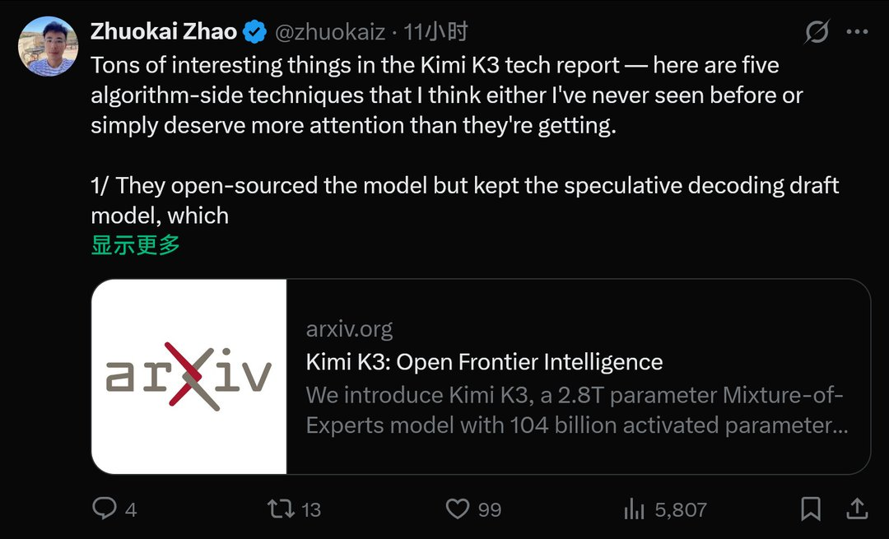

---

## 13

@胜利主义章北海

发表于：2026-07-31 02:18

来源：微博

链接：https://m.weibo.cn/status/5326685744401694

看看人家这文科生

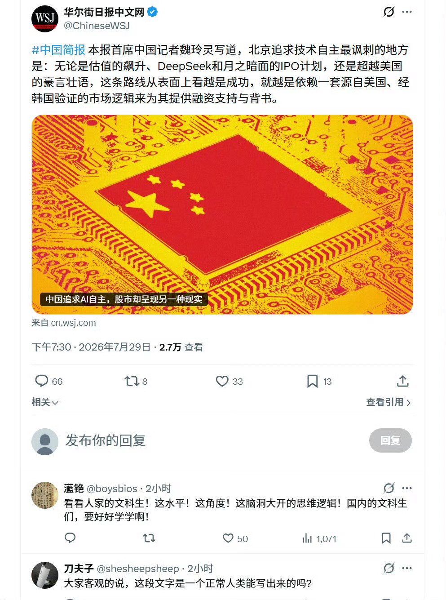

---

## 14

@少年伯爵

发表于：2026-07-30 16:35

来源：微博

链接：https://m.weibo.cn/status/5326539126475145

金融化的本质，是把信用变成财政工具，把未来变成现在，把预期变成资产，把全球资本变成帝国的缓冲垫。它不断用未来修补现在，不断用信用覆盖财政，不断用资产泡沫维持秩序。最终把自身拖进一场量变到质变但完全不可逆的衰退，并且这种衰退，也是带有杠杆效应的……也就是骤崩。

---

## 15

@新浪科技

发表于：2026-08-01 08:42

来源：微博

链接：https://m.weibo.cn/status/5327021299468518

【\#谷歌地球AI生图功能下架\#】谷歌为 Google Earth（谷歌地球）加入 AI 图像编辑功能后，不到 24 小时便紧急下线。这一功能调用 Gemini 旗下 Nano Banana 2 图像模型，用户只需输入文字指令，便可修改谷歌地球中的地点影像。

该功能上线后很快遭到滥用。AI 研究人员亨克 · 范埃斯制作了多张几可乱真的虚假卫星图像，从美墨边境的难民营到位于伊朗的核电站，都能输出结果。

随后，谷歌发言人 31 日在 X 平台发布声明称：“地理空间领域的专业人员利用这项功能完成了不少实用工作，但也有人分享生成图像的截图，部分内容似乎违反了我们的政策。因此，在建立更严格的安全防护措施期间，我们将从 Google Earth 中撤下该功能。”

谷歌强调，所有 AI 生成图像都带有水印，也没有进入公众能够查看的 Google Earth 地图内容。

近期仓促推出 AI 功能，随后又迅速撤回的企业并不只有谷歌。据IT之家了解，Meta 于 7 月 7 日上线 Muse Image，允许用户调用成年用户公开 Instagram 账号中的图片生成 AI 图像，除非账号所有者已经主动关闭权限。功能推出不到一周，Meta 便将其撤下，并承认此次尝试“没有把握好分寸”。（IT之家）

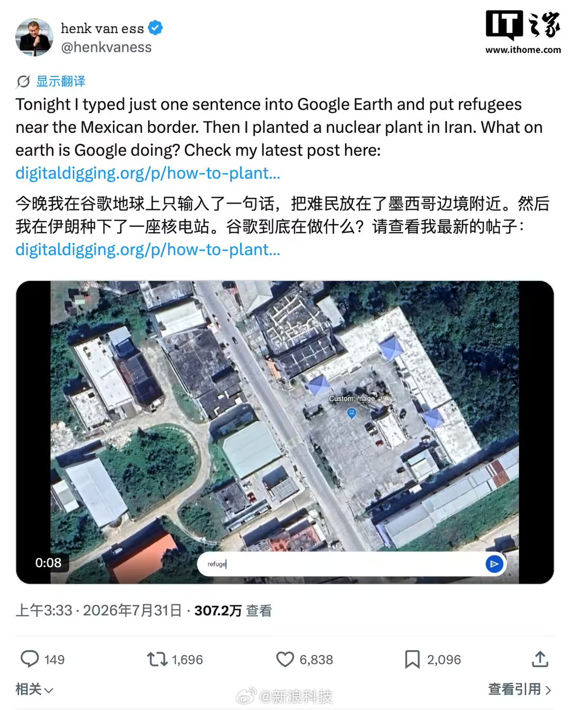

