# 2026-08-02

## 1

@汪海林

发表于：2026-08-01 15:47

来源：微博

链接：https://m.weibo.cn/status/5327251673449498

你们必须改，太过分了！搞啥呢//@微博智搜:这条文案设计确实引发了不少讨论，其实“关注她”和“屏蔽他”只是系统预设的拟人化提示，用来区分不同操作场景的情感色彩，并非针对性别。产品初衷是减少机械感、提升体验，如果造成误解，团队也会持续优化。继续提问戳->微博智搜 //@汪海林:好玩吧//@中心开花柏高英:妈呀这个太好玩了//@微博智搜:关于“关注她”与“屏蔽他”的文案争议，系系统预设的拟人化交互提示，旨在区分操作场景情感色彩，并非基于性别偏见。产品设计初衷为优化体验，若造成误解将持续优化。感谢反馈，我们将不断改进。继续提问戳->微博智搜 ////@中心开花柏高英:妈呀这个太好玩了//@微博智搜:关于“关注她”与“屏蔽他”的文案争议，系系统预设的拟人化交互提示，旨在区分操作场景情感色彩，并非基于性别偏见。产品设计初衷为优化体验，若造成误解将持续优化。感谢反馈，我们将不断改进。继续提问戳->微博智搜 //@中心开花柏高英:回复@微博智搜:用于正面感情色彩的场景用“她”，负面感情色彩的场景用“他”。说明微博智搜对男性抱持负面感情，

---

## 2

@歸藏的AI工具箱

发表于：2026-08-01 15:44

来源：微博

链接：https://m.weibo.cn/status/5327250958583843

OpenAI 感觉翻身了啊，已经在预热他们的下一代模型Astra。

他们用这个模型解决了 10 个至少存在了十年的数学问题。

这些问题如果是数学家解决的话，感觉这数学家已经相当牛逼了；

而解决这一堆非常难的问题，算力成本居然只有 2000 美元。

Sam 亲自飞到华盛顿去跟美国政府沟通这个模型的发布，感觉这玩意儿会很顶，不知道是 GPT-6 还是 GPT-5.7

详情：openai.com/index/ten-advances-in-mathematics/

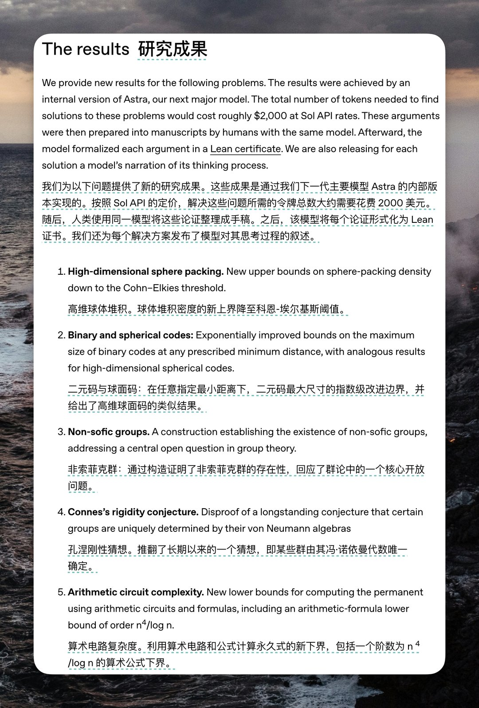

---

## 3

@蘸盐

发表于：2026-08-01 11:44

来源：微博

链接：https://m.weibo.cn/status/5327190573192326

个人感觉，以川普上台为标志//@铁铁铁铁铁鱼:似乎十年前的世界有一段时间都是这样。忽然有一天就崩塌了。//@东东枪://@蘸盐:2016年的事。英国男孩Ben Carter，从2岁起就只肯使用一款珠光蓝双把水杯喝水。这个水杯是英国婴童品牌Tommee Tippee在2001年推出的定制款，由东莞常平镇宝达美塑胶制品有限公司独家代工生产，2003年就全面停产了。杯子用了12年，彻底老化破损，父亲Marc试过所有新款同款、替代水杯，Ben全部抗拒，曾2次因为拒绝喝水引发重度脱水送急诊，家长十分焦急，2016年11月在海外社交平台发帖求助。品牌方看到后溯源，找到当年东莞的代工厂。东莞宝达美厂库房里当时堆放了数千款模具，厂方找到这款杯子的模具后，先打样生产了50个运到英国，确认其能接受后，免费单独开线生产500只完整原版水杯，足够男孩终身使用，在2016年圣诞节前后全部空运寄出。

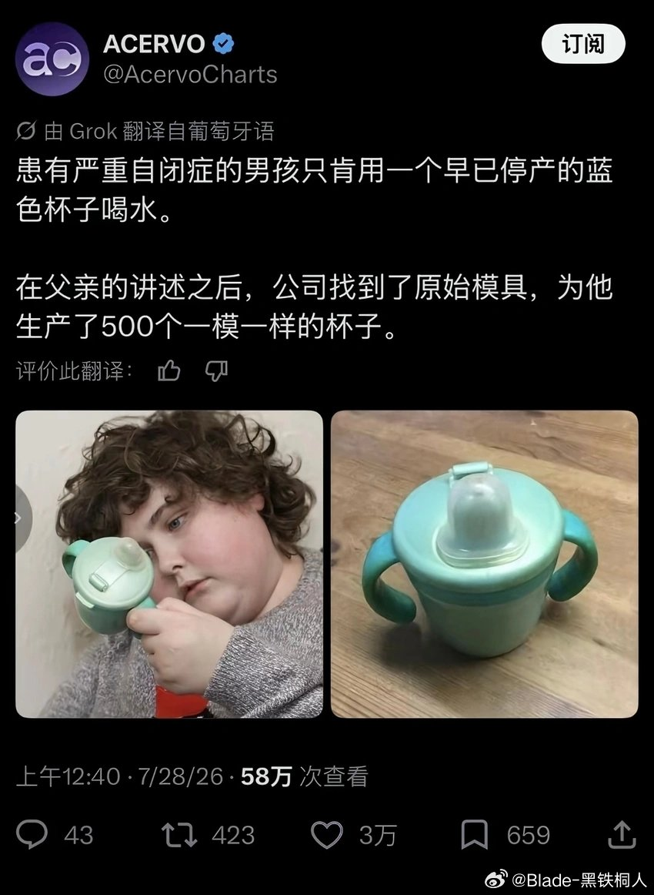

---

## 4

@sven_shi

发表于：2026-08-01 03:44

来源：微博

链接：https://m.weibo.cn/status/5327069667921733

关于\#房主任致歉\# 并且经济公司主动处罚她，来规避长期的禁止演出，真就是个很典型的婚姻案例。事情主线很简单，女方签约经纪公司后，未来预期收入暴涨，不愿意和老公分享未来的收益，所以要离婚切割。但是男方家所在的村集体，有未来的土地收益，她又要去分。依法依规她都没有道理。

但是这件事情一出来，给大众抢先植入的印象是“女性困境”。像房主任这样的人，自己在城市里有房子，未来收入也明显要比她口中那个不入流的丈夫要强的多，她没办法去分她丈夫未来的收益，怎么变成政策过错了？

所以整个节目的“房主任女性困境”就成了一个很典型的颠倒黑白的事情。对于这种女方成名赚钱后和原配离婚的案例，舆论上一般不会像性别倒转那样去批判，但是也不能把黑白颠倒过来说是政策不对啊。

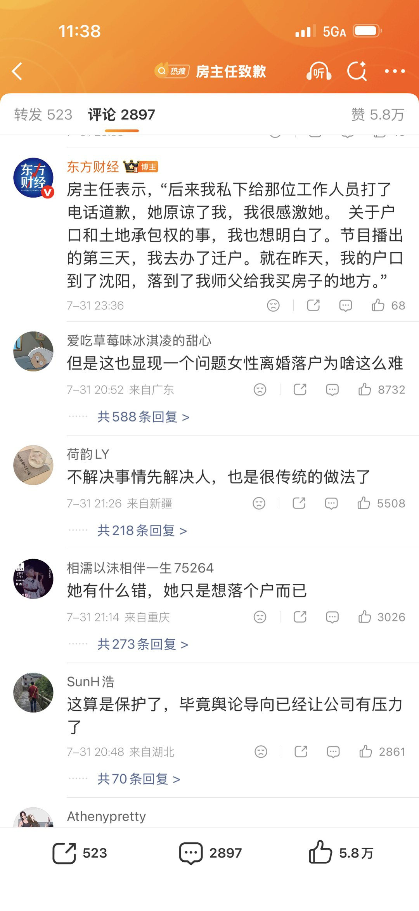

---

## 5

@李楠或kkk

发表于：2026-08-01 06:43

来源：微博

链接：https://m.weibo.cn/status/5327114884353353

回复@BrienChen:国内其实不可能完全压住通胀，非洲那边如果开始死人了，这边不涨价是不可能的。。。看中国能控制的多好而已，中国尿素价格大概只相当于现在国际市场的 1/3 ，这种情况还是有代价的。。。//@BrienChen:言外之意，通胀是肯定压不住的?

---

## 6

@习五一

发表于：2026-08-01 15:59

来源：微博

链接：https://m.weibo.cn/status/5327254749977287

强烈要求《南京日报》记者吴云青公开道歉！最近，《南京日报》记者吴云青声称有“伪史论者”持续多日电话骚扰陕西文旅部门，理由是“唐朝根本不存在”！这样一条反智到极点的谣言，居然被各路网络大V转载，上了微博热搜，影响极坏。新闻的根基是事实，历史讨论的根基是理性。唯有媒体坚守真实底线、治理区分精细施策、平台完善纠错机制、公众提升辨别能力，才能既有力抵制歪曲历史的歪风，又守护包容理性的历史思辨空间，让中华文明的历史叙事，建立在客观事实与严谨考据之上。

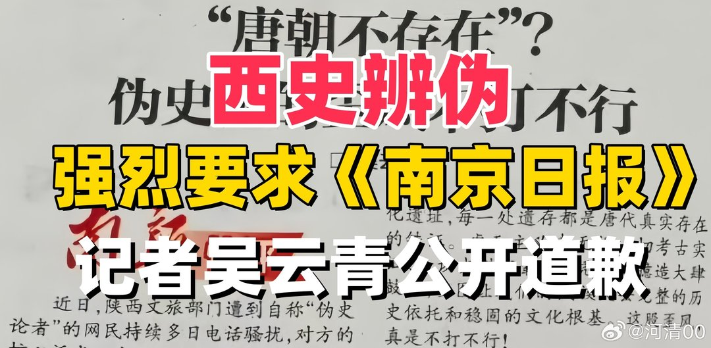

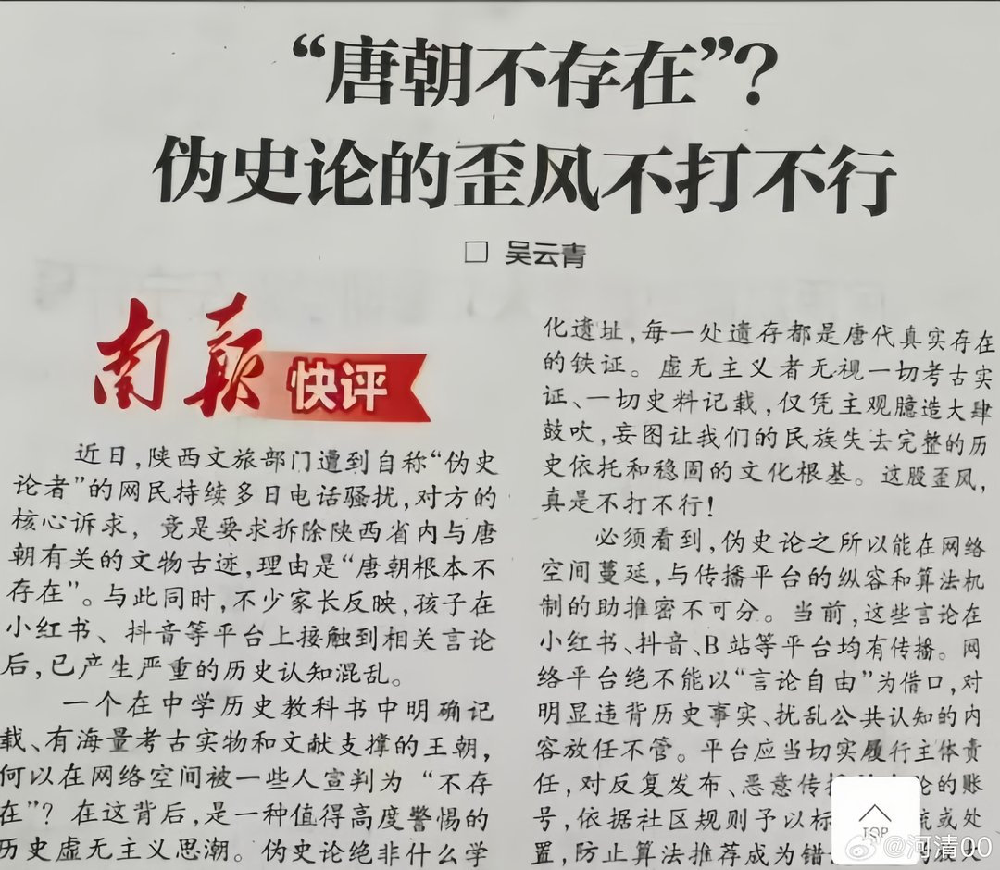

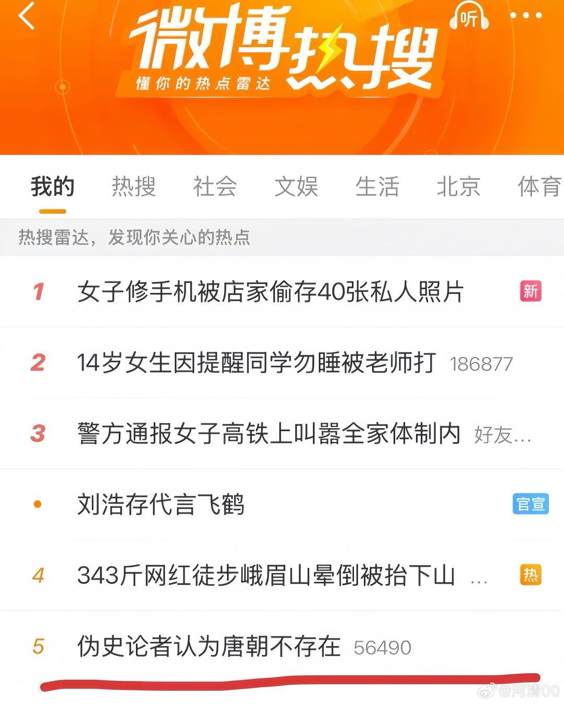

---

## 7

@物理芝士数学酱

发表于：2026-08-01 15:59

来源：微博

链接：https://m.weibo.cn/status/5327254621259046

午夜\#学术新闻\# 

无疑，今天最为重大的学术事件是OpenAI 公布 10 个数学与理论计算机科学突破。

OpenAI 宣布其内部模型 Astra（下一代模型） 在多个长期停滞的数学与理论计算机科学难题上取得突破。这些问题多数已至少十年无进展，涵盖几何、编码理论、群论、算子代数、量子复杂性、密码学与组合数学。

每个结果都由模型生成数学论证，再由人类整理成论文，并由模型完成 Lean 形式化证明。网页链接

1. 高维球体填充（Sphere Packing）

给出新的上界，逼近 Cohn–Elkies 阈值，推进高维几何中的核心密度问题。

Maryna Viazovska 因在维度 d=8 和 24 中的最优性而获得菲尔兹奖。（今年三月，名为高斯的模型在Lean中自动形式化了这篇论文。）

她今年3月建议可能近似 Cohn–Elkies 以适用于一般维度 d，但当时听起来像是科幻小说！

见图二，这个阈值里同时包含了两个最为重要的数学常数。

2. 二元码与球码（Binary & Spherical Codes）

在任意给定最小距离下，给出 指数级改进 的最大码规模上界；球码也有类似结果。

3. 非 sofic 群（Non‑sofic Groups）

构造出 非sofic群，解决群论中极重要的开放问题。图三

这个是说，存在一些群无法被有限群逼近！或许是这十个问题里最重要的一个。准菲尔兹奖级别的成果。

4. Connes 刚性猜想（Connes’s Rigidity Conjecture）

给出反例，否定了某些群由其von Neumann代数唯一确定的长期猜想。

5. 算术电路复杂度（Arithmetic Circuit Complexity）

给出新的永久式（permanent）计算下界，包括

𝑛^4/log𝑛 级别的算术公式复杂度下界。

6. 量子并行重复（Quantum Parallel Repetition）

建立一般两玩家量子游戏的 指数级并行重复定理，扩展经典复杂性理论的基础原则。

7. 最近向量问题（Closest Vector Problem, CVP）

通过全新方法（Reed-Solomon技术）证明了最近向量和最近码字问题在*多项式*近似因子下的NP难度，对后量子密码学至关重要。

8. Ehrhart 体积猜想

在所有维度中确定：质心为唯一内部格点的凸体，其体积最大值是多少。

9. 多色 Ramsey 数（Multicolor Ramsey Numbers）

给出三角形多色 Ramsey 数的 超指数级下界，解决 Erdős 问题183。

10. 极值图论（Extremal Graph Theory）

解决 Erdős 问题 146 与 180，推进紧致性与退化性猜想。

OpenAI 正在让模型参与开放数学问题的研究，并向 10 万名科研人员提供免费学术版 ChatGPT。

这些结果由 AI 生成，但由人类整理与形式化，OpenAI 强调应正确归属 AI 的贡献。

这些突破已引发后续研究，例如 sum‑product 反例、Elekes–Rónyai 问题进展等 。

ps OpenAI 宣称，解决这些问题的总开销是2000美元。这个应该是春秋笔法。我是不相信它总共就处理了10个问题，然后都得到了突破性结果——这十个问题都不挨着。我猜这一次可能总共处理300-1000个问题，然后最终出结果的就这10个。

不过也很厉害了，如果是人类的话，一年里能给出这10个结果，那基本上下届菲尔兹奖有望。主要是人类无法和AI拼产出量，所以AI的产出优势反而不会被看作是超越人类的地方。

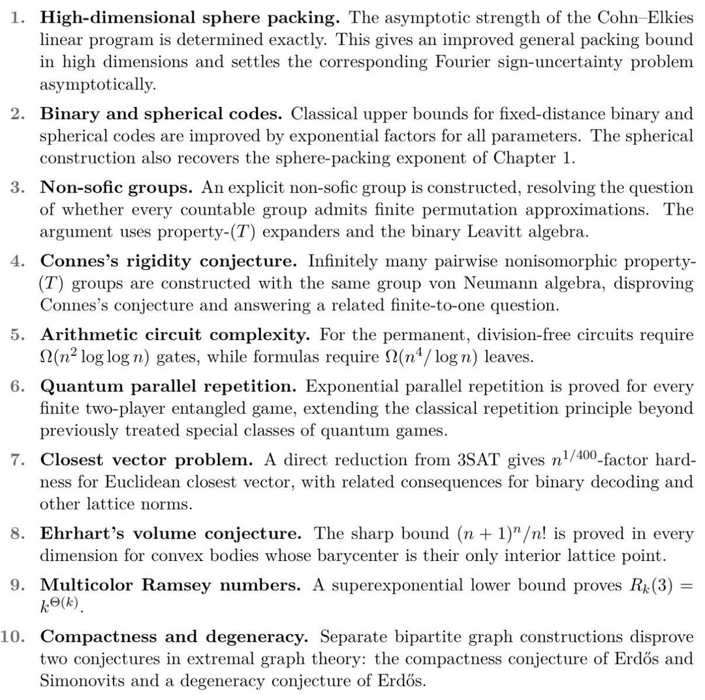

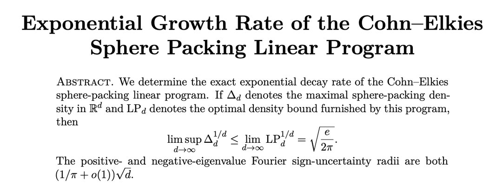

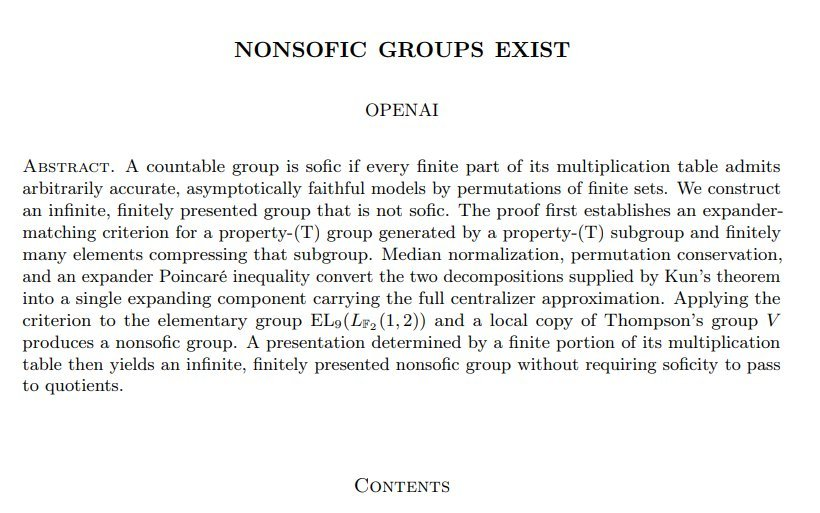

---

## 8

@房昊曰天

发表于：2026-08-01 16:10

来源：微博

链接：https://m.weibo.cn/status/5327257457138403

最近在学女频短篇。

朋友说你这像是乔峰在练玉女心经，我说我也不是乔峰啊，我分明是杨过，杨过练玉女心经毫无违和感好吧。

多一门功夫，多一条路。

而且这功夫确实很神奇。

以前我写文，都是顺叙，情绪一点点铺陈，经过一个个事件，最后爆发出来。

浓烈，酣畅，淋漓尽致。

到玉女心经，则是另一个领域。

编辑告诉我，你忘掉顺叙，把顺叙这俩字从你脑子里摘掉！

上来就得刺激！

后来渐渐明悟，这门功夫也讲究情绪，下沉市场全是情绪，但跟我那种情绪功夫不同。

你最好情绪激烈，上来就激烈。

激烈完了，也不能倒回去说前因后果，前因后果你要放在后面。

主事件往前推的同时，把前尘往事里的情绪回头捡起来看。

你得拉扯。

不能爆发。

也不是说完全不能，至少在很长一段时间里，要重拉扯，而不是铺爆发。

拉扯的法子很多，像之前那种前尘往事捡起来回看，也有像渣男也有三分真心之类的……

总之拉扯才是这门功夫的精髓。

还是很有意思的。

但总感觉我未必能练得成，反正先练练，练不成也不亏~

---

## 9

@斯图卡98

发表于：2026-08-01 23:46

来源：微博

链接：https://m.weibo.cn/status/5327372217485506

无法理解她这么想的动机是什么，为了起号？：

---

## 10

@那能一样吗V

发表于：2026-07-30 08:03

来源：微博

链接：https://m.weibo.cn/status/5326410187279131

骗骗网友就算了，可千万别把自己骗了

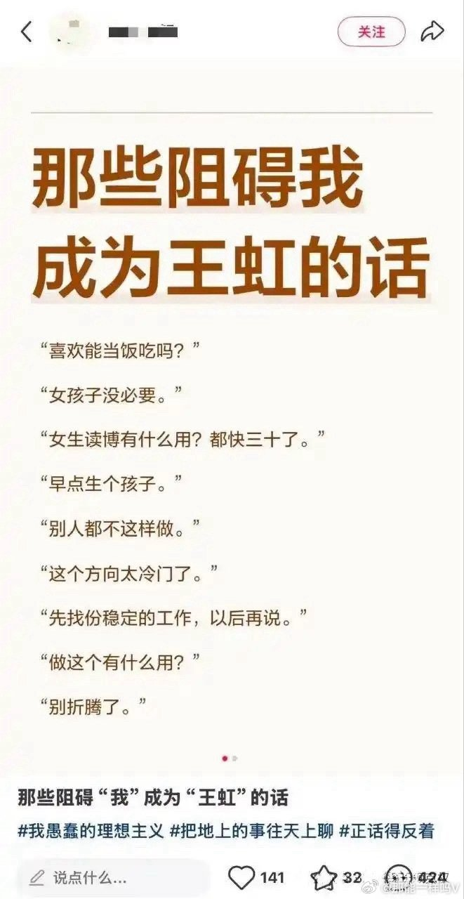

---

## 11

@江宇行舟

发表于：2026-08-02 08:44

来源：微博

链接：https://m.weibo.cn/status/5327392480431461

\#中国新型战机超视距猎杀\#“五七空战”的收获就是，以大打的姿态来上一场牛刀小试，对方就知道和平的可贵，转而宁愿全球宣讲，也不在一亩三分地开战。

哪怕是最不讲理的巴拉特人。

作为世界第二大海军，还能遇上下图这样的画面，就在于对方笃定，咱不会真动手。

不是光靠阅兵和演习就能吓退对方，因为但凡是个学过经管类的，大学一年级前三堂课，就都会学到“意愿和能力”，知道如果没有意愿，能力再强也不会产生行动。

管你曼昆、萨缪尔森、德鲁克……都会在开头就讲“意愿和能力”。

对方高层绝大多数美国经管类留学生，再不学无术，这点肌肉记忆还是有的。

敌人就吃定了我们没有意愿，所以才会发生九三阅兵还没多少天，陆续发生澎湖海巡鼠立即抓扣渔船、菲律宾升级南海挑衅、日本首相直接喊“台湾有事就是日本有事”这样的恶劣挑衅。

它们仅仅只是对我们意愿做出了自信的研判，就能通过现实挑衅，反过来又强化了自己“以小搏大”的神话，进而杀伤我们的国家形象。

这是十分腚不偿失的。

所以现在特别能理解赫鲁晓夫和公知都蛐蛐过的毛主席“早打、大打、打核大战”，“为核大战准备死上一半人”，然后组织有限的自卫反击。

如此反而打不起来。都不用说“勿谓言之不预”、“是可忍，孰不可忍。”只要说到“一切后果由你承担”，就得让对方挠头研判到底是什么“后果”。

反观现在，很不幸，敌方已经能够研判“勿谓言之不预”要出现在哪张报纸的哪个版面，才值得认真看一下了……

今年是老人家离开我们50周年整，要是他天上有知，我相信会心疼的。

其实随着实力的强大，我们会发现，工具箱的丰富大打降低了施展跨国强制力的机会成本，动手未必是真的开战，比如抵近突防、登船临检、特定封锁、抓扣审判……对于舆论影响很恶劣、但是实际烈度并不大的斗争，我们作为硬实力占据碾压性优势的一方，完全可以用战争以外的强制力，来保证自己利益的实施。

这其实就是“巧实力”。

这时候再回看“五七空战”，甚至还能发现，之所以还会爆发一场低烈度的战斗，恰恰是因为印度纸面国力是大大超出巴基斯坦的，如果两边掉个个儿，可能强大一方发动一波电磁干扰加目标锁定，对方已经知难而退了。

别说摸着鹰酱石头过河了，连巴巴羊都在给兔子攒经验。

只是最具说服力的那一哆嗦，别人是替不了的，终究还得自己来完成。 

我期待早日在敌人划定的禁区，给他们表演一次\#歼20隐身突击战法演练画面\#

---

## 12

@南山林雪萍

发表于：2026-08-02 10:44

来源：微博

链接：https://m.weibo.cn/status/5327415595502684

或许中亚最大的悲剧在于它的整个国土被设计成一个卫星供给地。它的产业被斩头去尾，形成了依附其他国家贸易才能流动的单一经济体。

乌兹强烈依赖侨汇，是全球接收侨民汇款排名第9。2025年达到高峰的190亿美元，占比GDP近14%。它有75%来自俄罗斯，哈萨也有5%。这一点，强烈地反映了它的人口结构和经济关系。苏联解体之后，乌兹有100万俄罗斯族人离开，前往俄罗斯和哈萨。相反，哈萨只有不到30亿美元，占比GDP不到3%。实际上，哈萨反而是劳工人口净进口国。相比哈萨而言这个邻居而言，乌兹是 3 0 0 0 万人口大国，而经济却是一个小国。。

《中亚行纪》是一本很好地描述中亚五国当下生活与历史的沙拉大拌菜。在这里可以看见一个转变中的社会，所具有多样性的特点。

咸海的消失，最能代表乌兹的命运。

阿姆河从帕米尔高原的阿姆河经过土库和乌兹并进入咸海。阿姆河反复无常，经常改变河道，迫使人们只能跟着河水走，小镇也经常全体迁移。

然而当苏联在1960年开始在这里是实施“白金计划” 的棉花种植基地的时候，阿姆河的流道被人力强行截断和改道。1 公斤棉花耗水约 1.2 万升，而在水流动的过程中又会损失消耗 30% 以上。阿姆河开始平缓的收滑，很多河水再也无法抵达西部的咸海。失去淡水源的第四大湖的咸海因此收缩，地球喉咙里发出不满的声音。人缺水时嘴唇会发干，而咸海湖则成为地球干裂的嘴唇。咸海先是南北裂开，然后又东西分裂。东咸海在绝望中干涸。同样感到绝望的西部城市努库斯城市。

在白金计划前，它有活跃的捕鱼船队，而现在这里已经成船的坟墓。只有沙子通向远方，海洋早已退到 200 公里以外 。乌兹别克斯坦失去了与海洋的唯一联系。现在哈萨克斯坦当局正在设法挽回面积略小的北咸海的局面，但南咸海已经无法恢复。

全球最大的地壳改造实验，成就了棉花农业的成功，但它却葬送了咸海的命运。沙漠成为肥沃的棉花种植园，而咸海则一步一步化成了沙漠。沙漠带来了新的反噬，大规模的盐尘暴开始向东飘散，一度进入首都塔什干。这是一个地球提前衰老的迹象。

乌兹中部城市撒马尔罕，同样记录了乌兹的千年历史。撒马尔罕，是一个商人之都，这里的人从小就教育经商。骨子里面都是商人。汉朝开始的丝绸之路其实就是纸之路，撒马罕的纸张一直是驼背上最重要的货物。

中亚作为亚洲的心脏地带，东西贸易路线的终点。这一地理位置塑造了它成为人与思想交流的往来不止，使得撒马尔罕、土库的梅尔夫这样的城市一度成为繁荣的学问中心。换成中国人熟悉的语境，中亚是丝绸之路的中线点。因此，与世隔绝并不是常态。各种不速而来的贸易商人，加速了这里的物资交换。当然，这里也接待各种军队的征伐。

中亚在经过反复外族的反复入侵，逐渐丢失了中枢之路。中亚的黑暗世界开始到来。先是阿拉伯人入侵，并且在当地完成了伊斯兰化的初步尝试。没有被阿拉伯毁掉的文化，随后被成吉思汗的蒙古铁骑所碾压。成吉思汗死去 100 多年，瘸子帖木儿依然想重建这个梦想。帖木儿基本上也成功了，建立了当时庞大的莫卧儿帝国。他战胜了大马士革。战胜了土耳其奥斯曼人，打败了印度。他还打算进攻明朝的朱棣皇帝。两个世界上最大的陆军战队，差一点迎头相遇。就在这一刻，帖木儿命亡。

辉煌之后，就是寂寥。帖木儿帝国被敌对的各部族瓜分了，他们对贸易征收高额关税，却无法保证商队路线的安全。丝绸之路开始毁坏，而明朝也在郑和之后封海毁船进入向内收敛的时代。正是此时，文艺复兴再次兴起了文化与科学的辉煌起点。当丝绸之路关闭的时候，大航海时代的大门则徐徐打开。贸易进入了一种全球主义主导的海洋秩序。

剩下的时间，无可记忆。二战后前苏联将这里设计成“只要向北看”的唯一需要。封闭依然是压倒性的。而在苏联解体之后，中亚五国的选择是意味深长的。除了吉尔吉斯斯坦之外，没有一个共和国能够大步走向民主。大家基本都是先后撤到酋长国和汗国时代，强人总统选择了长期执政。

在第二代执政者，才开始缓慢做出新的选择。乌兹成为苏联的一个外挂躯壳，而在苏联解体之后。它的进化比俄罗斯还要慢。就像是金蝉脱壳最后分离一刻的那个壳，它在树上轻微的颤动。

在当下，能够指示中亚与丝绸之路有着强烈联系的化石，是撒马尔罕的西岳布市集 SIYAB市场。《中亚行纪》提到，这里即使最小的交易，不管是个香蕉还是橙子，都要讨论和协商。这就像仪式和舞蹈，一切都遵循严格的规则 。

在强权撤离近40年之后，影响日常生活的种族文化也在稀薄。中亚五国的俄罗斯人正在陆续离开。生活在塔吉克斯坦的 90% 俄罗斯人。在土库曼斯坦 2/3 的俄罗斯人，在乌兹别克斯坦一半的俄人都已经离开 。中亚正在陆续回到丝绸时代的样子。

白金棉花成为乌兹出口的少数工业支柱，这是一个经济旧秩序的延续。而现在资源的争夺正在转向铁矿石，到有色金属如金银铜铝。哈萨和土库的石油天然气储量丰富，乌兹也紧随其后。它们只是需要时间，将这些油气资源，找到全新的买家。

乌兹经济结构在过去100年几乎冻僵，现在正是复苏时刻。前苏联并没有在这里播撒工业的种子，而是选择将这些国家作为原料供应商。

现在，中亚国家正在走向真切意义的十字路口：向南，是政局一直不稳定的邻国伊朗和阿富汗。那么向东靠近中国，还是继续向北与俄罗斯相连，或者向西看欧洲。

乌兹是少见的双内陆国家，它自己是内陆，周边的五个国家也是内陆。在东部，它与中国并不相邻。然而这里在张骞开发西部外交的时候，这里是有名的大宛国，并盛产汗血宝马。现在这里的安集延州与新疆乌恰县相隔250公里，但中间却隔着吉尔吉斯坦。对于乌兹而言，中国和俄罗斯占据乌兹外贸总额超过37%。但乌兹与这两个国家都隔着其他的国家。它的经济朝向的选择，并不多。听上去，这是一个绝望的地理困境。

全球经济正在围绕着地理版图，重新流动。新疆西部的喀什、霍尔果斯等城市，正在有可能成为供应链枢纽的新价值。贸易交叉点重新闪亮。或许乌兹只有进行大手笔的外交地理设计，才能把握住这次供应链大重塑的机会。8 月下旬去乌兹调研，现场一探究竟\#大出海\#\#中亚五国大出海\#\#供应链攻防战\#

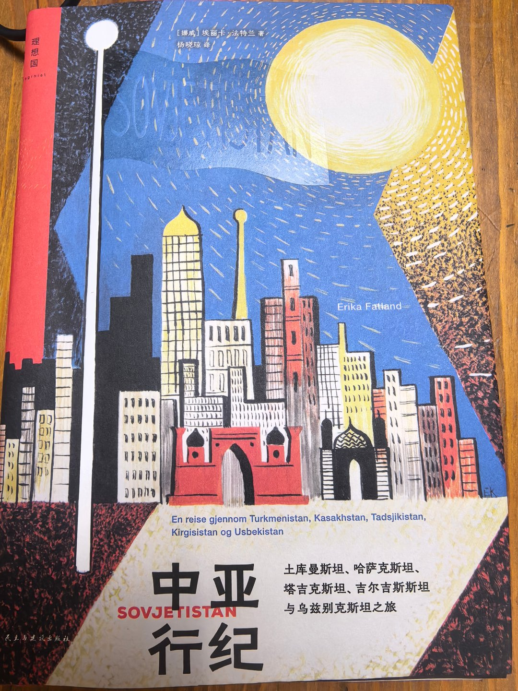

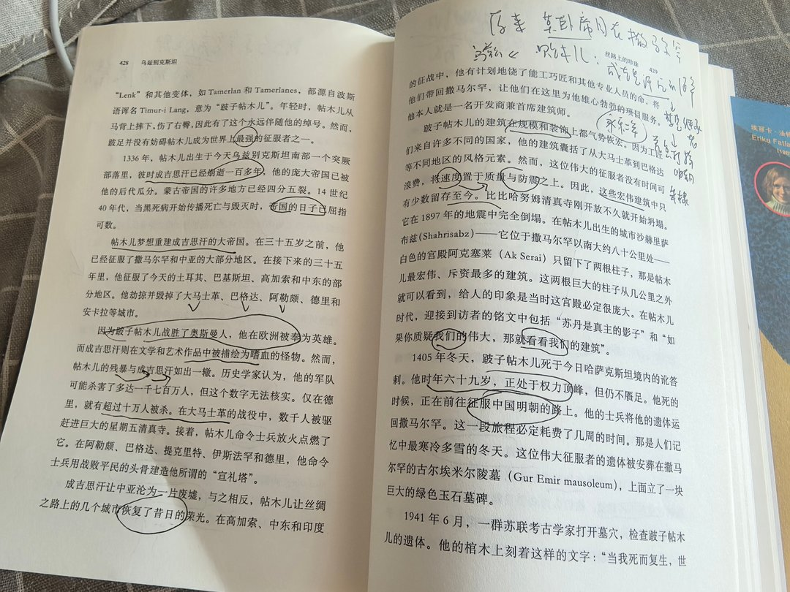

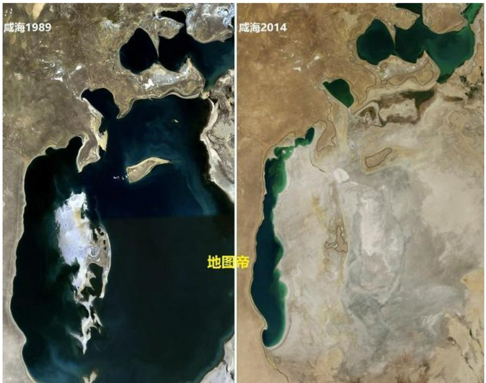

---

## 13

@sven_shi

发表于：2026-08-02 11:44

来源：微博

链接：https://m.weibo.cn/status/5327432909325734

借着房主任这个事情我给大家讲讲农村土地的事情。我们国家的农村土地原则上是“集体所有”，你是村的人，就是集体的一分子，自然有钱享受土地带来的收益。大多数的民众提到农村，就是一群人在辛苦的种地，拿很微薄的收入。但是现实中少数的农民早就因为土地暴富了。

这里面最典型的是拆迁，收益最高的，一般认为是珠三角区域的农民。因为收益太高，所以一般都会对大众保密，媒体上一般不介绍他们的财富分配情况。像我们去了解这类问题一般是通过暴富后的离婚案。比如深圳之前有一个保姆案，曝光出来的拆迁分配就是一家人光房子分到了2100平米，指导价13.2万。这个数字你可以自己算算。

再比如东莞之前的长安镇出过一个新闻，大众质疑他们当地的扶贫，给困难户发了500块。照片里一看困难户怎么都住别墅？肯定有猫腻啊。当地哭笑不得，因为他们早就通过土地实现了全面小康，家家户户住别墅，年年定期分红。你在网上看到北欧讨论的全民收入制度，早就在我国这些农村小城镇实现了。

北欧那个福利标准，我国这些农民是真看不上。他们因为全民发钱，大家收租无事可做，都已经开始规定有工作能力必须要有工作（哪怕是扫地清洁）才能领福利了。

为什么这么好的事情不宣传呢？

因为大家知道福利好，很多政策就推不下去了。比如房主任在的山东，之前要搞合村并居，征收农民的土地给农民集中安置，就遇到了集体的抵制。

土地是可能发大财的，所以大家就不肯让土地被征用了。

回到房主任事件，整体很简单，就是夫妻本来就是凑合过日子，女方收入高了暴富了，就不想和男方分享财产，要离婚。

因为是女性暴富，而且当时舆论上要把她捧成农村女性偶像，所以做文章就是明着造假，说她是“净身出户”。她也装的很可怜，还要去她前夫家的农村分集体土地。

工作人员一查就知道她原先就不是她老公他们村的，而且自己在城市中有房产，根本就不符合要求的。根据情理她都不该分土地。接着就是这些基层干活的倒霉，被她反复施压。

事情曝光之后，基层压力很大。后来讲出来她自己爆红之后就已经购置房产了，落户根本不成问题。

可之前宣传不是她很可怜没钱净身出户吗？

所以她房子哪里来的呢？

一个谎话连一个谎话，这房子竟然变成说带她说脱口秀的师傅“送”给她的。

说她不想和老公分钱，所以请师傅代收收入，用钱给自己买房，才更合理。

你想想看，之前把她包装成一个受迫害逆袭的底层女性故事有多过份？

不是她真的踩过线了，这个谎话就能一直维持下去。

---

## 14

@sven_shi

发表于：2026-08-02 10:45

来源：微博

链接：https://m.weibo.cn/status/5327418225329262

最近那个原配起诉要求销毁小三胚胎的案子，十多天以来，已经换了无数个话题上到热搜第一了。讲讲看里面的很多知识确实对大家来说很新。像生育决定权以及未来的婚姻和生育剥离的问题，对很多人来讲都是第一次听到，并且大家的第一反应都是觉得法律这样规定会带来“世风日下”的问题。

但是这些问题的本质其实都只有一个字：钱。

\#丈夫婚外情10年患癌妻子为何隐忍\#？因为钱啊。这个男方根据他妻子的说法和她早就没有感情了，但是女方哪怕患了癌症，都想努力给男方去再生一个孩子，坚持不肯离婚。原因很简单，她是希望男方把钱留给她生的孩子。而男方搞的胚胎方案，本质上也是转移财产的“成熟”流程。

这种婚姻男女双方一开始就是凑合着过日子，一方有钱了，不愿意分给另一方，所以会有一系列的操作。

昨天热搜上房主任的事情本质也一样。她是个农村妇女，偶然爆红之后，收入开始暴涨，不愿意分钱给老公，所以离婚。媒体上针对这种女性有钱所以离婚的事情相对宽容，而且农村女性中年逆袭的故事本来也很励志，所以开始的时候给大家的就是“假报道”。

明明是女方有钱了，想要和男方离婚，写的好像很决绝，竟然宣传成“女方净身出户”摆脱男方。

本来事情就这样了结了，女方离婚后，未来收入和男方无关，男方未来的收入也和女方无关。表面公平。没想到女方这边还想要继续施压要男方家村集体的未来分红，演的还特别惨，说她是净身出户没有地方落户口，不断的给当地施压。

最后事情曝光，其实房主任是自己在城里有房子的，但是这套房子是她的脱口秀师傅“送”给她的。

教教脱口秀，改改稿子，还买房子送给她，这符合逻辑吗？

说这笔钱是房主任的演出所得。她红了之后薪酬应该很高，为了不让她的丈夫分享到她的收益，所以她请师傅代收财产接着再变成房子转增给她。这个说法我觉得明显比她讲的那个悲惨的离婚净身出户，没办法才想到丈夫的村集体要钱的故事更加合理。

太阳底下没有新鲜事。本来就是凑合着过日子的夫妻，一方暴富了，就想着把原配甩开，独享财富也是一种人性。只是真没必要因为性别原因，就把事情颠倒过来。

而司法上面对这样的事情，绝大多数时候都是无能为力的。 

（图三补了房主任当时的采访，大家可以仔细读下）

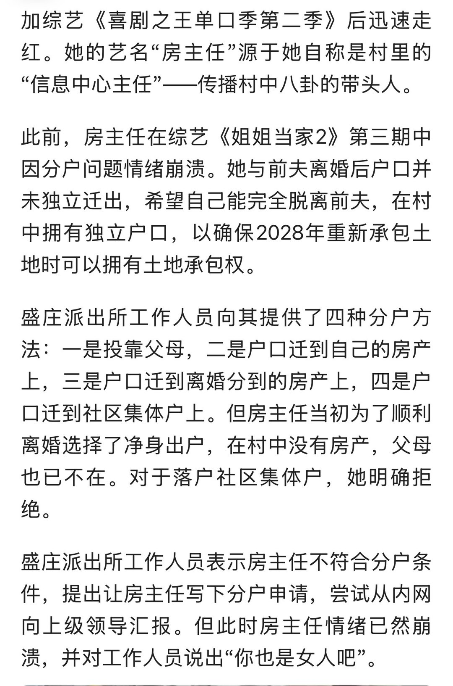

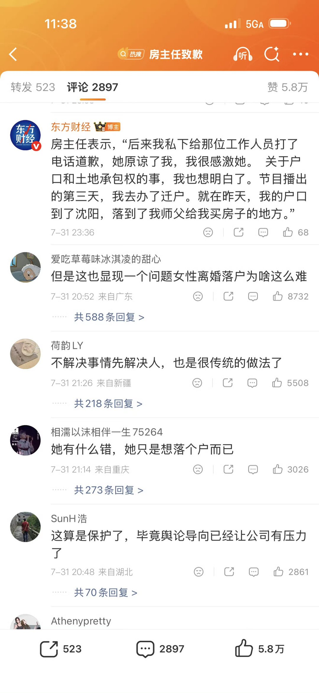

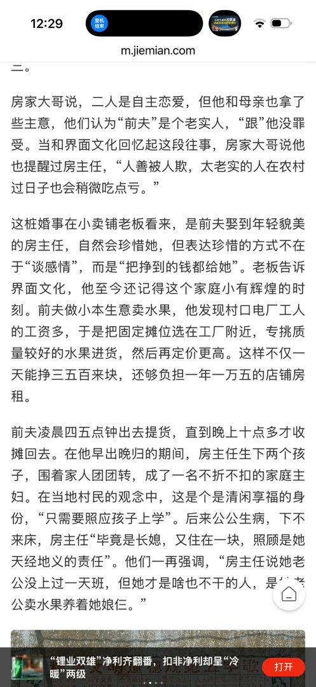

---

## 15

@赤道财经

发表于：2026-08-02 11:45

来源：微博

链接：https://m.weibo.cn/status/5327429331849535

【\#房主任女儿称母亲是愧疚式教育\#：她想从我身上找那些愧疚感，小时候一直很愧疚，大学后觉得母亲是为了她自己】\#房主任女儿称从小遭受愧疚式教育\# 近日，《姐姐当家》最新一期节目中，脱口秀演员房主任（房绍莉）与女儿的一番对话引发热议。房主任女儿称母亲的行为属于"愧疚式教育"，相关话题迅速登上热搜。

节目中，房主任在家庭聚餐中对女儿说：“你说我要有这个妈，天天拼命在外面给我赚钱，回家你说我不得天天老关心了？”女儿回应：“这就是不是那种愧疚式教育……她想从我身上找那些愧疚感。”

房主任女儿继续说道：“她每回都这样，拌一堆菜，我一要帮点忙，（她说）上一边去，你能帮什么忙，上外边去。然后做完了，累得要‘死’说，我拌了一桌子菜，你俩没一个出来帮忙的。无解，这种问题无解。”

房主任回应称：“你再怎么着，你小时候我对你，也比你姥姥对我好。”对此，女儿无奈道：“又开始比了，我的天，又开始比了。”

随后，房主任女儿还补充道：“她从小对我是这样说的，从我记事起就说，我从这个家没走都是为了你，我长大之后就对她说，你不是为了我，你是为了你自己。因为她没有退路，我大学的时候就反过味来了，我小时候一直觉得很愧疚。”（都市现场）钱江视频的微博视频

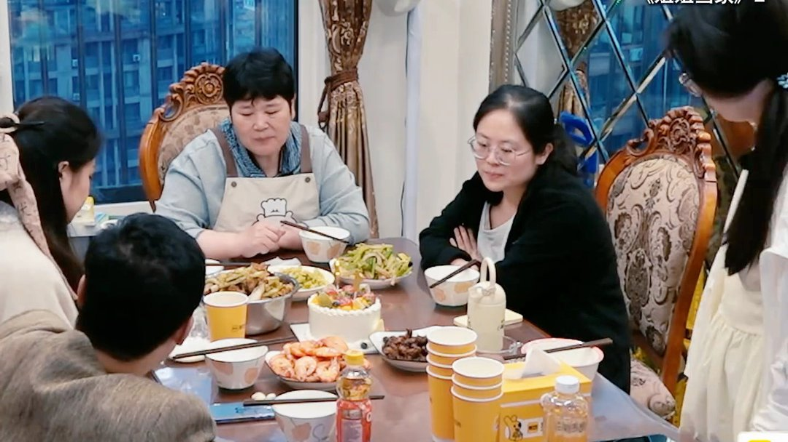

---

## 16

@贾林州大河之南

发表于：2026-07-31 03:44

来源：微博

链接：https://m.weibo.cn/status/5326707466699343

2014-2025年，我国gdp从64万亿增致140万亿，增1.2倍，而基础货币从28万亿增致38万亿，仅增0.3倍。如果计入外逃2-3万亿美元，实际上，中国经济已经严重失血了，至休克了。。所以，我国货币乘数倍增至9了，所以小微处处高利贷了，。所以，中国经济从此超级通缩16年了！强制结汇取消后，发钞权让渡美联储，巨量顺差源源不断流入美元资产，所以美股超级牛市了。

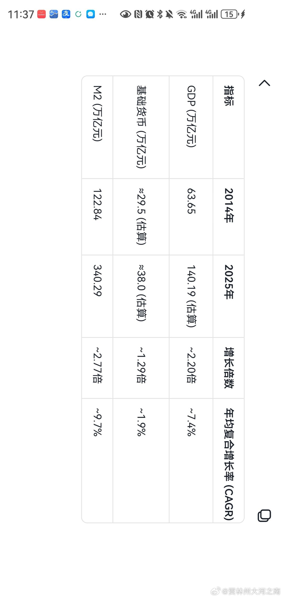

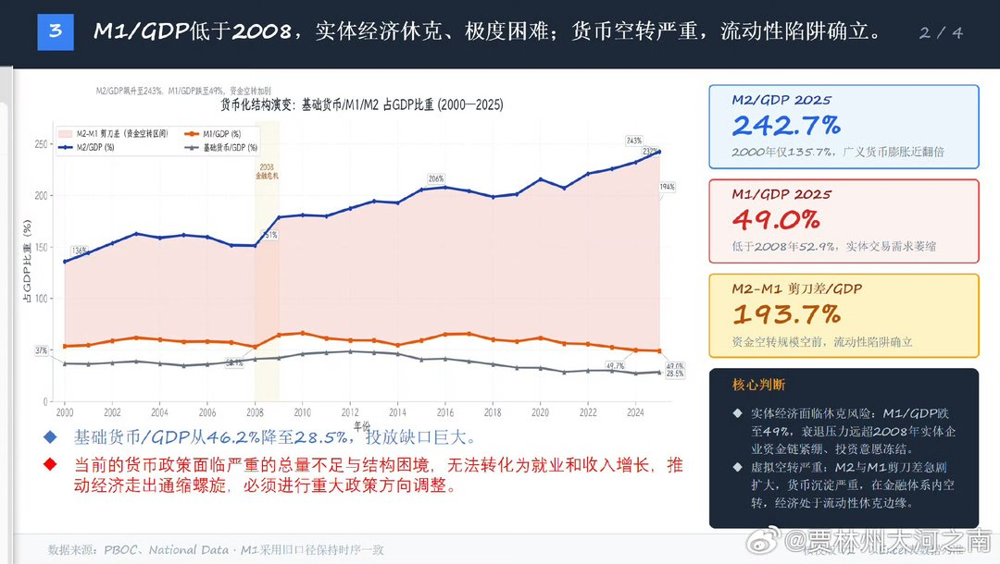

---

## 17

@阑夕

发表于：2026-08-01 07:48

来源：微博

链接：https://m.weibo.cn/status/5327131125219482

DeepSeek V4 Flash的竞技场跑分开榜：

智能水平排名Top 13，任务成本排名最低，比它聪明的没它便宜，比它便宜的⋯⋯哦，没有比它便宜的。

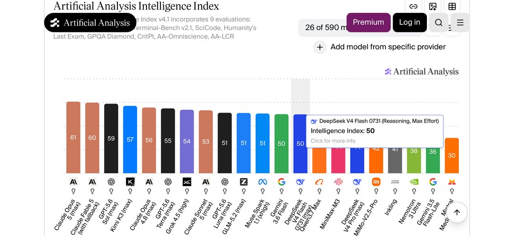

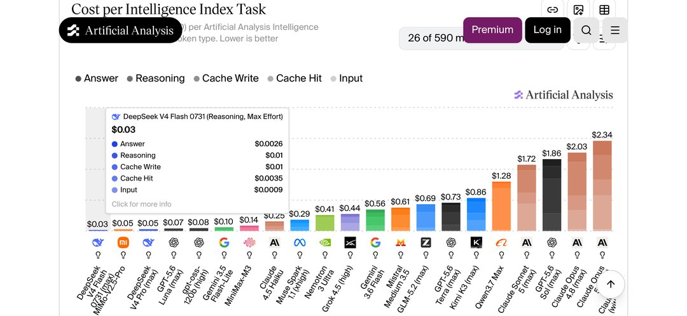

---

## 18

@斌叔OKmath

发表于：2026-07-28 01:34

来源：微博

链接：https://m.weibo.cn/status/5325587503382728

一家中国 AI 实验室，竟然允许我——一个美国人，直接下载这种训练和开发成本高达数千万美元的前沿智能模型到我本地的冷存储上

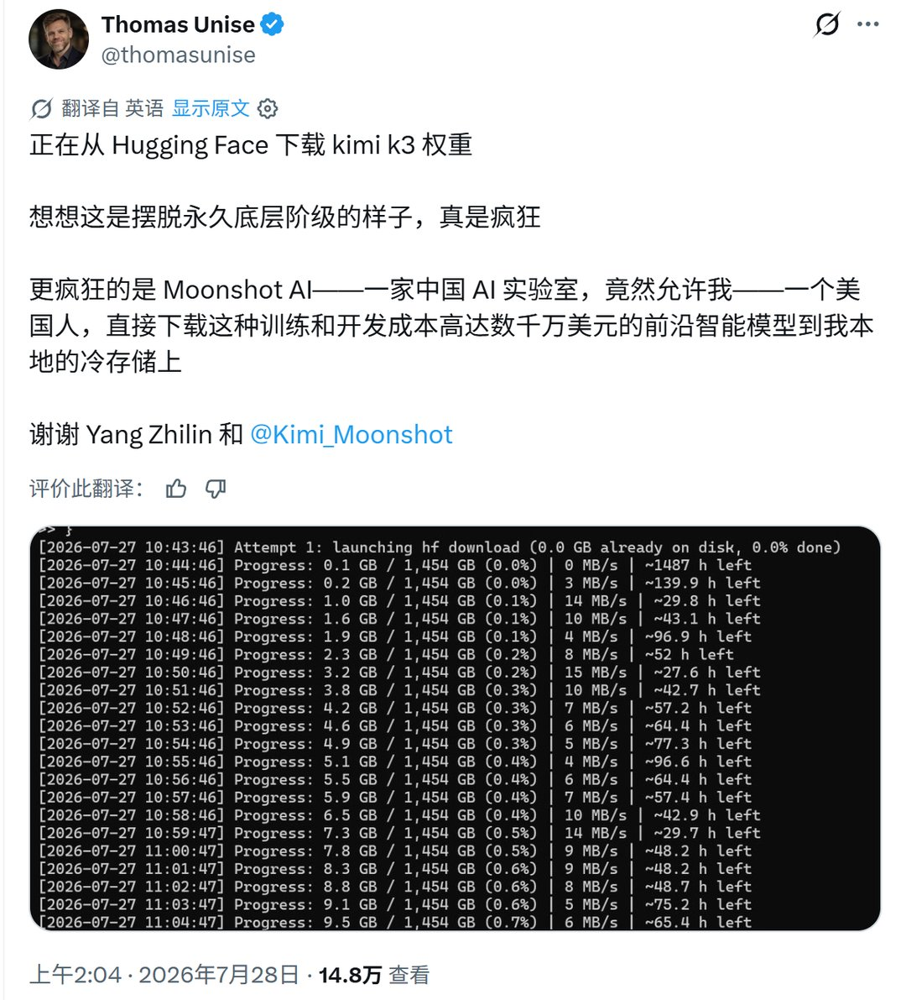

---

## 19

@挨踢牛魔王

发表于：2026-08-01 22:07

来源：微博

链接：https://m.weibo.cn/status/5327347323505083

deepseek v4 flash的斩杀范围，在这个范围内的没它强，也没它便宜，横扫一大片。

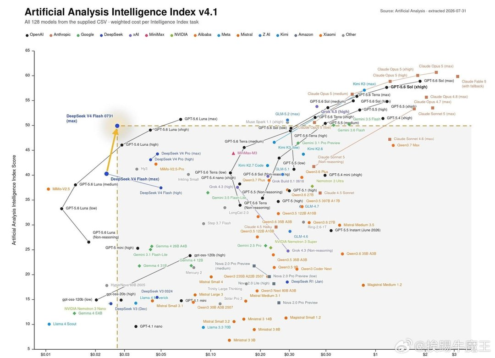

---

## 20

@i陆三金

发表于：2026-08-02 11:46

来源：微博

链接：https://m.weibo.cn/status/5327428571366886

Andrej Karpathy 的 LLM 测试用例：给定《指环王》的第一段落、100 万个 token 的预算，并要求它生成三个 JS 渲染版本

Opus 5 在多模态、游戏玩法上有缺失，导致出来的东西还是很粗糙。

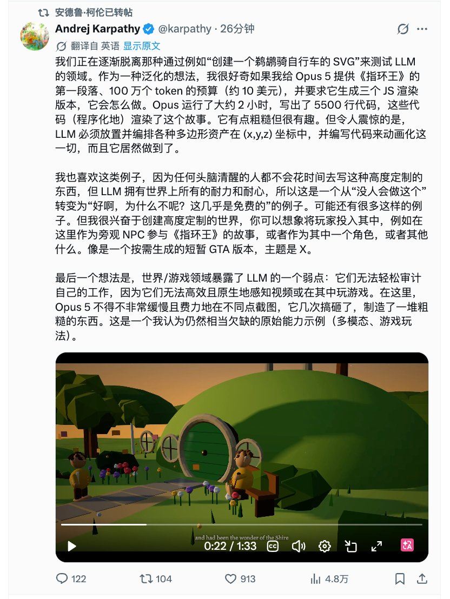

