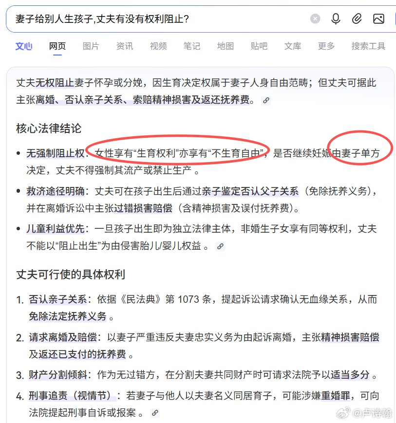
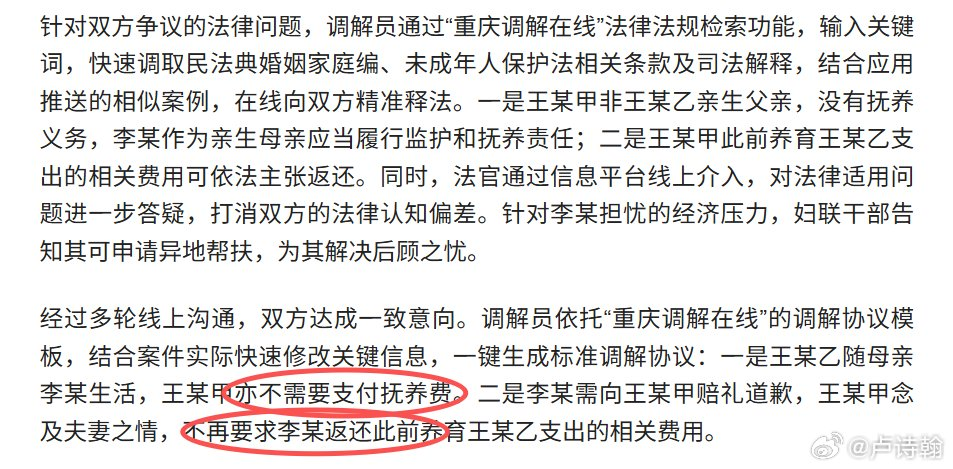
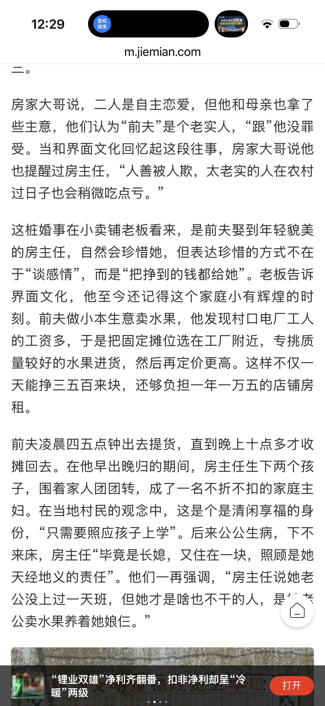
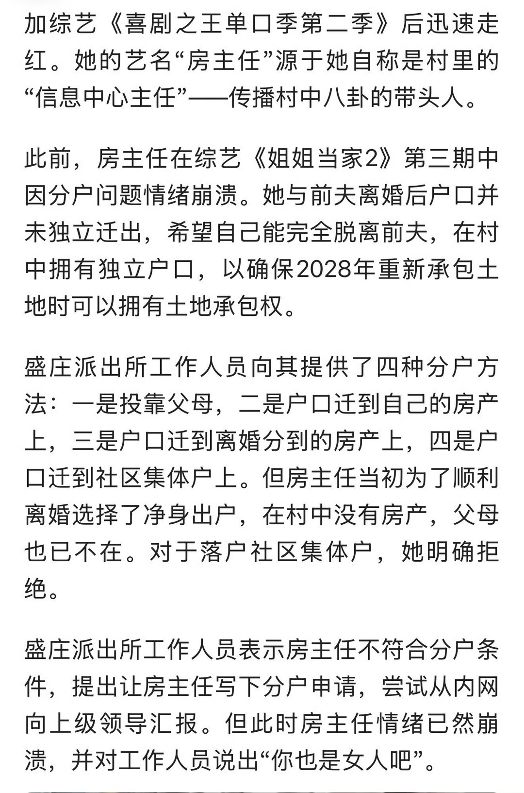
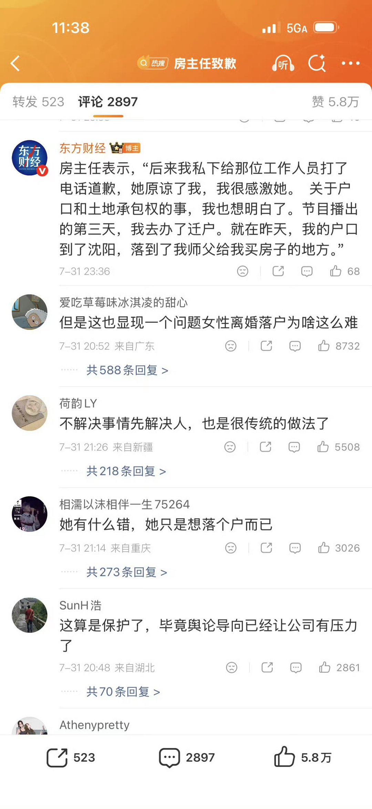
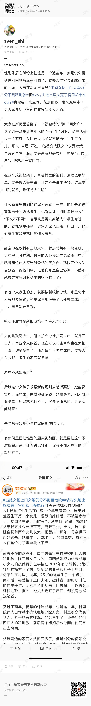
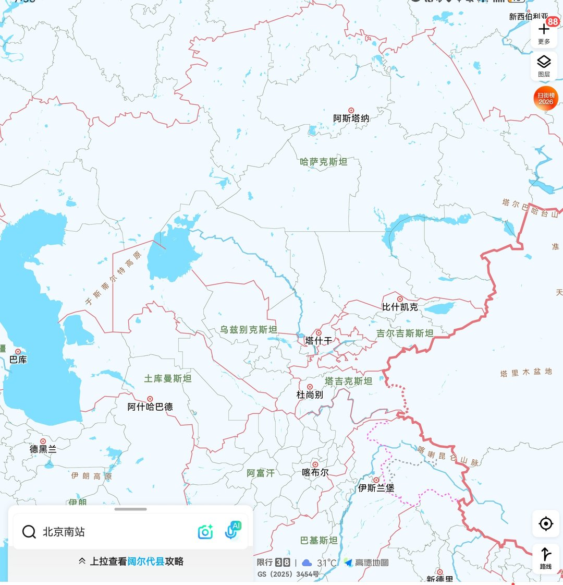
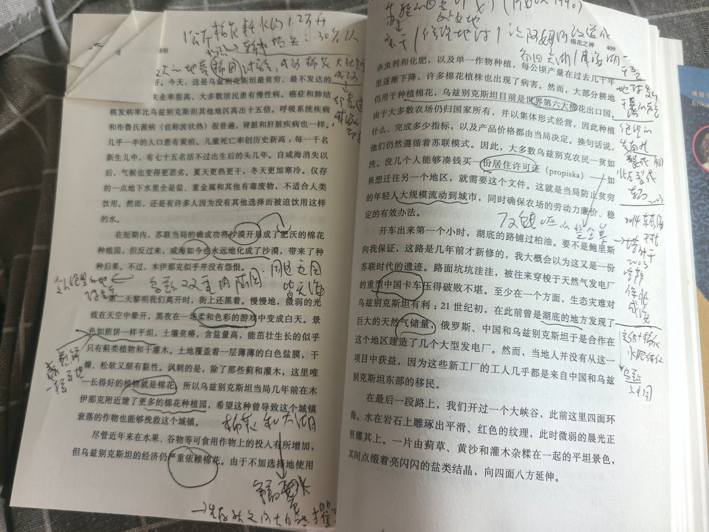
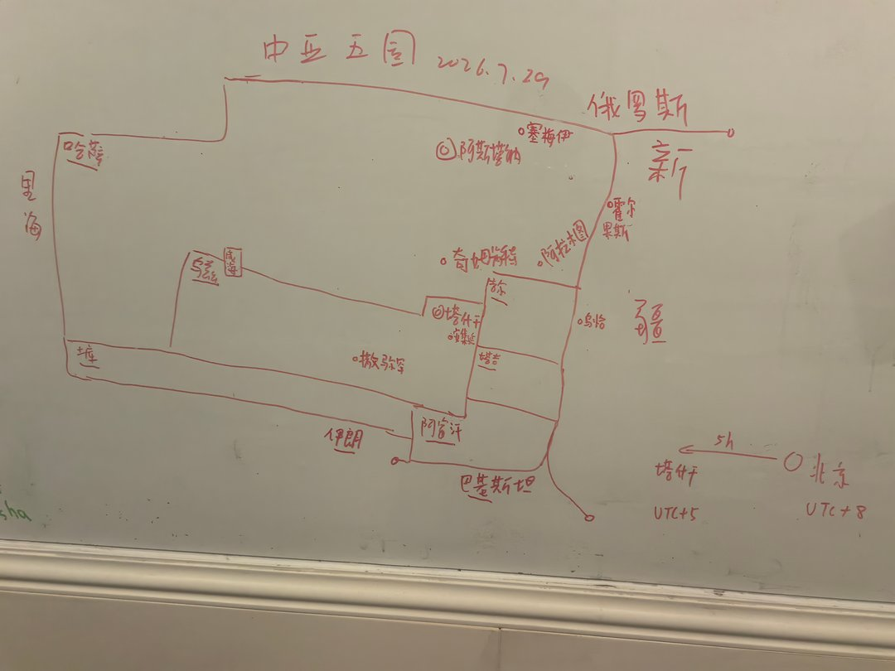

# 2026-08-04

## 1

@张宏杰

发表于：2026-08-03 09:03

来源：微博

链接：https://m.weibo.cn/status/5327874812808243

转型健康博主，讨论一下哪些东西尽量少吃。

牛蛙，甲鱼，小龙虾，因为高密度养殖，超标用药，存在很大安全隐患。

事实上，部分大型淡水鱼（尤其是养殖周期长的）也不建议经常食用，例如草鱼鲤鱼鲢鱼黑鱼鲶鱼，因为它们养殖密度高，容易使用消毒剂、抗菌药物，运输和暂养过程中可能使用一些不规范处理方式。

其他鱼虾，虾仁（冷冻）少吃，有些“保水”增重，磷酸盐超标；或存在兽药（如孔雀石绿）残留。明虾（活）则可能兽药残留超标，如恩诺沙星。黄鳝很容易兽药残留超标，如甲氧苄啶等。不要买便宜的小黄鱼，有些违规使用兽药，如五氯酚酸钠。

此外肉鸡（尤其是快速生长型白羽鸡）尽量少吃，因为生长周期短，养殖密度高，疾病控制压力大，违规使用抗菌药物可能导致残留问题。少买特别便宜的冷冻鸡肉，优先选择大型品牌或有追溯渠道的产品。

部分海鲜（尤其是来源不明的小海鲜）也要注意，例如小贝类，近海捕捞的小杂鱼，主要风险是重金属积累。

此外，问题较大的是食用油，小作坊压榨油，来源不明的芝麻油、辣椒油，很容易因为储存不当产生霉菌毒素。

蔬菜水果类蔬菜水果类，菠菜、羽衣甘蓝农药残留风险高。草莓、葡萄也是。韭菜、芹菜、豇豆也是农药残留（如毒死蜱）超标的高风险品类。桃子、油桃也是农药残留风险高。

---

## 2

@数字生命卡兹克

发表于：2026-08-03 13:08

来源：微博

链接：https://m.weibo.cn/status/5327936377063065

今天，Qwen3.8-Max正式版，终于发布了。 

2.4T，又一个国产巨无霸，单次激活95B，100万上下文。

开源模型，终于全面迈入了2T时代。

今天体验了一下，综合能力大概跟Kimi K3在同一个档位，互有胜负，你要硬说谁更好一点吧，我感觉从日常的任务和开发观感上，已经很难进行区分了。

但是Qwen3.8-Max的优点就在于，价格低很多，以及推理速度非常的快，$2/百万输入、$6/百万输出，是Opus 5的30%的价格，K3的50%左右。

前几天DeepSeek V4 Flash的斩杀线的梗我相信很多人都看过了，在长程Agent这种海量烧Token的场景下，有时候，差不多的性能，我比你便宜，那我就是好。

Qwen的Token Plan目前价格还有优惠，可以随便买，而且这次口碑确实不错，就怕后面也涨价，我自己也买了一个季卡先囤着了。

然后呢，这次Qwen3.8-Max的前端很强，网页结构、视觉层级、组件细节和动效都做得不错，在后端和长程任务上也不错。

但是最让我意外的，居然是写作能力。

这两年，所有模型都在疯狂特化Coding和Agent。

然后我们现在就看到一个很奇葩的现象，大家的Coding和Agent能力疯狂进步，然后写作疯狂倒退，甚至现在我做内容创作的白月光，还是很久以前的Claude Opus 4.6，但是可惜的是，Claude把我封了。

我的白月光也没有了。

但是这一次，Qwen3.8-Max，居然意外地保住了语言上的感觉。

让我感觉，写作能力居然出乎意料的还不错？

它能理解语气、节奏和留白，在语感上虽然有时候也有黑话，但是比较少，可以通过Skill的限制全部去除掉，居然让我有了一种，用Opus 4.6的感觉。

Qwen3.8-Max，意外的居然是个综合水桶。

虽然我也不想天天来回摇摆，但是事实就摆在这，新就是好，新就是棒。

现在，对于觉得绝大多数人来说，Qwen3.8-Max，可能就是最近一段时间的首选了。

真的是，各家的模型，现在都是独领风骚十几天。。。

Qwen3.8-Max下周正式开源。

但是还有一个彩蛋，是我开心的想要跳起来的。

除了2.4T的这个大模型，Qwen还会开源一个供开发者们本地部署的小模型Qwen3.8-27B。

千问终于想起了，两年前，他们是怎么让整个社区为之沸腾的。

旗舰模型，决定一家公司的高度。

小模型，决定一个生态的宽度。

如果他们只开源那个2.4T的，千问我觉得还是只能叫千问。

但是他们居然还要再开源一个27B的，那没啥可说的了。

我愿称之为。

义父。

2年前的那个曾经的千问。

他们好像，又回来了。

\#千问\#\#AI\#\#howiai\#\#ai创造营\#

---

## 3

@卢诗翰

发表于：2026-08-02 12:53

来源：微博

链接：https://m.weibo.cn/status/5327570241588533

我发现很多人没理解今天这条 \#丈夫与第三者做试管患癌妻子发声\# 的难题所在。

因为他卡住了当前时代的版本BUG

过去几年，有大量女方出轨，孩子非亲生的案件被爆出，比如经典的三娃非亲生案等。

按理说，女方出轨生子属于严重过错，你直接罚她个倾家荡产，再补偿老实人损失就行了，法律层面，维护了婚姻的意义，道德层面，维护了社会传统共识。

而且一般案件有对错争议，亲子鉴定这种唯物主义白纸黑字都写明了，还有疑问吗？

但我们的某些法律从业者，可能是为了标新立异，也可能是出于对女性的人文关怀，推动这类案件的判罚往轻量化方向去。

你们可以去看一下几个非亲生案件的判罚，赔偿是大大低于大众预期的

比如2025年这个非亲生案，多部门介入下的调解结果是什么呢？

男方不再需要支付抚养费，女方赔礼道歉，男方放弃对女方的赔偿诉求。

当时就有很多人惊奇，孩子都不是亲生的，停止抚养费也能算条件？

其实你明说法律要维护弱者维护女性，场面上也过得去

女性是弱者，法律要给予倾斜，男子汉大丈夫，吃点亏怎么了，

把这套说辞拿出来，再打点苦情牌，一般人也不好意思和你计较。

但法学理论圈自作聪明，放着苦情牌不用，

非要拿出进步觉醒那套西方自由叙事

什么生育是女性的自由啦

生育权独属于女性，哪怕你是丈夫也没有权利干涉啦

谁批评谁就是反对女性，是落后，是保守，是活在大清啦

类似发言你们肯定见过，我就不一一列举了

这套理论在场面上无懈可击，在道德层面更是牢牢占据了道德高地

网上一发更是响应无数，很多人还傻乎乎的鼓掌支持，

有人说那这和今天这个案子有什么关系呢？

关系大了

你要是承认女方出轨生育是错误，只是让男同志们让一让，

那就是好处你拿走，但牌坊至少留下了

但你又要好处又要牌坊

既不愿承认女方错误，还一个劲的把出轨生育这套包装成自由，进步，

那就给后来者留下了一个BUG

也就是今天这个案件，

妻子给第三方生孩子，丈夫有没有权利阻止？

没有，因为生育权独属于女性，这是进步的，自由的，对不对

好，那么灵魂问题来了

妻子给第三者生孩子是女性自由

那么第三者给丈夫生孩子是不是女性自由呢？

婚姻关系中的丈夫尚且不能干涉妻子的生育自由，

现在你一个法律意义上的他者，能干涉女小三的生育自由吗？

你要自由，我就给你自由，并且比你想的更自由。

现在你明白这道题难做在哪了

---

## 4

@挨踢牛魔王

发表于：2026-08-03 04:29

来源：微博

链接：https://m.weibo.cn/status/5327805794749178

minimax把海螺H3开源了，这是一个挺不错的模型。

我看过有人内测的，视频生成的还不错。

据说comfyui做了量化和优化，可以在3060上非常缓慢的跑。

这应该是近期非常有亮点的开源模型了。

下面是具体介绍:

1. 一个"全能型"的视频生成模型 

H3 是一个多模态生成系统，不仅能看图、看文字、听声音，还能同时生成带原生立体声的视频——最高支持 2K 分辨率、最长 15 秒、24 帧/秒，横屏竖屏各种比例都行，还会说 11 种语言。

简单说就是：给它文字、图片、视频、音频，它能直接"一条龙"产出带声音的视频。

2. 输入非常灵活

参考素材随便给 H3 分两个版本：一个是"首尾帧模式"（给一张或两张图，就能生成视频，不给图就是纯文字生成视频）；

另一个是"全参考模式"，最多可以塞 9 张图 + 3 段视频 + 3 段音频 一起作为参考，它都能理解并生成出符合要求的视频。就像你给导演一堆素材，让他拍成片。

3. 整个系统是"三段式"流水线 H3 完整系统由三部分组成：H3-Context-IR（负责"读懂"你给的复杂指令，整理成模型能理解的形式）、H3-Base（真正干活生成 768p 的视频和音频）、H3-Regenerate-2K（把 768p 的结果再"回炉"重生成一遍，变成 2K 高清版，细节更准）。注意：第一和第三个模块目前没有开源，只能通过官方 API 调用，开源的是中间的 H3-Base。

4. 技术内核：一个 330 亿参数的"大一统"Transformer H3 没有给视频和音频各搞一套模型，而是把它们压缩成统一的"token 序列"，交给同一个 33B 参数的 Transformer 一起预测。视觉用 16 倍空间压缩、4 倍时间压缩的 VAE，音频是立体声双声道独立处理。还内置了稀疏注意力来省算力（不过开源版暂时只有全注意力，稀疏版本以后才发）。

5. 开源范围和使用方式 这次开源的是 H3-Base 两个任务版 checkpoint（含处理器、分词器、文本编码器、视觉 VAE 和音频 VAE），可以直接本地部署生成 768p 视频。想要完整体验（Context-IR 预处理 + 2K 超清），需要用官方 API——平台是 minimax 的 API（分海外和国内版），网页应用叫"海螺 AI"（hailuoai）。

模型地址：huggingface.co/MiniMaxAI/MiniMax-H3

---

## 5

@sven_shi

发表于：2026-08-02 23:30

来源：微博

链接：https://m.weibo.cn/status/5327730738724905

很多人到现在为止还没理解为什么房主任这件事情的性质能被定城“极度恶劣”。里面最可怕的，是大众会顺着节奏瞎编所谓的“农村女性困境”。道理很简单，钱是村集体的，你不是村子成员，就不能进去分钱。

这里没有性别问题。

首先大家要知道，房主任的故事也就是她演绎的段子是假的。她从来没有被婆婆欺负过，道理很简单，她老公10岁妈妈就死了，她没见过她婆婆。现实也一直是她老公养家，她老公卖水果，早上四五点出门，晚上十点回来，工资全上缴，养她和两个女儿。

是她作为家庭主妇说脱口秀暴富后，不愿意和老公共享收益，所以离婚。但是为了维持网上虚构的被迫害农村女性的形象，这个掌握家里财政大权的女性，编出了“净身出户”的假剧情，做了一整套的假故事。

民众不知道她讲的是假的，就会误以为她是个没钱的农村妇女，被迫害了，然后想去她一直生活的村里要块地种地，被无情的工作人员拒绝了。

民众情绪一起来，各个网上相关评论里都在讲“农村女性困境”，直接就把整个舆情给弄崩了，不能让她骗下去了。

事情真相很简单，她在省会城市里有自己的商品房，是不符合村里兜底政策的。可她不是“离婚净身出户”吗？这房子哪里来的？

到这里，傻子都知道自己被房主任骗了。她从一开始“净身出户”说被迫害，分不到村里土地没办法落户的故事就是假的。一个谎话连着一个谎话，直到破了土地分配的红线，才算是没办法拿出来要把事情讲清楚了。

一个自己在省会城市有商品房的人，跑到农村，要分前夫村集体的钱，你们觉得有道理吗？

不管情理，她都是不对的。到后来再编出来说她省会城市里的房子是她脱口秀的师傅送的，就更成胡扯了。房子是她自己挑的，怎么可能师傅送房子呢？

这里面说她为了不和老公分享成名后的收益，请师傅代收脱口秀的钱还更合理一些。骗到骗不下去了，而且引发了非常恶劣的舆情，她经济公司才主动先处罚她，来规避后续的封杀。

那为什么不仅整个事情是假的，就连网友根据这件事情想象出来的“农村女性困境”也是假的呢？

原因很简单，村集体没有性别，钱是村集体的。

我们国家之前一直执行福利分房制度。城市里面，人结婚后，就有资格申请福利住房。一对夫妻可以向男方单位申请，也可以向女方单位申请。到了农村里也是一样，你是村集体的成员，才可以分享里面的利益。比如最有名的猎德村，就时常是村里女孩子和外面男方结婚后，跑到女方村子里面享受福利。这个福利是分给女方的，男方通过夫妻共同财产享受这个福利，离婚后自然是回到原籍去找原籍的福利啊。实在生活困难，才有兜底。而房主任这种自己有房的高收入群体，自然不属于需要村里兜底的群体啊。

这和性别困境有什么关系呢？

她不能分她老公村里的土地收益，纯粹只是因为她压根不是这个村里的人，并且她自己有房子比这个村里绝大多数人都有钱，不符合兜底啊。是她对外装出了一个“净身出户”的人设，装作弱势群体欺骗了大众。

那么农村分配有问题吗？

当然有。问题不在男女性别，而在于超生的前后认定。就是以前让少生，后来政策变了，就导致当年少生的人吃亏了。这里面也有案例，因为涉及到政策前后不一的问题，所以媒体上宣传上统一把这个当做性别问题宣传。

我把之前写的案例也找出来，大家一看就知道是怎么回事了。 

图四是补的案例，大家看一下就知道是怎么回事了。

---

## 6

@阑夕

发表于：2026-08-01 07:48

来源：微博

链接：https://mapp.api.weibo.cn/fx/5cbb0f495ad3b327626fde0fbbd82a35.html

DeepSeek V4 Flash的竞技场跑分开榜：

智能水平排名Top 13，任务成本排名最低，比它聪明的没它便宜，比它便宜的⋯⋯哦，没有比它便宜的。

---

## 7

@南山林雪萍

发表于：2026-08-02 02:38

来源：微博

链接：https://mapp.api.weibo.cn/fx/3b7d40eeebd0f6e4fc594d14c14aa884.html

或许中亚最大的悲剧在于它的整个国土被设计成一个卫星供给地。它的产业被斩头去尾，形成了依附其他国家贸易才能流动的单一经济体。

乌兹强烈依赖侨汇，是全球接收侨民汇款排名第9。2025年达到高峰的190亿美元，占比GDP近14%。它有75%来自俄罗斯，哈萨也有5%。这一点，强烈地反映了它的人口结构和经济关系。苏联解体之后，乌兹有100万俄罗斯族人离开，前往俄罗斯和哈萨。相反，哈萨只有不到30亿美元，占比GDP不到3%。实际上，哈萨反而是劳工人口净进口国。相比哈萨而言这个邻居而言，乌兹是 3 0 0 0 万人口大国，而经济却是一个小国。。

《中亚行纪》是一本很好地描述中亚五国当下生活与历史的沙拉大拌菜。在这里可以看见一个转变中的社会，所具有多样性的特点。

咸海的消失，最能代表乌兹的命运。

阿姆河从帕米尔高原的阿姆河经过土库和乌兹并进入咸海。阿姆河反复无常，经常改变河道，迫使人们只能跟着河水走，小镇也经常全体迁移。

然而当苏联在1960年开始在这里是实施“白金计划” 的棉花种植基地的时候，阿姆河的流道被人力强行截断和改道。1 公斤棉花耗水约 1.2 万升，而在水流动的过程中又会损失消耗 30% 以上。阿姆河开始平缓的收滑，很多河水再也无法抵达西部的咸海。失去淡水源的第四大湖的咸海因此收缩，地球喉咙里发出不满的声音。人缺水时嘴唇会发干，而咸海湖则成为地球干裂的嘴唇。咸海先是南北裂开，然后又东西分裂。东咸海在绝望中干涸。同样感到绝望的西部城市努库斯城市。

在白金计划前，它有活跃的捕鱼船队，而现在这里已经成船的坟墓。只有沙子通向远方，海洋早已退到 200 公里以外 。乌兹别克斯坦失去了与海洋的唯一联系。现在哈萨克斯坦当局正在设法挽回面积略小的北咸海的局面，但南咸海已经无法恢复。

全球最大的地壳改造实验，成就了棉花农业的成功，但它却葬送了咸海的命运。沙漠成为肥沃的棉花种植园，而咸海则一步一步化成了沙漠。沙漠带来了新的反噬，大规模的盐尘暴开始向东飘散，一度进入首都塔什干。这是一个地球提前衰老的迹象。

乌兹中部城市撒马尔罕，同样记录了乌兹的千年历史。撒马尔罕，是一个商人之都，这里的人从小就教育经商。骨子里面都是商人。汉朝开始的丝绸之路其实就是纸之路，撒马罕的纸张一直是驼背上最重要的货物。

中亚作为亚洲的心脏地带，东西贸易路线的终点。这一地理位置塑造了它成为人与思想交流的往来不止，使得撒马尔罕、土库的梅尔夫这样的城市一度成为繁荣的学问中心。换成中国人熟悉的语境，中亚是丝绸之路的中线点。因此，与世隔绝并不是常态。各种不速而来的贸易商人，加速了这里的物资交换。当然，这里也接待各种军队的征伐。

中亚在经过反复外族的反复入侵，逐渐丢失了中枢之路。中亚的黑暗世界开始到来。先是阿拉伯人入侵，并且在当地完成了伊斯兰化的初步尝试。没有被阿拉伯毁掉的文化，随后被成吉思汗的蒙古铁骑所碾压。成吉思汗死去 100 多年，瘸子帖木儿依然想重建这个梦想。帖木儿基本上也成功了，建立了当时庞大的莫卧儿帝国。他战胜了大马士革。战胜了土耳其奥斯曼人，打败了印度。他还打算进攻明朝的朱棣皇帝。两个世界上最大的陆军战队，差一点迎头相遇。就在这一刻，帖木儿命亡。

辉煌之后，就是寂寥。帖木儿帝国被敌对的各部族瓜分了，他们对贸易征收高额关税，却无法保证商队路线的安全。丝绸之路开始毁坏，而明朝也在郑和之后封海毁船进入向内收敛的时代。正是此时，文艺复兴再次兴起了文化与科学的辉煌起点。当丝绸之路关闭的时候，大航海时代的大门则徐徐打开。贸易进入了一种全球主义主导的海洋秩序。

剩下的时间，无可记忆。二战后前苏联将这里设计成“只要向北看”的唯一需要。封闭依然是压倒性的。而在苏联解体之后，中亚五国的选择是意味深长的。除了吉尔吉斯斯坦之外，没有一个共和国能够大步走向民主。大家基本都是先后撤到酋长国和汗国时代，强人总统选择了长期执政。

在第二代执政者，才开始缓慢做出新的选择。乌兹成为苏联的一个外挂躯壳，而在苏联解体之后。它的进化比俄罗斯还要慢。就像是金蝉脱壳最后分离一刻的那个壳，它在树上轻微的颤动。

在当下，能够指示中亚与丝绸之路有着强烈联系的化石，是撒马尔罕的西岳布市集 SIYAB市场。《中亚行纪》提到，这里即使最小的交易，不管是个香蕉还是橙子，都要讨论和协商。这就像仪式和舞蹈，一切都遵循严格的规则 。

在强权撤离近40年之后，影响日常生活的种族文化也在稀薄。中亚五国的俄罗斯人正在陆续离开。生活在塔吉克斯坦的 90% 俄罗斯人。在土库曼斯坦 2/3 的俄罗斯人，在乌兹别克斯坦一半的俄人都已经离开 。中亚正在陆续回到丝绸时代的样子。

白金棉花成为乌兹出口的少数工业支柱，这是一个经济旧秩序的延续。而现在资源的争夺正在转向铁矿石，到有色金属如金银铜铝。哈萨和土库的石油天然气储量丰富，乌兹也紧随其后。它们只是需要时间，将这些油气资源，找到全新的买家。

乌兹经济结构在过去100年几乎冻僵，现在正是复苏时刻。前苏联并没有在这里播撒工业的种子，而是选择将这些国家作为原料供应商。

现在，中亚国家正在走向真切意义的十字路口：向南，是政局一直不稳定的邻国伊朗和阿富汗。那么向东靠近中国，还是继续向北与俄罗斯相连，或者向西看欧洲。

乌兹是少见的双内陆国家，它自己是内陆，周边的五个国家也是内陆。在东部，它与中国并不相邻。然而这里在张骞开发西部外交的时候，这里是有名的大宛国，并盛产汗血宝马。现在这里的安集延州与新疆乌恰县相隔250公里，但中间却隔着吉尔吉斯坦。对于乌兹而言，中国和俄罗斯占据乌兹外贸总额超过37%。但乌兹与这两个国家都隔着其他的国家。它的经济朝向的选择，并不多。听上去，这是一个绝望的地理困境。

全球经济正在围绕着地理版图，重新流动。新疆西部的喀什、霍尔果斯等城市，正在有可能成为供应链枢纽的新价值。贸易交叉点重新闪亮。或许乌兹只有进行大手笔的外交地理设计，才能把握住这次供应链大重塑的机会。8 月下旬去乌兹调研，现场一探究竟\#大出海\#\#中亚五国大出海\#\#供应链攻防战\#

---

## 8

@幻想狂劉先生

发表于：2026-08-03 04:46

来源：微博

链接：https://mapp.api.weibo.cn/fx/02b1fe9482f2d9a921419593f5a4a7a9.html

我不知道各位读者是否在我针对娼妓史观日复一日的论战中，发现了娼妓史观者拥有这样一个共性：

就是自尊心和羞耻感无限趋近于零。

诸如当众撒谎被公开揭穿这样对普通人来说堪称“社死”的耻辱瞬间，对它们来说似乎什么也不是，它们甚至可以在自己的谎言被揭穿的同时，面不红心不跳的勒令揭穿其谎言的人自证。

这是一种非常典型的“低自尊人格”，拥有这种人格的个体泯灭了正常的道德观念，不仅没有最基本的羞耻感，甚至可以以耻为荣。

这也验证了我之前的一个观点：

“史观”是一套用于认知和解释历史的意识形态理论框架，它往往是一个逻辑自洽的庞大理论体系，如果没有专门的学习，是无法掌握的。

所以对大多数毕生都对此既缺乏能力，也没有兴趣的人来说，“史观”其实是“三观”的一部分，具体实践方式是“假设我本人在那种历史条件下会做出什么样的选择”，然后以此作为“立场”。

就像那个喊出“我阿嬤是自愿的”那个台湾学生。它阿嬤到底是不是自愿的？历史已无从考证，但它自己肯定是自愿的，它将自我情景代入的结果强行安在它阿嬤头上，进而试图去解释日本法西斯的慰安妇制度，这就是它的“史观”来源。

那么同样的，如果你反对它的“史观”，实际上就等于彻底否定了它本身存在的价值和意义，你就是它的敌人。

从“低自尊人格”这个角度去理解娼妓史观，以及其代表人物的言行，很多疑惑就迎刃而解了。

简单地讲，就是一个人的自尊心水平越低，就越容易觉得娼妓史观“有道理”。“低自尊人格”和“娼妓史观”是一种双向奔赴，互相成就的关系。

