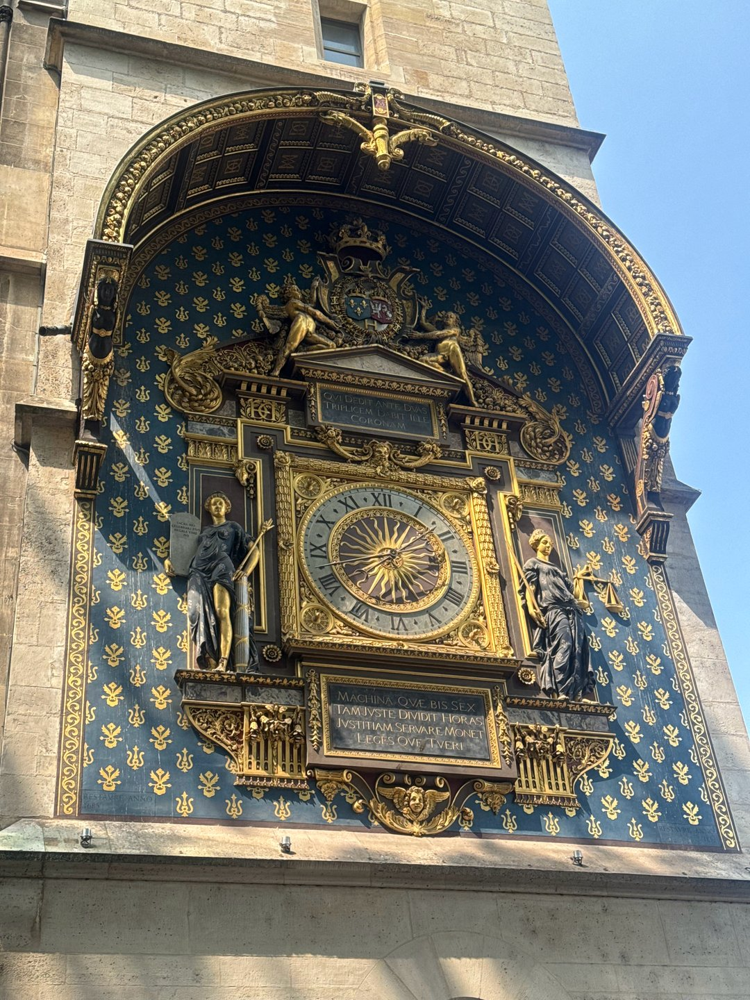
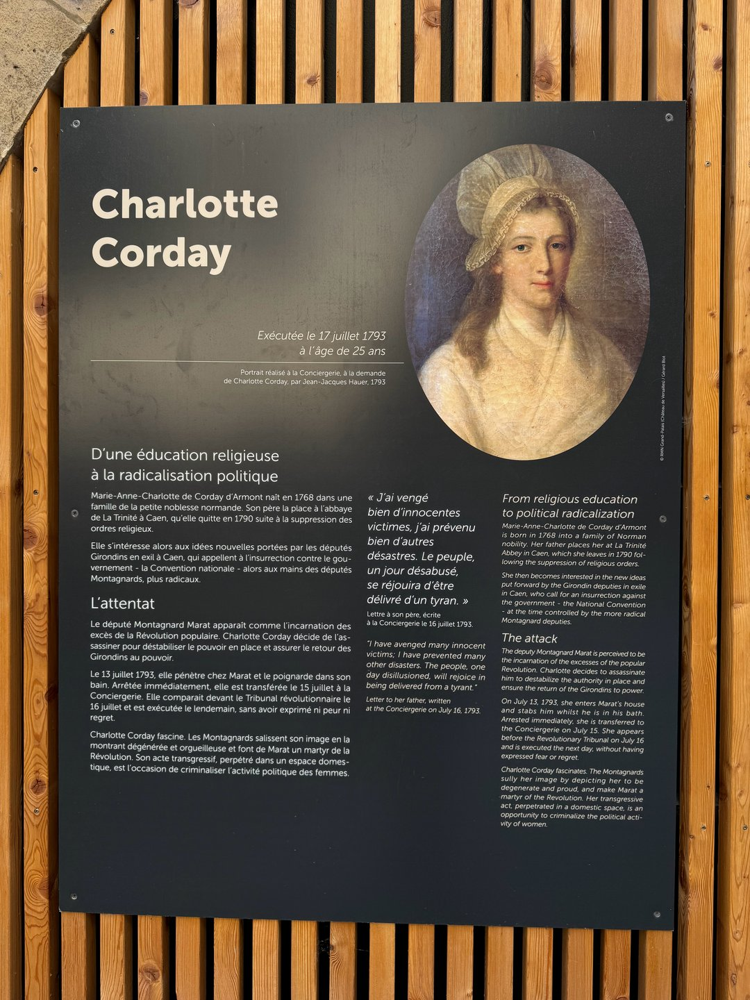
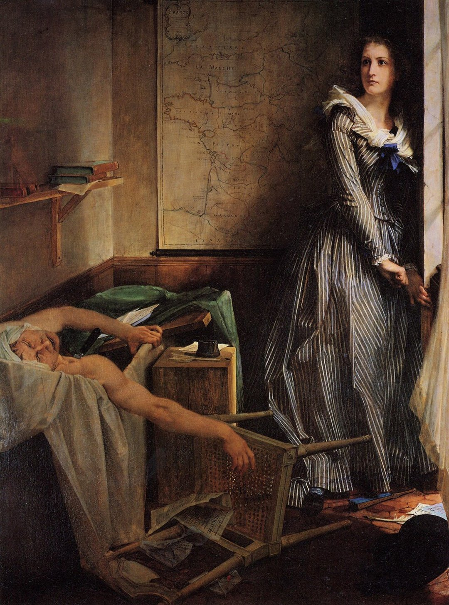
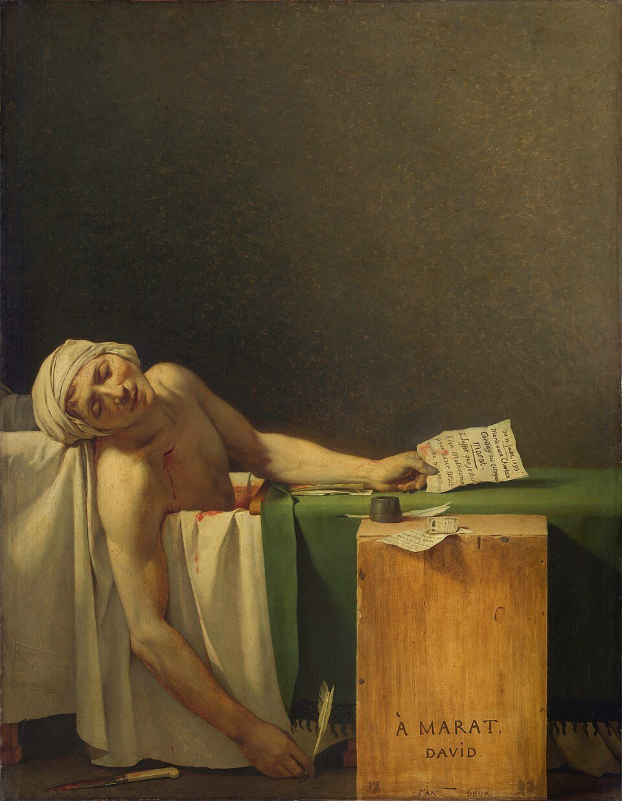
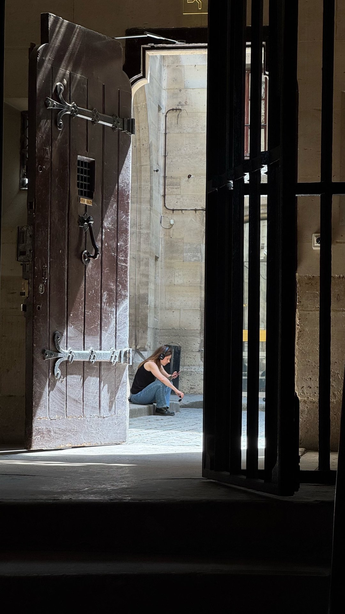
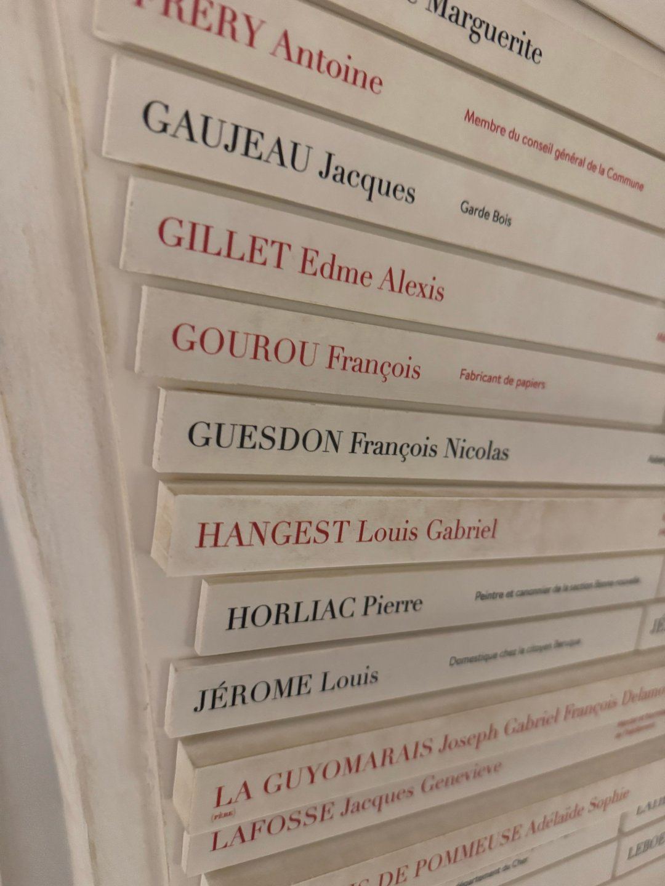
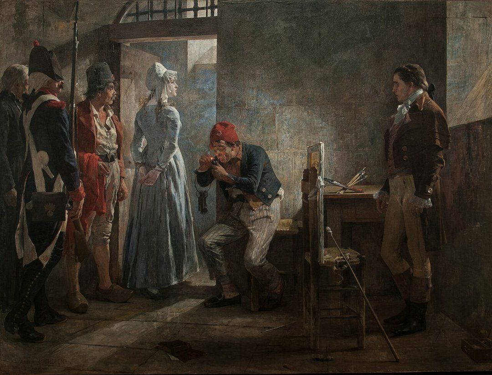
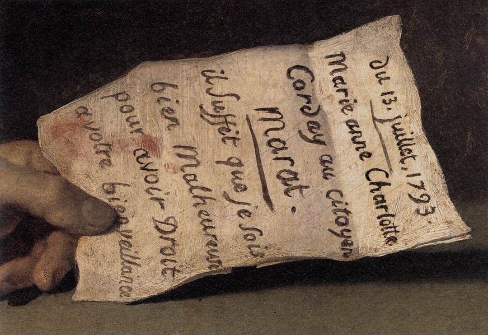
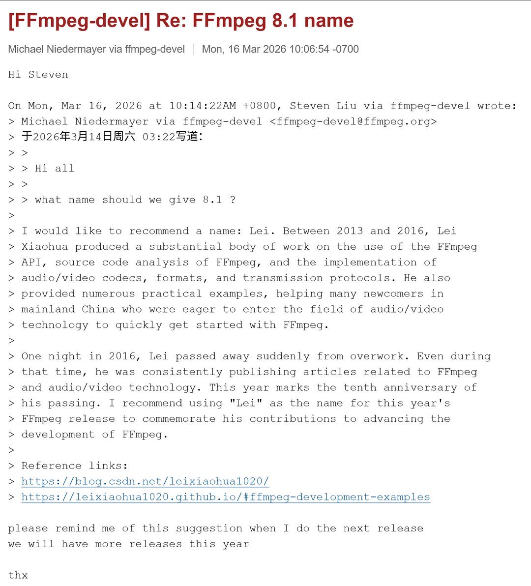

# 2026-08-05

## 1

@蓝鲸新闻

发表于：2026-08-04 14:34

来源：微博

链接：https://m.weibo.cn/status/5328320499816410

【\#鸿蒙智行回应竹知了事件\#】\#鸿蒙智行称未向任何电商平台投诉竹知了\#

8月4日，@鸿蒙智行发言人 发布“关于近期‘竹知了’相关网络信息的情况说明”：近日，围绕“竹知了”相关话题，网络上出现了大量讨论，也有不少网友对相关投诉提出疑问。

此前，我们希望通过克制处理，避免进一步放大争议，随着相关信息持续扩散，一些说法逐渐偏离事实。我们感谢大家的关注、批评和监督。现将有关事实说明如下：

长期以来，网络上持续存在恶意剪辑、仿冒相关高管声音、利用AI丑化肖像、虚假归因、侮辱诽谤等侵害个人合法权益的内容。我们一直依法开展日常取证和投诉。本次投诉是日常维权工作的一部分，针对的是具体侵权内容，并非针对“竹知了”玩具。

截至8月4日晚，共监测到相关网络信息累计5.6万余条。我们实际对其中171条具体侵权内容发起投诉，平台反馈下架144条。

经多部门复核，相关投诉均有明确侵权事实和留存证据，不存在仅为正常把玩、制作、展示或者销售“竹知了”的内容。我们未向任何电商平台投诉“竹知了”商品，也从未要求任何电商平台下架、停售该商品。网络上有关“全网下架”、“禁止销售”、“许多单纯展示玩具或分享童年回忆的普通视频也被连带下架，部分账号头像变灰、昵称被重置”等说法与事实不符。

我们珍视消费者的每一份关注，聚焦产品和服务体验，也愿意认真倾听大家的批评与建议。面对不同声音，我们会保持谦逊、真诚和克制，不断改进工作。我们尊重正常的网络表达和善意批评，同时也将依法维护企业和个人的合法权益。再次感谢大家的关注和监督。

---

## 2

@苏耷水

发表于：2026-08-04 18:46

来源：微博

链接：https://m.weibo.cn/status/5328383867355488

北京三环以内有许多非常知名的好医院的就医体验挺差的，不是因为人，纯是因为建筑设施本身太老了，根本不够用了，有些楼体建筑甚至可以成为文物了。

因为建筑空间不够，甚至要搭工地用的那种铁皮房子给一些科室用。患者候诊的地方，往往连个坐下来休息的位置都没有。

---

## 3

@_30赫兹_

发表于：2026-07-31 21:45

来源：微博

链接：https://m.weibo.cn/status/5326979407807703

那个攮死 马拉 的女子。

    在巴黎古监狱博物馆La Conciergerie ，有一处很容易被游客忽略的地方——曾经的女囚放风院。院子的墙上悬挂着一幅年轻女子的肖像，她神情平静，甚至带着几分温柔，很难想象，她就是法国大革命时期最著名的女刺客——夏洛特·科黛（Charlotte Corday）。（图一到图四）

    她出生于1768年，来自诺曼底一个没落的小贵族家庭，（图六 图七 夏洛特的家）从小在修道院接受教育，熟读古典文学，崇拜古罗马英雄，始终相信，一个人可以为了拯救国家而牺牲自己。她并不是王党，也不是保皇派，相反，她支持1789年的法国大革命，希望法国建立一个自由、理性的宪政国家。（图五，古监狱博物馆里面一个房间墙上有4000多被关押囚徒多名单，从平民到教士和第二阶层，再到贵族阶层，用不同厚度的材料贴在墙面上。他们中红色的名字代表被处决，占比一半以上。）

    真正令她绝望的是1793年的革命开始走向激进。随着山岳派掌权，以马拉、罗伯斯庇尔为代表的革命领袖不断号召以暴力清除”共和国的敌人”，断头台几乎每天都在运转，国家进入一种癫狂的状态。夏洛特支持相对温和的吉伦特派，她认为，把法国推向不断流血的，并不是已经失去权力的国王，而是革命本身正在失去理性。

    于是，她做出了一个改变法国历史、也毁掉自己人生的决定。

    1793年7月13日下午，她带着一把厨房刀来到让-保罗·马拉（Jean-Paul Marat）家中，谎称自己掌握了吉伦特派叛乱的重要名单。长期患有严重皮肤病的马拉，当时正坐在药浴中办公、写信和接见来访者。就在谈话过程中，夏洛特突然拔出匕首，一刀刺入马拉胸口。马拉几乎当场死亡，而她没有逃跑，静静站在原地等待逮捕。（图八 图九）

    两天后，她被押入今天游客参观的Conciergerie。就在这座监狱里，画家让-雅克·豪尔（Jean-Jacques Hauer）受她请求，为她画下了这幅肖像。画中的她没有恐惧，也没有悔意。据当时的目击者回忆，她始终相信，自己并不是杀人犯，而是在阻止更多的人死去。她甚至写下了一句后来广为流传的话：

“我杀死了一个人，是为了挽救十万人。”

    然而，她低估了历史。

     就在马拉遇刺后不久，精于靠贴政治运动风向的法国新古典主义大师雅克-路易·大卫（Jacques-Louis David）受革命政府委托创作了《马拉之死》。大卫不仅是一位画家，也是革命的积极参与者和罗伯斯庇尔的政治盟友。这幅画并不是普通的历史记录，而是一件具有鲜明政治目的的造神作品。

    画中的马拉没有疾病，没有痛苦，没有死亡时的狼狈。浴缸被处理成祭坛，木箱像祭台，手中的书信如同遗言，低垂的手臂甚至借鉴了文艺复兴时期《哀悼基督》的构图。大卫把一位充满争议的革命领袖，塑造成了共和国的殉道者，有人因此称这幅画为“革命的圣像画”。

    而真正耐人寻味的是，夏洛特刺杀了马拉这个人，却帮助革命创造了一个永恒的”马拉神话”。

    站在古监狱的女囚放风院，看着这幅年轻女子的画像，再想到卢浮宫里那幅举世闻名的《马拉之死》，会发现法国大革命最复杂的地方，并不是简单的善恶对立。马拉坚信不断清除敌人才能拯救共和国；夏洛特则坚信杀死马拉才能结束流血。他们都认为自己是在拯救法国，却都成为革命机器的一部分。1793年7月17日，她被押赴协和广场的断头台执行死刑。（图十 ）那一年，她二十四岁。

    也许这正是古监狱最值得我们思考的地方：当每个人都坚信自己代表绝对正义的时候，历史往往会把所有人都卷入悲剧。

\#遇见艺术\#\#新城事\#\#带着微博去旅行\#\#博物馆\#\#法国\# 专栏 · 30赫兹的欧洲博物馆探访 法国·圣礼拜堂

---

## 4

@蘸盐

发表于：2026-08-04 17:35

来源：微博

链接：https://m.weibo.cn/status/5328365978389634

前两天看到西安玉祥门雨后积水，有人在里头游泳，顺嘴聊了一嘴这种水非常脏。看见这条想起来，马拉就是革命前躲藏在巴黎下水道里浸泡污水，水里的大量真菌、细菌持续侵入浅层皮肤，造成持续性接触性刺激、反复过敏，再加上长时间高度紧张躲避追捕，诱发免疫紊乱，导致其得上了皮肤病，全身大片大片水疱，不断糜烂、渗液、结痂，瘙痒难以忍受，只能终日泡在醋水、药草的浴缸里止痒。日常办公和会见客人也是在浴缸里。  中途岛战役前，哈尔西也是得上了严重的神经性皮炎。珍珠港事件后半年里，哈尔西以“企业号”航母为旗舰连续高强度作战，指挥了马绍尔群岛空袭、威克岛突袭、杜立特东京空袭、珊瑚海海战外围牵制，连续6个月几乎不眠不休待在舰桥，巨大精神压力、大量咖啡+烟草，把他的慢性银屑病彻底诱发为全身性重症皮炎，剧烈瘙痒无法入睡，体重骤降9公斤，已经无法正常指挥舰队，换成了斯普鲁恩斯来指挥。  曾国藩也是严重的银屑病，全身皮屑如蛇蜕鳞，剧烈瘙痒无法入睡，只能用水晶镇纸冰凉一下减轻瘙痒感

---

## 5

@蚁工厂

发表于：2026-08-04 09:43

来源：微博

链接：https://m.weibo.cn/status/5328247162143594

FFmpeg 9.0版本刚发布了。这个版本的代号是“Lei”

按照惯例，“Lei” 应该是哪个计算机科学家/数学家，可想了好久也对不起来这是谁。

查了一下FFmpeg的开发邮件列表，才发现原来是纪念已故的@雷霄骅 。

他在 2013–2016 年间撰写了大量 FFmpeg API、源码分析及音视频编解码、封装和传输协议方面的中文教程与示例，帮助许多中国开发者入门音视频和 FFmpeg。于 2016 年疑似因过劳突然离世。

今年是离世10周年，FFmpeg用了这个大版本号来纪念他。

---

## 6

@石头断情绝爱版

发表于：2026-08-04 06:47

来源：微博

链接：https://m.weibo.cn/status/5328202889168205

这事起因没那么复杂，就上海女a看不惯河南女b在网上炫富，俩人从05年吵到了21年，从国内吵到了加拿大，后来还闹上了法庭，法官看到她俩几百页吵架的聊天记录都头疼，判决结果是双方要相互赔钱，最后因为a要比b多赔500加币，a不愿意给，就给了带有侮辱性质的250加币，b去要求法院强制执行，a气不过就当场在民事法庭等候区砍了对方70多刀

---

## 7

@作家陈岚

发表于：2026-08-04 12:40

来源：微博

链接：https://m.weibo.cn/status/5328291817062551

很多新闻事件中，如果实在搞不清是是非非，

记住一句话：面相从不我欺。

---

## 8

@歸藏的AI工具箱

发表于：2026-08-04 15:11

来源：微博

链接：https://m.weibo.cn/status/5328329823754089

Cloudflare 推出了一个专门给 Agent 用的钱包，它有一个唯一的地址和用户名，这个有意思啊！

领了以后，你的 Agent 就可以用这个钱包来支付 API 和内容的费用。

可以先申请一个自己名字的，以防被人抢注。

钱包分为两类：

钱包账户：是你作为人类拥有的钱包，可以充值、提现，也可以把支出权限委托出去

虚拟钱包：是专门为 Agent 设计的，通过 API Key 运行

关于虚拟钱包的支出控制和使用场景：

• 支出上限和规则：你可以给它设置支出上限，也可以通过允许列表（白名单）和规则进行控制

• 受控预算与自主探索：这样的设计可以让 Agent 在受控的预算内，自主探索各种服务

• 免去实时监控：我们人类没必要时刻监控它的支出，也不用担心它直接把卡刷爆

此外，它还通过 Cloudflare Pay 把钱包和账户身份关联起来。Agent 可以选择性地表明自己代表哪个组织，从而解决了 Agent 的身份认证问题（身份证明是可选的，也可以选择匿名）。

详情：cloudflare.pay

---

## 9

@明涛AI_ECON

发表于：2026-08-04 15:06

来源：微博

链接：https://m.weibo.cn/status/5328328506475767

其实也都差不多。我当年研究日本经济时就琢磨过这个事儿，经济效益下行时，企业要么裁员要么降工资，要么拼了老命维持不裁不减但最终受不了就破产，三个方案总得选一个，不可能啥都不选。高校也是一个道理，金融加速器连通公共部门资产负债表变化，一切可能才刚开始，慢慢大家就习惯了。

