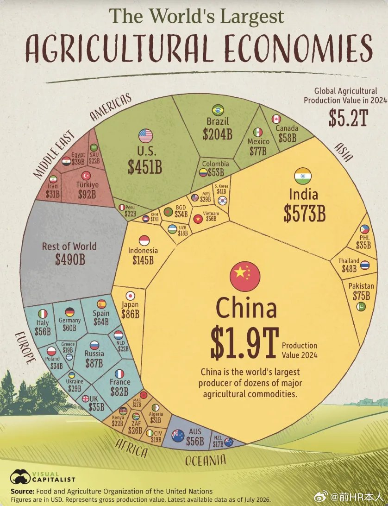

# 2026-08-06

## 1

@洪广玉

发表于：2026-08-05 14:23

来源：微博

链接：https://m.weibo.cn/status/5328680148536988

信息社会有一个很大的问题，就是扭曲了人们对风险的感知，风险的传播已经进入21世纪，但是大脑评估和感知风险的能力还是原始社会的，因此整个社会对低概率的极端事件有不正常的关注度和敏感，生育的好处似乎没了，只有负担和危险。//@内含子:肯定不是啊。当然，有人非觉得现在的压力比日本侵华期间还大，我只能不和他交流——实在没法交流。这倒不是说他们比猪还蠢，而是叫不醒装睡的人。

---

## 2

@苏耷水

发表于：2026-08-03 08:34

来源：微博

链接：https://m.weibo.cn/status/5327867513936182

生育率下降真的是因为生活压力大了吗？是因为更多人意识到生活压力大了吧。

就好像对战争的记忆，越来越多的人意识到战争很残酷，也是因为教育普及和信息技术的发展，许多士兵识字了，会写信写日记了，于是他们留下了大量残酷的战争文字记录，才让越来越多的人意识到战争的残酷。古代那个遍地文盲的世界，对战争的残酷记忆，很容易被淡化遗忘，再经过几代唱诗说书写戏本的演义，就成传奇故事了。三国时代有一半到三分之二的人口损失，本是个极端残酷的时代，却早就被流传成一段传奇故事被津津乐道。

现代工业文明让更多人受了教育，也就有更多人有了感知痛苦的能力，感到了痛苦才会回避，这恐怕是生育率下降的最大原因。

西方发达国家从生育率开始降低，到移民问题凸显，中间只隔了几十年，这期间劳工生活水平变好的时间没有我们想象的那么长。按照基本的经济规律，本土劳动力变贵，劳工权利提高了以后，资本就一定往那些人命更廉价的地方流动，来自穷地方的更廉价的劳动力也会从各种渠道流入到工资更高的地方。

所以过去的许多革命口号是非常实际非常禁得起考验的，比如《红色娘子军》里引用的那一句:“无产阶级只有解放全人类，才能最终解放无产阶级自己”。在人口、资本和商品全球流动的世界里，一个国家里的无产阶级很难独善其身。

如果正视全球化螺旋向上的趋势，那么每一个国家都会受到外来影响。就好像不可能你一个国家就能消灭了某种传染病，你社会组织再牛逼，公民素质再高级，你能关上门不做生意吗？只要你开门做生意，那些消灭不了那些传染病的国家，总可以把其他国家都拉进坭坑里。

---

## 3

@阑夕

发表于：2026-08-05 13:36

来源：微博

链接：https://m.weibo.cn/status/5328668398457509

简单的经济学。

---

## 4

@严锋

发表于：2026-08-05 13:15

来源：微博

链接：https://m.weibo.cn/status/5328662998291488

研究发现，能在滑倒、绊倒的瞬间把身体稳住，取决于一种叫“快速发力能力”的指标。而大重量抗阻训练，恰好能精准强化这种能力——每练一次，快速发力能力就能提升1%～4.5%，肌肉功率提升0.5%～1%——好神奇

---

## 5

@李楠或kkk

发表于：2026-08-05 04:32

来源：微博

链接：https://m.weibo.cn/status/5328531433197132

目前 AI 真正跑通商业闭环的业务：

1. Code Agent 

SWE-bench从2024年初的<30%飆升至2025年的80%以上这是目前最成熟的AI垂直应用，技术和商业模式都已验证。

2. 语音Summary（Plaud、钉钉） 

Plaud 已形成"硬件+SaaS订阅"的完整闭环，钉钉A1 等大厂跟进。

3. 小视频/短剧 

多元变现路径：付费点播、广告、会员、IPA等。

4. Palantir FDE模式 

拿下美国战争部这个大客户。

5 DeepSeek 这种开源社会基础设施

V4 Flash上线单日8万亿Token 消耗，3T 付费。

6 自动驾驶 CNN 网络

Tesla 等车企的自动驾驶 AI 。

除此之外，基本没有。

---

## 6

@前HR本人

发表于：2026-08-05 22:00

来源：微博

链接：https://m.weibo.cn/status/5328795021869419

中国是全球第一大农业国，很多人想不到，第二名更出人意料！

 

提起全球农业强国，多数人的第一反应是美国。美国粮食、牛肉、牛奶大量出口，在国际农产品市场存在感极强，所以很多人都以为美国是世界上最大的农业大国，实际上不是。联合国粮农组织的2024年统计数据却颠覆大众固有认知，全球农业总产值第一名是中国，第二名是印度，美国仅仅排在第三位。印度农业生产总值居然超过美国，这一结果令不少人大跌眼镜。

 

1、很多人被美国大宗粮食和牛肉出口的光环误导，忽略了农业产值的完整统计。2024年，中国农业生产产值达到1.9万亿美元，印度为5730亿美元，美国只有4510亿美元，美国农业总产值还不到中国的四分之一。也就是说不止是总量，在主要大国当中，中国的人均农业GDP同样高于美国。

 

2、为什么美国出口声势浩大，整体农业产值却远远落后中国，乃至不如印度？核心在于农产品结构的巨大差异。

美国优势集中在玉米、大豆这类大宗粮食，还有牛肉、牛奶等少数品类，依靠大农场、高度机械化实现大规模出口。可在高附加值品类上，和中国差距明显。鲜花、各类果蔬、生猪养殖、特色畜禽包括肥肝，还有规模庞大的海水养殖产业，都是中国农业的长板。这些品类单看单品名气不大，但胜在体量庞大、贴近国内消费市场，集合起来撑起巨大的产值。美国这类劳动密集型、高附加值生鲜产业规模有限，不少果蔬、水产品反而需要大量进口来满足国内消费。比如中国的养殖罗非鱼就大量出口美国。

 

3、美国农产品品类相对单调，中国农业却是产量大、品种极其丰富。这背后来自两重优势，一是绵延数千年的农耕文化，育种、种养经验积淀深厚；二是中国国土横跨热带、亚热带、温带、寒温带，山地、平原、高原、河湖海洋兼备，地理气候多样性冠绝全球。从南方的热带水果，到北方的粮食杂粮；从陆地畜禽种植，再到全世界规模第一的水产养殖，上千种农产品国内都有规模化生产；乃至大棚蔬菜和高原反季蔬菜都是全球无敌。而美国农业，更偏向少数几种主粮作物的规模化放大，品类丰富度远不如中国。

 

4、若把视野放大到三大产业对比，格局更加清晰。不光农业领域中国遥遥领先，制造业层面，中国同样规模庞大，实力对美国形成明显优势。如今美国GDP好看，很大程度来自虚胖注水的服务业。金融、法律服务、医疗服务、教育等服务业占经济极高比重，不少统计存在估值虚高现象。实体产业层面，无论是农业还是制造业，中国都已经建立起体量上的优势。

 

当然，产值第一不等于处处完美。我们要客观承认，美国在大田农业机械化、人均效率、种业部分领域仍有长处。但不能再被固有印象蒙蔽，认为美国才是世界农业的天花板，比如中国粮食单产比美国就要强。

 

整体上，农业的价值，不只看能出口多少粮食，更要看能不能满足本国多元消费、形成完整丰富的产业体系。联合国粮农组织的数据是一个非常好的对比，这也是为什么中国各种食品多到眼花缭乱，而美国却没有啥花样的根源吧。

