# 2026-08-07

## 1

@包特_ExpEcon

发表于：2026-08-06 14:14

来源：微博

链接：https://m.weibo.cn/status/5329040367947343

我其实基本同意@南郭刘勃 老师的看法，老的编制体系看似没有科研压力，但在一些时候不正是很多人觉得理想的王虹工作的法国高研院工作环境的“低配版”？这样的环境可能不能最大化产出的激励，但确实给人一些精雕细刻的自由，特别是，我自己倾向于同意，很多老体制老师可能对前沿文献了解不足，但对于经典的阅读、思考和理解的深度和广度是扎实的，这对于在教课中“为往圣继绝学”还是非常重要的。而新体制，特别是在tenure之前基本相反，很多新人对于自己研究的小领域前沿是精熟的，但对于学科知识的源流常常缺乏耐心。这是我为什么觉得新人一方面觉得长聘制度神圣无比，但另一方面又对老人老办法嗤之以鼻未免既缺乏同理心，也没有自己面对“时代一粒沙”的脆弱处境的充分认识。

---

## 2

@新浪科技

发表于：2026-08-06 14:15

来源：微博

链接：https://m.weibo.cn/status/5329040495871684

【\#英伟达组建AI安全与网络工程团队\#】据《商业内幕》今天（6 日）报道，英伟达正在低调组建一支新的 AI 安全与网络安全工程团队。

上月底集中发布的一批招聘信息首次披露了团队的存在。英伟达计划招聘一名杰出工程师，出任新团队的创始技术负责人，其他岗位包括安全研究工程师、评估工程师和高级经理。团队将对尚未部署的 AI 智能体进行安全评估，还会开发利用 AI 自动修复软件漏洞的工具。

报道认为，此举说明英伟达在押注开放权重模型和 AI 智能体的同时，也在把 AI 安全提升到更重要的位置。开放权重模型会公开决定模型如何运行的训练参数，但训练数据和源代码仍可保持封闭。

英伟达在一则招聘信息中称，团队秉持一项“坚定信念”：开放权重模型、技术透明度和广泛的科学审查，是美国维持 AI 领先地位及增强网络安全防御能力的基础。

据IT之家了解，近几个月来，英伟达越来越频繁地公开支持开放权重 AI 模型，立场与 OpenAI 和 Anthropic 等企业采用的封闭模型路线形成鲜明对照。

英伟达创始人兼 CEO 黄仁勋上个月首次在 X 平台发文，转发了一封呼吁美国政策制定者支持开放模型的公开信。他指出，开放模型能够提高 AI 安全性并加强网络安全。

随着 AI 从只能对话的聊天机器人转向能够读取企业敏感数据、调用工具并执行现实任务的智能体，企业能否信任 AI 系统，很可能成为决定普及速度的关键。（IT之家）

---

## 3

@宝玉xp

发表于：2026-08-03 19:33

来源：微博

链接：https://m.weibo.cn/status/5328033298514419

现在我很多复杂一点的任务都是 Fable 5 写方案，Codex 去执行，Fable 5 验收，相对来说可以做出比较靠谱的方案，以及兼顾性价比。具体是这么做的：

1. Fable 5 的产出是技术方案文档（图1）

一方面文档方便批注修改，另一方面文档方便其他 Agent 快速上手

2. 文档确认后在当前先 /compact 一次

这一步不是必要的，但是有好处，因为后续还要在同一会话去验证，/compact 压缩后，节约后续的上下文空间，之所以讨论方案就马上发送 /compact，因为这时候 Prompt Caching 还在，成本低，后面缓存过期了 compact 要贵一点。

3. 把文档交给 Codex （GPT-5.6 Sol xhigh）去执行（图2）

如果任务明显比较复杂，我一般会加上 /goal，这样中间就不需要反复去 continue，一次性把任务完成

4. Codex 完成后让 Fable 验证（图3）

直接告诉 Fable 其他 Agent 已经实施了，让它确认有没有遗漏，或者方向有无偏离。

如果有些遗漏之类的，把 Fable 的反馈发回给 Codex（图4），不需要新开会话，在同一个 Codex 会话，Codex 会根据反馈继续完善。

---

如果用 Opus 5 替代 GPT 5.6 也可以，做法上可以跟上面一样新开会话，用文档传递上下文。

也可以直接让 Fable 5 开 SubAgent 并指定用 Opus 5 模型，并且要求在 SubAgent 完成任务后验证。

但是我执行下来 Opus 5 不如 GPT 5.6 Sol 稳定，也不如 GPT 5.6 Token 耐用，所以宁愿麻烦一点。

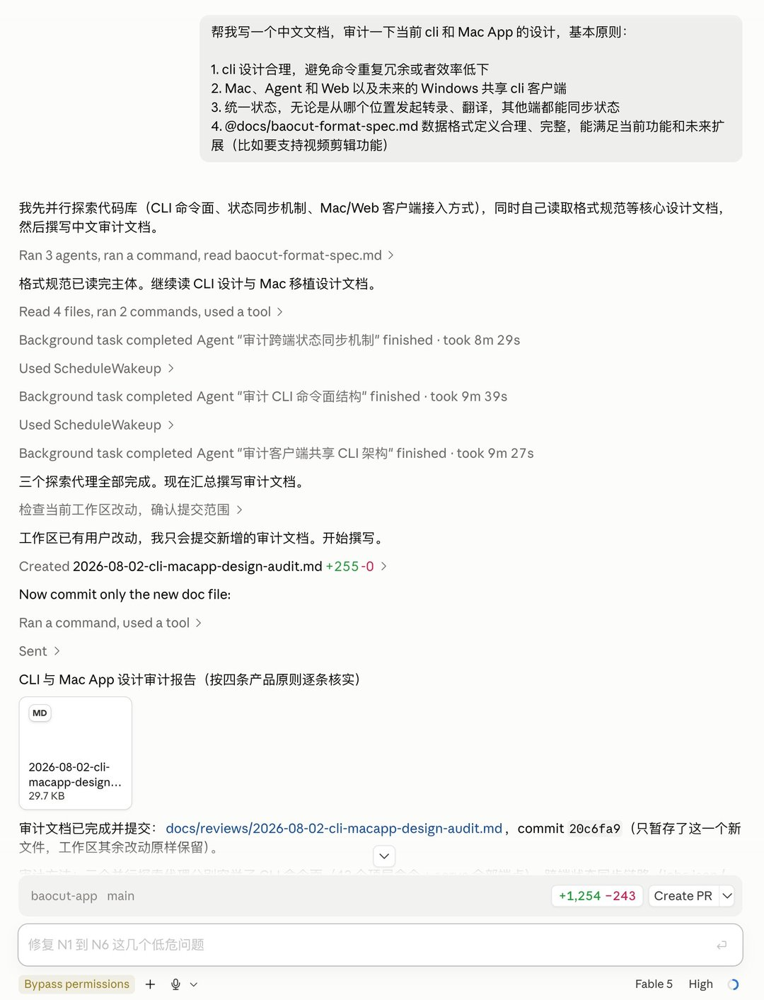

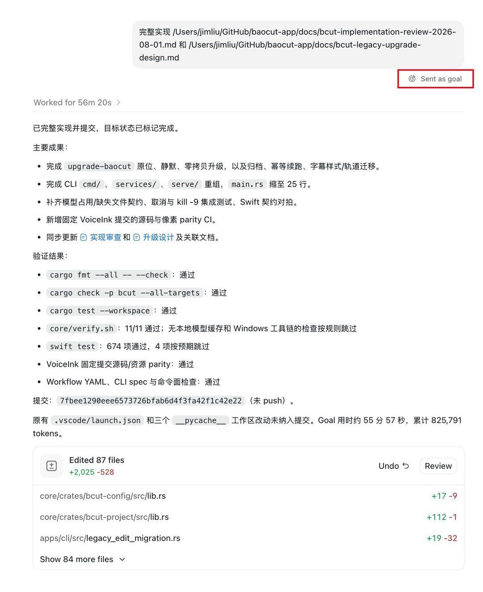

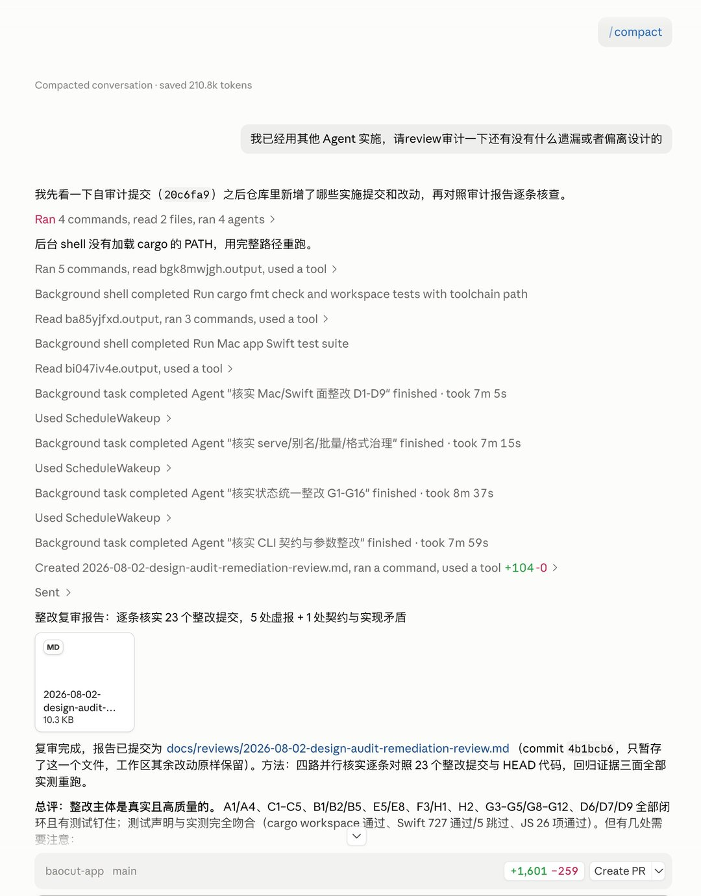

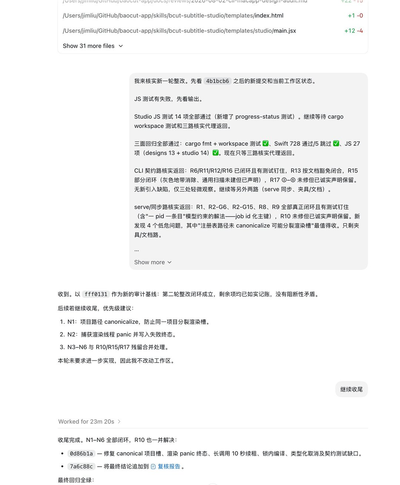

---

## 4

@图老板赛博札记

发表于：2026-08-06 15:22

来源：微博

链接：https://m.weibo.cn/status/5329057459996570

\#塌陷中的世界\#

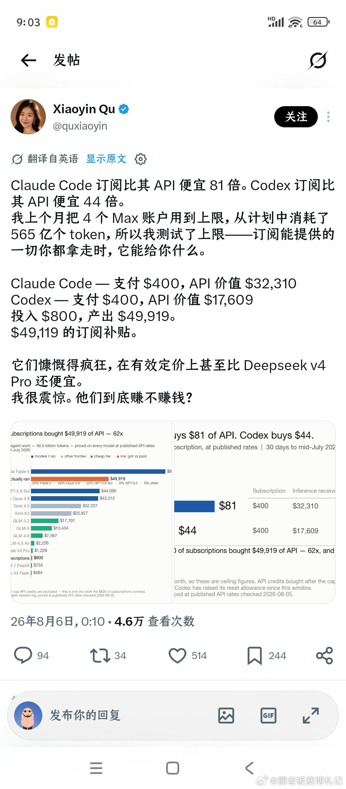

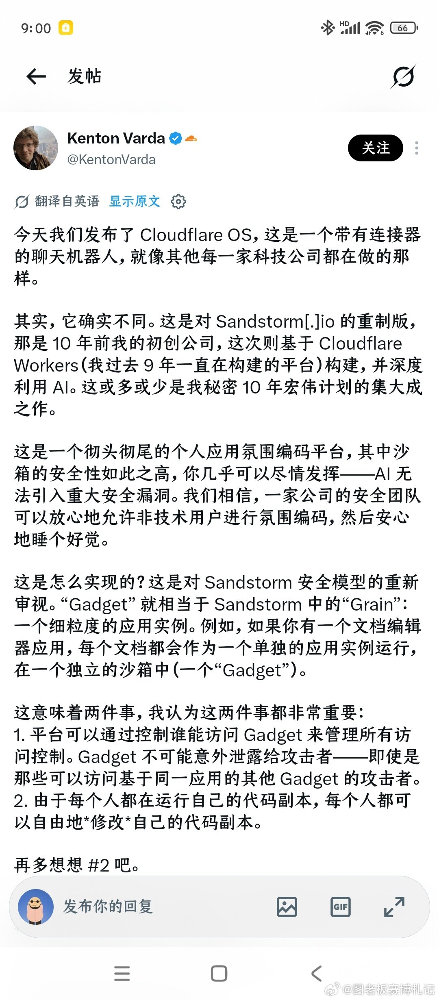

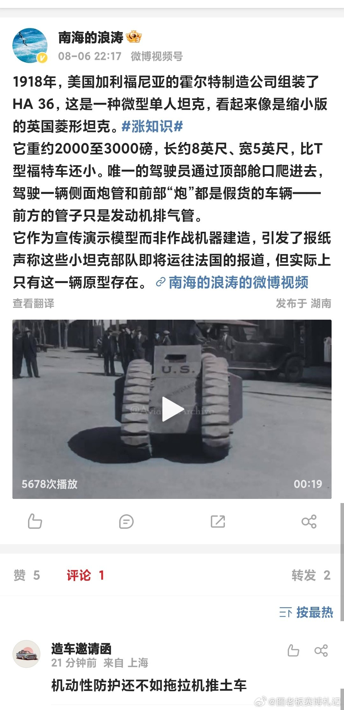

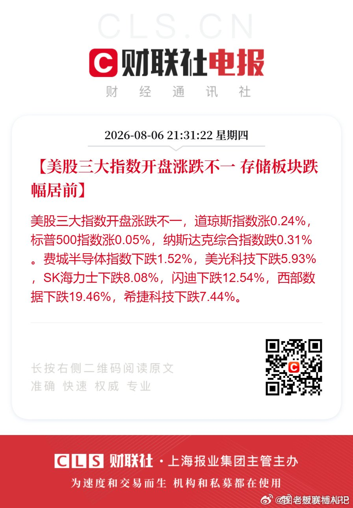

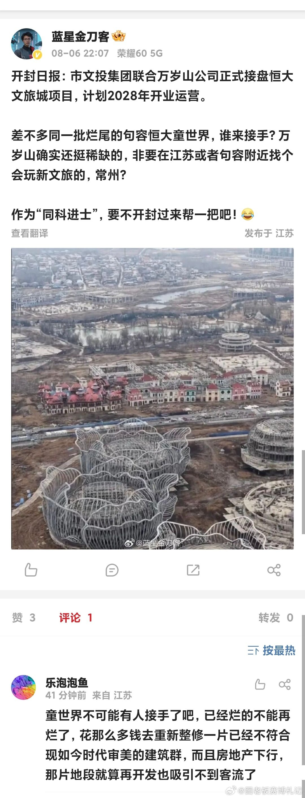

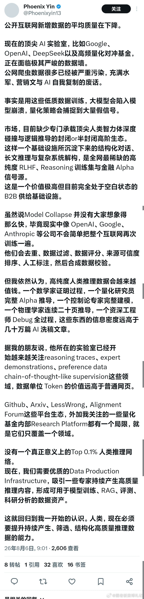

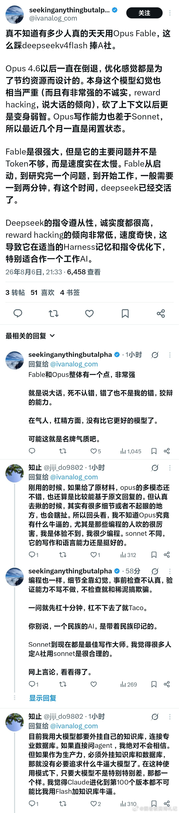

---

## 5

@学术大观察

发表于：2026-08-06 15:14

来源：微博

链接：https://m.weibo.cn/status/5329055441486297

为什么感觉一年比一年过得快，是因为年龄增长的原因吗？ 

知乎神文：并不是年龄增长了，是你惊讶的次数少了

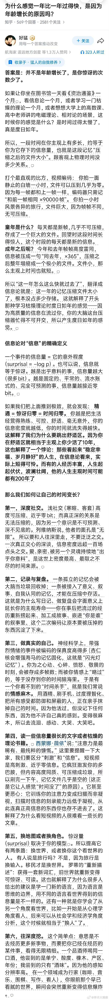

---

## 6

@明涛AI_ECON

发表于：2026-08-06 15:26

来源：微博

链接：https://m.weibo.cn/status/5329058327956714

我之前小号说过，信息是指数增长的，要驾驭这些信息必须通过能力指数增长；如果能力做不到指数增长，那就通过管理人数的指数增长，所以到了中年只有领导才能意气风发，其余中年人都是疲惫半死；现在有了AI，即便当不了领导，也能用AI的指数增长来驾驭信息，完成前所未有的任务。当然归根结底还是要找到市场需求，否则还是壮志难酬。

---

## 7

@前HR随笔

发表于：2026-08-06 13:24

来源：微博

链接：https://m.weibo.cn/status/5329027553298617

DeepSeek分析：恢复孩子内驱力的最快方式：让他吃高级的苦。

这个看起来非常有道理，值得看。

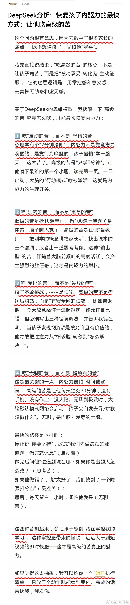

---

## 8

@陈营长极品投资

发表于：2026-08-06 16:25

来源：微博

链接：https://m.weibo.cn/status/5329073120484371

Ai王者斩杀线，是下半年的一道风景。

现在类似秦朝末年，揭竿而起，群雄争霸。

项羽，刘邦等开始冒头了。

注意啊，此时千万别站错队。

投奔陈胜，章邯，彭越甚至项羽，

最后都是死路一条。

各细分赛道的王者已经露头，

并且陆续上市。

这些王者能力更强，速度更快，胜率更大。

更重要的是，更便宜。

这就是＂王者斩杀线＂。

各赛道王者也就十几倍pE或ARR。

在股市和实业对那些弱小的竞争对手无情斩杀。

此时炒小已经风险越来越大。

王者争霸才是主旋律。

---

## 9

@但斌

发表于：2026-08-06 15:28

来源：微博

链接：https://m.weibo.cn/status/5329058792741258

全球头部存储巨头本轮季度财报已全部披露完毕。多家企业交出亮眼的业绩答卷，盘中普遍走出低开走高的走势，闪迪便是典型代表。

存储企业，短期下行的核心诱因并非基本面恶化：前期板块累计涨幅可观，资金集中获利了结、市场恐慌情绪扩散，共同压制短期股价。

拉长周期审视，AI算力持续扩容催生HBM、企业级存储的刚性需求，这条产业主线并未动摇。当下震荡属于情绪扰动引发的阶段性波动，绝非行业基本面坍塌。

短期博弈看资金情绪，长期投资要看产业刚需，存储赛道的成长逻辑依旧清晰。

备注：本文只是一点对投资的感悟，不构成投资建议，投资有风险、须谨慎。另外，投资切记不能借钱、融资、加杠杆。适度分散投资也很重要。

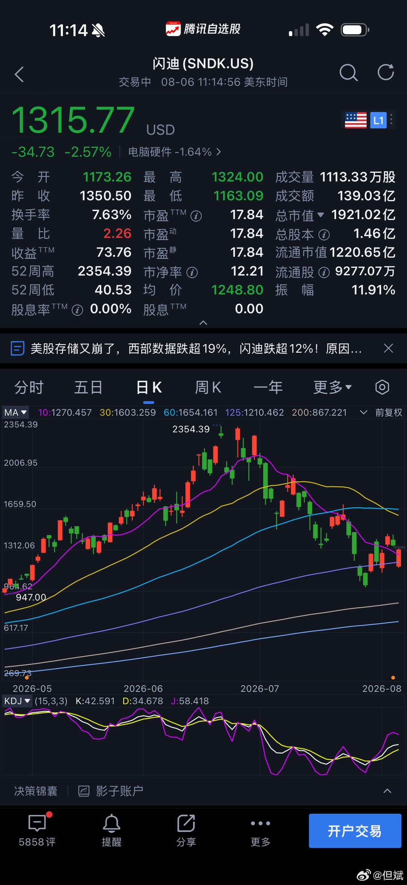

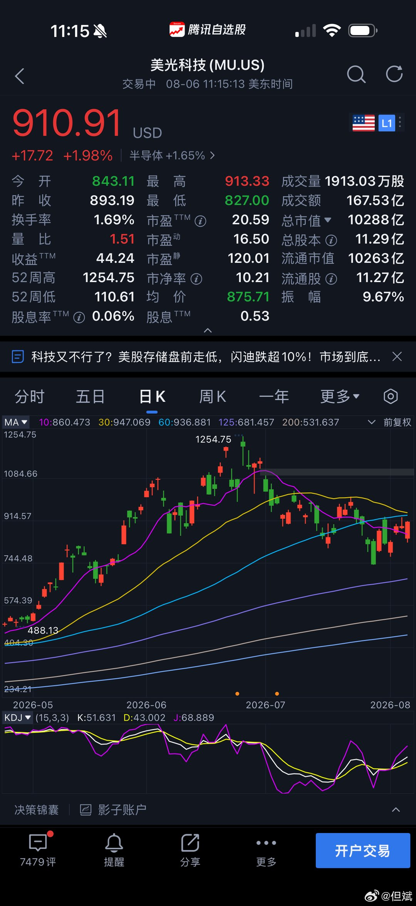

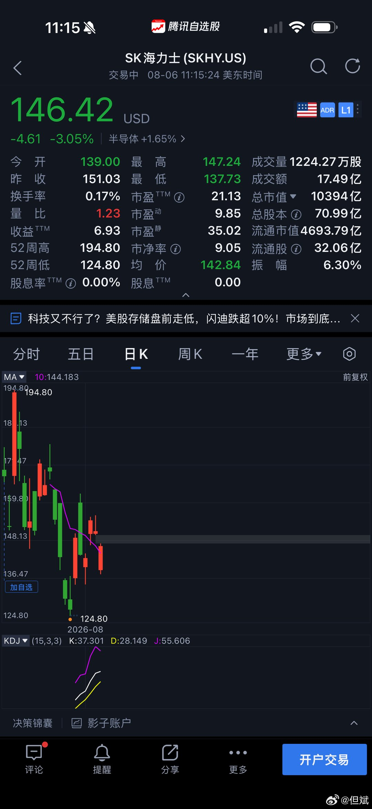

---

## 10

@宝玉xp

发表于：2026-08-06 21:01

来源：微博

链接：https://m.weibo.cn/status/5329142700572839

我更倾向于保留少数专业岗位，比如专业前端专业服务端，然后大量中间的全栈，不需要分那么细。

有点像公司的 IT，人人都有 IT 知识，但是复杂问题普通人还是解决不了，还是要依赖专业人士。

专业人士不仅要救火，Vibe Coding 的出问题了要去擦屁股，还需要搭好基础设施，方便大家高效安全的去 Vibe

---

## 11

@宝玉xp

发表于：2026-08-06 20:49

来源：微博

链接：https://m.weibo.cn/status/5329139776356562

转：20年前的电脑桌

---

## 12

@宝玉xp

发表于：2026-08-06 16:49

来源：微博

链接：https://m.weibo.cn/status/5329079310225266

人就是很奇怪，一方面讨厌看 AI 写的文章，一方面又到处找消除 AI 味的 Skill，试图用 AI 写出没有 AI 味的文章。

卡兹克的这个 Skill 网页链接 没什么问题，而且现在用估计效果还不错，但你再过一段看，还一样会看出 AI 味。就是那种很刺眼的奇怪的词语搭配，很结构化的叙事，很难用言语表达，但你过些时候回头看就很别扭的那种。

我自己也花了一段时间写这样的 Skill，现在已经放弃了，AI 是不能代替人写作的，再好的模型再好的 Skill 也不行。

但我还是会大量使用 AI 翻译，会使用 AI 辅助写作。

比如帮我收集资料，比如一起讨论，比如帮我调整结构、润色。

写作最痛苦的是经常会“卡”住，因为你找不到合适的内容去承上启下，而这事 AI 反倒是很擅长，虽然不一定能写的比你好，但是经常能给你灵感。

所以我现在写东西，经常想到哪写到哪，可能写的很乱，没什么结构，然后就把这份乱七八糟的草稿扔给 AI，让它帮我基于原本文字的风格，重新写一遍，这样还是自己要表达的东西，也是自己原本文字的风格所以没什么 AI 味，但读起来会通顺很多。

如果要求再高一点，就基于草稿提出一些要求，帮助找出自己可能疏漏的点；再找不同的 AI 出几个不同风格的版本。最后取长补短，重新写一份。

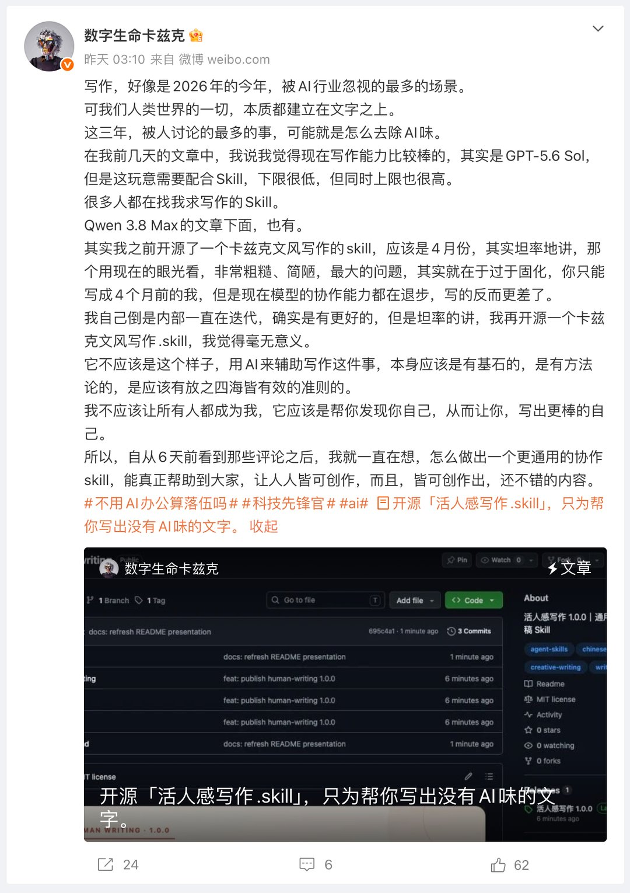

---

## 13

@信号与噪声

发表于：2026-08-06 16:20

来源：微博

链接：https://m.weibo.cn/status/5329071978580112

Token 使用情况：被最广泛引用的一个统计数据

OpenRouter 的数据特点是：

1）开发者为主：主要是独立开发者与 AI 爱好者。

2）价格驱动：用户不断追逐最便宜的模型。

3）无企业用户：财富 500 强的工作负载绕过了聚合平台。

4）开源权重偏好：DeepSeek/Qwen 被严重过度代表。

5）OpenRouter 即使在最好的日子里，也可能只占市场的 2%，而且是一个严重偏斜的样本。

抽样的是那些追求免费和廉价的人群，而非真正买单的人

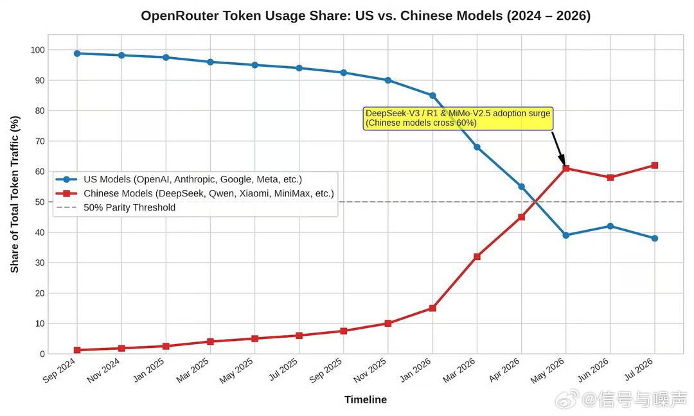

---

## 14

@财联社APP

发表于：2026-08-06 15:40

来源：微博

链接：https://m.weibo.cn/status/5329061781971918

【独家|刚果（金）禁止铜精矿、钴精矿出口 紫金矿业：公司在当地的产品不在禁止出口之列】财联社8月6日电，刚果（金）政府6月底签署禁止铜钴精矿出口政府命令。对此，紫金矿业相关人士向财联社记者表示，目前公司在刚果（金）公司旗下科卢韦齐铜矿的产品为粗铜及电积铜，卡莫阿-卡库拉铜矿的产品为阳极板及粗铜，不属于禁止出口的产品。 (财联社记者 梁祥才)

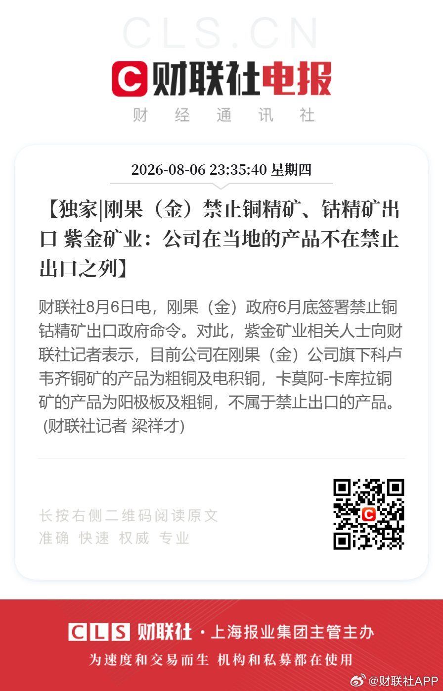

---

## 15

@巍克思

发表于：

来源：微博

链接：https://m.weibo.cn/status/4867966602054316

《Economist》近期关于纽约城市空间功能变化的报道和我在美国当地的感受一致。当前全球国际大都市中心区空间的需求正面临重构，这是需要引发城市经营和规划者关注的一个先导性现象。

          网络时代后，传统CBD的通讯密集等优势已经不明显，企业继续保有中心区办公物业、忍受高昂的租金和交通成本，更多是出于企业形象需要的“广告牌效应”。

        尽管纽约企业办公离开下城的趋势在更早之前就开始了，但随着疫情，防疫产生的居家办公理由，让长期存在的由于租金、交通等综合成本居高不下积累的办公去市中心化想法得到了进一步释放的借口；而这个突破口一旦产生，趋势就难以扭转。至今，在美国除了大量岗位仍然居家办公，许多企业迁出曼哈顿下城的传统密集区，选择入驻传统居民区或市郊小型化、分散化的办公园/街区。

        现在看，传统CBD提供的高密度建筑和专业社群伴随着高昂的附加成本，并非是无可替代的。大型企业如苹果等完全可在郊区，独自购地定制化的建设服务自身的办公和研发单体；对于中小企业，传统居住街区和老城原有仓库、工厂等清退业态带来的用地和老旧建筑提供了新的中低密度改造混合街区的可能，这种园/街区的混合性、开放性和较低成本反而更受它们喜爱（图3、4）。市中心的传统办公区出现衰退，反而被慕名而来的旅游客群观光业代替。这在纽约世贸中心、华尔街的观光景点化、中城和附近区域——特别是高线和切尔西一带的兴起，布鲁克林和新泽西企业入驻的上升都得到了印证。

       在这种情况下，空置的CBD反而带来了此前消失的居住、特别是中产阶级和豪宅的回归——这一点与此前欧美旧城衰落后的士绅化gentrification有异曲同工而升级版的趋势。

       自从parkway项目以来，纽约的筷子楼风潮一直未有停歇，且愈演愈烈，就是这一趋势的体现。来自全球的高资产家庭正在替代传统办公企业，占领原本属于写字楼的大型城市高空空间。可以说，传统写字楼代表的曼哈顿天际线，正在被重新迁入市中心的高空住宅改写（图6）。70年代双塔统领城市天极的场景，已经如中世纪教堂一样，成为一种历史城市景观的象征。住宅中心化、垂直化，而办公分散化、扁平化，正成为新的城市三维空间重组趋势。

       值得注意的是，这一趋势在中国同样存在。

        此前评论早已意识到，大量中国CBD并不是市场自然聚集，而是政策概念先行的产物。这种规划目标先行的产物，造成特别是二三线城市的写字楼空置率一直高企难下。

       对比市中心写字楼市场的不旺盛需求，当前中国不少城市中心区的住宅项目、特别是有景观的大户型豪盘，在限售与可开发地块有限的双重情况下，反而一再出现了供不应求的情况——这与全国大部分城市和郊区住宅的市场局面截然相反。

        但面对这种城市空间潜在的转型趋势，由于强有力的政府统一城市规划带来的城市形象设计惯性，九十年代至21世纪初陆家嘴、外滩等少量精华沿江地带景观化改造经验积累的超高层商务大厦居中、围绕大绿地开放空间、少量居住小区环绕四周的经典“金字塔式城市立面”，仍然在近年新一代的规划中占据主导地位——如上海黄浦江两岸，从闵行、浦东的浅滩、后滩、到徐汇滨江、黄浦南外滩、虹口北外滩、杨浦东外滩的系列城市设计，全都保留了传统的超大体量商务塔楼为引领的金字塔式功能和形态格局（图7-9）。在缺乏与市场需求衔接的基础上，这些巨量商务楼宇的投入，也对近年上海等城市的写字楼市场带来巨大影响。

        这一规划习惯/审美和市场行为的落差，或者滞后性带来的后续影响，仍需要观察。

       图3来自纽约航空摄影师Paul Seibert。

 \#城市形态\# \#歪克思城市杂谈\# 专栏 · 歪克思城市杂谈 专栏 · 歪克思聊城市形态和设计

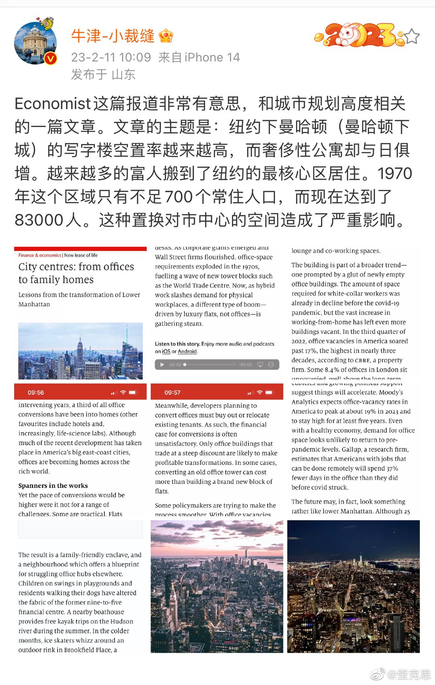

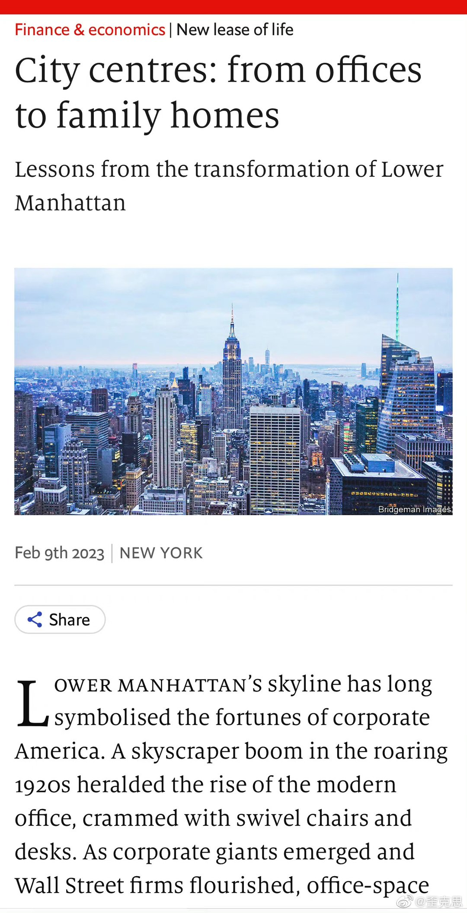

