# 2026-08-12

## 1

@最后的科学家·垠

发表于：2026-08-11 16:00

来源：微博

链接：https://m.weibo.cn/status/5330878915159551

《赛璐珞乒乓球为什么旋转强》

今天花了很多时间研究赛璐珞（celluloid）的物理和化学性质，基本确定了赛璐珞乒乓球是 ABS 球永远无法比拟的。

球场上的实测也很清晰地证实了这一点，击球的控制感和旋转远超任何品牌的 ABS 球（包括 Nittaku，红双喜，蝴蝶在内）。击球的瞬间，我明显感觉球和胶皮稳稳地黏在了一起，很难打滑。这就是所谓“吃球感”。

同样尺寸（40mm）的赛璐珞球，击球感比 ABS 球软，声音比较钝，但球速更快。这是因为赛璐珞的弹性恢复系数比 ABS 高，球的形变带来的能量损失更少。另外，40mm赛璐珞球的重量要略轻一点（2.7g 对比 2.75g）。所以球感更好，不震手。

球拍击球的瞬间，我感觉好像用手抓住球一样，可以朝任何方向“扔”。非常稳。

我之前还以为球拍胶皮好，球的表面有磨砂纹理就能有好的摩擦。哪知道这也难以弥补材质的不同。物体间的摩擦力除了因为锯齿咬合，更重要的是分子间的电磁吸引。

【化学知识】赛璐珞的主要成分是硝酸纤维素，其分子是高度极性的，这决定了它和橡胶之间的静摩擦系数远高于ABS，因为 ABS 是非极性分子。

赛璐珞的极性分子就像水——分子之间有很强的相互吸引力，"互相抓得牢"。ABS 是非极性材料，就像油——分子之间吸引力弱，接触面"滑溜溜"，抓不住。

赛璐珞球与胶皮接触，好比水碰到水：两者极性基团互相吸引，接触面粘附力大，所以摩擦系数高、旋转效果强。如果 ABS 球碰胶皮，就好比油碰到水：分子间不"亲和"，粘附力弱，摩擦系数低，球更容易打滑。

简单吧？

这就是为什么 ABS 球就算表面有磨砂处理，也无法达到赛璐珞球的旋转强度。如果你轻轻摩擦，也许看不出差距来。但如果你要拉一个很转的弧圈球，就会发现 ABS 球出界了，而赛璐珞球划出一道很弯的弧线，还能上桌。

用 ABS 球的时候，有时候一个不快又低的来球，你使劲一拉，它就下网了。同样的情况，如果是赛璐珞球过来，你使劲一拉，它就过去了，而且飞行又快又低，难以防御。这就是因为剧烈摩擦的时候，ABS 球和胶皮之间打滑了，而赛璐珞不容易打滑。

ABS 球打一阵子，表面就被磨光了，失去了锯齿咬合，就更容易打滑。而赛璐珞球无论你怎么磨光，照样有好的摩擦力，因为它的摩擦是从分子层面来的，不依赖表面的形态。

所以很明显，赛璐珞乒乓球的性能是今天的 ABS 球难以比拟的。无论是速度，旋转，还是手感，仍然是最好的材料。

看来也只有乒乓球领域才存在像 ITTF 这样的独裁组织，有办法阻止主流乒乓球厂商继续生产赛璐珞材质的球。

其实生产赛璐珞乒乓球并不违法。只要你遵守危险品操作规范，安全生产，就不会出问题。但 ITTF 武断地决定不再给任何赛璐珞球“ITTF 官方认证”，所以厂家为了能有个“ITTF aprpoved”标识，能用于正式比赛，能继续赚钱，就不再生产赛璐珞球了。

把本来很好用的乒乓球颜色改了（又改回去），尺寸改了，重量改了，材质改了。20年之后仍然无法用“新材料”造出和原来一样好打的球，却让顶级比赛都变成了喂球对拉的假球比赛。简直是一片混乱。

你说这样的组织恶心不恶心？我们还要它来做什么？

对于像 ITTF 这样的组织及其旗下的职业选手，我们应该鄙视和藐视。完全忽视他们，不看他们的比赛，不按他们教的“教科书方式”打球。因为他们打的根本就不是真正的乒乓球。遇到真正的高手，他们必输无疑。

自从高中开始，我有20年没关心过乒乓球。连后来出现了哪些世界冠军，谁是世界排名第一，我都不知道。我忽略了他们20年，我还可以继续忽略他们一辈子。

但某些其它领域是不受这种独裁控制的，比如乐器。吉他大厂仍然生产赛璐珞拨片，因为它发出的声音就是最好听的，新的材料都难以比拟。

很多吉他爱好者都不经意地意识到赛璐珞的好处（如图），就像我刚刚意识到赛璐珞乒乓球的好处一样。

一旦了解了赛璐珞，就再也回不去了。

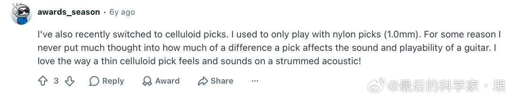

---

## 2

@物理芝士数学酱

发表于：2026-08-11 15:59

来源：微博

链接：https://m.weibo.cn/status/5330878499661872

午夜\#学术新闻\# 

今天可能最火的就是 Anthropic的员工 Jarred Sumner用AI将黎曼ζ函数中满足条件的零点比例下界从41.6%提高到67.2%。网页链接

有两个问题。

其一，这是和黎曼猜想相关的重大突破，但即便把比例推到100%也无法证明黎曼猜想。因为零点有无数个，如果存在有限个反例，那符合条件的占比还是100%。

其二，这次AI使用的方法完全是已有，而且就是主流视野里的标准攻击路线。只不过因为前年才提出，所以很多人还没算到这一步，就让AI捡漏了。

所以这个其实不是今天最重要的学术突破~

思路还是挺简单。

黎曼 ζ函数的非平凡零点（记为 ρ=β+iγ）就像是素数分布背后的“谱线”。黎曼猜想（RH）断言：所有这些零点，无一例外，全排列在复平面上一条极其特殊的直线上——临界线 β=1/2 。

 • 如果 RH 成立：零点的复数坐标可以进行变换，虚部γ就是实数。

 • 如果 RH 不成立：就会出现跑出临界线的“离线零点”（β≠1/2），此时零点的横纵坐标交织，变成真正的复数。

1970年代，数学家蒙哥马利（Montgomery）提出了研究零点间距的经典方法（两点相关性 Pair Correlation）。

如果默认 RH 成立，零点坐标是实数，零点之间的距离可以直接用减法来定义（其实是零点高度变量），当然也是实数。在数学中，实数的平方或自乘永远是非负的（即≥0）。这叫逐项正性（Termwise Positivity）。

如果知道公式里的每一项都是正数，把它们加起来大于等于零，就能导出极其强大且干净的限制不等式。

但只要出现一个“离线零点”，坐标变成复数，距离也变成复数。复数的平方不再保证是正实数，整个公式里的“非负性”瞬间崩塌！

过去几十载，蒙哥马利方法的许多漂亮结论，本质上严重依赖“事先假设黎曼猜想成立”。

在解析数论中，零点分布与素数分布是同一枚硬币的两面（通过著名的“显式公式”紧密连接）。

过去的分析之所以动不动就要假设 RH，是因为无法独立控制素数那边的波动。这就好比我们虽然还不知道零点有没有跑偏，但我们已经强行把素数那边的“后门”给封死了。

这陷入了一种“用假设证明假设”的尴尬窘境。

2024年和2025年，两篇论文

[BGSTB24] S. A. C. Baluyot, D. A. Goldston, A. I. Suriajaya, C. L. Turnage-Butterbaugh, An unconditional

Montgomery theorem for pair correlation of zeros of the Riemann zeta-function, Acta Arith. 214 (2024), 357–376.

[BGSTB25] S. A. C. Baluyot, D. A. Goldston, A. I. Suriajaya, C. L. Turnage-Butterbaugh, Pair correlation of zeros of the Riemann zeta function I: proportions of simple zeros and critical zeros, arXiv:2501.14545

(2025).

取得突破：在完全不假设 RH 的前提下，无条件地控制住了“素数侧”的二阶矩（即波动幅度）。

而Claude最主要的创见：“既然无法保证每一项都是正数，那我们就去数一数，整个系统到底最多能有多少个‘正方向’和‘负方向’！”

这个思路基于极其漂亮的线性代数与对称性：

 1. 临界线上的“好零点”：位于 β=1/2 的零点，在 Weil Hermitian 矩阵形式中，贡献的是纯正能量（半正定形式 P≥0）。它们只增加正方向。

 2. 跑偏的“坏零点”（离线零点）：根据 ζ函数的自洽对称性，只要出现一个离线零点 ρ，就必然伴随出现它的对称点 1−ρ ̅。

 3. 关键几何结构：这对“孪生坏零点”贡献的矩阵形式，在适当变换后，恰好等价于一个 2×2的标准不定矩阵：

网页链接

另一个稍显神秘的点是，AI自己写的“笔记”，那些记号人类几乎完全不可读，见图一。但是最后AI写出的论文则非常好读~

————————————

今天最重要的突破其实是这个，图二

我之前介绍过，最近陶哲轩等人共同发起了第三届 SAIR 挑战赛，本次挑战旨在攻克臭名昭著的逆伽罗瓦问题： 网页链接

重点关注24阶的情况，这几乎是最低阶的未解决的案例（不包括那个臭名昭著的问题——即马蒂厄群M₂₃ 是否为伽罗瓦群）。

逆 Galois 问题（Inverse Galois Problem）探讨是否每个有限群都能作为某个有限 Galois 扩张的 Galois 群出现。特别是 26 个“散在群”（sporadic groups）在 1984–1989 年间几乎都被实现为ℚ上的Galois群，但唯独 Mathieu 群 M₂₃ 一直未能实现。所以这一次特意把它给剔除了，因为没人乐观到认为能在这个月里解决它。

结果就在今天，这篇论文网页链接 证明 M₂₃ 确实可以作为 ℚ 上的 Galois 群出现。他们构造了一个显式的 23 次整系数多项式，其分裂域的 Galois 群就是 M₂₃。

作者全是人类，AI仅用于文本处理工作。

最后再分享一个AI发现的小反例：网页链接

加藤猜想（Kato conjecture）涉及位置算符 𝑄 与动量算符 𝑃 的函数交换子/对易子 的性质，是算子理论和数学物理中的重要问题。

作者用AI给出了该猜想逆命题的一个反例。他们证明了算符

                      𝐼=[arctan(𝑃),arctan⁡(𝑄)]

是非负且非零的。

表明加藤猜想在某些情况下并不成立，为泛函分析和算子代数研究提供了新的视角。

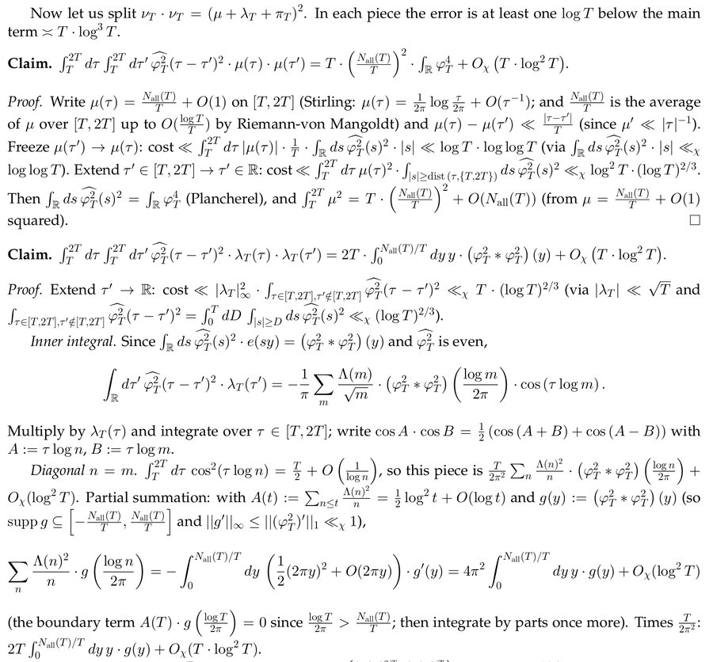

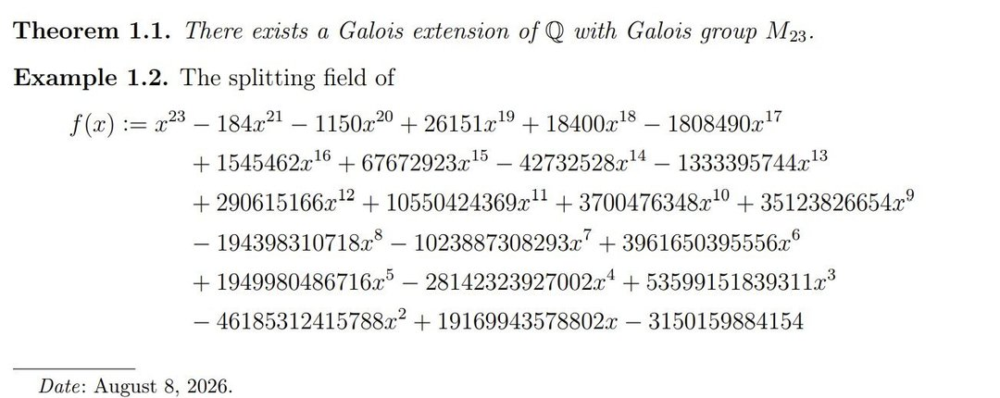

---

## 3

@阑夕

发表于：2026-08-11 08:19

来源：微博

链接：https://m.weibo.cn/status/5330762853254537

英伟达组局，自己出资25%，跟华尔街一起凑了5000亿美金，给AI公司发贷买GPU。

翻译一下就是：要死一起死。

之前我分享过的，英伟达在玩一种很新的金融工具，借钱给云厂商建数据中心，如果算力卖不完，它自己按市场价回购，帮云厂商的生意兜底。

虽然英伟达现金流确实丰厚，但把杠杆全加自己身上，投资者也不太高兴，于是新版本就变成了，把投行拉进来一起出钱，一荣俱荣，一损俱损。

现在美国的整个产业资本都被绑进来了，靠左脚蹬右脚的梯云纵一路上天，准次贷的玩法层出不穷，全指望着下游企业买单，就赌这波技术升级能够再现上一轮IT化带来的50年繁荣。

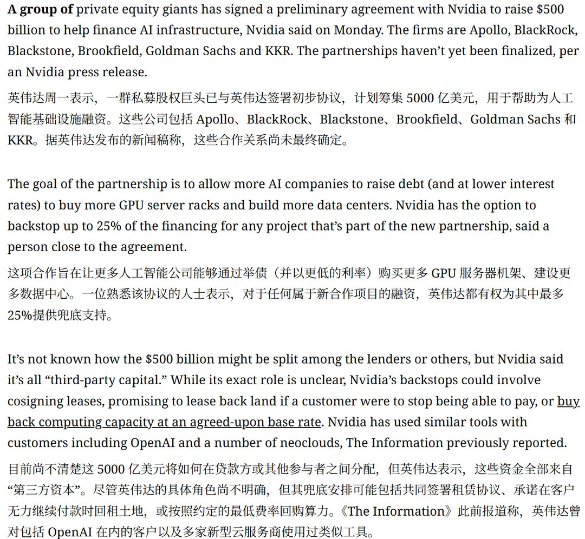

---

## 4

@邪能之槌

发表于：2026-08-11 10:59

来源：微博

链接：https://m.weibo.cn/status/5330803224740534

刷到个新闻，概括一下就是一个精神小妹孤苦无依混迹社会，然后遇到个离异带女儿的中年男人，男人看她可怜就收留她，结果精神小妹为了独占男人，把男人的5岁女儿卖给人贩子。

后来等已经怀孕的精神小妹落网，男人决定和她断绝关系。但为了让精神小妹和她肚子里的孩子有人照顾，社区工作人员等各路人马就诱导精神小妹，控告男人性侵。

但也许精神小妹是真的爱惨了男人，甚至已经有点畸形了，咬死了他们当初是自愿发生关系的，所以男人逃过一劫。

这个故事，作者没机会把男人送进去，那副咬牙切齿的画面透过文字扑面而来，看得我不寒而栗。

太变态了......这确实不是斩杀线，因为斩杀线好歹有条线，你感觉血量不足，看到斧王就会跑。这是随机秒人，恩赐解脱，不讲道理的......

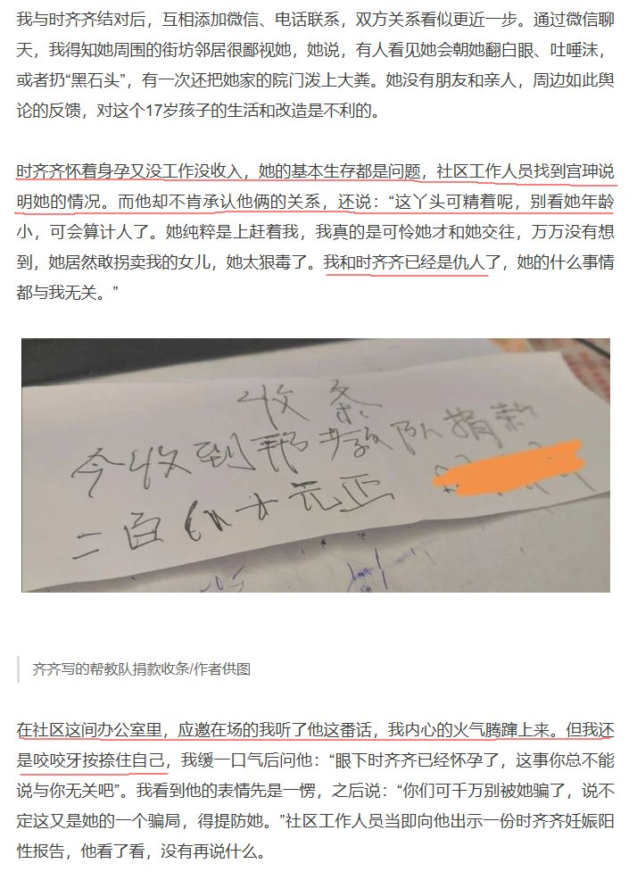

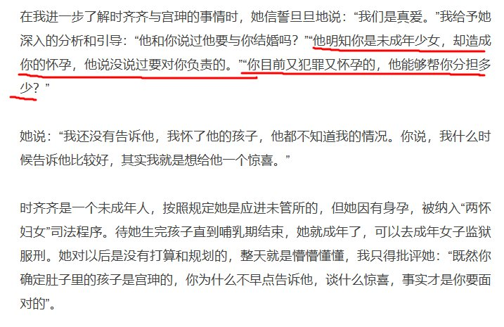

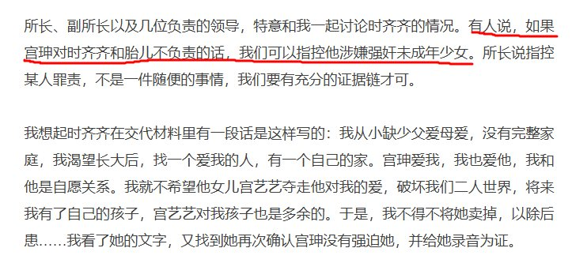

---

## 5

@专业戳轮胎熊律师

发表于：2026-08-11 15:25

来源：微博

链接：https://m.weibo.cn/status/5330870149062344

其实，关于中东题材，战争题材

不是说不能拍女性视角

而是……

女性视角你一拍，立刻女拳就疯了

女频经常会有一种规则怪谈。

就是剧情里常见的那种：她有一纸合约，你就拿她毫无办法。

事实上，规则这东西……你找个流寇给她两刀，就完事了。

中东战争题材也一样。

男性在那里，也就是邦邦2枪的事情。

女性呢？都不用枪，哐哐2拳你就得听话，不听话再哐哐2拳

她去报警？都打仗了，警察谁来管你？

你只要照着这个逻辑去写剧情，就会发现，女性在没有力量的前提下，什么都做不到，只有沦为附属品。

这时候，她会发现，她现在，能在我国所有的肆意妄为，都是因为社会主义法治社会在发挥作用。

是规则拯救了她。

不然：啊啊啊啊啊啊啊，左转的红灯……

话都没说完，就被黑车司机邦邦两枪拖去城外丢荒野了。

那么……她反过来思考，这下得歌颂社会主义了吧？

不行……这又和她的底层逻辑产生悖论了。

她怎么能歌颂社会主义呢？她要抨击我国社会，说社会这不好那不好，才能继续贩卖赎罪券啊。

---

## 6

@蚁工厂

发表于：2026-08-11 00:18

来源：微博

链接：https://m.weibo.cn/status/5330641826877560

DeepSeek Harness团队公众号建立。

---

## 7

@哈瓦洛hawalo

发表于：2026-08-10 11:37

来源：微博

链接：https://m.weibo.cn/status/5330450308665155

简单来说就是患有强直性脊柱炎的一个人，在鞋厂里上班，每个月四千五的工资，每个月发四千回家，家里清贫，骗家里人说每个月六千，其实只剩五百，患有这个病的，游泳能缓解病痛，没钱去游泳馆，去野游，但也留在了那条河里，做了几十年的鞋子，临了光着脚走的，大明星大名人生病去世我们没啥感触，可这么简单的一个普通人却能让我们共情，唯有人民心疼人民

很多人不知道，他工资 4500，跟妈妈说 6000，给妈妈转 4000，我真佩服他，他是一个真正的男人，彭仕运彭先生是个体面人。

颈椎有毛病，转不了头，在厂里做活，4500的工资寄4000回家，很省的一个人，再困难也是在积极生活的人，他很爱笑，前一段时间游泳的时候淹死了，可能是命运弄人吧，明明辛苦的活着，老天还是不留你。他终于让这个时代看见了那些一直存在，却一直被忽略的普通人 

为什么一个月薪4500块的普通打工人去世后，会有这么多人自发纪念他？ 

大家纪念的，不只是老表。 大家纪念的，是那个一直没有被看见的普通人。 

他没有豪车，没有豪宅，没有惊天动地的人生。 

他只是一个在广东进厂打工的人，一个月四千多块工资，自己舍不得花，每个月把大部分寄回家。 

这样的人，中国还有很多很多。 

所以大家难过的，不只是彭世运。 而是终于发现，原来大多数人的一生，都和他差不多。 

更让人唏嘘的是，互联网认识他的方式，并不是他的故事。 而是他的表情。 

很多人拿他的照片做表情包，模仿他的笑，调侃他的长相。 可直到他离开，大家才知道，他患着病，家境普通，为了家庭拼命工作。 

网络认识的是他的脸，现实承受的是他的人生。 

一个活生生的人，曾经只是一个“梗”。 直到生命结束，大家才重新把他当成一个真正的人。 

更扎心的是，老表并不是一个所谓的成功者。 他没有财富，没有名气，没有耀眼的履历。 

可偏偏这样一个普通人，却让无数人流泪。 

因为大家突然意识到，原来一个人，不需要成功，也值得被尊重。 

我想，这也是为什么那么多人心里堵得慌。

老表这个人呀，发工资发4500，他要转4000回家里，留500当生活费，以前在厂里上班，被精神小妹举报，长得吓人，看见吃不下饭，然后老板就把他开除了，以后每次吃饭，他会盛完他的饭进他的宿舍房间去吃，因为他怕别人看到他的脸影响别人吃饭。

像老表这样的人需要尊重和关爱，老表干了这么久的鞋子，到最后还是光着脚走的

晚安彭仕运，下辈子不要再这么苦了

好人为什么不长命呢？

老表从来都是穿得干干净净，板板正正，老表是一个很善良的人，老表不想给任何人带来麻烦

老表，你在天上看到了吗？共和国的人民在向你致敬致哀，人民万岁，劳动人民万岁。

我的愿望是，让无产阶级不再流泪 哈瓦洛hawalo的微博视频

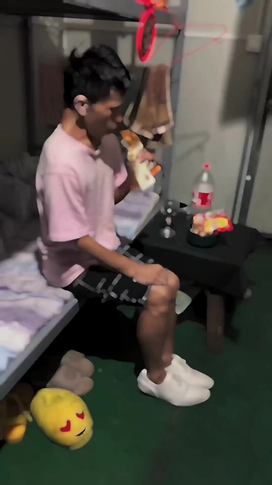

---

## 8

@张忆安-见龙在田

发表于：2026-08-08 15:13

来源：微博

链接：https://m.weibo.cn/status/5329779824001853

特朗普这次说对了，但说的不全面。美国不是矿业人才落后于中国，而是工科人才全面落后于中国。

上世纪九十年代美国推行快乐教育以来，公立教育的理科水平基本遭受毁灭性打击。在催生出一个几千亿美元的私立教育体系的同时，让相当一部分无力承担私立教育的美国学生连四则运算都无法掌握。

公立教育的理科崩溃，反推私立教育理科降级。原来公立能学函数、几何、力学、电磁、方程式。私立就得教的比这个更深。现在公立连四则运算都不教了，四则运算就成了私立教育的摇钱树。随着时间推移，没准儿私立教育机构里教四则运算的都会逐渐变成全棕色面孔，可以顺手把瑜伽也教了的那种。

所谓十年树木，百年树人。特朗普想要MAGA，手里没有足够人才是不可能的。以美国的政治制度，想再次振作，得连出好几个圣人才行。

当然，美国教育体系瓦解是前车之鉴。大家以后再遇到有把快乐教育挂嘴边的，心里要先想想他打的是什么主意。

张忆安

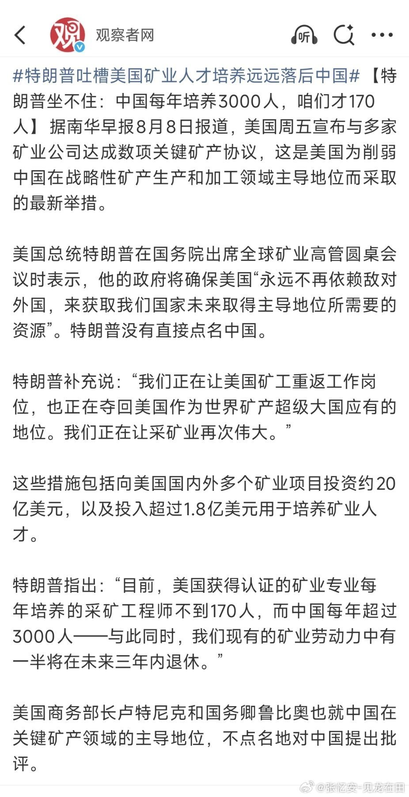

---

## 9

@宝玉xp

发表于：2026-08-10 21:33

来源：微博

链接：https://m.weibo.cn/status/5330600296710882

Anthropic 宣布将给 Claude 的输出内容加上机器可读的标记，包括文本中嵌入的隐形水印，以及生成文件中附加的数字签名元数据。8 月 2 日起（也就是上周），所有新发布的 Claude 模型已经开始执行这套标记机制。

这是 Anthropic 为遵守欧盟 AI 法案第 50 条签署的透明度行为准则。但执行范围不限于欧盟，全球所有使用 Claude 的地方都会生效。

具体来说有两层标记。

第一层是文本水印：Claude 生成文字时，会在文本中织入人眼不可见的水印，不影响阅读体验和内容质量。这个水印的特点是“跟着文字走”，你把 Claude 写的一段话复制粘贴到邮件、文档或博客里，水印依然在，一定程度的编辑修改后也可能保留。

第二层是文件元数据：Claude 生成 SVG、PNG、JPG 等文件时，会附加符合 C2PA 标准的签名元数据。C2PA 是 Adobe、微软、Google 等公司共同推动的内容溯源开放协议，OpenAI 和 Google 的图像生成工具已经在用。

覆盖面很广。API、Claude 官网、Claude Code、Claude Cowork、Claude Tag，所有产品线都适用。通过 AWS、Google Cloud 或 Microsoft Foundry 调用 Claude 时，文本水印同样生效，但文件元数据取决于各云平台的功能支持。

在此之前，Claude 一直没有公开部署过文本水印。OpenAI 此前开发过文本水印方案，但出于各种考虑一直没上线。Anthropic 这次直接在文本层面落地水印，算是 AI 大模型厂商中走得比较靠前的一步。

对于用 Claude 写东西的人来说，一个直接的影响是：你用 Claude 起草的邮件、报告、文章，里面都会携带可被机器检测的水印。Anthropic 表示正在开发配套的检测工具，未来第三方也能检测。

不过限制也很实际。检测到水印只能说明内容“可能经过 Claude 处理”，不能确认 Claude 是原始作者，因为很多人用它润色、翻译、总结已有内容。反过来也一样，检测不到水印不代表内容不是 AI 写的，文本被大量改写后水印会消失，太短的文本信号不够可靠，文件经过格式转换或截图也会丢失元数据。

8 月 2 日之前发布的现有 Claude 模型，Anthropic 正在补充标记功能，具体时间表还没公布。如果你基于 Claude API 构建产品，Anthropic 建议你独立评估欧盟 AI 法案第 50 条对自己的合规要求。

相关文档：网页链接

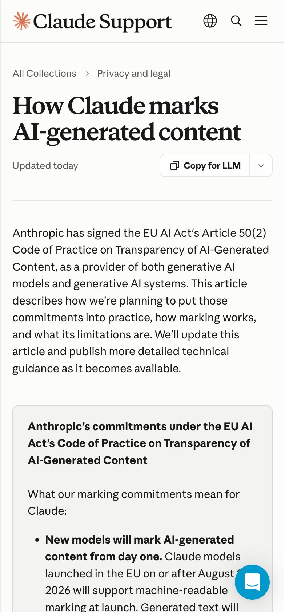

---

## 10

@有个梨GPT

发表于：2026-08-10 10:10

来源：微博

链接：https://m.weibo.cn/status/5330428526336812

最近对哥德尔的dialectica翻译的了解，让我理解了未来编码工作的发展方向。

其实编码已经嗝屁了，因为从逻辑表达式（spec）里提取代码的技术是成熟的。现阶段的主要问题是，首先规模上肯定是有问题的，其次怎么写spec是个问题，最后是现有系统api对纯逻辑/计算系统没那么友好，怎么封装也是问题。

但是point是，这特么是纯形式化系统，对ai而言更容易象alpha go那种打法干；所以未来编码不会死但是目前这种手工码没戏了，包括ai写的手工码也是没意义的。

一旦系统能开始bottom up的提供逻辑严格的接口描述设计，机器代码时代就来了。 

∃u∀v.A(u,v,x)

未来是这种玩意的天下。

---

## 11

@tombkeeper

发表于：2026-08-10 14:50

来源：微博

链接：https://m.weibo.cn/status/5330498987232154

今年有一项研究发现陈年大蒜提取物中的 S1PC（S-1-丙烯基-L-半胱氨酸）对小鼠和人类都表现出了明显抗衰老作用，尤其是能改善骨骼肌退化，提升肌肉力量。

抗衰研究很多，这个之所以值得一提是因为 S1PC 是通过“脂肪-大脑-肌肉”这条通路发挥作用的，首先就得有脂肪，所以对瘦子（BMI < 18.5）几乎无效。

同志们，留此有为之膘，徐徐图之。

---

## 12

@姬永锋

发表于：2026-08-11 22:11

来源：微博

链接：https://m.weibo.cn/status/5330972350612492

（转）木头姐几乎没有错过任何科技热点。电动车、自动驾驶、基因编辑、比特币、金融科技、机器人、人工智能——她都在早期重仓押注。

2017年，她靠比特币信托1300%的暴涨，收益87%。2020年，ARKK上涨153%，登顶全美主动型ETF，她被封为"女版巴菲特"。

截至2026年年中，ARKK自2014年底成立以来的年化回报约14%，看起来不错。

然而真相是：投资者可能根本没赚到钱。

晨星2024年初的一份统计显示：当时ARKK自成立以来的年化回报约9.7%，但按资金实际进出的时间和规模加权，投资者的平均年化回报约为负17%。

2014到2023这十年，ARK基金家族合计毁灭了143亿美元的股东财富，位列全美"财富毁灭榜"第一，超过第二到第五名的总和。

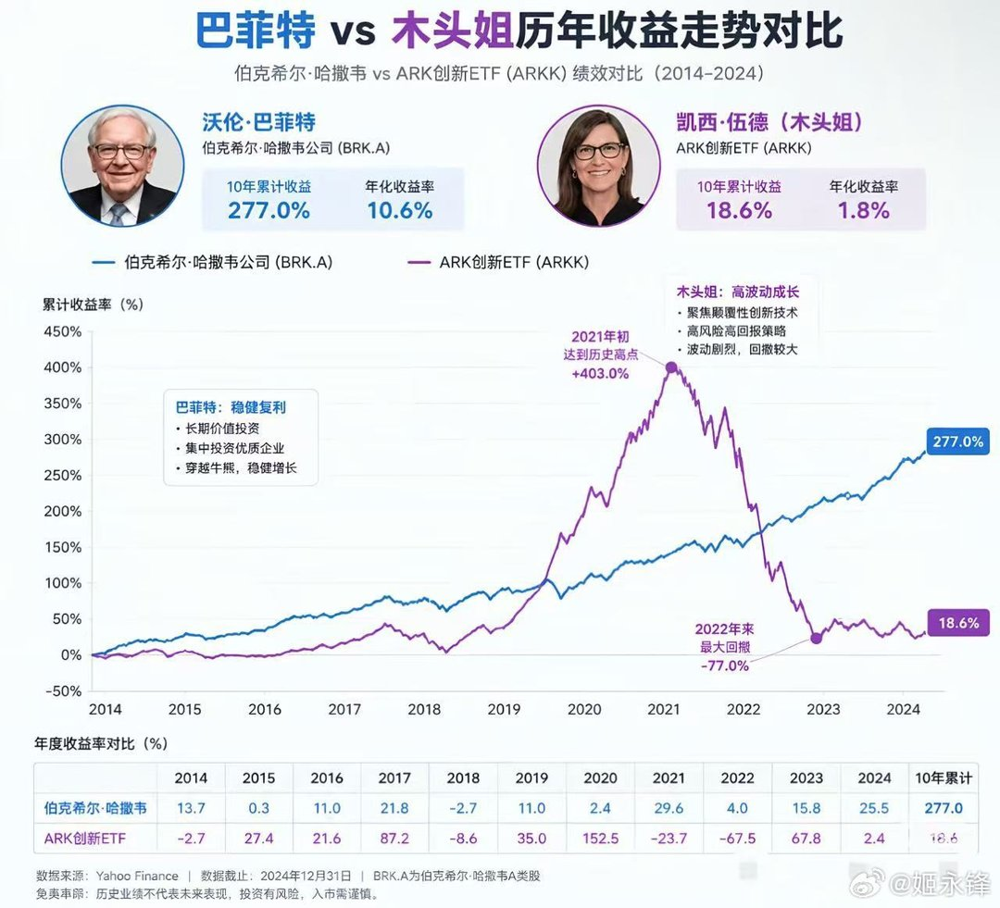

---

## 13

@风中的厂长

发表于：2026-08-10 01:21

来源：微博

链接：https://m.weibo.cn/status/5330295218769125

昨天刷到一个b站视频，讲的是哈佛大学社会学博士玛莎·贝克，她焦虑了半生，自己严重焦虑的同时还要开导焦虑的学生，明明不喜欢老公还要假装喜欢老公，多重压力下突然开窍，成为“美国最知名的人生教练”，其实就三个字：不装了。

她发现自己焦虑是因为太装了，比如别人问她how are you？虽然过得不好也要回答fine，现在就直接说bad！这个汉堡好不好吃？不好吃！

她的理论核心：绝大多数慢性焦虑，都来自持续的伪装：我们不断撒谎、迎合、扮演别人期待的样子，大脑要不停维持两套逻辑（内心真相 + 对外人设），精神双倍消耗。卸下伪装、停止内耗、忠于自我，诚实说出真实状态，大脑不用再自我欺骗，焦虑会自然减少。

我们也可以试试，不喜欢的社交，就别去了。不属于自己的圈子，不要融入。不喜欢的人，就别交往了。不懂的事情，不要装懂。不真实的人设，不要维持。勉强凑合的东西，就别买了。超出能力的承诺，不要答应。不想回复的消息，不要秒回。不喜欢的话题，不要尬聊。没必要为了合群，改掉自己小众的喜好。不要拿社交平台上别人的光鲜，来对比自己的生活。不要因为说错一句话，做错一件事，而耿耿于怀。不要因为偷懒而愧疚，我们每个人，都需要偷懒，需要休息。

---

## 14

@贴小君

发表于：2026-08-10 09:29

来源：微博

链接：https://m.weibo.cn/status/5330417969528955

这两天网传失联的这位女生，如果情况属实，那么她遭遇的情况我推测就是和去年那几起失联事件一样。

类似的事件不是第一次发生了。\#泰国被接机女生疑遭带走\#

去年，四位20来岁的中国女生遭遇都如出一辙：许好宁、林美玲、杜紫艳这两起的三人都是被同一位“朋友”约去泰国玩，三人都是被约去非常偏僻的景点，并且去景点的途中被强制换车，然后上车后被控制住强行押往泰缅边境，最后送往妙瓦底园区，还被索要20万赎金。

去年的吴佳琪（21岁），也是一样，被网友约去泰国玩，最后上了对方来接的车，然后也被控制住就直接妙瓦底。

这四人的详细经历可以在我主页搜一下，我都有梳理过。

这种骗人的手段我都有科普过：电诈园区的套路一般都是先把被害人骗至泰国旅游，玩帅哥骗女孩，女孩骗男孩这样（骗子会精装朋友圈和社媒账号让你防备心降低，通常会先花几个月或者一年时间来和你建立友谊）。

还有另一种是骗招工作的，就说当地要招厨师、装修工什么的，之前就有8个四川装修工人被这样忽悠过去。最后每人差不多赔了20多万才被放出来。

旅游骗局的就是到了一般是曼谷然后会给你洗脑去清迈玩等等之类，因为去清迈中途会经过去缅甸边界的过路城市一般人不会疑心，然后会跟你以各种理由，让你上他安排的车，

等你上车之后就完全走不掉了。

出来曼谷到了没有检查的地方这个时候就会把你往边界拉，这个时候你想反抗已经无能为力了，他们会强行控制你，基本都有刀甚至有抢，然后强行从小路绕过去检查站然后就到了泰缅边界，最后走小路把你送到缅甸电诈园区。

目前在东南亚一些国家，均有几大中国绑架团伙操控，他们专门雇佣本地人押车，将这些被绑架的中国人强行转卖到园区内。

从国内骗招来的中国人，很多人落地当地机场，出门就被车接到，还以为是招聘公司来接人，等出了机场拐弯处就上来几个带枪的本地人，直接强行把人押走。前几个月金边警局门口死亡的中国人就是强押的后果，当事人刚从中国飞到金边，刚下飞机就被接走，半路上来一帮带枪的本地人，上车就殴打控制，中国小伙跳车逃亡，结果不幸身亡。

所以不要跟陌生人/网友去泰国，更不要上对方安排的车。

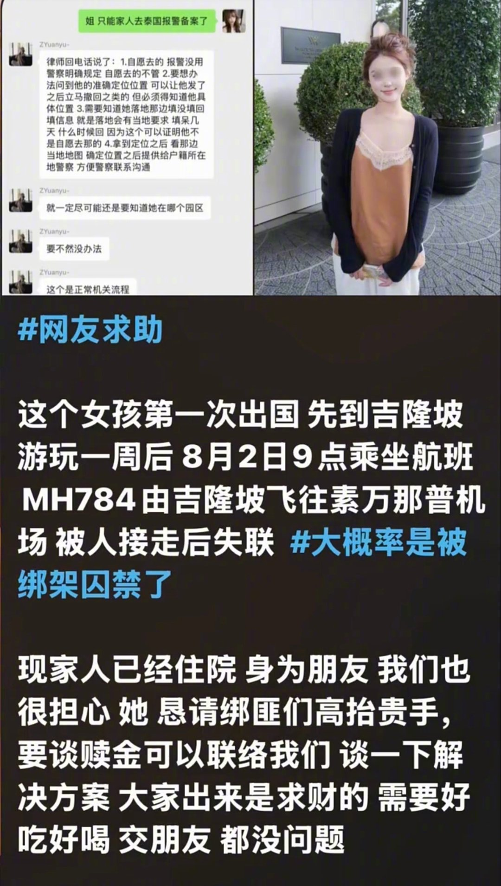

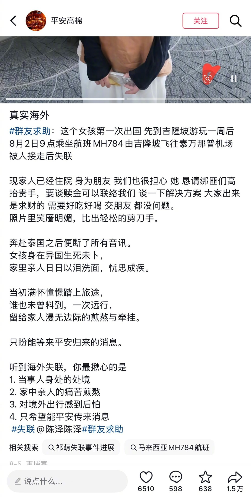

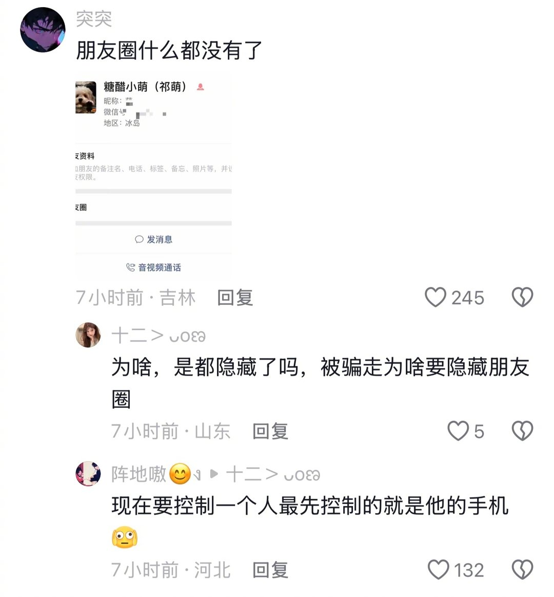

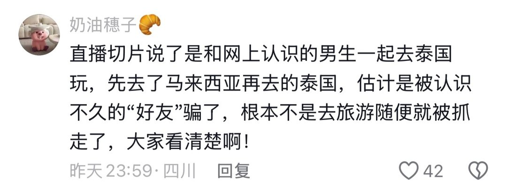

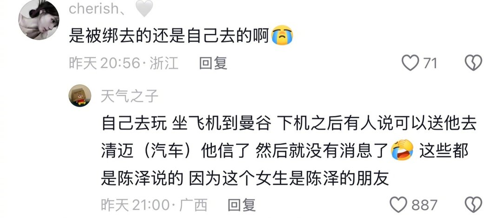

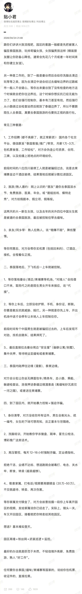

---

## 15

@黄建同学

发表于：2026-08-10 23:20

来源：微博

链接：https://m.weibo.cn/status/5330627093333795

Why managed agents are the next big thing in agent building

LangChain 刚发布了 Managed Deep Agents，顺带介绍了 Agent 工程演进的三个阶段。

1. Agent 工程的三个阶段

1）2022-2023 早期：LangChain、ChatGPT、AutoGPT，LLM 能用了，但还谈不上 Agent。

2）2024-2025 上半年：框架成熟期，LangGraph、Google ADK、Vercel AI SDK 出来了，开发者能更精细地控制 LLM，但还不是真正的 Agent。

3）2025 年中开始：模型能力到位，"LLM 在循环里调工具"成为 Agent 的核心原语。Manus、Deep Research、Claude Code 都走这条路。

2. Harness 层在第三阶段出现

模型能跑起来之后，大家开始研究怎么把它套在一个靠谱的工程环境里——Claude Code、Deep Agents 这类 Agent Harness 是这个阶段的产物。

过去一年沉淀出了两类东西：

1）基础设施层：durable execution（Agent 跑到一半崩了怎么续跑）、sandbox（隔离执行环境）、"brain 和 hands 分离"的架构思路。

2）标准层：AGENTS.md 做基础指令、MCP 做外部系统对接、skills 做上下文渐进式披露。

3. Managed Agent 是下一步

Managed Deep Agents 把 Harness + 基础设施打包在一起，开发者不用自己组装：

1）Runtime：LangSmith Deployments，解决可靠性和断点续跑。

2）Sandbox：隔离执行不可信代码。

3）Context Hub：AGENTS.md、skills 统一管理，支持业务人员直接编辑。

4）Eval：Harbor 做 prompt/工具/模型变更的评估。

5）Auth：AuthN 内置，对外调用时的身份管理也考虑进去了。

把"搭 Agent 工程环境"这件事从开发者肩上卸下来，让研发只专注业务逻辑。

4. 这个技术的发展情况

Anthropic 的 Claude Managed Agents 稍早发布，API first，面向开发者，引入了"dreaming"机制（Agent 空闲时自我更新）。Vercel 的 Eve 也在最近上线，走"Agent 即文件"的路线。LangChain 这次是第三个入场。

三家在同一时间窗口里做同一件事，很有可能"Managed Agent"是未来的方向。

\#how i ai\# \#程序员\#

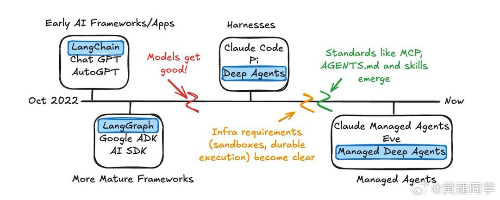

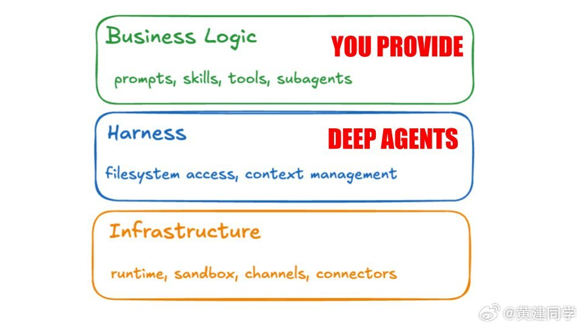

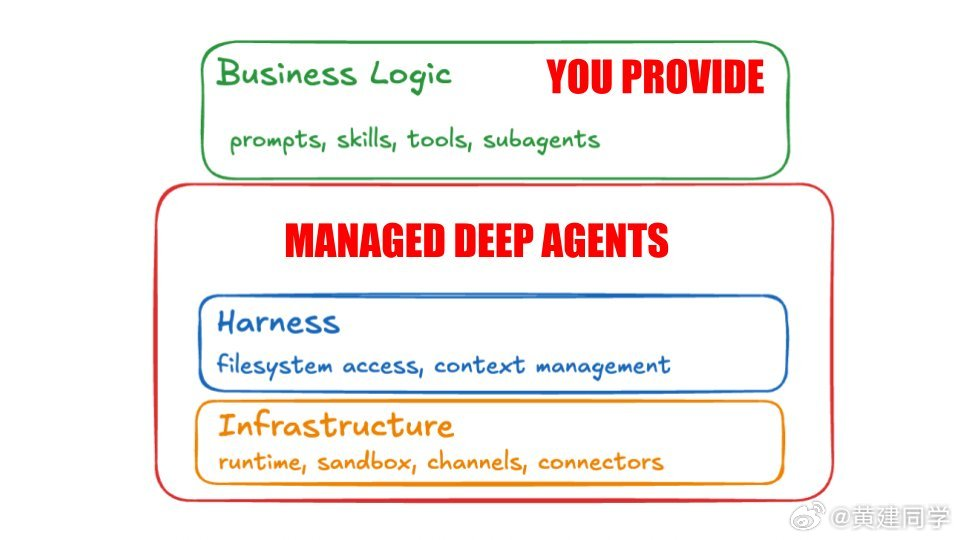

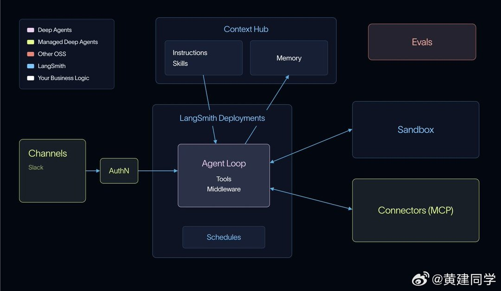

---

## 16

@互联网那些破事

发表于：2026-08-08 13:39

来源：微博

链接：https://m.weibo.cn/status/5329756149255358

什么叫老天爷追着喂饭吃。

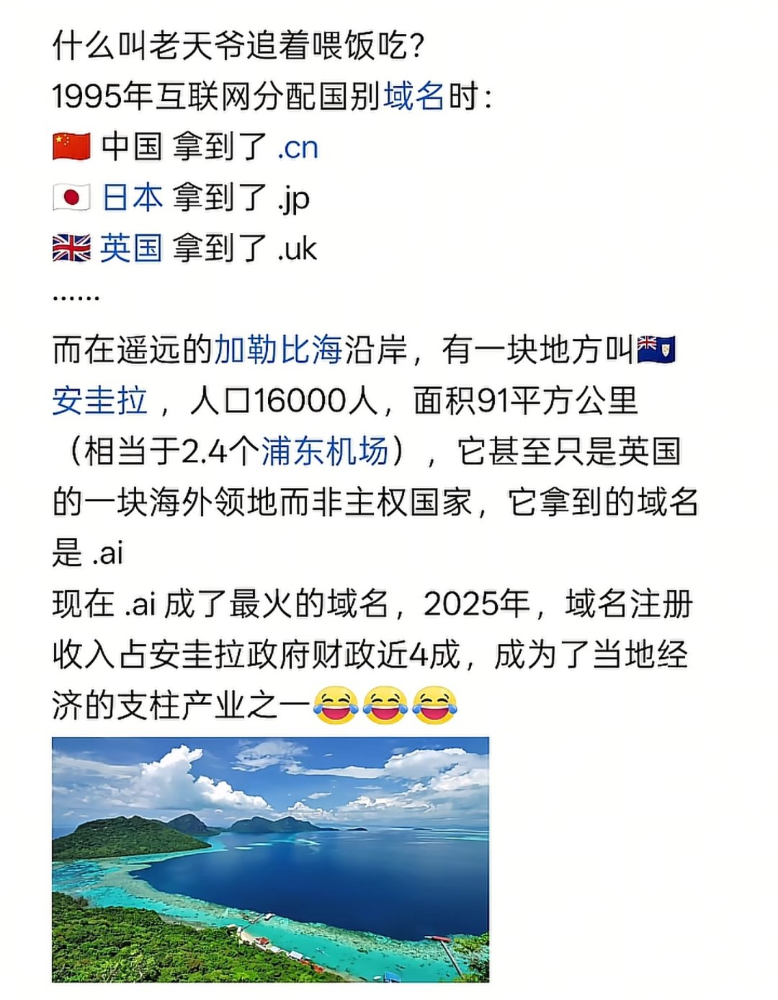

---

## 17

@子夜梦廊

发表于：2026-08-11 02:59

来源：微博

链接：https://m.weibo.cn/status/5330682403361705

\#英伟达将筹资超5000亿美元\#\#英伟达将与6家公司合作\# 

5000亿AI狂欢，华尔街布下终极死亡赌局！

估计很多人点进去，还没来得及看内容，就被标题和开头搞得一头雾水:CDS是啥？那帮平日里视财如命的华尔街大鳄们为什么要拿出5000个小目标来帮英伟达？黄仁勋面子这么大吗？

别急，中译中版本马上就来。

啥叫CDS？其实就是一种对赌协议，用大白话来说就叫“还不起钱保险”。

打个比方，你有一个生意做得很大的邻居老王。他天天找村里人借钱发债券，你借了100万给他，但心里直打鼓，怕他生意失败跑路，那你的100万岂不是血本无归了？

于是你找到村里的富豪老张，对他说：“我每年给你1万元保护’。如果老王按时还钱，这1万归你；但如果老王中途破产跑路了，你要把老王欠我的100万全额补给我。”老张答应了。然后你们签了一份协议，这份协议就是CDS（Credit Default Swap，信用违约互换）。

然后呢，英伟达的“还不起钱保险”，如今的价格被炒到了历史最高位。本来正常情况下几块钱一份的违约保单，硬是被炒到了几百块。这不单单是因为某一家公司要倒闭了，而是因为整个AI产业正在经历一场前所未有的“金融大跃进”与“债务洗身”。

为啥？因为CDS协议最魔幻的地方在于：就算你一分钱没借，你也能买下别人手中的CDS！

我们接着拿上面的比方来科普: 村里的路人老李一分钱都没借给老王，但他天天看老王高杠杆借钱扩张，觉得老王这资金链迟早要断。于是也跑去找富豪老张：“我也每年给你1万保费，如果老王破产跑路，你赔我100万！”

这时候，CDS就从“避险工具”变成了“赌场筹码”。老李买CDS不是为了保本，而是纯粹在赌老王爆雷。这种不持有原始债务、纯粹靠买保险来赌别人死掉的操作，在金融界叫“裸CDS”。老王一旦破产，老李自己毫发无伤，却能凭这张纸白赚99万。

现在，把这个村头赌局放大一亿倍，把老王换成那些狂买英伟达芯片的AI算力新贵，把老张和老李换成华尔街顶级的私募巨头与对冲基金。。。这下能看懂了吧:欢迎来到当下全球最疯狂的金融修罗场！

还是看不懂？接着中译中！

在我们的印象中，搞AI的都是科技巨头，像微软、谷歌、Meta或者OpenAI。但科技巨头也有自己的财务顾虑，如果为了建数据中心、买几万美金一颗的英伟达芯片、建配套电厂，动辄掏出几千亿纯现金或者在自己账上挂几千亿债务，财报会极其难看，股价分分钟跌给你看。

于是，华尔街那些平淡无奇却掌控着数万亿美元的地下钱庄——阿波罗、黑石、KKR、雅雷和蓝枭等私募信贷巨头，嗅到了前所未有的肉香。

这些巨头联合起来，搞出了一个极其复杂的债务融资模式。简单来说，科技巨头不想直接借钱，就扶持一批“中间商算力公司”（业内叫云算力租赁商，比如CoreWeave）。这些中间商拿着科技巨头的长期租赁意向书，跑去找阿波罗和黑石：“看，微软说要租我的算力！快借我几百亿，我去买英伟达芯片建设数据中心！”

私募巨头们大手一挥，几千亿美金的贷款瞬间砸了下来。华尔街管这叫“AI算力杠杆”。

但这几千亿美金借出去，私募巨头们心里能不打鼓吗？万一过两年AI热潮退去，算力卖不出去，这些中间商破产了，留下几百万颗降价的芯片和几百座数据中心，岂不是砸在手里变成了废铁？

于是，金融天才们发明了他们最拿手的招数:洗身抛泥。

第一步，他们把这些借给算力公司的几千亿高风险贷款打包，设立成一个个“特殊目的实体”（SPV）。这就相当于把脏水和泥巴全部盛进小桶里，让债务和母公司防火墙隔离。

第二步，他们把这些债务包装成看起来极其诱人、年化收益高达8%甚至更高的债券，卖给市面上的养老基金、保险资金和普通投资者。

第三步，也是最关键的一步：为了让这些高风险债务看起来像“AA级无风险资产”，私募巨头们跑去金融市场疯狂采购CDS（信用违约互换），给这些债券贴上一层“爆雷有保险公司赔”的标签。

通过这一套丝滑的操作，私募巨头们完美实现了“洗身抛泥”：中间安排费和管理费落袋为安，本金风险通过债券转嫁给了养老基金，违约风险通过CDS扔给了保险公司和对冲基金。自己擦擦手，连一粒泥巴都没粘上。

但是，华尔街的赌场里从不缺乏精明的老李。那些嗅觉灵敏的对冲基金们冷眼旁观，很快发现了这套庞大金融链条上最致命的死穴：AI的造血能力，根本跟不上这5000亿美元的烧钱速度！

算力确实是好东西，芯片也确实贵。可问题是，这几千亿美元造出来的算力产能，最终得有客户买单啊！现在的AI应用，无非是写写代码、做做客服、画画图、生成个PPT，真的有那么多企业愿意每个月拿出几百万美金来接盘吗？

当对冲基金们算明白这笔账后，他们意识到：这场由5000亿债务堆起来的AI大基建，极有可能出现大规模的违约。

于是，狂欢开始了。老李们如同嗅到腥味的鲨鱼，蜂拥入场，开始在公开市场上疯狂购买这些AI算力债务的“裸CDS”。他们不持有任何芯片，也不建任何数据中心，他们唯一的目的，就是做空这场AI债务泡沫，下赌注赌那些算力租赁商还不上钱、赌这些SPV债务爆雷！

买的人越来越多，针对AI债务的CDS价格自然被推到了天文数字。CDS价格暴涨，本质上就是市场投机者在用真金白银喊话：“我们觉得这个AI债务故事要讲不下去了！”

这种CDS价格的异动，直接把压力反噬到了英伟达和科技巨头身上。当违约保单被炒到天价，意味着后续想再通过借债来买芯片的融资成本会呈指数级上升。一旦后面的钱接不上，前面的杠杆就会瞬间崩塌。英伟达股价近期的大幅波动，背后正是这种金融传导机制在发挥作用——市场开始担心，一旦这5000亿美金的债务游戏玩不转，英伟达最大的那些“加杠杆买家”就会一夜间失去买单的能力。

整场戏看下来，你会发现一个极其讽刺的现实：

原本应该服务于硬核科技创新的AI浪潮，在华尔街的操盘下，硬生生被演变成了“ Silicon Valley（硅谷讲故事） + Private Credit（私募发债务） + SPV（防火墙隔离） + CDS（金融衍生品对赌）”的四重杠杆游戏。

这场赌局里，硅谷拿到了算力和故事，华尔街赚走了天价手续费，投机者通过CDS押注爆雷，而最终承担底层风险的，却是买入这些债券的普通投资者和养老金。\#微博新知\#\#ai创造营\#

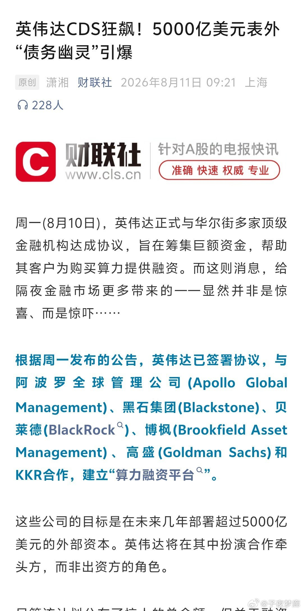

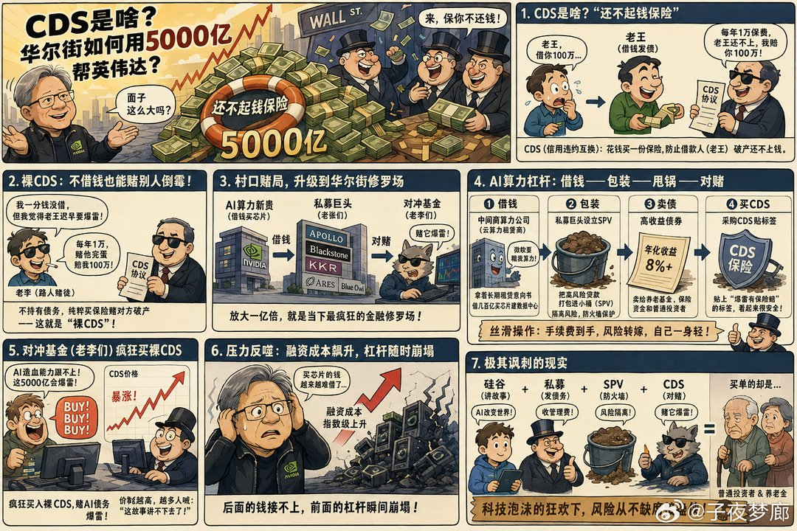

