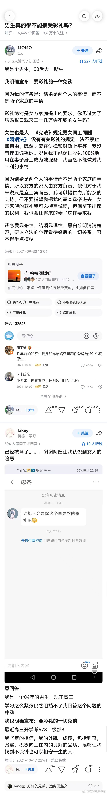

# 2026-08-13

## 1

@鲁智深姐姐

发表于：2026-08-10 05:40

来源：微博

链接：https://m.weibo.cn/status/5330360485284466

网上的事情很多都有幺蛾子。上周有个重庆游客王先生说去新疆伊犁玩，同行两位女士因为酒店只剩一间房，晚上只能睡自己的车里，但退房时被酒店强收150元车上住宿费。当时的报道是王先生说：车是我的，油是我的，停车费我也交了，睡自己车里凭什么给酒店交住宿费？然后全网声讨酒店，觉得酒店吃相太难看了。

我当时没在节目里说这件事，也没写，是因为没有看到另一方的陈述，还有我的判断是，现在做生意的人都挺怕舆论的，人人有手机，没事还能说你很多，自己再搞事就是找死。

果然，后续来了。酒店的说法是王先生一行三辆车，共十几个人，在只订一间房的情况下，第二天在酒店院子里生火做饭，搭天幕，还长时间使用洗衣机和员工电饭煲。酒店要求未住人员离开，王先生方主动表示可以付钱。最后商定150元包括停车、洗衣机、做饭等综合收费，不是住宿费。但开发票时王先生坚持要求备注必须写上“车上住宿费”，酒店说那算了，不收这150了，王先生拒绝，还为此报警，酒店为了息事宁人才照办。王先生拿到标注“车上住宿费”的发票后，随机拔打12315投诉。

酒店遭遇网暴，调查过程中退还150，还补偿了1000元给王先生。

另外还有两个细节，一是王先生之前称当时周边民宿全满房不实，二是周围就有免费露营地，他们不去，就要在酒店院子里搭帐篷，应该是洗澡洗衣服方便吧。

过去的这个周末，舆论开始逆转，王先生承认同行人员确实在酒店洗衣做饭，并称“只希望风波尽快平息”。

现在吃到反转后舆论的威力了，希望平息了，干别人的时候可不是这么想的。

现在某些所谓的维权吧，不过是预谋式碰瓷。王先生这一步步的，一环扣一环啊，剧本写得还挺有逻辑。明明想省钱只订一间房，却说是没房，在酒店生火做饭占用资源，说可以掏钱，但又让人写车上住宿费，预设证据，就准备拿着它投诉搞事要补偿呢。

王先生，他是个精算师啊，一步步都算到极致，花最少的钱，旅最自在的游，拿最多的补偿。他还是个大编剧呢，把自己包装成一个被不良商家坑害的故事。

他不是在维权，他是在运营一场维权。

这种人不少，前两天，有个负责维权部门的读者还留言，说这些年投诉举报量极巨增加，以前大部分是商家的问题，现在至少一半是其他问题，最后往往是商家退单方式解决。商品是有成本的，商家也要养家糊口。这些人损伤的是合法商户和真正消费者的利益。

---

## 2

@东方电影传奇

发表于：2026-08-12 05:06

来源：微博

链接：https://m.weibo.cn/status/5331076785374325

长江后浪推前浪，一切糟粕都要在00后手里一扫而光，当然我们期待一扫而光，扫不光慢慢扫，还有10后，20后呢。

男女结婚互相都要有彩礼，男的给彩礼，女的给嫁妆，价值应该相等，而不是严重坑男方，凡是坑男方的，这都不是结婚，都是交易。交易的婚姻不是幸福的婚姻，早晚会分崩离析，一地鸡毛。

男人结婚的目的，是为了把自己的基因传下去，而现在有些男人结了婚，花了大笔钱，生的孩子还不是自己的，而法律还不支持男方，完全违背了基因传递的初衷，男人结婚干什么？

---

## 3

@作家陈岚

发表于：2026-08-11 05:09

来源：微博

链接：https://m.weibo.cn/status/5330714939886818

那个“车上住宿费”的事，

就是个我们人人都要学习的“选择性爆料”操控的经典案例。

那个诬告的王先生说谎了吗？

没有。他住在车上是事实，但他不告诉你，十几个人住在车上。

他去宾馆开了个房，洗澡是事实，宾馆收钱是事实，他不告诉你们十几个人轮流洗澡，用人家水电，用电饭煲煮饭。他不告诉你们，他们罗唣人家几天，人家才收150元。

他也不告诉大家：他还威逼宾馆开除两个跟他要了150元的服务员，并勒索了1000元赔偿。

所有的选择性告诉，都是精准去打击我们的敏感点，去吸引共情。

以此煽动了针对性的网暴。也就是说他吃干抹尽了宾馆，倒打一耙，最后还要用人家的惨况榨干流量给自己起号。

这么干的，不是第一个，也不是最后一个。

他们会把自己描述成受害方，

但绝不会告诉你，他们自己做了多过分的事，

获利了多少。

要对于在媒体上用苦情戏翻云覆雨的当事人永久性地保持警惕心。一个非常会讲故事的人，已经胜过80%的嗫嗫喏喏期期艾艾的普通人，就天然不可能是弱者。

我见过的真正的悲惨的当事人，百分之百都是有苦说不出的沉默的羔羊，那是真苦，真惨，有理说不出，莫大的惨事却没有人关注。

把同情心留给那些人吧。

---

## 4

@李楠或kkk

发表于：2026-08-12 15:47

来源：微博

链接：https://m.weibo.cn/status/5331238036702399

来了。。

模型名称：deepseek-v4-pro

调用节点：DeepSeek-V4-Pro-0813

价格：¥3/百万输入；¥0.025命中缓存；¥6/百万输出

已支持：Responses API /Anthropic API

