# 2026-08-14

## 1

@木小北

发表于：2026-08-13 13:52

来源：微博

链接：https://m.weibo.cn/status/5331571474436390

不然呢？！

---

## 2

@名人张聊

发表于：2026-08-13 13:05

来源：微博

链接：https://m.weibo.cn/status/5331559659083843

\#DeepSeekHarness发布\#

DeepSeek也杀入agent领域了。今天，DeepSeek正式发布了首款Agent产品——DeepSeek Harness。

DeepSeek 内部将 Harness 定义为“Model+Harness=Agent”，即大模型负责思考推理，Harness 承担模型外所有工程化工作，包括工具调用、任务规划、执行调度等。Harness 重点聚焦代码智能体（Code Agent）赛道，直接对标 OpenAI 的 Codex 和 Anthropic 的 Claude Code。

8月1日，团队负责人崔添翼面向全球公开征集内测用户，参与内测的网友给出极高评价，甚至称其为“宇宙最强”，但限于保密要求，具体表现尚无明确说法。

\#老张聊科技\#

---

## 3

@卢诗翰

发表于：2026-08-13 10:30

来源：微博

链接：https://m.weibo.cn/status/5331520520978908

好多人吐槽龙餐馆是战厨

其实龙餐馆明显做了温和处理的

最明显的，老扎

老扎是本片实际上的剧情推动者，沈腾的遭遇本质是老扎身份变化引发的。

是老扎开餐馆招来了沈腾，也是老扎给酒店开了各种绿灯，最后牵连入狱还是因为老扎。

但电影里把老扎的际遇变化以最直白的形式展现了出来，

大家看到了美国人威胁老扎，也看到了美国支持的极端派杀了老扎家人，还看到了老扎变成“工程师”

以上三个决定剧情走向的关键信息，电影完全以平铺直叙的形式展现，没有藏任何包袱。

如果是我，就会把老扎的信息藏起来

于是沈腾就会像这两天一些不认真看电影的博主一样

恐怖分子杀的你家人，你找美军干什么呢？美军不是好人吗？

此时工程师摘下面具，露出老扎的面孔，告诉沈腾

你来自强大的国家，所以你无法理解中东小国的处境，

你以为美军和政府军是好的，反对派极端派是坏的，但实际上，后者背后也是美军支持的。

有时他们打着秩序的名义支持政府军，

有时他们打着自由的旗帜支持反抗军。

“你对中东的食材不够了解，做出来的饭就还是差了点火候”

这个转折力度就非常大了，接近战争之王的结局，气氛也能一下拉起来。

这种剧情设计其实比较常规，剧组肯定想过，但他们最终没有选择

还是选了更为温和的平铺直叙，

尽可能把答案交给大众

可以说已经非常温和了

---

## 4

@卢诗翰

发表于：2026-08-13 05:44

来源：微博

链接：https://m.weibo.cn/status/5331448695097464

说一个正经的事，

这两年很多法学媒体工作者，在严肃问题的探讨中，出于进步前卫的诉求，往往会出现沉迷道德表演政治正确，却忽视了唯物现实，以及社会问题牵一发动全身特性的情况。甚至经常陷入顾头不顾腚的窘境。

而现在的问题是，随着技术发展，信息传播加快，留给顾头不顾腚的时间越来越少了。

比如昨天这个孙子非亲生案

男子去世后，女方拒绝孩子为父亲守灵，还要求男方抚恤金，男方父母觉得奇怪，就做了亲子鉴定，结果发现孩子不是亲生的。两位老人由此提出诉讼，结果一二审因为保障未成年人权益等理由未支持其诉求。

很多人觉得魔幻，也有不少人在那科普法学依据

从法律角度，这个理由确实是说得通的，

但问题不在这里

问题在于热搜的下一位，就是这两天闹得沸沸扬扬的婚外胚胎案，

无数媒体在呼吁道德拷问良知，三天上了两百个热搜。

而胚胎案的道德困境，恰恰又是前两年女性出轨生子被大量爆出的时候，一些人拒绝道德光谈法律，甚至为了标新立异搞什么生育自由造就的。

——既然妻子有自由，那丈夫有没有自由呢？

这就是目前舆论场现状，许多媒体的报道逻辑是哪个理由能帮女性说话看起来正确就用哪个，并没有社会层面的全盘考量，更别说前瞻判断。

放在纸媒时代还好，顶多就是拿破仑回到忠诚的巴黎，一天一个样

但互联网时代，传播加快，案件叠加，就会出现无比魔幻的一幕。

昨天女方出轨，表示法治时代要讲法律

今天男方试管，转头就开始谈道德

傍晚出现孙子非亲生案，又立刻放下道德开始谈法律

这还没完，如果关注案情，就会发现这个问题的雷区还在未来

众所周知，我国法律是保障女方生育权的，

但好像没人认真讨论过，双方冲突时该怎么办

女方不想要孩子，男方想要孩子，男方无法逼女方，只能选择离婚，这是目前规则对不对？

那如果女方患病呢？你还支持男方的离婚诉求吗？

我猜大部分人不会支持，抛弃患病伴侣，道德法律都不认可

于是思考题来了

当前医学，有一个病症属于只要你想要，基本能开出证明的——那就是抑郁症。

其病情也符合可能导致生活无法自理的标准。

所以未来有一天，出现女方不要孩子，男方想要孩子，然后男方提离婚，女方拿出抑郁证明不让离，或者要求大量财产分割的案件

你要怎么判？

既不同意你的生育权，也让你离不了婚

女方是否可以通过这个途径，在事实上干涉男方的生育权？

你肯定觉得我危言耸听，抑郁症也没那么儿戏

请看现实案例，之前写过的斯坦福报道。

在斯坦福对病症学生加分后，斯坦福学子们攻破这个政策用了多久呢？——五年不到

他们会找心理医生来模拟考试，怎么回答更可能被判为抑郁症。

这么做的比例是多少呢？38%，目前斯坦福38%的学生是残障病症学生。

这套路径就是可行的，所以你准备怎么办？

我猜你可能会说，继续苦一苦老实人

但斯坦福模型和这次的胚胎案都证明了一件事，那就是互联网时代，魔法的扩散比想象的快

胚胎案是2026，而第一起被大众熟知的三孩非亲生案是2022年江西那个，也就是四年前各路媒体抛开道德讲法律，四年后有人就学以致用了。胚胎案的男方是创业精英，对规则的变化更敏锐。

再比如孙子非亲生这个，一堆人在那强调未成年人权益

那你有没有思考过，这个未成年人权益，恰恰就是前两天私生子权益纠纷的源头呢

女方和第三者的孩子是未成年人，要保障权益

男方和第三者的孩子是不是未成年人呢？

互联网时代，没有什么秘诀是你能用别人不能用的

你能抛开道德，别人也能学以致用

你认可不要孩子也不离婚，大众立刻就搬运欧美不结婚不领证

高资产家族作为当下婚育主力，学的又尤其快

所以这类新闻，很可能是接下来几年的常态，

以后舆论官司很可能像欧美那样，一开场两边互亮抑郁症开始叠BUFF

左边黑人跨性别，右边少数族裔素食者，

以前我觉得这套离谱，现在越来越理解了，

正常人都离场了，剩下还敢上牌桌的，你说是什么水平？

那肯定不是赌神就是赌圣啊

所以媒体讨论社会问题，不能像过去那样简单的谁弱谁有理，而要从整个社会角度考量，甚至做前瞻性思考。

不然很可能出现上午拷问公序良俗，下午大谈法无禁止，甚至两边都叠了一堆BUFF，媒体不知道帮哪边的情况

可以追求进步，但进步要考虑现实，可以维持传统，但传统应有边界，

现实问题终究要回归现实，而不是背靠一个道德大旗就不顾一切。

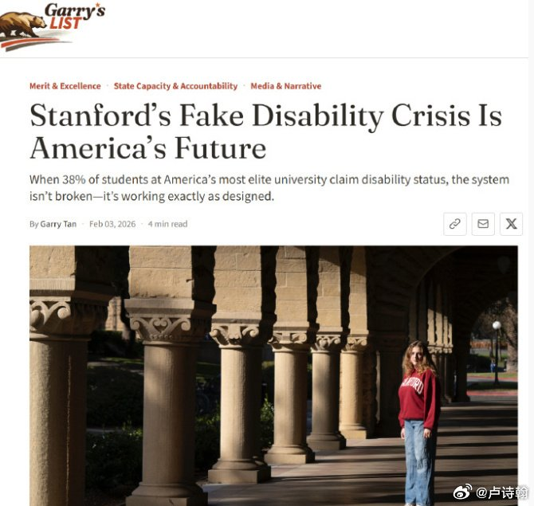

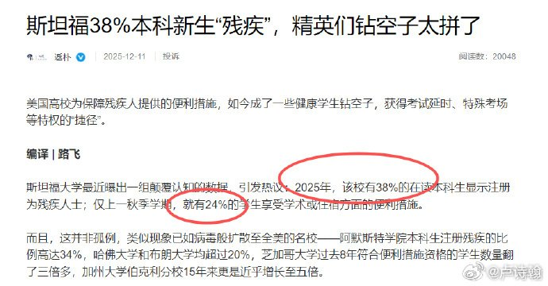

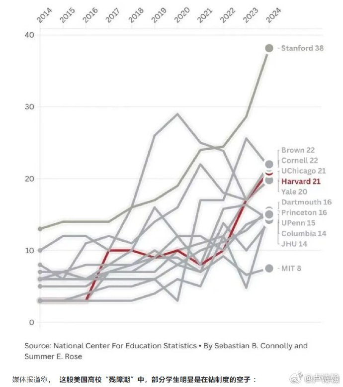

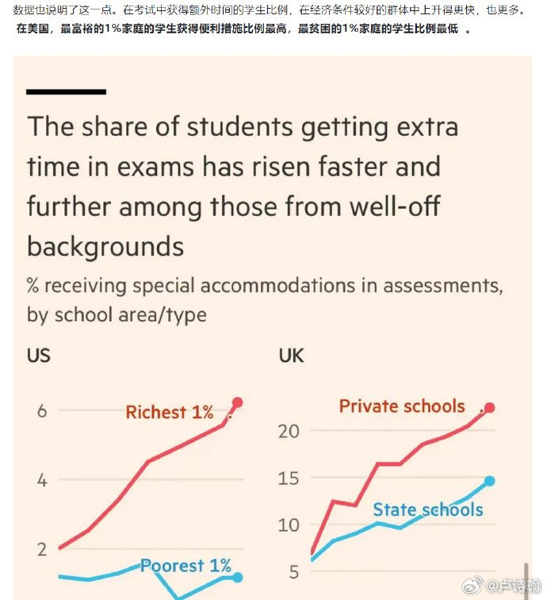

---

## 5

@牂牁萨满

发表于：2026-08-09 09:19

来源：微博

链接：https://m.weibo.cn/status/5330053304944905

资料

作死怪不得别人

AI爆发前夕，百度摧毁了百亿条语料。

百度贴吧在 2019 年 5 月底发出公告，成为了中文互联网历史上最具毁灭性的“文化断层事件”之一。

贴吧官方以“系统升级维护”为由，直接隐藏（实际等同于删除或无限期封存）了 2017 年 1 月 1 日之前发布的所有帖子。这一举措直接蒸发了中文互联网黄金时代（大约 2003 年至 20116 年）最庞大、最活跃、最真实的民间文化语料。

中文互联网的巨大损失？

亚文化的诞生地与绝版记录 

网络流行语的源头：从“贾君鹏你妈妈喊你回家吃饭”、“帝吧出征”，到“屌丝”、“神回复”、“绿帽文化”，甚至早期各种神贴、爆照、连载小说（如早期的小说草稿、鬼故事），绝大多数都诞生于 2003—2015 年间的百度贴吧。

不可复制的时代情绪：那是中文互联网最自由、最具草根创意、语料极其丰富自然的时期。随意的调侃、真诚的讨论、不加修饰的文字，构成了极具历史价值的社会心理档案。

极为庞大的民间硬件/技术/历史数据库 

贴吧不仅有娱乐内容，还有数以万计的极客、硬件爱好者、历史迷、模型制作、老旧软件维护等垂直领域的专家积累。

许多早期的电子设备维修教程、古老软件的备份链接、地方志民间考据、绝版书籍扫描件讨论，随着 2017 年前帖子的清空，彻底成为了“互联网断代史”。

搜索引擎与 AI 训练语料的贫瘠化 

贴吧曾是百度搜索引擎最核心的“内容护城河”。清空这些帖子后，中文优质中文语料库（High-Quality Chinese Corpus）失去了最重要的一部分源头活水。

现状与挽救

互联网档案馆（Wayback Machine）：由于贴吧架构庞大且带有复杂的动态加载，Web Archive 等国际网络档案馆对贴吧的抓取率极低，仅保存了极少数热门贴吧的首页。

个人与民间备份：有少数热心网友在 2019 年前使用脚本抓取过部分特定贴吧（如“魔兽世界吧”、“显卡吧”等）的帖子并做成离线包，但对于庞大的贴吧全貌而言只是沧海一粟。

这种“一刀切”的处理方式，直接导致了 21 世纪初前十五年中国普通网民的数字生活轨迹、情感记忆和文化创造，在很大程度上遭遇了不可逆的“数字湮灭”。

……记得有个朋友帮我在《猫眼看人》盖了四十几万层楼，壮观。

---

## 6

@苏耷水

发表于：2026-08-12 04:09

来源：微博

链接：https://m.weibo.cn/status/5331062246870339

类似的事情多了，人人网记录了那么多人的青春记忆，说没就没了//@南郭刘勃:一次悄然发生的云焚书。//@巨石群星:百度贴吧在 2019 年 5 月底发出公告，成为了中文互联网历史上最具毁灭性的“文化断层事件”之一。://@茅十七:不见得是百度自愿，虎扑老帖消失也是2019年初，天涯被约谈整顿也是2019年初，当年净网行动要求倒查十几年老帖，请各大网站自己体面，你不体面有人帮你体面//@张宏杰:为什么偏偏在AI爆发前夕隐藏？//@斯基泰战车:转发微博

---

## 7

@伍玲玲律师

发表于：2026-08-13 00:14

来源：微博

链接：https://m.weibo.cn/status/5331365560323688

为什么到了明末，许多政策会在执行层面不断失灵？并不是人在拒绝执行，而是所有人看起来都在执行，但是他们都在拖延，都在推诿，在层层请示，在援引祖制，在把现实问题变成程序问题，再把程序问题变成责任问题。表面上每个人都在履职，实际上每个人只在努力证明：我做了，我永远“程序正确”、永远“请示在先”、永远“按例办理”，但是做不成，但这不是我的问题。

所以崇祯临死前那句“诸臣误朕”，是真的大臣愚蠢吗？

---

## 8

@张文奎-非洲种地

发表于：2026-08-12 14:01

来源：微博

链接：https://m.weibo.cn/status/5331211404974688

咱们国家的大政策，向来慢半拍，可能一拍。

计划生育逐渐放开是这样，激励生育也会是这样，比民间分析的合适时间要晚四五年。

也没办法。

事儿是肯定会办的，虽迟但到。

---

## 9

@李建秋的世界

发表于：2026-08-13 00:34

来源：微博

链接：https://m.weibo.cn/status/5331370733735052

AI是一种工具，而不是意识形态，不是某个人。

反对工具本质上是反动派，因为马克思主义关于反动派的定义，就是阻碍生产力发展，阻碍历史向前发展。

你可以说现在的AI工具还无法 生成具有深度内容的影视剧，这没关系。

这只能说明AI工具还不够成熟，人类运用AI工具的能力还欠缺。

这恰恰证明这个行业还有巨大的前途。

但是AI工具让每个人都有机会成为导演，编剧和制片。想象力一下子被激发起来了。

这是现在的电影行业永远无法做到的。

使用AI工具的同样是人类，所谓的保护人类工作从何谈起？

电影诞生一共才多少年？这就“人类传统”了？

那照相机大行其道那会，你怎么不为保卫人类传统绘画而奋斗呢？

绘画在人类历史上的时间比电影久远的多，你这不双标吗？

关于“剥夺人类工作”，“失业问题”这些东西不应该由AI承担。

是生产关系要适应生产力的发展，不是生产力反过来适应生产关系。

---

## 10

@新浪科技

发表于：2026-08-12 23:06

来源：微博

链接：https://m.weibo.cn/status/5331348482950025

【\#DeepSeekV4Pro正式版API上线\#】\#DeepSeek预告涨价\#DeepSeek V4 Pro 正式版晚间正式发布，已更新至 API，调用模型名不变。

新版本增强了 Agent 能力，支持 Responses API 和 Codex 接入。

从官方群放出的评测对比表可以看到，DeepSeek V4 Pro 正式版（DeepSeek-V4-Pro-0813）在多项测试中接近 Fable 5 水平，相比之前的预览版能力大幅提升。

IT之家附定价如下：

百万 tokens 输入（缓存命中）：0.025 元

百万 tokens 输入（缓存未命中）：3 元

百万 tokens 输出：6 元（IT之家）

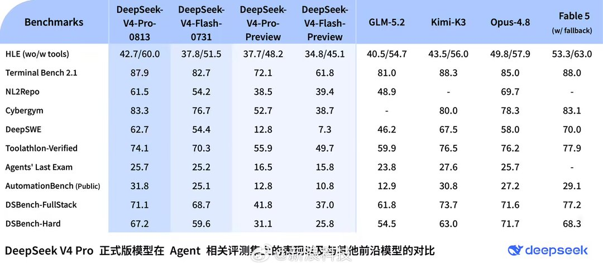

---

## 11

@空愁居

发表于：2026-08-12 22:52

来源：微博

链接：https://m.weibo.cn/status/5331344851993632

穿越时空-城市故事 全景式科学绘本 

\#历史知识\# \#大图重发\# \#剖面图\# 

穿越时空系列丛书网页链接 欧洲街道的前世今生网页链接 穿越时空的欧洲城市网页链接 穿越时空的港口网页链接 大运河历史绘本网页链接 长城历史绘本网页链接 穿越时空的儿童网页链接 时光中的生命网页链接 时光中的万物网页链接

绘本-机场一日网页链接 城市一日网页链接 城堡一年网页链接 工地一年网页链接 农场一年网页链接 穿越时空·全景科学绘本-交通演变网页链接 城堡風雲/城市故事网页链接 金字塔/瑪雅迷城网页链接

穿越时空看文明-衣橱里的秘密网页链接 餐桌上的历程网页链接 房屋里的温暖网页链接 为了走得更远网页链接 城市的故事网页链接 通信的故事网页链接 商貿的故事网页链接 藝術的故事网页链接 

不可思议的剖面网页链接 解剖万物网页链接 古埃及网页链接 古希腊网页链接 古罗马网页链接 大城堡网页链接 大帆船网页链接

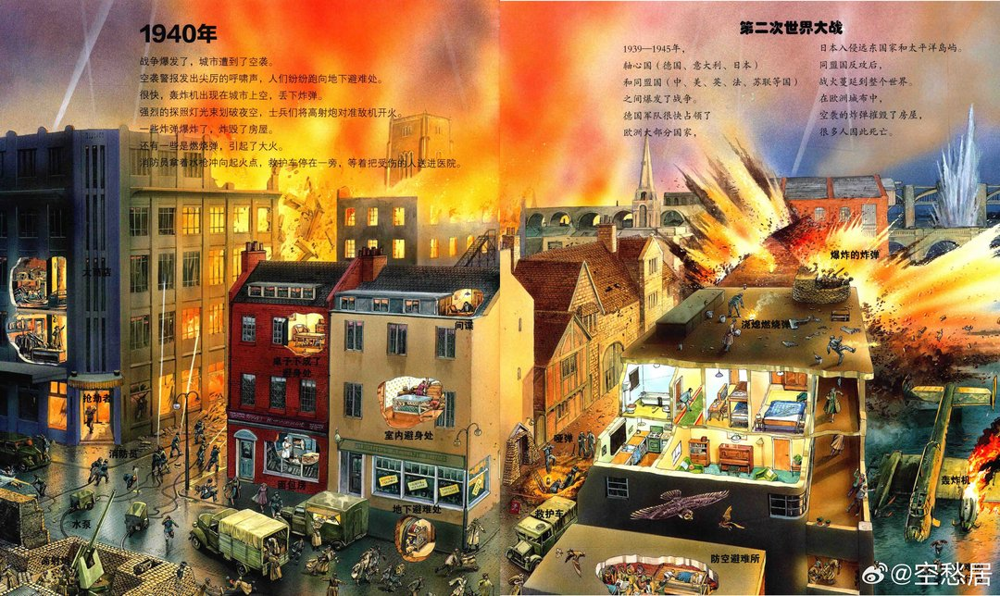

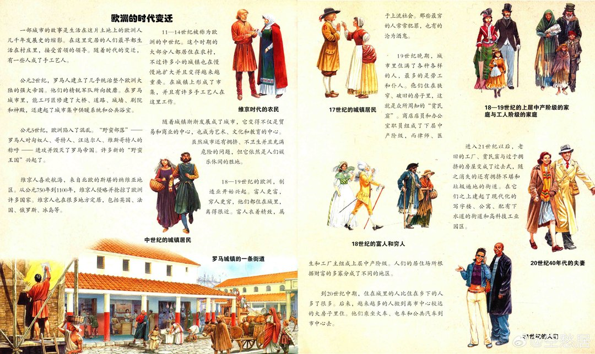

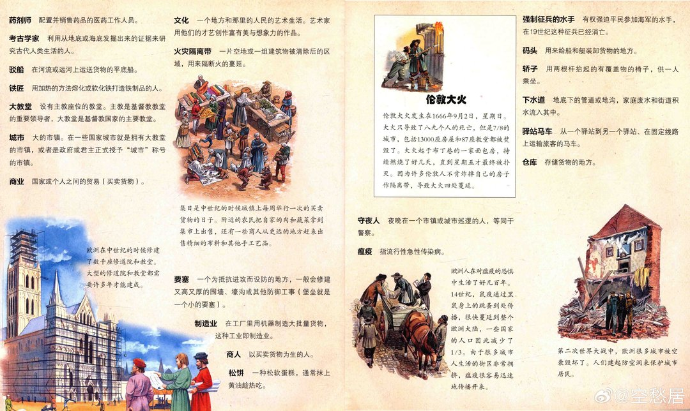

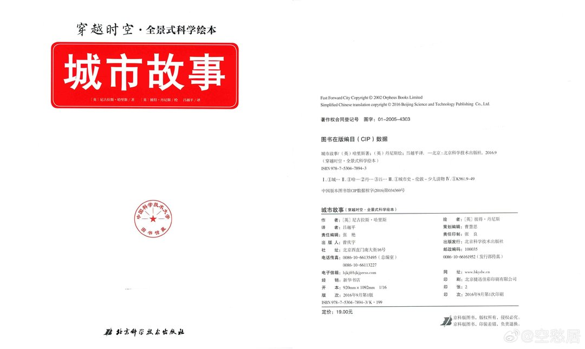

---

## 12

@空愁居

发表于：

来源：微博

链接：https://m.weibo.cn/status/5018462412342254

东南大学古建筑测绘图集

 \#园林\#园林 \#古建\# \#古建筑\# 

1669年康熙皇城宫殿衙署图网页链接

1670年康熙九年孝陵图样网页链接

1776年法文版中国园林艺术网页链接 江南省行宫座落并各名胜图网页链接 

1785年圓明園東長春宮西洋樓圖网页链接

1906年北京皇城建筑装饰附图网页链接 清国北京皇城写真帖网页链接

1924年喜龙仁北京的城墙和城门网页链接 网页链接

1926年奉天宮殿建築図集网页链接

1931年西洋镜：中国宝塔网页链接 网页链接

1940年中国城郭概要网页链接

1949年喜龙仁中国园林网页链接 网页链接 网页链接 网页链接 网页链接 网页链接 网页链接 网页链接 

1959年新中国建筑十年画册网页链接 建筑设计十年网页链接 

1960年清华建筑设计渲染图集网页链接

1981年古都西安手绘复原图集网页链接

1992年中国古建筑大系-宫殿与陵寝网页链接 皇家苑囿建筑网页链接 文人园林建筑网页链接 民间住宅建筑网页链接 城池防御建筑网页链接 清真寺网页链接 佛教建筑网页链接 道教建筑网页链接 传统村镇聚落景观分析网页链接

1996年中国古典园林分析网页链接

1998年古建腾辉：傅熹年建筑画选网页链接 网页链接 网页链接

1999年北京四合院建筑格局网页链接

2002年中国建筑艺术全集-道教建筑网页链接

2004年图说民居网页链接

2005年中国古代建筑历史图说网页链接 江南园林图录网页链接 图解中国古建筑-古典园林网页链接

2006年北京四合院建筑要素网页链接 细说中国园林网页链接 皇家园林网页链接

2007年唐风建筑营造网页链接 图解中国民居网页链接 图解中国园林网页链接 图说中国古典园林史网页链接 古建春秋网页链接 解读中国古桥 网页链接

2009年北京古建筑地图网页链接 穿墙透壁:剖视中国经典古建筑 网页链接 

2011年中国古建筑测绘十年 网页链接 图解界画中传统园林建筑及装饰 网页链接 建筑师写生 网页链接

2012年中国考古地图 网页链接

2015年中国古代城市规划、建筑群布局及建筑设计方法研究-古代城市平面布局 网页链接 古代建筑群布局 网页链接 古代单体建筑 网页链接 古塔立面图集 网页链接 部府县衙署地图集 网页链接

2017年先秦城邑考古 网页链接

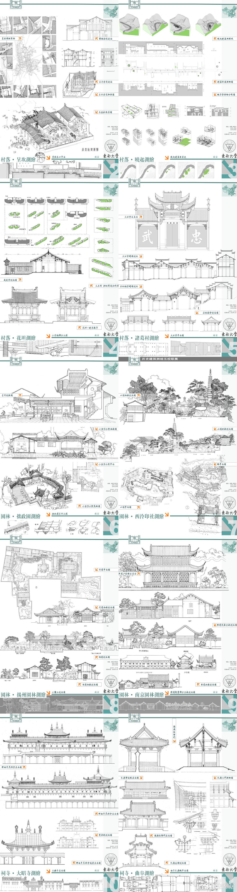

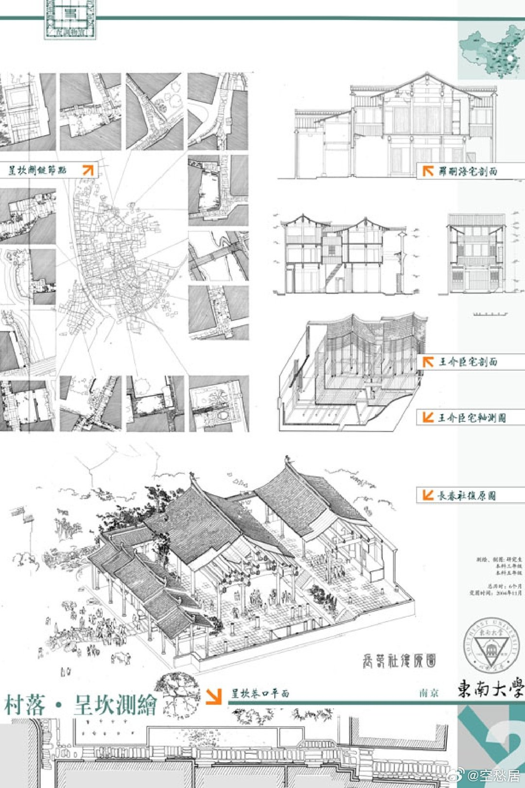

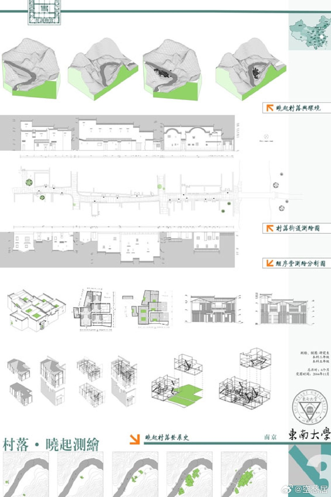

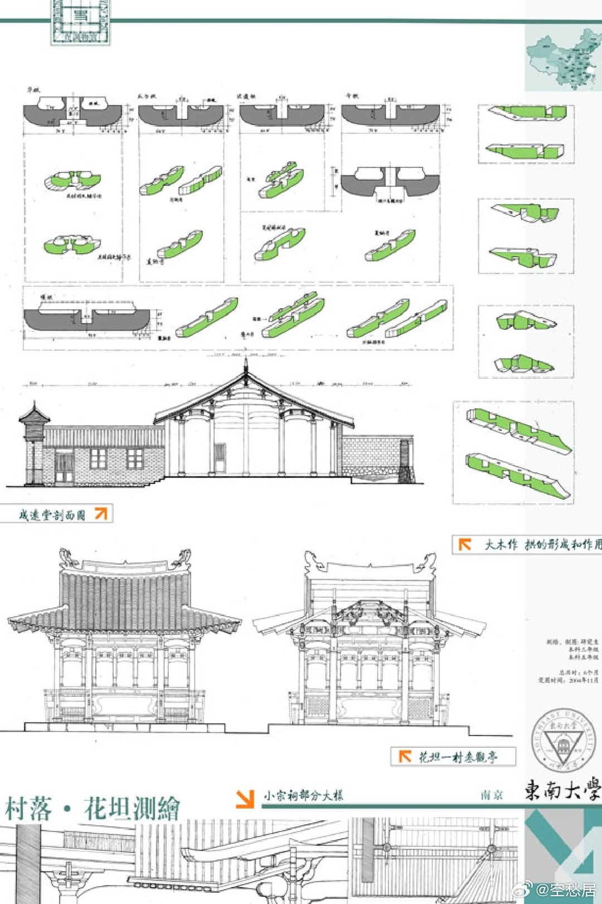

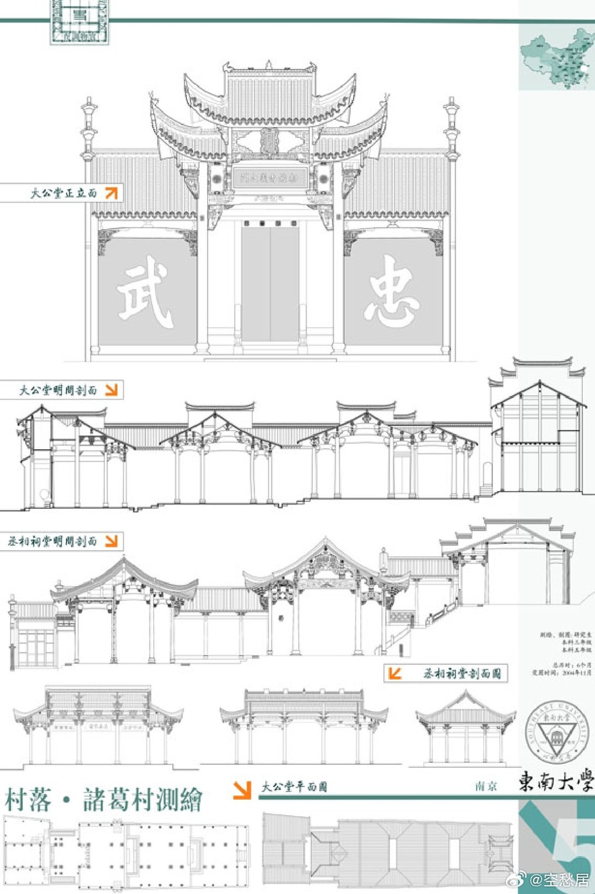

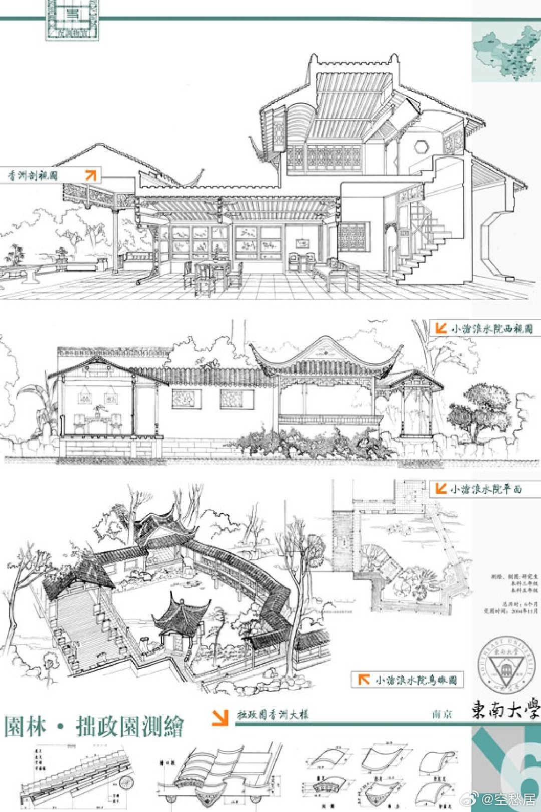

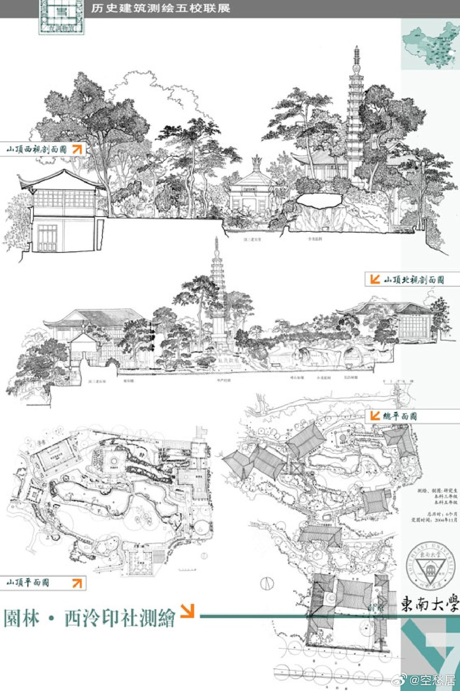

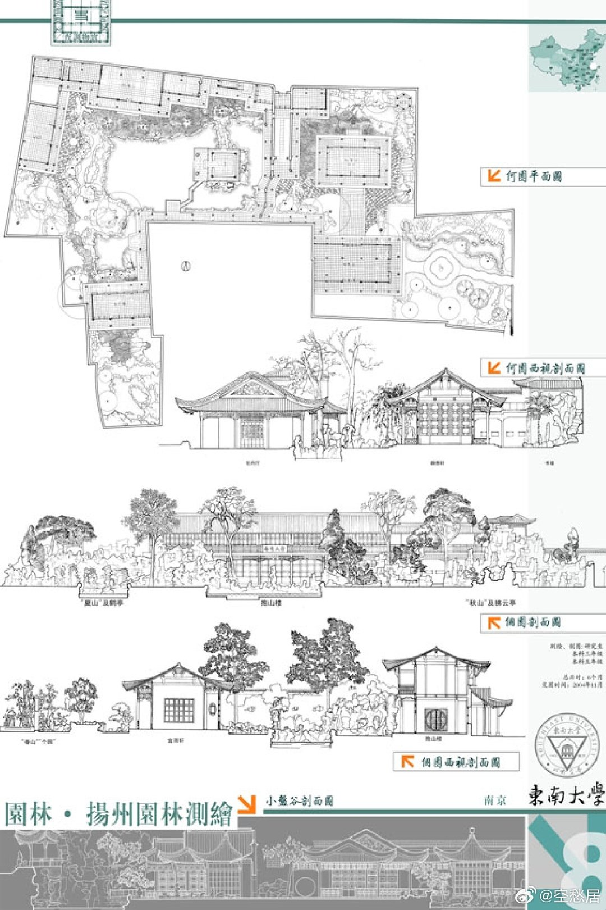

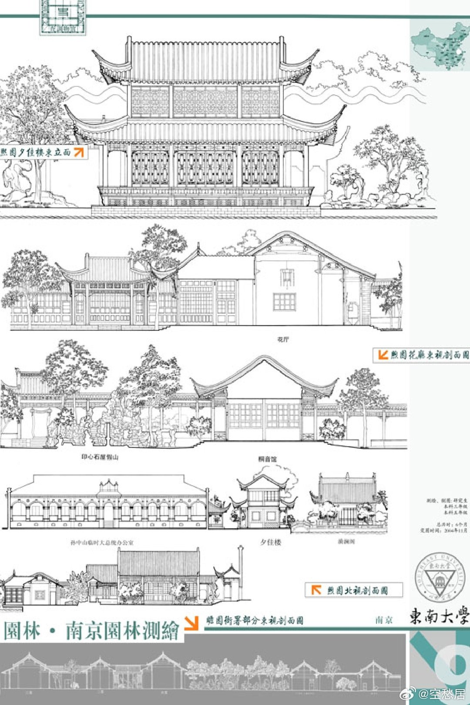

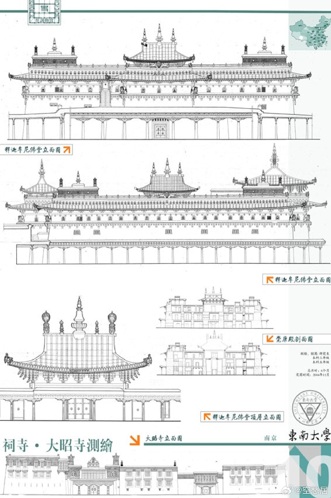

---

## 13

@姬永锋

发表于：2026-08-12 22:39

来源：微博

链接：https://m.weibo.cn/status/5331341643088319

🚨突发消息：

🇺🇸白宫新闻秘书莱维特将于本月底卸任，以便将精力投入到子女与家庭。

特朗普表示完全支持她的这一决定，并将留用她担任高级外部顾问。

特朗普评价她是史上最出色的新闻秘书之一，一名真正的斗士。

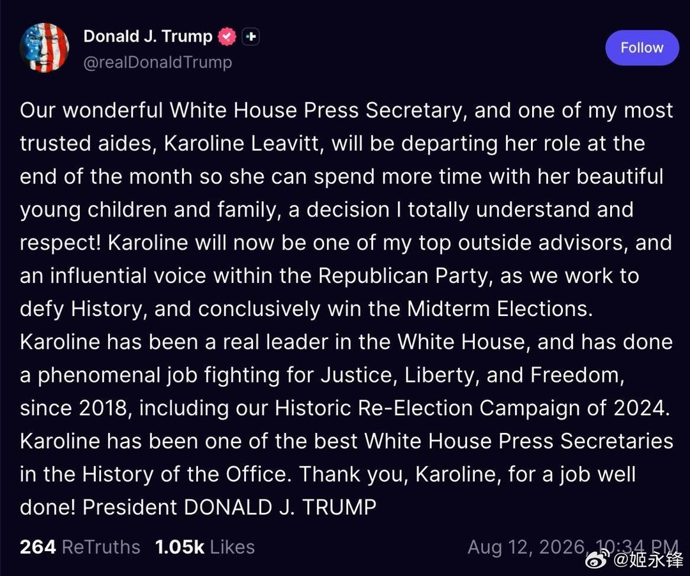

---

## 14

@姬永锋

发表于：2026-08-12 22:44

来源：微博

链接：https://m.weibo.cn/status/5331342843447066

据华尔街日报报道，4月至5月，美军在德国举行了名为“联合决意”的实战模拟演习中遭到惨败。

据报道在演习中，增援假想敌的乌军第412“涅墨西斯”无人机团，利用侦察和FPV无人机迅速定位并摧毁了美军的重型装甲车，实际上“消灭”了一个美军装甲旅。由于战损过快，美军车辆不得不频繁“复活”以维持演习进行

参演人员透露，参演部队派往战场的大型重装甲车辆扬起阵阵尘土，极易被乌克兰的侦察无人机发现。随后跟进的是投放炸弹的无人机以及能够在实战中直接撞击目标的穿越机（FPV无人机）。

此类演习极少使用实弹。无人机通常悬停在车辆上方，或靠近车辆至足够近的距离，由裁判认定“击杀”。

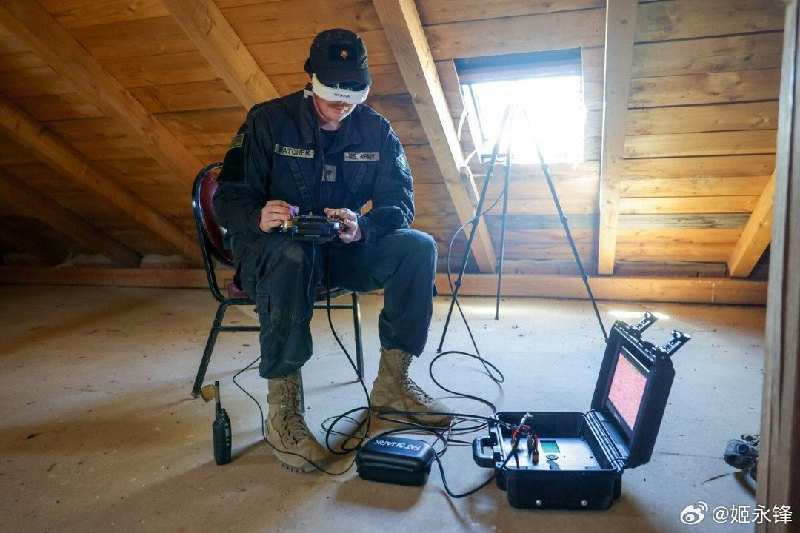

---

## 15

@姬永锋

发表于：2026-08-12 22:09

来源：微博

链接：https://m.weibo.cn/status/5331334148916538

高盛关于乌兰察布数据中心的调研，

1、乌兰察布容量承诺12.5GW（2026年6月，含在建+规划），2025已投运约1.2GW。

2、中国IDC总投运：2025年28GW，2030E 53GW。

直接翻了 10 倍规模，这还只是中国一个城市！

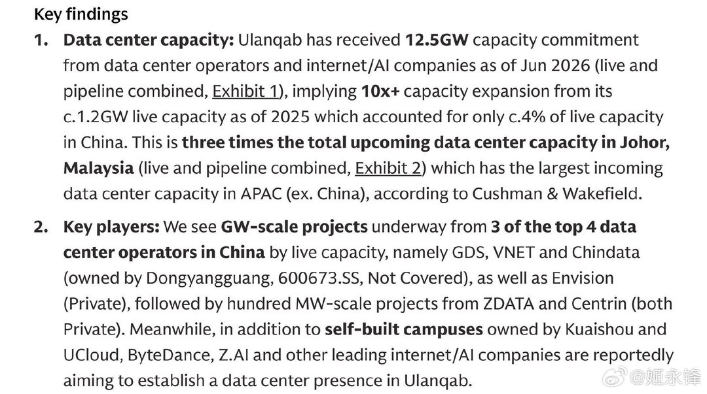

---

## 16

@物理芝士数学酱

发表于：2026-08-12 16:16

来源：微博

链接：https://m.weibo.cn/status/5331245372278963

午夜\#学术新闻\# 

差不多3个小时前，Claude找到了阶数为668的Hadamard矩阵。发现者就是之前找到雅可比猜想反例的Levent Alpöge。

Hadamard 矩阵是由 ±1 组成的方阵，要求行与行之间两两正交。它在组合数学、编码理论、信号处理、量子信息等领域都有应用。

已知 Hadamard 矩阵只可能存在于阶数为 1、2 或 4 的倍数。很多阶数已经被构造出来，但仍有一些“悬案”。

自2005年阶数428 被构造出来后，668一直是最小的未解目标。它被视为 Hadamard 矩阵研究中的“里程碑难题”。

我本来想完整复制过来，结果发现有字符数限制~~668^2=446224,还要标出正负号~那就再*2……

ps 纠正，不仅仅是668阶，而是构造出2000以下所有12个之前未知的阶数。猜测是调用了超算级别的计算集群，Fable5只是提供算法。

矩阵的csv文件可以在此处下载，用于编程检验 网页链接

另外一件

矩阵分析和数值线性代数中有一个2004年提出的Crouzeix 猜想 ，涉及矩阵的数值范围 

𝑊(𝐴)与谱集的关系。它断言对任意多项式 𝑝，都有∥𝑝(𝐴)∥2≤2max∣𝑝(𝑧)∣，𝑧∈𝑊(𝐴)

2026年7月，北京协和医院的神经外科住院医师 金山木 (Shanmu Jin)，在自学矩阵分析的过程中，借助 ChatGPT 5.6的特殊提示策略，得出了完整证明。他的论文The Numerical Range Is a 2-Spectral Set于 7 月 27 日发布。

他实际上尝试了一年，ChatGPT 5.6发布之后，感觉功能确实强了。

经过专家审稿，论文完全正确。

 SIAM News文稿 

网页链接

为什么医生会对矩阵感兴趣？因为他在分析经颅超声。

有个好玩的点，金山木这个名字有没有人觉得眼熟？

在2025年，有关于协和医学院“4+4试点班”的培养制度是否合理的讨论。

当时位风口浪尖上的当事人，叫董袭莹。貌似后来被吊销行医资格了？

因为她的缘故，捎带着几位其它专业转到医科读四年直接转入临床的人也跟着被扒，其中之一就是这位 金山木。在这个词条的百度百科上就能看到当时关于博士论文篇幅是否合规的争议。

看来人家当时没有理舆论是非~直接遁入数学的世界提升了自己。

---

## 17

@观察者网

发表于：2026-08-11 04:22

来源：微博

链接：https://m.weibo.cn/status/5330703094121170

\#哈利波特粉丝逼退4.3亿英镑电缆\#【遭《哈利·波特》粉丝抗议，英国4.3亿英镑海底电缆项目被迫改道】\#英国一项目因哈利波特粉丝抗议改道\# 据英国《卫报》8月10日报道，英国正在铺设一条200公里长的电缆，将英国国家电网的输电网络与爱尔兰连接起来。然而，这个耗资4.3亿英镑的项目意外遭到《哈利·波特》系列小说和电影粉丝的抗议，被迫重新规划线路。

这项名为Greenlink的电力线路工程将连接英国威尔士地区和爱尔兰东南部的韦克斯福德郡，允许两国共享多余的可再生能源，增强能源安全，并提高两国之间的电力传输能力。根据项目最初的规划，电缆将经过威尔士彭布罗克郡淡水西海滩。

Greenlink项目计划铺设连接英国威尔士和爱尔兰的电缆

然而，这一消息却引发《哈利·波特》系列粉丝的抗议，原因是淡水西海滩上有该作品中一个虚构角色的“坟墓”。

《哈利·波特》系列是英国作家J.K.罗琳创作的小说，曾被改编为多部电影。电影《哈利·波特与死亡圣器》中，小精灵多比死亡的场景就是在淡水西海滩拍摄。

报道称，尽管这片海滩已被英国划入生态敏感区，但许多《哈利·波特》系列粉丝仍无视土地管理者英国国民信托基金发出的警告，在海滩上留下刻有“多比长眠于此”字样的石头和袜子，从而形成一个“坟墓”。

海底电缆铺设计划公开后，项目管理公司Etchea Energy接到大量《哈利·波特》系列粉丝的电话，他们要求该公司更改计划。

Etchea Energy首席执行官西蒙·拉德拉姆透露，公司接到了数百个电话，这令他感到困惑，直到一名同事告诉他，这是因为电缆将要穿过多比的“坟墓”。

拉德拉姆表示，即使有了同事的说明，他依然感到费解，“我说，‘多比是谁？我不认识多比。’我说，‘他是虚构小说中的虚构人物，整本书都是虚构的，你们到底在说什么东西？’”

《卫报》称，迫于外界压力，Etchea Energy最终决定调整计划，聘请专业人员重新规划一条避开所谓“坟墓”的新线路。拉德拉姆说：“很多人对此非常高兴，项目现在正顺利进行，多比也很高兴。”

然而，线路变化也带来了新的问题，根据新计划，电缆将“非常接近”威尔士一处青铜时代历史遗迹。彭布罗克郡议会的文件显示，这处遗迹可能与人类墓葬有关，考古人员在其中发现了一件陶瓮，可以追溯到公元前1700年至公元前1500年。

---

## 18

@小众软件

发表于：2026-08-13 14:40

来源：微博

链接：https://m.weibo.cn/status/5331583453102567

DeepSeek API 全面涨价，最高12倍涨幅...

图2是原价，图3是新价格。8月17日生效

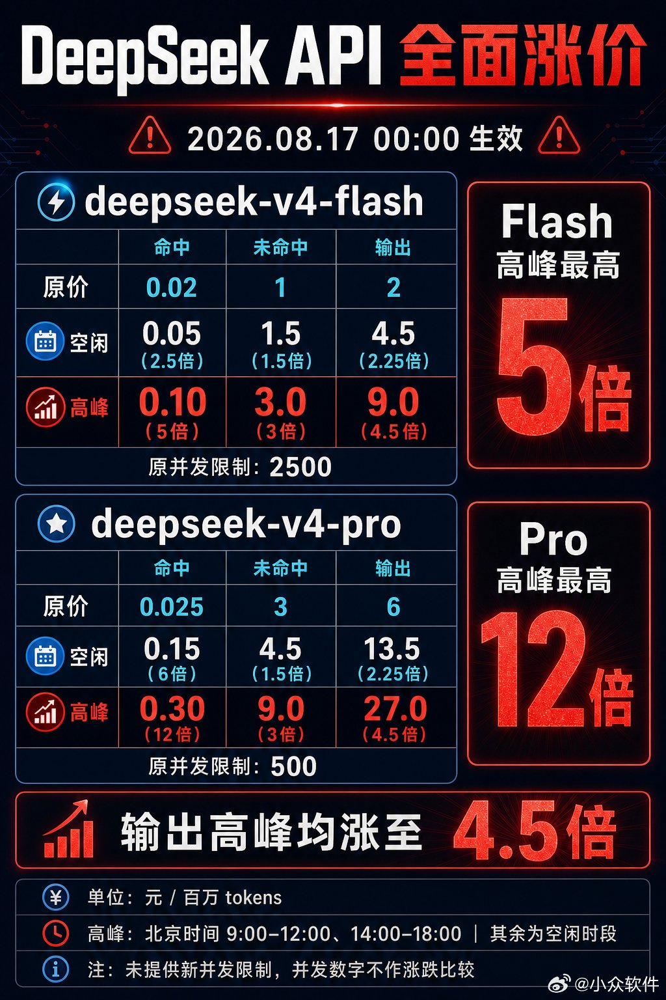

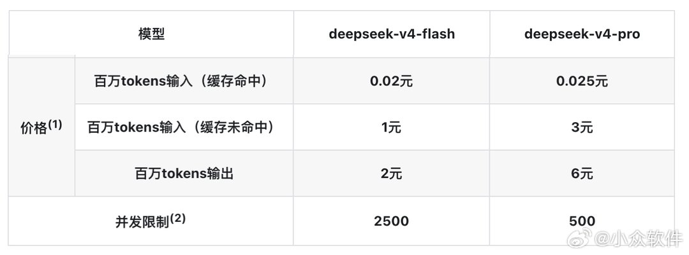

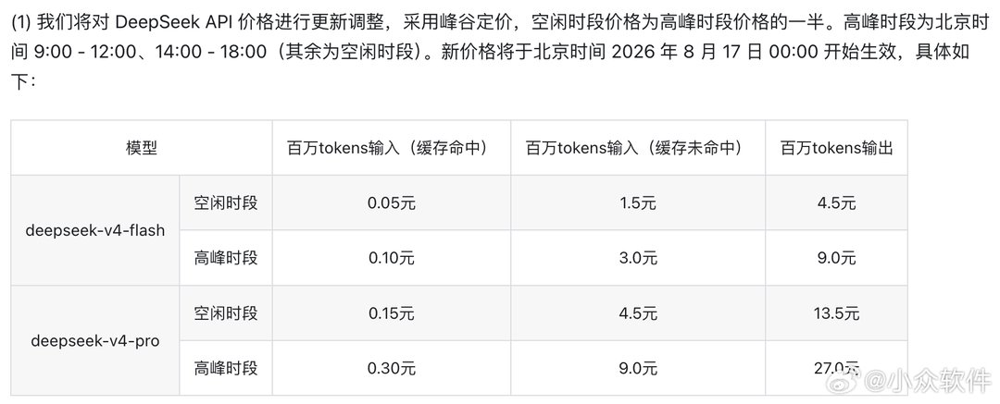

---

## 19

@杭州公安

发表于：2026-08-13 05:35

来源：微博

链接：https://m.weibo.cn/status/5331446254274767

【全国首起！杭州公安成功侦破以“护剧”为名实施舆情敲诈案】卡着新剧开播节点发负面、炒对立，等片方急了再假惺惺说“我帮你护剧”？别被这套路骗了！这其实是新型舆情敲诈！近日，@杭州公安 在\#净网2026\# 行动中，成功打掉全国首个以“护剧”为名的职业敲诈团伙！\#杭州公安侦破全国首起以护剧为名实施舆情敲诈案\# 

经查，李某、廖某等人运营总粉丝超2020万的影视账号，专挑新剧宣发、综艺上线节点，捏造“演员不会武戏”“剧本注水”“状态翻车”等不实信息，多账号联动炒热话题、煽动对立，等片方主动联系，就打着“舆情优化”“宣传服务”的旗号索要高价，不付钱就加大发帖力度，逼人“花钱消灾”！6月16日，杭州公安40余名警力奔赴8省10市同步收网，抓获10人，查获大量作案设备，目前4人被刑拘，2名主犯被批捕，全链条斩断这条黑色产业链！

警方提醒：文娱从业者遇这类“护剧”勒索，别抱“花钱消灾”的侥幸！第一时间留好截图、聊天记录、转账凭证，直接报警！网络平台也应压实责任，严打恶意炒作、饭圈对立、网络黑产！清朗网络空间，绝非法外之地！这类借“公关服务”行敲诈之实的，必受法律严惩！\#杭州公安守护加马\#

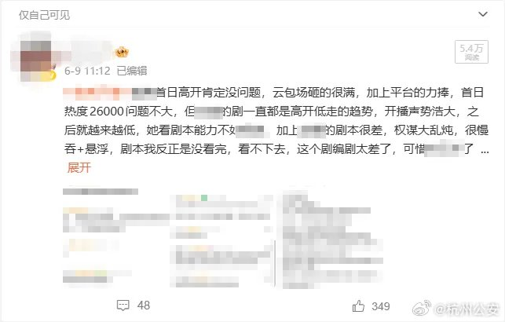

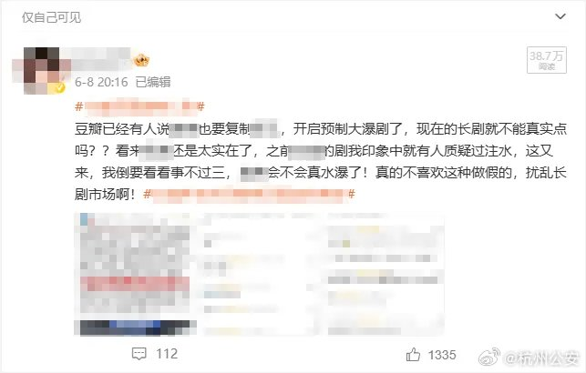

---

## 20

@财联社APP

发表于：2026-08-13 15:59

来源：微博

链接：https://m.weibo.cn/status/5331603418259512

\#闪迪深夜暴涨\#\#闪迪股价大涨15%\#【闪迪释放豪华长期指引：营收中高双位数增长 毛利率约80%、FCF利润率约50%】财联社8月13日电，闪迪(SNDK.US)周四在2026年投资者日上公布长期增长战略及新的多年期财务框架。公司表示，随着人工智能(AI)从训练进一步向推理阶段扩张，数据中心对高性能、大容量和低功耗存储的需求将显著增加，预计到2030年企业数据中心闪存潜在市场规模将扩大至1.2ZB。与此同时，闪迪预计2028至2030财年营收将保持中高双位数增长，非GAAP毛利率维持在约80%，调整后自由现金流利润率达到约50%。

技术方面，闪迪公布了基于CMOS直接键合至阵列(CBA)技术的二维扩展策略，可以根据快速变化的市场需求开发定制化产品，同时提高资本使用效率。新推出的BiCS9 QLC技术是这一战略的首个实例，将成熟的BiCS8存储阵列与基于BiCS10技术的CMOS晶圆相结合，以更加资本高效的方式提供AI工作负载所需要的高性能。与此同时，新一代BiCS10 QLC节点的位密度较BiCS8提高60%，公司称其将在存储密度、性能和能效方面树立新的行业标准。

整体来看，闪迪此次投资者日将AI推理带来的存储需求增长作为未来长期战略的重要支柱，并希望通过NAND技术升级、HBF等新型存储技术以及长期客户协议，在扩大AI数据中心业务的同时降低传统存储行业的周期性影响。到2030年1.2ZB的企业数据中心闪存市场预期，以及2028至2030财年约80%的非GAAP毛利率和约50%的调整后自由现金流利润率目标，成为此次长期战略中最受关注的指标。

截至发稿，闪迪股价暴涨超14%，报1540美元。

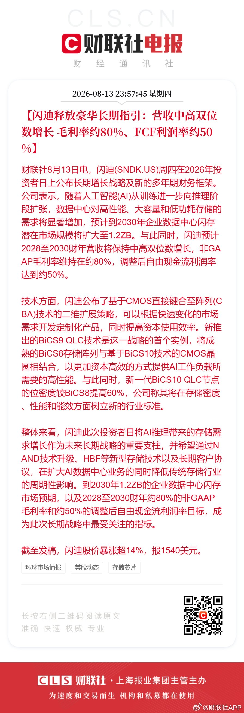

---

## 21

@凯恩斯

发表于：2026-08-13 14:11

来源：微博

链接：https://m.weibo.cn/status/5331576200107714

截至 8 月 13 日收盘：

长鑫科技市值 3.54 万亿人民币，正式超过腾讯控股（3.44 万亿），拿下中国大陆市值第一上市企业宝座；

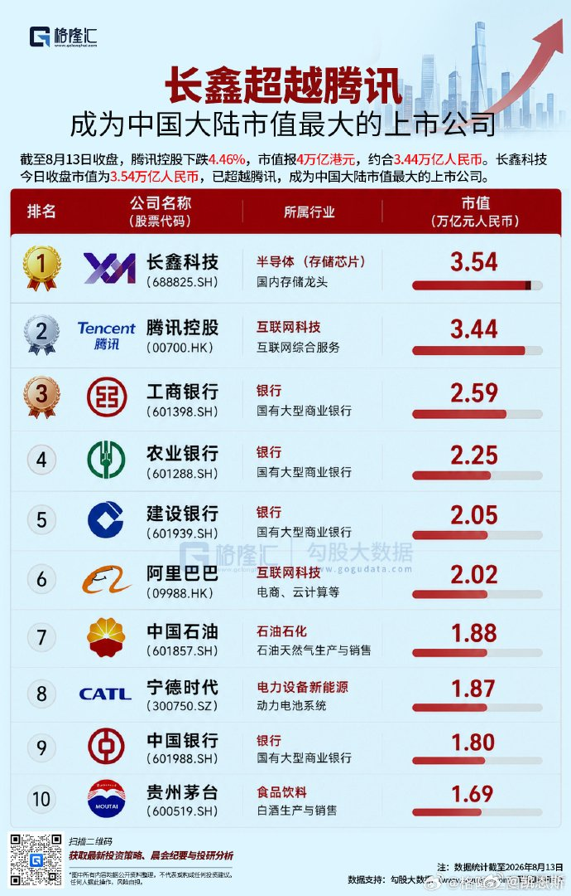

