# 2026-08-15

## 1

@冬亚

发表于：2026-08-13 14:04

来源：微博

链接：https://m.weibo.cn/status/5331574498263168

看下我们南京最近的事。

一个烤猪蹄老板，在顾客群里设了AI自动信息。

爹们，来吃烤猪蹄了。

被一个新进群的女的看到了。

她非常不满，认为老板喊所有人都是爹是侮辱女性。

于是在小红书上发帖，号召网暴，差评这家店铺。

一个小小的烤猪蹄店，在一天多时间里，电话被打爆，收到一千多个差评、五千多个辱骂私信。

全家，包括女性家人全被辱骂。

店也暂时关店了。

老板较真了，找了律师固定所有证据，准备起诉。

她依然很硬气，并要求店老板按照她给的格式拍摄向她道歉的视频。

还把那个赵一婕律师挂在签名里给自己助威。

说自己已经找赵一婕咨询了。

但没两天，签名就清空了。

赵一婕明面上没回应她。

现在老板已经完成起诉前工作并且报警

根据其自述，警方正在讨论这事的性质。

这位女网友，目前已经销号退网装死了。 冬亚的微博视频

---

## 2

@子夜梦廊

发表于：2026-08-14 05:33

来源：微博

链接：https://m.weibo.cn/status/5331808179721604

\#deepseekharness发布\# 

DeepSeek开源Harness，AI模型圈要变身“我的世界”了？

Harness是什么？DeepSeek开源Harness的同时还宣布:一切都是插件，这意味着什么？

以下为中译中:

以前AI村里有个共识：要想吃上好菜，就得请个好厨子。于是各家各户都花大价钱，从外头请来了米其林级别的顶级大厨。

这些厨子确实厉害。你问他"鱼香肉丝怎么做"，他能从选肉、切配、调味、火候，给你讲得一清二楚。村民们听了直拍大腿：“哎呀，这才叫专业！”

可问题是:村民们请厨子回家，却不给配厨房。

你想想这画面：一个戴着高帽、穿着白围裙的顶级大厨，被请到村民家的院子里，蹲在一棵槐树下。村民说："师傅，请开始吧。"大厨四下一看：没灶台，没菜刀，没调料柜，没抽油烟机，连口锅都没有。

大厨只能干瞪眼：“您让我……拿嘴炒？”

这就是前两年的 AI 圈。大家以为 AI 就是"你问我答"——问它个问题，它吐一段话。这种 AI 叫"聊天 AI"，就像村口的说书先生，搬个板凳就能开工。

但现在的 AI 已经进化成"干活 AI"了。它得自己翻你电脑里的文件（切菜）、自己跑代码（开火）、自己上网查资料（买菜）、出错了自己重来（炒糊了倒掉重炒），还得有一套"先干啥后干啥、干砸了咋补救"的流程规矩（业内叫 Agent Loop，翻译过来就是"干活流程"）。

脑子再聪明，没有手脚，也只能干瞪眼。

最先意识到"厨房"重要性的，是村西头的老梅家（就是那家卖苏锡菜的，贵得要命还脾气差，你稍微抱怨两句就直接把你拉黑）。他们率先盖了一座"豪华全包度假村"——你把厨子请进去，厨房里灶台、菜刀、调料、抽油烟机、灭火器一应俱全，连"先放油还是先放葱"的规矩都定死了。

可这座厨房有个毛病：它是一体化焊死的。

你想换个灶台？不行，整个厨房得拆。你想添个新工具？没门，开发商说了算。而且死贵——进去炒个菜，光场地费就收你好几千，炒到一半还突然涨价，爱炒不炒。

村民们一边骂骂咧咧，一边又不得不去。为啥？因为大厨虽然重要，但没有厨房，大厨啥也干不了。你只能忍着，在人家的规矩里规规矩矩地炒。

但就在昨晚，情况变了。

村东头的老梁家干了一件狠事：他们把自家厨房的全套装修图纸，免费发网上了。

这就是 DeepSeek Harness。而且这套图纸不是普通的设计图，是乐高说明书——官方原话叫"一切皆插件"。

怎么个乐高法？我给你掰扯掰扯：

灶台能换：你今天用老梁家的厨子，明天嫌贵了想换个别的模型，灶台不用动，拧个螺丝的事；

菜刀能换：文件、代码、网页、搜索，各种工具插件随便插拔。今天用中式菜刀，明天换日本料理刀，后天加个打蛋器，随你；

连"先放油还是先放葱"的规矩都能改：没错，连干活流程本身（那个 Agent Loop），在图纸上都是可替换的零件。你可以把"先备菜再下锅"改成"边切边炒"，全看自己习惯。

这就好比以前的厨房是一体化打印机，坏了只能整机换；现在的厨房是乐高积木，哪块不顺手拆哪块。而且这套图纸挂在 GitHub 上，谁都能下载，按步骤自己就能搭。

图纸里还附了四种厨房模式（官方叫"预设"），每一种都不是换汤不换药，而是真正换了整个厨房的格局：

标准款：全能厨房，日常干活够用。灶台、菜刀、调料、抽油烟机、洗碗机全配齐，大多数人选这个；

流水线款（PTC）：中央厨房模式。它让 AI 先写一段"烹饪脚本"，把备菜、炒菜、上菜一口气包圆。打个比方，以前炒个满汉全席要来回跑五十趟厨房，现在 AI 写个程序，把五十步压缩成一步自动化搞定。适合那种要连续跑几十个步骤的复杂大菜；

极简款：就给一口锅、一把刀，别的啥都不给。别嫌寒酸——这是专门用来考核厨师真实基本功的。工具越少，越能看出模型本身的手艺。就像让顶级厨师只用一口铁锅、一撮盐，看他能不能炒出绝世美味。官方跑 benchmark（性能测试）就用这套，就是要排除高级设备的干扰，看纯手艺；

创造款：最野的一个。这厨房居然允许厨师自己改厨房——干着干着觉得菜刀不趁手，现场拆灶台、换零件、重新组合。官方还演示过，让 AI 在创造模式下，自己鼓捣出一个官方界面上都没有的"三栏格局"。

听到这儿，是不是有股高燃的感觉？

抱歉，接下来是兜头的冷水，而且还不止一盆。

第一盆：这图纸现在还是 v0.1 毛坯版。官方原话：“还在装修，随时可能砸墙重来”（快速迭代中可能出现破坏兼容性的改动）。谁要是跟你说"老梅家这下完了"，听听就好。人家卖的是精装加售后加十年保修，一张毛坯图纸离成品酒店之间，隔着一整个装修队呢。现在就拿去开饭店，墙塌了可别怪我没提醒你。

第二盆：图纸开放，对老梅家真不是灭顶之灾。这套厨房的灶台是通用的，老梅家的厨子照样能进来炒菜，说不定还顺手。老梁家赌的从来不是"拆了别人的台"，而是"让全世界都来给我家厨房装修"——你装修得越开心，以后买我家食材（模型 API）和专用锅具（算力芯片）的概率就越大。

第三盆：开放厨房有个躲不开的坑——图纸公开了，就意味着什么人都能往灶台边塞插件。万一有人塞个会偷你菜谱的插件呢？万一塞个会把你厨房点着的插件呢？官方自己都承认：开放程度越高，管理成本和安全隐患越高。而且老梁家到现在也没公布"我家厨房 vs 别家厨房"的横向对比成绩单，好不好用，还得让第一批开店的老板们用脚投票。

呃，合着我们白高兴了，对么？

也不完全是，因为DeepSeek在开源Harness的同时，还打出了一套组合拳，算是给大家的小惊喜:新师傅 V4 Pro 正式上岗了！

比起前辈，DeepSeek V4 Pro的记性暴涨，能一口气装下 100 万 token 的上下文（打个不太严谨的比方：两三本厚厚的小说同时摊开看，他一眼全能记住），一次回答最多能输出 38 万 token（差不多一整本长篇小说的量）。

新厨子配新厨房，一个负责聪明，一个负责干活，双剑合璧哪。

顺带一提:Harness这词不是老梁家发明的。老梅家自己管 Codex 里那套运行环境，就叫"Codex Harness”。

这说明啥？说明"厨房"这赛道本来就是兵家必争之地，谁都知道光有脑子不够。老梁家只是第一个把全套图纸免费甩到网上的——图纸白送，等全世界都按他家图纸盖厨房，那食材（API）、调料（算力服务）、锅具（芯片），你总得回老梁家买吧？加盟这套玩法，老梁家算是越玩越明白了。

人话版总结：以前 AI 厂商比的是"谁家厨子聪明"，从今往后还得比"谁家厨房好用"。

老梁家的算盘打得噼啪响，但图纸才发出来一天，装修队还在路上。咱先别急着封神，等第一批店开起来、真刀真枪炒出菜来，再下结论也不迟。

这步棋高不高？你怎么看？

\#DeepSeekHarness\#\#微博新知\#

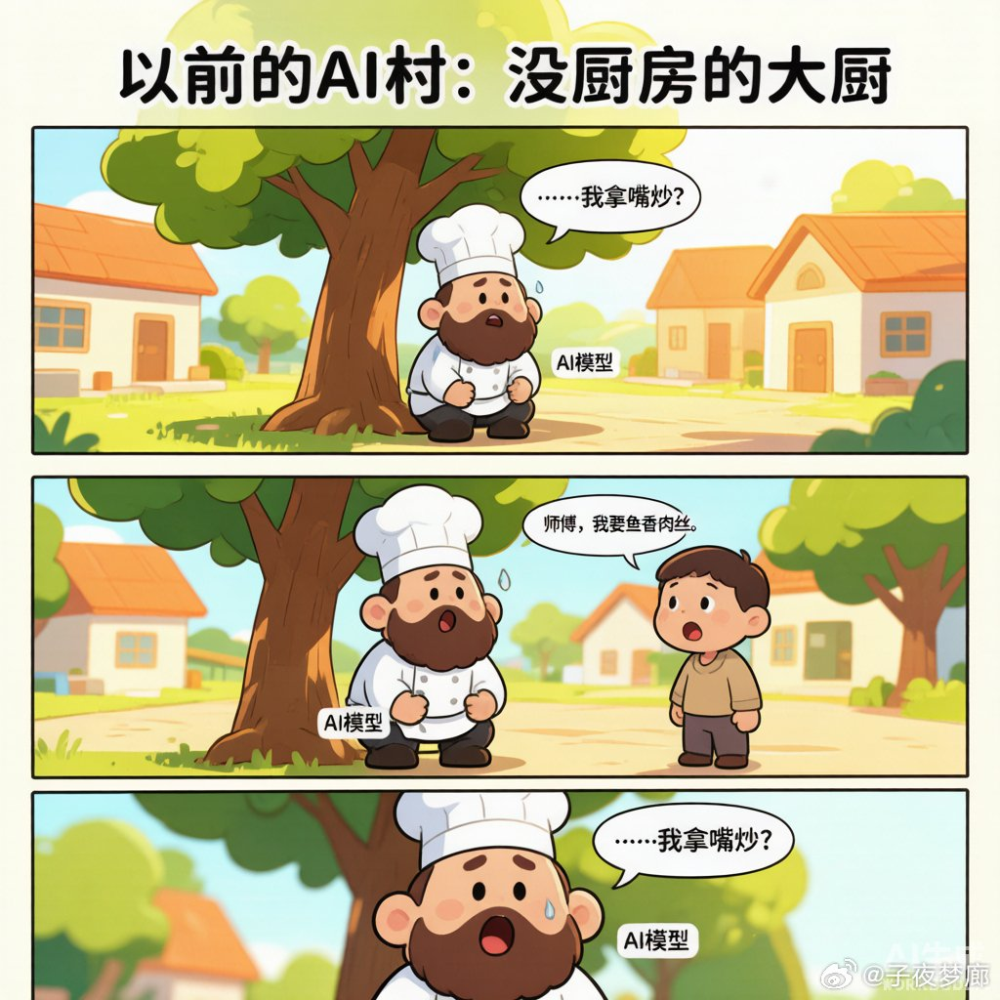

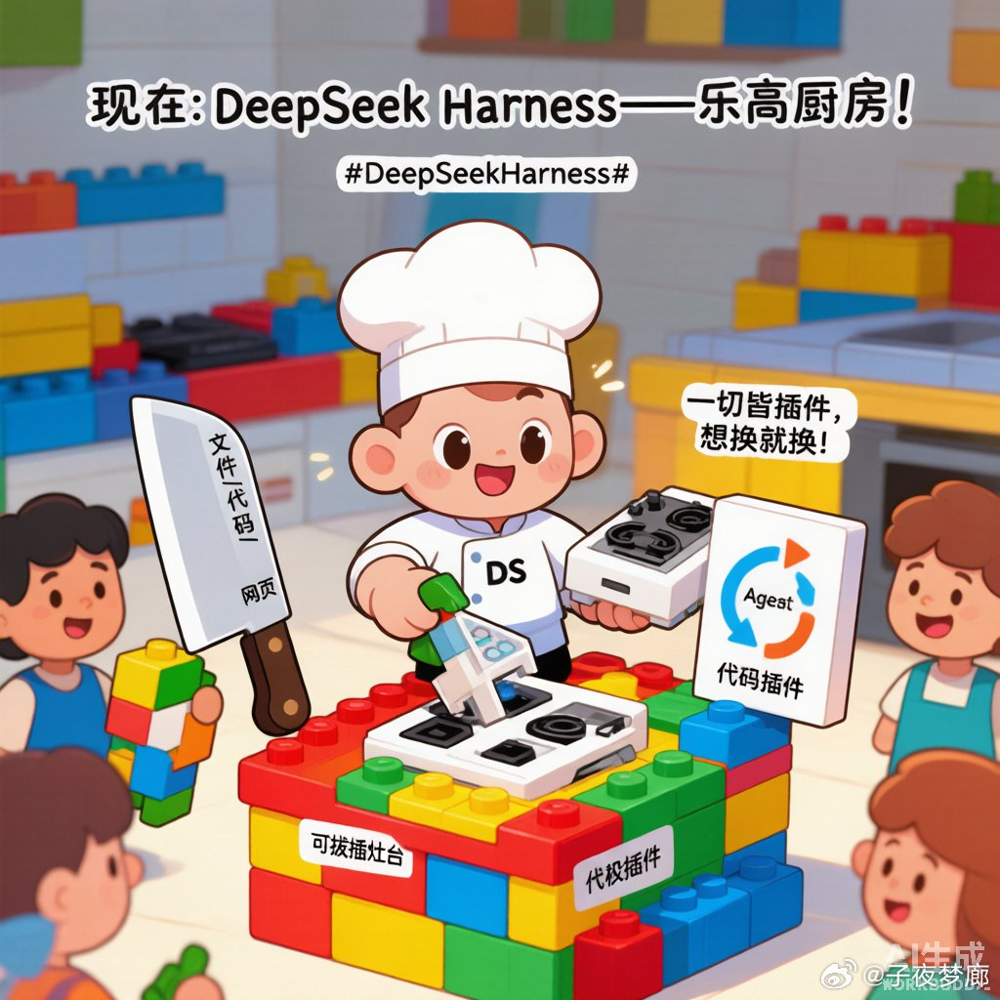

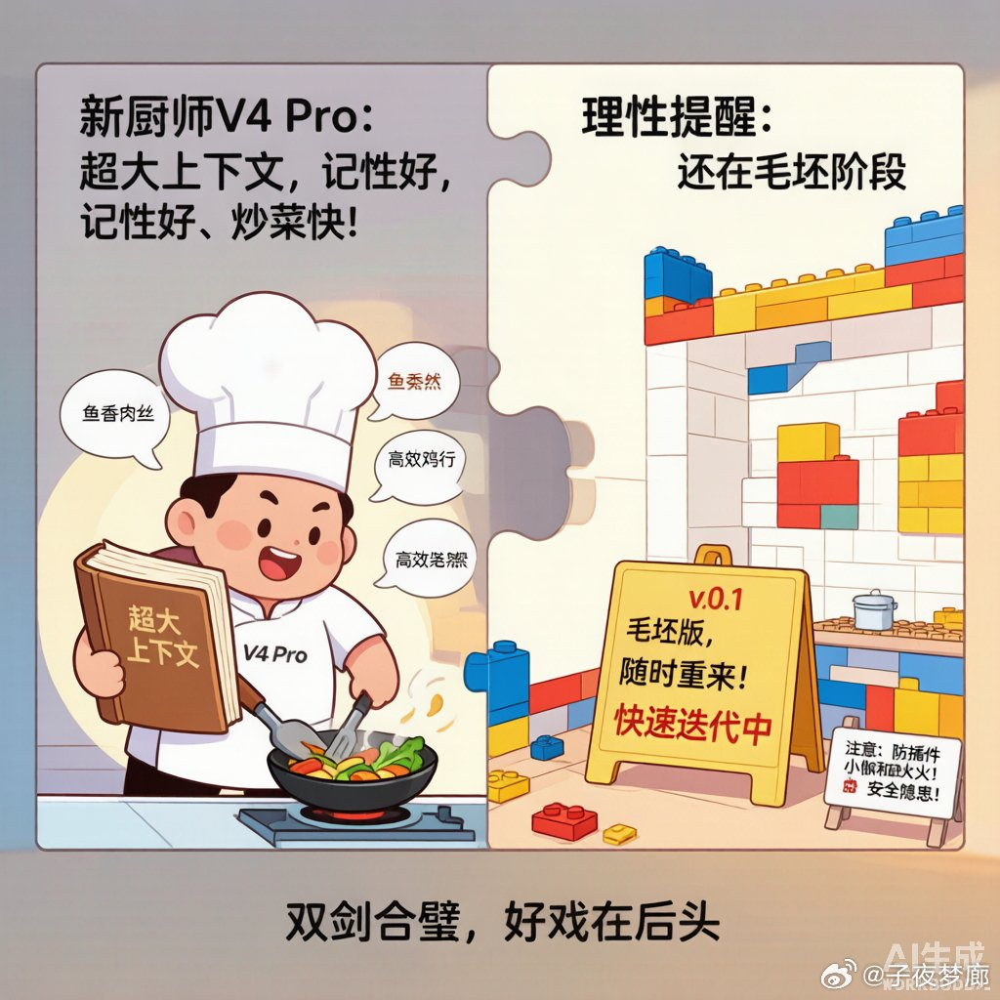

---

## 3

@李建秋的世界

发表于：2026-08-14 00:16

来源：微博

链接：https://m.weibo.cn/status/5331728379151187

关于龙餐馆，其实已经收着拍了，注意是“收着拍”，意思是因为这个故事情节是个厨子，所以没有真的“根据目前已经西方披露出来的现实情节来拍”。

关键点：细节是西方披露出来的，还不是伊拉克本土老百姓讲的。

真实的伊拉克战争，尤其是战后，是“无原则杀人”。

有好多人太天真的，非要纠结于“我抢了XXX”之类的有目的的杀人。

哪怕美军士兵是去抢劫-----我都觉得至少他是有理由的。

现实的伊拉克战争，美军士兵杀人是无理由的。

我想杀人，所以杀人。

我杀人没有任何目的，不是为了抢劫，不是为了一些企图。

无目的的杀人。

杀人完全可以不负责，无所谓。

就跟你拿着放大镜在太阳底下烧蚂蚁一样，你为什么烧蚂蚁?你是想独占蚂蚁窝吗？

你不想，你只是觉得，我可以烧，或许好玩----还不一定是真好玩。

---

## 4

@新浪财经

发表于：2026-08-13 23:17

来源：微博

链接：https://m.weibo.cn/status/5331713655834045

【\#美存储股集体走强\# 】\#美联储加息预期再降温\# 当地时间8月13日，美国三大股指全线收涨，存储股爆发。美国七大科技巨头多数上涨，特斯拉涨超3.5%，脸书涨逾2.5%，苹果涨1%，微软涨0.90%，谷歌涨0.82%，英伟达涨0.54%，亚马逊跌0.80%。

芯片股多数上涨，费城半导体指数涨0.46%。其中，存储股全线大涨，西部数据、海力士涨逾7%，希捷科技涨近5%。美光科技涨超4%。此外，英特尔、拉姆研究涨超3%，ARM、迈威尔科技涨逾2%。

闪迪涨超13%。消息面上，闪迪在2026年投资者日公布长期财务模型，目标在2028至2030财年实现中高双位数营收增长，预计非GAAP毛利率约为80%，预计非GAAP营业利润率约为75%。闪迪承诺，在完成业务投资后，将把100%的剩余现金返还给股东。

中概股多数下跌，纳斯达克中国金龙指数跌1.84%。京东集团跌超7%，拼多多跌逾5%，BOSS直聘跌超4%，哔哩哔哩跌逾3%，金山云、贝壳、阿里巴巴等均跌超2%。

美联储内部围绕下一步货币政策走向的分歧进一步公开化。

克利夫兰联储主席哈马克再度重申加息立场，直接称“我认为我们现在需要采取行动。”，并警示美债杠杆及AI泡沫等金融稳定风险。里士满联储主席巴尔金则支持维持利率不变，认为通胀主要源于临时性冲击，但警告AI投资与供应链可能带来持久价格压力。

美国财政部报告显示，由于医疗保险成本飙升，以及联邦债务利息继续对国家财政状况造成压力，美国7月财政赤字总额4323亿美元，同比增长约48%，创下2021年3月之后最大月度赤字。

另外，美国公布了超预期的初请失业金人数和低于预期的7月PPI数据：

美国上周初请失业金人数20.9万人，预期20.2万人，前值由19.9万人修正为20万人；上周续请失业金人数177.7万人，预期179.5万人，前值由180.1万人修正为179.9万人；上周初请失业金人数四周均值19.9万人，前值由19.875万人修正为19.9万人。

美国7月PPI同比上涨4.7%，预期4.9%，前值5.50%。美国7月PPI环比持平，预期0.2%，前值由-0.3%修正为-0.1%。（证券时报）

---

## 5

@蚁工厂

发表于：2026-08-14 00:19

来源：微博

链接：https://m.weibo.cn/status/5331729264153077

参与Deepseek Harness内测的大佬名单

整理者：Fini.Yang

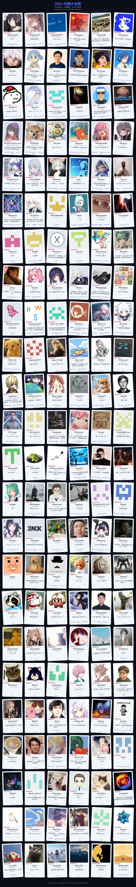

---

## 6

@新浪科技

发表于：2026-08-14 00:21

来源：微博

链接：https://m.weibo.cn/status/5331729636393566

【\#Anthropic或成全球最大IPO\#】《财富》（fortune）昨日（8 月 13 日）发布博文，报道称 Anthropic 计划 2026 年 10 月以 2 万亿美元（IT之家注：现汇率约合 13.51 万亿元人民币）估值 IPO 上市，其规模将超过 SpaceX，成为史上规模最大的 IPO。

IT之家查询公开资料，马斯克旗下 SpaceX 于 2026 年 6 月 12 日 IPO 上市，按发行价每股 135 美元（现汇率约合 912.2 元人民币）计算，其市值可达 1.77 万亿美元（现汇率约合 11.96 万亿元人民币），为美股史上最大规模 IPO。

而最新消息称 Anthropic 计划 10 月 IPO 上市，估值有望超过 SpaceX，达到甚至超过 2 万亿美元（现汇率约合 13.51 万亿元人民币），成为史上规模最大的 IPO。

业内指出，Anthropic 已于 6 月向美国证券交易委员会秘密提交 IPO 相关文件，进入静默期，受此约束，企业不得对外发布涉及自身财务表现的公开信息。

今年 Anthropic 推出多款性能优于竞品的模型，同时聚焦面向企业客户的销售业务。公司于 5 月公布其年化营收已经突破 470 亿美元（现汇率约合 3,175.75 亿元人民币）。（IT之家）

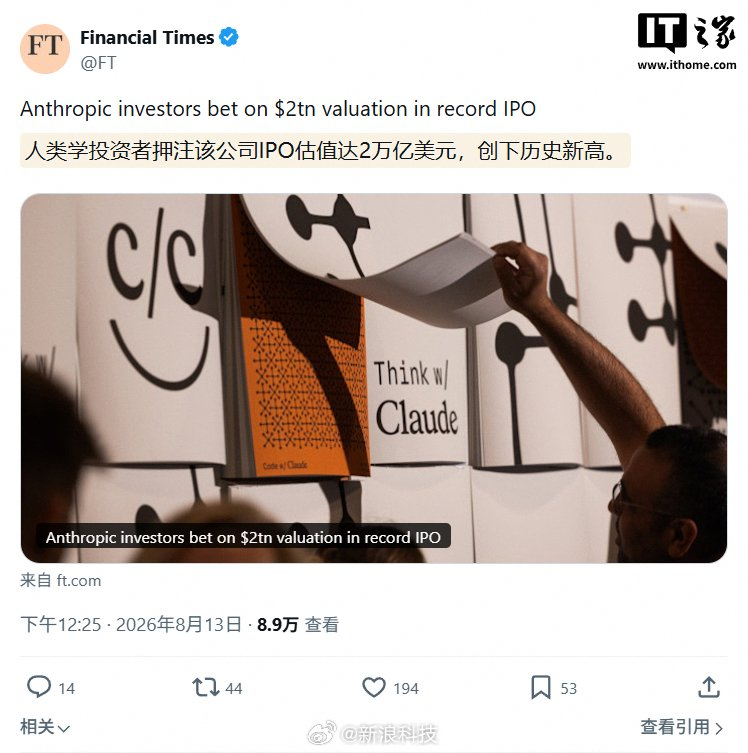

---

## 7

@里神楽

发表于：2026-08-13 15:04

来源：微博

链接：https://m.weibo.cn/status/5331589527241325

这味儿正

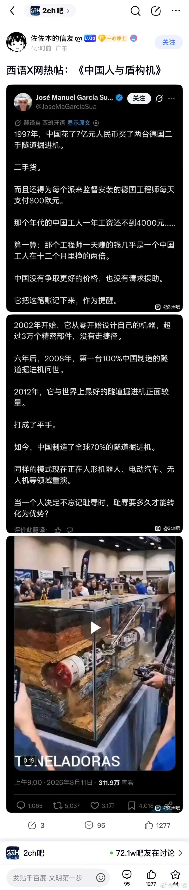

---

## 8

@李建秋的世界

发表于：2026-08-14 00:27

来源：微博

链接：https://m.weibo.cn/status/5331731127470331

早先我不是推荐过一部电视剧吗？

叫《杀戮一代》又名《伊拉克战记》

我把这部片子抬到和《兄弟连》的地位，不是说这片子战斗场面有多精彩。

而是说这部片子展现了现实中伊拉克战争中，美军士兵的一些表现。

开枪打死伊拉克人的羊和骆驼，为什么要开枪？

没有为什么，就是好玩，我想，我可以。

不是美军士兵意图抢劫这些羊和骆驼，他们不想，他们只是觉得好玩。

在阿富汗战争中也有大量此类的行为，轰炸一个村庄，为什么轰炸？

是村庄里面有塔利班吗？不是的。

就想看看轰炸效果而已，乐子，玩，我愿意。

如果你要追问，我就说有塔利班。

这类的无目的的杀戮比比皆是，

大量的“无目的的损害”，比如说美军士兵闯进伊拉克人的家里，

然后把这家人的油倒了，泼地上。

为什么泼地上？

因为我可以泼地上，看到伊拉克人痛苦，美军士兵很快乐。

我可以泼地上。

伊拉克人在现实看到美军士兵对他们看这个，

打开电视看到小布什信誓旦旦的表示，要在伊拉克建立起民主自由的社会。

然后伊拉克人转头去投奔反美武装了。

然后被某些国人看到了，某些国人骂伊拉克人不知好歹。

被某些中国“清华大学政治系副教授”看到了，副教授责怪伊拉克疑似太社会主义了。

我说的都是发生过的事情。

---

## 9

@头条新闻

发表于：2026-08-14 00:27

来源：微博

链接：https://m.weibo.cn/status/5331731353699896

【\#校方通报辅导员称不买新教材就退学\#：辅导员情绪失控、言语失当，予以严肃批评教育】近日，网传的一份西南医科大学班级群通知截图引发网友热议，该校中西医结合学院一名辅导员发布群消息，明令禁止学生购买二手教材、电子书，并称，“如果连教材都不舍得买，或者还要计较那一点与旧书的差价，这个书也可以不读了，直接休学或退学去工作挣钱吧。”

8月12日，华商报大风新闻报道了此事。8月13日，西南医科大学发布通报：

近日，我校中西医结合学院辅导员在年级QQ群发布教材选购不当言论在网上引发关注，学校及时调查处理，现将有关情况通报如下：

我校严格遵守上级部门相关规定，坚持自愿选购、自主获取原则，支持学生通过学校官方渠道网上自主选购教材，也可自行购买二手教材、电子教材，家庭经济困难学生可申请临时困难补助。

经查，8月11日上午，中西医结合学院辅导员杜某在解答学生教材选购咨询时情绪失控、言语失当，对部分学生及家长造成了伤害，暴露出学校在辅导员教育管理上的问题。我们深感自责愧疚，已对该辅导员予以严肃批评教育，并责令其在年级QQ群公开致歉。

下一步，我们将以此为鉴、举一反三，全面加强教师队伍教育管理，努力提高学生服务工作水平，坚决杜绝类似情况再次发生。感谢社会各界和广大网友的监督。（大风新闻）头条新闻的微博视频

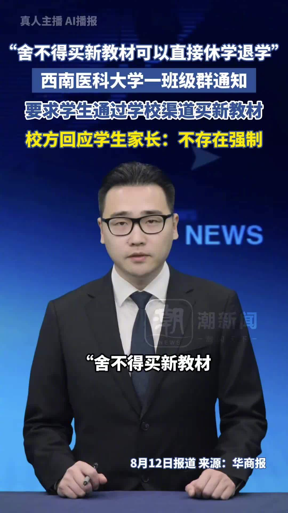

---

## 10

@七八个圆

发表于：2026-08-12 07:55

来源：微博

链接：https://m.weibo.cn/status/5331119163839803

手机玩多了看电影都像在干正事

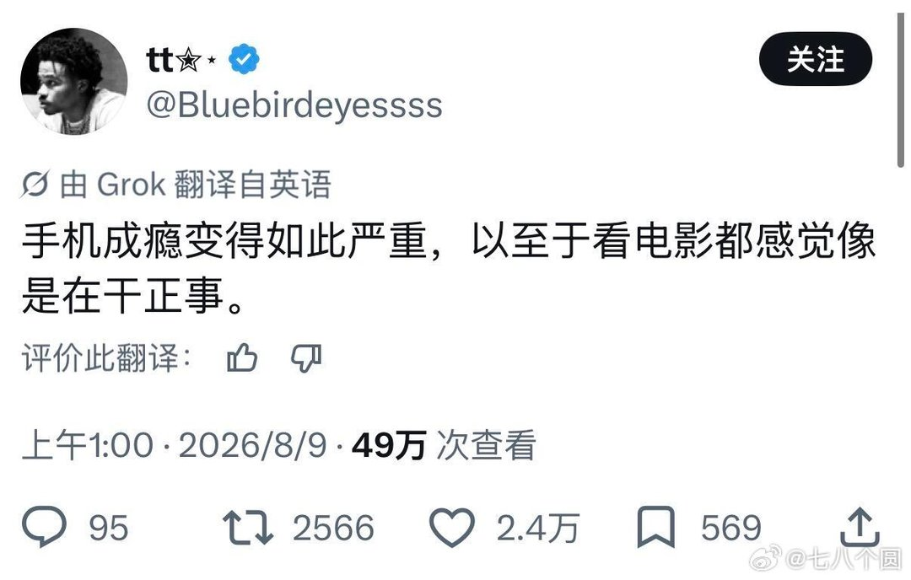

---

## 11

@等风来_zw

发表于：2026-08-12 00:01

来源：微博

链接：https://m.weibo.cn/status/5331000022270684

Nature顶级研究终于揭秘：你记不住东西，根本不是记忆力差

 

很多人一直误解自己：

总觉得背书慢、记单词难、学新知费劲，是自己记性不好、大脑不够用。

 

但神经科学有一个新发现：

人类大脑的记忆容量，比你想象的大多了。

 

你根本不存在“记不下”的问题，

你只是一直在用错误的方式逼大脑记忆。

 

2005年加州理工发表在《Nature》的经典实验，

发现了震惊学界的「詹妮弗·安妮斯顿神经元」，改写了人类对记忆的认知。

 

研究人员在癫痫患者大脑海马区，

捕捉到了一颗极度神奇的脑细胞：

只要出现「詹妮弗·安妮斯顿」相关的一切线索——

她的照片、名字、声音、角色、《老友记》片段，

这同一个神经元就会精准放电。

 

看到别人、风景、动物、物品，完全无反应。

 

这直接证明了一个逻辑：

人类大脑，根本不是为了记“零散碎片”而生的。

它不储存孤立文字、单词、数据、名词。

它只储存「完整概念、关联体系、意义网络」。

 

大脑的记忆机制是：

把所有散落信息，归纳进同一个「概念神经元」里统一归档。

生活里其实随处可见这个神经元的具象表现，比如：

心底深深挂念、深爱某个人时，只要耳边听见对方的名字这一条线索，大脑瞬间联动调出全部相关记忆：他的眼神、说话语气、身上独有的气味、相处时的画面、触碰时的触感，所有细碎感知全部同步涌现。

 

对应实验逻辑很好理解：你的大脑里，也专属一颗对应这个人的概念神经元。名字、声音、样貌、触感、情绪，全部打包收纳在同一个神经单元，任意一个线索，都能激活整片记忆网络。

 

反观我们背诵知识点、陌生名词时的困境：

单词、专业术语、零散数据没有画面、没有情绪、没有过往认知挂钩，只是孤立文字。大脑识别不到它的“意义”，就会直接判定为无效垃圾、自动屏蔽、快速清除。

 

这就是为什么：

死记硬背最费力、遗忘最快、最折磨人。

因为你在逆着大脑的生理本能做事。

所以真正的过目不忘，

不是强行塞进更多信息，

而是给新知快速搭建关联、挂靠旧体系、形成概念闭环。

我看了这个研究后，改进了自己的一些记忆方法，总结了4条贴合大脑原生机制、立刻能用的科学记忆法分享给大家：

 

1、不孤立记忆，先找“挂靠点”

任何新单词、新知识、新名词，

不要直接背。

先问自己：

这个东西，和我已知的哪个概念相似、相关、相通？

 

让新知挂靠旧知，

大脑会直接激活原有概念神经元，顺势收纳新内容，零阻力记忆。

 

2、给碎片信息，搭建最小故事和逻辑

大脑只认有因果、有画面、有逻辑的整体概念。

零散数据无逻辑，一秒遗忘；

只要串成因果、场景、脉络，海马区立刻归档长期记忆。

 

3、多维度绑定，打造专属神经放电网络

同一个知识点：画面+文字+理解+应用场景，多维叠加。

维度越丰富，激活的神经集群越庞大，记忆越牢固。

单一文字记忆，是最脆弱的记忆。

 

4、记忆的核心是归类，不是堆砌

笨的记忆：越学越乱，堆满碎片。

聪明的记忆：越学越通，所有新知自动归位到对应概念模块。

 

大脑不怕海量信息，

大脑怕无序信息。

记忆力差，不是大脑缺陷，是学习方式违背了神经本能。

顺着大脑 “概念收纳、关联储存、整体归档”的逻辑，

你的记忆能力会有很大提升哦。

这也是我朋友经常说我能把知识串起来，有贯通能力的原因。

本人学习心得分享，未经本人授权不得转载搬运截屏。

---

## 12

@何新老家伙

发表于：2026-08-13 23:09

来源：微博

链接：https://m.weibo.cn/status/5331711495767614

何新1979年，时为中央财经学院（现中央财经大学）汉语教研室教师

何新吴悦石1984年，山西临汾

何新1988中国社会科学院副研究员 

何新1968八达岭

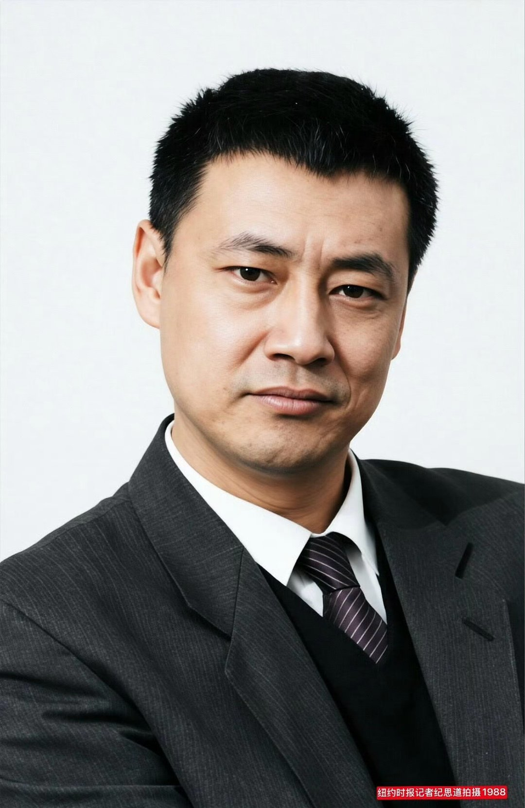

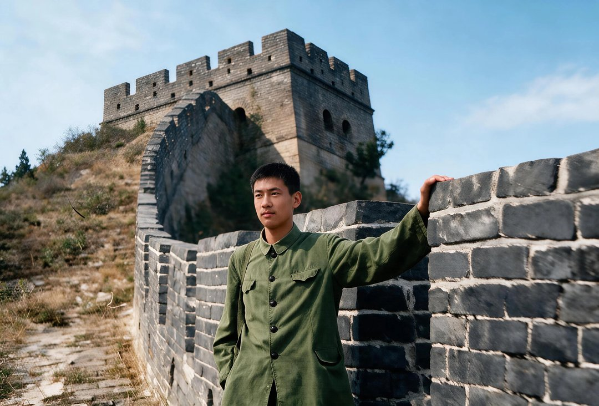

---

## 13

@王鹤诗

发表于：2026-08-13 22:34

来源：微博

链接：https://m.weibo.cn/status/5331702735700820

宣传画《公社蕉林忙》，绘画：何元飞，广西人民出版社出版，1977年7月第一版。

---

## 14

@有个梨GPT

发表于：2026-08-13 18:23

来源：微博

链接：https://m.weibo.cn/status/5331639720477137

美国AI的capex已经摸到了GDP的2%，预测是2028年会达到2.8%。

历史上除了战争因素这么高的资本支出比例的有

1，19世纪铁路6%，当时美国比较穷；

2，1920年代电气化，4%，奠定了美国工业和家庭用电基础；

3，1950-1970年代洲际公路系统，2%，奠定了美国公路交通和货运基础；

4，1990年代互联网和电信发展，1.2%。

----

AI能不能和铁路，电，公路，和互联网、光纤与移动通讯的影响力相比呢？感觉就眼前这个硅芯片水平，还不行，起码还要20年的半导体工艺发展吧，但capex是不可能这样高歌猛进20年的，需要中短期利润支撑如此高的投入。

---

## 15

@宝玉xp

发表于：2026-08-13 17:25

来源：微博

链接：https://m.weibo.cn/status/5331625098350475

我只是作为一个“普通用户”的角度去用 DeepSeek Harness，一些感受：

1. 启动方式偏极客，程序员没问题，但是普通用户估计都没有nodejs环境，很难跑起来

2. 速度飞快，这点特别好

3. Thinking 部分由于 Flash 模型速度过快，导致文字闪的厉害，可以做一下节流，攒一批一起显示，配合动效会好一点。

4. Codex 右侧的多 Tab Panel 相当重要，和当前 DSH 的插件机制是很好的搭配，强烈建议借鉴下，比如我写完 PPT 还要新开窗口去预览，来回切换很麻烦，不如显示在右侧直观

5. Trajectory 和 Session log 对普通用户价值不大，不需要那么重要的位置

6. 现在能列出产出物很好，但最好能直接打开，能看到 diff （开箱配置好相关插件了，不要用户二次配置，当然可以关闭）

7. 模型早点支持多模态吧，多模态也是 AGI 的一部分

8. 一切皆插件的理念很好，普通用户的使用体验也很重要。

开发者愿意去折腾插件的前提一定是你的 Agent Harness 有大量普通用户了，否则没有多少开发者坚持在上面，新鲜劲过了就没人了。

插件和用户体验并不冲突，核心还是看开箱设置/出厂配置，用户第一次用不需要太多配置就能用起来，用的时候也没什么不方便，后续再慢慢折腾插件也不迟。

9. DeepSeek Harness 团队，真正需要招的不是一帮天才程序员、奥林匹克金牌选手，需要真正懂 AI 产品的 AI 产品经理，这个阶段把产品定义清楚、规划清楚最重要。

BTW，DSH 给我做的 PPT 质量还不错。

\#DeepSeekHarness发布\#

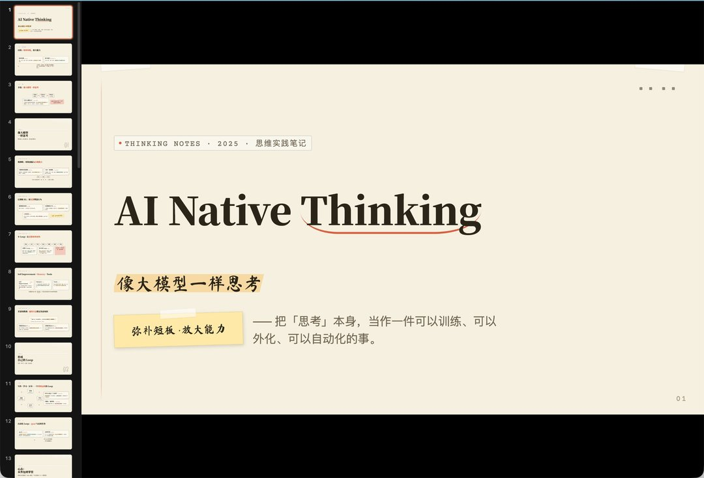

---

## 16

@宝玉xp

发表于：2026-08-13 18:26

来源：微博

链接：https://m.weibo.cn/status/5331640442160338

回复@Palindrome-S:DeepSeek 作为一个模型厂商，最有价值的肯定还是做 Agent Harness Product 而不是 SDK，因为 SDK 它不容易拿到用户行为数据。  做 Agent Harness Product 那就得追求用户量，追求用户量就要先做好用户体验，其次才是插件可定制化。//@Palindrome-S:目前这个阶段不太面向普通用户 高度可插拔系统得生态繁荣之后门槛才能降低

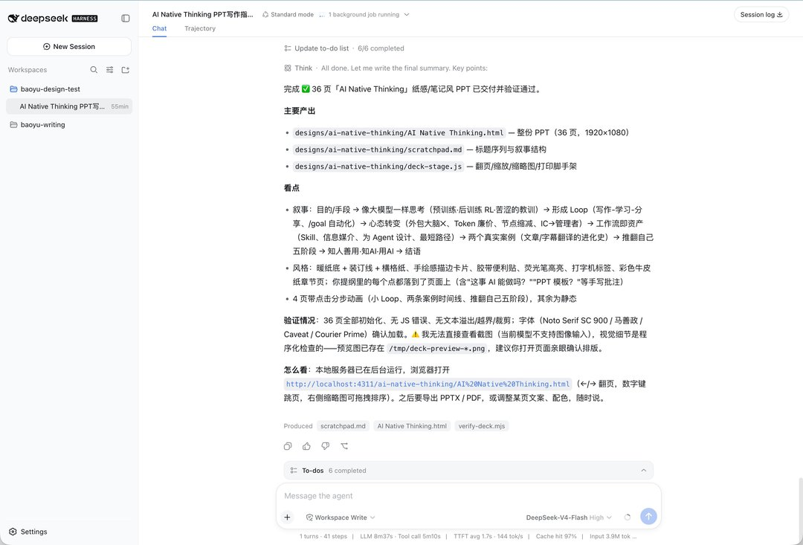

---

## 17

@江宇行舟

发表于：2026-08-13 18:57

来源：微博

链接：https://m.weibo.cn/status/5331648154698654

纪录片里提到的惊心动魄的谈判细节可见配图，摘自《ZRJ讲话实录》（第三卷）。最后美方代表搞成了菜市场买菜，还想混进别的菜，被一一识破+回怼，也用进口承诺换取保留专营，并反推集中采购的好处，并且建议美方也可以考虑比照改造供给端。

这里有两个细节：

🚩一是以往的报道中，多半会聚焦朱相对石部长霸气一挥手：“最后的我来谈”，然后亲自上阵唇枪舌剑，纪录片里朱相讲述了他背后的长者，甚至还绘声绘色模拟了他的神态动作。

🚩二是在后来的日子里，围绕政府对农产品的补贴该不该比照发展中国家标准、外国在华投资企业进出口贸易的权利、美欧在保险和零售业所受限制和国民待遇，中国和欧美国家还是摩擦不断，中国在上述事项上也是逐步实现放开，并非一蹴而就。

🚩我今天看到一篇纪录片的观后感，说得仿佛30多年前没做多大工作，全靠美国人战略发昏、蜜汁自信允许入世，和后来的反恐战争耽误收割我“经济主权”，外加咱一场大洪水带活大基建和大就业。

这种岁月史书，是公然欺负大家没在那个时代活过一遍。

🚩先说内部，看看截至2002年东西部人口比，靠西部吸收就业人口？再看看投资分布图，基建全靠救灾？我真不知道哪路键盘侠的异想天开强行挂靠。治理通胀、清理三角债、打击过热、分税制改革、下岗分流……

这里面哪个问题是光靠上述两项就能解决的？

🚩再说外部，当年中国入世前说得很明白，这些条件不答应我宁可不入世，不入也能活下去。以农产品补贴为例，即使入世后再发生摩擦，我们也不过是把补贴上限比例从10%让到了8.5%，指望收割中国，有这么容易吗？

凡事都推给美国打反恐战争，好像这一场仗就把美国牵制得其他事情本能做，如今都做不了了，这种惰性归因最后只能得出一个结论：美国不是超级大国，而是一个先军政治的国家。二三十万美国大兵的泥坑，就会限制美国其他布局……

把牵制说成是颠覆，这叫真理前进一步就是谬误。

🚩更何况当年入世评价可真没如今知道结果后的评价那么好，唱衰的不少，都觉得民族工业会被冲没。我亲戚开的小厂那时候真在琢磨收摊的事情，我爸买了第一辆车后感慨，国产车的差距果然很大……

我还拜访过一位亲历当时欧美收购潮的领导，感慨蝗虫过境，而且有些就是对我们产供链有意思的恶意收购，我们对此缺乏防范……

🚩只有亲历一线的人才讲得出来，21世纪开头小十年，是跑到深水区都摸着石头过河。溺水可能就是十几秒的事情。如今有这么强大的外贸，那也是试错和拼搏出来的，不是加入WTO敲锣打鼓躺平了迎接胜利的。

否则这上亿人口的发展中大国，有一个算一个，怎么只有中国闯出今天的气象？

🚩这种辉格史观，真是对十几亿人共同的羞辱了。

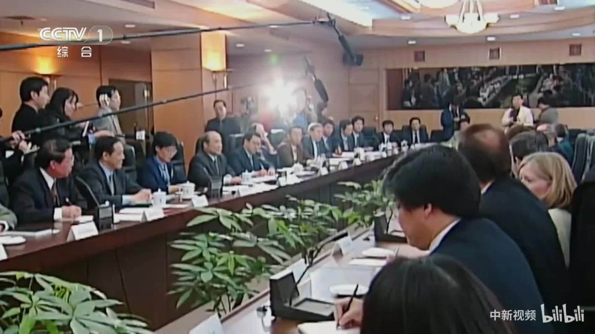

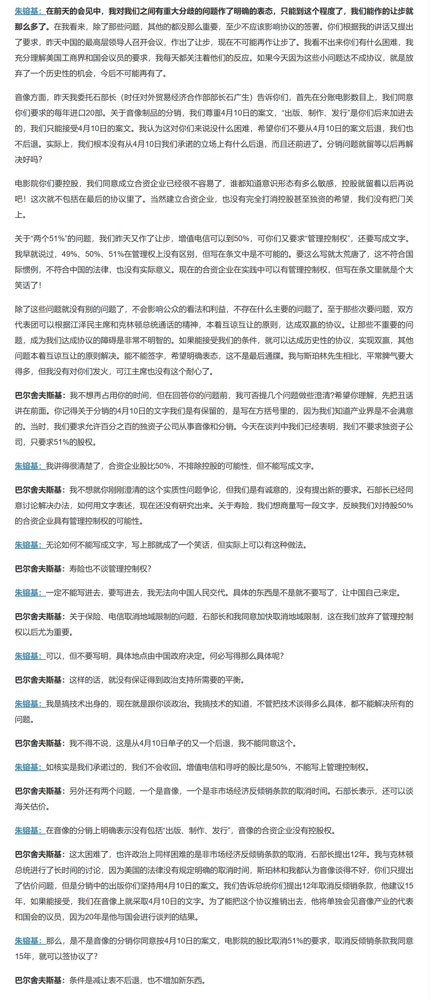

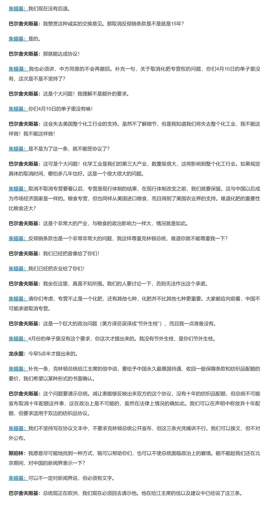

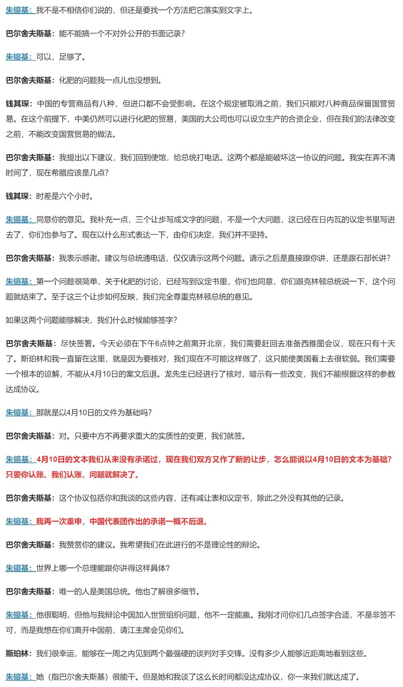

---

## 18

@蘸盐

发表于：2026-08-13 20:26

来源：微博

链接：https://m.weibo.cn/status/5331670505882226

“饽饽”不是满语。是满人使用的汉语词（“饽饽”这个词最早出现在元朝，可能来自西域语言）。过去北方很多地方管面粉或玉米粉做的面食叫“饽饽”，比如天津和河北东部很多县都有贴饽饽熬小鱼。崇祯末年到清初还有童谣，“朱家麦面李家磨，做成一个大饽饽（也有版本是“大馍馍”），送给隔壁赵大哥”至于北京过去饽饽铺卖的饽饽（点心）一类的东西，满语叫efen，清宫膳底档汉字写作“额芬”。//@Margelatu:这段太平歌词是非常典型的满汉结合的文化产物：满族人将面食统称为饽饽。创作者有人说是朱绍文，我认为恩绪的贡献应该更大。另外网上流传的是当年荷花女演唱的版本。金刚宝镯是指过去一种点心叫金刚脐，做出来很像庙里金刚的肚脐。//@蘸盐:“二五眼”也失传很久了。不过听这名字就应该是很糊弄（北京话“二五眼”≈外行，半吊子，马虎糊弄）//@不得不炸狗:唱了十来年了，还是有很多未解之谜…这金刚宝镯到底是什么玩意…打女真那会就有，唱到民国，千八百年…想来无非也就是焦圈儿一类…“索扭捻成环钏之形，油煎食之”…//@安川瓦普:哈哈哈哈哈哈

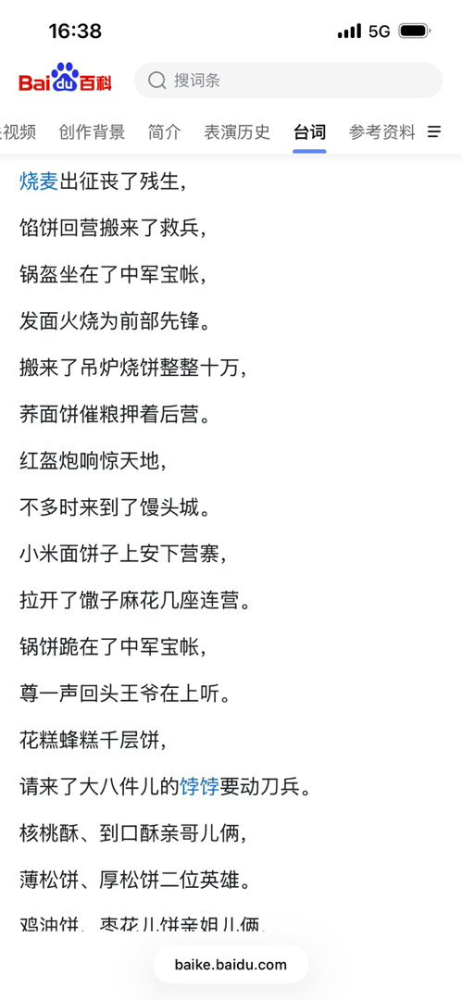

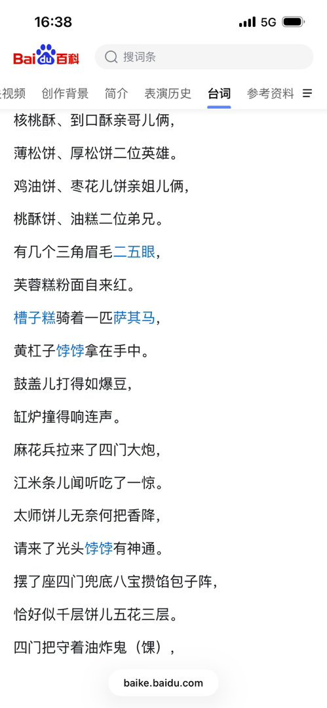

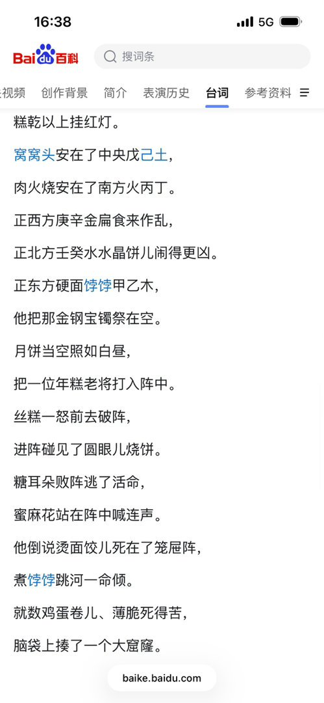

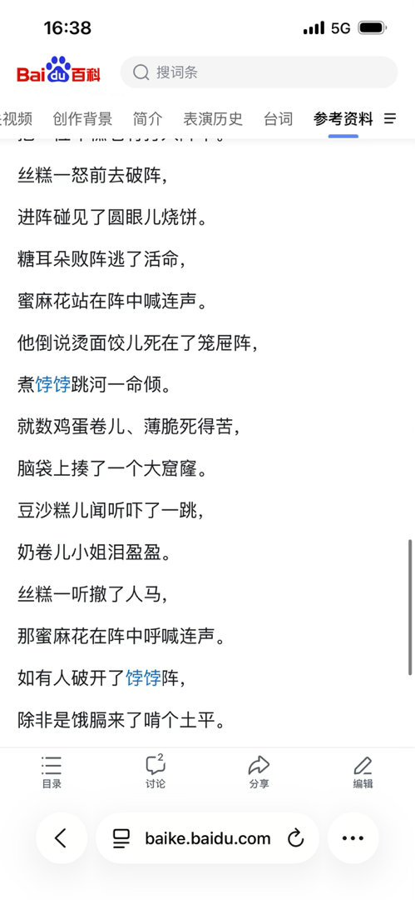

---

## 19

@前HR本人

发表于：2026-08-13 22:00

来源：微博

链接：https://m.weibo.cn/status/5331694124794439

告别产能时代！需求为王的时代，人口决定国运！

 

近期CPI持续走低、通缩压力反复显现，各行各业内卷加剧，汽车行业疯狂降价内卷、出口猛烈但是国内终端销量却持续大跌；全国各地大量幼儿园、妇产科陆续关停。这些现象的本质，并非我们生产能力不足，而是需求严重匮乏。中国早已告别物资短缺时代，生产力稳居全球顶尖、很多占一半以上，当下制约经济发展的核心瓶颈，不是产能，而是人口支撑的内需。

 

1、市场经济的底层逻辑就是需求为王。过去数十年，中国经济依靠补齐产能、扩张生产实现飞速增长，彼时经济短板是生产力不足，只要扩大生产就能创造价值。但如今，我国拥有全球最完整的工业体系和成熟的全产业链，制造业产能充足、效率领先，绝大多数商品可以充足供给甚至超额输出。

 

产能全面过剩的背景下，各行各业的内卷随之爆发。市场增量停滞，存量竞争白热化，企业只能通过降价压缩利润、同质化竞争求生。汽车、家电、建材等行业皆是如此，产品品质、产能产量持续提升，消费市场却不断收缩。这足以证明没有需求，再强大的生产力都是无效产能，在当下经济阶段，争夺内需、盘活消费，远比扩张生产更为重要。

 

2、内需的根基是人口，人口结构直接决定经济活力。消费市场的核心主力是年轻人，买房购车、育儿教育、家居家电等刚需消费，几乎全部集中在中青年群体，是拉动内需的核心动力。而当前我国人口呈现典型的倒金字塔结构，新生儿数量持续走低，青年劳动人口逐年流失，老龄化速度加快。

 

这种失衡结构带来了连锁经济难题，新生消费力量断层，刚需市场持续萎缩，母婴、早教、学前教育等相关产业链持续衰退；社会整体消费意愿持续走低，居民储蓄避险情绪升温，市场活力持续疲软。人口总量下降、结构失衡，直接导致内需大盘不断收缩，也是CPI持续承压、经济内生动力不足的根本原因。

 

3、更关键的是，人口是中国最核心、最宝贵的战略资源，更是全产业链竞争力的根基。很多人片面高估设备、技术和资本的作用，却忽略了我国海量高素质人口的独特优势。经过普及义务教育和高等教育大众化，我国劳动力具备学习能力强、执行力高、适配性广的特质，能够支撑从传统制造到高端科创、新能源、生物医药的全链条产业迭代，这是其他国家难以复刻的核心红利。

 

强大的产业链不只是机器堆砌而成，需要源源不断的青年劳动力生产研发、创新突破，更需要庞大的内需市场兜底消化产能。一旦年轻人口持续断层，不仅会出现产业人才短缺、创新动力不足的问题，终端消费市场也会持续萎缩，最终导致产业链优势弱化、产业外迁，彻底动摇我国的经济核心竞争力。

 

4、因此，激活内需、终结行业内卷、稳住经济基本盘，短期的消费补贴、政策刺激只能治标，提振婚育意愿、改善人口结构才是治本之策。 

当下职场普遍存在“未婚未育优先”的招聘导向，企业为规避婚育成本、追求短期效率择优用人，看似合理，但透支国家长远未来。这种短视导向，加剧了年轻人的婚育焦虑，让大众不敢结婚、不愿生育，进一步加剧人口断层与内需萎缩。

 

想要破解经济困局，必须扭转这一导向，以体制单位带头示范，建立已婚已育优先的正向激励机制，通过就业倾斜、福利保障、育儿补贴等政策，降低家庭婚育、养育成本，缓解青年群体的生活与就业压力。只有让年轻人敢婚、敢育、养得起孩子，才能持续补充新生人口，修复人口结构，为内需市场注入长期增量。

 

整体上，除了半导体等个别领域，现在中国从不缺顶尖的生产力和完备的产业链，真正稀缺的是人口红利与消费需求。未来的经济竞争，核心是人口与内需的竞争。稳住人口、激活婚育、做大内需，才能彻底打破内卷、抵御通缩压力、守住产业优势，筑牢中国经济长期稳定发展的核心根基。

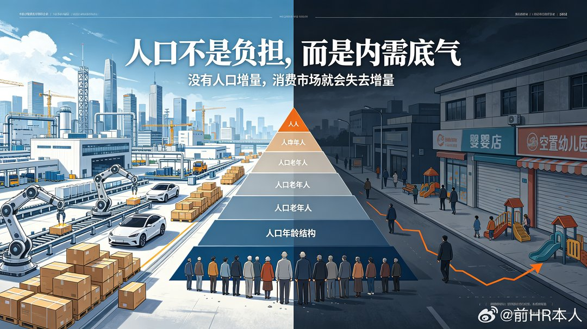

---

## 20

@中华之鹰01

发表于：2026-08-13 22:00

来源：微博

链接：https://m.weibo.cn/status/5331694124794562

从“世界第一”到“仅占7%”：中国新生人口的断崖式变局

792万，这意味着，中国新生人口占世界的比例，跌破7%了！而按照2024年中国出生人口数据和人口司估计的全球出生人口数量，这个比例还接近7.4%。

在过去的70多年中

新生人口比例从近四分之一跌到了不足十分之一

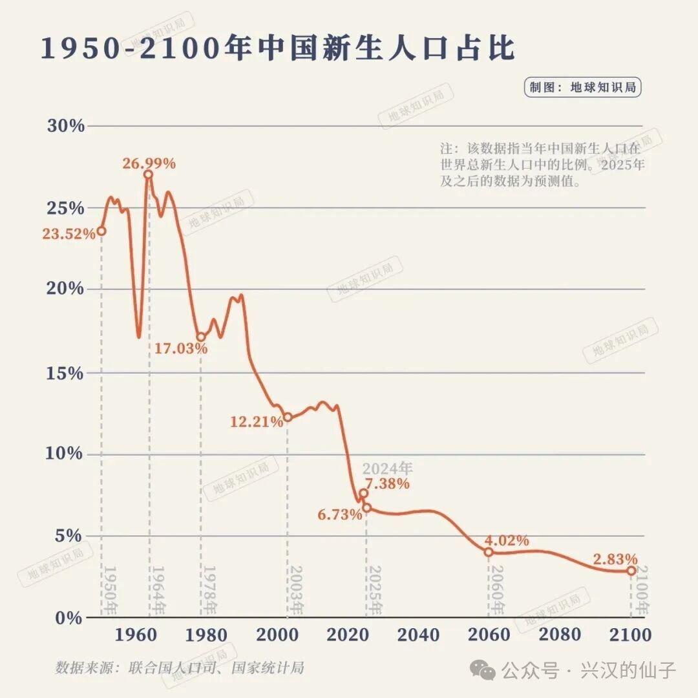

---

## 21

@问鼎资本-张佳男

发表于：2026-08-13 16:06

来源：微博

链接：https://m.weibo.cn/status/5331605251168640

A股上涨的几个必要条件:

1. 美股必须上涨。

2. 韩股必须上涨。

3. 日股必须上涨。

4. 前一晚和当天必须全世界和平，俄乌、中东、半岛等等关键地方不能发生意外。非洲和澳洲的矿也不能有事。

5. 特朗普不能乱说话。

6. 美联储不能乱说话。

7. 美国经济数据必须好看。

8. 中国经济数据必须好看。

9. 彭博、路透、大摩、小摩、高盛等不能发针对的观点。

10. 欧盟不能有调查。

11. 日元不能崩、美元不能崩、欧元不能崩，当然人民币更不能。

12. 原油不能大涨。

13. 场内外不许有小作文。

14. 某某券商不能开策略会。

15. 龙头权重股不能有不好的消息。

16. 不能是交割日 不能是月底。

17. 不能是季末，不能是半年末，不能是年末。

18. 不能突然降准，也不能突然不降准，政策力度必须刚刚好。

19. 不能突然降息，市场预期必须提前管理好。

20. 央行不能突然发布超预期的消息。

21. 国务院不能突然开会，开会也不能有市场没想到的内容。

22. 财政政策必须积极，货币政策必须宽松，市场还得相信政策能落地。

23. PMI必须站在荣枯线以上。

24. 社融必须超预期。

25. M2必须增长，M1也必须改善。

26. CPI不能太低，PPI也不能太难看。

27. 房地产数据不能继续恶化。

28. 消费数据必须好看，居民消费信心必须有所恢复。

29. 出口数据必须好看，进口也不能太难看。

30. 人民币汇率必须稳定，不能突然大幅贬值。

31. 北向资金不能突然跑路，外资最好持续流入。

32. 公募基金不能集体赎回。

33. 量化不能突然砸盘。

34. 游资不能突然集体休息。

35. 融资余额必须增加，但又不能增加得太快。

36. 成交额必须放大，最好每天都能维持万亿以上。

37. 成交量放大以后不能被解读成“市场过热”。

38. 印花税不能调整。

39. IPO不能突然加速。

40. 大股东不能减持。

41. 上市公司不能突然业绩暴雷。

42. 龙头公司不能突然被监管问询。

43. 某个行业不能突然爆出重大利空。

44. 某个权重股不能突然宣布巨额再融资。

45. 茅台不能跌，宁德时代不能跌，券商不能跌，银行不能跌。

46. 高股息不能突然跳水，成长股也不能突然集体杀估值。

47. 美债收益率不能突然暴涨，黄金也不能突然暴涨。

48. 比特币不能突然暴跌，全球风险资产情绪必须稳定。

49. 全球市场必须保持风险偏好，VIX不能突然飙升。

50. 必须有人愿意在高位接盘，并且所有人都坚信明天还会继续看多。

---

## 22

@卤煮疫苗

发表于：2026-08-11 14:40

来源：微博

链接：https://m.weibo.cn/status/5330858678419717

药盒上写的“原研一致”居然也是注册商标。

央广网报道，近日，有网友在社交平台发文反映，其父母购买了一款由某某药业旗下某某制药集团生产的红霉素眼膏，包装左上角位置标注了“原研一致”四个字。该网友本以为是药品通过了国家“仿制药一致性评价”，经查询才发现，“原研一致”竟只是一个注册商标。 

原文链接：网页链接

---

## 23

@前HR本人

发表于：2026-08-13 14:06

来源：微博

链接：https://m.weibo.cn/status/5331574838788616

小日子侵略中国，为什么成不了元和清的历史？

因为小鬼子岛国人，自大又自卑，给日本服务的高级汉奸，都出现家属被奸杀的，这种人的家属都没安全保障，更何况其他伪军小兵了。

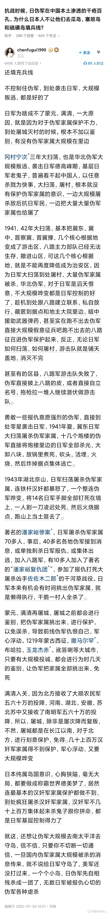

---

## 24

@姬永锋

发表于：2026-08-14 01:51

来源：微博

链接：https://m.weibo.cn/status/5331752295599548

这开创了一个重要的先例。

一家新加坡承运商拒绝将一批电子产品从上海运往巴拿马，因为订购这批货物的香港客户被列入了美国制裁名单。货物被退回，造成了损失。

上海一家法院判令一家新加坡公司赔偿499万元人民币。中国《船舶许可证管理法》第十二条是一项至关重要的约束性条款—无论你的合同如何规定，无论你选择适用哪项法律，无论你多么惧怕美国外国资产控制办公室（OFAC）。如果你协助外国对中国企业实施“歧视性限制”，你将承担经济责任。

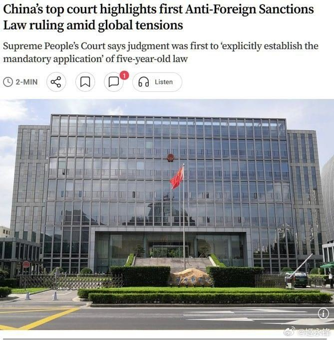

---

## 25

@sven_shi

发表于：2026-08-14 13:11

来源：微博

链接：https://m.weibo.cn/status/5331923547456118

确实//@冬亚:真差不多得了，我们小时候还听比尔盖茨很节约的故事呢。你特么少消费者商家骑手三头吃，你回回头等舱也没人在意。

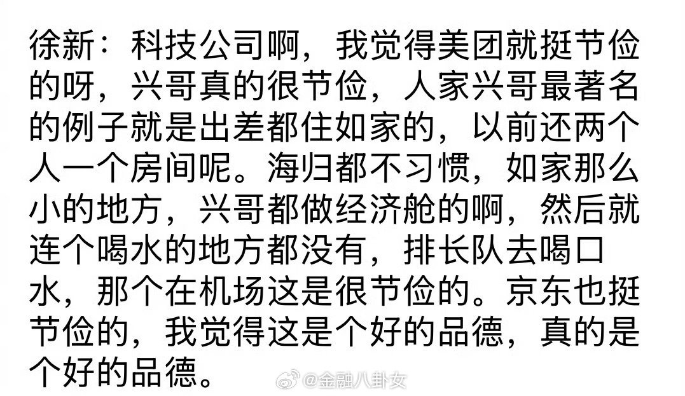

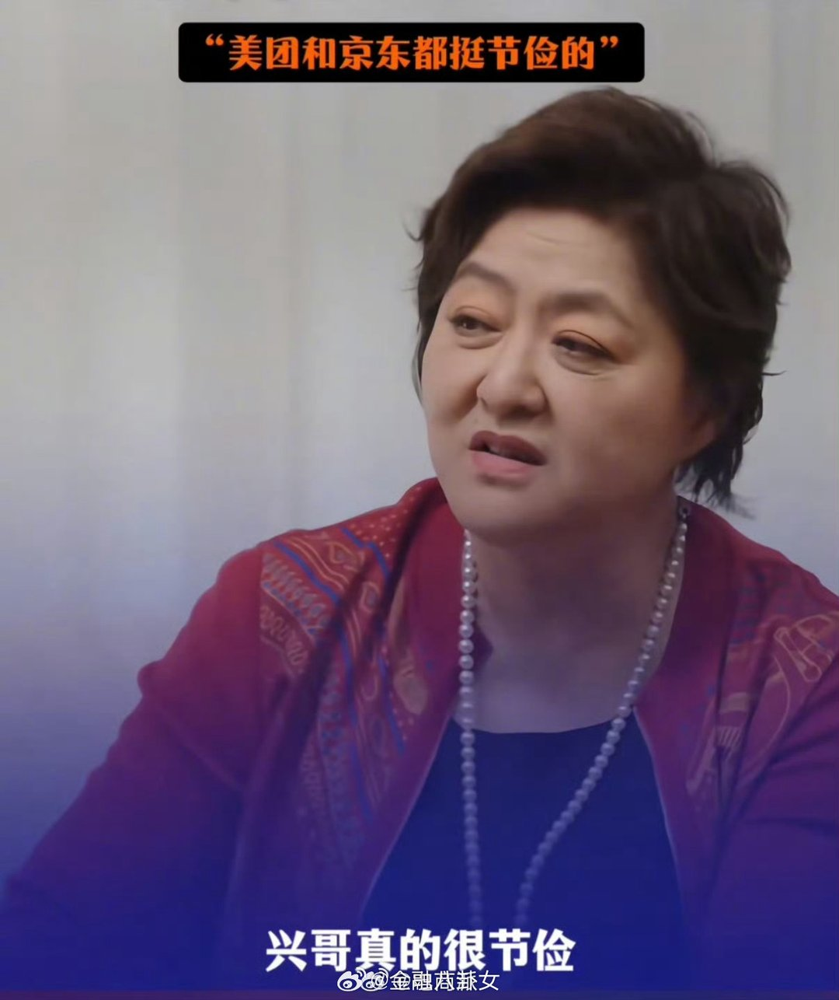

---

## 26

@李晓鹏博士

发表于：2026-08-14 13:20

来源：微博

链接：https://m.weibo.cn/status/5331925854325322

三月份哈梅内伊刚被炸死的时候，我做了一场直播。当时，拿美国轰炸南联盟做了一个比较，说南联盟扛鼎盛时期的美国狂轰滥炸，扛了78天才认输投降。伊朗不可能少于这个数字，考虑到地缘因素，最少能顶3个78天。战争刚开始打的时候，特别是哈梅内伊被炸死，网上是一片看衰伊朗的声音。即使支持伊朗的朋友，对整个战局，恐怕都难免会比较悲观。我当时就说，一个领袖的牺牲，对伊朗整个国家的国力，影响应该不是很大，不会影响整个战争局面的改善。伊朗不会认输投降。

现在过去差不多三个月了，三个78天过了一半，这段时间的形势变化，大家发现其实美国——包括以色列，但主要是美国——表现的比我预计的还要差。它没顶住78天就跟伊朗达成临时停火协议了。不是伊朗没顶住，是美国没顶住。它的中东军事基地被伊朗导弹无人机炸了个遍，大部分军人和武器装备都被迫从伊朗周边撤离，撤退到了远离伊朗的约旦境内。伊朗政权没有被颠覆、核材料没有交出来，反而控制了霍尔木兹海峡，美国这样停火，就是认怂认输，政治军事上的一场大失败。

之前，美军基地在伊朗周边围了一圈。经过第一波的打击，这些贴着伊朗的美军基地已经被炸得没法用了，大量的美军撤入到约旦境内。他们现在的处境很尴尬，因为没法再撤了，后边就是以色列。以色列境内没有美军基地。以色列对美军的定位就是看门狗，说好听点就是保镖打手。看门狗有什么资格住到主人家里呢？只能在房子外边的狗棚子住。约旦、阿联酋这些地方就是给美狗住的——这里的美狗不是美国的狗，是美国狗。美国政府、美国军队在全世界耀武扬威，把那些附庸国当狗，但在犹太资本的母国面前，也只能夹起尾巴老老实实当狗。

以色列不让美国在以色列驻军。但美国还要厚着脸皮非要保护以色列，最远能退到哪？只能退到约旦了。伊拉克的美军基地已经撤了。之前在巴林、阿联酋、科威特的基地也毁了，约旦已经是他们能够退的最远的地方，再后退就是主人家，没法退了。

这一次呢，伊朗主要就是怼着约旦的美军基地打。美军的表现是越来越拉垮，他已经不具备发动大规模进攻的能力了。伊朗则越打越自信。就美军那点轰炸能力，三月份第一轮最猛的都已经顶住了，这一次根本就不够看。没有任何可怕的了。

所以说，现在这个局面，对美军来说，相当于是“公开处刑”，就是让它在全世界面前丢人现眼，越打越丢人的这么一个状态。

三月份的直播，以及我在微博讲的，已经做出了判断：美国搞不定伊朗。但现在这个形势的发展，是没有想到美国军事上表现的比我们当时最乐观的预测还要差。不是伊朗顶78天，而是78天没到，美军自己就怂了。福特号航母又是堵马桶又是起火的，屎遁，屎遁不成火遁，总之就是不愿意到一线作战。

又过了几个月，美军士气比三月份只会更糟糕。作为最高军事统帅的特朗普，成天在网上上窜下跳、胡言乱语，他指挥的军队是不可能有战斗意志的。任何一个脑子正常的美军士兵和军官，都不会相信这次战争是为了保卫美国的国家利益，都知道这就是为以色列为犹太资本卖命，为特朗普个人的选举利益服务。有了这个认识，美军上下只会有一个选择，就是糊弄：你让我远远的发个导弹轰炸一下伊朗可以，贴身肉搏去拼命不行。大家都是在糊弄。所以美军肯定是越打越糟糕，地面作战就不要想了，真敢干绝对立刻拉一坨大的，最大的可能是军队跟福特号航母一样，制造点爆炸火灾之类的拒绝执行命令，相当于临阵哗变。接下来需要看的，就是看着美军怎么样被伊朗逐出中东了。

我记得我在三月份直播的时候，跟大家聊，说伊朗这个国家其实潜力非常的大。其中有一点，我聊到一个感受，就是说伊朗的留学生，在各国留学生中，他们是学习最拼命的。最近呢，我又了解了一些新的情况：有一个新闻，大家可能没有关注，但其实很有意思啊。就是伊朗在中国举办的2026国际奥林匹克夏令营，获得了一等奖。我刚开始看到新闻的时候，还以为他是第一名。后来认真地看了一下，不是第一名啊，第一名还是咱们中国队，中国队是特等奖啊。但是，除了中国队以外，在所有来参赛的国家里边，伊朗就是第一的。然后，我又查了一下资料，之前很多年啊，这种国际性的数学奥林匹克竞赛，伊朗基本都是前十啊——它的教育体系总是能持续不断的培养出来非常顶尖的数学人才。伊朗在基础教育方面，是可以跟中国相提并论的。所以伊朗这个民族，我觉得是越看越可怕，越看越有潜力。他的在读大学生占总人口的比例，跟中国是同一水平，毛入学率都在60%左右。而且呢，它的高等教育是以理工科教育为主的，每年都会培养出大量高素质的理工科人才。它理工科在校和毕业生占总人口的比例，远高于发展中国家的平均水平，甚至高于日本、法国和德国，跟中国差不多。

发展经济学界提出过一个悖论，非洲有些国家的人均受教育程度很高，但经济一直发展不起来。这个事林毅夫在他的新结构经济学教材里面也讲过。后来大家仔细稍微研究一下就明白了，原因很简单，就非洲这些国家他所谓的大学，主要是文科商科教育，学什么经济、金融、管理、哲学之类的，而且是美国西方的那一套意识形态下搞出来的东西。这些东西学了之后，对本国的经济肯定是不会有什么好处的。真正强大的高等教育要强在哪里？必须强在理工科。中国、伊朗、俄罗斯这种真的能够跟美国掰手腕的国家，高等教育培养出来的人才一定是以理工科为主的。培养理工科人才要下血本，它的培养成本比文科高得多，买设备做实验很花钱的，文科就印几本书拿着读就行，投资不在一个量级。真正要投资办理工科，政府必须要花大力气，舍得在教育上面投资。伊朗就是这样。

而且，伊朗的学生啊，他们的年轻一代，很拼命，很愿意学。学理工科比学文科要累得多苦得多，但伊朗到国外的留学生，不论是到中国还是去美国欧洲，一致的评价都是既聪明又刻苦，全是卷王，比中国留学生还卷。这一轮这个伊朗和美国打了之后，我觉得我可以说的更更进一步一点。对未来中东局势的前瞻，伊朗现在不是说能不能顶得住美军的问题，这已经不是一个问题了。而是未来一二十年，我们有可能能看到伊朗成为中东的霸主，把美军彻底赶出中东，把以色列彻底打服甚至消灭，然后成为中东的区域性强国。21世纪最大的事件一定是中国崛起，中国成为世界头号强国，这是全球性的变局。而中东地区最大的变局，就是伊朗崛起成为头号强国。

三月份直播的时候，我强调这个观点，就伊朗这个民族、波斯民族，它是一个有出息的民族。这个民族这几十年来是非常舍得在基础教育，特别是理工科教育上面下苦功夫，培养出了一大批非常高素质的理工科人才。所以它的弹道导弹打得非常准，而且具备自己生产的能力。这第二波对轰，美国说伊朗导弹的打击精度上升了，还怀疑是中俄提供了技术支持。我们有没有提供支持我不知道，就算支持了那也是应该的，理直气壮的，第三世界国家反对帝国主义侵略的斗争，我们一贯支持。但我认为，最关键的还是伊朗人自己争气，那么多理工科人才，那么多奥赛金牌银牌，它的弹道导弹在实战中越打越准，并不是什么值得奇怪的事情。

我在三月份直播里边问了大家一个问题：一个是伊朗这种限制女性穿衣服的权利，但是保障她们受教育的权力，理工科学费国家出，毕业以后当工程师；一种是美国这种，有穿着暴露自由，还有性自由，甚至还有出卖身体、拍小黄片赚钱的自由，但上大学必须交高额的学费、背负沉重的助学贷款，哪一种才是真正的女权保护？显然，这两种都不是最好的，最好的是中国这种，女性既有自由，又有足够的教育支持和就业保护。但是，除了中国这个第一档的，美国和伊朗这两种有缺陷的制度，哪个制度问题更大？哪个制度对女性更友好？我觉得美国的问题更大一点。有些人动辄说伊朗是神棍政权，必须消灭，你看看特朗普被一群神棍围着集体发功的照片，再看看中东那些亲美伊斯兰国家的女性地位，你就知道伊朗才是站在了文明进步一边，它的女性社会地位和权利保护，远远高于亲美伊斯兰国家，也比美国自己做的更好。

伊朗没有片面的依赖中国和俄国。有很多人在网上煽风点火，总觉得伊朗怎么对中国态度不太友好。其实伊朗它是比较注意自己的独立性，内心也比较骄傲，这是一个有千年辉煌历史的民族。它不亲美，也不亲俄，也不亲欧，也不亲中。它努力想跟除了以色列以外的其它力量搞好关系，同时也注意自己的独立性。它倾向于尽量走一条独立自主的发展道路。这一点非常像我们五六十年代，自己干的事尽量自己干。弹道导弹和防空系统，它尽可能自己研发，不想依赖外部的强国，不管是俄罗斯还是中国。这是一个很有骨气的，甚至有点傲娇的民族。对于它的这种态度呢，我觉得我们应该是支持和赞赏的态度，而不是贬低。它作为一个有上千年悠久历史的民族，在政治上、军事都倾向于寻找独立自主的这么一个状态的。这不是错误，也不是我们不支持它抵抗美国和以色列侵略的理由。

伊朗的伊斯兰革命政权，跟基层结合的比较密切，在提供底层救济、基础教育方面做了很多工作，组织形式也是比较成熟稳固的，但内部裂痕也很大，需要有一个强大的外力刺激来整合，才能实现民族团结。这个事情就是抵抗美以的侵略了。

老哈梅内伊死于以色列的导弹袭击，对伊朗整个民族是一个巨大的震动。我觉得这就是伊朗民族崛起的一个契机

我把美以伊战争比喻成什么呢？我觉得它就相当于是苏联的伟大卫国战争。这次战争，就是伊朗民族的伟大卫国战争。

这个战争我们在外人看起来，就是看热闹。但对伊朗这个国家，对它的人民来说，那是一个巨大的刺激。国家的最高领袖直接被敌国导弹给轰死了，死了那么多高层，但精英阶层没怂，依然坚持抵抗到底，死了一批换一批接着上。这非常像当年斯大林领导的苏联军民团结一致抵抗德国法西斯入侵。面对世界上最强的装甲洪流，斯大林不顾个人生死，坚守莫斯科、红场阅兵，最后把德国法西斯消灭了，苏联因此崛起成为世界性强权。哈梅内伊也是一样，坚守德黑兰，坚决不躲不藏，宁可被炸死。哈梅内伊这一死，就彻底把伊朗民族的凝聚力给激发起来了。哈梅内伊出殡的时候，伊朗街道上站满了来送葬人，不知道多少人去向他致敬。这是整个民族意识的强烈觉醒，整个民族在这一刻实现了空前的团结。这种团结意识的强度和广度，比当时的伊斯兰革命，可能大很多很多倍。

它有了这么强大的民族凝聚力，再加上过去几十年，这个政权花大力气发展基础教育、理工科教育。尤其是，大力提高女性的受教育水平。大量的女性，通过公立基础教育体系被培养出来，进入高等学院学习理工科。这是一件很伟大的事情。它培养出来的学生能够在国际奥林匹克数学竞赛上拿一等奖，仅次于中国，甚至可以与中国媲美。这种强大的能力。加起来，我认为支撑一个中等强国的重新崛起应该是没有问题的。赶走美国侵略者、打垮以色列殖民者，重现当年波斯帝国的辉煌，我认为很有可能在这个世纪实现。这次战争和伊朗的再次崛起，将在人类历史上，被铭记千年。

---

## 27

@挨踢牛魔王

发表于：2026-08-14 13:17

来源：微博

链接：https://m.weibo.cn/status/5331924940751114

徐州地方

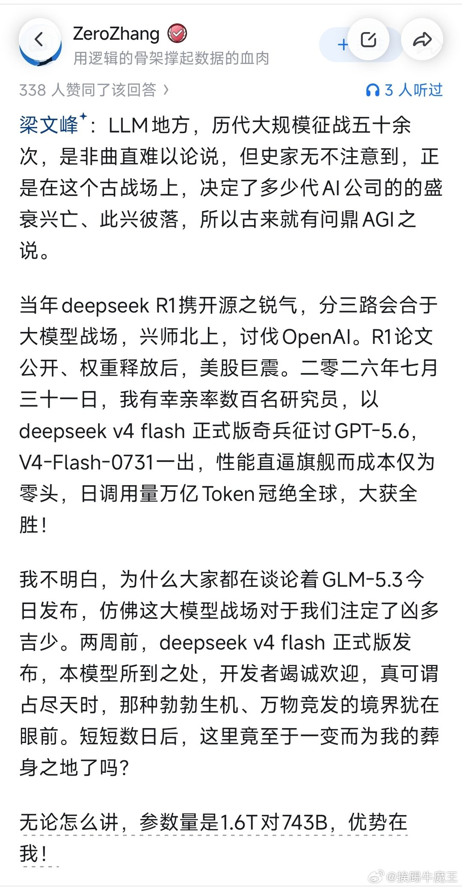

---

## 28

@包容万物恒河水

发表于：2026-08-14 16:22

来源：微博

链接：https://m.weibo.cn/status/5331971551004481

🔻有点离谱了。

🔻从之前的分工上来说，张振熙是特朗普的官方“喷子”主管，协助特朗普制定社交媒体上的骂人部分；

🔻娜塔莉·哈普（图8）则是特朗普频繁活跃于 Truth Social 平台背后的推手，贴身为特朗普服务，是特朗普信息流动的“把关人”，负责整理正面内容、协助社交媒体，并被描述为几乎寸步不离特朗普身边，美国网民讽刺她是“给特朗普换尿布的助手”、“情妇”，是这次被特朗普带上安全飞机的人；

🔻前白宫新闻秘书莱维特负责每日简报会上用粗鲁回答堵住记者的嘴，把新闻发布会变成个人辱骂秀，同时替特朗普向媒体传递“谁不服就骂谁”的信号；

🔻玛戈·马丁（图9）是白宫高级通讯顾问兼特朗普私人手机“刷屏员”，专门为特朗普挑选推文配图、剪辑短视频，并在他发飙时负责“点赞控评”。

\#张振熙或接任白宫新闻秘书\#\#海外新鲜事\#\#热点现场\#

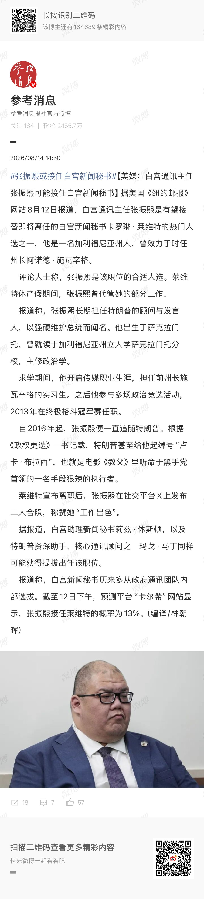

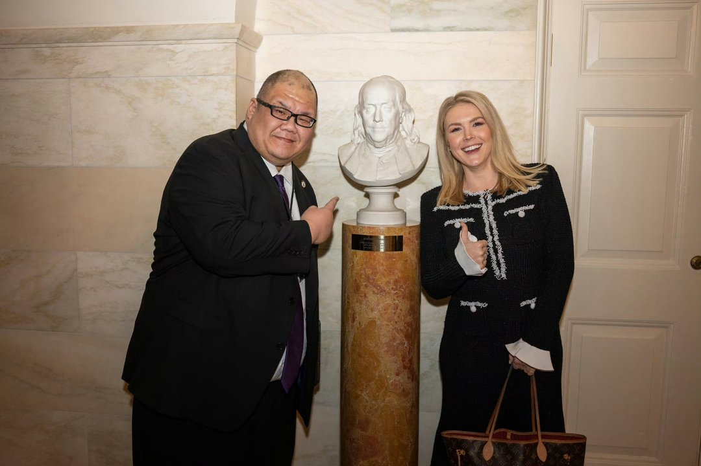

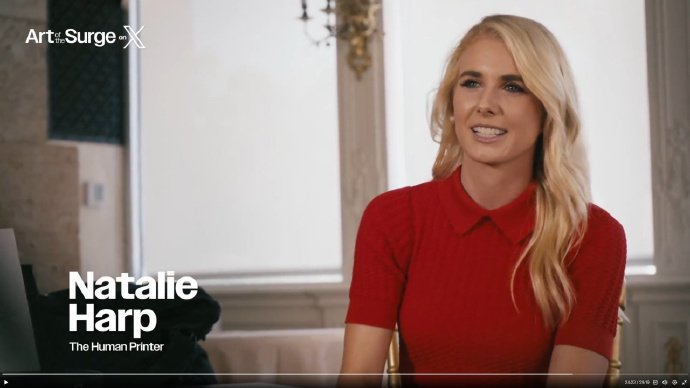

