# 2026-08-16

## 1

@江湖李傅相

发表于：2026-08-10 10:55

来源：微博

链接：https://m.weibo.cn/status/5330439788825546

我承认了，人类对闲鱼的开发程度不足1%

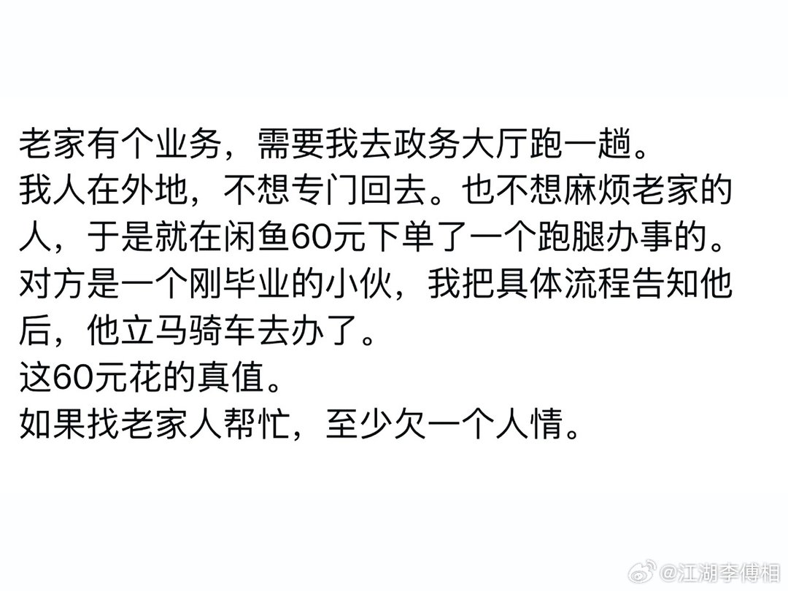

---

## 2

@黑夜之睛滚雪球

发表于：2026-08-15 06:07

来源：微博

链接：https://m.weibo.cn/status/5332179104043740

合肥模式依然是一将功成万骨枯

山东投的基本都打了水花

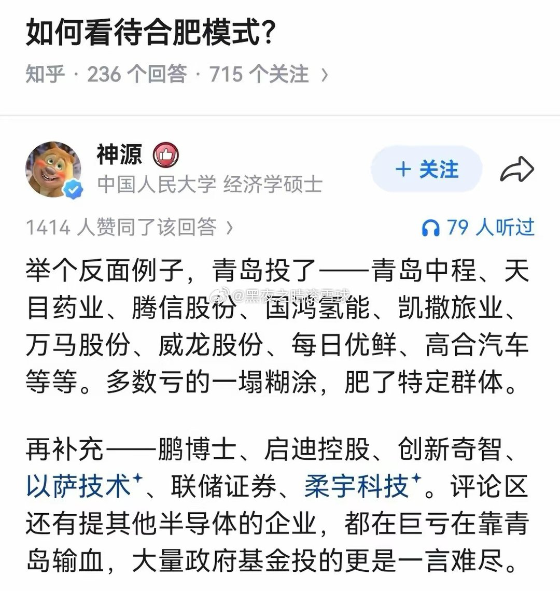

---

## 3

@新智元

发表于：2026-08-15 10:14

来源：微博

链接：https://m.weibo.cn/status/5332241254189247

就在刚刚，Anthropic发了一篇博客。核心信息就是：各位，别再烧冤枉token了，我们都看不下去了！为此，官方详细列举了六条省钱心法，先贴为敬：

1. 任务做完就/clear。修完一个bug就清掉当前对话，别让上一个任务读过的文件和命令输出拖进下一个任务里，白白占着上下文。

2. 开局就定好模型和推理强度（effort level）。中途切换的话，之前积累的提示缓存会全部失效，整段对话历史要按全价重新计算一遍。

3. 用@引用文件，别手打路径。用@直接把文件附到消息里，Claude不用再花一次工具调用去读。如果你只打文件名，Claude可能先搜一圈再打开好几个文件试探，这些操作全部会进入对话历史，之后每一轮都带着。

4. 给输出多的命令加静默参数（quiet flag）。在CLAUDE.md里写一句类似--reporter=dot的配置，让测试输出只打印几行摘要，不是几百行详情。输出越短，占的上下文越少。

5. /compact在休息前做。对话还在缓存里的时候压缩，成本只有正常的十分之一。等你回来缓存过期了再压，就得按全价重新读一遍再压缩。

6. 大输出任务扔给子Agent。子Agent在一个独立的上下文窗口里运行，做完只把结论传回来，过程中读的文件和跑的命令输出不会进入你的主对话。

网页链接

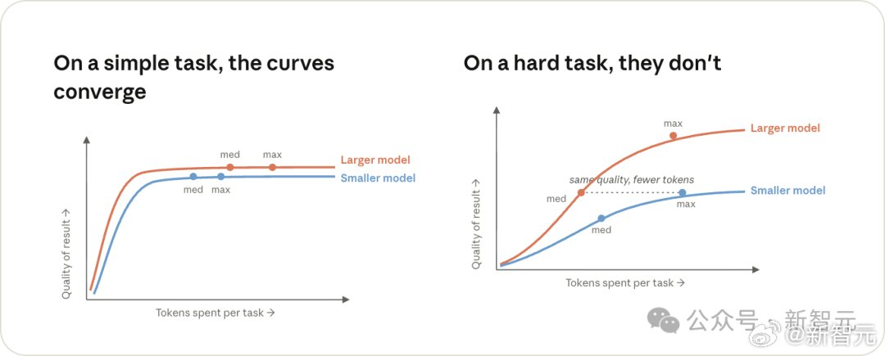

---

## 4

@拓海菌

发表于：2026-08-15 09:46

来源：微博

链接：https://m.weibo.cn/status/5332234234233737

\#牛来\# 我的评分：

牛来影评：★★☆☆☆

刚开始我以为是互联网恶搞，这种画质怎么可能在电影院上映。搜了一下我们这边有一家影院有排片，19.9 元。果断去看看怎么个情况。

到电影院的时候里面已经坐满人了，真的特别夸张，真的是低山臭水遇知音了。大家都买了饮料和零食进来的。

最后一个大哥进来喊了一句，这么多人来吃屎啊。全场大笑，电影正式开始。。

剧情特别正经，但是东北话配音加上这个建模真的特别搞笑，剧情我给一分不能再多了，讲的事情差不多是给小孩子看的。

差不多每三分钟有一个笑点，根本没停过，大家也在讨论剧情，偷录视频，但是在这部片子里一点都没感觉到反感…

整个电影院里面没有一个正常人。

这部电影其实抖音都能追完，没必要去线下看。

但是如果你们附近电影院的场次观众超过一半，你可以去电影院尝试一下。

剧情一个人看特别狗屎无聊，但是一群疯子一起看会特别特别特别有意思，隔壁笑你根本绷不住。

总之我 25 块钱买的是一下午的快乐，片也确实垃圾，多出来的一分是给的氛围，有一群疯子陪你胡闹。

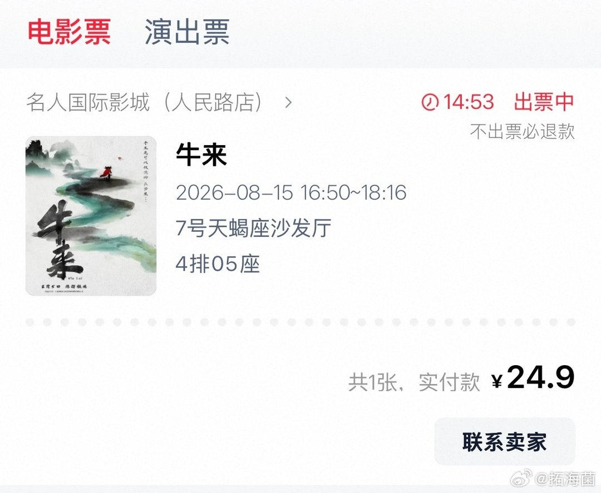

---

## 5

@开水族馆的生物男

发表于：2026-08-14 02:45

来源：微博

链接：https://m.weibo.cn/status/5331766013334463

海太长江隧道快打通了，来探访一下大国重器 南通·中交隧道局海太长江隧道项目部

---

## 6

@陶马文

发表于：2026-08-15 16:44

来源：微博

链接：https://m.weibo.cn/status/5332339531974922

1986年的AI叫做assumption-based truth management system。本质上是一个SMT求解器和一个巨大的命题库。它想要做到的基本上被今天的llm做了，但是它没有llm的规模，llm没有它的形式化水平

---

## 7

@白衣山猫

发表于：2026-08-14 01:19

来源：微博

链接：https://m.weibo.cn/status/5331744396940012

网络上看到一个视频，高铁上广播在找医生。

在好多年前，听到广播，我确实会毫不犹豫地前去。

但是最近，我却一直在思考这个问题，我该不该去？

我这一生中，在火车上遇到广播找医生的事情，有过四次。

第一次是在大学毕业的时候，具体细节已经忘记。

第二次在2015年2月22日，10:40，G46次列车上广播找医生，十号车厢有人生病，急需医生帮助。

我从七号车厢应召前往。我记得这件事情很清楚，因为我在微博上记过这件事。

原来，一个30个月大的孩子发高烧。父母说孩子以前发高烧以后会有高热惊厥。

孩子腋下体温40℃。

腋温40℃！体温再升上去，孩子真的会高热惊厥，甚至有生命危险！

我赶紧让他们给孩子脱衣服。在脱衣服的时候，轮到我目瞪口呆了：孩子穿了2条毛线裤，一条棉裤，一条睡裤共四条裤子，还有3件毛线衣，一件内衣共四件衣服！

而此时，动车内温度22℃。孩子父母只穿了一件衣服！

幸好G46次列车上备有药箱，其中就有儿童用退烧药对乙酰氨基酚栓。

我给孩子脱掉衣服后塞乙酰氨基酚栓

我把药给孩子塞进肛门里后，请列车长拿来了毛巾和温热水，教孩子父母给孩子擦浴。

我先给孩子喝下一杯温盐水，这是很重要的补充血容量的办法。

孩子没有流鼻涕，没有咳嗽，没有咽红咽痛等任何症状。

他父母做梦都没有想到：孩子高烧的原因，就是衣服穿得太多。

他的孩子做梦都没有想到：他的孩子已经发生了“婴幼儿蒙被综合征”，孩子已经在鬼门关走了一趟。

如果没有我在火车上，孩子可能真的会被捂死了。

那天，我一直陪在孩子身边，在我从济南下车的时候，孩子的体温已经降到了38.5℃，那么孩子旅途平安应该没有问题。

我再三交代，让他们到站后，去医院看看，我才放心下车。

这一次的旅途经历，让我身心愉悦，所以我当时在微博上有过记录。

第三次，是在2019年底，在我去杭州的高铁上。

当时也是在广播找人，病人就在我邻近的车厢。

我过去的时候，看到一位青年男病人正躺在过道上，四肢抽搐，口吐白沫，人事不省。

作为一个医生，我看一眼就能够判断，这病人，癫痫发作了。

我当众宣布，我是医学专家，请大家不要慌，听我指挥。

我说，这位病人只是癫痫发作，我们让他躺在地上，摆好体位，保护一下他免受外伤就好。

我拉开了一位给病掐人中的乘客。

我拉开了另一位正在给病人做心脏按压的乘客。

然后我又强调说，就让他躺在那里，过3到5分钟就好了。

可是你知道吗？

这个时候，列车员反复拉我，要我拿出医师资格证给他看。

我说等一下，等我把病人的体位摆好。

可是列车员，还是喋喋不休地，要我拿出医师证来。

列车员这种行为，让我非常难受，但是为了病人，我没理她。

没想到，列车员在一边录我的视频，一边录还一边说：这位乘客说他自己是医生，让我们不需要救这位病人。

这时候我已经很火了。

大概过了4分钟，病人停止了四肢抽搐，恢复了正常，回到了座位上。

没想到，接下来，列车员带着乘警来找我，给我录口供，让我自己手写事情经过，签自己名字，写单位名字。

还让我拿出身份证，车票，他们拍照，我签字。

这个系列冷冰冰的整套程序做下来，感觉自己完全不是在列车上做医生，而是在列车上做了贼被抓了的感觉。

更邪门的事，他们差点耽误我下火车时间。

这是我第一次，在火车上，被列车员用这种方式对待。

当时我非常恼火，下车后我先投诉到上海铁路局。

结果，来回复我的铁路领导人，竟然是我一位多年的好朋友。他说，列车员要登记救人医生的具体信息，基于铁路部门的相关规定。

在他的要求下，我没有就此事发微博。

我和同学们讲起了这件事情，结果我大学同班女同学说，她2019年初，在火车上也碰到过这样的事。她也非常恼火。

我不怕救人，我也不怕承担责任，但我怕不被尊重。我不怕列车员录我救人视频，但我怕有些恶意剪辑！

从那时候起，我的观念开始动摇！

2023年年年初，我又一次坐火车。

又是广播找医生。

我还是过去了，我一眼就能够看出，孩子只是高热惊厥。

还没等我走近，就已经听到了孩子的父亲在高声辱骂列车员：“你们怎么可以没有医学常识呢？你们怎么可以找不到医生呢？你们这些混蛋！我孩子要是有个三长两短，我跟你们没完！”

当然，孩子家长语气凶狠，表情狰狞，着实把我吓倒了。

那一瞬间，我犹豫了，我该不该当众说明我是医生？

我想到了，首先，孩子只是高热惊厥，现在衣服已经脱掉，在火车上能做的事情也就这一点。

其次，火车还有6分钟到杭州东，如果他们觉得有需要，自然会下火车去医院看病。

我又想到了，这6分钟，我根本不够应付列车员对我做笔录记事发经过和签名。

因此，我经过正在发飙的孩子家长身边，慢悠悠地向前走了过去，洗了把手，又回到了自己车厢的座位上。

这是我在火车上最后一次听到广播里找医生，也是唯一一次，没有表明自己医生身份的经历。

事后我反复想，如果当时遇到的这位病人，是心跳骤停这种，是必须马上做心肺复苏急救的病人，我到底该不该出手？

我们知道，在现场没有AED的情况下，心肺复苏抢救心跳骤停的病人，90%以上的概率，要失败，也就是说，病人死的可能性非常大。

那么，一旦病人死亡，我该如何应对这种对列车员态度嚣张的家属？他对列车员那么凶狠，难道会对我客气吗？

我又该如何应对列车员对我做笔录记事发和签名还有拍照留证？

我会不会被人告上法庭要求赔偿？

一想到这一些，我就不寒而栗。

我不怕救人，但我怕救人后，我还得救自己。

实际上，大家想过没有？高铁十分钟就可以到下一站，真正重病人应该让病人就近站下车就医，轻症病人根本没必要找医生。

除非需要心肺复苏之类的急诊，否则，高铁上腹痛之类的病人呼叫医生，都是列车员乱搞。

很多的所谓高铁救人，不管是不是医护人员，更多的是仪式感或者心理安慰作用。

所以我决定，那种仪式感或者心理安慰作用的高铁救助人，我以后，就不去做了，不去表明自己的医生身份了。

徒劳无功的事，多一事不如少一事吧。

如果在火车上真的遇到了需要心肺复苏之类的急诊病人，那即使再麻烦，我也只能出手，谁让我是医生呢？

我不入地狱，谁入地狱？

也许这就是中国大陆医生的宿命吧！ 白衣山猫的微博视频

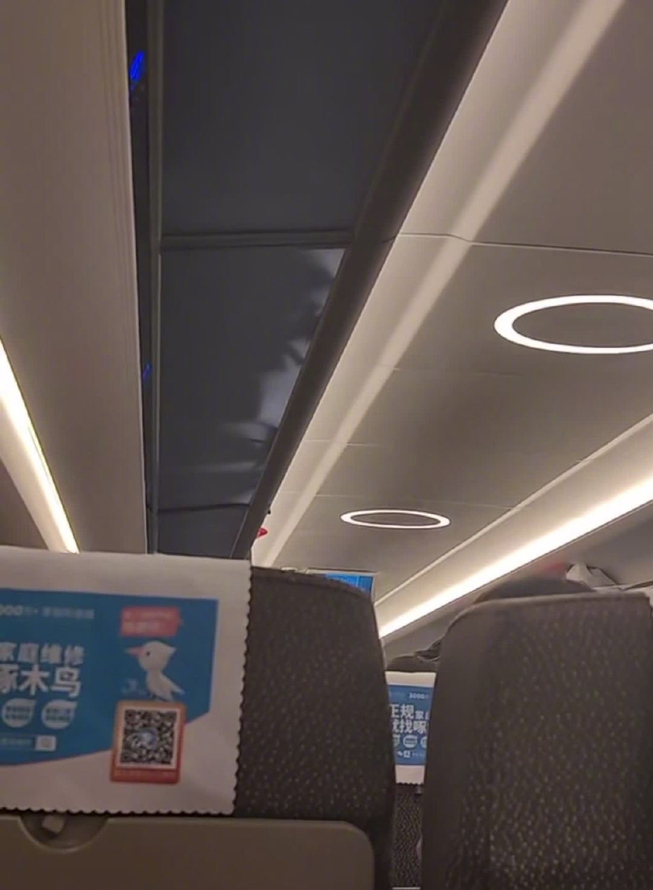

---

## 8

@冬亚

发表于：2026-08-15 09:40

来源：微博

链接：https://m.weibo.cn/status/5332232772255954

正经来写一下 《欢迎来龙餐馆》的评价-～-

看完当天就写了公号推荐大家去看，还抽奖送票，太激动了，太按捺不住了

这两天这片子票房己经开始起飞了，让我们拭目以待，能飞到哪里--~

还是很多人没看，所以我尽量少剧透，尽量不说具体的剧情。

在这个基础上，尽量说明白，为什么这部片子好，为什么值得去看

我一向不喜欢用宏大的，主义性的叙述来切入，也不想金说什么斗争什么局势。

这一点和这部片子的导演挺像，从普通人，普通的生活，普通的日子里切入把故事说好了，观众自己会在脑子里形成宏大的叙事。

我说这部电影好在哪，都是看完以后就记在记事本上的。

所以比较零散，多见谅

1这部电影剧情非常顺畅。

事情和事情之问的逻辑关联很自然。

这是我特别看重的。

以前讲每部电影都会先提这个。

每个角色的行为是情节合理驱动还是编剧硬加硬塞。

龙餐馆里每个主要角色的关键行为和选择，都非常合理。就是你把你自己放进去都会觉得是你，你也会这么做。

这点其实最主要得益于里面许多情节你都可以在真实世界里找到对应的类似事件，当现实联系足够多时，就让人看着觉得相当真实自然。

2 原型

在看的时候一些情节就让我感觉相当熟悉。

沈腾的这个餐厅老板的一些经历和几个真实人物的很接近

其中一个就是写过在死神脚下揾钱的陈宪忠。

大家可以搜来看下。

美军那个会说中文会想家哭鼻子会说他们每个人都是恐怖分子的ABC也有相似人物。

老扎，这个悲情人物，更是当地许多人的人生缩影，哪怕不看当时，你看看现在的加沙，你也能理解。

真实感，更容易让人融入到电影里去。

3 一场战争PTSD如何形成的亲身实感。

这让我在亮灯后还没缓过来，坐了五分钟才走。

真实的战乱世界里，没有救世主，没有天降奇迹，没有主要角色死前还硬要加进去的剧情跌宕和突然反转、只有无处不在的危险和脆弱无比的生命。

这是你的挚友，这是你的亲人

嘣，一枪，没了就是没了。

只有绝望无助，悲不能言的你自己。

天天都在这样的环境里。

一个接着一个身边突然死去的人。

因为前面说的融入感很强，所以即使作为观众，在情感上也受到了极大冲击。

那么，现实里就经历过这些的人呢？

这就是应激创伤的成因了。

4 一年战争启示录默世录和苏州畸形繁荣

前者是高达系列的剧集

后者是一本学术书籍

这两个都曾是我在微博给大家推荐过的。

前者和这部电影是类似的

以一个普通人的视角进入一场宏大的战争。

让你看到被那些英雄人物，大场面遮住的芸芸众生是如何在一个纷乱的时代里苟延残喘。

后者则是龙餐馆里夜夜笙歌，美国大兵们挥霍无度的历史图鉴。

中国经历过同样的伤痛，中国人更会有更深的感触。

5 舌尖上的中国同款制作

这片子里美食只是一根贯穿的线并不是叙事主体。

但里面做菜的片段拍的太好看了

而且充满着舌尖上的中国的感觉

甚至让我感觉，在制作上是不是就是有舌尖上的中国团队里的人直接操刀的

真的，你去看就知道，拍出来的味道太像了。

每一次出现都很好的缓和了当时情节的紧张和悲伤

6 什么都比不上回家。

整部电影最让我心里安稳的

是沈腾在国内的机场里见到了妈妈和女儿。

在之前那么久的颠沛流离，命悬一线后。

看到熟悉的国内机场，人一下就觉得放松了。

到这里，不会有危险了，可以安稳过日子了，不会再有那些了。

这是因为我们都清楚知道，这里有能够隔绝外部威胁，不会动乱，不会提心吊胆。

在外面经历过那些，才会更加知道和平和稳定的重要

最后，希望大家每天都能好好吃饭一～~

\#电影欢迎来龙餐馆\#

---

## 9

@sven_shi

发表于：2026-08-15 15:31

来源：微博

链接：https://m.weibo.cn/status/5332321240356477

关于前段时间这个“小三胚胎”案，我V+群里很多网友在问，他们看不懂这么一个案子为什么会有300多个热搜。整体上这个案子涉及的其实是一个政策争议。就是明年是不是要放开医疗服务的婚姻限制。像冻卵试管这些医疗服务，要不要结婚证做前提条件。

而回到这个案子本身，其实是媒体上一些人为了宣传效应，把整个案子剪碎掉了，导致大家看不懂，做了很多无效的讨论。

首先我从女方的诉求讲起。女方关于胚胎其实有两个诉求，第一是销毁她丈夫和小三的胚胎，不让丈夫和小三生育。第二是让她丈夫回来，和她再做一个胚胎，生个孩子，他们继续养。这个诉求你粗看奇葩，毕竟女方已经有了一个18岁考上一本的女儿，而且自己40多岁还有癌症，要逼着她老公回来和她生孩子，实在是有点太过夸张。

但是背后的原因其实很无奈，因为她老公太聪明了，把钱都握在自己手里了。

一般的网友受到宣传影响，会误以为法院系统在离婚案中无所不能，女方遇到离婚拿着丈夫出轨的证据，就能让丈夫少分或者不分财产。但是这个案子里面男方是把所有的财产通过各种模式牢牢的控制在了自己手里。女方连怎么起诉分钱都搞不定。

简单来说，她知道丈夫手里有2000万，可以起诉要起码1000万；知道有1个亿，能起诉要5000万。可是她连丈夫手里有多少钱都不知道，她又能怎么开价呢？

所以女方这边的诉求就只能是坚持不离婚，然后希望男方能和她再生个孩子，把钱锁定在她的后代那里。

这笔帐讲粗俗点，你一听就能明白。假设她丈夫手里有一笔钱，她一个女儿，另外小三生了个儿子，她丈夫钱就可能给小三的儿子。而她要是有个女儿再有个儿子，她丈夫钱未来大概率就能都给她的孩子。

而她丈夫，也就是这个案件里面的男方，是个聪明的渣男，而且很明显喜欢把主动权掌握在自己手里让别人当木偶。所以这个案子其实是不适合当作焦点案例宣传的，因为很容易产生模仿效应。

简单说，他就是把“资产”全都握在自己的手里，身边的人只给钱消费。他老婆得癌症，女儿读书，该给的钱他确实全给了，这方面没必要冤枉他。但是他对自己的资产信息瞒的很死，身边人都只知道他很有钱，给钱很大方，但是有多少资产都不知道。

人家图谋的都是他的资产，但是他就是不给。他和小三所谓的做胚胎，也是缓兵之计。吊着这个小三。真要做，国内有的是中介让他去海外做。真愿意做的像徐波，一百个孩子都有了。怎么可能还需要在国内做限制那么多的试管方案呢？

这种男的是现代司法上最讨厌的一群人，很难搞。我之前做丁克不领证群体的同居析产案例时，就遇到了一群这样的案例。就是我国04年取消非法同居之后，出现了一批丁克群体，就同居不领结婚证。到了差不多最近10年，集体性的出问题。基本上都是女方中年陷入经济危机，找男方要钱，男方一毛不拔，女方就去起诉搞同居析产。

法院基本都是帮女方去要钱，判决书里各种要钱的理由写的千奇百怪，拿出来基本都是司法笑话。之前各种案例我都写过，大家自己去我之前微博找就行。

为什么？

因为这些男的很多是受过非常良好甚至可以说是顶尖教育的。法官怎么调解，他就是坚决不提供自己的财产情况。女方这边搞不清楚他有多少钱，就只能根据能查到的不动产去要账。有些女孩子花钱查到了男方的银行账户，有些男的硬到当着法官的面把银行账户的钱转给他父母，就说这笔钱是他朝父母借的。他都没领结婚证，就不存在转移夫妻共同财产。没钱，你怎么执行？

所以新闻里类似这种男的报导都很少，但是未来不可避免的会越来越多。

---

## 10

@嗖就热了

发表于：2026-08-13 09:01

来源：微博

链接：https://m.weibo.cn/status/5331498304536785

\#龙餐馆你不知道的细节\#

妈呀，《龙餐馆》这剧本写得太用心了，有网友整理出了影片中的细节和隐喻，想不到编剧和导演在里面埋了这么多隐线，只有好电影才经得起观众们的深挖，也只有好电影才能越挖越有料，看完这些细节解读，再去二刷三刷电影，一定会更懂主创想要传递的内容，赶紧马克起来，大家也在评论区分享一下自己不同的解读！！！

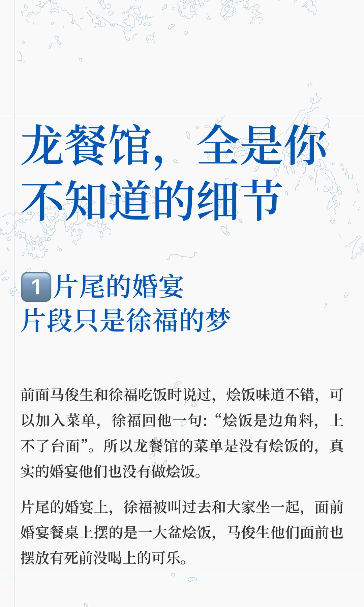

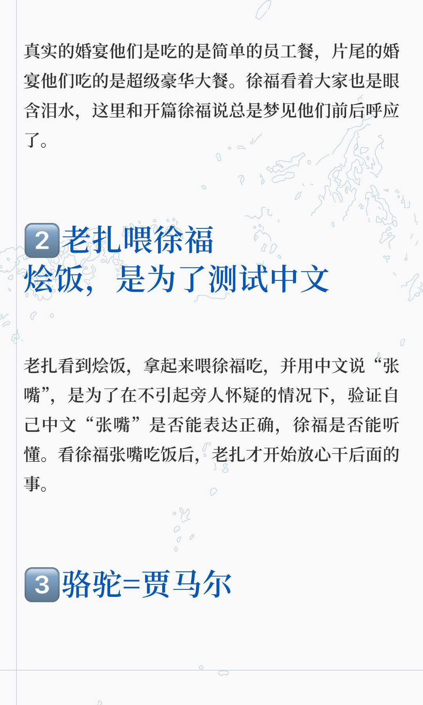

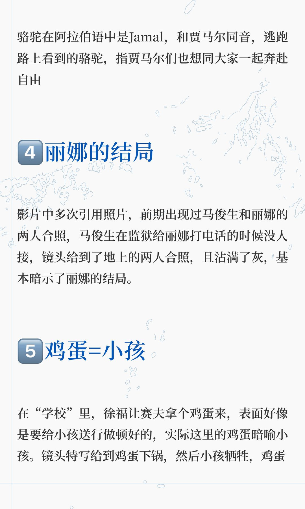

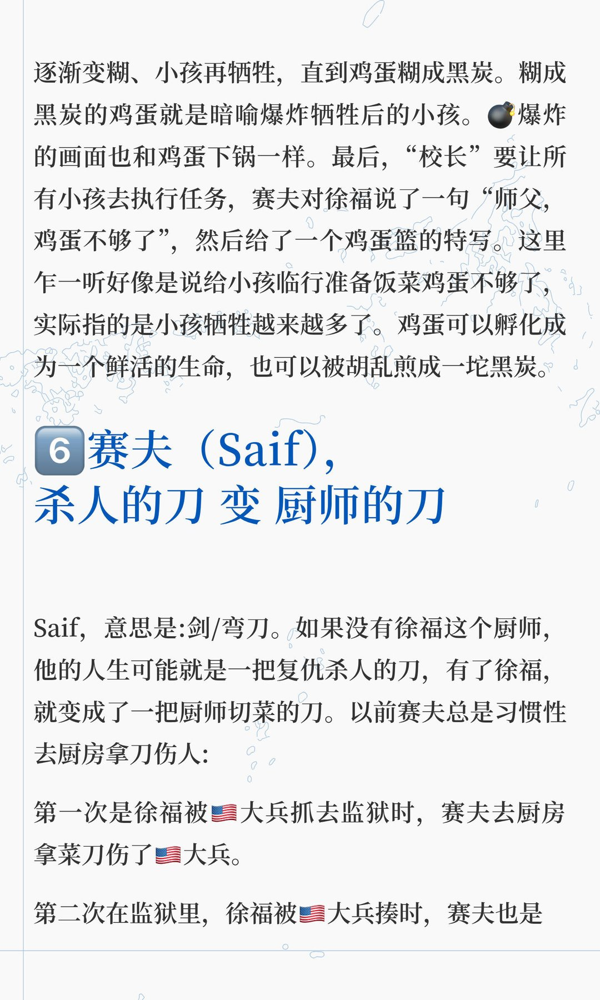

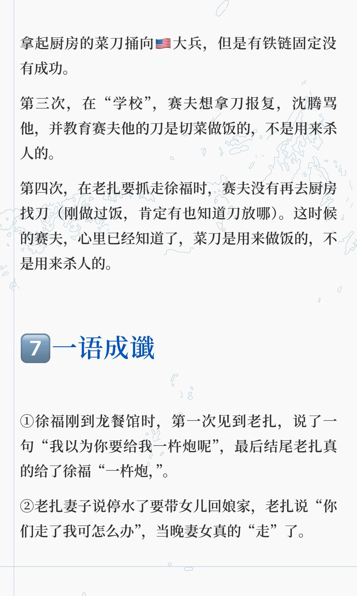

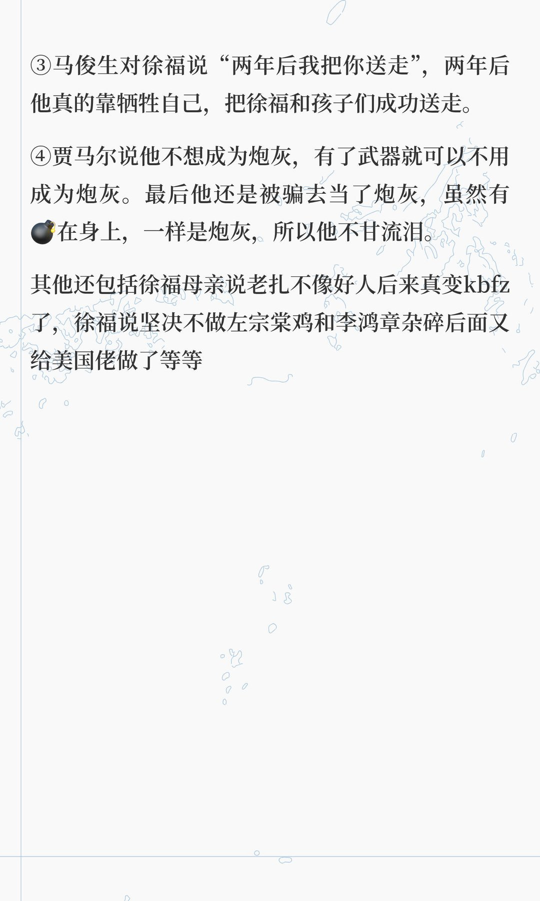

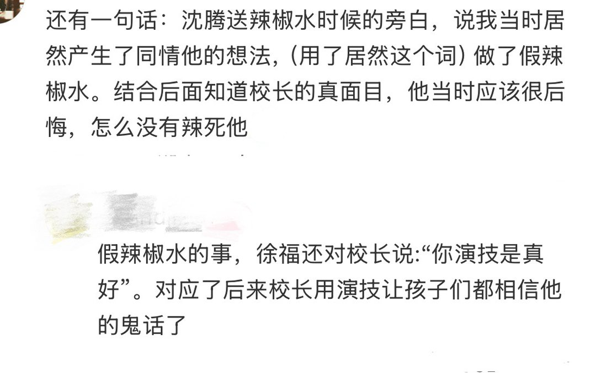

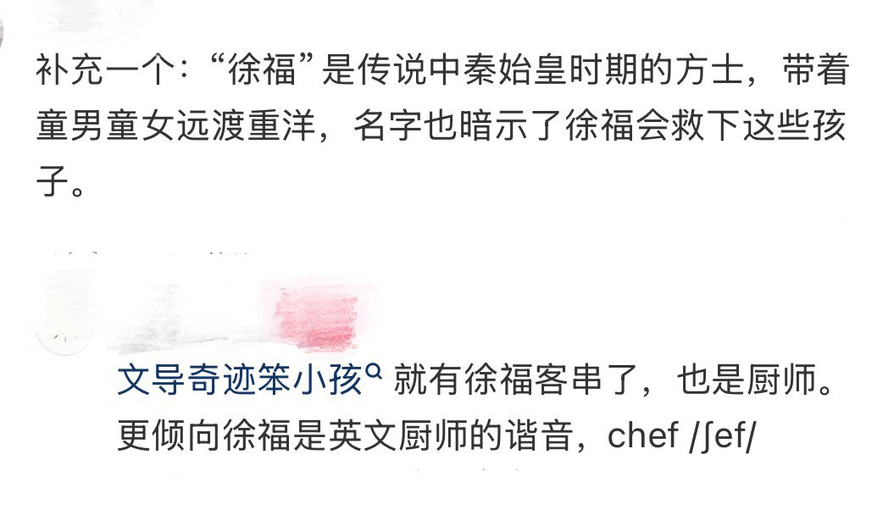

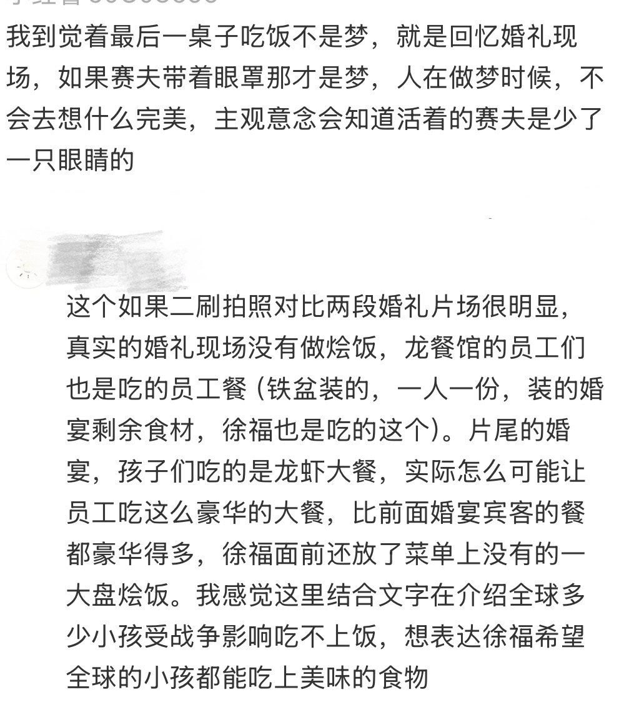

---

## 11

@奶牛Denny

发表于：2026-08-15 03:58

来源：微博

链接：https://m.weibo.cn/status/5332146605785975

今天深入讲一下刷手机具体是怎样影响你的大脑的。

当你整天刷手机时，它不只是让眼睛疲劳，它是会直接扰乱你大脑里控制专注和情绪的化学物质。

每次你滚动、点击或滑动时，你的大脑都会释放一小股多巴胺，让你想要继续刷下一条内容、找下一个刺激点。然后更新的内容会一次又一次用多巴胺淹没你的大脑。这会让你的大脑渴望快速轻松的奖励。

关于具体怎么系统化管理多巴胺，让它为你所用，我在超体里专门有一章内容分享。

你可以先记住的就是，每次刷手机，你都是在训练你的大脑，让它更难专注于费力的任务，比如深度阅读、深度工作、解决复杂问题，因为这些动作不会给你同样的即时回报。

与此同时，刷手机也会扰乱另一种激素，催产素——它和与他人产生连接的感觉有关。

刷手机不会像现实生活中的社交互动那样提升催产素，刷到别人光鲜亮丽的生活照片、同龄人融资上市赚大钱的新闻，这些都倾向于让你感到焦虑或者觉得自己不够好。

通常来说，你花越多时间在网上和别人比较，你的底层状态就可能变得越糟。

同时，刷手机的高频内容变化，会持续刺激你的大脑，消耗大量不必要的能量，导致心理疲劳。

所以为了保持大脑健康，一定要花时间做一些线下活动，自然地提升催产素，比如锻炼或和朋友一起出去玩，给你的大脑一个重置的机会。

你会感觉更专注，压力更小，也和你周围的世界更有连接。

---

## 12

@卢克文

发表于：2026-08-15 21:30

来源：微博

链接：https://m.weibo.cn/status/5332411474772205

男人在二十多岁时常干这种事，自己感动自己，到35岁以后就知道自己纯傻逼。

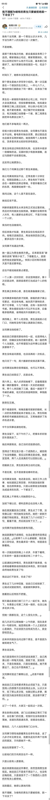

