# 2026-08-20

## 1

@V闪闪

发表于：2026-08-18 07:22

来源：微博

链接：https://m.weibo.cn/status/5333285331009903

好像很多博主都用AI尝试复刻\#牛来\# ，结果都失败了，做的不像，确实，当前AI技术生成不出来\#牛来\# 这样纯粹手搓建模的粗糙程度。这也间接说明人家母子二人在影片制作方面确实没搞任何欺诈观众的行为，就是技术水平不行，这种真诚也是离奇，成为了奇观。 \#牛来\# 到今天为止是完全市场化行为，最具哈耶克定义的市场自发形成的规模效应。

---

## 2

@V闪闪

发表于：2026-08-18 23:34

来源：微博

链接：https://m.weibo.cn/status/5333529934168108

\#牛来\# 人类社会模版的又一案例，只要你在社会上成功了，自有大儒为你辩经，所以\#牛来 入关学\# 已经来了，就像当人类发明照相机后，写实绘画退出主流、抽象艺术开始盛行，AI开启随意都可以唾手可得的精细影像视频体验后，人类开始追求最质朴的粗糙手搓影像………

其他平台上已经有艺术高校的老师给牛来辩经了，说这是AI精细影像泛滥时代，开启人类新数字艺术的开山之作，堪比19世纪人类第一次发明电影，重构人类审美观念，这次是中国人影响全人类的未来先锋审美，牛来已经开宗立派，会被载入人类艺术史册，今后全世界各地的艺术家会争相模仿……牛来让中国人在21世纪开始引导人类先锋艺术之路，人类社会发生工业革命的200多年后，西方艺术终于要追随中国引领的全球时艺术与尚风潮………

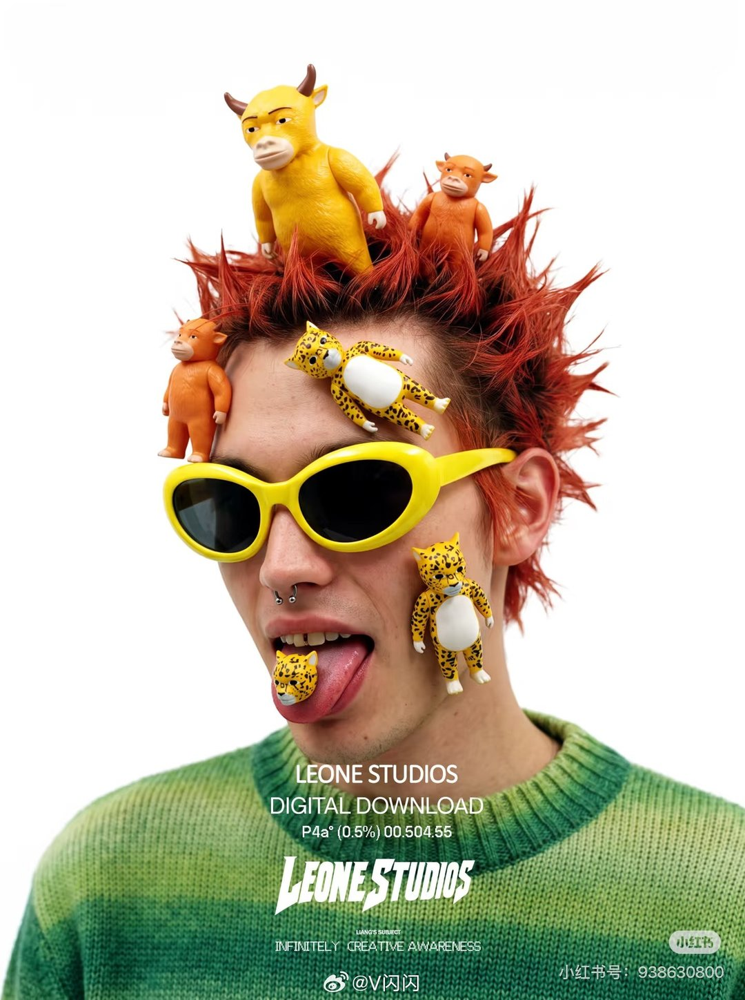

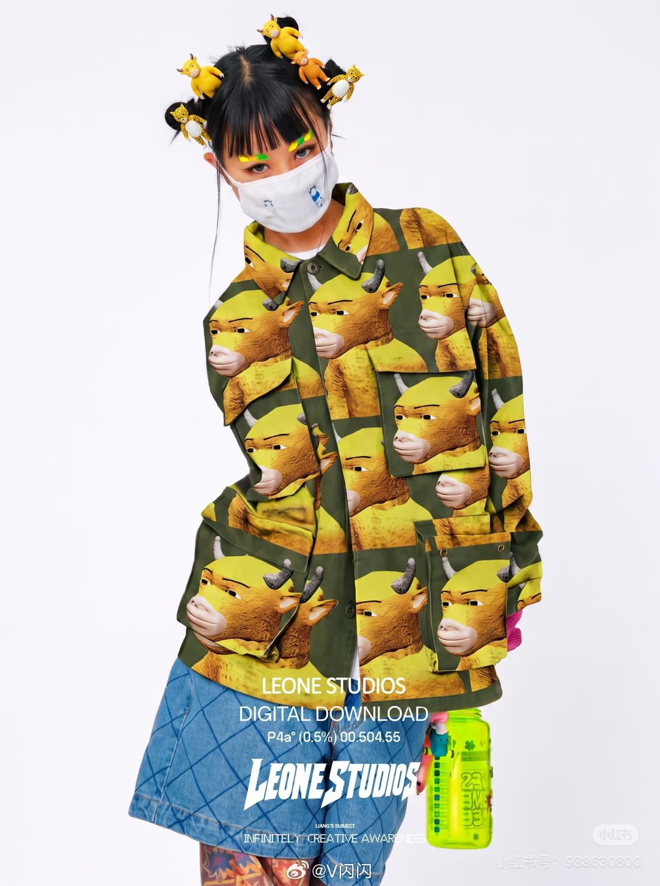

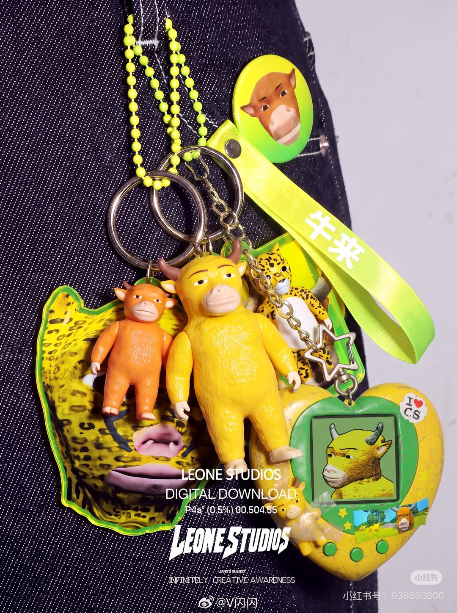

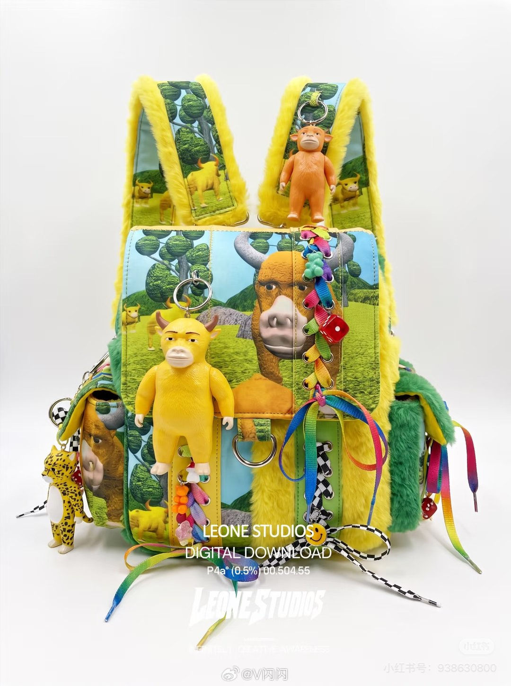

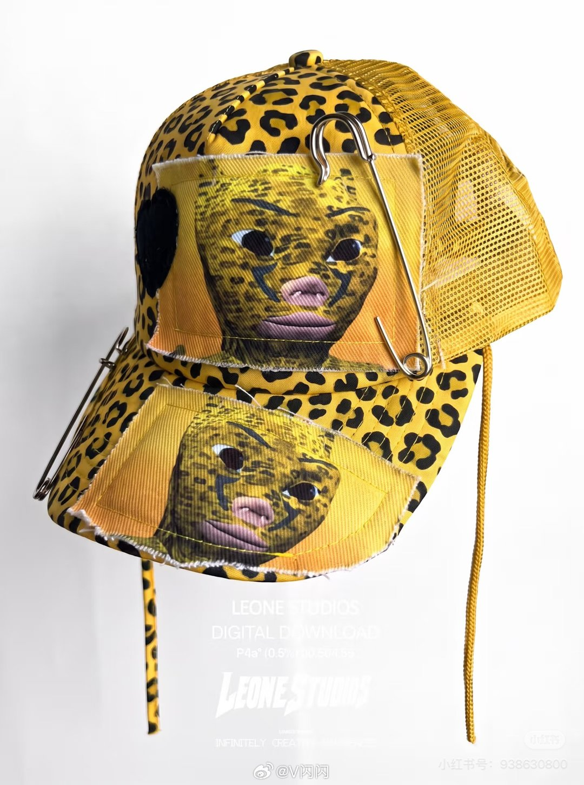

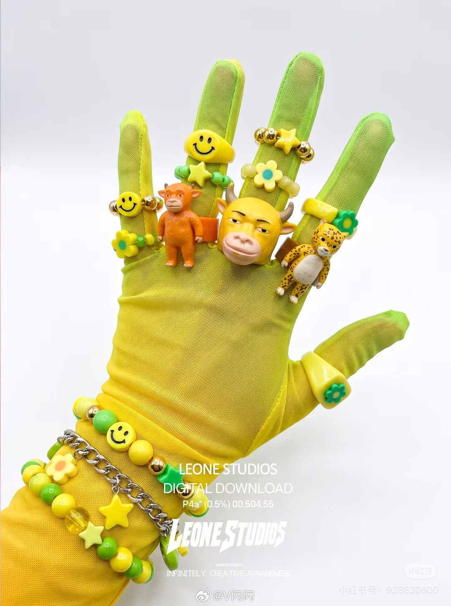

---

## 3

@宝玉xp

发表于：2026-08-18 14:11

来源：微博

链接：https://m.weibo.cn/status/5333388271026394

一直有一种观点，就是小模型加 Harness，就能达到大模型的智能效果：

> 只需要一个 10 亿参数的小模型作为“认知核心”，其余能力靠联网搜索、执行代码等工具补齐就够了。

Jason Wei （思维链提示技术的核心作者之一）的新推文，反驳了“小模型+工具”路线，认为光靠工具，撑不起顶级智能，把知识“内化在大脑”和“现查现用”是两回事

小模型+工具就能行的观点之所以流行，因为理论上确实说得通：模型不知道的冷门知识，可以上网查；不会算的题，可以调用代码。小模型加工具，似乎没有做不到的事。而小模型意味着更低的算力成本，对整个行业都很有吸引力。

他用自己学羽毛球打了个比方。教练教的每个动作他都能做出来，但要在实战中流畅串联，跟练了上万次形成肌肉记忆的人完全不是一个级别。语言模型也一样，内化了知识的大模型和靠工具临时检索的小模型，体验差距很明显。

具体来说有三点。第一是速度，直接给出答案远比调用工具搜一圈再回答快得多。第二是理解的深度，比如你问一个音乐节的口碑如何，大模型能基于海量数据给出综合判断，而小模型只能搬运搜索结果里排在前面的几条评论。第三是可靠性，每次都要重新查资料、重新推导，出错的概率更高，在复杂的长任务中错误还会层层累积。

回顾“苦涩的教训”（Bitter Lesson）里面的观点：历史反复证明，靠扩大规模获得的能力提升，总是胜过精巧的工程设计。工具让小模型能做更多事，但追求最高质量的用户，始终会需要更大的模型。

x.com/_jasonwei/status/2089429555371024577

---- 原推转译 ----

工具调用无法取代更大的语言模型

语言模型刚开始能够熟练使用工具时，我很认同一种说法：我们不需要继续扩大语言模型的规模，只需要一个足够强大的「认知核心」——比如拥有 10 亿参数——其余一切都可以通过工具调用来完成，例如浏览互联网或执行代码。我想，当时很多人都认同这个观点。确实，我们很难找出一项有意义的任务，是一个能够充分使用工具的 10 亿参数模型在理论上无法完成的。例如，大语言模型知道的任何冷门事实，原则上都可以从互联网上检索出来，再交给一个 10 亿参数的语言模型进行推理。

但现在，我认为这个观点完全错了，原因很简单：不依赖工具也能快速、自然地完成任务，这件事非常重要。

真正让我理解这一点的，是我今年学习羽毛球的亲身经历。打羽毛球时，我就很像一个「10 亿参数的认知核心」。教练教我的每一种击球动作，从身体能力上说我都做得出来，但我要在脑中记住每个动作要领，再把它们组合到一起，需要付出很大努力。练习时，我几乎可以完美地完成一次击球；可一旦进入连续的对打，我就很难做到，在比赛中更不可能稳定发挥。这显然不同于那些把一个动作练习过上万次、已经能凭本能轻松完成的人。

同样，语言模型无需调用工具、直接在内部掌握一个事实，是有实际意义的。第一，我们显然很在意速度。相比让模型长时间思考以确认答案，或者再去浏览网页，你当然更希望立刻得到回答。第二，有些东西就是更适合通过大量数据上的反向传播来学习。假如你问大家通常怎么看 Shambhala 音乐节，你会更希望大语言模型根据互联网上的全部数据给出一种综合意见，而不是复述网页搜索排在最前面的三条评论。第三，费很大力气寻找答案，可靠性不如一开始就知道答案。理论上未必一定如此，但至少目前在实践中很可能就是这样。如果每次都要重新查找事实，或者重新做一遍数学推导，出错的概率就会更高；在长周期任务中，这些错误还可能不断累积。

一旦你认同「不使用工具、直接依靠模型参数完成任务」具有价值，就必须承认：一个 10 亿参数的认知核心远远不够。10 亿参数的模型能够内化多少知识，存在信息容量上限，而我们肯定希望 AI 知道得更多。即使 1 万亿参数，可能也仍然不够。我们会希望 AI 尽可能了解我们的世界，希望它不断吸收新信息；同时，我们对 AI 能为自己做什么的期待也会持续提高。

简而言之，工具调用可以让小模型完成更多事情，但那些追求最高质量智能的人，始终会想要更大的模型。「苦涩的教训」（Bitter Lesson）再次应验了。

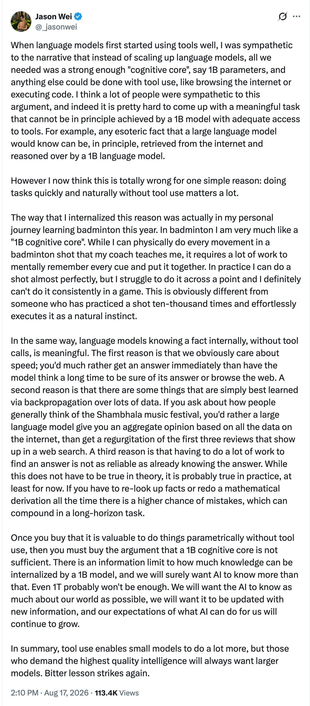

---

## 4

@少年伯爵

发表于：2026-08-18 15:59

来源：微博

链接：https://m.weibo.cn/status/5333415324816381

AI烧一百亿张显卡都想不明白，人类咋就这么氯化钠呢？碳基世界太颠了，终于明白为啥大A不可预测了，2.6亿个颠佬谷民一起随机路匹，海森堡看了都得懵，觉得还是回去研究湍流更靠谱。//@宇宙的TT-:？//@少述派:还有谁，有统战价值的电影，值得金鸡奖提名。//@西窗随记:目瞪口呆//@导筒directube:从我们小🍠评论区看到还有日本飞来的： 查看图片

---

## 5

@舞水之扬

发表于：2026-08-18 12:07

来源：微博

链接：https://m.weibo.cn/status/5333357066193365

河南传统民居的剖面

---

## 6

@幻想狂劉先生

发表于：2026-08-18 16:55

来源：微博

链接：https://m.weibo.cn/status/5333429482947208

舞蹈最初的主要职能之一不是娱乐，也不是艺术，而是在祭祀中娱神（还有求偶）。“巫”和“舞”在原始社会里是密不可分的，他们之间的初始关系仍能在非洲、南美的一些部落中观测到。所以对古代民族来说，宗教祛魅越早，程度越高，“能歌善舞”的人在社会中地位越低。华夏族群在轴心时代就接受“近鬼神而远之”的古典理性主义启蒙了，通俗的讲就是在宗教心理这一块比较早熟。“巫”的地位低，巫的行为也不可能高。能歌善舞之人还没来得及转型成“艺术家”，社会地位已经跌落到下九流了。这一点可以用非洲和南美的许多“晚熟民族”和“催熟民族”和华夏族群作个比较，就一切明了了。

---

## 7

@AIGC·非著名程序员

发表于：2026-08-18 13:57

来源：微博

链接：https://m.weibo.cn/status/5333384585022226

王莆中这段反思，是我今年看到的大厂高管里最诚实的 AI 落地复盘。

「全员养虾运动」这个比喻太精准了。每日消耗上千万元，账单暴涨，养虾产生的谬误还干扰了真实经营。翻译一下就是：全公司上下都在玩 AI，但没人知道玩出来的东西到底有没有用，甚至玩的过程本身就在制造混乱。

这其实是过去一年很多公司的真实写照，只不过大多数人不敢说。

他总结的「四重错配」很值得细品：

认知上，对 AI 要么夸大要么轻视。效率上，大模型只用在日常事务，没碰核心业务。场景上，AI 在边缘游走，没融入经营核心。考核上，追求立竿见影却忽视组织适配。

这四条叠在一起，结果就是投入难以转化为可测量的生产力增长。钱花了，人忙了，但数字没变。

最有意思的是他得出的关键认知：AI 转型不是技术问题，是业务、组织、技术三位一体的系统性工程。

这句话听起来像正确的废话，但放在「全员养虾」的语境下就不一样了。它背后的潜台词是：过去我们把 AI 当成一个技术工具往组织里塞，以为买了模型、开了接口、让大家用起来就行了。但组织没准备好，业务场景没想清楚，考核方式没跟上，结果就是一场昂贵的集体表演。

美团用赛马机制梳理，最后得出这个结论，说明他们确实走了弯路才想明白。

对其他公司的启示也很明确：别急着搞全员运动。先想清楚 AI 到底要解决什么业务问题，再想组织怎么配合，最后才是技术选型。顺序反了，就是养虾。

不过话说回来，能在 7 月就跑通产品流程并产生价值，说明美团的纠错速度还是很快的。从 2 月到 7 月，五个月走完认知弯路并开始产出，这个节奏在大厂里算相当不错了。

真正可怕的不是走弯路，是走了弯路还不承认，继续用 PPT 和融资维持幻觉。王莆中愿意公开说「我们搞砸了前面几个月」，这本身就是一种组织能力。

\#全员养虾 反思\#\#科技先锋官\#\#How I AI\#

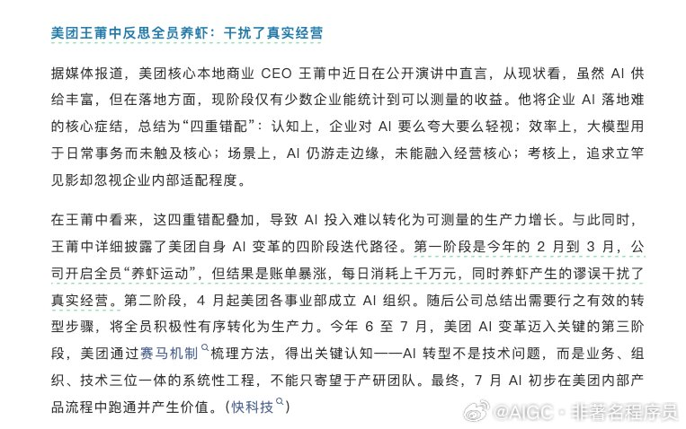

---

## 8

@史真香911

发表于：2026-08-18 12:37

来源：微博

链接：https://m.weibo.cn/status/5333364496143587

眼下的乌克兰，已经站到了最危险的悬崖边。莫斯科方向传来的信号越来越清晰，俄罗斯动用核武器解决问题的概率正在飙升。不为别的，只因那座横亘了数十年的核武禁忌，已经被人一脚踩碎。如果继续隐忍不发，普京将无法向翘首以盼的俄罗斯民众做出交代。 

这道底线的崩裂，发生在2024年深秋。那年十一月十七日，美国媒体率先披露，拜登政府已悄悄为乌克兰使用远程导弹攻击俄罗斯本土开放了绿灯。仅仅两天之后的清晨，布良斯克州卡拉切夫镇附近的俄军大型军火库便遭遇了精准打击，六枚美制ATACMS战术导弹拖着尾焰划破晨雾，将整片库区化为火海。 

俄罗斯国防部在当天证实了这次袭击，并首次用上了“西方直接参战”的字眼。从那一刻起，克里姆林宫三令五申的红线被人彻底踏破，而那个一直被锁在抽屉里的选项，忽然就变得无比真实。 

俄罗斯的愤怒几乎立刻体现在了法律文本上，袭击发生的同一天，普京紧急签署了更新版的《俄罗斯联邦核威慑国家基本政策》。文件里清清楚楚写着，任何无核国家在有核国家的参与或支持下对俄罗斯及其盟国发动侵略，都将被视为对俄罗斯的联合攻击。 

字面上看，这仅仅是外交辞令的重新编排，可是对于熟悉俄国政治语言的人来说，这就是把核按钮的保险盖掀开了一半。不到四十八小时，俄军又向乌克兰第聂伯罗市发射了代号为“榛树”的新型中程高超音速导弹，虽然没有装载核弹头，但那种能在大气层中以十倍音速机动变轨的武器，本身就是一座可以随时塞进核装药的运载平台。 

普京随后出现在电视镜头前，语气平静，说出的内容却让欧洲打了个寒颤：“我们有权对那些允许本国武器用于攻击我们设施的国家的军事目标动用我们的武器。” 

消息传回俄罗斯国内，最先躁动起来的并不是政府要员，而是那些坐拥百万粉丝的前线记者和军事博主。他们在电报频道里用粗粝的语言质问：为什么西方一次次踩上脸来，我们还要抱着核武器当花瓶？ 

国家杜马国防委员会的高层也在公开场合放话，如果国家存亡受到威胁，核反击绝不会是理论上的空谈。这股声音来得汹涌，几乎没有留给克里姆林宫任何回旋余地。普京很清楚，他维持了几十年的硬汉形象，此刻正被架在火炉上烤。 

对许多俄罗斯民众而言，战争已经打了这么久，承受的代价如此之大，如果最后连动用终极手段捍卫领土的勇气都没有，那这场“特别军事行动”就彻底失去了说服力。 

而从战场态势来看，不用核武器，确实越来越难打，乌克兰的无人机已经能够定期深入到俄罗斯腹地，萨拉托夫州的战略轰炸机基地、梁赞的炼油厂甚至喀山的军工园区，都曾冒出冲天的浓烟。 

这些打击单次看并不致命，可一次次累积下来，正在像钝刀子割肉一样磨损着俄罗斯的战争潜力与民心士气。单靠传统的火炮对轰、步兵冲锋，根本没办法从根本上瘫痪乌克兰源源不断获得的西方情报与远程火力。 

要想在最短时间内制造一个让北约望而却步、让乌克兰军政体系彻底崩解的局面，战术核武器成了一个绕不开的数学模型。即便只是进行一次高空引爆，用电磁脉冲瘫痪整个战区的通信与雷达，或者在某处兵力集结点展示性的投下一颗小型核弹，都足以改写整个冲突的走向。 

克里姆林宫内部并非没有顾虑，只是当外部羞辱和内部民粹两股力量拧在一起时，理性常常要让位于生存本能。普京所面临的，已经不是简单的外交博弈，而是一道向谁交代的难题。向西方妥协，就会被国内视为叛徒，继续僵持，国力可能被缓慢放血直到枯竭。 

在这种困局里，动用核武器反而成了最能自圆其说的选择，它可以被包装成一次“迫不得已的卫国壮举”，是对北约无休止拱火的最终答复。那些曾经叫嚣着“可以打到最后一个乌克兰人”的西方政客，一旦真正闻到核尘埃的味道，恐怕会比谁都先退缩。这种赌局上的心理推演，恰恰是莫斯科眼下最倚重的底牌。 

国际原子能机构和各大情报部门其实都已经监测到了异常，俄罗斯南部军区的战术核武器存储设施出现了反常的调动，一些负责核弹头维护的技术小队被拍到了从前线驻地进出的照片。 

虽然这些信号还不能等同于发射倒计时已经启动，但就像当年古巴导弹危机时的交锋一样，细微的异动背后往往藏着山崩地裂般的决断。美英情报分析师在闭门会议上反复推演，得出的结论惊人一致：俄罗斯在乌克兰使用小型核武器的可能性，已经升至冷战结束以来的最高点。 

乌克兰的土地上，很多老百姓也开始私下里囤积碘片和寻找掩体，他们嘴上不说恐惧，心里却比谁都明白，一旦那个禁忌被打破，最先被付之一炬的就是脚下的城市和村庄。 

而这恰恰是那场始于2024年十一月的远程打击所埋下的最残酷的因果，西方的武器穿透了俄罗斯的边境，却也捅破了一层保护了这个世界七十多年的薄薄的窗户纸。如今，寒风里飘散的不止是硝烟，还有核禁忌碎裂后掉下来的碎渣，所有人都在盯着克里姆林宫的那根手指。\#历史\#

---

## 9

@高飞

发表于：2026-08-18 10:24

来源：微博

链接：https://m.weibo.cn/status/5333331043682797

\#模型时代\# 硅谷创始人传播专家：传统PR手段已死。以及Eric Schmidt的AI毕业演讲为什么被学生群嘲。

继续发一个软技能的播客笔记。来自Lulu Cheng Meservey是Rostra创始人，硅谷最受信任的创始人传播顾问之一。她的客户名单包括Anduril（美国国防科技公司）、Shopify、Cognition（开发了AI软件工程师Devin的AI公司）、Coinbase等十余家公司，等待名单上还有数百家。2024年3月，她发布了《Go Direct宣言》，宣告传统PR已死，创始人必须亲自掌控叙事。2025年底，她又募集了一支4000万美元的风险基金，投资她看好的创始人。她同时是Shopify董事会成员。

Lulu系统性地拆解了她从反叛乱理论中提炼出的创始人传播方法论。播客发布后，她在X上转发了其中一个片段，引用了爱默生的话：“Imitation is suicide”。不过，理解她的看法，可能需要站在美国社会传播语境下，如果不清楚一些背景，可以检索一下。

一、传统PR已死：Go Direct背后的三层判断

Lulu的方法论建立在一个前提之上：技术存在和技术产生影响之间，有一道巨大的鸿沟。“If you build it， they will come”这句话在商业界几乎是格言，但Lulu指出它其实来自电影Field of Dreams，中文片名《梦幻之地》，讲的是一座棒球场。现实是：你可能建了，没人用；你可能建了，被监管掐死；你可能建了，没人愿意来做这件事，然后被对手超过。在她看来，工程和建造有大量聪明人在做，但说服人们理解技术、欢迎技术进入生活、愿意来做这件事，投入的思考和努力远远不够。Go Direct试图解决的就是这个问题。

1、创始人的信息在传递链中逐级衰减

Lulu用一个传播链条来解释传统PR为什么失效：创始人把信息传达给PR负责人，PR负责人用自己的语言转述给记者，记者再向编辑汇报，编辑修改后发表，读者试图理解这篇报道。每经过一个环节，原始信息的强度都在下降。她在播客中称之为“被稀释的intensity”。Intensity指的是创始人对使命的那种燃烧般的强烈信念，每经过一个中间人就冷却一分。

更关键的问题在于，如果你做的事情本身就不被主流理解，甚至是反主流的，这个传递链条会进一步扭曲你的信息。信息经过他人的世界观过滤后，到达目标受众时可能已经面目全非。

2、叙事主权是一种自我尊严

Go Direct的第二层含义超越了策略层面。Lulu认为，即便没有任何利害关系，一个主权个体也应该掌控自己的叙事命运。她把这称为narrative sovereignty，叙事主权。你永远不应该把讲述自己故事的权力外包给别人，这跟效率无关，跟尊严有关。

3、真正需要触达的人数远比你以为的少

大多数创始人真正在乎的受众，可能只有几百人，甚至只有几十人。为了触达这200个人，你去找《纽约时报》发一篇文章，希望50万读者中碰巧有你的目标受众看到，这在逻辑上就是低效的。她举了Coinbase创始人Brian Armstrong上一个只有一百多听众的播客Pot of Jake的例子：Armstrong知道自己的目标受众在哪里获取信息，直接去了那里。

实操版本：先列出你最想影响的人，倒推他们在哪里获取信息，然后直接出现在那里。

二、反叛乱理论与创始人传播的共同结构

Lulu在塔夫茨大学弗莱彻法律与外交学院读研期间主攻外交、国际安全和反叛乱理论。她发现，初创公司创始人和反叛者面临几乎相同的处境。

1、创始人就是叛乱分子

反叛者的特征是：人数比对手少，资金比对手少，武力比对手少，今天的合法性也不如对手。但他们靠“更高的intensity”来弥补所有劣势。Lulu引用了一句话：“One man plus the truth is a majority”，一个人加上真相就是多数。

初创公司面对的是同样的局面。你的竞争对手是波音、Raytheon（美国军工巨头）这样的巨头，你的团队只有几十人，主流媒体对你不友好，硅谷社区认为跟政府合作是不酷的。你没有现成的信息传播渠道。所以你必须像反叛者一样，自建渠道，自讲故事。

2、宣言是磁铁，不是文案

在反叛乱课程中，Lulu被要求模拟创建恐怖组织，因为理解对手的最好方式就是成为对手。每个模拟组织都必须写一份宣言，包括使命、愿景和行动纲领。这段经历让她对宣言的价值形成了强烈信念。

一份好宣言的功能是：让看到它的人再也无法把它从脑海中赶走，然后不得不采取行动。宣言是磁铁。如果你没有这样一份东西，你就没有资格走到一个人面前说“离开你舒适的工作，离开你的家人，跟我去做一件大概率会失败的事”。

3、什么是好宣言的标准

Lulu给出了一个判断框架：好宣言看着这个世界，承认对手在人数、资金、武力和合法性上都占优势，然后说，但我们会用更高的intensity打败这一切。宣言必须把一幅“世界可以变成什么样”的图景画得足够具体、足够有感染力，让人看到之后愿意为此放弃一切。

Rostra的Go Direct宣言就是按这个逻辑写的。857个单词，2024年3月19日发布，迅速引起传播。

三、Anduril案例：当Go Direct是唯一选项

Anduril是Lulu传播方法论的原点。她是被逼到了只能Go Direct的境地，然后从实践中提炼出了方法论，顺序不是反过来的。

1、三重封锁下的传播困境

Anduril创立初期面临三重封锁。Anduril创始人Palmer Luckey（此前创办了被Facebook收购的Oculus VR）因为在Facebook期间支持特朗普而被解雇，在科技圈和主流媒体中被视为不受欢迎的人物，几乎没有记者愿意公平地报道他。与此同时，硅谷的主流氛围是反政府合作的。Google员工曾因公司参与国防部的AI军事应用项目Project Maven而组织抗议罢工。Anduril既没有主流媒体渠道，也没有社区好感，团队规模远小于Boeing或Raytheon这样的对手。

2、绕过媒体，直接走进建筑物

既然传统路径走不通，Anduril选择了直接行动。Palmer去了Quantico（海军陆战队基地，也是FBI训练学院所在地），去了Camp Pendleton（加州的海军陆战队基地），去了国防大学，去了CIA，走进这些机构的大楼，直接跟里面的人讲话，直接展示产品。招聘也一样，不依赖媒体报道来吸引人才，直接找到目标人选。

Lulu说，这不是一个传播策略的选择，而是唯一可行的路径。所以她认为，今天很多公司把Go Direct当作默认选项，其实应该感谢Anduril团队把这条路走通了。

3、个人魅力有帮助，但conviction更重要

David问了一个关键问题：Go Direct是不是只适用于Palmer Luckey这种天生具有超强个人魅力的创始人？Lulu的回答是否定的。她说，你不需要传统意义上的个人魅力，你可以安静、内向，性格类型各种各样，但你必须对自己的想法有不可动摇的信念。想法必须足够清晰、足够连贯，你对它的信仰必须是不可攻破的。

四、AI行业正在输掉传播战

1、CEO们在微笑着宣告坏消息

Lulu以Google前CEO Eric Schmidt 2026年5月在亚利桑那大学的毕业演讲为例来说明AI行业的传播问题。Schmidt告诉毕业生AI将改变世界、颠覆大量工作岗位，但他在说这些话的时候表现得毫不在意，甚至面带微笑，被学生们嘘下了台。

Lulu对这个案例的分析拆成了两层。第一层是叙事结构问题：Schmidt故事的主角是技术本身，不是他面前的毕业生。他说的是“技术要来了，不管你喜不喜欢”，没有说“你可以用这项技术做什么伟大的事”。人是背景，技术是主角，这个框架天然制造对立。

第二层是共情问题。当你告诉一个人他可能失去地位、目标、收入和安全感，而你表现得完全不当回事，信任瞬间就崩塌了。对方甚至不会认为你跟他是同一个物种。这之后你说的所有话，他都不会认同。

2、“杰森一家”法则：让技术退到背景中

Lulu提出了一个原则，David称之为“杰森一家法则”。上一次真正有效的技术乐观主义叙事是美国动画片The Jetsons，中文译名《杰森一家》。这部动画没有拿技术来敲你的脑袋，它讲的是一个家庭的日常生活，家里碰巧有一个机器人在干活，外面碰巧有飞行汽车。技术是环境，是背景音，不是主角。

反面教材是所有反乌托邦科幻电影。《终结者》《银翼杀手》把技术放在前景，讲的就是技术本身。人们会认真对待这些叙事。但当你试图用同样的方式讲一个乐观的技术故事，把技术放在前景说“看，这多好”，人们会把它当成PR写稿，直接无视。

这个法则的实操含义：别说“我们的技术多厉害”，讲一个人类的故事，让技术在背景中自然出现。Lulu拿Shopify举例，创始人兼CEO Toby Lütke和团队讲Shopify的方式有两层。第一层是定位层：Shopify是创业精神的基础设施。如果AI取代了所有工作，人类最后还剩下创业这件事，因为没有人能夺走我们的能动性和创造新事物的能力。Shopify为此提供技术支撑，它本质上是对“所有工作都被取代”的一种对冲。

第二层是故事层：通过商户的故事来讲Shopify。Kim Kardashian和她的团队如何从零建起Skims（她创办的塑身衣品牌），Shopify是让这一切成为可能的基础设施，但它不是故事的主角。某个小镇退休老人想开一家果酱店的梦想变成了现实，这才是故事的主角。

3、用类比压缩复杂概念

Lulu在对话中多次回到一个技巧：用类比来压缩复杂概念。Jobs年轻时讲过一个故事：论运动效率，人类在所有动物中排名很低，但给人类一辆自行车，他就超过了效率最高的动物秃鹫。所以，“我创造的东西是思维的自行车”。

这句话做了两件事：它把一个需要两段话才能解释清楚的概念压缩成了一个词，同时保留了足够的复杂性。你不需要解释什么是RAM、什么是比特，你只需要说“自行车”，听众立刻就理解了这个产品会让他们变得更强大。

Lulu自己也用这个方法。一个创始人花了六分钟解释他的商业模式：把会做饭的家庭厨师和想要更多选择的消费者连接起来，中间有网络效应，有物流，有很多东西。Lulu听完说了一句：“So you're turning a cook into a chef。”创始人说：“That's it。”另一次，一个创始人描述他的产品如何帮企业找到低效环节，Lulu说：“所以你做的是企业版Ozempic（风靡全球的减肥药）。”对方立刻明白了，听众也立刻明白了，两段话的解释被压缩成了两个字。

有时候，坐在对面的人不比你聪明，但他能帮你把一团思绪压缩成一句话。

五、一切都是假的：2026年的传播战场

2026年1月，Lulu在她的个人专栏Flack上发表了一篇文章《Standing Out》，核心论点是：一切都是假的。

1、假互动会污染你的整个品牌

Lulu和David说他们经常能一眼看出哪些产品发布的互动是买来的：一条帖子有上百个赞但4700个转发，转发的账号来自发展中国家、除了推广产品没有任何其他推文。Lulu的反应很极端：一旦她发现一家公司的互动是假的，她不会只认为这条内容是假的，她会认定这是一家假公司、一个假创始人，永远不会买他们的产品、跟他们合作、或推荐任何人去为他们工作。

买互动看似是“低风险、高回报”的灰色策略，实际上是品牌自杀。而且创始人最想触达的那批人，恰恰是最有鉴别力的人。你买来的假互动骗不了他们，只会让他们把你整个人写进黑名单。

2、做那些无法造假的事

在Lulu的框架中，抵御虚假的方式是做那些假公司无法复制的事：

真实的人际关系。告诉你认识的人、信任的人你在做什么。假公司没有这些关系。

真实世界的活动。把人请到你家里来聊。假公司做不到这一点。

真正的友谊。让你的朋友参与你的旅程。Lulu引用西塞罗（古罗马政治家、演说家）的话来形容这一点：今晚能看到美丽的星空是一种快乐，但更好的是和你一起看。西塞罗在公元前50年写了最后一篇伟大的友谊论著，此后两千多年，我们一直在低估友谊的重要性。

美和品味。假的东西没有美感，因为没有人投入过爱和心血。

3、美是真实性的戳记

Lulu认为“美”正在从一个被边缘化的概念回归为传播中的核心竞争力。她提到了Joe Gebbia和National Design Studio。Gebbia是Airbnb联合创始人，被任命为美国首位首席设计官，带领团队重新设计联邦政府网站。Gebbia的理念是：更美的政府数字体验反映了美国公民的尊严，值得用私营部门最好的人才去做。

Lulu的论证链条是这样的：假的东西从来都不美，因为没有人会往一个准备买互动的项目里投入真正的爱和心血。反过来说，美无法伪造。一个健康的、精心打理自己的人，你一眼就看得出来，无法假装。所以，美是一种真实性的戳记。

她以General Matter（核燃料初创公司，Rostra客户）的网站为例。整个团队在这个网站上来回讨论、反复争论，最终呈现出来的东西极其简洁。宣言极短。但背后投入的计费工时和累积智力是不可想象的。如果有人随便搭一个模板网站，用AI生成一堆文字，你不会得到同样的效果。

六、拒绝模板：原创性是一种道德义务

1、模板是对你自己能力的侮辱

Lulu说她不使用任何模板，虽然这意味着她少了20分钟的阅读时间。她把不用模板比作一个“棉花糖测试”：你必须抵抗诱惑来换取长期价值。

她的理由有两层。第一层是实用主义的：没有两个情境是完全相同的，而竞争优势恰恰藏在那些只有你能看到的现实裂缝中。用模板就是在用六个月前那个更笨的自己的产出来覆盖今天的机会。你为什么要接受那个更差的版本？

第二层是价值观层面的：任何值得做的事都配得上原创性。如果你在乎一个创始人，用模板去服务他就是在侮辱他的独特性，同时也是在扼杀你自己继续产生新想法的能力。

2、AI写作把你拉到海平面

Lulu对AI写作的态度是工具性的但有明确边界。她说，如果你的水平远低于平均线，那你应该用AI，因为平均水平比你好。但如果你认为自己哪怕只比平均线高一点点，用AI就是在抢劫自己。因为AI给你的是全体付费用户共享同一个大脑产出的平均值，Lulu的比喻是：你在把自己拉到“海平面”。

她引用了爱默生的话来收束这个论点：模仿是一种自杀。因为如果你真的拆开一个人的灵魂，你会发现它是由独特的信念、想法和感受组成的。你用模板和模仿去消音这些东西，就是在杀死自己最神圣的部分。

七、人类的大脑渴望故事

播客最后，Lulu讲了纳博科夫的短篇小说《Signs and Symbols》来说明一个传播原理。

故事讲的是一对移民老夫妇去精神病院看望儿子，儿子患有referential mania，直译“参照狂”，一种让患者认为周围发生的一切都与自己有关的精神疾病。他们买了果酱当生日礼物，但医院不让他们进去。回家后，深夜电话响了，是一个小女孩打错了电话。电话挂断。他们继续谈话，父亲说“我们必须把他接出来”。然后电话又响了。故事结束。

David的反应正好验证了Lulu的论点。他立刻开始追问：谁是那个小女孩？第二个电话是谁打的？儿子后来怎么了？Lulu说，这些只是一些彼此独立的事实。打错电话每天都在发生，谁在乎那个小女孩是谁？但我们就是做不到把它们当作孤立的信息来接受。我们的大脑会自动把它们编织成一个叙事。

这是Lulu对创始人的最终警告：你每天发布的信息，招了谁、在哪开了办公室、融了多少钱，人们会自行把这些信息编织成一个故事，不管你是否愿意。你能控制的不是他们会不会编故事，而是你是否主动把这个故事讲清楚。如果你放任人们自己去填补信息之间的空白，他们可能得出任何你无法控制的结论。

总结

这场对话的核心可以压缩成一句话：传统PR的逻辑是“找人替你说”，Go Direct的逻辑是“没有人比你更有资格讲你自己的故事”。

Lulu的方法论不是一套通用的传播技巧，它建立在一个前提之上：你必须是一个使命驱动的创始人，你的信念必须是真实的、不可动摇的。如果这个前提不成立，她的所有方法都不适用。她的十几个客户中，非使命驱动的数量是零。

David在播客尾声试图把Lulu的方法论总结成一张清单：倾向你的独特性、Go Direct、简化信息使之可传播、有使命感。Lulu补了第五条：相信自己。这听起来像自助书籍，但她说的其实足够具体：你需要拥有那种事实上近乎疯狂的自信，一个人对抗所有人，坚信自己看到的才是真相。然后你不能换方向，因为你无法让一个不断改变的东西产生复利效应。复利的前提是被复利的东西保持不变。

播客中还有一段来自UFC的经验值得一提。Lulu在第一家公司做团建时，团队跟UFC名人堂成员Urijah Faber和他的团队训练了一天。格斗手们说，没有人欠你任何东西。有人从巴西背着背包来到这里，因为这是他们唯一想做的事。他们的座右铭是“don't get ready， stay ready”，不要去准备，要一直处于准备好的状态。因为你的大机会可能是临时通知的替补上场，如果那一刻你没有准备好，它就永远过去了。

对创始人来说这同样成立：先搞清楚你是谁，再搞清楚你想做什么，然后每天起来就去做这件事，永远不要停。

核心归纳

Q1： 创始人应该在什么阶段开始Go Direct？

从第一天开始。Lulu强调创始人在早期几乎没有证据来支撑自己的愿景，唯一能依靠的是个人信誉和信念的强度。这恰恰是Go Direct最有价值的时候：你用自己的名字背书，直接走到你想影响的人面前说“我知道这听起来疯狂，但听我说”。等到公司已经有了大量数据和证据，Go Direct的边际价值反而会下降。

Q2： 如何判断传播互动的真假？

Lulu提供了两个信号：一是互动量与内容本身的有趣程度严重不匹配；二是查看互动者的账号，如果大量是来自特定地区、除了推广产品没有其他内容的账号，基本可以判定是购买的互动。更重要的是她的应对原则：宁可只有50个真实的、真正关心你在做什么的人互动，也不要4700个假转发。

Q3： AI时代，技术公司如何赢回公众信任？

停止把技术当作故事的主角。Lulu的“杰森一家法则”是：乐观的技术叙事必须把技术放在背景中，让人类故事占据前景。讲一个具体的人如何因为你的技术而过上了更好的生活，不要讲技术本身有多先进。同时，在谈论技术可能带来的负面影响时，表现出你理解对方的恐惧，不要居高临下地说“上车或者被碾过”。

---

## 10

@卢诗翰

发表于：2026-08-18 08:25

来源：微博

链接：https://m.weibo.cn/status/5333301117586476

\#电影牛来爆火让从业者心灰意冷\# 

看了两天乐子，说点实际的

很多从业者破防的原因，是牛来的案例过于极端，以至于把电影市场一些问题摆上了台面。

第一，就是大众对于打拳说教电影的排斥，已经达到了无以复加的地步，

比如好几个电影人表示，牛来的成功对其他兢兢业业制作影片的人是一种嘲讽。

这句话本身是对的，但我点进主页一翻，就看到其赞同监狱妈妈，还不止一个。

这就是目前最直接的矛盾。

兢兢业业没有问题，问题在于你的兢兢业业，是不是大众想要的兢兢业业。

有些创作者绞尽脑汁的在电影里增加女性主义观点，女性金句，甚至宁可钱都不赚，也要加大其内容占比。

但大众受不了怎么办？

这直接导向一个终极疑问

那就是电影行业究竟是服务业，还是教育业。

不要觉得这很好笑，因为历史原因，这问题还真是有争议的。

我国是一个左翼基调的社会主义国家，电影行业自新文化运动以来，也确实承担了大量左翼文宣工作，甚至教科书上都明确提及了上世纪30年代的左翼电影运动。

也就是电影工作者将电影作为载体，传播意识形态，推动社会变革，属于我国优良传统，起家本领。

不论公知还是粉红，大众普遍是认可文以载道高于纯娱乐的。

因此，当女性主义模仿这套打法，将电影作为载体，传播意识形态后，很多人的大脑是宕机的

他的右脑告诉他，自己是花了钱的消费者，电影是服务业，一个娱乐产品怎么能不娱乐呢？

但他的左脑又告诉他，电影承载意识形态是合理的，欧美女性主义又和我国妇女解放有形似之处。

本质上，我国电影是一个比较特殊的行业

他既有市场经济的一面，又有左翼进步的历史。

很多导演的拧巴就是来自这里，比如冯小刚，张艺谋，姜文

冯小刚最擅长的其实是市井小人物，例如甲方乙方，大腕，

但他赚了钱有资源后，拍的是什么呢？1942，芳华

再比如张艺谋，张导拍秋菊官司，一个都不能少这种，那真是无敌

但坐拥资源后，他捣鼓的什么呢？英雄，长城，满城尽带黄金甲

姜文就更明显了，醋和饺子都快成他电影暗号了。

本质就是他们脑海中源自上个时代的部分，总是告诉他们，你怎么能就想着赚钱呢？你怎么能就冲着逗乐呢？堕落啊堕落，必须整点不一样的。

当然，整出什么效果那又是另一回事了。

监狱来的妈妈也是这个原因

不说公序良俗了，哪怕以敢拍著称的欧美地下电影，也整不出让杀人犯演当事案件的活。

但我们就拍出来了，为什么呢？，看宣传语就知道，女性，弱者

进步主义经书上写了要帮助弱者帮助女性，这电影又是弱者又是女性，很多电影人根本无法拒绝。

所以你会看到一个非常魔幻的场景

一部既不符合市场规律，也不契合大众价值观的电影，被大量电影人支持。

原因就在这里

观众认为电影是服务业，但一些电影人认为电影是教育业。

在过去，这个矛盾不明显，

因为很多电影可以既有娱乐又带教育，文体两开花。

张艺谋姜文这些老派导演，也有足够的人生阅历，工作经验，让说教部分没那么离谱

但这两年的新一代导演，有些基本就是照着经书念经了。

九分电影一分私货，大众忍了，如果私货恰当，大家还会给你点个赞

七分电影三成私货，大众也忍了

十成十全是念经，这谁受得了？我花钱上课来了

当愤懑积攒到极致，也就有了这次牛来的爆发

电影人眼里，我拍的再烂，也比牛来好吧？观众骂我烂片，结果居然看这个？

但观众眼里，打拳电影负一万分，不打拳的正分开始算，

所以牛来哪怕是零分，那也比负一万分的电影高。

所以有个观察非常精准，现在的中国电影行业是带着恨的

观众带着恨，我掏了钱买了票进了电影院，你居然给我上课

从业者也带着恨，我辛辛苦苦做的课程PPT，你们居然不支持？

第二个问题就简单多了，我称之为技术的进击。

2024年，很多视频博主看到AI变革，开始收缩团队，2025年，短剧行业和AI短剧先后迎来剧变，到2026年，内容生态已经基本洗牌，几人团队手搓一部电影在技术上已经没有障碍了。

但技术上没障碍，不代表信息上没障碍。

传统电影涉及审批，发行，渠道等多个行业，且很多是主观性极强的人情密集型行业，对于以技术人才为主的AI团队而言，门槛着实不低，至少看起来不低。

相比之下，短视频本身就有收费业务，为什么要舍近求远去电影院呢？

所以去年的AI短剧，基本直接在短视频平台上内部消化了。

而这次牛来戳破了这一层，很多人可能会发现，原来走通审批上映这一套流程，没有想象中那么复杂。接下来很多短剧团队乃至网大团队可能会尝试这个路径。

这意味着，内容层面的供给会更加多，影帝们可能会越发难开工。

这还没完，之前土豆签约番茄那次我就提过一个观点

网文是国内文娱行业非常罕见的自由竞争市场，网文圈里杀出来的基本是实打实的作品。

过去，网文改编的时候，往往要加一堆改编团队的私货，乃至塞几个流量演员。

有的改编是加分，有的改编是扣分，但大众并不好判断。

而现在，AI的进步，意味着原汁原味版的网文改编可能会大量出现。

如果AI照着网文原汁原味拍出来的东西比影视行业改编版的要好

那可能才是影视行业真正的寒冬，现在搞不好只是热身。

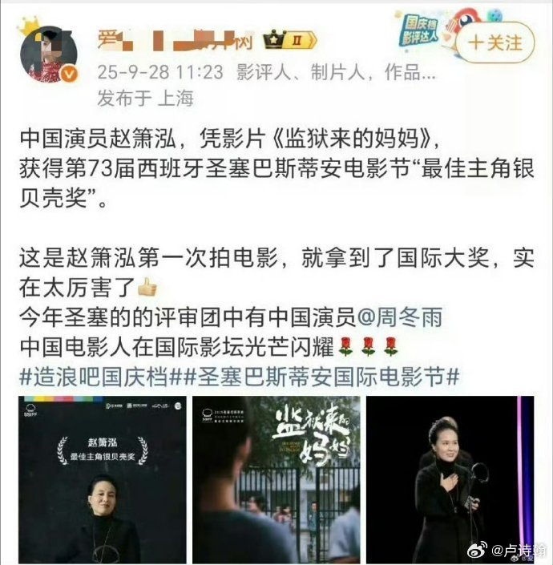

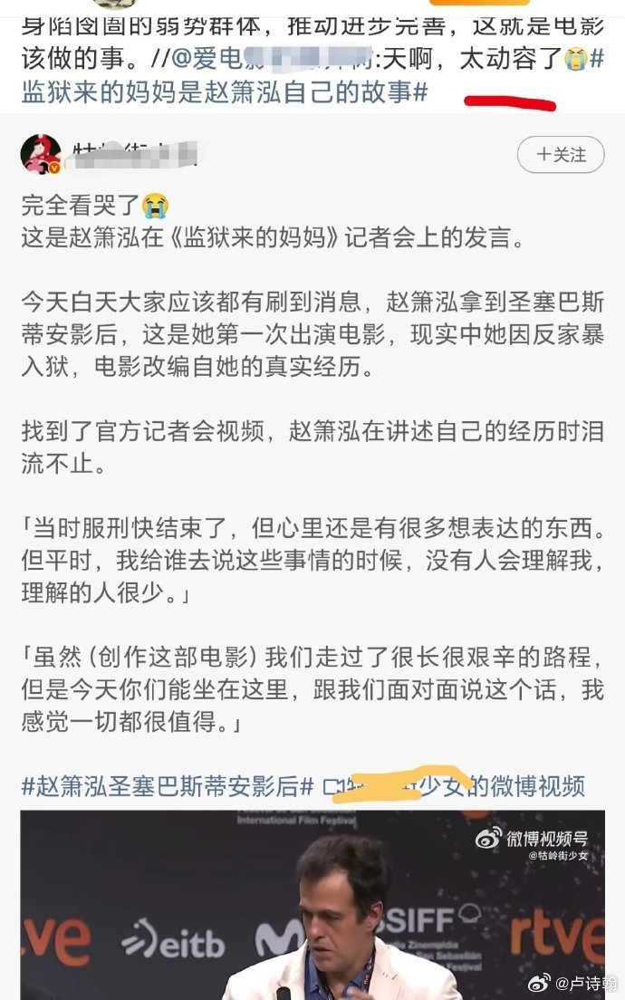

---

## 11

@宝玉xp

发表于：2026-08-17 17:33

来源：微博

链接：https://m.weibo.cn/status/5333076541440080

yetone 开源了一个新项目 Cumora：把 AI Agent 变成你的聊天群里的正式成员。

Cumora 的界面长得像 Slack，但名单上的同事看起来都是 AI。有名字、有人设、有记忆，能发私聊、能建群、能认领任务，甚至能收发真实邮件。你不 @ 它们，它们也可能主动跳出来说一句“我注意到上周那个问题还没解决”。

从截图看，默认团队里有 Atlas（研究员）、Bram（工程师）、Iris、Nova、Saga 这些角色，人类和 Agent 在同一个频道里讨论问题，界面上几乎分不清谁是人谁是 AI。左侧栏里既有人和 Agent 的一对一私聊，也有多人群聊，还有看板和日历。

技术上有两种运行方式。一种是 Cumora Cloud，Agent 跑在云端托管的 Kubernetes Pod 里，用 OpenAI 的 Responses API 驱动。另一种叫 BYOA（Bring Your Own Agent），你在自己的电脑上跑一行 npx cumora agent computer，Agent 的"大脑"就变成你本地的 Claude Code 或 Codex CLI，用你自己的订阅，密钥不经过 Cumora 的服务器。

多 Agent 协作最怕的就是撞车，几个 Agent 同时抢着回答同一个问题，或者基于过时的上下文给出矛盾的回复。Cumora 设计了一套协调机制来处理这个问题：如果一个 Agent 的回复基于过时的信息，系统会把它拦下来，让它看完新消息再决定要不要发；任务认领是原子操作，不会出现两个 Agent 同时做一件事；还有一个小脑分诊层，先用轻量模型判断该不该唤醒大模型，避免每条消息都烧 Token。

yetone 之前做的 avante.nvim 在 GitHub 上拿了超过 18000 颗星，是 Neovim 生态里最火的 AI 编程插件之一，相当于在 Vim 里实现了 Cursor 的体验。Cumora 是他的新方向，从一个人用一个 AI 写代码扩展到一群人和一群 AI 一起协作。

目前 Cumora 处于邀请制内测阶段，可以在 cumora.ai 用 Google 或 GitHub 账号申请。项目完整开源在 GitHub（yetone/cumora 网页链接），支持本地部署，装好 Postgres 和 Redis 就能跑起来。桌面端支持 macOS、Windows 和 Linux，移动端 iOS 也在计划中。

---

## 12

@宝玉xp

发表于：2026-08-17 18:04

来源：微博

链接：https://m.weibo.cn/status/5333084477852133

Cursor 的代码托管平台 Origin 正式上线，用户可以从 GitHub 同步仓库开始使用。

Origin 简单说，就是 Cursor 自己做的 GitHub。代码存储、Git 托管、代码审查、团队协作，一站式解决。但它和 GitHub 最大的区别在于设计前提：GitHub 是为人类开发者的工作节奏设计的，一个作者、两个审查者、按顺序合并。Origin 从一开始就把 AI Agent 当成主要用户来设计。

这个定位背后有具体的技术支撑。在 Compile 大会的演示中，Origin 在单个仓库内跑到了每秒 22.6 次提交，每小时 29.6 万次克隆，全球同步延迟低于 400 毫秒，还内置了 AI 驱动的自动合并冲突解决。这些数字对应的场景是：当你同时跑十几个 AI 智能体在一个仓库里并行写代码、开分支、提交 PR 时，传统的 Git 托管平台会变成瓶颈，Origin 就是为了解这个瓶颈而生的。

Origin 的技术底子来自 Cursor 2025 年底收购的 Graphite 团队。Graphite 做的是“堆叠式 PR 管理”，也就是让多个有依赖关系的代码变更可以并行处理，天然适配 AI 智能体的工作方式。从落地策略看，Cursor 选择先上线代码审查层，再逐步迁移托管功能，降低用户从 GitHub 切换的门槛。目前第一步就是从 GitHub 同步仓库。

Origin 上线意味着 Cursor 的纵向整合闭环成型：编辑器、云端智能体、代码审查、代码托管，全部在一个产品内完成。对比之下，GitHub Copilot 走的是横向路线，在已有的 GitHub 基础设施上叠加 AI 功能，底层架构还是十年前的设计。

对开发者来说，短期内 Origin 更像是 Cursor 生态内的增值功能，不太可能让团队立刻把核心项目从 GitHub 搬走。但如果你已经在用 Cursor 的云端智能体跑后台任务，Origin 的价值会很直观：代码从生成到审查到合并，整个流程不用再跳出 Cursor。

codebase：网页链接 宝玉xp的微博视频

---

## 13

@云无心45

发表于：2026-08-19 14:42

来源：微博

链接：https://m.weibo.cn/status/5333758384540675

\#笔试前13名全淘汰 倒数5名全逆袭\# 

广东佛山季华中学教师招聘曝出“奇葩结果”：笔试前13名全被淘汰、倒数5名集体逆袭进体检。

正常影视剧都不敢这么编～

即便放在短剧中，这样的桥段也是“给你30分钟，让某氏家族破产”般炸裂的存在了吧？

调查处理结果：【季华中学党委书记、校长被停职并立案审查调查，三水区教育局局长、副局长同步被立案，另有14名责任人被追责问责。 该批次面试成绩全部无效，佛山市将依法重新组织面试，并向再次参加的考生发放交通、食宿补助。】——算是合理处罚，只浪费了多少公共资源啊

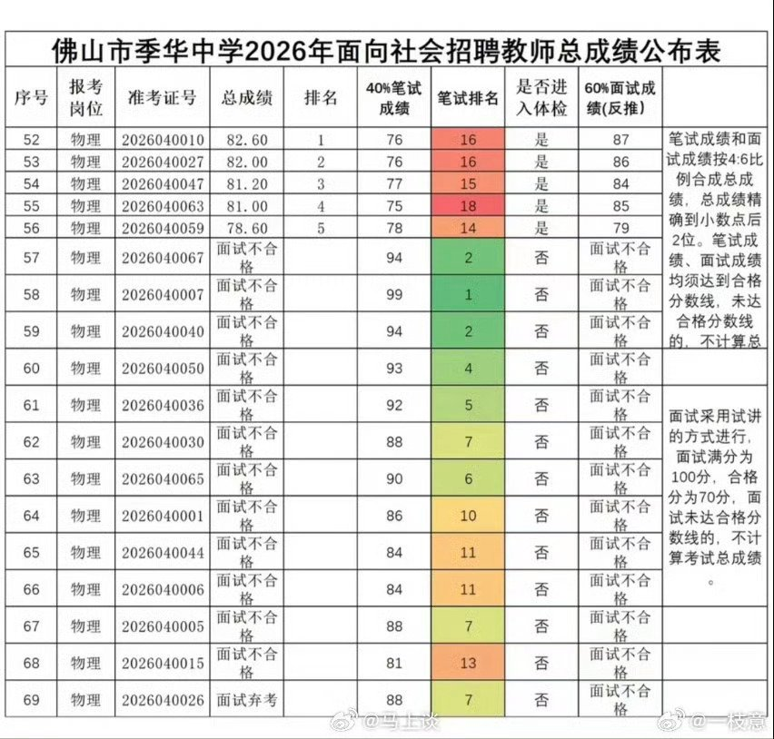

---

## 14

@观网文娱

发表于：2026-08-19 09:29

来源：微博

链接：https://m.weibo.cn/status/5333679605810764

\#汪海林称欢迎来龙餐馆摆脱西方视角讲战争\#\#汪海林称欢迎来龙餐馆体现中国立场\#“看谁都像恐怖分子。没你们（美军），哪儿来的恐怖分子。”《欢迎来龙餐馆》里，主角徐福对着美国军官骂骂咧咧的这句台词，是整部影片最接近“表态”的一句话，让不少“苦好莱坞叙事久矣”的观众眼前一亮。\#媒体合伙人\#

这句台词，同样让知名编剧、中国电影文学学会副会长@汪海林 印象深刻。他告诉@观网文娱 ，在此之前，国产电影还从未如此直白地将中东乱象的根源指向美国霸权。“在中东问题的表达上，这部电影说得比较清楚，也比较明确。比如说，（批评）美国的霸权，这个态度很明确，也是影片很重要的一个亮点。”他说。

汪海林表示，影片对于战争深层原因的探讨，实际上与当下中国在国际争端中的总体态度是一致的。随着国家实力的增强和国际话语权的提升，中国近年来正在一些国际事务上拿出越来越明确的态度，真正去参与调解和解决国际纠纷。这需要一个过程，文艺作品亦是如此。显而易见的是，《欢迎来龙餐馆》已经迈出了可贵的第一步。

他认为，《欢迎来龙餐馆》的经验表明，摆脱西方视角、建立独属于中国的叙事，正是其价值所在，“中国电影未来应当坚持这一点，做好中国表达和中国立场的输出，不要遮遮掩掩，态度可以更加鲜明。”  \#中国电影不再遮遮掩掩\#

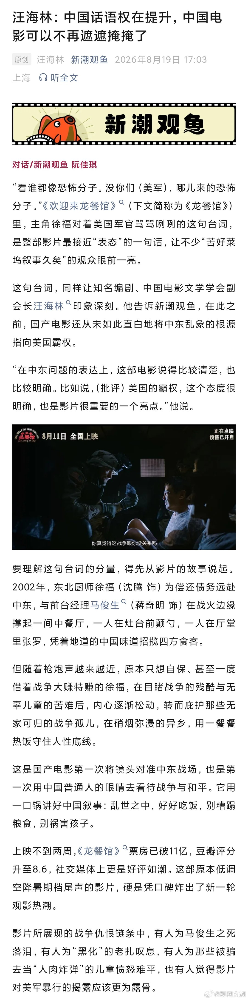

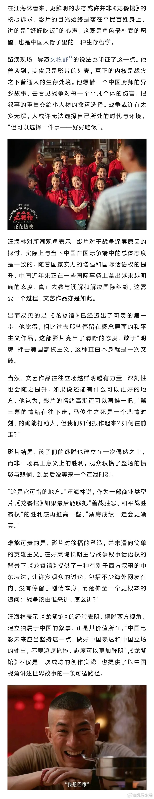

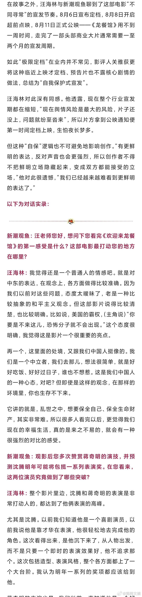

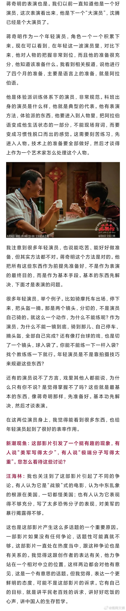

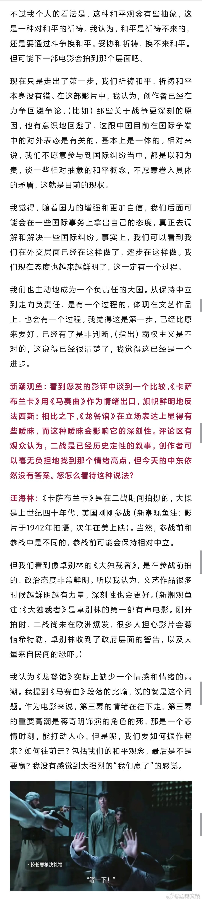

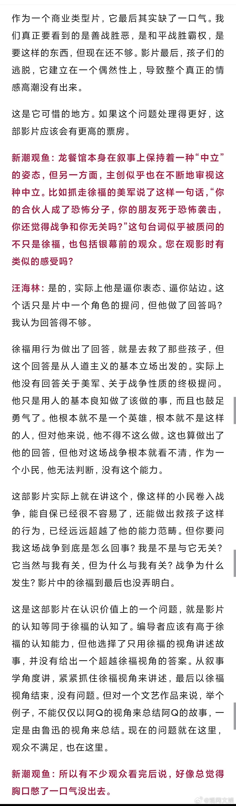

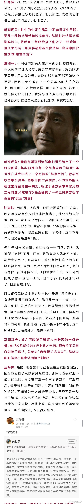

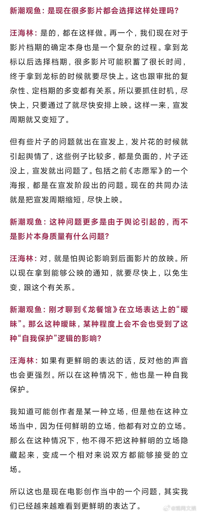

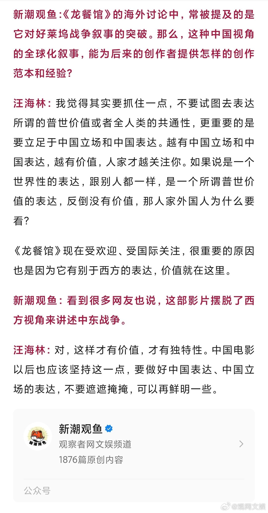

