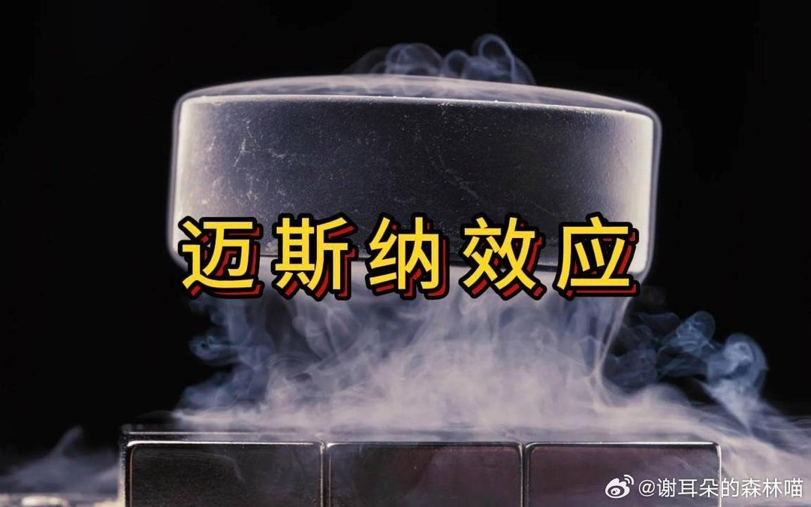
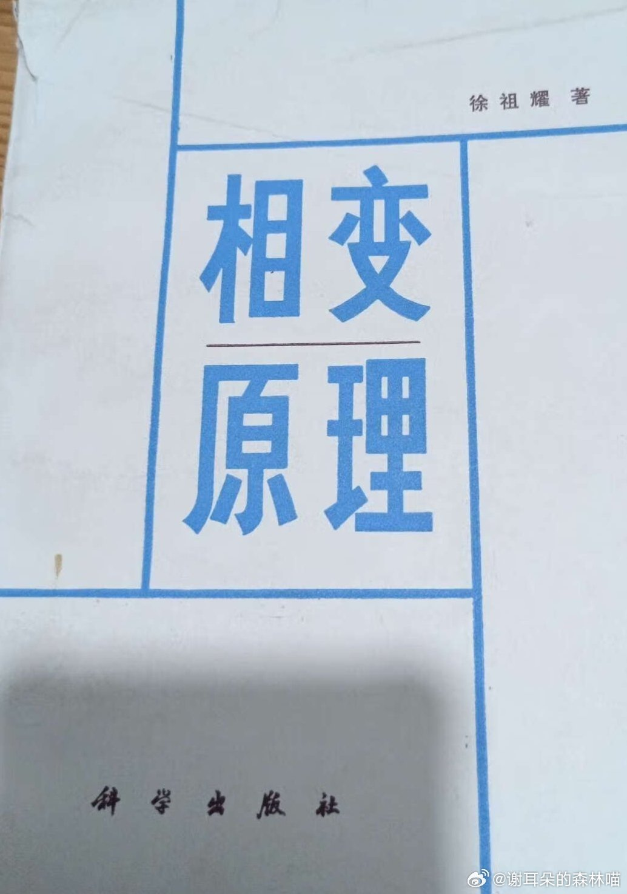
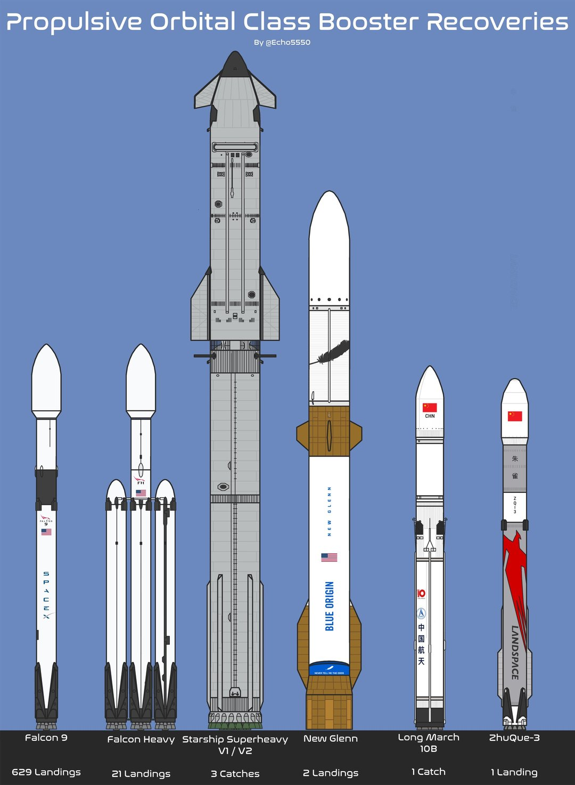
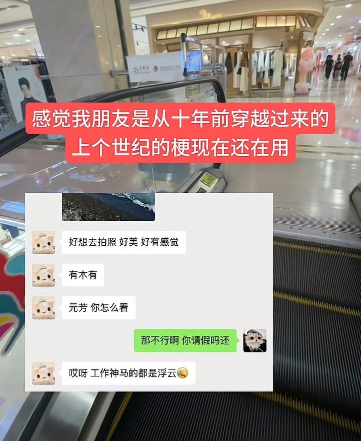
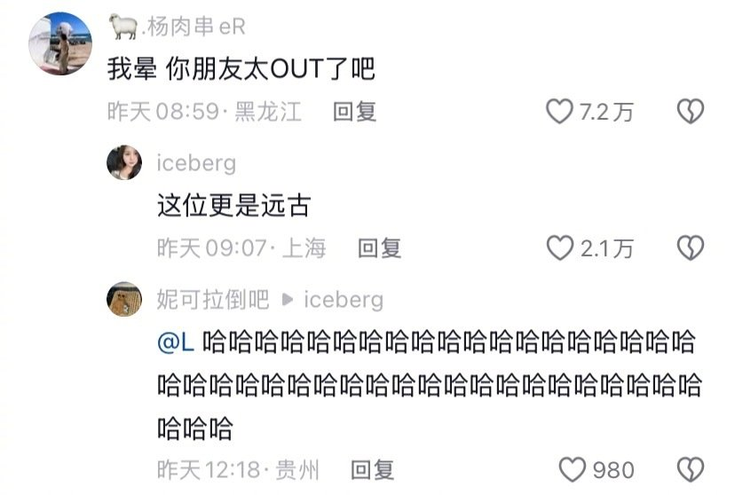
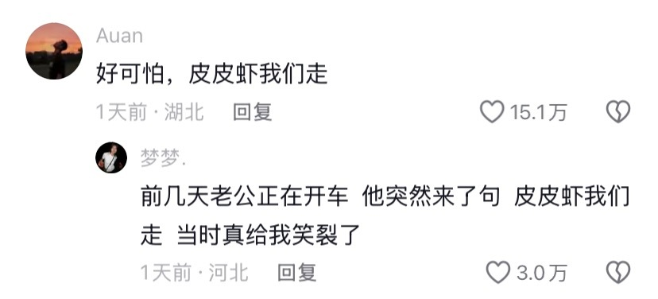
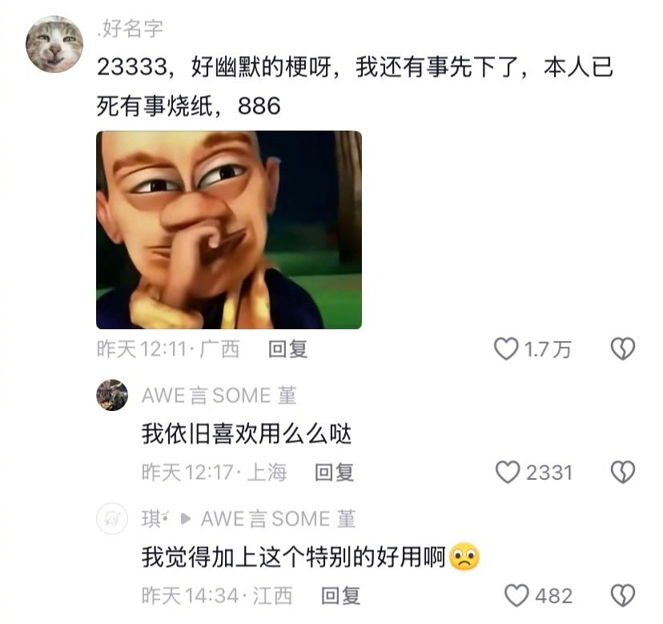
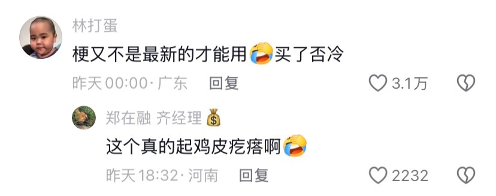
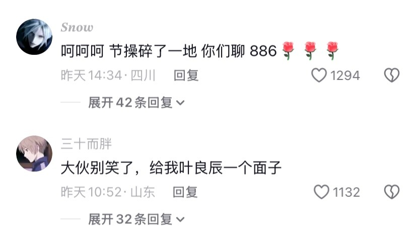

# 2026-08-21

## 1

@谢耳朵的森林喵

发表于：2026-08-20 13:55

来源：微博

链接：https://m.weibo.cn/status/5334109003978641

我有一个暴论，对于不是特殊命格的普通身弱来说，越趋近中和命越好。

身弱改命成功的关键就是努力让自己趋近中和，这件事的重要性，怎么强调都不为过。不仅仅是因为"中和"听起来更平衡、更吉利，而是因为：只有趋近中和，身弱才能发生相变。

什么叫相变？这是一个物理概念。水变成冰，是相变。磁铁加热到居里点突然失去磁性，是相变。一个系统在某个临界值上，运行规则被瞬间重写——这就是相变。(相变的解释：网页链接)

作为一个野生教育博主，我用超导来解释身弱趋近中和这件事情。

一、电阻即"能量税"

1911年，荷兰物理学家昂内斯发现：水银冷却到约4.2K（-269℃）以下时，电阻突然消失了。不是变小，不是降低90%——是归零。

在这个温度之下，电流可以在闭合线圈里永远流动，无需电源维持，不会发热，不会衰减。它进入了一种全新的物理状态：超导态。

这个切换不是渐变，而是相变——就像水在0℃突然结冰，不是慢慢变硬，而是瞬间更换了整个系统的运行规则。

正常金属中，电子在晶格间穿行时不断碰撞原子，产生电阻。要让电流持续，就必须不断施加电压——也就是持续供电。

这完美对应身弱之人的日常：

你做每件事，都在发热。

写一篇文章，不是写完就完了——写完之后整个人被抽空，需要好几天恢复。接一个项目，不是"做完拿钱"就结束——整个过程都在焦虑、失眠、内耗。维持一段关系，不是"相处就好"——每次互动都让你感到被消耗。

这些"发热"，就是电阻造成的能量损耗。你以为自己在输出价值，实际上大部分能量都变成了热量——焦虑、疲惫、内耗——消散在空气中，没有到达任何目的地。

身弱的痛苦，本质上是电阻太大：每传输一分能量，就要额外付出几倍的"能量税"。

二、临界温度Tc即"中和阈值"

超导最反直觉的一点是：你不需要降到绝对零度（-273℃）才能进入超导态。

每种材料都有自己的临界温度Tc。汞是4.2K，钇钡铜氧是90K（液氮温度即可维持）。只要降到Tc以下，电阻就归零——再降温也不会让超导态"更好"，它只是继续维持。

这就是中和的真义。

身弱不需要变成超级身强，也不可能变成超级身强。你不需要把印比补到满格。你只需要让己方占比跨过那个临界值——那个让能量收支从"赤字"变成"平衡"的阈值。

过了这个点，你做同样的事，不再发热了；承担同样的责任，不再内耗了；追求同样的财官，不再透支了。

损耗突然归零。不是变小——是归零。

"身弱趋近中和越好"，原因就在于此：从"有电阻"到"零电阻"，不是线性改善，而是系统级别的质变。哪怕你只是刚刚跨过Tc，哪怕外界看你仍是"身弱"，你的运行规则已经截然不同。

三、迈斯纳效应即"财官不粘身"

超导还有一项更深刻的特性：迈斯纳效应。

进入超导态的材料，在足够弱的磁场下，会完全排斥外部磁场。磁感线无法穿透超导体，只能绕道而行。若将超导体置于磁场上方，它会因排斥力而悬空。

这意味着：在超导态下，外部场无法穿透你、无法附着于你、无法将你锁定。

身弱之人最熟悉的痛苦之一，就是被财官"粘住"——职位摆在面前，不敢拒绝，但接了又扛不住；赚钱机会出现，想要，但一想到维持它所需的消耗，就感到被它"吸住"；关系带来压力，想抽身却越陷越深。

这就是外部磁场穿透了你的边界，在你的能量系统里感应出焦虑、纠结、内耗，把你锁死在那场域之中。

而中和状态——超导态下，财官就像磁场遇到超导体：它无法穿透你。

你可以靠近它、使用它、承载它，但不会被它"吸进去"。面对升职机会，你平静地评估："这个能接"或"这个接不了"——不因恐惧而退缩，也不因贪婪而硬撑。你的能量系统不允许外部场穿透边界。你像那块悬浮的超导体，稳稳地、轻松地停在应在的位置。

四、退出超导态即"大运流年升温"

超导不是永久的。温度一旦超过Tc，材料瞬间退出超导态，电阻恢复。

这是身弱之人最熟悉的体验：好端端的，突然又不行了。

你以为自己已经"正常"了——工作顺了，情绪稳了——然后一波财官大运袭来：一个重大项目、一次升职、一场危机。你的能量系统突然又开始"发热"，又内耗，又回到"每做一件事就躺三天"的状态。

不是你退步了。是温度又升上去了。

加上印比大运，你的己方占比（Tc）刚好够你在日常状态下维持超导，但忌神大运流年带来的外部压力，就像给系统加热——温度超过Tc，你立刻退回到有电阻的状态。

这就是为什么身弱之人即使趋近中和，仍需持续维护那个"节能系统"。你不是"治好"身弱，而是在维持一个刚好低于Tc的运行环境。环境一变，你就得重新调整：通过减少官杀接触等方法把温度重新降下来。

五、不同日主的Tc天生不同

超导物理中，不同材料的临界温度天差地别：水银4.2K，极难维持；铌三锡18K，略好；钇钡铜氧90K，液氮即可；汞系铜氧化物甚至可达135K以上。

每种材料的Tc是天生的。你无法把水银的Tc"提高"到90K。

身弱亦如此。不同日主、不同格局，天生的"中和难度"不同。

有些人身弱，但印星贴身、比劫暗藏，在用神大运帮扶下稍作调整便近中和——如同高温超导，Tc高，易维持。有些人身弱，全局财官一片，印比几乎没有但又不从，需耗费极大心力才能将己方占比拉到阈值——如同水银，Tc极低，需极端环境才能超导。（一命二运三风水等等方法都用上，这就是学神秘学的意义，只要能改一点点命，各种方法都可以试一下。）

但无论Tc多低，只要跨过它，超导态就是超导态。水银在4.2K以下，与钇钡铜氧在90K以下，进入的是同一种零电阻状态。

没有"高级超导"与"低级超导"之分。你不需要变成身强的材料。你只需要找到自己这个材料的Tc，然后把自己维持在那个温度以下。

身弱趋近中和，就是从"有电阻的常态"进入"零电阻的超导态"——跨过临界温度的一刻，能量损耗突然归零，财官不再穿透你的边界，你终于可以"正常地"活着，而不再需要为每一次运转额外供电。

努力了这么多，不是为了成为别人，而是为了成为自己——一个不需要透支能量也能好好活着的自己。

我讲的即是玄学又不是玄学，反正玄学再玄也要遵从物理的底层规律，这是宇宙通用的法则。

---

## 2

@谢耳朵的森林喵

发表于：2026-08-20 14:31

来源：微博

链接：https://m.weibo.cn/status/5334117975852840

我解释一下上文里说的相变。网页链接

相变，用最土的话说就是——到了某个点，东西突然"换了一种活法"。

不是慢慢变，不是逐渐改善，是一瞬间，整个规则全换了。

你花了很长时间做一件事，一直在一个状态里挣扎，感觉收效甚微。然后到了一个节点——突然，一切都不一样了。

对于身弱的你来说，不是你变厉害了，是系统自己换了运行方式。

这不是玄学，这是物理学里最硬核的发现之一。

我先聊三个你们一定见过的相变：

 水变冰，不是"稍微硬一点的水"。它是完全不一样的东西。同样都是H₂O，但物理性质彻底变了：密度变了，硬度变了，透光性变了，导电性变了。水和冰之间没有中间状态，没有"半水半冰"让你慢慢适应。

生鸡蛋的蛋清是液态的，透明，随便晃。你加热它，到某个点——突然，凝固了。蛋白质分子在热量下展开，然后重新交联成一张三维网络。不是"有点稠的蛋清"，是变成了固体。过了这个点，你再怎么降温，它也变不回液态蛋清了。相变有时候是不可逆的。

一块吸铁石，吸得好好的。烧到一定温度——突然，不吸了。不是"吸力变小了"，是彻底不吸了。这叫居里温度。超过这个温度，磁铁内部的磁畴全部被打乱，有序排列消失了，磁性归零。跟之前那块磁铁完全不是同一个行为模式。

相变的核心特征有哪些：

第一，不是渐变，是跳变。

从水到冰，中间没有"半冰半水"让你慢慢适应。到了那个临界点，突然就换了。你在临界点之前和之后，面对的是两套完全不同的物理定律。

第二，过了那个点，行为规则全变。

冰能做的事，水做不了。冰能滑冰，水不能。冰能砸人，水不能。同样都是H₂O，但能做的事完全不一样了。不是程度上的差别，是性质上的差别。

第三，你不需要"更好"，只需要"过了那条线"。

冰不会因为温度更低就"更冰"。到了0℃以下，它就是冰。-1℃的冰和-20℃的冰，都是冰，行为模式一样。相变不是"越变越好"，而是"变了就是变了"。

为什么相变会发生？因为系统的内部组织方式变了。

水是分子在随机游走，各自独立。到了0℃，分子开始按固定位置排列成晶格，每一个水分子都被相邻的分子固定在特定位置上。整个系统的组织方式变了，所以表现出来的性质全变了。

磁铁也是一样。常温下，所有小磁畴指向同一个方向，对外显示磁性。加热到居里温度，热运动把整齐的排列打乱了——方向不再一致，磁性消失。不是磁铁"坏掉了"，是内部组织方式换了一种形态。

你们现在应该能感觉到为什么我刚才那个帖子说"从有电阻到零电阻是相变"了。网页链接

身弱之人一路往那个阈值走，一路上还是身弱、还是内耗、还是每做一件事都发热。但跨过中和那个临界点的那一瞬间，你的能量系统突然换了一套运行规则。

以前： 努力1分，得到0.2分，剩下0.8分变成焦虑和内耗烧掉了。过了阈值： 努力1分，得到接近1分，几乎不发热。

不是你变厉害了，是系统切换了，让你能够担财官了，就像水突然变成冰——不是水"慢慢变得更像冰"，是到了那个点，突然就换了。

这也解释了身弱之人的终极困境。

身弱最痛苦的事情是：你不是不努力，你一直在接近那个阈值，但在跨过去之前，每一分努力都感觉毫无成效。就像水从20℃降到1℃，它能感觉自己"正在变冷"，但它仍然是水——能做的所有事，都还是水能做的那些事。它没有任何迹象能预知自己"即将变成冰"。

然后一瞬间，一切都变了。

所以你不需要在1℃的时候怀疑自己"为什么还不行"。你只是在路上。所有身弱的挣扎，都是在逼近那个临界点的过程中。

相变，永远是突然发生的。但到达临界点的路，往往又长又煎熬。

离火运兼冥王星水瓶座期间的主题就是物竞天择，适者生存，希望每个身弱都能顺利的熬过去。

---

## 3

@China航天

发表于：2026-08-19 00:30

来源：微博

链接：https://m.weibo.cn/status/5333544012615445

\#朱雀三号回收成功\#\#朱雀三号\# 全球已经成功回收可重复使用火箭型号，朱雀三号上榜

---

## 4

@杰克波比

发表于：2026-08-20 04:37

来源：微博

链接：https://m.weibo.cn/status/5333968507110109

本以为人老了心酸，没想到梗老了也显得心酸，蓝瘦香菇，请善待老人！

