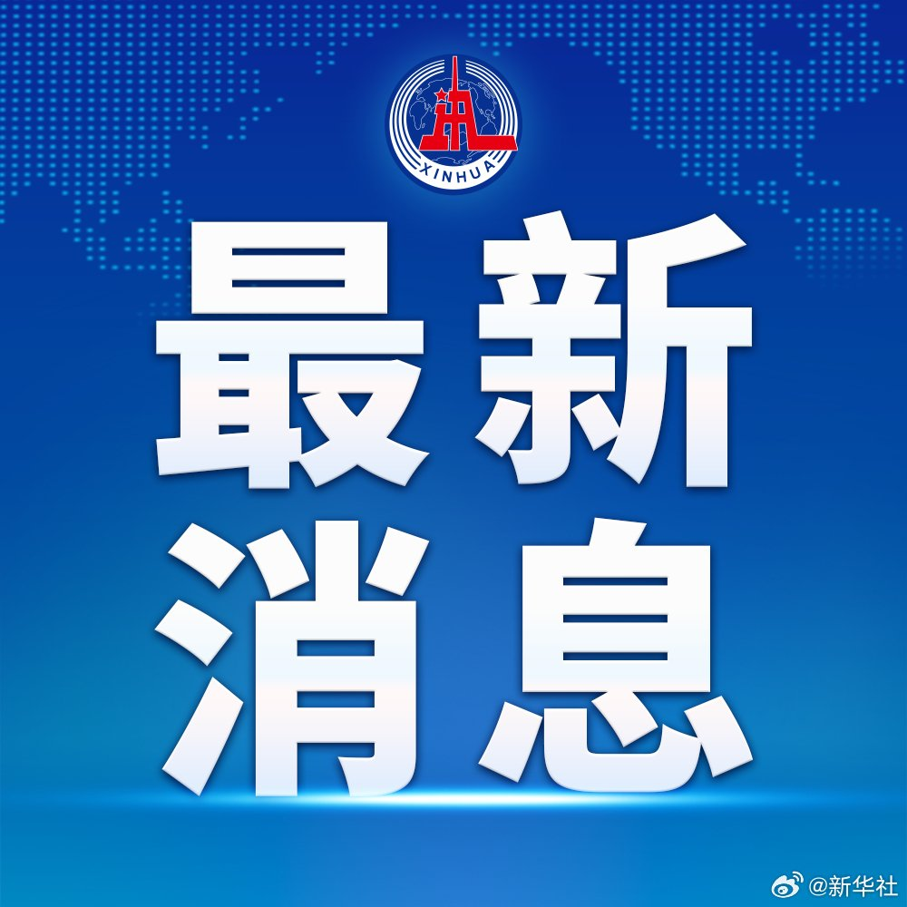
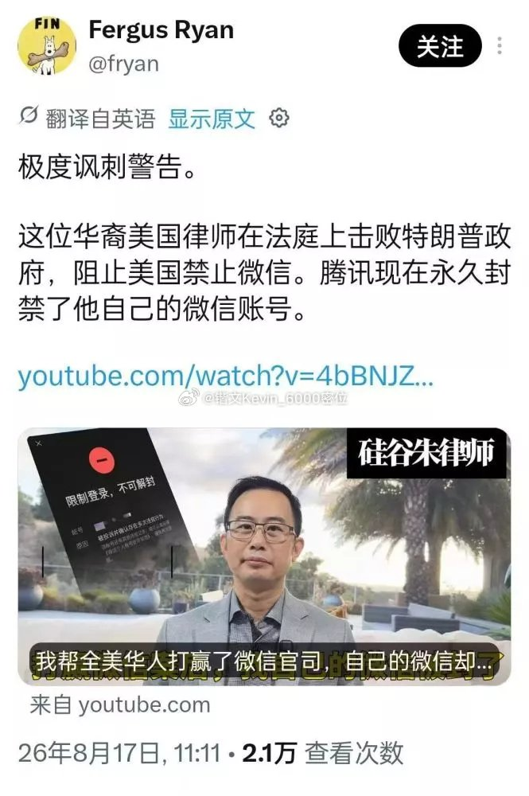
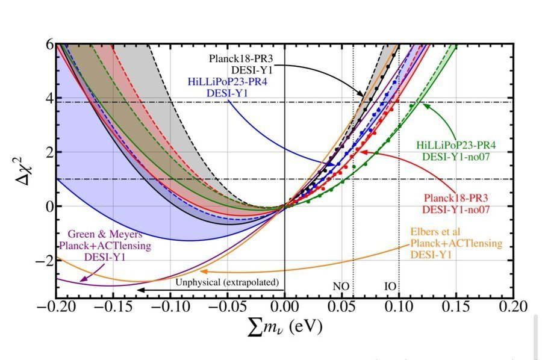
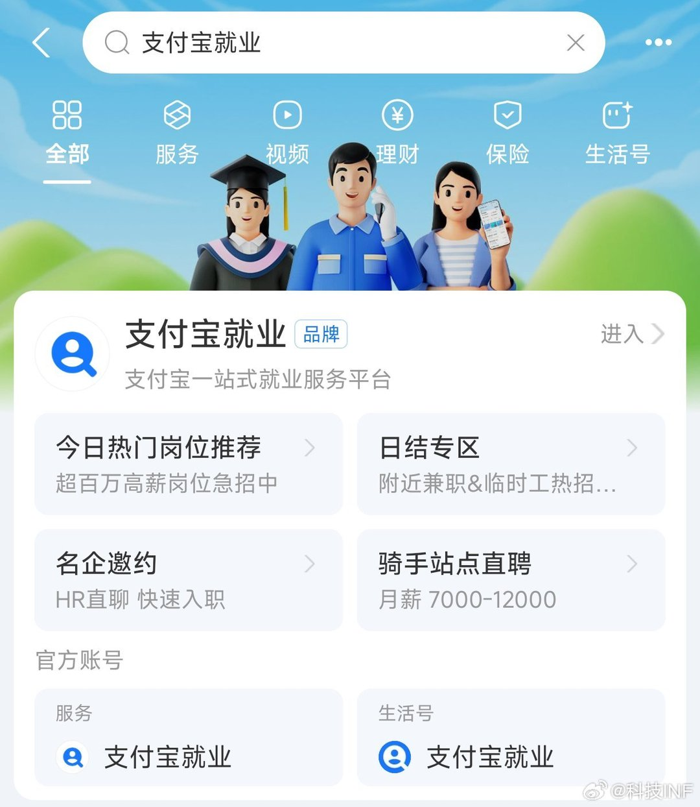

# 2026-08-22

## 1

@新华社

发表于：2026-08-21 13:12

来源：微博

链接：https://m.weibo.cn/status/5334460457552003

\#成都局回应旅客买票占座放零食\#【成都铁路局回应“旅客买票占座放零食”网络信息】记者21日从中国铁路成都局集团有限公司获悉，针对日前“旅客买票占座放零食”网络信息，单位相关部门迅速组织核实，并组织法律和客运专业人员进行专题分析：若旅客购票后未检票上车，视为该旅客不行使期间的席位使用权利，第三方不能占用和处置该席位，列车工作人员应根据现场实际情况协调处置，有特殊需求的旅客，可以向列车工作人员说明情况。

据中国铁路成都局集团有限公司核查，网络传播视频中的列车为8月16日上海至成都西的K1156次，由成都局集团公司成都客运段担当。当日，3名旅客实名制购买6号车厢005号、006号、007号三个硬座席位车票，乘车区间为上海站至南充站，其中2名旅客检票乘车并按席位号就座，将零食放置到1名未检票乘车旅客车票所对应的006号空闲席位。途中，车厢一名持无座席号车票旅客希望在006号空闲席位就坐，并请求列车员协调，列车员在核实购票和席位情况后，建议旅客双方自行协商解决，后双方协商未果，其他旅客将这一过程进行视频记录并发至网上。

根据《中华人民共和国民法典》《铁路旅客运输规程》《铁路旅客车票实名制管理办法》等法律法规规定，若旅客购票后未检票上车，视为该旅客不行使期间的席位使用权利，且基于合同相对性原理和铁路旅客运输规则，第三方也不能占用和处置该席位，有特殊需求的，可以向列车工作人员说明情况。此次事件中，对应006号席位的旅客未检票乘车，已放弃其本次列车正在运行区段席位使用权，另2名旅客也不能占用和处置该席位，列车工作人员应根据现场实际情况协调处置。

此外，国铁集团铁路旅客运输规则还规定，旅客自支付购票款，即建立了与承运企业间的客运服务合同，当检票上车时开始享有对应席位的使用权利，列车开车后，未检票乘车的还可享受免费改签当日24时前车次车票的权利。

铁路部门对因旅客服务工作不到位给旅客带来的不佳旅行体验深表歉意。下一步，中国铁路成都局集团有限公司将持续强化员工培训，不断完善客运规章制度，优化客运服务产品体系，更好地满足广大旅客出行需求。（记者李杰）

---

## 2

@锴文Kevin_6000密位

发表于：2026-08-20 22:19

来源：微博

链接：https://m.weibo.cn/status/5334235703672932

震惊！曾在美国法庭上成功阻止特朗普政府全面封禁微信的“硅谷朱律师”，如今自己的微信账号却被腾讯永久封禁，事件引发舆论热议。

据社交平台信息，分析师弗格斯·瑞安（Fergus Ryan）转发相关视频，并评论称这一事件“极度讽刺”。朱律师本人也在YouTube发布视频《我帮全美华人打赢了微信官司，自己的微信却……》，讲述账号被封经过。

从其展示的微信处罚页面来看，账号目前显示“限制登录，不可解封”，处罚理由为“被投诉并确认存在多次违规行为”。

当年这场U.S. WeChat Users Alliance v. Trump官司，朱律师及“美国微信用户联合会”与相关律师团队，并没有收腾讯的代理费，反而以公益诉讼、志愿律师的方式参与其中。

说得直白一点：当腾讯被美国政府一纸行政令逼到墙角时，是海外用户和志愿律师站到了法庭上；他们承担诉讼风险，替腾讯守住了美国市场的生存空间。

曾参与诉讼并成功阻止特朗普政府微信禁令的律师，如今却在同一平台上失去了自己的账号，这种巨大反差不仅充满戏剧性，更令人不寒而栗。

腾讯当然没有法律义务“知恩图报”。但这已经不是“过河拆桥”四个字能够概括的了。

---

## 3

@物理芝士数学酱

发表于：2026-08-21 15:07

来源：微博

链接：https://m.weibo.cn/status/5334489292342201

\#今天要来点物理吗？\# 

2024年，目前世界上规模最大的宇宙光谱巡天项目 DESI （Dark Energy Spectroscopic Instrument，暗能量光谱仪）的数据看起来像是暗示中微子具有 *负质量*。当时说要写一下网页链接

虽然中微子的质量从未被直接测量过，但它当然不可能是负的。这一篇里也提过。

理论上确实有负质量存在的空间。根子就在爱因斯坦的质能方程。

一般认为爱因斯坦的质能方程是酱婶的：

                                       E=mc² 

但实际上，狭义相对论是这么说的

                                       E² = m²c⁴ + p²c²

其中p是动量。   

因此，我们能测量能量和动量，并计算出质量的平方，而非质量本身。   

所以质量可以是正的或负的，只要平方是正的就不会违反物理规律。至少在数学方面是没有问题的。

在广义相对论中，引力并不是由“质量”本身产生的，而是由能量和动量的分布决定的。

所以即使某个粒子的质量是负的，只要它的能量和动量是合理的，引力仍然可以“正常工作”。

当然，没有任何证据表明负质量之类的东西实际存在，而且如果它存在的话，一般认为会在广义相对论中引发一些深层次的自洽性问题。 

比如说，违反著名的正质量定理（Positive Mass Theorem）。

这就是著名Schoen–丘成桐 (1979) 与 Witten (1981) 证明：在渐近平直时空里，若物质满足能量条件（如强能量条件 ρ+∑pi≥0），则总 ADM 质量 M≥0。

负质量物体直接给出 M<0，必须违反标准能量条件。这本身不会使Einstein方程无解（方程允许任意Tμν ），但意味着时空失去通常的物理合理性。

之前我在每日一题 里提出一个问题，如果负质量对象也满足牛顿三大定律和万有引力定律，那么地球上的的负质量的物体，如果没有支撑或其它限制，它会下落还是上升？

网页链接

当时评论区指出，在强等效原理下，测地线方程里没有惯性质量，所以负质量粒子仍然沿测地线运动。

但单纯使用经典力学即可。

F=ma，F是万有引力G=kMm/r^2，它对负质量的物质变成斥力，这样左边出现一个负号。

但注意，m也是自带一个负号的！

两边负号抵消，所以加速度a的方向和正常质量的物体一样。

但是请再次注意！

地球本身是正常质量的，所以它受到的“引力”也变成了斥力。如果不考虑地球，而是两个质量差不多的对象，只不过一正一负，那就会出现一幅极其荒谬的物理图景。

Hermann Bondi在1957 年系统讨论过**负引力质量（negative gravitational mass）的问题，并提出了著名的“一正一负质量 runaway（逃逸加速）”思想实验。

论文H. Bondi, Negative Mass in General Relativity, Reviews of Modern Physics 29, 423 (1957)是广义相对论早期讨论负质量最经典的文章之一。

如果允许惯性质量 mi引力质量 mg不一定相等，会发生什么？

正质量被推离负质量；而就像上面的推理，负质量会被正质量吸引，追着它运动。

结果就是两者自行加速运动，越来越快！

更加有趣的是，这竟然不违背动量守恒定律，感兴趣的朋友可以自己推导一下。

---

## 4

@冰蛇陛下

发表于：2026-08-21 05:21

来源：微博

链接：https://m.weibo.cn/status/5334341984979912

那大家知道那种在街头找个年轻人提出给多少钱跟对方混一天的那种视频吧

刚才看了个好笑的

一个Up主在街头找了个他认为的黄毛

说给对方200块钱，体验黄毛的一天生活

小年轻染着黄毛，很正经的跟他说还有事儿，算了吧

这Up主死活就不肯放弃

说什么也要给对方200块钱，体验一下人家的一天生活

咋讲嘞？就是人家不想挣这个钱，他死活要塞给人家这个钱

于是被带回了家

小黄毛在门口就开始喊开了妈

没错，看到这儿的时候，大部分人就已经知道不对了

很乖的孩子喊妈妈，跟妈妈说白捡200块钱

然后带着Up主老哥开始体验他的生活

干嘛嘞？送货啊

家里是那种装修门市，人家小伙子每天要帮妈妈去送卫浴呀送什么的…就是那些很沉的大件

Up主整个人都不好了啊，合着是花钱过来干活？

想跑也来不及了

于是跟着搬了一天的货哈哈哈

到晚上终于有机会花这个钱了

去吃东西，小孩还记得给妈妈带杯奶茶

小孩表示自己才中考，开学要上高中了

Up主死活不肯相信你真考上高中了，你真考上高中了

小孩表示，你猜我为什么骑着电动车跑那么快？

因为我去上辅导班了呀

Up主：

啥？

结果就是

这人想找个黄毛，体验黄毛的生活

而实际上找到的是个中考完，趁着上高中之前染个头发，假期还要乖乖上补习班，上完辅导班准备狂奔回家帮妈妈店里干活的乖乖仔

哎呀，那孩子真的太乖了

看的我一脸姨母笑，哈哈哈哈 

所以说刻板印象要不得呀，哈哈哈

---

## 5

@莫非是托的微博

发表于：2026-08-21 01:12

来源：微博

链接：https://m.weibo.cn/status/5334279274105124

高盛说英伟达的GPU早已过剩，第三方报告也显示GPU平均利用率仅为5%。而英伟达的应对是将GPU货币化和次贷化。

英伟现在的做法是把算力资产打包，以其未来产生的算力租金收入为支撑，发行金融产品卖给美国养老金这个倒霉的背债人。这与当年将房贷打包成MBS（抵押贷款支持证券）的手法一模一样。

感觉黄仁勋搞垮帝国要立首功

---

## 6

@飞扬军事铁背心

发表于：2026-08-21 08:45

来源：微博

链接：https://m.weibo.cn/status/5334393333745075

路透社报道称，沙特阿美已经向两家中国炼油商出售至少400万桶原油，而且装船地点安排在霍尔木兹海峡之外。

报道称中石油和中石化分别购买了200万桶阿拉伯中质原油和阿拉伯重质原油。

原油将在阿联酋富查伊拉附近海域进行船对船转运，也就是在霍尔木兹海峡这一关键航道的另一侧完成。

本周，沙特阿美开始通过私人协商，向部分亚洲炼油商提供这些原油品种。

这意味着，利雅得正在建立一种新的石油出口方式：让油轮根本不需要进入伊朗火力能够威胁到的霍尔木兹海峡，就可以完成对外供油。

富查伊拉正是阿布扎比国家石油公司（ADNOC）此前开展油轮接驳运输的港口。而此次买家则是中国国有炼油企业——恰恰是特朗普所谓经济“诺曼底登陆”警告不要给伊朗提供生命线的那些客户。

\#烽火问鼎计划\#

---

## 7

@科技INF

发表于：2026-08-19 01:26

来源：微博

链接：https://m.weibo.cn/status/5333558021331490

别老去麦当劳肯德基捡点薯条吃，给没钱吃饭的人提供一个思路：可以考虑一下到支付宝就业做日结，基本上大城市都开通了，能活一天是一天，能赚一天是一天，有啥事别想不开，好好活下去

\#灵活就业人数越来越多怎么破解\#

---

## 8

@董指导挤出俩酒窝

发表于：2026-08-19 14:50

来源：微博

链接：https://m.weibo.cn/status/5333760247600376

具身未来五年的三笔账

网上流传了一份数据，2026年上半年，中国卖出约2.3万台人形机器人，其中约三成进了科研院所，约三成上了展会舞台，约三成多出口海外，真正走进工厂生产线的不到5%。

这个比例未必准确，但我想趋势应该大体符合。这不是看空行业，而是通往下个阶段所必须解决的难题：需求。

尝鲜的需求，是价值情绪；但真正的需求，是ROI的算术题。

机器人本体的降价还在继续，但下个五年，应该盯住的指标不是售价，而是TCO全生命周期总成本。以工厂为例，假设设备回本周期不超过2年，和工人成本相比，那就意味着TCO应该在20万以内，但目前的数据推算，仍接近50万元。

这也解释了为什么投资机构对具身智能行业有巨大分歧。有机构认为拐点不明，预警行业没订单、产能先行的风险；也有机构认为行业体量比肩今天的全球汽车业。

分歧的本质，是对"干得了活"时刻的判断差别。我觉得有几个观察指标。

一看订单质量：非科研教育收入占比、复购率，而不是发布会数量和展会签约；

二看TCO与回本周期：有没有从10年量级压进2年；

三看大脑接管率：有多少动作是模型现场决策的，而不是预编程或遥操作。这是"演示机器人"和"干活机器人"的分界线。

对于行业而言，还有一个未来五年会发生的情况就是：出清，而且会先于分歧收窄。

目前20多家企业估值过百亿，但产能差距却在拉开。宇树一家产能规划就有19万台。如果需求没有快速爆发，产能和订单之间的落差也会更大。

另外，整机厂背后的开发平台，也会是胜负因素之一。谁能把数据、仿真、训练、推理、评估部署，串成更短的闭环，也就能率先验证路线、开启数据飞轮，形成优势。

路线之争也没有平息，双足机器人需要等运控算法、硬件成本和电池能量密度三个变量同时到位，这是一场需要时间的验证。而现金流不过关的企业，将等不到自己押注的路线被证明正确的那一天。

产能、技术、财务，都是紧箍咒。政策会托住产业，但不会托住每一家公司。向来如此。

因此，下个五年，具身产业链的估值逻辑也会分层：

本体是期权。价格取决于"干得了活"的兑现概率，波动最大。

零部件是业绩股。订单和排产表就是估值。零部件的客户绑定，就需要更加谨慎甄别。

基础设施是现金流。诸如百度百舸，搭建具身开发平台，一站式支持具身模型训练、数据、仿真、安全等全流程，为全行业服务。无论谁最终胜出，模型都要训、数据都要标、仿真都要跑、安全都要过。

当具身智能已经成为显学的时候，激烈的竞争之下，也需要慧眼来识别、判断。 

网页链接

\#宇树\# \#机器人\#

