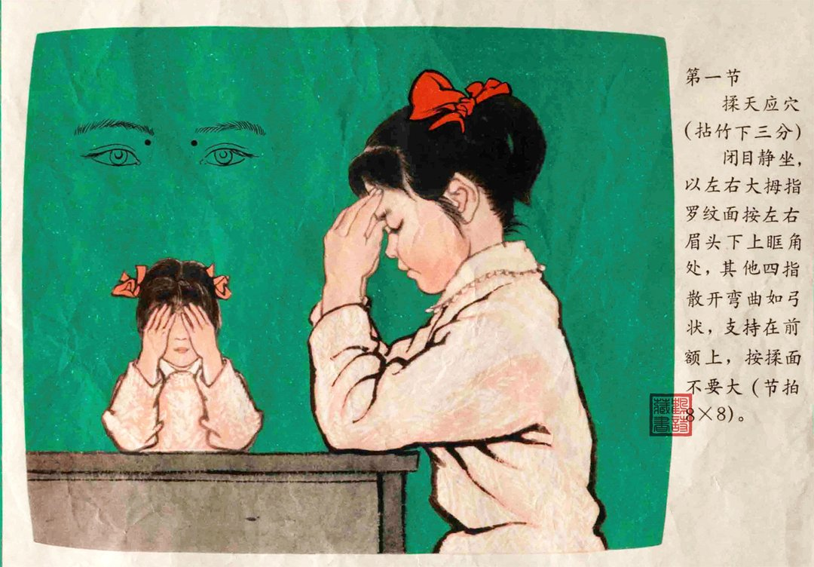
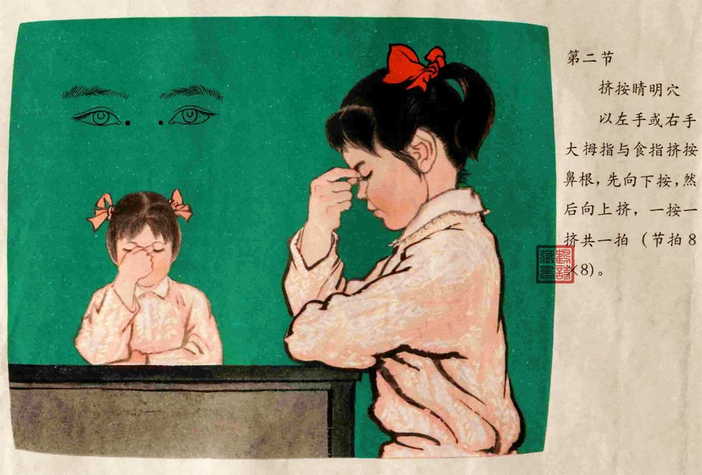
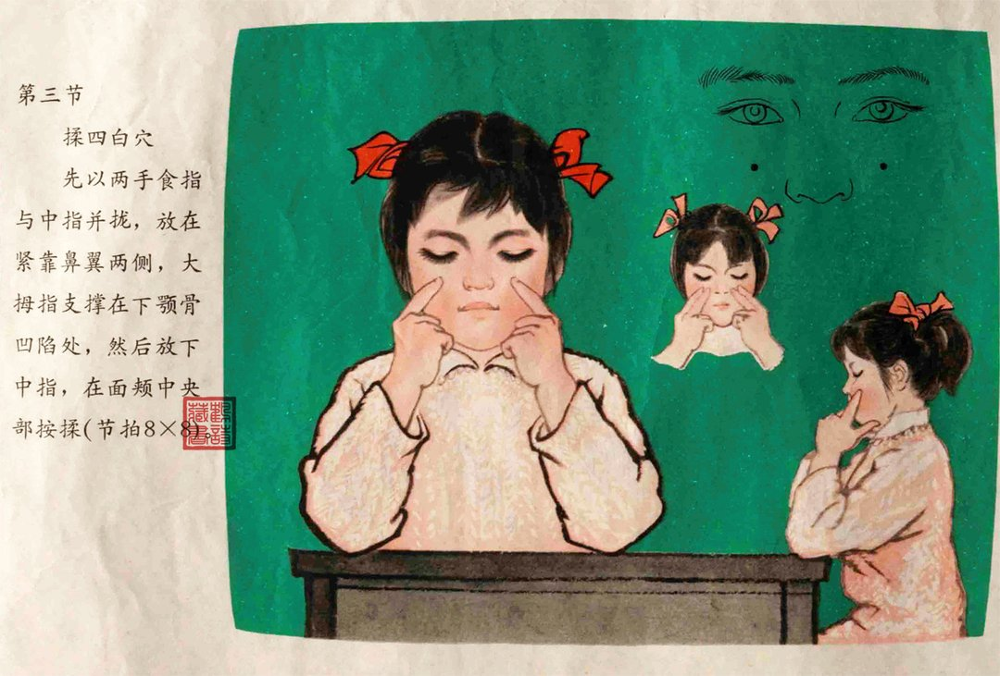
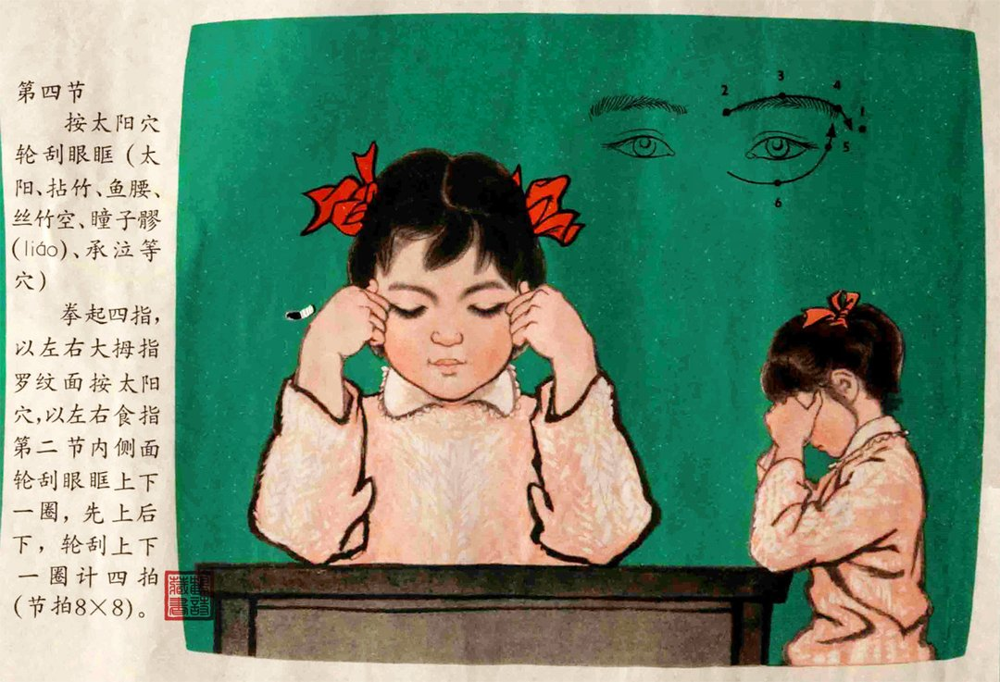

# 2026-08-25

## 1

@王鹤诗

发表于：2026-08-25 08:48

来源：微博

链接：https://m.weibo.cn/status/5335726443989875

70年代出版的《眼保健操图解》。

---

## 2

@渔老板钓鱼

发表于：2026-08-25 08:48

来源：微博

链接：https://m.weibo.cn/status/5335718748225728

\#甲醛白菜为何屡禁不止\#

以后也会屡禁不止

曝光一次，大家生气一次，然后忘了

过几年再曝光一次，大家再生气一次

……

以后别嘲笑别的地区蔬菜贵了

蔬菜如果按照标准流程，是不会便宜的

我讲一下，不是一个冷链车的问题，是整个产业链的问题，这个成本不低：

1、装车前要预冷，这么热的天气如果直接放冷藏车里，车厢中间蔬菜会温度高，所以要预冷

2、冷藏车费用比非冷藏车高，加上预冷成本和时间成本

3、卸货、批发、零售也要控制温度，这么高的温度，冷链车拉过来，你高温卖？一冷一热更容易坏

全程冷链的成本高，难度大

现在之所以屡禁不止，和麻醉鱼一样，大家心知肚明，这是最佳的方案，没有更好的替代方案了，所以有关部门睁一只眼闭一只眼。

这样的好处就是：

老百姓可以吃到便宜新鲜的蔬菜、便宜的活鱼，物价一直很低，老外都羡慕我们。

---

## 3

@wqmkly

发表于：2026-08-24 17:33

来源：微博

链接：https://m.weibo.cn/status/5335613257810863

有人赞扬牛来的画面特别有大师风范，当然他可能开玩笑也可能真的察觉到了一些东西，但是没有敢展开说，因为导演干的室内装修，这个专业，本身就和现代艺术有相当程度的关系。

现代艺术从生出来的时候就有一种不易察觉的的属性，就是作为室内装饰品，虽然这个称呼好似很廉价，但是它真的是这样的，因为要放在能够资助的起所谓艺术家买得起这些所谓艺术品的富豪的屋子里，然后就这样一直循环滚动前进，不知道谁是因谁是果。

导演也肯定是学过一些相关内容，他在做画面设计的时候，大概会不自觉的带入一些本专业能和美术挂上勾的东西，只是他的技术不足以支撑他做出来真正合格的致敬各种大师的作品，产出来的东西是一种，认真的劣质，于是有了一种后现代艺术作品对现代艺术解构的荒谬感，而且是浑然天成的荒谬，讲真这个作品如果是个有艺术权力的所谓知名艺术家产出的，可能这个作品真的会因为当代艺术给予艺术家的解释特权得到飞升，然而他只是个普通人的作品，大伙都知道他不具备大艺术家的能力，于是真的从里面找出来美和艺术，只会被当成开玩笑。

---

## 4

@信号与噪声

发表于：2026-08-24 11:13

来源：微博

链接：https://m.weibo.cn/status/5335517658882496

人 60 岁退休还是很有道理的

60 岁之后，人的认知、身体机能都会急剧退化，这个在职业市场上就体现的非常明显

比如，老板或者董事会招职业经理人的时候，几乎没有人会招 60 岁以上的管理者

从股市投资的角度进行理解，经常有一个反向思维的心理实验：

当你持有的时候，因为禀赋效应等各种原因，你可能不舍得卖（不舍得退位让贤给新股）；

所以，这时候就要假设，如果你现在不持有这个股票，你是否还愿意买这个股票？

结果就是老板或董事会等职业市场，没有人会买入/聘请一个 60 岁的股票。

之所以很多企业的老板或创始人60、70、80 岁了，还待在位子上，主要原因并不是他们能力仍然很强，而是因为他们自己是老板，他们自己掌握权力，他们可以不下去

可以看看现在一些伟大企业的创始人，都是多大年纪创造企业的？几乎都是 20 、30 、40 多岁……60 岁以后才创造一个伟大企业的，几乎无限接近于 0

即使天才如巴菲特，60 岁以后的投资业绩其实也很一般般了——如果去掉 1.7 倍的杠杆，甚至都跑不赢标普 500 ETF

---

## 5

@高飞

发表于：2026-08-24 10:50

来源：微博

链接：https://m.weibo.cn/status/5335511877028844

\#模型时代\# 这两天X上最火的AI项目不是模型，而是一个排名网站，叫outbid.lol 。

这是一个德国独立开发者 Jonathan Wilke 在 2026 年 8 月 19 日晚用大约 3 小时快速做出来的一个超简单的副业项目。本质上这就是一个公开的“付费竞价排行榜”：任何人都可以给自己的产品、网站出价，出价越高排名越靠前，最高价者占据 \#1 位置获得最大曝光。

就是这么一个纯粹靠“出钱就能排前面”的创意，却获取了泼天流量和关注。截至 8 月 22 日（上线约 3 天），创建者公开表示项目已产生 13.2 万美元 收入，同时吸引了超过 114 万访客、添加了 867 个产品，并产生了 19 万多次产品链接点击。目前排行榜最高出价已升至 1.7 万美元左右，项目仍在持续增长。

暴露年龄的朋友，一定会想到百万美元格子吧，但是这哥们其实根本没听说，是他自己原创想出来的。某种程度，这也是一个牛来吧，快速版牛来。

---

## 6

@刘新征

发表于：2026-08-22 10:14

来源：微博

链接：https://m.weibo.cn/status/5334777943295641

昨天在B 站看了一个故事，久久不能忘怀，讲的是一个晚明时期普通人的普通一生，虽然间隔四五百年，但听完之后也不会觉得有什么反差。

是有明清时代交替的大背景，但这种背景对普通人，只是一个模糊的幕布，与他的一生也没什么关系。

叶绍袁，一个普通官员后代，还被到爹托举的年纪，爹就挂了，留下一些田地，然后该结婚时结婚，该生子时生子，按部就班考公，屡靠不中，不中再考，也没别的门路。

妻子沈宜修是书香门第，嫁妆也带了不少，会写诗，能管家，但也变不出钱来，不行就典当嫁妆卖地凑盘缠，直到三十多岁叶绍袁才考公上岸。

人生最愉快的时光就在这期间，和同学少年游，寻同学不见，只能自己去虎丘，逛到一半忽然发现同学也在，结伴夜游虎丘，明月当空，不知不觉中，这成了一生最难忘的晚上。

考公上岸后，发现其实不会做官，并非不会干活，是多少搞不清楚官场里的弯弯绕，有理想，但不多，有勇气，也不多，可以受气，但也不是很能受，不排斥搞关系，但也不是很会搞。

最后想来想去，还是回家吧，家里还有地。

从第一次考公到考公上岸用了十六七年，上岸后工作了六七年就觉得自己糊弄不了这些事儿，四十出头就退休回家了。

结果，最喜欢的女儿在出嫁前几天去世了，前来吊唁的女儿悲苦生病也去世了，然后母亲也去世了，最后妻子沈宜修也去世了。

然后又听到了当年夜游虎丘的朋友去世的消息。

他开始意识到，人生美好的部分，他都经历完了，以后不会再有了，接下来就是一个又一个再见罢了。

原来老婆管家，很多事儿他不用管，但现在不得已要自己上手，尤显得笨拙，只能卖地活下去。

有一天晚上他推开亡妻曾住的房间，床上只有床板了，一层灰，他把灰给拂掉，然后自己躺了上去，窗外明月照进来，当年种的梅树开花了，香味飘进来，他蜷缩在床上，衣角微抖，他哭了。

然后朝代交替，剃发令来了，他想反抗，但不敢，可以跟别人一样接受安排，但不想。想一下，这世界美好的部分已经都不存在了，也没什么可留恋的，也出家了罢。

整理整理妻女留下的文章诗集，整理整理自己这一生，快整理完了。

他也死了。

就是普普通通一个人（是普通人，非底层，毕竟没有底层可以一直卖地续命），对其他人来说，毫无价值的一生。

为什么他能被人记住，是因为他真正的身份更像是一个不会变现的自媒体作者，他喜欢到处游历，喜欢记录那些没有主流价值的草野之事，也喜欢写日记，有点像是今天一个旅游区美食区的UP主，以及以及一个记录日常和情绪的Vlog博主。

不过也幸好没有变现手段，也不用迎合流量，努力做垂直号，才留下了这么一个让我们现代人也可以共情的普通人形象。

晚明微观史：明亡前夕， 一个进士的回忆录｜叶天寥自撰年谱

---

## 7

@汪海林

发表于：2026-08-23 03:21

来源：微博

链接：https://m.weibo.cn/status/5335036549399453

我不让公司的年轻编剧在剧本里写“某某狞笑着……”，因为这是标签化的表达，把反派写在脸上，唯恐大家不知道他是反派，甚至角色自己也觉得自己是反派。当然，生活中确实有人会狞笑，如果说完灵活就业是福利以后，专家笑一下，那肯定是狞笑。

---

## 8

@斯图卡98

发表于：2026-08-23 00:08

来源：微博

链接：https://m.weibo.cn/status/5334987898356753

这两天不少男孩开始主动清理时代峰峻周边街道、建筑上的涂鸦

又被部分饭圈重新写满文字和图案。

