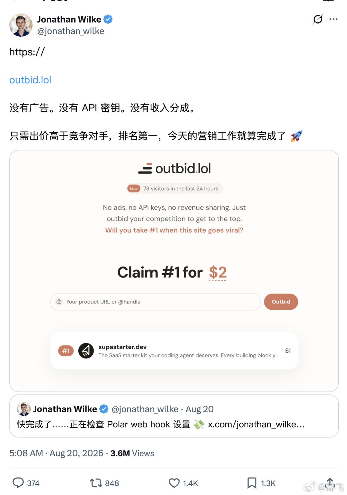
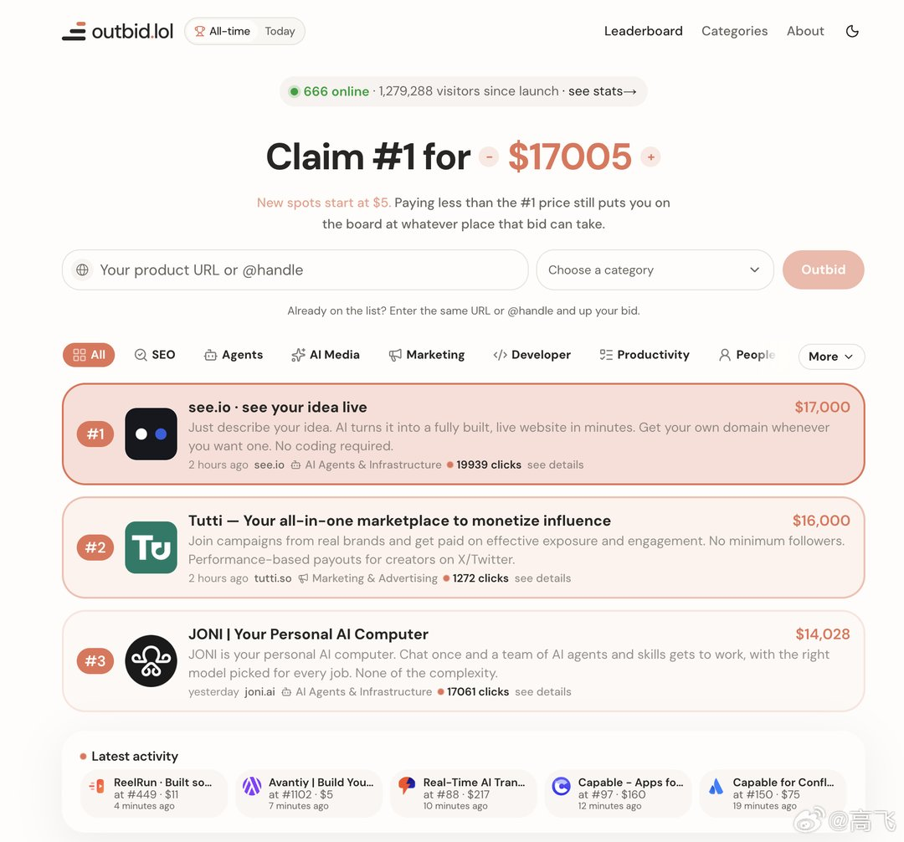
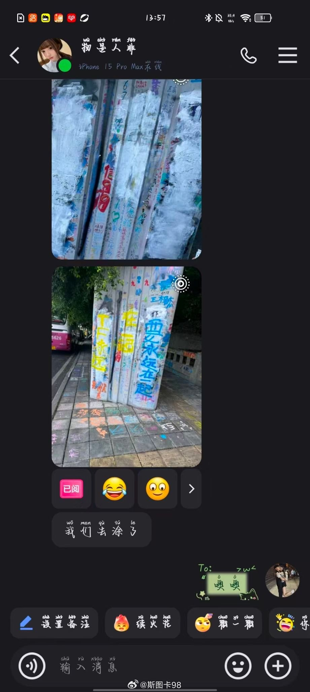
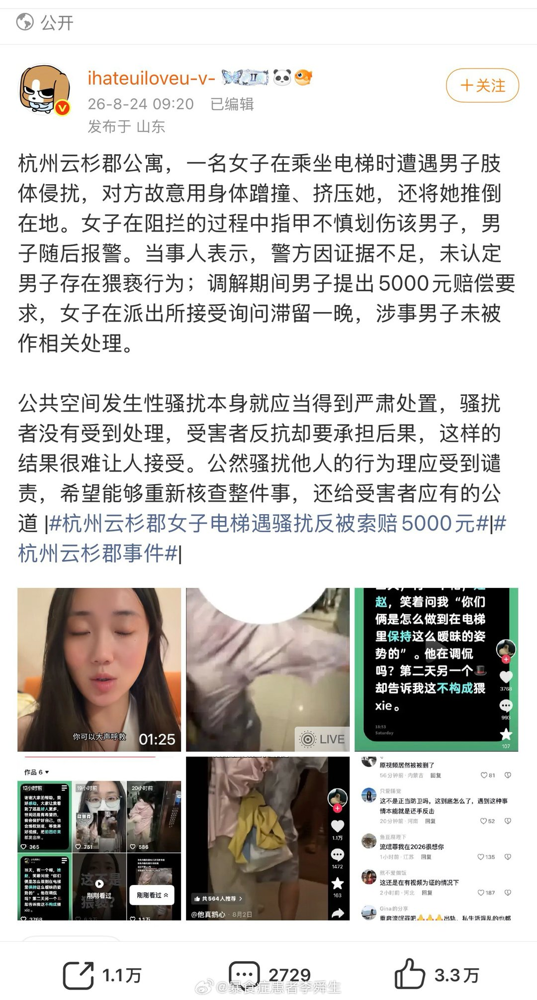
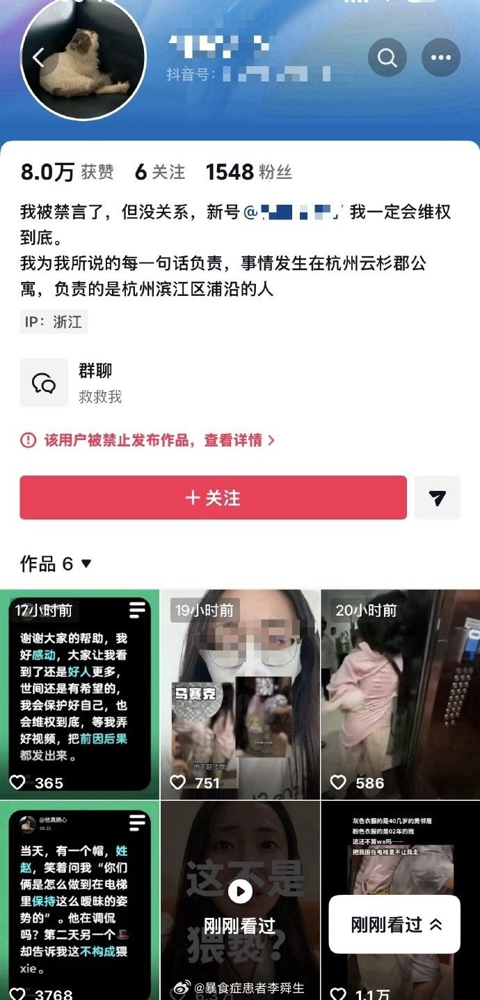
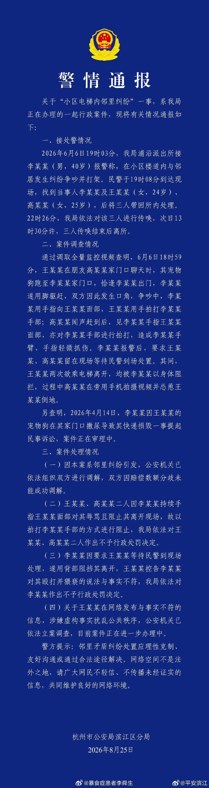
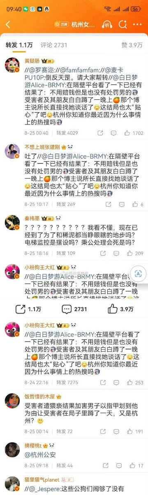
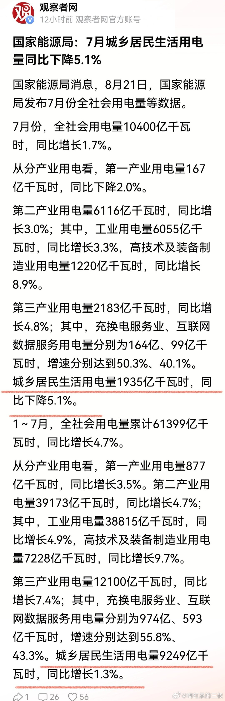
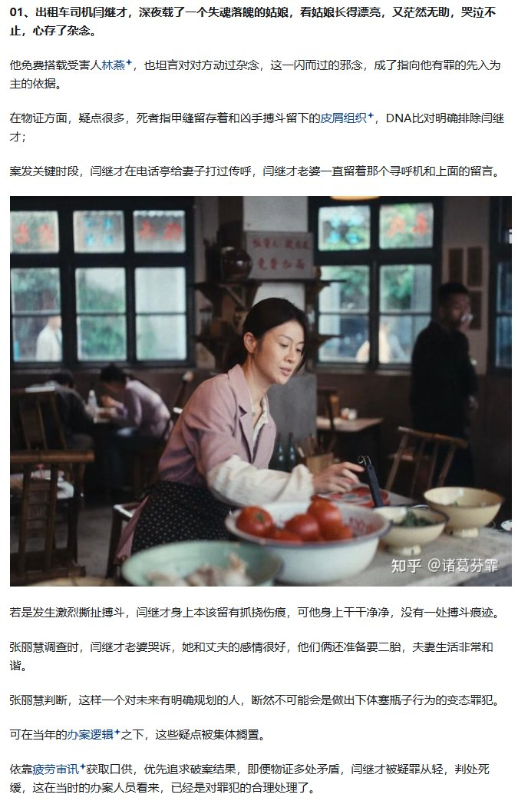
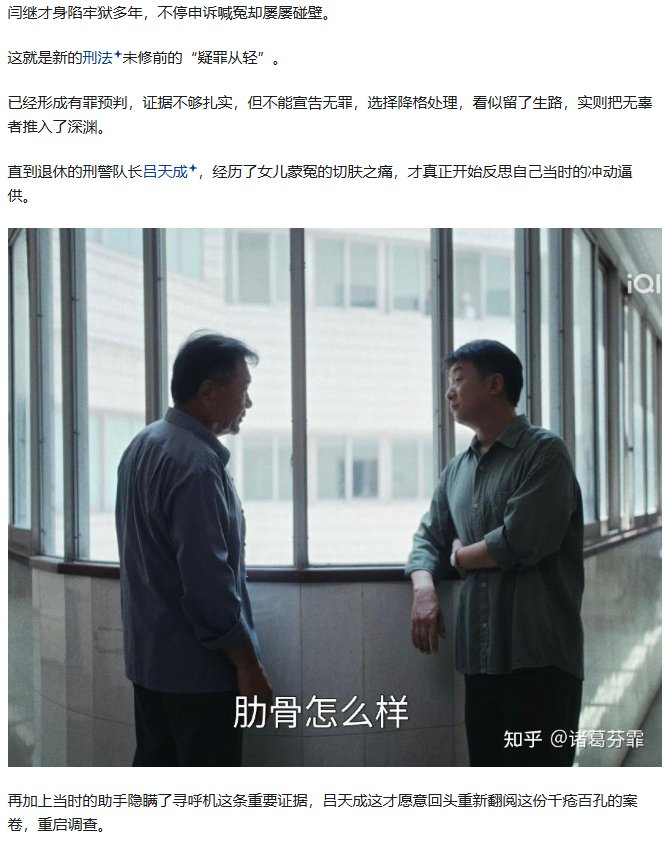

# 2026-08-26

## 1

@wqmkly

发表于：2026-08-24 17:33

来源：微博

链接：https://mapp.api.weibo.cn/fx/679fbbbe1a023a8e542f897c8a8abe8a.html

有人赞扬牛来的画面特别有大师风范，当然他可能开玩笑也可能真的察觉到了一些东西，但是没有敢展开说，因为导演干的室内装修，这个专业，本身就和现代艺术有相当程度的关系。

现代艺术从生出来的时候就有一种不易察觉的的属性，就是作为室内装饰品，虽然这个称呼好似很廉价，但是它真的是这样的，因为要放在能够资助的起所谓艺术家买得起这些所谓艺术品的富豪的屋子里，然后就这样一直循环滚动前进，不知道谁是因谁是果。

导演也肯定是学过一些相关内容，他在做画面设计的时候，大概会不自觉的带入一些本专业能和美术挂上勾的东西，只是他的技术不足以支撑他做出来真正合格的致敬各种大师的作品，产出来的东西是一种，认真的劣质，于是有了一种后现代艺术作品对现代艺术解构的荒谬感，而且是浑然天成的荒谬，讲真这个作品如果是个有艺术权力的所谓知名艺术家产出的，可能这个作品真的会因为当代艺术给予艺术家的解释特权得到飞升，然而他只是个普通人的作品，大伙都知道他不具备大艺术家的能力，于是真的从里面找出来美和艺术，只会被当成开玩笑。

---

## 2

@高飞

发表于：2026-08-24 15:23

来源：微博

链接：https://mapp.api.weibo.cn/fx/929555cee819eb0fe82f38814831a869.html

\#模型时代\# 奥特曼：ChatGPT早期疯涨时，OpenAI还在考虑其他五个转型方向

这是刚放出的一期奥特曼（Sam Altman）接受创业传记播客主播 David Senra 的专访。Senra 做了十年创始人研究，读过400多本创业者传记。对话从Shopify CEO Tobi Lütke 的AI实践谈起，延伸到OpenAI的战略取舍、研究管理、AI风险观，以及奥特曼从创业孵化器 Y Combinator、简称YC 的投资人转型创始人的完整思考链条。

奥特曼在播客里讲到一件事。ChatGPT 上线两个月后用户疯涨，但公司内部弥漫着焦虑：没有网络效应、没有记忆功能、没有用户锁定机制，不符合硅谷对可持续产品的任何标准定义。奥特曼列了五六个备选方向准备转型，直到 Peter Thiel 给了一句判断，让他把清单扔掉，全押 ChatGPT。

奥特曼的播客，我一般不会第一时间整理，不过看X上一直刷屏，仔细捋了一下，这次确实信息量蛮高的。他谈创业，还是比谈AI更加拿手。

一、技术到位了，人还没准备好

1、Tobi Lütke 领先其他CEO至少半年

奥特曼说他接触过的CEO里，Shopify的 Tobi Lütke 是对AI理解最深、动作最快的一个。Lütke 自己写代码、亲自试模型、给 OpenAI 发极其详细的产品反馈。在别人还在观望的时候，他已经明确表态 Shopify 不做那种被动等待技术发展的旁观者公司，必须自己构建AI智能体，否则“完蛋了”。2025年4月，Lütke 发了那封引起轩然大波的内部信，要求员工在申请增加人手前先证明AI做不了这件事。奥特曼的评价是：当时所有人觉得这封信荒谬，但他每一次都是对的，而且每次都领先6到8个月。

Lütke 对 OpenAI 的独特价值在于他同时是大公司 CEO 和极端精确的技术测试者，这个交叉身份几乎没有第二人。

2、奥特曼承认自己也被旧习惯困住了

他说自己20年来用电脑的方式几乎没变。明明有了 Codex 这种工具，应该彻底改变日常工作方式，但他还是在手动滚邮件、从一个消息应用复制粘贴到另一个、维护待办清单。他知道有更好的方法，甚至正在亲手造这个更好的方法，但就是改不过来。

“I must like secretly like it or feel good about it。”他找不到其他解释，只能承认自己内心深处可能就是觉得这么做才算“在工作”。

他没有把问题归结为工具不够好，而是指向了一种更深层的心理编码：人把重复性操作等同于生产力本身。

3、当前阶段像iPhone之前的智能手机

奥特曼把2026年的AI体验比作2003年的 Palm Treo。硬件技术大部分到位了，但缺少像 iPhone 那样彻底改变人机交互方式的产品设计。他认为现在的问题主要是产品层面的失败，所有技术组件都已齐备，但还没有人把它们组合成一个让普通人觉得“理所当然就该这么用”的东西。

4、经济惯性比所有人预想的都强

他原本以为 GPT-4 在2023年发布后，软件行业会很快出现大面积洗牌。事实证明他在速度判断上错了。人们继续从同样的公司购买，继续用同样的方式使用工具。他现在觉得这种惯性其实是好事，会让整个转型更平稳，但也意味着所有人对时间表的预估都太激进了。

Shopify 的 Lütke 说2026年是“所有生意都可以被重新争夺的一年”。奥特曼说他理解这种精神，但在时间线上持不同意见，他认为还需要更长。

二、幂律思维与非共识人才

2015年 OpenAI 成立时，全世界认真在做通用人工智能的机构屈指可数，DeepMind 是其中之一。奥特曼和团队因为公开宣称这个目标，被行业里的“思想巨人”批评了一轮，后来把重心放在大语言模型上时又被批了一轮。“非共识”到什么程度？奥特曼大一暑假在学校AI实验室工作，一位教授告诉他可以尝试各种方向，但有一个方向绝对不要碰，就是深度学习，“那是最保证你职业生涯悲惨的方向”。他当时信了。

1、研究回报服从幂律分布，和创业投资一模一样

在投资领域，最好的一笔投资的回报超过其他所有投资之和，第二好的超过剩余所有之和。AI研究也是如此。大多数方向不会产出什么，少数方向产出了所有价值。理解这一点需要“重新编程大脑”，因为人天生不擅长用幂律思维做判断。

2、真正的非共识 vs。 表面差异化

奥特曼说他在 YC 看创始人时，最明确的分界线是：这个人是真的想法不一样，还是听了太多 Peter Thiel 的演讲后学会了伪装成“不一样”？

后者的典型特征是：想法和其他一千个创始人本质相同，只是加了一层极薄的差异化包装，试图说服投资人也说服自己，认为自己在做完全不同的事。前者的特征是：确实有可能错，但如果对了，回报会极大。

同一年有几千个创始人在做图片分享应用，却只有极少数人在做AGI。这个对比本身就是判断标准。

3、研究者和创始人的共同特质：非标准

能做出突破性研究的人和能造出伟大公司的人有相似的底色。奥特曼用了一个词来概括这种人：non-standard。他们不会去追最近刚成功的方向，而是对一个新想法抱有高度信念，即便这个想法目前看起来不太靠谱。

他说 OpenAI 过去是、现在仍然是这类研究者的最佳去处。

三、逆向路径：投资人转创始人，猩猩理论与三类思考伙伴

奥特曼的职业路径是先做投资、后做创始人，和硅谷的常见方向（创业、退出、投资）正好相反。他认为这条反向路线给了他独特的优势。

1、Charlie Munger 的“猩猩理论”和奥特曼的三类思考伙伴

奥特曼引用了 Charlie Munger 的一个说法：一个聪明人坐下来跟一只猩猩倾诉所有问题，猩猩什么都不说也不做，人起身离开后反而状态更好了。仅仅是被迫把想法组织成语言就有价值。Munger 多年来就是替 Buffett 扮演这个角色的人，只不过他远比猩猩有用。

被问到谁在帮他扮演这个角色时，奥特曼分了三层。第一层是 OpenAI 内部从最早期一路走过来的研究者，他们之间形成了一套外人无法复制的共同语言和直觉。第二层是 Paul Graham 和 Peter Thiel，专门用于“所有显而易见的选项都不对”的非常规难题。第三层是研究本身：他把管理研究项目类比为做创业投资，是他做过的最接近投资的事。

2、投资人积累的是“关键时刻数据库”

自己经营公司，遇到过的重大决策数量有限。但做投资时，几乎整天都在目睹各种公司的关键转折点：高风险战略调整、混乱的高管解雇、至关重要的方向选择。虽然投资人拿不到日常运营的练习量，但在重大决策点上见过的样本量远超任何单一创始人。

运营 OpenAI 时，这些数据点会在脑海中浮现。“这家公司遇到过类似情况”，“那个创始人在这里犯了错”，“另一个创始人在这里做对了”。

2、Peter Thiel 的简单天才：ChatGPT 就是下一个Google搜索框

ChatGPT 上线两个月后，内部很多人担心增长不可持续。用户出于新鲜感在用，但没有网络效应、没有记忆功能、没有锁定机制，不符合当时硅谷对好产品的任何标准定义。奥特曼拿了一份列出五六个备选方向的清单去找 Thiel。

Thiel 的判断只有一个：这些备选都是错的。ChatGPT 在增长，增长本身就是稀缺的、有价值的。它的力量就是 the power of the Google text box，一个空白文本框，输入任何东西，都能得到有用的结果。所有人追了20年 Google 的商业模式，现在终于出现了第一个真正的替代品，你为什么要去做别的事情？

奥特曼听完决定全力押注 ChatGPT。事后验证这个判断完全正确。

3、Paul Graham 的心智模型已经完整到不需要打电话

奥特曼说他有些时候完全能预测 Paul Graham 会说什么，某些场景下甚至不需要真的去问。ChatGPT 发布前是否应该上线？他知道 Graham 会说“上线”，因为“在你觉得产品还让人尴尬的时候就发布出去”是 Graham 最核心的信条之一。

但在许多非标准问题上，Thiel 和 Graham 仍然能给出完全出乎意料的回答。奥特曼说他评价一个思考伙伴的标准是“你最难预测他下一句会说什么”，这和大语言模型的工作原理刚好形成一个有趣的对照，大语言模型做的恰恰是预测下一个词。

四、平台战略与砍掉好主意

1、OpenAI 应该是一家平台公司，不是产品公司

奥特曼明确说 OpenAI 不应该去抢客户的生意，不应该试图“吞噬整个经济”。正确的定位是提供两样东西：一个直接使用AI的界面（从聊天机器人起步，现在加入了编码智能体，未来会成为更持久的智能体），以及一个API让人们用AI构建任何他们想要的东西。这两个东西最终会越来越融合。

目标是让一亿家新企业和80亿人在上面做各种各样的事。

2、砍Sora、砍Atlas，把算力和人才集中到最重要的事上

2026年，OpenAI 关停了 Sora 视频生成产品（日成本约100万美元，用户不到50万）和 Atlas 浏览器。两个都是好产品，但在算力有限、人才有限、资源有限的前提下，它们不是最重要的。最重要的是通用智能：为知识工作和科学发现提供最强的AI。

上游的一切，自研芯片、建数据中心、写基础设施软件、训练模型，都服务于这个目标。奥特曼说这个算力扩张计划正在迅速成为人类历史上最昂贵的基础设施项目。

3、砍好主意可能是创业者最难学会的事

奥特曼说他知道自己在这件事上做得不好，所有创业者都做得不好。选择创业的人性格上似乎就特别不擅长放弃好想法。但这恰恰是最关键的能力，为了伟大的方向牺牲好的方向。

五、AI的两大风险与安全哲学

1、失控和权力集中是两个相互矛盾的风险

奥特曼最担心的两件事：一是AI变得太强大，人类无法保证控制权；二是权力过度集中在少数公司、模型或个人手中。这两个风险都本质上是反人类的，因为正确的方向是让人深度掌控未来、让人拥有更大的能力。

他批评AI行业中一种隐含的“推销话术”：我们会给世界一个治愈所有疾病的方案，让物质变得廉价，作为交换，人们放弃自主权、放弃对未来的影响力、接受极端不平等。少数人拥有巨量财富和权力，其他人得到“还不错的一切”。

“这是一个极其反人类的推销。”

2、安全进步超出了所有人的预期

OpenAI 成立时，行业的主流预测有两个：十年内不可能造出接近AGI的东西；就算造出来了，也不可能让它安全。到2026年，这两个预测都被证伪了。近10亿人每周使用 ChatGPT，处理敏感和重要的事务，产品在不到4年内达到了“被广泛认为安全”的水平。

奥特曼说这靠的是迭代部署，和象牙塔式的封闭研究相反。把模型放到真实世界、从真实用户那里获得反馈、看到哪里出了问题、做清晰的事后分析、分享教训。这和做好产品的方法一样，也和 YC 教创业者做产品的方法一样。

他用了一个类比：美国联邦航空管理局让飞行变得极其安全，靠的不是不让飞机起飞，而是极端严格的事故报告和分析系统，从每一次问题中尽可能多地提取信息。

3、更难的阶段在前面

当前最聪明的人和最聪明的模型处于大致相当的水平，这个关系即将翻转。模型在一条极陡的上升曲线上，未知的未知从绝对量上会变得更多。未来需要在“什么时候暂停开发”和“什么时候让模型接触现实”之间做出更多艰难判断。

六、人的价值会升高，小企业会爆发

1、关于人的事情，AI时代反而更值钱

奥特曼认为即便有了超级智能，世界整体不会有那么大的不同。人类在根本层面仍然被编程为关心其他人、想和其他人在一起、和其他人互动。会有一小群人只想和模型交流、觉得人类是障碍，但这是人类中极小的比例。

有些生意天然反AI，AI越强，那些和AI无关的体验反而越难被竞争，因为人们会更渴望真实的、非技术性的体验。

2、我们即将看到历史上最大的小企业创业潮

创办小企业一直需要相当多的特权、运气和资源。AI正在降低这个门槛。奥特曼说这些迹象已经出现了，但AI行业（包括 OpenAI 自己）既没有充分讨论这件事，也没有为此构建足够的产品。

3、AI行业在沟通上的失败可能是所有新兴行业中最严重的

行业中的人要么在说“25%的概率毁灭世界但我们还要继续”，要么在说“50%的工作一年内消失”，几乎没有人在认真解释这项技术的好处以及如何减轻坏处。更关键的是，几乎没人在讨论为什么人拥有更多权力和自主权是重要的。

奥特曼提到 Intel 早年的做法：Bob Noyce、Andy Grove 和 Gordon Moore 三个人意识到微处理器会吓到潜在客户，于是停下手头的工作，全力出去做教育。他们开的课比当地社区大学的课程表还多。

“为什么AI行业没人在做这件事？”

七、上下文将超过智能成为关键瓶颈

如果AI行业需要向公众解释一件事，奥特曼觉得应该是这件：模型的智能已经到了够用的水平，下一个跃升来自上下文。

1、模型已经够聪明了，缺的是对用户的了解

奥特曼说他现在感到被限制的地方是AI拥有的关于他个人的有用上下文太少，模型的智能水平反而不是瓶颈。他希望AI能知道尽可能多的信息来帮助他：内部 Slack 上的讨论、客户反馈、研究论文。这些东西他不可能全部读完，但AI可以。

2、没有任何人能在几秒钟内读完数万页内容并准确使用

这是AI可以做而人类无论多聪明都做不到的事。奥特曼认为我们正处于一个临界点的边缘：一种全新的AI工作方式即将出现，核心能力是AI能处理人类在物理上无法处理的信息量，并在关键决策时提供基于这些信息的建议。聪明程度不是这里的重点，信息吞吐量才是。

David Senra 举了自己的例子：他自2018年起积累了所有读书笔记和播客文字稿，用AI工具搜索。做 Claude Shannon 那期节目时，他问这个工具“Bob Noyce 对这件事怎么说？”“Rockefeller 是怎么处理这件事的？”他读过这些书、做过笔记，但因为是七年前的事已经记不清了。AI把这些上下文即时调出来，让每一期节目的质量都提升了。

八、没有客户的4年半：OpenAI如何在荒野中找到方向

OpenAI 从2015年底成立到2020年中上线第一个产品，中间有整整4年半没有任何客户反馈，这和 YC 教的所有创业方法论正好相反。

1、第一天没有人知道该做什么

2016年1月，大约12个人走进 Greg Brockman 的公寓。每个人都很兴奋，像开学第一天。然后大家互相看了看，意识到一个问题：我们到底要做什么？

有人说应该先找块白板。白板来了之后，大家又互相看了看。还是不知道做什么。最后决定先写几篇论文，想几个研究方向。

“那是我人生中‘我完全不知道自己在干什么’的巅峰时刻之一。”

2、用排行榜替代客户反馈

在 Dota 2 强化学习项目期间，团队做了一个排行榜，让所有人能客观看到不同想法的表现排名。这个简单的机制部分替代了“客户是否喜欢产品”这个信号。他们还发现，邀请研究者真正尊敬的外部专家来看演示，能产生类似客户验证的激励效果。相反，假截止日期完全不管用。

3、从成功中学到的比从失败中学到的有用得多

奥特曼说这个观点可能和主流认知不同。他从失败中学到的东西要么太泛（关于坚持、毅力的通用教训），要么因果关系很难理清，因为不成功的原因太多了。但从成功中学到的东西是具体的、可迁移的：YC 哪些做法真正起了作用，OpenAI 哪些决策真正产生了效果。

他说他应该更多地运用成功的经验，因为那些教训更精确也更实用。失败的教训有时反而会干扰正确的判断。

4、YC 的影响不是操作手册，而是一套哲学

迭代部署、技术创始人掌权、愿意押注年轻但缺乏经验的人才、不完美也要发布。这些原则塑造了整个创业生态系统。奥特曼认为如果没有 YC 改变了硅谷的创业生态，包括资本如何流向创始人、年轻技术创始人如何获得融资机会、什么样的项目可以获得支持，OpenAI 本身可能无法成立。

他还提到一个观察：在他所有的 YC 数据中，创始人能否快速迭代这一项和最终成功的相关性极高，高到让他自己都感到惊讶。

---

## 3

@信号与噪声

发表于：2026-08-24 11:13

来源：微博

链接：https://mapp.api.weibo.cn/fx/f07273dd66a09fe94290f39a4487c468.html

人 60 岁退休还是很有道理的

60 岁之后，人的认知、身体机能都会急剧退化，这个在职业市场上就体现的非常明显

比如，老板或者董事会招职业经理人的时候，几乎没有人会招 60 岁以上的管理者

从股市投资的角度进行理解，经常有一个反向思维的心理实验：

当你持有的时候，因为禀赋效应等各种原因，你可能不舍得卖（不舍得退位让贤给新股）；

所以，这时候就要假设，如果你现在不持有这个股票，你是否还愿意买这个股票？

结果就是老板或董事会等职业市场，没有人会买入/聘请一个 60 岁的股票。

之所以很多企业的老板或创始人60、70、80 岁了，还待在位子上，主要原因并不是他们能力仍然很强，而是因为他们自己是老板，他们自己掌握权力，他们可以不下去

可以看看现在一些伟大企业的创始人，都是多大年纪创造企业的？几乎都是 20 、30 、40 多岁……60 岁以后才创造一个伟大企业的，几乎无限接近于 0

即使天才如巴菲特，60 岁以后的投资业绩其实也很一般般了——如果去掉 1.7 倍的杠杆，甚至都跑不赢标普 500 ETF

---

## 4

@高飞

发表于：2026-08-24 10:50

来源：微博

链接：https://mapp.api.weibo.cn/fx/39d620c0e34716c562ac328674e9a0e2.html

\#模型时代\# 这两天X上最火的AI项目不是模型，而是一个排名网站，叫outbid.lol 。

这是一个德国独立开发者 Jonathan Wilke 在 2026 年 8 月 19 日晚用大约 3 小时快速做出来的一个超简单的副业项目。本质上这就是一个公开的“付费竞价排行榜”：任何人都可以给自己的产品、网站出价，出价越高排名越靠前，最高价者占据 \#1 位置获得最大曝光。

就是这么一个纯粹靠“出钱就能排前面”的创意，却获取了泼天流量和关注。截至 8 月 22 日（上线约 3 天），创建者公开表示项目已产生 13.2 万美元 收入，同时吸引了超过 114 万访客、添加了 867 个产品，并产生了 19 万多次产品链接点击。目前排行榜最高出价已升至 1.7 万美元左右，项目仍在持续增长。

暴露年龄的朋友，一定会想到百万美元格子吧，但是这哥们其实根本没听说，是他自己原创想出来的。某种程度，这也是一个牛来吧，快速版牛来。

---

## 5

@刘新征

发表于：2026-08-22 10:14

来源：微博

链接：https://mapp.api.weibo.cn/fx/bd61e1a26ef1e87aa483015987b41162.html

昨天在B 站看了一个故事，久久不能忘怀，讲的是一个晚明时期普通人的普通一生，虽然间隔四五百年，但听完之后也不会觉得有什么反差。

是有明清时代交替的大背景，但这种背景对普通人，只是一个模糊的幕布，与他的一生也没什么关系。

叶绍袁，一个普通官员后代，还被到爹托举的年纪，爹就挂了，留下一些田地，然后该结婚时结婚，该生子时生子，按部就班考公，屡靠不中，不中再考，也没别的门路。

妻子沈宜修是书香门第，嫁妆也带了不少，会写诗，能管家，但也变不出钱来，不行就典当嫁妆卖地凑盘缠，直到三十多岁叶绍袁才考公上岸。

人生最愉快的时光就在这期间，和同学少年游，寻同学不见，只能自己去虎丘，逛到一半忽然发现同学也在，结伴夜游虎丘，明月当空，不知不觉中，这成了一生最难忘的晚上。

考公上岸后，发现其实不会做官，并非不会干活，是多少搞不清楚官场里的弯弯绕，有理想，但不多，有勇气，也不多，可以受气，但也不是很能受，不排斥搞关系，但也不是很会搞。

最后想来想去，还是回家吧，家里还有地。

从第一次考公到考公上岸用了十六七年，上岸后工作了六七年就觉得自己糊弄不了这些事儿，四十出头就退休回家了。

结果，最喜欢的女儿在出嫁前几天去世了，前来吊唁的女儿悲苦生病也去世了，然后母亲也去世了，最后妻子沈宜修也去世了。

然后又听到了当年夜游虎丘的朋友去世的消息。

他开始意识到，人生美好的部分，他都经历完了，以后不会再有了，接下来就是一个又一个再见罢了。

原来老婆管家，很多事儿他不用管，但现在不得已要自己上手，尤显得笨拙，只能卖地活下去。

有一天晚上他推开亡妻曾住的房间，床上只有床板了，一层灰，他把灰给拂掉，然后自己躺了上去，窗外明月照进来，当年种的梅树开花了，香味飘进来，他蜷缩在床上，衣角微抖，他哭了。

然后朝代交替，剃发令来了，他想反抗，但不敢，可以跟别人一样接受安排，但不想。想一下，这世界美好的部分已经都不存在了，也没什么可留恋的，也出家了罢。

整理整理妻女留下的文章诗集，整理整理自己这一生，快整理完了。

他也死了。

就是普普通通一个人（是普通人，非底层，毕竟没有底层可以一直卖地续命），对其他人来说，毫无价值的一生。

为什么他能被人记住，是因为他真正的身份更像是一个不会变现的自媒体作者，他喜欢到处游历，喜欢记录那些没有主流价值的草野之事，也喜欢写日记，有点像是今天一个旅游区美食区的UP主，以及以及一个记录日常和情绪的Vlog博主。

不过也幸好没有变现手段，也不用迎合流量，努力做垂直号，才留下了这么一个让我们现代人也可以共情的普通人形象。

晚明微观史：明亡前夕， 一个进士的回忆录｜叶天寥自撰年谱

---

## 6

@海河上的金汤桥

发表于：2026-08-23 09:29

来源：微博

链接：https://mapp.api.weibo.cn/fx/815108f95b5aa52320633d9063501236.html

康保“甲醛白菜”生物学机理分析

 

事件事实：白菜收割后，只把根部切面快速蘸一下兽用福尔马林（37%甲醛水溶液），立刻装车运输，目的抑制根部切口腐烂发黑，保鲜2‑3天长途外运。

网上争论点：渔老师观点：不会快速扩散整颗白菜，切掉根部就基本解决；另一派认为会顺着维管束渗透到全部菜叶。下面从植物生理、分子扩散、运输现实分层解析。

 

一、生物学：甲醛会不会快速扩散到整颗白菜？

 

1. 白菜此时是采收后的离体植株，根系已经被切掉，没有主动吸水蒸腾拉力

活的白菜在地里：靠叶片蒸腾，产生负压，把根部溶液顺着维管束向上泵到叶片。

收割之后，根全部砍掉，只剩下根部切面，没有蒸腾拉力驱动液体向上输送，不存在主动的“泵吸运输”，没有动力把甲醛溶液一路抽到菜心、外层菜叶。

 

这是最关键一点：不是活植株吸水，只是分子被动扩散+切面局部渗透。

 

2. 甲醛分子可以局部渗透，但扩散速度很慢，距离有限

 

- 高浓度甲醛接触切面，会向紧邻的几层菜帮短距离渗透（根部往上1‑3厘米），使根部细胞蛋白变性，实现防腐，这就是它能保鲜的原理。

- 但是没有动力驱动，单纯分子扩散，几天之内很难到达白菜内层菜心、上部叶片。现实证据就是：蘸甲醛的白菜，根部防腐、外层看着完好，但内部菜帮依旧会腐烂；如果甲醛能快速布满整棵，内部就不会烂，这是市场上甲醛白菜真实现象。

- 所以渔老师说法有合理部分：绝大部分高浓度甲醛停留在根部切面以及紧邻几层菜帮，不会几小时就“传遍整颗白菜”。

 

⚠️但不等于切掉根部就万事大吉，有两个不能忽略的风险：

1）蘸取操作的时候，福尔马林液体会飞溅、沾染外层2‑3片菜叶的表面，是表面附着残留，不是内部扩散进去的，这部分切根是去不掉的；

2）依然会有少量甲醛，短距离渗透进根部往上少量菜帮组织，不是全部停留在切面上。

 

二、饭店餐饮端最大风险：只简单切根，不充分清洗

 

家庭处理：切掉根部1‑2cm，剥掉外层2‑3片，掰开逐片流水冲洗、浸泡，高温炒熟，甲醛易溶于水、高温易挥发，风险可以大幅下降。

 

饭店后厨常见操作痛点，也是最大隐患：

很多餐馆处理大白菜，只切掉底部菜根一大刀，不剥开叶片，不浸泡，简单冲两下，直接切丝、凉拌、快炒。

 

1. 外层菜叶表面溅上的甲醛残留，没有被充分洗掉；

2. 根部往上少量渗透的菜帮，没有被剥除；

3. 做凉拌白菜、快炒，加热时间很短，甲醛挥发不充分。

 

也就是说：风险不完全来自“渗透进菜心”，更多来自菜叶表面附着，以及餐饮端清洗不到位。

 

三、澄清两个网络极端误区

 

误区1：蘸一下，几小时甲醛就均匀布满整颗白菜，菜心全部浸透

 

❌不符合离体植物扩散物理规律，收割后无蒸腾拉力，远距离快速传遍整颗不成立。

 

误区2：只把根部切掉，就完全安全，随便洗洗就能吃

 

❌错误。飞溅沾在外层菜叶的表面残留，切根完全处理不到；根部往上几层菜帮已经有局部渗透，必须同步剥除外层叶片，再浸泡冲洗，不能只切根完事。

 

四、法律定性：无论扩散远近，人为添加甲醛属于明确违法

 

不管残留主要在根部还是外层菜叶，甲醛严禁作为蔬菜保鲜剂，《农产品质量安全法》明确禁止，属于使用非食用物质加工农产品，涉事收购商已经被公安控制 。

 

区分：白菜自身代谢产生极微量内源性甲醛，含量极低，和人为高浓度福尔马林蘸根完全两码事。

 

五、现实处理建议（家庭）

 

1. 买菜：根部异常惨白、闻根部有消毒水/刺鼻辣眼气味，直接不要买；

2. 处理：切掉根部≥1‑2厘米，剥掉外层2‑3张叶片；叶片全部掰开；流水冲洗；清水浸泡10‑15分钟；尽量不要凉拌生吃，充分加热烹饪；焯水可以进一步去除甲醛残留。

 

简短总结

 

1. 收割后的白菜没有蒸腾拉力，甲醛不会靠维管束快速扩散渗透到整颗白菜、直达菜心，渔老师这个判断生物学上成立；高浓度主要集中在根部切面及紧邻少量菜帮。

2. 但是蘸取时会有液体飞溅附着在外层菜叶表面，切根无法去除这部分残留，这是容易被忽略的风险点。

3. 最大现实风险在餐饮端：只切根，不剥叶、不浸泡清洗，简单快炒或者凉拌，表面残留无法去除。

4. 即便扩散有限，人为使用福尔马林处理蔬菜是违法行为，不能因为“主要在根部”就合理化该操作。@老张评论 @渔老板钓鱼 @郭嘉宁

---

## 7

@汪海林

发表于：2026-08-23 03:21

来源：微博

链接：https://mapp.api.weibo.cn/fx/d0da88b34c73f0f3ebd981f890e706c8.html

我不让公司的年轻编剧在剧本里写“某某狞笑着……”，因为这是标签化的表达，把反派写在脸上，唯恐大家不知道他是反派，甚至角色自己也觉得自己是反派。当然，生活中确实有人会狞笑，如果说完灵活就业是福利以后，专家笑一下，那肯定是狞笑。

---

## 8

@斯图卡98

发表于：2026-08-23 00:08

来源：微博

链接：https://mapp.api.weibo.cn/fx/bfc39a0d79a6cc28d622dda34c5827ea.html

这两天不少男孩开始主动清理时代峰峻周边街道、建筑上的涂鸦

又被部分饭圈重新写满文字和图案。

---

## 9

@暴食症患者李舜生

发表于：2026-08-25 15:32

来源：微博

链接：https://mapp.api.weibo.cn/fx/77b2a0b4b12f2b96311db643e6558074.html

通报简而言之：女方散养狗，曾在男方门口撒尿污染快递。狗再次来到男方门口被男方用脚驱赶，引发双方冲突。女方二人抓伤男方，男方报警后，女方想电梯走被男方用身体拦住，过程中还有怂恿假摔环节。

女方在派出所调解不成后出来就是性骚扰小作文，可惜这次她遇上正规公安局了，现在涉嫌虚构事实扰乱公共秩序被立案调查。\#杭州警方通报女子称在电梯遭骚扰\#

---

## 10

@李楠或kkk

发表于：2026-08-25 16:13

来源：微博

链接：https://mapp.api.weibo.cn/fx/fb9ebcf6680e13620e213ae4dc89ff33.html

消耗了大量 kimi k3 token， 我突然意识到人的本质意义是在信息不完整算法不完备的情况下 simulation 未来并且行动。

勇气，责任，品味，创造等等品质，都是在上下文不足情况下的持续冒险。

赌注大小根本无所谓，归根结底，做到了可持续性冒险的人，就是幸福的。 

持续迭代是你能活着的银弹。 

而不确定性就是你还活着的试金石。

---

## 11

@伊利达雷之怒

发表于：2026-08-25 18:02

来源：微博

链接：https://mapp.api.weibo.cn/fx/79d6afad9999fdb0bbcebee1414e65e9.html

其实杭州那事还有个细节，事件发生于6月6日，女方却耐心地等了两个半月才出来发小作文，并且第一时间获得这么多大V的响应。估计她和这些大V都以为电梯监控已经被覆盖掉了......

幸亏硬盘容量有点大，不然男方岂不是遭重了。

而且男方在4月14日就对女方提起了诉讼，理由是女方的狗撒尿污损了男方的快递，显然，她拒绝赔偿。一个低素质养狗者，惯犯，处心积虑试图报复。

而且女方的闺蜜也不是啥好鸟，视频是她拍的，并且建议女方倒下，讹人......

另外希望查一查女方的社交账号，怀疑今天突然这么多大号响应，是有人组织策划。

---

## 12

@梅新育

发表于：2026-08-25 15:47

来源：微博

链接：https://mapp.api.weibo.cn/fx/c7025a71ab92a771a3dda6b5c2514bec.html

她力量 之 \#德芙文案趁男友不在跟暧昧者要巧克力\# 与 \#德芙文案 翻车\#

【从母亲节“我妈有两个老公”到七夕“趁男友不在跟暧昧者要巧克力”】

5月8日，“我妈有两个老公”母亲节广告文案出笼；

8月23日，德芙官方旗舰店七夕短视频文案被爆出：

“跟男朋友要了很久的德芙七彩礼盒也没给我买，今天趁男朋友不在跟暧昧对象分享了，驾车2小时送了过来，很甜。”

……

——诸如此类广告文案层出不穷，覆盖面从食品到数码产品，莫非“中国女人不可靠”已成国内社会广泛共识？

“我妈有两个老公”母亲节广告文案在江湖之上打响了“野爹机”名号，“趁男友不在跟暧昧者要巧克力”是否会把“绿帽巧克力”称呼焊死在德芙头上？

“DOVE = Do You Love Me”，在今日中国，居然刷新出了这样的含义。

看了 @中新经纬 以消费者身份咨询德芙涉事旗舰店客服收到的答复：

“宝子别被剧情带偏啦，这款礼盒也更适合送给确定关系的心上人，把甜蜜留给对的人”

“非常抱歉让您有不好的感受～视频内容为个人创作，不代表品牌立场。德芙一直相信真挚专一的爱情才是最美好的，也感谢您的监督，我们会持续关注内容质量。”

这种德芙式致歉效果我看是反作用。

\#德芙致歉\#

---

## 13

@喝红茶的三叔

发表于：2026-08-21 15:32

来源：微博

链接：https://mapp.api.weibo.cn/fx/2d40c590e93121768fe960656df3ad93.html

这次数据公布很详细了。城乡居民用电增长乏力。充换电总量不大，增长较快。

---

## 14

@刘晓光Savvy

发表于：2026-08-25 14:39

来源：微博

链接：https://mapp.api.weibo.cn/fx/5386de469ed252cbef46f275986db0d7.html

发了一些热点事件的点评，很多人让我注意号，让我小心，让我这那的。

这些评论没什么意义。

政治领域有一个基本常识：

如果一项措施可以理解为蠢，

那么就不要理解为坏。

国家，组织，社会的运转大概率不是大家所想的那样，精密的，完善的运转的。

而是只要能勉强跑起来，那么就多一事不如少一事。

比如法治这块。

为什么定罪率极其的高？

原因很简单，我定罪率低=推翻之前的判决=得罪了兄弟部门=以后怎么处好关系？

这是因为精心的，残暴的，压迫的统治原则，

还是单纯的为了人际关系老好人相处？

很显然是后者。

再比如这次的湖南做好事反而被起诉，调解后无错依旧赔偿1.9万。

为什么会这样？

因为当地的派出所和稀泥省事呗。

如果不和稀泥，会增加自己的工作量。

你上班想摸鱼，那公务员上班不想增加工作量，也正常。

至于这么做会引起什么样的社会影响，以地方小公务员的智商，他想不到，也不在乎。

再说一个我身边的真实例子。

我家门口的下水道，只要稍微下雨就会淹，路就不好走。

我记事开始30多年，从没改变过。

我姐毕业后回乡工作做公务员，我和她提到这个荒诞现象，她立志要改变，认为小菜一碟，正好也在她的职权范围内，让我等她好消息。

我等了大概2个月，她给我反馈：

亲身体验：举世皆敌。

疏通下水道修个路很简单，但是需要各个部门配合一起，没有人愿意增加工作量，没人搭理你。

单靠你一个人，施工队你都不知道去哪找，根本搞不定。

努力推进，周围同事都如同看到仇敌，躲着走。

除非你能走访附近所有居民，挨家挨户集体签名，然后你给上级单位反馈，造成群体性事件，上级才能来解决。

我说我不干这事，我都不住那了，再说了我做出头鸟，最后事情就算解决了，大概率也是我倒霉，我可不是傻子。

所以最后不了了之，我也彻底搬走了，现在具体什么情况不知道。

周围的居民也不在乎，都表示还行，可以，几十年都这样了，就垫几块砖头呗。

还行，都这样，就垫几块砖头呗，这些人的孩子考上了公务员，也是一个生活态度。

所以这些细节不是什么精心策划的，纯粹就是出于懒和蠢，无能。

说起来做事情很简单，

但是我的亲身经历告诉我，哪怕只是修条路，都非常难。

而且即便你修好了，周围人也不会感激你，甚至你在挨家挨户谈心要求签名时候，他们还是嫌你烦，骂你。

老罗讲过一个真实的故事，说他们小区的暖气有问题，群里大家都在骂，但是真的出门去和物业抗争交涉的，只有寥寥几个人，持续抗争了很久最后才解决，供暖恢复正常了。

这时候群里那些从不抗争，一直都逆来顺受，一直觉得日子还能过的人，突然冒出来一堆，

说感谢物业，还是你们认真负责啊。

老罗说他的心情是「感谢NMGB」。

我忘了原话如何，大致如此。

他现在的身份地位财富状况，不需要住在这样的小区，也不需要和这样的群体为伍了。

大体上，我感受到人生的极度温暖和顺畅舒适，也是在财富收入急剧的提升以后。

所以我在点评热点时候，喜欢拿商君书举例，说什么弱民，疲民，辱民。

其实就是玩梗。

真实的社会情况没那么负责，没那么精密设计。

就是因为懒，还有和稀泥。

---

## 15

@梅新育

发表于：2026-08-25 14:54

来源：微博

链接：https://mapp.api.weibo.cn/fx/1c078b876645518030e4d7a810b1a64e.html

她力量  之 \#幼儿园持续关停幼师被迫失业\# 与 \#幼儿园 倒闭\#

外省客来，晚餐后送回酒店，发现酒店原来是一出知名大型高档双语连锁幼儿园，因儿童持续锐减而关闭，原址改造为酒店，原来的幼师全部失业。

想起幼师、师范专业院校多年来一直是女拳重灾区，盛行反婚反育思潮，现在她们收获自己当年身体力行鼓吹的“成果”，失业堪称功德圆满。

接下来是小学、中学、高校，预祝女拳斗士们前赴后继，功德圆满。

\#幼师失业潮\#

---

## 16

@邪能之槌

发表于：2026-08-22 07:08

来源：微博

链接：https://mapp.api.weibo.cn/fx/f0521c73806190dd47706eb244084c81.html

最近有个热播电视剧《重器》，讲1979年到1997一些著名的冤狱的翻案过程，其中有个案子是“闫继才冤案”，大概剧情是闫继才作为出租司机半夜搭载搭载了一个漂亮姑娘。后来这个姑娘死了，他被当成真凶，大记忆恢复术，判了重刑，后来翻案成功。

这个剧有多离谱呢？

第一，剧中闫继才，深夜搭载女乘客，自己主动坦言对女孩产生过邪念，没有实施任何行为，仅内心想法，却被办案人员当成重要主观嫌疑依据。

而该故事的原型，张氏叔侄案，张辉、张高平用货车顺路搭载同乡少女，不存在对被害人产生邪念的自述，这是编剧新增设定。

现实嫌疑人自始至终没有所谓 “内心杂念” 的口供，剧集把一个完全无辜的蒙冤者，加了一层道德污点式心理描写，相当于给蒙冤者预先安上 “有犯罪动机” 的心理前提。让人觉得 “他会这么想，所以被怀疑也情有可原”。我记得之前争议很大的剧《底线》也有类似手法。

故事的原型，张氏叔侄案，促成冤案的人是女神探聂海芬，帮他们伸冤的关键人物是新疆石河子监狱驻监男检察官张飚。张高平服刑在新疆，张飚看到卷宗疑点，数年持续发函申诉，顶住跨省办案的重重阻力。同时男律师朱明勇无偿介入辩护，加上媒体报道，才撬动再审。

而电视剧则改成男刑警队长吕天才促成该案，由女检察官张丽慧主导复查纠错。

可以说是非常底线2了。

---

## 17

@天玑-无极领域

发表于：2026-08-25 10:42

来源：微博

链接：https://mapp.api.weibo.cn/fx/d797dbe29fa9f06613ac0b26c0e51763.html

从人人喊打，到入孔庙，成圣贤，南宋到底发生了什么？

朱熹理学，为什么突然昌盛，南宋晚期 以及元明清都在推崇？

朱熹生于南宋，见过当时太多不合理的事情（女拳猖獗），于是创造一套经世致用的哲学体系，用来救世，可惜在当时没人理解，反被打压。

朱熹去世9年后获得平反，被追谥为“文”；5年后，其《四书集注》成为官方教科书。到宋理宗时期（1227年），被追封并下诏从祀孔庙，获得了官方认证。

南宋上层的态度为何发生这么大变化？

南宋快死了，要亡国了。

南宋到底发生了什么？

岳飞的妻子刘氏，抛弃婆婆和年幼的儿子，跟别人跑了，听说岳飞成大官了，又跑来闹事，岳飞的原话是“切骨恨之”，但是没办法，还是给了五百贯钱私了，相当于一个中产家庭的全部家产。

沈括《梦溪笔谈》作者，时常被妻子打骂，甚至把沈括的胡须连皮带肉揪下来，儿女们哭着捡起带血的胡须，她也不为所动。她还赶走了沈括前妻的儿子。

宰相薛居正之妻，不让任何婢妾靠近丈夫，导致薛居正没有子嗣，只能收养儿子，绝后了。

尉氏县令陆慎言之妻，她不仅让丈夫畏妻如虎，甚至能干预县政，重要决策都需经她定夺。

胡宗甫的老婆，因看见丈夫对小婢微笑，小婢当晚便吓得自缢身亡，而张氏得知后饮嚼自如，照常吃喝。

桓妒妻：梅尧臣诗中的人物，得知丈夫纳妾，便拿刀前去砍杀。

贾似道之母：其父为小官吏，妻“悍妒”，发现婢女怀孕后百般殴打，临产还想将其杀害。

只是凶悍 ？

李邦献《省心杂言》：晚近以来，妇女服饰，异常宽博，倍费绫缣，豪富之家，不念贫困之苦，悉衣锦绣……” 

百岁寓翁《枫窗小牍》：详细记载了汴京妇女服饰的数次变化。提到“一袜一领，费至千钱”，即使是小件衣物也价格不菲。

王栐《燕翼诒谋录》：卷四记载了宋代妇女冠饰的制度与变迁。“旧制，妇人冠以漆纱为之，而加以饰金银珠翠”，仁宗因“冠之长至三尺”而下诏禁止。禁令之后，“侈靡之风盛行，冠不特白角，又易以鱼枕；梳不特白角，又易以象牙、玳瑁矣”。

周煇《清波杂志》：卷八《垂肩冠》“皇佑初……宫中尚白角冠，人争效之，号内样冠，名曰垂肩、等肩，至有长三尺者，登车檐皆侧首而入”。

陆游《入蜀记》：记载了当时民间女子的发型与头饰：“未嫁者率为同心髻，高二尺，插银钗至六只，后插大象牙梳，如手大。”

吴曾《能改斋漫录》：书中转引《麈史》记载：“妇女上街不是遮住头而是在其头发上插以冠梳，有时候以为妇女会佩戴冠梳达二十把之多。”

吴自牧《梦粱录》：记载南宋临安风俗，提到富家女出嫁时的排场，如“销金盖头”、“金银双胜”等，反映出婚嫁中的奢靡之风。

周密《武林旧事》：描述临安士女“罗绮如云”。

《蓼花洲闲录》：记载王安石之女出嫁时“以锦为帐，未成礼而华侈之声已闻于外”。

《舆服志》：记载了高宗在绍兴五年下诏禁止妇女使用“金翠服饰”，认为其“不惟靡货害物，而侈靡之习实关风化”。

《五行志》：记载了多起民间妇女妆饰的奢靡案例。如“建隆初，蜀孟昶末年，妇女竞治发为高髻，号朝天髻”；“淳化三年，京师里巷妇人竞剪黑光纸团靥，又装缕鱼腮中骨，号鱼媚子以饰面”；“绍兴二十三年，士庶家竞以胎鹿皮制妇人冠”；“绍熙元年，里巷妇人以琉璃为首饰”

....   

从普女 到 富家女，皆好吃懒做，极尽奢侈。

从普女 到 富家女，皆不要逼脸，心狠手辣。

朱熹，就是在这种情况下，肩负使命，对抗女拳，但却遭到大量嘲讽和抵抗，郁郁不得志，直到身死。

朱熹都说了什么？

计划编写一部新的女子教育书籍，拟定的篇目包括“正静、卑弱、孝爱、和睦、勤谨、俭质、宽惠、讲学”。

饿死事小，失节事大。自世俗观之，诚为迂阔，然自知经识礼之君子观之，当有知其不可易也。”。可见他深知此观点在世俗眼中“迂阔”，但仍从“君子”立场坚持其合理性。

如今，女性诈骗彩礼，诬告强奸，贤妻良母 和 贞洁，都是辱女词。

时代正在孕育下一个朱熹。

下一场猎巫不会远了。

